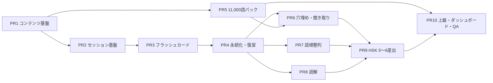

# My Tianjin 実装プラン（PR1〜PR10）

更新日: 2026-07-15

## 結論

PR1〜PR10はすべて実装・検証完了です。公式HSK 3.0の11,000語を7 packへ収録し、HSK 1の300例文、選択・整列・読解・産出・上級トラック、技能別進捗まで一つのアプリとして統合しました。

ステータスの意味:

- **完了**: 対象コード・コンテンツが揃い、個別条件と総合品質ゲートを通過した。

## 全体ロードマップ

| PR | 目的 | 現状 | 主な依存 |
|---|---|---|---|
| PR1 | コンテンツ基盤 | 完了 | なし |
| PR2 | 学習セッション基盤 | 完了 | PR1 |
| PR3 | 単語フラッシュカードUX・TTS | 完了 | PR1, PR2 |
| PR4 | 進捗・セッション永続化と復習 | 完了 | PR2, PR3 |
| PR5 | 公式HSK 1〜9・11,000語パック | 完了 | PR1 |
| PR6 | 単語穴埋め・聞き取り選択 | 完了 | PR1, PR4, PR5 |
| PR7 | 語順整列 | 完了 | PR1, PR4 |
| PR8 | 短文・長文読解 | 完了 | PR1, PR3, PR4 |
| PR9 | HSK 5〜6産出課題 | 完了 | PR6〜PR8 |
| PR10 | HSK 7〜9専用トラック・技能ダッシュボード・総合QA | 完了 | PR1〜PR9 |

## PR1: コンテンツ基盤

**目的**

HSKの改訂に追従しながら、単語・例文・出典を安全に追加できる土台を作ります。

**主な変更**

- HSK 2.0 / 3.0、HSK 1〜6 / 7〜9、技能タグを型として定義。
- manifestとレベル別packに`schemaVersion`、`contentVersion`、出典・ライセンス、期待語数を保持。
- bundleまたは任意ディレクトリからJSONを読む`ContentRepository`を実装。
- パストラバーサル、重複ID、件数、レベル対応、必須項目などを`ContentValidator`で検査。

**受け入れ条件**

- manifest / packのJSON往復が成功する。
- 不正なschema、重複、件数不一致、危険な相対パスを検出できる。
- HSK 2.0と3.0を同じアプリ構造で併存できる。

**現状**: 完了。`ContentModelsTests`でモデルと構造検証をカバーしています。

## PR2: 学習セッション基盤

**目的**

順番・シャッフル・復習・苦手モードを再現可能なセッションとして扱います。

**主な変更**

- seed固定の決定的シャッフルを実装し、問題順と選択肢順をセッション開始時に凍結。
- 「順番」「シャッフル」「今日の復習」「苦手」の4モードを実装。
- 回答履歴、次へ、戻る、完了後に最終問題へ戻る、Codableによる完全復元を実装。
- 正誤に応じて次回復習日を更新する交換可能な`ReviewScheduler`を実装。

**受け入れ条件**

- 同じseedは同じ順番、異なるseedは異なる順番になる。
- 問題・選択肢が重複せず、戻っても回答が保持される。
- 保存・復元後も現在位置、順番、回答履歴が一致する。
- 復習対象と苦手語を進捗値から正しく抽出できる。

**現状**: 完了。`StudySessionEngineTests`と`ReviewSchedulerTests`で検証しています。

## PR3: 単語フラッシュカードUX・TTS

**目的**

日本語話者が片手で反復しやすく、回答後も画面が跳ねない選択式フラッシュカードを提供します。

**主な変更**

- HSKレベル、累積範囲、出題順、10〜100問のセッション長を選択可能にした単語ハブ。
- 中国語を見て日本語を4択する固定レイアウト。回答後は各選択肢に中国語・ピンインを表示。
- 回答領域を押し下げない固定フィードバック、例文表示、詳細、次へ、戻るを実装。
- カード・例文・詳細から直接再生できる中国語TTSを実装。
- 再生速度はボタン操作で0.8× → 1.0× → 1.2×を循環。
- 正解の自動読み上げを設定でON/OFF可能にした。

**受け入れ条件**

- 回答前後で選択肢の高さ・位置が変わらず、フィードバックが選択肢を隠さない。
- 次へ進んだ後に戻って回答内容を確認できる。
- 単語と例文を各画面から再生でき、速度変更が即時反映される。
- 自動読み上げ設定が再起動後も保持される。

**現状**: 完了。シミュレータで回答前後、次へ・戻る、速度変更、詳細、設定を操作確認済みです。

## PR4: SwiftData進捗・セッション永続化・復習モード

**目的**

アプリを閉じても学習を続けられ、正誤履歴から復習対象を作れるようにします。

**主な変更**

- `StudyProgressRecord`に技能別の試行数、正解・不正解、連続正解、復習段階、次回復習日を保存。
- `StudySessionRecord`にセッションの完全なCodableスナップショットを保存。
- セッション再開・完了時削除・手動の「復習に追加」を実装。
- 旧`learnedVocabularyIDs`からの一度限りの移行を実装。

**受け入れ条件**

- 回答後の進捗と次回復習日が保存される。
- 中断後も問題順・回答・現在位置を変えず再開できる。
- 復習追加と旧データ移行が重複レコードを作らない。

**現状**: 完了。`StudyPersistenceTests`で回答、復習追加、セッション往復、移行を検証しています。

## PR5: 公式HSK 1〜9の11,000語パックと検証

**目的**

公式HSK 3.0語彙表に合わせ、初級から上級まで同じ学習体験で利用できる語彙データを提供します。

**主な変更**

- 公式語彙表からレベル別JSONを生成: HSK1 300語、2 200語、3 500語、4 1,000語、5 1,600語、6 1,800語、7〜9 5,600語。
- 既存の厳選100語を優先し、残りはCC-CEDICTを基礎に日本語語義を生成。由来タグを各語に付与。
- HSK1の全300語に中国語・ピンイン・日本語を含む例文を用意。
- 公式index 1〜11,000の連続性、全体ID一意性、必須値、出典・CC BY-SA 4.0表記を検証。
- 抽出、生成、例文補完、pack検証を`Tools/`の再実行可能なスクリプトとして保持。

**受け入れ条件**

- 7 packの合計が11,000語で、レベル別件数が上記と一致する。
- `officialIndex`が1〜11,000で連続・一意、全語のIDが一意である。
- 全語に漢字、ピンイン、日本語語義、由来タグがあり、HSK1全語に対象語を含む例文がある。
- manifestと全packがCLI検証および`BundledContentTests`を通過する。
- アプリbundleからmanifestと全packを読め、HSK 1〜9の選択でフォールバック警告が出ない。

**現状**: 完了。7 pack・11,000語・連続index・一意ID・由来タグを全件検証済みです。HSK 1は300例文を収録し、生成した200例文を全件レビューして53件を確定上書きしました。CLI検証と`BundledContentTests`がともに通過しています。

## PR6: 単語穴埋め・聞き取り選択

**目的**

単語を「意味を思い出す」だけでなく、文脈と音声から選べる状態にします。

**主な変更**

- HSK1語彙と例文から最大30問の穴埋め問題を決定的に生成。
- HSK1語彙から最大30問の「音声 → 日本語の意味」問題を生成。
- 品詞を優先した誤答候補、4択、自動採点、解説、TTS、技能別進捗保存を共通化。
- 穴埋めの正解漏えいを避け、音声は回答後に利用可能とした。

**受け入れ条件**

- 例文中の対象語だけが空欄になり、4択に正解が一つだけ含まれる。
- 同じ入力から同じ問題・誤答候補が生成される。
- 正誤と解説を表示し、語彙・文法・聞き取りの進捗へ記録される。

**現状**: 完了。HSK 1全300例文を入力として、穴埋め30問・聞き取り30問、4択の表示一意性と正答参照をbundleテストで確認済みです。

## PR7: 語順整列

**目的**

中国語の語順を、語句ブロックを並べる操作で練習できるようにします。

**主な変更**

- HSK 1〜3向けのオリジナル30問を収録。
- seed固定で語句をシャッフルし、タップで回答列と候補列を移動。
- 完全一致による自動採点、正答・ピンイン・日本語解説、技能別進捗保存を実装。
- 長い語句でも縦幅を変えず扱える横スクロールレイアウトを採用。

**受け入れ条件**

- 30問のIDが一意で、全問がCodableで往復できる。
- 全トークンを使った許可順序だけを正解と判定する。
- 長い文でもボタンが意図せず縦に伸びず、並べ直しができる。

**現状**: 完了。問題数・自動採点・データ往復をテスト済みです。

## PR8: 短文・長文読解

**目的**

HSK 1〜3の短文から、HSK 5以上の長文・要約へ段階的に移行できる読解導線を作ります。

**主な変更**

- HSK 1〜3のオリジナル短文20本、設問40問、語彙注釈を収録。
- 本文TTS、ピンイン・日本語訳の表示切替、タップ可能な語彙注釈、設問画面を実装。
- HSK 5〜6の応用文章とHSK 7〜9の論説文章を共通の`PracticePassage`で管理。
- 読了と設問結果を読解技能の進捗へ保存。

**受け入れ条件**

- 各短文に本文、1〜3問の設問、語彙注釈があり、参照IDが一致する。
- 本文音声とピンイン・訳の表示切替が独立して動作する。
- 読了・回答が読解進捗に反映される。

**現状**: 完了。20本文・40問・参照整合性とCodable往復をテスト済みです。

## PR9: HSK 5〜6産出課題

**目的**

選択式だけでは測れない要約、作文、翻訳、口頭意見を練習できるようにします。

**主な変更**

- 誤文訂正、80〜120字要約、180〜260字作文、日中・中日翻訳、60〜90秒口頭意見の6課題を収録。
- 自由記述、文字数制約、口頭回答タイマー、参考解答、基準別ルーブリック自己評価を実装。
- 選択式は自動採点、自由回答は自己評価として明確に分離。
- 回答結果を文法・読解・作文・翻訳・会話の技能別に保存。

**受け入れ条件**

- 6形式すべてに問題、制約、対象技能、評価方法が設定される。
- 空回答や文字数不足を提出できず、制約が画面に表示される。
- 自由回答は自動で正誤を断定せず、ルーブリック得点を保存する。

**現状**: 完了。問題型、誤文特定後の訂正文入力、採点方針、全対象技能への記録、ルーブリック得点保存をテスト済みです。

## PR10: HSK 7〜9専用トラック・ホーム技能ダッシュボード・総合QA

**目的**

HSK 7〜9を単語量の延長ではなく、長文理解・高度な産出・翻訳通訳・口頭表現を含む専用コースとして提供し、全技能の学習状況を見える化します。

**主な変更**

- 7・8・9級ごとの専用トラックと10課題を実装: 長文聴解、長文読解、図表説明、論説作文、筆記翻訳2方向、口頭通訳2方向、言い換え、口頭意見。
- 級と技能領域で課題を絞り込み、選択式は自動採点、産出課題は時間・文字数制約と自己評価を提供。
- ホームに今日の復習、定着語、学習語数と、聞く・読む・文法・書く・話す・翻訳の試行数・正答率を表示。
- ホーム／単語／練習／読解／設定の5タブを統合。

**受け入れ条件**

- 10課題が全`HSKAdvancedTaskKind`をカバーし、参照する問題IDが存在する。
- 級ごとの対象課題が正しく絞られ、音声・タイマー・文字数・自己評価が問題形式に応じて動く。
- 各練習の結果が対応する技能カードへ反映される。
- PR5の全packを含むiOS Simulator向けbuildと全XCTestが成功する。
- 主要導線をシミュレータで操作し、回答前後のレイアウト崩れ、クラッシュ、コンテンツ欠落がない。

**現状**: 完了。10課題の種類・参照整合性、主要画面、通常文字サイズと最大Dynamic Typeの起動表示を確認しました。警告をエラー扱いにしたiPhone 17 Pro / iOS 26.5向け全30 XCTestが成功し、累積11,000語の非同期読み込みは0.053秒でした。

## 依存関係と完了順

総合受け入れ順 `コンテンツCLI検証 → bundleテスト → 全XCTest / build → シミュレータ表示確認 → PR10確定` はすべて完了しています。
