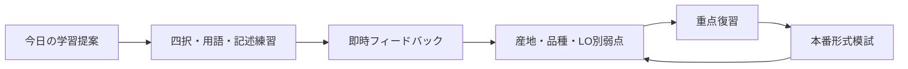
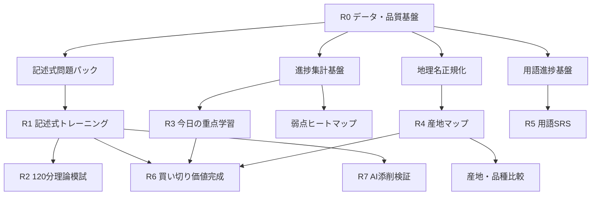
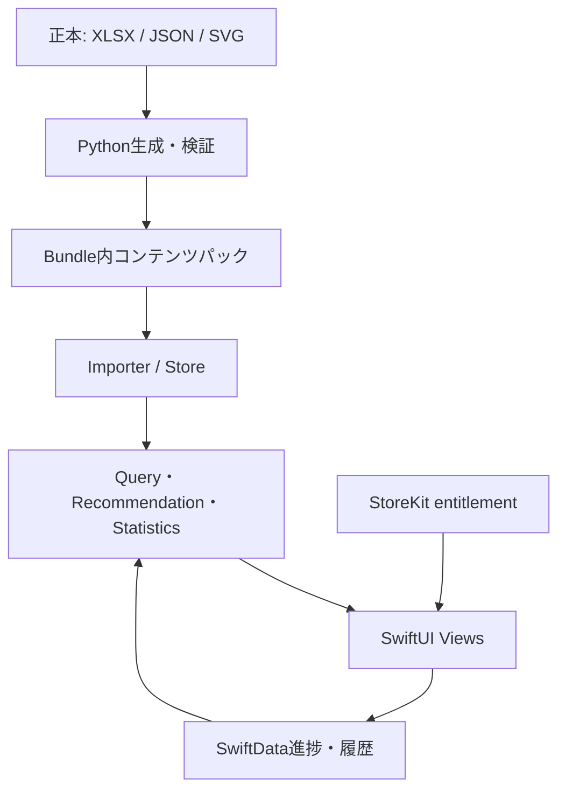

# WSET学習アプリ 全体開発計画

作成日: 2026-07-18

対象: 日本語・オフライン WSET Level 3 iOSアプリ

状態: R0〜R7主要技術実装済み／Swift単体115/115・UI 25/26／商用ReleaseはNo-Go

関連計画: [産地マップ開発計画](region-map-development-plan.md)

## 1. エグゼクティブサマリー

次の開発テーマは、機能数を増やすことではなく、現在の「四択問題集」から「WSET Level 3試験を完走できる学習システム」へ進化させることである。

優先順は次の通りとする。

1. 記述式問題のコンテンツ・採点基盤
2. 記述式トレーニング
3. 120分の本番形式理論模試
4. 今日の重点学習と弱点ヒートマップ
5. 産地マップと産地・品種比較
6. 用語集SRS
7. テイスティング練習の強化
8. 無料体験＋買い切り課金
9. 必要性を確認してからiCloud同期・AI添削

記述式を最優先にする理由は、現行アプリが1,100問の四択、680語の用語集、模試、SRS、SAT記録を持つ一方、公式試験に含まれる4問の記述式へ対応していないためである。`StudySessionView`には記述入力UIが一部存在するが、問題生成スクリプトが`multiple_choice`のみを許可しており、実データは収録されていない。したがって最大の依存関係はSwiftUIではなく、記述式問題の正本、採点基準、品質検証パイプラインである。

産地マップは単独機能として終わらせず、記述式の比較問題、用語、品種、弱点分析へ接続する。課金は、記述式・本番模試・適応学習という中核価値が揃った後に導入する。初期は買い切りとし、継続的なサーバー価値が必要なAI添削だけを将来の任意サブスクリプション候補とする。

## 2. 製品ビジョン

### 2.1 目指す状態

日本語でWSET Level 3を学ぶユーザーが、次の学習サイクルを1つのオフラインアプリで完結できる状態を目指す。



### 2.2 製品原則

1. **試験整合性**: 便利さより、試験形式と学習成果への寄与を優先する。
2. **オフライン優先**: 基本学習、採点、地図、用語、履歴は通信なしで動かす。
3. **説明可能な適応学習**: 問題選出理由を表示し、ブラックボックス化しない。
4. **正本から生成**: 問題・採点基準・用語・地図を手作業でアプリコードへ埋め込まない。
5. **一次情報と独自表現**: 公式教材や競合コンテンツを複製しない。
6. **段階的な複雑化**: ルールベースで成立する機能へ、最初からAIを導入しない。
7. **プライバシー**: アカウント、広告、追跡を前提としない。
8. **小さく検証**: 各リリースが単独で学習価値を持ち、ロールバック可能な単位にする。

### 2.3 対象ユーザー

- WSET Level 3講座を受講中または受験予定の日本語話者
- Level 2相当の基礎知識がある独学者
- 移動中や通信環境の悪い場所で学習したいユーザー
- 四択だけでなく、因果説明・比較・論述を練習したいユーザー

### 2.4 非対象

- WSET公式教材の代替
- ワイン購入・在庫・レビュー管理
- SNS、コミュニティ、ランキング中心のアプリ
- 飲食店向け業務システム
- 汎用ソムリエ資格全般への同時対応

## 3. 現状評価

### 3.1 現在の強み

- 日本語の独自四択問題1,100問
- 国・産地・品種・知識領域・難易度・思考スキル別の重点学習
- 680語の用語辞書と関連問題リンク
- ボルドー、ブルゴーニュ、シャンパーニュの格付け一覧
- 50問模試とLO別履歴
- 間違い、期限、ブックマーク復習
- 基本的なSRS通知
- SAT形式のテイスティング記録
- 2本比較ブラインド練習
- JSONバックアップ・復元
- 日本語固定、端末内保存、オフライン

### 3.2 主要ギャップ

| ギャップ | 学習上の影響 | 優先度 |
|---|---|---|
| 記述式問題が0問 | 本番の4問へ対応できない | 最高 |
| 模試に120分タイマーがない | 時間配分を練習できない | 最高 |
| 模試にフラグ・問題一覧がない | 見直し戦略を練習できない | 高 |
| 今日やるべき内容を自動提案しない | 選択負荷が高い | 高 |
| 弱点がLO中心 | 産地・品種・知識領域の弱点が見えない | 高 |
| 用語辞書にSRSがない | 暗記と復習が分離している | 中 |
| 地理を一覧でしか学べない | 位置関係を記憶しにくい | 中 |
| 産地比較機能がない | 記述式の比較問題へつながらない | 中 |
| テイスティングに30分試験モードがない | 時間制約下の練習ができない | 中 |
| クラウド同期がない | 機種変更以外の複数端末利用が難しい | 低〜中 |

### 3.3 技術的な重要事実

- `StudyQuestion`は`studyMode`、`markAllocation`、`commandVerb`を既に持つ。
- `StudySessionView`は`written_answer`の場合に`TextEditor`を表示できる。
- `StudyAttempt`は記述回答テキストを保存できる。
- `build_question_pack.py`は現在、全問題を`multiple_choice`へ固定し、それ以外を拒否する。
- 記述式の採点項目、獲得点、所要時間は保存できない。
- `MockExamView`は回答辞書をView状態だけに保持し、中断復帰・タイマー・フラグを持たない。
- 産地・品種・LOなどのタグは既にあり、適応学習と弱点分析に再利用できる。

## 4. 優先順位の判断基準

各機能は次の5軸で評価する。

| 軸 | 意味 |
|---|---|
| 試験寄与 | 合格に必要な形式・知識・時間配分へ直接つながるか |
| 差別化 | 日本語競合や汎用フラッシュカードとの差が出るか |
| 既存資産活用 | 1,100問、680語、進捗データを再利用できるか |
| 実装・運用負荷 | コンテンツ制作、サーバー費、保守が大きすぎないか |
| 将来の基盤性 | 後続機能を簡単にするか |

### 4.1 優先度マトリクス

| 機能 | 試験寄与 | 差別化 | 基盤性 | 負荷 | 結論 |
|---|---|---|---|---|---|
| 記述式基盤・練習 | 最高 | 高 | 最高 | 大 | 最優先 |
| 120分理論模試 | 最高 | 高 | 高 | 中〜大 | 最優先 |
| 今日の重点学習 | 高 | 高 | 高 | 中 | 最優先 |
| 弱点ヒートマップ | 高 | 中〜高 | 高 | 中 | 高 |
| 産地マップ | 中〜高 | 高 | 高 | 中〜大 | 高 |
| 産地・品種比較 | 高 | 高 | 高 | 中 | 高 |
| 用語集SRS | 中〜高 | 中 | 中 | 中 | 高 |
| テイスティング試験モード | 中 | 中 | 中 | 中 | 中 |
| iCloud同期 | 低 | 低〜中 | 中 | 中〜大 | 後続 |
| AI記述添削 | 高 | 高 | 中 | 大・継続 | 検証後 |
| SNS・ランキング | 低 | 低 | 低 | 大 | 対象外 |

### 4.2 市場調査スナップショット（2026-07-19）

価格と機能はApp Store日本ストアの表示値であり、将来変わり得る。価格決定時に再確認する。

| 製品 | 日本ストアで確認した課金 | 主な訴求 | 本アプリへの示唆 |
|---|---:|---|---|
| [WSET Level 3 対策アプリ](https://apps.apple.com/jp/app/wset-level-3-%E5%AF%BE%E7%AD%96%E3%82%A2%E3%83%97%E3%83%AA/id6760472038) | 買い切り¥480 | 四択、統計、ヒートマップ、オフライン、広告除去 | 四択数だけでは価格差を説明できない |
| [VinoPrep（Mykyta Popov）](https://apps.apple.com/jp/app/vinoprep-wset%E8%A9%A6%E9%A8%93%E5%AF%BE%E7%AD%96/id6758863047) | 月¥800、年¥5,000、買い切り¥11,000 | SRS、模試、分析、地図、複数Level。Level 3は近日公開表記 | 高機能層には継続課金・高額買い切り余地があるが、Level 3完成度が重要 |
| [VinoPrep（Barbara Bouillicot）](https://apps.apple.com/jp/app/vinoprep-wset%E8%A9%A6%E9%A8%93%E5%AF%BE%E7%AD%96/id6757702098) | 週¥800、月¥1,500、年¥6,000 | 地図、SRS、SAT記録、発音 | 地図単体は差別化にならず、記述式と弱点学習への接続が必要 |
| [WSET Level 3 Exam](https://apps.apple.com/jp/app/wset-level-3-exam/id1556321093) | アプリ¥2,500 | 英語、オフライン、カード・弱点練習 | 日本語・記述式・本番模試が揃えば¥1,980前後は説明可能 |

AppleはNon-Consumableを「1回購入し、失効・消費しない商品」と定義しており、初期の買い切り方針と一致する。価格はApp Store Connectの価格帯から設定し、Small Business Programの対象なら有料アプリとIAPの手数料率は15%となる。

- [Apple: In-App Purchase設定概要](https://developer.apple.com/help/app-store-connect/configure-in-app-purchase-settings/overview-for-configuring-in-app-purchases/)
- [Apple: IAP価格設定](https://developer.apple.com/jp/help/app-store-connect/manage-in-app-purchases/set-a-price-for-an-in-app-purchase/)
- [Apple: Small Business Program](https://developer.apple.com/app-store/small-business-program/)

### 4.3 市場調査からの判断

- 初期価格は計画どおり発売時¥1,500、通常¥1,980を検証開始点とする。直接競合の¥480へ追随せず、広告なし、記述式、120分模試、説明可能な弱点推薦、地図比較、SATを価格理由にする。
- 専門家レビュー前に有料販売しない。機能量より、問題と採点基準の信頼性が購入理由と返金率を左右する。
- 初回はサブスクリプションにしない。ローカル中心で継続原価が小さく、買い切り競合も存在するためである。
- AI添削を本番提供する場合だけ、運営原価と利用回数を測って別商品を検討する。
- 価格検証は発売価格を4週間または十分な購入母数まで維持し、購入率だけでなく返金、継続利用、レビュー内容を併読する。小標本で価格差を断定しない。

## 5. 統合ロードマップ

### 5.1 リリース構成

| リリース | テーマ | 主な成果 |
|---|---|---|
| R0 | 品質・データ基盤 | 日本語統一、データ契約、移行・計測方針 |
| R1 | 記述式トレーニング | 採点基準付き記述問題、自己採点、履歴 |
| R2 | 本番形式試験 | 120分、50問＋4記述、フラグ、中断復帰 |
| R3 | 適応学習 | 今日の20問、弱点ヒートマップ、説明可能な推薦 |
| R4 | 視覚・比較学習 | 産地マップ、産地・品種比較、地図から演習 |
| R5 | 記憶・テイスティング | 用語SRS、30分SAT、香り語彙、出力 |
| R6 | 商用リリース | 無料体験、買い切り、StoreKit、法務・ストア準備 |
| R7 | 任意オンライン機能 | iCloud同期、AI添削の限定検証 |

### 5.2 依存関係



R4はR1・R2の完了を技術的には待たないが、少人数開発では試験寄与の高いR1・R2を先にする。地図素材制作はSwift実装と独立して並行可能である。

### 5.3 現在の実行トラック（2026-07-19）

実装完了と商用公開可否は別々に判定する。自動テストが成功しても、人手レビューやApp Store作業を完了扱いにしない。

| トラック | 現在地 | 次の作業 | Exit gate |
|---|---|---|---|
| アプリ実装 R0〜R7 | Swift単体115/115、UI 25/26、Release build成功 | R5語彙追加後の完了メッセージがAXへ現れない問題を、3回の修復履歴を引き継いで解消する | `make test`とRelease buildが成功 |
| 四択・記述コンテンツ | 四択1100問、記述候補10問とも外部レビュー待ち | 専門家レビュー、修正、正本を`公開`／`published`へ更新 | 四択1100問と模試用記述4問以上が公開状態 |
| 用語コンテンツ | 680語を生成済み、実正規化規則で統合候補9組を検出。すべて専門家判断待ち | [`用語ID統合レビュー`](glossary-term-id-migration.md)で正規IDと表示名を人手決定する | 承認済みIDだけを統合し、同一概念が別カードへ分裂せず、旧IDからSRS履歴を復元可能 |
| 地図・法務 | 自作概略図、出典、確認日は実装済み | 位置、比較記述、商標・利用条件を人手確認 | 地図レビュー項目を証跡付きで完了 |
| StoreKit・ストア | ローカル実装とテスト構成あり | App Store Connect登録、Sandbox、返金・復元、素材作成 | 商用チェックリストを全件完了 |
| 実機QA | UI自動テストあり | VoiceOver、最大Dynamic Type、ダーク、機内モード、復帰を実機確認 | 対象端末のQA記録に重大不具合なし |
| R7オンライン | 技術検証のみ、既定OFF | iCloud container／運営者バックエンド／保持・削除試験 | 条件未達の間は本番で有効化しない |

日常検証は`make verify`、App Store archive直前の厳格な判定は`make release-check`を使用する。後者は公開状態、地図出典、手動チェックリスト、プライバシーポリシーのいずれかが未完了なら非0で終了する。

最終監査スナップショットは次のとおり。`make verify`はPython 59/59と全生成物検査が成功、Swift単体は115/115、UIは26件中25件が成功した。残るUI失敗は`R5UITests.testTastingVocabularyCanBeSearchedAndSelectedWithKeyboardInput`である。フォームの安全領域までのスクロールと語彙シート表示は修正済みで、シート表示、検索、候補選択までは成功するが、選択後の「追加しました」表示がAXへ現れない。3回の修復上限に達したため、この監査では追加変更を停止した。Release buildは成功した。商用ゲートはコンテンツ5件、手動確認12件、プライバシー1件の合計18件を検出して正しくNo-Goとなる。

### 5.4 マップ以外の後続新機能

R0〜R7の商用ゲートを閉じるまでは新規WIPを増やさない。公開後は利用行動と要望を確認し、次の順で検証する。

| 順位 | 機能 | 学習価値 | 最小実装 | 判断 |
|---:|---|---|---|---|
| 1 | 試験日ベース学習計画 | 残日数から四択・記述・用語・SATを週次配分 | 試験日、週目標、今日の残量、ローカル通知 | R8候補 |
| 2 | 産地配置・名称クイズ | 地図を見るだけでなく能動想起へ変える | ピン選択、名称選択、親子産地、誤答復習 | R8候補 |
| 3 | 指示語別ミニ記述ドリル | 「説明・比較・評価」の型を短時間で反復 | 1採点基準単位、3〜5分、履歴連携 | R8候補 |
| 4 | ラベル・法律表示ドリル | AOP、格付け、ラベル語の混同を減らす | 自作ラベル図、表示要素選択、根拠解説 | R9候補 |
| 5 | 週次学習レポート | 弱点改善と次週行動を説明可能にする | 端末内集計、PDF／共有用要約、個人入力除外 | R9候補 |
| 6 | コンテンツ更新履歴 | 法律・呼称の更新日と差分を利用者へ示す | pack version、変更要約、確認日 | R9候補 |
| 7 | 発音ガイド | 産地・品種名の口頭理解を補助 | 権利確認済み音声または端末音声、オフラインキャッシュ | 需要確認後 |
| 8 | ラベル写真・OCR | 実物と知識を結び付ける | 端末内処理、明示保存、削除・バックアップ分離 | プライバシー評価後 |

実績バッジ、連続日数、ランキングは競合でも見られるが、試験合格への直接寄与が低い。まず試験日計画、能動想起、記述式の質を優先し、SNS・公開ランキングは対象外を維持する。

## 6. R0: 品質・データ基盤

### 6.1 目的

後続機能でSwiftData移行、データ形式、採点定義が分散しないよう、先に共通基盤を整える。

### 6.2 作業

#### UI・品質

- 既存画面に残る英語表記を日本語へ統一
- エラー文、空状態、確認ダイアログの表現統一
- Accessibility Identifier命名規則を確定
- AppThemeへ成功・注意・エラー・チャート色を追加
- ライト・ダーク・Dynamic Typeの基準画面を定義

#### データ

- コンテンツパックごとの`schemaVersion`方針を文書化
- 生成物に正本ハッシュと関連パックハッシュを保存
- SwiftDataの新規任意フィールド追加手順を確認
- バックアップ形式のバージョン管理を追加
- 既存バックアップの復元互換性テストを追加
- 国・産地名を共通`GeographyNormalizer`へ移行

#### 共通ロジック

- 問題を四択、記述、模試へ分類するQuery層をViewから分離
- 産地・品種・LO・知識領域別集計を純粋関数として実装可能な形にする
- 現在日時を注入できるようにし、期限・タイマーのテストを安定化

### 6.3 完了条件

- 現行機能の自動テストが成功
- バックアップの既存fixtureを復元できる
- 日本語固定ポリシーに反する主要文字列がない
- データパックとSwiftDataの変更規則が文書化されている
- 後続機能がView内へ重複集計ロジックを追加せず実装できる

## 7. R1: 記述式トレーニング

### 7.1 製品要件

記述式練習は、生成AIによる自由採点ではなく、採点項目に基づく自己採点から始める。

ユーザーフロー:

1. 問題と配点、指示語を確認
2. 制限時間を意識して回答入力
3. 回答を確定
4. 模範解答と採点項目を表示
5. 満たした採点項目を選択
6. 獲得点と理解度を保存
7. 不足論点に関連する用語・問題を復習

### 7.2 コンテンツ設計

四択正本を不安定にしないため、記述式は別正本・別生成物とする。

| 役割 | パス案 |
|---|---|
| 正本 | `QuestionSources/wset_level3_written_questions.xlsx` |
| 生成スクリプト | `scripts/build_written_question_pack.py` |
| 生成物 | `WSET/QuestionData/written_question_pack.json` |
| Pythonテスト | `scripts/tests/test_build_written_question_pack.py` |

生成コードの共通部分は小さな共有モジュールへ抽出し、Excel読み込み、正規化、ハッシュ計算を重複させない。

### 7.3 記述式データ契約

```json
{
  "id": "SAQ-LO2-001",
  "studyMode": "written_answer",
  "prompt": "...",
  "modelAnswer": "...",
  "learningOutcome": "u1_lo2",
  "commandVerb": "説明する",
  "markAllocation": 6,
  "suggestedMinutes": 9,
  "countries": ["フランス"],
  "regions": ["ボルドー"],
  "grapeVarieties": ["カベルネ・ソーヴィニヨン"],
  "rubricItems": [
    {
      "id": "SAQ-LO2-001-R1",
      "criterion": "気候条件と成熟への影響を説明している",
      "marks": 2,
      "knowledgeTags": ["自然要因"],
      "relatedTermIDs": []
    }
  ]
}
```

検証条件:

- `rubricItems.marks`合計が`markAllocation`と一致
- 指示語、LO、難易度、知識領域を必須化
- 模範解答と採点項目は独自表現
- 全問題を人手レビュー済み状態でのみ公開
- 関連用語IDが参照パックへ解決可能
- 1問の採点項目が細かすぎて単なる語句一致にならない
- 問題文だけで解答範囲が分かる

### 7.4 Swiftモデル変更

`StudyQuestion`へ任意データを追加:

- `rubricItemsData`
- `suggestedMinutes`

`StudyAttempt`へ任意データを追加:

- `awardedMarks`
- `maximumMarks`
- `rubricSelectionsData`
- `durationSeconds`

既存レコードを壊さないよう、追加フィールドは任意値または安全な既定値とする。バックアップにも追加する。

### 7.5 UI変更

- 記述回答エディタ
- 経過時間表示
- 配点と指示語表示
- 模範解答カード
- 採点項目チェックリスト
- 獲得点入力・自動合計
- 不足項目から関連用語へ遷移
- 記述式履歴と前回回答比較

### 7.6 初期コンテンツ範囲

最初から本番4問セットを大量生成せず、代表的な指示語とLOをカバーする小規模パックで検証する。

- 説明問題
- 比較問題
- 因果関係問題
- 品質・価格評価
- 栽培・醸造判断

公開数は品質レビュー能力に合わせて決める。数を先に目標化せず、採点基準の一貫性を優先する。

### 7.7 完了条件

- 記述問題を選択・回答・自己採点・保存できる
- 採点項目合計と表示得点が一致する
- 中断しても入力中回答を失わない
- 過去回答と得点推移を確認できる
- 問題・模範解答・採点基準を人手レビュー済み
- 記述式データ生成と`--check`が成功する

## 8. R2: 本番形式理論模試

### 8.1 製品要件

- 120分カウントダウン
- 四択50問
- 記述式4問
- 四択・記述のセクション移動
- 問題番号一覧
- 回答済み、未回答、フラグ済みの状態表示
- 自動保存と中断復帰
- 時間切れ自動提出
- 提出前の未回答確認
- 提出後のセクション別・LO別結果
- 記述式は自己採点を完了してから最終結果確定

### 8.2 アーキテクチャ

現在の`MockExamView`を巨大化させず、新しい本番形式用機能を分離する。

新規候補:

- `TheoryExamSession`
- `TheoryExamResponse`
- `TheoryExamConfiguration`
- `TheoryExamCoordinator`
- `TheoryExamView`
- `ExamQuestionNavigatorView`
- `ExamTimerService`

現行の`MockExamSession`と50問模試は当面維持し、履歴を破壊しない。本番形式が安定した後、旧模試を「四択ミニ模試」として位置付ける。

### 8.3 時刻管理

- 残り時間そのものではなく、開始時刻・期限・休止状態を保存
- UI更新用タイマーと試験期限の真実を分離
- バックグラウンド復帰時に現在時刻から再計算
- デバイス時刻変更は完全には防げないため、個人学習用途として許容し、クラッシュ・負値だけ防ぐ
- テストではClock相当の依存を注入

### 8.4 完了条件

- 50問＋4問のセットを作成できる
- 120分タイマーがバックグラウンド復帰後も整合する
- 全問題へ番号一覧から移動できる
- フラグ、回答、記述テキストを再起動後も復元できる
- 時間切れと手動提出の双方がテスト済み
- 旧模試履歴が引き続き閲覧可能

## 9. R3: 今日の重点学習と弱点分析

### 9.1 今日の重点学習

ユーザーが毎回条件を選ばなくても、10問または20問の学習セットを生成する。

初期ルール:

1. 復習期限が来た問題
2. 直近で間違えた問題
3. 正答率の低い知識領域
4. 未学習問題
5. LOの偏りを補正する問題

表示例:

> 今日の20問: 期限8問、直近の間違い6問、弱点4問、未学習2問

### 9.2 推薦ロジック

`StudyRecommendationEngine`を純粋ロジックとして実装する。

入力:

- `StudyQuestion`
- `QuestionProgress`
- 最近の`StudyAttempt`
- セッション件数
- ユーザーが除外した範囲
- 現在日時

出力:

- 問題ID
- 選出理由
- 優先スコア内訳

同点時の順序を安定させるため、日付とユーザー非依存のseedを使用するか、最終的に問題IDで並べる。テストで再現可能にする。

### 9.3 弱点ヒートマップ

集計軸:

- Learning Outcome
- 国
- 産地
- 品種
- ワイン区分
- 知識領域
- 難易度
- 思考スキル

表示指標:

- 対象問題数
- 学習済み問題数
- 試行数
- 正答率
- 直近正答率
- 復習期限数

最低サンプル数未満では強い色や断定的な弱点表示を行わず、「データ不足」と表示する。正答率だけでなく問題数を併記する。

### 9.4 SRS改善

最初は現在の2択評価を維持し、推薦エンジンと統合する。4段階評価やSM-2系アルゴリズムは、既存履歴との互換性とUXを別途検証してから導入する。

### 9.5 完了条件

- 同じ入力から同じ推薦理由付きセットが得られる
- 期限問題が存在する場合に優先される
- 1つの軸へ偏りすぎない
- 弱点画面で分母と件数が確認できる
- 学習完了後に弱点値が更新される
- サンプル不足を弱点と誤表示しない

## 10. R4: 産地マップと比較学習

詳細は[産地マップ開発計画](region-map-development-plan.md)を正とする。

### 10.1 全体ロードマップ上の役割

- 位置関係の理解
- 産地タグから問題演習への導線
- 用語・品種・格付けの統合
- 弱点ヒートマップの視覚表示
- 記述式比較問題への入口

### 10.2 産地・品種比較

地図MVPの後に、2項目比較を追加する。

比較軸:

- 緯度・海洋性・大陸性
- 気温、降雨、主要リスク
- 土壌
- 主要品種
- 栽培判断
- 醸造・熟成
- 代表的スタイル
- 品質・価格要因
- 法律・表示

比較データは説明文の自由記述だけでなく、可能な項目を構造化する。比較表から「この2産地の比較問題を練習」へ遷移する。

### 10.3 完了条件

- フランス主要産地の地図と一覧が利用可能
- 産地から用語、問題、進捗へ移動できる
- 親産地と下位産地の問題が重複なしで集約される
- 2産地を同じ比較軸で表示できる
- 比較データの出典と確認日を保持する

## 11. R5: 用語SRSとテイスティング強化

### 11.1 用語集SRS

`ReferenceTermProgress`を拡張し、用語単位の復習を可能にする。

カード形式:

- 日本語名 → 原語・意味
- 原語 → 日本語名・意味
- 概要 → 用語名
- 産地 → 主要用語

機能:

- 今日の用語復習
- ブックマーク用語だけ復習
- 関連問題へ遷移
- 誤答用語を問題演習の推薦へ反映
- 表記・別名の同一用語統合

初期は音声を収録しない。発音音声は権利、品質、アプリ容量、言語差を評価してから追加する。

### 11.2 テイスティング試験モード

- 30分タイマー
- 2本のワインを並行入力
- SAT項目の入力進捗
- 残り時間警告
- 提出後のみ全項目表示
- 過去の記録との比較

### 11.3 テイスティング語彙

- 香り・風味語彙の検索
- カテゴリ別一覧
- よく使う語彙
- 用語辞書との相互リンク
- 入力時の候補表示

### 11.4 写真・出力

後続候補:

- ボトル・ラベル写真
- テイスティング記録のPDF
- CSVまたはJSONの個別書き出し
- 共有用の個人情報を含まない要約

写真はバックアップ容量とプライバシーへの影響が大きいため、テキスト機能と分離して判断する。

### 11.5 完了条件

- 用語に復習期限を設定できる
- 問題と用語の復習が同じ「今日の学習」へ統合される
- 30分モードで中断・復帰しても時間が整合する
- 語彙候補がSAT入力を妨げず、キーボード操作可能

## 12. R6: 課金と商用リリース

### 12.1 課金モデル

初期は無料体験＋買い切りとする。

- 商品ID案: `pro_lifetime`
- StoreKit種別: Non-Consumable
- 通常価格仮説: ¥1,980
- 発売時の一時価格仮説: ¥1,500
- 広告なし
- アカウント登録なし
- 購入復元あり

価格は市場の確定値ではなく検証開始点である。App Store Connectの実績、TestFlight利用者の反応、課金画面到達後の購入状況で見直す。

### 12.2 無料範囲

- 厳選四択100問
- 用語60語
- 格付け一覧（独立した基礎資料として無料閲覧）
- 20問ミニ模試
- 記述式サンプル
- 産地マップのフランス体験範囲
- テイスティングノート3件
- 基本進捗
- バックアップ・復元
- 購入復元

### 12.3 買い切り範囲

- 全四択問題
- 全記述式問題
- 120分理論模試
- 全用語
- 今日の重点学習
- 詳細弱点分析
- 全産地マップ・比較
- 用語SRS
- テイスティング記録無制限

データ可搬性、安全性、購入復元は有料壁にしない。

利用者自身が作成した学習履歴は、権利状態が変わっても読み取り可能とする。用語SRSでは、無料対象用語の過去の復習回数・正答率・次回期限は履歴として表示し、新しい期限復習セッションの実行だけをPro機能として制御する。

### 12.4 ペイウォール

初回起動直後には表示しない。価値を体験した次の地点で表示する。

- 初回20問完了後
- 無料問題を一定数完了後
- 本番形式模試を選択した時
- ロックされた産地・記述問題を選択した時

表示内容:

- 一度だけの支払い
- 解放される具体的な内容
- オフライン・広告なし
- 購入復元
- 価格をStoreKitから取得し、文字列へ直書きしない

### 12.5 商用リリース要件

- WSET非提携表記
- 商標・著作権レビュー
- プライバシーポリシー
- App Store商品説明とスクリーンショット
- StoreKit Configurationによるローカルテスト
- Sandbox購入、保留、キャンセル、復元テスト
- Small Business Program申請可否確認
- 無料・有料判定の改ざん耐性とオフライン権利キャッシュ

### 12.6 完了条件

- 購入、キャンセル、保留、復元が正常に扱える
- 購入済みユーザーがオフラインで利用できる
- 再インストール後に復元できる
- 無料ユーザーの既存データが購入時に保持される
- 課金状態がバックアップデータだけで偽装されない
- ストア文言とアプリ内表示が一致する

## 13. R7: 任意オンライン機能

### 13.1 iCloud同期

導入条件:

- 複数端末利用の要望が確認できる
- SwiftDataとCloudKitの移行・競合解決を十分テストできる
- オフライン単独利用を維持できる

同期対象:

- 問題進捗
- 学習履歴
- 記述回答
- テイスティング記録
- ユーザー設定

大容量写真は別判断とする。同期不能時もローカル学習を止めない。

### 13.2 AI記述添削

導入条件:

- 採点項目付き記述問題が十分に蓄積
- 自己採点機能が安定
- AI評価と人手評価の比較セットが作成可能
- 送信内容、保存、削除、費用を明確に説明できる
- 誤採点時に模範解答・採点基準を優先表示できる

AIの役割:

- 採点項目の充足候補を提示
- 因果関係の不足を指摘
- 冗長・曖昧な表現を指摘
- 次に復習する用語を提案

AIに任せないこと:

- 合否保証
- 公式採点結果の表明
- 根拠のない新しいワイン知識の生成
- 採点基準を無視した総合点の断定

### 13.3 課金

AI添削は継続的なAPI原価があるため、買い切りとは分離した任意サブスクリプションまたは添削回数パックを検討する。iCloud同期だけを理由に高額サブスクリプションへ移行しない。

## 14. 横断アーキテクチャ

### 14.1 レイヤー



### 14.2 モジュール境界

- コンテンツ読み込みと画面表示を分離
- 問題抽出と統計を純粋関数化
- タイマーと現在時刻をViewから分離
- 課金権利判定を各画面へ直接埋め込まない
- 無料範囲の判定をコンテンツIDの散在したif文で実装しない
- バックアップはSwiftDataモデルを直接JSON化せず、バージョン付きDTOを維持

### 14.3 新規サービス候補

| 型 | 責務 |
|---|---|
| `WrittenQuestionStore` | 記述式パック読み込み |
| `WrittenScoringService` | 採点項目と得点計算 |
| `TheoryExamCoordinator` | 試験状態、保存、提出 |
| `ExamTimerService` | 期限・残り時間 |
| `StudyRecommendationEngine` | 今日の問題選出 |
| `StudyStatisticsService` | 軸別集計 |
| `GeographyNormalizer` | 国・産地表記統一 |
| `RegionMapStore` | 地図パック読み込み |
| `EntitlementStore` | StoreKit権利判定 |
| `FeatureAccessPolicy` | 無料・有料範囲判定 |

### 14.4 依存関係方針

- 新しい本番依存パッケージは原則追加しない
- Apple標準のSwiftUI、SwiftData、Charts、StoreKitを優先
- 追加依存が必要な場合は、ライセンス、更新頻度、バイナリサイズ、オフライン性をレビュー
- MapKitは産地マップMVPでは使用しない
- AI SDKをクライアントへ直接埋め込まない

## 15. データ品質とコンテンツ制作

### 15.1 コンテンツ状態

各問題に公開状態を持たせる。

- draft
- reviewed
- published
- retired

公開パックには`published`だけを含める。レビュー担当、確認日、根拠、変更理由を正本側で追跡する。

### 15.2 記述式レビュー

- 問題文が曖昧でない
- 指示語と採点基準が一致
- 配点と論点数が一致
- 模範解答が採点項目をすべてカバー
- 1つの採点項目が複数論点を過剰に含まない
- 産地・品種・法律情報の基準日が明確
- 独自表現である
- 1名の作成と別の視点によるレビューを可能な範囲で分ける

### 15.3 生成時検証

- ID一意性
- 必須列
- 列挙値
- 配点整合
- 参照ID整合
- タグ正規化
- 問題数・公開数
- 正本ハッシュ
- 生成物鮮度
- 決定的出力
- 不可視文字、空回答、HTML混入

### 15.4 変更管理

コンテンツだけの変更でも、生成物差分をレビューする。大量の問題更新は、件数、タグ分布、LO分布、難易度分布、参照切れを要約する検証出力を作る。

## 16. テスト戦略

### 16.1 Pythonテスト

- 四択、記述、参照、地図パックの生成
- 正本ハッシュと`--check`
- 採点項目合計
- 参照用語・地理タグ整合
- alias正規化
- 公開状態フィルター
- 決定的出力

### 16.2 Swift単体テスト

- 記述得点計算
- 記述回答保存・復元
- 試験タイマー
- 背景復帰
- 問題フラグと回答状態
- 推薦順位と選出理由
- 軸別統計と分母
- 地理名正規化
- 地図親子集約
- 用語SRS期限
- 無料・有料アクセス判定
- StoreKit状態の抽象化

### 16.3 UIテスト

- 記述回答から自己採点まで
- 本番模試の問題一覧・フラグ・提出
- 中断試験の復帰
- 今日の学習開始
- 弱点画面から重点学習
- 産地マップから問題開始
- 用語復習
- 無料範囲とペイウォール
- 購入復元
- 日本語固定

### 16.4 手動QA

- 小型から大型iPhone
- ライト・ダーク
- Dynamic Type
- VoiceOver
- 機内モード
- バックグラウンド復帰
- 端末時刻変更
- 低ストレージ
- 旧バックアップ復元
- 初回インストールとアップデート

### 16.5 リリース前コマンド

各リリースでREADMEに記載された全検証を実行し、新しい生成スクリプトとテストを追加する。日常検証、Swiftテスト、商用公開判定を意図的に分離する。

```sh
make verify       # Python 49件と全生成物の再現性
make test-unit    # Swift単体テスト
make test-ui      # UIテスト。Simulator競合を避けて単独実行
make release-check  # App Store archive直前。未完了なら意図的に非0
```

## 17. 成功指標

### 17.1 主指標

| 指標 | 定義 | 用途 |
|---|---|---|
| 初回価値到達率 | 初回起動から24時間以内に20問学習を完了した端末数 ÷ 初回起動端末数 | オンボーディングと無料体験の評価 |
| 7日再訪率 | 初回起動日の翌日から7日目までに、別日に1回以上学習した端末数 ÷ 初回価値到達端末数 | 一度きりでない学習価値の評価 |
| 購入率 | 無料価値を体験後にペイウォールを表示した端末のうち、7日以内に`pro_lifetime`購入が検証済みとなった端末数 ÷ 対象端末数 | 価格と価値訴求の評価 |

同一端末の再インストールや複数端末利用を完全には同定しない。個人追跡を増やして率を精密化するより、定義上の限界を明示する。

### 17.2 ドライバー指標

- 今日の重点学習の開始率・完了率
- 記述式の無料サンプル回答完了率
- 理論模試の説明閲覧または開始意向
- 記述式の自己採点得点推移
- 本番模試完了率
- 同一弱点軸の正答率改善
- 復習期限問題の消化率

### 17.3 ガードレール

- 購入復元成功率
- 返金率と返金理由
- コンテンツ誤りの報告件数と修正リードタイム
- クラッシュフリー利用
- App Storeレビューで繰り返される要望・不満

### 17.4 計測方針

現状のオフライン・個人利用を維持する段階では、学習指標を端末内で表示する。商用計測を追加する場合は、収集項目を最小化し、問題文・自由記述・テイスティング内容を送信しない。まずApp Store ConnectとTestFlightフィードバックで判断し、外部分析SDKを初期導入しない。

発売直後は基準値がないため、主指標の固定目標を置かない。最初の4週間または十分な対象母数をベースライン期間とし、その後に流入元、試験時期、OSバージョンを揃えた比較可能な目標を設定する。母数と信頼区間を伴わない率だけで価格や機能の成否を断定しない。

### 17.5 判定上の注意

- 小規模ユーザーの率を確定的に扱わない
- 価格変更前後は流入元・季節・試験時期が異なる
- 正答率上昇は問題の反復記憶を含む
- 自己採点は公式採点ではない
- アプリ利用者だけの結果を市場全体へ外挿しない

## 18. セキュリティ・プライバシー・法務

### 18.1 ローカルデータ

- 自由記述回答とテイスティング記録を機微な個人データとして扱う
- バックアップへ含める項目を明示
- 削除操作は対象と復元可能性を表示
- ログへ問題回答や個人入力を出さない

### 18.2 AI利用時

- 明示的な同意前に回答を送信しない
- 送信範囲を画面で表示
- 学習利用、保持期間、削除方法を説明
- APIキーをアプリへ埋め込まない
- 未成年を含む可能性を考慮

### 18.3 知的財産

- WSET非提携を明示
- WSET公式教材・問題・地図を複製しない
- 独自問題・独自解説・独自採点基準を維持
- 画像・地図・音声のライセンスと出典を記録
- 資格名称と商標表示を公開前に確認

## 19. リスク管理

| リスク | 影響 | 対策 |
|---|---|---|
| 記述式の品質レビューが遅い | R1・R2が遅延 | 小規模パック、公開状態、レビュー優先 |
| 自己採点が甘くなる | 得点の信頼性低下 | 採点項目を具体化し公式採点でないと明示 |
| 模試状態モデルが複雑 | 回答消失 | Coordinator分離、永続化、復帰テスト |
| 適応学習が不透明 | 信頼低下 | 選出理由とスコア内訳を表示 |
| データ不足を弱点と誤認 | 誤った推薦 | 最低サンプル数と件数併記 |
| 機能追加で既存バックアップが壊れる | データ損失 | バージョン付きDTOとfixtureテスト |
| 地図の位置・境界が誤解される | 誤学習 | 概略表示、出典、マーカーMVP |
| 課金を早く入れすぎる | 低評価 | 中核価値完成後、無料体験後に表示 |
| AI費用・誤採点 | 収益・信頼悪化 | 任意機能、rubric中心、評価セット |
| 少人数開発で並行しすぎる | 未完成機能増加 | 1リリース1テーマ、WIP制限 |

## 20. 実装バックログ

### P0: リリース前提

- `FOUND-001` UI日本語統一
- `FOUND-002` バックアップスキーマバージョン
- `FOUND-003` 地理名正規化共通化
- `FOUND-004` 時刻依存の注入
- `WRIT-001` 記述式正本定義
- `WRIT-002` 記述式生成スクリプト
- `WRIT-003` 採点基準モデル
- `WRIT-004` 記述自己採点UI
- `WRIT-005` 記述履歴
- `EXAM-001` 試験セッションモデル
- `EXAM-002` 120分タイマー
- `EXAM-003` 問題一覧・フラグ
- `EXAM-004` 中断復帰
- `EXAM-005` 結果・履歴
- `ADAP-001` 推薦エンジン
- `ADAP-002` 今日の20問
- `STAT-001` 軸別統計
- `STAT-002` 弱点ヒートマップ

### P1: 差別化

- `MAP-001` 地図データ契約
- `MAP-002` フランス地図MVP
- `MAP-003` 地図・問題・用語連携
- `COMP-001` 産地比較データ
- `COMP-002` 2産地比較UI
- `VOCAB-001` 用語SRSモデル
- `VOCAB-002` 今日の用語復習
- `TAST-001` 30分テイスティング試験
- `TAST-002` テイスティング語彙候補

### P2: 商用化

- `PAY-001` EntitlementStore
- `PAY-002` FeatureAccessPolicy
- `PAY-003` 無料コンテンツ定義
- `PAY-004` ペイウォール
- `PAY-005` 購入復元・StoreKitテスト
- `LEGAL-001` 非提携・著作権表記
- `STORE-001` App Store素材・プライバシー

### P3: 検証後

- `SYNC-001` iCloud技術検証
- `AI-001` 人手評価セット
- `AI-002` AI添削プロトタイプ
- `MEDIA-001` テイスティング写真
- `EXPORT-001` PDF出力
- `WIDGET-001` 今日の学習ウィジェット

## 21. 作業規模

担当人数とコンテンツレビュー能力が未確定なため、暦日ではなく相対規模で管理する。

| リリース | 規模 | 最大の不確実性 |
|---|---|---|
| R0 基盤 | M | SwiftData・バックアップ互換性 |
| R1 記述式 | L | 問題と採点基準の品質 |
| R2 本番模試 | L | 状態保存・タイマー・記述採点統合 |
| R3 適応学習 | M〜L | 指標定義と推薦バランス |
| R4 地図・比較 | L | 地図・比較コンテンツレビュー |
| R5 用語・テイスティング | M〜L | 語彙構造と入力UX |
| R6 課金 | M | StoreKit状態・ストア審査・法務 |
| R7 AI・同期 | L | サーバー、費用、精度、プライバシー |

R1、R4、R5はコードよりコンテンツ品質が支配的である。実装進捗とコンテンツ進捗を別トラックで管理する。

## 22. 各リリースのGo/No-Go判定

### 共通Go条件

- 必須受け入れ条件をすべて満たす
- 自動テスト成功
- 既存機能の回帰なし
- バックアップ互換性確認
- VoiceOver、Dynamic Type、ダークモード確認
- 機内モード確認
- コンテンツ・出典レビュー完了
- 既知の重大データ損失リスクなし

### No-Go条件

- 回答・履歴が失われる
- 記述式の配点と採点項目が一致しない
- 模試の時間・回答状態が復元できない
- 推薦理由を説明できない
- 課金済み権利がオフラインで失われる
- ライセンス不明素材が含まれる
- 公式試験・公式採点と誤認させる表現がある

## 23. ここから商用公開までの順序

1. R0〜R7の受入条件監査を閉じ、全単体・UI・生成物・Release buildを再実行する。
2. 四択1100問を専門家レビューし、指摘修正後に正本の状態を`公開`へ更新する。
3. 記述候補を別担当の視点でレビューし、まず理論模試を成立させる4問以上を`published`にする。
4. 地図の位置、比較記述、出典、商標・利用条件を人手レビューする。
5. 全パックを再生成し、`make verify`と`make release-check`でコンテンツゲートを閉じる。
6. App Store Connectへ`pro_lifetime`を登録し、価格、説明、スクリーンショット、サポートURL、App Privacyを確定する。
7. StoreKit Sandboxで購入、キャンセル、保留、返金・取消、復元、再インストール、オフライン権利を確認する。
8. TestFlight実機でVoiceOver、最大Dynamic Type、ダークモード、機内モード、バックグラウンド復帰、旧バックアップ復元を確認する。
9. プライバシーポリシーを運営者情報・保持期間込みで公開版へ確定し、手動チェックリストを証跡付きで完了する。
10. `make release-check`が`GO`になった同一revisionからArchiveを作成する。R7は別の有効化条件を満たすまでOFFを維持する。

## 24. 参照情報

### 公式試験

- WSET Level 3 Award in Wines: https://www.wsetglobal.com/jp/japanese-qualifications/level-3-award-in-wines-jp/
- WSET Level 3 study guidance: https://www.wsetglobal.com/knowledge-centre/blog/2026/how-to-study-for-your-wset-level-3-award-in-wines-part-3/

### 市場・競合

- 国内WSET Level 3対策アプリ: https://apps.apple.com/jp/app/wset-level-3-%E5%AF%BE%E7%AD%96%E3%82%A2%E3%83%97%E3%83%AA/id6760472038
- VinoPrep: https://apps.apple.com/jp/app/vinoprep-wset%E8%A9%A6%E9%A8%93%E5%AF%BE%E7%AD%96/id6757702098
- WSETeducation: https://www.wseteducation.com/
- OenoQuest: https://www.oenoquest.com/en
- ThirtyFifty mock questions: https://www.thirtyfifty.co.uk/WSET-L3-Exam-Questions.asp

### Apple

- StoreKit 2: https://developer.apple.com/storekit/
- In-App Purchase types: https://developer.apple.com/help/app-store-connect/reference/in-app-purchases-and-subscriptions/in-app-purchase-types
- App Store Small Business Program: https://developer.apple.com/app-store/small-business-program/

## 25. 計画の保守

- この文書を全体ロードマップの正とする。
- 産地マップの詳細は`region-map-development-plan.md`を正とする。
- リリース開始時に対象範囲と受け入れ条件を再確認する。
- 実装中に新しい大規模要件が出た場合、進行中リリースへ無条件に追加せず、次リリース候補へ置く。
- 完了した項目は実装差分・テスト・READMEへ反映し、この文書を実装状況のログとしては使わない。
- 重要な設計判断だけ、必要に応じて別のADRへ残す。
