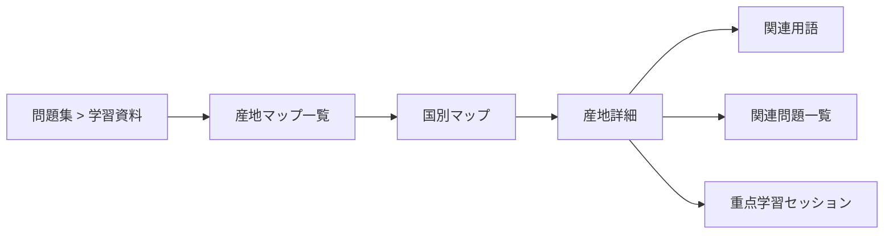

# 産地マップ開発計画

作成日: 2026-07-18
対象: WSET Level 3 日本語・オフライン iOS アプリ
状態: 実装前計画

## 1. 結論

産地マップは、最初から汎用地図アプリとして作らず、WSET学習に特化した次の構成で段階的に実装する。

1. 国別の簡略ベクター地図をアプリに同梱する。
2. 地図上へタップ可能な産地マーカーを配置する。
3. 産地を選ぶと、関連用語、主要品種、問題数、学習進捗を表示する。
4. 既存の重点学習ロジックを再利用して、その産地の学習セッションを開始できるようにする。
5. 利用価値を確認してから、下位産地マップ、ポリゴン表示、弱点ヒートマップへ拡張する。

初回リリースはフランスを対象とする。現行問題パックではフランスに紐づく問題が130問あり、用語辞書とボルドー・ブルゴーニュ・シャンパーニュの格付け機能も既に存在するため、既存資産との統合効果が最も大きい。その後はスペイン118問、ポルトガル89問を優先する。国別件数は複数国タグを含むため、排他的な問題数ではない。

## 2. 目的

### 2.1 ユーザー価値

- 産地の相対位置を視覚的に覚えられる。
- 国、主要産地、下位産地の関係を理解できる。
- 地図から用語辞書と問題演習へ移動できる。
- 産地別の学習量と弱点を確認できる。
- 通信なしで利用できる。

### 2.2 製品上の目的

- 「日本語・オフライン・問題と地図が連動する」という差別化を強める。
- 既存の1,100問と680語を、一覧検索以外の導線から再利用する。
- 将来の記述式対策で必要になる、産地間比較の土台を作る。
- 買い切り版の分かりやすい付加価値にする。

### 2.3 非目的

初回リリースでは、以下を対象外とする。

- ナビゲーション、現在地、ルート検索
- 衛星写真や道路地図
- 法的境界を保証する精密な原産地呼称ポリゴン
- オンライン地図タイルの取得
- ユーザーによる地図編集
- 世界全地域の一括実装
- WSET公式地図の複製

## 3. 現状と再利用できる資産

### 3.1 問題データ

`StudyQuestion`は`countries`、`regions`、`geography`、`grapeVarieties`を保持している。現行問題パックの上位国は次の通り。

| 国 | タグ付き問題数 |
|---|---:|
| フランス | 130 |
| スペイン | 118 |
| ポルトガル | 89 |
| イタリア | 59 |
| オーストラリア | 45 |
| 米国 | 39 |
| ドイツ | 35 |

フランスの主要な産地タグには、シャンパーニュ21問、ブルゴーニュ9問、アルザス6問、ロワール5問、ボルドー5問などがある。メドック、ソーテルヌ、シャブリなどの下位産地は親産地と別タグで格納されている。

### 3.2 重点学習

`StudyFocusCatalog.matchingQuestionIDs`で、地理タグから問題IDを抽出できる。地図側ではこの機能を再利用する。ただし現在は単一値の完全一致なので、ボルドーとメドック・ソーテルヌをまとめるような親子集約は新たに必要になる。

### 3.3 用語辞書

`ReferenceTerm`は`country`、`region`、`relatedTermIDs`、`questionIDs`を保持している。地図専用に説明文を重複登録せず、産地詳細から既存の用語を参照する。

### 3.4 進捗

`QuestionProgress`から問題ごとの試行回数、正答数、最終正誤、復習期限を取得できる。`StudyAttempt`から全試行ベースの正答率を算出できる。産地マップ用の永続モデルは原則追加しない。

### 3.5 UI導線

`QuestionLibraryView`の「学習資料」セクションへ「産地マップ」を追加する。既存の5タブは増やさない。

## 4. 主要ユーザーストーリー

### 必須

1. 学習者として、国を選び、その国内の主要産地を地図で確認したい。
2. 学習者として、産地をタップし、関連する用語と品種を確認したい。
3. 学習者として、産地に関連する問題数と自分の進捗を確認したい。
4. 学習者として、選択した産地の四択問題をその場で開始したい。
5. 学習者として、すべての操作をオフラインで行いたい。
6. VoiceOver利用者として、地図を見なくても産地一覧を操作したい。

### 後続

1. 学習者として、正答率の低い産地を色で確認したい。
2. 学習者として、国地図からボルドーなどの詳細地図へ移動したい。
3. 学習者として、2つの産地を比較したい。
4. 学習者として、地図上の名称を隠して位置当て問題を行いたい。

## 5. UX設計

### 5.1 画面構成



### 5.2 産地マップ一覧

- 国名
- 収録産地数
- 関連問題数
- 学習済み問題数
- 進捗バー
- 初回はフランスのみ表示し、未実装国を無効なカードとして並べない。

### 5.3 国別マップ

- 上部: 国名、関連問題数、学習済み数
- 中央: 簡略地図と産地マーカー
- 下部: 産地一覧。視覚地図と同じ選択状態を共有する。
- マーカー選択時: 色、太さ、ラベルで選択状態を表す。
- 地図は「概略位置」であることを短く明示する。
- 端末幅が狭い場合は、地図の下に一覧を縦表示する。

### 5.4 産地詳細

- 日本語名、原語名、国名
- 親産地、子産地
- 関連問題数
- 試行回数、正答率、期限付き復習数
- 問題から集計した主要品種
- 既存辞書の関連用語
- 「10問」「20問」の重点学習開始
- 該当問題が少ない場合は全問を出題
- 問題が0件の場合は学習ボタンを無効化し、地図・用語閲覧は可能にする

### 5.5 状態設計

- 正常: 地図、マーカー、一覧を表示
- 読み込み失敗: `ContentUnavailableView`で再起動案内
- データなし: 対象国に収録産地がないことを表示
- 問題なし: 用語は表示し、学習開始だけ無効化
- 用語なし: 問題演習は可能。用語セクションを非表示

## 6. 技術方針

### 6.1 静的地図を採用する理由

- 完全オフラインを維持できる。
- 地図の縮尺、ラベル、強調色を教材向けに固定できる。
- ワイン産地は行政境界と一致しないため、汎用地図を表示しても境界データは別途必要になる。
- MapKitの導入、ネットワーク状態、地図表示差異を初期スコープから外せる。
- 位置マーカーであれば、境界を断定する誤解を減らせる。

### 6.2 描画方式

初期版では`GeometryReader`内に背景SVGと産地ごとの`Button`を重ねる。マーカー座標は画像内の0〜1正規化座標で保持する。

`Canvas`は背景や非対話的描画には利用できるが、個々の要素が独立したインタラクションとアクセシビリティを持たないため、産地のタップ対象には利用しない。

### 6.3 将来のポリゴン対応

データモデルには任意の`polygons`を持てるようにする。ただし初期JSONでは空配列とし、マーカーを正式UIとする。ポリゴン導入時も座標は0〜1で保持し、SwiftUI `Shape`へ変換する。

正確な緯度経度とズーム可能な地図が必要になった場合だけ、`MapPolygon`を用いたMapKit版を別途評価する。

## 7. データ設計

### 7.1 正本と生成物

地図の幾何データはExcelに向かないため、既存の`reference_pack`へ直接追加せず、別パックにする。

| 役割 | パス |
|---|---|
| 正本 | `ReferenceSources/wset_region_map_master.json` |
| 地図素材 | `ReferenceSources/RegionMaps/*.svg` |
| 生成スクリプト | `scripts/build_region_map_pack.py` |
| アプリ用生成物 | `WSET/MapData/region_map_pack.json` |
| アプリ画像 | `WSET/Assets.xcassets/RegionMaps/*.imageset` |

生成スクリプトは、正本、問題パック、参照パックを同時に読み、参照整合性を検証する。

### 7.2 JSONスキーマ案

以下は構造を示すため、比較データを`climateInfluence`の1軸だけに省略した例である。実データでは7.3に定める9軸をすべて必須とする。

```json
{
  "schemaVersion": 2,
  "sourceHash": "...",
  "questionPackSourceHash": "...",
  "referencePackSourceHash": "...",
  "mapCount": 1,
  "maps": [
    {
      "id": "france",
      "level": "country",
      "country": "フランス",
      "nameJapanese": "フランス",
      "nameOriginal": "France",
      "assetName": "map_france",
      "aspectRatio": 0.78,
      "regions": [
        {
          "id": "france_bordeaux",
          "nameJapanese": "ボルドー",
          "nameOriginal": "Bordeaux",
          "focusValues": [
            "ボルドー",
            "メドック",
            "ソーテルヌ",
            "バルサック",
            "マルゴー",
            "ポイヤック",
            "ポムロール",
            "ペサック・レオニャン",
            "サン・テミリオン"
          ],
          "position": {"x": 0.22, "y": 0.68},
          "labelOffset": {"x": 0.05, "y": 0.0},
          "termIDs": ["term-97f5e23c0c74"],
          "childMapID": null,
          "polygons": [],
          "comparison": {
            "climateInfluence": {
              "summary": "おおむね北緯44〜45度。海洋性気候。",
              "keywords": ["北緯44〜45度", "海洋性の影響"],
              "sourceIDs": ["official_bordeaux_2026"],
              "checkedAt": "2026-07-19",
              "effectiveDate": "2026-07-19"
            }
          }
        }
      ]
    }
  ],
  "sources": []
}
```

### 7.3 データ契約

- IDは英小文字とアンダースコアで固定し、表示名変更で変えない。
- `x`、`y`は0以上1以下。
- `focusValues`は重複不可。
- すべての`focusValues`は問題パックの正規化済み産地名または国名に解決できる。
- すべての`termIDs`は参照パックに存在する。
- `childMapID`は存在する地図IDか`null`。
- 同じ地図内の地域ID、地図IDは一意。
- 画像の実際の縦横比と`aspectRatio`の差を許容範囲内にする。
- `assetName`に対応する正本SVGとアプリ用imagesetが存在する。
- `sourceHash`はJSONだけでなく、参照するSVGの内容も含めて算出する。
- 問題件数、正答率、品種集計は生成物へ保存しない。
- 各産地は計画10.2の9比較軸をすべて持ち、各軸に`summary`、構造化した`keywords`、`sourceIDs`、`checkedAt`、`effectiveDate`を保存する。
- 比較軸の`sourceIDs`は`sources`に解決でき、日付は`YYYY-MM-DD`でなければ生成を拒否する。

### 7.4 地理名の正規化

現在の`StudyFocusCatalog.normalizeRegion`は非公開で、別名対応も限定的である。地図機能追加時に、地理名の正規化を独立した`GeographyNormalizer`へ移す。

対象例:

- サンルーカル → サンルーカル・デ・バラメダ
- ミュスカ・ドゥ・ボーム・ドゥ・ヴニーズ → ミュスカ・ド・ボーム・ド・ヴニーズ
- ヴァレ・ドゥ・ラ・マルヌ → ヴァレ・ド・ラ・マルヌ

Python生成スクリプトとSwift実装で同じ正規化ケースをテーブルテストする。別々の場当たり的な変換表は作らない。

### 7.5 親子集約

地図上の「ボルドー」は、単一の`regions == ボルドー`だけではなく、`focusValues`に列挙された下位産地の和集合として扱う。

- 1つの地域内では問題IDを重複排除する。
- 複数地域に関係する比較問題は、それぞれの地域に表示してよい。
- 国別合計は国タグで算出し、地域別件数の単純合計とは一致しなくてよい。
- UIに合計の加算可能性を示唆する表現は使わない。

## 8. Swiftアーキテクチャ

### 8.1 新規型

`WSET/Models/RegionMap.swift`

- `RegionMapPack`
- `RegionMapDocument`
- `MapRegion`
- `NormalizedPoint`
- `NormalizedPolygon`
- `RegionMapLevel`

すべて`Decodable`、`Identifiable`、`Hashable`を基本とする。永続化は行わない。

### 8.2 データストア

`WSET/Data/RegionMapStore.swift`

- `ReferenceStore`と同じBundle JSON読み込みパターンを使う。
- スキーマバージョン、件数、参照IDを検証する。
- `mapsByID`、`regionsByID`を構築する。
- 読み込み失敗時は日本語の`loadError`を返す。
- テスト用に`Bundle`または`Data`を注入できる初期化子を用意する。

### 8.3 問題抽出サービス

`WSET/Models/RegionStudyQuery.swift`

責務をViewから分離し、次を純粋関数として提供する。

- `matchingQuestionIDs(focusValues:items:)`
- `matchingQuestions(region:questions:)`
- `relatedGrapeVarieties(region:questions:)`
- `statistics(region:questions:progress:attempts:)`

`focusValues`ごとに既存の`StudyFocusCatalog.matchingQuestionIDs`を呼び、Setで和集合を取る。将来、`StudyFocusCatalog`が複数値検索を直接サポートしたら内部実装だけ差し替える。

### 8.4 統計定義

| 指標 | 定義 |
|---|---|
| 関連問題数 | 対象`focusValues`に一致する出題可能な四択問題のユニーク数 |
| 学習済み問題数 | `QuestionProgress.attemptCount > 0`のユニーク問題数 |
| カバー率 | 学習済み問題数 ÷ 関連問題数 |
| 正答率 | 対象問題の`correctCount`合計 ÷ `attemptCount`合計 |
| 復習期限数 | 対象問題で試行済みかつ`dueDate <= now`の件数 |
| 主要品種 | 対象問題の`grapeVarieties`出現問題数順。1問内重複は1件 |

分母が0の場合は0%ではなく「未学習」と表示する。国・産地をまたぐ問題は各対象に含めるが、同一対象内では重複させない。

### 8.5 View構成

`WSET/Views/RegionMapViews.swift`を起点とし、肥大化した場合に分割する。

- `RegionMapHubView`
- `CountryRegionMapView`
- `RegionMapCanvasView`
- `RegionMarkerButton`
- `RegionSummarySheet`
- `RegionDetailView`
- `RegionProgressBadge`
- `RegionListRow`

地図選択状態は`@State private var selectedRegionID`で管理し、地図と一覧で共有する。学習セッションは既存の`StudySessionView`へ遷移する。

### 8.6 プロジェクト登録

現在のXcodeプロジェクトはFile System Synchronized Groupを使用しているため、`WSET/`以下のSwiftファイルとリソース追加時に`project.pbxproj`を手動編集しない。ビルド後にリソースがBundleへ含まれることだけ確認する。

## 9. 地図素材と法務

### 9.1 背景地図

国の輪郭はNatural Earthのパブリックドメインデータを基に簡略化する。アプリ用SVGは不要な島・境界・属性を削除し、モバイル表示向けに最適化する。

### 9.2 産地位置

- 初期は点または小さな概略領域として手作業で確認する。
- 「概略位置」と表示し、法的境界を表すような塗り分けは行わない。
- 参照した一次情報源を地図正本の`sources`へ記録する。
- WSET教材、競合アプリ、権利不明な画像から座標やデザインを直接トレースしない。

### 9.3 表記

- アプリの設定または情報画面に地図データの出典を表示する。
- WSET非提携表記を維持する。
- 商用公開前に、産地名、原産地呼称、地図素材のライセンスを再確認する。

## 10. アクセシビリティ

- すべてのマーカーを実際の`Button`として実装する。
- タップ領域を最低44×44ptにする。視覚上のマーカーは小さくてもよい。
- VoiceOverラベルを「ボルドー、関連12問、正答率65%」のようにする。
- 色だけで選択・習熟状態を伝えず、枠線、記号、テキストを併用する。
- 地図と同じ操作ができる産地一覧を必ず提供する。
- Dynamic Typeで地図上ラベルが衝突する場合、地図上は短縮表示し、一覧側で完全な名称を示す。
- コントラストをライト・ダーク双方で確認する。
- Reduce Motion有効時は選択アニメーションを簡略化する。

## 11. 実装フェーズ

### Phase 0: データ契約と試作

作業:

- `wset_region_map_master.json`のスキーマを確定
- フランスの背景SVGを作成
- フランス主要地域の座標と`focusValues`を定義
- 地理名正規化の不足を洗い出す
- 正本の出典と確認日を記録

初期地域候補:

- ボルドー
- ブルゴーニュ
- シャンパーニュ
- ロワール
- アルザス
- 北部ローヌ
- 南部ローヌ
- プロヴァンス
- ボージョレ
- ラングドック・ルーション

完了条件:

- 各地域の位置と集約対象を人手レビュー済み
- すべての`focusValues`が問題パックへ解決可能
- 地図が小型iPhone幅でも判別可能

### Phase 1: 生成・読み込み基盤

作業:

- `build_region_map_pack.py`を実装
- `--check`を実装
- 正本SVGからアプリ用imagesetを生成または同期
- 生成物ハッシュと参照パックハッシュを保存
- `RegionMap`モデルと`RegionMapStore`を実装
- `GeographyNormalizer`を共通化

完了条件:

- 同じ入力から決定的なJSONが生成される
- 不正座標、重複ID、不明term ID、不明focus valueで生成が失敗する
- Bundleからの正常読み込みとエラー処理がテスト済み

### Phase 2: フランスMVP UI

作業:

- `RegionMapHubView`
- `CountryRegionMapView`
- 地図マーカーと一覧の選択同期
- `QuestionLibraryView`に導線追加
- 産地詳細の基本情報と関連用語表示

完了条件:

- 問題集タブから3タップ以内に産地詳細へ到達できる
- 地図と一覧のどちらからも全産地を選択できる
- オフラインで画像・データが欠けない

### Phase 3: 問題・進捗連携

作業:

- 複数`focusValues`の問題集約
- 主要品種の動的集計
- カバー率、正答率、復習期限数の表示
- 10問・20問の学習開始
- 関連問題一覧への遷移

完了条件:

- 親産地に子産地の問題が重複なしで含まれる
- 表示件数と開始したセッション件数が一致する
- 進捗更新後、画面再表示で統計が更新される

### Phase 4: 品質・アクセシビリティ・リリース準備

作業:

- VoiceOver、Dynamic Type、ダークモード確認
- iPhone SE相当幅からPro Max相当幅まで確認
- 画像ライセンスと出典表示確認
- 日本語固定UI確認
- パフォーマンス計測
- READMEへ生成・検証コマンドを追加

完了条件:

- 自動テストがすべて成功
- 主要画面にレイアウト崩れ、切れ、重なりがない
- 読み込み失敗時にクラッシュしない
- 地図の概略表示と出典が確認できる

### Phase 5: 国追加

優先順:

1. スペイン
2. ポルトガル
3. イタリア
4. オーストラリア
5. 米国
6. ドイツ
7. その他

スペインとポルトガルでは、ヘレス72問、ドウロ64問という偏りがあるため、国地図だけでなくヘレス・ドウロの下位マップ需要を別途評価する。

各国追加はコード変更ではなくデータ追加だけで完了する状態を目標とする。

## 12. ファイル単位の変更計画

### 新規

- `ReferenceSources/wset_region_map_master.json`
- `ReferenceSources/RegionMaps/france.svg`
- `scripts/build_region_map_pack.py`
- `scripts/tests/test_build_region_map_pack.py`
- `WSET/MapData/region_map_pack.json`
- `WSET/Models/RegionMap.swift`
- `WSET/Models/RegionStudyQuery.swift`
- `WSET/Models/GeographyNormalizer.swift`
- `WSET/Data/RegionMapStore.swift`
- `WSET/Views/RegionMapViews.swift`

### 変更

- `WSET/Models/StudyFocus.swift`
  - 地理名正規化を共通型へ移動
  - 必要なら複数地理値検索APIを追加
- `WSET/Views/QuestionLibraryView.swift`
  - 「産地マップ」導線追加
- `WSETTests/WSETCoreTests.swift`
  - 問題集約、統計、別名正規化テスト追加
- `WSETUITests/WSETUITests.swift`
  - 地図導線、選択、学習開始のUIテスト追加
- `README.md`
  - 地図機能、正本、生成・検証コマンド追加

`WSET.xcodeproj/project.pbxproj`は原則変更しない。

## 13. テスト計画

### 13.1 Python生成テスト

- スキーマバージョン
- 地図・地域IDの一意性
- 座標範囲
- aspect ratioの正数確認
- 不明`focusValues`拒否
- 不明`termIDs`拒否
- 不明`childMapID`拒否
- 重複`focusValues`拒否
- 正規化別名の解決
- source hashの決定性
- `--check`による生成物の鮮度確認

### 13.2 Swift単体テスト

- 正常なパック読み込み
- 不正スキーマの拒否
- Bundleファイル欠落時のエラー
- 単一産地の問題抽出
- 親産地と子産地の和集合
- 同一問題の重複排除
- 複数国比較問題の取り扱い
- 学習済み数、正答率、期限数
- 分母0時の表示状態
- 品種ランキングの決定的順序
- 地理名別名の正規化

### 13.3 UIテスト

- 問題集タブに産地マップ導線が存在
- フランス地図へ遷移
- ボルドーを一覧から選択
- ボルドーの詳細が表示
- 学習開始ボタンが有効
- セッションへ遷移し、対象問題が表示
- 英語端末設定でも日本語表示
- 読み込み失敗fixtureでエラー表示

### 13.4 手動QA

| 観点 | 対象 |
|---|---|
| 画面幅 | 小型、標準、Pro Max相当 |
| 表示 | ライト、ダーク |
| 文字 | 標準、最大級Dynamic Type |
| 操作 | タッチ、VoiceOver |
| 状態 | 未学習、一部学習、全問学習、問題0件 |
| 通信 | 機内モード |
| データ | 正常、ファイル欠落、不正スキーマ |

## 14. 品質・性能目標

- 追加の本番依存パッケージを導入しない。
- 地図画面表示時にネットワーク通信しない。
- 地図パックは起動時ではなく画面初回利用時に読み込んでもよいが、UIをブロックしない。
- 国地図のマーカー数は初期10〜15件程度に抑える。
- 各SVGは不要なメタデータと過剰なパス点を削減する。
- 問題抽出はView再描画ごとに無制限に再計算せず、入力配列単位で辞書化またはメモ化する。
- 1,100問規模では単純Set集約を基準実装とし、計測なしに複雑なキャッシュを追加しない。

## 15. リスクと対策

| リスク | 影響 | 対策 |
|---|---|---|
| 親産地と下位産地のタグが別 | 問題数が過少になる | `focusValues`の和集合と重複排除 |
| 表記揺れ | 問題・用語が接続されない | 共通`GeographyNormalizer`と生成時検証 |
| 概略位置が境界に見える | 誤学習 | 初期はマーカー方式、「概略位置」表示 |
| 権利不明の地図素材 | 公開できない | Natural Earth等の明確な素材、自作簡略図、出典記録 |
| 地図だけではアクセシブルでない | 一部ユーザーが操作不能 | 同等機能の一覧、Button、VoiceOverラベル |
| マーカーが密集する | 誤タップ・読みにくさ | 国地図は主要産地のみ、下位地図へ分割 |
| 統計の二重計上誤解 | 合計値への不信 | 対象内は重複排除、地域間は非加算と明記 |
| JSONとSVGのずれ | マーカー位置が崩れる | aspect ratio検証、UIスナップショット確認 |
| View内集計の肥大化 | 保守性・性能悪化 | `RegionStudyQuery`へ純粋ロジックを分離 |
| 機能範囲が広がりすぎる | リリース遅延 | フランス＋マーカー＋問題連携をMVP固定 |

## 16. リリース判定基準

以下をすべて満たしたらフランスMVPをリリース可能とする。

- フランス主要10地域が表示される。
- 全地域の`focusValues`と`termIDs`が検証を通る。
- 親子集約後の関連問題が重複しない。
- 地図と一覧の両方から産地を選べる。
- 産地詳細から10問または20問の学習を開始できる。
- 問題数、学習済み数、正答率の定義がテストで固定されている。
- VoiceOverで全地域へ到達できる。
- 機内モードで全機能が動作する。
- Python、Swift単体、UIテストが成功する。
- 地図素材の出典、概略表示、非提携表記を確認済み。
- 既存の用語辞書、格付け、学習セッションに回帰がない。

## 17. 検証コマンド

実装後はリポジトリルートから次を実行する。

```sh
python3 -m unittest \
  scripts.tests.test_build_question_pack \
  scripts.tests.test_build_reference_pack \
  scripts.tests.test_build_region_map_pack

python3 scripts/build_question_pack.py --check
python3 scripts/build_reference_pack.py --check
python3 scripts/build_region_map_pack.py --check

xcodebuild -project WSET.xcodeproj -scheme WSET \
  -sdk iphonesimulator \
  -destination 'platform=iOS Simulator,name=iPhone 17 Pro' \
  test CODE_SIGNING_ALLOWED=NO
```

## 18. 作業規模と依存関係

暦日ではなく相対規模で管理する。担当人数と地図内容のレビュー速度が未確定なため、日数の断定はしない。

| 作業 | 規模 | 依存 |
|---|---|---|
| データ契約・正規化 | M | なし |
| フランス地図素材・位置レビュー | M〜L | 情報源確認 |
| 生成スクリプト・テスト | M | データ契約 |
| Swiftモデル・ストア | S〜M | 生成物 |
| 地図・一覧UI | M | SVG、ストア |
| 問題・進捗連携 | M | Query設計 |
| アクセシビリティ・UI QA | M | UI完成 |
| 国追加1件 | S〜M | 基盤完成、内容レビュー |
| 詳細ポリゴン・下位マップ | L | MVP評価、境界データ |

最も不確実なのはSwift実装ではなく、産地階層、表記揺れ、位置・情報源のレビューである。Phase 0を先に完了し、データ契約を固定してからUIを作る。

## 19. 後続候補

MVPの利用価値が確認できた場合に限り、次を検討する。

1. 産地別弱点ヒートマップ
2. 名称を隠した位置当てモード
3. 2産地比較画面
4. ボルドー、ブルゴーニュ、シャンパーニュの詳細マップ
5. 気候、土壌、主要品種、ワインスタイルの比較カード
6. 記述式問題への地図添付
7. 産地マップから模試問題を生成する適応学習

これらは初回の地図データ契約、ID、親子構造を壊さず追加できる設計にする。

## 20. 参照

- Apple GeometryReader: https://developer.apple.com/documentation/swiftui/geometryreader
- Apple Canvas: https://developer.apple.com/documentation/swiftui/canvas
- Apple MapPolygon: https://developer.apple.com/documentation/mapkit/mappolygon
- Natural Earth Terms of Use: https://www.naturalearthdata.com/about/terms-of-use/
