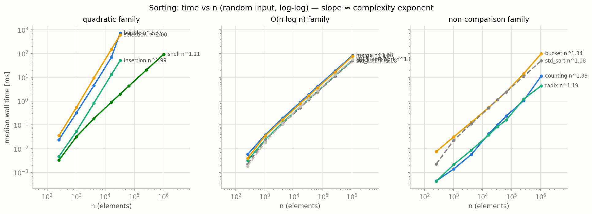

# cpp_algo_lab — C++ アルゴリズム実験室

## 概要

C++ を「アルゴリズムを素材に、測って理解する」ための学習ラボ。教科書の計算量表を眺めて終わりにせず、STL 形式のテンプレートとして自分で実装し、同じ計測ハーネスに 10 種のソートを通して、理論と実測のずれ（キャッシュ・分岐予測・アロケータ）まで含めて観察する。

Phase 1 の内容はソート 10 種（bubble / insertion / selection / shell / merge / quick / heap / counting / radix / bucket）の実装と **4 軸評価** — ①実測時間、②操作回数（比較・move・swap）、③入力分布別の挙動（5 分布）、④安定性の観測。Phase 2 は文字列検索 4 種（naive / KMP / BMH / Rabin-Karp）+ 標準ライブラリ基準線 3 種（`string_view::find`・C++17 searcher 2 種）を、①時間 vs テキスト長 n、②時間 vs パターン長 m、③文字操作回数（前処理・読取・比較の分離）、④テキスト 4 種（dna / ascii / english / periodic）の 4 軸で計測する。Phase 3 は merge sort を `std::jthread` → OpenMP task → 並列 STL と段階的に並列化し、BMH を overlap 付きチャンクへ分割して、1〜20 スレッドの時間・speedup・MADを比較する。Phase 4 は CUDA bitonic sort・`thrust::sort`・1 thread 1 開始位置の naive 検索を実装し、GPU kernel 単体と転送・結果構築込み end-to-end を分離して測る。全体設計はスペック [`../docs/superpowers/specs/2026-07-14-cpp-algo-lab-design.md`](../docs/superpowers/specs/2026-07-14-cpp-algo-lab-design.md) にある。



## クイックスタート

`make` は**このディレクトリ（`cpp_algo_lab/`）で実行**する。また、ベンチマーク中は他の重い処理を走らせないこと — WSL2 ではホスト側のスケジューリングが計測のばらつきに直結する（並列ハーネスは warm-up・測定順 shuffle・中央値 + MAD で緩和する）。

| コマンド | 内容 |
|---|---|
| `make test` | ASan/UBSan 付きで全 doctest をビルド・実行（デフォルトターゲット） |
| `make bench` | ソート + 検索 + CPU 並列の全計測 → `results/*.csv`。**数分かかる** |
| `make bench-quick` | ソートの縮小スイープ（n≤4096・2 反復）。配線確認用 |
| `make bench-search` | 検索のフル計測: 4 テキスト × テキスト長スイープ（n=4096〜4,194,304、m=16）+ パターン長スイープ（m=4〜1024、n=1,048,576）→ `results/search_*.csv`。**2〜3 分** |
| `make bench-search-quick` | 検索の縮小スイープ（n≤65,536・2 反復）。配線確認用 |
| `make bench-parallel` | CPU 並列のフル計測: sort n=2²⁴、search n=2²⁶、1〜20 threads、5 反復 → `results/parallel_*.csv` |
| `make bench-parallel-quick` | CPU 並列の縮小計測（2 反復）→ `build/parallel_*_quick.csv`。正式結果は変更しない |
| `make gpu-test` | CUDA sort / search の doctest をビルド・実行（RTX 5080 / `sm_120`） |
| `make gpu-sanitize` | GPU doctest を Compute Sanitizer memcheck で実行。現在の WSL2 では launcher exit 13 の既知制約あり |
| `make gpu-bench` | GPU のフル計測: sort n=2²⁴、search n=2²⁶、kernel / end-to-end、5 反復 → `results/gpu_*.csv` |
| `make gpu-bench-quick` | GPU の縮小計測（2 反復）→ `build/gpu_*_quick.csv`。正式結果は変更しない |
| `make trace` | n=256 の配列スナップショット列を採取 → `results/traces/trace_*.csv` |
| `make plot` | リポジトリルートの uv 環境（pandas/matplotlib）で全 17 枚の PNG（ソート 6 + 検索 5 + CPU 並列 3 + GPU 3）を生成 |
| `make plot-search` | 検索 5 枚の PNG のみ再生成 |
| `make plot-parallel` | CPU 並列 3 枚の PNG のみ再生成（フル CSV の schema・行集合も検証） |
| `make plot-gpu` | GPU 3 枚の PNG のみ再生成（フル CSV の schema・行集合も検証） |
| `make clean` | `build/` を削除 |

## 構成

```
cpp_algo_lab/
├── Makefile              # CPU/GPU test・bench / trace / plot / clean
├── common/
│   ├── lab/              # 計測基盤: Counted<T>・timer・datagen・stability・csv・table
│   └── tests/            # 計測基盤自体の doctest
├── sorting/
│   ├── include/sorting/  # 1 アルゴリズム = 1 ヘッダ（bubble.hpp … bucket.hpp、keys.hpp、all.hpp）
│   ├── tests/            # 全ソート × 全分布 + エッジケース + 安定性のテスト
│   └── bench/            # 計測・トレース実行体 bench_sorting.cpp
├── search/
│   ├── include/search/   # 1 アルゴリズム = 1 ヘッダ（naive/kmp/bmh/rabin_karp、baselines.hpp、stats.hpp、all.hpp）
│   ├── tests/            # 全出現・境界規約・厳密演算数・naive との全実装一致テスト
│   └── bench/            # 計測実行体 bench_search.cpp（n / m の 2 スイープ）
├── parallel/
│   ├── include/parallel/ # CPU ラダー: tuning / thread_merge / omp_merge / par_stl / omp_search
│   ├── tests/            # 逐次参照一致・安定性・例外伝播・チャンク境界テスト
│   ├── bench/            # thread sweep・warm-up・順序shuffle・中央値/MAD
│   └── gpu/              # CUDA utilities・bitonic/Thrust・naive search・GPU tests/bench
├── scripts/
│   ├── labviz.py         # 図の共有スタイル（パレット・傾きフィット）
│   ├── plot_results.py   # sorting CSV → 6 図の PNG
│   ├── plot_search.py    # search CSV → 5 図の PNG
│   ├── plot_parallel.py  # parallel CSV → 3 図の PNG
│   └── plot_gpu.py       # GPU CSV の厳格検証 → 3 図の PNG
├── results/              # 計測結果（CSV・図・トレース）— 再現性のためコミット対象
│   ├── plots/            # 17 枚の PNG（ソート 6 + 検索 5 + CPU 並列 3 + GPU 3）
│   └── traces/           # アルゴリズム別スナップショット CSV
├── docs/                 # 学習ノート（sorting / search / parallel_cpu / parallel_gpu）
└── third_party/doctest/  # 同梱テストフレームワーク（外部依存なし）
```

## 学習ロードマップ

推奨する読み順は次のとおり。

1. **[`docs/sorting.md`](docs/sorting.md) を読む** — 各アルゴリズムの動き（手動トレース付き）・実装の要点・理論予想・実測の読み方を 1 本にまとめた中心ドキュメント。
2. **ヘッダを読む** — `sorting/include/sorting/` を bubble → insertion → selection → shell → merge → quick → heap → counting → radix → bucket の順で。この順は「隣接交換 → shift → 探索と交換の分離 → gap → 分割統治 2 種 → 暗黙の木 → 非比較 3 種」という概念の積み上げになっている。どれも 20〜75 行。
3. **`make bench-sorting && make plot-sorting` で図を再生成する** — 自分のマシンで数値がどう変わるか（キャッシュサイズや CPU が違えば bubble のジャンプ位置も変わる）を確かめる。
4. **`results/plots/` の 6 図を `docs/sorting.md` の「結果の読み方」と突き合わせる** — 各アルゴリズム節の予想が図のどこに現れているか、逸脱（quick × reversed、bubble の傾き 2.37 など）がなぜ起きるかを確認する。
5. **Phase 2（検索）も同じ型で** — [`docs/search.md`](docs/search.md) を読み、`search/include/search/` を naive → kmp → bmh → rabin_karp → baselines の順で読む。この順は「総当たり → 失敗を知識に変える → 読まずに飛ばす → 比べずに照合する → 標準ライブラリはどう切ったか」という概念の積み上げになっている。読んだら `make bench-search && make plot-search` で 5 図を再生成し、`docs/search.md` の §5 と突き合わせる（BMH の下降が σ で頭打ちになる位置、periodic 列の 4 実装の反応が見どころ）。
6. **Phase 3（CPU 並列ラダー）へ進む** — [`docs/parallel_cpu.md`](docs/parallel_cpu.md) を読み、`parallel/include/parallel/` を tuning → thread_merge → omp_merge → par_stl → omp_search の順で読む。「手動 thread → runtime task → library → 分割統治すら不要な検索」という責任の移動を追ったら、`make bench-parallel && make plot-parallel` で 3 図を再生成し、speedup と MAD を §5 の説明に突き合わせる。
7. **Phase 4（GPU ラダー）で計測境界を学ぶ** — [`docs/parallel_gpu.md`](docs/parallel_gpu.md) を読み、`parallel/gpu/include/gpu/` を cuda_utils → sort → search の順で読む。`make gpu-bench && make plot-gpu` で kernel-only と end-to-end の差を再生成し、検索の約 64 MiB flag 回収がどこへ現れるかを §8 と突き合わせる。

## Phase 状況

| Phase | 内容 | 状態 |
|---|---|---|
| 1 | ソート 10 種 + 評価 4 軸（時間・操作回数・分布・安定性） | ✅ |
| 2 | 文字列検索 4 種 + 基準線 3 種（時間 n/m・操作回数・4 テキスト） | ✅ |
| 3 | CPU 並列化 | ✅ |
| 4 | GPU（CUDA bitonic / Thrust / naive search、kernel・end-to-end 計測） | ✅ ※ memcheck 起動制約は下記 |
| 5 | ドキュメント仕上げ | ✅ |

## 依存

- **ビルド・テスト・計測**: g++ 13（C++20）、make、OpenMP（libgomp）、TBB。doctest は `third_party/` に同梱。Phase 3 の `std::execution::par` テスト・ベンチは `-ltbb` でリンクするため、TBB がない環境では `make test` も完結しない。
- **GPU（任意）**: CUDA Toolkit 12.9（`/usr/local/cuda-12.9`）、compute capability 12.0 の NVIDIA GPU（Makefile は RTX 5080 向け `sm_120` を固定）。GPU target は通常の `make test` / CPU bench から分離している。現在の WSL2 セッションでは Compute Sanitizer 2025.2 が対象プロセスを起動できず exit 13 になるため、memcheck は native Linux または修復した WSL toolchain での再確認が必要。通常 CUDA テスト 66 assertions と全 benchmark repeat の逐次参照一致は通過済み。
- **図の生成のみ**: リポジトリルートの uv workspace（pandas / matplotlib）。`make plot` が内部で `uv run --no-sync` を呼ぶ。
