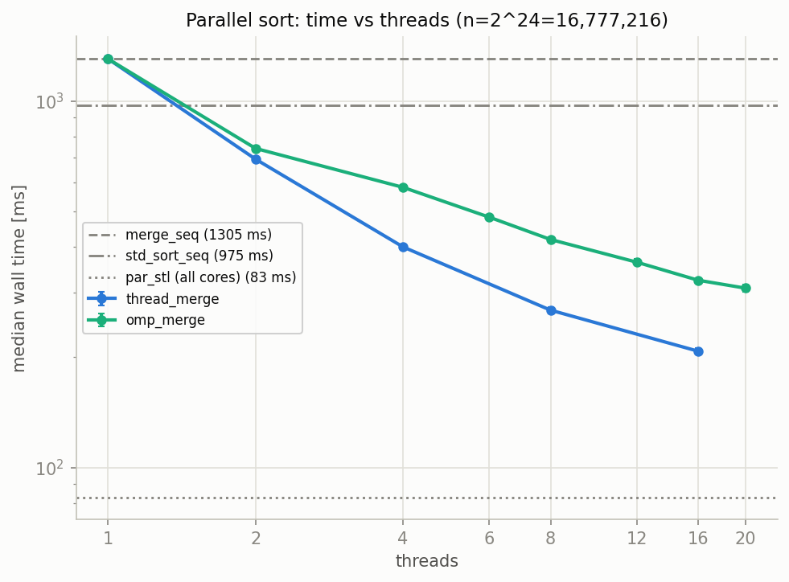
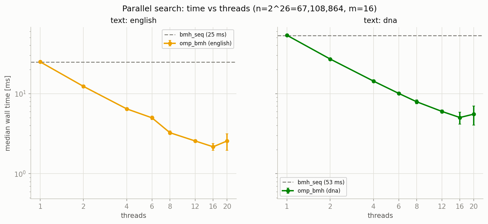
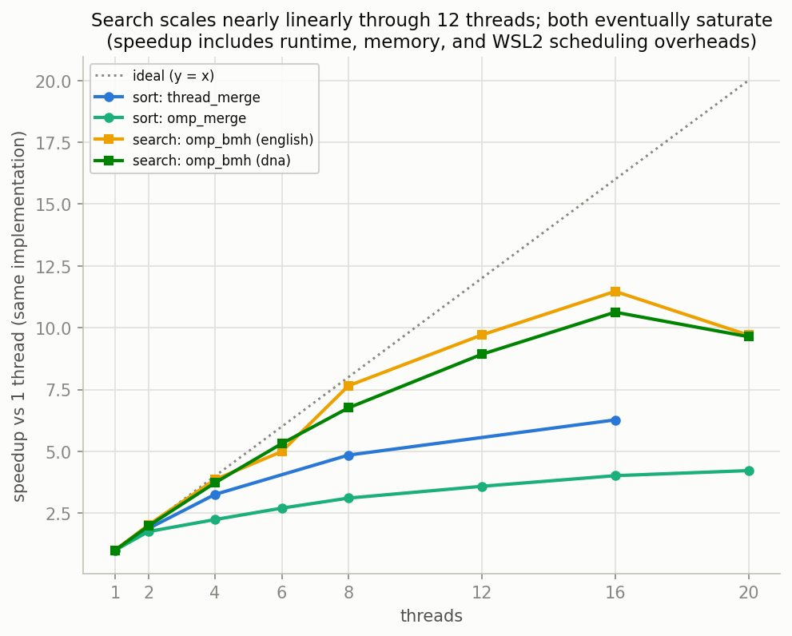

# CPU 並列化ラダー — 手動スレッド・OpenMP・並列 STL・チャンク検索

Phase 3 の中心ドキュメント。Phase 1 の merge sort と Phase 2 の BMH を同じ問題のまま並列化し、「逐次実装 → 手でスレッドを管理 → ランタイムに仕事を渡す → 標準ライブラリに任せる」というラダーを登る。目的は最速コードを 1 本だけ得ることではない。どの段で何を自分が制御し、何を実行系へ明け渡し、どのコストが最後まで残るかを、コードとスレッドスケーリングの両方から理解することにある。

実装は [`../parallel/include/parallel/`](../parallel/include/parallel/) に 1 方式 = 1 ヘッダで置いた。計測は $n=2^{24}$ の整数ソートと $n=2^{26},m=16$ の文字列検索を固定し、スレッド数だけを 1 から 20 へ変える。本文の値はすべて `results/parallel_sort.csv` と `results/parallel_search.csv` のフル計測結果から引いている。

## 1. ラダーの思想

### 1.1 同じ問題を、責任の置き場所だけ変えて解く

ソート側の 3 段は、再帰の数学よりも「仕事を誰が配るか」が違う。

| 段 | 実装 | 仕事の分配 | スレッド数制御 | 安定性 | 主な学び |
|---|---|---|---|---|---|
| 逐次 | `merge_sort` | なし | 1 | 安定 | 基準線 |
| 手動 | `thread_merge_sort` | `std::jthread` を再帰的に生成 | 深さから 2 の冪 | 安定 | lifetime・join・例外伝播 |
| runtime | `omp_merge_sort` | OpenMP task を worker pool に投入 | 任意の要求値 | 安定 | task・firstprivate・同期 |
| library | `par_stl_sort` | TBB backend に委譲 | ライブラリ既定 | 不安定 | 制御を手放して最適化を買う |

`std::thread` 版では、どの再帰点でスレッドを生成し、いつ join するかをコードが明示する。OpenMP 版では同じ再帰木を task として表し、どの worker がどの部分木を処理するかは runtime が決める。並列 STL 版のユーザーコードは `std::sort(std::execution::par, ...)` の 1 行で、分割方法も cutoff もスレッド数も見えない。

この順に読むと、抽象化は単なる短縮記法ではなく、**制御と責任の交換**だと分かる。手動版は挙動を説明しやすい代わりに、例外と lifetime を自分で正しく扱う必要がある。ライブラリ版は制御を失う代わりに、実装者が積み上げたアルゴリズム選択・粒度調整・メモリ最適化を利用できる。

### 1.2 検索は別の軸にいる

検索側の [`omp_bmh_search`](../parallel/include/parallel/omp_search.hpp) は分割統治すら要らない。候補開始位置 $i$ ごとの照合は互いに独立なので、開始位置の集合を連続チャンクに切ればよい。この性質を **embarrassingly parallel** と呼ぶ。

ただし「並列化しやすい」と「境界を雑に扱ってよい」は同義ではない。各チャンクが所有する開始位置と、実際に読む文字範囲は異なる。パターン長 $m$ なら、チャンク末尾に $m-1$ 文字ののりしろが必要になる。Phase 3 の検索実装で最も重要なのは OpenMP の構文ではなく、この境界条件を構成的に正しくすることだ。

## 2. 並列マージソートの構造

### 2.1 再帰木は共通、実行方法だけが違う

逐次 merge sort の骨格は次の 3 段である。

1. 区間を左右半分へ分ける。
2. 左右をそれぞれ整列する。
3. 2 つの整列済み run を merge する。

左右の整列には依存がないので同時に進められる。一方、最後の merge は両方の完了を待たなければならない。`thread_merge.hpp` と `omp_merge.hpp` はこの同じ依存グラフを別の実行機構で表している。

```text
sort [0, n)
├── sort [0, n/2)       独立 ─┐
├── sort [n/2, n)       独立 ─┤ parallel region
└── merge [0, n)        待機後に逐次
```

最上段だけでなく各部分木にも同じ形が現れる。したがって work は $O(n\log n)$ のままだが、span（依存関係上どうしても直列に残る経路）には各階層の merge が残る。最上位の `std::inplace_merge` は目立つが、頭打ちの原因をそれ 1 個だけに帰属させてはいけない。cutoff 以下の逐次 sort、各階層の merge、allocation、メモリ帯域、thread/task overhead が観測時間へ同時に入る。

### 2.2 `std::jthread` 版 — lifetime をコードで所有する

[`thread_merge.hpp`](../parallel/include/parallel/thread_merge.hpp) は左半分を新しい `std::jthread` に渡し、右半分を現在のスレッドで処理する。右半分が終わったら左を join し、最後に `std::inplace_merge` を呼ぶ。

`std::thread` では joinable なオブジェクトが破棄されると `std::terminate` になる。右側の再帰が例外を投げたときでも確実に join するには RAII が必要であり、C++20 の `std::jthread` がその役を担う。

もう 1 つの穴は「子スレッドの例外は呼び出し元へ自動伝播しない」ことだ。子スレッド内から例外が外へ抜けると `std::terminate` になるため、本実装は `std::exception_ptr` に捕捉し、join 後に親側で再送出する。これは並列アルゴリズムの正しさが結果配列だけでなく、失敗経路の意味論にも及ぶ例である。

`threads` は厳密な上限ではない。`depth_for_threads()` は要求値以上になる最小の $2^d$ を求め、再帰を深さ $d$ まで並列化する。要求 3 は実効 4、要求 20 は実効 32 になり得る。このためベンチでは `thread_merge` を 1 / 2 / 4 / 8 / 16 に限定した。API を読むときは、引数名だけでなくこの丸め規則まで仕様として読む必要がある。

### 2.3 cutoff はヒューリスティックである

[`tuning.hpp`](../parallel/include/parallel/tuning.hpp) の `kParallelSortCutoff` は $2^{15}=32768$。これ未満の区間は新しい thread/task を作らず、Phase 1 の `lab::merge_sort` に戻す。

粒度が小さすぎると、実仕事より thread 生成・task scheduling・同期の固定費が大きくなる。反対に cutoff が大きすぎると、並列にできる仕事まで逐次に残る。32768 はこの環境向けの実用的なヒューリスティックであり、全 CPU・全要素型に対する最適値ではない。厳密に最適化するなら、cutoff 自体を横軸にした別の sweep が必要になる。

基底処理に既存 `merge_sort` を再利用できるのは、呼び出しごとに独立した `std::vector` buffer を所有するからだ。共有 scratch buffer なら左右の並行呼び出しが同じ領域へ書き込み、data race になる。逐次コードの所有権設計が、そのまま並列再利用の可否を決めている。

### 2.4 安定性は合成で保存される

両並列 merge sort は安定である。

- cutoff 以下の `lab::merge_sort` が安定。
- `std::inplace_merge` が安定。
- 左右の run 内で保たれた順序を、安定な merge が壊さない。

これは「並列だから順序が不定になる」という一般的な印象への反例になる。並列実行順は不定でも、アルゴリズムの合成規則が安定性を保存すれば出力順序は決定的に保てる。

## 3. OpenMP task と並列 STL

### 3.1 task は仕事、thread は実行者

[`omp_merge.hpp`](../parallel/include/parallel/omp_merge.hpp) では左半分を `#pragma omp task` として生成し、右半分を現在の task で再帰処理する。`#pragma omp taskwait` が左右の完了を待ち、その後で merge する。

`std::jthread` 版では再帰木の各生成点が OS thread の生成へ直結する。OpenMP 版では再帰木は task の集合になり、固定 worker pool が task を消費する。したがって 3 / 6 / 12 / 20 のような任意の worker 数を自然に使え、runtime が空いた worker へ仕事を割り当てられる。

トップレベルは次の形になる。

```cpp
#pragma omp parallel num_threads(threads)
#pragma omp single nowait
detail::omp_merge_impl(first, last, comp);
```

全 worker が同じ再帰を開始してはいけないので、最初の呼び出しは `single` の 1 worker だけが行う。その再帰から生成された task を team 全体が処理する。ベンチは `omp_set_dynamic(0)` で動的縮退を止め、要求した team size が実際に得られたことを計測前に確認する。

### 3.2 task の firstprivate

task 内で参照する関数ローカルの iterator と comparator は、OpenMP の task data-sharing 規則により firstprivate になる。task 生成時点の値が task 側へコピーされるため、呼び出し元の stack frame にある変数を後から参照して dangling する構造ではない。

ここでコピーされるのは iterator が指す要素ではなく、iterator と comparator の値である。左右の iterator は互いに重ならない区間を指し、最後の merge は `taskwait` 後なので、同じ要素への同時書き込みは起きない。

### 3.3 `std::execution::par` は別アルゴリズムの基準線

[`par_stl.hpp`](../parallel/include/parallel/par_stl.hpp) は `std::sort(std::execution::par, ...)` を呼ぶだけである。この環境の libstdc++ は TBB backend を使う。thread 数や cutoff をこのラッパから制御することはできない。

重要なのは、`par_stl_sort` が不安定ソートであり、自作 merge 2 種は安定ソートだという違いである。`par_stl` の時間を `merge_seq` と直接割って「同じ仕事が何倍」と解釈してはいけない。並列化方式だけでなく、安定性の契約、内部アルゴリズム、buffer 戦略、メモリアクセスも異なる。

並列化の効果を見る公正な基準線は、同じ不安定 `std::sort` の逐次版 `std_sort_seq` である。自作 merge のスケーリングは、それぞれの 1-thread 実行を基準に読む。

## 4. 検索のチャンク分割と境界の証明

### 4.1 分けるのは文字列ではなく開始位置

テキスト長を $n$、パターン長を $m$ とすると、候補開始位置は

$$0,1,\ldots,n-m$$

の $n-m+1$ 個である。これを `starts` と置く。thread 数を $P$、チャンク番号を $c$ とすると、チャンク $c$ の所有範囲は

$$
lo_c=\left\lfloor\frac{starts\cdot c}{P}\right\rfloor,\qquad
hi_c=\left\lfloor\frac{starts\cdot(c+1)}{P}\right\rfloor
$$

で定める。所有する**開始位置**は半開区間 $[lo_c,hi_c)$ である。

開始位置 $hi_c-1$ の照合には、そこから $m$ 文字が必要になる。したがって実際に渡す text slice は

$$
text[lo_c,\;hi_c+m-1)
$$

で、長さは $(hi_c-lo_c)+m-1$ になる。

```text
candidate starts:  ... | lo -------- hi | ...
owned starts:             [lo, hi)
text slice:               [lo, hi + m - 1)
                                      └─ overlap tail ─┘
```

### 4.2 重複なし・取りこぼしなし

slice 内で BMH が返せるローカル開始位置は $0$ から $hi_c-lo_c-1$ までである。グローバル位置へ戻すと、ちょうど $lo_c$ から $hi_c-1$ になる。

- 隣接チャンクの所有開始位置は半開区間なので重ならない。
- 全チャンクの区間を連結すると $[0,starts)$ を覆う。
- 各 slice は最後の所有開始位置から $m$ 文字を読むだけの長さを持つ。

ゆえに各一致は**必ず 1 チャンクだけ**から返る。後処理で重複を除く必要はない。正しさをフィルタへ委ねず、分割の構成そのものに埋め込んでいる。

`m-1` の overlap を忘れると、チャンク境界をまたぐ一致を落とす。反対に各チャンクへ同じ文字範囲を渡し、返された開始位置を所有範囲で絞らなければ重複する。[`test_parallel.cpp`](../parallel/tests/test_parallel.cpp) は全境界の直前・境界上へ pattern を植えるテストと、`"aaa"` の重なり一致テストの両方でこの off-by-one を狙う。

### 4.3 shared-nothing の代金

各チャンクは BMH の shift table を独立に作る。共有 table を構築して read-only で渡す設計も可能だが、本実装は既存 `bmh_search(slice, pattern)` をそのまま再利用するため、チャンクごとに $m-1$ 回の前処理を払う。

$m=16$、$n=2^{26}$ の今回の計測では小さいが、$m$ が大きい、または各チャンクが短い場合には無視できなくなる。「共有状態を持たないから正しい・簡単」と「同じ前処理を繰り返すから高い」は同じ設計判断の表裏である。

## 5. 結果の読み方

### 5.1 計測方法 — 中央値だけでなく揺れも残す

フル計測は sort を $n=2^{24}=16{,}777{,}216$、search を $n=2^{26}=67{,}108{,}864, m=16$ に固定する。入力 seed は 42。各構成を 1 回 warm-up した後、5 回の timed round を行う。

構成を 1 個ずつ連続測定すると、後に置かれた構成だけが温度・boost・WSL2 scheduling の影響を受ける。そこで各 round の構成順を決定的に shuffle し、時間方向の偏りを特定方式へ集中させない。各 timed repeat の出力はすべて逐次参照と照合する。

CSV は中央値 `median_ms` と median absolute deviation `mad_ms` を保存する。MAD は

$$
\operatorname{MAD}=\operatorname{median}_i\left|x_i-\operatorname{median}(x)\right|
$$

で、外れ値に強い散らばりの尺度である。図の error bar は MAD を表す。これは信頼区間ではないが、「隣の thread 数との差より測定の揺れが大きいか」を見る手掛かりになる。

### 5.2 parallel_sort_scaling — 自作 merge は伸びるが頭打ちになる



`thread_merge` は 1 thread の 1302.70 ms から 16 threads の 207.68 ms へ下がり、同一実装比 **6.27 倍**になった。`omp_merge` は 1 thread の 1302.43 ms から 20 threads の 308.52 ms へ下がり、**4.22 倍**である。

OpenMP は任意 thread 数を使える一方、この workload では手動版より遅い。task scheduling の柔軟性は無料ではなく、再帰 task の管理費と merge のメモリ仕事が残る。ここから「OpenMP は常に遅い」と一般化はできない。粒度、runtime、CPU、要素型が変われば関係も変わる。

基準線は `merge_seq` 1305.26 ms、`std_sort_seq` 975.15 ms、`par_stl` 82.87 ms。並列 STL は逐次 `std::sort` より **11.77 倍**速い。ただし前節のとおり、これは不安定 `std::sort` 同士の比較である。`par_stl` と安定 merge の差には、並列度以外のアルゴリズム差も含まれる。

### 5.3 parallel_search_scaling — 12〜16 thread まで伸び、20で揺れる



english の `omp_bmh` は 1 thread 24.88 ms、12 threads 2.56 ms、16 threads 2.17 ms。speedup はそれぞれ **9.71 倍**、**11.47 倍**である。20 threads は 2.56 ms へ戻り、**9.70 倍**になった。

DNA は 1 thread 53.44 ms、12 threads 5.99 ms、16 threads 5.03 ms、20 threads 5.55 ms。speedup は **8.92 倍**、**10.63 倍**、**9.64 倍**である。小 alphabet の DNA は BMH の shift が短く、逐次時間そのものが english より長いが、開始位置チャンクの独立性は同じなのでスケーリングの形は似る。

20-thread 点では MAD が english 0.60 ms、DNA 1.48 ms と大きい。16→20 の小さな逆転は error bar と重なり、確定的なアルゴリズム劣化より「飽和域で runtime・memory・WSL2 scheduling の影響が表面化した」と読むのが安全である。この CPU 表示は 20 CPUs / 20 cores / 1 thread per core なので、thread 数だけを根拠に oversubscription と断定はできない。

### 5.4 parallel_speedup — 理想線との差をどう読むか



speedup は各実装自身の 1-thread 時間 $T_1$ を基準に

$$S(p)=\frac{T_1}{T_p}$$

で計算する。したがって `thread_merge` と `omp_merge` の曲線は「同じ実装を何 worker にしたか」を表し、アルゴリズム間の絶対速度比較ではない。

検索曲線は 12〜16 threads までソート曲線より理想線 $S(p)=p$ に近い。検索チャンクには最後の全体 merge がなく、各 worker の局所結果を thread 順に連結するだけだからだ。それでも 16 threads で約 10〜11 倍に留まり、20 では揺れる。embarrassingly parallel でも thread 作成、結果 vector、メモリ帯域、scheduler は消えない。

Amdahl の単純モデル

$$
S(p)=\frac{1}{s+(1-s)/p}
$$

を $s$ について解くと

$$
s_{\mathrm{eff}}=\frac{p/S(p)-1}{p-1}
$$

になる。`omp_merge` の $p=20,S=4.22$ を入れると $s_{\mathrm{eff}}\approx 0.20$、`thread_merge` の $p=16,S=6.27$ では約 0.10。english search の $p=16,S=11.47$ は約 0.026、DNA の $S=10.63$ は約 0.034 である。

ここで得た値は**実効逐次率**であり、ソースコード中の逐次行数や最上位 merge の比率そのものではない。runtime overhead、load imbalance、memory contention、cutoff、allocation まで「理想並列でなかった部分」として $s_{\mathrm{eff}}$ に押し込まれる。Amdahl は原因を特定する装置ではなく、観測された頭打ちを 1 つの尺度へ畳むモデルとして使う。

## 6. 教訓と落とし穴

### 6.1 正しさの sanitizer と並行性の sanitizer は違う

`make test` は ASan/UBSan 付きで、out-of-bounds、use-after-free、代表的な未定義動作を検査する。しかし ASan/UBSan は data race を検出しない。今回の「sanitizer clean」は並列正しさの十分条件ではない。

race への防御は、非重複区間という設計、taskwait/join、共有状態を避ける構造、逐次参照との反復照合で積み上げている。環境が許せば ThreadSanitizer を別途使う価値はあるが、OpenMP/TBB runtime との組み合わせでは tool 側の制約や false positive も評価する必要がある。

### 6.2 ベンチの thread 数は契約として確認する

OpenMP の `num_threads(p)` は要求であり、runtime 設定によって縮退する余地がある。要求値を CSV の x 軸へ書くなら、実際に同じ team size が得られたことを確認しなければならない。本ベンチは dynamic team sizing を無効化し、各 $p$ の team を事前生成して一致しなければ停止する。

並列 STL は同じ確認ができないため、CSV の `threads=0` は「library default」を意味する。0 workers という意味ではない。この点も、自作曲線と同じ x 軸へ 1 点として載せず、水平な reference line にした理由である。

### 6.3 quick 計測は正式結果を壊さない

`make bench-parallel-quick` は配線確認用で、sort $n=2^{20}$、search $n=2^{22}$、2 repeats に縮小する。出力は gitignored の `build/parallel_sort_quick.csv` と `build/parallel_search_quick.csv` であり、コミット対象のフル CSV を上書きしない。

フル計測も、まず `build/*.pending.csv` へ書く。sort または search が途中で正しさ検証に失敗した場合、正式 CSV は以前の完全な状態のまま残る。両方が成功して writer が閉じた後だけ `results/` へ反映する。再現性のために生成物をコミットするなら、生成途中の破片を正式成果物と区別する必要がある。

プロット側も schema、行集合、$n$、$m$、repeat 数を検証する。quick や部分 CSV を誤って正式図へ変換すると、見た目だけ整った誤情報になるからだ。

### 6.4 20 thread の逆転を説明しすぎない

考えられる候補は、memory bandwidth の飽和、cache contention、OpenMP runtime、OS/WSL2 scheduling、CPU topology、短くなった局所仕事に対する固定費など複数ある。現在の CSV は「20 thread 点の MAD が大きく、16 thread より速いとは言えない」ことまでは示すが、原因を分離する counter は持っていない。

原因を追うなら、`perf` の cache miss / bandwidth、CPU affinity、thread ごとの仕事量、native Linux と WSL2 の比較が次の実験になる。今ある証拠を越えて 1 原因へ断定しないこと自体が、計測ラボの重要な規律である。

### 6.5 最速点と最良設計は同じとは限らない

この実機の絶対時間では `par_stl` が最速だが、自作 2 種には別の価値がある。安定性が必要、thread 数を制限したい、再帰と同期を学びたい、例外経路を制御したい、といった要件では評価軸が変わる。

逆に「学習用だから遅くてよい」で終えるべきでもない。自作実装と最適化済み library を同じ図へ置くことで、自分が書いたアルゴリズムのどこまでが原理で、どこからが実装技術の差かを問える。

## 7. Phase 4 への接続

検索の開始位置が独立という構造を極限まで細かくすると、「1 GPU thread = 1 開始位置」になる。KMP の failure state や BMH の data-dependent shift をあえて捨て、独立性を優先する考え方は PFAC と同じ方向を向く。Phase 4 の naive CUDA kernel は、この単一 pattern 版になる。

GPU では CPU よりはるかに多い thread を使える一方、host-device transfer、warp divergence、coalesced access、結果回収が新しいコストになる。検索が CPU で embarrassingly parallel だった事実は出発点であって、転送込みでも速いという結論を保証しない。

ソートはさらに難しい。CPU で逐次 merge chain が span に残ったように、GPU でも全体順序を構成するための通信と同期が必要になる。Phase 4 では教育用 bitonic network と `thrust::sort` を並べ、規則的で GPU に載せやすい構造と、実用 library が積み上げた radix/merge 系最適化の距離を測る。

Phase 3 の結論は「並列にすれば速い」ではない。**独立な仕事を作れるほど理想線へ近づき、依存・同期・memory traffic・runtime overhead が残るほど早く頭打ちになる。しかも、その境界はアルゴリズムだけでなく実行環境と計測方法にも依存する。** Phase 4 では同じ問いを、CPU core から GPU thread へ移してもう一度測る。

---

*数値の出典: `results/parallel_sort.csv` / `parallel_search.csv`（seed 42、warm-up 1 回、5 timed repeats の中央値 + MAD、repeat ごとに構成順を shuffle、WSL2 + g++ 13 `-O2`）。正しさテストは [`../parallel/tests/test_parallel.cpp`](../parallel/tests/test_parallel.cpp)。図の再生成は `make bench-parallel && make plot-parallel`。Amdahl の法則と並列ソート・GPU検索の文献対応は [`references.md`](references.md)。*
