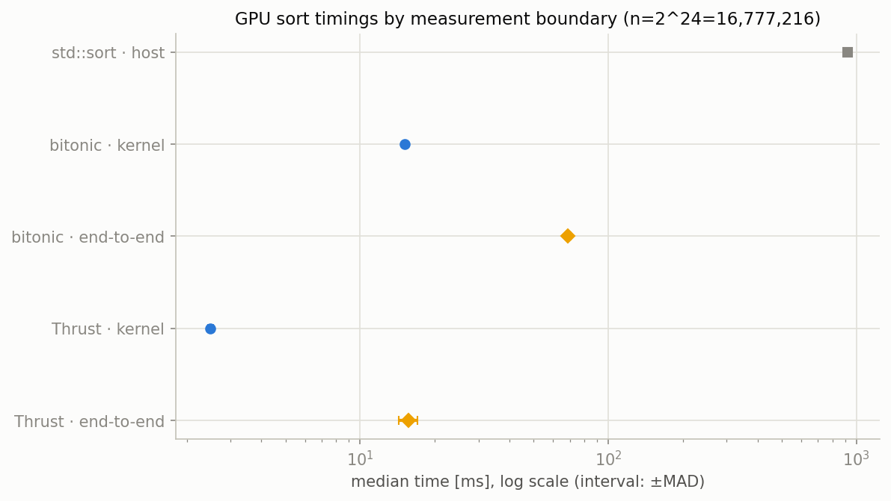
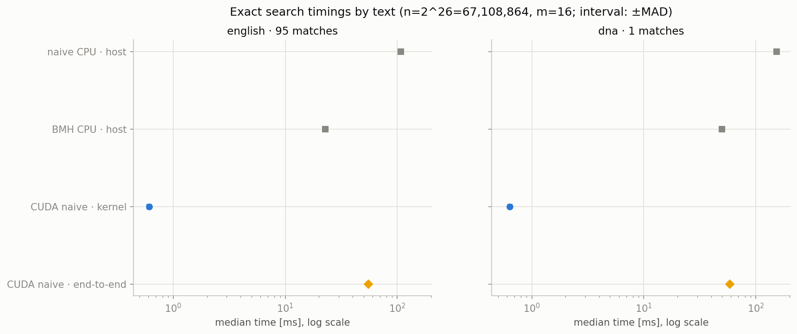
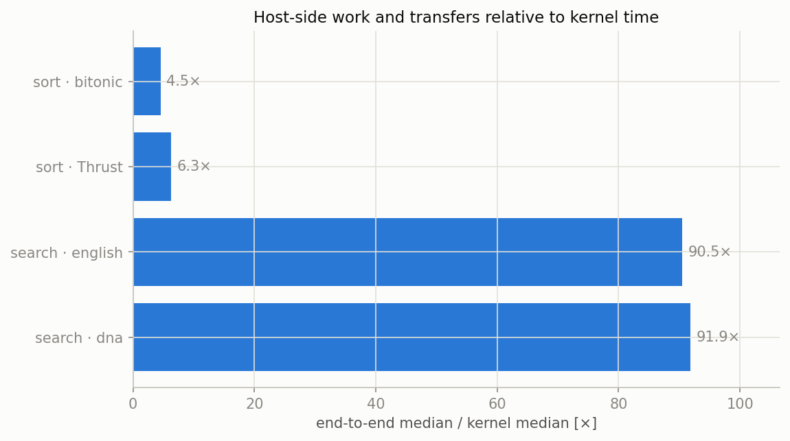

# GPU 並列化ラダー — CUDA bitonic・Thrust・1 thread 1 開始位置検索

Phase 4 の中心ドキュメント。

Phase 3 では CPU core の間に仕事を分けた。
Phase 4 では同じソートと文字列検索を、数万〜数百万の GPU thread へ分ける。
目的は「GPU は速い」という一語を確認することではない。
どの仕事が大量の独立 thread に向くか、device 内の処理が速くても利用者が払う時間に何が残るかを、実装と計測の両方から理解する。

実装は [`../parallel/gpu/`](../parallel/gpu/) に置いた。
ソートは教育用 bitonic sorting network と最適化済み `thrust::sort`、検索は 1 CUDA thread が 1 候補開始位置を照合する naive 法である。
本文の数値はすべて [`gpu_sort.csv`](../results/gpu_sort.csv) と [`gpu_search.csv`](../results/gpu_search.csv) のフル計測結果から引いている。

## 1. ラダーの見取り図

### 1.1 CPU の少数 worker から GPU の多数 thread へ

GPU では、CPU のように重い thread を少数作るのではなく、同じ命令列を実行する軽い thread を大量に起動する。
CUDA の呼び出し側は host、GPU 側は device と呼ぶ。

本ラボのラダーは次の 3 段である。

| 問題 | 段 | 実装 | 並列単位 | 主な学び |
|---|---|---|---|---|
| sort | CPU 基準 | `std::sort` | 1 host thread | 同じ不安定ソート契約の基準 |
| sort | 自作 GPU | bitonic network | compare-exchange の組 | 規則的な同期段と計算量 |
| sort | library GPU | `thrust::sort` | library が決定 | 最適化済み実装との差 |
| search | CPU 基準 | naive / BMH | 1 host thread | 全候補走査と skip の基準 |
| search | 自作 GPU | CUDA naive | 1 candidate start / thread | 独立性・分岐・結果回収 |

bitonic と Thrust は同じ不安定な昇順ソート契約を満たすが、内部の仕事量は同じではない。
naive と BMH は同じ一致位置列を返すが、CPU 上では BMH が候補位置を飛ばす。
GPU naive はその賢い skip を捨て、候補位置間の独立性を最大にする。

### 1.2 kernel 時間と利用者の待ち時間は別物

GPU の計測には少なくとも 2 つの境界がある。

- `kernel`: 入力がすでに device memory にあると仮定し、device 上のアルゴリズムだけを測る。
- `end_to_end`: allocation、host-to-device 転送、kernel、device-to-host 転送、host 側の結果構築、解放までを測る。

前者は反復処理や GPU resident pipeline の部品性能を表す。
後者は host から 1 回呼んで結果を受け取る API の待ち時間を表す。
どちらも正しいが、答える質問が違う。

## 2. CUDA の実行モデル

### 2.1 grid・block・thread

CUDA kernel は grid として起動される。
grid は block の集合、block は thread の集合である。
本ラボは 1 次元だけを使い、各 thread の全体 index を次式で求める。

```cpp
const std::size_t i =
    static_cast<std::size_t>(blockIdx.x) * blockDim.x + threadIdx.x;
```

`threadIdx.x` は block 内の位置、`blockIdx.x` は block の位置、`blockDim.x` は 1 block の thread 数である。
要素数が block サイズの倍数とは限らないため、kernel 冒頭で `i >= n` を検査する。

本実装の block サイズは 256 threads。
必要 block 数は

$$
\left\lceil\frac{n}{256}\right\rceil
$$

である。
[`ceil_div`](../parallel/gpu/include/gpu/cuda_utils.cuh) が整数演算でこの値を作る。

### 2.2 SIMT と warp divergence

GPU は SIMT（single instruction, multiple threads）で thread 群を実行する。
NVIDIA GPU では近接 thread が warp として同じ命令を進める。
同じ warp の thread が条件分岐で別方向へ進むと、両経路を順に実行して inactive thread を mask する必要がある。

bitonic の compare-exchange は partner ごとに交換の有無が分かれる。
検索では、最初の文字で不一致になる thread と、pattern の奥まで一致する thread が分かれる。
したがって「thread 数が多い」だけで全 thread が同じ効率になるとは限らない。

ただし今回の CSV は warp efficiency や memory transaction counter を採取していない。
english と DNA の差を divergence だけに帰属させることはできない。
原因を分けるには Nsight Compute 等の追加実験が必要である。

### 2.3 同期の範囲

1 回の kernel 内で block を越える一般的な同期は使っていない。
bitonic は各 compare-exchange 段を別 kernel として起動する。
同じ CUDA stream 上の kernel は発行順に実行されるため、前段の書き込み完了後に次段が進む。

host wrapper は最後に `cudaDeviceSynchronize()` を呼び、その後に device-to-host copy を行う。
benchmark の kernel mode は CUDA event の stop を同期する。
非同期 launch の直後に host clock を止めるだけでは、実処理時間を測れない。

## 3. CUDA 境界を安全に扱う小さな基盤

### 3.1 `check_cuda`

CUDA API は status code を返す。
[`check_cuda`](../parallel/gpu/include/gpu/cuda_utils.cuh) は失敗時に操作名と `cudaGetErrorString` を含む `std::runtime_error` を投げる。

kernel launch 自体は非同期なので、launch 構文の直後には `cudaGetLastError()` を検査する。
実行中の fault は同期点で表面化する。
「launch 成功」と「kernel 完走」は別の検査点である。

### 3.2 `DeviceBuffer<T>`

device allocation は RAII object が所有する。
constructor が `cudaMalloc`、destructor が `cudaFree` を行う。
copy は禁止し、move だけを許可する。

この構造により、host wrapper の途中で例外が投げられても確保済み device memory は解放される。
生 pointer は kernel へ渡すために `get()` で借りるだけで、所有権は移さない。

### 3.3 `EventTimer`

CUDA event は device stream 上の時点を記録する。
`EventTimer::measure_ms` は start event、対象 operation、stop event を同じ stream へ置き、stop を待って経過時間を返す。

これは kernel mode 用である。
end-to-end mode は host allocation や同期 copy も含めるため、`std::chrono::steady_clock` を使う。
境界に合った時計を選ぶ必要がある。

## 4. Bitonic sorting network

### 4.1 値に依存しない比較網

通常の quick sort は pivot と比較結果によって次の仕事が変わる。
sorting network は、どの index pair を比較するかが入力値によらず決まる。
規則的な仕事は GPU へ写しやすい。

bitonic sort は「単調増加列と単調減少列を連結した bitonic sequence」を作り、それを compare-exchange で merge する。
sequence 幅を 2, 4, 8, ... と倍増し、各幅の中で partner 距離を半減させる。

index `i` と比較する partner は

$$
partner=i\oplus stride
$$

で求める。
`partner <= i` の組を捨てることで、各 pair を 1 thread だけが処理する。
昇順・降順は `(i & sequence) == 0` で切り替える。

### 4.2 段数と計算量

$n=2^p$ とする。
sequence 幅 $2^k$ には $k$ 個の stride 段がある。
全段数は

$$
1+2+\cdots+p=\frac{p(p+1)}{2}
$$

である。
各段が $O(n)$ の compare-exchange を持つので、総仕事量は

$$
O(n\log^2 n)
$$

になる。
$n=2^{24}$ では 300 段、すなわち 300 kernel launches である。
これは規則的だが、比較ソートとして仕事量が少ないわけではない。

### 4.3 2 の冪でない長さを padding する

device 関数 `bitonic_sort_device` は長さが 2 の冪であることを要求する。
host wrapper `bitonic_sort` は任意長を受け入れ、次の 2 の冪まで `INT_MAX` で埋める。

昇順 sort 後、padding は末尾へ集まる。
元の長さだけ先頭から戻せばよい。
入力自体に `INT_MAX` があっても、値として区別する必要はない。

padding は API を使いやすくする一方、直前の 2 の冪を 1 要素越えた入力で device memory と仕事量をほぼ 2 倍にする。
benchmark はちょうど $2^{24}$ なので padding cost を含まない。

### 4.4 安定性

この bitonic sort は安定性を保証しない。
`thrust::sort` と `std::sort` も本比較では不安定ソート契約である。
値だけの正しさ比較は公正だが、stable sort が必要な用途へ結果を一般化してはいけない。

## 5. Thrust は何を基準にしているか

[`thrust_sort_device`](../parallel/gpu/include/gpu/sort.cuh) は device pointer と stream を `thrust::sort` へ渡す。
host wrapper は allocation と往復転送を追加する。

自作 bitonic と同じ API 契約を満たしていても、Thrust の内部アルゴリズム、temporary storage、memory access、launch 構成は library が選ぶ。
整数 sort では radix 系最適化が使われ得るが、本ラボは Thrust 内部を計測器で同定していない。
したがって本文では「この環境の `thrust::sort`」として扱い、特定実装を断定しない。

bitonic は原理を読める約数十行の教材である。
Thrust は長年の GPU sort 研究と実装最適化を利用する基準線である。
両者を並べることで、並列化の原理と production library の距離を可視化できる。

## 6. 1 CUDA thread = 1 検索開始位置

### 6.1 候補開始位置を完全に分離する

テキスト長を $n$、pattern 長を $m$ とする。
$m\le n$ のとき候補開始位置数は

$$
starts=n-m+1
$$

である。
CUDA thread `pos` は `text[pos:pos+m]` だけを pattern と比較する。
他 thread の状態や結果に依存しない。

Phase 3 の OpenMP BMH は候補範囲を大きな chunk に分けた。
Phase 4 は粒度を極限まで小さくし、1 candidate start を 1 thread にした形である。

### 6.2 byte flag による結果 API

各 thread は一致なら 1、不一致なら 0 を `flags[pos]` に書く。
host は flags を先頭から走査し、1 の index を `std::vector<std::size_t>` へ集める。

この方式には 3 つの利点がある。

1. thread 間の atomic counter が不要。
2. 結果位置が自然に昇順になる。
3. 全候補が必ず 1 byte を書くため、正しさを確認しやすい。

代償は出力量である。
$n=2^{26},m=16$ では flags は $67{,}108{,}849$ bytes、約 64 MiB になる。
実際の一致は english 95 件、DNA 1 件だけなので、返したい情報量より大幅に大きい。

device 上の compaction、bit packing、atomic 付き位置配列などで転送量は減らせる。
ただしそれらは scan、atomic contention、容量管理という別の論点を持ち込む。
本ラボは最初の GPU rung として単純な flags を選んだ。

### 6.3 境界規約

Phase 2 と同じ API 規約を保つ。

- empty pattern は $0$ から $n$ までの全位置に一致する。
- pattern が text より長ければ空結果。
- overlapping match をすべて返す。
- 出力位置は昇順。

empty pattern の場合も各候補 thread の比較 loop は 0 回で、一致 flag を書く。
block 境界の直前・境界上・直後へ 1 個ずつ pattern を置くテストで index 計算を検証している。

### 6.4 PFAC との関係

PFAC は failure transition を省いた Aho–Corasick を多数開始位置から並列に進める考え方である。
本実装は「開始位置ごとの状態を独立に進める」という方向を共有する。

しかし本実装は単一 pattern の naive 比較であり、trie も multi-pattern automaton も持たない。
したがって PFAC そのものではなく、単一 pattern で独立性を縮小再現した教材と位置づける。

## 7. 正しさと計測契約

### 7.1 テスト

[`test_gpu.cu`](../parallel/gpu/tests/test_gpu.cu) は 8 test cases、66 assertions を持つ。
sort は empty、1 要素、2 の冪でない長さ、重複、負数、`INT_MIN` / `INT_MAX`、全生成分布、大きな multi-block 入力を `std::sort` と比較する。

search は empty pattern、長すぎる pattern、完全一致、重なり一致、block 境界、全生成 corpus を CPU naive と比較する。
benchmark も warm-up と全 timed repeat の結果を CPU reference と照合する。

### 7.2 workload と反復

フル sort は random uniform の $n=2^{24}$ integers。
フル search は english / DNA の $n=2^{26},m=16$。
seed は 42、warm-up 1 回、timed repeat は 5 回である。

各 round の構成順を決定的に shuffle し、温度や scheduler drift が常に同じ方式へ偏らないようにする。
CSV は中央値と MAD を保存する。

$$
\operatorname{MAD}=\operatorname{median}_i
\left|x_i-\operatorname{median}(x)\right|
$$

MAD は信頼区間ではない。
5 点の典型的な散らばりを外れ値に強く表す尺度である。

### 7.3 計測境界

| mode | 時計 | 含む | 含まない |
|---|---|---|---|
| `host` | steady clock | CPU algorithm | 入力 vector の事前 copy |
| `kernel` | CUDA events | device algorithm | allocation、H2D、D2H、host gather |
| `end_to_end` | steady clock | allocation、H2D、kernel、D2H、host gather、cleanup | 呼出前の元データ生成 |

kernel mode の入力 copy と検証用出力 copy は timed interval の外にある。
end-to-end mode は公開 host wrapper をそのまま測る。

CPU と GPU kernel の直接比は、resident device data を仮定する比較である。
1 回の API call の比較には end-to-end を使う。

### 7.4 正式 CSV を途中結果から守る

`make gpu-bench-quick` は縮小 workload を `build/gpu_*_quick.csv` へ書き、正式 CSV を触らない。
フル benchmark もまず `build/*.pending.csv` へ書く。
sort と search の全構成が検証を通過して writer が閉じた後だけ `results/` へ rename する。

plot script は schema、行集合、$n$、$m$、repeat 数、有限で正の中央値、非負 MAD、corpus 内の occurrence 一致を検査する。
quick CSV や欠損 CSV から見た目だけ正しい図を作ることを拒否する。

## 8. 実測結果

### 8.1 Sort



$n=2^{24}=16{,}777{,}216$、5 repeats の結果である。

| algorithm | mode | median [ms] | MAD [ms] |
|---|---:|---:|---:|
| `std::sort` CPU | host | 922.903 | 2.140 |
| bitonic | kernel | 15.148 | 0.193 |
| bitonic | end-to-end | 68.898 | 1.571 |
| Thrust | kernel | 2.495 | 0.067 |
| Thrust | end-to-end | 15.658 | 1.341 |

観測事実として、Thrust kernel は bitonic kernel より **6.07 倍**短い。
end-to-end でも Thrust は bitonic より **4.40 倍**短い。

bitonic の end-to-end / kernel は **4.55 倍**、Thrust は **6.28 倍**である。
library kernel が短いほど、allocation と転送の固定費が全体に占める割合は大きく見える。

両 GPU end-to-end はこの環境の CPU `std::sort` より短い。
ただし CPU と GPU は別 hardware resource を使い、電力、同時実行、data residency を揃えた比較ではない。

Thrust が速い原因候補には、bitonic の $O(n\log^2 n)$ に対する仕事量差、memory access、kernel 構成、temporary storage の最適化がある。
今ある時間 CSV だけで各要因の寄与率は分離できない。

### 8.2 Search



$n=2^{26}=67{,}108{,}864,m=16$、5 repeats の結果である。

| text | algorithm | mode | median [ms] | MAD [ms] | matches |
|---|---|---:|---:|---:|---:|
| english | naive CPU | host | 107.163 | 0.514 | 95 |
| english | BMH CPU | host | 22.834 | 0.241 | 95 |
| english | CUDA naive | kernel | 0.608 | 0.027 | 95 |
| english | CUDA naive | end-to-end | 54.982 | 0.479 | 95 |
| DNA | naive CPU | host | 154.231 | 0.166 | 1 |
| DNA | BMH CPU | host | 49.750 | 0.153 | 1 |
| DNA | CUDA naive | kernel | 0.638 | 0.027 | 1 |
| DNA | CUDA naive | end-to-end | 58.624 | 1.906 | 1 |

CUDA kernel は english 0.608 ms、DNA 0.638 ms と近い。
end-to-end は english 54.982 ms、DNA 58.624 ms である。
比はそれぞれ **90.50 倍**、**91.89 倍**になる。



この大きな比は kernel の欠陥を直接意味しない。
今回の API は約 64 MiB の flags を host へ戻し、全 byte を走査して位置列を作る。
kernel が極端に短いため、転送と materialization が end-to-end の大部分として見える。

CUDA end-to-end は CPU naive より english で **1.95 倍**、DNA で **2.63 倍**短い。
一方、CPU BMH と比べると CUDA end-to-end は english で **2.41 倍**、DNA で **1.18 倍**長い。

したがってこの実験の結論は「GPU naive が常に最速」ではない。
候補位置を skip する賢い逐次アルゴリズムは、疎な一致を巨大 flag buffer で返す単純 GPU API に勝てる。
resident pipeline で kernel 結果を device 内の次段が消費するなら、別の結論になり得る。

DNA の CPU naive が english より長いのは観測事実である。
小 alphabet では prefix が長く偶然一致しやすく、平均比較数が増えるという Phase 2 のモデルと整合する。
ただし今回の GPU kernel 差は MAD と同程度であり、corpus 差を強く主張しない。

### 8.3 3 枚の図をどう読むか

sort / search の timing 図は log scale を使う。
1000 ms と 1 ms を同じ幅に置くためであり、横位置の差は加算差ではなく倍率として読む。
点は median、短い区間は ±MAD である。

transfer tax 図は 0 起点の linear bar chart である。
値は end-to-end median を kernel median で割った直接導出値。
MAD の伝播を推定した error bar ではない。

## 9. 再現方法

GPU target は CPU target から分離している。
CUDA がない環境でも通常の `make test` は GPU header を読まない。

```bash
cd cpp_algo_lab
make gpu-test          # CUDA correctness test
make gpu-bench-quick   # 配線確認、正式 CSV は変更しない
make gpu-bench         # フル計測、正式 CSV を更新
make plot-gpu          # CSV 検証 + 3 図
```

検証環境は CUDA 12.9.41、RTX 5080 compute capability 12.0、WSL2、g++ 13.3。
Makefile は `/usr/local/cuda-12.9/bin/nvcc` と `-arch=sm_120` を明示する。
別 GPU で再現する場合は architecture を対象 GPU に合わせる必要がある。

`make gpu-sanitize` は Compute Sanitizer memcheck を呼ぶ。
今回の WSL2 セッションでは Compute Sanitizer 2025.2 が test binary だけでなく `/bin/true` も `Error launching target app`、exit 13 で起動できなかった。
したがって通常 CUDA 実行の 66 assertions と全 benchmark repeat の参照一致は得たが、memcheck clean という証拠は得ていない。
これは code failure と区別した未解決の環境制約であり、native Linux または修復した WSL toolchain で再実行すべき項目である。

## 10. 次に試すなら

最初の候補は検索結果の device-side compaction である。
flags をそのまま 64 MiB 転送せず、scan で一致位置だけを詰めれば、今回の end-to-end bottleneck を直接狙える。
ただし scan 自体の時間と temporary storage を同じ境界で測る必要がある。

ソート側は shared memory を使う block-local bitonic、launch fusion、radix sort の縮小実装が候補になる。
最適化後も Thrust を基準線として残し、正しさ契約と end-to-end 境界を変えずに比較する。

原因分析には Nsight Compute の memory throughput、branch efficiency、occupancy、launch count が必要になる。
現在の時間 CSV は現象を示すが、microarchitectural cause を確定するものではない。

Phase 4 の最終的な教訓は次のとおりである。

**大量に独立な仕事を作れば kernel は非常に短くできる。
しかし API の価値は kernel 単体では決まらず、data をどこに置き、結果をどの形で次へ渡すかまで含めて決まる。
自作実装と library、kernel と end-to-end、観測事実と原因仮説を分けて読むことが、GPU 計測の中心である。**

---

*数値の出典: `results/gpu_sort.csv` / `gpu_search.csv`（seed 42、warm-up 1 回、5 timed repeats、repeat ごとに構成順を shuffle、中央値 + MAD、RTX 5080 / CUDA 12.9 / WSL2）。正しさテストは [`test_gpu.cu`](../parallel/gpu/tests/test_gpu.cu)。関連文献と縮小再現の対応は [`references.md`](references.md)。*
