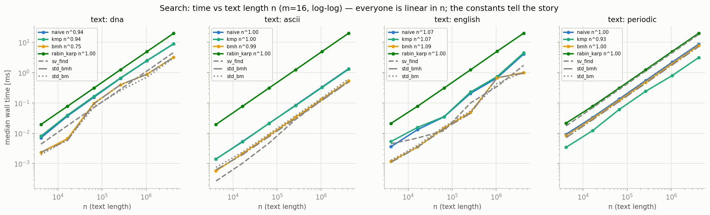
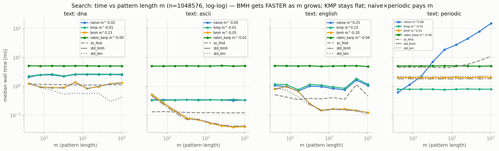
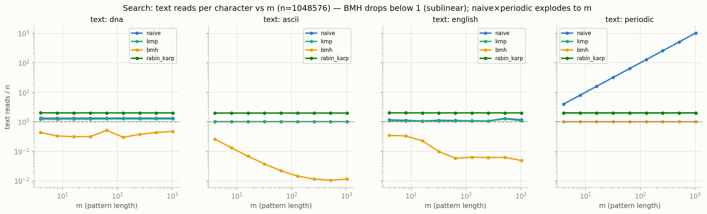
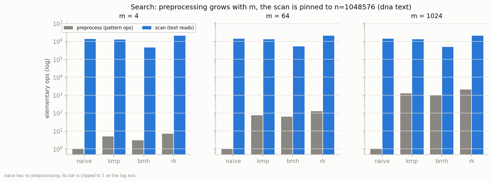
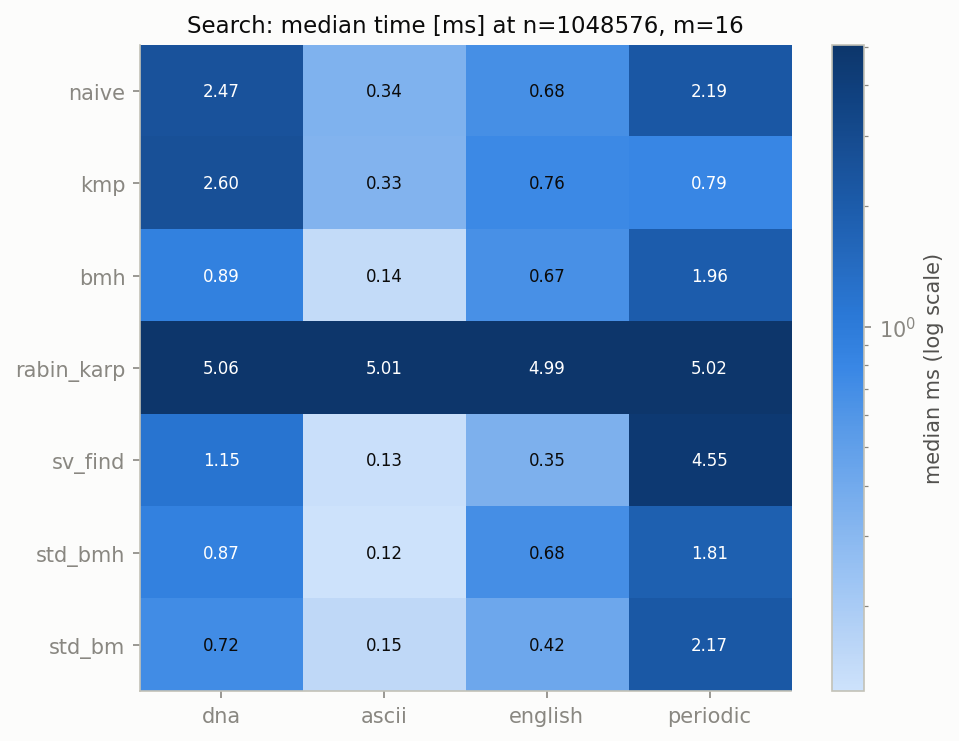

# 文字列検索 4 種 — 仕組み・C++ 実装・予想・実測

Phase 2 の中心ドキュメント。単一パターンの厳密文字列検索 4 種（naive / KMP / BMH / Rabin-Karp）を、Phase 1 のソートと同じ型 —「仕組みの理解 → 実装の要点 → 理論からの予想 → 実測との突き合わせ」— で読み解く。実装は [`../search/include/search/`](../search/include/search/) に 1 アルゴリズム = 1 ヘッダで置いてあり、どれも 90 行足らず。標準ライブラリの基準線 3 種（`string_view::find` / C++17 の BMH・BM searcher）も同じ規約でラップして常に横に並べる。図は `make bench-search && make plot-search` で再生成でき、本文の数値はすべて同梱の実測 CSV（`results/search_{times_n,times_m,ops}.csv`、seed 42、5 反復中央値、WSL2 上の g++ 13 `-O2`）から引いている。

ソートとの最大の違いは、**性能を決める変数が 1 つではない**ことだ。ソートの挙動は本質的に $n$（と入力の乱れ具合）の関数だったが、検索はテキスト長 $n$・パターン長 $m$・アルファベットサイズ $\sigma$ の 3 変数で決まり、しかも「どの変数が効くか」がアルゴリズムごとに違う。naive は $n \times m$ の積に、KMP は $n$ だけに、BMH は $\sigma$ に、Rabin-Karp はどれにも（良くも悪くも）反応しない。この違いを 1 つずつ実測で確かめるのが本フェーズの目標になる。

## 1. 問題設定と記法

**仕様。** テキスト $T$（長さ $n$）とパターン $P$（長さ $m$）を受け取り、$P$ が $T$ 内に現れる**すべての開始位置**を昇順で返す。「最初の 1 件」ではなく全件、しかも**重なり合う出現も数える**: `"aaaaaa"` の中の `"aaa"` は位置 $\{0, 1, 2, 3\}$ の **4 箇所**だ（位置 0 の出現と位置 1 の出現は 2 文字を共有している）。この全件・重なり許容という仕様が、後述の KMP の「マッチ後も状態を捨てない」設計や、std searcher ラッパの「ヒット位置 +1 から再開」ループを規定する。

**記法。** 以降つねに $n$ = テキスト長、$m$ = パターン長、$\sigma$ = アルファベットサイズ（相異なる文字数）。計測に使うテキストは 4 種（[`../common/lab/textgen.hpp`](../common/lab/textgen.hpp)）:

| テキスト | $\sigma$ | 中身 | 役どころ |
|---|---|---|---|
| dna | 4 | ACGT 一様ランダム | 小さいアルファベットの代表 |
| ascii | 95 | 印字可能文字一様ランダム | 大きいアルファベットの代表 |
| english | 19（実効: 18 字種 + 空白） | 頻出 32 英単語のストリーム | 偏りのある現実寄りの分布 |
| periodic | 1 | 全文字 'a'（パターンは $a^{m-1}b$） | naive / RK の教科書的最悪ケース |

パターンは periodic 以外ではテキスト自身からランダム位置の部分文字列として抜く（必ず 1 件以上ヒットする）。periodic のパターン $a^{m-1}b$ は末尾 1 文字だけテキストに存在しない 'b' — 「どのアライメントも $m-1$ 文字まで一致してから落ちる」を強制する仕掛けだ。

**境界規約。** 空パターン（$m=0$）は**すべての位置にマッチ**するとみなし、$\{0, 1, \dots, n\}$ の $n+1$ 箇所を返す — `string_view::find` が空文字列に対して返す挙動と同じで、「長さ 0 の一致が各文字の間と末尾に 1 つずつある」という数学的に自然な規約だ。まとめると:

| 入力 | 返り値 | 根拠 |
|---|---|---|
| 空パターン（例: `"abc"` / `""`） | $\{0, 1, 2, 3\}$ — 一般に $n+1$ 箇所 | `string_view::find` 準拠 |
| $m > n$ | 0 件 | 窓が 1 つも置けない |
| `""` / `""` | $\{0\}$ | 空テキストにも長さ 0 の一致が 1 つ |
| `"aaaaaa"` / `"aaa"` | $\{0, 1, 2, 3\}$ | 重なり出現も全件 |

この規約は 4 実装 + 基準線 3 種の全員が同じテスト（[`../search/tests/test_search.cpp`](../search/tests/test_search.cpp)）で検査され、ベンチ実行時にも全アルゴリズムの出力が naive と一致することを毎セル照合している（不一致は即 FATAL — 「速いが間違っている」実装は計測に混ざれない。Phase 1 の `verify_sorted_permutation` と同じ思想だ）。

## 2. 共通実装設計

**`std::string_view` — 所有しないビュー。** 全 API は `(std::string_view text, std::string_view pattern)` を受け取る。`string_view` はポインタ + 長さだけの非所有ビューなので、4 MiB のテキストを何十回計測してもコピーは一度も起きない。代償は寿命管理が呼び出し側の責任になることで、これは [§6](#6-教訓落とし穴) の落とし穴に戻ってくる。

**`SearchStats` — 3 カウンタの意味論（[`stats.hpp`](../search/include/search/stats.hpp)）。** 計数版は出現位置に加えて 3 つのカウンタを返す。

| カウンタ | 数えるもの | 次元 |
|---|---|---|
| `pre_ops` | パターン**前処理**の仕事: KMP の failure 構築比較、BMH の表格納、RK のハッシュ乗算加算 | $m$ |
| `text_reads` | 走査中の**テキスト文字アクセス**（比較もハッシュ更新も区別しない） | $n$ |
| `char_comparisons` | 走査中のテキスト文字 vs パターン文字の**等値比較** | $n$ |

急所は分離の仕方だ。`pre_ops` は $m$ にしか依存できず、`text_reads` は $n$ 側の仕事 — この分離が §5.4 の図をそのまま作る。そして naive / KMP / BMH では reads = comparisons（テキストを読む理由が比較しかない）だが、**RK だけ reads ≠ comparisons** になる: ローリングハッシュの更新はテキストを「読む」が何とも「比較しない」ため、reads は常に $\approx 2n$ なのに comparisons はハッシュ一致時の検証でしか増えない（periodic では 0 になる — §3.4）。アルゴリズム横断で公平なコスト指標は text_reads で、BMH の劣線形性（reads < $n$）はこのカウンタで初めて数字になる。

**Tally ポリシー — 計数の注入点を「要素型」から「テンプレート引数」へ。** Phase 1 の `Counted<T>` は要素型で計数を注入する設計だった（`vector<Counted<int>>` を食わせれば演算子オーバーロードが数える）。検索では同じ手が使えない — テキストは `string_view` であり、`Counted<char>` の列に包み直せばコピーが発生して非所有の利点が消えるし、そもそも数えたいのは要素の演算ではなく「テキストを読んだ回数」だ。そこで注入点を**ポリシー型**に移した。各アルゴリズムの本体は `template <class Tally> xxx_core(text, pattern, Tally&)` の 1 つだけで、計測点に `tally.read()` / `tally.cmp()` / `tally.pre()` が埋めてあり、公開関数は 2 つのインスタンス化にすぎない:

```cpp
inline std::vector<std::size_t> naive_search(std::string_view t, std::string_view p) {
    NoTally tally;                      // 全メソッドが空 → インライン展開で消滅
    return detail::naive_core(t, p, tally);
}
inline SearchStats naive_search_counted(std::string_view t, std::string_view p) {
    SearchStats st;
    Tally tally{&st};                   // 3 カウンタへ加算
    st.occurrences = detail::naive_core(t, p, tally);
    return st;
}
```

`NoTally` の空メソッドは `-O2` で**完全に消える**ため、時間計測が走るのはカウンタなしの素のループだ（ゼロコスト抽象）。「アルゴリズム本体を 1 つも書き換えず・複製もせずに計数を得る」という Phase 1 の約束を、データ側（要素型）ではなくコード側（ポリシー型）で果たし直した形になる。時間と回数を別実行で測って計測系を互いに汚染させない方針も Phase 1 と同一だ。

**計測対象は 7 実装。** ベンチ（[`../search/bench/bench_search.cpp`](../search/bench/bench_search.cpp)）は同じレジストリに 7 本を載せ、時間は全員・操作回数は自作 4 種のみを計測する:

| 名前 | 実体 | 計数版 |
|---|---|---|
| naive / kmp / bmh / rabin_karp | 本モジュールの 4 実装 | あり（`xxx_search_counted`） |
| sv_find | `string_view::find` の逐次呼び出し | なし |
| std_bmh | `std::boyer_moore_horspool_searcher` + `std::search` | なし |
| std_bm | `std::boyer_moore_searcher` + `std::search` | なし |

std 実装に計数版がないのは怠慢ではなく原理だ — Tally を差し込めるのは自分がソースを持つコードだけで、**ブラックボックスは時間でしか測れない**。「時間は 7 本・回数は 4 本」という非対称自体が、計測可能性は設計時に作り込むものだという 4 軸設計の教訓になっている。

## 3. 各論

以下、各節は**動き** / **C++ 実装ポイント** / **予想** / **結果の読み方**の 4 項目。読む前に全体の見取り図を 1 枚:

| | 前処理 | 走査（最悪） | 走査（ランダム実測） | periodic での恒等式 | 効く変数 |
|---|---|---|---|---|---|
| naive | なし | $(n{-}m{+}1)\,m$ | $\approx \frac{\sigma}{\sigma-1}\,n$ | reads $= (n{-}m{+}1)\,m$ | $n \times m$ |
| kmp | $O(m)$ | $\le 2n$ | $1.01{-}1.25\,n$ | reads $= 2n-(m{-}1)$ | $n$ のみ |
| bmh | $O(m+\sigma)$ | $(n{-}m{+}1)\,m$ * | $\approx n\,/\,E[\text{shift}]$ | reads $= n-m+1$ | $\sigma$（と $m$） |
| rabin_karp | $O(m)$ | $(n{-}m{+}1)\,m$ ** | $\approx 2n$ | reads $= 2n-m$、比較 $0$ | なし |

脚注: \* テキスト $a^n$ vs パターン $a^m$ で全アライメントが全文字照合に落ちる（§3.3）。\*\* 同じ入力で全窓がハッシュ一致 → 全窓検証（§3.4 の 576 読みテスト）。「periodic での恒等式」列は近似ではない — ベンチ CSV の実測値と **1 の位まで**一致する閉じた式だ（各節で確認する）。

### 3.1 naive — 全アライメント総当たり ([`naive.hpp`](../search/include/search/naive.hpp))

**動き。** 各開始位置 $i = 0, \dots, n-m$ にパターンを置き、左から右へ文字を比べ、食い違ったら次の $i$ へ。`"ababab"` から `"aba"` を探すと:

| $i$ | 照合の様子 | 読み | 結果 |
|---|---|---|---|
| 0 | a✓ b✓ a✓ | 3 | ヒット（位置 0） |
| 1 | b vs a ✗ | 1 | — |
| 2 | a✓ b✓ a✓ | 3 | ヒット（位置 2） |
| 3 | b vs a ✗ | 1 | — |

計 8 読みで $\{0, 2\}$ — 単体テストが text_reads == 8 として厳密に検査している値だ。前処理はゼロ。状態もゼロ。**アライメント間で情報を一切持ち越さない**ことが、後続 3 実装すべての改良点を定義する。

**C++ 実装ポイント。** `naive_core` は 2 重ループ 10 行だ。外側の条件は `i + m <= n` — `i <= n - m` と書くと $m > n$ のとき unsigned の引き算が巨大値に化ける、サイズ型の古典地雷を足し算側で回避している。内側は 1 文字ごとに `tally.read(); tally.cmp();` して不一致で `break`。読みやすさの基準実装であり、ベンチでは全アルゴリズムの**正解生成器**も務める。

**予想。** 最悪は全アライメントが $m$ 文字目まで生き残るケースで $(n-m+1) \cdot m = O(nm)$。それを現実に起こすのが periodic: どのアライメントも 'a' が $m-1$ 文字一致してから最後の 'b' で落ちる。一方ランダムテキストでは 1 アライメントの期待読み数は等比級数 $\sum_{k \ge 0} \sigma^{-k} = \frac{\sigma}{\sigma-1}$ で頭打ち — つまり実用上はほぼ線形のはずだ。

**結果の読み方。** 単体テストの厳密値がまず最悪ケースを封緘する: periodic $n=1024, m=16$ で text_reads = **16,144 = $(1024-16+1) \times 16$** — 式と 1 の位まで一致する。ベンチスケールでも同じで、$n=2^{20}$ の m スイープ **9 点すべて**で reads $= (n-m+1)\,m$ が厳密に成立する（$m=1024$ で 1,072,694,272 読み ≒ テキスト 1 文字あたり 1023 読み）。ランダム側の予想も的中: reads/n は dna（$\sigma=4$）で 1.3337 ≒ $4/3$、ascii（$\sigma=95$）で 1.0107 ≒ $95/94$ — 幾何級数の教科書値が小数 3 桁で出てくる。時間で意外なのは、n スイープ（$m=16$ 固定）の periodic 4M 文字が 8.75 ms と、**読み数が 12 分の 1** の dna（8.87 ms、reads/n 1.33 vs 16.0）と並ぶことだ。periodic の内側ループは「15 回一致 → 1 回不一致」の完全に予測可能な分岐 + 連続アクセスで、1 読みあたりのコストが桁で安い — Phase 1 の bubble で学んだ「**計数はクリーン、時計はマイクロアーキテクチャで汚れる**」の検索版が初っ端から出る。

### 3.2 KMP — 失敗を知識に変える ([`kmp.hpp`](../search/include/search/kmp.hpp))

**動き。** naive の無駄は、不一致のたびに「せっかく一致した接頭辞」の情報を捨てて $i+1$ からやり直すことだ。KMP は前処理でパターンの **failure（prefix）関数** $\pi$ を作る: $\pi[i]$ = 「$P[0..i]$ の真の接頭辞かつ接尾辞でもある最長の長さ」。走査中に $j$ 文字一致してから不一致になったら、テキスト側は 1 歩も戻らず、パターン側だけを $j \leftarrow \pi[j-1]$ に畳む — いま見た $j$ 文字の末尾 $\pi[j-1]$ 文字はパターンの先頭 $\pi[j-1]$ 文字と同じであることを、前処理が保証しているからだ。CLRS の例 `"ababaca"` で $\pi$ を手で引くと:

| $i$ | $P[i]$ | 比較の連鎖（$P[i]$ vs $P[k]$） | $\pi[i]$ |
|---|---|---|---|
| 0 | a | —（定義より 0） | 0 |
| 1 | b | b vs a ✗、$k=0$ なので確定 | 0 |
| 2 | a | a vs a ✓ → $k=1$ | 1 |
| 3 | b | b vs b ✓ → $k=2$ | 2 |
| 4 | a | a vs a ✓ → $k=3$ | 3 |
| 5 | c | c vs b ✗ → $k=\pi[2]=1$、c vs b ✗ → $k=\pi[0]=0$、c vs a ✗、確定 | 0 |
| 6 | a | a vs a ✓ → $k=1$ | 1 |

$\pi = \{0, 0, 1, 2, 3, 0, 1\}$、比較は計 8 回（$i=5$ の 3 連鎖が唯一の崩落）。この表は単体テストで `kmp_failure("ababaca")` の返り値として厳密に検査してある。$i=5$ の行が KMP の心臓部だ: 一致が伸びるときは 1 比較で 1 歩進み、崩れるときは $\pi$ を伝って**段階的に**短い候補へ落ちる — ゼロまで一気に捨てない。

走査側も同じ畳みで動く。テキスト `"abababaca"`（$n=9$）からこのパターンを探すと:

| $i$ | $T[i]$ | 動作 | 読み |
|---|---|---|---|
| 0〜4 | ababa | 5 文字連続で一致、$j=5$ | 5 |
| 5 | b | 'b' vs $P[5]=$'c' ✗ → $j = \pi[4] = 3$ に畳む → 'b' vs $P[3]=$'b' ✓ で $j=4$ | 2 |
| 6〜7 | a, c | 一致が伸びて $j=6$ | 2 |
| 8 | a | ✓ で $j = 7 = m$ → **ヒット（位置 2）**、$j = \pi[6] = 1$ で続行 | 1 |

計 10 読み（$\le 2n = 18$）。$i=5$ では「いま見た `ababa` の末尾 3 文字は先頭 3 文字と同じ」という $\pi$ の知識が働き、テキストを **1 歩も戻らずに**照合が続いている — naive なら $i=1$ に巻き戻って読み直すところだ。

**C++ 実装ポイント。** 教科書によくある while + if 形

```cpp
while (j > 0 && text[i] != pattern[j]) j = fail[j - 1];
if (text[i] == pattern[j]) ++j;   // 同じ比較を 2 回書いている
```

は、同一の文字比較が while 条件と if 条件に**二度**現れる。`kmp_core` はこれを「**1 ループ 1 比較**」の無限ループに再構成してある: `for (;;)` の先頭で 1 回だけ比較し、一致なら `++j; break`、不一致で $j=0$ なら `break`、それ以外は `j = fail[j-1]` で畳んで再試行する。この形だと `tally.read()` をループ先頭に 1 個置くだけで「テキスト文字への全アクセス」が漏れなく数えられ、$\le 2n$ 保証がカウンタの値としてそのまま検証可能になる。`kmp_failure` も同じ 1 ループ 1 比較形で、その比較回数が `pre_ops` の単位だ。マッチ完了時は `j = fail[m-1]` に畳んで走査を**続行**する — 状態を捨てないので、**重なり合う出現の検出は無料**になる（`"aaaaaa"`/`"aaa"`: 出現 4 件でも reads = 6、テキスト 1 文字あたりちょうど 1 回。naive は同じ入力に 12 読み払う）。

**予想。** 走査の読み数は $\le 2n$: 各ループ回転は「$j$ を 1 増やす（一致）」か「$j$ を厳密に減らす（畳み）」で、$j$ の増加総量は高々 $n$、減少総量は増加総量を超えられないからだ。そして $m$ には**一切依存しない**はず。periodic は $\Theta(nm)$ が $\Theta(n)$ に落ちる本領発揮の舞台になる。

**結果の読み方。** ops CSV の**全 60 セル**で reads $\le 2n$ が成立し、最大値は periodic（$m=4$）の 1.99999/文字 — 上界にぴったり張り付く。periodic $n=1024, m=16$ の単体テスト値は reads = **2033 = $2 \times 1024 - 15$**: 最初の 15 文字は素直に一致（15 読み）、以降は毎文字「'b' と比べて不一致（1 読み）→ $j = \pi[14] = 14$ に畳んで 'a' と再比較・一致（1 読み）」の 2 読みずつ、で $15 + 2(n-15) = 2n-15$。前処理は pre_ops = **29 = 14 + 15**: $i=1..14$ は 'a' vs 'a' の一致 1 回ずつ（14 回）、最後の 'b'（$i=15$）で $k=14$ から $\pi$ を伝い降りる **15 段の崩落**（$k=14,13,\dots,1$ の不一致 14 回 + $k=0$ での最終比較 1 回）が起きる。ベンチスケールでも恒等式はそのまま生きて、$n=2^{20}$ の periodic 9 点すべてで reads $= 2n-(m-1)$、pre_ops $= 2m-3$ が厳密に成立する。時間では periodic $n=2^{20}$ を全 $m$ で 0.75〜0.80 ms の完全な水平線で走り抜け、naive（$m=1024$ で 149.8 ms）との差は **189 倍**。一方ランダムテキストでは reads/n 1.23〜1.25（dna）と naive（1.33）より約 7% 軽いだけ — KMP は「**最悪を消す**」アルゴリズムであって「平均を速くする」アルゴリズムではない、という位置づけが数字で腑に落ちる。

### 3.3 BMH — 読まずに飛ばす ([`bmh.hpp`](../search/include/search/bmh.hpp))

**動き。** naive も KMP もテキストをほぼ全文字読む。Boyer-Moore-Horspool は発想を反転し、**パターンの末尾位置に対応するテキスト文字だけをまず覗き**、その文字が「パターンのどこにあり得るか」で一気にシフトする。前処理は bad-character 表 1 本: パターンの**末尾を除く** $P[0..m-2]$ を左から走査し、`shift[c] = m - 1 - i`（文字 $c$ の最右出現 $i$ から末尾位置までの距離）を格納する。現れない文字は $m$（パターン丸ごと飛ばせる）。パターン `"search"`（$m=6$）なら:

| 文字 | $P[0..4]$ 内の最右出現 | shift |
|---|---|---|
| s | $i=0$ | 5 |
| e | $i=1$ | 4 |
| a | $i=2$ | 3 |
| r | $i=3$ | 2 |
| c | $i=4$ | 1 |
| **h・その他すべて** | なし | **6**（$=m$） |

'h' はパターンに含まれるのに shift = $m$ である点が急所だ — 表の構築が $P[0..m-2]$ で止まるので、**末尾にしか現れない文字は「不在」扱い**になる。テキストで 'h' を覗いて照合に失敗した以上、次に 'h' が末尾に合う位置はパターン 1 本ぶん先にしかない（'h' は他のどこにもないから）— だから $m$ で正しい。テキスト `"sea hunt search"`（$n=15$）を `"search"` で走ると:

| $i$ | 窓 | 末尾覗き | 動作 | 読み |
|---|---|---|---|---|
| 0 | `sea hu` | 'u' ≠ 'h' | shift['u'] $= 6$ で $i \to 6$ | 1 |
| 6 | `nt sea` | 'a' ≠ 'h' | shift['a'] $= 3$ で $i \to 9$ | 1 |
| 9 | `search` | 'h' = 'h' → 内側照合、残り 5 文字すべて一致 | **ヒット（位置 9）**、shift['h'] $= 6$ で終了 | 6 |

計 8 読み / 15 文字 = **0.53 読み/文字** — 15 文字のおもちゃですらテキストの半分近くを読み飛ばしている。

**C++ 実装ポイント。** `bmh_core` の走査は「**last-char 先読み**」で組んである: `const unsigned char last = text[i + m - 1]` と **1 回だけ読み**、(1) パターン末尾との等値判定、(2) 一致・不一致にかかわらずそのまま `i += shift[last]` の表引き、の両方に使い回す。不一致アライメントのコストは**読み 1 回 + 表引き 1 回**だけ — これが劣線形の源泉だ。末尾が一致したときだけ内側ループが右から左へ残り $m-1$ 文字を照合する（末尾は再読みしない — 全一致の総読み数はちょうど $m$）。表は `std::array<std::size_t, 256>` を `fill(m)` してから上書きするので、構築は $m-1$ 回の格納（= pre_ops）で終わる。シフトは構築規則上つねに $\ge 1$ なので前進が保証される（この保証がどう壊れ得るかは §6）。

**予想。** ランダムテキストなら覗いた 1 文字が遠くへ飛ばしてくれて、reads/n が **1 を割る**（劣線形）はず。$m$ が大きいほど飛距離の上限は伸びる — ただし表が知っているのは「文字ごとの最右出現」だけなので、シフトの期待値は $m$ ではなく $\sigma$ で飽和すると予想する（最右出現までの距離は幾何分布に従うから、その平均は $\sigma$ を超えられない）。periodic では shift['a'] = 1 に潰れ、末尾覗き（'a' vs 'b'）が毎回即失敗 → **ちょうど $n-m+1$ 読みの線形**に落ちるはず — 二次爆発ではない「優雅な退化」。

**結果の読み方。** 単体テストが両端を封緘する: periodic $n=1024, m=16$ で reads = **1009 = $1024-16+1$** きっかり（pre_ops = 15 = $m-1$）、dna $n=4096$ では reads < $n$ かつ naive 未満。ベンチでは reads/n が dna で 0.30〜0.51 の足踏み、ascii では $m=512$ の **0.0104 ≒ $1/95 = 1/\sigma$** まで沈む — テキスト 100 文字につき 1 文字しか読まずに、全出現を 1 件も漏らさない。$\sigma$ への依存という予想の本丸は [§5.2](#52-search_time_vs_m--bmh-は-m-で速くなるが-σ-が天井を決める)/[§5.3](#53-search_reads_per_char--劣線形が-1-本の線になる) で図として確かめる。

### 3.4 Rabin-Karp — 比較をハッシュに置き換える ([`rabin_karp.hpp`](../search/include/search/rabin_karp.hpp))

**動き。** 長さ $m$ の窓の多項式ハッシュ $h(s) = \sum_i s_i B^{m-1-i} \bmod M$（$B=257$, $M=10^9+7$）をパターンのハッシュと比べ、**一致したときだけ**文字比較で検証する。窓を 1 つ滑らせる更新は $O(1)$ だ: 出ていく文字の寄与を引き、$B$ 倍して、入ってくる文字を足す。`"abc"` 上の $m=2$ で実際に回すと（'a'=97, 'b'=98, 'c'=99）:

$$h(\texttt{"ab"}) = 97 \cdot 257 + 98 = 25{,}027 \;\xrightarrow{\;-\,97 \cdot 257\;}\; 98 \;\xrightarrow{\;\times 257 \,+\, 99\;}\; 25{,}285 = h(\texttt{"bc"})$$

全体は前処理 $O(m)$ + 走査 $\Theta(n)$ — 入力が何であれ $\Theta(n)$ のハッシュ仕事を払う。periodic のパターン $a^{15}b$ はテキスト $a^n$ のどの窓ともハッシュが合わず、**文字比較 0 回**で素通りする（naive の最悪ケースへの免疫）。逆に自分の最悪はテキスト $a^n$ vs パターン $a^m$: 全窓でハッシュが一致し、全窓が $m$ 文字の検証を払う。

**C++ 実装ポイント。** 剰余算術の正当性が全てだ。`uint64_t` 上で現れ得る最大の中間値は `whash * kRkBase + 文字` の $(M-1) \times 257 + 255 = 257{,}000{,}001{,}797 < 2^{38}$（$2^{38} = 274{,}877{,}906{,}944$）— 64 bit に 26 bit の余裕を残して**オーバーフローは起き得ない**。$B = 257 > 256$ は 1 文字ハッシュの単射性（どの 2 文字も別のハッシュ）、$M$ 素数は衝突の一様化のための選択だ。窓から文字を落とす演算は `(whash + kRkMod - drop) % kRkMod` と**足してから引く** — `whash - drop` を先に書くと unsigned の負値が $2^{64}$ 近傍へ巻き戻る。ハッシュ一致時の検証ループだけが `tally.cmp()` を刻む（reads ≠ comparisons が生まれる場所）。検証は省略できない: ハッシュの一致は確率的な示唆であって証明ではないからだ（§6 で衝突の実測を見る）。

**予想。** reads は初期窓 $m$ + 滑り $2(n-m)$（落とす文字と入る文字で 2 読み）+ ハッシュ一致時の検証分で、**reads/n ≈ 2 の水平線**。時間も入力に完全非依存のはず — Phase 1 の selection と同じ「入力を見ない」族だが、その対価として**どんな楽な入力でも安くならない**。

**結果の読み方。** 単体テストの 3 点セットが性格を全部語る。`"aaaaaa"`/`"aaa"`: reads = **21 = 3 + 4×3 + 3×2**（初期窓 3 + 全 4 窓の検証 3 読みずつ + 滑り 3 回 × 2 読み）。periodic $n=1024, m=16$: reads = **2032 = 16 + 2×1008**、**char_comparisons = 0** — ハッシュは一度もパターンに一致せず、'b' を 1 文字も比較せずに素通り。$a^{64}$ vs $a^8$: 全 57 窓が検証を払い reads = **576 = 8 + 57×8 + 56×2**、cmps = 456 = 57×8。ベンチスケールの periodic でも cmps = 0 が全 9 点で成立し、reads/n は 4 テキストとも 2.00 の水平線を引く（唯一わずかに浮く dna $m=4$ の 2.0158 も検証読みで説明が付く — §5.3）。時間は m スイープの全 36 セル（4 テキスト × 9 $m$）が 4.77〜5.12 ms の帯に収まる、モジュール中で最も退屈な線 — だがその高さに注意。reads が同じ 2.00/文字の periodic で比べると KMP 0.79 ms vs RK 5.02 ms、**同じ読み数に 6.4 倍の時計**を払っている。1 読みが「比較 1 回」ではなく「乗算 + 剰余の列」だからで、最速セルの BMH（ascii $m=512$ の 0.038 ms）とは 130 倍差になる。単一パターン検索で RK を選ぶ理由は薄い — 真価は「$k$ 本のパターンのハッシュを集合に持ち、$k$ 本まとめて $\Theta(n)$ で照合する」複数パターン化にあり、それでもここで測る価値があるのは、「最悪を消す」2 つ目の戦略（KMP = 決定的な保証、RK = 確率的な保証）の対比が数字で見えるからだ。

## 4. C++17 searcher という API 設計

C++17 は `std::search` に **searcher オブジェクト**のオーバーロードを加えた（[`baselines.hpp`](../search/include/search/baselines.hpp) が計測用にラップしている）:

```cpp
const std::boyer_moore_horspool_searcher searcher(pattern.begin(), pattern.end());
auto it = std::search(text.begin(), text.end(), searcher);
```

見どころは機能ではなく**責務の切り方**だ。コンストラクタが bad-character 表を作り（= 前処理、$m$ の仕事）、`std::search` が走査する（= 照合、$n$ の仕事）。「表を型に固めて持ち歩く」ことで、同じパターンを複数のテキストや複数の再開位置に使い回すとき前処理が 1 回に償却される — 本モジュールの `pre_ops` / `text_reads` 分離計測は、まさにこの API が切った境界をカウンタで可視化したものと言える。`baselines.hpp` のラッパも searcher を**ループの外で 1 回だけ**構築し、ヒットのたびに `++it` して `std::search` を再開することで、重なり出現の全件列挙という本モジュールの規約に揃えている（`sv_find` 側も同型で、`find(pattern, pos + 1)` とヒットの 1 文字先から探し直す — `"aaaaaa"`/`"aaa"` の 4 件はテストで全 7 実装に共通検査してある）。クラステンプレート引数推論（CTAD）のおかげでイテレータ型を書かずに宣言できるのも C++17 らしい。なお searcher はパターンの**イテレータを保持する**非所有オブジェクトで、`string_view` と同じ寿命の罠を持つ（§6）。基準線は 3 種: `sv_find`（`string_view::find` の逐次呼び出し — libc の SIMD 実装が下敷き）、`std_bmh`（Horspool。`bmh.hpp` と同じアルゴリズム）、`std_bm`（good-suffix 規則入りの完全版 Boyer-Moore — Horspool が捨てた第 2 の表を持つ）。

## 5. 結果の読み方（5 図 × 実測値）

5 枚の図はそれぞれ別の問いに答える。迷子になったらこの表に戻るとよい:

| 図 | 答える問い | 見出しになる数字 |
|---|---|---|
| search_time_vs_n | $n$ を伸ばすと? | 全員傾き ≈ 1（凡例 n^0.93〜1.09） |
| search_time_vs_m | $m$ を伸ばすと? | BMH は ascii で 13.3 倍**下降**、naive×periodic は 245 倍**上昇** |
| search_reads_per_char | 時計を外すと? | BMH 0.0104 読み/文字、KMP $\le 2$、RK = 2.00 |
| search_pre_vs_match | 前処理は重い? | $m=1024$ でも照合の 0.1〜0.2% |
| search_heatmap | 総合成績は? | 行の平坦さ = 入力非依存、列の濃さ = テキスト難度 |

### 5.1 search_time_vs_n — 全員 n に線形、差は定数



$m=16$ 固定でテキスト長 $n$ を 4096 → 4,194,304 まで振った log-log 図。凡例の実測指数（大きい側 3 点への最小二乗フィット）は、dna で naive n^0.94 / kmp n^0.94 / bmh n^0.75 / rabin_karp n^1.00、ascii で 1.00 / 1.00 / 0.99 / 1.00、english 1.07 / 1.07 / 1.09 / 1.00、periodic 1.00 / 0.93 / 1.00 / 1.00 — ソートの図（傾き 2 と 1.1 の族に割れた）と違い、**全員が傾き ≈ 1 の平行線**だ。$m$ を固定すれば naive の最悪 $\Theta(nm)$ すら $n$ の 1 次式であり、線の**高さ**（= 定数因子）だけが 4 実装の個性になる: $n=4{,}194{,}304$ の dna で bmh 3.22 ms < naive 8.87 ms < kmp 8.99 ms < rabin_karp 19.81 ms。

1 本だけ大きく 1 を外れる **bmh × dna の n^0.75** には正体がある。決定的な ops CSV で同じ末尾 3 点の text_reads を見ると 147,690 → 328,042 → 1,188,501 で、**読み数のフィット傾きも 0.75**（時間 0.753 vs 読み 0.752 — 小数 3 桁で一致）。つまり時計は読み数に忠実で、読み数の方が $n$ に比例していない。原因は $n$ ごとにパターンを抜き直す設計だ: $\sigma=4$ では引いたパターン次第で平均シフトが大きく振れ、reads/n は $n$ 方向にも 0.23〜0.57 で暴れる（たまたま大きい $n$ で「飛べる」パターンを引いた）。**劣線形は「文字あたり読み数 < 1」の性質であって、$n$ 方向のスケーリングは線形** — log-log の傾きを信じる前に決定的カウンタと突き合わせよ、という Phase 1 の教訓の変奏（今回は時計が正しく、入力の抽選が指数を歪めた）になっている。

### 5.2 search_time_vs_m — BMH は m で速くなるが σ が天井を決める



$n=2^{20}$ 固定でパターン長 $m$ を 4 → 1024 まで振った、Phase 2 の看板図。見どころは 4 つ。

**① BMH の下降と、その頭打ち。** bmh の 3 テキストを数字で並べると（中央値 [ms]、太字 = 下降が止まる点）:

| bmh | $m=4$ | 8 | 16 | 32 | 64 | 128 | 256 | 512 | 1024 |
|---|---|---|---|---|---|---|---|---|---|
| dna（$\sigma=4$） | 1.222 | 0.938 | **0.888** | 0.897 | 1.382 | 0.836 | 0.957 | 1.221 | 1.322 |
| english（$\sigma=19$） | 0.805 | 0.982 | 0.669 | 0.247 | **0.146** | 0.162 | 0.163 | 0.145 | 0.123 |
| ascii（$\sigma=95$） | 0.512 | 0.258 | 0.140 | 0.077 | 0.069 | 0.052 | 0.042 | **0.038** | 0.040 |

ascii は 0.512 → 0.038 ms（$m=512$）まで **13.3 倍**下がり続ける — パターンが長いほど 1 回のシフトが遠くへ飛べる。ところが dna は $m=16$ の 0.888 ms で**打ち止め**になり、以降は 0.84〜1.38 ms を上下するだけだ。english は中間で、$m=64$ の 0.146 ms 前後から棚になる。下降が止まる $m$ が $\sigma$ の並び（4 < 19 < 95）どおりに右へずれていることに注目してほしい。**bad-character シフトはアルファベットサイズで飽和する** — シフト距離は「覗いた文字がパターン内で最後に出た場所まで」であり、$\sigma$ 種しかない文字はどれも末尾近くに現れてしまうからだ（定量的な形は §5.3）。つまり BMH の劣線形性は $m$ の恩恵である以上に **$\sigma$ の恩恵**であり、「DNA 配列に素の Horspool は不向き」という実務知識がこの 3 パネルの対比そのものになっている。dna の凡例が m^0.23 と**正**の傾きなのは、末尾 3 点のフィットがこの飽和後の揺れを拾ったものだ。

**② その揺れは計測ノイズではない。** dna の bmh の波形（$m=64$ で 1.382 ms に跳ね、$m=128$ で 0.836 ms に沈む）は、決定的な ops CSV の reads/n（0.5109 → 0.2975）と完全に同じ形を描き、さらに**実装が別物の std_bmh**（1.332 → 0.825 ms）も同じ波形をなぞる。原因は $m$ ごとにパターンを抜き直していることで、$\sigma=4$ では shift 表の実質エントリが 4 つしかなく、引いたパターンの末尾付近の文字配置がそのまま平均シフトを支配する — 「パターン依存の分散は小さいアルファベットでは消えない」という現象自体が教材だ。

**③ naive × periodic だけが登る。** periodic パネルで naive は 0.611 ms（$m=4$）→ 149.8 ms（$m=1024$）と、$m$ の 256 倍化に対して **245 倍** — 凡例 m^0.88、$\Theta(nm)$ の $m$ 依存が時間の直線として見える唯一の場所だ。同じパネルで kmp は 0.75〜0.80 ms（凡例 m^-0.01）の水平線: $m=1024$ 時点の差は **189 倍**。bmh（≈ 2.0 ms、$n-m+1$ 読みの優雅な退化）と rabin_karp（≈ 5.0 ms、素通り）も水平で、4 実装の最悪ケース反応がこの 1 パネルに全部並ぶ。

**④ sv_find は「計算量ではなく実装定数」の講義。** ランダム 3 テキストで sv_find（灰破線）は自作 4 種より速い帯を走る — ascii で 0.12 ms、dna で 1.10〜1.21 ms（naive の半分以下）。libstdc++ の `string_view::find` は先頭文字を `memchr`（SIMD 化された libc プリミティブ）で探し、候補位置だけ `memcmp` する: アルゴリズムとしては naive 級なのに、1 文字あたりの命令数が桁で違う。**計算量の改善（KMP/BMH）と実装定数の改善（SIMD）は直交する軸**であり、$n=2^{20}$ 程度・自然な入力なら後者が勝つことすらある。ただし万能ではない証拠も同じ図にある: periodic では sv_find は 4.5 → 10.8 ms（$m=4 \to 1024$ で 2.4 倍）と**登り始める** — `memcmp` が毎アライメント $m-1$ 文字舐める $\Theta(nm)$ は消えておらず、SIMD は定数を割るだけだ（naive の 149.8 ms より 14 倍速いが漸近は同罪で、KMP の 0.79 ms には遠く及ばない）。もう 1 つの脇筋: dna では std_bm だけが $m \ge 32$ でも 0.30〜0.58 ms と、bmh / std_bmh（0.82〜1.38 ms）の半分以下の帯へ降りる — Horspool が捨てた good-suffix 表は「一致した接尾辞」からもシフトを引き出せるため、bad-character が飽和する小アルファベットでこそ効く。

### 5.3 search_reads_per_char — 劣線形が 1 本の線になる



時間から離れ、決定的カウンタ text_reads を $n$ で割った「テキスト 1 文字あたり読み数」（$n=2^{20}$、m スイープ）。ハードウェアの汚れが一切ない、このモジュールで最も理論に近い図だ。4 本の線の高さがそのまま 4 実装の要約になる:

- **naive**: periodic で reads $= (n-m+1)\,m$ 厳密、つまり reads/n がほぼ $m$ の対角線（$m=1024$ で 1023.0）。ランダムでは $\frac{\sigma}{\sigma-1}$ の水平線（dna 1.33、ascii 1.01）。
- **kmp**: 全テキスト・全 $m$ で $\le 2$。periodic が上界 2.00 に張り付き、ランダムでは 1.01〜1.25 — naive よりわずかに軽い。
- **rabin_karp**: どこでも 2.00 の水平線。内訳は初期窓 $\frac{m}{n}$ + 滑り $\frac{2(n-m)}{n}$ + 検証分で、恒等式 reads $= 2n - m + \text{cmps}$ が全セルで成立する（dna $m=4$ だけ 2.0158 と浮くのは出現 4149 件 × 4 文字の検証読みが乗るため — 実測 2,113,744 = 2,097,148 + 16,596 で 1 の位まで一致）。
- **bmh**: 唯一 **1.0 の破線を割る**。dna は 0.30〜0.51 で足踏み、ascii は $m=512$ の **0.0104 ≒ $1/95$** まで一直線、english は 0.048（$m=1024$）で $1/\sigma_{\text{eff}} = 1/19$ 弱。

bmh の線は簡単なモデルで再現できる。ランダムテキストでは覗いた文字の「最右出現までの距離」が幾何分布に従うので、平均シフトは

$$E[\text{shift}] = \sigma\left(1 - (1 - 1/\sigma)^{m-1}\right) \xrightarrow{\;m \to \infty\;} \sigma$$

で、reads/n はほぼその逆数になる。ascii で突き合わせると: $m=64$ でモデル 0.0216 vs 実測 0.0217、$m=128$ で 0.0142 vs 0.0144、$m=256$ で 0.0113 vs 0.0114 — **2% 以内で乗る**。この式が §5.2 ①を定量化する: どれだけパターンを伸ばしてもシフトは平均 $\sigma$ で飽和し、dna はそれが $m \approx 16$ で（$4(1-0.75^{15}) = 3.95$）、ascii は $m \approx 512$ でようやく（$95 \times 0.995 = 94.5$）到来する。「BMH の劣線形は実はアルファベットサイズの関数」という Phase 2 の見出しはこの 1 本の式に畳み込まれている。

### 5.4 search_pre_vs_match — 前処理は m の仕事、照合は n の仕事



dna テキストで pre_ops（灰）と text_reads（青）を並べた対数棒グラフ（$m = 4 / 64 / 1024$）。灰の棒だけが $m$ とともに 3 桁伸び（kmp 5 → 1253、bmh 3 → 1023、rk 7 → 2047）、青の棒は $n=2^{20}$ に釘付けのまま動かない。それでも**最大の $m=1024$ ですら前処理は照合の 0.1〜0.2%** だ: bmh 1023 vs 492,267（**481 倍**）、kmp 1253 vs 1,310,051（1046 倍）、rk 2047 vs 2,097,152（約 1025 倍）。$m \ll n$ の 1 回きり検索では前処理は事実上ただ — 裏を返せば、§4 の searcher API が前処理の償却をわざわざ設計目標に据えるのは、「短いテキストに同じパターンを何万回も当てる」用途（トークナイザ、ログフィルタ）が実在するからだ。なお naive の灰棒は「前処理ゼロ」を対数軸に描けないため 1 にクリップしてある（図の脚注どおり）。

### 5.5 search_heatmap — テキスト種 × アルゴリズムの総合成績表



$n=2^{20}, m=16$ の断面で 7 実装 × 4 テキストを対数色で並べた、Phase 1 の heatmap_dist に対応する図。**行の平坦さ**が入力非依存性を表す: rabin_karp の行は 4.99〜5.06 ms でほぼ一色 — Phase 1 の selection と同じ data-oblivious だが、こちらは常に最下位グループという代償つきだ。kmp は 3 テキストで naive と並走し（dna 2.60 vs 2.47）、periodic 列でだけ 0.79 vs 2.19 と 2.8 倍差を付ける — 「保険としての KMP」が列 1 本で見える。**列の色**はテキストの難度: ascii 列は全員が最軽量（bmh 0.14、std_bmh 0.12、sv_find 0.13）、dna 列は同じ顔ぶれが 6〜9 倍重い（bmh 0.89、sv_find 1.15）— $\sigma$ が小さいほど「偶然の部分一致」が増え、全員のポケットから時間を抜いていく。個別セルでは bmh × periodic 1.96 ms（優雅な退化: naive の 2.19 とほぼ同額で済む）、sv_find × periodic 4.55 ms（基準線が自作 kmp の 5.8 倍 — §5.2 ④）、そして std_bmh × dna 0.87 ms vs 自作 bmh 0.89 ms の 2% 差 — 同じアルゴリズム・同じ表なら実装が違っても同じ時間に落ちるという、計測系そのものの健全性確認になっている。

## 6. 教訓・落とし穴

**periodic テキストは 4 実装の性格検査である。** たった 1 つの敵対的入力（$a^n$ vs $a^{m-1}b$）が、naive の $(n-m+1)m$ 爆発 / KMP の $2n-(m-1)$ 本領 / BMH の $n-m+1$ への優雅な退化 / RK の cmps = 0 素通り、という 4 通りの反応を全部引き出す — しかも全部が閉じた式でカウンタと 1 の位まで一致する。$n=2^{20}, m=16$ の実測で並べると:

| 実装 | text_reads 実測 | 閉じた式 | 反応の型 |
|---|---|---|---|
| naive | 16,776,976 | $(n-m+1)\,m = 1{,}048{,}561 \times 16$ | 爆発 |
| kmp | 2,097,137 | $2n-(m-1)$ | 本領（上界張り付き） |
| bmh | 1,048,561 | $n-m+1$ | 優雅な退化 |
| rabin_karp | 2,097,136（比較 0） | $2n-m$ | 素通り |

さらに標準ライブラリの `sv_find` までもが $\Theta(nm)$ に落ちる（§5.2 ④）ことは、「基準線 = 安全」ではないことの実演だ。自作実装を測るときは、まず**入力の族**を設計し、最悪ケースを 1 つ手元に持っておく — Phase 1 の quick × reversed に続く、二度目の同じ教訓になる。

**BMH の表は「末尾を除いて」作る — ループ境界 1 つが停止性を握る。** `"search"` の 'h' が shift $= m$ のままになるのは仕様だが（§3.3）、この境界を誤って全 $m$ 文字で表を作ると shift[末尾文字] $= 0$ となり、`i += 0` の**無限ループ**が生まれる。「shift $\ge 1$ は構築規則から従う」という保証は、`for (i = 0; i + 1 < m; ++i)` の `+ 1` に懸かっている。この種のバグは出力を壊さないまま停止性だけを壊すので、テストより先にカウンタ（reads が増え続ける）が異常を教えてくれることも多い。

**RK の検証は保険ではなく本体である。** $M = 10^9+7$ での偽ハッシュ一致は確率の問題で、本ラボの全計測 60,104,396 窓に対する期待衝突数は $\approx 0.06$ 回 — 実測はちょうど **1 回**だった（ascii, $m=1024$ のセルで char_comparisons が occurrences × m より 1 大きい: 偽の一致が 1 文字目の比較で棄却された痕跡だ）。つまり検証ループが本当に働いたのは 6000 万窓に 1 度きり、しかしその 1 度を省けば**間違った出現位置を返していた**。「ほぼ起きない」と「起きない」の距離がそのまま正しさの距離になる、確率的アルゴリズムの基本則だ。base/mod を雑に選ぶ（$B < \sigma$、小さい $M$、2 冪の $M$）と、この距離は急速に縮む。

**`string_view`（と searcher）は借り物である。** 非所有ビューはコピーゼロの計測を可能にした立役者だが、`std::string` の一時オブジェクトから作った view や、パターンのイテレータを抱えたまま元の文字列より長生きする searcher（§4）は、静かに dangling する。本モジュールの API が全部 `string_view` 受けなのは「4 MiB のテキストを何十回もコピーしないため」であり、その代金は呼び出し側の寿命規律で払う — ベンチでは text / pattern が計測ループより外側の `std::string` に居ることが規律の全てだ。

**「ノイズに見える揺れ」の半分はパターン抽選である。** $m$ ごと・$n$ ごとにパターンを抜き直す設計は現実的な平均像を作る一方で、bmh × dna の波形（§5.2 ②）や n スイープの n^0.75（§5.1）、english $m=512$ の全実装同時スパイク（naive の reads/n が他の $m$ の 1.07〜1.17 から 1.31 へ浮く — 引いた 512 文字が頻出語の並びで、部分一致が偶然増えた）を生む。時間の揺れを見たら、まず**決定的な ops CSV が同じ形をしているか**を確かめる — 同じなら原因は入力（抽選）にあり、違うなら計測系にある。時間と回数を別系統で持つ設計は、この切り分けを 1 分で終わらせるためにある。

## 7. Phase 3/4 への接続

検索の並列化は一見自明だ — アライメント $i$ ごとの照合は完全に独立なので、**1 スレッド = 1 開始位置**に割るだけで naive は embarrassingly parallel になる（チャンク分割なら境界に $m-1$ 文字の「のりしろ」を重ねるだけでよい）。ところが本フェーズで最悪ケースに強かった 2 つの道具は、並列化と相性が悪い。KMP の failure 遷移は「位置 $i$ での状態 $j$ がそれ以前の全テキストに依存する」逐次連鎖そのもので、テキストを分割した瞬間に成立しなくなる。BMH のシフト `i += shift[last]` もデータ依存のストライドで、次にどこを読むかは読んでみるまで分からない。[`references.md`](references.md) の **PFAC**（Parallel Failureless Aho-Corasick）はまさにこの観察から failure 遷移を**捨て**、1 スレッド 1 開始位置・各スレッド最悪 $O(m)$ に徹した設計で、本ラボが Phase 4 で書く GPU naive カーネルはその単一パターン縮小版になる。Kouzinopoulos & Margaritis の CUDA 比較（naive/KMP/BMH で最大 24 倍）が答え合わせ先だ。「逐次で賢い」と「並列で速い」は別の徳目である — Phase 2 の 4 実装と本ドキュメントの実測値は、その対比を測るための基準線として Phase 3（CPU 並列）/ Phase 4（GPU）へ持ち越される。

---

*数値の出典: `results/search_times_n.csv` / `search_times_m.csv` / `search_ops.csv`（seed 42、5 反復中央値、WSL2 + g++ 13 `-O2`）。単体テストの厳密値は [`../search/tests/test_search.cpp`](../search/tests/test_search.cpp)。図の再生成は `make bench-search && make plot-search`。*
