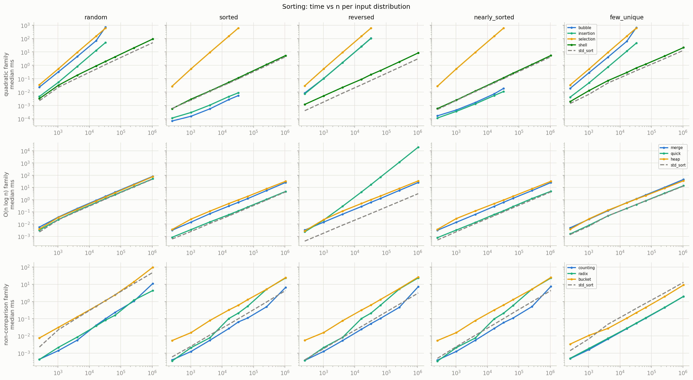
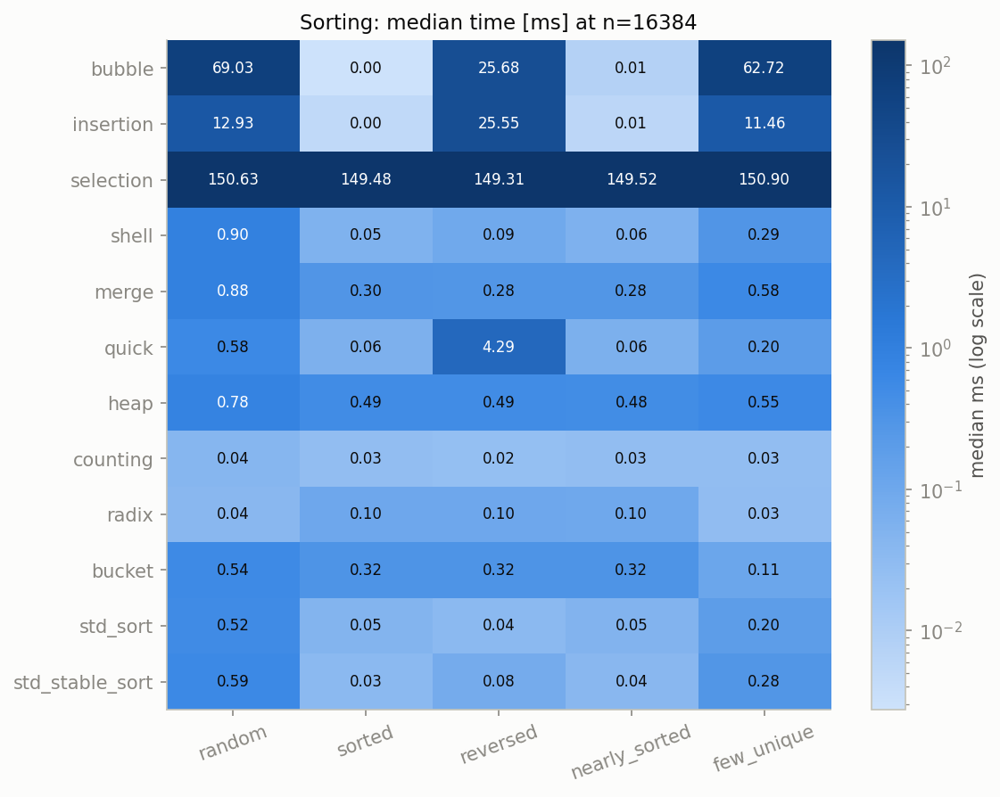
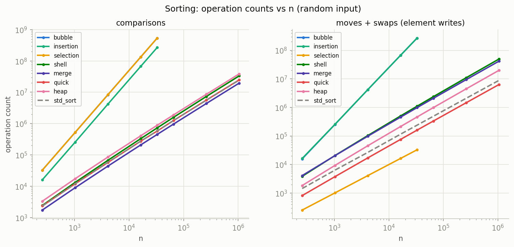
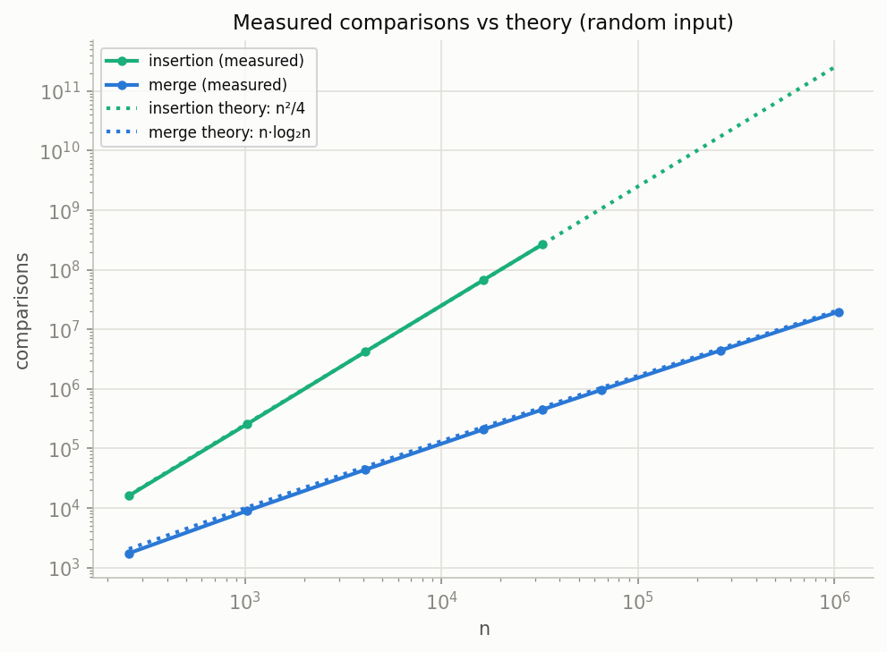
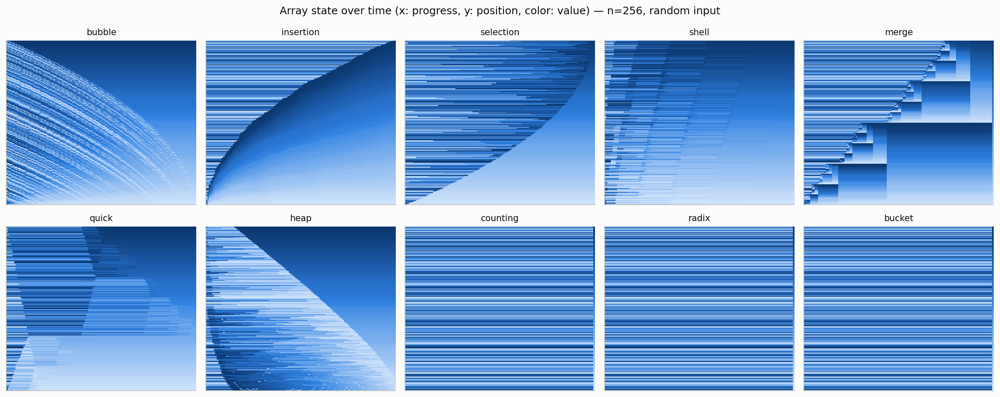

# ソートアルゴリズム 10 種 — 動き・C++ 実装・予想・実測

Phase 1 の中心ドキュメント。10 個のソートを「動きの理解 → 実装の要点 → 理論からの予想 → 実測との突き合わせ」という同じ型で読み解く。実装は [`../sorting/include/sorting/`](../sorting/include/sorting/) に 1 アルゴリズム = 1 ヘッダで置いてあり、どれも 20〜75 行なので、各節を読んだらすぐ対応するヘッダを開いてほしい。図は `make bench && make trace && make plot` で再生成でき、本文の数値はすべて同梱の実測 CSV（seed 42、WSL2 上の g++ 13 `-O2`）から引いている。

## 1. 導入 — なぜソートか、そして Ω(n log n) の壁

ソートを最初の題材に選ぶ理由は、「仕様が完全に同じ（列を昇順に並べる）なのに、設計戦略がここまで多様になる」問題が他にほとんどないからだ。隣どうしを繰り返し入れ替える（bubble）、手札に 1 枚ずつ差し込む（insertion）、分割して統治する（merge / quick）、データ構造の不変条件に仕事をさせる（heap）、そして比較そのものを放棄する（counting / radix / bucket）。同じ入出力仕様に対する 10 通りの答えを並べると、計算量・メモリ・安定性・入力への適応性というトレードオフの全景が一度に見える。

**比較ソートの下界。** 要素の大小比較だけで並べ替えるアルゴリズムは、どんなに賢くても最悪 $\Omega(n \log n)$ 回の比較が必要になる。直感はこうだ。比較ソートの実行は「比較の結果で左右に分岐する決定木」とみなせる。$n$ 要素の並び方は $n!$ 通りあり、アルゴリズムはそのどれに対しても正しい答え（＝異なる出力の並べ替え手順）を出さなければならないから、決定木の葉は少なくとも $n!$ 枚必要になる。1 回の比較で枝は 2 つにしか分かれないので、木の深さ（＝最悪の比較回数）は

$$\log_2 n! \;\approx\; n \log_2 n - 1.44n \;=\; \Theta(n \log n)$$

以上になる（Stirling の近似）。merge / heap がこの下界に最悪ケースで張り付き、quick が平均で張り付く。つまり比較の世界では $O(n \log n)$ が「到達点」であって、それより先はない。

**非比較ソートはなぜ外側にいるか。** counting / radix / bucket は要素同士を一度も比較しない。キーが整数だと分かっているなら、値そのものを配列の添字として使えば、1 回のメモリ書き込みで「$\log_2 n$ ビット分の情報」を一気に処理できる。決定木の議論は「比較で得られる情報は 1 ビット」という前提の上に立っているので、その前提ごと踏み越えるわけだ。代償は汎用性で、キーが「小さな非負整数（あるいはそこへ写せるもの）」であることが前提になる。本ラボの入力生成器（[`../common/lab/datagen.hpp`](../common/lab/datagen.hpp)）は値を常に $[0, \max(n,10))$ に収めており、全分布で非比較ソートが適用可能になるよう設計してある。

## 2. 計算量総覧

| アルゴリズム | 最良 | 平均 | 最悪 | 追加空間 | 安定 | 主な操作 |
|---|---|---|---|---|---|---|
| bubble | O(n) | O(n²) | O(n²) | O(1) | ✅ | 隣接swap |
| insertion | O(n) | O(n²) | O(n²) | O(1) | ✅ | shift (move) |
| selection | O(n²) | O(n²) | O(n²) | O(1) | ❌ | 遠距離swap |
| shell (Ciura) | O(n log n) | ~n^1.3 | (gap依存) | O(1) | ❌ | gap付きshift |
| merge | O(n log n) | O(n log n) | O(n log n) | O(n) | ✅ | バッファへmove |
| quick (mo3+Hoare) | O(n log n) | O(n log n) | O(n²)* | O(log n) stack | ❌ | swap |
| heap | O(n log n) | O(n log n) | O(n log n) | O(1) | ❌ | sift-down swap |
| counting | O(n+k) | O(n+k) | O(n+k) | O(n+k) | ✅ | 散布 (move) |
| radix (LSD 256) | O(d·n) | O(d·n) | O(d·n) | O(n) | ✅ | パス毎move |
| bucket | O(n) | O(n) | O(n²)** | O(n) | ✅*** | 分配+挿入 |

脚注: \* median-of-three で実用上ほぼ回避（理論保証なし＝introsortがdepth監視でheapに切替える理由）。\*\* キーが1バケツに集中した場合。\*\*\* operator< とキーが整合する場合。

なお \* の「理論保証なし」は空論ではない。本ラボの実測では、ただの逆順入力が quick を現実に $\Theta(n^2)$ に落とした（[quick の節](#36-quick--分割統治の光と影-quickhpp)で詳述）。この表は「額面」であって、額面と実測のずれ自体が Phase 1 の主要な学習成果になる。

## 3. 各論

以下の各節は共通の 4 項目で構成する。**動き**（紙上で追える説明とトレース）、**C++ 実装ポイント**（ヘッダの該当行との対応）、**予想**（図を見る前に立てる理論予想）、**結果の読み方**（`../results/plots/` のどの図のどこを見るか）。手動トレースはすべて 8 要素の配列 `[5, 2, 7, 1, 9, 3, 8, 6]` を使う（この配列の転倒数 = 11）。

### 3.1 bubble — 隣接交換だけで泡を浮かす ([`bubble.hpp`](../sorting/include/sorting/bubble.hpp))

**動き。** 配列を左から右へ走査し、隣どうしが逆順なら交換する。1 パス終えると「その区間の最大値」が右端に浮かび上がる（泡＝bubble）。右端を 1 つ縮めて繰り返す。1 パスの間に交換が 1 度も起きなければ、もう整列済みなので即終了できる（early exit）。

| パス | パス終了時の配列 | swap 回数 |
|---|---|---|
| 開始 | `[5, 2, 7, 1, 9, 3, 8, 6]` | — |
| 1 | `[2, 5, 1, 7, 3, 8, 6, 9]` | 5（9 が右端に確定） |
| 2 | `[2, 1, 5, 3, 7, 6, 8, 9]` | 3（8 が確定） |
| 3 | `[1, 2, 3, 5, 6, 7, 8, 9]` | 3 |
| 4 | `[1, 2, 3, 5, 6, 7, 8, 9]` | 0 → early exit |

swap の総数 5+3+3 = 11 は入力の転倒数（逆順ペアの個数）とちょうど一致する。隣接交換は転倒を 1 個ずつしか解消できない — これが bubble が遅い理由の全てだ。

**C++ 実装ポイント。** `bubble.hpp` は 3 つの部品でできている。(1) 外側ループの `end` を毎パス縮めて確定済みの右端を再訪しない。(2) `bool swapped` フラグによる early exit — これが最良ケース $O(n)$ を作る（フラグがなければ整列済み入力でも $n-1$ パス走る）。(3) 交換は `std::iter_swap(it, it + 1)` — 自前の 3 行 swap ではなく標準の部品を使うことで、計測ラッパ `Counted<T>` の ADL `swap` が正しくフックされ、swaps が 1 カウントされる。

**予想。** ランダム入力で比較 $\approx n^2/2$、swap = 転倒数 $\approx n^2/4$。整列済みなら 1 パス（比較 $n-1$、swap 0）。逆順なら比較も swap も最悪の $n(n-1)/2$。時間は $n$ を 2 倍にすると 4 倍になるはず。

**結果の読み方。** まず [`ops_vs_n.png`](../results/plots/ops_vs_n.png) で bubble の線を探してほしい — 見つからないはずだ。左パネル（comparisons）では selection の真下に、右パネル（moves+swaps）では insertion の真下に完全に隠れている。実測値（random, n=32768）が理由を語る: 比較 536,845,750 は selection の 536,854,528 とほぼ同一、swap 268,148,479 は insertion の moves 268,214,013 とほぼ同一。つまり bubble は「selection 並みの比較回数」と「insertion 並みの書き込み回数」を**同時に**支払う、両者の悪いとこ取りだ。取り柄は early exit による適応性のみ（[`heatmap_dist.png`](../results/plots/heatmap_dist.png) の sorted / nearly_sorted 列では insertion と並んで最速クラスに落ちる）。

そして本ラボの核心的教訓がここにある。[`time_vs_n.png`](../results/plots/time_vs_n.png) の bubble の凡例は **n^2.37** — 理論の 2 を大きく超える。実際、壁時計時間は n=16384→32768 の 1 ステップで 69.0ms → 721.1ms と **10.45 倍**に跳ねる（理論比 ~4×）。ところが同じ区間の比較回数は 134,207,996 → 536,845,750 で**正確に 4.00 倍**。アルゴリズムは何も悪くなっていない — 変わったのはマイクロアーキテクチャ側で、元々の分岐予測外れコストの上に、ワーキングセットがキャッシュ階層からあふれてキャッシュミスが乗る形で段差が生まれた結果だ。「操作の計数はクリーンで、実測時間はハードウェアで汚れる」— ops_theory / ops_vs_n と time_vs_n を必ず並べて見るべき理由がこの 1 点に凝縮されている。

### 3.2 insertion — 手札に差し込む、二次族の実用枠 ([`insertion.hpp`](../sorting/include/sorting/insertion.hpp))

**動き。** 先頭 $i$ 要素が整列済みという不変条件を保ちながら、$i+1$ 番目の要素（key）を「整列済み区間の正しい位置」に差し込む。トランプの手札に 1 枚ずつカードを差し込むのと同じ動きだ。差し込みは「key を持ち上げ、key より大きい要素を右へ 1 つずつずらし（shift）、空いた穴に key を置く」で行う。

| i | key | shift 数 | 処理後の配列 |
|---|---|---|---|
| 開始 | — | — | `[5, 2, 7, 1, 9, 3, 8, 6]` |
| 1 | 2 | 1 | `[2, 5, 7, 1, 9, 3, 8, 6]` |
| 2 | 7 | 0 | `[2, 5, 7, 1, 9, 3, 8, 6]` |
| 3 | 1 | 3 | `[1, 2, 5, 7, 9, 3, 8, 6]` |
| 4 | 9 | 0 | `[1, 2, 5, 7, 9, 3, 8, 6]` |
| 5 | 3 | 3 | `[1, 2, 3, 5, 7, 9, 8, 6]` |
| 6 | 8 | 1 | `[1, 2, 3, 5, 7, 8, 9, 6]` |
| 7 | 6 | 3 | `[1, 2, 3, 5, 6, 7, 8, 9]` |

shift の総数 1+3+3+1+3 = 11 — また転倒数だ。bubble との違いは 1 転倒の解消コスト: bubble の swap は素朴に書くと move 3 回相当、insertion の shift は move 1 回で済む。

**C++ 実装ポイント。** `insertion.hpp` の内側ループは swap を一切使わない。`auto key = std::move(*it);` で要素を持ち上げ、`*hole = std::move(*(hole - 1));` で穴を左へ滑らせ、最後に `*hole = std::move(key);` で据える。swap ベースで書くと要素書き込みが約 3 倍になり、その差はそのまま `Counted<T>` の moves カウンタに現れる（これを確かめるのも良い演習だ）。比較の向き `comp(key, *(hole - 1))` が**厳密な小なり**であることが安定性を守る: key が既存要素と等しいときはループが止まり、key は等しい要素の**右側**に置かれるので、元の相対順序が保存される。

**予想。** 比較 $\approx$ 転倒数 $+ (n-1)$、moves $\approx$ 転倒数 $+ 2(n-1)$（各要素につき持ち上げ+据え置きの 2 move は必ず払う）。ランダムの期待転倒数は $n(n-1)/4$ なので平均 $O(n^2)$。だが nearly_sorted（転倒数 $\approx n/100$）ならほぼ線形 — 二次族で唯一「実務で使われ続ける」理由はこの適応性にある。

**結果の読み方。** [`time_by_dist.png`](../results/plots/time_by_dist.png) 上段の sorted / nearly_sorted パネルで insertion（と bubble）が最下段に張り付くのを確認してほしい。数値で見るとすさまじい: n=32768 で random 50.8ms に対し sorted は 0.0089ms — **約 5,700 倍**の差だ。ops 側はさらに雄弁で、sorted 入力の比較回数は正確に $n-1 = 32{,}767$、moves は正確に $2(n-1) = 65{,}534$。逆順ならきっかり最悪の $n(n-1)/2 = 536{,}854{,}528$ 比較（moves はそれ + $2(n-1)$）。[`ops_theory.png`](../results/plots/ops_theory.png) では random 入力の実測比較回数が理論線 $n^2/4$ の上にほぼ完全に乗る。この「適応して最良 $O(n)$、小さい $n$ で定数が軽い」という性質のため、insertion は merge/quick 系ライブラリ実装の仕上げ工程として現役であり続けている（[§6](#6-stdsort--stdstable_sort-との対比)）。

### 3.3 selection — 比較を固定費として払う ([`selection.hpp`](../sorting/include/sorting/selection.hpp))

**動き。** 未整列区間から最小値を**探し切って**から、区間先頭と 1 回だけ交換する。「探索は徹底的に、移動は最小限に」という、bubble と正反対のコスト配分をもつ。

| パス i | 最小値（位置） | 交換 | 処理後の配列 |
|---|---|---|---|
| 開始 | — | — | `[5, 2, 7, 1, 9, 3, 8, 6]` |
| 0 | 1 (idx 3) | swap | `[1, 2, 7, 5, 9, 3, 8, 6]` |
| 1 | 2 (idx 1) | なし | `[1, 2, 7, 5, 9, 3, 8, 6]` |
| 2 | 3 (idx 5) | swap | `[1, 2, 3, 5, 9, 7, 8, 6]` |
| 3 | 5 (idx 3) | なし | `[1, 2, 3, 5, 9, 7, 8, 6]` |
| 4 | 6 (idx 7) | swap | `[1, 2, 3, 5, 6, 7, 8, 9]` |
| 5 | 7 (idx 5) | なし | `[1, 2, 3, 5, 6, 7, 8, 9]` |
| 6 | 8 (idx 6) | なし | `[1, 2, 3, 5, 6, 7, 8, 9]` |

7 パスで swap はわずか 3 回。一方、比較回数は入力が何であれ $7+6+\dots+1 = 28$ 回で固定 — 最小値探索は途中でやめられないからだ。また、遠距離 swap が安定性を壊す点に注意: `[2ₐ, 2ᵦ, 1]` を selection でソートすると最初の swap で `[1, 2ᵦ, 2ₐ]` になり、等しい 2 の順序が反転する。

**C++ 実装ポイント。** `selection.hpp` はイテレータの素直な 2 重ループで、内側は `min_it` を更新するだけの純粋な探索。交換は `if (min_it != it) std::iter_swap(it, min_it);` — このガードのおかげで「最小値が既に先頭にいる」パスでは swap を払わない。swap 回数の上界が $n-1$ であることがコードの形から直接読み取れる（外側ループ 1 周につき高々 1 回）。

**予想。** 比較は分布に依存せず正確に $n(n-1)/2$。swap は高々 $n-1$。したがって時間も分布にほぼ非依存のはず — 「入力を見ない」アルゴリズムの代表例。

**結果の読み方。** [`heatmap_dist.png`](../results/plots/heatmap_dist.png) の selection の行が見どころで、n=16384 の中央値が 5 分布すべて 149〜151ms とほぼ完全に平坦だ（data-oblivious の視覚化）。ops 側では、random n=32768 の比較 536,854,528 は $n(n-1)/2$ と 1 の位まで一致し、swap は 32,760（$\le n-1 = 32{,}767$。7 パスで最小値が既に定位置にいた）。そして bubble の節で述べたとおり、**bubble と selection の比較回数はほぼ同一**（536,845,750 vs 536,854,528）— 差が出るのは [`ops_vs_n.png`](../results/plots/ops_vs_n.png) の右パネル（書き込み系）で、selection のオレンジ線だけが 4 桁下を這う。左右のパネルを対で読むと「同じ $O(n^2)$ でも何にコストを払っているかが違う」ことが一目で分かる。この「書き込み最少」という性質は、書き込みが極端に高価な媒体（フラッシュ等）では今でも意味を持つ。

### 3.4 shell — gap 付き挿入で二次の壁を越える ([`shell.hpp`](../sorting/include/sorting/shell.hpp))

**動き。** insertion sort の弱点は「要素が 1 歩ずつしか動けない」こと。shell sort は間隔（gap）$g$ を空けた部分列ごとに挿入ソートを行い、gap を段階的に縮めて最後に $g=1$（＝普通の挿入ソート）で仕上げる。大きい gap のうちは 1 move で要素が $g$ 歩ジャンプできるため、転倒が安く大量に解消される。逆順の 8 要素で gap=4 の 1 パスを見ると:

```
gap=4:  [8, 7, 6, 5, 4, 3, 2, 1]
         └──────┼──────┘           部分列 {8,4} {7,3} {6,2} {5,1} をそれぞれ挿入ソート
        [4, 3, 2, 1, 8, 7, 6, 5]   ← 4 move で転倒を 16 個解消（gap=1 なら 16 move 必要）
```

このあと gap=1 のパスは「ほぼ整列済み」に対する挿入ソートなので安い。gap 列には理論最適が知られておらず、本実装は経験的に最良とされる **Ciura (2001) の列 `[1, 4, 10, 23, 57, 132, 301, 701, 1750]`** を使い、それ以降は末尾を 2.25 倍（コードでは `* 9 / 4`）して $n/2$ まで伸ばす。実行時は大きい gap から降順に使う（`[…, 1750, 701, 301, …, 4, 1]`）。

**C++ 実装ポイント。** `shell.hpp` の内側 2 重ループは insertion sort と同一の「穴を滑らせる」move 実装で、ストライドが `gap` に変わっただけだ（`*hole = std::move(*(hole - gap))`）。添字演算は `std::iterator_traits<RandomIt>::difference_type` で行う — 生の `int` ではなくイテレータ規約どおりの符号付き型を使うことで、巨大な範囲でも汎用イテレータでも正しく動く。境界条件 `hole - first >= gap` は「gap 手前まで戻れる」ことの検査で、ここを `!=` で書くと gap 未満の位置で読み越す。gap 列は `std::vector` に生成してから逆順に走る。異なる gap の挿入が要素を長距離で飛ばすため安定性は失われる。

**予想。** Ciura 列の漸近計算量は未解明（表の「gap依存」）。経験則では $\sim n^{1.3}$。つまり time_vs_n の傾きが 2 と 1 の間のどこに着地するかは、理論ではなく実験で答える問題だ。二次族と $n \log n$ 族の「橋」としてどちらの群に近づくか。

**結果の読み方。** [`time_vs_n.png`](../results/plots/time_vs_n.png) 左パネルで shell だけが二次族の崖から離脱し、n=1,048,576 まで完走する。凡例の実測傾きは **n^1.11** — 経験則の 1.3 より良く、事実上 $n \log n$ 族と同じ土俵にいる（random n=1M で 92.9ms、merge の 82.7ms の 1.12 倍）。比較回数は n=1M で 33.4M と merge の 1.7 倍だが、追加メモリ 0・コードは挿入ソート+10 行という対価を考えると驚異的なコスパだ。[`heatmap_dist.png`](../results/plots/heatmap_dist.png) では sorted 列 0.05ms — gap パスがすべて「確認だけ」で素通りするため、insertion 譲りの適応性も残っている。「gap 列を替えると傾きがどう動くか」は Phase 1 の良い自由研究テーマになる（`gaps` の初期化 1 行を替えるだけで実験できる）。

### 3.5 merge — 分割統治と安定性のお手本 ([`merge.hpp`](../sorting/include/sorting/merge.hpp))

**動き。** 配列を半分に割り、それぞれを再帰的にソートし、2 本の整列済み列を先頭比較で 1 本に**併合**する。分割は $\log_2 n$ 段、各段の併合仕事は合計 $n$ — だから常に $\Theta(n \log n)$ で、入力の中身に（ほぼ）左右されない。

```
分割:   [5 2 7 1 9 3 8 6]
        [5 2 7 1]       [9 3 8 6]
        [5 2] [7 1]     [9 3] [8 6]
        [5][2] [7][1]   [9][3] [8][6]     ← 長さ1 = 自明に整列済み
併合:   [2 5] [1 7]     [3 9] [6 8]
        [1 2 5 7]       [3 6 8 9]
        [1 2 3 5 6 7 8 9]
```

併合は「両列の先頭を比べ、小さい方をバッファへ移す」だけ。等しいときに**左の列から**取るのが安定性の要になる（左列の要素は元の並びで先に居た要素だから）。

**C++ 実装ポイント。** `merge.hpp` は素朴版が陥る 2 つの罠を避けている。(1) **バッファは 1 本を使い回す**: `merge_sort` の入口で `buf.reserve(n)` した `std::vector` を全再帰に参照で渡す。再帰のたびに vector を作ると、確保/解放はマージ呼び出し 1 回につき 1 回、合計 $O(n)$ 回（呼び出し回数 $\approx 2n-1$）走る。バッファを経由する要素の移動量はいずれにせよ $O(n \log n)$ 個なので、1 本のバッファを使い回せば繰り返しの確保/解放だけを消せる。(2) **コピーではなく move**: `buf.push_back(std::move(*l))` と最後の `std::move(buf.begin(), buf.end(), first)` で、要素は毎段「バッファへ 1 move、戻しで 1 move」しかしない。そして安定性を守る比較の向きが `if (comp(*r, *l))` — **右列が厳密に小さいときだけ**右を取る。これを `comp(*l, *r)` の else で書くなどして「等しいとき右を先に取る」形にすると、正しさのテストは全部通るのに安定性テスト（`observed_stable`）だけが落ちる。「バグではなく仕様の劣化」を検出する計測の価値が分かる一行だ。

**予想。** 比較は最悪でも $n \log_2 n$ 弱（併合は片側が尽きたら残りを無比較で流し込むため）。moves は毎段きっかり $2n$、つまり $2 n \log_2 n$。分布依存はほぼないはず。追加空間 $O(n)$ が正味のコスト。

**結果の読み方。** [`ops_theory.png`](../results/plots/ops_theory.png) が merge のための図だ: random 入力の実測比較回数（n=1M で 19,645,437）が理論線 $n \log_2 n$（= 20,971,520）のわずかに下を正確になぞる。moves は **41,943,040 = ちょうど $2 n \log_2 n$** — 「毎段 2n move」が 1 の位まで実測で確認できる。面白いのは sorted / reversed 入力で、比較回数がどちらも正確に 10,485,760（$= \tfrac{n}{2}\log_2 n$、各併合が片側を総取りする最良ケース）まで落ち、時間も 25.6ms と random の 3.2 分の 1 になる — 設計していないのに軽い適応性が現れる。[`time_vs_n.png`](../results/plots/time_vs_n.png) 中央パネルでは傾き n^1.08 で quick・heap・std::sort と束になって走る。トレース図 [`traces.png`](../results/plots/traces.png) では「小さな整列ブロックが 2 つずつ大きな帯に融合していく」階段状の模様が見える — 分割統治が絵として残る唯一のソートだ。

### 3.6 quick — 分割統治の光と影 ([`quick.hpp`](../sorting/include/sorting/quick.hpp))

**動き。** ピボットを 1 つ選び、「ピボット以下は左、以上は右」に**分割**（partition）してからそれぞれを再帰する。merge が「割ってから併合で仕事をする」のに対し、quick は「割るときに仕事をして、併合は不要」という鏡像の分割統治だ。性能はすべて「分割がどれだけ半々に近いか」で決まり、それはピボット選びで決まる。本実装は **median-of-three（先頭・中央・末尾の 3 点の中央値）** でピボットを選び、**Hoare 流の両端走査**で分割する。`[5, 2, 7, 1, 9, 3, 8, 6]` での 1 回目の分割:

```
[5 2 7 1 9 3 8 6]   mo3(先頭5, 中央9, 末尾6) → 6 をピボットに選択
[6 2 7 1 9 3 8 5]   ピボット 6 を先頭へ退避（走査対象から除外）
   i→         ←j    i は「6 以上」で停止、j は「6 以下」で停止
[6 2 5 1 9 3 8 7]   i が 7、j が 5 で停止 → swap
[6 2 5 1 3 9 8 7]   i が 9、j が 3 で停止 → swap
[3 2 5 1 6 9 8 7]   i=5, j=4 で交差 → swap(first, j): 6 が最終位置へ
 └ ≤6 の左区間 ┘ ↑p  └ ≥6 の右区間 ┘
```

ピボット 6 はこの時点で**最終位置に確定**し、以後の再帰から完全に外れる。左 `[3 2 5 1]` と右 `[9 8 7]` を同じ手順で再帰すれば完了。

**C++ 実装ポイント。** `quick.hpp` は 3 つの決定的なディテールを持つ。(1) **ピボットは値でコピーする**（`const auto pivot = *first;`）: 走査中の swap で要素の**位置**が動くため、「ピボットの位置」を指すイテレータを持っていると、そのスロットに別の値が入った瞬間に比較基準が壊れる。(2) **ピボットを先頭へ退避し、両パーティションから除外する** Sedgewick 変種: `comp(pivot, *j)` は先頭のピボット自身で必ず偽になるので j の番兵になり、最後の `std::iter_swap(first, j)` でピボットが最終位置に落ちる。1 回の分割で必ず 1 要素が確定するため、**全要素が等しい入力でも前進が保証される**。実はこれは開発中に踏んだ実バグの修正でもある — 教科書によくある while 形 Hoare をそのまま書いたところ、ピボットに最大値が選ばれたケースで走査が進捗せず**無限ループ**した。「単純に見える quicksort の分割を正しく書くのは本当に難しい。だから `std::sort` は introsort で多重に防御する」（[§6](#6-stdsort--stdstable_sort-との対比)）という教訓が、この 20 行に詰まっている。(3) **小さい側だけ再帰し、大きい側はループで回す**: 再帰が積むフレームは常に半分以下の側なのでスタック深さは $O(\log n)$ に抑えられる（最悪入力でもスタックオーバーフローしない）。

**予想。** ランダムで比較 $\approx 1.39\, n \log_2 n$（素朴版）、mo3 で 1.2 弱まで改善するはず。swap は比較よりずっと少ない（分割 1 回あたり平均 $n/6$ 程度）。sorted / reversed は mo3 が中央値を拾うので平気 — **のはず**。few_unique は Hoare が等値で走査を止めるため分割が均衡し、むしろ速いと予想。

**結果の読み方。** random は文句なしだ: n=1M で 51.5ms は `std::sort`（49.2ms）の **1.05 倍**、比較 24,888,055 は $1.19\, n \log_2 n$ で mo3 の削減効果も見える（[`time_vs_n.png`](../results/plots/time_vs_n.png) 凡例 n^1.07）。sorted も予想どおり 4.7ms と快走する。**しかし [`time_by_dist.png`](../results/plots/time_by_dist.png) 中段の reversed パネルで quick は一人だけ崖を登り、n=1M で 19,981.8ms（約 20 秒、`std::sort` の 6,377 倍）に達する。** 比較回数は 137,442,361,342 — $n^2/8 = 137{,}438{,}953{,}472$ と 0.003% で一致する、正真正銘の $\Theta(n^2)$ だ。メカニズムは追試できる（n=16 で紙上再現可能）:

```
逆順 n=16:  [15 14 13 12 11 10 9 8 7 6 5 4 3 2 1 0]
初回分割後: [6 0 1 2 3 4 5] 7 [15 8 9 10 11 12 13 14]
             └──────┬─────┘    └────────┬──────────┘
              どちらも「先頭に最大値、残りは昇順」という同じ形
この形では mo3(先頭=最大値, 中央, 末尾) が常に末尾＝2 番目に大きい値を選ぶ
→ 分割が毎回 (n−2) : 1 に偏り続ける → Θ(n²)
```

つまり mo3 は sorted は無害化するが、**逆順入力が初回分割で自ら作り出す「先頭最大+昇順」形に対しては毎回最悪級のピボットを選ぶ**。総覧表の脚注 \*（「実用上ほぼ回避・理論保証なし」）の生きた反例が、乱数でも敵対的入力でもない「ただの逆順」から出てくる — introsort が再帰深さを監視して heap sort に切り替える理由を、これ以上なく具体的に教えてくれる実測結果だ。なお few_unique は予想どおり 13.9ms と random（51.5ms）より速い: Hoare 分割はピボットと等しい要素で**両側の走査を止めて交換する**ため、重複だらけでも分割が半々に保たれる（Lomuto 分割だと等値が全部片側に寄って劣化する）。

### 3.7 heap — 配列に木を宿らせる ([`heap.hpp`](../sorting/include/sorting/heap.hpp))

**動き。** 配列をそのまま完全二分木とみなす。インデックス $i$ の子は $2i+1, 2i+2$、親は $\lfloor (i-1)/2 \rfloor$ — ポインタなしで木ができる。

```
index:   0  1  2  3  4  5  6  7
value: [ 5, 2, 7, 1, 9, 3, 8, 6 ]

              5(0)
            /      \
         2(1)      7(2)
        /    \    /    \
      1(3)  9(4) 3(5)  8(6)
      /
    6(7)
```

第 1 段階（heapify）: 葉でない節を後ろから順に **sift-down**（親が子より小さければ大きい方の子と交換して沈める）し、「親 ≥ 子」の max-heap にする。

| sift-down の根 | 結果の配列 |
|---|---|
| root=3（値 1） | `[5, 2, 7, 6, 9, 3, 8, 1]` |
| root=2（値 7） | `[5, 2, 8, 6, 9, 3, 7, 1]` |
| root=1（値 2） | `[5, 9, 8, 6, 2, 3, 7, 1]` |
| root=0（値 5） | `[9, 6, 8, 5, 2, 3, 7, 1]` ← max-heap 完成 |

第 2 段階（抽出）: 根（=最大値）を末尾要素と交換して確定し、ヒープを 1 縮めて根を sift-down — を $n-1$ 回。`[9,…,1]` → swap → `[1,…,9]` → sift-down → `[8, 6, 7, 5, 2, 3, 1 | 9]`、以下同様に右端から整列が完成していく。

**C++ 実装ポイント。** `heap.hpp` の `sift_down` は `first[child]` という**添字アクセス**で書かれている — これが `RandomIt`（ランダムアクセスイテレータ）を要求する理由そのもので、リストのような前進イテレータでは $2i+1$ に $O(1)$ で飛べない。heapify のループ `for (std::size_t i = n / 2; i-- > 0;)` は符号なし整数を 0 まで安全に降ろすイディオム（`i >= 0` は unsigned では常に真になる）。葉の後ろ半分を飛ばして $n/2$ から始める bottom-up 構築は合計 $O(n)$ — 各節の沈む深さを足し合わせると等比級数で抑えられるからだ。交換はすべて `std::iter_swap` で、moves は発生しない（swaps のみが増える）。

**予想。** 抽出 1 回の sift-down は深さ $\log_2 n$、各層で比較 2 回（兄弟比較+親子比較）なので比較 $\approx 2 n \log_2 n$。ヒープ化が入力の順序情報を破壊するため、**分布への感度はないはず** — selection と同じ data-oblivious 群と予想する。

**結果の読み方。** 比較回数は予想どおり n=1M で 38.7M $\approx 1.85\, n \log_2 n$、しかも 5 分布で 35.2M〜39.6M と ±6% しか揺れない。ところが**時間**は random 77.2ms に対し sorted 32.0ms・reversed 34.4ms と 2.4 倍も違う — 演算回数では説明できない差で、これも bubble の教訓（時計はマイクロアーキテクチャで汚れる）の仲間だ。sift-down は毎段インデックス $2i+1$ へ倍々にジャンプするため木の下層アクセスはキャッシュに厳しく、どちらの子に沈むかは値次第なので分岐予測も効きにくい。[`time_vs_n.png`](../results/plots/time_vs_n.png) 中央パネルで heap（n^1.10）が merge/quick と同じ傾きなのに恒常的に上を走るのはこのためで、「最悪 $O(n \log n)$・追加空間 $O(1)$・しかし定数は重い」という heap sort の教科書的な立ち位置が実測にそのまま出る。introsort が heap を「深さ超過時の保険」としてだけ使う理由でもある。[`traces.png`](../results/plots/traces.png) では前半（heapify）で模様が壊れ、後半で右端から濃い帯が積み上がる 2 相構造がはっきり見える。

### 3.8 counting — 比較ゼロ、ヒストグラムで並べる ([`counting.hpp`](../sorting/include/sorting/counting.hpp))

**動き。** キーの値そのものを添字に使う 3 段階: **①ヒストグラム**（各キーの出現数を数える）→ **②排他的累積和**（各キーの「開始位置」に変換）→ **③散布**（入力を左から歩き、各要素を自分のキーの開始位置へ置いて位置をインクリメント）。`[3, 1, 3, 0, 2, 1, 3]`（k=4）で:

```
①ヒストグラム   count = [1, 2, 1, 3]        (0が1個, 1が2個, 2が1個, 3が3個)
②排他的累積和   count = [0, 1, 3, 4]        (キー0は位置0から, 1は位置1から, …)
③散布（入力順に）3→out[4]  1→out[1]  3→out[5]  0→out[0]  2→out[3]  1→out[2]  3→out[6]
                 out = [0, 1, 1, 2, 3, 3, 3]
```

要素同士の比較は一度も起きない。③で入力を**左から**歩くため、等しいキーは昇順のスロットを順番に受け取る — これが安定性の正体だ（②を「排他的」にするのはこのため。inclusive にすると後ろから歩く別実装になる）。

**C++ 実装ポイント。** `counting.hpp` の急所は 3 つ。(1) **KeyFn カスタマイズポイント**: 既定の `IntegralKey`（[`keys.hpp`](../sorting/include/sorting/keys.hpp)）は `static_assert(std::is_integral_v<T>, …)` で整数以外を弾き、負値は実行時に throw する。`Counted<int>` のような包装型を通すときは `[](const lab::Counted<int>& c) { return lab::IntegralKey{}(c.value()); }` のような lambda を渡す（ベンチの `kCountedKey` がその実例）。比較ソートと非比較ソートで「差し替え点」が `Compare` から `KeyFn` に変わる — この対称性が API 設計の見どころだ。(2) **`kMaxCountingRange`（$2^{26}$）ガード**: ヒストグラムは $O(k)$ のメモリを食うので、`max_key` がこれを超えたら `std::length_error` を投げる。counting sort が「k が小さいときだけの技」であることを型ではなく実行時契約で表現している。(3) 出力は一時バッファ `out` に作ってから `std::move` で書き戻す — in-place 散布は循環の追跡が必要になり、安定性も壊れる。

**予想。** 比較 0、moves は散布+書き戻しでちょうど $2n$。時間は $O(n+k)$ で、本ラボの生成器は $k \approx n$ なので実質線形。比較ソート勢を全 n で下回るはず。

**結果の読み方。** ops は理論値そのもの（comparisons=0、moves=2,097,152 $= 2n$ @ n=1M）。時間も n=1M で 11.2ms と `std::sort` の 4.4 分の 1 — だが [`time_vs_n.png`](../results/plots/time_vs_n.png) 右パネルの凡例は **n^1.39** で、「線形のはず」からずれる。原因はまたも計数の外側にある: $k \approx n$ なのでヒストグラム自体が 8MB（n=1M × 8 バイト）に育ち、散布 `out[count[key(*it)]++]` はほぼランダムなメモリ書き込みになってキャッシュミスが支配的になる。few_unique（k=10）ならヒストグラムは 80 バイトで、n=1M が 1.98ms — 同じアルゴリズムが**キーの範囲次第で 5.7 倍変わる**のは $O(n+k)$ の $k$ が現実に効いている証拠だ。[`traces.png`](../results/plots/traces.png) の counting パネルは走査中に配列が一切動かないため「入力の縞模様が最後の 1 フレームで突然整列する」— 漸進的な変化の**欠如**こそが、比較も途中状態もない非比較ソートの本質を絵にしたものだ。

### 3.9 radix — 桁ごとに安定ソートを重ねる ([`radix.hpp`](../sorting/include/sorting/radix.hpp))

**動き。** counting sort をキー全体ではなく**桁**に対して行い、**下位桁から**（LSD: least significant digit first）パスを重ねる。各パスが安定であることが要で、上位桁が等しい要素同士は「前パスまでに作られた下位桁の順序」を保ったまま並ぶため、最後のパスで全体が整列する。10 進 3 桁の古典例:

| パス | 桁 | 結果 |
|---|---|---|
| 開始 | — | `[329, 457, 657, 839, 436, 720, 355]` |
| 1 | 1 の位 | `[720, 355, 436, 457, 657, 329, 839]` |
| 2 | 10 の位 | `[720, 329, 436, 839, 355, 457, 657]` |
| 3 | 100 の位 | `[329, 355, 436, 457, 657, 720, 839]` |

パス 3 で 4**5**7 と 4**3**6 が正しく並ぶのは、パス 2 の時点で 36 < 57 の順に**安定に**並んでいたからだ。本実装の「桁」は 10 進ではなく**バイト（基数 256）**: `(key >> shift) & 0xFF` を桁として、`max_key` の有効バイト数だけパスを回す（32 ビットキーなら最大 4 パス）。

**C++ 実装ポイント。** `radix.hpp` は counting sort 1 パス分を内蔵するが、ヒストグラムに **`count[257]` の +1 トリック**を使う: 出現数を `count[b + 1]` に数えておき、`count[b + 1] += count[b]` と前から足し込むと、その場で排他的累積和が完成する（counting.hpp の「old を退避して差し替え」ループとの書き味の違いを見比べてほしい）。パスのループ条件 `shift == 0 || (shift < 64 && (max_key >> shift) != 0)` は「最低 1 パスは回す（max_key=0 でも）」「有効バイトが尽きたら止まる」「64 ビットを超えてシフトしない（UB 回避）」の 3 つを 1 行に畳んでいる。各パスの終わりに `std::move(out…, first)` で範囲へ**書き戻す**のは、次パスの入力にするためだが、副作用としてトレースにパスごとの途中状態が残る。

**予想。** 本ラボのキーは $< \max(n,10)$ なので、n=1M ならキーは 20 ビット → 3 バイト → **3 パス**、moves はちょうど $3 \times 2n = 6n$。ヒストグラムが 257 エントリ（L1 常駐）で済むぶん、counting より器用に伸びるはず。n=256 ではキーが 1 バイトに収まるので 1 パス＝counting sort と等価になる予想。

**結果の読み方。** moves は n=1M で 6,291,456 — **きっかり $6n$**、パス構造がそのまま数字になる。時間は 4.38ms — n=1M を走った全実装（二次族は計測上限 32,768 の外）の中で**最速**だ（`std::sort` の 11 分の 1、counting の 2.6 倍速）。counting との差が学びどころだ: どちらも比較ゼロの線形時間だが、radix のヒストグラムは 257 エントリでキャッシュに住み、散布も 256 本のストリームへの準逐次書き込みになるため、[`time_vs_n.png`](../results/plots/time_vs_n.png) の傾きが n^1.19 と counting（n^1.39）より線形に近い。**演算回数は radix の方が 3 倍多いのに時計では radix が勝つ** — Phase 1 で繰り返し現れる「計数と時計の乖離」の、今度はアルゴリズム間比較版だ。n=256 では予想どおり 1 パスに縮退し、counting と時間が並ぶ（0.43µs vs 0.44µs）。現代 GPU の `thrust::sort` が整数キーでこの系譜（Onesweep）を使う — [`references.md`](references.md) の Phase 4 文献につながる伏線でもある。

### 3.10 bucket — 分配してから小さく挿す ([`bucket.hpp`](../sorting/include/sorting/bucket.hpp))

**動き。** キーを $[0, \text{max}]$ から $n$ 個のバケツへ線形スケールで**分配**し、各バケツを（小さいはずなので）挿入ソートし、順に**連結**する。キーが一様分布なら 1 バケツ平均 1 個で、分配 $O(n)$ + 連結 $O(n)$ = 期待線形になる。

```
入力 [37, 5, 61, 12, 33, 58, 9, 40]（max=61, バケツ数 n=8, 倍率 8/62）
分配:  b0:[5]  b1:[12, 9]  b4:[37, 33]  b5:[40]  b7:[61, 58]
挿入ソート: b1:[9, 12]  b4:[33, 37]  b7:[58, 61]
連結:  [5, 9, 12, 33, 37, 40, 58, 61]
```

**C++ 実装ポイント。** `bucket.hpp` はバケツを `std::vector<std::vector<T>>` で素直に持ち、分配は `buckets[b].push_back(std::move(*it))`。バケツ番号の計算 `key * scale` は **`long double`** で行う — `n * max_key` 級の積を浮動小数の丸めで最上位バケツからはみ出させないための保守的な選択だ。バケツ内ソートに自作の `insertion_sort` をそのまま呼ぶ（アルゴリズムの合成の例で、「小さい入力には挿入ソート」という §6 のライブラリ設計と同じ判断でもある）。安定性は「分配が入力順を保つ」+「挿入ソートが安定」の合成で成り立つが、表の脚注 \*\*\* のとおり `operator<` とキーが整合していることが前提になる（キーで同じバケツに入った要素を `operator<` が別の基準で並べ替えたら壊れる）。

**予想。** 一様キーなら期待 $O(n)$。ただし moves/comparisons は少なくても、**$n$ 本の vector の確保**という計数されないコストが重いはず。最悪はキーが 1 バケツに集中して挿入ソートの $O(n^2)$ に退化するケース（表の脚注 \*\*）。few_unique（10 種類の値）がそれを引き起こすか？

**結果の読み方。** ops は予想どおり軽い（n=1M で比較 385,895、moves 3.3M $\approx 3.2n$）— なのに時間は 98.5ms で、**非比較族で唯一 `std::sort`（49.2ms）に負ける**（[`time_vs_n.png`](../results/plots/time_vs_n.png) 右パネルでオレンジ線だけが破線の上に出る、傾き n^1.34）。「比較すらしないのに比較ソートに敗れる」逆転だ。犯人は `Counted<T>` が数えないアロケータだ: 100 万本の vector 構築と散発的な `push_back` の再確保が支配して、「演算は線形なのに時計は重い」の第 3 の顔（①キャッシュ: bubble/counting、②分岐: heap、③**確保**: bucket）を見せてくれる。そして few_unique の結果は予想への良い裏切りで、退化どころか **9.2ms と random より 10 倍速い**。値が 10 種類だと 10 本のバケツに各 10 万個が集中する — が、バケツの中身は**全要素が等しい**ので、適応的な挿入ソートは shift を 1 回も起こさず線形で駆け抜ける。脚注 \*\* の $O(n^2)$ が現実に発火するのは「**相異なる**値が 1 バケツに固まる」偏った分布（例: 指数分布的なキー）であって、単なる重複では起きない — 最悪ケースの条件を正確に言えることの大切さを教えてくれる。[`traces.png`](../results/plots/traces.png) では counting/radix と同じく「一撃」型の模様（トレースのイベントはキー抽出 512 回だけで、配列は連結の瞬間まで動かない）。

## 4. 評価ハーネス — 何を・どう測っているか

**4 軸の分離。** 本ラボは 1 回の `make bench` で (1) 壁時計時間、(2) 操作回数、(3) 分布別挙動、(4) 安定性、を別々の仕掛けで測り、`results/sorting_{times,ops,props}.csv` に落とす（[`../sorting/bench/bench_sorting.cpp`](../sorting/bench/bench_sorting.cpp)）。計測量ごとに計測系を分けるのが設計の芯で、互いに汚染しない。

**`Counted<T>` — 演算子オーバーロードで数える（[`../common/lab/counted.hpp`](../common/lab/counted.hpp)）。** `Counted<int>` は `int` を包み、比較演算子（`<` `>` `<=` `>=` `==` `!=`）で comparisons を、コピー/ムーブの構築・代入で moves を、ADL `swap` で swaps を `thread_local` カウンタに加算する。ソートのテンプレートは `std::vector<Counted<int>>` を食わせるだけで、**アルゴリズム側のコードには一切手を入れずに**操作回数が取れる — STL 形式のジェネリックなインターフェースを守ったことへの直接の報酬だ。一方、**時間計測は素の `int` で走らせる**: カウンタ加算入りの要素で時間を測ると計測自体が結果を歪めるため、「時間は int、回数は Counted<int>、別々の実行」で歪みをゼロにしている。ops 計測は決定的（乱数 seed 固定・実行毎の非決定性なし）なので 1 回だけ走らせれば十分という点も対照的だ。

**中央値の採用（[`../common/lab/timer.hpp`](../common/lab/timer.hpp)）。** 時間は `std::chrono::steady_clock` で測り、同一入力のフレッシュコピーに対する 5 回（`--quick` は 2 回）の**中央値**を記録する。WSL2 はホスト側のスケジューリングでときどき大きな外れ値を出すため、平均だと 1 回のスパイクに引きずられる — 外れ値に頑健な中央値が計測ノイズ対策として妥当な選択になる。また各計測セルの初回に `verify_sorted_permutation`（整列済み **かつ** 入力の並べ替えであること）を検査し、「速いが壊れている」実装が計測に混ざる事故を防いでいる。

**`observed_stable` プローブ（[`../common/lab/stability.hpp`](../common/lab/stability.hpp)）。** 安定性は `(key, 元の添字)` のペア `KeyIdx` を few_unique キー（重複だらけ）でソートし、「等しいキーの区間で元の添字が昇順のままか」を検査して判定する。比較は key だけを見るので、添字は「こっそり持ち込んだ目印」として機能する。列名を `stable_observed` としているのには含意がある — これは n=4096・1 入力での**観測**であって証明ではない（不安定な実装がたまたま通る可能性は理屈上ある）。ただし逆方向は決定的で、このプローブに落ちたら安定性は確実にない。

**トレースの撮り方（`bench_sorting.cpp` の `run_traces`）。** `--trace` は n=256 のランダム入力に対し、比較ソートには**比較関数**、非比較ソートには**キー抽出関数**をフックとして差し込み、イベント発生のたびにカウントする。1 回目の実行で総イベント数を数え、2 回目の実行で「総数/119 イベントごと」に配列全体のスナップショットを撮る — こうして進み方の速いソートも遅いソートも等しく最大 120 フレーム+最終状態に正規化され、`results/traces/trace_<algo>.csv` に 1 行 1 フレームで並ぶ。アルゴリズム本体は比較器/キー関数を受け取る設計のままなので、ここでも計測のためのコード変更はゼロだ。

## 5. 6 つの図の解説

### 5.1 time_vs_n — 傾きが計算量を語る


random 入力の中央値時間を log-log で描いた基幹図。log-log では $t = c\,n^k$ が傾き $k$ の直線になるため、**線の傾きがそのまま計算量の指数**として読める。凡例の `n^x` は大きい側 3 点への最小二乗フィットだ。左（二次族）: insertion n^1.99・selection n^2.00 は理論どおりの美しい 2、bubble だけ **n^2.37** と 2 を超える — §3.1 の 16384→32768 で 10.45 倍ジャンプという計数外のアノマリがフィットを引き上げている。shell（n^1.11）は二次族のパネルに居ながら一人だけ崖を降りて n=1M まで届く。中央（$n \log n$ 族）: merge 1.08・quick 1.07・heap 1.10 が std::sort 1.08 と束になり、$\log$ 因子は「1 よりわずかに大きい傾き」として現れる。右（非比較族）: radix n^1.19 が大きい n で全実装最速、counting n^1.39 はヒストグラムのキャッシュ効果で線形から浮き、bucket n^1.34 は途中から std::sort 破線を上抜ける。

### 5.2 time_by_dist — 適応性と地雷の一覧表



3 族 × 5 分布の 15 パネル。行を横に読むと「同じアルゴリズムが入力次第でどう変わるか」が分かる。見どころ 3 つ。①上段 sorted / nearly_sorted パネルで bubble と insertion が最下部に張り付く（適応性、insertion は random 比 ~5,700 倍）一方、selection は 5 パネルすべてで同じ対角線を描く（data-oblivious）。②中段 reversed パネルの quick の崖 — §3.6 の $\Theta(n^2)$ 退化がそのまま見え、n=1M で 20 秒に達して merge（25.7ms）・heap（34.4ms）と 3 桁離れる。③下段 few_unique パネルでは counting/radix が $k=10$ の恩恵で最速域に落ち、bucket も等値バケツの線形挿入で random より一段速い。

### 5.3 heatmap_dist — n=16384 の断面図



固定 n=16384 での 12 実装 × 5 分布の中央値時間（対数色スケール）。行の**平坦さ**が分布非依存性を表す: selection の行は 149〜151ms でほぼ一色（比較回数が入力に依存しない §3.3 の視覚化）、heap も 0.48〜0.78ms と平坦だ。列で読むなら few_unique 列 — counting/radix が 0.03ms 台に沈み、bucket（0.11ms）が自分の random（0.54ms）より速く、quick（0.20ms）も Hoare の等値処理で random（0.58ms）より速い。「重複だらけの入力」は多くのアルゴリズムにとって**楽な**入力だと分かる。逆に quick × reversed のセル（4.29ms、sorted の 72 倍）は §3.6 の退化がこの n で既に始まっている早期警報になっている。

### 5.4 ops_vs_n — 何にコストを払っているか



random 入力での比較回数（左）と書き込み系 moves+swaps（右）。時間の図と違いハードウェアの影響が一切ないため、線は理論値どおりの滑らかさで走る。この図は**左右を対で読む**: 左パネルで bubble と selection は 1 本に重なり（~$n^2/2$、n=32768 で 536,845,750 vs 536,854,528）、差は右パネルで爆発する — selection の書き込みは $n-1$ 回以下でパネル最下部、bubble は insertion と重なって最上部（swap = 転倒数 ≈ insertion の moves）。つまり bubble の線は**両パネルとも他の線の下に隠れて見えない**。「比較は selection 並み、書き込みは insertion 並み」という §3.1 の結論はこの 2 パネルの重なり方そのものだ。quick の書き込み（moves+swaps 6.4M @ n=1M）が merge の moves（41.9M）の 15% しかないことも、in-place 分割の利点として読み取れる。

### 5.5 ops_theory — 実測が理論に着地する瞬間



insertion（実測）を理論線 $n^2/4$ に、merge（実測）を $n \log_2 n$ に重ねた検証図。実測点はどちらも点線にほぼ完全に乗る — insertion は n=32768 で理論比 0.999、merge は併合の早期終了ぶんだけ恒常的に数%下を走る。時間の図（bubble n^2.37 のような逸脱）と並べたときの対比が本ラボの主張で、**理論が予言しているのは操作回数であり、実測の操作回数は理論と 1% 未満で一致する。ずれるのは時間だけ**。insertion の点線は計測打ち切り（n=32768）の先へ延ばしてあり、n=1M なら $2.7 \times 10^{11}$ 回 — 実行しなかった理由（n=32768 の実測から線形外挿すると 1 回の計測で約 1 分、5 反復 × 5 分布 + ops 計測を含むベンチセル全体では数十分に膨らむ）も図から読める。

### 5.6 traces — アルゴリズムの「模様」



n=256 のランダム入力に対する配列状態の時間発展（横=進行、縦=位置、色=値）。各アルゴリズムの戦略が固有の模様として残る。**bubble**: 大きい値が 1 パスに 1 歩ずつ右端へ流れる弧状の筋。**insertion**: 左端から伸びる滑らかなグラデーション（整列済み接頭辞）が徐々に全体を飲み込む。**selection**: 整列済み帯が 1 要素ずつ確定し、未整列部はほぼ手つかずのまま。**shell**: 特定の場所ではなく**配列全体が一様に滑らかになっていく** — gap パスの遠距離移動の可視化。**merge**: 小さな整列ブロックが 2 つずつ融合する階段模様（分割統治の痕跡）。**quick**: 再帰のたびに境界（ピボット）が確定し、入れ子のブロックが細かくなっていく。**heap**: 前半（heapify）で模様が一度壊れ、後半で右から整列帯が積み上がる 2 相構造。そして **counting / radix / bucket は模様がない** — 縞模様（入力のまま）が最終フレームで突然整列する「一撃」で、121 フレーム中相異なるフレームは 2 枚しかない。漸進的な途中状態を持たないことこそ非比較ソートの本質であり、模様の**欠如**がそれを何より雄弁に語っている（bucket はイベント 512 回とトレース解像度も粗い）。

## 6. std::sort / std::stable_sort との対比

ベンチには標準ライブラリの 2 つを最初から参照線として混ぜてある（図の灰色破線）。**`std::sort` は introsort** — quick sort で始め、再帰深さが $2\log_2 n$ を超えたら heap sort に切り替え、小さな区間（libstdc++ では 16 要素）は insertion sort で仕上げる 3 段構えのハイブリッドだ。本ラボの quick × reversed の 20 秒（§3.6）は、この深さ監視がなぜ必要かの完璧な実演になっている: mo3 のような賢いピボット選択にも盲点があり、しかも敵対的入力ではなく「ただの逆順」がそれを踏む。同じ reversed n=1M を `std::sort` は 3.1ms で処理する — アルゴリズムの賢さではなく、**退化を検出して確実な $O(n \log n)$（heap）に逃げる保険**の勝利だ。**`std::stable_sort` は merge 系**（バッファ確保に失敗すると in-place 版へフォールバック）で、安定性が要る場面に $O(n)$ メモリと引き換えの最悪保証を提供する。この 2 本立て自体が総覧表のトレードオフ（安定性 vs 空間）の製品化と言える。

では自作との差はどこから来るか。実は random では思ったほど離れていない — quick 51.5ms vs `std::sort` 49.2ms（1.05 倍）、merge 82.7ms vs `std::stable_sort` 56.3ms（1.47 倍）。残る差の源泉は 3 つある。(1) **カットオフ**: 小区間を insertion sort に切り替えると、再帰の末端で支配的になる関数呼び出しと分岐が消える（quick の再帰の大半は長さ数要素の区間だ）。(2) **分岐予測とキャッシュを意識した内側ループ**: 番兵を使って境界チェックを消した unguarded な挿入ループなど、比較 1 回あたりの命令数と分岐ミスを削る細工。(3) **merge の場合はバッファ運用**: 本実装は毎段 `buf` へ移して書き戻す（moves $= 2n\log_2 n$ きっかり）が、ライブラリはバッファと本体を交互に往復させて書き戻しを半減できる。いずれも漸近計算量ではなく**定数因子**の工事であり、「アルゴリズムを正しく選んだ後の最後の 1.05〜1.5 倍は、§5 で繰り返し見たマイクロアーキテクチャの領域で稼ぐ」という Phase 1 全体の結論とちょうど重なる。

---

*数値の出典: `results/sorting_times.csv` / `sorting_ops.csv` / `sorting_props.csv`（seed 42、5 反復中央値、WSL2 + g++ 13 `-O2`）。図の再生成は `make bench && make trace && make plot`。*
