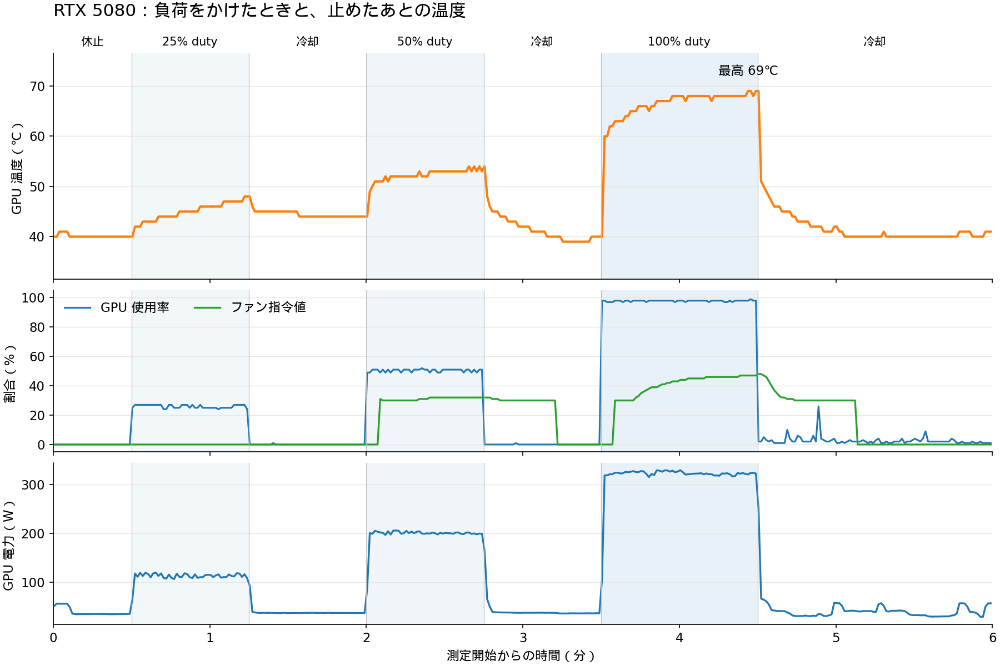
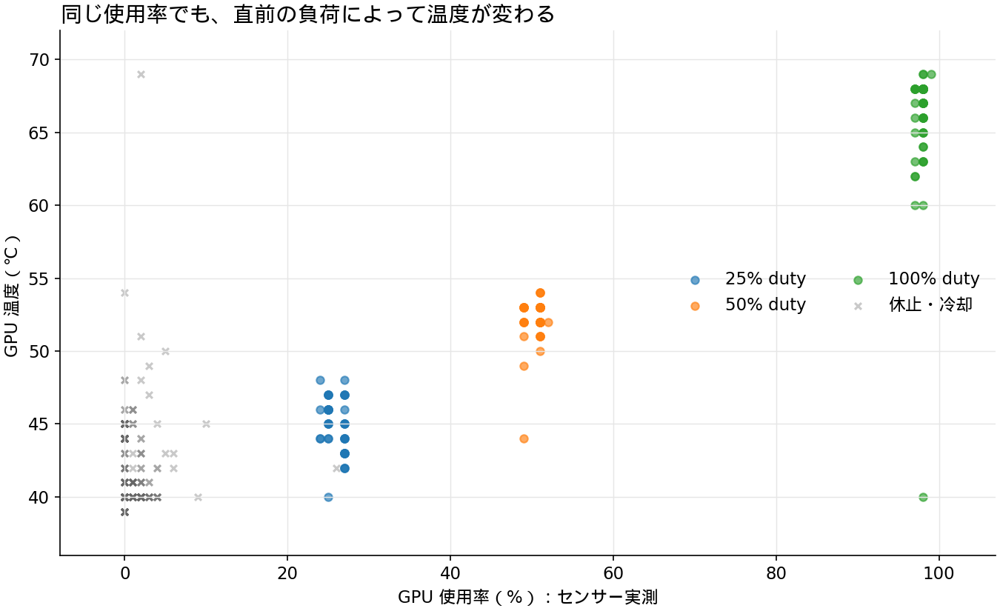

# GPU の負荷と温度

測定日: 2026-10-03、13:13:50–13:19:51 JST。
[PC の基準構成](2026-10-03-windows-pc-baseline.md)と[演算・I/O の性能測定](2026-10-03-windows-pc-performance.md)に対する追加の計測。

**RTX 5080 に段階的な負荷をかけた短時間測定では、最高温度は 69℃。**
高負荷の最後の 10 秒は、使用率約 98%・電力約 322 W・温度約 68.3℃だった。
温度による性能抑制フラグは観測されなかった。CPU 温度は取得できていない。

## 結果

使用率・電力・温度・ファン指令値は各段階の最後の 10 秒の平均。最高温度は各段階の全サンプルの最大値。

| 段階 | GPU 使用率 | GPU 電力 | 温度 | 最高温度 | ファン指令値 |
|---|---:|---:|---:|---:|---:|
| 休止 | 0.0% | 35 W | 40.0℃ | 41℃ | 0.0% |
| 低負荷（25% duty） | 25.9% | 114 W | 47.2℃ | 48℃ | 0.0% |
| 中負荷（50% duty） | 50.4% | 200 W | 53.3℃ | 54℃ | 32.0% |
| 高負荷（100% duty） | 98.0% | 322 W | 68.3℃ | 69℃ | 46.7% |

高負荷を止めた後、約 9.3 秒で初期の基準温度 + 5℃（45℃）以下になった。
1 秒ごとの 3 連続サンプルが 45℃以下となった最初の時刻で判定した。
90 秒の冷却区間の最後の 10 秒は 40.5℃だった。

## 時間による変化

負荷を増やすと消費電力と温度が上がり、負荷を止めると低下した。
温度とファン指令値には時間の遅れがある。中負荷の途中、51℃のサンプルでファン指令値が初めて 0% から 31% になった。
これはこの測定の観測で、正確なファンの作動温度や制御カーブを特定したものではない。

同じ使用率でも、負荷をかけ始めた時点と継続した後では温度が違う。
休止・冷却中にも温度に幅があり、使用率だけから温度を一意に決めることはできない。
室温、直前の負荷、経過時間、冷却制御を含めて比較する必要がある。

## 温度と電力による制限

- `hw_thermal_slowdown`: Active は 0 / 361 サンプル。
- `sw_thermal_slowdown`: Active は 0 / 361 サンプル。
- `sw_power_cap`: Active は 11 / 361 サンプル。すべて高負荷区間だった。

電力制限によるクロック調整と、温度によるクロック抑制は別のフラグ。
今回は高負荷で電力制限が一部作動し、温度による制限は 1 秒間隔の観測では検出されなかった。
サンプル間の短いイベントや、長時間の負荷での挙動を否定する結果ではない。
指標の意味は [NVIDIA nvidia-smi 文書](https://docs.nvidia.com/deploy/nvidia-smi/index.html) を参照。

## 測定方法

| 項目 | 条件 |
|---|---|
| GPU | RTX 5080 16 GB、NVIDIA driver 617.14 |
| 計算環境 | WSL、PyTorch 2.11.0+cu128、CUDA runtime 12.8 |
| 負荷 | 4096 × 4096 の dense FP16 行列積。3 回のウォームアップ後に測定 |
| duty | 200 ms ごとの実行時間割合を 25 / 50 / 100% に調整。各 4 演算の後に同期する |
| 順番 | 休止 30 秒 → 25% duty 45 秒 → 冷却 45 秒 → 50% duty 45 秒 → 冷却 45 秒 → 100% duty 60 秒 → 冷却 90 秒 |
| センサー | WSL の `nvidia-smi`。温度・使用率・電力・SM / memory clock・ファン指令値・制限フラグ |
| 間隔 | 目標 1 秒、361 サンプル。実測の間隔中央値 1.000 秒、最大 1.001 秒 |
| 停止条件 | 80℃以上、温度制限フラグ Active、またはセンサー取得が 3 回連続失敗したら負荷を止める |
| 結果の確認 | 代表の行列要素を float64 計算と比較。7 区間を完了し、センサー取得失敗は 0 件 |
| 設定 | 電源プラン、GPU の電力制限、クロック、ファン設定、BIOS は変更していない。普段のアプリは開いたまま |

100% duty はこの行列計算を継続する指定で、GPU 使用率を 100% に固定する設定ではない。
センサーの使用率は演算が走っていた時間の割合で、すべての演算器やメモリの飽和を示す値ではない。
温度と使用率は報告周期や集計期間が異なるため、1 秒のログを同時刻の厳密な瞬間値とは解釈しない。
`fan.speed` はメーカーの基準に対する指令値で、実際の RPM は測っていない。

## CPU と未測定の項目

CPU 温度は今回 Windows 標準 WMI などから取得できず、ハードウェア監視の WMI provider と HWiNFO の共有メモリも利用できない状態だった。
現在は CPU 温度を使う負荷試験を行っていない。HWiNFO の CPU Package / コア温度のセンサーログを取得できれば、同様の推移を比較できる。
HWiNFO の設定と共有メモリについては [公式フォーラムの説明](https://hwinfo.com/forum/threads/settings-tab-not-opening.11030/) を参照。

室温、GPU の hotspot / メモリ温度、ファンの実 RPM、騒音、CPU 温度、CPU package power は未測定。
高負荷は 60 秒なので、熱平衡や長時間の安定性、ゲーム・LLM・別の計算での温度は未評価。
負荷ごとに開始温度が異なり、最後の 10 秒の平均を「定常温度」とは呼ばない。

## 生データ

- [1 秒ごとのログと実行した一時 probe のソース](pc-performance-results/2026-10-03/thermal/gpu-thermal.json)
- [集計値](pc-performance-results/2026-10-03/thermal/summary.json)
- [時間推移 PNG](pc-performance-results/2026-10-03/thermal/gpu-temperature-timeline.png)
- [使用率と温度 PNG](pc-performance-results/2026-10-03/thermal/gpu-utilization-temperature.png)

生データの `probe_source` は今回だけに使った計測用コードのスナップショット。製品コードや常駐監視サービスではない。
UTF-8 に戻したソースの SHA-256 が `script_sha256` と一致することを確認してから、別の一時フォルダーで再実行できる。
結果には個人ファイル、シリアル番号、プライベート IP、アカウント名を含めていない。
