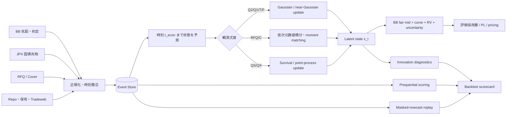
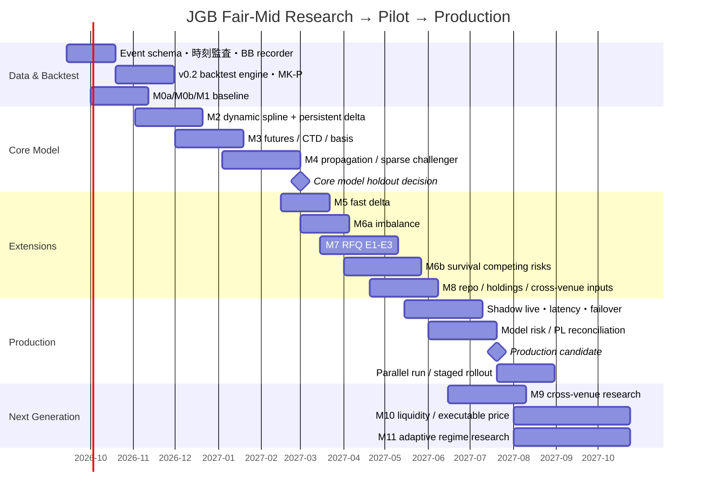

<!--
Provenance: Deep Research report, imported 2026-09-09.
Source: /home/kazumasa/.claude/uploads/.../87a42fb7-deepresearchreport.md
Imported verbatim. The inline `citeturn...` tokens are artifacts of the
deep-research tool's citation markup and are left untouched.
-->

# 日本国債フェアミッド推定モデル：v0.2総合レビューと発展ロードマップ

## エグゼクティブサマリー

v0.2の基本設計は妥当であり、研究上も実務上も中心軸を変える必要はない。推定対象は「イールドカーブ」そのものではなく、**BB市場を基準とした各JGB銘柄の数量非依存・現在潜在ミッド**であり、共通カーブ \(\theta_t\)、銘柄固有成分 \(\delta_t\)、先物ベーシス \(b_t\) を階層的潜在状態として共同推定する。BBの公式引値自身も、取引情報から参照銘柄を置き、気配制約、周辺銘柄補完、平滑化スプライン、銘柄別補正を組み合わせているため、この問題設定は日本市場の実務と整合的である。citeturn41view0turn41view1

2018–2026年の研究で最も重要な追加示唆は四つある。第一に、Guéant–Pu型の全面的粒子フィルタより、**Gaussian state-space core＋RFQ等に対する低次元non-Gaussian update**の方が今回の全銘柄・1秒SLAには適している。citeturn36view0turn36view5 第二に、M4の局所相関はdense covarianceだけでなく、2025年のSPDE/GMRF型の**疎なprecision表現**を有力候補にすべきである。citeturn36view4 第三に、RFQは価格順位だけでなく、回答参加・顧客選択・顧客属性を含む生成モデルへ拡張する余地が大きい。2025年の研究では、FGP型生成モデルがLightGBMとほぼ同等の分類精度を保ちながら単調性を維持した。citeturn35view4 第四に、気配生存は有力だが、BBイベントログを蓄積してからcompeting-risk hazardとして導入すべきである。citeturn40academia1turn40academia4

**実用上の本体はM2–M4。M5–M8は性能改善、M9–M11は次世代化**と位置づけるのがよい。

## 現行v0.2の設計と評価

v0.2の中心的な考え方は、JGB全体を「時々刻々と部分的にしか観測できない一つの確率的市場」として扱うことにある。BB公式引値の方法論でも、固定利付国債について日中の気配・出来値・ベーシス・銘柄間スプレッド等を用いてカーブを作成し、両側気配がある参照銘柄には気配区間制約、気配がない銘柄には周辺銘柄・日中取引・推測されるカーブ形状を使い、その後に平滑化スプラインと銘柄別補正を行っている。したがってv0.2は、これを**連続時間・確率分布・先物・RFQ付きに一般化したもの**と解釈できる。citeturn41view0turn41view1

**推定対象。** 主対象は銘柄 \(i\)、時刻 \(t\) の潜在BBミッド \(M_{i,t}\) である。これは「現在の表示bid/askの単純平均」「次回約定値」「数秒後の予想価格」「共通カーブ価格」のいずれとも同一視しない。数量・売買方向によるexecution effectを除いたBB市場のlocation parameterとする。

内部表現は概念的に、

\[
x_t=
\begin{pmatrix}
\theta_t\\
\delta_t\\
b_t
\end{pmatrix},
\]

より発展した段階では、

\[
x_t=
\begin{pmatrix}
\theta_t\\
\delta_t^{P}\\
\delta_t^{F}\\
b_t
\end{pmatrix}
\]

とする。\(\theta_t\) は共通discount/zero curveの節点、\(\delta^P\) は持続的銘柄固有成分、\(\delta^F\) は短期銘柄固有成分、\(b_t\) は先物・現物間のbasis状態である。

共通カーブのみの価格を、

\[
P^{curve}_{i,t}
=
\sum_j CF_{ij}D_t(T_{ij})-AI_i,
\]

銘柄固有spreadを含む市場ミッドを例えば、

\[
M_{i,t}
=
\sum_j CF_{ij}
\exp\{- [z_t(T_{ij})+\delta_{i,t}](T_{ij}-t)\}
-AI_i
\]

と置けば、最終的には同一の利回り規約で、

\[
RV_{i,t}
=
y^{BB}_{i,t}-y^{curve}_{i,t}
\]

を得る。BB自身も参照利回りを複利へ変換した後に平滑化スプラインを作っているため、内部状態を単利YTMではなくdiscount/zero curveで持つ設計は自然である。citeturn41view1

**観測の役割。**

| 観測 | v0.2での意味 | 状態への主な情報 |
|---|---|---|
| Q2：BB両側気配 | 中値周辺の強い観測 | \(\theta,\delta_i\) |
| Q1：片側気配 | 片側制約・低精度観測 | \(\theta,\delta_i\) |
| T：BB約定 | side・sizeを含むexecution observation | \(\theta,\delta_i\) |
| F：国債先物 | CTD/basket/basisを介した観測 | \(\theta,b\) |
| R：RFQ結果 | 競合価格・回答参加・顧客判断を介した部分観測 | 主に \(\delta_i,\theta\) |
| C：cover | 競合best quoteの順序統計量 | 主に当該銘柄mid |
| QS/QX | 気配の生存・取消・hit | mid＋liquidity state |
| H：BB引値 | 翌日初期化・比較・長期統計 | 本番当日15時には未使用 |

BB引値は午後3時近辺の市場状態を対象に、数量5億円未満の気配・出来等を算出から除き、午後4時に公表される。したがってv0.2の「Hは当日15時の推定に入れない」「5億円未満除外を推定モデルへ機械的に移植せず比較実験にする」は妥当である。citeturn41view0turn41view1

**出力。** 一銘柄一時点について、少なくとも

\[
\{\hat M_{i,t},\,
\hat y^{BB}_{i,t},\,
y^{curve}_{i,t},\,
RV_{i,t},\,
\operatorname{Var}(M_{i,t}\mid\mathcal I_t),\,
\text{鮮度},\,
\text{根拠}\}
\]

を出す。PL採用価格や在庫skewは別レイヤーとする。この考え方は、Bloomberg BVALが評価価格とは別に、評価に使用した市場データの量・整合性を表すBVAL Scoreを提供していることとも整合する。ただしBVAL Scoreは統計的なposterior varianceそのものではない。Bloombergは流動性の低い債券ではcomparable relative valueから評価し、活発な銘柄ではreal-time market observationsを利用すると説明している。citeturn35view0 LSEG/旧Refinitiv EPSもhard-to-valueを含む固定利付商品に複数時点の日次評価を提供しているが、公開資料からはBVALほど具体的なアルゴリズムは確認できない。citeturn35view10

**イベント処理は次のようになる。**

遅れて届くRFQは、受信時刻 \(t_{rx}\) で利用可能になるが、尤度は回答・顧客判断が行われた \(t_{econ}\) の状態に対して評価するというv0.2の整理が正しい。したがって実装はfixed-lag bufferまたはout-of-sequence updateを必要とする。

**検証フレーム。** v0.2では以下を段階比較する。

| 段階 | 内容 | 主な検証 |
|---|---|---|
| M0a | stale BB midpoint | 基準 |
| M0b | 前日BB引値＋先物β | 実務基準 |
| M1 | 静的cross-sectional spline | \(S_{main}\) |
| M2 | dynamic spline＋persistent \(\delta\) | \(S_{main}\)、innovation |
| M3 | futures＋CTD/basis | \(S_{main}\)、長blackout |
| M4 | local/cluster covariance | MK-P、sector mask、伝播診断 |
| M5 | fast \(\delta\) | 過剰伝播の改善 |
| M6a | size・imbalance | masked-nowcast＋短期予測 |
| M6b | quote survival/cancel | event-eraのみ |
| M7 | RFQ likelihood | L3 E2＋全体非劣性 |
| M8 | repo・保有・Tradeweb | L3、persistent RV |

主要基準は、更新が起きたときの予測ではなく、**事前選択された時刻で当該銘柄の直前 \(\ell\) 分の観測を隠し、その時点に実在したQ2をどれだけ補完できたか**である。

\[
S_{main}
=
0.2S_{L1}+0.3S_{L2}+0.5S_{L3},
\]

という階層重みは「薄い銘柄を重視する」という業務目的の明示的なutility weightであり、統計的真理ではない。

MK-Pは初期的に、

\[
\ell\in\{5,30,120\}\text{分},
\qquad
\ell_{main}=30\text{分}
\]

とし、事前乱数または固定グリッドで銘柄・日ごとに評価時刻を選ぶ。スナップショット時代では保存時点以外に架空のラベルを生成しない。

RFQは三実験に分離する。

| 実験 | 内容 | 答える問い |
|---|---|---|
| E1 | 当該銘柄BBもRFQ結果も隠す | 他銘柄・先物だけで補完できるか |
| E2 | BBを隠し、受信済みRFQを利用 | RFQがBB欠損時のmarkを改善するか |
| E3 | 次のRFQ結果自体を隠す | RFQ outcomeを事前に較正できるか |

ここでE1では、利用するRFQ尤度が存在しない限り `q_self` をモデル入力へ渡す必要はない。監査用ログとして保存することと、state updateへ使うことを分離するのが最も厳密である。

## 文献・業界レビュー

**RFQ likelihood。** Fermanian–Guéant–PuはBloomberg FITのMD2C RFQデータを用い、競合ディーラー価格と顧客行動を生成モデルとして記述した。この考え方がv0.2の「win/cover/loss/no-tradeを点価格ではなく尤度として扱う」という発想の直接的な原型である。citeturn37academia0 2018年のGuéant–Puはさらに、D2D/D2C取引、RFQ結果、composite priceを逐次Bayesian updateしてilliquid bondのmidを粒子フィルタで推定した。citeturn36view0turn36view1

2025年のMarín–Ardanza-Trevijano–Sabioはこの系譜をprobabilistic graphical modelとcausal inferenceへ拡張し、FGP型生成モデルとLightGBMを比較した。報告されたROC-AUCは0.742対0.743とほぼ同等で、生成モデルはspreadに対する単調性を構造的に保てた。したがってM7では、純MLへ置き換えるより**生成モデルを本体にしてMLをchallengerとする**方が妥当である。citeturn25academia0turn37academia3

v0.2の

\[
P(win\mid m)
=
[1-A_m(q)]^n S_V(q\mid m)
\]

などの式は、「独立な競合回答」「価格優先」「連続価格」「単一留保価格」という限定モデルとして整合している。しかし近年のRFQ研究は、回答参加そのものやclient/dealer attributesを明示的に扱う方向へ進んでおり、**招待社数 \(N\) を完全に外生的な競争強度とみなさない方がよい**。2025年の因果モデルもdealer/client featureとinterventionを中心に据えている。citeturn25academia0

**Illiquid bond filtering。** Guéant–Puのparticle filterは概念上非常に近いが、JGB全銘柄で \(\theta\) と多数の \(\delta_i\) を一括particle化すると状態次元が大きい。citeturn36view0 2020–2021年のGaussian variational state estimation研究は、非線形・non-Gaussian state-space modelに対して、posteriorをGaussianで近似するprincipledな代替を提示している。citeturn36view5 今回はGaussian coreを維持し、RFQのように実質一銘柄のlinear projection

\[
z=h_i^\top x
\]

にしか依存しない観測について、

\[
p(z\mid o)
\propto
p(o\mid z)N(z;\mu_z,v_z)
\]

を1次元積分し、その1、2次momentを全状態へ戻す**assumed-density / variational-Gaussian update**が、精度と1秒SLAのバランスで第一候補になる。

**Microprice・order-book imbalance。** Stoikovの2018年micro-priceは、板不均衡とspreadから将来価格の改善推定量を構成する代表的研究であり、中心的な対象は現在midそのものというよりfuture-price estimatorである。citeturn24search0 2024年にはBlakelyがより高いprice-rankのimbalanceを取り込む拡張を提案しており、近年も単純なbest-level imbalance以上の情報利用が研究されている。citeturn7academia2 したがってM6aは価値がある一方、「短期予測に効いたから現在fair-midにも入れる」という論理は避け、MK-Pとprequential predictionを別々に採点するv0.2の設計を維持すべきである。

**Dynamic curve。** 日本市場に最も近い一次資料はBB自身であり、参照銘柄を残存10年以下では半年ごと約20、10年超では1年ごと約30置き、複利へ変換したうえで平滑化スプラインを用いている。citeturn41view1 今回の調査では、2020–2026年に「JGB全銘柄・日中非同期気配・動的B-spline＋issue residual」をそのまま扱う一次研究は確認できなかった。一方、2023年のGaussian-process dynamic term-structure modelはGP非線形性とsequential Monte Carloを組み合わせ、2025年のSPDE研究は時間×満期の残差場を疎なprecision matrixでモデル化している。citeturn36view3turn36view4 後者はM4の「局所年限相関」を高速化するうえで特に直接的である。

**先物→CTD→curve。** JPXによれば長期国債先物は6%・10年の標準物で、受渡適格銘柄は残存7年以上11年未満の10年利付国債、実際の受渡銘柄は売方が選択する。citeturn23view0 コンバージョン・ファクターは標準物と受渡銘柄の価格換算に使われ、JPXの解説も、歴史的に7年近辺との連動が強かった理由を「当時の7–11年バスケットで受渡コストが最も安かったため」と説明している。したがって「先物＝固定7年金利」という扱いは制度的に固定された関係ではない。citeturn41view5turn41view6

M3は、

\[
\text{Futures}
\rightarrow
\{\text{deliverable basket},CF,\text{carry},repo\}
\rightarrow
b_t
\rightarrow
\theta_t
\]

とするべきである。日銀もJGB価格形成を理解するにはcash・futures・repo間の裁定と銘柄別需給が重要だと整理している。citeturn41view4

**Quote survival。** 2023年のLOB survival研究は、時間変化する板特徴量からfill-time distributionを予測するモデルを構築し、survival analysisを板情報へ適用できることを示している。citeturn40academia1 同じく2023年にはorder sizeやtime-of-dayを含むcompound Hawkes LOBモデルも提案された。citeturn40academia4 ただしこれらはorder-driven exchangeの研究であり、BBの業者間PTSへそのまま移植できる証拠ではない。したがってM6bは、Transformer/Hawkesから始めず、**hit・cancel・requoteのpiecewise-exponential competing-risk model**をpilot defaultとすべきである。

**Vendor practice。** BVALは2.7百万超のfixed-income securitiesを対象にし、活発な債券ではreal-time observationsを使った複数回評価、流動性の低い銘柄ではcomparable relative-value priceを用い、データ量と整合性をBVAL Scoreで別途表示すると説明している。citeturn35view0 Refinitiv EPSの公開資料も2.6百万超の固定利付・デリバティブ等、hard-to-valueを含む評価を複数時点で提供するとしている。citeturn35view10 この実務慣行は、v0.2の「推定値＋posterior uncertainty＋根拠score」を分離する考え方を強く支持する。

## 近年研究がv0.2に与える追加示唆

2020–2026年の文献から、v0.2を根本的に作り直す必要はないが、**実装方法と仮定の置き方には重要な更新がある**。

**全面粒子フィルタは第一候補から外す。** Guéant–Puのparticle filterは問題設定として重要だが、今回の全銘柄状態ではparticle degeneracyと計算量が問題になる。Gaussian variational filteringはnon-Gaussian measurementにもGaussian posterior approximationを適用できるため、Gaussian core＋local nonlinear updateの設計に理論的裏付けがある。citeturn36view0turn36view5

推奨形は、

\[
x^-_t\sim N(m^-_t,P^-_t)
\]

に対し、通常のBB・先物はKalman型更新、RFQは

\[
z=h^\top x
\]

だけを抽出し、Gauss-Hermite quadratureやadaptive quadratureで

\[
E[z\mid R],\qquad Var(z\mid R)
\]

を求め、moment matchingで \(x\) へ戻す方式である。

**M4はcovarianceではなくprecision側の設計も試す。** v0.2の

\[
Q_\delta
=
\sigma^2_{local}K_\tau+
\sigma^2_{cluster}ZZ^\top+
\sigma^2_{idio}I
\]

は直感的だが、全銘柄dense covarianceを保持するとstate dimension増加に弱い。2025年のSPDE-DNS研究は、時間・満期方向の残差をGaussian random fieldとして表し、疎なprecision matrixでscalable inferenceを行い、残存するcross-maturity dependenceを低下させた。citeturn36view4 JGBで同じ実証結果が得られる保証はないが、M4のchallengerとして**1次元maturity GMRF/SPDE＋low-rank cluster factor**を入れる価値が高い。

**RFQのprice-priorityモデルはrestricted baselineとする。** 2025年のMD2C研究はFGP型生成モデルを維持しつつ、client/dealer featureとcausal interventionを明示的に扱っている。citeturn25academia0 よってM7では、

\[
\rho=
\operatorname{logit}^{-1}
(
\alpha_{\rm client}
+\alpha_{\rm sector}
+\alpha_{\rm size}
+\alpha_N N
+\alpha_{\rm state}z_t
)
\]

のように**競合回答参加率自体を状態依存**にする。

また顧客選択は、完全な

\[
\text{lowest price wins}
\]

だけでなく、

\[
P(\text{dealer }j\text{ chosen})
\propto
\exp[
-\gamma P_j
+u_{\rm relationship,j}
+u_{\rm timing,j}
+\cdots]
\]

というsoft-choice challengerを置く。restricted modelがE2/E3で勝つなら単純版を採用すればよい。

**M6bはsurvivalだけでなくcompeting risks。** 一つのBB気配が終了する理由は、hit・cancel・price update・session close等で異なる。近年のLOB survival/Hawkes研究はevent typeやtime-varying covariatesを扱う方向へ進んでいる。citeturn40academia1turn40academia4 したがって、

\[
\lambda_e(t)
=
\lambda_{0,e}(age,tod)
\exp\{\beta_e^\top z_t\},
\quad
e\in\{\text{hit,cancel,requote}\}
\]

とする方が、「生きていた時間」だけを単独で使うより識別しやすい。

**Regime adaptationはM11まで待たなくても、Qのscalar scalingだけなら早く試せる。** 2021年のgovernment-bond yield研究は係数変化にsmooth/abruptなlatent dynamicsを許すBayesian TVP構造を示し、2026年にはregime-switching yield-curveモデルとUKFを組み合わせた研究も出ている。citeturn30academia2turn30academia1 ただし後者は中国債・週次であり、JGB intradayへの直接証拠ではない。最初はHMMではなく、

\[
Q_t=s_tQ_0,
\qquad
\log s_t
=
a+b\log RV^{fut}_t
\]

のような**先物実現ボラによる連続的Q scaling**をM4 challengerにする方が安全である。

**GP/NNは研究challengerでありpilot defaultではない。** 2023年のGP-DTSM、2025年のHJM制約付きneural filteringはいずれも非線形性・市場整合性を扱う有力研究だが、対象は主として日次ないし数日先のcurve forecastingで、今回の1秒以内のcurrent-mid nowcastとは目的が異なる。citeturn36view3turn27academia2 したがってGP/NNをM2の代替にせず、M11以降のchallengerにする。

## 発展モデルM2–M11の具体設計

以下の計算量は、銘柄数を \(N\)、カーブ節点数を \(K\)、総Gaussian状態次元を \(d\)、局所bandwidthを \(w\)、cluster factor数を \(r\)、RFQ数値積分点を \(J\) とした概算である。数値設定は**pilot開始値であり、最終値ではない**。

| 段階 | 推奨アルゴリズム | Pilot default / prior | 計算量の目安 | 必要データ | 長所 | 主な弱点 |
|---|---|---|---|---|---|---|
| **M2** | continuous-time dynamic B-spline zero curve＋persistent issue AR(1)、square-root Kalman/情報filter | \(K=10\)–14、risk bucketを節点に含む。curve二階差分Gaussian prior。persistent \(\delta\)半減期初期値10営業日、探索2–60日。6か月train/1か月test | full \(P\): scalar update \(O(d^2)\)。structuredなら大幅削減 | BB Q2/Q1/T、静的CF | 本体となる安定したnowcast | \(\theta/\delta\)識別 |
| **M3** | deliverable basket＋basis state。net-basis比較、top-2/3 CTD mixture challenger | basis AR(1)、半減期1–5営業日を初期範囲。CTDは固定しない | futures eventあたり \(O(B)\)＋filter update | JPX先物、CF、受渡銘柄、cash、carry/repo | 現物空白中の高速更新 | repo不足、CTD switch |
| **M4** | local Matérn/GMRF＋low-rank cluster＋idio | maturity length scale 1–3年から探索。cluster loading Gaussian shrinkage。sector別Q scale | dense \(O(N^2)\)、sparse precisionなら概ね \(O(Nw+rN)\) 型 | BB履歴、同償還、CTD、新発等 | 伝播を経済的に制御 | 過剰設計しやすい |
| **M5** | persistent＋fast OU issue component | fast半減期30分、探索5分–1日。persistentとはinnovation varianceを強くshrink | 状態が約\(N\)増加。sparseなら管理可能 | event BB | 個別急変をcurveから隔離 | fast成分がnoiseを吸収 |
| **M6a** | simple microprice / imbalance regressionを観測式へ | \(I=(Q_b-Q_a)/(Q_b+Q_a)\)。`mid + α·spread·I`。ridge、20–60営業日rolling | \(O(1)\) / quote | bid/ask size、spread、age | 安価、解釈容易 | current markとfuture prediction混同 |
| **M6b** | piecewise-exponential competing-risk hazard | age bin: <1s, 1–5s, 5–30s, >30sを初期案。standardized featureに \(N(0,1)\) ridge prior | \(O(1)\)～少数event-type/quote | event-level quote ID/status/size | 「何も起きない」を利用 | event-eraのみ、feed semantics依存 |
| **M7** | hierarchical generative RFQ＋1D quadrature＋Gaussian moment matching | \(\rho\): logistic、\(G\): Student-tまたは2成分Gaussian、\(S_V\): logistic/soft-choice。16–32点quadrature。3–6か月rolling | RFQあたり概ね \(O(J)\)+rank-one update | client、size、N、q_self、result、cover、timestamp | proprietary edge | selection/identification |
| **M8** | \(\delta^P\) のmean/driftを外生driverでhierarchical regression | ridge/elastic-netをdefault、複雑なMLはchallenger。6–12か月 | 日中はほぼ \(O(1)\)、日次再推定小 | SC repo、BOJ share、発行残高、入札属性、Tradeweb | cold-start・persistent RV説明 | publication lag、因果混同 |
| **M9** | cross-venue latent basis | venue×sector OU、BB basis=0でanchor。issue basisは強くshrink | \(O(VN)\) state、sparse update | BB＋Tradeweb等の同時刻価格 | 市場間basisを明示 | venue quote品質差 |
| **M10** | joint price-liquidity state | \(x=(mid,curve,\delta,\log spread,\log depth,impact)\)。まずEKF/ADF | stateほぼ倍増以上 | size別RFQ/約定、depth、fill | fair mid→executable priceへ発展 | 識別・データ量 |
| **M11** | regime/adaptive Q/R | まずcontinuous volatility scaling、次に2-state IMM/HMM。stay probability初期0.98–0.995 | continuous scaleはほぼ無料、2 regimeなら概ねbaseの2倍 | 長いevent履歴、vol/activity | stress時に適応 | regime overfit |

M2のB-splineをGPへ置き換える選択肢はある。2020年にはGPをsingle-curve calibrationへ使う研究が良好な結果を報告しているが、multi-curveへの難しさも指摘している。citeturn27academia1 今回は満期方向の節点が十数個で十分であり、**明示的B-spline＋Gaussian priorの方がデバッグ・リスク計算・1秒SLAに向く**。

M4については、2025年SPDE研究を受け、

\[
Q_\delta^{-1}=\Lambda_{\rm local}
\]

をbanded sparse precisionとして直接表すchallengerを推奨する。citeturn36view4 特にmask replayの計算量削減に効く可能性がある。

M3では「7年β」に戻さないことが重要である。JPXの制度上は7–11年が受渡対象で、売方が受渡銘柄を選べるため、CTDは価格・CF・carry・repoの状態で決まる。citeturn23view0turn41view6

一方、**M0bのbaselineにはBB引値ベースの日次先物βを正式採用してよい**。例えば、

\[
\Delta y^{BB}_{i,d}
=
\alpha(\tau_i)+
\beta(\tau_i)\Delta y^{F}_{d}
+\epsilon_{i,d},
\]

として残存年限方向にβを平滑化し、rolling 6–12か月で推定する。先物側はBBの3時評価時刻に整合する価格を用いる。BB引値自体が平滑化スプラインと銘柄別補正を含むため、このβは「瞬間的な先物伝播係数」ではなく、**BBの日次評価価格を先物だけで更新する実務benchmark**と解釈する。citeturn41view0turn41view1

## v0.2への優先変更案

実装開始前に変更する価値が高いものを、八つに限定すると以下になる。

| 優先 | 変更 | 理由 | 工数 | 検証 |
|---|---|---|---|---|
| **A** | \(S_{main}\) の主版では、mask後に未知となるlabel spread \(h_t\) を使わない版も必須化。実現 \(h_t\) を用いるscoreは「label-quality conditional score」として副次化 | 現行の状況Aは評価者には \(h_t\) が分かるが、実際のblackout時のモデルには分からない。\(h_t\) が価格状態と内生ならstrictなprequential scoreではない | 低 | MK-Pで両scoreのモデル順位を比較 |
| **B** | \(s^2\) の短lag切片法を唯一の較正法にせず、hierarchical local-level measurement modelを主推定または同格challengerに | \(\operatorname{Var}(\Delta\tilde m)=q\Delta+2s^2\) はmeasurement noiseがiidなら成立するが、sticky quote・自己相関・endogenous updateで切片が偏る | 中 | L1/L2でjoint state-space vs intercept、L3へhierarchical pooling |
| **C** | M0bを「BB引値＋日次CTD-equivalent futures β」の正式benchmarkとして固定 | 低コストで強い実務基準。高度モデルの導入価値を厳しく測れる | 低 | rolling 6/12か月、tenor shrinkage、MK-P |
| **D** | M2以降の実装をGaussian core＋local ADF/variational updateへ固定し、global PFはchallengerに降格 | 高次元PFを避け1秒SLAを守る。non-Gaussian measurementにもGaussian近似法が利用可能。citeturn36view5 | 中 | PFを小規模subsetでoracle challengerにし、ADFとの差を比較 |
| **E** | M4にdense kernelだけでなくsparse precision/GMRF challengerを追加し、同時にsector別 \(Q\) scalingを試す | 2025年SPDE研究はcross-maturity residualを疎構造で効率的に扱えることを示す。citeturn36view4 | 中 | MK-4、innovation cross-correlation、latency、memory |
| **F** | M7のhard price-priority式をrestricted baselineとし、soft client-choice＋state-dependent \(\rho\) をchallenger化 | 近年のMD2C研究は顧客・dealer featureを含む生成/因果モデルを支持。citeturn25academia0 | 高 | E2、E3、PIT、reliability、customer holdout |
| **G** | M6bを単一survivalではなくhit/cancel/requote competing risksで仕様化 | quote終了理由を混ぜるとmid情報とdealer行動を混同する。近年のsurvival/LOB研究とも整合。citeturn40academia1turn40academia4 | 中〜高 | event-eraのみ、MK-P、hazard calibration、ablation |
| **H** | posterior uncertaintyとは別に `evidence_score` を正式出力へ追加 | BVALも市場データの量・整合性を価格とは別scoreで提供する。確率的不確実性と監査可能性を分けられる。citeturn35view0 | 低 | 将来innovation・mask errorとの単調関係を検証 |

Aについて補足すると、状況Aで実現spreadを使うこと自体が誤りなのではない。測定誤差の大きさを事後的に知っているとして潜在midを評価する**conditional measurement score**としては有用である。しかし、

> 「その時点で直接BBを見られなかった場合の実運用予測性能」

を主要主張にするなら、主scoreはblackout中にも分かる変数だけで構成した方が解釈が明瞭になる。両方を残すのが最善である。

Bの切片法は、

\[
\tilde m_t=M_t+\epsilon_t,
\qquad
M_{t+\Delta}-M_t\sim(0,q\Delta)
\]

かつiid measurement errorなら、

\[
Var(\tilde m_{t+\Delta}-\tilde m_t)
=
q\Delta+2s^2
\]

なので理論的に美しい。しかし

\[
Cov(\epsilon_t,\epsilon_{t+\Delta})\neq0
\]

なら切片は

\[
2\{s^2-Cov(\epsilon_t,\epsilon_{t+\Delta})\}
\]

となる。したがって「切片法＝真の \(s^2\)」ではなく、**高速で透明なinitial estimator**として使うのがよい。

Fについては、現行v0.2の `lost_other/no_trade` の式は、記載された独立性・価格優先・連続価格の仮定の下では整合している。問題は代数ではなく、**その仮定が実RFQデータで十分か**である。

## ロードマップ、体制、リスク、優先資料

推奨は、最初からM8まで作らず、**M2–M4でproduction-worthy coreを作り、その後に独自情報を足す**進め方である。

これは**約10–12か月の計画上の目安**であり、M6bはevent-level BBデータが何か月蓄積できるかによって後ろ倒しにする。

| フェーズ | 主要成果 | データ | 計算資源の目安 | 人員目安 | 最大リスク |
|---|---|---|---|---|---|
| Data/backtest | reproducible event replay、M0 | BB snapshot/event、futures | 16–32 CPU、64–128GB RAM | Quant 1、Data Eng 1 | timestamp/semantics |
| M2–M3 | core latent-state estimator | BB＋JPX＋static cashflows | live 8–16 CPU程度、offline 32–64 CPU | Quant 2、Eng 1 | state identification |
| M4–M5 | propagation | 長期BB history＋event data | offline 64 CPU級が有用 | Quant 2、Eng 1 | covariance overfit |
| M6–M7 | microstructure/RFQ | quote ID/status、RFQ full log | CPU中心、GPU不要 | Quant 2、Eng 1–2 | selection bias / sparse client cells |
| M8 | persistent drivers | repo、BOJ holdings、Tradeweb | 小 | Quant 1 | publication lag |
| Shadow/production | SLA、failover、PL | live feed全種 | 冗長live service | Quant 1–2、Eng 2、SRE 0.5 | latency/data outage |

最低限のcore teamは、**quant 2名＋market-data/low-latency engineer 2名**を推奨する。加えてSRE/data-quality 0.5 FTE程度と、front trader/valuation SMEが継続的にレビューする体制が望ましい。mask replayはlive inferenceより桁違いに重いため、研究用batch computeとlive computeを分離する。

production gateは平均レイテンシではなく、例えば

\[
P(t_{pub}-t_{rx}>1\text{s})
\]

とtail latencyを管理する。さらにデータfeed停止時には、M0bまたはM2のpredict-onlyへ自動fallbackし、**「値を常に出す」と「新情報を観測したふりをする」を分ける**。

**優先的に保存すべきデータは、モデルより先に固定する。** BB event feedについてはquote ID、status、size、source timestamp、receive timestamp、同一内容の再提示、hit/cancel semanticsを可能な限り保存する。RFQではrequest/response/resultの各時刻、招待社数が自社込みか、cover absentとunrecordedの区別、tie ruleを残す。これがなければM6b/M7の高度化は後から復元できない。

**優先参考資料と直接URL。**

| 優先資料 | このプロジェクトでの役割 |
|---|---|
| [日本相互証券「BB国債価格（引値）の算出方針」](https://www.bb.jbts.co.jp/ja/marketinfo/bb_hikene/main/00/teaserItems1/0/linkList/0/link/bbhikene_20251001.pdf) | JGB固有の最重要仕様。参照銘柄、気配制約、5億円、spline、補正。citeturn41view0turn41view1 |
| [日本相互証券 BB国債価格](https://www.bb.jbts.co.jp/ja/marketinfo/bb_hikene.html) | 3時評価・4時公表等の運用基準。citeturn35view1 |
| [JPX 国債先物制度概要](https://www.jpx.co.jp/derivatives/products/jgb/jgb-futures/01.html) | 標準物、7–11年受渡、売方選択、取引時間。citeturn23view0 |
| [JPX「国債先物入門」](https://www.jpx.co.jp/derivatives/products/jgb/jgb-futures/tvdivq0000003n94-att/kokusaisakimononyumon.pdf) | CF、CTD、cash-futures basisの実装基礎。citeturn41view5turn41view6 |
| [BOJ, Fukuma et al. (2024), *The Impact of QQE and YCC on the Functioning of the JGB Market*](https://www.boj.or.jp/en/research/wps_rev/wps_2024/wp24e09.htm) | BOJ保有比率、取引量、bid-ask、銘柄別歪み。citeturn41view3 |
| [BOJ, Shigemi et al. (2001), *Pricing of JGBs: Futures, Repo and Issue Supply-Demand*](https://www.boj.or.jp/en/research/wps_rev/mkr/kmr01e01.htm) | M3/M8のcash-futures-repo経済構造。citeturn41view4 |
| [Fermanian, Guéant & Pu, *The behavior of dealers and clients…*](https://arxiv.org/abs/1511.07773) | M7 RFQ生成尤度の原型。citeturn37academia0 |
| [Guéant & Pu, *Mid-price estimation for European corporate bonds*](https://arxiv.org/abs/1810.05884) | latent mid＋RFQ＋sequential Bayesian filteringの最も近い先行研究。citeturn36view0 |
| [Marín, Ardanza-Trevijano & Sabio (2025), *Causal Interventions in Bond MD2C Platforms*](https://arxiv.org/abs/2506.18147) | M7の現代的生成/因果モデル、ML challenger。citeturn25academia0 |
| [Courts, Wills & Schön, *Gaussian Variational State Estimation*](https://arxiv.org/abs/2002.02620) | full PFを避けるGaussian approximate filteringの理論候補。citeturn36view5 |
| [Stoikov, *The Micro-Price: A High-Frequency Estimator of Future Prices*](https://papers.ssrn.com/sol3/papers.cfm?abstract_id=2970694) | M6a imbalance/micropriceの基礎。citeturn24search0 |
| [Arroyo, Cartea, Moreno-Pino & Zohren (2023), *Deep Attentive Survival Analysis in Limit Order Books*](https://arxiv.org/abs/2306.05479) | M6b survival/fill-time研究。citeturn40academia1 |
| [Duan et al. (2025), *Forecasting the Term Structure with SPDE-Based Models*](https://arxiv.org/abs/2512.23910) | M4のsparse precision/GMRF challenger。citeturn36view4 |
| [Dubiel-Teleszynski et al. (2023), *Dynamic Term Structure Models with Nonlinearities using Gaussian Processes*](https://arxiv.org/abs/2305.11001) | GP・nonlinear dynamicsの研究challenger。citeturn36view3 |
| [Gao & Hyndman (2025), *Arbitrage-Free Bond and Yield Curve Forecasting with Neural Filters*](https://arxiv.org/abs/2511.17892) | M11以降のno-arbitrage neural-filter challenger。citeturn27academia2 |
| [Bloomberg BVAL official documentation](https://professional.bloomberg.com/products/data/enterprise-catalog/pricing/evaluated-pricing/) | relative-value fallback、provenance score、valuation governance。citeturn35view0 |
| [LSEG / Refinitiv Evaluated Pricing Service](https://developers.lseg.com/en/use-cases-catalog/price-discovery-trading-workflows) | evaluated-price vendorのcoverage・hard-to-value運用比較。citeturn35view10 |

最終的な研究優先順位は、

\[
\boxed{
\text{M0b}
\rightarrow
\text{M2}
\rightarrow
\text{M3}
\rightarrow
\text{M4}
\rightarrow
\text{M5}
\rightarrow
\text{M6a/M7}
\rightarrow
\text{M6b/M8}
}
\]

とするのが最も合理的である。

その中でも**M2–M4を一つのproduction coreとして成立させることが最重要**である。M2が「非同期の全銘柄を一つのlatent stateとして追う」、M3が「先物から現在の共通状態を即時更新する」、M4が「その情報をどの銘柄へどれだけ伝えるかを決める」という三つの役割を持つ。M6–M8は、その物理的骨格に対して追加観測を与える層である。

したがって本プロジェクトの最終的な表現は、単なる「リアルタイム・イールドカーブ構築」ではなく、

\[
\boxed{
\textbf{JGB市場全体の潜在価格場を、非同期・異質・部分観測イベントから逐次再構成する動的階層モデル}
}
\]

とするのが最も正確である。