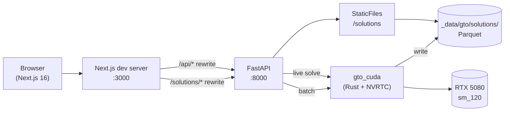
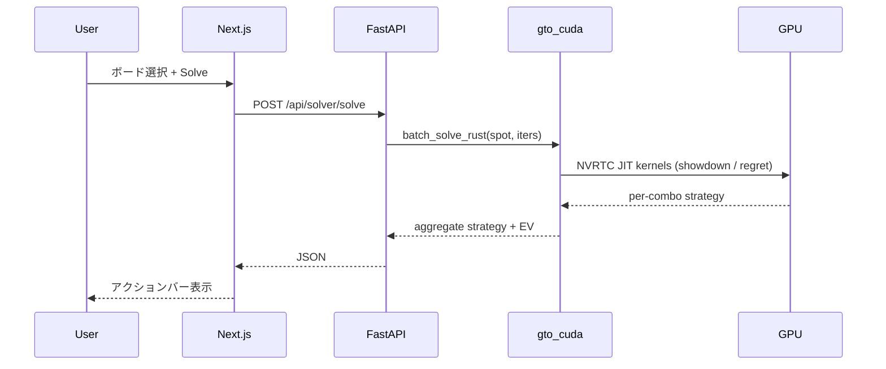
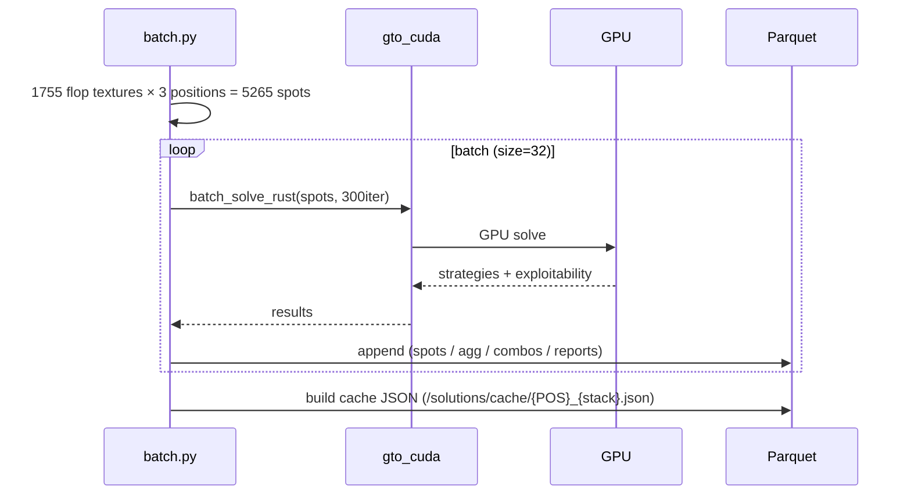
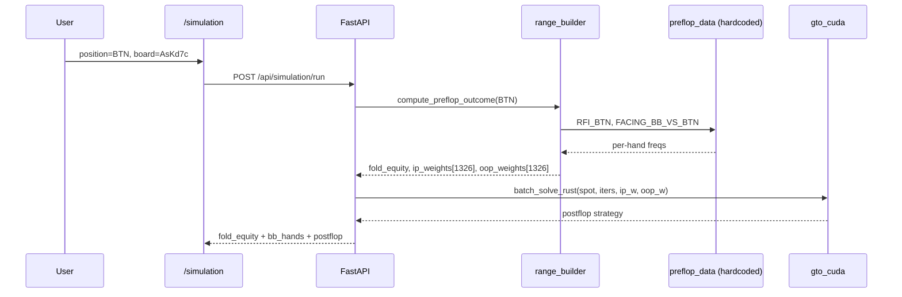

# Architecture

GTO Poker Suite のシステム構成と設計判断。

---

## 全体構成



### コンポーネント責務

| レイヤ | 技術 | 役割 |
|---|---|---|
| **Frontend** | Next.js 16 / React 19 / Tailwind v4 | UI・状態管理・rewrite で API/Solutions をプロキシ |
| **API** | FastAPI / Pydantic | エンドポイント・バリデーション・Rust 拡張呼び出し |
| **Solver Core** | Rust (gto-core) | CFR/DCFR・木構築・ハンド評価 (CPU) |
| **GPU Solver** | Rust (gto-cuda) | NVRTC JIT で CUDA カーネル実行 |
| **Bindings** | pyo3 (gto-py, gto-cuda) | Python ↔ Rust |
| **Storage** | DuckDB / Parquet | 事前計算ソリューションの永続化 |

---

## データフロー

### 1. ライブソルブ（インタラクティブ）



### 2. バッチ事前計算



### 3. レンジ込みシミュレーション



---

## ディレクトリ詳細

```
crates/
├── gto-core/                     CPU 実装 (Rust)
│   └── src/
│       ├── card.rs               カード型・パース
│       ├── eval.rs               7-card ハンド評価器 (lookup table)
│       ├── equity.rs             Monte Carlo equity
│       ├── range.rs              Range = weights[1326] + blocker処理
│       ├── tree.rs               マルチストリート用ゲーム木 (Flop/Turn/River)
│       ├── cfr.rs                単一スポット CFR
│       └── multistreet.rs        Backward Induction (River→Turn→Flop)
│
├── gto-cuda/                     GPU 実装 (Rust + CUDA)
│   └── src/
│       ├── cuda_ffi.rs           CUDA Driver API ctypes バインド
│       ├── kernels.rs            NVRTC で JIT する .cu ソース
│       ├── cfr.rs                BatchCfrSolver (GPU)
│       ├── fast_cfr.rs           FastCfrSolver (全 GPU traversal)
│       └── lib.rs                pyo3 バインディング (batch_solve_rust)
│
└── gto-py/                       Pure Python bindings (CPU)
    └── src/lib.rs                solve_spot / solve_spot_multistreet / equity

src/gto/
├── api/
│   ├── main.py                   FastAPI app + CORS + StaticFiles mount
│   └── routers/
│       ├── health.py             /health
│       ├── equity.py             /api/equity
│       ├── trainer.py            /api/trainer/{quiz,answer}
│       ├── solver.py             /api/solver/solve  (live single-spot)
│       ├── library.py            /api/library/{flop,combos,report}
│       └── simulation.py         /api/simulation/run  (preflop + postflop)
│
├── trainer/
│   └── preflop_data.py           ハードコード GTO 頻度表 (RFI / FACING)
│
└── library/
    ├── flop_canon.py             22100 → 1755 テクスチャ正規化
    ├── schema.py                 spot_id 生成
    ├── store.py                  Parquet 読み書き + cache JSON 生成
    ├── batch.py                  バッチ計算スクリプト
    └── range_builder.py          preflop data → combo weights[1326]

web/
├── app/                          Next.js App Router
│   ├── layout.tsx                ルートレイアウト
│   ├── page.tsx                  ホーム
│   ├── neon/page.tsx             TRAINER
│   ├── library/page.tsx          LIBRARY
│   ├── report/page.tsx           REPORT
│   ├── solver/page.tsx           SOLVER
│   └── simulation/page.tsx       SIMULATE
├── components/
│   ├── layout/NeonShell.tsx      共通シェル (header + nav)
│   ├── ui/RangeHeatmap.tsx       13×13 レンジグリッド
│   └── ...
├── lib/                          API クライアント
│   ├── api.ts
│   ├── cards.ts                  カード文字列ヘルパー
│   ├── flop-canon.ts             フロップ正規化 (フロント側)
│   ├── trainer-api.ts
│   ├── library-api.ts
│   ├── solver-api.ts
│   └── simulation-api.ts
└── next.config.ts                /api/* + /solutions/* を FastAPI へ rewrite
```

---

## カード・コンボのエンコーディング

```
card = rank * 4 + suit
  rank: 0=2, 1=3, ..., 8=T, 9=J, 10=Q, 11=K, 12=A
  suit: 0=c, 1=d, 2=h, 3=s
  例: As = 12*4+3 = 51

combo_index(a, b) (a < b):
  lo*51 - lo*(lo-1)/2 + hi - lo - 1
  全コンボ数 NUM_COMBOS = C(52,2) = 1326
```

Range は `weights[1326]` の `f64` 配列。プリフロップレンジの数値化は `gto.library.range_builder.hand_to_combo_indices()` を参照。

---

## ゲーム木

### gto-core (multistreet, 正しい)

```
Flop OOP action
├── Check
│   └── IP action
│       ├── Check → NextStreet (Turn)
│       └── Bet
│           └── OOP action
│               ├── Fold (Terminal)
│               ├── Call → NextStreet (Turn)
│               └── Raise (max 1)
│                   └── IP {Fold | Call→NextStreet}
└── Bet
    └── IP action
        ├── Fold (Terminal)
        ├── Call → NextStreet (Turn)
        └── Raise (max 1)
            └── OOP {Fold | Call→NextStreet}

(Turn/River 同型、River の Call は Showdown へ)

ベットサイズ: Flop 50% / Turn 75% / River 75%
レイズ: 2.5x の prev bet
```

### gto-cuda (single-street, 高速だが不完全)

- 上記木の **NextStreet がすべて Showdown** に置換
- ベットサイズ 33% / 75% / 100% を同時に評価（3種）
- max 2 bets / street

### 詳細は [PROGRESS.md](./PROGRESS.md) の "ゲーム木の問題点" 参照

---

## 主要な設計判断

| トピック | 採用 | 理由 |
|---|---|---|
| GPU バインディング | NVRTC JIT (ctypes) | RTX 5080 (sm_120) が PyTorch 未対応のため、Driver API を直接呼ぶ |
| CFR variant | DCFR (α=1.5, β=0) | Brown & Sandholm 2019 の標準。収束速度が CFR+ より速い |
| バッチストア | Parquet | カラムナ・サイズ効率・DuckDB から直接読める |
| キャッシュ形式 | JSON per (pos, stack) | フロント直読で 1755 spots を一括 fetch |
| プロキシ | Next.js rewrites | CORS 回避・1ポート開発 |
| 状態管理 | React useState のみ | アプリ規模的に Redux 等は不要 |
| デザインシステム | Tailwind + 自前 NeonShell | コンポーネント数が少ない・Neon テーマ統一 |

---

## 既知の限界と TODO

### 即時の課題

1. **single-street solve のフロップ・ターンが不正確**
   - GPU ソルバーが NextStreet を実装していない
   - 解決策: gto-cuda に NextStreet ノード追加 + multistreet backward induction を GPU 化
2. **プリフロップが hardcoded**
   - RFI / FACING テーブルは GTO 近似に過ぎない
   - 解決策: Preflop CFR モジュール実装
3. **3bet 以降の preflop tree がない**
   - 解決策: 上記 Preflop CFR で対応

### ロードマップ

- Phase B (UI 統合) ✅ 完了
- Phase C: GPU 完全最適化 (D2D コピー・CUDA ストリーム)
- Phase D: スタック・ポジション拡張 (50bb, 200bb, HJ/UTG vs BB)
- Phase E: 商用化 (Supabase 認証 + Stripe + Cloud Run)

詳細は [PROGRESS.md](./PROGRESS.md)。
