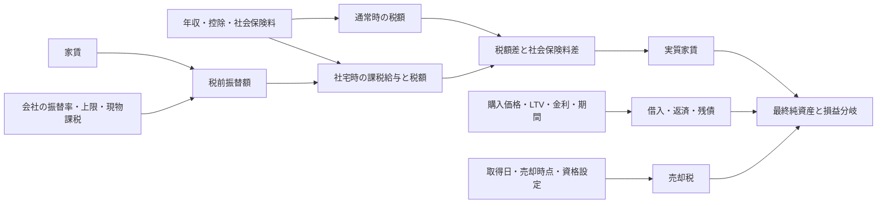

# 入力簡略化の初期調査と設計案

> 2026-09-18 更新: この文書は最初の調査・提案を保存したものです。その後、利用者は社会保険料と年額保有費用にも概算を許容しました。採用した仕様・実装結果は [README](../README.md) と [修正状況](STATUS.md) を参照してください。以下の「社保の推計を含めない」「保有費用を価格に連動しない」といった記述は旧案です。

調査日: 2026-09-18。対象: `housing-buy-vs-rent` v2.1（対象コードの最終コミット `ea4d32ae`）。
状態: 調査・計画のみ。アプリの実装は変更していない。

## 結論

**「計算式で決まる値は自動計算」「同じ値を使う場合は明示的に連動」「個人・会社の条件は保存して再利用」を組み合わせる。**
現在の33パラメータを8個の数値入力が中心の比較画面に整理する。ただし、33項目すべてが毎回の必須入力という現状ではない。すでに初期値が入り、19項目は静的設定として折りたたまれている。改善の主眼は、確認する項目数と、条件変更時の二重修正を減らすことにある。

対象はまず現在の個人向け・高所得給与モデルとする。年収範囲を広げる設計は別段階とする仮置きであり、利用者の回答に応じて変更できる。画面の年収範囲は3,000万〜1億円、社宅振替後の課税給与は1,500万円以上で、一般的な家族構成・所得種類を網羅する税務計算機ではない。

### 調査で分かったこと

1. **「年収 → 税率・税額」は実装済み。** `tax()` が給与所得控除、基礎控除、社会保険料などを反映し、累進税率から税額を計算する。税率の手入力欄は存在しない。
2. 借入額、返済額、残債、購入初期資金、家賃の初期費用・更新料、社宅利用期間の上限、売却時の税率区分もすでに入力から計算される。
3. 新たな連動の有力候補は `social_corp ← social`、`corp_years ← years`、`owner_growth ← rent_growth`。いずれも制度上の恒等式ではなく、利用者が選ぶ仮定である。
4. 個人・会社条件を毎回入力しないためのJSON保存・読込はすでにある。新しい保存機構を一から作らず、現在のファイル形式を拡張して連動の選択も保存する。
5. 社会保険料、社宅課税額、保有費用、建物比率は、年収・市場価格だけから一意には決まらない。無条件の自動推計は避ける。

## 現行の依存関係

根拠となるコード: `current/source/extracted_scripts.js` の `tax`、`housingTax`、`pmt`、`saleTax`、`run`、`HousingSensitivity.meta`、`validate`、`curve`、`grid`、UIの設定JSON読込処理。

この図の計算は原則として既存機能である。取得日は現行では2026-09-17固定。今後自由入力にする場合も、日付から税率区分を導く処理と特例資格の確認を分ける。

### 年収からは「単一税率」ではなく税額を求める

モデル内の計算は次の形を維持する。金額は円/年。`T` は給与に対する所得税等と概算住民税の合計。

\[
 A=\min(12R\alpha,C),\quad
 G_c=G-A+V,\quad
 B=T(G,S_0,D)-T(G_c,S_1,D)+(S_0-S_1)
\]

上限なしの場合は `A=12Rα`。`V` は課税対象の現物利益で、現金収入には足さない。社宅未利用期間は `B=0`。

年収5,000万円、年額振替900万円、社会保険料各150万円、現物課税0円の現行基準では、所得税の限界税率が45%から40%に変わる。

| 算出法 | 年額の税・社保メリット |
|---|---:|
| 現行の前後税額差 | 4,909,977.50円 |
| 900万円 × (45% × 1.021 + 10%) | 5,035,050.00円 |
| 単一税率による過大評価 | 125,072.50円 |

これは現行モデルによる独立した比較計算で、個人の確定税額ではない。表示するなら「限界税率」「税額÷給与の平均負担率」「振替に対する実効的な節税率」を区別する。年収だけを入力にする場合も、社会保険料等の仮定を内部に隠さず示す。[国税庁・所得税率](https://www.nta.go.jp/taxes/shiraberu/taxanswer/shotoku/2260.htm)、[給与所得控除](https://www.nta.go.jp/taxes/shiraberu/taxanswer/shotoku/1410.htm)、[基礎控除](https://www.nta.go.jp/taxes/shiraberu/taxanswer/shotoku/1199.htm)。

## 全33項目の扱い

「基本」は日常比較、「初回」は個人・契約条件の保存、「詳細」は必要な場合の編集を示す。元の数値は保持し、画面を簡略化しても計算から取り除かない。

| キー | 提案する入力場所・連動 | 根拠・注意 |
|---|---|---|
| `price` | 基本: 購入価格 | 家賃から逆算しない。同じ物件の価格交渉を表す感応度を維持 |
| `rent` | 基本: 比較する月額家賃 | 購入価格とは独立に比較物件の値を入れる |
| `years` | 基本: 比較期間 | 社宅期間の連動を選んだ場合だけ子の値も更新 |
| `growth` | 詳細: 価格予想。基本結果に採用値を表示 | g*の逆算には不要。最終純資産表示では0%等の採用値が必要 |
| `mortgage_rate` | 基本: 借入金利 | 年収や投資利回りから推定しない |
| `invest` | 基本: 税後運用利回り | 独立した将来仮定。名目年率/月次複利を維持 |
| `corp_years` | 基本: 社宅期間、または「比較期間中ずっと利用」 | 後者のみ `corp_years=years`。利用資格を保証する機能ではない |
| `owner_cost` | 基本: 年額保有費用 | 購入価格への自動比例はしない。実額不明なら仮定と表示 |
| `rent_growth` | 詳細: 家賃上昇率 | 値を他の将来仮定から自動推定しない |
| `owner_growth` | 詳細: 独立入力、または「家賃上昇率と同じ」 | 後者のみ連動。管理費と家賃の実際の上昇率が等しいとは主張しない |
| `step_year` | 詳細: 金利変更を使う場合 | 0の「変更なし」を読みやすく表示 |
| `step_rate` | 詳細: `step_year>0` のとき展開 | 数値は保存し、非表示と消去を混同しない |
| `extra_repair` | 詳細: 一時修繕を使う場合 | 通常費用との二重計上に注意 |
| `repair_year` | 詳細: `extra_repair>0` のとき展開 | 金額0なら通常画面では尋ねない |
| `salary` | 初回: 社宅前の現金給与相当額 | 税額はこの値等から既存関数で算出。年収変更時は再設定 |
| `sacrifice` | 初回: 会社制度の税前振替率 | 家賃の非課税割合とは別。年収から推測しない |
| `cap` | 初回: 会社制度の上限 | 「上限なし/あり」を明示。内部0の意味をユーザーに解読させない |
| `fringe` | 初回: 明細上の課税現物利益 | 家賃だけから0円と決めない。未確認なら仮定と表示 |
| `social` | 初回: 通常時の年間本人負担額 | 明細等の実額を優先。年収の一律割合にしない |
| `social_corp` | 初回: 手入力、または「通常時と同額」 | 同額を選択時のみ `social_corp=social`。社保制度の自動判定ではない |
| `other_deduction` | 初回: その他控除 | 家族構成・所得種類を年収から推測しない |
| `ltv` | 基本: 借入割合 | 借入額と頭金額は計算表示。頭金額との入力切替は後段候補 |
| `mortgage_years` | 初回/詳細: ローン年数 | 年齢から自動で審査条件を決めない |
| `loan_type` | 初回/詳細: 返済方式 | 現行基準は元利均等。IO比較は詳細に維持 |
| `buy_cost` | 初回/詳細: 費用率または見積 | 価格×率の支出計算は既存。率自体は価格から決まらない |
| `sell_cost` | 初回/詳細: 売却費用率 | 仲介上限だけで諸費用全体を決めない |
| `rent_initial` | 初回/詳細: 契約上の月数相当 | 家賃との金額連動は既存。返還敷金を費用扱いしない |
| `renewal` | 初回/詳細: 契約上の更新月数 | 2年ごとという現行条件を明示。家賃との金額連動は既存 |
| `building_share` | 初回/詳細: 物件資料の土地建物内訳 | 相場の価格や年収から一意に求めない |
| `basis_cost` | 初回/詳細: 取得費に算入する費用 | `buy_cost`をそのままコピーしない |
| `deduction_sale` | 初回/詳細: 適用を仮定する特別控除 | 所有年数だけで資格を決めない。仮定の採用を明示 |
| `sale_tax` | 詳細: 通常は算入 | 税なし比較のスイッチは保持。結果に設定を表示 |
| `reduced_long` | 初回/詳細: 10年超軽減の適用仮定 | 年数条件は既存自動判定。それ以外の資格は確認が必要 |

## 自動化の境界と追加候補

### 社会保険料: 年収1つからの推計は第1段階に含めない

厚生年金は標準報酬月額と標準賞与額に対して計算され、賞与にも上限がある。同じ年収でも月給/賞与の構成で結果が変わる。健康保険は加入保険者・支部、介護保険は年齢区分などの情報が必要になる。[日本年金機構・保険料](https://www.nenkin.go.jp/service/kounen/hokenryo/hoshu/20150515-01.html)、[協会けんぽ・2026年度](https://www.kyoukaikenpo.or.jp/lp/2026hokenryou/)。

概算モードを後から追加するなら、加入保険、対象年月、年齢区分、月給、賞与額と支給月、現物報酬を構造化して、実額上書きを残す。入力が増えるため、実額1つを保存する方式より負担が小さくなるとは限らない。社宅の現物評価は所得税と社会保険で共通ではなく、住宅の社保評価には2026-10-01の改正もある。[現物給与価額](https://www.nenkin.go.jp/service/kounen/hokenryo/hoshu/20150511.html)、[改正のお知らせ](https://www.nenkin.go.jp/oshirase/taisetu/jigyosho/2026/202603/0319.html)。

### 社宅の現物課税: 資料がそろえば関数化できるが、家賃だけでは足りない

使用人の場合、月額賃貸料相当額 `Q` は建物・敷地の固定資産税課税標準額と床面積から求める。本人から実際に徴収する月額家賃を `E` とすると、通常の取扱いは `E≥Q/2` なら課税現物利益0、それ未満なら `Q-E`。**給与の税前振替額を本人徴収家賃と同一視しない。** 役員には別ルールがある。[国税庁・使用人社宅](https://www.nta.go.jp/taxes/shiraberu/taxanswer/gensen/2597.htm)、[役員社宅](https://www.nta.go.jp/taxes/shiraberu/taxanswer/gensen/2600.htm)。

第1段階は会社の確認済み条件/現在の仮定を再利用する。現物利益を計算する補助フォームは、固定資産税資料・本人徴収額・役員/使用人区分が手元にある人向けの別機能とする。一般的な会社補助型の社宅は、現行の給与振替型モデルと異なるため、プリセットの名前だけで対応済みにしない。

### 仲介手数料: 一部分なら価格の関数にできる

現行の入力価格帯で通常の課税仲介業者を仮定し、物件価格の基準 `P_ex` を消費税抜き取引価格とすると、売買仲介の上限（税込）は `1.1 × (0.03 × P_ex + 60,000)`。これは法定の上限であり、合意する実額でも購入・売却諸費用の全額でもない。建物消費税を含む取引では、その税込総額を無条件に `P_ex` に代入しない。[国土交通省・仲介手数料](https://www.mlit.go.jp/totikensangyo/const/1_6_bf_000013.html)。

費用内訳方式を第2段階で追加するなら、仲介・登記等の各費用に「現金支出」「税務取得費に算入する額」を持たせ、`buy_cost` と `basis_cost` を同じ見積から集計する。課税区分をすべて自動判定する前提にはしない。売却側は**損益分岐を探索する候補売値ごと**に費用を再計算する。基準売値で作った費用率を固定する実装では定額部分が誤る。

### 保有費用・建物比率・売却特例

- 管理費・修繕積立金・税・保険の年額合計は部品から計算できる。ただし部品入力は増えるので、通常は合計1つ、詳細で内訳を確認する。固定資産税の課税基礎を市場購入価格と混同しない。[東京都主税局](https://www.tax.metro.tokyo.lg.jp/kazei/real_estate/kotei_tosi)。
- 建物比率は資料上の建物価格/総額から計算可能。非業務用建物の減価償却率も構造から選べるが、現行はRCの0.015固定であり、比率を求めるためだけに床面積・築年数等から市場推定しない。[国税庁・建物取得費](https://www.nta.go.jp/taxes/shiraberu/taxanswer/joto/3261.htm)。
- 3,000万円控除と10年超軽減には居住、過去の利用、相手方等の条件がある。「年数を満たしたから全条件に適合」としない。[3,000万円控除](https://www.nta.go.jp/taxes/shiraberu/taxanswer/joto/3302.htm)、[10年超軽減](https://www.nta.go.jp/taxes/shiraberu/taxanswer/joto/3305.htm)、[長期譲渡所得](https://www.nta.go.jp/taxes/shiraberu/taxanswer/joto/3208.htm)。
- 税制は現行の2026年固定モデルとして識別・保存する。所得控除は年度依存なので、一般年収層対応や将来年別計算を始める際は別の税制版として検証する。今日の日付で過去の保存結果を書き換えない。

## 影響を確認した簡単な試算

現行基準から表の条件だけを変更した決定論的な感応度。物件・制度の推定値や信頼区間ではない。g*は購入が借上社宅と互角になる住宅価格上昇率。

| 変更 | 社宅比較g*（%/年） | 基準との差（pp） |
|---|---:|---:|
| 基準 | 2.4576 | 0 |
| 現物課税を月5万円に | 2.3081 | −0.1495 |
| 通常/社宅の社保を両方150万→200万円に | 2.4451 | −0.0124 |
| 社宅時のみ社保を150万→100万円に | 2.5766 | +0.1190 |
| 所有費用を250万→300万円/年に | 2.6984 | +0.2409 |
| 売却の特別控除を0円に | 2.7096 | +0.2520 |
| 購入費用率を7%→5%に（取得費算入4%は固定） | 2.1719 | −0.2856 |
| 建物比率を30%→50%に | 2.5170 | +0.0595 |

基準近傍では社保の共通額より、会社制度・保有費用・取引費用・特例適用の仮定が結果を動かす。この順位を別の年収帯や物件へ一般化しない。小さな入力数の削減と引換えに、影響の大きな条件を無根拠に推定しないことが重要である。

## 比較した3案

| 案 | 内容 | 利点 | 欠点 |
|---|---|---|---|
| A | 表示だけ整理し、詳細設定を折りたたむ | 変更範囲が小さく数値互換性を保ちやすい | 連動する値の二重修正は残る |
| **B（推奨）** | A + 3種類の明示的な連動 + 保存設定の拡張 | 再入力と更新漏れを減らし、従来条件も再現できる | 感応度・保存ファイルにも連動の意味を反映する必要がある |
| C | 給与・社保・社宅・物件費用の大部分を推計 | 資料や前提がそろった利用者には便利 | 必要属性と保守対象が増え、少入力でも精度が高いとは限らない |

## 推奨する画面と状態の設計

### 通常の比較画面

基本数値入力は `price, rent, years, mortgage_rate, ltv, owner_cost, invest, corp_years` の8個。社宅利用なし、または全期間利用を選んだ場合は社宅年数の数値入力を省略し7個。これは初回設定後の日常比較の目標であり、選択ボタンや初回設定を含めた総操作数ではない。

年収・社宅制度・社会保険料・返済条件などは初回設定としてまとめる。保存済みJSONから復元できる。既存基準値を使う場合は「例示の仮定」と表示し、読み込んだだけで会社確認済みと扱わない。

入力欄と別に、税額、実質家賃、借入額、頭金額、初期費用、採用している成長率・費用率・特例設定を読み取り専用で表示する。詳細設定で変更がある場合は、その内容を基本画面から確認できるようにする。高度な比較として33項目の編集能力は残す。

### 関数化と上書き

小さな入力解決関数を既存計算の前に置く。33個の解決済み値を受け取る `HousingModel` と `HousingSensitivity` の既存の計算インターフェースは維持する。汎用の数式エディタや依存関係エンジンは導入しない。

各連動値に「手入力/連動」「参照元」「現在の採用値」を持つ。元の手入力値は連動中も保持する。子の値を直接編集した場合は手入力に切り替え、親が変わっても勝手に上書きしない。連動復帰は明示操作にする。

感応度は親を動かすたびに解決関数を通す。「社宅利用は比較期間中ずっと」なら比較年数15年のシナリオで社宅年数も15年にする。「社宅10年固定」の従来シナリオでは10年を維持する。二つの分析は別の問いなので、グラフとCSVに連動の有無を示す。子を直接動かす試算は、その試算だけ当該連動を解除する。

購入価格から家賃、所有費用、予想値上がり率を暗黙に動かさない。将来、頭金額固定方式を加える場合、価格感応度でLTVが変わる方式とLTV固定方式を分ける。

### 互換性と今回の範囲

- 旧JSONは全値を手入力モードとして取り込む。値が同じという理由で連動を推測しない。
- 新JSONは入力値・連動モード・採用値・税制版を保存。採用値は読み込み時に再計算する。
- `original/` は変更しない。既存5スクリプトのビルド構造と単一HTMLでの動作を維持する。
- 既存データに同じ前提を与えた結果は変えない。連動の選択で前提を変えた場合だけ、結果が変わる。
- 第1段階には社会保険料の自動推計、社宅制度の資格判定、全所得層対応、費用内訳の新エンジンを含めない。

## 検証と次段階

調査時に `node tests/audit.cjs` を再実行し **36件PASS、0件FAIL**。全33キーの定義、税額計算、設定保存/読込、感応度の呼出経路を読んで確認した。上記試算は現行の計算関数を読み取り専用で実行した結果。UI変更は行っておらず、新しい画面の操作性は未検証。

次は [実装プラン](superpowers/plans/2026-09-18-input-simplification.md) の第1段階を実装対象としてレビューする。現在の個人向け条件を維持するなら追加の制度推計は不要。幅広い年収を対象にする場合は、この計画に税計算の一般化を混ぜず、適用年度・給与計算の端数・所得税/住民税の控除差・非課税基準・住宅ローン控除等の別計画を先行させる。
