<!-- page: 1 -->

# ANNALES DE L’É.N.S. SCIENTIFIQUES 

### L. BACHELIER 

##### **Théorie de la spéculation** 

_Annales scientifiques de l’É.N.S. 3__e_ _série_ , tome 17 (1900), p. 21-86 

<http://www.numdam.org/item?id=ASENS_1900_3_17__21_0> 

© Gauthier-Villars (Éditions scientifiques et médicales Elsevier), 1900, tous droits réservés. 

L’accès aux archives de la revue « Annales scientifiques de l’É.N.S. » (http://www. elsevier.com/locate/ansens) implique l’accord avec les conditions générales d’utilisation (http://www.numdam.org/conditions). Toute utilisation commerciale ou impression systématique est constitutive d’une infraction pénale. Toute copie ou impression de ce fichier doit contenir la présente mention de copyright.

<!-- page: 2 -->

#### **THEORIE** 

**I)K** 

## **LA S P É C U L A T I O N ,** 

###### Ï^K M. L. BACHELIER. 

###### **Ï N T B O D U C T I O N .** 

Les influences qui déterminent les mouvements de la Bourse sont innombrables, des événements passés, actuels ou même escomptables, ne présentant souvent aucun rapport apparent avec ses variations, se répercutent sur son cours. 

A côté des causes en quelque sorte naturelles des variations, interviennent aussi des causes factices : la Bourse agit sur elle-même et le mouvement actuel est fonction, non seulement des mouvements antérieurs, mais aussi de la position de place. 

La détermination de ces mouvements se subordonne à un nombre infini de facteurs : il est des lors impossible d'en espérer la prévision mathématique. Les opinions contradictoires relatives à ces variations se partagent si bien qu'au même instant les acheteurs croient à, la hausse et les vendeurs à la baisse. 

Le Calcul des probabilités ne pourra sans doute jamais s'appliquer aux mouvements de la cote et la dynamique de la Bourse ne sera ! jamais une science exacte. 

Mais il est possible d'étudier mathématiquement l'état statique du marché à un instant donné/c'est-à-dire d'établir la loi de probabilité des variations de cours qu'admet à cet instant le marché. Si le marché, en effet, ne prévoit pas les mouvements, il les considère comme étant

<!-- page: 3 -->

plus ou moins probables, et celle probabilité [Nuit n'évaluer malbéinatiquement 

La recherche d'une formule qui l'exprime ne paraît pas Jusqu'à ce jour avoir été publiée; elle sera Fohjet (le ce travail. 

J'ai cru nécessaire de rappeler d'abord quelques notions théoriques - relatives aux,opérations de bourse en y joignant œr(ams aperçus non" veaux indispensables à nos recherches ultérieures. 

###### LES OPÉKATIOMS DE BOUBSE. 

1 1 Opérations de bourse. — II y a deux sortes d'opôrat loïw à terme : Les opérations fermes; Les opérations à prime. 

Ces opérations peuvent se combiner à rînfini, d'autaol. que l'on {.mte souvent plusieurs sortes de primes. 

Opérations fermes. — Les opérations a terme fermes sont ab^otîirîHm) analogues à celles du comptant, mais on r<^kî seulement des difIÏ*rences à une époque fixée d'avance et appelée _/iffifit/cuinn._ Hih* a lien le dernier jour de chaque mois, 

Le cours établi le jour de la liquidation ot auquel on nîppwle (mil^ les opérations du mois est le, _cwr^ de compmsalùm._ 1, L'acheteur ferme ne limite ni son gain ni ga perU% il gagne _h_ di(K" rence entre le prix d'achat et le prix de vente, si la vente esî jaiie midessus du prix d'achat, il 'perd la difÏerence si ia veîîle est, (aidî audessous. 1 II ya perte pour le vendeur ferme qui rachète plus liant -qîut mi primitivement vendu, il y a gain dans le cas contraire, ^ 

Reports. - L'acheteur au comptant touche ses coupons c-j pn»f nni. server indéfiniment ses'titres. Une opération a terme (npirant a 'h liquidation, 1-acheteur à terme doit, pour conserver Ha _mmtum m^_ qu'a la liquidation suivante, payer au vendear mw mdcrrmhé <lil^ _report_ (1 ). 

(^),Pour la définition 'complète dos report Jô nmvoie mix _ihmu^ ^hu^_

<!-- page: 4 -->

Le report varie à chaque liquidation; sur la rente il est en moyenne de 0^,18 par _3^,_ mais il peut être plus élevé ou nul; il peut même être négatif, on l'appelle alors _déport;_ dans ce cas, le vendeur indemnise l'acheteur. 

Le jour du détachement du coupon, l'acheteur à terme reçoit du vendeur le montant de ce coupon. En même temps, le cours baisse d'une somme égale; acheteur et vendeur se trouvent donc immédiatement après le détachement du coupon dans la même position relative qu'avant cette opération. 

On voit que si. l'acheteur a l'avantage de toucher les coupons, par contre, il doit en général payer des reports. Le vendeur, au contraire, touche les reports, mais il paye les coupons. 

Rentes reportables. — Sur la rente, le coupon de o^.'p par trimestre '11 représente o11 ^,^ par mois, alors que le report est presque toujours inférieur à o^, 20* La différence est donc à l'avantage de l'acheteur; de là est venue l'idée d'acheter des rentes pour les faire reporter indéfiniment- 

Cette opération est dite de la _renie reportable;_ nous étudierons plus loin ses prohabilités de réussite. 

Cours équivalents, — Pour bien nous rendre compte du mécanisme des coupons et des reports, faisons abstraction de toutes les autres causes de variation des cours. 

Puisque tous les trois mois sur la rente au comptant est détaché un coupon de 0^,75 représentant l'intérêt de l'argent de racheteur, la rente au comptant doit logiquement monter chaque mois de 0^,2,5. Au cours actuellement coté correspond un cours qui, dans trente jours, serait plus élevé de 0^,25, dans quinze jours de 0^,12,5, etc. Tous ces cours peuvent être considérés comme _éc/uwale/us._ 

La considération des cours équivalents est beaucoup plus compliquée lorsqu'il s'agit d'opérations à terme- II est d'abord évident que si le report est nul, le terroe doit se comporter comme le comptant et que le cours doit logiquement monter de 0^,25 par mois. Considérons maintenant le cas où le report serait de 0^,25. Prenons

<!-- page: 5 -->

l'axe des _x_ pour représenter les temps _{fig._ î)> la longueur OA représente un mois compris entre deux liquidations dont Fane correspond au point 0 et Fautre au point A. 

Kig, ï. 

Les ordonnées représentent les cours. Si AB équivaut ào^'^^, la marche logique do la rente uu comptant, sera représentée par la li^'ne droite QBE (( ), 

Considérons maintenant le cas où le report serait de 0^2;^ Un pmi avant la liquidation, le comptant et le ferme seront au même cours 0: puis, l'acheteur à terme devant payer o^sn de report, le cours1 du ferme sautera brusquement de 0 en G et suivra pendant tout lu mob la ligne horizontale CB. En B, il se (confondra dc 1 nouveau _ww_ 'h cours du comptant pour augmenter tout à coup de o^a^ en I11), etc. Dans le cas ou le report est une quantité donnée corrHspondani à la longueur 0F, le cours devrait suivre la ligne FB, puig GE, et _mim_ d<* suite. La rente à terme doit donc logiquement dans ce1 cag, d'urii* liquidation à l'autre, monter d'une quantité représenlée par FC qu'on pourrait appeler le _complément du report_ Tous les cours de F à B de la ligne FB sont _equimim^_ pour leg di»^ rentes époques auxquelles ils correspondent, 

En réalité, Fécarl entre le terme et le comptant ne se détend _n^_ d-une façon absolument régulière et FB n^st pas une droite main la construction qui vient d'être faite au début du niojg peut _^_ répéter _H_ une époque quelconque, représentée par,le point N. 

'OOn suppose,qu'il n'y a pas de détachomelU do _^m_ daiw _Ym^m^ iwwW_ co qui d adieurs ne changeraU rien à la dànoritollon. ' ! ' " 1 ! ! ! • l l •• l l ( * < l l l i ï J ;

<!-- page: 6 -->

Soit NA le temps qui. s'écoulera entre l'époque N considérée et la liquidation représentée par le point A. 

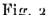

<!-- Start of picture text -->
Fis. a <!-- End of picture text -->

Pendant le temps NA, la rente au comptant doit logiquement monter de AB, proportionnel à NA. Soit N'F l'écart entre le comptani et le terme, tous les cours correspondant à la ligne FB sont _équiçalents._ 

Cours vrais. — Nous appellerons _cours vrai_ correspondant à une époque le cours équivalent correspondant à cette époque. 

La connaissance du cours vrai a une très grande importance, je vais étudier comment on le détermine* 

Désignons par _b_ la quantité dont doit logiquement monter la rente dans l'intervalle d'une journée. Le coefficient _b_ varie généralement peu, sa valeur chaque jour peut être exactement déterminée. 

Supposons que _n_ jours nous séparent de la liquidation, et soit C l'écart du terme au, comptant. 

t5n _n_ jours, le comptant doit monter de ^—^ centimes, le terme étant plus élevé de la quantité C ne doit monter pendant ces _n_ jours que de la quantité — — C, c'est-à-dire pendant un jour de 

On a donc 

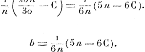

_l/à._ moyenne des cinq dernières années donne 

^==0^264. 

_Ami. de /.* Kc« jNormalc._ 3^ Séné» Tome XVIL — JANVIJKII 1900»

<!-- page: 7 -->

Le cours vrai correspondant à w jours sera égal au cours cote actuellement, augmenté de la quantité _ynl^_ 

Représentation géométrique des opérations fermes» — Une opération peut se représenter gôornétriquement d'une façon ires simple, Faxe des _x_ représentant les différents cours et taxe des _y_ les bénétiees correspondants. 

Je suppose que j'aie fait un achat ferme au cours représenté pur 0. que je prends pour origine. Au cours _x_ =: ()A, l'opération donne pour 

Fig. _3._ , 

bénéfice ,r; et comme, foi'donnée correspondante doil, aire égale au bénéfice, AB == OA; l'achat fcrijfjio est donc représeiité par la ligîîe Olî inclinée à 45° sur la ligne des cours. 

Une vente ferme se représenterait d^ine façoiî inverstL 

1 Primes. — Dans l'achat ou la •vente fermer acheté» rn et. veîideïirs s'exposent à une perte théoriquement illimitée. l)a«H le marché à prime, l'acheteur paye le litre plus cher que dai-fô le ea^ du marché ferme, mais sa perte eu baisse est limitée d'avance _h_ une eertaiîîe somme qui est le montant'de la prime, 

Le vendeur de prime a l'avantage de vendre plus clier, _mm_ il ite peut avoir pour bénéfice que le montant de la prime» 

On'fait 1 aussi, des'primes à la baisse qui limiiterïi la perte du mi^ deur; dans ce cas, l'opération se fait à îin coi,ïfôinferie«r if celui (lu farme. 

On ne traite'ces primes à la baisse que dana la spéeuliitiolt mir _\m_ marchandises; dans la spéculation .sur _ICB_ valeur^ 011 obtient _ww_ prime à la baisse en vendant ferme et en achetant ^imultaîiémerîl à

<!-- page: 8 -->

THÉORIE Ï)E LA SPÉCULATION. _^_ 

prime. Pour fixer les idées, je ne m'occuperai que des primes à la hausse. 

Supposons, par exemple, que le 3 °/o <^te _10^_ au début du mois; si nous en achetons 3ooo ferme, nous nous exposons a une perte qui peut devenir considérable s'il se produit une forte baisse. 

Pour éviter ce risque, nous pouvons acheter une prime dont 50e (1 ) 1111 en payant, non plus ïo/j. » mais _10^,1_ 5, par exemple; notre cours d'achat est plus élevé, il est vrai, mais notre perte reste limitée quelle que soit la baisse à So0 par 3^, c'est-à-dire à Soo^'. L'opération est la même que si. nous avions acheté du ferme à ïo/i.^îSy ce ferme ne pouvant baisser de plus de 50e , c'est-à-dire descendre au-dessous de loS^Ôô. 

Le cours de 103^,65, dans le cas actuel, est le _pied de la prime. On_ voit que le cours du pied de la prime est égal au cours auquel elle est négociée, diminué du montant de la prime. 

Réponse des primes. ~~ La veille de la liquidation, c'est-à-dire F avantdernier jour du mois, a lieu la _réponse des primes._ Reprenons l'exemple précédent et supposons qu'à cet instant de la réponsele cours de la rente soit inférieur à 103^,65, nous _abandonnerons_ notre prime, qui, sera le bénéfice de notre vendeur. 

Si, au contraire, le cours de la réponse est supérieur à 103^,65, notre opération sera transformée en opération ferme; on dit dans ce cas que la prime est _levée._ 

En résumé, une prime est levée ou abandonnée suivant que le cours de la réponse est inférieur ou supérieur au pied, de la prime. On voit que les opérations à prime ne courent pas jusqu'à la liquidation; si la prime est levée à la réponse, elle devient du ferme et se liquide le lendemain. 

Dans tout ce qui suivra, nous supposerons que le cours de compensation se confond avec le cours de la réponse des primes; cette hypothèse est justifiable, car rien n'empêche de liquider ses opérations à la réponse des primes, 

_(__i_ _)_ On dit _une prime clûnt_ pour _une prirms de_ oi _Von_ emploie la nôtaiicm ï(>4,i5/5o pour désigner une opéraîJon faite nu cours de jo/î1 '''',^ dont 50e ,

<!-- page: 9 -->

Écart des prîmes. — ï/écart entre le cours du ferme et échu d*une prime dépend d'un ^rand nombre de facteurs et varie sans cesse. 

Au même instant, l'écart est d'autant plus grandi que la prime est plus faible; par exemple,. la. prime dont M^' est évidemment meilleur marché que la prime dont 2-5^ 

I/écart d'une prime décroît plus ou moin^ regulier(*îîïent de(>nis le 1 commencement du mois juaqu^àlâ veille de la réponse» liionienlou eel • éôart.devient1 très faible, 

Mais, suivant les circonstance^ il peut _w_ détendre tre^ irrégulièrement et se trouver plus grand quelques jours avant la réponHe qiuui commencement du moiâ, 

Primes pour fin prochain. — On traite de^ primea non seixlernerït pour fin courant, mais aussi pour fin proc'haîrL î/écart (le celles-ci CHt nécessairement plus grand que celui den primeB fin courant, mab jî est plus faible qu'on ne le croirait _m_ fai%mt la difïérenee entî*e le cours de la prime et celui du. ferme; il faut en efÏel (iédtlire (Je cet écart apparent rirnporfance dïî repori fin coîiranl. 

Par exemple, l'écart moyen de la prime/^'it /p jotirs de Ja réjïonse est en moyenne de 7^; mais, comme te repor! inoyeîî _wi_ de 17% l'écart n'est en réalité que de 5^", Le détachement d'utn coupon fa}t.haig8cr lecoure de la1 prime cl'iiiîe valeur égale à limportânee du coupon. Si, par exemple, 'j'achète, le a septembre, une prime /25*1 à ic^Sû fin w lira rît, te émirs de riîa prime sera devenu _îoy^^_ le _1_ 6 septembre après le détadielîîerît _du_ coupon* 

Le cours du'pied de la prime sera xoS^So. 

1 Primes pour 1e lendemain. — On traite, surtout en codhse, den •• primesdont 5e et quelquefois dont lo^ pour le lendemain. La réponse pour1 ces petites primes a lien tous les JOUTH à 2^ 

1 Les primes en général. - Dans un marché à prime pour îîrse éetîéariee donnée, il y a deux facteurs à considérer : l'importance de _h_ prime et son écart du ferme.

<!-- page: 10 -->

II est bien évident que pi as une prime est forte, plus son écart est petiL 

Pour simplifier la négociation des primes, on les a ramenées à trois types en faisant sur l'importance de la prime et sur son écart les trois hypothèses les plus simples : 

T° L'importance de la prime est constante et son écart est variable; c'est cette sorte de prime qui se négocie sur les valeurs; par exemple, sur le 3 °/o on traite des primes /50e , /25e et /xo0 . 

2° L'écart de la prime est constant et son importance est variable; c'est ce qui a lieu pour les primes à la baisse sur les valeurs (c'està-dire la vente ferme contre achat à prime). 

3° L'écart delà prime est variable ainsi que son, importance, mais ces deux quantités sont toujours égales. C'est ainsi que l'on traite les primes sur les marchandises. Il, est évident qu'en employant ce dernier système on ne peut traiter à un moment donné qu'une seule prime pour la même échéance. 

Remarque sur les primes. — Nous examinerons quelle est la loi qui régit les écarts des primes; cependant nous pouvons, des maintenant, faire une remarque assez curieuse : 

Une prime doit être d'autant plus forte que son écart est plus faible. Ce fait évident ne suffit pas pour montrer que l'usage des primes soit rationnel. 

J'ai en effet reconnu, il y a plusieurs années, qu'il, était possible en l'admettant d'imaginer des opérations où l'un des contractants gagnerait à tous les cours. 

Sans reproduire les calculs, élémentaires mais assez pénibles, je me contente de présenter un exemple. 

L'opération suivante : 

A.chât d'une unité /ï^, Vente de quatre unités /50e , Achat de trois unités /25e , 

donnerait un bénéfice à tons les cours pourvu que l'écart du, /25e au /50e soi!, au plus le tiers de l'écart _dû /5<^_ au /ï^.

<!-- page: 11 -->

Nous verrons que des écarts semblables ne se ïTmumircmtjm'îuus dans la pratique, 

Représentation géométrique des opérations à prime. •— Proposonsnous1 de représenter géométriquement un achat à primer 

Prenons, par exemple, pour origine le cours du ferme _w_ monMmt où la prime dontA a été traitée; soîtEite cours relîitifde celte prime on son écart* 

Athdessus du pied de la prime, c^t-à-dire an cour^fl^ — _h)_ représenté par le point A, l'opération est assimilable à une opération ferme traitée air cours E< ; elle est donc représentée par la ligne CBF, Audessous du cours EI "— A, la perte est constante et^ par milite» l'opération est représentée par la ligne brisée DGF. 

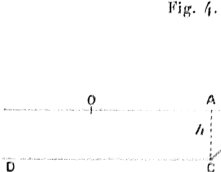

<!-- Start of picture text -->
Fi g* 4, o A —0 .„.....,.-,.....,...,...„.,......„..  ............. ^...............y 1' C <!-- End of picture text -->

La vente1 à prime ^e représenterait d^uino façon inverse. 

Écarts vrais. — Jusqu'à présent nous n^mmn parlé <jiie des écartH cotés, les seuls dont on s'occupe ordinîrirement; ce neKorït cep(»ïîdanl 11 pas eux qui ^'introduiront dans notre théorie, maia bien je» _àmrîfî imis^_ c'est-à-dire les écarts entre les cours _ûw_ priiïieg et Je» eoiirH vrais^ correspondant à la réponse des primeg* Le cours dont, if s^gil étant supérieur au cours coté (à moins que le report soit _m^mew_ à 25e , ce qui est rare),, il en résulte que Fécm vrai d'rme prime (*Nt inférieur à son écart coté. 

L'écart vrai d'une prime traitée _n_ jours avant _'h_ réponHe nera égal li1 son ^ écart diminué de la quantité _nh._ 

L'écart1 vrai d'une prime, pour fin prochain sera égal à son écart coté diminué de la, quantité [25 '-h _{n '-"_ 3o)6'L

<!-- page: 12 -->

Options. — On traite sur certains marchés des opérations en quelque sorte intermédiaires entre les opérations fermes et les opérations à prime, ce sont les options. 

Supposons que So111 soient le cours d'une marchandise. Au lieu d'acheter une unité au cours de 30^ pour une échéance donnée, nous pouvons acheter une option du double pour la même échéance à Sa1"1', par exemple. Il faut entendre par là que pour toute différence au-des'1 sous du cours de S^1 ', nous ne perdons que sur une unité, alors que pour toute différence au-dessus, nous gagnons sur deux unités. 

Nous aurions pu acheter une option du triple à _33^,_ par .exemple, c'est-à-dire que, pour toute différence au-dessous du cours de 33^ nous perdons sur une unité, alors que pour toute différence au-dessus de ce cours nous gagnons sur trois unités. On peut imaginer des options d'un ordre multiple, la représentation géométrique de ces ope" rations ne présente aucune difficulté. 

On traite aussi des options à la baisse^ nécessairement au même écart que les options à la hausse du. même ordre de multiplicité. 

###### LES PBOBABILITÉS BANS LES OPÉRATIONS DE BOURSE, 

Probabilités ! dans les opérations de bourse, ,— On peut considérer deux sortes de probabilités : 1° La probabilité que l'on pourrait appeler _maîMmatique,_ c'est celle que l'on peut déterminer _a priori;_ celle que l'on étudie dans les jeux de hasard. 

2° La probabilité dépendant de faits à venir et, par conséquent, impossible à prévoir d'une façon mathématique*. 

C'est cette dernière probabilité que cherche a prévoir le spéculateur, il, analyse les raisons qui peuvent influer sur la hausse ou sur la baisse et sur l'amplitude des mouvcffîfônts* Ses inductions sont absolument personnelles, puisque sa contre-partie a nécessairement l'opinion inverse. 

11 semble que le marché^ c'est-à-dire Fenseœble des spéculateurs, lie doit croire _à un instant donné_ ni à la hausse, ni à la .baisse?

<!-- page: 13 -->

L. BACiïELIEH. 

puisque, pour chaque cours coté, il y a autant d'acheteurs que de vendeurs. 

En réalité, le marché croit à la hausse provenant de la différence entre les coupons, et les reports; les "vendeurs font un léger sacrifice qu'ils considèrent comme compensé. 

On peut ne pas tenir compte de cette différence, à la condition de considérer les cours vrais correspondant à la liquidation, main le^ opérations se réglant sur les cours cotés, le vendeur paye la différence. 

Par la considération des cours vrais on peut dire : 

_Le marché ne croit, à un instant donne, ni à la hausse, ni à la baù^ du cours vrai._ 

Mais, si le marché ne croit ni à la hausse» ni à la babge du COUI'H vrai, î,l peut supposer plus ou moins probables des mouvemontH d'une certaine amplitude. 

La détermination de la loi de probabilité qu'admet le mardié à _un_ instant donné sera l'objet de cette élude, 

L'espérance mathématique. — On appelle _^pémncc mûthémulqw_ d'un bénéfice éventuel1 le1 produit de ce bénéfice par la probabilité correspondante. 

_Uespérance mathématique totale_ d'un joueur sera, la somme den produits des bénéfices éventuels par les probabilités correHporîdarxtes, 

Ïl est évident qu'un joueur ne sera ni avantagé, ni lé^é si _mm_ espérance mathématique totale est nulle* 

On dit alors que le jeu est _équitable._ 

On sait que les jeux de courses et tous ceux qui sont pratiquég _ihm_ les maisons de jeu ne sont pas équitables ; la maison de jeu on le donneur s^il s'agit de ^ paris aux courses, jouent avec une eHperance po' sitive, et les pontes avec une espérance négative. ^ Dans ces sortes de jeux les pontes n'ont pas le choix entra l'opération qu'ils font etsa contrepartie; comme il n'en est paa de même _k_ la Bourse, il peut sembler curieux que ceg jeux ne _mimi_ ps^ équitables, le vendeur acceptant _a prwri m_ désavantage si les reporte Hôot inférieurs aux coupons* 1

<!-- page: 14 -->

L'existence d'une seconde sorte de probabilités explique ce fait qui peut sembler paradoxal. 

L'avantage inathématiqne. — L'espérance mathématique nous indique si un jeu est avantageux ou non : elle nous apprend de plus ce que le jeu doit logiquement faire gagner ou faire perdre; mais elle ne donne pas un coefficient représentant, en quelque sorte, la valeur i ntri nsequ e du j eu. 

Ceci va nous amener à introduire une nouvelle notion : celle de l'avantage mathématique» 

Nous appellerons _avantage mathématique_ d'un joueur le rapport de son espérance positive à la somme arithmétique de ses espérances positive et négative. 

L'avantage mathématique varie comme la probabilité de zéro à un, il est égal à ^ quand le jeu est équitable. 

Principe de l'espérance mathématique» — On peut assimiler Fâcheteur au comptant à un joueur; en effet, si le titre peut monter après l'achat, la baisse est également possible. Les causes de cette hausse ou de cette baisse rentrent dans la seconde catégorie de probabilités. D'après la première le titre (i ) doit monter d^une valeur égale à l'importance de ses coupons; il en résulte qu'au point de vue de cette première classe de probabilités : 

L'espérance mathématique de l'acheteur au comptant est positive. Il est évident qu'il en sera de même de l'espérance mathématique de l'acheteur à terme si le report est nul, car son opération sera assimilable à celle de l'acheteur au comptant. 

Si le report sur la rente était de _2^\_ l'acheteur ne serait pas plus avantagé que le vendeur. 

On peut donc dire : 

Les espérances mathématiques de l'acheteur et du vendeur sont milles quand le report est de _2^\_ 

Quand le report est inférieur à 2^, ce qui est Je cas ordinaire : 

> _(__l i_ _)_ Je considère le cas le plus nimpio d'un titre à revenu, fixe, sinon ranimer» talion du rovônu Hormi 000 probabilité do la seconde classe. _Ànn. <'/(* i' Kc. Normale, 3__e_ Scric, T<')m<* 'XVH. "•11- jANVtlt';H ïcjoo, 5

<!-- page: 15 -->

L^espérance mathématique (le rachel<mr est positive, celle du vendeur est négative. Il faut toujours remarquer (|'si'il ^agît uniquement de la première sorte de probabilités. 

D'après ce qui, a été vu précédelinjiioul, ou peut toujours considérer le report comme étant de ^ à la condition de remphicer h* coiirK coté par le cours _vrai_ correspondant à la liquidation; ^i doiic» ou cou-sidère,ces cours vrais ou peut dire que : 

Les espérances mathématiques de niclîeleiir et du vendeur Bout nulles. 

An point de vue des reporte ou peut considérer _h_ réponni* des primes comme se confondant avec la liquidation^ donc _î_ 

Les espérances mathématiques de l'aclieteur et du vmuîmir de» primés sont nulles. 

En résumé, la considération des cours vrais periîîot d'énoucer _w_ principe fondamental : 

_L'espérance ma/Jt-ema'lù/ue du spéculateur est nulles_ 

II faut bien se rendre con'ipte do la ^énénifité de _w_ prim'ipfï : II signifie que le marché, à on inslaut donné, cmisidi'n* cornnn» îiy^nt _uw_ espérance nulle non seulement ICH opérations tr^itîtbieg _wimUmïmïi,_ mais encore^ celles qui seraient banéeg _wr un_ rîîoiivelîiarït iiltérJeur des cours. 

Par exemple, j'achète de la rente avec rintenlicm de ta reyendre lorsqu'elle aura monté do 50e ", l'eHpéniuco de cette opération complexe est nulle absolument comme ^i j'avais rinteutîon de» î^veridî^^ ma rente en liquidation ou à un moment queIcorKiue, 

L'espérance d'une opération .ne peut être positive ou rïégatmujiic s^il se produit un mo-uveTOent deg courg, _aprwndh mt_ rîtille. 

Forme générale de la courbe de prohabilité. — La prdmhîjité (NMir que le cours y soit coté à une. époque donnée csl1 une fonction de y. On pourra représenter cette proimbîlité par J'ordonrîécHl'une _(mirb^_ dont les abscisses correspondront ^uïx.difÏmmts _wur^._ 

Il est évident qiio' le cour» considéré p^r le rnarclîé _wîïww_ le pîtfô probable est le cours vrai aciuci : ni (e .mareliû eu jugeait _uuiwnmîi,_ il coterait non pas ce cours, mais _m_ autre plug (H| _nmm_ élevé.

<!-- page: 16 -->

Dans la suite de cette étude, nous prendrons pour origine des coordonnées le cours vrai correspondant à l'époque donnée. Le cours pourra varier entre — _x^_ et 4- œ; _x^_ étant le cours absolu actuel. Nous supposerons qu'il puisse varier entre — co et + oo; la probabilité d'un écart plus grand que _oc^_ étant considérée _a priori_ comme tout à fait négligeable. 

Dans ces conditions, on peut admettre que la probabilité d'un écart à partir du cours vrai est indépendante de la valeur absolue de ce cours, et que la courbe des probabilités est symétrique par rapport au cours vrai. 

Dans ce qui suivra, il ne sera question que du cours relatif, l'origine des coordonnées correspondra toujours au cours vrai actuel. 

La loi de probabilité. — La loi, (le probabilité peut se déterminer par le principe de la probabilité composée» 

Désignons parj^^, la probabilité pour que, à l'époque _t,_ le cours se trouve compris dans rintervalle élémentaire ^ _ûc •+- dx._ 

Cherchons la probabilité pour que le cours _z_ soit coté à l'époque /,, 4- _1^_ le cours _oc_ ayant été coté à l'époque _t^_ 

En vertu du principe de la probabilité composée, la probabilité cherchée sera égale au produit de la probabilité pour que le cours _oc_ soit coté à l'époque ^, c'est-à-dire _py^^dx^_ multipliée parla probabilité pour que, le cours _x_ étant coté à l'époque _t^_ le cours _z_ soit coté à l/époque z.i +- /a, c'est-à-dirCy multipliée parj^_,^,, _dz._ 

La probabilité cherchée est donc 

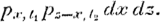

Le cours pouvant se trouver à l'époque ^ dans tous les intervalles _dx_ compris entre —00 et 4-^ la probabilité pour que le cours _s_ soit coté à l'époque ^ + ta sera 

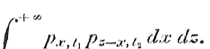

La probabilité de ce cours ^ à l'époque ^ •+"^y a aussi pour ex" pression /^/,.K,; on a donc 

^-^ 

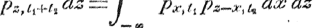

<!-- page: 17 -->

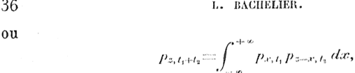

telle est l'équation de condition à laquelle doit satisfaire la ûnictiori _p ._ 

Cette équation estvériflée^ comme nous aîloriH _U_ voir, par la (onction _p^k(r^\_ 

Remarquons des main tenant que l'on doit avoir 

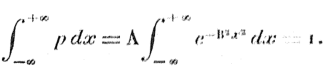

L'intégrale classique qui figure dans le premier'ternie1 a pour valeur ^—j» on a donc B _=_ A^TC et, par suite 

_p^Ae^^._ 

En posant _x^_ o, on obtient A s^^^ c'est-à-dire : A <*ga.h lîi proliîibilité du cours coté actuellorïKînt, 

II faut donc établir que la fonction 

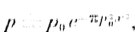

où _p^_ dépend du temps, satisfait bien à l'ôquatio.iî de (umdition cidessus. 

Soient _p^_ et, _p^_ les quantités correspondant à _p^_ et î^lative^ _mm_ temps ^ et^^, il faut prouver que l'oxpression 

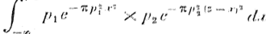

peut se .mettre sous la forme A^r-^; A oi B ne dépendant que d» temps. 

Cette intégrale devient, en remarquant qui» _z_ eM iine <;(HîMlaiîte, 

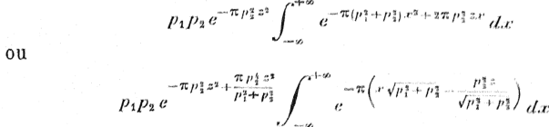

<!-- page: 18 -->

THÉOB.ÏE DE LA SPÉCULATION. 

posons 

nous aurons alors 

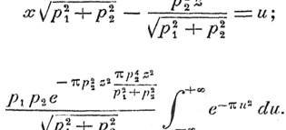

<!-- Start of picture text -->
^^"^'--T^ 1 ^-^; VPÎ-+-PÏ -^I^ÏZl^ ,.,„.. _.^ r-.-,-^, V^-^ J^ <!-- End of picture text -->

L'intégrale ayant pour valeur ï, nous obtenons finalement 

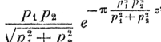

Cette expression ayant la forme désirée, on doit en, conclure que la probabilité s'exprime bien par la formule 

,„. _ y. ^-""TC/^.r/ 03 _P — P Q ^_ , 

dans laquelle^o dépend du, temps. 

On voit que la probabilité est régie par la loi de G-auss déjà célèbre dans le Calcul des probabilités., 

Probabilité en fonction du temps. •— La formule antéprécédente nous montre que les paramètres _p^f(l)_ satisfont à la relation fonctionnelle ^ ./ (^+^)^^^^^^^ ,^^ _rwrw_ . 

différcntions par rapport à _l^_ puis par rapport à _t^._ Le premier membre ayant la même forme dans les deux cas, nous obtenons 

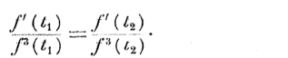

Cette relation ayant lieu, quels que soient ^ et ^3, la valeur commune des deux rapports est constante, et l'on a 

_f'W^Cf^k},_ 

d/où 

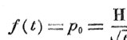

H, désignant une constante-

<!-- page: 19 -->

IJ" 

L. UACllELIUK. 

Nous avons donc pour expression de la probabilité 

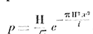

Espérance mathématique. - L'espérance comîspondîtnf, ;m cours _;v_ a poup valeur 

**H,» ^-î.";'*;8** **_^e_** 

L'espérance positive totale est donc 

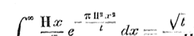

Nous prendrons pour constante, dans notre étude, l'cspcrancfî mathématique ^-correspondant à _t_ === ï; nous aurons donc 

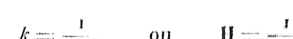

_L'expression définitive de la. prohabilil.é csl dow_ 

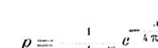

_L'espérance mathématique_ 

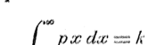

_est proportionnelle à la racine carrée du temps._ 

Nouvelle détermination de la loi de probabilité. -.. L'expression de h fonct,on^ peut s'obtenir en suivant une voie diHcrJ, d ; , nous avons employée. "'-'-»-"(• (JIH, 

Je suppose que deux événements contraires A <.t H ;,;<,„(, pour pro habilites respect vos _p_ et _a_ == T • _n_ P» „,, l rr.- •"""«"""P10 - •l Z•/:) :h :^ ^^.,u.4,...i,..Ll 1 1 1 1 m î .-........,..,,,„.,,,.,,.,,,,,,,,,,,_ ^ l ( n ^ — a ) ^ ffÀ^m»»^'__F_ _î_

<!-- page: 20 -->

C'est un des termes du développement de _(p_ 4- y)^. La plus grande de ces probabilités à lieu pour 

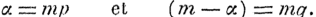

Considérons le terme dont l'exposant _âepestmp^/t,_ la probabilité correspondante est 

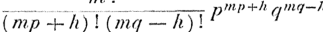

La quantité À est appelée _V écart._ 

Cherchons quelle serait Fespérance mathématique d'un joueur qui toucherait une somme égale à Fécart quand, cet écart serait positif. 

Nous venons de voir que la probabilité d'un écart _h_ est le terme du développement de _(p_ 4- _qY__1_ dans lequel l'exposant de _p_ est _mp_ 4" À et celui de _q, mq —_ À. Pour obtenir l'espérance mathématique correspondant à ce terme, il faudra wultiplier cette probabilité r>ar À; or 

_h_ •= _q ( mp_ -h A ) — _p( mq — h)y_ 

_mp_ 4"" _h_ et _mq — h_ sont les exposants de _p_ et de _q_ dans le terme de _{'P_4 " y)7 ^ Multiplier un terme 

###### r/iy 

###### par 

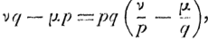

c'est prendre la dérivée par rapport _h p.,_ en retrancher la dérivée par rapport à y, et multiplier la difterence par py. 

Poor obtenir l'espérance mathématique totale, nous devons donc prendre les termes du développement de _(p_ 4"^)^ pour lesquels _h_ est positif, c'est-à-dire 

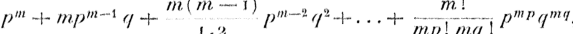

et retrancher la dérivée par rapport à y de la dérivée par rapport àjr?, pour multiplier ensuite le résultat par/?<7. 

La dérivée du second terme par rapport à _q_ est égale à la dérivée d'à premier par rapport à _p,_ la dérivée du troisième par rapport à _q_ est là dérivée du second par rapport _hp,_ et ainsi de suite. Les termes se dé-

<!-- page: 21 -->

^.O L, BACÎÎ'EUBÎÎ. truisent donc deux à deux et il ne reste» que la dérivée du dernier par rapport àp 

> .,.._/^.,^...,-.- _m.p \ n'y'i p w p l ' q^^i_ * _mrnî._ */ 

La valeur moyenne de l'écart _h_ serait égale an double de celte quantité. 

Lorsque le nombre m est suffisamment grand, on peut simplifier les expressions précédentes en faisant usage de la formule aHjrnptotiqiic* de Stirling ^ 

, , _n_ î "•= _y^n^^^Ttfi._ 

On obtient ainsi pour l'espérance mathén'xatiqiie la valeur 

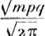

La probabilité pour que l'écart _h_ solt<ïooipris entre A et _li_ •"-•+- _dhw^'à_ pour expression 

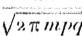

Nous pouvons appliquer la théorie qui précède îi notre étude. _On_ peut supposer le ternp^ divisé en intervalles très petite _àli_ de ^orte que ^ === mA^; pendant le temps _à'i_ le courB variera probal)lc*rïNmt tri*H jN.ni. 

Formons la somme des produits des écarts qui peuvent exister il l'époque1 ' A^ par les probabilités1 correspondantes1 ; c'eHt-à-dire _f_ * ( l t _p^d^^ p_ étant la probabilité de„ l'écart, , _x._ Cette1 intégrale doit être finie, car, par suite de la petitesse Hupposée de A^ les écarts considérables ont une probabilité évanouira nie. Cotte intégrale exprime du reste une espérance rïîatlîériiatiqtîe, qui ne peut être finie si elle correspond à un intervalle de temps treN petit,* Désignons par _^œ_ le double de la, valeur de 1 Intégrale d-de^itô^ Ao? sera la moyenne des écarts ou l'écart moyen, peîïdaiît le teînpB _Al._ Si le nombre _m_ desépre-uves est très grand et HÎ la proltabilité mfce la'même1 à chaque épreuve^nous pourrons supposer qtAe le cour» varie

<!-- page: 22 -->

pendant chacune des épreuves _Al_ de Fécart moyen A.r; la hausse A<^ aura pour probabilité ;•? comme aussi la baisse — A;r. 

La formule qui précède donnera donc, en y faisant _p ^. (j •==. -^_ la probabilité pour que, à l'époque _ty_ le cours soit compris entre _x_ et _x_ -i- _dx,_ ce sera 

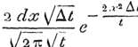

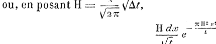

L'espérance mathématique aura pour expression 

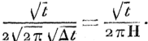

Si nous prenons pour constante l'espérance mathématique _k_ correspondant à _t= l,_ nous trouvons, comme précédemment, 

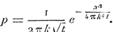

Les formules précédentes donnent A^ ==== y—^; la variation moyenne pendant cet intervalle de temps est 

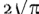

Si nous posons _a;_ === /zA^, la probabilité aura pour expression 

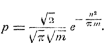

Courbe des probabilités. — La fonction 

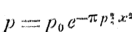

peut se représenter par une courbe dont l'ordonnée est maxirna à _Arm. de l'Éc. Nûr/nale. 3__e_ Sério. Tome XVIÎ. —- JÂMViEft IQOO. ^

<!-- page: 23 -->

/p L< I5A<;1JEL11-11. 

l'origine et qui présente deux points d'inflexion pour 

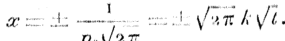

Ces mêmes valeurs de _x_ sont aussi lea abscisses dos rrumma et minima des courbes d'espérance mathématique, dont l'équation est 

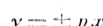

La probabilité du cours _x_ est une fonction de _£;_ elle croît jnsqmt une certaine époque et décroît ensuite. La dérivée_ff/)_ _- ^_ a lomjiîe /•% _t^:_ ^.^. ]^ probabilité du course eatdone maxima quand ce cours correspond au point d'inflexion de la courbe des probabilités 

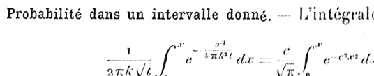

n'est pas exprimable en termes finis, mais on peut donner _wn_ développement en série 

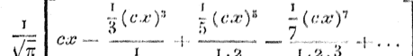

Cette série converge assez lentement pour les Vîtîcurs trcs forfcH de ca^LapIace a donne pour ce cas l'iutégrale défime sous la forme d'une fraction continue fort aisée à calculer 

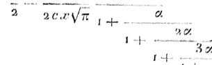

danslaquelle1 a^ —1- < ac^

<!-- page: 24 -->

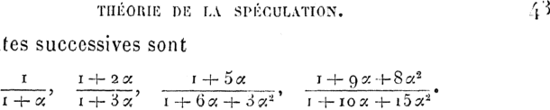

Les induites successives sont 

II existe an autre procédé permettant de calculer l'intégrale ci-dessus quand _x_ est un grand nombre. 

On a 

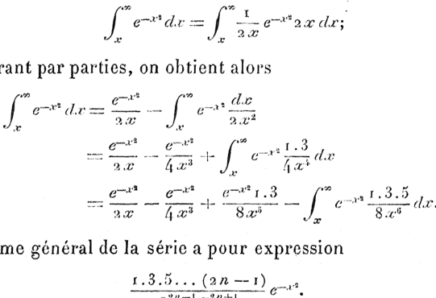

en intégrant par parties, on obtient alors 

Le terme général de la série a pour expression 

Le rapport d'un terme au précédent dépasse] l'unité lorsque _in_ 4- î >4^'2 - La série diverge donc à partir d'un certain terme. On peut obtenir une limite supérieure de l'intégrale qui sert de reste. On a, en effets 

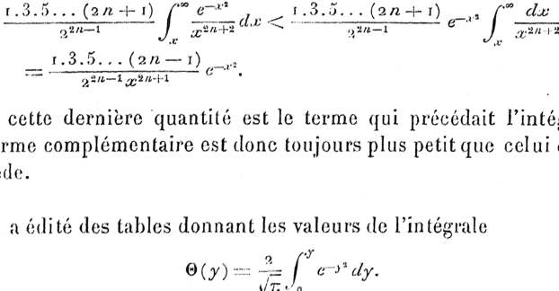

Or cette dernière 'quantité est le terme qui précédait l'intégrale. Le terme complémentaire est donc toujours plus petit que celui, qui le précède. 

On, a édité des tables donnant les valeurs de l'intégrale

<!-- page: 25 -->

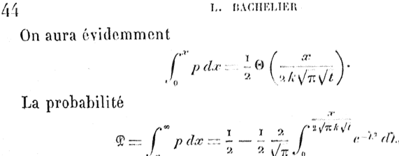

pour que le cours _x_ soit atteint ou, dépassé à l'époque ^ croît, constamment avec le temps. Si _t_ était infinie elle seraît éga'le îi •l^ résultat évident. 

La probabilité 

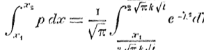

pour que le cours se trouve compris _h_ répoque /, <lan^ rinl^mllo fini <r^ _x^_ est nulle pour / :-: o (*t pour _i^.^,_ Kllc est niîixiîîiîi lorsque 

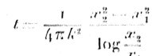

Si nous supposons l'intervalle _x^ x^_ très petite ïiou^ retrouvaîi» pour époque de la probabilité ïnaxiroa 

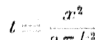

Écart probable. — Nous appelleronH _ïûnm_ l'iritcrvallo ri:: a tel qiie, au bout du, temps /,1e cours ait autant de chances de reMer co.rnprh dans cet intervalle que de chances de _h_ déparer- 

La quantité a se détermine par l'équation 

ou 

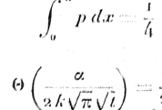

<!-- page: 26 -->

###### c'est-à-dire 

0^:2 xo, 47^9 ^^^==1^88^^; 

cet intervalle est proportionnel à la racine carrée du temps. 

Plus généralement, considérons l'intervalle ± j3 tel que la probabilité pour que, à l'époque _t,_ le cours soit compris dans cet intervalle soit égale à _Uy_ nous aurons 

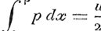

OU 

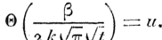

Nous voyons que cet intervalle est proportionnel à la racine carrée du temps. 

Rayonnement de la probabilité. — Je vais chercher directement l'expression de la probabilité _<S_ pour que le cours _x_ soit atteint ou dépassé à l'époque _t._ Nous avons vu précédemment qu'en divisant le temps en intervalles très petits A^, on pouvait considérer, pendant un intervalle A^ le cours comme variant de la quantité fixe et très petite A;r, 

Je suppose que, à l'époque _t,_ les cours _x,^ x^,_ , _x^ x^,x^_ ... différant entre eux de la quantité A^, aient pour probabilités respectives : _pn^, pn^i^ pn, pn+^ pn+^,_ .-• De la connaissance de la distribution des probabilités à l'époque _t,_ on déduit aisément la distribution des probabilités à l'époque _1_ 4- A^ Supposons, par exemple, que le cours _x^_ soit coté à l'époque _l;_ à l'époque _t_ 4-A^ seront cotés les cours _x^^_ ou ^«,. La probabilité^, pour que le cours _Xy,_ soit coté à l'époque _t,_ se décomposera en deux probabilités à l'époque _l+àl;_ le cours <r^ aura de ce fait pour probabilité 4^ <ït le cours _x^_ aura du même fait pour probabilité_PJt_ _-_ 

_^t_ 

Si le cours _x^^_ est coté à l'époque _t_ + A/y c'est que, à l'époque _ty_ les cours ^^ ou _x^_ ont été cotés; la probabilité du cours _x^_ à

<!-- page: 27 -->

l'époque ^ + _\t_ est donc ^^^t^; celle _Un_ cours ^ est, à la même époque, ^l^^:1 , celle du cours _^,,,_ est /^•B41^/^•.•1:1^ été, Pendant le temps A(Î, le cours ^ a, on quoique sorte, énm vers le course,., la probabilité _•_ «»_p n_ _;_ le cours ^^ a, émÎB vers le cour^ ^/,, la probabilité ^1 - Si ^ est plus grand que /^,,» réchange de probabilité est ^=^±1 de ^ vers /r^,. 

On peut donc dire : 

_Chaque cours oc rayonne pendant l'élément de temps wr$ le (mm mùw une quantùédeprobabtiàéproporlwnnelle à la d'i/erenae de Iwn probes bilùe's,_ 

Je dis proportionnelle, car on doit tenir compte du rapport de _à;v_ à A/, La loi qui précède peut, par analogie avec certaine» théories physiques, être appelée la _loi du rayonnement_ ou de diffusion de la prohabilité. 

Je considère la probabilité (P pour que le eour^ .r se troim11 à l'époque / dans rintewille _x, ce_ et j'évalue l^aceroisseinexit de .cotte probabilité pendant le tenips A/'. 

Soit _p_ la probabilité du cours _x_ à l'époque ^ _p ^ -^__r/_ _^_ Évaluons î,i probabilité qui, pendant le temps A^ passe, en quelque^orte, à traverH le cours ^; c'est, d'après ce qui vient d'être dit, - 

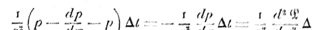

_c_ désignant une constante. 

Cet accroissement de probabilité a aussi pour expression -^'A/. On a donc 

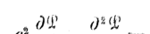

C'est une équation de Fourier. 

La théorie qui précède suppose les variations de cour» discontinueson peut arriver à l'équation de Fourier sans faire cette hypothèse, en

<!-- page: 28 -->

remarquant que dans un intervalle de temps très petit A^, le cours varie d'une façon continue, mais d'une quantité très petite inférieure à £, par exemple. 

Nous désignerons par _TS_ la probabilité correspondant à _j)_ et relative à A^. 

D'après notre hypothèse, le cours ne pourra varier qu'à l'intérieur des limites _±_ c dans le temps A^ et l'on aura par suite 

Le cours peut être _x — m_ à l'époque _t\ m_ étant positif et plus petit que s; la probabilité de cette éventualité estp^.^. 

La probabilité pour que le cours _x_ soit dépassé à l'époque / -j~A^, ayant été égal à _x — m_ à l'époque _l,_ aura pour valeur, en vertu du principe dô la probabilité composée, 

Le cours peut être cZ'+w, à répoque /; la probabilité de cette éventualité est/^+^. 

La probabilité pour que le cours soit inférieur à _oc_ à l'époque / 4- A^, ayant été égal à _x_ -h- _m_ à l'époque _t,_ aura pour valeur, en vertu du principe précédemment invoqué, 

L'accroissement de la probabilité $, dans l'intervalle de temps A^ sera égal à la somme des expressions telles que 

pour toutes les valeurs de _m_ depuis zéro jusqu'à e. 

Développons les expressions de^.^ et _p^z_ en négligeant les termes qui contiennent _m__3_ , nous aurons , , '

<!-- page: 29 -->

L'expression ci-dessus devient alors 

L'accroissement clierché a donc pour valeur 

L'intégrale ne dépend pas de _x,_ de _t_ ou de _p,_ c'est une consiante. L'accroissement de la probabilité $ a donc bien, pour expression 

L'équation de Fourier a pour intégrale 

La fonction'arbitraire /se détermine par les'considérations suivantes : 

On doit avoir _Q_ == - si .y==ô, _l_ ayant une valeur positive mielconque ; et _<S_ == o lorsque _t_ est négatif. 

En posant _x_ == o dans l'intégrale ci-dessua, on a 

c'est-à-dire 

Cette dernière égalité nous montre que l'intégrale t aura ses éléments /•it2 y» 2 'nuls tant que _t— ^_ sera plus petit que zéro, c'est-à-dire tant que , ^•* -y* a sera'plus petit que _-—^;_ on doit doneprenidre pour limite inférieure

<!-- page: 30 -->

THÉOIUF. DÎ5 LA SPÉCULATION. 

formule précédemment trouvée, 

Loi des écarts de primes. — Pour connaître la loi qui régit le rapport de l'importance des primes et leurs écarts, nous appliquerons a l'acheteur de prime le principe de l'espérance mathém.atiquc : 

_L'espérance mathématique de l'acheteur de prime est nulle._ 

Prenons pour origine le cours vrai. du ferme _Çfîg._ 5)* _SoHp_ la probabilité au cours _±_ ,'y, c'est-à-dire dans le cas actuel la probabilité pour que la réponse des primes ait lieu au cours :±: «r. Soit _m,_ + _h_ l'écart vrai de la prime dont _h._ Exprimons que l'espérance mathématique totale est nulle. 

<!-- Start of picture text -->
Fi^. 5. <!-- End of picture text -->

<!-- Start of picture text -->
OL  rw <!-- End of picture text -->

Nous évaluerons cette espérance : x° Pour les cours compris entre -- co et _rny_ 2° » » : _m_ et _m + h^_ 3° » » _m_ •4- A et +• co. _Ânn. de l'Èc» Normale, 3^_ Série. Tome XVII,— FÉVÏUJKR 1900.

<!-- page: 31 -->

L. BÀCHEtjr.n. 

2° Pour un cours _x_ compris entre _m_ et W-+-» la perle de racbeteur sera _m_ -+- _h_ — _x\_ l'espérance mathématique correspondante sera _—p(m_ 4-À — _oc)_ et pour l'intervalle entier 

3° Pour un cour§ _oo_ compriB- entre _m_ + _h_ et co, le bénéfice de l'acheteur sera _œ — m —_ À; l'espérance mathématique correspondante sera/?(^ — _m_ — //.) et pour toutTintmaIlo 

Le principe de l'espérance totale donnera dono 

ou, en faisant les réductions, 

Telle est l'équation aux intégrales définies qui établit ime relation entre les probabilités,, les écarts de prime et leur importance. 

Dans le cas où le pied de la prime tomberait du côté de^ _x_ négatifs, comme le montre la _fig._ 6, _m_ serait négatif et l'on arriverait à la relation 

Par suite de la symétrie des probabilités, la fonction _p_ devant être

<!-- page: 32 -->

paire, il en résulte que les deux équations ci-dessus n'en forment qu'une. 

<!-- Start of picture text -->
Fi<ï. 6, <!-- End of picture text -->

En difïerentiant, on obtient l'équation différentielle des écarts de prime 

fêtant l'expression de la probabilité dans laquelle on a remplacée par/??. 

Prime simple, — Le c^ le plus sjpple des équations ci-dessus est celui où m == o, c'est-à-dire celui où l'importance de la prime est é^ale à son écart. On appelle _prime simple_ cette sorte de prime, la seule que l'on traite dans la spéculation sur les marchandises. 

Les équations ci-dessus deviennent, en posant _m =_ o et en dési^ gnant par _a_ la valeur de la prime simple, 

_f'^_ 

L'égalité _a ^ j_ 0 _p x d x_ montre que la prime simple est égale à l'espérance positive de l'acheteur ferme; ce fait est évident, puisque le preneur de prime verse la somme _a_ au donneur pour jouir des avantages de l'acheteur ferme, c'est-à-dire pour avoir son espérance positive sans encourir ses risques. 

<!-- page: 33 -->

02 

ï- îîAr-iirjJKK. 

.nous déduisons le principe suivant, ini des plus importants de» noire étude : 

_La valeur de la prime simple doit être proporlwnndk à la moine carrée du temps._ 

Nous avons vu précédemment que l'écart probable était donné par la formule 

L'écart probable s'obtient donc en multipliant la prinw moyenne par le'nombre constant ï,688; il est donc très facile à calculer quand il s'agit de spéculations sur les marchandises puisque, dan^ ce cas» la quantité _a_ est connue. 

La formule suivante donne FexpresBion de la probabilité en fonction de _a_ 

La probabilité dans un intervalle donné aura pour expre^ion rhi" tégrale 

ou 

Cette probabilité est indépendante de _a_ et, par suite, (lu lempg» _m u,_ au lieu d'être un nombre donné, est un paramètre de la forme _u^ba;_ par exemple, si _u_ =""" _a_ , 

<!-- page: 34 -->

Donc : 

£a _proba/nhié de réussite du preneur de prime simple est indépendante de F époque de l'échéance; elle a pour valeur_ 

1/espérance positive de la prime simple a pour expression 

Double prime. — Le _stellage_ on _double prime_ est tonné de l'achat simultané d/une prune a la hausse et à la baisse (primes simples). Il est facile de voir que le donneur de stellage est en bénéfice dans l'in1 tervalle •••-— 20, 4' - 2a; sa probabilité de réussite est donc 

_La probabilité du preneur de stellage est_ ûy44* 

Espérance positive du stellage 

, Coefficieîi.t d^Bstabilité. — Le coefïîcient^, précédemment introduit, 1 _1_ est 1e _coeffifiient d' instabilité_ ou de nervosité de la valeur^ c'est lui qui mesure son état statique. Sa tension indique _wi_ état d'inquiétude; sa faiblesse, au contraire, est l'indice.d'un état de calmeCe coetïîcient est donné directement dans la spéculation sur les marchandises par la formule 

mais dans là spéculation sur les valeurs on ne peut le calculer que par approximation, comme nous allons le voir* 

Série des écarts de prime. — I/équation aux intégrales définies des écarts do prime n^est pas exprimable'en termes finis quand la quan-

<!-- page: 35 -->

54 î- BA(U1ELÎEH. tité _m,_ différence entre l'écart de la prime et son importance À, n'est pas nulle, 

Cette équation conduit à la série 

_m_ w2 _ni' rn^ 1 ^_ 2 ' _l\7i:a_ 96 T:2 a'4 ï 920 TÎ:" «tt ' ' * " 1 ' 

Cette relation, dans laquelle la quantité a désigne l'importance de la prime simple, permet de calculer la valeur de _a_ quand on connaît celle de m, ou inversement. 

Loi approximative des écarts de prime- — La série qui précède peut s'écrire 

_h_ ==.; _û_ —/(m). 

Considérons le produit de la prime _h_ par son écart (m 4- A) î 

_h(în_ 4- _h}_ == _[a_ ""-/( _m)] [m_ "•{•" a —"/( /^)] ; 

dérivons-en _m,_ nous aurons 

^[/< (m + _h)]_ "= A^ ) _[m_ •4-" ^ -/(m)] 4- [^ -/(^)J ^ -/'(^J» 

^ Si nous posons _m_ = o, d^où /(w) ^ o^ /'(^) ^1 <^îtte dérivée s'annule; nous devons en conclure que : 

_Le produit d'une prime par •§ûn écart est mwimuyn yua/ïd Ici facteurs de ce produit sont égauy s cest le ca$ de la primé simple._ 

Dans les environs de son maximum, le produit (m question doit peu varier. C'est ce qui permet souvent de détermiïier apprôximâtivemexit a parla formule 

_h(m+h)ï=:a^_ 

elle donne pour a une valeur trop faible. 

En ne1 considérant'que les trois premiers termes dô la^érie^ _m_ obtient 

qui donne pour a mie valeur trop forte,

<!-- page: 36 -->

Dans la plupart des cas, en prenant les quatre premiers termes de la série, on obtiendra une approximation très suffisante; on aura ainsi 

 7:_ ( _^h_ -+-jw) _^^^r^^j^.^^^ ~ '_ 4 " T r 

Avec cette même approximation on aura pour valeur de _m_ en fonction de _a_ 

2 2 _m_ = 71: _a_ ±: i/TT a — ^^'^^^ ^ 

Admettons pour un instant la formule simplifiée 

_h {m_ -h _h) ^c^-^I^t._ 

Dans la spéculation sur les valeurs les primes à la hausse ont une importance _h_ constante^ l'écart _m_ + _h_ est donc proportionnel au temps. 

_V écart des primes à la hausse, dans la spéculation sur les valeurs y est sensiblement proportionnel'à la dwée de leur échéance et au carré de Vin» stabiMtê^_ 

Les primes à la baisse, sur les valeurs (c'est-à-dire, la vente ferme contre achat à prime) ont un écartA constant et une importance _m_ 4- A variable. Donc : 

_•î^ importance des primes à la baisse, dans la spéculation sur les valeurs^ est se'n$iblern€nt proportionnelle à la durée de leur échéance et au carré de l^instabilité,_ 

Les deux lois qui précèdent ne sont qu'approchées, 

Options. — Appliquons le principe de l'espérance mathématique à l'achat d'une option d'ordre _n_ traitée à l'écart r. 

L'option d'ordre _n_ peut. être considérée comme se composant de deux opérations : . ^ , 1 ! x° Un achat ferme d'une unité au cours r$ 

a° IJa achat ferme de _(n_ — ï) unités au cours TV cet achat n'étant à considérer que dans l'intervalle r, 30-

<!-- page: 37 -->

56 • L. BACHELmi. 1 La première opération a pour espérance rnîitliéTnati.cjlît — /-, la, seconde a pour espérance 

On doit donc avoir 

ou, en remplaçant _p_ par sa valeur, 

et, en développant en série, 

En ne conservant que les trois premiers termes on obtient 

Si _n_ == _2,_ 

_r^:QMa._ 

_L'écart de l'option dit double doU être environ les deu^ iim de la valeur de la prime simple._ 

_L'écart de l'option du triple doit éire supérieur de un dixième wwn à la valeur de /a prime simple»_ 

Nous venons de voir que les écarts des options sont appimbiativement proportionnels à la quaniiié a. 

Il en résulte que la probabilité de réussite de ces opérations ert indépendante de la durée de réchéance. 

_La probabilité de réamte de l'optùm du double est_ 0,394, _l'opéfndon réussit quatre fois sur dix._

<!-- page: 38 -->

THÉOHÏE DE LA SPÉCULATION. _^_ 

_La probabilité de l'option du triple est_ o,33, _l'opération réussit une fois nur trois._ 

L'espérance positive de l'option d'ordre _n_ est 

et comme 

l'espérance cherchée a pour valeur --^-r, c'est-à-dire i.,36a pour l'option du doul)le et 1,64^ |)our l'option du triple. 

En vendant ferme et en achetant simultanément une option dn double, on obtient une prime dont l'importance est / == o,68a et dont l'écart est le double de r. 

La probabilité de réussite de l'opération est o,3o. 

Par analogie avec les opérations à prime, nous appellerons _opium» stellage_ d'ordre _n,_ l'opération résultant, de deux options d'ordre _n,_ à la hausse et à la baisse, 

L'option stellage du second ordre est une opération fort curieuse; entre les cours :±rla perte est constante et é^ale à ar. La perte diminue ensuite progressivement jusqu'aux cours _± 3r,_ où, elle s'annule, 

11 y a bénéfice en dehors de l'intervalle ::fc _3r\_ La1 probabilité est o,/p. 

###### **OPÉRATIONS** FERMES. 

Maintenant que nous avons achevé l'étude générale des probabilités nous allons l'appliquera la recherche des probabilités des principales opérations débourse en commençant par les plus simples, les opérations fermes et les opérations à prime, et nous terminerons par l'étude des combinaisons de ces opérations. 

La théorie de la spéculation sur les marchandises, beaucoup plus simple que celle des valeurs, a déjà-été traitée; nous avons, en effet, _Aun, clé V_ '.A'r» _Nor'maie,_ 3* Sér:î<1! Toxtte XVU* <•—«• F&vaiKii ïç^oo. 8

<!-- page: 39 -->

.58 L. (îAaiS^LÏEH. calculé la probabilité et l'espérance des primes simples des stellages et des options. 

La théorie des opérations de bourse dépend, de deux coefficients : _b_ et _k._ 

Leur valeur, à un instant donné, peut se déduire facilement de l'écart du terme au comptant et de l'écart d'une prime quelconque. 

Dans l'étude qui va suivre, nous ne nous occuperons que de la rente 3 °/(p qui estj^une des valeurs sur laquelle on traite régulièrement des primes. 

Nous prendrons pour valeurs de _h_ et _k_ leurs valeurs moyennes pour les cinq dernières années (ï8()4 à 1898), c'est-à-dire 

_b_ —: 0,264, _k_ :•.:-•-, f> 

('le temps est exprimé en jours et l'unité de variation est le centime). Nous entendrons par valeurs _calculéea_ celles qui sont déduites des formules de la théorie avec les valeurs ci-dessus données aux constantes _h_ et /'. 

Les valeurs _observées_ sont celles que l'on déduit directement de ta compilation des cotes durant, ce même espace de temps de 3iH()4 ii ï8c)8 (r ). 

Dans les Chapitres qui vont suivre nous aurons constammeril à connaître les valeurs moyennes de la quantité _a_ à différentes époques: la formule 

_a-: ^\/1._ 

###### donne 

Pour 45 Jou rs . . . . . . . . . . . . . . . . . . . . . . . . _a_ -::: 33,54 " 3o » .....,.,.....,...,,..... _' a_ ;— %7 5 _3H_ ?» _w_ »» ........................ _(t_ s"1"1 _•r^y 31)_ » i (> '/ ,,....-.........,...,.,. _a —_ i f»,ï 'î 

Pour un jour, il semble que l'on devrait avoir a ^5; maiH dans tous les calculs de probabilités où il s'agit de:' moyennes on ne peiït poser _t_ == ï pour un jour. 

(1 ) TouLes les observations soîii oxinHUîS (!o la _Cote de la /Swrse.et d<î la Bwiffïw._

<!-- page: 40 -->

En effet, il y a 365 jours dans l'année, mais seulement 807 jours de,' **r) /•>** •-• bourse. Le _jour moyen_ de la bourse est donc _t_ =-= ^; il donne o0"7 

^=f>,45. 

On peut taire la même remarque pour le coefficient &. Dans tous les calculs relatifs à un jour de bourse on doit remplacer, _b_ par _h_ / == _—^h_ 36J, :,;.,., <:>3ï3.,„ ., _wj_ 

Écart probable. — Chercbons l'intervalle de cours ( — a , +-a) tel que, au boutd'nn mois, la rente ait autant de chances de se trouver dans cet intervalle que de chances de se trouver en dehors. On devra avoir 

<!-- Start of picture text -->
f pela':^ y ) »/(> <!-- End of picture text -->

d/ou 

os=:±/i6. 

Pendant les (k) derniers mois, 33 (bis la variation a été circonscrite entre ces limites et 27 (bis elle les a dépassées. 

On peut chercher de môme l'intervalle relatif a un jour; on a ainsi, 

Sar x45,2 observations, 8ï5 fois la variation a été inférieure à 9*', 

Dans la question qui précède, nous avons supposé que le cours coté se confondait avec le cours vrai ; dans ces conditions, la probabilité et l'espérance mathéinalique de l'aclieteur et du vendeur sont les mêmes. En réalité, le cours coté est inférieur au cours vrai de la quantité/^, si _n_ est le nombre de jours séparant de l'échéance. L'écart probable de 4^' d^ part et d'antre du cours vrai correspond à <1> l'intervalle compris entre 54 en hausse au-dessus du cours coté et 38^ en baisse au-dessous de ce cours. 

Formule de la probabilité dans le cas général. — Pour trouver la probabilité de la hausse pour une période de _n_ jours, il faut connaître

<!-- page: 41 -->

GO L. BACHKLÎKÏi. 

l'écart _nb_ du cours vrai au cours coté; la probabilité est dors é^ale à 

La probabilité de la baisse sera égale à l'unité diminuée de la probabilité de la hausse, 

Probabilité de l'achat an comptant. Cherchons la probabilité de réussite d'un achat au comptant destiné à être revendu dans 3o jours, 

On doit remplacer dans la formule précédente la quantité _nb_ par 25. La probabilité est alors égale à 0,64 : L'opération a deux chances sur trois de réussir, 

Si Pon veut avoir la probabilité pour un an, on doit remplacer la quantité _nb_ par 3oo. La formule _a_ -= _/c\/t_ donne 

^::r:95,5. 

On trouve que la probabilité est 

_Neuf/où $ur dix un achat de renie au comptant produit un béné/tw au bout d'un an._ 

'Probabilité de l'achat ferme. — Cherchons la probabilité de réussite d'un achat ferme ellectué au début du mois. 

On a 

_nh_ "';.;; 7 ? 91, ^ =- a"7,3K» que : : La probabilité do la hminse o a t . . . . . . . , . . , , , , o, •')•) » baiseo " .. ^ . . . , . . . , , . o,/;,^ 

On en déduit que : : 

La probabilité de Fâchât croît avec le temps; pour un an, on a _n •—_ 365, _nb —_ 96,36, _a -_ 9^, 5, 

La probabilité a tflors pour valeur o,6S- 

Quand, on effectue un achat ferme pour le revendre au bout d'un an, on a deux chances sur trois de réussir»

<!-- page: 42 -->

II est évident que si le report mensuel était de 25e la probabilité de l'achat serait o,5o. 

Avantage mathématique des opérations fermes. —- II me paraît indispensable, comme je l'ai déjà fait remarquer, d'étudier l'avantage mathématique d'un jeu dès qu'il n'est pas équitable, et c'est le cas des opérations fermes. 

Si nous supposons _h_ == o, l'espérance mathématique de l'achat ferme est a — a = = o . L'avantage de l'opération est _— = -_ comme d'ailleurs dans tout jeu équitable. 

Cherchons l'avantage mathématique d'un achat ferme de _n_ jours en supposant _b_ > o. L'acheteur aura, pendant cette période, touché la somme _nb_ provenant de la différence entre les coupons et les reports, et son espérance s e r a a — a + / ^ ; son avantage mathématique sera donc 

L'avantage du vendeur serait 

Occupons-nous spécialement du cas de l'acheteur. • 

Quand ^^>o son avantage mathématique croît de plus en plus avec _n;_ il est constamment supérieur à la prohabilité. 

Pour'un mois, l'avantage de l'acheteur est o,563 et sa probabilité o,55. Pour un an, son avantage est 0,667 et sa probabilité o,65. On peut donc dire que ; 

_l^amntage (F une opération fe'nne est à peu près égal à sa probabilité._ 

###### OPÉBATIONS A PKIME. 

Écart dess primes. — Connaissant la valeur11 de a j'pour une époque donnée, on calcule facilement l'écart vrai. par la formule 

<!-- page: 43 -->

Connaissant l'écart vrai on obtient l'écart coté en ajoutant la quantité _nb_ à l'écart vrai; _n_ est le nombre de jours qui séparent de la réponse. 

Dans le cas d'une prime fin prochain, on ajoute la quantité [25+(/À--3o)//]. 

On arrive ainsi aux résultats suivants : 

|_Prirnc^ _|_dont_'"»(>. (•akmli^|'l^carleoto ohHcl'vd.|
|---|---|---|
|A45jours..............|50,01|5^,0^ |
|3o »..............| ^-0,69 |9.1/Ày,|
|%o _»_. . . . . . . . . . . . . .| !ï3,^3|ï.j,71|

_Primes do fit_ '25. 

||Ecart(îûi<5 (.'aïeule. oî»Hôrv^.|
|---|---|
|A_^_ _r)_|jours.............. 7^,70 7',^Ko|
|3o|».............. 37,7H :î7,H.1|
|ao |".............. ft'ï,17 '^r^   |
|10|^. . . . . . . . . . . . . . iy,y^4 17,4°|

_PfnHfîyi dotit_ 10* 

||ECUricoto|
|---|---|
||(•îilc^î^. î^hftt.ii'vcî»|
|A3o|jours.............. f»6,19 ^<.M^|
|^o|>'.............. 48,o^ , 40,43|
|îo|y.............. ^6,<)i 3'^,H<)|

Dans le cas de la prime dont _^'_ pour le lendemain nous avons 

**d'où** d'où 

_h_ ':::" 3, zy 1:1::;:: 5,4^ /// .'--'.-• 0,81 ; 

l'écart vrai est donc 5,8i ; en y ajoutant ^ ^ ^A ^ o,3x _on_ obtient l'écart calculé (>,ï2. 

La moyenne des cinq dernières années donne 7,36.

<!-- page: 44 -->

Les chiffres observés 'et calculés concordent dans leur ensemble, mais ils présentent certaines divergences qu'il est indispensable d'expliquer. 

Ainsi l'écart observé de la prime dont 10 à Séjours est trop faible; il est facile d'en comprendre la raison : Dans les périodes très mouvementées, alors que la prime dont 10 serait à un très fort écart, on ne cote pas celle prime ; la moyenne observée se trouve donc diminuée de ce lait. 

D'autre part, il n'est pas niable que le marché ait eu, pendant plusieurs années, une tendance à coter à de trop forts écarts les primes à courtes échéances; il se rend d'autant moins compte de la juste proportion des écarts que ceux-ci sont plus petits et que l'échéance est plus proche* 

II faut cependant ajouter qu'il semble s'être aperçu de son erreur, car en î8<)8 il a paru exagérer dans le sens inverse. 

Probabilité de levée des primes, — Pour qu'une prime soit levée, il faut que le cours de la réponse des primes soit supérieur au cours du pied de la prime; la probabilité de levée est donc exprimée par l'intégrale 

8 étant le cours vrai du pied de la prime. 

Cette intégrale est facile à calculer, comme on l'a vu précédemment; elle conduit aux résulta IH suivants : 

_Probabilité dfs leçée (les prime ff dont_ 5o. 

|||Caleil1_6(i_.||Observ^e.|
|---|---|---|---|---|
|À4^|journ... . . * . * . . . , . .|o,63||0,59|
|,'k>|>». . . . < . . . . . . . . .|o,7<|1|0,75|
|_w_|_»_...,..,.,....*| 0,77||o,7G|
||_Probabilité de levée _|_deK prunes _|_dont_|9,5,|
|||CdÏeul^*.||Observée.|
|A45|jours.. . , . . . . < * . . . . |o,4ï||0,40|
|Sa|»1 . . , . . . - . . . . . , .|0,47||^ô|
|uo|_ft_^ , , , . . . , . . » . .|o,53|, 1|o,53|
|io|». , . . . . . , - . , , . .|,o,65||o,6^|

<!-- page: 45 -->

_Probabilité de levée dcff prirnev dont_ (o. 

||Calculée.|Ohsm'vée.|
|---|---|---|
|A3o|jours... . . . . . . . . . . . 0/21|0/21|
|ao|_)i_............. o/^K|o^'r>|
|**ïô**|'».............. o,3(>|0,'îîS|

On peut dire que les primes /5o sont levées trois fois sur quatre, les prîmes /2$ deux fois sur quatre et les primes /K) une Ibis sur quatreLa probabilité de levée de la prime dont 5e pour le lendemain est, d'après le calcul : o,48; le résultat de _if^6_ observations donne 671 primes certainement levées et 76 dont la levée est douteuse; en comptant ces 76 dernières primes la probabilité serait Oy5î, en ne les comptant pas elle serait 0,46, soit en moyenne o,43 comme Findique là théorie. 

Probabilité de bénéfice des primes. — Pour qu'une prime donne du bénéfice à son acheteur, il faut que la réponse des prîmes se tasse à un cours supérieur à celui de la. prime. La probabilité de bénétice est donc exprimée par l'intégrale 

###### **£^ étant** le cours de la prime. 

Cette intégrale conduit aux résultats ci-après : 

|_P_|_robabilité de bénéfice _|_dea primes dont_|5o»|
|---|---|---|---|
|||Calculée.|Observée,|
|A4^'  |jours.* * . * . , . . . . . . *|o^o |^^(j |
|3o |»...,...,..,... |_Oy/i'i_ |o^4î 0|
|20|»..,..........*|<.»544|o^|
|_P_|_robabilité_**_de_**_bénéfice _|_des prunes dont_|^5.|
|||Calculée|Ob»yrv«^,|
|A45  |jours.-......,.,,..|o,,3o |o,â7 |
|3o |»..............|o,33 |_Oy3t_ |
|20 |»..........,.,,|o^SB |_' Gy3o_ |
|ïô|».............|o,4t|0^4,0|

<!-- page: 46 -->

||**THI^OHU: Î)E L**|**À S**|**S'K<;liL,\T10IN.**||**65**|
|---|---|---|---|---|---|
|_Pr_|_ofnthllitc de b^né_|_fic.c _|_dav primer dout_|10.||
||||**Cale il 1 ée.** |**Observée.**||
|A3oj|ours,...........|..|o,%o |o,t6||
|**'20** |**»»** **. . . . . . . . . . . .** |**. .** |**0****_y9,'À_** |**0, l3** ||
|10|".............|..|0/^,7|o,a5||

On voit, qu'entre les limites (ordinaires de la pratique, .la prohabilite de réossile de Fâchai, (l'une prime varie peu,. L'achat /5o réussit <.)i.îaire lois sur dix, radial, /^ trois fois sur di'x et Fâchât /îo deux "(ois sur dix. 

.D'après le calcul, racheteur de prime dont 5'' pour le lendeuiaiu a uue ()rol)alHlile de reussUe de (»,34» l.î oll )servat,ion de L^5G cotes rnonti^» que _/i_ ro primes auraieul cerlaiueuieut donne des béneiiees et que 80 autres donneut un résullai donttîux, la, prohahilité observée est donc o.iî. 

###### OPÉRATIONS COMPLEXES. 

Classification des opérationa complexes, — Comme on Irait-e du ferme et souveut jusqu'à trois primes pour la même éolléance, on pourrait entreprendre en même temps des opérations [riplos et même quadruples. 

Les opérations triples sortent déjà dn nombre de celles que l'on peut considérer comme classiques, leur élude est triîs intéressante, mais trop longue pour pouvoir être exposée ici. Nous nous bornerons donc aux opéra fions doubles, 

On peut les diviser en deux groupes suivant qu'elles contiennent on non du ferme» 

Les opérations contenant du ferme se co m poseront, d'un achat terme ^td^ine venleà prime, ou inversement. Les opérations à prime contre prime consistent dans la veule d'une grosse prime suivie de fâchai d'une petite, ou inversement. La proportion des achats et des ventes peut d'ailleurs varier à l'infin L Pour mmplifîer la question, ^'H^ n'étudierons que deux proportions très simplea ï 

ï0 La seconde opération porte _aw_ le même chiffre que la première. _Afïtî» da l ' È e , Normale,_ H* Série- Tome XVII* «""• (^VHïKn t^oô9

<!-- page: 47 -->

###### 66 

###### L. TîACHRURn* 

2° Elle porte sur un chiffre double. 

Pour fixer les idées, nous supposerons que l'on opère au début du mois et nous prendrons pour écarts vrais les écarts moyens depuis cinq ans : ï2,78/5o, 29,87/2;") et 58,28/110. 

Nous remarquerons aussi que pour les opérations _h_ un mois le cours vrai est plus élevé que le cours coté, de la quantité 7,91 :-^ _3oh._ 

Achat ferme contre vente à prime. — On acheté en réalité du ierme au cours —3o6 == -— 7,91 et _Von_ vend. a prime /^ au cours 4- ^9,87» II est facile de représenter l'opération par une construction géométrique _( fig^_ 7) : l'achat ferme est représenté par la droite AMB: 

<!-- Start of picture text -->
Fjg. 7. /B / /  0 • 1 1 , , ^ H/ A " " • ^ <!-- End of picture text -->

MO == _3oh._ La vente a prime est représentée par la ligne brisée CDE» l'opération résultante sera représentée par la ligne brisée HNKL, l'abscisse du point N sera 

_•l•iii-- (_ %3 - i 1 - 3o//). 

On voit que l'opération donne un bénéfice limité é^al à l'écart coté de la prime; à la baisse, le risque est illimité. 

La prohabilité de réussite de l'opération est expi*imée par l'intégrale 

Si ron, avait vendu une prime /5o la probabilité de réussite aurait été ; 0,80. 

11 est intéressant de connaître la probabilité dans le cas d'un report:, de 25e _( b_ === o).

<!-- page: 48 -->

Celle probabilité est 0,64 en vendant /25 et 0,76 en vendant /5o. 

Si l'on revend une prime sur un achat au comptant, la probabilité est 0,76 (in revendant /^5 et 0,86 en revendant/3o. 

Vente ferme contre achat à prime. — Celte opération est inverse delà précédente; elle donne a la hausse une perte limitée é t a l a baisse un bénéfice illimité. C'est, par conséquent, une prime à la baisse, prime dont Fécart est constant et l'importance variable, a l'inverse des primes à la hausse. 

Achat ferme contre vente du double à prime. — On achète ferme au, cours vrai •— 3o& et l'on vend le double au cours 2("),87/25. 

La _J'ig._ <S représente géométriquement l'oj)ération ; elle montre que le risque est, iilhnité a. la hausse comme à la baisse. 

<!-- Start of picture text -->
yig. K. <!-- End of picture text -->

^ On ga^ne entre les cours — ("5o -+" _3oh)_ et 5(),74 + ^0 La probabilité de réussite 

.En vendant /Ôo la probabilité sérail 0,62 et en vendant _/ s o_ on aurait pour probabilité 0,6^, 

Si l'on avait acheté _2_ unités ferme pour en vendre 3/5o, la probabilité aurait été o^KL 

Vê»te ferme contre achat du double à _prime._ — C'est l'opération in-

<!-- page: 49 -->

(;<S 

L. IS.\(niKLH':K. 

verse de la précédente; elle donne des bénéfices dans le cas d'une (brie hausse et dans celui d'une forte baisse. 

Sa probabilité est. : 0,27. 

Achat d'une grosse prime contre vente d'une petite. - Je suppose qu'on ait (ail simultanément, les deux opérations suivantes : 

Acheté à . . . . . . . . . . . . . . . . . . . . . . . ...... i^,78 /"»0 Vendu a . . . . . . . . . . . . . . . . . . . . . . . . . . . . . . ^9, ^P^5 

Au-dessous du pied de la grosse prime ("— 37,22), les deux primes sont abandonnées et l'on perd 25e . 

A partir du cours —37,22 on est acheteur, et au cours de 1— i ^,22 l'opération est nulle. On ^a^ne ensuite jusqu'à ce que le pied de la prime /2;5, c'est-à-dire le cours 4 ,4,87 • s011 atteint. 

Alors on est liquidé et l'on }<a^ne Fécarf. En baisse on perd donc 2,5e , c'est le risque maximum; en hausse on ^a^'ne l'écart» Le risque est limité, le bénéfice l'tîsl également» La _Jlg._ () représente géométriquement l'opération» 

<!-- Start of picture text -->
Pig. <..). <!-- End of picture text -->

La probabilité de réussite est donnée par t'intégrale 

En achetant /2^ pour vendre /ro, la probabilité de réussite serait o,38. 

Vente d'une grosse prime contre achat d'une petite. — Cette opération, qui est la contre-partie de la précédente^ se discute sans difficulté; en

<!-- page: 50 -->

baisse on gagne la différence du. montant des primes, en hausse on perd leur écart. 

Achat d'une grosse prime contre vente d'une petite en quantité double. Je suppose qu'on ait; f a i t l'opération suivante : 

Achat ii............................... j _'ï_ ,78/50 Venio du double. ...................... ^(),87/y/> 

En forte baisse, les primes sont abandonnées, elles se compensent; c'est, une opération _en blanc._ Au pied de la grosse prime, c'est-à-dire au cours — 37,22, on devient acheteur et l'on ^a^ne progressivement jusqu'au pied de la petite ("4- 4,87^. 

A ce moment, le bénéfice est maximum (42,09 centimes) et l'on devient vendeur. On reperd progressivement le bénéfice et au, cours de 4'^î)^ ^° bénéfice est nul. 

Au delà on perd proportionnellernent à la hausse. 

En résumée l'opération donne un bénéfice limité, un risque noi a la baisse et illimité à la hausse» 

La _//fi._ 10 représente géométriqiiernent l'opération, 

Fig. i f » . 

Probabilité de l'opération en blanc........... o?3<> » de bénéfice. . * . * . . . . . . . . . • . • • • • • • ^^ _»_ do porte . . , * . . . . . . . . . . . . . . • . • • • • o ? ^ 

**Vente d'une grosse prime contre achat d'une petite en quantité double.** — Lîi discussion et _h_ représentation géométrique, de cette opération, inverse de la précédente, ne présentent aucune difficulté. Il est inutile de nous y arrêter.

<!-- page: 51 -->

Classification pratique des opérations de bourse. — Au point _de_ vue 

- pratique, on peut diviser les opérations de bourse en quatre classes; Les opérations à la hausse. 

   - Les opérations à la baisse. 

Les opérations en prévision d'un ^rand mouvement dans un sens quelconque. 

Les opérations en prévision des petits mouvements. 

Le Tableau suivant résume les principales opérations à la hausse: 

||Pï|'ohahiîitumoye|nne.|
|---|---|---|---|
||(reportnul),|(roporiînoycu).|(reporte^al  auxcotiponM).|
|Achat/ 1 o . . . . . . . . . . . . . . . . . . .|. . . . . . o,'20|o,ysû|o,'>,o|
|Achat/ % 5 . . . . . . . . . . . . . . . . . . . |. . . . . . o,33 |o,'.H|o,33|
|Achat/'ÀÔGvcmto/io.,.....|...... o,3H|<>,3H|o,3H|
|Achat/ 5 o . . . . . . . . . . . . . . . . . . .|. . . . . . 0^43|o,,1'î|o^(3|
|Achatferme................|...... 0,64|o,5.^|o,5<>|
|Achat/5oCvente_1^5_........|...... o,''x')|0,'*>()|<»,^j|
|AeliatformeGvente/^î......|...... o,7<>|o,r>H|0,64|
|» >•' /5o.. . . . . .|< . . . . o,K(»|<,)^o|0,76|

II suffit d'inverser ce Tableau pour obtenir réchelle des opérations à la baisse. 

###### **PROBABILITÉ POUB QU^UM** COU.BS SOIT ATTEINT **DANS** UN **INTEBVALLE** DE TEMPS DONNÉ. 

Cherchons la probabilité P pour qu'un cours donné _c_ soit atteint ou dépassé dans un intervalle de temps /, 

Supposons d'abord, pour simplifier, que le temps soit décomposé en deux unités, que _t_ égale deux jours par exemple. 

Soit _x_ le cours coté le premier jour et soitj le cours du second jour relativement à celui du premier. 

Pour que Je course-soit atteint ou dépassé, îl faut que le premier jour le cours soit compris entre _c_ et w ou que, le second Jour, il, soit compris entre _c_ — _x_ et oo,

<!-- page: 52 -->

Dans la question actuelle, il faut distinguer quatre cas : 

|i"*'jour.|||:>"JOUI".|
|---|---|---|---|
|./'comprisciifci'o;||_y_co|mprisentre:|
|-•x' et|_c_|...„'„,^|_Q[_ _c_—,y;|
|_~ ^_ 01.|<"|<"—-./;|eL -•';-so|
|_(;_ et|_yj_|-""-o|et <?—.^'|
|_C_ ('t|co|6'— 1-,z*|eL -4"î0|

Suit* ces quatre cas, les trois derniers sont favorables. 

La probabilité, pour que le cours se trouve compris dans l'intervalle _dx_ le prernier jour et dans l'intervalle _dy_ le second jour, sera _p ^ p y d x d y ^_ 

La prohabilite P, étant par définition le rapport du nombre des cas favorables a, celui des cas possibles, aura pour expression 

f I' é 1 é ÎTI e n t e s t ^^. ^y Ar? r/y). 

Les quatre intégrales du dénominateur représentent les quatre cas possibles; les trois intégrales du. numérateur représentent les trois cas favorables. On peut simplifier et écrire, le dénominateur étant égal à un, 

On pourrait appliquer le même raisonnement en supposant que l'on ait a. considérer trois jours consécutifs, puis quatre, etc- 

Cetfe méthode conduiraità des expressions de plus en plus compliquées, car le nombre des cas favorables irait sans cesse en augmentant. Il est beaucoup plus simple d'étudier la probabilité T — P pour que le cours _c_ ne soit jamais atteint. 

Il n'y a plus alors qu'un seul cas favorable quel que soit le nombre de jours, c'est celui où le cours n'est atteint à aucun des jours considérés.

<!-- page: 53 -->

_n'1 L._ BACUELŒH. La probabilité ï — P a pour expression 

^ est le cours du premier jour; 

_x^_ est le cours du second jour relativement à celui, du premier:; _x^_ est le cours relatif du troisiesne jour, etc. 

La détermination de cette intégrale paraissant difficile, nous résoudrons la question en employant une méthode d'appimimation. 

On peut considérer le temps _t_ comme divisé en petits intervalles A/ de telle sorte que _t_ == _mAt._ Pendant l'unité de temps _ai,_ le cours ne variera que de la quantité _±_ A^r, écart moyen relatif à cette unité d'e temps. 

Chacun des écarts _±àsc_ aura pour probabilité ^, 

Supposons que _c^n^oc_ et cherchons la. probabilité pour que le cours _c_ soit atteint précisément à. l'époque /; c'est-à-dire pour que ce cours soit atteint a cette époque /, sans l'avoir jamais été antérieurement. Si, pendant les _m_ unités de temps, le cours a varié de la quantité _nAx',_ c'est qu'il y a eu_m_ _—_ ^_n_ variations en hausse et/ ^-'i """'%t ." variations en baisse. 

La probabilité pour que, sur _m_ variations, il y en ait eu/ ^-'ill l^ **favorables est** 

Ce n'est pas cette probabilité que nous cherchons, mais le produit de cette prohabilité par le rapport du nombre des cas ou le cours _nàx_ est atteint à l'époque _mal,_ ne l'ayant pas été précédemment, au nombre total des cas on il est atteint à l'époque _mât._ 

Nous allons calculer ce rapport. 

**—;—** **_ÎH_** "4-" Pendant _'fl_ **variations** . les . _m_ **en** unités **hausse** , de **et—-—** temps m —,.... **_fi_** que **variations** nous considérons, **en baisse.** il v * 1 1 a _m_

<!-- page: 54 -->

Nous pouvons représenter une des combinaisons donnant une hausse de nA»r en _m_ unités de temps par le symbole 

B^ indique que, pendant la première unité de temps, il y a eu baisse; IL, qui. vient ensuite, indique qu'il y a eu hausse pendant la seconde unité de temps, elc< 

Pour qu'une combinaison soit favorable, il faut que, en la lisant de droite à gauche, le nombre des H soit constamment supérieur à celui des B* Nous sommes ramenés, comme on voit, au problème suivant : 

_Sur n lettres il y a_m "—^ _lettres_ H, et_m_ _—__n_ _lettres_ B ; _quelle est la probabilité pour que, en écrivant ces lettres au hasard et en les lisant dans un sens déterminé, le nombre des_ H _soùy durant toute la lecture, toujours supérieur à celui des_ B ? 

La solution de ce problème, présenté sous une forme un peu différente, a été donnée par M. André. La probabilité cherchée est égale Î^L _m_ 

La probabilité pour que le cours _n^x_ soit atteint précisément au bout de _m_ unités de temps est donc 

Cette formula est approximative; nous obtiendrons une expression plus exacte en remplaçant, la quantité qui multiplie — par la valeur exacte de la probabilité à l'époque _t,_ c'est-à-dire par 

La probabilité que nous cherchons est donc 

<!-- page: 55 -->

7/i .L. BACHELIER. 

ou, en remplaçant _n_ par ^T7r et m par SirA2 /, Va „^V/a ..... ^' îw^ 2 _\JT:kt^'"t_ 

Telle est F expression de la probabilité pour que le cours _a_ soit atteint à l'époque _dt,_ ne l'ayant pas été antéricuremient. 

La probabilité pour que le cours _c_ ne soit pas atteint avant l'époque _t_ aura pour valeur 

J'ai multiplié l'intégrale par une constante ,rt,lAlil.,5 à Cl déterminer LHJU.5A **I A A I** 1 1 ^ 1 A, ^ »,. » parce pcll^t' que le cours ne peut être atteint que si la quantité désignée •''tft, par t'^.l»» _m_ »W est paire. 

En posant 

on a 

Pour déterminer Ay posons _c_ == co, alors P ^ o et 

donc 

alors 

**_La probabilité, pour que le cours x sou atteint ou dépassé pendant l'in-_**

<!-- page: 56 -->

_tervalle (le temps t a donc pour expression_ 

La probabilité pour que le course soit atteint ou dépassé _à l'époque t_ a pour expression, comme nous l'avons vu, 

On voit que $ est la moitié (le P* 

_La probabilité pour qu'un cours soit atteint ou dépassé à l__9_ _époque t est la moitié de la probabilité pour que ce cours soit atteint ou dépassé dans l'intervalle de temps t._ 

La démonstration directe de ce résultat est très simple : Le cours ne peut être dépassé à l'époque _t_ sans l'avoir été antérieurement.'La probabilité $ est donc égale à la probabilité P, multipliée par la prohabilité pour que, le cours étant coté à une époque antérieure à _t,_ soit dépassé à l'époque _l;_ c'est-à-dire, multipliée par^- On a donc 

On peut remarquer que l'intégrale multiple qui exprime la probabilité î — P et qui semble réfractaire aux procédés ordinaires de calcul se trouve déterminée par un raisonnement très simple grâce au calcul des1 probabilités. 

Applications. — Les Tables de la fonction 8 permettent de calculer très facilement la probabilité 

<!-- page: 57 -->

montre que la probabilité est constante, quand l'écart _x_ est proportionnel à la racine carrée du temps; c'est-à-dire, quand il a une expression de la forme _x '-=- ma._ Nous allons étudier les probabilités correspondant à certains écarts intéressants. 

Supposons d'abord que _x_ —: _a_ =•:= _k\/i',_ la probabilité P est alors égale à 0,69. Quand l'écart _a_ est atteint, on peut, sans perte, revendre du ferme sur la prime simple a. Donc : 

_11 y a deux chances sur irois pour que V on puisse, sans perte, revendre du ferme sur une prime simple._ 

Particularisons la question en l'appliquant à la rente 3 pour îoo; sur une période de 60 mois, 38 fois, on a pu revendre à l'écart a; ce qui correspond à une probabilité de o,63. 

Etudions maintenant le cas où, _x ^_ 20. 

La formule précédente donne pour probabilité o,43. 

Quand l'écart _20_ est atteint, on peut revendre sans perte du ferme sur une prime double.; ainsi ; 

_II y a quatre chances sur diûo pour r/ue l'on puisse^ mns perte, revendre du ferme sur une prime double._ 

Sur une période de 60 liquidations, la rente 3 pour 300 a atteint a3 fois l'écart 20, ce qui donne pour probabilité Oy38, 

L'écart 0,70 est celui de l'option du double? la probabilité eorre^ pondante est 0,78. 

_On a trois chances sur quatre de pouvoir^ sans perte, revendre du/erme sur une option du double._ 

L'option du triple doit se traiter à un écart _1,1 a_ auquel correspond la probabilité 0366.

<!-- page: 58 -->

_On a deux chances sur trois de pouvoir, sans perle, revendre du ferme sur une option du triple._ 

Citons, enfin, comme écarts remarquables l'écart 1,70 qui correspond à une probabilité dû ~ et l'écart 2,90 qui correspond à une probabilité de y _L\_ 

Espérance mathématique apparente. — L'espérance mathématique 

est une fonction de _x_ et de _l;_ dUlérentions-la par rapport à _x,_ nous aurons 

Si l'on considère une époque déterminée /, cette espérance sera maxima lorsque 

c^êst"à"dire, quand ,^== aa, environ- 

Differentions en a, nous aurons 

<!-- page: 59 -->

ou/^a) == 2ïca. On a donc 

/(a) r-rTTa^Tr/^L 

L^espérance totale est proportionnelle au temps. 

Époque de la pins grande probabilité. — La prohabilité 

est une fonction de _x_ et de ^ 

L'étude de sa variation, en considérante comme variable, no présente aucune particularité; la fonction décroît constamment quand _x_ croît. 

Supposons maintenant que _x_ soit constant et étudions la variation de la fonction en considérante comme variable, nous aurons en diileren liant 

Nous déterminerons l/époque de la probabilité maxima en annulant la dérivée 

on a alors 

Supposons, par exemple, que _x_ = _kJÏ\,_ nous aurons _i — 4__L_ y Tt 

_L'époque la plus probable à laquelle on peut sans perle revendre du ferme sur une prime simple est située au dix-huitième dé la durée de l'échéance._ 

^ ! Si nous supposons maintenant que _X^^΀\IT^_ nous obtenons _t^^i._ / 1 STT

<!-- page: 60 -->

_TJ époque la plu$ probable à laquelle on peut sans perte revendre du ferme sur une prime double est sidiée au cinquième de la durée de l'échéance._ 

La probabilité P correspondant à l'époque _t_ =- _——_ a pour valeur ,-e(^)^. 

Époque moyenne. ~ Lorsqu'un événement peut se produire à différentes époques, on appelle époque moyenne de l'arrivée de l'événement la somme des produits des probabilités correspondant aux époques données par leurs durées respectives. 

La durée moyenne est égale à la somme des espérances de durée. L^époque moyenne à laquelle le cours _x_ sera. dépassé est donc exprimée par l'intégrale 

_T^_ en posant y.^,^^ ^y2 , elle devient 

. Cette intégrale est indnie* 

L^époque moyenne est donc infinie. 

Époque probable absolue. Ce sera l'époque pour laquelle on aura 

P = "!" ou 

###### on en déduit 

L'épo<('ue probable1 absolue varie, de même que l'époque la plus probable, proportionnellement au carré de la .quantité <r, et elle est environ six fois supérieure à l'époque la, plus probable,

<!-- page: 61 -->

Époque probable relative — II est intéressant de connaître, non seulement la probabilité pour qu'un cours <r soif coté dans un intervalle de temps _t,_ mais encore l'époque probable T à laquelle ce cours doit être atteint; cette époque est évidemment différente de celle dont nous venons de nous occuper. 

L'intervalle de temps T sera tel qu'il y aura autant de chances pour que le cours soit atteint avant l'époque T que de chances pour qu'il soit coté dans la suite, c'est-à-dire dans l'inlervalle de temps T,^, T sera donné par la formule 

ou 

Comme application, supposons que _x ^ k \ [ i ^_ la formule donne T ==: 0,18^; donc 

_On a autant de chances de powoir sans perte revendre du forme sur âne prime simple pendant le premier cm^/luc/ne de la dwee de rengagement que pendant les quatre autres cinquièmes._ 

Pour traiter un exemple particulier, supposons qu'il s'agisse de la rente et que _t_ == 3o Jours, alors T sera égal à /> Jours. Il _y_ a donc autant de chances, nous apprend la formule, pour que l'on puisse revendre la rente avec l'écart a (28° en moyenne) pendant les cinq premiers jours, que de chances pour qu'on puisse les revendre dans les vingt-cinq jours qui suivent* Parmi les 60 liquidations sur lesquelles portent nos observations, 38 fois l'écart a été atteint; ï H (bis pendant les quatre premiers jours, 2 fois pendant le cinquième et ï8 fois au delà du cinquième jour* 

L'observation est donc d'accord avec la théorie. 

' Supposons maintenant que «r :=- _^/c\/i,_ nous trouvons ï _^_ o,4^î or la quantité _2/c\/l_ est l'écart de la prime double, on peut donc dire : 

_II y a autant de chances pour que V on puùs-e sans perte revendre du._

<!-- page: 62 -->

_ferme sur une prime double pendant les quatre premiers dixièmes de la durée de l'en gaiement, ûue pendant les six cintres dixièmes._ 

Occupons-nous encore de la rente : nos observations précédentes nous ont montré que, dans 23 cas sur 60 liquidations, l'écart _'ia_ (56° en moyenne) avait été atteint; sur ces 28 cas, l'écart a été atteint ï î fois avant le ï4 du mois et 12 fois après cette époque. 

(/époque probable serait 0 , 1 1 ^ pour l'option du double et o , 2 ï / pour l'option du triple. 

.Enfin, l'époque probable serait la moitié de l'époque totale si vêtait égalà^,^V^ 

Distribution de la probabilité. — Nous avons jusqu'à présent résolu. deux problèmes ; 

La recherche de la probabilité a, l'époque _t._ 

La recherche de la probabilité pour qu'un cours soit atteint dans un intervalle de temps _t._ 

Nous allons résoudre ce dernier problème d'une façon complète; il ne suffit pas de connaître la probabilité peur que le cours soit atteint avant Fépoque^; il fautaussi connaître la loi de prohabilité à l'époque/ dans le cas ou le cours n'est pas atteint. 

Je suppose, par exemple, que nous achetions de la rente pour la revendre avec un bénéfice _e._ Si a l'époque _t_ la revente n'a pu être effectuée, quelle sera, a cette époque, la. loi de probabilité de notre opération? 

Si le course n'a pas été atteint, cela provient do ce que la variation maxima à Ia1 hausse a été inférieure à _c,_ alors que la baisse a pu être indéfinie; il y a donc dissymétrie évidente de la courbe des probabi" lités à l'époque /. 

Cherchons quelle sera la forme de cette courbe. 

Soit ABCEG la courbe des probabilités à. l'époque _t,_ en supposant que l'opération dût subsister jusqu'à cette époque _(fig,_ u). La probabilité pour que, a l'époque /, le course soit dépassé est représentée par l'aire DCEG qui, évidemment, ne fera plus partie de la courbe des. probabilités dans le cas de la revente possible." 

_An.n,d€ l'Éc. Normale. ^_ Série. Torrift XVIL •••- FÉvrmm i<)ôo. i î

<!-- page: 63 -->

Nous pouvons même affirmer a _priori_ que l'aire de la courbe des probabilités devra, encore, dans ce cas, aire diminuée d'une quantité égale à DCEG-, puisque la probabilité F est le double de la probabilité représentée par DCECx. 

<!-- Start of picture text -->
Fig. n. <!-- End of picture text -->

<!-- Start of picture text -->
W <!-- End of picture text -->

Si le cours _c_ est atteint a l'époque _l^_ le cours H aura, à cet, instant, la même probabilité que le cours II' symétrique. 

La possibilité de la revente au cours _c_ supprime donc, en même temps que la probabilité en 'II, une probabilité égale en IF, et pour avoir la probabilité à l'époque /, nous devons retrancher des ordonnées de la courbe ABC celles de la courbe G'E'CV, symétrique de <îIÎ<L La courbe de probabilité cherchée sera donc la courbe Î)KM. 

Cette courbe a pour équation 

_COUTS_ de probabilité maxima. — Pour obtenir le cours dont la probabilité est la plus grande, dans le cas où. le cours _c_ n'a pas été atteint, il suffit de poser ^ =r o; on obtient ainsi _ci_ «',x* 

Si l'on suppose _c_ = _a ^ /c\/l,_ on obtient 

si l'on suppose _c^ 20,_ on obtient 

<!-- page: 64 -->

Enfin, on ob tiendra il 

si c était égal a i,33^. 

Cours probable. •-" Cherchons l'expression de la probabilité dans r intervalle zéro, _u;_ ce sera 

Le premier terme a pour valeur 

Dans le second, posons 

ce terme deviendra 

J/ex[)res^ion clierchée de la probabilité est donc 

Il est intéressant d'étudier le cas où _u_ == _c_ pour connaître la probabilité de bénéfice d'un achat ferme lorsque le cours de revente n^a pu être atteint. 

La formule ci-dessus devient dans l'bypotbese _u ^ c_ 

Supposons que c==<7^ la probabilité est alors o,o3. Si l'écart a n'a jamais été atteint dans l'intervalle /, il n'y a que

<!-- page: 65 -->

84 trois chances sur cent pour que, à l'époque /, le cours se trouve compris entre zéro et _ci._ 

On peut* acheter une prime simple avec l'idée préconçue de revendre du ferme sur cette prime des que son écart sera atteint. .La probabilité de la revente est, comme nous l'avons vu, 0,69. La probabilité pour que la revente n'ait pas lieu et qu'il y ait bénétîce est o,o3 et la probabilité de perte est 0,28. 

Supposons que _c_ == _201,_ la probabilité est alors o, i3. 

Si l'écart sa n'a jamais été atteint dans l'intervalle /, il y a treize cliances sur cent pour que, à l'époque _l,_ le cours se trouve compris entre zéro et 20. 

Le cours probable est celui dont l'ordonnée divise en deux parties égales l'aire de la courbe des probabilités. Il r^est pas possible d'exprimer sa valeur en termes finis. 

Espérance réelle. — L'espérance mathématique _k ^/£_ •== _a_ exprime l'espérance d'une opération qui doit durer jusqu'à répoque /* 

Si. l'on se propose de réaliser l'opération dans le cas ou un certain écart serait atteint avant l'époque _( ,_ l'espérance inathéinatique a une valeur toute différente, variant évidemment entre zéro et _k\ft_ quand l'écart choisi varie entre zéro et l'infini. 

Soitc le cours de réalisation d'an achat, par exemple; pour obtenir l'espérance positive réelle, de l'opération, on doit ajouter a. Fespérancc de revente cP l'espérance positive correspondant au cas ou la revente n'a pas lieu, c'es-t-à-dire la quantité 

Si l'on effectue l'intégra tion,du premier terme et si _Von_ ajoute l'intégrale entière à l'espérance de revente 

<!-- page: 66 -->

TÎÎÉOîUK DE U SPÉCULATION. 

on obtient pour expression de l'espérance réelle 

OU 

Si Fon suppose quec==x;, on reirouve bien _r = A \ / t ,_ On pourrait facilement développer ^ en série; maift la formule qui précède est plus a van lagon se» elle se calcule avec les Tables de logarithmes et avec celles de la. (onction 0. 

Pour _c ^ a,_ on obtient 

on a de nié me pour _û_ =s 20 

^=0,9.')^. 

(.es espérances de revente étaient pour ces mêmes écarts, 0,690 et 0,8 6^. 

_^._ PI désignant la quantité _j pdx.. ^0_ 

1/écart moYen a donc pour valeur 2,54^ lorsque c=a et _2,160_ lorsque r?^: _^a._ 

Si l'on suppose _a_ = ^, on voit que l'écart moyen est égal à _ici,_ résullat déjà obtenu, 

livrerions/à litre d'exemple, le problème général relatif à l'écart a- J'achète ferme avec l'idée préconçue de revendre avec l'écart

<!-- page: 67 -->

^•) î- ï î A C î i E L Î E I l . —— THÉOlUri»S-; LA, SPB^Cl'LATION. 

_a_ ==/î-v/. Si à l'époque _t_ la vente n'a pu être effectuée, je vendrai quel que soit le cours. 

Quels sont les principaux résultats que fournit le Calcul des proba" 

b i 1 i _t_ é s sur cet t e o p é ra t. i o n ? 

L'espérance réelle positive de Popération est, 0,71 _a._ 

- La prohabilité de la revente est O,(.K). 

L'époque la plus probable de la revente est •^,- 

I 0 

•L'époque probable de la revente est, ^ * 

Si la revente n'a pas lieu, la probabilité de réussite est. o,o'-i, la probabilité de perte o,a8, l'espérance positive 0,0-2^, respérance négative o,7ï:r/; la perte moyenne 2,5/ia, 

La probabilité totale de réussite est o,""2. 

Je ne crois pas nécessaire de présenter d'autres exemples; on voh que la théorie actuelle résout par le Calcul des probabilités la plupart des problèmes auxquels conduit l'étude de la spéculation, 

Une dornière remarque ne sera peut-être pas i n u t i l e . Si, a Fé^ml de plusieurs questions traitées dans cette étude, j'ai comparé les résultats de l'observation à ceux delà, théorie, ce n'élait pas pour vérifier des formules établies par les méthodes mathématiques, mais pour-montrer seulement que le marché, à son insu, obéit à une loi qui le domine ; la loi de la probabilité.
