# 1900-bachelier-theorie-de-la-speculation

<!-- page: 1 -->

## ANNALES SCIENTIFIQUES DE L’É.N.S.

L.BACHELIER

Théorie de la spéculation

Annales scientifiques de l’É.N.S. 3e série, tome 17 (1900), p. 21-86

<http://www.numdam.org/item?id=ASENS\_1900\_3\_17\_\_21\_0>

© Gauthier-Villars (Éditions scientifiques et médicales Elsevier), 1900, tous droits réservés.

L'accès aux archives de la revue « Annales scientifiques de l'É.N.S. » (http://www. elsevier.com/locate/ansens) implique l’accord avec les conditions générales d’utilisation (http://www.numdam.org/conditions). Toute utilisation commerciale ou impression systé- matique est constitutive d’une infraction pénale. Toute copie ou impression de ce fichier doit contenir la présente mention de copyright.

<!-- page: 2 -->

THÉORIE

DE

## LA SPÉCULATION,

PAR M. L. BACHELIER.

INTRODUCTION.

Les influences qui déterminent les mouvements de la Boursc sont innombrables, des événements passés, actuels ou même escomptables, ne présentant souvent aucun rapport apparent avec ses variations, se répercutent sur son cours.

A côté des causes en quelque sorte naturelles des variations, interviennent aussi des causes factices : la Bourse agit sur elle-même et le mouvement actuel est fonction, non seulement des mouvements anté- ricurs, mais aussi de la position de place

La détermination de ces mouvements se subordonne à un nombre infini de facteurs : il est dès lors impossible d'en espérer la prévision mathématique. Les opinions contradictoires relatives à ces variations se partagent si bien qu'au même instant les acheteurs croient à la hausse et les vendeurs à la baisse.

Le Calcul des probabilités ne pourra sans doute jamais s’appliquer aux mouvements de la cote et la dynamique de la Bourse ne sera jamais une science exacte.

Mais il est possible d'étudier mathématiquement l'état statique du marché à un instant donné, c'est-à-dire d'établir la loi de probabilité des variations de cours qu'admet à cet instant le marché. Si le marché, en effet, ne prévoit pas les mouvements, il les considère comme étant plus ou moins probables, et cette probabilité peut s’évaluer mathé- matiquement.

<!-- page: 3 -->

La recherche d’une formule qui l'exprime ne paraît pas jusquà ce jour avoir été publiée; elle sera l’objet de ce travail.

J’ai cru nécessaire de rappeler d’abord quelques notions théoriques relatives aux opérations de bourse en y joignant certains aperçus nouveaux indispensables à nos recherches ultérieures.

## LES OPÉRATIONS DE BOURSE.

## Opérations de bourse. - Il y a deux sortes d'opérations à terme :

Les opérations fermes;

Les opérations à prime.

Ces opérations peuvent se combiner à l’infini, d’autant que l'on traite souvent plusieurs sortes de primes.

Opérations fermes. — Les opérations à terme fermes sont absolument analogues à celles du comptant, mais on règle seulement des diflé- rences à une époque fixée d’avance et appelée liquidation. Elle a lieu le dernier jour de chaque mois.

Le cours établi le jour de la liquidation et auquel on rapporte toutes les opérations du mois est le cours de compensation.

L’acheteur ferme ne limite ni son gain ni sa perte, il gagne la diffé- rence entre le prix d’achat et le prix de vente, si la vente est faite audessus du prix d’achat, il perd la différence si la vente est faite audessous.

Il y a perte pour le vendeur ferme qui rachète plus haut qu'il n’a primitivement vendu, il y a gain dans le cas contraire.

Reports. — L’acheteur au comptant touche ses coupons et peut conserver indéfiniment ses titres. Une opération à terme expirant à la liquidation, l'acheteur à terme doit, pour conserver sa position jusqu'à la liquidation suivante, payer au vendeur une indemnité dite report (1).

(1). Pour la définition complète des reports, je renvoie aux Ouvrages spéciaux.

<!-- page: 4 -->

Le report varie à chaque liquidation; sur la rente il est en moyenne de $\boldsymbol { \mathbf { \ell } } _ { 0 } ^ { \mathrm { f r } } , \mathrm { ~ } \mathrm { ~ } \boldsymbol { \mathbf { \ell } } _ { } 8$ par $3 ^ { \mathrm { f r } }$ , mais il peut être plus élevé ou nul; il peut même être négatif, on l’appelle alors déport; dans ce cas, le vendeur indemnise l'acheteur.

Le jour du détachement du coupon, l’acheteur à terme reçoit du vendeur le montant de cc coupon. En même temps, le cours baisse d'une somme égale; acheteur et vendeur se trouvent donc immédiatement après le détachement du coupon dans la mêmc position relative qu'avant cette opération.

On voit que si l’acheteur a l'avantage de toucher les coupons, par contre, il doit en général payer des reports. Le vendeur, au contraire, touche les reports, mais il paye les coupons.

Rentes reportables. - Sur la rente, le coupon de $( ) ^ { \uparrow \uparrow } , 7 ^ { \mathrm { 5 } }$ par trimestre représente ${ \mathfrak { o } } ^ { \mathrm { f r } } , { \mathfrak { z } } . 5$ par mois, alors que le report est presque toujours inférieur à $\mathrm { O } ^ { \mathrm { f r } }$ , 2o. La différence est donc à l’avantage de l’achetcur; de là est venue l’idée d’acheter des rentes pour les faire reporter indéfiniment.

Cette opération est dite de la rente reportable; nous étudierons plus loin ses probabilités de réussite.

Cours équivalents. — Pour bien nous rendre compte du mécanisme des coupons et des reports, faisons abstraction de toutes les autres causes de variation des cours.

Puisque tous les trois mois sur la rente au comptant est détaché un coupon de $0 ^ { \mathrm { f r } } , 7 ^ { 5 }$ représentant l'intérêt de l’argent de l'acheteur, la rente au comptant doit logiquement monter chaque mois de ${ \mathfrak { O } } ^ { { \mathfrak { f } } { \mathfrak { r } } }$ , 25. Au cours actuellement coté correspond un cours qui, dans trente jours, serait plus élevé de ${ \mathfrak { o } } ^ { \mathrm { f r } } , { \bf { 2 } } . 5$ , dans quinze jours de $0 ^ { \mathrm { f r } } , \mathrm { ~ } \mathbf { \mathrm { f } } \ 2 \mathrm { : / \Omega }$ , etc.

Tous ces cours peuvent être considérés comme équivalents.

La considération des cours équivalents est beaucoup plus compliquée lorsqu'il s’agit d’opérations à terme. Il est d'abord évident que si le report est nul, le terme doit se comporter comme le comptant et gue le cours doit logiquement monter de $\mathrm { o } ^ { \mathrm { f r } } , 2 5$ par mois.

Considérons maintenant le cas où le report serait de ${ \mathrm { 0 } } ^ { \mathrm { f r } } , { \mathrm { 2 } } 5$ . Prenons l’axe des x pour représenter les temps $( \hat { J } _ { \mathrm { ~ { ~ \scriptsize ~ G ~ } ~ } } ^ { \prime \prime } , \mathrm { ~ \boldsymbol ~ I ~ } )$ , la longueur OA repré- sente un mois compris entre deux liquidations dont l’une correspond au point O et l'autre au point A.

<!-- page: 5 -->

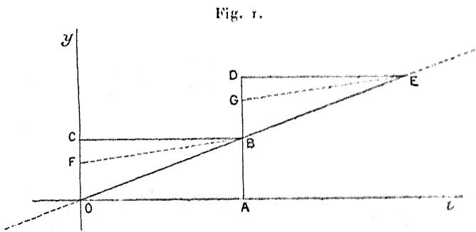

Les ordonnées représentent les cours.

Si AB équivaut à $( ) ^ { \mathrm { f r } } , 2 5$ , la marche logique de la rente au comptant sera représentée par la ligne droite OBE (').

Considérons maintenant le cas où le report serait de $( ) ^ { \uparrow \uparrow } , 2 , ^ { \prime } \rangle$ . Un peu avant la liquidation, le comptant et le terme seront au même cours O; puis, l'acheteur à terme devant payer $( \cdot ) ^ { \Gamma ( r } , 2 \cdot ) ^ { \prime }$ de report, le cours du terme sautera brusquement de O en C et suivra pendant tout le mois la ligne horizontale CB. En B, il se confondra de nouveau avec le cours du comptant pour augmenter tout à coup de ${ \mathfrak { o } } ^ { { \mathfrak { f } } { \mathfrak { r } } }$ , 25 en D, etc.

Dans le cas où le report est une quantité donnée correspondant à la longueur OF, le cours devrait suivre la ligne FB, puis GE, et ainsi de suite. La rente à terme doit donc logiquement dans ce cas, d'une liquidation à l’autre, monter d’une quantité représentée par FC qu'on pourrait appeler le complément du report.

Tous les cours de F à B de la ligne FB sont équivalents pour les diffé- rentes époques auxquelles ils correspondent.

En réalité, l'écart entre le terme et le comptant ne se détend pas d’une façon absolument régulière et FB n’est pas une droite, mais la construction qui vient d’être faite au début du mois peut se répéter à une époque quelconque représentée par le point. N.

(1) On suppose qu’il n'y a pas de détachement de coupon dans l'intervalle considéré, ce qui d’ailleurs ne changerait rien à la démonstration.

<!-- page: 6 -->

Soit NA le temps qui s’écoulera entre l’époque N considérée et la liquidation représentée par le point A.

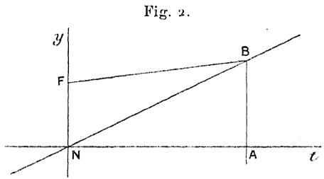

Pendant le temps NA, la rente au comptant doit logiquement monter de AB, proportionnel à NA. Soit NF l'écart entre le comptant et le terme, tous les cours correspondant à la ligne FB sont équivalents.

Cours vrais. - Nous appellerons cours vrai correspondant à une époque le cours équivalent correspondant à cette époque.

La connaissance du cours vrai a une très grande importance, je vais étudier comment on le détermine.

Désignons par b la quantité dont doit logiquement monter la rente dans l'intervalle d'une journée. Le coefficient b varie généralement peu, sa valeur chaque jour peut être exactement déterminée.

Supposons que n jours nous séparent de la liquidation, et soit C l'écart du terme au comptant.

En n jours, le comptant doit monter de $\frac { 2 5 \ : n } { 3 0 }$ centimes, le terme étant plus élevé de la quantité C ne doit monter pendant ces n jours que de la quantité ${ \frac { 2 ^ { 5 } n } { 3 \infty } } \ n \mathrm { ~ . ~ } \ \mathrm { ~ c ~ } ,$ c’est-à-dire pendant un jour de

$$
\frac { 1 } { n } \left( \frac { 2 5 n } { 3 0 } - \mathrm { C } \right) = \frac { 1 } { 6 n } ( 5 n - 6 \mathrm { C } ) .
$$

On a donc

$$
b = { \frac { \mathrm { I } } { 6 n } } ( 5 n - 6 \mathrm { C } ) .
$$

La moyenne des cinq dernières années donne

$$
b \approx \mathrm { o } ^ { \mathrm { e } } , 2 6 4 .
$$

Ann. de l'Ée, Normale. 3° Série. Tome XVI1. — JAnviER 19oo.

<!-- page: 7 -->

Le cours vrai correspondant à m jours sera égal au cours coté actuellement, augmenté de la quantité mb.

Représentation géométrique des opérations fermes. Une opération peut se représenter géométriquement d'une façon très simple, l'axe des x représentant les différents cours et l’axe des y les bénéfices correspondants.

Je suppose que j’aie fait un achat ferme au cours représenté par O, que je prends pour origine. Au cours $x = \left( \right) \Lambda$ , l’opération donne pour

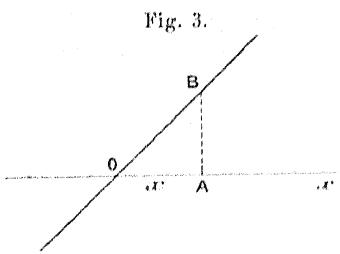

bénéfice $x ;$ et comme, l’ordonnée correspondante doit étre égale au bénéfice, $\mathrm { A B } = \mathrm { O A }$ ; l’achat ferme est donc représenté par la ligne OB inclinée à $4 5 ^ { \circ }$ sur la ligne des cours.

Une vente ferme se représenterait d'une façon inverse.

Primes. - Dans l'achat ou la vente ferme, acheteurs et vendeurs s'exposent à une perte théoriquement illimitée. Dans le marché à prime, l’acheteur paye le titre plus cher que dans le cas du marché ferme, mais sa perte en baisse est limitée d'avance à une certaine somme qui est le montant de la prime.

Le vendeur de prime a l’avantage de vendre plus cher, mais il ne peut avoir pour bénéfice que le montant de la prime.

On fait aussi des primes à la baisse qui limitent la perte du vendeur; dans ce cas, l’opération se fait à un cours inférieur à celui du ferme.

On ne traite ces primes à la baisse que dans la spéculation sur les marchandises; dans la spéculation sur les valeurs, on obtient une prime à la baisse en vendant ferme et en achetant simultanément à prime. Pour fixer les idées, je ne m'occuperai que des primes à la hausse.

<!-- page: 8 -->

Supposons, par exemple, que le $3 \%$ cote $\mathbf { I o } \mathcal { G } ^ { \mathrm { f r } }$ au début du mois; si nous en achetons 3ooo ferme, nous nous exposons à une perte qui peut devenir considérable s’il se produit une forte baisse.

Pour éviter ce risque, nous pouvons acheter une prime dont 5oc (') en payant, non plus $\tau \mathrm { o } \mathcal { f } ^ { \mathrm { f r } }$ , mais ${ \mathrm { I O } } { \mathit { G } } ^ { \mathrm { f r } } , { \mathrm { I } } { \mathit { 5 } }$ , par exemple; notre cours d’achat est plus élevé, il est vrai, mais notre perte reste limitée quelle que soit la baisse à 5oc par $3 ^ { \mathfrak { r } }$ , c’est-à-dire à 50of.

L'opération est la même que si nous avions acheté du ferme à 1o4f,15, ce ferme ne pouvant baisser de plus de $5 \mathrm { o ^ { c } }$ , c'est-à-dire descendre au-dessous de 1o3f,65.

Le cours de 1o3,65, dans le cas actuel, est le pied de la prime.

On voit que le cours du pied de la prime est égal au cours auquel elle est négociée, diminué du montant de la prime.

Réponse des primes. — La veille de la liquidation, c’est-à-dire l’avantdernier jour du mois, a lieu la réponse des primes. Reprenons l’exemple précédent et supposons qu'à cet instant de la réponse le cours de la rente soit inférieur à ro3f,65, nous abandonnerons notre prime, qui sera le bénéfice de notre vendeur.

Si, au contraire, le cours de la réponse est supérieur à 1o3f,65, notre opération sera transformée en opération ferme; on dit dans ce cas que la prime est levée.

En résumé, une prime est levée ou abandonnée suivant que le cours de la réponse est inférieur ou supérieur au pied de la prime.

On voit que les opérations à prime ne courent pas jusqu’à la liquidation; si la prime est levée à la réponse, elle devient du ferme et se liquide le lendemain.

Dans tout ce qui suivra, nous supposerons que le cours de compensation se confond avec le cours de la réponse des primes; cette hypothèse est justifiable, car rien n’empêche de liquider ses opérations à la réponse des primes.

(1) On dit une prime dont pour une prime de et l’on emploie la notation 1o4,15/5o pour désigner une opération faite au cours de 1o4t,15 dont 5o\*.

<!-- page: 9 -->

Écart des primes. - L’'écart entre le cours du ferme et celui d'une prime dépend d’un grand nombre de facteurs et. varie sans cesse.

Au même instant, l’écart est d’autant plus grand que la prime est plus faible; par exemple, la prime dont 5o" est évidemment meilleur marché que la prime dont 25°.

L’écart d’une prime décroît plus ou moins régulièrement depuis le commencement du mois jusqu'à la veille de la réponse, moment ou cet écart devient très faible.

Mais, suivant les circonstances, il peut se détendre très irrégulièrement et se trouver plus grand quelques jours avant la réponse qu’au commencement du mois.

Primes pour fin prochain. - On traite des primes non seulement pour fin courant, mais aussi pour fin prochain. L’écart de celles-ci est nécessairement plus grand que celui des primes fin courant, mais il est plus faible qu’on ne le croirait en faisant la différence entre le cours de la prime et celui du ferme; il faut en effet déduire de cet écart apparent l’importance du report fin courant.

Par exemple, l’écart moyen de la prime /25° à 45 jours de la réponse est en moyenne de 72"; mais, comme le report moyen est de 17', l’écart n’est en réalité que de 55°.

Le détachement d’un coupon fait baisser le cours de la prime d’une valeur égale à l'importance du coupon. Si, par exemple, j'achète, le 2 septembre, une prime $\mathrm { / 2 5 ^ { c } }$ à 1o4",5o fin courant, le cours de ma prime sera devenu 103",75 le 16 septembre après le détachement du coupon.

Le cours du pied de la prime sera 1o3º, 5o.

Primes pour le lendemain. - On traite, surtout en coulisse, des primes dont 5º et quelquefois dont 1oº pour le lendemain.

La réponse pour ces petites primes a lieu tous les jours à 2h.

Les primes en général. — Dans un marché à prime pour une échéance donnée, il y a deux facteurs à considérer : l’importance de la prime et son écart du ferme.

<!-- page: 10 -->

Il est bien évident que plus une prime est forte, plus son écart est petit.

Pour simplifier la négociation des primes, on les a ramenées à trois types en faisant sur l’importance de la prime et sur son écart les trois hypothèses les plus simples :

1° L’importance de la prime est constante et son écart est variable; c’est cette sorte de prime qui se négocie sur les valeurs; par exemple, sur le $3 \ \%$ on traite des primes $/ 5 0 ^ { \mathrm { c } } , / 2 5 ^ { \mathrm { c } }$ et $\int \mathbf { I } ~ 0 ^ { \mathrm { c } }$

2° L’écart de la prime est constant et son importance est variable; c’est ce qui a lieu pour les primes à la baisse sur les valeurs (c’està-dire la vente ferme contre achat à prime).

3° L’écart de la prime est variable ainsi que son importance, mais ces deux quantités sont toujours égales. C’est ainsi que l'on traite les primes sur les marchandises. Il est évident qu'en employant ce dernier système on ne peut traiter à un moment donné qu'une seule prime pour la même échéance.

Remarque sur les primes. - Nous examinerons quelle est la loi qui régit les écarts des primes; cependant nous pouvons, dès maintenant, faire une remarque assez curieuse :

Une prime doit être d’autant plus forte que son écart est plus faible. Ce fait évident ne suffit pas pour montrer que l’usage des primes soit rationnel.

J'ai en effet reconnu, il y a plusieurs années, qu'il était possible en l’admettant d’imaginer des opérations où l’un des contractants gagnerait à tous les cours.

Sans reproduire les calculs, élémentaires mais assez pénibles, je me contente de présenter un exemple.

L'opération suivante :

$$
\begin{array} { l } { \mathrm { { A c h a t ~ d ' u n e ~ u n i t \acute { e } } ~ } } { \mathrm { / { r } } } ,  \\ { \mathrm { { V e n t e ~ d e ~ q u a t r e ~ u n i t e s ~ \rlap / / 5 o ^ { c } , } } } \\ { \mathrm { { A c h a t ~ d e ~ t r o i s ~ u n i t e s ~ \jmath / 2 5 \mathrm { { ^ { \mit \cdot } } s } } , } } \end{array}
$$

donnerait un bénéfice à tous les cours pourvu que l’écart du $/ 2 5 ^ { \mathrm { { r } } }$ au $/ 5 0 ^ { \mathrm { { c } } }$ soit au plus le tiers de l’écart du $/ 5 0 ^ { \mathrm { { * } } }$ au $/ \uparrow ^ { \mathrm { f r } }$

<!-- page: 11 -->

Nous verrons que des écarts semblables ne se rencontrent jamais dans la pratique.

Représentation géométrigue des opérations à prime. Proposonsnous de représenter géométriquement un achat à primes.

Prenons, par exemple, pour origine le cours du ferme au moment où la prime dont h a été traitée; soit $\mathbb { K } _ { 1 }$ le cours relatif de cette prime ou son écart.

Au-dessus du pied de la prime, c’est-à-dire au cours $( \mathbb { R } , \mathbb { \sim } h )$ repré- senté par le point A, l’opération est assimilable à une opération ferme traitée au cours $\operatorname { E } _ { s }$ ; elle est donc représentée par la ligne CBF. Audessous du cours $\operatorname { E } _ { 1 } - h .$ , la perte est constante et, par suite, l'opération est représentée par la ligne brisée DCF.

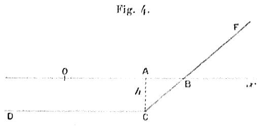

Écarts vrais. - Jusqu'à présent nous n’avons parlé que des écarts cotés, les seuls dont on s’occupe ordinairement; ce ne sont cependant pas eux qui s’introduiront dans notre théorie, mais bien les écarts vrais, c’est-à-dire les écarts entre les cours des primes et les cours vrais correspondant à la réponse des primes. Le cours dont il s’agit étant supérieur au cours coté (à moins que le report soit supéricur a $2 5 ^ { \mathrm { { c } } }$ , ce qui est rare), il en résulte que l’écart vrai d'une prime est inférieur à son écart coté.

L’écart vrai d’une prime traitée n jours avant la réponse sera égal à son écart diminué de la quantité $^ { n \mathrm { / / } }$

L’écart vrai d’une prime pour fin prochain sera égal à son écart coté diminué de la quantité $[ . 2 5 + ( n - 3 0 ) b ]$

<!-- page: 12 -->

Options. — On traite sur certains marchés des opérations en quelque sorte intermédiaires entre les opérations fermes et les opérations à prime, ce sont les options.

Supposons que 3o" soient le cours d’une marchandise. Au lieu d’acheter une unité au cours de 3of pour une échéance donnée, nous pouvons acheter une option du double pour la même échéance à 32f, par exemple. Il faut entendre par là que pour toute différence au-dessous du cours de 32", nous ne perdons que sur une unité, alors que pour toute différence au-dessus, nous gagnons sur deux unités.

Nous aurions pu acheter une option du triple à 33rr, par exemple, c'est-à-dire que, pour toute différence au-dessous du cours de 33fr nous perdons sur une unité, alors que pour toute différence au-dessus de ce cours nous gagnons sur trois unités. On peut imaginer des options d'un ordre multiple, la représentation géométrique de ces opé- rations ne présente aucune difficulté.

On traite aussi des options à la baisse, nécessairement au même écart que les options à la hausse du même ordre de multiplicité.

## LES PROBABILITÉS DANS LES OPÉRATIONS DE BOURSE.

Probabilités dans les opérations de bourse. On peut considérer deux sortes de probabilités :

1° La probabilité que l’on pourrait appeler mathématigue, c'est celle quc l’on peut déterminer a priori; celle que l’on étudie dans les jeux de hasard.

2° La probabilité dépendant de faits à venir et, par conséquent, impossible à prévoir d'une façon mathématique.

C'est cette dernière probabilité que cherche a prévoir le spéculateur, il analyse les raisons qui peuvent influer sur la hausse ou sur la baisse et sur l'amplitude des mouvements. Ses inductions sont absolument personnelles, puisque sa contre-partie a nécessairemènt l'opinion inverse.

Il semble que le marché, c'est-à-dire l’ensemble des spéculateurs, ne doit croire à un instant donné ni à la hausse, ni à la baisse, puisque, pour chaque cours coté, il y a autant d’acheteurs que de vendeurs.

<!-- page: 13 -->

En réalité, le marché croit à la hausse provenant de la différence entre les coupons et les reports; les vendeurs font un léger sacrifice qu’ils considèrent comme compensé.

On peut ne pas tenir compte de cette diférence, à la condition de considérer les cours vrais correspondant à la liquidation, mais les opérations se réglant sur les cours cotés, le vendeur paye la différence.

Par la considération des cours vrais on peut dire :

Le marché ne croit, à un instant donne, ni à la hausse, ni à la baisse du cours vrai.

Mais, si le marché ne croit ni à la hausse, ni à la baisse du cours vrai, il peut supposer plus ou moins probables des mouvements d’une certaine amplitude.

La détermination de la loi de probabilité qu'admet le marché à un instant donné sera l’objet de cette étude

L’espérance mathématique. On appelle espérance mathématique d’un bénéfice éventuel le produit de ce bénéfice par la probabilité correspondante.

L’espérance mathématique totale d’un joueur sera la somme des produits des bénéfices éventuels par les probabilités correspondantes.

Il est évident qu’un joueur ne sera ni avantagé, ni lésé si son espé- rance mathématique totale est nulle.

On dit alors que le jeu est équitable.

On sait que les jeux de courses et tous ceux qui sont pratiqués dans les maisons de jeu ne sont pas équitables : la maison de jeu ou le donneur s’il s’agit de paris aux courses, jouent avec une espérance positive, et les pontes avec une espérance négative.

Dans ces sortes de jeux les pontes n’ont pas le choix entre l’opération qu’ils font et sa contre-partie; comme il n’en est pas de même à la Bourse, il peut sembler curieux que ces jeux ne soient pas équitables, le vendeur acceptant a priori un désavantage si les reports sont inférieurs aux coupons.

<!-- page: 14 -->

L’existence d’une seconde sorte de probabilités explique ce fait qui peut sembler paradoxal.

L'avantage mathématique. — L'espérance mathématique nous indique si un jeu est avantageux ou non : elle nous apprend de plus ce que le jeu doit logiquement faire gagner ou faire perdre; mais elle ne donne pas un coefficient représentant, en quelque sorte, la valeur intrinsèque du jeu.

Ceci va nous amener à introduire une nouvelle notion : celle de l'avantage mathématique.

Nous appellerons avantage mathématique d’un joueur le rapport de son espérance positive à la somme arithmétique de ses espérances positive et négative.

L’avantage mathématique varie comme la probabilité de zéro à un, il est égal à ↓ quand le jeu est équitable.

Principe de l'espérance mathématique. — On peut assimiler l'acheteur au comptant à un joueur; en effet, si le titre peut monter après l’achat, la baisse est également possible. Les causes de cette hausse ou de cette baisse rentrent dans la seconde catégorie de probabilités.

D'après la première le titre (') doit monter d’une valeur égale à l’importance de ses coupons; il en résulte qu’au point de vue de cette première classe de probabilités :

L’espérance mathématique de l'acheteur au comptant est positive.

Il est évident qu'il en sera de même de l'espérance mathématique de l'acheteur à terme si le report est nul, car son opération sera assimilable à celle de l'acheteur au comptant

Si le report sur la rente était de 25c, l’acheteur ne serait pas plus avantagé que le vendeur.

On peut donc dire :

Les espérances mathématiques de l’acheteur et du vendeur sont nulles quand le report est de 25e.

Quand le report est inférieur à 25c, ce qui est le cas ordinaire :

(1) Je considère le cas le plus simple d’un titre à revenu fixe, sinon l'augmentation du revenu serait une probabilité do la seconde classe.

Ann. de l'Ée. Normale. 3° Série. Tome XVII. -- JAsviER 19oo.

<!-- page: 15 -->

L'espérance mathématique de l'acheteur est positive, celle du vendeur est négative.

Il faut toujours remarquer qu'il s’agit uniquement de la première sorte de probabilités.

D’après ce qui a été vu précédemment, on peut toujours considérer le report comme étant de $\mathbf { 2 } / 5 ^ { \mathrm { c } }$ à la condition de remplacer Ie cours coté par le cours vrai correspondant à la liquidation; si donc, on considère ces cours vrais on peut dire que :

Les espérances mathématiques de l'acheteur et du vendeur sont nulles.

Au point de vue des reports on peut considérer la réponse des primes comme se confondant avec la liquidation; donc :

Les espérances mathématiques de l'acheteur et du vendeur de primès sont nulles.

En résumé, la considération des cours vrais permet d'énoncer ce principe fondamental :

L’espérance mathématique du spéculateur est nulle.

Il faut bien se rendre compte de la généralité de ce principe : il signifie que le marché, à un instant donné, considère comme ayant une espérance nulle non seulement les opérations traitables actuellement. mais encore celles qui seraient basées sur un mouvement ultérieur des cours.

Par exemple, j'’achète de la rente avec l'intention de la revendre lorsqu’elle aura monté de 5oc, l’espérance de cette opération complexe est nulle absolument comme si j’avais l'intention de revendre ma rente en liquidation ou à un moment quelconque.

L’espérance d’une opération ne peut être positive ou négative que s’il se produit un mouvement des cours, a priorí elle est nulle.

Forme générale de la courbe de probabilité. La probabilité pour que le cours y soit coté à une époque donnée est une fonction de y.

On pourra représenter cette probabilité par l’ordonnée d’une courbe dont les abscisses correspondront aux différents cours.

Il est évident que le cours considéré par le marché comme le plus probable est le cours vrai actuel : si le marché en jugeait autrement, il coterait non pas ce cours, mais un autre plus ou moins élevé.

<!-- page: 16 -->

Dans la suite de cette étude, nous prendrons pour origine des coordonnées le cours vrai correspondant à l'époque donnée. Le cours pourra varier entre $- \mathbf { \nabla } x _ { 0 }$ et $+ \infty ; x _ { 0 }$ étant le cours absolu actuel.

Nous supposerons qu’il puisse varier entre $- \infty$ et +∞; la probabilité d’un écart plus grand que $x _ { \mathfrak { g } }$ étant considérée a priori comme tout à fait négligeable.

Dans ces conditions, on peut admettre que la probabilité d’un écart à partir du cours vrai est indépendante de la valeur absolue de ce cours, et que la courbe des probabilités est symétrique par rapport au cours vrai.

Dans ce qui suivra, il ne sera question que du cours relatif, l’origine des coordonnées correspondra toujours au cours vrai actuel.

La loi de probabilité. — La loi de probabilité peut se déterminer par le principe de la probabilité composée.

Désignons par $p _ { x , t } d x _ { \mathrm { ~ ~ ~ } }$ , la probabilité pour que, à l’époque $t ,$ le cours se trouve compris dans l’intervalle élémentaire $x , x + d , x$

Cherchons la probabilité pour que le cours z soit coté à l'époque ${ \boldsymbol { l } } _ { 1 } + { \boldsymbol { l } } _ { 2 } ,$ , le cours x ayant été coté à l’époque $t _ { i }$

En vertu du principe de la probabilité composée, la probabilité cherchée sera égale au produit de la probabilité pour que le cours x soit coté à l'époque $\ell _ { \ell }$ , c'est-à-dire $p _ { x , t , } d x$ , multipliée par la probabilité pour que, le cours x étant coté à l’époque $\ell _ { \pmb { \imath } }$ , le cours z soit coté à l'époque $\ell _ { 1 } + \ell _ { 2 }$ , c'est-à-dire, multipliée par $\smash { l ^ { \prime } = - \kappa ^ { \prime } , l _ { \perp } } ^ { \prime \prime }$

La probabilité cherchéc est donc

$$
p _ { \cdot r , \cdot _ { 1 } } p _ { \cdot - x , \cdot _ { 4 } } d x d z .
$$

Le cours pouvant se trouver à l'époque $\ell _ { \uparrow }$ dans tous les intervalles dx compris entre $- \infty \mathrm { e t } + \infty ,$ la probabilité pour que le cours z soit coté à l’époque ${ \boldsymbol { \ell } } _ { 1 } + { \boldsymbol { \ell } } _ { 2 }$ sera

$$
\int _ { - \infty } ^ { + \infty } p _ { \cdot } r _ { \cdot } \iota _ { 1 } p _ { z - x ; \iota _ { 2 } } d x \iota _ { 2 } s .
$$

La probabilité de ce cours $z ,$ à l'époque $\ell _ { 1 } \to \ell _ { \ge }$ , a aussi pour expression $p _ { { \tilde { \rho } } , t _ { 1 } \cdot t } , :$ on a donc

$$
\rho _ { z , \iota _ { 1 } \cdots \iota _ { 2 } } d z = \int _ { - \infty } ^ { + \infty } p _ { x , \iota _ { 1 } } p _ { z - x ; \iota _ { 2 } } d x d z
$$

<!-- page: 17 -->

ou

$$
P _ { \therefore , t _ { 1 } + \cdots t _ { 2 } } = \int _ { \cdots , \infty } ^ { \cdots + \infty } p _ { \cdots , t _ { 1 } } p _ { \cdots , t _ { 1 } } d x ,
$$

telle est l’équation de condition à laquelle doit satisfaire la fonction $\begin{array} { r } { { \cal J } ^ { \prime \prime } . } \end{array}$

Cette équation est vérifiée, comme nous allons le voir, par la fonction

$$
p = \mathbf { A } e ^ { - \mathbf { B } \cdot \mathbf { r } ^ { 2 } } \circ
$$

Remarquons dès maintenant que l'on doit avoir

$$
\int _ { - \infty } ^ { + \infty } p d x = \Lambda \int _ { - \infty } ^ { + \infty } e ^ { - \mathrm { i } B x \cdot x ^ { 2 } } d x = - 1 .
$$

L’intégrale classique qui figure dans le premier terme a pour valeur $\frac { \sqrt { \pi } } { \mathrm { B } } ,$ on a donc $\mathrm { B } = \mathrm { A } \sqrt { \pi }$ et, par suite

$$
p \cong \Lambda e ^ { - \pi \Lambda ^ { \circ } , \iota \cdot \tilde { \varepsilon } } ,
$$

En posant $\mathscr { x } = 0$ , on obtient $\Lambda \cong p _ { \ u { v } }$ , c’est-à-dire : A égale la probabilité du cours coté actuellement.

Il faut done établir que la fonction

$$
I ^ { \prime } = I ^ { j _ { 0 } / \cdots } = I ^ { s }
$$

où $p _ { \mathfrak { d } }$ dépend du temps, satisfait bien à l'équation de condition cidessus.

Soient P, et p₂ les quantités correspondant à Po et relatives aux $p _ { \ast }$ $p _ { 2 }$ $p _ { \mathfrak { g } }$ temps $\ell _ { 4 }$ et $\ell _ { \mathbf { \ 3 } }$ , il faut prouver que l’expression

$$
\int _ { - \infty } ^ { + \infty } p _ { 1 } e ^ { - \pi p _ { 1 } ^ { \prime } , v _ { 2 } ^ { * } } \times p _ { 2 } e ^ { - \pi p _ { 1 } ^ { \prime } ( v - v ) ^ { 2 } } e l , v
$$

peut se mettre sous la forme $\Delta \mathcal { C } ^ { \mathrm { ~ t ~ } 3 , 3 }$ ; A et B ne dépendant que du temps.

Cette intégrale devient, en remarquant que z est une constante,

$$
p _ { 1 } p _ { 2 } e ^ { - \pi / \frac { \pi } { 2 } z ^ { 2 } } \int _ { - \infty } ^ { + \infty } e ^ { - \pi ( p _ { 1 } ^ { 2 } + p _ { 1 } ^ { 2 } ) \cdot p ^ { 2 } + 2 \pi / \frac { \pi } { 2 } z , r } d z
$$

ou

$$
p _ { 1 } p _ { 2 } e ^ { - \pi p _ { 2 } ^ { \pi } z ^ { 2 } \cdot + \frac { \pi p _ { 1 } ^ { \pi } z ^ { 2 } } { p _ { 1 } ^ { \pi } + p _ { 2 } ^ { \pi } } } \int _ { - \infty } ^ { + \infty } e ^ { - \pi \left( r \cdot \sqrt { p _ { 1 } ^ { \pi } + p _ { 1 } ^ { \pi } } - \frac { t _ { 2 } ^ { \pi } z } { \sqrt { p _ { 1 } ^ { \pi } + p _ { 2 } ^ { \pi } } } \right) } d x ;
$$

<!-- page: 18 -->

posons

$$
x \sqrt { p _ { 1 } ^ { 2 } + p _ { 2 } ^ { 2 } } - \frac { p _ { 2 } ^ { 2 } z } { \sqrt { p _ { 1 } ^ { 2 } + p _ { 2 } ^ { 2 } } } = u ;
$$

nous aurons alors

$$
\frac { p _ { 1 } p _ { 2 } e ^ { - \pi p _ { 2 } ^ { \circ } z ^ { \circ } } { \overline { { p _ { 1 } ^ { \circ } } } } ^ { \prime } { \overline { { p _ { 2 } ^ { \circ } } } } } { \sqrt { p _ { 1 } ^ { \circ } + p _ { 2 } ^ { \circ } } } { \int _ { - \infty } ^ { + \infty } e ^ { - \pi u ^ { \circ } } d u } .
$$

L'intégrale ayant pour valeur 1, nous obtenons finalement

$$
\frac { p _ { 1 } p _ { 2 } } { \sqrt { p _ { 1 } ^ { 2 } + p _ { 2 } ^ { 2 } } } e ^ { - \pi \frac { / \eta _ { 1 } ^ { 2 } p _ { 2 } ^ { 2 } } { p _ { 1 } ^ { 2 } + p _ { 2 } ^ { 2 } } z ^ { 2 } } .
$$

Cette expression ayant la forme désirée, on doit en conclure que la probabilité s’exprime bien par la formule

$$
p = p _ { 0 } e ^ { - \pi p _ { 0 } ^ { \ast } x ^ { \ast } } ,
$$

dans laquelle $p _ { 0 }$ dépend du temps.

On voit que la probabilité est régie par la loi de Gauss déjà célèbre dans le Calcul des probabilités.

Probabilité en fonction du temps. — La formule antéprécédente nous montre que les paramètres $p _ { \mathrm { 0 } } = f ( t )$ satisfont à la relation fonctionnelle

$$
f ^ { 2 } ( l _ { 1 } { + } l _ { 2 } ) = \frac { f ^ { 2 } ( l _ { 1 } ) f ^ { 2 } ( l _ { 2 } ) } { f ^ { 2 } ( l _ { 1 } ) + f ^ { 2 } ( l _ { 2 } ) } ;
$$

différentions par rapport à $\ell _ { 4 } ,$ puis par rapport à $t _ { \geq }$ . Le premier membre ayant la même forme dans les deux cas, nous obtenons

$$
\frac { f ^ { \prime } \left( t _ { 1 } \right) } { f ^ { 3 } \left( t _ { 1 } \right) } = \frac { f ^ { \prime \prime } \left( t _ { 2 } \right) } { f ^ { 3 } \left( t _ { 2 } \right) } .
$$

Cette relation ayant lieu, quels que soient $t _ { \iota }$ et $t _ { 2 } ,$ la valeur commune des deux rapports est constante, et l’on a

$$
\begin{array} { r } { f ^ { \prime } ( t ) = \mathbb { C } f ^ { 3 } ( \ t ) , } \end{array}
$$

d’où

$$
f ( t ) = p _ { 0 } = \frac { \mathtt { H } } { \sqrt { \hat { t } } } ,
$$

H désignant une constante.

<!-- page: 19 -->

Nous avons donc pour expression de la probabilité

$$
\boldsymbol { p } = \frac { \mathrm { H } } { \sqrt { t } } \boldsymbol { e } ^ { - \frac { \pi \mathrm { H } ^ { 9 } \lambda ^ { 9 } } { \hat { t } } } ,
$$

Espérance mathématique. - L'espérance correspondant au cours :x a pour valeur

$$
\frac { \mathrm { H } \cdot x } { \sqrt { \overline { { t } } } } \stackrel { \_ \pi \mathrm { H } ^ { 1 / 1 } \cdot x ^ { 1 } } { \epsilon } .
$$

L’espérance positive totale est donc

$$
\int _ { 0 } ^ { \infty } { \frac { \operatorname { H } x } { \sqrt { \hat { t } } } } e ^ { - { \frac { \pi \operatorname { H } x ^ { \star } } { t } } } d x = { \frac { \sqrt { \hat { t } } } { 2 \pi \operatorname { H } } } \cdot
$$

Nous prendrons pour constante, dans notre étude, l'espérance mathématique k correspondant à $t = \pmb { \mathbb { I } } \ ;$ ; nous aurons donc

$$
k = { \frac { 1 } { 2 \pi \mathbf { H } } } \qquad \mathrm { o u } \qquad \mathbf { H } = { \frac { 1 } { 2 \pi \lambda } } \cdot
$$

L’expression définitive de la probabilité est done

$$
\rho = \operatorname* { \rho } _ { 2 \pi k ^ { \prime } \sqrt { t } } \bar { e ^ { - i \pi k ^ { 3 } t } } .
$$

L’espérance mathématique

$$
\int _ { 0 } ^ { \infty } p x d x = k \sqrt { l }
$$

est proportionnelle à la racine carrée du temps.

Nouvelle détermination de la loi de probabilité. L'expression de la fonction p peut s’obtenir en suivant une voie différente de celle que $p$ nous avons employée.

Je suppose que deux événements contraires A et B aient pour probabilités respectives $p$ ct ${ \boldsymbol { g } } = \mathbf { I } \cdots { \boldsymbol { p } }$ . La probabilité pour que, sur mévénements, il s’en produise α égaux à A et $\boldsymbol { \Lambda }$ $m \textrm { \ -- } \alpha$ égaux à B a pour expression

$$
\frac { m ! } { a ! ( m - \alpha ) ! } p ^ { \alpha } q ^ { m - x } .
$$

<!-- page: 20 -->

C’est un des termes du développement de $( p + q ) ^ { m }$

La plus grande de ces probabilités a lieu pour

$$
\alpha = m p \qquad { \mathrm { e t } } \qquad ( m - \alpha ) = m q .
$$

Considérons le terme dont l’exposant de $p$ est $m p + h$ , la probabilité correspondante est

$$
\frac { m ! } { ( m p + h ) ! ( m q - h ) ! } p ^ { m p + h } q ^ { m q - h } .
$$

La quantité h est appelée l’écart.

Cherchons quelle serait l’espérance mathématique d’un joueur qui toucherait une somme égale à l'écart quand cet écart serait positif.

Nous venons de voir que la probabilité d’un écart $\textit { h }$ est le terme du développement de $( p + q ) ^ { m }$ dans lequel l’exposant de $P$ est $m p + h$ et celui de $q ,$ $m q - h$ . Pour obtenir l'espérance mathématique correspondant à ce terme, il faudra wultiplier cette probabilité par $\hbar$ ; or

$$
h = q \left( m p + h \right) - p ( m q - h ) ,
$$

mp $+ h$ et $m q - h$ sont les exposants de $p$ et de $q$ dans le terme de $( p + q ) ^ { m }$ . Multiplier un terme

$$
q ^ { \flat } p ^ { \flat }
$$

par

$$
\nu q - \mu . p = p q \Big ( \frac { \upsilon } { p } - \frac { \mu . } { q } \Big ) ,
$$

c’est prendre la dérivée par rapport à $p _ { \langle }$ en retrancher la dérivée par rapport à $\cdot \mathbf { \nabla } _ { \mathbf { \lambda } }$ et multiplier la différence par $p q$

Pour obtenir l'espérance mathématique totale, nous devons donc prendre les termes du développement de $( p + q ) ^ { \dprime \prime }$ pour lesquels $\boldsymbol { h }$ est positif, c'est-à-dire

$$
p ^ { m } + m p ^ { m - 1 } q + \frac { m ( \frac { m - 1 } { \cdot \cdot 3 } ) } { 1 \cdot 3 } p ^ { m - 2 } q ^ { 2 } + \cdot \cdot \cdot + \frac { m ! } { m p ! m q ! } p ^ { m p } q ^ { m q } ,
$$

et retrancher la dérivée par rapport à $q$ de la dérivée par rapport à $p ,$ pour multiplier ensuite le résultat par $p q$

La dérivée du second terme par rapport à $q$ est égale à la dérivée du premier par rapport à $p _ { - }$ , la dérivée du troisième par rapport à $q$ est la dérivée du second par rapport à $p _ { \ast }$ et ainsi de suite. Les termes se dé-

<!-- page: 21 -->

truisent donc deux à deux et il ne reste que la dérivée du dernier par rapport à $p$

$$
\frac { m ! } { m p ! m q ! } \ : p ^ { m p } \ : q ^ { m } \prime \ : m p \prime \ :
$$

La valeur moyenne de l'écart h serait égale au double de cette quantité.

Lorsque le nombre m est suffisamment grand, on peut simplifier les expressions précédentes en faisant usage de la formule asymptotique de Stirling

$$
n ! = e ^ { - n } n ^ { n } { \sqrt { 2 \pi n } } .
$$

On obtient ainsi pour l’espérance mathématique la valeur

$$
{ \frac { \sqrt { m p q } } { \sqrt { 2 \pi } } } .
$$

La probabilité pour que l’écart h soit compris entre h et $\therefore x -$ aura pour expression

$$
\frac { d h } { \sqrt { 2 \pi m / 1 } } < e ^ { - \frac { h ^ { 3 } } { 2 m / 1 } } .
$$

Nous pouvons appliquer la théorie qui précède à notre étude. On peut supposer le temps divisé en intervalles très petits $\Delta t$ ; de sorte que $\iota = m \Delta \iota ;$ pendant le temps $\Delta t$ le cours variera probablement très peu.

Formons la somme des produits des écarts qui peuvent exister à l’époque ∆t par les probabilités correspondantes; c'est-à-dire $\int _ { \psi } ^ { * } p \ d x d x ,$ p étant la probabilité de l'écart x.

Cette intégrale doit être finie, car, par suite de la petitesse supposée de∆t, les écarts considérables ont une probabilité évanouissante. Cette intégrale exprime du reste une espérance mathématique, qui ne peut être finie si elle correspond à un intervalle de temps très petit

Désignons par ∆x le double de la valeur de l’intégrale ci-dessus: ∆x sera la moyenne des écarts ou l’écart moyen pendant le temps Δt.

Si le nombre m des épreuves est très grand et si la probabilité reste la même à chaque épreuve, nous pourrons supposer que le cours varie pendant chacune des épreuves $\Delta t$ de l’écart moyen $\Delta { . } x ;$ la hausse ∆x aura pour probabilité ${ \frac { \mathrm { ~ I ~ } } { 2 } } ,$ comme aussi la baisse $- \Delta x$

<!-- page: 22 -->

La formule qui précède donnera donc, en y faisant $\begin{array} { r } { p = q = \frac { \mathtt { j } } { 2 } . } \end{array}$ la probabilité pour que, à l’époque $t ,$ le cours soit compris entre x et $x + d x$ , ce sera

$$
\frac { _ { 2 } d x \sqrt { \Delta t } } { \sqrt { 2 \pi } \sqrt { t } } e ^ { - \frac { 2 . x ^ { 2 } \Delta t } { t } } ,
$$

ou, en posant H $\begin{array} { r } { = \frac { \gamma } { \sqrt { 2 \pi } } \sqrt { \Delta t } , } \end{array}$

$$
\frac { \mathrm { ~ H ~ } d x } { \sqrt { t } } \ : e ^ { - \frac { \pi \mathrm { ~ H ~ } ^ { 2 } \ : \gamma ^ { 2 } } { t } } .
$$

L’espérance mathématique aura pour expression

$$
\frac { \sqrt { \hat { t } } } { 2 \sqrt { 2 \pi } \sqrt { \Delta \hat { t } } } = \frac { \sqrt { \hat { t } } } { 2 \pi \mathbf { H } } .
$$

Si nous prenons pour constante l’espérance mathématique $\pmb { \mathit { k } }$ correspondant à $\scriptstyle { \boldsymbol { t } } = { \boldsymbol { \mathrm { I } } }$ , nous trouvons, comme précédemment,

$$
\begin{array} { r } { p = \frac { \mathrm {  ~ f ~ } } { 2 \pi \mathit { k } \sqrt { \mathit { t } } } e ^ { - \frac { \cdot \mathit { x } ^ { 2 } } { \mathit { t } \pi \mathit { k } ^ { 2 } \mathit { t } } } . } \end{array}
$$

Les formules précédentes donnent $\begin{array}{c} \Delta \ell = \frac { \mathrm { ~ I ~ } } { 8 \pi } \vec { k } ^ { 2 } \end{array}$ la variation moyenne pendant cet intervalle de temps est

$$
\Delta x = { \frac { \sqrt { 2 } } { 2 { \sqrt { \pi } } } } \cdotp
$$

Si nous posons $x = n \Delta x$ , la probabilité aura pour expression

$$
p = { \frac { \sqrt { 2 } } { \sqrt { \pi } \sqrt { m } } } e ^ { - { \frac { n ^ { 2 } } { \pi \prime n } } } .
$$

Courbe des probabilités. — La fonction

$$
p = p _ { 0 } c ^ { - \pi } p _ { * } ^ { * , x ^ { 2 } }
$$

peut se représenter par une courbe dont l'ordonnée est maxima à Ann. de l'Éc. Normale. 3° Série. Tome XVII. — JANviER 19oo. 6

<!-- page: 23 -->

l’origine et qui présente deux points d’inflexion pour

$$
x = \pm \frac { 1 } { p _ { 0 } \sqrt { 2 \pi } } \stackrel { \longleftarrow + } { = } \sqrt { 2 \pi } k \sqrt { \ell } .
$$

Ces mêmes valeurs de x sont aussi les abscisses des maxima et minima des courbes d'espérance mathématique, dont l'équation est

$$
y ^ { \prime } = \pm p x .
$$

La probabilité du cours x est une fonction de t; elle croit jusqu'à une certaine époque et décroit ensuite. La dérivée $\frac { d / p } { d t } = 0$ lorsque $t = { \frac { . x ^ { 2 } } { 2 \pi k ^ { 2 } } }$ . La probabilité du cours x est done maxima quand ce cours correspond au point d’inflexion de la courbe des probabilités.

Probabilité dans un intervalle donné. L'intégrale

$$
\frac { 1 } { 2 \pi k \sqrt { i } } \int _ { 0 } ^ { x ^ { \prime } } e ^ { - \frac { x ^ { \prime } } { 4 \pi k ^ { 2 } i } } d x = \frac { c } { \sqrt { \pi } } \int _ { 0 } ^ { x ^ { \prime } } e ^ { - c ^ { 3 } , x ^ { \prime } } d , x
$$

n’est pas exprimable en termes finis, mais on peut donner son développement en série

$$
\begin{array} { r } { \frac { \mathrm { I } } { \sqrt { \pi } } \displaystyle \Bigg [ c x - \frac { \frac { \mathrm { I } } { 3 } ( c . x ) ^ { 3 } } { \mathrm { I } } + \frac { \frac { \mathrm { I } } { 5 } ( c . x ) ^ { 5 } } { \mathrm { I } \cdot 2 } - \frac { \frac { \mathrm { I } } { 7 } ( c . x ) ^ { 7 } } { \mathrm { I } \cdot 2 \cdot 3 } + . . . \Bigg ] . } \end{array}
$$

Cette série converge assez lentement pour les valeurs très fortes de cx. Laplace a donné pour ce cas l’intégrale définie sous la forme d’une fraction continue fort aisée à calculer

$$
\frac { 1 } { 2 } - \cdots \frac { e ^ { - c ^ { 2 } x ^ { 2 } } } { 2 c x \sqrt { \pi } } \frac { 1 } { 1 + \displaystyle \frac { a } { 1 + \displaystyle \frac { 3 a } { 1 + \displaystyle \frac { 3 a } { 1 + \displaystyle \frac { 3 a } { 1 + \displaystyle \frac { 1 } { 1 + \displaystyle \frac { 3 a } { 1 + \displaystyle \frac { 1 } { 1 + \displaystyle \frac { 3 a } { 1 + \displaystyle \ddots } } } } } } } } } ,
$$

dans laquelle $a = \frac { \textbf { J } } { 2 c ^ { 2 } \boldsymbol { \mathscr { x } } ^ { 2 } } ,$

<!-- page: 24 -->

Les réduites successives sont

$$
\frac { 1 } { 1 + \alpha } , \frac { 1 + 2 \alpha } { 1 + 3 \alpha } , \frac { 1 + 5 \alpha } { 1 + 6 \alpha + 3 \alpha ^ { 2 } } , \frac { 1 + 9 \alpha + 8 \alpha ^ { 2 } } { 1 + 1 0 \alpha + 1 5 \alpha ^ { 2 } } .
$$

Il existe un autre procédé permettant de calculer l’intégrale ci-dessus quand x est un grand nombre.

On a

$$
\int _ { x } ^ { \infty } e ^ { - x \cdot ^ { \cdot } } d x = \int _ { x } ^ { \infty } { \frac { 1 } { 2 x } } e ^ { - x \cdot ^ { \cdot } } 2 x d x ;
$$

en intégrant par parties, on obtient alors

$$
\begin{array} { r l } { \int _ { x } ^ { \infty } e ^ { - x ^ { * } } d x = \frac { e ^ { - x ^ { * } } } { 2 x } - \int _ { x } ^ { \infty } e ^ { - x ^ { * } } \frac { d x } { 2 x ^ { 2 } } ~ } & { } \\ { = \frac { e ^ { - x ^ { * } } } { 2 x } - \frac { e ^ { - x ^ { * } } } { 4 x ^ { 3 } } + \int _ { x } ^ { \infty } e ^ { - x ^ { * } } \frac { \Gamma \cdot 3 } { \Gamma \cdot 3 ^ { * } } d x ~ } & { } \\ { = \frac { e ^ { - x ^ { * } } } { 2 x } - \frac { e ^ { - x ^ { * } } } { 4 x ^ { 3 } } - \frac { e ^ { - x ^ { * } } \Gamma \cdot 3 } { 8 x ^ { 6 } } - \int _ { x } ^ { \infty } e ^ { - x ^ { * } } \frac { \Gamma \cdot 3 \cdot 5 } { 8 x ^ { 6 } } d x . } \end{array}
$$

Le terme général de la série a pour expression

$$
\frac { \texttt { I . 3 . 5 . . ( 2 n -- I ) } } { 2 ^ { 2 n - 1 } \mathcal { X } ^ { 2 n + 1 } } \epsilon ^ { - , x ^ { * } } .
$$

Le rapport d'un terme au précédent dépasseI l'unité lorsque $\bf { 2 } n + \bf { I } > \mathrm { 4 } x ^ { 2 }$ . La série diverge donc à partir d'un certain terme. On peut obtenir une limite supérieure de l’intégrale qui sert de reste.

On a, en effet,

$$
\begin{array} { r l } & { \frac { \texttt { r . 3 . 5 . . ( 2 n + 1 ) } } { 2 ^ { 2 n - 1 } } \int _ { x } ^ { \infty } \frac { e ^ { - x ^ { 2 } } } { x ^ { 9 n + 2 } } d x < \frac { \texttt { r . 3 . 5 . ( 2 n + 1 ) } } { 2 ^ { 2 n - 1 } } e ^ { - x ^ { 2 } } \int _ { x } ^ { \infty } \frac { d x } { x ^ { 2 n + 2 } } } \\ & { \quad = \frac { \texttt { r . 3 . 5 . ( 2 n - 1 ) } } { 2 ^ { 2 n - 1 } x ^ { 2 n + 1 } } e ^ { - x ^ { 2 } } . } \end{array}
$$

Or cette dernière quantité est le terme qui précédait l'intégrale. Le terme complémentaire est donc toujours plus petit que celui qui le précède.

On a édité des tables donnant les valeurs de l’intégrale

$$
\Theta \left( y \right) = \frac { 2 } { \sqrt { \pi } } \int _ { 0 } ^ { y } c ^ { - y ^ { \prime } } d y .
$$

<!-- page: 25 -->

On aura évidemment

$$
\int _ { 0 } ^ { x } p d x = { \frac { 1 } { 2 } } \Theta \left( { \frac { x } { \gamma _ { i } \sqrt { \pi } \sqrt { t } } } \right) \cdotp
$$

La probabilité

$$
\mathfrak { P } = \int _ { x } ^ { \infty } p d x = \frac { 1 } { 2 } - \frac { 1 } { 2 } \frac { 2 } { \sqrt { \pi } } \int _ { 0 } ^ { \frac { x } { 2 \sqrt { \pi k } \sqrt { \dot { \gamma } } } } e ^ { - \dot { \gamma } \cdot \frac { 3 } { 2 } } d \dot { \gamma } ,
$$

pour que le cours x soit atteint ou dépassé à l’époque t, croit con- $_ { \alpha }$ stamment avec le temps. Si t était infini, ellc serait égale à 1, résultat ${ \bf { \chi } } _ { \bf { \psi } \psi _ { \bf { \psi } } } ^ { 1 } ,$ évident.

La probabilité

$$
\int _ { x _ { 1 } } ^ { x _ { 2 } } p d x = { \frac { 1 } { \sqrt { \pi } } } { \int _ { \frac { x _ { 1 } } { 2 \sqrt { \pi } k \sqrt { \ell } } } ^ { \frac { x _ { 2 } } { 2 \sqrt { \pi } k \sqrt { \ell } } } e ^ { - \dot { \gamma } _ { 2 } \tau } d \lambda }
$$

pour que le cours se trouve compris à l'époque t, dans l'intervalle ni $x _ { \because } , \ x _ { \uparrow }$ , est nulle pour $\ell : = \dots + \ell ( )$ et pour $l = r$ . Elle est maxima lorsque

$$
\ell \equiv \frac { \ : \ : _ { \parallel } } { \ : \overline { { \ell _ { \ell } } } \ : _ { \ell } ^ { \prime \prime } } \ : \frac { \ : \chi _ { \ell } ^ { \star } \ : _ { \ell + \ell } ^ { \star } \ : _ { 1 } ^ { \star } } { \ : \displaystyle \log \displaystyle \frac { \ : \chi _ { \ell } ^ { \star } } { \ : \ : _ { r _ { 1 } } ^ { \star } } } ,
$$

Si nous supposons l'intervalle $x _ { 2 } , \ x _ { 1 }$ très petit, nous retrouvons pour époque de la probabilité maxima

$$
\ell \stackrel { \ldots } { \ldots } \mathstrut _ { \mathrm { ~ \tiny ~ \mathfrak ~ { ~ \mathfrak { ~ 2 ~ } ~ } ~ } \pi / \mathrm { ~ \tiny ~ \mathfrak ~ { ~ 2 ~ } ~ } } ^ { \mathrm { ~ \tiny ~ \mathfrak ~ { ~ r ~ 2 ~ } ~ } } .
$$

Écart probable. — Nous appellerons ainsi l'intervalle $\therefore f c$ tel que, au bout du temps t, le cours ait autant de chances de rester compris dans cet intervalle que de chances de le dépasser.

La quantité a se détermine par l’équation

$$
\int _ { 0 } ^ { \cdot ^ { \chi } } p d \prime x = \frac { 1 } { 4 }
$$

ou

$$
( - ) \left( \ - \frac { a } { 2 k \sqrt { \pi } \sqrt { i } } \right) = \frac { 1 } { 2 } ,
$$

<!-- page: 26 -->

c'’est-à-dire

$$
\alpha = 2 \times { \circ , \ 4 } 7 6 9 \ : \ : k \sqrt { \pi } \sqrt { \bar { t } } = \mathrm { { r } } , 6 8 8 \mathrm { { / } } \sqrt { \bar { t } } ;
$$

cet intervalle est proportionnel à la racine carrée du temps.

Plus généralement, considérons l’intervalle $\pm \beta$ tel que la probabilité pour que, à l’époque t, le cours soit compris dans cet intervalle soit égale à $u ,$ nous aurons

$$
\int _ { 0 } ^ { \beta } p d x = { \frac { u } { 2 } }
$$

ou

$$
\Theta \left( \frac { \beta } { 2 k \sqrt { \pi } \sqrt { t } } \right) = u .
$$

Nous voyons que cet intervalle est proportionnel à la racine carrée du temps.

Rayonnement de la probabilité. — Je vais chercher directement l’expression de la probabilité • pour que le cours $_ x$ soit atteint ou dépassé à l'époque t. Nous avons vu précédemment qu'en divisant le temps en intervalles très petits $\Delta t ,$ on pouvait considérer, pendant un intervalle $\Delta t ,$ le cours comme variant de la quantité fixe et très petite $\Delta x$

Je suppose que, à l’époque $t ,$ les cours $x _ { n - 2 } , x _ { n - 1 } , x _ { n } , x _ { n + 1 } , x _ { n + 2 } , . . .$ différant entre eux de la quantité $\Delta x$ , aient pour probabilités respectives : $p _ { n - 2 } , p _ { n - 1 } , p _ { n } , p _ { n + 1 } , p _ { n + 2 } , . . . .$ De la connaissance de la distribution des probabilités à l’époque $\iota ,$ on déduit aisément la distribution des probabilités à l’époque $t + \Delta t .$ Supposons, par exemple, que le cours $x _ { n }$ soit coté à l'époque t; à l'époque $t + \Delta t$ seront cotés les cours $x _ { n + 1 }$ ou $x _ { n - 1 }$ . La probabilité $p _ { n } ,$ pour que le cours $\scriptstyle { \mathcal { x } } _ { n }$ soit coté à l'époque $t ,$ se décomposera en deux probabilités à l'époque $\pmb { t } \mathrm { \Delta } t$ ; le cours $x _ { n - 1 }$ aura de ce fait pour probabilité $\frac { p _ { n } } { \mathbf { \varepsilon _ { 2 } } }$ , et le cours $x _ { n + 1 }$ aura du même fait pour probabilité $\underset { ? } { \underbrace { p _ { n } } }$

Si le cours $x _ { n - 1 }$ est coté à l’époque $\ell + \Delta \ell$ , c’est que, à l’époque $\boldsymbol { t } ,$ les cours $x _ { n - 2 }$ ou $\scriptstyle { \mathcal { X } } _ { n }$ ont été cotés; la probabilité du cours $\scriptstyle { \mathcal { X } } _ { n - 1 }$ à l’époque $t + \Delta t$ est donc $\stackrel { { \cal P } n - 2 } { \mathrm { ~ \lambda ~ } _ { \mathrm { 2 } } } + \stackrel { { \cal P } n } { \mathrm { ~ \lambda ~ } _ { \mathrm { { \small ~ \alpha ~ } } } } ;$ ; celle du cours $x _ { n }$ est, à la même époque, $\frac { p _ { n - 1 } + p _ { n + 1 } } { 2 }$ , celle du cours $x _ { n + 1 }$ est $\begin{array} { c } { { I ^ { \prime } n ^ { - 1 - 1 } } } \\ { { \ldots } } \\ { { \ldots } } \end{array}$ , etc.

<!-- page: 27 -->

Pendant le temps $\Delta t ,$ le cours $x _ { n } \mathrm { ~ a ~ }$ , en quelque sorte, émis vers le cours $x _ { n + 1 }$ la probabilité $\frac { p _ { n } } { 2 }$ ; le cours $x _ { n + 1 } : 1$ , émis vers le cours $x _ { n }$ , la probabilité $\boldsymbol { \underline { { { p _ { n + 1 } } } } }$ . Si $p _ { \pmb { \mathscr { z } } }$ est plus grand que $\smash { p _ { n + 1 } }$ , l’échange de probabilité est $\underline { { { p _ { n } } } } - \underline { { { p _ { n + 1 } } } }$ de ${ \boldsymbol { \mathscr { x } } } _ { n }$ vers $x _ { n + 1 }$

On peut donc dire :

Chaque cours x rayonne pendant l’élément de temps vers le cours voisin une quantité de probabilité proportionnelle à la différence de leurs probabilités.

Je dis proportionnelle, car on doit tenir compte du rapport de $\Delta x :$ $\Delta t .$ La loi qui précède peut, par analogie avec certaines théories physiques, être appelée la loi du rayonnement ou de diffusion de la probabilité.

Je considère la probabilité ${ \mathfrak { L } }$ pour que le cours $_ x$ se trouve à l’époque t dans l'intervalle $x ,$ et j’évalue l’accroissement de cette probabilité pendant le temps $\Delta t .$

Soit $\boldsymbol { l } ^ { p }$ la probabilité du cours æ à l’époque $t , \iota \equiv \ldots \stackrel { \ r { d } \mathcal { Q } } { } _ { \iota , \bar { \iota } }$ • Évaluons la probabilité qui, pendant le temps $\Delta t ,$ passe, en quelque sorte, à travers le cours x; c’est, d’après ce qui vient d’être dit,

$$
\begin{array} { r } { \frac { \textbf { r } } { c ^ { 2 } } \left( p - \frac { d p } { d x } - p \right) \Delta \ell = - \frac { \textbf { r } } { c ^ { 2 } } \frac { d p } { d x } \Delta \ell = \frac { \textbf { r } } { c ^ { 2 } } \frac { d ^ { 2 } } { d x ^ { 2 } } \Delta \ell , } \end{array}
$$

c désignant une constante.

Cet accroissement de probabilité a aussi pour expression $\mathbf { \Pi } _ { \prime } ^ { \prime \prime \prime } \Delta t .$ On a donc

$$
c ^ { 2 } \frac { \partial \stackrel { ( j ) } { \cdot } } { \partial \stackrel { \cdot } { \prime } } - \frac { \partial ^ { 2 } \stackrel { ( j ) } { \cdot } } { \partial x ^ { 2 } } \stackrel { \cdot \cdot } { \cdots } 0 .
$$

C’est une équation de Fourier.

Lathéorie qui précède suppose les variations de cours discontinues; on peut arriver à l’équation de Fourier sans faire cette hypothèse, en

<!-- page: 28 -->

remarquant que dans un intervalle de temps très petit $\Delta t ,$ le cours varie d'une façon continue, mais d'une quantité très petite inférieure à ε, par exemple.

Nous désignerons par α la probabilité correspondant à p et relative à ∆t.

D'après notre hypothèse, le cours ne pourra varier qu'à l'intérieur des limites $\pm \textit { \Xi }$ dans le temps $\Delta t$ et l’on aura par suite

$$
\int _ { - a } ^ { + b } \varpi d x = I .
$$

Le cours peut être $x - m$ à l’époque t; m étant positif et plus petit que ε; la probabilité de cette éventualité est $p _ { x - m } .$

La probabilité pour que le cours x soit dépassé à l’époque $\ell + \Delta t$ ayant été égal à $x - m$ à l'époque $\iota ,$ aura pour valeur, en vertu du principe de la probabilité composée,

$$
\left. l ^ { s _ { x - \mu } } \int _ { s - \mu } ^ { s } \overleftarrow { \mathbf { \sigma } } \right.
$$

Le cours peut être $x + m$ , à l’époque t; la probabilité de cette éventualité est $p _ { x + m } .$

La probabilité pour que le cours soit inférieur à x à l’époque $\pmb { t } + \Delta \pmb { t } ,$ ayant été égal à $x + m$ à l'époque t, aura pour valeur, en vertu du principe précédemment invoqué,

$$
\left. l ^ { \circ _ { x + \mu } } \right. _ { \tt S - m } ^ { \tt S } \varpi d x .
$$

L'accroissement de la probabilité ${ \mathfrak { L } } ,$ dans l’intervalle de temps $\Delta t ,$ sera égal à la somme des expressions telles que

$$
( p _ { x - m } - p _ { x + \cdots } ) \int \limits _ { \frac { c } { c } - 1 / 2 } ^ { \frac { c } { c } } \varpi d x
$$

pour toutes les valeurs de m depuis zéro jusqu’à ε.

Développons les expressions de $p _ { x - m }$ et $p _ { x + \eta \mathfrak { z } }$ en négligeant les termes qui contiennent $\eta 2 ^ { \mathbf { 2 } }$ , nous aurons

$$
p _ { x - \eta } = \rho _ { x } - m \frac { i l / p _ { x } } { d x } ,
$$

$$
p _ { \alpha + / \mu } + / p _ { \alpha } + \cdot m \frac { d / p _ { \alpha } } { d x } .
$$

<!-- page: 29 -->

L’expression ci-dessus devient alors

$$
- { \frac { d J } { d x } } \int _ { z = m } ^ { \circ } { \mathrm { ? } } m \sigma { \mathrm { ? } } d x .
$$

L’accroissement cherché a donc pour valeur

$$
- \frac { d p } { d x } \int _ { 0 } ^ { z } \int _ { z - m } ^ { z } 2 m \varpi d x d m .
$$

L’intégrale ne dépend pas de $x ,$ de t ou de $\boldsymbol { p } ,$ c’est une constante. L’accroissement de la probabilité α a donc bien pour expression

$$
\frac { \texttt { r } } { c ^ { 2 } } \frac { d J } { d x } .
$$

L’équation de Fourier a pour intégrale

$$
{ \mathfrak { P } } = \int _ { 0 } ^ { \infty } f \left( \iota - { \frac { c ^ { 2 } \cdot { \mathcal { X } } ^ { 2 } } { 2 a ^ { 2 } } } \right) e ^ { - { \frac { \alpha ^ { 2 } } { 2 } } } d \alpha .
$$

La fonction arbitraire f se détermine par les considérations suivantes :

On doit avoir ${ \mathfrak { L } } = { \frac { \mathfrak { r } } { 2 } }$ si $\textstyle x = - 0$ , t ayant une valeur positive quelconque; et $\mathbb { Q } \simeq { \mathfrak { o } }$ lorsque t est négatif.

En posant $x = 0$ dans l’intégrale ci-dessus, on a

$$
{ \mathfrak { P } } = f ( \ell ) \int _ { 0 } ^ { \infty } e ^ { - { \frac { \chi ^ { 2 } } { 2 } } } d \alpha = { \frac { \sqrt { \pi } } { \sqrt { 2 } } } f ( \ell ) ,
$$

c'est-à-dire

$$
\begin{array} { l l } { f ( t ) = \frac { \Upsilon } { \sqrt { 2 } \sqrt { \pi } } } & { \mathrm { p o u r } \ t \gg \mathrm { o } , } \\ { f ( t ) = \mathrm { o } } & { \mathrm { p o u r } \ t < \mathrm { o } . } \end{array}
$$

Cette dernière égalité nous montre que l’intégrale α aura ses éléments nuls tant que $t - \frac { c ^ { 2 } \cdot x ^ { 2 } } { 2 a ^ { 2 } }$ sera plus petit que zéro, c’est-à-dire tant que α sera plus petit que $\frac { c . x } { \sqrt { 2 } \sqrt { \ell } } ;$ on doit donc prendre pour limite inférieure

<!-- page: 30 -->

dans l’intégrale &, la quantité $\frac { c x } { { \sqrt { 2 } } { \sqrt { t } } }$ et l'on a

$$
\begin{array} { r l } & { \Phi = \frac { \mathrm { I } } { \sqrt { 2 } \sqrt { \pi } } \displaystyle \int _ { \frac { c . x } { \sqrt { 2 } \sqrt { \bar { \sqrt { \ell } } } } } ^ { \infty } e ^ { - \frac { x ^ { 2 } } { 2 } } d \alpha = \frac { \mathrm { I } } { \sqrt { \pi } } \displaystyle \int _ { \frac { c . x } { 2 \sqrt { \bar { \ell } } } } ^ { \infty } e ^ { - \lambda ^ { 2 } } d \lambda , } \end{array}
$$

ou, en remplaçant $\int _ { \frac { c . x } { 2 { \sqrt { \ell } } } } ^ { \infty } \int _ { } ^ { \infty } $ par $\int _ { 0 } ^ { \infty } - \int _ { 0 } ^ { \frac { c \cdot x } { 2 \sqrt { t } } } ,$

$$
\begin{array} { r } { \mathfrak { L } = \frac { 1 } { 2 } - \frac { 1 } { 2 } \frac { 2 } { \sqrt { \pi } } \int _ { 0 } ^ { \frac { c . x } { 2 \sqrt { \dot { \iota } } } } e ^ { - \dot { \iota } . 2 } d \lambda , } \end{array}
$$

formule précédemment trouvée.

Loi des écarts de primes. — Pour connaître la loi qui régit le rapport de l’importance des primes et leurs écarts, nous appliquerons à l'acheteur de prime le principe de l’espérance mathématique :

L’espérance mathématique de l’acheteur de prime est $n u l / e$

Prenons pour origine le cours vrai du ferme $( \it { \sqrt { 6 9 } } . 5 )$

Soit p la probabilité au cours $\pm = x ,$ c’est-à-dire dans le cas actuel la probabilité pour que la réponse des primes ait lieu au cours $\pm \ v { x }$

Soit $m + h$ l’écart vrai de la prime dont ½.

Exprimons que l'espérance mathématique totale est nulle.

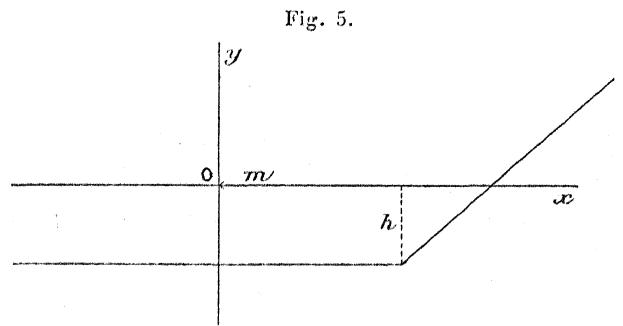

Nous évaluerons cette espérance :

${ \bar { \mathbf { I } } } ^ { 0 }$ Pour les cours compris entre -- ∞ et $m ,$

${ \mathfrak { z } } ^ { 0 }$ )) )) m et $m + h ,$ $3 ^ { \mathrm { o } }$ )) ) $m + \not { h } { \mathrm { ~ e t ~ } } + \infty .$

Ann. de l'Éc. Normale. 3° Série. Tome XVII. — FévRiER 1goo.

<!-- page: 31 -->

${ \bf \cal I } ^ { \mathrm { ~ o ~ } }$ Pour tous les cours compris entre $+ \infty$ et $m _ { i }$ , la prime est abandonnée, c'est-à-dire que l'acheteur subit une perte $\lambda .$ Son espérance mathématique pour un cours compris dans l’intervalle donné est done $\cdots { p h }$ et pour tout l’intervalle

$$
\cdots h \int \limits _ { \cdots } ^ { \prime \prime } p d x .
$$

$2 ^ { \circ }$ Pour un cours x compris entre m et $m + h$ , la perte de l’acheteur sera $m + \lambda - x$ ; l’espérance mathématique correspondante sera $- p ( m + h - x )$ et pour l’intervalle entier

$$
- \int _ { m } ^ { m + h } p ( m + h - x ) d x .
$$

$3 ^ { \circ }$ Pour un cours x compris entre $m + h$ et ${ \mathfrak { o o } } ,$ le bénéfice de l'acheteur sera $x - m \mathrm { \ldots } h$ ; l’espérance mathématique correspondante sera $p ( x - m - h )$ et pour tout l'intervalle

$$
\int _ { m + h } ^ { \infty } p \left( x - m \ldots h \right) d x .
$$

Le principe de l'espérance totale donnera donc

$$
\int _ { m + h } ^ { \infty } p ( x - m - h ) d x - \int _ { m } ^ { m + h } p ( m + h \cdots , x ) d x - h \int _ { - \infty } ^ { m } p d x = 0
$$

ou, en faisant les réductions,

$$
h + m \int _ { \cdot n } ^ { \cdot \infty } I ^ { \prime } d x = \int _ { m } ^ { \cdot \infty } p \cdot x d x .
$$

Telle est l’équation aux intégrales définies qui établit une relation entre les probabilités, les écarts de prime et leur importance.

Dans le cas où le pied de la prime tomberait du côté des x négatifs, comme le montre la ${ \mathcal { A } } g .$ $\mathrm { 6 , }$ m serait négatif et l’on arriverait à la relation

$$
\frac { \ d _ { 2 } h + m } { \ d z ^ { 2 } } + \ d z m \int _ { 0 } ^ { \cdots } \ d z p d x = \int _ { - m } ^ { \infty } p \ d x d x ,
$$

Par suite de la symétrie des probabilités, la fonction p devant être

<!-- page: 32 -->

paire, il en résulte que les deux équations ci-dessus n'en forment qu’une.

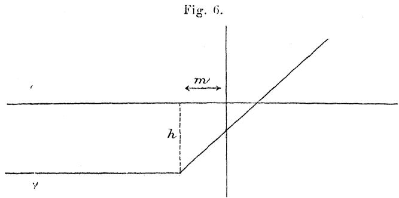

En différentiant, on obtient l'équation différentielle des écarts de prime

$$
{ \frac { c l ^ { 2 } h } { d m ^ { 2 } } } = = p _ { \ m } ,
$$

$p _ { m }$ étant l'expression de la probabilité dans laquelle on a remplacé x par m.

Prime simple. — Le cas le plus simple des équations ci-dessus est celui où $m = 0$ , c’est-à-dire celui où l’importance de la prime est égale à son écart. On appelle prime simple cette sorte de prime, la seule que l'on traite dans la spéculation sur les marchandises.

Les équations ci-dessus deviennent, en posant $m = 0$ et en désignant par a la valeur de la prime simple,

$$
a = \int _ { 0 } ^ { \infty } p x d x = \int _ { 0 } ^ { \infty } \frac { x } { 2 \pi k \sqrt { \bar { \ell } } } e ^ { - \frac { \bar { \nu } ^ { 2 } } { 4 \pi k ^ { \prime } \bar { \ell } } } d x = k \sqrt { \bar { \ell } } .
$$

L’égalité $a = = \int _ { 0 } ^ { \infty } l$ ox dx montre que la prime simple est égale à l’espérance positive de l'acheteur ferme; ce fait est évident, puisque le preneur de prime verse la somme a au donneur pour jouir des avantages de l’acheteur ferme, c’est-à-dire pour avoir son espérance positive sans encourir ses risques.

De la formule

$$
a = \int ^ { \infty } p x d x = k \sqrt { l } ,
$$

<!-- page: 33 -->

nous déduisons le principe suivant, un des plus importants de notre étude :

La valeur de la prime simple doit être proportionnelle à la racine carree du temps.

Nous avons vu précédemment que l'écart probable était donné par la formule

$$
\alpha { = } \mathrm { { r } } , 6 8 8 \mathrm { { \mathit { k } } } \sqrt { t } { = } \mathrm { ~ } \mathrm { { \mathit { r } } } , 6 8 8 \mathrm { { \mathit { a } } } .
$$

L'écart probable s'obtient donc en multipliant la prime moyenne par le nombre constant 1,688; il est donc très facile à calculer quand il s’agit de spéculations sur les marchandises puisque, dans ce cas, la quantité a est connue.

La formule suivante donne l’expression de la probabilité en fonction dc a

$$
p = { \frac { 1 } { 2 \pi a } } c ^ { - { \frac { x ^ { 2 } } { 6 \pi a ^ { 2 } } } } .
$$

La probabilité dans un intervalle donné aura pour expression l’intégrale

$$
\frac { \pi } { 2 \pi a } \int _ { 0 } ^ { \pi } e ^ { - \frac { x ^ { n } } { 4 \pi a ^ { n } } } d . x
$$

ou

$$
\frac { 1 } { 2 \pi a } \biggl ( u - \frac { u ^ { 3 } } { 1 2 \pi a ^ { 2 } } + \frac { u ^ { 3 } } { 1 6 0 \pi ^ { 2 } a ^ { 4 } } - \frac { u ^ { 7 } } { 2 ( 3 7 8 \pi ^ { 3 } a ^ { 4 } } + \cdot \cdot \cdot \biggr ) .
$$

Cette probabilité est indépendante de a et, par suite, du temps, si u $u ,$ au lieu d’être un nombre donné, est un paramètre de la forme $\pmb { u } = l , \boldsymbol { u }$ par exemple, si $u = a ,$

$$
\begin{array} { r } { \int _ { 0 } ^ { \prime \prime } p d x = \frac { 1 } { 2 \pi } - \frac { 1 } { 2 4 \pi ^ { 2 } } + \frac { 1 } { 3 2 0 \pi ^ { 3 } } - \ldots = 0 , 1 5 5 . } \end{array}
$$

L’intégrale f p dx représente la probabilité de réussite du preneur $\int _ { \pi } ^ { \infty } p$ de prime simple. Or

$$
\begin{array} { r } { \int _ { a } ^ { \infty } p d x = \frac { \eta } { 2 } - \int _ { 0 } ^ { \epsilon t } p d x = \mathrm { o } , 3 4 5 . } \end{array}
$$

<!-- page: 34 -->

Donc :

La probabilité de réussite du preneur de prime simple est indépendante de l’époque de l’échéance; elle a pour valeur

$$
\mathrm { { o , 3 / 5 } . }
$$

L’espérance positive de la prime simple a pour expression

$$
\int _ { x } ^ { \infty } p ( x - a ) d x = \mathrm { o } , 5 8 \alpha .
$$

Double prime. - Le stellage ou double prime est formé de l'achat simultané d’une prime à la hausse et à la baisse (primes simples). Il est facile de voir que le donneur de stellage est en bénéfice dans l’intervalle $\ldots _ { 2 a } , \ldots _ { 2 a } ,$ sa probabilité de réussite est donc

$$
^ { 2 } \int _ { 0 } ^ { \infty } p d x = { \frac { 3 } { \pi } } - { \frac { 2 } { 3 \pi ^ { 2 } } } \cdots { \frac { 2 } { 1 0 \pi ^ { 3 } } } - \cdot \cdot = \mathrm { o } , 5 6 .
$$

La probabilité du preneur de stellage est $\mathbf { 0 } , \langle \mathbf { \hat { J } } | \langle \mathbf { \hat { J } } |$

Espérance positive du stellage

$$
{ } ^ { 2 } \int _ { \psi _ { d } } ^ { \varphi } p \left( x \cdots 3 a \right) d x = 0 , 5 5 \alpha .
$$

Coefficient d'instabilité. — Le cocfficient k, précédemment introduit, est le coefficient d’instabilité ou de nervosité de la valeur, c’est lui qui mesure son état statique. Sa tension indique un état d’inquiétude; sa faiblesse, au contraire, est l’indice d'un état de calme.

Ce coefficient est donné directement dans la spéculation sur les marchandises par la formule

$$
a \equiv { \mathit { k } } \sqrt { t } ,
$$

mais dans la spéculation sur les valeurs on ne peut le calculer que par approximation, comme nous allons le voir.

Série des écarts de prime. — L'équation aux intégrales définies des écarts de prime n'est pas exprimable en termes finis quand la quan-

<!-- page: 35 -->

tité ${ \boldsymbol { n 2 } } _ { \mathrm { { i } } }$ , différence entre l’écart de la prime et son importance $h ,$ n’est pas nulle.

Cette équation conduit à la série

$$
h - \alpha + \frac { m } { 2 } - \frac { m ^ { 2 } } { 4 \pi \alpha } + \frac { m ^ { 4 } } { 9 6 \pi ^ { 2 } \alpha ^ { 3 } } - \frac { m ^ { 6 } } { 1 9 2 0 \pi ^ { 3 } \alpha ^ { 3 } } \cdots = \dots = 0 .
$$

Cette relation, dans laquelle la quantité a désigne l’importance de la prime simple, permet de calculer la valeur de a quand on connait celle de $m ,$ ou inversement.

Loi approximative des écarts de prime. - La série qui précède peut s'écrire

$$
h = a \cdots f ( m ) .
$$

Considérons le produit de la prime $\boldsymbol { h }$ par son écart $( m + h )$

$$
h ( m + h ) = [ a - f ( m ) ] [ m + a - f ( m ) ] ;
$$

dérivons-en m, nous aurons

$$
\frac { d } { d m } [ h ( m + h ) ] = f ^ { \prime } ( m ) \left[ m + \alpha - f ( m ) \right] + [ \alpha - f ( m ) ] \left[ 1 \cdots f ^ { \prime } ( m ) \right] .
$$

Si nous posons $m = 0 ,$ d'où $\begin{array} { r } { f ( m ) = 0 , f ^ { \prime } ( m ) = \frac { 1 } { 2 } , } \end{array}$ , cette dérivée s’annule; nous devons en conclure que :

Le produit d’une prime par son écart est maximum quand les deux facteurs de ce produit sont égaux : c’est le cas de la prime simple.

Dans les environs de son maximum, le produit en question doit peu varier. C’est ce qui permet souvent de déterminer approximativement a par la formule

$$
\begin{array} { r } { h \left( m + \boldsymbol { J } _ { l } \right) = a ^ { 2 } , } \end{array}
$$

elle donne pour a une valeur trop faible.

En ne considérant que les trois premiers termes de la ${ \mathrm { s e r i e } } ,$ on obtient

$$
\hbar ( h + m ) = a ^ { 2 } - \frac { m ^ { 2 } } { 4 } ,
$$

qui donne pour a une valeur trop forte.

<!-- page: 36 -->

Dans la plupart des cas, en prenant les quatre premiers termes de la série, on obtiendra une approximation très suffisante; on aura ainsi

$$
\alpha = \frac { \pi ( 2 h + m ) \pm \sqrt { \pi ^ { 2 } ( 2 h + m ) ^ { 2 } - 4 \pi m ^ { 2 } } } { 4 \pi } .
$$

Avec cette même approximation on aura pour valeur de m en fonction de a

$$
\begin{array} { r } { m = \pi a \pm \sqrt { \pi ^ { 2 } a ^ { 2 } - 4 \pi a ( a - h ) } . } \end{array}
$$

Admettons pour un instant la formule simplifiée

$$
\lambda ( m + h ) = a ^ { 2 } = \lambda ^ { 2 } \ell .
$$

Dans la spéculation sur les valeurs les primes à la hausse ont une importance h constante, l'écart $m + h$ est donc proportionnel au temps.

L’écart des primes à la hausse, dans la spéculation sur les valeurs, est sensiblement proportionnel à la durée de leur échéance et au carré de l’instabilité.

Les primes à la baisse, sur les valeurs (c'est-à-dire, la vente ferme contre achat à prime) ont un écart h constant et une importance $m + h$ variable. Donc :

L’importance des primes à la baisse, dans la spéculation sur les valeurs, est sensiblement proportionnelle à la durée de leur échéance et au carré de l’instabilité.

Les deux lois qui précèdent ne sont qu’approchées.

Options. - Appliquons le principe de l'espérance mathématique à l'achat d'une option d’ordre n traitée à l'écart r.

L'option d'ordre n peut être considérée comme se composant de deux opérations :

$\textbf { I } ^ { \mathbf { o } }$ Un achat ferme d’une unité au cours r;

${ \bf { \vec { 2 } } } ^ { 0 }$ Un achat ferme de $( n \mathrm { ~ - ~ } \mathtt { i } )$ unités au cours $r ,$ cet achat n'étant à considérer que dans l’intervalle $r , \infty .$

<!-- page: 37 -->

La première opération a pour espérance mathématique $\cdots r .$ la seconde a pour espérance

$$
{ \left( { n \mathrm { \ : - \ : 1 } } \right) } \int _ { r } ^ { \infty } p \left( { x \mathrm { : } { x \mathrm { : } { r \mathrm { : } { r } } } } \right) d x .
$$

On doit donc avoir

$$
r = ( n - 1 ) \int _ { \nu } ^ { \infty } p \left( x \cdots r \right) d x \cdot
$$

ou, en remplaçant p par sa valeur, $p$

$$
p = \frac { { \mathbf { r } } } { 2 \pi a } \widetilde { c } ^ { - \frac { x } { 4 \pi a ^ { 2 } } } ,
$$

$\operatorname { e t } ,$ en développant en série,

$$
2 \pi \alpha ^ { 2 } - \pi \dot { \alpha } \frac { n + 1 } { n - 1 } r + \frac { r ^ { 2 } } { 2 } - \frac { r ^ { 4 } } { 4 8 \pi a ^ { 2 } } + \ldots = 0 ,
$$

En ne conservant que les trois premiers termes, on obtient

$$
r = a \bigg [ \frac { n + 1 } { n - 1 } \pi - \sqrt { \Big ( \frac { n + 1 } { n - 1 } \pi \Big ) ^ { 2 } - 4 \pi } \bigg ] .
$$

Si $n = 2 ,$

$$
r = \ldots 0 , \ell 8 a .
$$

L’écart de l’option du double doit être environ les deux tiers de la valeur de la prime simple.

Si $n = 3 .$

$$
r \simeq { \mathfrak { r } } , { \mathfrak { o g } } { \mathfrak { d } } ,
$$

L’écart de l’option du triple doit être supéricur de un dixième environ à la valeur de la prime simple.

Nous venons de voir que les écarts des options sont approximativement proportionnels à la quantité a.

Il en résulte que la probabilité de réussite de ces opérations est indépendante de la durée de l’échéance.

La probabilite de réussite de l’option du double est $\mathrm { o , 3 9 4 }$ , l’opération réussit quatre fois sur dix.

<!-- page: 38 -->

La probabilité de l’option du triple est o,33, l’opération réussit une foιs sur trois.

L’espérance positive de l’option d’ordre n est

$$
n \int _ { r } ^ { \infty } p ( x \gets r ) d x ,
$$

et comme

$$
\frac { \prime } { n - 1 } = \int _ { r } ^ { \infty } p \left( x - r \right) d x ,
$$

l’espérance cherchée a pour valeur ${ \underset { n \ldots n } { \underbrace { n } } } r ,$ c’est-à-dire 1,36a pour l’option du double et t,64a pour l’option du triple.

En vendant ferme et en achetant simultanément une option du double, on obtient une prime dont l’importance est $r = \cdot \mathrm { _ { 0 } } , 6 8$ a et dont l'écart est le double de $r _ { \ast }$

La probabilité de réussite de l’opération est $\mathbf { o } , 3 \mathbf { \mathfrak { c } }$

Par analogie avec les opérations à prime, nous appellerons optionstellage d’ordre n, l’opération résultant de deux options d’ordre n, à la hausse et à la baisse.

L’option stellage du second ordre est une opération fort curieuse; entre les cours ± rla perte est constante et égale à 2r. La perte diminue ensuite progressivement jusqu’aux cours $\mathrel { \mathop : } \mathrel { \mathop : } 3 r ,$ où elle s’annule.

Il y a bénéfice en dehors de l’intervalle $\yen 3r$

La probabilité est ${ \bf ( ) , / _ { \ell } } \mathrm { { ^ { } } }$

## OPÉRATIONS FERMES.

Maintenant que nous avons achevé l’étude générale des probabilités nous allons l’appliquer à la recherche des probabilités des principales opérations de bourse en commençant par les plus simples, les opérations fermes et les opérations à prime, et nous terminerons par l’étude des combinaisons de ces opérations.

La théorie de la spéculation sur les marchandises, beaucoup plus simple que celle des valeurs, a déjà été traitée; nous avons, en effet,

Ann, de l'Ée, Normale. 3° Série Tome XVII. - FévRiR 'Goo.

<!-- page: 39 -->

[Table source crop](assets/tables/1900-bachelier-theorie-de-la-speculation-p0039-block-0001-0bfa2f1f0c324fae.jpg)

calculé la probabilité et l’espérance des primes simples des stellages et des options.

La théorie des opérations de bourse dépend de deux coefficients : b et $k .$ T

Leur valeur, à un instant donné, peut se déduire facilement de l’écart du terme au comptant et de l’écart d’une prime quelconque.

Dans l’étude qui va suivre, nous ne nous occuperons que de la rente $3 \ \%$ , qui est une des valeurs sur laquelle on traite régulièrement des primes.

Nous prendrons pour valeurs de b et k leurs valeurs moyennes pour les cinq dernières années (1894 à 1898), c'est-à-dire

$$
\begin{array} { l } { { b = \mathrm { ~ o ~ } , 2 6 4 , } } \\ { { \mathit { k } : \dots \mathrm { ~ f } _ { 5 } ^ { * } } } \end{array}
$$

(le temps est exprimé en jours et l’unité de variation est le centime).

Nous entendrons par valeurs calculées celles qui sont déduites des formules de la théorie avec les valeurs ci-dessus données aux constantes b et k.

Les valeurs obsercées sont celles que l’on déduit directement de la compilation des cotes durant ce même espace de temps de i894 à 1898 (').

Dans les Chapitres qui vont suivre nous aurons constamment à connaître les valeurs moyennes de la quantité aà différentes époques : la formule

donne

$$
a \cdots 5 \sqrt { \ell }
$$

Pour un jour, il semble que l'on devrait avoir $a = 5$ ; mais dans tous les calculs de probabilités où il s’agit de moyennes on ne peut poser t = 1 pour un jour.

(1) Toutes les observations sont extraites de la Cote de la Bourse et de la Banque.

<!-- page: 40 -->

En effet, il y a 365 jours dans l’année, mais seulement 3o7 jours de: bourse. Le jour moyen de la bourse est donc $\ell = \frac { 3 6 5 } { 3 0 7 } .$ il donne

$$
a \equiv 5 , 4 5 .
$$

On peut faire la même remarque pour le coefficient b. Dans tous les calculs relatifs à un jour de bourse on doit remplacer b par ${ \boldsymbol { b } } _ { \mathfrak { i } } = { \frac { 3 6 5 } { 3 0 7 } } { \boldsymbol { b } } = { \mathfrak { o } } , { \mathfrak { 3 } } { \mathfrak { i } } ^ { \ 3 }$

Écart probable. — Cherchons l'intervalle de cours $( - a , + a )$ tel que, au bout d’un mois, la rente ait autant de chances de se trouver dans cet intervalle que de chances de se trouver en dehors.

On devra avoir

$$
\int \limits _ { 0 } ^ { \cdot \alpha } p d x = \frac { 1 } { 4 } ,
$$

d’où

$$
a = \cdots \pm 1 = 4 6 .
$$

Pendant les 6o derniers mois, 33 fois la variation a été circonscrite entre ces limites et 27 fois elle les a dépassées.

On peut chercher de même l’intervalle relatif à un jour; on a ainsi

$$
a : \cdots : f ( f ) .
$$

Sur $\mathbf { I } \left. \mathcal { \tilde { \mathbf { I } } } \right. \mathcal { \tilde { \mathbf { \Lambda } } }$ 2 observations, 815 fois la variation a été inférieure à $9 ^ { \mathfrak { N } }$

Dans la question qui précède, nous avons supposé que le cours coté se confondait avec le cours vrai; dans ces conditions, la probabilité et l’espérance mathématique de l’acheteur et du vendeur sont les mêmes. En réalité, le cours coté est inférieur au cours vrai de la quantité ${ \mathit { n l } } .$ , si n est le nombre de jours séparant de l’échéance.

L’écart probable de $\langle { j } ( \flat ^ { \prime \prime } ) ^ { \prime } | \flat ^ { \prime \prime } \rangle$ de part et d’autre du cours vrai correspond à l’intervalle compris entre $5 \% ^ { e }$ en hausse au-dessus du cours coté et $3 8 ^ { \mathfrak { c } }$ en baisse au-dessous de ce cours.

Formule de la probabilité dans le cas général. - Pour trouver la probabilité de la hausse pour une période de n jours, il faut connaître l’écart nb du cours vrai au cours coté; la probabilité est alors égale à

<!-- page: 41 -->

$$
\int _ { - n \mu } ^ { + \infty } p \ d \boldsymbol { x } .
$$

La probabilité de la baisse sera égale à l’unité diminuée de la probabilité de la hausse.

Probabilité de l'achat au comptant. Cherchons la probabilité de réussite d’un achat au comptant destiné à ètre revendu dans 3o jours.

On doit remplacer dans la formule précédente la quantité nb par 25. La probabilité est alors égale à o,64 :

L’opération a deux chances sur trois de réussir.

Si l'on veut avoir la probabilité pour un an, on doit remplacer la quantité nb par 3oo. La formule $a = k \sqrt { t }$ donne

$$
( \mathcal { t } \cong 9 ^ { 5 } , 5 .
$$

On trouve que la probabilité est

$$
{ \mathrm { o } } , 8 { \mathfrak { g } } .
$$

Neuf fois sur dix un achat de rente au comptant produit un bénéfice au bout d’un an.

Probabilité de l'achat ferme. Cherchons la probabilité de réussite d'un achat ferme effectué au début du mois.

On a

$$
n \not = 7 , 9 1 , \qquad n = 2 7 , 3 8 .
$$

On en déduit que :

$$
\begin{array} { r l r } { \mathrm { { I . a ~ p r o b a b i l i t 4 ~ d o ~ l a ~ h a u n s s e ~ c s t } ~ } , } & { { } \ldots \ldots \ldots \ldots } & { \ldots } & { \mathrm { ~ o , ~ } \hat { \mathfrak { h } } ^ { \prime } } \\ { \mathfrak { n } } & { { } } & { { \mathrm { b a i s s s t } } } & { { } \ldots \ldots \ldots \ldots } & { \ldots } & { \mathrm { ~ o , ~ } \hat { \mathfrak { h } } ^ { \prime } } \end{array}
$$

La probabilité de l’achat croît avec le temps; pour un an, on a

$$
n = 3 6 5 , \qquad n b = 9 6 , 3 6 , \qquad a = 9 5 , 5 .
$$

La probabilité a alors pour valeur o,65.

Quand on effectue un achat ferme pour le revendre au bout d'un an, on a deux chances sur trois de réussir.

<!-- page: 42 -->

Il est évident que si le report mensuel était de $2 5 ^ { \mathrm { c } }$ la probabilité de l'achat serait $\mathbf { 0 } , 5 \mathbf { 0 }$

Avantage mathématique des opérations fermes. — Il me paraît indispensable, comme je l’ai déjà fait remarquer, d’étudier l’avantage mathématique d’un jeu dès qu’il n’est pas équitable, et c’est le cas des opérations fermes.

Si nous supposons $b = 0$ , l'espérance mathématique de l'achat ferme est $a - a = 0$ . L'avantage de l'opération est $\begin{array} { r } { \frac { a } { 2 a } = \frac { 1 } { 2 } } \end{array}$ comme d’ailleurs dans tout jeu équitable.

Cherchons l’avantage mathématique d’un achat ferme de n jours en supposant $b > 0$ . L'acheteur aura, pendant cette période, touché la somme nb provenant de la différence entre les coupons et les reports, et son espérance sera $a \dots a \dots n b$ ; son avantage mathématique sera donc

$$
\begin{array} { c } { { a + n b } } \\ { { \geq a + n b } } \end{array} .
$$

L’avantage du vendeur serait

$$
\frac { a } { 2 a + n b } .
$$

Occupons-nous spécialement du cas de l’acheteur.

Quand $b > 0$ son avantage mathématique croît de plus en plus avec n; il est constamment supérieur à la probabilité.

Pour un mois, l'avantage de l'acheteur est o,563 et sa probabilité o,55. Pour un an, son avantage est o,667 et sa probabilité $_ { 0 , 6 5 }$

On peut donc dire que :

L’avantage d’une opération ferme est à peu près égal à sa probabilité.

## OPÉRATIONS A PRIME.

Écart des primes. Connaissant la valeur de a pour une époque donnée, on calcule facilement l'écart vrai par la formule

$$
m = \pi a \pm \sqrt { \pi ^ { 2 } \alpha ^ { 2 } - 4 \pi a ( a - h ) } .
$$

<!-- page: 43 -->

Connaissant l'écart vrai on obtient l'écart coté en ajoutant la quantité $n b$ à l’écart vrai; n est le nombre de jours qui séparent de la ré- ponse.

Dans le cas d'une prime fin prochain, on ajoute la quantité $[ 2 5 + ( n - 3 0 ) b ]$

On arrive ainsi aux résultats suivants :

[Table source crop](assets/tables/1900-bachelier-theorie-de-la-speculation-p0043-block-0004-05230f3c0b916ba5.jpg)
Primes dont 50.

[Table source crop](assets/tables/1900-bachelier-theorie-de-la-speculation-p0043-block-0005-127cb8cad6f993a2.jpg)
Primes dont 25.

[Table source crop](assets/tables/1900-bachelier-theorie-de-la-speculation-p0043-block-0006-820a22f2b0d801ab.jpg)
Primes dout 1o.

Dans le cas de la prime dont 5º pour le lendemain nous avons

$$
h \equiv 5 , \qquad a \equiv 5 , 4 5
$$

d’où

$$
I { \boldsymbol { \eta } } \mathrel { \mathop { : - } } \mathrel {  {  { / { \vphantom { | { \boldsymbol { \zeta } } | } }  \kern - delimiterspace } 2 }  \kern - delimiterspace } 2
$$

l’écart vrai est donc 5,81 ; en y ajoutant $b _ { 1 } = \frac { 3 6 5 } { 3 0 7 } b = 0 ,$ 31 on obtient l’écart calculé 6,12.

La moyenne des cinq dernières années donne 7,36.

<!-- page: 44 -->

Les chiffres observés et calculés concordent dans leur ensemble, mais ils présentent certaines divergences qu’il est indispensable d’expliquer.

Ainsi l’écart observé de la prime dont 1o à 3o jours est trop faible; il est facile d’en comprendre la raison : Dans les périodes très mouvementées, alors que la prime dont to serait à un très fort écart, on ne cote pas cette prime ; la moyenne observée se trouve done diminuée de ce fait.

D'autre part, il n’est pas niable que le marché ait eu, pendant plusicurs années, une tendance à coter à de trop forts écarts les primes à courtes échéances; il se rend d’autant moins compte de la juste proportion des écarts que ceux-ci sont plus petits et que l’échéance est plus proche.

Il faut cependant ajouter qu’il semble s’être aperçu de son erreur, car en 1898 il a paru exagérer dans le sens inverse.

Probabilité de levée des primes. — Pour qu'une prime soit levée, il faut que le cours de la réponse des primes soit supérieur au cours du pied de la prime; la probabilité de levée est donc exprimée par l’intégrale

$$
\int _ { \mathbb { z } } ^ { \infty } p d x ,
$$

ε étant le cours vrai du pied de la prime.

Cette intégrale est facile à calculer, comme on l'a vu précédemment; elle conduit aux résultats suivants :

[Table source crop](assets/tables/1900-bachelier-theorie-de-la-speculation-p0044-block-0009-98461628415bf520.jpg)
Probabilité de levée des primes dont 5o.

<!-- page: 45 -->

Probabilité de levée des primes dont to.

[Table source crop](assets/tables/1900-bachelier-theorie-de-la-speculation-p0045-block-0002-98581805c93f6241.jpg)

On peut dire que les primes $/ 5 \sigma$ sont levées trois fois sur quatre, les primes $/ 2 5$ deux fois sur quatre et les primes $/$ to une fois sur quatre.

La probabilité de levée de la prime dont $5 "$ pour le lendemain est, d'après le calcul : $_ { ( ) , \ / \ / 8 }$ ; le résultat de $\mathfrak { r } / \mathfrak { j } ^ { \mapsto } \mathcal { G }$ observations donne $6 { \scriptstyle 7 ^ { \mathtt { I } } }$ primes certainement levées et $\boldsymbol { \mathrm { 7 6 } }$ dont la levée est douteuse; en comptant ces $7 ^ { 6 }$ dernières primes la probabilité serait $( ) , 5 , 1$ , en ne les comptant pas elle serait $_ { 0 , \ell \ell }$ , soit en moyenne $_ { ( ) , / \ell } 8$ comme l’indique la théorie.

Probabilité de bénéfice des primes. - Pour qu'une prime donne du bénéfice à son acheteur, il faut que la réponse des primes se fasse à un cours supérieur à celui de la prime. La probabilité de bénéfice est donc exprimée par l’intégrale

$$
\int _ { \tilde { c } _ { 1 } } ^ { \infty } p d \tilde { c } r ,
$$

$\varepsilon _ { \pmb { \imath } }$ étant le cours de la prime.

Cette intégrale conduit aux résultats ci-après :

[Table source crop](assets/tables/1900-bachelier-theorie-de-la-speculation-p0045-block-0009-cad7e05c924fb85e.jpg)
Probabilité de bénéfice des primes dont 50.

Probabilité de bénéfice des primes dont 25. $^ { \cdot \ j \uparrow }$

[Table source crop](assets/tables/1900-bachelier-theorie-de-la-speculation-p0045-block-0011-c390987cd9d86eaa.jpg)

<!-- page: 46 -->

Probabilité de béuéfice des primes dout 1o.

[Table source crop](assets/tables/1900-bachelier-theorie-de-la-speculation-p0046-block-0002-224c7cc8f7359e85.jpg)

On voit qu’entre les limites ordinaires de la pratique, la probabilité de réussite de l'achat d'une prime varie peu. L’achat $\tilde { / 5 } 0$ réussit quatre fois sur dix, l'achat $/ { : : } \tilde { . }$ trois fois sur dix et l’achat $/ \mathrm { ~ r ~ o ~ }$ deux fois sur dix.

D’après le calcul, l’acheteur de prime dont $5 \mathrm { e }$ pour le lendemain a une probabilité de réussite de $( 1 , 3 / 1$ , l'observation de $\iota / \vert \tilde { \cdot } \rangle \ell \rangle$ cotes montre que /1o primes auraient certainement donné des bénéfices et que 8o autres donnent un résultat douteux, la probabilité observée est donc $( ) , 3 1$

## OPÉRATIONS COMPLEXES.

Classification des opérations complexes. — Comme on traite du ferme et souvent jusqu'à trois primes pour la même échéance, on pourrait entreprendre en mème temps des opérations triples et même quadruples.

Les opérations triples sortent déjà du nombre de celles que l’on peut considérer comme classiques, leur étude est très intéressante, mais trop longue pour pouvoir ètre exposée ici. Nous nous bornerons done aux opérations doubles.

On peut les diviser en deux groupes suivant qu’elles contiennent ou non du ferme.

Les opérations contenant du ferme se composeront d’un achat ferme et d’une vente à prime, ou inversement.

Les opérations à primne contre prime consistent dans la vente d’une grosse prime suivie de l’achat d’une petite, ou inversement.

La proportion des achats et des ventes peut d’ailleurs varier à l’infini. Pour simplifier la question, nous n’étudierons que deux proportions très simples :

${ \mathfrak { t } } ^ { 0 }$ La seconde opération porte sur le même chiffre que la première. Ann. do $\iota ^ { \prime } \not { F } e .$ Normale. 3\* Série. Tome XVII. - Fevrien 1goo. 9

<!-- page: 47 -->

$\mathbf { \underline { { \sigma } } } ^ { 0 }$ Elle porte sur un chiffre double.

Pour fixer les idées, nous supposerons que l’on opère au début du mois et nous prendrons pour écarts vrais les écarts moyens depuis cinq ans $\mathbf { : } ~ 1 2 , \bar { 7 } 8 / 5 0 , ~ 2 9 , 8 7 / 2 5$ et $^ { \mathrm { 5 8 , 2 8 / \mathfrak { n } 0 } }$

Nous remarquerons aussi que pour les opérations à un mois le cours vrai est plus élevé que le cours coté, de la quantité $7 \vartheta \vartheta \stackrel { \cdot \cdot \cdot } { \longrightarrow } \stackrel { \cdot \rangle \ j _ { 0 } \bar { \psi } } { \longrightarrow } \vartheta$

Achat ferme contre vente à prime. On achète en réalité du ferme au cours $- 3 \mathrm { o } b = - 7 , \Game$ : et l'on vend à prime $\big / \mathfrak { R } \overset { \ ! } { \underset { } { \mathrm { ! } } }$ au cours $- \boldsymbol { \downarrow } , \boldsymbol { \rangle } , \boldsymbol { \ S } ,$

Il est facile de représenter l’opération par une construction géomé- trique $( \mathrm { \it { / } f g } . \mathrm { \it { ~ 7 } ) }$ : l'achat ferme est représenté par la droite AMB:

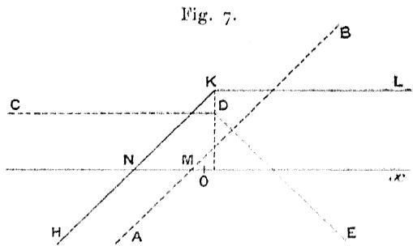

$\mathbf { M } ( ) = 3 \mathbf { \Lambda } _ { 0 } \mathbf { \Lambda } _ { b }$ . La vente à prime est représentée par la ligne brisée CDE, l’opération résultante sera représentée par la ligne brisée HNKL, l’abscisse du point N sera

$$
\ldots ( 2 5 \div 3 0 \mathit { l } ) .
$$

On voit que l’opération donne un bénéfice limité égal à l'écart coté de la prime; à la baisse, le risque est illimité.

La probabilité de réussite de l’opération est exprimée par l’intégrale

$$
\int _ { - \infty } ^ { + \infty } \ d t + \infty \int _ { - \infty } ^ { + \infty } \ d t + \infty , \beta \in
$$

Si l'on avait vendu une prime /5o 1 $/ \mathrm { \tilde { / } { 0 } }$ la probabilité de réussite aurait $\acute { \varrho } \ell \mathrm { : } \doteq \mathrm { o } , 8 \mathrm { o }$

Il est intéressant de connaître la probabilité dans le cas d’un report de $2 5 ^ { \circ } \left( { \mathit { b } } = { \mathfrak { o } } \right)$ •

<!-- page: 48 -->

67

Cette probabilité est $_ { 0 , 6 \mathsection }$ en vendant $/ 2 5$ et $^ { \mathrm { o } , 7 ^ { \mathrm { 6 } } }$ en vendant $/ 5 \mathrm { o }$

Si l'on revend une prime sur un achat au comptant, la probabilité est ${ \bf \omega } ( ) , { \bf \gamma } _ { 7 } ( \} )$ en revendant $/ { \boldsymbol { \mathrm { 2 5 } } }$ et $_ { 0 , 8 6 }$ en revendant $/ 5 0$

Vente ferme contre achat à prime. — Cette opération est inverse de la précédente; elle donne à la hausse une perte limitée et à la baisse un bénéfice illimité. C’est, par conséquent, une prime à la baisse, prime dont l’écart est constant et l’importance variable, à l’inverse des primes à la hausse.

Achat ferme contre vente du double à prime. On achète ferme au cours vrai $\ldots \ldots ( 3 1 ) \ell$ et l’on vend le double au cours ${ \it 2 3 5 , } 8 7 / 2 . 5$

La $\displaystyle \ddot { } \dot { } \xi ^ { r } .$ ,8 représente géométriquement l’opération; elle montre que le risque est illimité à la hausse comme à la baisse.

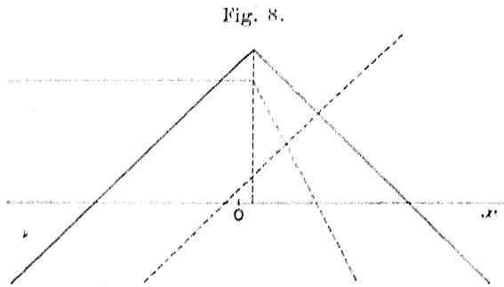

On gagne entre les cours $\ldots \to ( \tilde { \langle \rangle } ( ) \not { \Uparrow } ( ) , \tilde { \rangle } _ { ( ) } / )$ et $5 ( \mathfrak { z } , \triangledown 4 + \mathfrak { z } ) 0 \bar { b }$ . La probabilité de réussite

$$
\int \iota ^ { \prime } d x = \alpha , 6 4 .
$$

En vendant $/ 5 0$ la probabilité serait $_ { 0 , } \{ \} _ { 2 } ^ { \cdot }$ et en vendant /1o on aurait pour probabilité $_ { ( ) , ( ) 2 }$

Si l’on avait acheté 2 unités ferme pour en vendre $3 / 5 \mathrm { o }$ , la probabilité aurait été $_ { ( ) , } \{ \} \{ \}$

Vente ferme contre achat du double à prime. — C'est l'opération in-

<!-- page: 49 -->

verse de la précédente; elle donne des bénéfices dans le cas d’une forte hausse et dans celui d’une forte baisse.

Sa probabilité est : 0,27.

Achat d'une grosse prime contre vente d'une petite. Je suppose: qu’on ait fait simultanément les deux opérations suivantes :

Acheté à..12,78/50 Vendu à ..... 29,87/25

Au-dessous du pied de la grosse prime $( \longrightarrow 3 7 , \sl { : } 2 \sl { : } 2 )$ , les deux primes sont abandonnées et l’on perd 25°.

Λ partir du cours $- 3 7$ , 22 on est acheteur, et au cours de 12,22 l’opération est nulle. On gagne ensuite jusqu’à ce que le pied de la prime /25, c’est-à-dire le cours -+ 4,87 soit atteint.

Alors on est liquidé et l’on gagne l’écart. En baisse on perd done 25°, c’est le risque maximum; en hausse on gagne l’écart.

Le risque est limité, le bénéfice l’est également.

La ${ \bf \nabla } \mathcal { j } _ { \bf \dot { \delta } } \mathrm { \nabla } \beta ^ { \mathrm { * } } \mathrm { \nabla }$ 9 représente géométriquement l’opération.

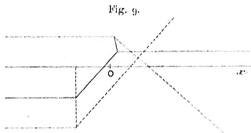

La probabilité de réussite est donnée par l’intégrale

$$
\int _ { - 1 2 , 2 2 } ^ { 1 9 } p \ d x = 0 , 5 9 .
$$

En achetant $/ 2 \tilde { \cdot } \tilde { ) }$ pour vendre $/ \left[ 1 0 \right]$ , la probabilité de réussite serait o,38.

Vente d'une grosse prime contre achat d’une petite. Cette opération, qui est la contre-partie de la précédente, se discute sans difficulté; en

<!-- page: 50 -->

69

baisse on gagne la différence du montant des primes, en hausse on perd leur écart.

Achat d'une grosse prime contre vente d’une petite en quantité double. Je suppose qu’on ait fait l’opération suivante :

12,78/50 Vente du double...................... 29,87/25

En forte baisse, les primes sont abandonnées, elles se compensent; c’est une opération en blanc. Au pied de la grosse prime, c’est-à-dire au cours — 37, 22, on devient acheteur et l’on gagne progressivement jusqu’au pied de la petite $i + 4 , 8 7 ,$ 1

A ce moment, le bénéfice est maximum (42,o9 centimes) et l'on devient vendeur. On reperd progressivement le bénéfice et au cours de $/ _ { 1 } \tilde { . ) } , 9 ^ { ( \mathrm { j } ) }$ ce bénéfice est nul.

Au delà on perd proportionnellement à la hausse.

En résumé, l’opération donne un bénéfice limité, un risque nul à la baisse et illimité à la hausse.

La $/ \xi$ . 1o représente géométriquement l’opération.

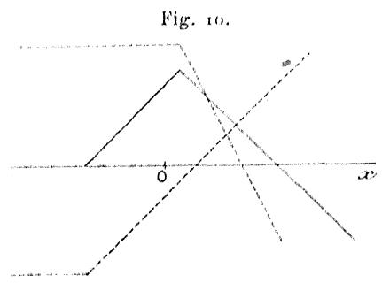

Probabilité de l'opération en blanc........... $_ { 0 , 3 0 }$ de bénéfice............... $\mathbf { o } , \mathbf { \mathcal { G } } ^ { 5 }$ " de perte..... $\mathbf { o } , \mathbf { 2 } 5$

Vente d'une grosse prime contre achat d'une petite en quantité double. La discussion et la représentation géométrique de cette opération, inverse de la précédente, ne présentent aucune difficulté. Il est inutile de nous y arrêter.

<!-- page: 51 -->

Classification pratique des opérations de bourse. Au point de vue pratique, on peut diviser les opérations de bourse en quatre classes :

Les opérations à la hausse.

Les opérations à la baisse.

Les opérations en prévision d’un grand mouvement dans un sens quelconque.

Les opérations en prévision des petits mouvements.

Le Tableau suivant résume les principales opérations à la hausse :

[Table source crop](assets/tables/1900-bachelier-theorie-de-la-speculation-p0051-block-0007-375dd82e41bc4322.jpg)

Il suffit d’inverser ce Tableau pour obtenir l’échelle des opérations à la baisse.

## PROBABILITÉ POUR QU'UN COURS SOIT ATTEINT DANS UN INTERVALLE DE TEMPS DONNÉ.

Cherchons la probabilité P pour qu’un cours donné c soit atteint ou dépassé dans un intervalle de temps t.

Supposons d’abord, pour simplifier, que le temps soit décomposé en deux unités, que t égale deux jours par exemple.

Soit x le cours coté le premier jour et soit y le cours du second jour relativement à celui du premier.

Pour que le cours c soit atteint ou dépassé, il faut que le premier jour le cours soit compris entre c et œ ou que, le second jour, il soit compris entre c — x et ∞,

<!-- page: 52 -->

Dans la question actuelle, il faut distinguer quatre cas :

[Table source crop](assets/tables/1900-bachelier-theorie-de-la-speculation-p0052-block-0002-b0fd42de2b57ac7b.jpg)

Sur ces quatre cas, les trois derniers sont favorables.

La probabilité, pour que le cours se trouve compris dans l’intervalle dx le premier jour et dans l’intervalle dy le second jour, sera $\rho _ { x } p _ { y }$ dx dy.

La probabilité P, étant par définition le rapport du nombre des cas favorables à celui des cas possibles, aura pour expression

$$
\mathbf { p } = { \frac { \int _ { - \infty } ^ { c } \int _ { c - x } ^ { \infty } + \int _ { c } ^ { \infty } \int _ { - \infty } ^ { c - x } + \int _ { c } ^ { \infty } \int _ { c - x } ^ { \infty } } { \int _ { - \infty } ^ { c } \int _ { - \infty } ^ { c - x } + \int _ { c - x } ^ { c } \int _ { c - x } ^ { \infty } + \int _ { c } ^ { \infty } \int _ { c - x } ^ { \infty } } }
$$

(l’élément est $p _ { x } p _ { y }$ dx $d \gamma )$

Les quatre intégrales du dénominateur représentent les quatre cas possibles; les trois intégrales du numérateur représentent les trois cas favorables. On peut simplifier et écrire, le dénominateur étant égal à un,

$$
\begin{array} { r } { \mathbf { P } \mathop { = } \int _ { - \infty } ^ { c ^ { * } } \int _ { c - x } ^ { \infty } p _ { x x } p _ { y } d x d y + \int _ { c } ^ { * } \int _ { - \infty } ^ { \infty } p _ { x } p _ { y } d x d y . } \end{array}
$$

On pourrait appliquer le même raisonnement en supposant que l’on ait à considérer trois jours consécutifs, puis quatre, ete.

Cette méthode conduirait à des expressions de plus en plus compliquées, car le nombre des cas favorables irait sans cesse en augmentant. Il est beaucoup plus simple d'étudier la probabilité ι — P pour que le cours c ne soit jamais atteint.

Il n'y a plus alors qu'un seul cas favorable quel que soit le nombre de jours, $\mathrm { c } '$ est celui où le cours n’est atteint à aucun des jours considérés.

<!-- page: 53 -->

La probabilité 1 — P a pour expression

$$
\mathbf { \Phi } _ { \Gamma \longrightarrow } \dot { \mathbf { P } } = \int _ { - \infty } ^ { c } \int _ { - \infty } ^ { c - x _ { 1 } } \int _ { - \infty } ^ { c - x _ { , - } - x _ { 2 } } \cdot \cdot \cdot \int _ { - \infty } ^ { c - x _ { 1 } \dots - x _ { n - 1 } } p _ { x _ { 1 } } \cdot \cdot \cdot p _ { x _ { n } } d x _ { 1 } \cdot \cdot \cdot d x _ { n } ,
$$

$x _ { \uparrow }$ est le cours du premier jour;

$x _ { \mathrm { { 2 } } }$ est le cours du second jour relativement à celui du premier;

$x _ { 3 }$ est le cours relatif du troisième jour, etc.

La détermination de cette intégrale paraissant difficile, nous résoudrons la question en employant une méthode d’approximation.

On peut considérer le temps t comme divisé en petits intervalles ∆t de telle sorte que $t = m \Delta t .$ Pendant l’unité de temps $\Delta t$ , le cours ne variera que de la quantité ± ∆x, écart moyen relatif à cette unité de temps.

Chacun des écarts ± ∆x aura pour probabilité ${ \bf \Xi } _ { ; } ^ { \dag } ,$

Supposons que $c = \pi \Delta x$ et cherchons la probabilité pour que le cours c soit atteint précisément à l’époque $\iota ;$ c’est-à-dire pour que ce cours soit atteint à cette époque t, sans l’avoir jamais été antérieurement. Si, pendant les m unités de temps, le cours a varié de la quantité n∆x, c’est qu'il y a eu $\operatorname* { m } _ { m \infty } ^ { m + n }$ variations en hausse et $\begin{array}{c} \begin{array} { c } { { \prime \prime \prime } } \\ { { \cdots } } \\ { { \gamma } } \end{array} , \begin{array} { c } { { / { \ell } } } \\ { { \cdots } } \\ { { \Gamma } } \end{array} \\ { { \langle } } \end{array}$ variations en baisse.

La probabilité pour que, sur m variations, il $\mathrm { y }$ en ait eu $\stackrel { \prime \prime \prime } { \dots } { } _ { \stackrel { \scriptstyle \cdots } { \ddots } } + \stackrel { \scriptscriptstyle \cdots } { \dots } { \dots }$ favorables est

$$
\frac { m ! } { \frac { m - n } { 2 } ! \frac { m + n } { 2 } ! } ( \frac { 1 } { 2 } ) ^ { m }
$$

Ce n’est pas cette probabilité que nous cherchons, mais le produit de cette probabilité par le rapport du nombre des cas où le cours n ∆x est atteint à l’époque m ∆t, ne l’ayant pas été précédemment, au $\Delta t$ nombre total des cas où il est atteint à l’époque m ∆t.

Nous allons calculer ce rapport.

Pendant les m unités de temps que nous considérons, il y a cu $\frac { m + n } { 2 }$ variations en hausse et $\underset { 2 } { m \cdots } { \pi }$ variations en baisse.

<!-- page: 54 -->

Nous pouvons représenter une des combinaisons donnant une hausse de n∆x en m unités de temps par le symbole

$$
\mathrm { B } _ { 1 } \mathrm { H } _ { 1 } \mathrm { H } _ { 2 } \dots \dots \mathrm { B } _ { \frac { m - n } { 2 } } \dots \mathrm { H } _ { \frac { m + n } { 2 } } ,
$$

B, indique que, pendant la première unité de temps, il y a eu baisse; $\Pi _ { t }$ , qui vient ensuite, indique qu'il y a cu hausse pendant la seconde unité de temps, etc.

Pour qu'une combinaison soit favorable, il faut que, en la lisant de droite à gauche, le nombre des H soit constamment supérieur à celui des B. Nous sommes ramenés, comme on voit, au problème suivant :

Sur n lettres il y a $\frac { m + n } { 2 }$ lettres H et $\underset { 2 } { \overset { m \dots n } { } }$ lettres B; quelle est la probabilité pour que, en écrivant ces lettres au hasard et en les lisant dans un sens déterminé, le nombre des H soit, durant toute la lecture, toujours supérieur à celui des B?

La solution de ce problème, présenté sous une forme un peu diffé- rente, a été donnée par M. André. La probabilité cherchée est égale à $\overset { n } { \underset { m } { \longrightarrow } }$

La probabilité pour que le cours n ∆x soit atteint précisément au bout de m unités de temps est donc

$$
\frac { n } { m } \underbrace { m - n } _ { 2 } \underbrace { m + n } _ { 2 } .
$$

Cette formule est approximative; nous obtiendrons une expression plus exacte en remplaçant la quantité qui multiplie $\frac { n } { m }$ par la valeur exacte de la probabilité à l’époque t, c'est-à-dire par

$$
{ \frac { \sqrt { 2 } } { \sqrt { m } \sqrt { \pi } } } e ^ { - { \frac { n ^ { 2 } } { \pi m } } } .
$$

La probabilité que nous cherchons est donc

$$
{ \frac { n \ V _ { 2 } ^ { \prime \prime } } { m \sqrt { m } \sqrt \pi } } e ^ { - { \frac { n ^ { 2 } } { \pi m } } } ,
$$

Ann. de l'Éc. Normale. 3º Série. Tome XVIl. — FévRiεR 19oo.

<!-- page: 55 -->

ou, en remplaçant n par $\frac { 2 c { \sqrt { \pi } } } { \sqrt { 2 } }$ et m par $8 \pi k ^ { 2 } /$

$$
\frac { d t c \sqrt { 2 } } { 2 \sqrt { \pi } k t \sqrt { t } } e ^ { - \frac { c ^ { 2 } } { t \pi \hbar ^ { 2 } t } } .
$$

Telle est l’expression de la probabilité pour que le cours e soit atteint à l'époque $d \boldsymbol { t } ,$ ne l’ayant pas été antérieurement.

La probabilité pour que le cours c ne soit pas atteint avant l’époque t aura pour valeur

$$
\displaystyle \mathfrak { r } \longrightarrow \mathbb { P } = \Lambda \int _ { \ell } ^ { \infty } \frac { c \sqrt { 2 } } { 2 \sqrt { \pi } \mathit { k } \ell \sqrt { \ell } } e ^ { - \frac { c ^ { 2 } } { 4 \pi \lambda ^ { 2 } \mathit { t } } } d \ell .
$$

J'ai multiplié l'intégrale par une constante à déterminer A, parce que le cours ne peut être atteint que si la quantité désignée par m est paire.

En posant

$$
\lambda ^ { 2 } = \frac { c ^ { 2 } } { \operatorname { \it / 1 } \pi k ^ { 2 } \operatorname { \it / 2 } } ,
$$

on a

$$
\mathbf { \lambda } _ { 1 } - \mathbf { P } = 2 \sqrt { 2 } \mathbf { \lambda } \int _ { 0 } ^ { \frac { c } { 2 \sqrt { \pi } k \sqrt { \hat { \tau } } } } e ^ { - \lambda ^ { 2 } } d \lambda .
$$

Pour déterminer A, posons $c = \infty ,$ alors $\mathrm { \bf ~ P } \equiv \langle \boldsymbol { \mathrm { \bf ~ \sigma ~ } } ( )$ et

$$
\begin{array} { r } { \mathbf { \eta } _ { \mathbf { J } } = 2 \sqrt { 2 } \mathbf { A } \displaystyle \int _ { 0 } ^ { \infty } e ^ { - \dot { \kappa } ^ { 2 } } d \widehat { \lambda } = \sqrt { 2 } \sqrt { \pi } \mathbf { A } ; } \end{array}
$$

donc

$$
\begin{array} { r } { \Lambda = \frac { \mathbb { I } } { \sqrt { 2 } \sqrt { \pi } } , } \end{array}
$$

alors

$$
1 - \operatorname { I p } = { \frac { 2 } { \sqrt { \pi } \int _ { 0 } ^ { 2 } { \sqrt { \pi } k \sqrt { \ell } } } } e ^ { - \lambda \cdot \theta } d \lambda .
$$

La probabılité, pour que le cours x soit atteint ou dépassé pendant $\vec { \ell ^ { \mathrm { ? } } i n } \cdot$

<!-- page: 56 -->

tervalle de temps t a donc pour expression

$$
\mathbf { P } = 1 - \frac { 2 } { \sqrt { \pi } } \int _ { 0 } ^ { \frac { x } { 2 \sqrt { \pi } k \sqrt { t } } } e ^ { - \lambda ^ { 2 } } d \lambda .
$$

La probabilité pour que le cours x soit atteint ou dépassé à l’époque t a pour expression, comme nous l'avons vu,

$$
\Phi = { \textstyle \frac { 1 } { 2 } } - { \frac { 1 } { 2 } } { \frac { 2 } { \sqrt { \pi } } } \int _ { 0 } ^ { \frac { x } { 2 { \sqrt { \pi } } k { \sqrt { \ell } } } } e ^ { - \lambda \cdot } d \lambda .
$$

On voit que & est la moitié de P.

La probabilité pour qu'un cours soit atteint ou dépassé à l’époque t est la moitié de la probabilité pour que ce cours soit atteint ou dépassé dans l’intervalle de temps t.

La démonstration directe de ce résultat est très simple : Le cours ne peut être dépassé à l'époque t sans l’avoir été antérieurement. La probabilité est donc égale à la probabilité P, multipliée par la probabilité pour que, le cours étant coté à une époque antérieure à t, soit dépassé à l'époque t; c'est-à-dire, multipliée par $\frac { \mathtt { I } } { 2 } \cdot$ On a donc

$$
\Psi = { \bf \small \frac { P } { 2 } } \cdot
$$

On peut remarquer que l’intégrale multiple qui exprime la probabilité r - P et qui semble réfractaire aux procédés ordinaires de calcul se trouve déterminée par un raisonnement très simple grâce au calcul des probabilités.

Applications. — Les Tables de la fonction Θ permettent de calculer très facilement la probabilité

$$
\mathbf { p } { \mathop { = } } 1 { - } \Theta \left( { \frac { x } { 2 { \sqrt { \pi } } k { \sqrt { \ell } } } } \right) .
$$

<!-- page: 57 -->

La formule

$$
\mathbf { P } = \mathbf { r } - { \frac { 2 } { \sqrt { \pi } } } { \int _ { 0 } ^ { \frac { x } { 2 } { \sqrt { \pi } } k { \sqrt { \tilde { \ell } } } } e ^ { - \lambda ^ { 2 } } d \lambda }
$$

montre que la probabilité est constante, quand l'écart x est proportionnel à la racine carrée du temps; c'est-à-dire, quand il a une expression de la forme $x = m a$ . Nous allons étudier les probabilités correspondant à certains écarts intéressants.

Supposons d’abord que $x = a = - k \sqrt { l }$ ; la probabilité P est alors égale à $_ { 0 , 6 9 }$ . Quand l'’écart a est atteint, on peut, sans perte, revendre du ferme sur la prime simple a. Donc :

ll y a deux chances sur trois pour que l’on puisse, sans perte, revendre du ferme sur une prime simple.

Particularisons la question en l’appliquant à la rente 3 pour ioo; sur une période de 6o mois, 38 fois, on a pu revendre à l'écart a; ce qui correspond à une probabilité de $_ { 0 , 6 3 }$

Étudions maintenant le cas où x $\because a$

La formule précédente donne pour probabilité $_ { 0 , \mathrm { 4 3 } }$

Quand l'écart 2a est atteint, on peut revendre sans perte du ferme sur une prime double; ainsi :

Il y a quatre chances sur dix pour que l’on puisse, sans perte, revendre du ferme sur une prime double.

Sur une période de 6o liquidations, la rente 3 pour ioo a atteint 23 fois l’écart 2a, ce qui donne pour probabilité o,38.

L’écart $\mathbf { 0 } , \mathbf { 7 } { a }$ est celui de l’option du double; la probabilité correspondante est $\phantom { - } 0 , 7 8$

On a trois chances sur quatre de pouvoir, sans perte, revendre du ferme sur une option du double.

L’option du triple doit se traiter à un écart 1,1a auquel correspond la probabilité $_ { 0 , 6 6 }$

<!-- page: 58 -->

On a deux chances sur trois de pouvoir, sans perte, revendre du ferme sur une option du triple.

Citons, enfin, comme écarts remarquables l'écart ${ \bf \delta I } , 7 ^ { a }$ qui correspond à une probabilité de $\frac { \texttt { I } } { 2 }$ et l’écart 2,9a qui correspond à une probabilité de $\frac { \texttt { i } } { \texttt { i } }$

Espérance mathématique apparente. — L'espérance mathématique

$$
\varepsilon _ { 1 } { \mathrm { : } } \quad \operatorname { P } x = x - { \frac { 2 x } { \sqrt { \pi } } } \int _ { 0 } ^ { \frac { x } { 2 { \sqrt { \pi } } k { \sqrt { \tau } } } } e ^ { - \gamma _ { 1 } } d \lambda
$$

est une fonction de $_ x$ et de $\iota ;$ différentions-la par rapport à $x ,$ nous aurons

$$
\stackrel { \partial \bar { \cup } _ { 1 } } { \partial x } = 1 - \frac { 2 } { \sqrt { \pi } } \int _ { 0 } ^ { \frac { x } { 2 \sqrt { \pi } k \sqrt { i } } } e ^ { - \lambda _ { 1 } ^ { 3 } } d \lambda - \frac { x e ^ { - \frac { x ^ { \ast 2 } } { 4 \pi \lambda ^ { 2 } i } } } { \pi k \sqrt { i } } \cdot
$$

Si l'on considère une époque déterminée $\iota ,$ cette espérance sera maxima lorsque

$$
\frac { \partial \mathcal { E } _ { 1 } } { \partial x } = \mathrm { o } ,
$$

c’est-à-dire, quand $x = \pm 2 a ,$ environ.

Espérance totale apparente. $\cdots \mathrm { ~ L ~ } ^ { \prime }$ espérance totale correspondant au temps t sera l’intégrale

$$
\int _ { 0 } ^ { \infty } \operatorname { I } ^ { } \alpha d x .
$$

Posons

$$
f ( a ) = \int _ { 0 } ^ { \infty } \left( x - \frac { 2 x } { \sqrt { \pi } } \int _ { 0 } ^ { \frac { x } { 2 \sqrt { \pi } u } } e ^ { - \lambda \cdot 2 } \varDelta \lambda \right) d x .
$$

Différentions en $^ { a , }$ nous aurons

$$
f ^ { \prime } ( a ) = { \frac { 1 } { \pi a ^ { 2 } } } \int _ { 0 } ^ { \infty } x ^ { 2 } e ^ { - { \frac { x ^ { 3 } } { 4 \pi a ^ { 2 } } } } d x ,
$$

<!-- page: 59 -->

ou $f ^ { \prime } ( a ) = 2 \pi a$ .On a donc

$$
f ( a ) = \pi a ^ { 2 } = \pi k ^ { 2 } t .
$$

L’espérance totale est proportionnelle au temps.

Époque de la plus grande probabilité. — La probabilité

$$
\mathbf { P } = \mathbf { r } - { \frac { 2 } { \sqrt { \pi } } } { \int _ { 0 } ^ { \frac { x ^ { * } } { 2 \sqrt { \pi k \sqrt { \ell } } } } e ^ { - \overset { x ^ { * } } { \dots } } d \lambda }
$$

est une fonction de x et de t.

L'étude de sa variation, en considérant x comme variable, ne pré- sente aucune particularité; la fonction décroit constamment quand x croît.

Supposons maintenant que x soit constant et étudions la variation de la fonction en considérantt comme variable, nous aurons en diffé- rentiant

$$
{ \frac { \partial \mathrm { P } } { \partial { \boldsymbol { \ell } } } } = { \frac { x e ^ { - { \frac { x ^ { 3 } } { 4 \pi k ^ { 2 } { \boldsymbol { \ell } } } } { \boldsymbol { \ell } } } } { 2 \pi t { \sqrt { \boldsymbol { \ell } } } } } .
$$

Nous déterminerons l’époque de la probabilité maxima en annulant la dérivée

$$
\frac { \partial ^ { 2 } \mathrm { P } } { \partial t ^ { 2 } } = \frac { x e ^ { - \frac { x ^ { 2 } } { 4 \pi k ^ { 2 } l } } } { 2 \pi k t \sqrt { l } } \biggl ( \frac { x ^ { 2 } } { l \pi k ^ { 2 } t } - \frac { 3 } { 2 } \biggr ) ;
$$

on a alors

$$
\ell = \frac { x ^ { 2 } } { 6 \pi k ^ { 2 } } .
$$

Supposons, par exemple, que $x = k \sqrt { t _ { i } }$ , nous aurons $\ell = \frac { l _ { 1 } } { \ell \pi } .$

L’époque la plus probable à laquelle on peut sans perte revendre du ferme sur une prime simple est située au dix-huitième de la durée de l’échéance.

Si nous supposons maintenant que $x = { \mathrm { z } } { \bar { k } } \sqrt { { t _ { \mathrm { * } } } }$ , nous obtenons $\begin{array} { r } { t = \frac { 2 t _ { 1 } } { 3 \pi } } \end{array}$

<!-- page: 60 -->

L’époque la plus probable à laquelle on peut sans perte revendre du ferme sur une prime double est située au cinquième de la durée de l’échéance.

La probabilité P correspondant à l’époque $\iota = \frac { x ^ { 2 } } { 6 \pi k ^ { 2 } }$ a pour valeur $\begin{array} { r } { \mathrm { \ i } - \Theta \Big ( \frac { \sqrt { 6 } } { 2 } \Big ) = \mathrm { 0 } , \mathrm { 0 8 } . } \end{array}$

Époque moyenne. - Lorsqu'un événement peut se produire à diffé- rentes époques, on appelle époque moyenne de l'arrivée de l’événement la somme des produits des probabilités correspondant aux époques données par leurs durées respectives.

La durée moyenne est égale à la somme des espérances de durée.

L’époque moyenne à laquelle le cours x sera dépassé est donc exprimée par l’intégrale

$$
\int _ { 0 } ^ { \infty } \iota \frac { d \mathrm { P } } { d \iota } d \iota = \int _ { 0 } ^ { \infty } \frac { x } { 2 \pi k \sqrt { \iota } } e ^ { - \frac { \iota \cdot \iota } { 4 \pi k ^ { 2 } \iota } } d \iota ;
$$

en posant $\frac { x ^ { 2 } } { 1 \pi / k ^ { 2 } t } = y ^ { 2 }$ , elle devient

$$
\frac { x ^ { 2 } } { 2 \pi { \sqrt { \pi } } k ^ { 2 } } \int _ { 0 } ^ { \infty } \frac { e ^ { - y ^ { 2 } } } { y ^ { 2 } } d y .
$$

Cette intégrale est infinie.

L’époque moyenne est donc infinie.

Époque probable absolue. Ce scra l’époque pour laquelle on aura $\begin{array} { r } { \mathrm { \bf ~ p } = { \frac { \mathrm { \bf ~ I } } { 2 } } , } \end{array}$ ou

$$
\Theta \left( { \frac { x } { 2 { \sqrt { \pi } } k { \sqrt { \ell } } } } \right) = { \frac { 1 } { 2 } } ;
$$

on en déduit

$$
\ell = { \frac { \cdot x ^ { 2 } } { 2 , 8 9 k ^ { 2 } } } .
$$

L'époque probable absolue varie, de même que l’époque la plus probable, proportionnellement au carré de la quantité $x ,$ et elle est environ six fois supérieure à l’époque la plus probable.

<!-- page: 61 -->

Époque probable relative. - Il est intéressant de connaître, non seulement la probabilité pour qu'un cours x soit coté dans un intervalle de temps t, mais encore l’époque probable T à laquelle ce cours doit être atteint; cette époque est évidemment différente de celle dont nous venons de nous occuper.

L’intervalle de temps T sera tel qu’il y aura autant de chances pour que le cours soit atteint avant l’époque T quc de chances pour $\dot { \mathfrak { q u } } \widetilde { \mathfrak { i } } \widetilde { \mathfrak { l } }$ soit coté dans la suite, c’est-à-dire dans l’intervalle de temps T,t.

T sera donné par la formule

$$
\int _ { 0 } ^ { \cdot \mathrm { { T } } } \frac { \partial \mathrm { { P } } } { \partial \ell } d \ell = \frac { \imath } { 2 } \int _ { 0 } ^ { \cdot } \frac { \partial \mathrm { { P } } } { \partial \ell } d \ell
$$

ou

$$
{ \bf \Pi } _ { \mathrm { I } } \longrightarrow { \bf \Pi } _ { 2 } \Theta \left( \frac { x } { 2 \sqrt { \pi } k \sqrt { \Gamma } } \right) \quad \ldots \quad \Theta \left( \frac { x } { 2 \sqrt { \pi } k \sqrt { \ell } } \right) \cdot
$$

Comme application, supposons que $x = k \sqrt { \iota }$ ; la formule donne $\mathbf { T } = \ b _ { 0 } , \ b _ { 1 } \otimes \ b _ { \ell }$ ; donc

On a autant de chances de pouvoir sans perte revendre du ferme sur une prime simple pendant le premier cinquième de la durée de l’engagement que pendant les quatre autres cinquièmes.

Pour traiter un exemple particulier, supposons qu'il s’agisse de la rente et que t = 3o jours, alors T sera égal à 5 jours. Il y a donc autant de chances, nous apprend la formule, pour que l'on puisse revendre la rente avec l'écart a ${ \bf \left( 2 8 ^ { \mathrm { o } } \right. }$ en moyenne) pendant les cinq premiers jours, que de chances pour qu'on puisse les revendre dans les vingt-cinq jours qui suivent. Parmi les 6o liquidations sur lesquelles portent nos observations, 38 fois l’écart a été atteint: 18 fois pendant les quatre premiers jours, 2 fois pendant le cinquième et 18 fois au delà du cinquième jour.

L'observation est donc d’accord avec la théorie.

Supposons maintenant que $x = 2 k \sqrt { { \mathit { l } } }$ , nous trouvons ${ \bf T } \equiv { \bf o } , \emptyset \ r _ { 2 } \iota ;$ or la quantité $_ { 2 } \tilde { k } \tilde { \sqrt { \ell } }$ est l’écart de la prime double, on peut donc dire :

Il y a autant de chances pour que l’on puisse sans perte revendre du ferme sur une prime double pendant les quatre premiers dixièmes de la durée de l’engagement que pendant les six autres dixièmes.

<!-- page: 62 -->

Occupons-nous encore de la rente : nos observations précédentes nous ont montré que, dans 23 cas sur 6o liquidations, l’écart 2a (56° en moyenne) avait été atteint; sur ces 23 cas, l'écart a été atteint 11 fois avant le 14 du mois et 12 fois après cette époque.

L’époque probable serait o,1 1t pour l'option du double et o,21t pour l’option du triple.

Enfin, l’époque probable serait la moitié de l'époque totale si x était égal à $; ; \zeta _ { \ell } \sqrt { \ell }$

Distribution de la probabilité. — Nous avons jusqu'à présent résolu deux problèmes :

La recherche de la probabilité à l’époque t.

La recherche de la probabilité pour qu’un cours soit atteint dans un intervalle de temps t.

Nous allons résoudre ce dernier problème d’une façon complète; il ne suffit pas de connaître la probabilité peur que le cours soit atteint avant l’époque t; il faut aussi connaître la loi de probabilité à l’époquet dans le cas où le cours n’est pas atteint.

Je suppose, par exemple, que nous achetions de la rente pour la revendre avec un bénéfice c. Si à l'époque t la revente n'a pu être effectuée, quelle sera, à cette époquc, la loi de probabilité de notre opération ?

Si le cours c n’a pas été atteint, cela provient de ce que la variation maxima à la hausse a été inféricure à c, alors que la baisse a pu être indéfinic; il y a donc dissymétrie évidente de la courbe des probabilités à l'époque z.

Cherchons quelle sera la forme de cette courbe.

Soit ABCEG la courbe des probabilités à l'époque t, en supposant que l’opération dût subsister jusqu'à cette époque (Sig. 11)

La probabilité pour que, à l’époque t, le cours e soit dépassé est représentée par l’aire DCEG qui, évidemment, ne fera plus partie de la courbe des probabilités dans le cas de la revente possible.

Ann. de l'Éc. Normale. 3º Série. Tome XVII. — FévniEn 1goo.

<!-- page: 63 -->

Nous pouvons même affirmer a priori que l’aire de la courbe des probabilités devra encore, dans ce cas, être diminuée d'une quantité égale à DCEG, puisque la probabilité P est le double de la probabilité représentée par DCEG.

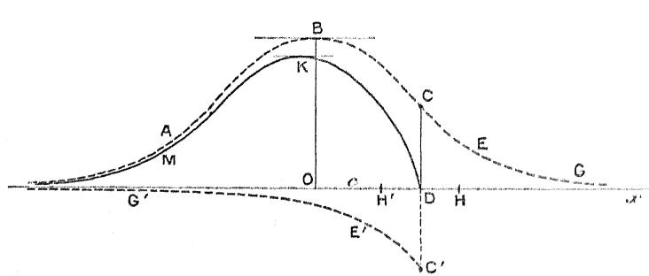

Si le cours c est atteint à l’époque $\ell _ { 4 }$ , le cours H aura, à cet instant, la même probabilité que le cours H' symétrique.

La possibilité de la revente au cours c supprimne donc, en méme temps que la probabilité en H, une probabilité égale en H', et pour avoir la probabilité à l’époque l, nous devons retrancher des ordonnées de la courbe ABC celles de la courbe G’E'C', symétrique de GEC. La courbe de probabilité cherchée sera donc la courbe DKM.

Cette courbe a pour équation

$$
\begin{array} { r } { I ^ { \prime } = \frac { 1 } { 2 \pi \bar { h } \bar { \sqrt { \bar { t } } } } \left[ e ^ { - \frac { \bar { x } ^ { \bar { \eta } } } { 4 \pi \bar { h } ^ { 2 } \bar { t } } } \dots e ^ { - \frac { ( 2 \bar { \eta } - \bar { \eta } ) ^ { 2 } } { 4 \pi \bar { h } ^ { 4 } \bar { t } } } \right] . } \end{array}
$$

Cours de probabilité maxima. — Pour obtenir le cours dont la probabilité est la plus grande, dans le cas où le cours c n’a pas été atteint, il suffit de poser ${ \frac { d \rho } { d , x } } = 0 ;$ on obtient ainsi

$$
{ \frac { x } { 2 c - x } } + c ^ { - { \frac { c ( c - x ) } { \pi h ^ { 3 } l } } } = 0 ,
$$

Si l’on suppose $c = a = k \sqrt { t } .$ , on obtient

$$
x _ { \prime \prime } = \dots , \bar { \cdot } ( \iota , \bar { \iota } ^ { * } ) ,
$$

si l’on suppose $c = 2 a$ , on obtient

$$
x _ { m } = \ldots ( 0 , / \ell .
$$

<!-- page: 64 -->

Enfin, on obtiendrait

$$
x _ { \prime \eta } = - c ,
$$

si c était égal à 1,33a.

Cours probable. - Cherchons l'expression de la probabilité dans l’intervalle zéro, u; ce sera

$$
\frac { 1 } { 2 \pi \operatorname { \mathcal { A } } \sqrt { \mathscr { L } } } \int _ { 0 } ^ { \pi } \sigma ^ { - \frac { x ^ { 2 } } { \sqrt { \pi \sqrt { \lambda ^ { 2 } } \iota } } } d x - \frac { 1 } { 2 \pi \operatorname { \mathcal { A } } \sqrt { \iota } \sqrt { \mathscr { L } } } \int _ { 0 } ^ { \pi } e ^ { - \frac { ( 2 \sigma - x ) ^ { 2 } } { \iota \pi \sqrt { \lambda ^ { 2 } } \iota } } d x .
$$

Le premier terme a pour valeur

$$
\mathop { : } \atop { \gamma , } \Theta \left( \mathop { : } \atop { \gamma , \sqrt { \pi } / \bar { \sqrt { \ell } } } \right) .
$$

Dans le second, posons

$$
{ \mathfrak { P } } \{ { \mathfrak { k } } \{ { \mathfrak { k } } \} ; { \mathfrak { k } } = { \mathfrak { k } } { \mathfrak { c } } - { \mathfrak { v } } ;
$$

ce terme deviendra

$$
\begin{array} { r } { \begin{array} { r } { \cdots \displaystyle \frac { 1 } { 3 } \displaystyle \frac { 3 } { \sqrt { \pi } } \int _ { 0 } ^ { \frac { 9 \pi k \sqrt { \prime } } { 2 \sqrt { \pi k ^ { \prime } / } } } e ^ { - \lambda ^ { 2 } } d \lambda + \displaystyle \frac { 1 } { 3 } \displaystyle \frac { 2 } { \sqrt { \pi } } \int _ { 0 } ^ { \frac { 9 \pi k \sqrt { \prime } } { 2 } } e ^ { - \lambda ^ { 2 } } d \lambda . } \end{array} } \end{array}
$$

L’expression cherchée de la probabilité est donc

$$
\frac { 1 } { 2 } ~ \Theta \bigg ( \frac { \pi } { 2 \sqrt { \pi } \hbar \sqrt { \ell } } \bigg ) - \frac { 1 } { 2 } ~ \Theta \bigg ( \frac { 3 c } { 2 \sqrt { \pi } \hbar \sqrt { \ell } } \bigg ) + \frac { 1 } { 2 } ~ \Theta \bigg ( \frac { 2 c - \ell \ell } { 2 \sqrt { \pi } \hbar \sqrt { \ell } } \bigg ) .
$$

Il est intéressant d'étudier le cas où $u = c$ pour connaître la probabilité de bénéfice d'un achat ferme lorsque le cours de revente $\boldsymbol { \mathrm { n } } _ { \mathrm { } , \mathrm { } } ^ { \prime } \mathrm { } i$ pu être atteint.

La formule ci-dessus devient dans l’hypothèse $u = \pmb { C }$

$$
\Theta ( \frac { c } { \sqrt [ 3 ] { \pi } \hbar \sqrt { l } } ) \cdots \stackrel { 1 } { \underset { \Im } {  } } \Theta ( \begin{array} { c } { 2 c } \\ { \cdots } \\ { \Im \sqrt { \pi } \hbar \sqrt { l } } \end{array} ) .
$$

Supposons que $c = c _ { i }$ , la probabilité est alors $_ { 0 , 0 , 3 }$

Si l'écart a n'a jamais été atteint dans l'intervalle t, il n'y a que trois chances sur cent pour que, à l’époque t, le cours se trouve compris entre zéro et a.

<!-- page: 65 -->

On peut acheter une prime simple avec l'idée préconçue de revendre du ferme sur cette prime dès que son écart sera atteint.

La probabilité de la revente est, comme nous l'avons vu, ${ \mathrm { o } , 6 } \mathfrak { g }$ . La probabilité pour que la revente n'ait pas lieu et qu'il y ait bénéfice est $_ { 0 , 0 } 3$ et la probabilité de perte est $_ { ( ) , 2 } 8$

Supposons que $c = 2 a$ , la probabilité est alors $( ) , 1 3$

Si l'écart 2a n'a jamais été atteint dans l'intervalle t, il y a treize chances sur cent pour que, à l’époque t, le cours se trouve compris entre zéro et 2a.

Le cours probable est cclui dont l’ordonnée divise en deux parties égales l’aire de la courbe des probabilités. Il n’est pas possible d’exprimer sa valeur en termes finis.

Espérance réelle. — L'cspérance mathématique $k \sqrt { \ell } = a$ exprime l’espérance d’une opération qui doit durer jusqu’à l’époque t.

Si l'on se propose de réaliser l’opération dans le cas où un certain écart serait atteint avant l’époque t, l’espérance mathématique a une valeur toute différente, variant évidemment entre zéro et $k \sqrt { \ell }$ quand l'écart choisi varie entre zéro et l'infini.

Soit c le cours de réalisation d’un achat, par exemple; pour obtenir l’espérance positive réelle de l'opération, on doit ajouter à l'espé- rance de revente cP l’espérance positive correspondant au cas où la revente n'a pas lieu, c'est-à-dire la quantité

$$
\int _ { 0 } ^ { c } \frac { x } { 2 \pi k \sqrt { \ell } } \Big [ c ^ { - \frac { \nu ^ { 2 } } { 4 \pi k ^ { 2 } \ell } } - e ^ { - \frac { ( 2 \ell - \nu ) ^ { 2 } } { 4 \pi k ^ { 2 } \ell } } \Big ] d x .
$$

Si l’on effectue l’intégration du premier terme et si l'on ajoute l’intégrale entière à l’espérance de revente

$$
c \mathbf { I } = c - c { \frac { 2 } { \sqrt { \pi } } } { \int _ { 0 } ^ { \frac { c } { 2 } { \sqrt { \pi } } k { \sqrt { \ell } } } } e ^ { - { \dot { \gamma } } _ { 2 } } d { \hat { \mu } } ,
$$

<!-- page: 66 -->

on obtient pour expression de l’espérance réelle

$$
\begin{array} { r l } & { \underline { { \mathcal { S } } } = c + { \cal I } \cdot \sqrt { \hat { \iota } } \big ( _ { 1 } - e ^ { - \frac { c ^ { 2 } } { \pi { \hbar } ^ { 3 } \hat { \iota } } } \big ) - c \frac { 2 } { \sqrt { \pi } } \int _ { 0 } ^ { \frac { c } { \sqrt { \pi } ^ { \hbar } \sqrt { \hat { \iota } } } } e ^ { - \hat { \iota } , 2 } d \hat { \lambda } , } \end{array}
$$

ou

$$
\mathcal { E } = c + \lambda \sqrt { \tilde { \iota } } \Big ( \mathfrak { r } - e ^ { - \frac { c ^ { \ast } } { \pi \tilde { \iota } ^ { \ast } \tilde { \iota } } } \Big ) - c \Theta \Big ( \frac { c } { \sqrt { \tilde { \tau } } k \sqrt { \tilde { \iota } } } \Big ) \cdot
$$

Si l’on suppose que $c = \infty$ , on retrouve bien $\begin{array} { r } { \dot { \mathcal { \xi } } = \mathcal { k } \sqrt { \ell } , } \end{array}$ On pourrait facilement développer $\mathcal { \dot { L } }$ en série; mais la formule qui précède est plus avantageuse, elle se calcule avec les Tables de logarithmes et avec celles de la fonction Θ.

Pour $c = a$ , on obtient

$$
\mathcal { S } , = 0 , 7 1 \mathscr { n } ;
$$

on a de même pour $c = 2 a$

$$
\mathcal { S } , = \mathrm { { o } , \ j ^ { 5 } \ d { u } . }
$$

Les espérances de revente étaient, pour ces mêmes écarts, o,6ga et. ${ ( ) , 8 6 } \dot { ( ) } \dot { \alpha }$

L’écart moyen en baisse, lorsque le cours c n’est pas atteint, a pour valeur

$$
\frac { \int _ { - \infty } ^ { 0 } p x d x } { \int _ { - \infty } ^ { 0 } p d x } = \frac { \mathcal { L } } { 1 - \mathbb { P } - \mathbb { P } _ { 1 } } ,
$$

${ \mathrm { I } ^ { \prime } } _ { \mathrm { ~ ; ~ } }$ désignant la quantité $\int _ { 0 } ^ { \cdot ^ { c } } p d x .$

L'écart moyen a donc pour valeur 2,54a lorsque $c = \simeq a$ et 2,16a lorsque $c \mapsto \colon a$

Si l'on suppose $c = 0$ , on voit que l’écart moyen est égal à 2a, ré- sultat déjà obtenu.

Reprenons, à titre d’exemple, le problème général relatif à l’écart a. J'achète ferme avec l'idée préconçue de revendre avec l'écart $a = k \sqrt { t } .$ Si à l’époque t la vente n'a pu être effectuée, je vendrai quel que soit le cours.

<!-- page: 67 -->

Quels sont les principaux résultats que fournit le Calcul des probabilités sur cette opération?

L’espérance réelle positive de l’opération est $( ) , 7 ^ { 1 ~ ( \ell ) }$

La probabilité de la revente est o,69.

L’époque la plus probable de la revente est $\underbrace { \boldsymbol { \ell } } _ { \mathrm { ~ I ~ S ~ } } .$

L’époque probable de la revente est $\boldsymbol { \underline { { \underline { { \ell } } } } }$

Si Ia revente n’a pas licu, la probabilité de réussite est $( ) , ( ) ^ { ? ) }$ , la probabilité de perte o,28, l’espérance positive o,o2a, l’espérance négative o,71 a; la perte moyenne ${ \mathrm { 2 } } , 5 { \mathrm { / } } a .$

La probabilité totale de réussite est $^ { ( ) , 7 2 }$

Je ne erois pas nécessaire de présenter d’autres exemples; on voit que la théorie actuelle résout par le Calcul des probabilités la plupart des problèmes auxquels conduit l’étude de la spéculation.

Une dernière remarque ne sera peut-être pas inutile. Si, à l’égard de plusieurs questions traitées dans cette étude, j’ai comparé les résultats de l’observation à ceux de la théorie, ce n’était pas pour vérifier des formules établies par les méthodes mathématiques, mais pour montrer seulement que le marché, à son insu, obéit à une loi qui le domine : la loi de la probabilité.
