<!-- page: 1 -->

# 3) CHICAGO JOURNALS 

Cor STORM

<!-- page: 2 -->

## The Pricing of Options and Corporate Liabilities 

#### Fischer Black 

University of Chicago 

### Myron Scholes 

Massachusetts Institute of Technology 

If options are correctly priced in the market, it should not be possible to make sure profits by creating portfolios of long and short positions in options and their underlying stocks. Using this principle, a theoretical valuation formula for options is derived. Since almost all corporate liabilities can be viewed as combinations of options, the formula and the analysis that led to it are also applicable to corporate liabilities such as common stock, corporate bonds, and warrants. In particular, the formula can be used to derive the discount that should be applied to a corporate bond because of the possibility of default. 

###### Introduction 

An option is a security giving the right to buy or sell an asset, subject to certain conditions, within a specified period of time. An “American option” is one that can be exercised at any time up to the date the option expires. A “European option” is one that can be exercised only on a specified future date. The price that is paid for the asset when the option is exercised is called the ‘exercise price” or ‘striking price.” The last day on which the option may be exercised is called the “expiration date” or “maturity date.” The simplest kind of option is one that gives the right to buy a single share of common stock. Throughout most of the paper, we will be discussing this kind of option, which is often referred to as a “call option.” 

Received for publication November 11, 1970. Final version received May 9, 1972. The inspiration for this work was provided by Jack L. Treynor (196la, 19615). We are grateful for extensive comments on earlier drafts by Eugene F. Fama, Robert C. Merton, and Merton H. Miller. This work was supported in part by the Ford Foundation.

<!-- page: 3 -->

In general, it seems clear that the higher the price of the stock, the greater the value of the option. When the stock price is much greater than the exercise price, the option is almost sure to be exercised. The current value of the option will thus be approximately equal to the price of the stock minus the price of a pure discount bond that matures on the same date as the option, with a face value equal to the striking price of the option. 

On the other hand, if the price of the stock is much less than the exercise price, the option is almost sure to expire without being exercised, so its value will be near zero. 

If the expiration date of the option is very far in the future, then the price of a bond that pays the exercise price on the maturity date will be very low, and the value of the option will be approximately equal to the price of the stock. On the other hand, if the expiration date is very near, the value of the option will be approximately equal to the stock price minus the exercise price, or zero, if the stock price is less than the exercise price. Normally, the value of an option declines as its maturity date approaches, if the value of the stock does not change. 

These general properties of the relation between the option value and the stock price are often illustrated in a diagram like figure 1. Line A represents the maximum value of the option, since it cannot be worth more than the stock. Line B represents the minimum value of the option, since its value cannot be negative and cannot be less than the stock price minus the exercise price. Lines T,, T2, and T3 represent the value of the option for successively shorter maturities. 

Normally, the curve representing the value of an option will be concave upward. Since it also lies below the 45° line, A, we can see that the 

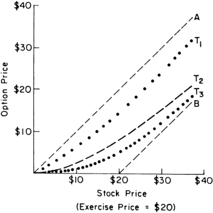

<!-- Start of picture text -->
$40 ZA / $30 Yo oT L/w! F aa a aa Te c $20 / ° Lois 2 7“ e ° 7 7B Qa 7 7 e° ° soe aw $10 7? 7 6% 7% 7yee ° aZtPhd 4 Foe a e 7,° a e° 7 Ze me— ..e° 7 7 $10 $20 $30 = $40 Stock Price (Exercise Price = $20) <!-- End of picture text -->

Fic. 1—The relation between option value and stock price

<!-- page: 4 -->

###### OPTIONS AND LIABILITIES 

option will be more volatile than the stock. A given percentage change in the stock price, holding maturity constant, will result in a larger percentage change in the option value. The relative volatility of the option is not constant, however. It depends on both the stock price and maturity. Most of the previous work on the valuation of options has been expressed in terms of warrants. For example, Sprenkle (1961), Ayres (1963), Boness (1964), Samuelson (1965), Baumol, Malkiel, and Quandt (1966), and Chen (1970) all produced valuation formulas of the same general form. Their formulas, however, were not complete, since they all involved one or more arbitrary parameters. 

For example, Sprenkle’s formula for the value of an option can be written as follows: 

kxN (61) — R*cN (be) In 1. kx/c + > v2(t* — t) = v\/(t* — #) In 1. kx/c — > v2(¢* — t) b3 = —— v\/(t* — t) In this expression, x is the stock price, c is the exercise price, ¢* is the maturity date, ¢ is the current date, v? is the variance rate of the return on the stock,' In is the natural logarithm, and (0) is the cumulative normal density function. But & and &* are unknown parameters. Sprenkle (1961) defines & as the ratio of the expected value of the stock price at the time the warrant matures to the current stock price, and &* as a discount factor that depends on the risk of the stock. He tries to estimate the values of k and &* empirically, but finds that he is unable to do so. More typically, Samuelson (1965) has unknown parameters « and 8, where « is the rate of expected return on the stock, and § is the rate of expected return on the warrant or the discount rate to be applied to the warrant.” He assumes that the distribution of possible values of the stock when the warrant matures is log-normal and takes the expected value of this distribution, cutting it off at the exercise price. He then discounts this expected value to the present at the rate ®. Unfortunately, there seems to be no model of the pricing of securities under conditions of capital market 

1The variance rate of the return on a security is the limit, as the size of the interval of measurement goes to zero, of the variance of the return over that interval divided by the length of the interval. 2 The rate of expected return on a security is the limit, as the size of the interval of measurement goes to zero, of the expected return over that interval divided by the length of the interval.

<!-- page: 5 -->

equilibrium that would make this an appropriate procedure for determining the value of a warrant. 

In a subsequent paper, Samuelson and Merton (1969) recognize the fact that discounting the expected value of the distribution of possible values of the warrant when it is exercised is not an appropriate procedure. They advance the theory by treating the option price as a function of the stock price. They also recognize that the discount rates are determined in part by the requirement that investors be willing to hold all of the outstanding amounts of both the stock and the option. But they do not make use of the fact that investors must hold other assets as well, so that the risk of an option or stock that affects its discount rate is only that part of the risk that cannot be diversified away. Their final formula depends on the shape of the utility function that they assume for the typical investor. 

One of the concepts that we use in developing our model is expressed by Thorp and Kassouf (1967). They obtain an empirical valuation formula for warrants by fitting a curve to actual warrant prices. Then they use this formula to calculate the ratio of shares of stock to options needed to create a hedged position by going long in one security and short in the other. What they fail to pursue is the fact that in equilibrium, the expected return on such a hedged position must be equal to the return on a riskless asset. What we show below is that this equilibrium condition can be used to derive a theoretical valuation formula. 

###### The Valuation Formula 

In deriving our formula for the value of an option in terms of the price of the stock, we will assume “ideal conditions” in the market for the stock and for the option: 

a) The short-term interest rate is known and is constant through time. 5) The stock price follows a random walk in continuous time with a variance rate proportional to the square of the stock price. Thus the distribution of possible stock prices at the end of any finite interval is lognormal. The variance rate of the return on the stock is constant. c) The stock pays no dividends or other distributions. d) The option is “European,” that is, it can only be exercised at maturity. 

e) There are no transaction costs in buying or selling the stock or the option. 

f) It is possible to borrow any fraction of the price of a security to buy it or to hold it, at the short-term interest rate. 

g) There are no penalties to short selling. A seller who does not own a security will simply accept the price of the security from a buyer, and will agree to settle with the buyer on some future date by paying him an amount equal to the price of the security on that date.

<!-- page: 6 -->

Under these assumptions, the value of the option will depend only on the price of the stock and time and on variables that are taken to be known constants. Thus, it is possible to create a hedged position, consisting of a long position in the stock and a short position in the option, whose value will not depend on the price of the stock, but will depend only on time and the values of known constants. Writing w(x,¢) for the value of the option as a function of the stock price « and time ¢, the number of options that must be sold short against one share of stock long is: 

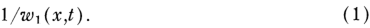

In expression (1), the subscript refers to the partial derivative of w(x,t) with respect to its first argument. 

To see that the value of such a hedged position does not depend on the price of the stock, note that the ratio of the change in the option value to the change in the stock price, when the change in the stock price is small, is w,(x,t). To a first approximation, if the stock price changes by an amount Ax, the option price will change by an amount w,(x,t) Ax, and the number of options given by expression (1) will change by an amount Ax. Thus, the change in the value of a long position in the stock will be approximately offset by the change in value of a short position in 1/w options. As the variables « and ¢ change, the number of options to be sold short to create a hedged position with one share of stock changes. If the hedge is maintained continuously, then the approximations mentioned above become exact, and the return on the hedged position is completely independent of the change in the value of the stock. In fact, the return on the hedged position becomes certain.? 

To illustrate the formation of the hedged position, let us refer to the solid line (T.) in figure 1 and assume that the price of the stock starts at $15.00, so that the value of the option starts at $5.00. Assume also that the slope of the line at that point is 1/2. This means that the hedged position is created by buying one share of stock and selling two options short. One share of stock costs $15.00, and the sale of two options brings in $10.00, so the equity in this position is $5.00. 

If the hedged position is not changed as the price of the stock changes, then there is some uncertainty in the value of the equity at the end of a finite interval. Suppose that two options go from $10.00 to $15.75 when the stock goes from $15.00 to $20.00, and that they go from $10.00 to $5.75 when the stock goes from $15.00 to $10.00. Thus, the equity goes from $5.00 to $4.25 when the stock changes by $5.00 in either direction. This is a $.75 decline in the equity for a $5.00 change in the stock in either direction.* 

> 3 This was pointed out to us by Robert Merton. 

> 4 These figures are purely for illustrative purposes. They correspond roughly to the way figure 1 was drawn, but not to an option on any actual security.

<!-- page: 7 -->

In addition, the curve shifts (say from Ts to 73 in fig. 1) as the maturity of the options changes. The resulting decline in value of the options means an increase in the equity in the hedged position and tends to offset the possible losses due to a large change in the stock price. Note that the decline in the equity value due to a large change in the stock price is small. The ratio of the decline in the equity value to the magnitude of the change in the stock price becomes smaller as the magnitude of the change in the stock price becomes smaller. Note also that the direction of the change in the equity value is independent of the direction of the change in the stock price. This means that under our assumption that the stock price follows a continuous random walk and that the return has a constant variance rate, the covariance between the return on the equity and the return on the stock will be zero. If the stock price and the value of the “market portfolio” follow a joint continuous random walk with constant covariance rate, it means that the covariance between the return on the equity and the return on the market will be zero. 

Thus the risk in the hedged position is zero if the short position in the option is adjusted continuously. If the position is not adjusted continuously, the risk is small, and consists entirely of risk that can be diversified away by forming a portfolio of a large number of such hedged positions. 

In general, since the hedged position contains one share of stock long and 1/w, options short, the value of the equity in the position is: 

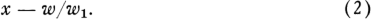

The change in the value of the equity in a short interval Aé is: 

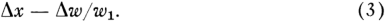

Assuming that the short position is changed continuously, we can use stochastic calculus® to expand Aw, which is w(x + Ax, ¢ + At) — w(x,t), as follows: 

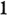

In equation (4), the subscripts on w refer to partial derivatives, and v? is the variance rate of the return on the stock.® Substituting from equation (4) into expression (3), we find that the change in the value of the equity in the hedged position is: 

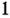

Since the return on the equity in the hedged position is certain, the return must be equal to rAt. Even if the hedged position is not changed * For an exposition of stochastic calculus, see McKean (1969). 6 See footnote 1.

<!-- page: 8 -->

continuously, its risk is small and is entirely risk that can be diversified away, so the expected return on the hedged position must be at the short term interest rate.’ If this were not true, speculators would try to profit by borrowing large amounts of money to create such hedged positions, and would in the process force the returns down to the short term interest rate. Thus the change in the equity (5) must equal the value of the equity (2) times rAt. 

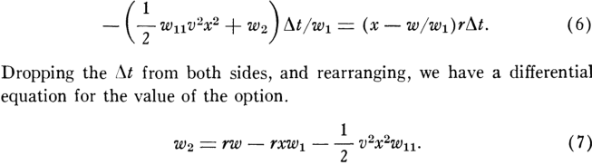

Writing ¢* for the maturity date of the option, and c for the exercise price, we know that: 

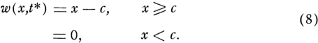

<!-- Start of picture text -->
w(x,t*) =x —c, x SC (8) =0, X<C. <!-- End of picture text -->

There is only one formula w(x,t) that satisfies the differential equation (7) subject to the boundary condition (8). This formula must be the option valuation formula. To solve this differential equation, we make the following substitution: 

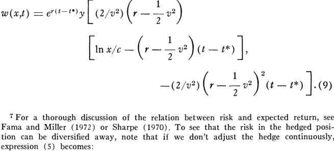

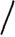

<!-- Start of picture text -->
/ <!-- End of picture text -->

Writing Am for the change in the value of the market portfolio between t and t + At, the “market risk” in the hedged position is proportional to the covariance hetween the change in the value of the hedged portfolio, as given by expression (5’), and Am: —wy,, cov (Ax*, Am). But if Ax and Am follow a joint normal distribution for small intervals At, this covariance will be zero. Since there is no market risk in the hedged position, all of the risk due to the fact that the hedge is not continuously adjusted must be risk that can be diversified away.

<!-- page: 9 -->

With this substitution, the differential equation becomes: 

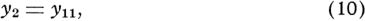

and the boundary condition becomes: 

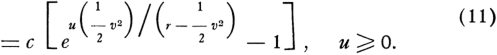

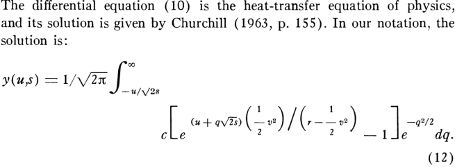

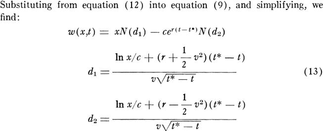

In equation (13), N(d) is the cumulative normal density function. 

Note that the expected return on the stock does not appear in equation (13). The option value as a function of the stock price is independent of the expected return on the stock. The expected return on the option, however, will depend on the expected return on the stock. The faster the stock price rises, the faster the option price will rise through the functional relationship (13). 

Note that the maturity (¢* — ¢) appears in the formula only multiplied by the interest rate v or the variance rate v”. Thus, an increase in maturity has the same effect on the value of the option as an equal percentage increase in both ry and v?. 

Merton (1973) has shown that the option value as given by equation (13) increases continuously as any one of ¢*, 7, or v? increases. In each case, it approaches a maximum value equal to the stoek price.

<!-- page: 10 -->

The partial derivative w; of the valuation formula is of interest, because it determines the ratio of shares of stock to options in the hedged position as in expression (1). Taking the partial derivative of equation (13), and simplifying, we find that: 

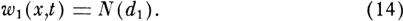

In equation (14), d; is as defined in equation (13). 

From equations (13) and (14), it is clear that xw,/w is always greater than one. This shows that the option is always more volatile than the stock. 

##### An Alternative Derivation 

It is also possible to derive the differential equation (7) using the “capital asset pricing model.” This derivation is given because it gives more understanding of the way in which one can discount the value of an option to the present, using a discount rate that depends on both time and the price of the stock. 

The capital asset pricing model describes the relation between risk and expected return for a capital asset under conditions of market equilibrium.® The expected return on an asset gives the discount that must be applied to the end-of-period value of the asset to give its present value. Thus, the capital-asset pricing model gives a general method for discounting under uncertainty. 

The capital-asset pricing model says that the expected return on an asset is a linear function of its B, which is defined as the covariance of the return on the asset with the return on the market, divided by the variance of the return on the market. From equation (4) we see that the covariance of the return on the option Aw/w with the return on the market is equal to xw,/w times the covariance of the return on the stock Ax/x with the return on the market. Thus, we have the following relation between the option’s 8 and the stock’s B: 

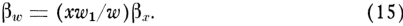

The expression xw,/w may also be interpreted as the “elasticity” of the option price with respect to the stock price. It is the ratio of the percentage change in the option price to the percentage change in the stock price, for small percentage changes, holding maturity constant. 

8 The model was developed by Treynor (1961b); Sharpe (1964), Lintner (1965), and Mossin (1966). It is summarized by Sharpe (1970), and Fama and Miller (1972). The model was originally stated as a single-period model. Extending it to a multiperiod model is, in general, difficult. Fama (1970), however, has shown that if we make an assumption that implies that the short-term interest rate is constant through time, then the model must apply to each successive period in time. His proof also goes through under somewhat more general assumptions.

<!-- page: 11 -->

To apply the capital-asset pricing model to an option and the underlying stock, let us first define a as the rate of expected return on the market minus the interest rate.” Then the expected return on the option and the stock are: 

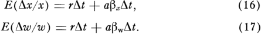

Multiplying equation (17) by w, and substituting for 6, from equation (15), we find: 

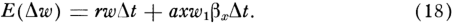

Using stochastic calculus,!® we can expand Aw, which is w(x+ Ax, t+ At) — w(x,t), as follows: Aw 1 = wyAx + > Wy107x72At + welt. (19) 

Taking the expected value of equation (19), and substituting for E(Ax) from equation (16), we have: 

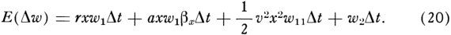

Combining equations (18) and (20), we find that the terms involving a and 8, cancel, giving: 

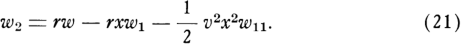

Equation (21) is the same as equation (7). 

##### More Complicated Options 

The valuation formula (13) was derived under the assumption that the option can only be exercised at time ¢*. Merton (1973) has shown, however, that the value of the option is always greater than the value it would have if it were exercised immediately (x — c). Thus, a rational investor will not exercise a call option before maturity, and the value of an American call option is the same as the value of a European call option. 

There is a simple modification of the formula that will make it applicable to European put options (options to sell) as well as call options (options to buy). Writing «(x,¢) for the value of a put option, we see that the differential equation remains unchanged.

<!-- page: 12 -->

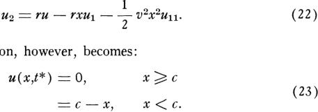

The boundary condition, however, becomes: 

To get the solution to this equation with the new boundary condition, we can simply note that the difference between the value of a call and the value of a put on the same stock, if both can be exercised only at maturity, must obey the same differential equation, but with the following boundary condition: 

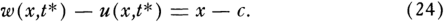

The solution to the differential equation with this boundary condition is: 

w(x,t) — u(x,t) =x — ce™lt-t), (25) 

Thus the value of the European put option is: 

u(x,t) = w(x,t) —x + cet), (26) 

Putting in the value of w(x,t) from (13), and noting that 1 — N(d) is equal to V(—d), we have: 

u(x,t) = —xN(—d,;) + ce~"N(—da). (27) 

In equation (27), d; and dy» are defined as in equation (13). 

Equation (25) also gives us a relation between the value of a European call and the value of a European put.!! We see that if an investor were to buy a call and sell a put, his returns would be exactly the same as if he bought the stock on margin, borrowing ce™"~**) toward the price of the stock. 

Merton (1973) has also shown that the value of an American put option will be greater than the value of a European put option. This is true because it is sometimes advantageous to exercise a put option before maturity, if it is possible to do so. For example, suppose the stock price falls almost to zero and that the probability that the price will exceed the exercise price before the option expires is negligible. Then it will pay to exercise the option immediately, so that the exercise price will be received sooner rather than later. The investor thus gains the interest on the exercise price for the period up to the time he would otherwise have exercised it. So far, no one has been able to obtain a formula for the value of an American put option. 

> 11 The relation between the value of a call option and the value of a put option was first noted by Stoll (1969). He does not realize, however, that his analysis applies only to European options.

<!-- page: 13 -->

If we relax the assumption that the stock pays no dividend, we begin to get into some complicated problems. First of all, under certain conditions it will pay to exercise an American call option before maturity. Merton (1973) has shown that this can be true only just before the stock’s ex-dividend date. Also, it is not clear what adjustment might be made in the terms of the option to protect the option holder against a loss due to a large dividend on the stock and to ensure that the value of the option will be the same as if the stock paid no dividend. Currently, the exercise price of a call option is generally reduced by the amount of any dividend paid on the stock. We can see that this is not adequate protection by imagining that the stock is that of a holding company and that it pays out all of its assets in the form of a dividend to its shareholders. This will reduce the price of the stock and the value of the option to zero, no matter what adjustment is made in the exercise price of the option. In fact, this example shows that there may not be any adjustment in the terms of the option that will give adequate protection against a large dividend. In this case, the option value is going to be zero after the distribution, no matter what its terms are. Merton (1973) was the first to point out that the current adjustment for dividends is not adequate. 

###### Warrant Valuation 

A warrant is an option that is a liability of a corporation. The holder of a warrant has the right to buy the corporation’s stock (or other assets) on specified terms. The analysis of warrants is often much more complicated than the analysis of simple options, because: 

a) The life of a warrant is typically measured in years, rather than months. Over a period of years, the variance rate of the return on the stock may be expected to change substantially. 6) The exercise price of the warrant is usually not adjusted at all for dividends. The possibility that dividends will be paid requires a modification of the valuation formula. 

c) The exercise price of a warrant sometimes changes on specified dates. It may pay to exercise a warrant just before its exercise price changes. This too requires a modification of the valuation formula. 

d) If the company is involved in a merger, the adjustment that is made in the terms of the warrant may change its value. 

€) Sometimes the exercise price can be paid using bonds of the corporation at face value, even though they may at the time be selling at a discount. This complicates the analysis and means that early exercise may sometimes be desirable. 

f) The exercise of a large number of warrants may sometimes result in a significant increase in the number of common shares outstanding. In some cases, these complications can be treated as insignificant, and

<!-- page: 14 -->

equation (13) can be used as an approximation to give an estimate of the warrant value. In other cases, some simple modifications of equation (13) will improve the approximation. Suppose, for example, that there are warrants outstanding, which, if exercised, would double the number of shares of the company’s common stock. Let us define the “equity” of the company as the sum of the value of all of its warrants and the value of all of its common stock. If the warrants are exercised at maturity, the equity of the company will increase by the aggregate amount of money paid in by the warrant holders when they exercise. The warrant holders will then own half of the new equity of the company, which is equal to the old equity plus the exercise money. 

Thus, at maturity, the warrant holders will either receive nothing, or half of the new equity, minus the exercise money. Thus, they will receive nothing or half of the difference between the old equity and half the exercise money. We can look at the warrants as options to buy shares in the equity rather than shares of common stock, at half the stated exercise price rather than at the full exercise price. The value of a share in the equity is defined as the sum of the value of the warrants and the value of the common stock, divided by twice the number of outstanding shares of common stock. If we take this point of view, then we will take v? in equation (13) to be the variance rate of the return on the company’s equity, rather than the variance rate of the return on the company’s common stock. 

A similar modification in the parameters of equation (13) can be made if the number of shares of stock outstanding after exercise of the warrants will be other than twice the number of shares outstanding before exercise of the warrants. 

###### Common Stock and Bond Valuation 

It is not generally realized that corporate liabilities other than warrants may be viewed as options. Consider, for example, a company that has common stock and bonds outstanding and whose only asset is shares of common stock of a second company. Suppose that the bonds are “pure discount bonds” with no coupon, giving the holder the right to a fixed sum of money, if the corporation can pay it, with a maturity of 10 years. Suppose that the bonds contain no restrictions on the company except a restriction that the company cannot pay any dividends until after the bonds are paid off. Finally, suppose that the company plans to sell all the stock it holds at the end of 10 years, pay off the bond holders if possible, and pay any remaining money to the stockholders as a liquidating dividend. 

Under these conditions, it is clear that the stockholders have the equivalent of an option on their company’s assets. In effect, the bond holders own the company’s assets, but they have given options to the stockholders

<!-- page: 15 -->

to buy the assets back. The value of the common stock at the end of 10 years will be the value of the company’s assets minus the face value of the bonds, or zero, whichever is greater. 

Thus, the value of the common stock will be w(x,t), as given by equation (13), where we take v? to be the variance rate of the return on the shares held by the company, c to be the total face value of the outstanding bonds, and x to be the total value of the shares held by the company. The value of the bonds will simply be x — w(x,t). 

By subtracting the value of the bonds given by this formula from the value they would have if there were no default risk, we can figure the discount that should be applied to the bonds due to the existence of default risk. 

Suppose, more generally, that the corporation holds business assets rather than financial assets. Suppose that at the end of the 10 year period, it will recapitalize by selling an entirely new class of common stock, using the proceeds to pay off the bond holders, and paying any money that is left to the old stockholders to retire their stock. In the absence of taxes, it is clear that the value of the corporation can be taken to be the sum of the total value of the debt and the total value of the common stock.'” The amount of debt outstanding will not affect the total value of the corporation, but will affect the division of that value between the bonds and the stock. The formula for w(x,¢) will again describe the total value of the common stock, where x is taken to be the sum of the value of the bonds and the value of the stock. The formula for x — w(x,t) will again describe the total value of the bonds. It can be shown that, as the face value c of the bonds increases, the market value x — w(x,t) increases by a smaller percentage. An increase in the corporation’s debt, keeping the total value of the corporation constant, will increase the probability of default and will thus reduce the market value of one of the corporation’s bonds. If the company changes its capital structure by issuing more bonds and using the proceeds to retire common stock, it will hurt the existing bond holders, and help the existing stockholders. The bond price will fall, and the stock price will rise. In this sense, changes in the capital structure of a firm may affect the price of its common stock.!* The price changes will occur when the change in the capital structure becomes certain, not when the actual change takes place. 

Because of this possibility, the bond indenture may prohibit the sale of additional debt of the same or higher priority in the event that the firm is recapitalized. If the corporation issues new bonds that are subordinated 

> 12 The fact that the total value of a corporation is not affected by its capital structure, in the absence of taxes and other imperfections, was first shown by Modigliani and Miller (1958). 13 For a discussion of this point, see Fama and Miller (1972, pp. 151-52).

<!-- page: 16 -->

###### OPTIONS AND LIABILITIES 

to the existing bonds and uses the proceeds to retire common stock, the price of the existing bonds and the common stock price will be unaffected. Similarly, if the company issues new common stock and uses the proceeds to retire completely the most junior outstanding issue of bonds, neither the common stock price nor the price of any other issue of bonds will be affected. 

The corporation’s dividend policy will also affect the division of its total value between the bonds and the stock.'* To take an extreme example, suppose again that the corporation’s only assets are the shares of another company, and suppose that it sells all these shares and uses the proceeds to pay a dividend to its common stockholders. Then the value of the firm will go to zero, and the value of the bonds will go to zero. The common stockholders will have “stolen” the company out from under the bond holders. Even for dividends of modest size, a higher dividend always favors the stockholders at the expense of the bond holders. A liberalization of dividend policy will increase the common stock price and decrease the bond price.!® Because of this possibility, bond indentures contain restrictions on dividend policy, and the common stockholders have an incentive to pay themselves the largest dividend allowed by the terms of the bond indenture. However, it should be noted that the size of the effect of changing dividend policy will normally be very small. If the company has coupon bonds rather than pure discount bonds outstanding, then we can view the common stock as a “compound option.” The common stock is an option on an option on . . . an option on the firm. After making the last interest payment, the stockholders have an option 1+ Miller and Modigliani (1961) show that the total value of a firm, in the absence of taxes and other imperfections, is not affected by its dividend policy. They also note that the price of the common stock and the value of the bonds will not be affected by a change in dividend policy if the funds for a higher dividend are raised by issuing common stock or if the money released by a lower dividend is used to repurchase common stock. 

15 This is true assuming that the liberalization of dividend policy is not accompanied by a change in the company’s current and planned financial structure. Since the issue of common stock or junior debt will hurt the common shareholders (holding dividend policy constant), they will normally try to liberalize dividend policy without issuing new securities. They may be able to do this by selling some of the firm’s financial assets, such as ownership claims on other firms. Or they may be able to do it by adding to the company’s short-term bank debt, which is normally senior to its long-term debt. Finally, the company may be able to finance a higher dividend by selling off a division. Assuming that it receives a fair price for the division, and that there were no economies of combination, this need not involve any loss to the firm as a whole. If the firm issues new common stock or junior debt in exactly the amounts needed to finance the liberalization of dividend policy, then the common stock and bond prices will not be affected. If the liberalization of dividend policy is associated with a decision to issue more common stock or junior debt than is needed to pay the higher dividends, the common stock price will fall and the bond price will rise. But these actions are unlikely, since they are not in the stockholders’ best interests.

<!-- page: 17 -->

to buy the company from the bond holders for the face value of the bonds. Call this “option 1.” After making the next-to-the-last interest payment, but before making the last interest payment, the stockholders have an option to buy option 1 by making the last interest payment. Call this “option 2.”’ Before making the next-to-the-last interest payment, the stockholders have an option to buy option 2 by making that interest payment. This is “option 3.” The value of the stockholders’ claim at any point in time is equal to the value of option 7 + 1, where 2 is the number of interest payments remaining in the life of the bond. 

If payments to a sinking fund are required along with interest payments, then a similar analysis can be made. In this case, there is no ‘“balloon payment” at the end of the life of the bond. The sinking fund will have a final value equal to the face value of the bond. Option 1 gives the stockholders the right to buy the company from the bond holders by making the last sinking fund and interest payment. Option 2 gives the stockholders the right to buy option 1 by making the next-to-the-last sinking fund and interest payment. And the value of the stockholders’ claim at any point in time is equal to the value of option ”, where v is the number of sinking fund and interest payments remaining in the life of the bond. It is clear that the value of a bond for which sinking fund payments are required is greater than the value of a bond for which they are not required. 

If the company has callable bonds, then the stockholders have more than one option. They can buy the next option by making the next interest or sinking fund and interest payment, or they can exercise their option to retire the bonds before maturity at prices specified by the terms of the call feature. Under our assumption of a constant short-term interest rate, the bonds would never sell above face value, and the usual kind of call option would never be exercised. Under more general assumptions, however, the call feature would have value to the stockholders and would have to be taken into account in deciding how the value of the company is divided between the stockholders and the bond holders. 

Similarly, if the bonds are convertible, we simply add another option to the package. It is an option that the bond holders have to buy part of the company from the stockholders. 

Unfortunately, these more complicated options cannot be handled by using the valuation formula (13). The valuation formula assumes that the variance rate of the return on the optioned asset is constant. But the variance of the return on an option is certainly not constant: it depends on the price of the stock and the maturity of the option. Thus the formula cannot be used, even as an approximation, to give the value of an option on an option. It is possible, however, that an analysis in the same spirit as the one that led to equation (13) would allow at least a numerical solution to the valuation of certain more complicated options.

<!-- page: 18 -->

###### Empirical Tests 

We have done empirical tests of the valuation formula on a large body of call-option data (Black and Scholes 1972). These tests indicate that the actual prices at which options are bought and sold deviate in certain systematic ways from the values predicted by the formula. Option buyers pay prices that are consistently higher than those predicted by the formula. Option writers, however, receive prices that are at about the level predicted by the formula. There are large transaction costs in the option market, all of which are effectively paid by option buyers. 

Also, the difference between the price paid by option buyers and the value given by the formula is greater for options on low-risk stocks than for options on high-risk stocks. The market appears to underestimate the effect of differences in variance rate on the value of an option. Given the magnitude of the transaction costs in this market, however, this systematic misestimation of value does not imply profit opportunities for a speculator in the option market. 

###### References 

Ayres, Herbert F. “Risk Aversion in the Warrants Market.” /ndus. Management Rev. 4 (Fall 1963): 497-505. Reprinted in Cootner (1967), pp. 497-505. Baumol, William J.; Malkiel, Burton G.; and Quandt, Richard E. “The Valuation of Convertible Securities.” Q.J.E. 80 (February 1966): 48-59. Black, Fischer, and Scholes, Myron. “The Valuation of Option Contracts and a Test of Market Efficiency.” J. Finance 27 (May 1972): 399-417. Boness, A. James. “Elements of a Theory of Stock-Option Values.” J.P.E. 72 (April 1964): 163-75. Chen, Andrew H. Y. “A Model of Warrant Pricing in a Dynamic Market.” J. Finance 25 (December 1970): 1041-60. Churchill, R. V. Fourier Series and Boundary Value Problems, 2d ed. New York: McGraw-Hill, 1963. Cootner, Paul A. The Random Character of Stock Market Prices. Cambridge, Mass.: M.I.T. Press, 1967. Fama, Eugene F. “Multiperiod Consumption-Investment Decisions.” A.Z.R. 60 (March 1970): 163-74. Fama, Eugene F., and Miller, Merton H. The Theory of Finance. New York: Holt, Rinehart & Winston, 1972. Lintner, John. “The Valuation of Risk Assets and the Selection of Risky Investments in Stock Portfolios and Capital Budgets.” Rev. Econ. and Statis. 47 (February 1965): 768-83. McKean, H. P., Jr. Stochastic Integrals. New York: Academic Press, 1969. Merton, Robert C. “Theory of Rational Option Pricing.” Bell J. Econ. and Management Sci. (1973): in press. Miller, Merton H., and Modigliani, Franco. “Dividend Policy, Growth, and the Valuation of Shares.” J. Bus. 34 (October 1961): 411-33. Modigliani, Franco, and Miller, Merton H. “The Cost of Capital, Corporation Finance, and the Theory of Investment.” 4.E.R. 48 (June 1958): 261-97. Mossin, Jan. ‘Equilibrium in a Capital Asset Market.” Econometrica 34 (October 1966): 768-83.

<!-- page: 19 -->

- Samuelson, Paul A. “Rational Theory of Warrant Pricing.” Jndus. Management Rev. 6 (Spring 1965): 13-31. Reprinted in Cootner (1967), pp. 506-32. 

- Samuelson, Paul A., and Merton, Robert C. “A Complete Model of Warrant Pricing that Maximizes Utility.” Indus. Management Rev. 10 (Winter 1969): 17-46. 

- Sharpe, William F. “Capital Asset Prices: A Theory of Market Equilibrium Under Conditions of Risk.” J. Finance 19 (September 1964): 425-42. 

- ———.. Portfolio Theory and Capital Markets: New York: McGraw-Hill, 1970. Sprenkle, Case. ‘Warrant Prices as Indications of Expectations.” Yale Econ. Essays 1 (1961): 179-232. Reprinted in Cootner (1967), 412-74. 

- Stoll, Hans R. “The Relationship Between Put and Call Option Prices.” J. Finance 24 (December 1969): 802-24. 

- Thorp, Edward O., and Kassouf, Sheen T. Beat the Market. New York: Random House, 1967. 

- Treynor, Jack L. “Implications for the Theory of Finance.” Unpublished memorandum, 1961. (a) 

- —.. “Toward a Theory of Market Value of Risky Assets.” Unpublished memorandum, 1961. (b)
