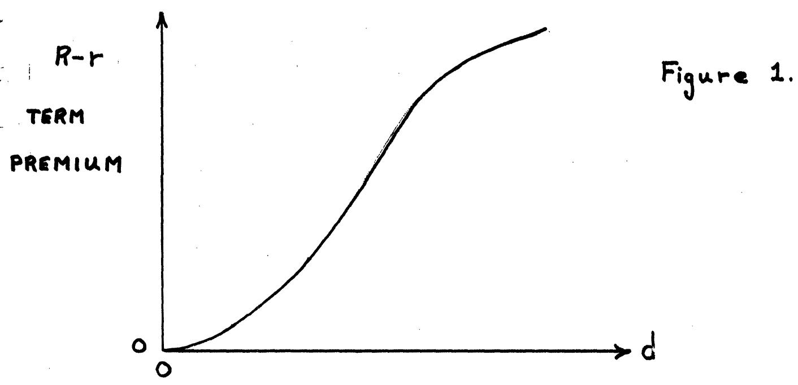
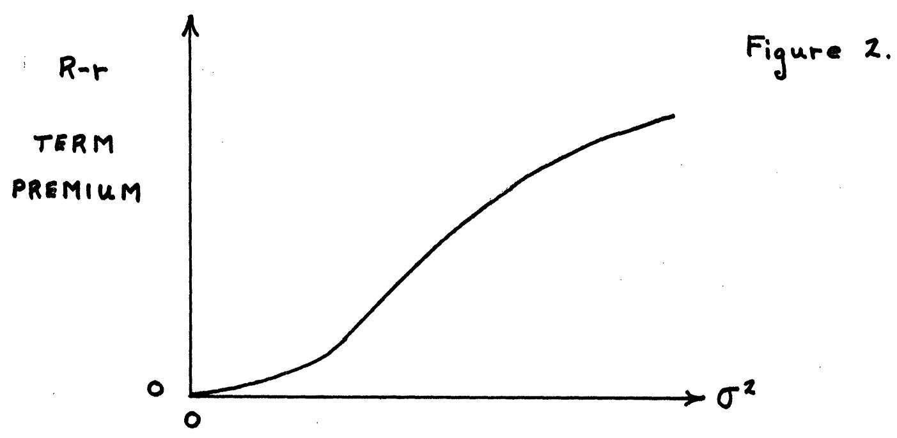
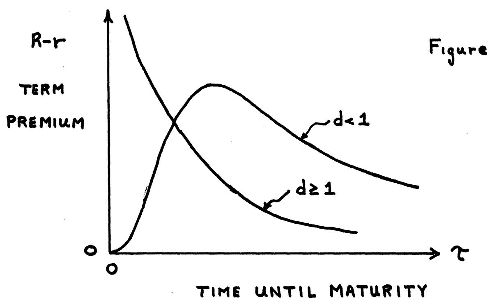
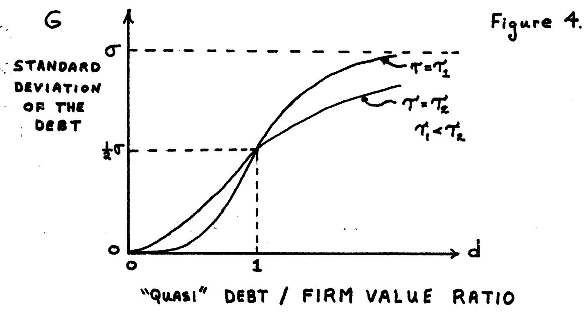
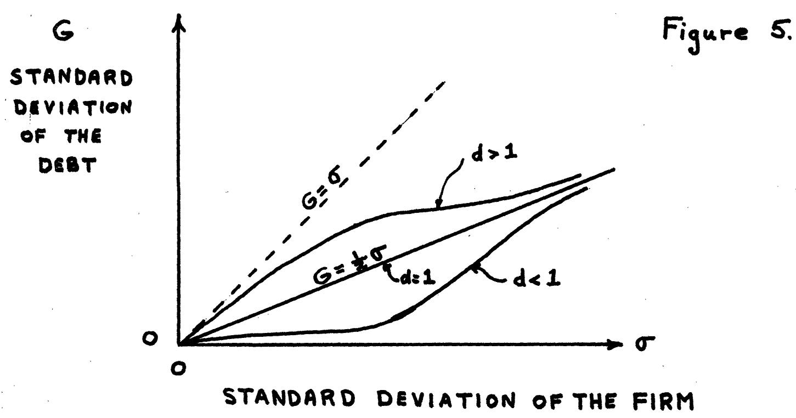
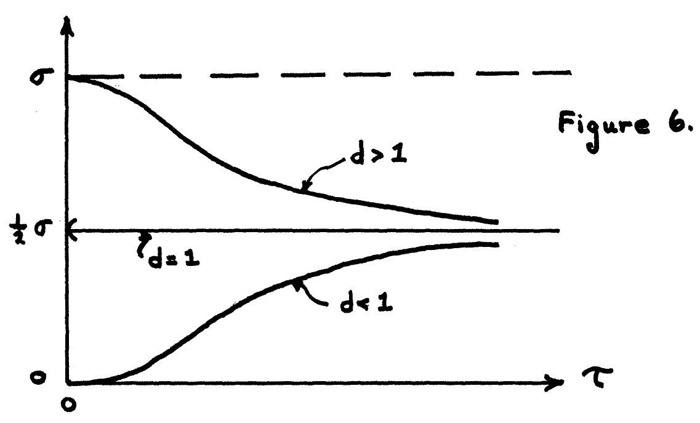
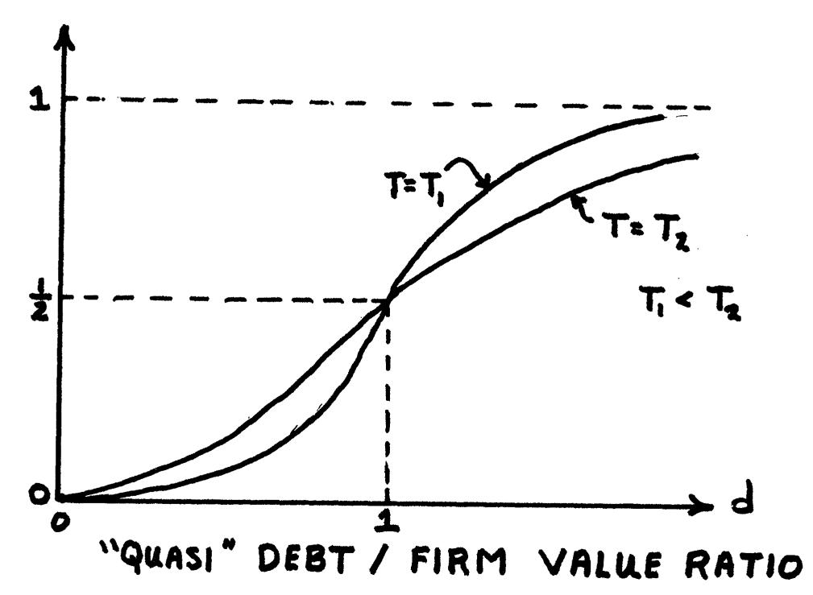
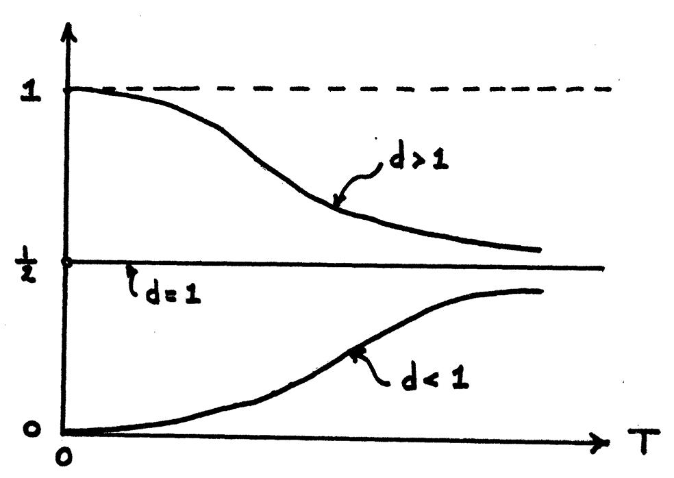
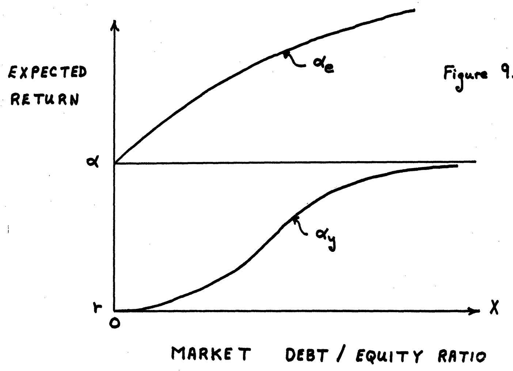

# 1973-merton-corporate-debt-working-paper

<!-- page: 1 -->

ON THE PRICING OF CORPORATE DEBT: THE RISK STRUCTURE OF INTEREST RATES

by Robert C. Merton 684-73 November 1973

To be presented at the American Finance Association Meetings, New York, December 1973."

<!-- page: 2 -->

Robert C. Merton

## I. Introduction

The value of a particular issue of corporate debt depends essentially

on three items: (1) the required rate of return on riskless (in terms of

default) debt (e.g., government bonds or very high-grade corporate bonds);

(2) the various provisions and restrictions contained in the indenture (e.g.,

maturity date, coupon rate, call terms, seniority in the event of default,

sinking fund, etc.); (3) the probability that the firm will be unable to

satisfy some or all of the indenture requiremeuts (i.e., the probability of

default).

While a number of theories and empirical studies has been published

on the term structure of interest rates (item 1), there has been no systematic

development of a theory for pricing bonds when there is a significant proba-

bility of default. The purpose of this paper is to present such a theory

which might be called a theory of the risk structure of interest rates. Tue

use of the term "risk" is restricted to the possible gains or losses to bond-

holders as a result of (unanticipated) changes in the probability of default

and does not include the gains or losses inherent to all bonds caused by

(unanticipated) changed in interest rates in general. Throughout most of

the analysis, a given term structure is assumed and hence, the price differ-

entials among bonds will be solely caused by differences in the probability

of default.

<!-- page: 3 -->

In a seminal paper, Black and Scholes [1] present a complete

general equilibrium theory of option pricing which is particularly attract-

ive because the final formula is a function of "observable" variables.

Therefore, the model is subject to direct empirical tests which they [2]

performed with some success. Merton [5] clarified and extended the Black-

Scholes model. While options are highly specialized and relatively unim-

portant financial instruments, both Black and Scholes [1] and Merton [5, 6]

recognized that the same basic approach could be applied in developing a

pricing theory for corporate liabilities in general.

In Section II of the paper, the basic equation for the pricing

of financial instruments is developed along Black-Scholes lines. In

Section III, the model is applied to the simplest form of corporate debt,

the discount bond where no coupon payments are made, and a formula for com-

puting the risk structure of interest rates is presented. In Section IV, com-

parative statics are used to develop graphs of the risk structure, and the

question of whether the term premium is an adequate measure of the risk of

a bond is answered. In Section V, the validity in the presence of bank-

ruptcy of the famous Modigliani-Miller theorem [7] is proven, and the re-

quired return on debt as a function of the debt-to-equity ratio is deduced.

In Section VI, the analysis is extended to include coupon and callable

<!-- page: 4 -->

To develop the Black-Scholes-type pricing model, we make the following assumptions:

A.1 there are no transactions costs, taxes, or problems with indivisibilities of assets.

A.2 there are a sufficient number of investors with comparable wealth levels so that each investor believes that he can buy and sell as much of an asset as he wants at the market price.

A.3 there exists an exchange market for borrowing and lending at the same rate of interest.

A.4 short-sales of all assets, with full use of the proceeds, is allowed.

A.5 trading in assets takes place continuously in time.

A.6 the Modigliani-Miller theorem that the value of the firm is invariant to its capital structure obtains.

A.7 the Term-Structure is "flat" and known with certainty. I.e., the price of a riskless discount bond which promises a payment of one dollar at time τ in the future is P(τ) = exp[-rt] where r is the (instantaneous) riskless rate of interest, the same for all time.

A.8 The dynamics for the value of the firm, V, through time can be described by a diffusion-type stochastic process with stochastic differential equation

$$
\begin{array} { r l r } { \bf { d } { \bf { V } } } & { { } = } & { \left( \alpha { \bf { V } } - \alpha { \bf { C } } \right) \bf { d } \bf { t } + \alpha \sigma \bf { V } \bf { d } z } \end{array}
$$

where

α is the instantaneous expected rate of return on the firm per unit time, C is the total dollar payouts by the firm per unit time to

<!-- page: 5 -->

either its shareholders or liabilities-holders (e.g., dividends

or interest payments) if positive, anu it is the net dollars

received by the firm from new financing if negative; $\sigma ^ { 2 }$ is the

instantaneous variance of the return cn the firm per unit time;

dz is a standard Gauss-Wiener process.

Many of these assumptions are not necessary for the model to obtain but are chosen for expositional convenience. In particular, the "perfect market" assumptions (A.1 -A.4) can be substantially weakened. A.6 is actually proved as part or the analysis and A.7 is chosen so as to clearly distinguish risk structure from term structure effects on pricing. A.5 and A.8 are the critical assumptions. Basically, A.5 requires ihat the market for these securities is open for trading most of time. A.8 requires that price movements are continuous and that the (unanticipated) returns on the securities be serially independent which is consistent with the "efficient markets hypothesis" of Fama [ 3] and Samuelson [ 9 ].1/

Suppose there exists a security whose market value, Y, at any point in time can be written as a function of the value of the firm and time, i.e., $\begin{array} { r l r } { { \mathbf { Y } } } & { { } = } & { { \mathbf { F } } ( { \mathbf { V } } , { \mathbf { t } } ) } \end{array}$ . We can formally write the dynamics of this security's value in stochastic differential equation form as

$$
\begin{array} { r l } { \mathrm { d } \Upsilon = } & { { } [ \alpha _ { \mathbf { y } } \texttt { Y - C } _ { \mathbf { y } } ] \ \mathrm { d } \mathbf { t } \ + \ \sigma _ { \mathbf { y } } \texttt { Y } \mathrm { d } \mathbf { z } _ { \mathbf { y } } } \end{array}\tag{1}
$$

where

$a _ { y }$ is the instantaneous expected rate of return per unit time on this security; $\mathbf { c _ { y } }$ is the dollar payout per unit time to this security; $\sigma _ { \mathrm { ~ y ~ } } ^ { 2 }$ is the instantaneous variance of the return per unit time: $\mathtt { d } \mathsf { z } _ { \mathtt { y } }$ is a standard Gauss-Wiener process. However, given that $\begin{array} { r l r } { \Psi } & { { } = } & { \Psi ( \Psi , \mathbf { t } , ) } \end{array}$ , there is an explicit functional relationship between the $\mathrm { ~ \mathsf ~ { ~ \mathsf ~ { ~ \alpha ~ } ~ } ~ } \mathsf { \alpha } _ { \mathbf { y } } , \mathrm { ~ \mathsf ~ { ~ \alpha ~ } ~ } \mathsf { \alpha } _ { \mathbf { y } }$ , and $\mathbf { d z } _ { \mathbf { y } }$ in (1) and the corresponding variables $\texttt { \textsf { Q } } \texttt { \textsf { O } }$ , and dz defined in A.8. In particular, by Itô's $\tt L e m a ^ { 2 / }$ , we can write the dynamics for Y as

<!-- page: 6 -->

$$
\begin{array} { r l r } { \mathrm { d } \Upsilon } & { = } & { \mathrm {  ~ \cal ~ F _ { \underline { { v } } } d } \nabla + \frac { 1 } { 2 } \mathrm {  ~ \cal ~ F _ { \underline { { v } } \overline { { v } } } ~ } ( \mathrm { d } \nabla ) ^ { 2 } + \mathrm {  ~ \cal ~ F _ { \underline { { t } } } ~ } } \\ & { } & \\ & { = } & { [ \mathrm {  ~ \frac { 1 } { 2 } ~ } \sigma ^ { 2 } \nabla ^ { 2 } \mathrm {  ~ \cal ~ F _ { \underline { { v } } \overline { { v } } } ~ } + \mathrm {  ~ \left( \alpha ( \nabla - { \bf C } ) \cal F _ { \underline { { v } } } ~ \right)} + \mathrm {  ~ \cal ~ F _ { \underline { { t } } } ~ }  \mathrm {  ~ \mathrm { d } t ~ } + \mathrm {  ~ \sigma \nabla ~ } _ { \bf v } \mathrm { d } z , } \end{array}\tag{2}
$$

where subscripts denote partial derivatives. Comparing terms in (2) and (1), we have that

$$
\begin{array} { r c l } { \alpha _ { \mathbf { y } } \mathbf { y } } & { = } & { \alpha _ { \mathbf { y } } \mathbf { F } \quad \equiv \quad \frac { 1 } { 2 } \sigma ^ { 2 } \nabla ^ { 2 } \mathbf { F } _ { \mathbf { y } \mathbf { v } } + \frac { } { } ( \alpha \mathbf { V } - \mathbf { C } ) \mathbf { F } _ { \mathbf { v } } + \mathbf { F } _ { \mathbf { t } } + \mathbf { C } _ { \mathbf { y } } } \end{array}\tag{3.a}
$$

$$
\begin{array} { r c r c r } { \mathrm { { \bf { v } } } _ { \mathbf { y } } \mathbb { { Y } } } & { = } & { \mathrm { { \bf { \ " { y } } } } _ { \mathbf { y } } \mathbb { { F } } } & { \equiv } & { \mathrm { { \bf { \ " { \bf { v } } } } } _ { \mathbf { v } } } \end{array}\tag{3.b}
$$

$$
\begin{array} { r l r } { \mathbf { d } \mathbf { z } } & { { } \equiv } & { \mathbf { d } \mathbf { z } } \end{array}\tag{3.c}
$$

Note: from (3.c) the instantaneous returns on Y and V are perfectly correlated.

Following the Merton derivation of the Black-Scholes model presented in [ 5 , p. 164], consider formiug a three-security "portfolio" containing the firm, the particular security, and riskless debt such that the aggregate investment in the portfolio is zero. This is achieved by using the proceeds of short-sales and borrowings to finance the long positions. Let ${ { \mathbb { w } } _ { 1 } }$ be the (instantaneous) number of dollars of the portfolio invested in the firm, $\mathtt { w } _ { 2 }$ the number of dollars invested in the security, and ${ \mathbb N } _ { 3 } ( \Xi - [ { \mathbb N } _ { 1 } + { \mathbb N } _ { 2 } ] )$ be the number of dollars invested in riskless debt. If dx is the instantaneous dollar return to the portfolio, then

<!-- page: 7 -->

$$
\begin{array} { r c l } { { \displaystyle \bf d x } } & { { = } } & { { \displaystyle { \bf \Delta } { \bf V _ { \underline { { { \bf f } } } } } \frac { \displaystyle ( { \bf d } { \bf V } + { \bf C } { \bf d t } ) } { \displaystyle { \bf \Sigma } { \bf \nabla } { \bf V } } + } } & { { \displaystyle { \bf V } _ { 2 } \frac { \displaystyle ( { \bf d } { \bf Y } + { \bf C _ { y } } ) } { \displaystyle { \bf \Sigma } { \bf Y } } ~ + ~ { \bf \Delta } { \bf w } _ { 3 } { \bf r } { \bf d t } } } \\ { { } } & { { } } & { { } } \\ { { { \bf \Delta } = } } & { { [ { \bf W } _ { \underline { { { \bf 1 } } } } ( { \bf { \bf a } } - { \bf r } ) ~ + ~ { \bf V } _ { 2 } ( { \bf a } _ { \bf y } - { \bf r } ) ] ~ { \bf d t } + { \bf W } _ { \underline { { { \bf 1 } } } } \displaystyle \sigma { \bf d } { \bf z } + { \bf W } _ { 2 } \displaystyle \sigma _ { \bf y } { \bf d } { \bf z _ { y } } } } \\ { { } } & { { } } & { { } } \\ { { { \bf \Delta } = } } & { { [ { \bf W } _ { \underline { { { \bf 1 } } } } ( { \bf a } - { \bf r } ) ~ + ~ { \bf W } _ { 2 } ( { \bf a } _ { \bf y } - { \bf r } ) ] ~ { \bf d t } + ~ [ { \bf W } _ { \underline { { { \bf 1 } } } } \sigma + { \bf \Delta } { \bf W } _ { \underline { { { \bf 2 } } } } ^ { \sigma } { \bf y } ] ~ { \bf d z } , ~ { \bf f r o n } ~ ( { \bf { \hat { 3 } } } \cdot { \bf c } ) . } } \end{array}
$$

Suppose the portfolio strategy $\mu _ { j } = \mu _ { j } ^ { \mathrm { ~ ~ \# ~ } }$ , is chosen such that the coefficient of dz is always zero. Then, the dollar return on that portfolio, dx", would $\mathtt { d } \mathtt { x } ^ { \star }$ be nonstechastic. Since the portfolio requires zero net investment, it must be that to avoid arbitrage profits, the expected (and realized) return on the portfolio with this strategy is zero. I.e.,

$$
\aleph _ { 1 } ^ { \ast } \sigma + \aleph _ { 2 } ^ { \ast } \sigma _ { \mathbf { y } } = 0\tag{5.a}
$$

$$
\begin{array} { r l r } { \mathrm { ~  ~ w ~ } _ { 1 } ^ { \star } { \mathrm { ~  ~ ( \alpha - r ) ~ } } + \mathrm { ~  ~ w ~ } _ { 2 } ^ { \star } { ( \alpha _ { \mathrm { ~ \bf ~ y ~ } } - \bf r ) } } & { { } = } & { 0 \quad \mathrm { ~ ( n o ~ \ a r b i . t r a g e ) ~ } } \end{array}\tag{5.b}
$$

A nontrivial solution ${ ( \mathbb { W } _ { \mathbf { j } } ^ { \texttt { * } } \neq 0 ) }$ to (5) exists if and only if

$$
( \frac { a - x } { \sigma } ) = ( \frac { \alpha _ { y } - x } { \sigma _ { y } } )\tag{6}
$$

But, from (3a) and (3b), we substitute for α\_ and σ and rewrite (6) as $\mathfrak { a } _ { \mathfrak { y } }$ $\sigma _ { \mathbf { y } }$

$$
\frac { \Omega - \mathbf { r } } { \sigma } = ( \frac { 1 } { 2 } \sigma ^ { 2 } \nabla ^ { 2 } \mathbb { F } _ { \mathbf { v } \mathbf { v } } + ( \alpha \nabla - \mathbb { C } ) \mathbb { F } _ { \mathbf { v } } + \mathbb { F } _ { \mathbf { t } } + \mathbb { c } _ { \mathbf { y } } - \dot { \mathbf { r } } \mathbb { F } ) / \sigma \nabla \mathbb { F } _ { \mathbf { v } }\tag{6'}
$$

and by rearranging terms and simplifying, we can rewrite (6') as

$$
0 = \mathrm { ~ \frac { 1 } { 2 } { \sigma } ^ { 2 } \mathbf { \nabla } \mathbf { \Psi } ^ { 2 } \mathcal { \textbf { F } } _ { \mathbf { v } \mathbf { v } } + \mathbf { \nabla } ( \mathbf { r } \nabla - \mathsf { C } ) \mathbb { F } _ { \mathbf { v } } - \mathbf { \nabla } \mathbf { r } \mathsf { F } + \mathbf { \nabla } \mathbf { F } _ { \mathbf { t } } + \mathbf { C _ { y } } }\tag{7}
$$

Equation (7) is a parabolic partial differential equation for F, which must be satisfied by any security whose value can be written as a function of the value of the firm and time. Of course, a complete description of the

<!-- page: 8 -->

partial differential equation requires in addition to (7), a specification of two boundary conditions and an initial condition. It is precisely these boundary condition specifications which distinguish one security from another (e.g., the debt of a firm from its equity).

In closing this section, it is important to note which variables and parameters appear in (7) (and hence, affect the value of the security) and which do not. In addition to the value of the firm and time, F depends on the interest rate, the volatility of the firm's value (or its business risk) as measured by the variance, the payout policy of the firm, and the promised payout policy to the holders of the security. However, F does not depend on the expected rate of return on the firm nor on the risk-preference of investors nor on the characteristics of other assets available to investors beyond the three mentioned. Thus, two investors with quite different utility functions and different expectations for the company's future but who agree on the volatility of the firm's value will for a given interest rate and current firm value, agree on the value of the particular security, F. Also all the parameters and variables except the variance are directly observable and the variance can be reasonably estimated from time series data.

<!-- page: 9 -->

As a specific application of the formulation of the previous section, we examine the simplest case of corporate debt pricing. Suppose the corporation has two classes of claims: (1) a single, homogenous class of debt and (2) the residual claim, equity. Suppose further that the indenture of the bond issue contains the following provisions and restrictions: (1) the firm promises to pay a total of B dollars to the bondholders on the specified calendar date T;(2) in the event this payment is not met, the bondholders immediately take over the company (and the shareholders receive nothing): (3) the firm cannot issue any new senior (or of equivalent rank) claims on the firm nor can it pay cash dividends or do share repurchase prior to the maturity date of the debt.

If F is the value of the debt issue, we can write (7) as

$$
\frac { 1 } { 2 } \sigma ^ { 2 } \nabla ^ { 2 } \mathbb { F } _ { \mathbf { v } \mathbf { v } } + \mathbf { r } \nabla \mathbb { F } _ { \mathbf { v } } - \mathbf { r } \mathbb { F } - \mathbb { F } _ { \mathbf { \tau } } = 0\tag{8}
$$

where $\mathrm { ~ c ~ } _ { \mathrm { y } } = 0$ because there are no coupon payments; $\bullet \bullet \ 0$ from restriction (3); $\tau \equiv \tau - \ t$ is length of time until maturity so that $\mathbf { \vec { r } } _ { \mathbf { t } } = \mathbf { \vec { \mathbf { \nabla } } } - \mathbf { \vec { r } } _ { \mathbf { \vec { \tau } } }$ . To solve (8) for the value of the debt, two boundary conditions and an initial condition must be specified. These boundary conditions are derived from the provisions of the indenture and the limited liability of claims. By definition, $\begin{array} { r l } { \nabla } & { { } \equiv \mathbf { \nabla } \mathbb { F } \left( \nabla , \tau \right) \ + \ \mathbf { f } \left( \nabla , \tau \right) } \end{array}$ where f is the value of the equity. Because both F and f can only take on non-negative values, we have that

$$
\begin{array} { r l r } { { \bf F } ( 0 , \tau ) } & { { } = } & { { \bf f } \left( 0 , \tau \right) \mathrm { ~  ~ \tau ~ } = \mathrm { ~  ~ \sigma ~ } 0 } \end{array}\tag{9.a}
$$

Further, $\mathtt { F } ( \mathtt { v } , \tau ) \ \le \ \mathtt { v }$ which implies the regularity condition

<!-- page: 10 -->

$$
\mathtt { F } ( \pmb { \nabla } , \tau ) / \Psi \leq \mathbf { 1 }\tag{9.b}
$$

which substitutes for the other boundary condition in a semi-infinite boundary problem where $0 \leq \texttt { V } \leq \infty ,$ The initial condition follows from indenture conditions (1) and (2) and the fact that management is elected by the equity owners and hence, must act in their best interests. On the maturity date T $( { \bf i } . { \bf e } . , \ \tau = 0 )$ , the firm must either pay the promised payment of B to the debtholders or else the current equity will be valueless. Clearly, if at time T, V(T)>B, the firm should pay the bondholders because the value of equity will be $\nabla ( \Psi ) \ - \ \ B > \ 0$ whereas if they do not, the value of equity would b zero. If V(T) ≤ B, then the firm will not make the payment and default the firm to the bondholders because otherwise the equity holders would have to pay in additional money and the (formal) value of equity prior to such payments would be $( \nabla ( \mathbb { T } ) - \texttt { B } ) < 0$ . Thus, the initial conaition for the debt at τ = 0 is

$$
\begin{array} { r l r } { { \bf F } ( \nabla , 0 ) } & { { } = } & { \mathtt { m i n } [ \nabla , { \bf B } ] } \end{array}\tag{9.c}
$$

Armed with boundary conditions (9), one could solve (8) directly for the value of the debt by the standard methods of Fourier transforms or separation of variables. However, we avoid these calculations by looking at a related problem and showing its correspondence to a problem already solved in the literature.

To determine the value of equity, $\pmb { \mathbb { f } } ( \pmb { \mathbb { V } } , \tau )$ , we note that $\pmb { \mathrm { f } } \left( \pmb { \mathrm { V } } , \tau \right)$ $\mathbf { \Psi } = \mathrm { ~ \bf ~ V ~ } - \mathrm { ~ \bf ~ F ~ } ( \mathbf { V } , \tau )$ , and substitute for F in (8) and (9), to deduce the partial differential equation for f. Namely,

<!-- page: 11 -->

$$
\frac { 1 } { 2 } \sigma ^ { 2 } \nabla ^ { 2 } \mathrm { ~ \bf ~ f ~ } _ { \mathrm { v v } } + \mathrm { ~ \bf ~ r ~ } \nabla \pounds _ { \mathrm { ~ v ~ } } - \mathrm { ~ \bf ~ r ~ f ~ } - \mathrm { ~ \bf ~ f ~ } _ { \mathrm { ~ \tau ~ } } = 0\tag{10}
$$

Subject to:

$$
\begin{array} { r l r } { { \bf f } \left( { \bf V } , 0 \right) } & { { } = } & { { \bf M a x } \left[ 0 , \mathrm { ~ V ~ - ~ } \mathrm { ~ B } \right] } \end{array}\tag{11}
$$

and boundary conditions (9.à) and (9.b). Inspection of the Black-Scholes equation [ 1 , p.643 , ( 7 )] or Merton [ 5 , p. 65] equation (34) shows that (10) and (11) are identical to the equations for an European call option on a non-dividend-paying common stock where firm value in (10)-(11) corresponds to stock price and B corresponds to the exercise price. This isomorphic price relationship between levered equity of the firm and a call option not only allows us to write down the solution to (10)-(1l) directly, but in addition, allows us to immediately apply the comparative statics results in these papers to the equity case and hence, to the debt. From Black-Scholes equation (13) when $\sigma ^ { 2 }$ is a constant, we have that

$$
\begin{array} { r l r } { \bf { f } _ { \alpha } ( \bf { v } , \tau ) } & { { } = } & { \nabla \bar { \alpha } ( \bf { x } _ { 1 } ) - \mathrm { B e } ^ { - \bf { r } \tau } \bar { \alpha } ( \bf { x } _ { 2 } ) } \end{array}\tag{12}
$$

where

$$
\texttt { \textbf { \^ { g } } } ( \mathbf { x } ) \stackrel { = } { \vec { \tau } } \frac { 1 } { \sqrt { 2 \pi } } \int _ { \mathrm { ~ - \infty ~ } } ^ { \mathfrak { X } } \exp [ - \frac { 1 } { 2 } \tau ^ { 2 } ] \mathrm { ~ d } \mathbf { z }
$$

and

$$
\begin{array} { r l r l r } { \mathbf { x } _ { 1 } } & { { } \ } & { \equiv \ } & { \{ \bf 1 o g \ ~ [ \nabla \vec { \bf V } / B ] }  & { { } + } & { ( { \bf r } \ + \frac { 1 } { 2 } \ \sigma ^ { 2 } ) \tau \} / \ / \sigma \sqrt { \tau } } \end{array}
$$

and

$$
\begin{array} { r l r l } { \mathbf { x } _ { 2 } } & { { } } & { \equiv } & { { } \mathbf { x } _ { 1 } - \sigma \sqrt { \tau } } \end{array}
$$

<!-- page: 12 -->

From (12) and $\begin{array} { r l r } { \textbf { F } } & { { } = } & { \textbf { V } - \textbf { f } } \end{array}$ , we can write the value $\circ \mathfrak { E } ^ { \cdot }$ the debt issue

$$
\begin{array} { r l r } { { \bf F } [ { \bf { \bar { V } } } , \tau ] } & { { } = } & { { \bf B e } ^ { - \tau \tau } \ \{ { \bf \ L \ L \ L } [ { \bf \ L h } _ { 2 } ( { \bf d } , \sigma ^ { 2 } \tau ) ] \ + \frac { 1 } { \mathrm { d } } \ { \bf \ L \ L \Phi } [ { \bf h } _ { 1 } ( { \bf d } , \sigma ^ { 2 } \tau ) ] \} \ . } \end{array}\tag{13}
$$

where

$$
\begin{array} { r l r } { \mathbf { d } } & { { } \equiv } & { \mathbf { B e } ^ { - \mathbf { r } \tau } / \mathbf { v } } \end{array}
$$

$$
\begin{array} { r l } { \mathrm { h } _ { 1 } ( \mathrm { d } _ { \mathfrak { s } } \sigma ^ { 2 } \tau ) } & { { } \equiv - [ \frac { 1 } { 2 } \sigma ^ { 2 } \tau \ - \ 1 \sigma \beta \left( \mathsf { d } \right) ] / \sigma \sqrt { \tau } } \end{array}
$$

$$
\begin{array} { r l } { \mathtt { h } _ { 2 } ( \mathtt { d } , \mathtt { \sigma } ^ { 2 } \tau ) } & { { } \equiv - [ \frac { 1 } { 2 } \sigma ^ { 2 } \tau + \frac { 1 } { 1 0 \mathrm { g } } \left( \mathsf { d } \right) ] / \sigma \sqrt { \tau } } \end{array}
$$

Because it is common in discussions of bond pricing to talk in terms of yields rather than prices, we can rewrite (13) as

$$
\mathrm {  ~ { \cal { R } } ( { \sf \tau } ) ~ - ~ \bf { \tau } { \tau } = \mathrm {  ~ { \frac { \partial ~ } { ~ \tau } ~ } } }  \mathrm { \bf { 1 } } { \mathrm { o g } } \mathrm {  ~ { \left\{ ~ \bar { \otimes } [ \ln \sum _ { 2 } ( d , \sigma ^ { 2 } \tau ) ] ~ + ~ \frac { 1 } { d } ~ \bar { \otimes } [ h _ { \bf { 1 } } ( d , \sigma ^ { 2 } \tau ) ] ~ \right\} ~ } }\tag{14}
$$

where

$$
\begin{array} { r l } { \exp { \mathrm { ~  ~ \left[ - \mathrm { ~  ~ \cal ~ R ( \tau ) \tau \mathcal { T } ~ } \right] ~ } } } & { { } \equiv \mathrm { ~  ~ \cal ~ F ( \nabla , \tau ) / \ B ~ } } \end{array}
$$

and R(τ) is the yield-to-maturity on the risky debt provided that the firm does not default. It seems reasonable to call R(τ) - r a risk premium in which case equation (14) defines a risk structure of interest rates.

For a given maturity, the risk premium is a function of only two variables: (1) the variance (or volatility) of the $\pmb { \mathrm { \hat { \Pi } } } \mathbf { r } \mathbf { \overline { { \mathbf { m } } } } ^ { 1 } \mathbf { s }$ operations, $\sigma ^ { 2 }$ and (2) the ratio of the present value (at the riskless rate) of the promised payment to the current value of the firm, d. Because d is the debt-to-firm value ratio where debt is valued at the riskless rate, it is a biased upward estimate of the actual (market-value) debt-to-firm value ratio.

Since Merton [5] has solved the option pricing problem when the term structure is not "flat" and is stochastic, (by again using the isomorphic correspondence between options and levered equity) we could deduce the risk structure with a stochastic term structure. The formulae (13) and (14) would be the same in this case except that we would replace "exp[-rt]" by the price of a riskless discount bond which pays one dollar at time τ in the future and $" \sigma ^ { 2 } \tau "$ by a generalized variance term defined in [5, p. 166].

as

<!-- page: 13 -->

## IV. A Comparative Statics Analysis of the Risk Structure

Examination of equation (13) shows that the value of the debt can be written, showing its full functional dependence, as $\mathbb { F } [ \nabla , \ \tau , \ \texttt { B } , \ \sigma ^ { ? } , \ \bot \}$ Because of the isomorphic relationship between levered equity and an European call option, we can use analytical results presented in [5], to show that F is a first-degree homogeneous, concave function of V and $\mathtt { B } . { \overset { 3 } { - } } I$ Further, we have $\tan a t ^ { 4 / }$

$$
\begin{array} { r } { \mathbf { F } _ { \mathbf { y } } ^ { } \quad = \quad \mathbf { l } _ { } - \mathbf { \nabla } \mathbf { f } _ { } \quad \geq \quad \mathbf { 0 } ; \qquad \mathbf { F } _ { \mathbf { B } } ^ { } \quad = \quad \mathbf { - f } _ { \mathbf { B } } ^ { } \quad > \quad 0 } \end{array}\tag{15}
$$

$$
\begin{array} { r l r l r l r l r l r l } { { \bf F } _ { \tau } } & { { } = } & { } & { - { \bf f } _ { \tau } } & { { } < } & { 0 ; } & { { } } & { { \bf F } _ { \sigma } 2 } & { { } = } & { - { \bf f } _ { \sigma } 2 } & { { } < } & { 0 ; } \end{array}
$$

$$
\begin{array} { r l r l r l } { \mathbf { F } _ { \mathbf { r } } } & { { } = } & { } & { { } - \mathbf { f } _ { \mathbf { r } } } & { } & { { } < } & { 0 } \end{array}
$$

where again subscripts denote partial derivatives. The results presented in (15) are as one would have expected for a discount bond: namely, the value of debt is an increasing function of the current market value of the firm and the promised payment at maturity, and a decreasing function of the time to maturity, the business risk of the firm, and the riskless rate of interest.

Since we are interested in the risk structure of interest rates which is a cross-section of bond prices at a point in time, it will shed more light on the characteristics of this structure to work with the price ratio $\texttt { P } \equiv \texttt { F } [ \boldsymbol { \nabla } , \tau ] / \boldsymbol { \mathrm { B } } \exp \left[ - \mathbf { r } \tau \right]$ rather than the absolute price level F. P is the price today of a risky dollar promised at time τ in the future in terms of a dollar delivered at that date with certainty, and it is always less than or equal to one. From equation (13), we have that

<!-- page: 14 -->

$$
\begin{array} { r l r } { \mathbb { P } \left[ \mathrm { d } , \mathbb { T } \right] } & { { } = } & { \Phi \left[ \mathrm { h } _ { 2 } ( \mathrm { d } , \mathbb { T } ) \right] + \frac { 1 } { \mathrm { d } } \ \Phi \left[ \mathrm { h } _ { \mathbf { 1 } } ( \mathrm { d } , \mathbb { T } ) \right] } \end{array}\tag{16}
$$

where $\ \mathbf { \vec { r } } \ \equiv \ \sigma ^ { 2 } \boldsymbol { \tau }$ . Note that, unlike F, P is completely determined by d, the "quasi" debt-to-firm value ratio and T, which is a measure of the volatility of the firm's value over the life of the bond, and it is a decreasing function of both. I.e.,

$$
\mathrm { P } _ { \mathrm { d } } \quad = \quad - \Phi ( \mathrm { h } _ { \mathrm { 1 } } ) / { \mathrm { d } } ^ { 2 } < 0\tag{17}
$$

and

$$
\mathrm { P _ { \mathrm { ~ T ~ } } } \quad = \quad \mathrm { ~ - ~ } \Phi ^ { \mathrm { ~ \prime ~ } } ( \hbar _ { 1 } ) / ( 2 \mathrm { d } \sqrt { \mathrm { T } } ) \quad < \quad 0\tag{18}
$$

where $\Phi ^ { \prime } \left( { \bf x } \right) \equiv \exp [ - { \bf x } ^ { 2 } / 2 ] / \sqrt { 2 \pi }$ is the standard normal density function.

We now define another ratio which is of critical importance in analyzing the risk structure: namely, $\mathtt { g } \equiv \mathtt { o } _ { \mathtt { y } } / \sigma$ where σ. is the instantaneous ${ \mathfrak { I } } _ { \mathbf { y } }$ standard deviation of the return on the bond and $\sigma$ is the instantaneous standard deviation of the return on the firm. Because these two returns are instantaneously perfectly correlated, g is a measure of the relative riskiness of the bond in terms of the riskiness of the firm at a given point in time. $\underline { { 5 } } /$ From (3b) and (13), we can deduce the formula for g to be

$$
\begin{array} { r c l } { \displaystyle \frac { \mathbb { O } _ { \mathbf { y } } } { \mathbb { O } } } & { = } & { \nabla \mathbf { F } _ { \mathbf { V } } / \mathbf { F } } \\ & { = } & { \bar { \Phi } \left[ \mathbf { h } _ { \mathbf { 1 } } ( \mathrm { d } , \mathbb { T } ) \right] / \left( \mathbf { P } \left[ \mathrm { d } , \mathbb { T } \right] \mathrm { d } \right) } \\ & { \equiv } & { \mathbf { g } \left[ \mathrm { d } , \mathbb { T } \right] . } \end{array}\tag{19}
$$

In Section $\pmb { \nabla } _ { \pmb { \geqslant } }$ the characteristics of g are examined in detail. For the purposes of this section, we simply note that g is a function of d and T only, and that from the "no-arbitrage" condition, (6), we have that

$$
\frac { a } { a - \frac { x } { r } } = \frac { a } { b } [ d , \tt T ]\tag{20}
$$

<!-- page: 15 -->

where $( \mathrm { a } _ { \mathrm { ~ y ~ } } - \mathrm { ~ r ~ } )$ is the expected excess return on the debt and (α - r) is the expected excess return on the firm as a whole. We can rewrite (17) and (18) in elasticity form in terms of g to be

$$
\mathrm { d } \mathbb { P } _ { \vec { \mathrm { d } } } / \mathbb { P } \quad = \quad - \mathbb { g } \left[ \vec { \mathrm { d } } , \mathbb { T } \right]\tag{21}
$$

and

$$
\begin{array} { r l r } { \mathrm { T P } _ { \mathrm { T } } / \mathrm { P } } & { { } = } & { - \mathrm { g } \left[ \mathrm { d } , \mathrm { T } \right] \sqrt { \mathrm { T } } \Phi ^ { \prime } ( \mathrm { h } _ { \mathrm { 1 } } ^ { } ) / ( 2 \bar { \Phi } ( \mathrm { h } _ { \mathrm { 1 } } ^ { } ) ) } \end{array}\tag{22}
$$

As mentioned in Section III, it is common to use yield to maturity in excess of the riskless rate as a measure of the risk premium on debt. If we define $[ \mathbb { R } ( \tau ) { \mathrm { ~ - ~ } } \tau ] \ \equiv \ \mu ( { \mathrm { d } } , \tau , \ \sigma ^ { 2 } )$ , then from (14), we hav that

$$
\begin{array} { r l r } { \mathbb { H } _ { \ d } } & { { } = { \mathrm { ~  ~ \cdot ~ } } \frac { 1 } { \tau \mathrm { d } } { \mathrm { ~ \bf ~ g ~ } } [ \mathtt { d } , \mathtt { T } ] } & { > } & { 0 ; } \end{array}\tag{23}
$$

$$
\begin{array} { r l r } { \mathtt { H } _ { \odot } 2 } & { { } = } & { \frac { 1 } { 2 \sqrt { \mathtt { T } } } \mathtt { g } [ \mathtt { d } , \mathtt { T } ] [ \Phi ^ { \mathtt { p } } ( \mathtt { h } _ { \mathtt { 1 } } ) / \Phi ( \mathtt { h } _ { \mathtt { 1 } } ) ] \quad > \quad 0 ; } \end{array}\tag{24}
$$

$$
\begin{array} { r l r } { \mathrm {  ~ H ~ } _ { \sf T } } & { { } = } & { ( \mathrm {  ~ \bot ~ o ~ g ~ } [ { \sf P } ] + \frac { \sqrt { \sf { T } } } { 2 } \mathrm {  ~ g ~ } [ { \sf { d } } , { \sf T } ] [ \bar { \Phi } ^ { \prime } ( { \bf h } _ { \bf 1 } ) / \bar { \Phi } ( { \bf h } _ { \bf 1 } ) ] ) / \tau ^ { 2 } \vec { \mathrm {  ~ \sf { s } ~ } } 0 } \end{array}\tag{25}
$$

As can be seen in Figures 1 and 2, the term premium is an increasing function of both d and $\sigma ^ { 2 }$ . While from (25), the change in the premium with respect to a change in maturity can be either sign, Figure 3 shows that for

${ \textbf { d } } _ { \geq 1 }$ , it will be negative. To complete the analysis

of the risk structure as measured by the term premium, we show that the premium is a decreasing function of the riskless rate of interest. I.e.,

$$
\begin{array} { l c l c l } { { { \frac { \mathrm { d } \mathrm { H } } { \mathrm { d } \tau } } } } & { { = } } & { { \mathrm { ~  ~ { \cal ~ H } ~ } _ { \dot { \mathrm { d } } } ~ { \frac { \partial \dot { \bf d } } { \partial \tau } } } } \\ { { } } & { { } } & { { } } \\ { { } } & { { = } } & { { - \mathrm { g } \left[ \dot { \bf d } , \mathrm { T } \right] ~ < ~ 0 . } } \end{array}\tag{26}
$$

It still remains to be determined whether R - r is a valid measure of the riskiness of the bond. I.e., can one assert that if R - r is larger for one bond than for another, then the former is riskier than the latter? To answer this question, one must first establish an appropriate definition of "riskier." Since the risk structure like the corresponding term structure is a "snap shot" at one point in time, it seems natural to define the riskiness

<!-- page: 16 -->

TIME UNTIL MATURITY = S.

TIME UNTIL MATURITY = 2.

Table I. Representative Values of the Term Premium, $\underline { { \texttt { R - r } } }$

$$
\sigma ^ { 2 }
$$

$$
\ll
$$

$$
0 \bullet <
$$

$$
R - I ( \% )
$$

$$
0 \bullet 0 0
$$

$$
{ \mathfrak { o } } \bullet { \mathfrak { s } }
$$

$$
\varnothing _ { \bullet 0 2 }
$$

$$
1 \bullet 0
$$

$$
\sigma ^ { 2 }
$$

$$
5 \cdot 1 3
$$

$$
0 \bullet z
$$

$$
0 \cdot 0 3
$$

$$
{ \mathfrak { o } } _ { \bullet } \mathbf { > }
$$

$$
_ { 0 } \bullet 0 3
$$

$$
\pmb { \lambda } \bullet \mathbf { 5 }
$$

$$
2 0 . 5 8
$$

$$
0 \bullet 0 3
$$

$$
{ \tt 1 } \cdot { \tt 0 }
$$

$$
_ { 0 } \bullet 0 3
$$

$$
1 \cdot 5
$$

$$
. 3 \cdot i
$$

$$
{ \mathfrak { o } } _ { \bullet } { \mathfrak { l } } _ { \mathfrak { 0 } }
$$

$$
0 . 2
$$

$$
\mathfrak { d } . \bullet \ \mathbf { 0 } \ \mathbf { 1 }
$$

$$
\theta \bullet z
$$

$$
0 \bullet 1 0
$$

$$
0 \bullet 1 0
$$

$$
0 \cdot 1 \angle
$$

$$
\mathbf { 0 } \bullet \mathbf { \hat { > } }
$$

$$
0 \ldots \otimes 2
$$

$$
0 \bullet 1 0
$$

$$
{ \mathfrak { o } } \bullet { \mathfrak { s } }
$$

$$
0 \bullet 1 0
$$

$$
\pmb { \lambda } \bullet \pmb { \mathcal { V } }
$$

$$
0 \bullet 1 0
$$

$$
1 \bullet 0
$$

$$
0 \cdot 1 0
$$

$$
\mathtt { 1 } \mathtt { \bullet } \mathtt { 5 }
$$

$$
2 3 , 0 3
$$

$$
0 \bullet 1 0
$$

$$
1 \cdot 5
$$

$$
0 \bullet 1 0
$$

$$
. 3 \cdot 0
$$

$$
{ \mathfrak { o } } _ { \bullet } \mathfrak { k } \emptyset .
$$

$$
3 . 0 .
$$

$$
_ { 0 } \ldots 0
$$

$$
0 \bullet <
$$

$$
\boldsymbol { 0 } \bullet \boldsymbol { 1 } \boldsymbol { 2 }
$$

$$
{ \mathfrak { o } } _ { \bullet } { \mathcal { Z } } ~ .
$$

$$
0 . 9 5
$$

$$
0 \bullet 2 0
$$

$$
\mathfrak { d } \bullet \mathfrak { e } \mathfrak { d }
$$

$$
0 . 5
$$

$$
0 \bullet 5
$$

$$
\mathfrak { d } \bullet \mathfrak { L } \mathfrak { d }
$$

$$
4 \cdot 2 3
$$

$$
_ { 0 } \ldots 0
$$

$$
\pmb { \downarrow } \bullet \pmb { \downarrow }
$$

$$
1 4 . 2 7
$$

$$
1 \cdot 0
$$

$$
\ 0 \bullet \ 2 0
$$

$$
2 6 . 6 0
$$

$$
5 5 . 8 2
$$

$$
_ { 0 } \bullet z 0
$$

$$
1 \cdot 5
$$

$$
\Im \cdot 0
$$

TIME UNTIL MATURITY =IU.

TIME UNTIL MATURITY =2S.

$$
\sigma ^ { 2 }
$$

$$
\underline { { \boldsymbol { R } } } - \underline { { \boldsymbol { r } } } ( \% )
$$

$$
0 \bullet <
$$

$$
0 \bullet 0 1
$$

$$
0 \bullet >
$$

$$
0 \ldots 3 8
$$

$$
{ \boldsymbol { \mathbf { \mathit { 1 } } } } \bullet { \boldsymbol { \mathbf { 0 } } }
$$

$$
2 \cdot 4 4
$$

$$
1 \bullet 5
$$

$$
4 , 9 8
$$

$$
3 0
$$

$$
1 . 1 . 0 7 .
$$

$$
\begin{array} { r l r } { 0 \bullet 1 0 } & { { } \quad } & { 0 \bullet \dot { c } } & { { } \quad } \\ { 0 \bullet 1 0 } & { { } \quad } & { 0 \bullet 5 } & { { } \quad } \\ { 0 \bullet 1 0 } & { { } \quad } & { 1 \bullet 0 } & { { } \quad } \\ { 0 \bullet 1 0 } & { { } \quad } & { 1 \bullet 5 } & { { } \quad } \\ { 0 \bullet 1 0 } & { { } \quad } & { 3 \bullet 0 } & { { } \quad } \\ { 0 \bullet 1 0 } & { { } \quad } & { 3 \bullet 0 \quad } & { { } \quad } \end{array} \begin{array} { r l } { 0 \bullet 4 8 } \\ { c \bullet 1 2 } \\ { 4 \bullet 8 3 } \\ { 7 \bullet 1 2 } \\ { 1 2 \bullet 1 5 } \end{array}
$$

$$
\begin{array} { r l r } { 0 \bullet 2 0 } & { { } \quad } & { 0 \bullet ^ { \mathcal { L } } } & { { } \qquad 1 \bullet 8 8 } \\ { 0 \bullet 2 0 } & { { } \quad } & { 0 \bullet 5 } & { { } \qquad 4 \bullet 3 8 } \\ { 0 \bullet 2 0 } & { { } \quad } & { 1 \bullet 0 } & { { } \qquad 7 \bullet 3 6 } \\ { 0 \bullet 2 0 } & { { } \quad } & { 1 \bullet 3 } & { { } \qquad 9 \bullet 5 5 } \\ { 0 \bullet 2 0 } & { { } \quad } & { 3 \bullet 0 } & { { } \qquad 1 4 \bullet 0 8 } \end{array}
$$

$$
\begin{array} { r l } { \frac { \sigma ^ { 2 } } { \mathrm { ~ 0 ~ . ~ 0 ~ 3 ~ } } } & { { } \frac { \mathrm { ~ d ~ } } { \mathrm { ~ 0 ~ . ~ < ~ } } \qquad } & { { } \frac { \mathbb { R } - \mathbb { r } \left( \mathrm { ~ \mathcal { G } } \right) } { \mathrm { ~ 0 ~ . ~ 0 ~ 9 ~ } } } \\ { 0 . ~ 0 3 } & { { } \mathrm { ~ 0 ~ . ~ 5 ~ } } \\ { 0 . ~ 0 3 } & { { } \mathrm { ~ 1 ~ . ~ 0 ~ } } \\ { 0 . ~ 0 3 } & { { } \mathrm { ~ 1 ~ . ~ 5 ~ } } \\ { 0 . ~ 0 3 } & { { } \ldots 3 . \mathrm { ~ 0 ~ } } & { { } \ldots 4 . ~ 6 3 } \end{array}
$$

$$
\begin{array} { l l } { { 0 \bullet 1 0 \qquad } } & { { 0 \bullet 2 \qquad } } & { { 1 \bullet 0 7 } } \\ { { 0 \bullet 1 0 \qquad } } & { { 0 \bullet 5 \qquad } } & { { 2 \bullet 1 7 } } \\ { { 0 \bullet 1 0 \qquad } } & { { 1 \bullet \ u { 0 } \qquad } } & { { 3 \bullet 3 \psi } } \\ { { 0 \bullet 1 0 \qquad } } & { { 1 \bullet \supset } } & { { 4 \bullet 2 6 } } \\ { { 0 \bullet 1 0 \qquad } } & { { 3 \bullet 0 \qquad } } & { { 6 \bullet 0 1 } } \end{array}
$$

$$
\begin{array} { l l } { { 0 \bullet 2 0 \qquad } } & { { 0 \bullet \mathcal { L } \qquad } } & { { 2 \bullet \ 6 9 } } \\ { { 0 \bullet 2 0 \qquad } } & { { 0 \bullet 5 \qquad } } & { { 4 \bullet \ 0 6 } } \\ { { 0 \bullet 2 0 \qquad } } & { { 1 \bullet \ 0 \qquad } } & { { 5 \bullet \ 3 4 } } \\ { { 0 \bullet 2 0 \qquad } } & { { 1 \bullet \ 5 \qquad } } & { { 6 \bullet \ 1 \ 9 } } \\ { { 0 \bullet 2 0 \qquad } } & { { 3 \bullet 0 \qquad } } & { { 7 \bullet \ \Theta . 1 } } \end{array}
$$

<!-- page: 17 -->

<!-- page: 18 -->

<!-- page: 19 -->

in terms of the uncertainty of the rate of return over the next trading interval. In this sense of riskier, the natural choice as a measure of risk is the (instantaneous) standard deviation of the return on the bond $\mathfrak { O } \mathbf { y } \ = \ \mathfrak { O } \mathbf { g } [ \mathbf { d } , \mathbf { T } ]$ $\equiv { \sf G } ( { \sf d } , { \sigma } , { \tau } )$ . In addition, for the type of dynamics postulated, I have shown elsewhere that the standard deviation is a sufficient statistic for comparing the relative riskiness of securities in the Rothschild-Stiglitz [8] sense. However, it should be pointed out that the standard deviation is not sufficient for comparing the riskiness. of the debt of different companies in a portfolio $\mathsf { s e n s e } ^ { \top / }$ because the correlations of the returns of the two firms with other assets in the economy may be different. However, since R - r can be computed for each bond without the knowledge of such correlations, it can not reflect such differences except indirectly through the market value of the firm. Thus, as, at least, a necessary condition for R - r to be a valid measure of risk, it should move in the same direction as G does in response to changes in the underlying variables. From the definition of G and (19), we have that

(27)

$$
\begin{array} { r l } { \mathcal { G } _ { 4 } } & { = \frac { g _ { \mathrm { g } } ^ { 2 } } { \sqrt { \frac { 3 } { 7 } } } \frac { \Phi ( \mathbf { h } _ { 2 } ) } { \Phi ( \mathbf { h } _ { 1 } ) } \frac { \Phi ^ { \prime } ( \mathbf { h } _ { 2 } ) } { 1 + ( \mathbf { h } _ { 2 } ) ^ { 2 } } + \frac { \Phi ^ { \prime } ( \mathbf { h } _ { 1 } ) } { 4 ( \mathbf { h } _ { 1 } ) } + \mathbf { h } _ { 1 } + \mathbf { h } _ { 2 } ] } \\ & { > 0 . } \\ { \mathcal { G } _ { 5 } } & { = \phantom { + } \mathfrak { g } ( \phi ( \mathbf { h } _ { 1 } ) - \Phi ^ { \prime } ( \mathbf { h } _ { 2 } ) \frac { 1 } { 2 } ( 1 - 2 \mathfrak { g } ) + \frac { 1 0 \mathfrak { g } } { \Gamma } \frac { \Phi } { 1 } ) / \Phi ( \mathbf { h } _ { 1 } ) } \\ { \mathcal { G } _ { 5 } } & { = \phantom { + } \mathfrak { g } ( \phi ( \mathbf { h } _ { 1 } ) - \Phi ^ { \prime } ( \mathbf { h } _ { 1 } ) \frac { 1 } { 2 } ( 1 - 2 \mathfrak { g } ) + \frac { 1 0 \mathfrak { g } } { \Gamma } \frac { \Phi } { 1 } ) / \Phi ( \mathbf { h } _ { 1 } ) } \\ & { > 0 . } \\ { \mathcal { G } _ { 7 } } & { = \frac { - \mathfrak { g } _ { \mathrm { f } } ^ { 2 } } { \sqrt { \pi } } \frac { \Phi ^ { \prime \prime } ( \mathbf { h } _ { 1 } ) } { \Phi ( \mathbf { h } _ { 1 } ) } \frac { 1 } { 2 } ( 1 - 2 \mathfrak { g } ) + \frac { 1 0 \mathfrak { g } } { \Gamma } \frac { \mathrm { d } } { 1 } } \\ & { \xrightarrow [ ] { \ge } 0 \quad \mathrm { a n s ~ \ d ~ \nearrow ~ 1 . } } \end{array}\tag{28}
$$

(29)

Figures 4-6 plot the standard deviation for typical values of d, σ, and τ. Comparing (27) - (29) with (23) - (25), we see that the term premium and the standard deviation change in the same direction in response to a change in

<!-- page: 20 -->

Table II. Representative Values of the Standard Deviation

## TIME UNTIL MATURITY = 2.

[Table source crop](assets/tables/1973-merton-corporate-debt-working-paper-p0020-block-0003-c7075c6996e2866a.jpg)
TIME UNTIL MATURITY = S. TIME UNTIL MATURITY =1O. TIME UNTIL MATURITY =2S.

$$
\underline { { \sigma ^ { 2 } } }
$$

$$
0 \cdot 2
$$

$$
\underline { { \sigma ^ { 2 } } }
$$

$$
0 \bullet 0 3
$$

$$
0 \cdot 5
$$

$$
0 \cdot 1 2 8
$$

$$
\mathfrak { 0 } \bullet \mathfrak { 0 } 3
$$

$$
0 \cdot 0 2 2
$$

$$
0 \cdot 0 3
$$

$$
1 \bullet 0
$$

$$
0 \cdot 0 5 6
$$

$$
0 \bullet \mathcal { L }
$$

$$
0 \cdot 5 0 0
$$

$$
\pmb { 0 } . \pmb { \mathrm { \sigma } } \pmb { 0 } \pmb { 1 } \pmb { 0 }
$$

$$
0 . 0 8 7
$$

$$
0 \cdot 0 3
$$

$$
0 . 5
$$

$$
1 \cdot 5
$$

$$
0 \cdot 2 5 3
$$

$$
0 \cdot 7 4 5
$$

$$
0 \cdot 1 2 9
$$

$$
0 \cdot 0 3
$$

$$
0 \cdot 0 4 4
$$

$$
\pmb { \lambda } \bullet \pmb { \mathcal { V } }
$$

$$
0 . 0 3
$$

$$
0 \cdot 5 0 0
$$

$$
0 . 0 3
$$

$$
1 \cdot 5
$$

$$
\scriptstyle 0 \cdot \circ { \mathfrak { s 7 } }
$$

$$
\mathbf { 0 . 0 3 }
$$

$$
0 \cdot 6 5 1
$$

$$
0 \cdot 1 1 3
$$

$$
0 \cdot 1 4 8
$$

$$
{ \mathfrak { o } } \circ { \mathfrak { c } }
$$

$$
0 \bullet \varnothing \ 9 2
$$

$$
\cdot . 0 \bullet \bullet \pm 9
$$

$$
_ { 0 } \cdot { } ^ { 2 8 8 }
$$

$$
0 \bullet 0 \forall 1
$$

$$
\mathsf { \Omega } \bullet \mathsf { \pmb { \mathrm { ~ \imath ~ } } \mathsf { 0 } }
$$

$$
0 \bullet 2
$$

$$
{ \mathfrak { o } } \bullet { \mathfrak { l 0 } }
$$

$$
\phantom { - } 0 \phantom { - } \phantom { - } 2 3 0
$$

$$
0 . 5 0 0 ~ .
$$

$$
\scriptstyle { \mathfrak { g } } _ { \bullet } { \mathfrak { k } } { \mathfrak { s } } { \mathfrak { s } }
$$

$$
0 . 5
$$

$$
0 . 0 7 3
$$

$$
0 . 3 7 7
$$

$$
{ \mathfrak { o } } \bullet { \mathfrak { l } } 0
$$

$$
1 \bullet 0
$$

$$
\hat { 0 } \bullet \widehat { 6 } \widehat { e } 8
$$

$$
0 \cdot 1 9 9
$$

$$
0 \cdot 1 1 9
$$

$$
0 . 5 0 0
$$

$$
{ \tt O } \bullet { \tt I 0 }
$$

$$
0 . 8 1 5
$$

$$
_ { 0 \cdot 1 5 8 }
$$

$$
{ \mathfrak { o } } \bullet { \mathfrak { l } } { \mathfrak { d } }
$$

$$
0 . 5 7 3
$$

$$
0 . 6 9 1
$$

$$
0 \cdot 1 8 1
$$

$$
0 \cdot 2 1 9
$$

$$
0 \cdot 1 9 6
$$

$$
0 \cdot 0 8 8
$$

$$
\mathfrak { d } \bullet \mathfrak { L } 0
$$

$$
0 \cdot 3 5 8
$$

$$
\mathfrak { d } \bullet \mathfrak { L } 0
$$

$$
0 \cdot 1 6 0
$$

$$
_ { 0 } \bullet _ { } { } ^ { 2 } 0
$$

$$
\Updownarrow \Updownarrow 2 0
$$

$$
0 . 4 2 2
$$

$$
0 \cdot 2 6 1
$$

$$
0 \bullet 2 0
$$

$$
\theta \cdot \$ 500
$$

$$
0 . 5 4 5
$$

$$
0 \cdot 2 7 8
$$

<!-- page: 21 -->

<!-- page: 22 -->

<!-- page: 23 -->

the "quasi"debt-to-firm value ratio or the business risk of the firm. However, they need not change in the same direction with a change in maturity as a comparison of Figures 3 and 6 readily demonstrate. Hence, while comparing the term premiums on bonds of the same maturity does provide a valid comparison of the riskiness of such bonds, one cannot conclude that a higher term premium on bonds of different maturities implies a higher standard deviation.9/

To complete the comparison between R - r and G, the standard deviation is a decreasing function of the riskless rate of interest as was the case for the term premium in (26). Namely, we have that

$$
\frac { d G } { d \bf { r } } = \mathrm { ~  ~ \sf ~ G d ~ } \frac { \partial d } { \partial \bf { r } }\tag{30}
$$

$$
\begin{array} { r l } { = } & { { } - \tau d \texttt { G } _ { \check { \mathbf { d } } } \cdot \mathbf { \nabla } < 0 . } \end{array}
$$

## V. On the Modigliani-Miller Theorem with Bankruptcy

In the derivation of the fundamental equation for pricing of corporate liabilities, (7), it was assumed that the Modigliani-Miller theorem held so that the value of the firm could be treated as exogeneous to the analysis. If, for example, due to bankruptcy costs or corporate taxes, the M-M theorem does not obtain and the value of the firm does depend on the debt-equity ratio, then the formal analysis of the paper is still valid. However, the linear property of (7) would be lost, and instead, a non-linear, simultaneous solution, F= F[V(F), τ], would be required.

Fortunately, in the absence of these imperfections, the formal hedging analysis used in Section II to deduce (7), simultaneously, stands as a proof of the M-M theorem even in the presence of bankruptcy. To see this, imagine that there are two firms identical with respect to their investment

<!-- page: 24 -->

decisions, but one firm issues debt and the other does not. The investor can "create" a security with a payoff structure identical to the risky bond by following a portfolio strategy of mixing the equity of the unlevered firm with holdings of riskless debt. The correct portfolio strategy is to hold $( \mathtt { F } _ { \mathtt { V } } \mathtt { V } )$ dollars of the equity and $( \mathbb { F } \mathrm { ~ - ~ } \mathbb { F } _ { \mathbb { V } } \mathbb { V } )$ dollars of riskless bonds where V is the value of the unlevered firm, and F and $\mathtt { F _ { V } }$ are determined by the solution of (7). Since the value of the "manufactured" risky debt is always F, the debt issued by the other firm can never sell for more than F. In a similar fashion, one could create levered equity by a portfolio strategy of holding $( \mathtt { f } _ { \mathtt { V } } \mathtt { V } )$ dollars of the unlevered equity and $( \mathbf { f } \ - \ \pmb { \mathrm { f } } _ { \overline { { \mathbf { V } } } } \nabla )$ dollars of borrowing on margin which would have a payoff structure identical to the equity issued by the levering firm. Hence, the value of the levered firm's equity can never sell for more than f. But, by construction, $\pounds + \pounds = \pounds$ , the value of the unlevered firm. Therefore, the value of the levered firm can be no larger than the unlevered firm, and it cannot be less.

Note, unlike in the analysis by Stiglitz [1l], we did not require a specialized theory of capital market equilibrium (e.g., the Arrow-Debreu model or the capital asset pricing model) to prove the theorem when bankruptcy is possible.

In the previous section, a cross-section of bonds across firms at a point in time were analyzed to describe a risk structure of interest rates. We now examine a debt issue for a single firm. In this context, we are interested in measuring the risk of the debt relative to the risk of the firm. As discussed in Section IV, the correct measure of this relative riskiness is $\mathfrak { I } _ { \mathbf { y } } / \sigma = \mathbf { g } [ \mathbf { d } , \mathbf { T } ]$ defined in (19). From (16) and (19), we have that

$$
\begin{array} { r l r } { \frac { 1 } { { \bf g } } } & { = } & { { \bf 1 } + \frac { \cdot \mathrm { d } \Phi ( \mathrm { h } _ { \bf 2 } ) } { \bar { \Phi } ( \mathrm { h } _ { \bf 1 } ) } \quad . } \end{array}\tag{31}
$$

<!-- page: 25 -->

From (31), we have $0 \leq \tt { g } \leq \tt { 1 }$ . I.e., the debt of the firm can never be more risky than the firm as a whole, and as a corollary, the equity of a levered firm must always be at least as risky as the firm. In particular, from (13) and (31), the limit as $\mathrm { ~ d ~ } \infty$ of $\mathbb { F } [ \mathbb { v } , \tau ] \ = \ \mathbb { v }$ and of $\mathbf { g } [ \mathbf { d } , \mathbf { T } ] \ = \ \mathbf { 1 }$ . Thus, as the ratio of the present value of the promised payment to the current value of the firm becomes large and therefore the probability of eventual default becomes large, the market value of the debt approaches that of the firm and the risk characteristics of the debt approaches that of (unlevered) equity. As ${ \dot { \mathbf { d } } } \ + \ 0 ,$ , the probability of default approaches zero, and $\mathtt { F } [ \nabla , \tau ] \ \mathtt { + \mathtt { B } } \ \mathtt { e x p } [ \mathtt { - r } \tau ]$ 9 the value of a riskless bond, and ${ \tt 8 } 0$ . So, in this case, the risk characteristics of the debt become the same as riskless debt. Between these two ex - tremes, the debt will behave like a combination of riskless debt and equity, and will change in a continuous fashion. To see this, note that in the portfolio used to replicate the risky debt by combining the equity of an unlevered firm with riskless bonds, g is the fraction of that portfolio invested in the equity and $( \texttt { 1 - g } )$ is the fraction invested in riskless bonds. Thus, as g increases, the portfolio will contain a larger fraction of equity until in the limit as ${ \tt 8 } { \tt 1 }$ , it is all equity.

From (19) and (31), we have that

$$
\begin{array} { r l r } { \mathrm { ~  ~ g ~ } _ { \mathrm { d } } } & { { } = } & { \frac { \mathrm { ~  ~ g ~ } } { \mathrm { ~  ~ d ~ } } \left[ - ( 1 - \mathrm { ~  ~ g ~ } ) + \frac { 1 } { \sqrt { \mathrm { ~ T ~ } } } \frac { \Phi ^ { \dagger } ( \mathrm {  ~ h ~ } _ { 1 } ) } { \Phi ( \mathrm {  ~ h ~ } _ { 1 } ) } \right] \mathrm { ~  ~ \rho ~ } > \mathrm { ~  ~ 0 ~ } } \end{array}\tag{32}
$$

i.e., the relative riskiness of the debt is an increasing function of d, and

$$
\begin{array} { r l r } { \mathrm {  ~ g _ { T } ~ } } & { = } & { \frac { - \bf g _ { \mathrm { ~ c ~ } } ^ { \oplus ~ \dagger } ( \mathrm { h _ { \mathrm { ~ 1 ~ } } } ) } { 2 \sqrt { \mathrm { T } ^ { \oplus } ( \mathrm { h _ { \mathrm { ~ 1 ~ } } } ) } } ~ [ \frac { 1 } { 2 } ( 1 ~ - ~ 2 { \bf g } ) ~ + ~ \frac { 1 \circ { \bf g } ~ { \sf d } } { \mathrm {  ~ T ~ } } ] } \end{array}\tag{33}
$$

$$
\begin{array} { c c c c c c } { \geq } & { 0 } & { a \mathbf { s } } & { \textnormal { \textsf { d } } } & { \leq } & { 1 . } \end{array}
$$

Further, we have that

$$
\begin{array} { r l r } { \mathsf { g } [ 1 , \mathrm { T } ] } & { { } = } & { \frac { 1 } { 2 } , ~ \mathrm { ~ \mathsf ~ { ~ T ~ } ~ } > ~ 0 } \end{array}\tag{34}
$$

<!-- page: 26 -->

<!-- page: 27 -->

and

$$
\begin{array} { r l r } { 1 1 \mathrm { m } 1 1 \mathrm { ~  ~ g ~ } [ \mathrm { d } , \mathrm { T } ] } & { { } = } & { \frac { 1 } { 2 } , 0 < \mathrm { ~  ~ d ~ } < \infty } \end{array}\tag{35}
$$

Thus, independent of the business risk of the firm or the length of time until maturity, the standard deviation of the return on the debt equals half the standard deviation of the return on the whole firm. From (35), as the business risk of the firm or the time to maturity get large, $\sigma _ { \mathbf { y } } + \sigma / 2$ , for all d.

Contrary to what many might believe, the relative riskiness of the debt can decline as either the business risk of the firm or the time until maturity increases. Inspection of (33) shows that this is the case if d > 1 (i.e., the present value of the promised payment is less than the current value of the firm). To see why this result is not unreasonable, consider the following: for small T $( \mathtt { i . e . , \sigma ^ { 2 } }$ or τ small), the chances that the debt will become equity through default are large, and this will be reflected in the risk characteristics of the debt through a large g. By increasing T (through an increase in $\sigma ^ { 2 } \sigma \tau )$ , the chances are better that the firm value will increase enough to meet the promised payment. It is also true that the chances that the firm value will be lower are increased. However, remember that g is a measure of how much the risky debt behaves like equity versus debt. Since for g large, the debt is already more aptly described by equity than riskless debt. (E.G., for d > 1, $_ { \textrm { g } } > \frac { 1 } { 2 }$ and the "replicating" portfolio will contain more than half equity.) Thus, the increased probability of meeting the promised payment dominates, and g declines. For d < 1, g will be less than a half, and the argument goes just the opposite way. In the "watershed" case when d = 1, g equals a half; the "replicating" portfolio is exactly half equity and half riskless debt, and the two effects cancel

<!-- page: 28 -->

leaving g unchanged.

In closing this section, we examine a classical problem in corporate finance: given a fixed investment decision, how does the required return on debt and equity change, as alternative debt-equity mixes are chosen? Because the investment decision is assumed fixed and the Modigliani-Miller theorem obtains, $\mathtt { v } , \sigma ^ { 2 } ,$ , and α(the required expected return on the firm) are fixed. For simplicity, suppose that the maturity of the debt, τ, is fixed, and the promised payment at maturity per bond if \$l. Then, the debt-equity mix is determined by choosing the number of bonds to be issued. Since in our previous analysis, F is the value of the whole debt issue and B is the total promised payment for the whole issue, B will be the number of bonds (promising \$1 at maturity) in the current analysis, and F/B will be the price of one bond.

Define the market debt-to-equity ratio to be X which is equal to $( \mathbb { F } / \mathbb { f } ) \ = \ \mathbb { F } / \left( \mathbb { V } { - } \mathbb { F } \right)$ . From (20), the required expected rate of return on the debt, $\mathfrak { a } _ { \mathbf { y } } .$ will equal $x + ( \alpha - x ) _ { 8 }$ . Thus, for a fixed investment policy,

$$
\frac { d \alpha } { d X } = ( \alpha - \gamma ) \frac { d g } { d B } / \frac { d X } { d B } ,\tag{36}
$$

provided that dX/dB $\yen 0$ . From the definition of X and (13), we have that

$$
\frac { \mathrm { d } \mathrm { X } } { \mathrm { d } \mathrm { B } } = \frac { \mathrm { X } ( 1 \mathrm { ~ + ~ } \mathrm { X } ) ( 1 \mathrm { ~ - ~ } \mathrm { ~ g } ) } { \mathrm { B } } > 0\tag{37}
$$

Since $\mathrm { d } \mathbf { g } / \mathrm { d } \mathbf { B } \ = \ \mathbf { g } _ { \mathrm { d } } \mathrm { d } / \mathbf { B }$ , we have from (32), (36), and (37) that

$$
\begin{array} { r c l } { { { \displaystyle \frac { \mathrm { d } \mathrm {  ~ \alpha ~ } } { \mathrm { d } X } } } } & { { = } } & { { { \displaystyle \frac { \mathrm { d } ( \mathrm {  ~ \alpha ~ } - \mathrm { \bf ~ r } ) \mathrm { \bf ~ g } _ { \mathrm { d } } } { \mathrm { X } ( 1 ~ + ~ \mathrm { X } ) ( 1 ~ - ~ \mathrm { \bf ~ g } ) } ~ > ~ 0 } } } \\ { { } } & { { = } } & { { { \displaystyle \frac { ( \mathrm {  ~ \alpha ~ } - \mathrm { \bf ~ r } ) } { \mathrm { X } ( 1 ~ + ~ \mathrm { X } ) } [ - \mathrm { \bf g } ~ + \frac { 1 } { \sqrt { \mathrm { T } } } ~ { \displaystyle \frac { \bar { \Phi } ~ } { \bar { \Phi } ( h _ { 2 } ) } } { ~ \mathrm { d } ~ } ~ . } } } \end{array}\tag{38}
$$

Further analysis of (38) shows that $\mathfrak { d } _ { \mathfrak { y } }$ starts out as a convex function of ${ \bf { \delta x } _ { j } }$ passes through an inflection point where it becomes concave and approaches α asymptotically as X tends to infinity.

<!-- page: 29 -->

<!-- page: 30 -->

To determine the path of the required return on equity, α, as X ${ \tt a } _ { \tt e }$ moves between zero and infinity, we use the well known identity that the equity return is a weighted average of the return on debt and the return on the firm. I.e.,

$$
\begin{array} { r c l } { { \alpha _ { \mathbf { e } } } } & { { = } } & { { \alpha + \alpha ( \alpha - \alpha _ { \mathbf { y } } ) } } \\ { { } } & { { = } } & { { \alpha + \left( 1 - \beta \right) \alpha ( \alpha - \tau ) . } } \end{array}\tag{39}
$$

${ \alpha } _ { \mathbf { e } }$ has a slope of (α - r) at X = 0 and is a concave function bounded from above by the line $\mathfrak { a } + ( \mathfrak { a } - \mathfrak { r } ) \mathfrak { x } .$ Figure 9 displays both $\mathsf { \Omega } _ { \mathsf { y } } ^ { \mathsf { d } }$ and ${ \alpha } _ { \mathbf { e } }$ . While Figure 9 was not produced from computer simulation, it should be emphasized that because both $( \alpha _ { _ \textrm { y } } - \texttt { r } ) / ( \alpha - \texttt { r } )$ and $( \alpha _ { _ { \mathrm { e } } } - \gamma ) / ( \alpha - \tau )$ do not depend on ${ \mathfrak { a } } _ { \mathfrak { s } }$ such curves can be computed up to the scale factor (α - r) without knowledge of α.

## VI. On the Pricing of Risky Coupon Bonds

In the usual analysis of (default-free) bonds in term structure studies, the derivation of a pricing relationship for pure discount bonds for every maturity would be sufficient because the value of a default-free coupon bond can be written as the sum of discount bonds' values weighted by the size of the coupon payment at each maturity. Unfortunately, no such simple formula exists for risky coupon bonds. The reason for this is that if the firm defaults on a coupon payment, then all subsequent coupon payments (and payments of principal) are also defaulted on. Thus, the default on one of the "mini" bonds associated with a given maturity is not independent of the event of default on the "mini" bond associated with a later maturity. However, the apparatus developed in the previous sections is sufficient to solve the coupon problem.

<!-- page: 31 -->

Assume the same simple capital structure and indenture conditions as in Section III except modify the indenture condition to require (continuous) payments at a coupon rate per unit time, ${ \overline { { \mathbf { c } } } } .$ From indenture restriction (3), we have that in equation (7), $\mathsf { \Omega } \mathsf { c } = \mathsf { c } _ { \mathsf { y } } = \overline { { \mathsf { c } } }$ and hence, the coupon bond value will satisfy the partial differential equation

$$
0 = \frac { 1 } { 2 } \sigma ^ { 2 } \nabla ^ { 2 } \mathrm { ~  ~ \vec { ~ } { ~ F ~ } ~ } _ { \mathrm { { v v } } } + \frac { } { } \left( \bf { r } \vec { \nabla } \cdot \nabla \overline { { { \mathrm { ~ c ~ } } } } \right) \mathrm { ~  ~ \vec { ~ } { ~ F ~ } ~ } _ { \mathrm { { v } } } - \frac { } { } \bf { r } \vec { F } - \frac { } { } \mathrm { ~  ~ \vec { ~ } { ~ F ~ } ~ } _ { \mathrm { { T } } } + \overline { { { \mathrm { ~ C ~ } } } } = 0\tag{40}
$$

subject to the same boundary conditions (9). The corresponding equation for equity, f, will be

$$
\begin{array} { r l r } { \mathsf {  ~ \mathsf {  ~ \psi ~ } } } & { { } = } & { \frac { 1 } { 2 } \sigma ^ { 2 } \nabla ^ { 2 } \mathrm {  ~ \frac ~ { \ell ~ } { \hbar } ~ } \mathsf {  ~ \psi ~ } _ { \mathrm { { w v } } } + \mathsf {  ~ \langle ~ } ( \mathbf { r } \nabla \mathrm {  ~ - ~ } \overline { { \mathsf { C } } } ) \mathrm {  ~ \frac ~ { \ell ~ } { \hbar } ~ } \mathsf {  ~ \cdot ~ } \mathbf { r } \mathbf { f } - \mathsf {  ~ \frac { \ell ~ } { \hbar } ~ } \mathsf {  ~ \tau ~ } _ { \tau } } \end{array}\tag{41}
$$

subject to boundary conditions (9a), (9b), and (11). Again, equation (41) has an isomorphic correspondence with an option pricing problem previously studied. Equation (41) is identical to equation (44) in Merton [5, p.170] which is the equation for the European option value on a stock which pays dividends at a constant rate per unit time of ${ \overline { { \mathsf { c } } } } .$ While a closed-form solution to (41) for finite τ has not yet be found, one has been found for the limiting case of a perpetuity (τ = ∞), and is presented in Merton [5, p. 1 equation (46)]. Using the identity F = V - f, we can write the solution for the perpetual risl

$$
\begin{array}{c} \begin{array} { l } { { \tt r d s k y ~ c o u p o n ~ b o n d ~ a s } } \\ { { \tt F ( v , \infty ) } } \end{array} \ u \stackrel { \overbrace { \mathbf { C } } } { = } \ \begin{array} { l } { { \displaystyle \frac { ( \frac { 2 \overline { { \mathbb { C } } } } } { \nabla ^ { 2 } \mathbf { v } } ) ^ { 0 } } } \\ { { \displaystyle \frac { \overline { { \mathbf { C } } } } { \mathrm { r } } } } \end{array} \ U \qquad \stackrel { 2 { \tt C } } { \overbrace { \mathrm { \partial } \left( 2 + \displaystyle \frac { 2 \mathbf { r } } { \nabla ^ { 2 } } \right) } ^ { \displaystyle \frac { 2 \mathbf { r } } { \frac { \kappa } { 2 } } } }  \end{array} \mathrm { ~ \ u ~ } ( \begin{array} { l } { { \displaystyle \frac { 2 \mathbf { r } } { \mathrm { C } } } , \ 2 \ + \ \frac { 2 \mathbf { r } } { \mathrm { C } ^ { 2 } } , \ \frac { - 2 \overline { { \mathbb { C } } } } { \mathrm { \partial } \mathrm { \partial } \mathrm { \nabla } \overline { { \mathrm { \partial } \left( \frac { \kappa } { 2 } \mathbf { v } \right) } } } } \end{array} ) \}\tag{42}
$$

where Γ ( ) is the gamma function and M ( ) is the confluent hypergeometric function. While perpetual, non-callable bonds are non-existent in the United States, there are preferred stocks with no maturity date and (42) would be the correct pricing function for them.

Moreover, even for those cases where closed-form solutions cannot be found, powerful numerical integration techniques have been developed for solving equations like (7) or (41). Hence, computation and empirical testing of these pricing theories is entirely feasible.

<!-- page: 32 -->

Note that in deducing (40), it

was assumed that coupon payments were made unitormly ana continuously. In fact, coupon payments are usually only made semi-annually or annually in discrete lumps. However, it is a simple matter to take this into account by replacing $" \mathbb { C } "$ in (40) by $" \Sigma _ { \mathbf { i } } \overline { { \mathbf { c } } } _ { \mathbf { i } } \mathfrak { d } ( \tau { - } \tau _ { \mathbf { i } } ) "$ where δ( ) is the dirac delta function and $\tau _ { \mathbf { i } }$ is the length of time until maturity when the $\tt ^ { t h }$ coupon payment of $\overline { { \mathrm { c } } } _ { \mathbf { i } }$ dollars is made.

As a final illustration, we consider the case of callable bonds.

Again, assume the same capital structure but modify the

indenture to state that "the firm can redeem the bonds at its option for a stated price of K(τ) dollars" where K may depend on the length of time until maturity. Formally, equation (40) and boundary conditions (9.a) and (9.c) are still valid. However, instead of the boundary condition (9.b) we have that for each τ, there will be some value for the firm, call it $\overline { { \nabla } } ( \tau )$ , such that for all $\mathtt { V } ( \tau ) \ \ge \ \overline { { \mathtt { V } } } ( \tau )$ , it would be advantageous ror tne firm to redeem the bonds. Hence, the new boundary condition will be

$$
\begin{array} { r l r } { { \bf { \mathbb { F } } } [ \overline { { \nabla } } ( \tau ) , \ \tau ] } & { { } = } & { { \bf { \mathbb { K } } } ( \tau ) } \end{array}\tag{43}
$$

Equation (40), (9.a), (9.c), and (43) provide a well-posed problem to solve for F provided that the $\overline { { \boldsymbol { \nabla } } } ( \tau )$ function were known. But, of course, it is not. Fortunately, economic theory is rich enough to provide us with an answer. First, imagine that we solved the problem as if we knew $\overline { { \boldsymbol { \nabla } } } ( \tau )$ to get $\mathbb { F } [ \nabla , \tau ; \ \overline { { \tau } } ( \tau ) ]$ as a function of $\overline { { \nabla } } ( \tau )$ . Second, recognize that it is at management's option to redeem the bonds and that management operates in the best interests of the equity holders. Hence, as bondholder, one must presume that management will select the $\overline { { \boldsymbol { \nabla } } } ( \tau )$ function so as to maximize the value of equity, f. But, from the identity $\begin{array} { r } { \textbf { \textbf { F } } = \textbf { \textbf { v } } - \textbf { \textbf { f } } } \end{array}$ , this implies that. the $\overline { { \boldsymbol { \nabla } } } ( \tau )$ function chosen will be the one which minimizes $\mathbb { F } [ \nabla , \tau ; \ \overline { { \nabla } } ( \tau ) ]$ . Therefore, the additional condition is that

<!-- page: 33 -->

$$
\begin{array} { r l r } {  { \mathbb { F } } [  { \mathbb { V } } , \tau ] } & { = } & { \underset { \left\{  { \mathbb { V } } ( \tau ) \right\} } { \mathrm { m i n ~ } }  { \mathbb { F } } [  { \mathbb { V } } , \tau ;  { \overline { { \mathrm {  ~ \delta ~ } } } }  { \overline { { \mathrm { V } } } } ( \tau )  { ] } } \end{array}\tag{44}
$$

To put this in appropriate boundary condition form for solution, we again rely on the isomorphic correspondence with options and refer the reader to the discussion in Merton [5] where it is shown that condition (44) is equivalent to the condition

$$
\begin{array} { r l r } { \mathbb { F } _ { \mathbb { V } } [ \overline { { \mathbb { V } } } ( \tau ) , \tau ] } & { { } = } & { 0 } \end{array}
$$

Hence, appending (45) to (40), (9.a), (9.c) and (43), we solve tne prcblem for the $\mathbb { F } [ \nabla , \tau ]$ and $\overline { { \boldsymbol { \nabla } } } ( \tau )$ functions simultaneously.

## V. Conclusion

We have developed a method for pricing corporate liabilities which is grounded in solid economic analysis; required inputs which are on the whole observable; can be used to price almost any type of financial instrument. The method was applied to risky discount bonds to deduce a risk structure of interest rates. The Modigliani-Miller theorem was shown to obtain in the presence of bankruptcy provided that there are no differential tax benefits to corporations or transactions costs. The analysis was extended to include callable, coupon bonds.

<!-- page: 34 -->

## FOOTNOTES

Associate Professor of Finance, Massachusetts Institute of Technology. I thank J. Ingersoll for doing the computer simulations and for general scientific assistance. Aid from the National Science Foundation is gratefully acknowledged.

1. Of course, this assumption does not rule out serial dependence in the earnings of the firm. See Samuelson [10] for a discussion.

2. For a rigorous discussion of Itô's Lemma, see McKean [4]. For references to its application in portfolio theory, see Merton [5].

3. See Merton [5, Theorems 4, 9, 10] where it is shown that f is a firstdegree homogeneous, convex function of V and B.

4. See Merton [5, Theorems 5, 14, 15].

5. Note, for example, that in the context of the Sharpe-Lintner-Mossin Capital Asset Pricing Model, g is equal to the ratio of the "beta" of the bond to the "beta" of the firm.

6. See Merton [5, Appendix 2].

7. For example, in the context of the Capital Asset Pricing Model, the correlations of the two firms with the market portfolio could be sufficiently different so as to make the beta of the bond with the larger standard deviation smaller than the beta on the bond with the smaller standard deviation.

8. It is well known that Φ'(x) + xΦ(x) > 0 for -∞ < x ≤ ∞.

9. While inspection of (25) shows that Hτ < 0 for d > 1 which agrees with the sign of Gτ for d > 1, Hτ can be either signed for d < 1 which does not agree with the positive sign on $\mathsf { G } _ { \tau }$

<!-- page: 35 -->

## Bibliography

1. Black, F. and Scholes, M., "The Pricing of Options and Corporate Liabilities," Journal of Political Economy (May-June 1973). 2. "The Valuation of Option Contracts and a Test of Market Efficiency", Journal of Finance (May 1972). 3. Fama, E.F., "Efficient Capital Markets: A Review of Theory and Empirical Work", Journal of Finance (May 1970). 4. McKean, H.P., Jr., Stochastic Integrals, New York, Academic Press, 1969. 5. Merton, R.C., "A Rational Theory of Option Pricing", Bell Journal of Economics and Management Science (Spring 1973). 6. "Dynamic General Equilibrium Model of the Asset Market and and Its Application to the Pricing of tne Capital Structure of the Firm", SSM W,P. #497-70, M.I.T. (December 1970). 7. Miller, M. and Modigliani, F., "The Cost of Capital, Corporation Finance, and the Theory of Investment", American Economic Review (June 1958). 8. Rothschild, M. and Stiglitz, J. E., "Increasing Risk: I. A Definition," Journal of Economic Theory, Vol. 2, No. 3 (September 1970). 9. Samuelson, P. A., "Proof that Properly Anticipated Prices Fluctuate Randomly," Industrial Management Review (Spring 1965). 10. "Proof that Properly Discounted Present Values of Assets Vibrate Randomly,"Bell Journal of Economics and Management Science, Vol. 4, No. 2 (Autumn 1973). 11. Stiglitz, J. E., "A Re-Examination of the Modigliani-Miller Theorem," American Economic Review, Vol. 59, No. 5 (December 1969).
