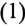
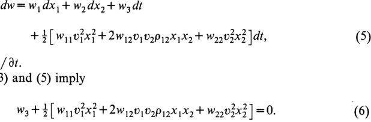
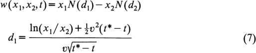
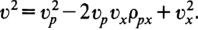

<!-- page: 1 -->

# The Value of an Option to Exchange One Asset for Another 

#### William Margrabe 

Journal of Finance, Volume 33, Issue 1 (Mar., 1978), 177-186. 

Your use of the JSTOR database indicates your acceptance of JSTOR’s Terms and Conditions of Use. A copy of JSTOR’s Terms and Conditions of Use is available at http://www.jstor.org/about/terms.html, by contacting JSTOR at jstor-info @umich.edu, or by calling JSTOR at (888)388-3574, (734)998-9101 or (FAX) (734)998-9113. No part of a JSTOR transmission may be copied, downloaded, stored, further transmitted, transferred, distributed, altered, or otherwise used, in any form or by any means, except: (1) one stored electronic and one paper copy of any article solely for your personal, non-commercial use, or (2) with prior written permission of JSTOR and the publisher of the article or other text. 

Each copy of any part of a JSTOR transmission must contain the same copyright notice that appears on the screen or printed page of such transmission. 

Journal ofFinance is published by American Finance Association. Please contact the publisher for further permissions regarding the use of this work. Publisher contact information may be obtained at http://www.jstor.org/journals/afina.html. 

###### Journal ofFinance 

©1978 American Finance Association 

JSTOR and the JSTOR logo are trademarks of JSTOR, and are Registered in the U.S. Patent and Trademark Office. For more information on JSTOR contact jstor-info@umich.edu. 

©2000 JSTOR

<!-- page: 2 -->

#### THE VALUE OF AN OPTION TO EXCHANGE ONE ASSET FOR ANOTHER 

###### WILLIAM MARGRABE* 

I. INTRODUCTION 

SOME COMMON FINANCIAL ARRANGEMENTS are equivalent to options to exchange one risky asset for another: the investment adviser’s performance incentive fee, the general margin account, the exchange offer, and the standby commitment. Yet the literature does not discuss the theory of such an option.' In this paper, I develop an equation for the value of the option to exchange one risky asset for another. My theory grows out of the brilliant Black-Scholes (1973) solution to the longstanding call option pricing problem—which assumes that the price of a riskless discount bond grew exponentially at the riskless interest rate—and Merton’s (1973) extension—in which the discount bond’s value is stochastic until maturity. 

In section II, I develop the pricing equation for a European-type option to exchange one asset for another. In section III, I show that such an option is worth more alive than dead, which implies that its owner will not exercise it until the last possible moment. Thus, the formula for the European option is also valid for its American counterpart. Since such an option is not only a call, but also a put, the formula is a closed-form expression for the value of a special sort of American put option. I derive the put-call parity theorem for American options of this sort. Section IV contains applications of the model to financial arrangements commonplace in the real world: the investment adviser’s performance incentive fee, the general margin account, the exchange offer, and the standby commitment. In the last section, I summarize the findings. 

II. THE MATHEMATICAL PROBLEM AND SOLUTION 

Since this problem and its solution are extensions of the Black-Scholes work, I will use their notation and assumptions as much as possible. The capital market is perfect, of course. Let x, and x, be the prices of assets one and two. Assume there are no dividends: all returns come from capital gains. The rate of return on each asset is given by 

#### dx,=x;[a,dt+v,dz,| (i=1,2), 

> *Lecturer, Department of Finance, The Wharton School, University of Pennsylvania. The author thanks Stephen Ross, Jeffrey Jaffe, and Randolph Westerfield for helpful discussions; Sudipto Bhattacharya, a referee for this Journal, for useful comments; and the Rodney L. White Center for Financial Research for assistance in preparing the manuscript. 

1. The Black-Scholes (1973) breakthrough spawned a burgeoning literature on the theory of option pricing—with applications. Smith (1976) comprehensively reviews these articles.

<!-- page: 3 -->

##### The Journal of Finance 

where dz, is a Wiener process. That is, the rate of return is an “Ito process.”” The correlation between the Wiener processes dz, and dz, is p,,. Further assume that a, and v, are constants. 

We want the equation for the value w(x,,x,,?) of a European-type option which can be exercised only at ¢*, when it will yield x,— x, if exercised or nothing if not exercised. This option is simultaneously a call option on asset one with exercise price x, and a put option on asset two with exercise price x,. Of course, the owner exercises his option if and only if this brings him a positive return. This implies the initial condition 

### W(X, Xp, ¢*) =max(0, x, — x2). 

The option is worth at least zero, and no more than x,, if assets one and two are worth at least zero: 

#### 0 < w(x),%2,0) < x). (2) 

The option buyer can hedge his position by selling w,=dw/0x, units of asset one short and buying —w,=—dw/dx, units of asset two. The pricing formula w(-) must be linear homogeneous in x, and x,,° so the hedger’s investment will be 

## W— W,X1— Wx, =0, (3) 

by Euler’s Theorem. That investment equals zero may seem puzzling. But in this hedge, to eliminate risk we eliminate the entire return. Thus, the value of the hedged position must be nil. 

The return on this investment over a short interval is nil: 

dw —w,dx,— w,dx,=0. (4) Black and Scholes (1973, p. 642) eliminate all risk, but not all the return. They convert a long position in the stock and a short position in the option into a riskless 

2. See McKean (1969) for a discussion of the theory of Ito processes and Merton (1973a) and Fischer (1975) for applications. 

3. First, consider the distribution of returns on an option to exchange asset two for asset one. This distribution of returns sells for w(x), X3,¢). 

Second, the distribution of returns on A options to exchange asset two for asset one sells for Aw(X},X2,t) in a perfect market (where all participants are price takers). 

Third, consider the distribution of returns of the option to exchange asset two for asset one, when both assets sell for A times what they sold for in the first case. Denote this market value by w(Ax2,A%2, £). The distribution of returns in the third case is identical to that given in the second case, given the Ito processes (described in paragraph one of section II) which generate prices x, and x,. Thus, the returns in the second case must sell for the same as those in the third case: 

> Aw(X1,X2,t)= WAX), AX, £). 

Thus w(-) is linear homogeneous in x, and x,. See also Merton (1973c, p. 149) on this point.

<!-- page: 4 -->

The Value ofan Option to Exchange One Asset for Another 

investment.’ From the stochastic calculus,° the return on the option is 

<!-- Start of picture text -->
dw =w,dx,+w,dx,+w,dt +3 [ 6 O7x72,2 + 201701090191X_ + W902X32,2 |dt, (5)  dt. and (5) imply Wy t 3 w 07x} + 2W 490,0042X 1X2 + W03x}| =0. (6) <!-- End of picture text -->

where w,= dw/ dt. Equations (3) and (5) imply 

The function w(x,,x>,7) is the solution to the differential equation (6), subject to the boundary conditions (2) and the initial condition (1): 

Here, N(-) is the cumulative standard normal density function and v?=v7—2v,02p,,+ 03 is the variance of (x,/x2)~'d(x,/x,). (v?=v? if v,=0, the BlackScholes case.) 

Equations (7) satisfy (6), (2), and (1), and are unique. The easiest way to prove this is to transform the problem at hand into the Black-Scholes problem. Let asset two be the numeraire.® Then the price of asset two in terms of itself is unity. The price of asset one is x= x,/x,. The option sells for W(X1X)/ X= W(x, /Xy, 1,2). 

The interest rate on a riskless loan denominated in units of asset two is zero in a perfect market. A lender of one unit of asset two demands one unit of asset two back as repayment of principle. He charges no interest on the loan, because asset 

4. We can create a long (short) position in either underlying asset out of a short (long) position in the other asset and an appropriate position in the option to exchange the assets. According to equation (3): 

X= (w—W2X2)/W, : 

and 

X= (w—w,x,)/Wp. 

5. See McKean (1969). Merton (1973c, sec. 6) develops the same differential equation en route to his alternative derivation of the Black-Scholes model. 

6. Stephen Ross suggested this lucid approach, which emphasizes the Black-Scholes heritage of this problem and its solution, and which lets us avoid much tedious mathematics. The student who wants to see all the mathematics can follow Merton’s (1973c, sec. 6) solution to an isomorphic problem.

<!-- page: 5 -->

two’s appreciation over the loan period is equilibrium compensation for the investment and risk. 

Taking asset two as numeraire, the option to exchange asset two for asset one is a call option on asset one, with exercise price equal to unity and interest rate equal to zero. This is a special case of the Black-Scholes problem. Thus, 

W(X4,X2,t)/x2= w(x, ft) 

=(x,/x,)N(d,)—1-e%- ON (d,), 

where w(x, 7) is the Black-Scholes formula. Equations (7) follow immediately. The Black-Scholes model is also a special case of (7), where x,=ce’¢-™, The Merton (1973) model, which allows a stochastic interest rate, is also a special case, where x,=cP(t*—1t), P(t*— 1) is the stochastic value of a default-free discount bond maturing at ¢*, and P(0)=1. Thus, in Merton’s model as in the Black-Scholes model, x,=c at r= ¢*. 

III. Some ExTENSIONS 

Equations (7) also give the value for American options, if x, and x, are equilibrium asset prices. The proof is simple. Consider two portfolios: 

A: purchase a European option to exchange asset one for asset two; B: purchase asset one and sell two short. The values of the portfolios at any time ¢ are 

A: W(X),X>,2) B: x, >. 

The returns at ¢* are 

A: max(0,x*— x) B: xf—x#. 

The return on Portfolio A dominates that on B, so A must sell for at least as much as B: ; W(X1,Xp,t) > X1— Xp. 

Thus, the value of a European option exceeds what you would get if you exercised a similar American option. So you will not exercise the American option early, and its value W(x,,x2,) will be exactly the same as that of a similar Eurorean option: W(x, X25 t) = w(x), X, t). Recall that the option to exchange two assets can be viewed as a call on x, or a put on x,, and that such an option is worth more alive than dead for t<7*. This does not contradict Merton’s (1973) conclusion that it may pay to exercise the ordinary American put option early. The exercise price for the ordinary American put is constant, not an asset price. For the moment, assume as Black and Scholes did that the interest rate is known and constant. Then ce’“~) is the value of a default-free discount bond paying c at t*. We know that an American option (whether a put or a call) with such an

<!-- page: 6 -->

#### The Value ofan Option to Exchange One Asset for Another 

exercise price is worth more alive than dead. Then, equation (7) gives the formula for an American option (put or call) whose exercise price grows exponentially at the riskless interest rate and equals c at 7*. 

Now, let E(t) be the deterministic exercise price of the option, a function of time. Stipulate that E(¢*)=c. Any American call option with an exercise price E(t) >ce™’-") for t<t*, must be worth the same as a European call option with exercise price c.’ We know that an American call option with exercise price E(t)=ce’@-™ is worth the same as the similar European option. Increasing the exercise price cannot increase the call option’s value. Nor can increasing the exercise price decrease the option’s value. The European call option has, in effect, an infinite exercise price until t*. Yet, this option sells for as much as the American call option with exercise price growing exponentially at the instantaneous interest rate. Similarly, an American put option with exercise price growing exponentially at the market interest rate until it reaches c at ¢* will sell for the same as a European put option with exercise price c at ¢*. If the American put option’s exercise price is always less than or equal to ce’“~, then that American option is worth the same as a similar European option. 

The preceding arguments imply a parity theorem® for European- and Americantype put and call options whose common exercise price is the price of some asset. Consider two portfolios. The first portfolio contains an American call option on asset one with exercise price equal to the price of asset two, a short position in an American put on asset one with the same exercise price as the call, and asset two. The second portfolio contains asset one. We know that an American option is worth more alive than dead, if its exercise price is an asset price. So the American options are worth the same as European options and will not be exercised before the expiration date ¢*. The holder of portfolio one will exchange asset two for asset one at /*, in any event. Thus, portfolios one and two will have the same value at /*. They must be worth the same at any time ¢< /*, or arbitrage would occur. Hence, the usual put-call parity theorem holds for these options to exchange two assets. The reader can confirm that 

W(X,Xp, 0) — W(Xq,X 4,0) + X2= | 

and 

#### W(X 1,X2,t)— W(x2,X,t) + x2 = X}. 

###### TV. APPLICATIONS 

The performance incentive fee, the margin account, the exchange offer, and the standby commitment are common arrangements which are also options to exchange one risky asset for another. 

> 7. Merton (1973c, p. 155) proves a similar theorem for discrete changes in the exercise price. 8. Stoll (1969) states the theorem. Merton (1973b) shows that the theorem does.not hold for ordinary American options.

<!-- page: 7 -->

##### A. The Performance Incentive Fee 

Modigliani and Pogue (1975) opened the discussion of performance incentive fees of the form 

Fee = 6(R,— R,) (8) 

for portfolio managers, where R, is the rate of return on the managed portfolio, R, is the rate of return on the standard against which performance is measured, and 6 is a number of dollars. The number 6 will usually fall between zero and the total that investors have invested in the managed portfolio. Margrabe (1976) proves that such a fee is worth nothing when entered into, in Sharpe-Lintner equilibrium. 

This fee arrangement is valuable to the adviser if he can default on his obligation under the arrangement. The adviser could declare personal bankruptcy in case the fee were so negative that his net worth was negative. Or an investment adviser might form a corporation to handle his business and collect the fee. He would have the protection of limited liability in case the fee were negative. In such cases, the portfolio management fee is equivalent to an option. We can compute its value using equations (7). 

For example, suppose the management corporation receives $10 million from its clients and invests it all. Management has no other assets. Management collects 10% of any superior performance of the managed portfolio over the standard and promises to pay its clients 10% of any inferior performance. (That is, =1 million.) Management plans to default if the managed portfolio does worse than the standard, and its clients know this. The fee arrangement lasts for six months. The monthly standard deviation of rate of return is 5% for the managed portfolio and 5% for the standard. The rates of return on the two portfolios are uncorrelated. Under these assumptions, the management corporation’s option would be worth $690 thousand, and management would have to pay its investors for it to get their business.” 

If management put up collateral to ensure its compliance with the fee agreement, it would be less likely to default and its option would be worth less. Equations (7) would still give the option value, though the calculations would be more tedious. In order to prohibit abuse, the management contract may specify that the management cannot change the nature of the managed portfolio, without compensating the investors for the change. Management would never unilaterally end the contract, because its option is always worth more alive than dead. Investors may find it desirable to withdraw their funds early, if that is allowed. But, this would void the manager’s option, so he would either rule out this possibility by contract or refuse to pay anything for the performance incentive fee. 

##### B. The Margin Account 

Suppose an investor buys securities worth x, on margin. (He borrows a fraction of the securities’ cost from his broker, securing the loan with the portfolio of securities.) When the sum c of the principal amount and accrued interest is payable, he can either repay his debt and claim the collateral or default. If the 

9. Evaluate equations (7) for x; = x,=$10 million, t*— t=6, v; =v, =.05, and p,.=0.

<!-- page: 8 -->

margin loan is his only liability and the collateral includes all his assets, he has an option on the collateral, where the striking price is c. Below, I discuss mainly this simple case. 

One may not think of this as an option, because its life is so brief. When the securities markets are open, the broker monitors the value of the collateral for the margin loan. He may ask for more collateral if its value shrinks (this is the margin call). If the investor fails to put up more collateral immediately, the broker may sell off some of the collateral and reduce the investor’s debit balance, until the remaining debit balance is adequately secured. If the collateral is dangerously small, the broker may sell some of it without notifying the investor. 

If the broker measures the value of the collateral every t*—t months, he has issued an option with a life of *—¢. In this application ¢* — ¢ can grow arbitrarily small, at the broker’s discretion. As ¢*—f approaches zero, the option value approaches the net asset value of the account, x,;—c. 

At the market’s daily close the margin trader has a European option which expires when the markets reopen. He ordinarily exercises this option by borrowing the exercise price from the broker if the collateral is adequate. He may have to meet a margin call if the collateral is poor. He might let the option expire if the collateral were inadequate. 

Sometimes the option lasts longer than the eighteen hours from the New York Stock Exchanges’s daily close at 4:00 p.m. until the 10:00 a.m. reopening. When a holiday interrupts the business week, the option is for 42 hours. Over a normal weekend the option is for 66 hours. Over a three-day weekend the option is for 90 hours. 

An investor might not exercise his option under exactly the circumstances implied by my analysis. I assume the investor holds all his non-human capital in his margin account. If the investor has other assets and liabilities, he may default when his net worth is negative. An investor might not default even if his net worth, as usually measured, was negative, if he thought the stigma of personal bankruptcy was horrible enough or would cause him sufficient future inconvenience. 

If the margin trader sells a risky security short, his option is to exchange his risky short position for his risky long position. Equations (7) can tell us what this option is worth. 

For example, consider two closed-end funds with the same systematic and nonsystematic risk (p,;,=1 and v,;=v,=.05, for monthly rates of return). An investor wants to finance the purchase of $100,000 worth of shares in the first fund with a short sale of shares in the second.!° The broker arranging this transaction will find it less risky than making a margin loan. In fact, the investor’s option is worthless. In equilibrium the broker will demand less compensation for this sort of transaction than he would for selling securities on margin. 

For other values of p,,, v, and v, the broker may find a short sale riskier. Suppose in the above example p,,= —1. Then the short sale and purchase would together be twice as risky as either one alone (v=2v,=2v,). The margin trader would be willing to pay some $1433 for this option over a three-day weekend and the broker would not sell it for less. 

10. Here we assume away regulations on short sales.

<!-- page: 9 -->

##### The Journal of Finance 

#### C. The Exchange Offer! 

An exchange offer of shares in one unlevered corporation for shares in another presents shareholders in the offeree corporation with an option to exchange one type of share for another. For simplicity, let the price of a share in firm one, z,, equal the price of a share in firm two, z,. Firm one has N shares; firm two has n. Suppose firm one, the much larger firm, announces it will trade one of its shares for one of firm two’s.’? The offer, firm and uncontested by firm two’s management, expires at ¢*. 

Further, assume this offer conveys no information about the prospects of either firm. Then the offer may increase the price of shares in the second firm, because these shareholders now have an option to exchange their shares for something else. This option is worth at least zero. 

We can compute the increase in the value of a share in firm two, after the exchange offer is made, but before it expires: substitute the value of what a shareholder in firm two gets if he exercises his option, 

## x)= [(N-n)z,+nz,]/N, 

and the value of what he gives up, 

: X2= Zy into equations (7). As usual, this option’s value depends on the characteristics of the joint distribution of x, and x, and on the length of time until the option expires. 

Under these circumstances, the management of firm one is acting against the best interest of its shareholders. Any gain to shareholders of firm two is a loss to shareholders in firm one, which grants the option. For, firm one is giving up this option in return for nothing. In a perfect market, a cash tender offer would be a similarly unwise move. (This says more about the stringent assumptions in this paper than about managerial irrationality.) 

Management of the offering firm could charge shareholders of the offeree firm a premium for the right to tender a share of the offeree’s stock. It would compensate the shareholders of the offering firm for the option they give up. This right would be valuable and might even trade apart from the stock to be tendered. 

##### D. The Standby Commitment 

The standby commitment is a put option on a forward contract in mortgage notes.'? The buyer gets the option to sell a bundle of mortgage notes at a predetermined price. He must exercise his option on or before the notification date, some month(s) before the delivery date: if he exercises his option, he sells his 

> 11. Ron Masulis suggested this application of the model. 12. Firm one will sell n/N of its (homogeneous) assets, use the proceeds to repurchase n shares, and trade the n shares for n shares in firm two. 13. Several types of standbyes exist. This section refers to the easiest type to analyze. The Federal National Mortgage Association offers types which do not fit this model. In this section we assume away problems associated with coupons on the mortgage notes. One can handle them as one handles dividend payments on stock.

<!-- page: 10 -->

mortgages in the forward market. Thus, the option is on a forward sale of mortgage notes. The commitment fee is the option premium. 

We want to find the value at ¢ of an option expiring at ¢* on a forward contract calling for delivery at some later date ¢**. Buyer will exercise his option at * (he won’t exercise it earlier) if the value at ¢* of his profit at t** is positive. Define C as the striking price. P(t)= P(t**,7) is the price at ¢ of a riskless, discount bond maturing at /**. Let X(7) be the spot price for the underlying mortgage notes. Thus buyer will exercise his option if CP(t*)— X(t*)>0, and the option value at f* is 

; max[0,PC—X’]. 

Assume that percentage changes in the spot price X are an Ito process with constant drift a, and dispersion V,: dX/X=a,dt+V,dz,. As Merton (1973c) proposes, assume the riskless discount bond will be worth unity when it matures. Until then changes in its prices are given by the stochastic differential 

#### dP/P=«a,dt+v,dz,. 

Let x,=PC and x,=X, both asset prices. Then for all ¢< ¢* this option is worth 

W (X15 Xp5f) 

=w(PC,X,?) = PCN(d,)— XN(d,), 

where 

d,=[In(PC/X)+ 0°(t*—1)+2]+ovt*—1 , d,=d,—vyt*—-t , 

and 

###### V. SUMMARY 

In this paper I develop an equation for the value of an option to exchange one asset for another within a stated period. The formula applies to American options, as well as European ones; to puts, as well as calls. Thus, I found a closed-form expression for this sort of American put option and a put-call parity theorem for such American options. 

One can apply the equation to options that investors create when they enter into certain common financial arrangements. The investment adviser, who receives a fee which depends at least in part on how well his managed portfolio does relative to some standard, has an option to refuse the fee and declare bankruptcy if the fee is extremely negative. The short-seller has the option to similarly escape his obligations, at the expense of his broker. The offeree in an exchange offer may have the

<!-- page: 11 -->

##### The Journal of Finance 

opportunity to exchange one company’s securities for those of another. The buyer of a standby commitment has the (put) option to trade mortgage notes for dollars in the forward market. In each case the value of the option depends not only on the current values of the assets which might be exchanged, but also on the variancecovariance matrix for the rates of return on the two assets, and on the life of the option. 

###### REFERENCES 

1. Fischer Black. “The Pricing of Commodity Contracts,” Journal of Financial Economics, Volume 3 (January/March 1976). 

2. ———. “The Pricing of Complex Options and Corporate Liabilities,’ Graduate School of Business, University of Chicago, 1975. . 

3. ——~ and Myron Scholes. “The Pricing of Options and Corporate Liabilities,” Journal of Political Economy, Volume 81 (May/June 1973), pp. 637-654. 

4. Ruel Vance Churchill. Fourier Series and Boundary Value Problems, 2nd ed. New York, McGrawHill, 1963. 

5. Stanley Fischer. “The Demand for Index Bonds,” Journal of Political Economy, Volume 83 (June 1975), pp. 509-534. 

6. Jonathan E. Ingersoll, Jr. “A Theoretical and Empirical Investigation of the Dual Purpose Funds,” Journal of Financial Economics, Volume 3 (January /March 1976), pp. 83-123. 

7. Fritz John. Partial Differential Equations, 2nd ed. New York, Springer Verlag, 1975. 

8. William Margrabe. “Alternative Investment Performance Fee Arangements and Implications for SEC Regulatory Policy: A Comment,” Bell Journal of Economics, Volume 7 (Autumn 1976), pp. 716-718. 

9. H. P. McKean, Jr., Stochastic Integrals, New York, Academic Press, 1969. 

10. Robert C. Merton. “An Intertemporal Capital Asset Pricing Model,” Econometrica, Volume 41 (September 1973a), pp. 867-887. 

- 11, ———. “The Relationship between Put and Call Option Prices: Comment,” Journal of Finance, Volume 28 (March 1973b), pp. 183-184. 

- 12, ———. “The Theory of Rational Option Pricing,” The Bell Journal of Economics and Management Science, Volume 4 (Spring 1973c), pp. 141-183. 

13. Franco Modigliani and Gerald A. Pogue. “Alternative Investment Performance Fee Arrangements and Implications for SEC Regulatory Policy,” Bell Journal of Economics, Volume 6 (Spring 1975), pp. 127-160. 

14. Clifford W. Smith, Jr. “Option Pricing: A Review,” Journal of Financial Economics, Volume 3 (January /March 1976), pp. 3-51. 

15. Hans R. Stoll. “The Relationship between Put and Call Option Prices,” Journal of Finance, Volume 24 (December 1969), pp. 802-824.
