<!-- page: 1 -->

# **Option Pricing:  A Simplified Approach****†** 

### John C. Cox 

_Massachusetts Institute of Technology and Stanford University_ 

Stephen A. Ross _Yale University_ 

Mark Rubinstein _University of California, Berkeley_ 

March 1979 (revised  July 1979) 

(published under the same title in _Journal of Financial Economics_ (September 1979)) 

[1978 winner of the Pomeranze Prize of the Chicago Board Options Exchange] 

[reprinted in _Dynamic Hedging: A Guide to Portfolio Insurance_ , edited by Don Luskin (John Wiley and Sons 1988)] 

[reprinted in _The Handbook of Financial Engineering_ , edited by Cliff Smith and Charles Smithson (Harper and Row 1990)] 

[reprinted in _Readings in Futures Markets_ published by the Chicago Board of Trade, Vol. VI (1991)] 

[reprinted in _Vasicek and Beyond: Approaches to Building and Applying Interest Rate Models_ , edited by Risk Publications, Alan Brace (1996)] 

[reprinted in _The Debt Market_ , edited by Stephen Ross and Franco Modigliani (Edward Lear Publishing 2000)] 

[reprinted in _The International Library of Critical Writings in Financial Economics: Options Markets_ edited by G.M. Constantinides and A..G. Malliaris (Edward Lear Publishing  2000)] 

### **Abstract** 

_This paper presents a simple discrete-time model for valuing options.  The fundamental economic principles of option pricing by arbitrage methods are particularly clear in this setting. Its development requires only elementary mathematics, yet it contains as a special limiting case the celebrated Black-Scholes model, which has previously been derived only by much more difficult methods.  The basic model readily lends itself to generalization in many ways. Moreover, by its very construction, it gives rise to a simple and efficient numerical procedure for valuing options for which premature exercise may be optimal._ 

____________________ 

> † Our best thanks go to William Sharpe, who first suggested to us the advantages of the discrete-time approach to option pricing developed here.  We are also grateful to our students over the past several years.  Their favorable reactions to this way of presenting things encouraged us to write this article.  We have received support from the National Science Foundation under Grants Nos. SOC-77-18087 and SOC-77-22301.

<!-- page: 2 -->

## **1.  Introduction** 

An option is a security that gives its owner the right to trade in a fixed number of shares of a specified common stock at a fixed price at any time on or before a given date.  The act of making this transaction is referred to as exercising the option.  The fixed price is termed the strike price, and the given date, the expiration date.  A call option gives the right to buy the shares; a put option gives the right to sell the shares. 

Options have been traded for centuries, but they remained relatively obscure financial instruments until the introduction of a listed options exchange in 1973.  Since then, options trading has enjoyed an expansion unprecedented in American securities markets. 

Option pricing theory has a long and illustrious history, but it also underwent a revolutionary change in 1973.  At that time, Fischer Black and Myron Scholes presented the first completely satisfactory equilibrium option pricing model.  In the same year, Robert Merton extended their model in several important ways.  These path-breaking articles have formed the basis for many subsequent academic studies. 

As these studies have shown, option pricing theory is relevant to almost every area of finance. For example, virtually all corporate securities can be interpreted as portfolios of puts and calls on the assets of the firm.1 Indeed, the theory applies to a very general class of economic problems — the valuation of contracts where the outcome to each party depends on a quantifiable uncertain future event. 

Unfortunately, the mathematical tools employed in the Black-Scholes and Merton articles are quite advanced and have tended to obscure the underlying economics.  However, thanks to a suggestion by William Sharpe, it is possible to derive the same results using only elementary mathematics.2 

In this article we will present a simple discrete-time option pricing formula.  The fundamental economic principles of option valuation by arbitrage methods are particularly clear in this setting.  Sections 2 and 3 illustrate and develop this model for a call option on a stock that pays no dividends.  Section 4 shows exactly how the model can be used to lock in pure arbitrage profits if the market price of an option differs from the value given by the model.  In section 5, we will show that our approach includes the Black-Scholes model as a special limiting case.  By taking the limits in a different way, we will also obtain the Cox-Ross (1975) jump process model as another special case. 

> 1 To take an elementary case, consider a firm with a single liability of a homogeneous class of pure discount bonds. The stockholders then have a “call” on the assets of the firm which they can choose to exercise at the maturity date of the debt by paying its principal to the bondholders.  In turn, the bonds can be interpreted as a portfolio containing a default-free loan with the same face value as the bonds and a short position in a put on the assets of the firm. 

> 2 Sharpe (1978) has partially developed this approach to option pricing in his excellent new book, _Investments_ . Rendleman and Bartter (1978) have recently independently discovered a similar formulation of the option pricing problem.

<!-- page: 3 -->

Other more general option pricing problems often seem immune to reduction to a simple formula.  Instead, numerical procedures must be employed to value these more complex options. Michael Brennan and Eduardo Schwartz (1977) have provided many interesting results along these lines.  However, their techniques are rather complicated and are not directly related to the economic structure of the problem.  Our formulation, by its very construction, leads to an alternative numerical procedure that is both simpler, and for many purposes, computationally more efficient. 

Section 6 introduces these numerical procedures and extends the model to include puts and calls on stocks that pay dividends.  Section 7 concludes the paper by showing how the model can be generalized in other important ways and discussing its essential role in valuation by arbitrage methods. 

## **2.  The Basic Idea** 

Suppose the current price of a stock is _S_ = $50, and at the end of a period of time, its price must be either _S_ * = $25  or _S_ * = $100.  A call on the stock is available with a strike price of _K_ = $50, expiring at the end of the period.3 It is also possible to borrow and lend at a 25% rate of interest. The one piece of information left unfurnished is the current value of the call, _C_ .  However, if riskless profitable arbitrage is not possible, we can deduce from the given information _alone_ what the value of the call _must_ be! 

Consider the following levered hedge: 

(1)  write 3 calls at _C_ each, (2)  buy 2 shares at $50 each, and (3)  borrow $40 at 25%, to be paid back at the end of the period. 

Table 1 gives the return from this hedge for each possible level of the stock price at expiration. Regardless of the outcome, the hedge exactly breaks even on the expiration date.  Therefore, to prevent profitable riskless arbitrage, its current cost must be zero; that is, 

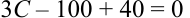

The current value of the call must then be _C_ = $20. 

> 3 To keep matters simple, assume for now that the stock will pay no cash dividends during the life of the call.  We also ignore transaction costs, margin requirements and taxes.

<!-- page: 4 -->

**Table 1** 

### **Arbitrage Table Illustrating the Formation of a Riskless Hedge** 

|| |expirationdate   |
|---|---|---|
||presentdate|_S_* =$25 _S_* =$100|
|write 3 calls|3_C_|— –150|
|buy 2 shares|–100|50 200|
|borrow|40|–50 –50|
|total||— —|

If the call were not priced at $20, a sure profit would be possible.  In particular, if _C_ = $25, the above hedge would yield a current cash inflow of $15 and would experience no further gain or loss in the future.  On the other hand, if _C_ = $15, then the same thing could be accomplished by buying 3 calls, selling short 2 shares, and lending $40. 

Table 1 can be interpreted as demonstrating that _an appropriately levered position in stock will replicate the future returns of a call_ .  That is, if we buy shares and borrow against them in the right proportion, we can, in effect, duplicate a pure position in calls.  In view of this, it should seem less surprising that all we needed to determine the _exact_ value of the call was its _strike price, underlying stock price, range of movement in the underlying stock price, and the rate of interest_ .  What may seem more incredible is what we do not need to know:  among other things, _we do not need to know the probability that the stock price will rise or fall_ .  Bulls and bears must agree on the value of the call, relative to its underlying stock price! 

This example is very simple, but it shows several essential features of option pricing.  And we will soon see that it is not as unrealistic as it seems. 

## **3.  The Binomial Option Pricing Formula** 

In this section, we will develop the framework illustrated in the example into a complete valuation method.  We begin by assuming that the stock price follows a multiplicative binomial process over discrete periods.  The rate of return on the stock over each period can have two possible values: _u –_ 1 with probability _q_ , or _d –_ 1 with probability 1 _– q_ .  Thus, if the current stock price is _S_ , the stock price at the end of the period will be either _uS_ or _dS_ .  We can represent this movement with the following diagram: 

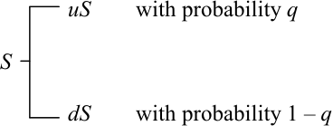

We also assume that the interest rate is constant.  Individuals may borrow or lend as much as they wish at this rate.  To focus on the basic issues, we will continue to assume that there are no

<!-- page: 5 -->

taxes, transaction costs, or margin requirements.  Hence, individuals are allowed to sell short any security and receive full use of the proceeds.4 

Letting _r_ denote one plus the riskless interest rate over one period, we require _u_ > _r_ > _d_ .  If these inequalities did not hold, there would be profitable riskless arbitrage opportunities involving only the stock and riskless borrowing and lending.5 

To see how to value a call on this stock, we start with the simplest situation:  the expiration date is just one period away.  Let _C_ be the current value of the call, _Cu_ be its value at the end of the period if the stock price goes to _uS_ and _Cd_ be its value at the end of the period if the stock price goes to _dS_ .  Since there is now only one period remaining in the life of the call, we know that the terms of its contract and a rational exercise policy imply that _Cu_ = max[0, _uS – K_ ] and _Cd_ = max[0, _dS – K_ ].  Therefore, 

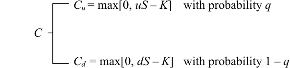

Suppose we form a portfolio containing Δ shares of stock and the dollar amount _B_ in riskless bonds.6 This will cost  Δ _S_ + _B_ .  At the end of the period, the value of this portfolio will be 

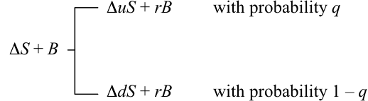

Since we can select  Δ  and _B_ in any way we wish, suppose we choose them to equate the endof-period values of the portfolio and the call for each possible outcome.  This requires that 

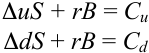

Solving these equations, we find 

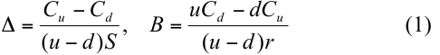

> 4 Of course, restitution is required for payouts made to securities held short. 

> 5 We will ignore the uninteresting special case where _q_ is zero or one and _u_ = _d_ = _r_ . 

> 6 Buying bonds is the same as lending; selling them is the same as borrowing.

<!-- page: 6 -->

With  Δ  and _B_ chosen in this way, we will call this the hedging portfolio. 

If there are to be no riskless arbitrage opportunities, the current value of the call, _C_ , cannot be less than the current value of the hedging portfolio,  Δ _S_ + _B_ .  If it were, we could make a riskless profit with no net investment by buying the call and selling the portfolio.  It is tempting to say that it also cannot be worth more, since then we would have a riskless arbitrage opportunity by reversing our procedure and selling the call and buying the portfolio.  But this overlooks the fact that the person who bought the call we sold has the right to exercise it immediately. 

Suppose that  Δ _S_ + _B_ < _S – K_ .  If we try to make an arbitrage profit by selling calls for more than Δ _S_ + _B_ , but less than _S – K_ , then we will soon find that we are the source of arbitrage profits rather than the recipient.  Anyone could make an arbitrage profit by buying our calls and exercising them immediately. 

We might hope that we will be spared this embarrassment because everyone will somehow find it advantageous to hold the calls for one more period as an investment rather than take a quick profit by exercising them immediately.  But each person will reason in the following way.  If I do not exercise now, I will receive the same payoff as a portfolio with  Δ _S_ in stock and _B_ in bonds. If I do exercise now, I can take the proceeds, _S – K_ , buy this same portfolio and some extra bonds as well, and have a higher payoff in every possible circumstance.  Consequently, no one would be willing to hold the calls for one more period. 

Summing up all of this, we conclude that if there are to be no riskless arbitrage opportunities, it must be true that 

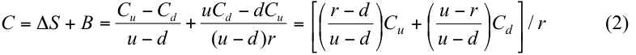

if this value is greater than _S – K_ , and if not, _C_ = _S – K_ .7 

Equation (2) can be simplified by defining 

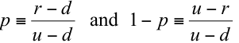

so that we can write 

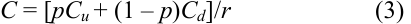

It is easy to see that in the present case, with no dividends, this will always be greater than _S – K_ as long as the interest rate is positive.  To avoid spending time on the unimportant situations where the interest rate is less than or equal to zero, we will now assume that _r_ is always greater 

> 7 In some applications of the theory to other areas, it is useful to consider options that can be exercised only on the expiration date.  These are usually termed European options.  Those that can be exercised at any earlier time as well, such as we have been examining here, are then referred to as American options.  Our discussion could be easily modified to include European calls.  Since immediate exercise is then precluded, their values would always be given by (2), even if this is less than _S – K_ .

<!-- page: 7 -->

than one.  Hence, (3) is the exact formula for the value of a call one period prior to the expiration in terms of _S_ , _K_ , _u_ , _d_ , and _r_ . 

To confirm this, note that if _uS_ ≤ _K_ , then _S_ < _K_ and _C_ = 0, so _C_ > _S – K_ .  Also, if _dS_ ≥ _K_ , then _C_ = _S –_ ( _K_ / _r_ ) > _S – K_ .  The remaining possibility is _uS_ > _K_ > _dS_ .  In this case, _C_ = _p_ ( _uS – K_ )/ _r_ . This is greater than _S – K_ if  (1 _– p_ ) _dS_ > ( _p – r_ ) _K_ , which is certainly true as long as _r_ > 1. 

This formula has a number of notable features.  First, the probability _q_ does not appear in the formula.  This means, surprisingly, that even if different investors have different subjective probabilities about an upward or downward movement in the stock, they could still agree on the relationship of _C_ to _S_ , _u_ , _d_ , and _r_ . 

Second, the value of the call does not depend on investors’ attitudes toward risk.  In constructing the formula, the only assumption we made about an individual’s behavior was that he prefers more wealth to less wealth and therefore has an incentive to take advantage of profitable riskless arbitrage opportunities.  We would obtain the same formula whether investors are risk-averse or risk-preferring. 

Third, the only random variable on which the call value depends is the stock price itself.  In particular, it does not depend on the random prices of other securities or portfolios, such as the market portfolio containing all securities in the economy.  If another pricing formula involving other variables was submitted as giving equilibrium market prices, we could immediately show that it was incorrect by using our formula to make riskless arbitrage profits while trading at those prices. 

It is easier to understand these features if it is remembered that the formula is only a relative pricing relationship giving _C_ in terms of _S_ , _u_ , _d_ , and _r_ .  Investors’ attitudes toward risk and the characteristics of other assets may indeed influence call values indirectly, through their effect on these variables, but they will not be separate determinants of call value. 

Finally, observe that _p_ ≡ ( _r – d_ )/( _u – d_ )  is always greater than zero and less than one, so it has the properties of a probability.  In fact, _p_ is the value _q_ would have in equilibrium if investors were risk-neutral.  To see this, note that the expected rate of return on the stock would then be the riskless interest rate, so 

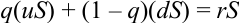

and 

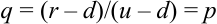

Hence, the value of the call can be interpreted as the expectation of its discounted future value in a risk-neutral world.  In light of our earlier observations, this is not surprising.  Since the formula does not involve _q_ or any measure of attitudes toward risk, then it must be the same for any set of preferences, including risk neutrality. 

It is important to note that this does not imply that the equilibrium expected rate of return on the call is the riskless interest rate.  Indeed, our argument has shown that, in equilibrium, holding the call over the period is exactly equivalent to holding the hedging portfolio.  Consequently, the risk

<!-- page: 8 -->

and expected rate of return of the call must be the same as that of the hedging portfolio.  It can be shown that  Δ ≥ 0  and _B_ ≤ 0, so the hedging portfolio is equivalent to a particular levered long position in the stock.  In equilibrium, the same is true for the call.  Of course, if the call is currently mispriced, its risk and expected return over the period will differ from that of the hedging portfolio. 

Now we can consider the next simplest situation:  a call with two periods remaining before its expiration date.  In keeping with the binomial process, the stock can take on three possible values after two periods, 

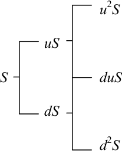

Similarly, for the call, 

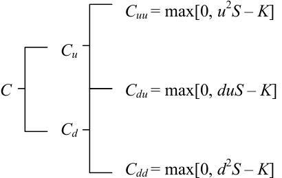

_Cuu_ stands for the value of a call two periods from the current time if the stock price moves upward each period; _Cdu_ and _Cdd_ have analogous definitions. 

At the end of the current period there will be one period left in the life of the call, and we will be faced with a problem identical to the one we just solved.  Thus, from our previous analysis, we know that when there are two periods left, 

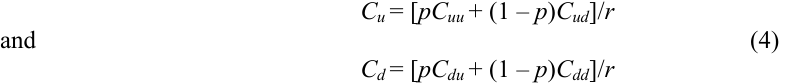

Again, we can select a portfolio with  Δ _S_ in stock and _B_ in bonds whose end-of-period value will be _Cu_ if the stock price goes to _uS_ and _Cd_ if the stock price goes to _dS_ .  Indeed, the

<!-- page: 9 -->

functional form of Δ  and _B_ remains unchanged.  To get the new values of Δ  and _B_ , we simply use equation (1) with the new values of _Cu_ and _Cd_ . 

Can we now say, as before, that an opportunity for profitable riskless arbitrage will be available if the current price of the call is not equal to the new value of this portfolio or _S – K_ , whichever is greater?  Yes, but there is an important difference.  With one period to go, we could plan to lock in a riskless profit by selling an overpriced call and using part of the proceeds to buy the hedging portfolio.  At the end of the period, we knew that the market price of the call must be equal to the value of the portfolio, so the entire position could be safely liquidated at that point. But this was true only because the end of the period was the expiration date.  Now we have no such guarantee.  At the end of the current period, when there is still one period left, the market price of the call could still be in disequilibrium and be greater than the value of the hedging portfolio.  If we closed out the position then, selling the portfolio and repurchasing the call, we could suffer a loss that would more than offset our original profit.  However, we could always avoid this loss by maintaining the portfolio for one more period.  The value of the portfolio at the end of the current period will always be exactly sufficient to purchase the portfolio we would want to hold over the last period.  In effect, we would have to readjust the proportions in the hedging portfolio, but we would not have to put up any more money. 

Consequently, we conclude that even with two periods to go, there is a strategy we could follow which would guarantee riskless profits with no net investment if the current market price of a call differs from the maximum of  Δ _S_ + _B_ and _S – K_ .  Hence, the larger of these is the current value of the call. 

Since  Δ  and _B_ have the same functional form in each period, the current value of the call in terms of _Cu_ and _Cd_ will again be _C_ = [ _pCu_ + (1 _– p_ ) _Cd_ ]/ _r_ if this is greater than _S – K_ , and _C_ = _S – K_ otherwise.  By substituting from equation (4) into the former expression, and noting that _Cdu_ = _Cud_ , we obtain 

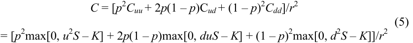

A little algebra shows that this is always greater than _S – K_ if, as assumed, _r_ is always greater than one, so this expression gives the exact value of the call.8 

All of the observations made about formula (3) also apply to formula (5), except that the number of periods remaining until expiration, _n_ , now emerges clearly as an additional determinant of the call value.  For formula (5), _n_ = 2.  That is, the full list of variables determining _C_ is _S_ , _K_ , _n_ , _u_ , _d_ , and _r_ . 

> 8 In the current situation, with no dividends, we can show by a simple direct argument that if there are no arbitrage opportunities, then the call value must always be greater than _S – K_ before the expiration date.  Suppose that the call is selling for _S – K_ .  Then there would be an easy arbitrage strategy that would require no initial investment and would always have a positive return.  All we would have to do is buy the call, short the stock, and invest _K_ dollars in bonds.  See Merton (1973).  In the general case, with dividends, such an argument is no longer valid, and we must use the procedure of checking every period.

<!-- page: 10 -->

<!-- Start of picture text -->
B a BS ) BL) fF BR VERT <!-- End of picture text -->

<!-- page: 11 -->

### **Binomial Option Pricing Formula** 

_C_ = _S_ φ[ _a_ ; _n_ , _p′_ ] _– Kr__–n_ φ[ _a_ ; _n_ , _p_ ] 

where 

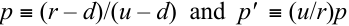

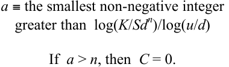

It is now clear that all of the comments we made about the one period valuation formula are valid for any number of periods.  In particular, the value of a call should be the expectation, in a riskneutral world, of the discounted value of the payoff it will receive.  In fact, that is exactly what equation (6) says.  Why, then, should we waste time with the recursive procedure when we can write down the answer in one direct step?  The reason is that while this one-step approach is always technically correct, it is really useful only if we know in advance the circumstances in which a rational individual would prefer to exercise the call before the expiration date.  If we do not know this, we have no way to compute the required expectation.  In the present example, a call on a stock paying no dividends, it happens that we can determine this information from other sources:  the call should never be exercised before the expiration date.  As we will see in section 6, with puts or with calls on stocks that pay dividends, we will not be so lucky.  Finding the optimal exercise strategy will be an integral part of the valuation problem.  The full recursive procedure will then be necessary. 

For some readers, an alternative “complete markets” interpretation of our binomial approach may be instructive.  Suppose that π _u_ and π _d_ represent the state-contingent discount rates to states _u_ and _d_ , respectively.  Therefore,  π _u_ would be the current price of one dollar received at the end of the period, if and only if state _u_ occurs.  Each security — a riskless bond, the stock, and the option — must all have returns discounted to the present by  π _u_ and  π _d_ if no riskless arbitrage opportunities are available.  Therefore, 

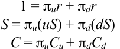

The first two equations, for the bond and the stock, imply

<!-- page: 12 -->

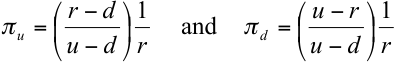

Substituting these equalities for the state-contingent prices in the last equation for the option yields equation (3). 

It is important to realize that we are not assuming that the riskless bond and the stock and the option are the only three securities in the economy, or that other securities must follow a binomial process.  Rather, however these securities are priced in relation to others in equilibrium, among themselves they must conform to the above relationships. 

From either the hedging or complete markets approaches, it should be clear that three-state or trinomial stock price movements will not lead to an option pricing formula based solely on arbitrage considerations.  Suppose, for example, that over each period the stock price could move to _uS_ or _dS_ or remain the same at _S_ .  A choice of  Δ  and _B_ that would equate the returns in two states could not in the third.  That is, a riskless arbitrage position could not be taken.  Under the complete markets interpretation, with three equations in now three unknown state-contingent prices, we would lack the redundant equation necessary to price one security in terms of the other two. 

## **4.  Riskless Trading Strategies** 

The following numerical example illustrates how we could use the formula if the current _market price  M_ ever diverged from its _formula value  C_ .  If _M_ > _C_ , we would hedge, and if _M_ < _C_ , “reverse hedge”, to try and lock in a profit.  Suppose the values of the underlying variables are 

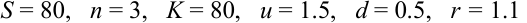

In this case, _p_ = ( _r – d_ )/( _u – d_ ) = 0.6.  The relevant values of the discount factor are 

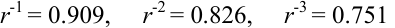

The paths the stock price may follow and their corresponding probabilities (using probability _p_ ) are, when _n_ = 3, with _S –_ 80,

<!-- page: 13 -->

||||270|
|---|---|---|---|
||||(.216)|
|||180 (.36)||
||120||90|
||(.6)||(.432)|
|80||60||
|||(.48)||
||40||30|
||(.4)||(.288)|
|||20||
|||(.16)||
||||10|
||||(.064)|

when _n_ = 2, if _S_ = 120, 

|270 (.36)|
|---|
|180 (.6)|
|120 90 (.48)|
|60|
|(.4)|
|30|
|(.16)|

<!-- page: 14 -->

when _n_ = 2, if _S_ = 40, 

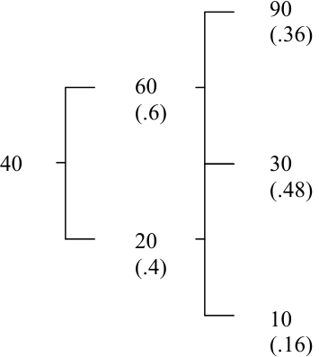

<!-- Start of picture text -->
90 (.36) 60 (.6) 40  30 (.48) 20 (.4) 10 (.16) <!-- End of picture text -->

Using the formula, the current value of the call would be 

_C_ = 0.751[0.064(0) + 0.288(0) + 0.432(90 _–_ 80) + 0.216(270 _–_ 80)] = 34.065. 

Recall that to form a riskless hedge, for each call we sell, we buy and subsequently keep adjusted a portfolio with  Δ _S_ in stock and _B_ in bonds, where  Δ = ( _Cu – Cd_ )/( _u – d_ ) _S_ .  The following tree diagram gives the paths the call value may follow and the corresponding values of  Δ: 

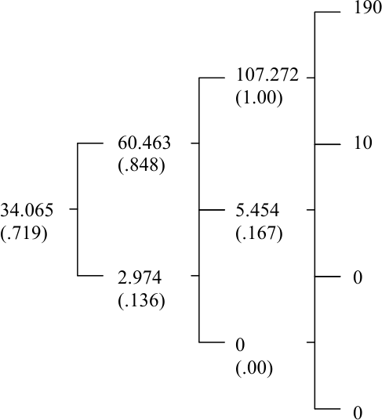

<!-- Start of picture text -->
190 107.272 (1.00) 60.463  10 (.848) 34.065  5.454 (.719)  (.167) 2.974  0 (.136) 0 (.00) 0 <!-- End of picture text -->

<!-- page: 15 -->

With this preliminary analysis, we are prepared to use the formula to take advantage of mispricing in the market. Suppose that when _n_ = 3, the market price of the call is 36.  Our formula tells us the call should be worth 34.065.  The option is overpriced, so we could plan to sell it and assure ourselves of a profit equal to the mispricing differential.  Here are the steps you could take for a typical path the stock might follow. 

_Step 1_ ( _n_ = 3):  Sell the call for 36.  Take 34.065 of this and invest it in a portfolio containing  Δ = 0.719 shares of stock by borrowing 0.719(80) _–_ 34.065 = 23.455.  Take the remainder, 36 _–_ 34.065 = 1.935, and put it in the bank. 

_Step 2_ ( _n_ = 2):  Suppose the stock goes to 120 so that the new  Δ  is 0.848.  Buy 0.848 _–_ 0.719 = 0.129 more shares of stock at 120 per share for a total expenditure of 15.480.  Borrow to pay the bill.  With an interest rate of 0.1, you already owe 23.455(1.1) = 25.801.  Thus, your total current indebtedness is 25.801 + 15.480 = 41.281. 

_Step 3_ ( _n_ = 1):  Suppose the stock price now goes to 60.  The new  Δ  is 0.167.  Sell 0.848 _–_ 0.167 = 0.681 shares at 60 per share, taking in 0.681(60) = 40.860.  Use this to pay back part of your borrowing.  Since you now owe 41.281(1.1) = 45.409, the repayment will reduce this to 45.409 _–_ 40.860 = 4.549. 

_Step 4d_ ( _n_ = 0):  Suppose the stock price now goes to 30.  The call you sold has expired worthless.  You own 0.167 shares of stock selling at 30 per share, for a total value of 0.167(30) = 5.  Sell the stock and repay the 4.549(1.1) = 5 that you now owe on the borrowing.  Go back to the bank and withdraw your original deposit, which has now grown to 1.935(1.1)3 = 2.341. 

_Step 4u_ ( _n_ = 0):  Suppose, instead, the stock price goes to 90.  The call you sold is in the money at the expiration date.  Buy back the call, or buy one share of stock and let it be exercised, incurring a loss of 90 _–_ 80 = 10 either way.  Borrow to cover this, bringing your current indebtedness to 5 + 10 = 15.  You own 0.167 shares of stock selling at 90 per share, for a total value of 0.167(90) = 15.  Sell the stock and repay the borrowing.  Go back to the bank and withdraw your original deposit, which has now grown to 1.935(1.1)3 = 2.341. 

In summary, if we were correct in our original analysis about stock price movements (which did not involve the unenviable task of predicting whether the stock price would go up or down), and if we faithfully adjust our portfolio as prescribed by the formula, then we can be assured of walking away in the clear at the expiration date, while still keeping the original differential and the interest it has accumulated.  It is true that closing out the position before the expiration date, which involves buying back the option at its then current market price, might produce a loss which would more than offset our profit, but this loss could always be avoided by waiting until the expiration date.  Moreover, if the market price comes into line with the formula value before the expiration date, we can close out the position then with no loss and be rid of the concern of keeping the portfolio adjusted. 

It still might seem that we are depending on rational behavior by the person who bought the call we sold.  If instead he behaves foolishly and exercises at the wrong time, could he makes things worse for us as well as for himself?  Fortunately, the answer is no.  Mistakes on his part can only

<!-- page: 16 -->

mean greater profits for us.  Suppose that he exercises too soon.  In that circumstance, the hedging portfolio will always be worth more than _S – K_ , so we could close out the position then with an extra profit. 

Suppose, instead, that he fails to exercise when it would be optimal to do so.  Again there is no problem.  Since exercise is now optimal, our hedging portfolio will be worth _S – K_ ._9_ If he had exercised, this would be exactly sufficient to meet the obligation and close out the position. Since he did not, the call will be held at least one more period, so we calculate the new values of _Cu_ and _Cd_ and revise our hedging portfolio accordingly.  But now the amount required for the portfolio,  Δ _S_ + _B_ , is less than the amount we have available, _S – K_ .  We can withdraw these extra profits now and still maintain the hedging portfolio.  The longer the holder of the call goes on making mistakes, the better off we will be. 

Consequently, we can be confident that things will eventually work out right no matter what the other party does.  The return on our total position, when evaluated at prevailing market prices at intermediate times, may be negative.  But over a period ending no later than the expiration date, it will be positive. 

In conducting the hedging operation, the essential thing was to maintain the proper proportional relationship:  for each call we are short, we hold Δ shares of stock and the dollar amount _B_ in bonds in the hedging portfolio.  To emphasize this, we will refer to the number of shares held for each call as the hedge ratio.  In our example, we kept the number of calls constant and made adjustments by buying or selling stock and bonds.  As a result, our profit was independent of the market price of the call between the time we initiated the hedge and the expiration date.  If things got worse before they got better, it did not matter to us. 

Instead, we could have made the adjustments by keeping the number of shares of stock constant and buying or selling calls and bonds.  However, this could be dangerous.  Suppose that after initiating the position, we needed to increase the hedge ratio to maintain the proper proportions. This can be achieved in two ways: 

- (a) buy more stock, or 

- (b) buy back some of the calls. 

If we adjust through the stock, there is no problem.  If we insist on adjusting through the calls, not only is the hedge no longer riskless, but it could even end up losing money!  This can happen if the call has become even more overpriced.  We would then be closing out part of our position in calls at a loss.  To remain hedged, the number of calls we would need to buy back depends on their value, not their price.  Therefore, since we are uncertain about their price, we then become uncertain about the return from the hedge.  Worse yet, if the call price gets high enough, the loss on the closed portion of our position could throw the hedge operation into an overall loss. 

> 9 If we were reverse hedging by buying an undervalued call and selling the hedging portfolio, then we would ourselves want to exercise at this point.  Since we will receive _S – K_ from exercising, this will be exactly enough money to buy back the hedging portfolio.

<!-- page: 17 -->

To see how this could happen, let us rerun the hedging operation, where we adjust the hedge ratio by buying and selling calls. 

_Step 1_ ( _n_ = 3):  Same as before. 

_Step 2_ ( _n_ = 2):  Suppose the stock goes to 120, so that the new Δ = 0.848.  The call price has gotten further out of line and is now selling for 75.  Since its value is 60.463, it is now overpriced by 14.537.  With 0.719 shares, you must buy back 1 _–_ 0.848 = 0.152 calls to produce a hedge ratio of 0.848 = 0.719/0.848.  This costs 75(0.152) = 11.40.  Borrow to pay the bill.  With the interest rate of 0.1, you already owe 23.455(1.1) = 25.801.  Thus, your total current indebtedness is 25.801 + 11.40 = 37.201. 

_Step 3_ ( _n_ = 1):  Suppose the stock goes to 60 and the call is selling for 5.454.  Since the call is now fairly valued, no further excess profits can be made by continuing to hold the position. Therefore, liquidate by selling your 0.719 shares for 0.719(60) = 43.14 and close out the call position by buying back 0.848 calls for 0.848(5.454) = 4.625.  This nets 43.14 _–_ 4.625 = 38.515. Use this to pay back part of your borrowing.  Since you now owe 37.20(1.1) = 40.921, after repayment you owe 2.406.  Go back to the bank and withdraw your original deposit, which has now grown to 1.935(1.1)2 = 2.341.  Unfortunately, after using this to repay your remaining borrowing, you still owe 0.065. 

Since we adjusted our position at Step 2 by buying overpriced calls, our profit is reduced. Indeed, since the calls were considerably overpriced, we actually lost money despite apparent profitability of the position at Step 1.  We can draw the following adjustment rule from our experiment: _To adjust a hedged position, never buy an overpriced option or sell an underpriced option._ As a corollary, whenever we can adjust a hedged position by buying more of an underpriced option or selling more of an overpriced option, our profit will be enhanced if we do so.  For example, at Step 3 in the original hedging illustration, had the call still been overpriced, it would have been better to adjust the position by selling more calls rather than selling stock.  In summary, by choosing the right side of the position to adjust at intermediate dates, _at a minimum_ we can be assured of earning the original differential and its accumulated interest, and we may earn considerably more. 

## **5.  Limiting Cases** 

In reading the previous sections, there is a natural tendency to associate with each period some particular length of calendar time, perhaps a day.  With this in mind, you may have had two objections.  In the first place, prices a day from now may take on many more than just two possible values.  Furthermore, the market is not open for trading only once a day, but, instead, trading takes place almost continuously. 

These objections are certainly valid.  Fortunately, our option pricing approach has the flexibility to meet them.  Although it might have been natural to think of a period as one day, there was nothing that forced us to do so.  We could have taken it to be a much shorter interval — say an hour — or even a minute.  By doing so, we have met both objections simultaneously.  Trading

<!-- page: 18 -->

would take place far more frequently, and the stock price could take on hundreds of values by the end of the day. 

However, if we do this, we have to make some other adjustments to keep the probability small that the stock price will change by a large amount over a minute.  We do not want the stock to have the same percentage up and down moves for one minute as it did before for one day.  But again there is no need for us to have to use the same values.  We could, for example, think of the price as making only a very small percentage change over each minute. 

To make this more precise, suppose that _h_ represents the elapsed time between successive stock price changes.  That is, if _t_ is the fixed length of calendar time to expiration, and _n_ is the number of periods of length _h_ prior to expiration, then 

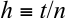

As trading takes place more and more frequently, _h_ gets closer and closer to zero.  We must then adjust the interval-dependent variables _r_ , _u_ , and _d_ in such a way that we obtain empirically realistic results as _h_ becomes smaller, or, equivalently, as _n_ → ∞. 

When we were thinking of the periods as having a fixed length, _r_ represented both the interest rate over a fixed length of calendar time and the interest rate over one period.  Now we need to make a distinction between these two meanings.  We will let _r_ continue to mean one plus the interest rate over a fixed length of calendar time.  When we have occasion to refer to one plus the ˆ interest rate over a period (trading interval) of length _h_ , we will use the symbol _r_ . 

ˆ Clearly, the size of _r_ depends on the number of subintervals, _n_ , into which _t_ is divided.  Over ˆ _n_ ˆ the _n_ periods until expiration, the total return is _r_ , where _n_ = _t_ / _h_ .  Now not only do we want _r_ to depend on _n_ , but we want it to depend on _n_ in a particular way — so that as _n_ changes the ˆ _n_ total return _r_ over the fixed time _t_ remains the same.  This is because the interest rate obtainable over some fixed length of calendar time should have nothing to do with how we choose to think of the length of the time interval _h_ . 

If _r_ (without the “hat”) denotes one plus the rate of interest over a _fixed_ unit of calendar time, then over elapsed time _t_ , _r__t_ is the total return.10 Observe that this measure of total return does ˆ not depend on _n_ .  As we have argued, we want to choose the dependence of _r_ on _n_ , so that 

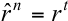

ˆ _t_ / _n_ ˆ for any choice of _n_ .  Therefore, _r_ = _r_ .  This last equation shows how _r_ must depend on _n_ for the total return over elapsed time _t_ to be independent of _n_ . 

We also need to define _u_ and _d_ in terms of _n_ .  At this point, there are two significantly different paths we can take.  Depending on the definitions we choose, as _n_ → ∞  (or, equivalently, as _h_ → 0), we can have either a continuous or a jump stochastic process.  In the first situation, very 

> 10 The scale of this unit (perhaps a day, or a year) is unimportant as long as _r_ and _t_ are expressed in the same scale.

<!-- page: 19 -->

small random changes in the stock price will be occurring in each very small time interval.  The stock price will fluctuate incessantly, but its path can be drawn without lifting pen from paper. In contrast, in the second case, the stock price will usually move in a smooth deterministic way, but will occasionally experience sudden discontinuous changes.  Both can be derived from our binomial process simply by choosing how _u_ and _d_ depend on _n_ .  We examine in detail only the continuous process that leads to the option pricing formula originally derived by Fischer Black and Myron Scholes.  Subsequently, we indicate how to develop the jump process formula originally derived by John Cox and Stephen Ross. 

Recall that we supposed that over each period the stock price would experience a one plus rate of return of _u_ with probability _q_ and _d_ with probability 1 _– q_ .  It will be easier and clearer to work, instead, with the natural logarithm of the one plus rate of return,  log _u_ or  log _d_ .  This gives the continuously compounded rate of return on the stock over each period.  It is a random variable which, in each period, will be equal to  log _u_ with probability _q_ and  log _d_ with probability  1 _– q_ . 

Consider a typical sequence of five moves, say _u_ , _d_ , _u_ , _u_ , _d_ .  Then the final stock price will be _S_ * = _uduudS_ ; _S_ */ _S_ = _u_3 _d_2 , and  log( _S_ */ _S_ ) = 3 log _u_ + 2 log _d_ .  More generally, over _n_ periods, 

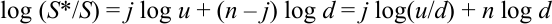

where _j_ is the (random) number of upward moves occurring during the _n_ periods to expiration. Therefore, the expected value of  log( _S_ */ _S_ )  is 

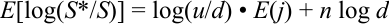

and its variance is 

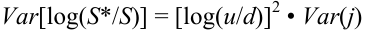

Each of the _n_ possible upward moves has probability _q_ .  Thus, _E_ ( _j_ ) = _nq_ .  Also since the variance each period is _q_ (1 _– q_ )2 + (1 _– q_ )(0 _– q_ )2 = _q_ (1 _– q_ ), then _Var_ ( _j_ ) = _nq_ (1 _– q_ ). Combining all of this, we have 

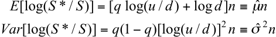

Let us go back to our discussion.  We were considering dividing up our original longer time period (a day) into many shorter periods (a minute or even less).  Our procedure calls for, over fixed length of calendar time _t_ , making _n_ larger and larger.  Now if we held everything else constant while we let _n_ become large, we would be faced with the problem we talked about ˆ ˆ 2 earlier.  In fact, we would certainly not reach a reasonable conclusion if either µ _n_ or � _n_ went to zero or infinity as _n_ became large.  Since _t_ is a fixed length of time, in searching for a realistic result, we must make the appropriate adjustments in _u_ , _d_ , and _q_ .  In doing that, we would at least want the mean and variance of the continuously compounded rate of return of the assumed stock price movement to coincide with that of the actual stock price as _n_ → ∞.

<!-- page: 20 -->

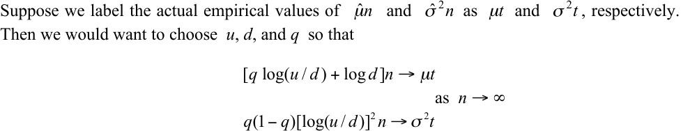

A little algebra shows we can accomplish this by letting 

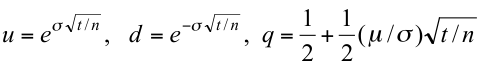

In this case, for any _n_ , 

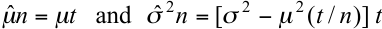

ˆ 2 2 ˆ Clearly, as _n_ → ∞,  � _n_ � � _t_ while µ _n_ = µ _t_ for all values of _n_ . 

Alternatively, we could have chosen _u_ , _d_ , and _q_ so that the mean and variance of the future stock price for the discrete binomial process approach the prespecified mean and variance of the actual stock price as _n_ → ∞.  However, just as we would expect, the same values will accomplish this as well.  Since this would not change our conclusions, and it is computationally more convenient to work with the continuously compounded rates of return, we will proceed in that way. 

This satisfies our initial requirement that the limiting means and variances coincide, but we still need to verify that we are arriving at a sensible limiting probability distribution of the continuously compounded rate of return.  The mean and variance only describe certain aspects of that distribution. 

For our model, the random continuously compounded rate of return over a period of length _t_ is the sum of _n_ independent random variables, each of which can take the value  log _u_ with probability _q_ and  log _d_ with probably  1 _– q_ .  We wish to know about the distribution of this sum as _n_ becomes large and _q_ , _u_ , and _d_ are chosen in the way described.  We need to remember that as we change _n_ , we are not simply adding one more random variable to the previous sum, but instead are changing the probabilities and possible outcomes for every member of the sum.  At this point, we can rely on a form of the central limit theorem which, when applied to our problem, says that, as _n_ → ∞, if 

then 

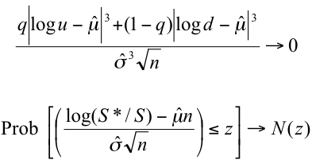

<!-- page: 21 -->

where _N_ ( _z_ )  is the standard normal distribution function.  Putting this into words, as the number of periods into which the fixed length of time to expiration is divided approaches infinity, the probability that the standardized continuously compounded rate of return of the stock through the expiration date is not greater than the number _z_ approaches the probability under a standard normal distribution. 

The initial condition says roughly that higher-order properties of the distribution, such as how it is skewed, become less and less important, relative to its standard deviation, as _n_ → ∞.  We can verify that the condition is satisfied by making the appropriate substitutions and finding 

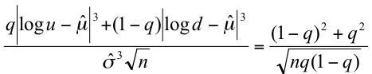

1 1 which goes to zero as _n_ → ∞ since _q_ = + (µ /�) _t_ / _n_ .  Thus, the multiplicative binomial 2 2 model for stock prices includes the lognormal distribution as a limiting case. 

Black and Scholes began directly with continuous trading and the assumption of a lognormal distribution for stock prices.  Their approach relied on some quite advanced mathematics. However, since our approach contains continuous trading and the lognormal distribution as a limiting case, the two resulting formulas should then coincide.  We will see shortly that this is indeed true, and we will have the advantage of using a much simpler method.  It is important to remember, however, that the economic arguments we used to link the option value and the stock price are exactly the same as those advanced by Black and Scholes (1973) and Merton (1973, 1977). 

The formula derived by Black and Scholes, rewritten in terms of our notation, is 

### **Black-Scholes Option Pricing Formula** 

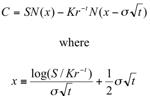

<!-- Start of picture text -->
C = SN ( x ) � Kr � t N ( x � � t ) where log( S / Kr � t ) 1 x � + � t � t 2 <!-- End of picture text -->

We now wish to confirm that our binomial formula converges to the Black-Scholes formula ˆ when _t_ is divided into more and more subintervals, and _r_ , _u_ , _d_ , and _q_ are chosen in the way we described — that is, in a way such that the multiplicative binomial probability distribution of stock prices goes to the lognormal distribution. 

For easy reference, let us recall our binomial option pricing formula:

<!-- page: 22 -->

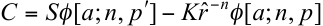

ˆ _n_ The similarities are readily apparent. _r_� is, of course, always equal to _r_-_t_ .  Therefore, to show the two formulas converge, we need only show that as _n_ → ∞ 

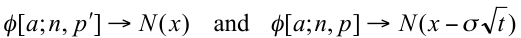

We will consider only  φ[ _a_ ; _n_ , _p_ ], since the argument is exactly the same for  φ[ _a_ ; _n_ , _p′_ ]. 

The complementary binomial distribution function  φ[ _a_ ; _n_ , _p_ ]  is the probability that the sum of _n_ random variables, each of which can take on the value 1 with the probability _p_ and 0 with the probability  1 _– p_ , will be greater than or equal to _a_ .  We know that the random value of this sum, _j_ , has mean _np_ and standard deviation _np_ 1( � _p_ ) .  Therefore, 

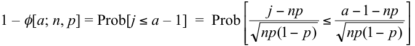

Now we can make an analogy with our earlier discussion.  If we consider a stock which in each period will move to _uS_ with probability _p_ and _dS_ with probability  1 _– p_ , then  log( _S_ */ _S_ ) = _j_ log ( _u_ / _d_ ) + _n_ log _d_ .  The mean and variance of the continuously compounded rate of return of this stock are 

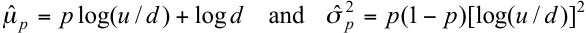

Using these equalities, we find that 

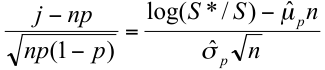

Recall from the binomial formula that 

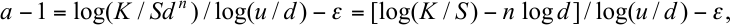

> ˆ ˆ 2 

> where � is a number between zero and one.  Using this and the definitions of µ _p_ and � _p_ , with a little algebra, we have 

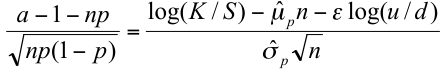

Putting these results together,

<!-- page: 23 -->

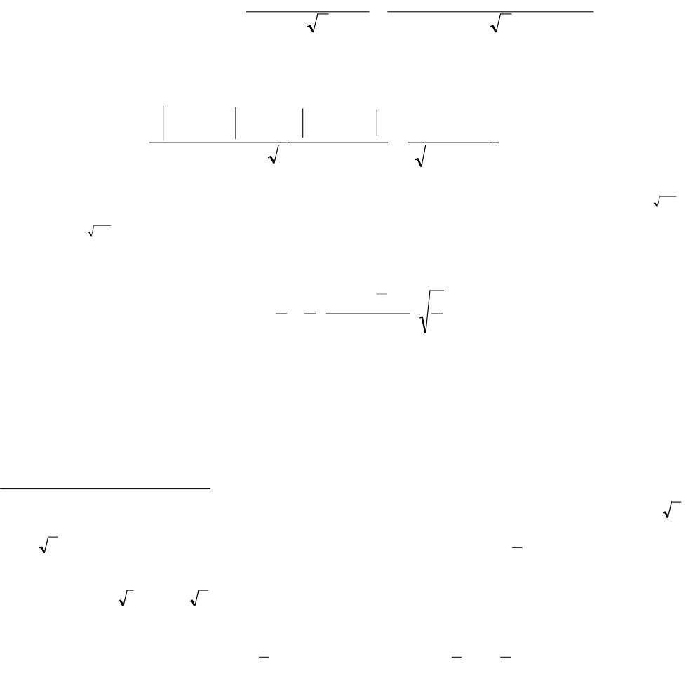

<!-- Start of picture text -->
| - = - | —>- ot” . {0 } : b y e b l) <!-- End of picture text -->

<!-- page: 24 -->

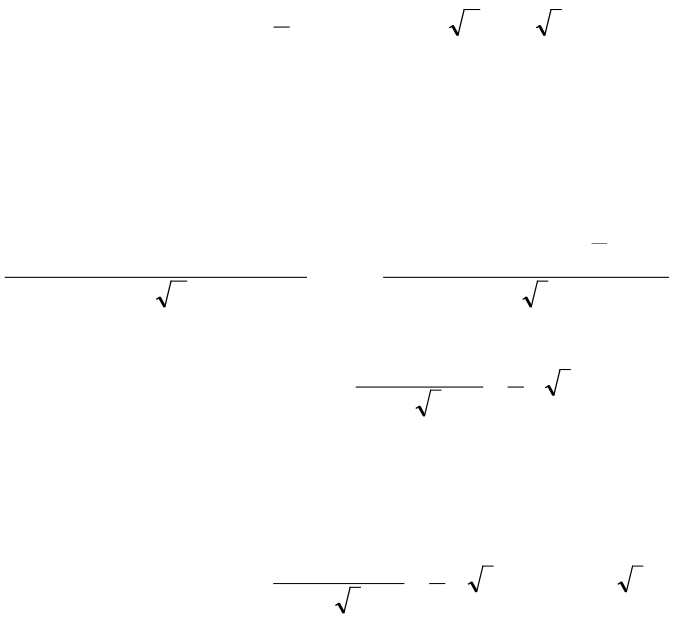

<!-- Start of picture text -->
-( 0 ) Wor _ - -( -@) ov o v | o od @ a ar - ow -ov <!-- End of picture text -->

<!-- Start of picture text -->
[=] (=) - <!-- End of picture text -->

<!-- page: 25 -->

As we have remarked, the seeds of both the Black-Scholes formula and a continuous-time jump process formula are both contained within the binomial formulation.  At which end point we arrive depends on how we take limits.  Suppose, in place of our former correspondence for _u_ , _d_ , and _q_ , we instead set 

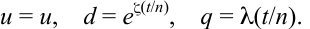

This correspondence captures the essence of a pure jump process in which each successive stock price is almost always close to the previous price ( _S_ → _dS_ ), but occasionally, with low but continuing probability, significantly different ( _S_ → _uS_ ).  Observe that, as _n_ → ∞, the probability of a change by _d_ becomes larger and larger, while the probability of a change by _u_ approaches zero. 

With these specifications, the initial condition of the central limit theorem we used is no longer satisfied, and it can be shown the stock price movements converge to a log-Poisson rather than a lognormal distribution as _n_ → ∞.  Let us define 

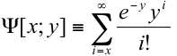

as the complementary Poisson distribution function.  The limiting option pricing formula for the above specifications of _u_ , _d_ and _q_ is then 

### **Jump Process Option Pricing Formula** 

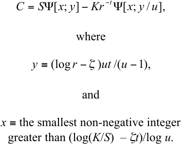

<!-- Start of picture text -->
C = S �[ x ; y ] � Kr � t �[ x ; y / u ], where y � (log r ��) ut /( u � 1), and x  ≡ the smallest non-negative integer greater than (log( K / S )   –  ζ t )/log u . <!-- End of picture text -->

A very similar formula holds if we let _u_ = _e_ζ(_t_/_n_) , _d_ = _d_ , and  1 _– q_ = λ( _t_ / _n_ ). 

Based on our previous analysis, we would now suspect that, as _n_ → ∞, our difference equation would approach the Black-Scholes partial differential equation.  This can be confirmed by substituting our definitions of _r_ ˆ , _u_ , _d_ in terms of _n_ in the way described earlier, expanding _Cu_ , _Cd_ in a Taylor series around ( _e_ � _h S_ , _t_ � _h_ ) and ( _e_ �� _h S_ , _t_ � _h_ ) , respectively, and then expanding _e_ � _h_ , _e_ �� _h_ , and _r__h_ in a Taylor series, substituting these in the equation and collecting terms.  If we then divide by _h_ and let _h_ → 0, all terms of higher order than _h_ go to zero.  This yields the Black-Scholes equation.

<!-- page: 26 -->

## **6.  Dividends and Put Pricing** 

So far we have been assuming that the stock pays no dividends.  It is easy to do away with this restriction.  We will illustrate this with a specific dividend policy:  the stock maintains a constant yield,  δ, on each ex-dividend date.  Suppose there is one period remaining before expiration and the current stock price is _S_ .  If the end of the period is an ex-dividend date, then an individual who owned the stock during the period will receive at that time a dividend of either  δ _uS_ or  δ _dS_ . Hence, the stock price at the end of the period will be either _u_ (1 _–_ δ)_v_ _S_ or _d_ (1 _–_ δ)_v_ _S_ , where _v_ = 1  if the end of the period is an ex-dividend date and _v_ = 0  otherwise,  Both  δ  and _v_ are assumed to be known with certainty. 

When the call expires, its contract and a rational exercise policy imply that its value must be either 

or 

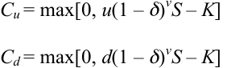

Therefore, 

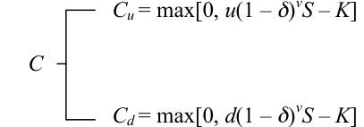

Now we can proceed exactly as before.  Again, we can select a portfolio of  Δ  shares of stock and the dollar amount _B_ in bonds that will have the same end-of-period value as the call.14 By retracting our previous steps, we can show that 

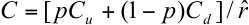

if this is greater than _S – K_ and _C_ = _S – K_ otherwise.  Here, once again, _p_ = ˆ( _r_ � _d_ ) /( _u_ � _d_ ) and � = ( _Cu_ � _Cd_ ) /( _u_ � _d_ ) _S_ . 

Thus far the only change is that  (1 _–_ δ)_v_ _S_ has replaced _S_ in the values for _Cu_ and _Cd_ .  Now we come to the major difference:  early exercise may be optimal.  To see this, suppose that _v_ = 1 and _d_ (1 _–_ δ) _S_ > _K_ .  Since _u_ > _d_ , then, also, _u_ (1 _–_ δ) _S_ > _K_ .  In this case, _Cu_ = _u_ (1 _–_ δ) _S – K_ and ˆ _Cd_ = _d_ (1 _–_ δ) _S – K_ .  Therefore, since ( _u_ / _r_ )ˆ _p_ + ( _d_ / _r_ )(1 � _p_ ) = ,1 then 

> 14 Remember that if we are long the portfolio, we will receive the dividend at the end of the period; if we are short, we will have to make restitution for the dividend.

<!-- page: 27 -->

For sufficiently high stock prices, this can obviously be less than _S – K_ .  Hence, there are definitely some circumstances in which no one would be willing to hold the call for one more period. 

ˆ In fact, there will always be a critical stock price, _S_ˆ , such that if _S_ > _S_ , the call should be ˆ exercised immediately. _S_ˆ will be the stock price at which [ _pCu_ + 1( � _p_ ) _Cd_ /] _r_ = _S_ � _K_ .15 That is, it is the lowest stock price at which the value of the hedging portfolio exactly equals _S – K_ .  This means _S_ˆ will, other things equal, be lower the higher the dividend yield, the lower the interest rate, and the lower the strike price. 

We can extend the analysis to an arbitrary number of periods in the same way as before.  There is only one additional difference, a minor modification in the hedging operation.  Now the funds in the hedging portfolio will be increased by any dividends received, or decreased by the restitution required for dividends paid while the stock is held short. 

Although the possibility of optimal exercise before the expiration date causes no conceptual difficulties, it does seem to prohibit a simple closed-form solution for the value of a call with many periods to go.  However, our analysis suggests a sequential numerical procedure that will allow us to calculate the continuous-time value to any desired degree of accuracy. 

Let _C_ be the current value of a call with _n_ periods remaining.  Define 

so that _~~v~~_ ( _n_ , _i_ ) is the number of ex-dividend dates occurring during the next _n – i_ periods.  Let _C_ ( _n_ , _i_ , _j_ )  be the value of the call _n – i_ periods from now, given that the current stock price _S_ has changed to _u jd n_ � _i_ � _j_ 1( � �) _~~v~~_ ( _n_ , _i_ ) _S_ , where _j_ = 0, 1, 2, …, _n – i_ . 

With this notation, we are prepared to solve for the current value of the call by working backward in time from the expiration date.  At expiration, _i_ = 0, so that 

One period before the expiration date, _i_ = 1 so that 

More generally, _i_ periods before expiration 

> 15 Actually solving for _S_ ˆ explicitly is straightforward but rather tedious, so we will omit it.

<!-- page: 28 -->

Observe that each prior step provides the inputs needed to evaluate the right-hand arguments of each succeeding step.  The number of calculations decreases as we move backward in time. Finally, with _n_ periods before expiration, since _i – n_ , 

and the hedge ratio is 

We could easily expand the analysis to include dividend policies in which the amount paid on any ex-dividend date depends on the stock price at that time in a more general way.16 However, this will cause some minor complications.  In our present example with a constant dividend yield, the possible stock prices _n – i_ periods from now are completely determined by the total number of upward moves (and ex-dividend dates) occurring during that interval.  With other types of dividend policies, the enumeration will be more complicated, since then the terminal stock price will be affected by the timing of the upward moves as well as their total number.  But the basic principle remains the same.  We go to the expiration date and calculate the call value for all of the possible prices that the stock could have then.  Using this information, we step back one period and calculate the call values for all possible stock prices at that time, and so forth. 

We will now illustrate the use of the binomial numerical procedure in approximating continuoustime call values.  In order to have an exact continuous-time formula to use for comparison, we will consider the case with no dividends.  Suppose that we are given the inputs required for the Black-Scholes option pricing formula: _S_ , _K_ , _t_ , σ, and _r_ .  To convert this information into the ˆ inputs _d_ , _u_ , and _r_ required for the binomial numerical procedure, we use the relationships: 

Table 2 gives us a feeling for how rapidly option values approximated by the binomial method approach the corresponding limiting Black-Scholes values given by _n_ = ∞.  At _n_ = 5, the values differ by at most $0.25, and at _n_ = 20, they differ by at most $0.07.  Although not shown, at _n_ = 50, the greatest difference is less than $0.03, and at _n_ = 150, the values are identical to the penny. 

To derive a method for valuing puts, we again use the binomial formulation.  Although it has been convenient to express the argument in terms of a particular security, a call, this is not essential in any way.  The same basic analysis can be applied to puts. 

> 16 We could also allow the amount to depend on previous stock prices.

<!-- page: 29 -->

Letting _P_ denote the current price of a put, with one period remaining before expiration, we have 

Once again, we can choose a portfolio with  Δ _S_ in stock and _B_ in bonds which will have the same end-of-period values as the put.  By a series of steps that are formally equivalent to the ones we followed in section 3, we can show that 

if this is greater than _K – S_ , and _P_ = _K – S_ otherwise.  As before, _p_ = ˆ( _r_ � _d_ ) /( _u_ � _d_ ) and  Δ = ( _Pu – Pd_ )/( _u – d_ ) _S_ .  Note that for puts, since _Pu_ ≤ _Pd_ , then  Δ ≤ 0. This means that if we sell an overvalued put, the hedging portfolio that we buy will involve a short position in the stock. 

We might hope that with puts we will be spared the complications caused by optimal exercise before the expiration date.  Unfortunately, this is not the case.  In fact, the situation is even worse in this regard.  Now there are always some possible circumstances in which no one would be willing to hold the put for one more period. 

To see this, suppose _K_ > _u_ (1 – δ)_v_ _S_ .  Since _u_ > _d_ , then, also, _K_ > _d_ (1 – δ)_v_ _S_ .  In this case, _Pu_ = ˆ _K_ – _u_ (1 – δ)_v_ _S_ and _Pd_ = _K_ – _d(_ 1 – δ)_v_ _S_ .  Therefore, since ( _u_ / _r_ )ˆ _p_ + ( _d_ / _r_ )(1 � _p_ ) = 1, then 

If there are no dividends (that is, _v_ = 0), then this is certainly less than _K_ – _S_ .  Even with _v_ = 1, it will be less for a sufficiently low stock price. 

> Thus, there will now be a critical stock price, _S_ˆ , such that if _S_ < _S_ˆ , the put should be exercised immediately.  By analogy with our discussion for the call, we can see that this is the stock price ˆ at which [ _pPu_ + 1( � _p_ ) _Pd_ /] _r_ = _K_ � _S_ .  Other things equal, _S_ˆ will be higher the lower the dividend yield, the higher the interest rate, and the higher the strike price.  Optimal early exercise thus becomes more likely if the put is deep-in-the-money and the interest rate is high.  The effect of dividends yet to be paid diminishes the advantages of immediate exercise, since the put buyer will be reluctant to sacrifice the forced declines in the stock price on future ex-dividend dates. 

This argument can be extended in the same way as before to value puts with any number of periods to go.  However, the chance for optimal exercise before the expiration date once again seems to preclude the possibility of expressing this value in a simple form.  But our analysis also indicates  that,  with  slight  modification,  we can value puts with the same numerical techniques

<!-- page: 30 -->

**Table 2** 

### **Binomial Approximation of Continuous-time Call Values (** **_S_ = 40 and** **_r_ = 1.05)****†** 

|||_n_= 5|||_n_= 20|||_n_=∞|||
|---|---|---|---|---|---|---|---|---|---|---|
|σ|_K_|JAN|APR|JUL|JAN|APR|JUL|JAN|APR|JUL|
||35|5.14|5.77|6.45|5.15|5.77|6.39|5.15|5.76|6.40|
|0.2|40|1.05|2.26|3.12|0.99|2.14|2.97|1.00|2.17|3.00|
||45|0.02|0.54|1.15|0.02|0.51|1.11|0.02|0.51|1.10|
||35|5.21|6.30|7.15|5.22|6.26|7.19|5.22|6.25|7.17|
|0.3|40|1.53|3.21|4.36|1.44|3.04|4.14|1.46|3.07|4.19|
||45|0.11|1.28|2.12|0.15|1.28|2.23|0.16|1.25|2.24|
||35|5.40|6.87|7.92|5.39|6.91|8.05|5.39|6.89|8.09|
|0.4|40|2.01|4.16|5.61|1.90|3.93|5.31|1.92|3.98|5.37|
||45|0.46|1.99|3.30|0.42|2.09|3.42|0.42|2.10|3.43|

† The January options have one month to expiration, the Aprils, four months, and the Julys, seven months; _r_ and  σ  are expressed in annual terms.

<!-- page: 31 -->

we use for calls.  Reversing the difference between the stock price and the strike price at each stage is the only change.17 

The diagram presented in table 3 shows the stock prices, put values, and values of  Δ  obtained in this way for the example given in section 4.  The values used there were _S_ = 80, _K_ = 80, _n_ = 3, ˆ _u_ = 1.5, _d_ = 0.5,  and _r_ = 1.1.  To include dividends as well, we assumed that a cash dividend of five percent (δ = 0.05) will be paid at the end of the last period before the expiration date. Thus, 1( � �) _~~v~~_ ( _n_ 0,) = 0.95, 1( � �) _~~v~~_ ( _n_ 1,) = 0.95, and 1( � �) _~~v~~_ ( _n_ 2,) = 1.0.  Put values in _italics_ indicate that immediate exercise is optimal. 

### **Table 3** 

### **Three-period Binomial Tree for an American Put** 

||||256.5 (.00)|
|---|---|---|---|
|||171||
||120|(.00) (.00)|85.5|
||(8.363)||(.00)|
||(–.192)|||
|80||57||
|(19.108)||(_23.00_)||
|(–.396)||(–.50)||
||40||28.5|
||(_40.00_)||(_51.5_)|
||(–.950)|||
|||19||
|||(_61.00_)||
|||(–1.00)||
||||9.5|
||||(_70.5_)|

17 Michael Parkinson (1977) has suggested a similar numerical procedure based on a trinomial process, where the stock price can increase, decrease, or remain unchanged.  In fact, given the theoretical basis for the binomial numerical procedure provided, the numerical method can be generalized to permit _k_ + 1 ≤ _n_ jumps to new stock prices in each period.  We can consider exercise only every _k_ periods, using the binomial formula to leap across intermediate periods.  In effect, this means permitting _k_ + 1  possible new stock prices before exercise is again considered.  That is, instead of considering exercise _n_ times, we would only consider it about _n_ / _k_ times.  For fixed _t_ and _k_ , as _n_ → ∞, option values will approach their continuous-time values. 

This alternative procedure is interesting, since it may enhance computer efficiency.  At one extreme, for calls on stocks which do not pay dividends, setting _k_ + 1 = _n_ gives the most efficient results.  However, when the effect of potential early exercise is important and greater accuracy is required, the most efficient results are achieved by setting _k_ = 1, as in our description above.

<!-- page: 32 -->

## **7.  Conclusion** 

It should now be clear that whenever stock price movements conform to a discrete binomial process, or to a limiting form of such a process, options can be priced solely on the basis of arbitrage considerations.  Indeed, we could have significantly complicated the simple binomial process while still retaining this property. 

The probabilities of an upward or downward move did not enter into the valuation formula. Hence, we would obtain the same result if _q_ depended on the current or past stock prices or on other random variables.  In addition, _u_ and _d_ could have been deterministic functions of time. More significantly, the size of the percentage changes in the stock price over each period could have depended on the stock price at the beginning of each period or on previous stock prices.18 However, if the size of the changes were to depend on any other random variable, not itself perfectly correlated with the stock price, then our argument will no longer hold.  If any arbitrage result is then still possible, it will require the use of additional assets in the hedging portfolio. 

We could also incorporate certain types of imperfections into the binomial option pricing approach, such as differential borrowing and lending rates and margin requirements.  These can be shown to produce upper and lower bounds on option prices, outside of which riskless profitable arbitrage would be possible. 

Since all existing preference-free option pricing results can be derived as limiting forms of a discrete two-state process, we might suspect that two-state stock price movements, with the qualifications mentioned above, must be in some sense necessary, as well as sufficient, to derive option pricing formulas based solely on arbitrage considerations.  To price an option by arbitrage methods, there must exist a portfolio of other assets that exactly replicates in every state of nature the payoff received by an optimally exercised option.  Our basic proposition is the following.  Suppose, as we have, that markets are perfect, that changes in the interest rate are never random, and that changes in the stock price are always random.  In a discrete time model, a necessary and sufficient condition for options of all maturities and strike prices to be priced by arbitrage using only the stock and bonds in the portfolio is that in each period, 

(a) the stock price can change from its beginning-of-period value to only two ex-dividend values at the end of the period, and 

(b) the dividends and the size of each of the two possible changes are presently known functions depending at most on:  (i) current and past stock prices, (ii) current and past values of random variables whose changes in each period are perfectly correlated with the change in the stock price, and (iii) calendar time. 

> 18 Of course, different option pricing formulas would result from these more complex stochastic processes.  See Cox and Ross (1976) and Geske (1979).  Nonetheless, all option pricing formulas in these papers can be derived as limiting forms of a properly specified discrete two-state process.

<!-- page: 33 -->

The sufficiency of the condition can be established by a straightforward application of the methods we have presented.  Its necessity is implied by the discussion at the end of section 3.19,20,21 

This rounds out the principal conclusion of this paper:  the simple two-state process is really the essential ingredient of option pricing by arbitrage methods.  This is surprising, perhaps, given the mathematical complexities of some of the current models in this field.  But it is reassuring to find such simple economic arguments at the heart of this powerful theory. 

19 Note that option values need not depend on the present stock price alone.  In some cases, formal dependence on the entire series of past values of the stock price and other variables can be summarized in a small number of state variables. 

20 In some circumstances, it will be possible to value options by arbitrage when this condition does not hold by using additional assets in the hedging portfolio.  The value of the option will then in general depend on the values of these other assets, although in certain cases only parameters describing their movement will be required. 

21 Merton’s (1976) model, with both continuous and jump components, is a good example of a stock price process for which no exact option pricing formula is obtainable purely from arbitrage considerations.  To obtain an exact formula, it is necessary to impose restrictions on the stochastic movements of other securities, as Merton did, or on investor preferences.  For example, Rubinstein (1976) has been able to derive the Black-Scholes option pricing formula, under circumstances that do not admit arbitrage, by suitably restricting investor preferences.  Additional problems arise when interest rates are stochastic, although Merton (1973) has shown that some arbitrage results may still be obtained.

<!-- page: 34 -->

# **References** 

- Black, F. and M. Scholes, “The Pricing of Options and Corporate Liabilities,” _Journal of Political Economy_ 81, No. 3 (May-June 1973), pp. 637-654. 

- Brennan, M.J. and E.S. Schwartz, “The Valuation of American Put Options,” _Journal of Finance_ 32, (1977), pp. 449-462. 

- Cox, J.C. and S.A. Ross, “The Pricing of Options for Jump Processes,” unpublished working paper #2-75, University of Pennsylvania, (April 1975). 

- Cox, J.C. and S.A. Ross, “The Valuation of Options for Alternative Stochastic Processes,” _Journal of Financial Economics_ 3, No. 1 (January-March 1976) pp. 145-166. 

- Geske, R., “The Valuation of Compound Options,” _Journal of Financial Economics_ 7, No. 1 (March 1979), pp. 63-81. 

- Harrison, J.M. and D.M. Kreps, “Martingales and Arbitrage in Multiperiod Securities Markets,” _Journal of Economic Theory_ 20, No. 3 (July 1979), pp. 381-408. 

- Merton, R.C., “The Theory of Rational Option Pricing,” _Bell Journal of Economics and Management Science_ 4, No. 1(Spring 1973), pp. 141-183. 

- Merton, R.C., “Option Pricing When Underlying Stock Returns are Discontinuous,” _Journal of Financial Economics_ 3, No. 1 (January-March 1976), pp. 125-144. 

- Merton, R.C., “On the Pricing of Contingent Claims and the Modigliani-Miller Theorem,” _Journal of Financial Economics_ 5, No. 2 (November 1977), pp. 241-250. 

Parkinson, M., “Option Pricing:  The American Put,” _Journal of Business_ 50, (1977), pp. 21-36. 

- Rendleman, R.J. and B.J. Bartter, “Two-State Option Pricing,” unpublished working paper, Northwestern University (1978). 

- Rubinstein, M., “The Valuation of Uncertain Income Streams and the Pricing of Options,” _Bell Journal of Economics_ 7, No. 2 (Autumn 1976), pp. 407-425. 

Sharpe, W.F., _Investments_ , Prentice-Hall (1978).
