<!-- page: 1 -->

# **Pricing Interest-RateDerivative Securities** 

## **John Hull Alan White** University of Toronto 

**_This article shows that the one-state-variable interest-rate models of Vasicek (1977) and Cox, Ingersoll, and Ross (1985b) can be extended so that they are consistent with both the current term structure of interest rates and either the current volatilities of all spot interest rates or the current volatilities of all forward interest rates. The extended Vasicek model is shown to be very tractable analytically. The article compares option prices obtained using the extended Vasicek model with those obtained using a number of other models._** 

In recent years, interest-rate-contingent claims such as caps, swaptions, bond options, captions, and mortgage-backed securities have become increasingly popular. The valuation of these instruments is now a major concern of both practitioners and academics. 

Practitioners have tended to use different models for valuing different interest-rate-derivative securities. For example, when valuing caps, they frequently assume that the forward interest rate is lognormal and use Black’s (1976) model for valuing options on commodity futures, The volatility of the forward rate is assumed to be a decreasing function of the time to maturity of the forward contract. When valuing Euro- 

This research was funded by the Social Sciences and Humanities Research Council of Canada. We would like to thank Michael Brennan, Emanuel Derman, Farshid Jamshidian, Cal Johnson, Mark Koenigsberg, John Rumsey, Armand Tatevossian, Yisong Tian, Stuart Turnbull, Ken Vetzel, and participants of finance workshops at Duke University, Queens University, and the University of Toronto for helpful comments on an earlier draft of this paper. Address reprint requests to John Hull, Faculty of Management, University of Toronto, 246 Bloor Street West, Toronto, Ontario, Canada M5S 1V4. 

_The Review of Financial Studies_ 1990 Volume 3, number 4, pp. 573-392 © 1990 The Review of Financial Studies 0893-9454/90/$1.50

<!-- page: 2 -->

pean bond options and swaptions, practitioners often also use Black’s (1976) model. However, in this case, forward bond prices rather than forward interest rates are assumed to be lognormal. 

Using different models in different situations has a number of disadvantages. First, there is no easy way of making the volatility parameters in one model consistent with those in another model. Second, it is difficult to aggregate exposures across different interest-ratedependent securities. For example, it is difficult to determine the extent to which the volatility exposure of a swaption can be offset by a position in caps. Finally, it is difficult to value nonstandard securities. 

Several models of the term structure have been proposed in the academic literature. Examples are Brennan and Schwartz (1979, 1982), Courtadon (1982), Cox, Ingersoll, and Ross (1985b), Dothan (1978), Langetieg (1980), Longstaff (1989), Richard (1979), and Vasicek (1977). All these models have the advantage that they can be used to value all interest-rate-contingent claims in a consistent way. Their major disadvantages are that they involve several unobservable parameters and do not provide a perfect fit to the initial term structure of interest rates. 

Ho and Lee (1986) pioneered a new approach by showing how an interest-rate model can be designed so that it is automatically consistent with any specified initial term structure. Their work has been extended by a number of researchers, including Black, Derman, and Toy (1990), Dybvig (1988), and Milne and Turnbull (1989). Heath, Jarrow, and Morton (1987) present a general multifactor interest-rate model consistent with the existing term structure of interest rates and any specified volatility structure. Their model provides important theoretical insights, but in its most general form has the disadvantage that it is computationally quite time consuming. 

In this paper, we present two one-state variable models of the shortterm interest rate. Both are consistent with both the current term structure of interest rates and the current volatilities of all interest rates. In addition, the volatility of the short-term interest rate can be a function of time. The user of the models. can specify either the current volatilities of spot Interest rates (which will be referred to as the term structure of spot rate volatilities) or the current volatilities of forward interest rates (which will be referred to as the term structure of forward rate volatilities). The first model is an extension of Vasicek (1977). The second model is an extension of Cox, Ingersoll, and Ross (1985b). 

The main contribution of this paper is to show how the process followed by the short-term interest rate in the two models can be deduced from the term structure of interest rates and the term structure of spot or forward interest-rate volatilities. The parameters of the 

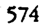

<!-- page: 3 -->

dr= a(b — r)dt+ cr'dz, 

ott

<!-- page: 4 -->

##### 6(2), 

<!-- Start of picture text -->
| dr=[6() + a()(b ~- n)) dt++ o(tr? dz. <!-- End of picture text -->

| dr=[6() + a()(b ~- n)) dt++ o(tr? dz. 6(28),j 

dr = a(t)[0(t)/a(t) + b— 1) dt + o(tr® + o(tr® o(tr® dz, 

| 

<!-- Start of picture text -->
dr = a(t)[0(t)/a(t) + b— 1) dt + o(tr® + o(tr® o(tr® dz, | <!-- End of picture text -->

O(8)/a(t) +b, 

dr=6(t) dt+o dz. 

64)

<!-- page: 5 -->

d(log r) = (6(#) + (6'(/o(D)log rjdt + a(t) dz. 

<!-- Start of picture text -->
dr = |6(1) + a()(b— 9)) dt + dt + + o(f) dz. <!-- End of picture text -->

dr = |6(1) + a()(b— 9)) dt + dt + + o(f) dz. 

<!-- Start of picture text -->
f+ (6 — adr)ff + w(O7F, — — f= 0, <!-- End of picture text -->

f+ (6 — adr)ff + w(O7F, — — f= 0, 

oO) = a(Nb + OC) — ACHo(N). 

f= A(t, T) e~ Bar, 

A, — ¢()AB + 40(#)2AB? = 0 

, 

# B,- a)B+1=0,— 

ACT, T)=1; BCT,T) =0. 

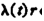

<!-- Start of picture text -->
ACH ri <!-- End of picture text -->

we ACH ri If x¢r, 01 d()x(r,BlexpGand8 =A)fbx a,() ds)+ <(Ory 00_ (0,Lo. r). 

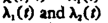

A) +A,00r.

<!-- page: 6 -->

#### (2), and o(#) 

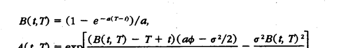

<!-- Start of picture text -->
BLT) = (1 — e~*™-9)/a, <!-- End of picture text -->

BLT) = (1 — e~*™-9)/a, AG, 1) = on 2 1) - r+ Oto = 97/2) _ 6D!) 

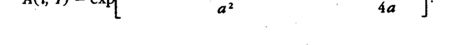

a(t), ¢(1), A(t, T), and B(t, T) 

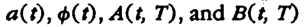

Ar ~— ¢(O[A,B + AB;] + o(#)? (A,B? + 2ABB,]/2 = 0, By — a(t)B; = 0. 

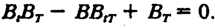

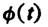

<!-- Start of picture text -->
o() <!-- End of picture text -->

o() ABA, ~ BAA,~ AA,Br| + 0(1)?4°B*B,/2 = 0. 

| | 

| 

B(t, BO, 7) ~ BO, 7 T) OBO, D/or (13) A(t, 1 = 4, 1) - 40, 9 - Be, N*ACO | _1| sac atdB(O, #) | f0 Eraa(t) val a 4) A(t, T) = log{A(t, 7}. _ a) 87B(O, t)/dt? aB(0, 1)/at ’. 

<!-- Start of picture text -->
_ a) 87B(O, t)/dt? aB(0, 1)/at ’. <!-- End of picture text -->

<!-- page: 7 -->

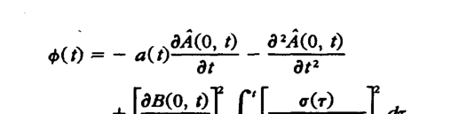

<!-- Start of picture text -->
oD =~ =~ a(p424p4244  _ PAOD8?A(0, PAOD8?A(0,8?A(0, <!-- End of picture text -->

oD =~ =~ a(p424p4244 _ PAOD8?A(0, PAOD8?A(0,8?A(0, +fdB(0, (at | f0 Ea‘ o(r)al a (6) 

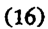

P(r, 4, &) = ACh, &) eT RA Dr, 

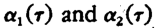

<!-- Start of picture text -->
a,(r) and a,(r) <!-- End of picture text -->

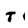

<!-- Start of picture text -->
TI <!-- End of picture text -->

a,(r) and a,(r) TI 

p(r) 

C= P(r, t, sS)N(b) — XP(r, t, T)N(b — op), 

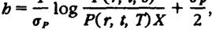

ne on f [o,(r)? — 2p(r)a,(r)en(r)+2(7)?]ar, 

a,(r) = o(r) BG, 5), .@2(7) = o(7) BCs, T). 

o3,= f o(r)?[BC(r, s) — BCs, nF dr.

<!-- page: 8 -->

; o23=([B(0, s) — BO, YF f ssTT ols)syail dr. 

Br, s) = (1 — e- ee”) fa, B(r, T) = 1 — e*?-) fa, 

op= u(t, T) (A — e2)/a, 

ot, T)? = 071 ~ e279) /24, 

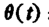

<!-- Start of picture text -->
(4): <!-- End of picture text -->

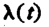

<!-- Start of picture text -->
AC) <!-- End of picture text -->

(4): = AC) 

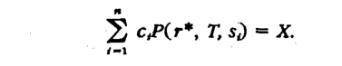

<!-- Start of picture text -->
> cP(r*, T, s) = X. <!-- End of picture text -->

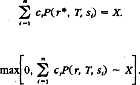

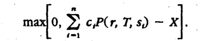

<!-- Start of picture text -->
mao, > c,P(r, T, 5) ~ x] <!-- End of picture text -->

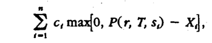

X,= P(r*, T, 5).

<!-- page: 9 -->

##### o(#) 

<!-- Start of picture text -->
dr = = [6(#) + a()(b— r)] dt + + o()Vr az. <!-- End of picture text -->

dr = = [6(#) + a()(b— r)] dt + + o()Vr az. 

MADVr. (0, 7).3 

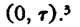

<!-- Start of picture text -->
(0, 7).3 <!-- End of picture text -->

f+ (@@ - VOr|sf + Of, - f= 0, - OC) = a(b + 00) ¥(4) = a(t) + ACA)o(2). f= Att Att T)e~ BaNr, A, ~ $(t)AB = = 0 

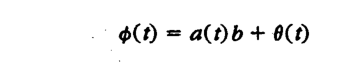

<!-- Start of picture text -->
- OC) = a(b + 00) <!-- End of picture text -->

<!-- Start of picture text -->
f= Att Att T)e~ BaNr, <!-- End of picture text -->

<!-- Start of picture text -->
A, ~ $(t)AB = = 0 <!-- End of picture text -->

(20) 

BB — WOB — 202B? +1=0. 

AO/Vr 

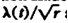

DV. 

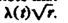

<!-- page: 10 -->

#### $(2), ¥(2), and o(#) 

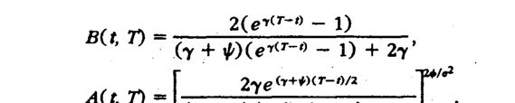

<!-- Start of picture text -->
_ BOD 2(err-9 — 1) CED ere= 1 tay A(t, . Qyetro ye? <!-- End of picture text -->

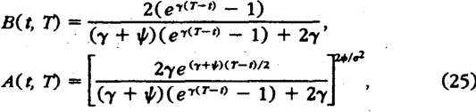

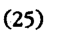

y= V(y? + 202). . 

y(t), 

_ B,By — BB, + By + 0(1)?B?B,/2 = 0. 

v(2) 

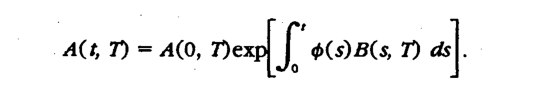

<!-- Start of picture text -->
A(t, T) = ACO, Dese|f T) = ACO, Dese|f = ACO, Dese|f ACO, Dese|f Dese|ff $(s)B(s, T) as as <!-- End of picture text -->

A(t, T) = ACO, Dese|f T) = ACO, Dese|f = ACO, Dese|f ACO, Dese|f Dese|ff $(s)B(s, T) as as 1, (4)7). f o(s) BCs, BCs, T) ds ds= —log A(O, —log A(O, A(O, 

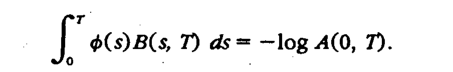

<!-- Start of picture text -->
7). f o(s) BCs, BCs, T) ds ds = —log A(O, —log A(O, A(O, <!-- End of picture text -->

¢, ¥, anda 

4.

<!-- page: 11 -->

P(r(0), 0, T) A(O, T) e— BO, NAO) 

| 

T13 T2 (rn,T2< t< T). ] 

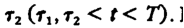

<!-- Start of picture text -->
T2 (rn, T2 < t< T). ] <!-- End of picture text -->

<!-- page: 12 -->

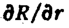

<!-- Start of picture text -->
OR/dr <!-- End of picture text -->

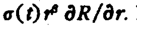

<!-- Start of picture text -->
o()  €R/dr. | <!-- End of picture text -->

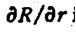

<!-- Start of picture text -->
OR/ar| <!-- End of picture text -->

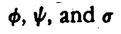

<!-- Start of picture text -->
¢, ¥, anda <!-- End of picture text -->

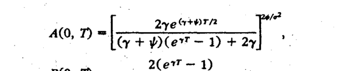

<!-- Start of picture text -->
A(Q,(0, 3| 2yeerwrn fe? . 2 E + (er? — 1) + =| ae "(eT <!-- End of picture text -->

<!-- Start of picture text -->
— BOD=CE er) tty <!-- End of picture text -->

eo. 

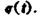

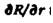

<!-- page: 13 -->

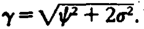

where The complete _A_ and _B_ functions for the extended Vasicek model can be calculated from _A(0, T)_ and _B(0, T)_ using (13) and (14). Equations (17) and (19) can be used to value European options on discount bonds. The analytic results in Cox, Ingersoll, and Ross (1985b) can be used to obtain the true European option prices. 

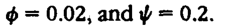

The parameter values chosen were σ = 0.06, The initial short-term interest rate was assumed to be 10% per annum. For the extended Vasicek model, σ (t) was set equal to the constant This ensured that the initial short-term interest-rate volatility equaled that in the CIR model. 

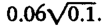

### **5.1 Bond options** 

Table 1 shows the prices given by the two models for European call options on a five-year bond that has a face value of $100 and pays a coupon of 10% per annum semiannually.9 It can be seen that the models give very similar prices for a range of different exercise prices and maturity dates. The biggest percentage differences are for deepout-of-the money options. The extended Vasicek model gives higher prices than CIR for these options. This is because very low interest rates (and, therefore, very high bond prices) have a greater chance of occurring in the extended Vasicek model. 

Since the Black’s model is frequently used by practitioners to value bond options, it is interesting to compare it with the two models.10 The numbers in parentheses in Table 1 are the forward bond-price volatilities implied by the option prices when Blacks model is used. It will be noted that the implied volatilities decline dramatically as the time to expiration of the option increases. In the limit, when the expiration date of the option equals the maturity date of the bond, the implied volatility is zero. For the extended Vasicek model, implied volatilities are roughly constant across different exercise prices. This is because the bond-price distributions are approximately lognormal.11 Under CIR, the implied volatilities are a decreasing function of the exercise price. If the same volatility is used in Black’s model for all bond options with a certain expiration date, there will be a tendency under a CIR-type economy for in-the-money options to be underpriced and out-of-the-money options to be overpriced. 

> 9 For both models, the bond option was decomposed into discount-bond options using the approach described in Section 2. 

> 10 Black’s model assumes that forward bond prices are lognormal in the case of options on discount bonds, it is equivalent to the extended Vasicek model, but does not provide a framework within which the volatilities of different forward bond prices can be related to each other. 

> 11 For a discount bond, the bond-price distribution is exactly lognormal. For a coupon-beating bond, it is the sum of lognormal distributions.

<!-- page: 14 -->

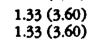

<!-- Start of picture text -->
1.33 (3.60) 1.33 (3,60) <!-- End of picture text -->

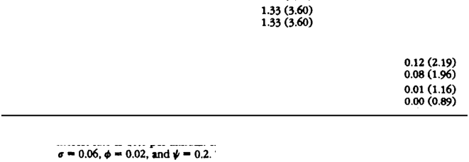

<!-- Start of picture text -->
1.33 (3.60) 1.33 (3,60) 0.12 (2.19) 0.08 (1.96) 0.01 (1.16) © = 0.06,6 = 0.02,and py = 0.2." <!-- End of picture text -->

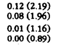

<!-- Start of picture text -->
0.12 (2.19) 0.08 (1.96) 0.01 (1.16) <!-- End of picture text -->

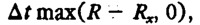

<!-- Start of picture text -->
At max(R max(R — R,, 0), <!-- End of picture text -->

At max(R max(R — R,, 0), At=4t-—%t: 

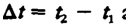

<!-- Start of picture text -->
At=4t-—%t: <!-- End of picture text -->

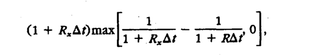

<!-- Start of picture text -->
Cl + R.A 1 —_ 9], + R,At)max| Te ay 14 Ra? 9’ <!-- End of picture text -->

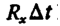

<!-- Start of picture text -->
R, At. <!-- End of picture text -->

R,At)At) 

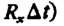

<!-- Start of picture text -->
R,At)At) <!-- End of picture text -->

<!-- page: 15 -->

o = 0.06,@@ = 0.02, andy andyy = 0.2.” 

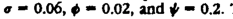

<!-- Start of picture text -->
o = 0.06,@@ = 0.02, andy andyy = 0.2.” <!-- End of picture text -->

r= m+ %, dx,= (%,— ax) dt+o,dz, We choose ¢,= a, = 0. 

1=1,2. (30)

<!-- page: 16 -->

r=%X, + X, dx, = (9, — $x) dt + o,\/x, az,, f=1, 2. 

— P(4t = Px, 46. DP, 4 7), 

and 

<!-- Start of picture text -->
oe PX p £T) =A, £T) =A, =A, T) e~ 56D . <!-- End of picture text -->

oe PX p £T) =A, £T) =A, =A, T) e~ 56D . o(0) = Voi + 63) o(0) BOO, 7) = V[oiB,(0, 7)? + o3B,(0, (0) = V(oix, + 03x) . oo 

o(0) BOO, 7) = V[oiB,(0, 7)? + o3B,(0, 7) 4}. 

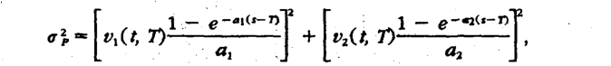

<!-- Start of picture text -->
— , ,-a (s-T) : — ep -as-N . oRm ect ne) + Ec pias), <!-- End of picture text -->

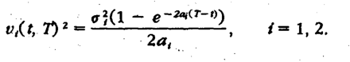

<!-- Start of picture text -->
- - gill — en 2TH 0, 2? — GAA) ga, <!-- End of picture text -->

<!-- page: 17 -->

**Table 3** 

**Values of European call options on a five-year discount bond with a face value of $100** 

|||||Exercisepric|e||
|---|---|---|---|---|---|---|
||Model|0.96|0.98|1.00|1.02|1.04|
|1.0|Ext Vas|2.80|1.93|1.24|0.74|0.40|
||Two-factorVas|2.80|1.93|1.24|0.73|0.40|
|2.0|Ext Vas|2.86|2.00|132|0.81|0.46|
||Two-factorVas|2.85|1.99|1.31|0.80|0.46|
|3.0|Ext Vas |2.69|1.79|1.08|0.59|0.29|
||Two-factorVas|2.69|1.78|1.07|0.58|0.28|
|4.0|Ext Vas|2.47|1.41|0.63|0.20|0.04|
||Two-factorVas|2.47|1.40|0.62|0.20|0.04|

Interest rates are assumed to follow the two-factor Vasicek model described by Equation (30). The parameter values are and the initial values of both _x1_ and _x2_ are 0.05. The extended Vasicek (Ext Vas) model is chosen to fit the initial term structure of interest rates and the initial term structure of interest-rate volatilities. The exercise price is expressed as a proportion of the forward bond price. 

technique. Each price was based on a total of 40,000 runs and the maximum standard error was 0.0043. 

The results are shown in Tables 3 and 4. The extended Vasicek model produces prices that are very close to those of the other models. Other tests similar to those reported here have been carried out. In all cases we find that the extended Vasicek model provides a good analytic approximation to other more complicated models. 

### **7. Conclusions** 

This paper has shown that the Vasicek and CIR interest-rate models can be extended so that they are consistent with both the current- 

**Table 4** 

**Values of European call options on a five-year discount bond with a face value of $100** 

|||||Exercisepric|e||
|---|---|---|---|---|---|---|
||Model|0.96|0.98|1.00|1.02|1.04|
|1.0|Ext Vas|2.54|1.55|0.81||0.12|
||Two-factor CIR|2.55|1.56|0.81||0.11|
|2.0|Ext Vas|2.56|1.60|0.87|0.40|0.15|
||Two-factor CIR|2.58|1.61|0.06|0.38|0.13|
|3.0|Ext Vas|2.49|1.47|0.71|0.27|0.08|
||Two-factor CIR|2.51|1.48|0.70|0.24|0.06|
|4.0|Ext Vas|2.43|1.27|0.41|0.06|0.00|
||Two-factorCIR|2.44|1.28|0.40|0.05|0.00|

Interest rates are assumed to follow the two-factor CIR model described by Equation (31). The parameter values are and the Initial values of both x1 and x2 are 0.05. The extended Vasicek (Ext Vas) model is chosen to fit the initial term structure of interest rates and the initial term structure of interest-rate volatilities. The exercise price is expressed as a proportion of the forward bond price.

<!-- page: 18 -->

P(r, tT): R(x, t, T): 

o,(y, 0): o,(7, t, T): op(r, t, T,, T;): 

P(r, t, T) = A(t, Tie8 Or, 

R(r, t, pn=-— nv $7) 2 ? T+ t Y, ? , 

RE | N= — FlAG - BD]

<!-- page: 19 -->

OR(r, tT) _ BGT) or T-—t ° 

ae 7) = Reb Denk DTD—t ror, t) 

<!-- Start of picture text -->
Fin T,, Tet, Tet, t Ty 7) = BUT)Pee™Z—-T,Pee™Z—-T,™Z—-T, og 7, 1) 1) <!-- End of picture text -->

Fin T,, Tet, Tet, t Ty 7) = BUT)Pee™Z—-T,Pee™Z—-T,™Z—-T, og 7, 1) 1) a Flr, Tya Todt,ACT)ba Todt,ACT)b Todt,ACT)bACT)bb Ty T)(Ts — — Tr) - (3) 

<!-- Start of picture text -->
a Flr, Tya Todt,ACT)ba Todt,ACT)b Todt,ACT)bACT)bb Ty T)(Ts — — Tr) - (3) <!-- End of picture text -->

References 

<!-- Start of picture text -->
References <!-- End of picture text -->

<!-- page: 20 -->

Brennan, M. J., and E. S. Schwartz, 1982, “An Equilibrium Model of Bond Pricing and a Test of Market Efficiency,” _Journal of Financial and Quantitative Analysis,_ 17, 301-329. 

Courtadon, G., 1982, “The Pricing of Options on Default-Free Bonds,” _Journal of Financial and Quantitative Analysis,_ 17, 75-100. 

Cox, J. C., J. E. Ingersoll, and S. A. Ross, 1985a, “An Intertemporal General Equilibrium Model of Asset Prices,” _Econometrica,_ 53, 363-384. 

Cox, J. C., J. E. Ingersoll, and S. A. Ross, 1985b, “A Theory of the Term Structure of Interest Rates,” _Econometrica,_ 53, 385-467. 

Dothan, L. U., 1978, “On the Term Structure of Interest Rates,” _Journal of Financial Economics,_ 6, 59-69. 

Duffie, D., 1988, _Security Markets: Stochastic Models,_ Academic, Boston, MA. 

Dybvig, P. H., 1988, “Bond and Bond Option Pricing Based on the Current Term Structure,” working paper, Olin School of Business, University of Washington. 

Heath, D., R. Jarrow, and A. Morton, 1987, “Bond Pricing and the Term Structure of Interest Rates: A New Methodology for Contingent Claims Evaluation,” working paper, Cornell University. 

Ho, T. S. Y., and S.-B. Lee, 1986, ‘Term Structure Movements and Pricing of Interest Rate Claims,” _Journal of Finance,_ 41, 1011-1029. 

Hull, J., and A. White, 1987, “The Pricing of Options on Assets with Stochastic Volatilities,” _Journal of Finance,_ 42, 281-300. 

Hull, J., and A. White, 1990, “Valuing Derivative Securities Using the Explicit Finite Difference Method,” _Journal of Financial and Quantitative Analysis, 25, 87-100._ 

Jamshidian, F., 1988, “The One-Factor Gaussian Interest Rate Model: Theory and Implementation,” working paper, Financial Strategies Group, Merrill Lynch Capital Markets, New York. 

Jamshidian, F., 1989, “An Exact Bond Option Formula,” _Journal of Finance,_ 44, 205-209. 

Langetieg, T. C., 1980, “A Multivariate Model of the Term Structure,” _Journal of Finance,_ 35, 71-97. 

Longstaff, F. A., 1989, “A Nonlinear General Equilibrium Model of the Term Structure of Interest Rates,” _Journal of Financial Economics,_ 23,195-224. 

Merton, R. C., 1973, “Theory of Rational Option Pricing,” _Bell Journal of Economics and Management Science,_ 4, 141-183. 

Milne, F., and S. Turnbull, 1989, “‘A Simple Approach to Interest Rate Option Pricing,” working paper, Australian National University. 

Richard, S., 1979, “An Arbitrage Model of the Term Structure of Interest Rates,” _Journal of Financial Economics,_ 6, 33-57. 

Vasicek, O. A., 1977, “An Equilibrium Characterization of the Term Structure,” _Journal of Financial Economics,_ 5, 177-188.
