<!-- page: 1 -->

# **A Closed-Form Solution for Options with Stochastic Volatility with Applications to Bond and Currency Options** 

**Steven L. Heston** Yale University 

**_I use a new technique to derive a closed-form solution for the price of a European call option on an asset with stochastic volatility. The model allows arbitrary correlation between volatility and spotasset returns. I introduce stochastic interest rates and show how to apply the model to bond options and foreign currency options. Simulations show that correlation between volatility and the spot asset’s price is important for explaining return skewness and strike-price biases in the BlackScholes (1973) model. The solution technique is based on characteristic functions and can be applied to other problems._** 

Many plaudits have been aptly used to describe Black and Scholes’ (1973) contribution to option pricing theory. Despite subsequent development of option theory, the original Black-Scholes formula for a European call option remains the most successful and widely used application. This formula is particularly useful because it relates the distribution of spot returns 

I thank Hans Knoch for computational assistance. I am grateful for the suggestions of Hyeng Keun (the referee) and for comments by participants at a 1992 National Bureau of Economic Research seminar and the Queen’s University 1992 Derivative Securities Symposium. Any remaining errors are my responsibility. Address correspondence to Steven L. Heston, Yale School of Organization and Management, 135 Prospect Street, New Haven, CT 06511.

<!-- page: 2 -->

2, (0) 

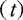

= ps V v(t)S dz, 

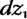

dV v(t) = —BV vat + 6 dz,(h), (2) 

v(t) 

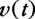

<!-- Start of picture text -->
v(t) <!-- End of picture text -->

<!-- page: 3 -->

dv(t) = «(6 — v(t)]dt + oV v(t) dz,@), 

T 

P(t, t+ 7) =e7". 

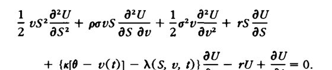

<!-- Start of picture text -->
1 a2U eu 1, &@U aU _2 OS2a52 TPS—_—ar ay + —2° ag2 9p)—— +* as— oU ou <!-- End of picture text -->

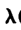

<!-- Start of picture text -->
rN <!-- End of picture text -->

Xl 

AS, v, Dat = yCovi{du, dc/Cc), 

dC(t) = w,0() Cat + oVu) Cdz,(, 

x 

At 

At

<!-- page: 4 -->

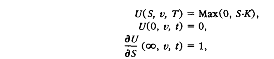

<!-- Start of picture text -->
U(S, v, T) = Max(0, S-K), U(O,7 »v, t) = 0, ou <!-- End of picture text -->

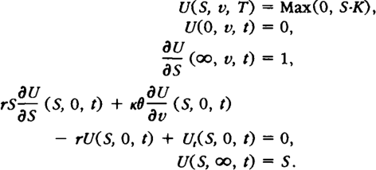

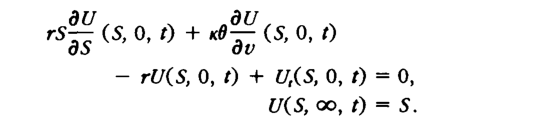

<!-- Start of picture text -->
dU ou S35Ss (S,0, tf)4) ++ «xx6—av (S, 0, #4) — rU(S, 0, ) + UMS, 0, 2) = 0, U(S, ©, th = S. <!-- End of picture text -->

x = In[S]. 

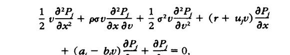

<!-- Start of picture text -->
1 8?P P, 1 0? P, OP, = yp 4+ Lh 4 8 gty—l + + —f 2 axe taray 27 Mae tt Moy OP,  aP, + _ —l42/= <!-- End of picture text -->

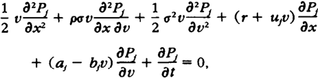

u=%, t=—-%, a=K0, b=x+XA—po, Bb=Ktd. 

## Pix, v, T; In{K]) = 1 x2 nja)-

<!-- page: 5 -->

<!-- Start of picture text -->
dx(t) =[r+ upljdt+ Vv(t)dz,Q), <!-- End of picture text -->

P(x, v, T; In[K]) = Pr[x(7) = An[K] | x(2) = x, v(@) = 9}. (15) 

Sx, v, T; ) = e**. 

Sfx, v, t; ¢) = eT-O)+ DIT-Ko)e + Ox 

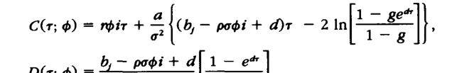

<!-- Start of picture text -->
CG: ¢) = rbir + a0  — pobit+ dr —2 in| 1-g82" ~— " — ar <!-- End of picture text -->

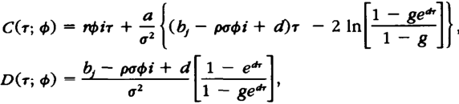

<!-- Start of picture text -->
o 1 — ge <!-- End of picture text -->

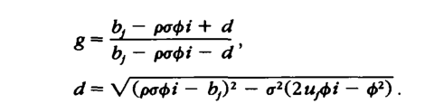

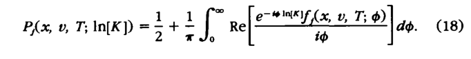

<!-- page: 6 -->

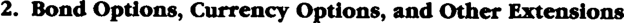

<!-- Start of picture text -->
2. Bond Options, Options, Currency Options, and Other Other Extensions <!-- End of picture text -->

### 2. Bond Options, Options, Currency Options, and Other Other Extensions 

dS(t) = w,S dt + 6,()Vv()S az, (2). 

aP(t; T) = ppP(t; T)dt + op) V0() PCr; T)dz,(t). 

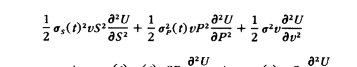

<!-- Start of picture text -->
—1 (olOr | eu 1 eu 5 o;(t)?v0S2 2_—9s? + —3 o3,(t)42 uP2apt + —2 o aeg27)—— <!-- End of picture text -->

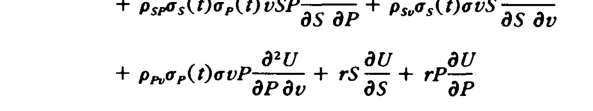

<!-- Start of picture text -->
Psp s(t)o p(t) vSP= + ps.os(Haovs a5 ov + au aU ou Pet p(tovP + "Sa + Pop <!-- End of picture text -->

<!-- Start of picture text -->
+ au aU (xf@ — v(f] - dv) = — rU+ var 0, (21) <!-- End of picture text -->

<!-- page: 7 -->

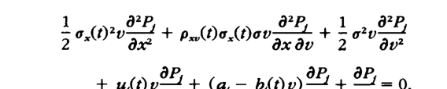

<!-- Start of picture text -->
Lo cpp PP, 1), SP, 5 o,{¢) ae + Pult)o.Qov> + 5 o ar <!-- End of picture text -->

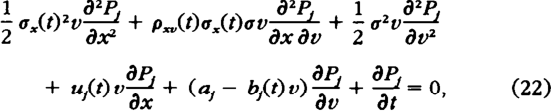

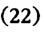

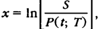

o,{t)? = Yo,(t)? — psp s(top(f) + %o2(2), Put) — Psts(No — Psts(No — — Prop(te a.he , 

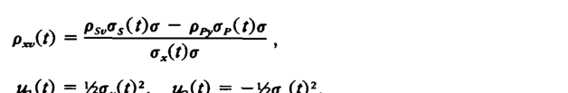

<!-- Start of picture text -->
Put) — Psts(No — Psts(No — — Prop(te a.he , <!-- End of picture text -->

u,(t) = 4o,(1)?, u(t) = —%o,()?, a= x6, 

b@=xkt+A—psos(o, b(t) =x +r — ppop(ta. 

C(r) and D(r) 

C(r) and D(r) 

GF(t; T) = upF(t; Tdt + op( DV vO FU; T) dz, (4).

<!-- page: 8 -->

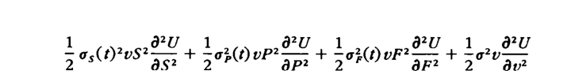

<!-- Start of picture text -->
1 U1 eu 1 eu 1 0?U 3 os(t)?0S? + 3 oe) UP? 2 + gor uF? + 2° a2 <!-- End of picture text -->

<!-- Start of picture text -->
+ &U &U pspas(t)op(t) USP op + pspo;(t)o,(t) vSF35 OF <!-- End of picture text -->

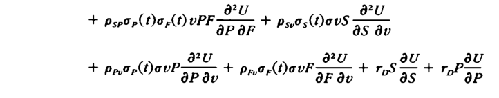

<!-- Start of picture text -->
+ &U e7U pspop(t)o,(t) uPFaP OF + ps,o5(t)ovS as ao + au 07U du ou Pre6 p(tovP = + Pro e(C)ovF + ToS 3° + To op <!-- End of picture text -->

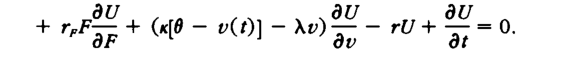

<!-- Start of picture text -->
+ <aU - — rw) FSaU - <= =0.aU  FT + (x[6 — v(t)] — Av) ao ru + ar <!-- End of picture text -->

C(S, v, 2) = SFC, T)P, — KP(t, T)P,. 

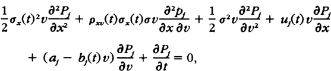

<!-- Start of picture text -->
+ OP, OP (a, — bv) 5 + > 0, <!-- End of picture text -->

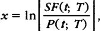

a(t)? = Yo,(t)? + Yo3(t) + Yo2(t) — pspos(t)op(t) 

+ pspos(thop(t) — pppop(to,(t), 

pf)“ = prte(o2327s = + PnaeOo o,(Ho , 

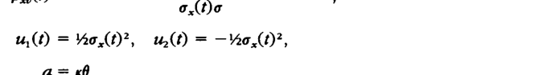

<!-- Start of picture text -->
o,(Ho , <!-- End of picture text -->

a= x6, 

b@) =x +Xr— ps,0;,(No — p,,0,-(Do, bf) =x +rA— ppo,(He. 

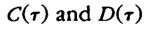

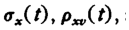

<!-- page: 9 -->

dv(t) = x*[@* — v(h]dt + oV u(t) dz, 

<!-- Start of picture text -->
O* = xO/(x+ xO/(x++ A). <!-- End of picture text -->

<!-- Start of picture text -->
nkP=x+t+r <!-- End of picture text -->

nkP=x+t+r O* = xO/(x+ xO/(x++ A).

<!-- page: 10 -->

S(t) = pS at + VuCOS dz,(2), du(t) = «0% — v()]dt + oV/v(idz,(t). 

«*=2 o*= 01 v(t) = 01 p=0. o= J 5 year r=0 K= 100 

A. 

d

<!-- page: 11 -->

<!-- Start of picture text -->
Probability Density pe.S YAN p=0 <!-- End of picture text -->

<!-- Start of picture text -->
’ p= -.5 <!-- End of picture text -->

Figure1 

dS(D) = wS dt + + \/KDS dz,(0, where du(t) = «40* — «40* — — AD]dt+ o/Khdz,(0. o/Khdz,(0. 

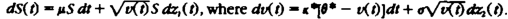

<!-- Start of picture text -->
dS(D) = wS dt + + \/KDS dz,(0, where du(t) = «40* — «40* — — AD]dt+ o/Khdz,(0. o/Khdz,(0. <!-- End of picture text -->

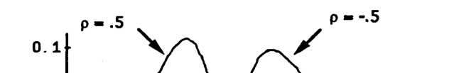

<!-- Start of picture text -->
p=.5 p =-5 0.4 ‘Ne x <!-- End of picture text -->

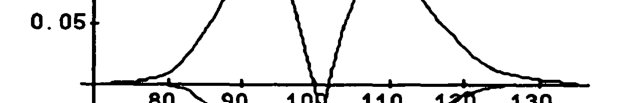

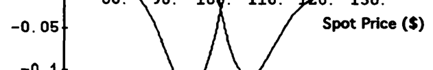

<!-- Start of picture text -->
-0.05 Spot Price ($) <!-- End of picture text -->

<!-- page: 12 -->

<!-- Start of picture text -->
o= .4 <!-- End of picture text -->

<!-- Start of picture text -->
0.60.6 Fon2 <!-- End of picture text -->

<!-- Start of picture text -->
TAN i <!-- End of picture text -->

<!-- Start of picture text -->
-0.3 -0.2 -0.1 0.1 02 0.3 <!-- End of picture text -->

Figure3 

<!-- Start of picture text -->
dS(1) = pS dt dt + JX) Sdz,(), where dot) dot) = «(8% — «(8% — — Ad |dt+ o/Xi dz,(2). <!-- End of picture text -->

dS(1) = pS dt dt + JX) Sdz,(), where dot) dot) = «(8% — «(8% — — Ad |dt+ o/Xi dz,(2).

<!-- page: 13 -->

<!-- Start of picture text -->
0.05; om,1 <!-- End of picture text -->

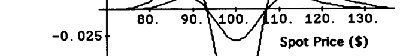

<!-- Start of picture text -->
0. 80. 90. N00. / 10. 120. 130. 025 Spot Price ($) <!-- End of picture text -->

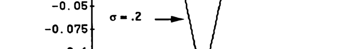

<!-- Start of picture text -->
-0.065 o=.2 —jp -0.075 <!-- End of picture text -->

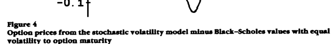

<!-- Start of picture text -->
-0.1 Figure44 Option prices from the stochastic volatility model minus Black-Scholes values with equal volatility model minus Black-Scholes values with equal model minus Black-Scholes values with equal minus Black-Scholes values with equal Black-Scholes values with equal values with equal with equal equal volatility to option maturity <!-- End of picture text -->

Figure44 Option prices from the stochastic volatility model minus Black-Scholes values with equal volatility model minus Black-Scholes values with equal model minus Black-Scholes values with equal minus Black-Scholes values with equal Black-Scholes values with equal values with equal with equal equal volatility to option maturity

<!-- page: 14 -->

Sx, v, ) = E[g(x(T), v(T)) | x(@) = x, (2) = 2}. (Al)

<!-- page: 15 -->

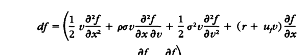

<!-- Start of picture text -->
v (:1 Yardef + Yananaf 27 Vat1 , of Tt Mayof <!-- End of picture text -->

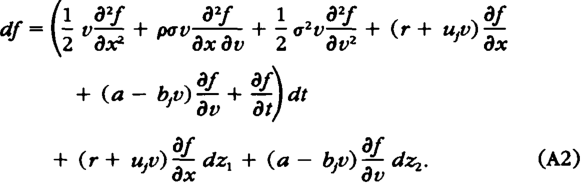

<!-- Start of picture text -->
+ asof — bv)=of dz. (r+ Wy) > dz,+(a bv) 5, dz, <!-- End of picture text -->

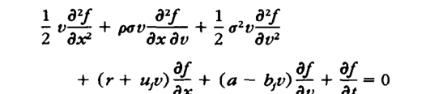

<!-- Start of picture text -->
1 ef af 1, af =2 axep— + axse ay 4 =27gty—a? + of ~ py Ff 4 (rt up) s+ (a bv) 5, +3, 0 <!-- End of picture text -->

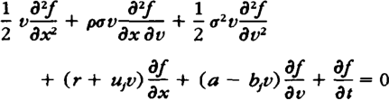

S(% v, T) = glx, v). 

a(x, v) = Vjaezixy> 

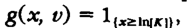

<!-- Start of picture text -->
a(x, v) = Vjaezixy> <!-- End of picture text -->

e**, 

I(% v, ) = exp[(C(T-— ) + D(T—-— Dot tx]. 

—=07¢?70%1 + podipodiD ++ =D?5?1 + upsui — bD+ —-=aD> 0, rpi+ 0c aD+ ry = 0, 

<!-- page: 16 -->

dV v(t) = [a — BV v(d] dt + 6 dz), 

dv(t) = [8 + 2aVv — 2Bv dt + 28V v(t) dz,(0). 

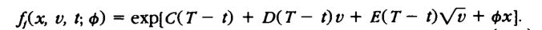

<!-- Start of picture text -->
Sx, ¥, 6) = exp[C(T— ) + D(T— ot E(T— DV0 + Ox). <!-- End of picture text -->

Sx, ¥, 6) = exp[C(T— ) + D(T— ot E(T— DV0 + Ox).

<!-- page: 17 -->

Garman, M. B., and S. W. Kohlhagen, 1983, “Foreign Currency Option Values,” _Journal of International Money and Finance,_ 2, 231-237. 

Heston, S. L., 1990, “Testing Continuous Time Models of the Term Structure of Interest Rates.” Ph.D. Dissertation, Carnegie Mellon University Graduate School of Industrial Administration. 

Heston, S. L., 1992. “Invisible Parameters in Option Prices,” working paper, Yale School of Orga nization and Management. 

Hull, J. C., 1989, _Options, Futures, and Other Derivative Instruments,_ Prentice-Hall, Englewood Cliffs, NJ. 

Hull, J. C., and A. White, 1987, “The Pricing of Options on Assets with Stochastic Volatilities,” _Journal of Finance,_ 42, 281-300. 

Ingersoll, J. E., 1989, _Theory of Financial Decision Making,_ Rowman and Littlefield, Totowa, NJ. 

Ingersoll, J. E.. 1990, “Contingent Foreign Exchange Contracts with Stochastic Interest Rates,” working paper, Yale School of Organization and Management. 

Jarrow, R., and A. Rudd, 1982, “Approximate Option Valuation for Arbitrary Stochastic Processes,” _Journal of Financial Economics,_ 10, 347-369. 

Johnson, N. L.. and S. Kotz, 1970, _Continuous Univariate Distributions,_ Houghton Mifflin, Boston. 

Karlin, S., and H. M. Taylor, 1975, _A First Course in Stochastic Processes,_ Academic, New York. 

Kendall, M., and A. Stuart, 1977, _The Advanced Theory of Statistics_ (Vol. 1), Macmillan, New York. 

Knoch, H. J., 1992, “The Pricing of Foreign Currency Options with Stochastic Volatility,” Ph.D. Dissertation, Yale School of Organization and Management. 

Lamoureux, C. G., and W. D. Lastrapes, 1993, “Forecasting Stock-Return Variance: Toward an Understanding of Stochastic Implied Volatilities,” _Review of Financial Studies,_ 6, 293-326. 

Melino, A., and S. Turnbull, 1990, “The Pricing of Foreign Currency Options with Stochastic Volatility,” _Journal of Econometrics,_ 45, 239-265. 

Melino, A., and S. Turnbull, 1991, “The Pricing of Foreign Currency Options,” _Canadian Journal of Economics,_ 24, 251-281. 

Merton, R. C., 1973, “Theory of Rational Option Pricing,” _Bell Journal of Economics and Management Science,_ 4, 141-183. 

Rubinstein, M., 1985, “Nonparametric Tests of Alternative Option Pricing Models Using All Reported Trades and Quotes on the 30 Most Active CBOE Option Classes from August 23, 1976 through August 31, 1978,” _Journal of Finance,_ 40, 455-480. 

Scott, L.O., 1987, “Option Pricing When the Variance Changes Randomly: Theory, Estimation, and an Application,” _Journal of Financial and Quantitative Analysis,_ 22, 419-438. 

Stein, E. M., and J. C. Stein, 1991, “Stock Price Distributions with Stochastic Volatility: An Analytic Approach,” _Review of Financial_ Studies, 4, 727-752. 

Wiggins, J. B., 1987, “Option Values under Stochastic Volatilities,” _Journal of Financial Economics,_ 19, 351-372.
