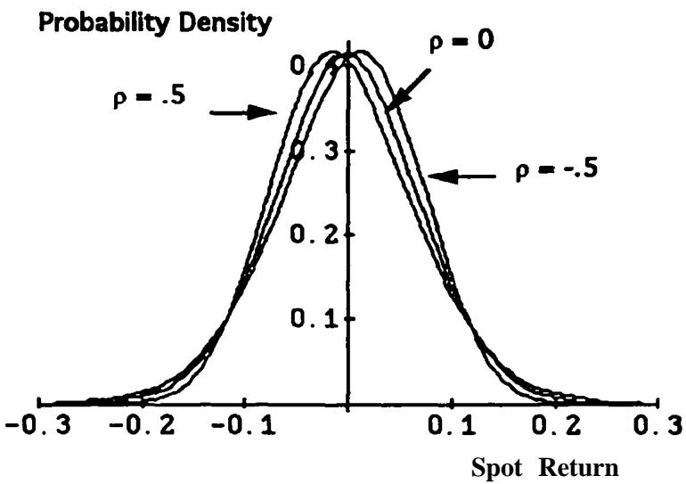
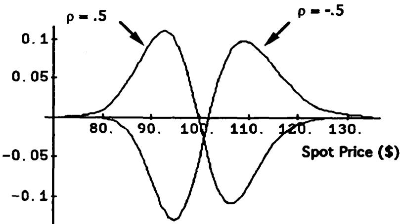

# 1993-heston-closed-form-stochastic-volatility

<!-- page: 1 -->

## A Closed-Form Solution for Options with Stochastic Volatility with Applications to Bond and Currency Options

Steven L. Heston Yale University

I use a new technique to derive a closed-form solution for the price of a European call option on an asset with stochastic volatility. The model allows arbitrary correlation between volatility and spotasset returns. I introduce stochastic interest rates and show how to apply the model to bond options and foreign currency options. Simulations show that correlation between volatility and the spot asset’s price is important for explaining return skewness and strike-price biases in the Black-Scholes (1973) model. The solution technique is based on characteristic functions and can be applied to other problems.

Many plaudits have been aptly used to describe Black and Scholes’ (1973) contribution to option pricing theory. Despite subsequent development of option theory, the original Black-Scholes formula for a European call option remains the most successful and widely used application. This formula is particularly useful because it relates the distribution of spot returns to the cross-sectional properties of option prices. In this article, I generalize the model while retaining this feature.

I thank Hans Knoch for computational assistance. I am grateful for the suggestions of Hyeng Keun (the referee) and for comments by participants at a 1992 National Bureau of Economic Research seminar and the Queen’s University 1992 Derivative Securities Symposium. Any remaining errors are my responsibility. Address correspondence to Steven L. Heston, Yale School of Organization and Management, 135 Prospect Street, New Haven, CT 06511.

The Review of Financial Studies 1993 Volume 6, number 2, pp. 327-343 © 1993 The Review of Financial Studies 0893-9454/93/\$1.50

<!-- page: 2 -->

Although the Black– Scholes formula is often quite successful in explaining stock option prices [Black and Scholes (1972)], it does have known biases [Rubinstein (1985)]. Its performance also is substantially worse on foreign currency options [Melino and Turnbull (1990, 1991), Knoch (1992)]. This is not surprising, since the Black-Scholes model makes the strong assumption that (continuously com pounded) stock returns are normally distributed with known mean and variance. Since the Black–Scholes formula does not depend on the mean spot return, it cannot be generalized by allowing the mean to vary. But the variance assumption is somewhat dubious. Motivated by this theoretical consideration, Scott (1987), Hull and White (1987), and Wiggins (1987) have generalized the model to allow stochastic volatility. Melino and Turnbull (1990, 1991) report that this approach is successful in explaining the prices of currency options. These papers have the disadvantage that their models do not have closedform solutions and require extensive use of numerical techniques to solve two-dimensional partial differential equations. Jarrow and Eisenberg (1991) and Stein and Stein (1991) assume that volatility is uncorrelated with the spot asset and use an average of Black-Scholes formula values over different paths of volatility. But since this approach assumes that volatility is uncorrelated with spot returns, it cannot capture important skewness effects that arise from such correlation. I offer a model of stochastic volatility that is not based on the Black-Scholes formula. It provides a closed-form solution for the price of a European call option when the spot asset is correlated with volatility, and it adapts the model to incorporate stochastic interest rates. Thus, the model can be applied to bond options and currency options.

## 1. Stochastic Volatility Model

We begin by assuming that the spot asset at time t follows the diffusion

$$
d S ( t ) = \mu S d t + \sqrt { \nu ( t ) } S d z _ { 1 } ( t ) ,\tag{1}
$$

where $z _ { 1 } ( t )$ is a Wiener process. If the volatility follows an Ornstein– Uhlenbeck process [e.g., used by Stein and Stein (1991)],

$$
d \sqrt { \upsilon ( t ) } = - \beta \sqrt { \upsilon ( t ) } d t + \delta \ d z _ { 2 } ( t ) ,\tag{2}
$$

then Ito’s lemma shows that the variance $\upsilon ( t )$ follows the process

<!-- page: 3 -->

$$
d \nu ( t ) = [ \hat { \theta } ^ { 2 } - 2 \beta \nu ( t ) ] d t + 2 \delta \sqrt { \nu ( t ) } d z _ { 2 } ( t ) .\tag{3}
$$

This can be written as the familiar square-root process [used by Cox, Ingersoll, and Ross (1985)]

$$
\begin{array} { r } { d v ( t ) = \kappa [ \theta - \nu ( t ) ] d t + \sigma \sqrt { \nu ( t ) } d z _ { 2 } ( t ) , } \end{array}\tag{4}
$$

where $z _ { 2 } ( t )$ has correlation r with $z _ { I } ( t )$ . For simplicity at this stage, we assume a constant interest rate r. Therefore, the price at time t of a unit discount bond that matures at time $t \ + \ \pmb { \tau }$ i s

$$
P ( t , t + \tau ) = e ^ { - \pi } .\tag{5}
$$

These assumptions are still insufficient to price contingent claims because we have not yet made an assumption that gives the “price of volatility risk.” Standard arbitrage arguments [Black and Scholes (1973), Merton (1973)] demonstrate that the value of any asset U(S, v, t) (including accrued payments) must satisfy the partial differential equation (PDE)

$$
\begin{array} { r l r } {  { \frac { 1 } { 2 } \ \nu S ^ { 2 } \frac { \partial ^ { 2 } U } { \partial S ^ { 2 } } + \rho \sigma \nu S \frac { \partial ^ { 2 } U } { \partial S \ \partial \nu } + \frac { 1 } { 2 } \sigma ^ { 2 } \nu \frac { \partial ^ { 2 } U } { \partial \nu ^ { 2 } } + \ r S \frac { \partial U } { \partial S } } } \\ & { } & \\ & { } & { + \ \{ \kappa [ \theta - \ \nu ( t ) ] - \lambda ( S , \ \nu , \ t ) \} \frac { \partial U } { \partial \nu } - \ r U + \frac { \partial U } { \partial t } = 0 . } \end{array}\tag{6}
$$

The unspecified term $\lambda ( S , \ \nu , \ t )$ represents the price of volatility risk, and must be independent of the particular asset. Lamoureux and Lastrapes (1993) present evidence that this term is nonzero for equity options. To motivate the choice of $\lambda ( S , \nu , t )$ , we note that in Breeden’s (1979) consumption-based model,

$$
\lambda ( S , \nu , t ) d t = \gamma \mathrm { C o v } [ d \nu , d C / C ] ,\tag{7}
$$

where $C ( t )$ is the consumption rate and g is the relative-risk aversion of an investor. Consider the consumption process that emerges in the (general equilibrium) Cox, Ingersoll, and Ross (1985) model

$$
d C ( t ) = \mu _ { c } \upsilon ( t ) C d t + \sigma _ { c } \sqrt { \upsilon ( t ) } C d z _ { 3 } ( t ) ,\tag{8}
$$

where consumption growth has constant correlation with the spotasset return. This generates a risk premium proportional to $\nu , \lambda / ( S , \nu ,$ $t ) \ = \lambda \ i \nu .$ . Although we will use this form of the risk premium, the pricing results are obtained by arbitrage and do not depend on the other assumptions of the Breeden (1979) or Cox, Ingersoll, and Ross (1985) models. However, we note that the model is consistent with conditional heteroskedasticity in consumption growth as well as in asset returns. In theory, the parameter could be determined by one

<!-- page: 4 -->

volatility-dependent asset and then used to price all other volatility-1 dependent assets.

A European call option with strike price K and maturing at time T satisfies the PDE (6) subject to the following boundary conditions:

$$
\begin{array} { c } { { U ( S , \nu , T ) = \mathrm { M a x } ( 0 , S \cdot K ) , } } \\ { { U ( 0 , \nu , t ) = 0 , } } \\ { { { \displaystyle { \frac { \partial U } { \partial S } ( \infty , \nu , t ) = 1 } } , } } \\ { { r s { \displaystyle { \frac { \partial U } { \partial S } ( S , 0 , t ) } } + \kappa \theta { \displaystyle { \frac { \partial U } { \partial \nu } ( S , 0 , t ) } } } } \\ { { - r U ( S , 0 , t ) + U _ { t } ( S , 0 , t ) = 0 , } } \\ { { U ( S , \infty , t ) = S . } } \end{array}\tag{9}
$$

By analogy with the Black-Scholes formula, we guess a solution of the form

$$
C ( S , \upsilon , t ) = S P _ { 1 } - K P ( t , T ) P _ { 2 } ,\tag{1 0}
$$

where the first term is the present value of the spot asset upon optimal exercise, and the second term is the present value of the strike-price payment. Both of these terms must satisfy the original PDE (6). It is convenient to write them in terms of the logarithm of the spot price

$$
\begin{array} { r } { { \mathbf { \em x } } = \ln [ S ] . } \end{array}\tag{11}
$$

Substituting the proposed solution (10) into the original PDE (6) shows that $P _ { I }$ and $P _ { 2 }$ must satisfy the PDEs

$$
\begin{array} { c } { { { \frac { 1 } { 2 } } \displaystyle v \frac { \partial ^ { 2 } P _ { j } } { \partial x ^ { 2 } } + \rho \sigma v \frac { \partial ^ { 2 } P _ { j } } { \partial x \partial v } + \frac { 1 } { 2 } \sigma ^ { 2 } v \frac { \partial ^ { 2 } P _ { j } } { \partial v ^ { 2 } } + ( r + u _ { j } v ) \frac { \partial P _ { j } } { \partial x } } } \\ { { + \ ( a _ { j } - b _ { j } v ) \frac { \partial P _ { j } } { \partial v } + \frac { \partial P _ { j } } { \partial t } = 0 , } } \end{array}\tag{12}
$$

for $j = 1 { , } 2$ , where

$$
u _ { 1 } = \nVdash 2 , \quad u _ { 2 } = - \ n V _ { 2 } , \quad \alpha = \kappa \theta , \quad b _ { 1 } = \kappa + \lambda - \rho \sigma , \quad b _ { 2 } = \kappa + \lambda .
$$

For the option price to satisfy the terminal condition in Equation (9), these PDEs (12) are subject to the terminal condition

$$
P _ { j } ( x , \upsilon , T ; \ln [ K ] ) = 1 _ { \{ x \geq \ln [ K ] \} } .\tag{13}
$$

Thus, they may be interpreted as “adjusted” or “risk-neutralized” probabilities (See Cox and Ross (1976)). The Appendix explains that when x follows the stochastic process

1 This is analogous to extracting an implied volatility parameter in the Black-Scholes model.

<!-- page: 5 -->

$$
\begin{array} { c } { { d x ( t ) = [ r + u , \upsilon ] d t + \sqrt { \upsilon ( t ) } d z _ { 1 } ( t ) , } } \\ { { d \upsilon = ( a _ { j } - b _ { j } \upsilon ) d t + \sigma \sqrt { \upsilon ( t ) } d z _ { 2 } ( t ) , } } \end{array}\tag{14}
$$

where the parameters $u _ { \dot { p } } a _ { \dot { p } }$ and $b _ { j }$ are defined as before, then $P _ { j }$ is the conditional probability that the option expires in-the-money:

$$
P _ { j } ( x , \nu , T ; \ln [ K ] ) = \operatorname* { P r } [ x ( T ) \geq \ln [ K ] \ | \ x ( t ) = x , \ \nu ( t ) = \nu ] .\tag{15}
$$

The probabilities are not immediately available in closed form. However, the Appendix shows that their characteristic functions, $f _ { I } ( x , \nu ,$ T; f ) and $f _ { 2 } ( x , \nu , T ; { \textsf { f } } )$ respectively, satisfy the same PDEs (12), subject to the terminal condition

$$
f _ { f } ( x , \upsilon , T ; \phi ) = e ^ { \imath \phi x } .\tag{16}
$$

The characteristic function solution is

$$
f _ { j } ( x , \upsilon , t ; \phi ) = e ^ { c ( T - t ; \phi ) + D ( T - t ; \phi ) \upsilon + t \phi x } ,\tag{17}
$$

where

$$
\begin{array} { l } { { \displaystyle C ( \tau ; \phi ) = \eta \dot { \upsilon } i \tau + \frac { a } { \sigma ^ { 2 } } \left\{ ( b _ { j } - \rho \sigma \phi i + d ) \tau \ - \ 2 \mathrm { l n } \biggl [ \frac { 1 - \ g e ^ { d \tau } } { 1 - g } \biggr ] \right\} , } } \\ { { \displaystyle D ( \tau ; \phi ) = \frac { b _ { j } - \rho \sigma \phi i + \ d } { \sigma ^ { 2 } } \biggl [ \frac { 1 - \ e ^ { d \tau } } { 1 - g e ^ { d \tau } } \biggr ] , } } \end{array}
$$

and

$$
\begin{array} { l } { g = \displaystyle \frac { b _ { j } - \rho \sigma \phi i + d } { b _ { j } - \rho \sigma \phi i - d } , } \\ { d = \sqrt { ( \rho \sigma \phi i - b _ { j } ) ^ { 2 } - \sigma ^ { 2 } ( 2 u _ { j } \phi i - \phi ^ { 2 } ) } . } \end{array}
$$

One can invert the characteristic functions to get the desired probabilities:

$$
P _ { j } ( x , \nu , T ; \ln [ K ] ) = \frac { 1 } { 2 } + \frac { 1 } { \pi } \int _ { 0 } ^ { \infty } \mathop { \mathrm { R e } } \left[ \frac { e ^ { - i \phi \ln [ K ] } f _ { j } ( x , \nu , T ; \phi ) } { i \phi } \right] d \phi .\tag{18}
$$

The integrand in Equation (18) is a smooth function that decays rapidly and presents no difficulties.2

Equations (10), (17), and (18) give the solution for European call options. In general, one cannot eliminate the integrals in Equation (18), even in the Black-Scholes case. However, they can be evaluated in a fraction of a second on a microcomputer by using approximations similar to the standard ones used to evaluate cumulative normal probabilities. 3

2 Note chat characteristic functions always exist; Kendall and Stuart (1977) establish that the integral converges.

<!-- page: 6 -->

## 2. Bond Options, Currency Options, and Other Extensions

One can incorporate stochastic interest rates into the option pricing model, following Merton (1973) and Ingersoll (1990). In this manner, one can apply the model to options on bonds or on foreign currency. This section outlines these generalizations to show the broad applicability of the stochastic volatility model. These generalizations are equivalent to the model of the previous section, except that certain parameters become time-dependent to reflect the changing characteristics of bonds as they approach maturity.

To incorporate stochastic interest rates, we modify Equation (1) to allow time dependence in the volatility of the spot asset:

$$
d S ( t ) = \mu _ { s } S d t + \sigma _ { s } ( t ) \sqrt { \upsilon ( t ) } S d z _ { 1 } ( t ) .\tag{19}
$$

This equation is satisfied by discount bond prices in the Cox, Ingersoll, and Ross (1985) model and multiple-factor models of Heston (1990). Although the results of this section do not depend on the specific form of $\mathrm { ~ \mathsf ~ { ~ s ~ } ~ } _ { \mathrm { { s } } } ,$ if the spot asset is a discount bond then s must vanish at maturity in order for the bond price to reach par with probability 1. The specification of the drift term $\mu _ { s }$ is unimportant because it will not affect option prices. We specify analogous dynamics for the bond price:

$$
\begin{array} { r } { d P ( t ; T ) = \mu _ { P } P ( t ; T ) d t + \sigma _ { P } ( t ) \sqrt { \upsilon ( t ) } P ( t ; T ) d z _ { 2 } ( t ) . } \end{array}\tag{20}
$$

Note that, for parsimony, we assume that the variances of both the spot asset and the bond are determined by the same variable $\nu ( t )$ . In this model, the valuation equation is

$$
\begin{array} { l } { { { \displaystyle { \frac { 1 } { 2 } } \sigma _ { s } ( t ) ^ { 2 } v S ^ { 2 } \frac { \partial ^ { 2 } U } { \partial S ^ { 2 } } + { \frac { 1 } { 2 } } \sigma _ { p } ^ { 2 } ( t ) v P ^ { 2 } \frac { \partial ^ { 2 } U } { \partial P ^ { 2 } } + { \frac { 1 } { 2 } } \sigma ^ { 2 } v \frac { \partial ^ { 2 } U } { \partial v ^ { 2 } } } } } \\ { { \ \qquad + \rho _ { s p } \sigma _ { s } ( t ) \sigma _ { e } ( t ) v S P \frac { \partial ^ { 2 } U } { \partial S \partial P } + \rho _ { s e } \sigma _ { s } ( t ) \sigma v S \frac { \partial ^ { 2 } U } { \partial S \partial v } } } \\ { { \ \qquad + \ \rho _ { p v } \sigma _ { p } ( t ) \sigma v P \frac { \partial ^ { 2 } U } { \partial P \partial v } + r S \frac { \partial U } { \partial S } + \ r P \frac { \partial U } { \partial P } } } \\ { { \ \qquad + \ ( \kappa [ \theta - v ( t ) ] - \lambda v ) \frac { \partial U } { \partial v } - \ r U + \frac { \partial U } { \partial t } = 0 , } } \end{array}\tag{21}
$$

3 Note that when evaluating multiple options with different strike options, one need not recompute the characteristic functions when evaluating the integral in Equation (18).

<!-- page: 7 -->

where $\textsf { r } _ { x y }$ denotes the correlation between stochastic processes x and $y .$ Proceeding with the substitution (10) exactly as in the previous section shows that the probabilities $P _ { I }$ and $P _ { 2 }$ must satisfy the PDE:

$$
\begin{array} { r l r } & { } & { \displaystyle { \frac { 1 } { 2 } } \sigma _ { x } ( t ) ^ { 2 } \nu \frac { \partial ^ { 2 } P _ { j } } { \partial x ^ { 2 } } + \rho _ { x v } ( t ) \sigma _ { x } ( t ) \sigma \nu \frac { \partial ^ { 2 } P _ { j } } { \partial x \partial \nu } + \frac { 1 } { 2 } \sigma ^ { 2 } \nu \frac { \partial ^ { 2 } P _ { j } } { \partial \nu ^ { 2 } } } \\ & { } & { \mathrm { ~ \ ~ \ } + u _ { j } ( t ) \nu \frac { \partial P _ { j } } { \partial x } + ( a _ { j } - b _ { j } ( t ) \nu ) \frac { \partial P _ { j } } { \partial \nu } + \frac { \partial P _ { j } } { \partial t } = 0 , } \end{array}\tag{22}
$$

for $j = 1 { , } 2$ , where

$$
\begin{array} { c } { { x = \displaystyle \mathrm { l n } \Bigg [ \frac { S } { P ( t ; T ) } \Bigg ] , } } \\ { { \sigma _ { \mathrm { s } } ( t ) ^ { 2 } = \nu _ { \mathrm { g } , \sigma } ( t ) ^ { 2 } - \rho _ { \mathrm { s g } } \sigma _ { \mathrm { s } } ( t ) \sigma _ { P } ( t ) + \nu _ { \mathrm { 2 } } \sigma _ { P } ^ { 2 } ( t ) , } } \\ { { \rho _ { \mathrm { s e } } ( t ) = \frac { \rho _ { \mathrm { s g } } \sigma _ { \mathrm { s } } ( t ) \sigma } { \sigma _ { \mathrm { x } } ( t ) \sigma } , ~ } } \\ { { u _ { 1 } ( t ) = \nu _ { \mathrm { 2 } } \sigma _ { \mathrm { x } } ( t ) ^ { 2 } , ~ u _ { 2 } ( t ) = - \nu _ { \mathrm { 2 } } \sigma _ { \mathrm { x } } ( t ) ^ { 2 } , } } \\ { { \alpha = \kappa \theta , } } \\ { { b _ { 1 } ( t ) = \kappa + \lambda - \rho _ { \mathrm { s g } } \sigma _ { s } ( t ) \sigma , ~ b _ { 2 } ( t ) = \kappa + \lambda - \rho _ { \mathrm { p r } } \sigma _ { \mathrm { s } } ( t ) \sigma . } } \end{array}
$$

Note that Equation (22) is equivalent to Equation (12) with some time-dependent coefficients. The availability of closed-form solutions to Equation (22) will depend on the particular term structure model [e.g., the specification of $\textsf { s } _ { x } ( t )$ ]. In any case, the method used in the Appendix shows that the characteristic function takes the form of Equation (17), where the functions $c ( \pmb { \tau } )$ and $D ( \pmb \tau )$ satisfy certain ordinary differential equations. The option price is then determined by Equation (18). While the functions $C ( \tau )$ and $D ( \tau )$ may not have closed-form solutions for some term structure models, this represents an enormous reduction compared to solving Equation (21) numerically.

One can also apply the model when the spot asset $S ( t )$ is the dollar price of foreign currency. We assume that the foreign price of a foreign discount bond, $F ( \ t ; \ T )$ , follows dynamics analogous to the domestic bond in Equation (20):

$$
\begin{array} { r } { d F ( t ; T ) = \mu _ { P } F ( t ; T ) d t + \sigma _ { P } ( t ) \sqrt { \nu ( t ) } F ( t ; T ) d z _ { 2 } ( t ) . } \end{array}\tag{23}
$$

For clarity, we denote the domestic interest rate by $r _ { D }$ and the foreign interest rate by $r _ { F } .$ Following the arguments in Ingersoll (1990), the valuation equation is

<!-- page: 8 -->

$$
\begin{array} { l }  { { \displaystyle { \frac { 1 } { 2 } } \sigma _ { s } ( t ) ^ { 2 } v S ^ { 2 } { \frac { \partial ^ { 2 } U } { \partial S ^ { 2 } } } + { \frac { 1 } { 2 } } \sigma _ { r } ^ { 2 } ( t ) v P ^ { 2 } { \frac { \partial ^ { 2 } U } { \partial P ^ { 2 } } } + { \frac { 1 } { 2 } } \sigma _ { r } ^ { 2 } ( t ) v F ^ { 2 } { \frac { \partial ^ { 2 } U } { \partial F ^ { 2 } } } + { \frac { 1 } { 2 } } \sigma ^ { 2 } v { \frac { \partial ^ { 2 } U } { \partial v ^ { 2 } } } } } \\ { { \ } } \\ { { \ \qquad + \rho _ { s p } \sigma _ { s } ( t ) \sigma _ { r } ( t ) v S P { \frac { \partial ^ { 2 } U } { \partial S \partial P } } + \rho _ { s p } \sigma _ { s } ( t ) \sigma _ { r } ( t ) v S F { \frac { \partial ^ { 2 } U } { \partial S \partial F } } } } \\ { { \ } } \\ { { \ \qquad \ + \ \rho _ { s p } \sigma _ { r } ( t ) \sigma _ { e } ( t ) v P { \frac { \partial ^ { 2 } U } { \partial P \partial { \tilde { P } } } } + \rho _ { s \sigma } \sigma _ { s } ( t ) \sigma v S { \frac { \partial ^ { 2 } U } { \partial S \ \partial v } } } } \\ { { \ } } \\ { { \ \qquad \ + \ \rho _ { n s } \sigma _ { p } ( t ) \sigma _ { v } \nu { \frac { \partial ^ { 2 } U } { \partial P \partial v } } + \rho _ { n s } \sigma _ { s } ( t ) \sigma v F { \frac { \partial ^ { 2 } U } { \partial F \partial v } } + r _ { n s } { \frac { \partial U } { \partial S } } + r _ { n s } P { \frac { \partial U } { \partial P } } } } \\ { { \ } } \\ { { \qquad \ + \ r _ { s } r { \frac { \partial U } { \partial F } } + ( \kappa \ell - v ( t ) ] - \lambda v { \frac { \partial U } { \partial v } } - r U + { \frac { \partial U } { \partial t } } = 0 . } } \end{array}\tag{24}
$$

Solving this five-variable PDE numericallywould be completely infeasible. But one can use Garmen and Kohlhagen’s (1983) substitution analogous to Equation (10):

$$
C ( S , \nu , t ) = S F ( t , T ) P _ { 1 } - K P ( t , T ) P _ { 2 } .\tag{25}
$$

Probabilities $P _ { I }$ and $P _ { 2 }$ must satisfy the PDE

$$
\begin{array} { c } { { { \displaystyle { \frac { 1 } { 2 } } \sigma _ { x } ( t ) ^ { 2 } \upsilon \frac { \partial ^ { 2 } P _ { j } } { \partial x ^ { 2 } } + \rho _ { x v } ( t ) \sigma _ { x } ( t ) \sigma \upsilon \frac { \partial ^ { 2 } \dot { p } _ { j } } { \partial x \partial \upsilon } + { \displaystyle { \frac { 1 } { 2 } } \sigma ^ { 2 } } \upsilon \frac { \partial ^ { 2 } P _ { j } } { \partial \upsilon ^ { 2 } } + \mathrm { ~ } u _ { j } ( t ) \upsilon \frac { \partial P _ { j } } { \partial x } } } } \\ { { + \mathrm { ~ } ( a _ { j } - b _ { j } ( t ) \upsilon ) \frac { \partial P _ { j } } { \partial \upsilon } + \frac { \partial P _ { j } } { \partial t } = 0 \mathrm { , ~ } } } \end{array}\tag{26}
$$

for $j = 1 { , } 2$ , where

$$
\begin{array} { r l } & { \qquad x = \mathrm { l i m } \Bigg [ \frac { S F ( k , T ) } { P ( k ; T ) } \Bigg ] , } \\ & { } \\ & { \sigma _ { s } ( t ) ^ { 2 } = \nu _ { g x } ( t ) ^ { 2 } + \nu _ { 2 \sigma _ { r } ^ { 2 } } ( t ) + \nu _ { 2 \sigma _ { r } ^ { 2 } } ( t ) - \rho _ { s \sigma _ { r } \sigma _ { t } } ( t ) \sigma _ { r } ( t ) } \\ & { \qquad + \rho _ { s \sigma _ { r } \sigma _ { s } } ( t ) \sigma _ { \sigma _ { r } } ( t ) - \rho _ { p \sigma _ { r } \sigma _ { r } } ( t ) \sigma _ { \sigma _ { r } } ( t ) , } \\ & { \rho _ { s \sigma } ( t ) = \frac { \rho _ { s \sigma } \sigma _ { s } ( t ) \sigma - \rho _ { p \sigma _ { r } \sigma _ { r } } ( t ) \sigma + \rho _ { p \sigma _ { r } \sigma _ { r } ( t ) \sigma } } { \sigma _ { x } ( t ) \sigma } , } \\ & { u _ { t } ( t ) = \mathrm { l i g } _ { \sigma x } ( t ) ^ { 2 } , \quad u _ { 2 } ( t ) = - \nu _ { 2 \sigma _ { s } } ( t ) ^ { 2 } , } \\ & { \qquad a = \kappa \theta , } \\ & { b , ( t ) = \kappa + \lambda - \rho _ { s \sigma _ { s } \sigma _ { t } } ( t ) \sigma - \rho _ { n \sigma _ { r } \sigma _ { r } } ( t ) \sigma , \quad b _ { 2 } ( t ) = \kappa + \lambda - \rho _ { n \sigma _ { r } \sigma _ { r } } ( t ) \sigma . } \end{array}
$$

Once again, the characteristic function has the form of Equation (17), where $\dot { C } ( \tau )$ and $D ( \pmb \tau )$ depend on the specification of ${ \pmb \sigma } _ { \pmb { x } } ( t ) , { \pmb \rho } _ { \pmb { x } \pmb { \nu } } ( t )$ and $b _ { j } ( t )$ (see the Appendix).

<!-- page: 9 -->

Although the stochastic interest rate models of this section are tractable, they would be more complicated to estimate than the simpler model of the previous section. For short-maturity options on equities, any increase in accuracy would likely be outweighed by the estimation error introduced by implementing a more complicated model. As option maturities extend beyond one year, however, the interest rate effects can become more important [Koch (1992)]. The more complicated models illustrate how the stochastic volatility model can be adapted to a variety of applications. For example, one could value U.S. options by adding on the early exercise approximation of Barone-Adesi and Whalley (1987). The solution technique has other applications, too. See the Appendix for application to Stein and Stein’s (1991) model (with correlated volatility) and see Bates (1992) for application to jump-diffusion processes.

## 3. Effects of the Stochastic Volatility Model Options Prices

In this section, I examine the effects of stochastic volatility on options prices and contrast results with the Black-Scholes model. Many effects are related to the time-series dynamics of volatility. For example, a higher variance $\nu ( t )$ raises the prices of all options, just as it does in the Black-Scholes model. In the risk-neutralized pricing probabilities, the variance follows a square-root process

$$
d v ( t ) = \kappa ^ { * } [ \theta ^ { * } - \nu ( t ) ] d t + \sigma \sqrt { \nu ( t ) } \ d z _ { 2 } ( t ) ,\tag{27}
$$

where

$$
\kappa ^ { * } = \kappa + \lambda \qquad \mathrm { a n d } \qquad \theta ^ { * } = \kappa \theta / ( \kappa + \lambda ) .
$$

We analyze the model in terms of this risk-neutralized volatility process instead of the “true” process of Equation (4), because the riskneutralized process exclusively determines prices.4 The variance drifts toward a long-run mean of $\textsf { q } ^ { * }$ , with mean-reversion speed determined by $\mathbf { K } ^ { * } .$ Hence, an increase in the average variance ${ \textsf { q } } ^ { * }$ increases the prices of options. The mean reversion then determines the relative weights of the current variance and the long-run variance on option prices. When mean reversion is positive, the variance has a steadystate distribution [Cox, Ingersoll, and Ross (1985)] with mean ${ \textsf { q } } ^ { * }$ Therefore, spot returns over long periods will have asymptotically normal distributions, with variance per unit of time given by ${ \textsf { q } } ^ { * } .$ Consequently, the Black-Scholes model should tend to work well for long-term options. However, it is important to realize that the implied variance ${ \textsf { q } } ^ { * }$ from option prices may not equal the variance of spot returns given by the “true” process (4). This difference is caused by the risk premium associated with exposure to volatility changes. As Equation (27) shows, whether $\textsf { q } ^ { * }$ is larger or smaller than the true average variance q depends on the sign of the risk-premium parameter One could estimate ${ \textsf { q } } ^ { * }$ and other parameters by using values implied by option prices. Alternatively, one could estimate q and K from the true spot-price process. One could then estimate the risk-premium parameter by using average returns on option positions that are hedged against the risk of changes in the spot asset.

4 This occurs for exactly the same reason that the Black-Scholes formula does not depend on the mean stock return. See Heston (1992) for a theoretical analysis that explains when parameters drop out of option prices.

<!-- page: 10 -->

[Table source crop](assets/tables/1993-heston-closed-form-stochastic-volatility-p0010-block-0001-86e1a35cfed40841.jpg)
Table 1 Default parameters for simulation of option prices

The stochastic volatility model can conveniently explain properties of option prices in terms of the underlying distribution of spot returns. Indeed, this is the intuitive interpretation of the solution (10), since $P _ { 2 }$ corresponds to the risk-neutralized probability that the option expires in-the-money. To illustrate effects on options prices, we shall use the default parameters in Table 1.5 For comparison, we shall use the Black-Scholes model with a volatility parameter that matches the (square root of the) variance of the spot return over the life of the option. This normalization focuses attention on the effects of stochastic volatility on one option relative to another by equalizing “average” option model prices across different spot prices. The correlation parameter r positively affects the skewness of spot returns. Intuitively, a positive correlation results in high variance when the spot asset rises, and this “spreads” the right tail of the probability density. Conversely, the left tail is associated with low variance and is not spread out. Figure 1 shows how a positive correlation of volatility with the spot return creates a fat right tail and a thin left tail in the

These parameters roughly correspond to Knoch’s (1992) estimates with yen and deutsche mark currency options, assuming no risk premium associated with volatility, However, the mean-reversion parameter is chosen to be more reasonable.

6 This variance can be determined by using the characteristic function.

<!-- page: 11 -->

$$
d S ( t ) = \mu S d t + \sqrt { v ( t ) } S d z _ { t } ( t ) ,
$$

$$
z _ { I }
$$

$$
( t ) = \kappa ^ { * } [ \theta ^ { * } - \nu ( t ) ] d t + \sigma \sqrt { \nu ( t ) } d z _ { 2 } ( t )
$$

<!-- page: 12 -->

![Conditional probability density of the continuously compounded spot return over a sixmonth horizon Spot-asset dynamics are $d S ( t ) = \mu S d t + \sqrt { \nu ( t ) } S d z _ { 1 } ( t )$ , where $d \nu ( t ) = \kappa ^ { * } ( \theta ^ { * } - \nu ( t ) | d t + \sigma \sqrt { \nu ( t ) } d z _ { 1 } ( t )$ Except for the volatility of volatility parameter s shown, parameter values are shown in Table 1. For comparison, the probability densities are normalized to have zero mean and unit variance.](assets/figures/1993-heston-closed-form-stochastic-volatility-p0012-block-0001-b6ba5f7f64ac61c4.jpg)

distribution of continuously compounded spot returns.7 Figure 2 shows that this increases the prices of out-of-the-money options and decreases the prices of in-the-money options relative to the Black-Scholes model with comparable volatility. Intuitively, out-of-the-money call options benefit substantially from a fat right tail and pay little penalty for an increased probability of an average or slightly below average spot return. A negative correlation has completely opposite effects. It decreases the prices of out-of-the-money options relative to in-themoney options.

The parameter s controls the volatility of volatility. When s is zero, the volatility is deterministic, and continuously compounded spot returns have a normal distribution. Otherwise, s increases the kurtosis of spot returns. Figure 3 shows how this creates two fat tails in the distribution of spot returns. As Figure 4 shows, this has the effect of raising far-in-the-money and far-out-of-the-money option prices and lowering near-the-money prices. Note, however, that there is little effect on skewness or on the overall pricing of in-the-money options relative to out-of-the-money options.

These simulations show that the stochastic volatility model can produce a rich variety of pricing effects compared with the Black-Scholes model. The effects just illustrated assumed that variance was at its long-run mean, $\mathsf { q } ^ { * } ,$ . In practice, the stochastic variance will drift above and below this level, but the basic conclusions should not change. An important insight from the analysis is the distinction between the effects of stochastic volatility per se and the effects of correlation of volatility with the spot return. If volatility is uncorrelated with the spot return, then increasing the volatility of volatility ( s ) increases the kurtosis of spot returns, not the skewness. In this case, random volatility is associated with increases in the prices of far-from-the-money options relative to near-the-money options. In contrast, the correlation of volatility with the spot return produces skewness. And positive skewness is associated with increases in the prices of out-of-the-money options relative to in-the-money options. Therefore, it is essential to choose properly the correlation ofvolatility with spot returns as well as the volatility of volatility.

This illustration is motivated by Jarrow and Rudd (1982) and Hull (1989).

<!-- page: 13 -->

## 4. Conclusions

I present a closed-form solution for options on assets with stochastic volatility. The model is versatile enough to describe stock options, bond options, and currency options. As the figures illustrate, the model can impart almost any type of bias to option prices. In particular, it links these biases to the dynamics of the spot price and the distribution of spot returns. Conceptually, one can characterize the option models in terms of the first four moments of the spot return (under the risk-neutral probabilities). The Black-Scholes (1973) model shows that the mean spot return does not affect option prices at all, while variance has a substantial effect. Therefore, the pricing analysis of this article controls for the variance when comparing option models with different skewness and kurtosis. The Black-Scholes formula produces option prices virtually identical to the stochastic volatility models for at-the-money options. One could interpret this as saying that the Black-Scholes model performs quite well. Alternatively, all option models with the same volatility are equivalent for at-the-money options. Since options are usually traded near-the-money, this explains some of the empirical support for the Black-Scholes model. Correlation between volatility and the spot price is necessary to generate skewness. Skewness in the distribution of spot returns affects the pricing of in-the-money options relative to-out-of-the money options. Without this correlation, stochastic volatility only changes the kurtosis. Kurtosis affects the pricing of near-the-money versus farfrom-the-money options.

<!-- page: 14 -->

With proper choice of parameters, the stochastic volatility model appears to be a very flexible and promising description of option prices. It presents a number of testable restrictions, since it relates option pricing biases to the dynamics of spot prices and the distribution of spot returns. Knoch (1992) has successfully used the model to explain currency option prices. The model may eventually explain other option phenomena. For example, Rubinstein (1985) found option biases that changed through time. There is also some evidence that implied volatilities from options prices do not seem properly related to future volatility. The model makes it feasible to examine these puzzles and to investigate other features of option pricing. Finally, the solution technique itself can be applied to other problems and is not limited to stochastic volatility or diffusion problems.

## Appendix: Derivation of the Characteristic Functions

This appendix derives the characteristic functions in Equation (17) and shows how to apply the solution technique to other valuation problems. Suppose that $x ( t )$ and $\nu ( t )$ follow the (risk-neutral) processes in Equation (15). Consider any twice-differentiable function $f ( x , \ \nu , \ t )$ that is a conditional expectation of some function of x and v at a later date, T, g(x( T), v(T)):

$$
f ( x , \nu , t ) = E [ g ( x ( T ) , \nu ( T ) ) \mid x ( t ) = x , \nu ( t ) = \nu ] .\tag{A1}
$$

<!-- page: 15 -->

Ito’s lemma shows that

$$
\begin{array} { c } { { d f = \displaystyle \left( \frac { 1 } { 2 } \ \nu \frac { \partial ^ { 2 } f } { \partial x ^ { 2 } } + \rho \sigma \nu \frac { \partial ^ { 2 } f } { \partial x \ \partial \nu } + \frac { 1 } { 2 } \sigma ^ { 2 } \nu \frac { \partial ^ { 2 } f } { \partial \nu ^ { 2 } } + ( r + u _ { \rho } \nu ) \frac { \partial f } { \partial x } \right. } } \\ { { \displaystyle + \ ( a - b _ { I } \nu ) \frac { \partial f } { \partial \nu } + \frac { \partial f } { \partial t } \Biggr ) d t } } \\ { { \displaystyle + \ ( r + u _ { \rho } \nu ) \frac { \partial f } { \partial x } \ d z _ { 1 } + \ ( a - b _ { J } \nu ) \frac { \partial f } { \partial \nu } \ d z _ { 2 } . } } \end{array}\tag{A2}
$$

By iterated expectations, we know that f must be a martingale:

$$
E [ d f J = 0 .\tag{A3}
$$

Applying this to Equation (A2) yields the Fokker-Planck forward equation:

$$
\begin{array} { c } { { { \frac { 1 } { 2 } } \nu { \displaystyle { \frac { \partial ^ { 2 } f } { \partial x ^ { 2 } } } + \rho \sigma \nu { \displaystyle { \frac { \partial ^ { 2 } f } { \partial x \partial \nu } } + \frac { 1 } { 2 } } \sigma ^ { 2 } \nu { \displaystyle { \frac { \partial ^ { 2 } f } { \partial \nu ^ { 2 } } } } } } } \\ { { { + \ ( r + \ u _ { j } \nu ) { \displaystyle { \frac { \partial f } { \partial x } } + ( a - \ b _ { j } \nu ) { \displaystyle { \frac { \partial f } { \partial \nu } } + \frac { \partial f } { \partial t } } } = 0 } } } \end{array}\tag{A4}
$$

[see Karlin and Taylor (1975) for more details]. Equation (A1) imposes the terminal condition

$$
f ( x , \ v , \ T ) = g ( x , \ v ) .\tag{A5}
$$

This equation has many uses. If $g ( x , \ \nu ) = { \mathsf { d } } \ ( x \ - \ x _ { O } )$ , then the solution is the conditional probability density at time t that $x ( T ) = x _ { 0 } .$ And if $g ( x , v ) = 1 _ { \{ x \geq \ln | K | \} }$ then the solution is the conditional probability at time t that $x ( T )$ is greater than ln[K]. Finally, if $g ( x , \ \nu ) = e ^ { \varkappa \ast }$ then the solution is the characteristic function. For properties of characteristic functions, see Feller (1966) or Johnson and Kotz (1970).

To solve for the characteristic function explicitly, we guess the functional form

$$
f ( x , \nu , t ) = \exp [ C ( T - t ) + D ( T - t ) \nu + i \phi x ] .\tag{A6}
$$

This “guess” exploits the linearity of the coefficients in the PDE (A2). Following Ingersoll (1989, p. 397), one can substitute this functional form into the PDE (A2) to reduce it to two ordinary differential equations,

$$
- \frac { 1 } { 2 } \sigma ^ { 2 } \phi ^ { 2 } + \rho \sigma \phi i D + \frac { 1 } { 2 } D ^ { 2 } + u _ { f } \phi i - b _ { f } D + \frac { \partial D } { \partial t } = 0 ,
$$

$$
r \phi i + a D + { \frac { \partial C } { \partial t } } = 0 ,\tag{A7}
$$

<!-- page: 16 -->

subject to

$$
\mathrm { C } ( 0 ) = 0 , \qquad \mathrm { D } ( 0 ) = 0 .
$$

These equations can be solved to produce the solution in the text.

One can apply the solution technique of this article to other problems in which the characteristic functions are known. For example, Stein and Stein (1991) specify a stochastic volatility model of the form

$$
d \sqrt { \nu ( t ) } = [ \alpha - \beta \sqrt { \nu ( t ) } ] d t + \delta \ d z _ { 2 } ( t ) ,\tag{A8}
$$

From Ito’s lemma, the process for the variance is

$$
d \upsilon ( t ) = \{ \delta ^ { 2 } + 2 \alpha \sqrt { \upsilon } - 2 \beta \nu | d t + 2 \delta \sqrt { \upsilon ( t ) } d z _ { 2 } ( t ) .\tag{A9}
$$

Although Stein and Stein (1991) assume that the volatility process is uncorrelated with the spot asset, one can generalize this to allow $z _ { I } ( t )$ and $z _ { 2 } ( t )$ to have constant correlation. The solution method of this article applies directly, except that the characteristic functions take the form

$$
f _ { j } ( x , \nu , t ; \phi ) = \exp \{ C ( T - t ) + D ( T - t ) \nu + E ( T - t ) \sqrt { \nu } + \phi x \} .\tag{A10}
$$

Bates (1992) provides additional applications of the solution technique to mixed jump-diffusion processes.

## References

Barone-Adesi, G., and R. E. Whalley, 1987, “Efficient Analytic Approximation of American Option Values,” Journal of Finance, 42, 301-320. Bates, D. S., 1992, “Jumps and Stochastic Processes Implicit in PHLX Foreign Currency Options,” working paper, Wharton School, University of Pennsylvania. Black, F., and M. Scholes, 1972, “The Valuation of Option Contracts and a Test of Market Efficiency,” Journal of Finance, 27, 399-417. Black, F., and M. Scholes, 1973, “The Valuation of Options and Corporate Liabilities,” Journal of Political Economy, 81,637-654. Breeden, D. T., 1979. “An Intertemporal Asset Pricing Model with Stochastic Consumption and Investment Opportunities,” Journal of Financial Economics, 7, 265-296. Cox, J. C., J. E. Ingersoll, and S. A. Ross, 1985, “A Theory of the Term Structure of Interest Rates,” Econometrica, 53, 385-408. Cox, J. C.. and S. A. Ross, 1976, “The Valuation of Options for Alternative Stochastic Processes.” Journal of Financial Economics, 3, 145-166. Eisenberg, L. K.. and R. A. Jarrow, 1991, “Option Pricing with Random Volatilities in Complete Markets,” Federal Reserve Bank of Atlanta Working Paper 91-16. Feller, W., 1966, An Introduction to Probability Theory and Its Applications (Vol. 2). Wiley, New York.

<!-- page: 17 -->

Garman, M. B., and S. W. Kohlhagen, 1983, “Foreign Currency Option Values,” Journal of International Money and Finance, 2, 231-237. Heston, S. L., 1990, “Testing Continuous Time Models of the Term Structure of Interest Rates.” Ph.D. Dissertation, Carnegie Mellon University Graduate School of Industrial Administration. Heston, S. L., 1992. “Invisible Parameters in Option Prices,” working paper, Yale School of Orga nization and Management. Hull, J. C., 1989, Options, Futures, and Other Derivative Instruments, Prentice-Hall, Englewood Cliffs, NJ. Hull, J. C., and A. White, 1987, “The Pricing of Options on Assets with Stochastic Volatilities,” Journal of Finance, 42, 281-300. Ingersoll, J. E., 1989, Theory of Financial Decision Making, Rowman and Littlefield, Totowa, NJ. Ingersoll, J. E.. 1990, “Contingent Foreign Exchange Contracts with Stochastic Interest Rates,” working paper, Yale School of Organization and Management. Jarrow, R., and A. Rudd, 1982, “Approximate Option Valuation for Arbitrary Stochastic Processes,” Journal of Financial Economics, 10, 347-369. Johnson, N. L.. and S. Kotz, 1970, Continuous Univariate Distributions, Houghton Mifflin, Boston. Karlin, S., and H. M. Taylor, 1975, A First Course in Stochastic Processes, Academic, New York. Kendall, M., and A. Stuart, 1977, The Advanced Theory of Statistics (Vol. 1), Macmillan, New York. Knoch, H. J., 1992, “The Pricing of Foreign Currency Options with Stochastic Volatility,” Ph.D. Dissertation, Yale School of Organization and Management. Lamoureux, C. G., and W. D. Lastrapes, 1993, “Forecasting Stock-Return Variance: Toward an Understanding of Stochastic Implied Volatilities,” Review of Financial Studies, 6, 293-326. Melino, A., and S. Turnbull, 1990, “The Pricing of Foreign Currency Options with Stochastic Volatility,” Journal of Econometrics, 45, 239-265. Melino, A., and S. Turnbull, 1991, “The Pricing of Foreign Currency Options,” Canadian Journal of Economics, 24, 251-281. Merton, R. C., 1973, “Theory of Rational Option Pricing,” Bell Journal of Economics and Management Science, 4, 141-183. Rubinstein, M., 1985, “Nonparametric Tests of Alternative Option Pricing Models Using All Reported Trades and Quotes on the 30 Most Active CBOE Option Classes from August 23, 1976 through August 31, 1978,” Journal of Finance, 40, 455-480. Scott, L.O., 1987, “Option Pricing When the Variance Changes Randomly: Theory, Estimation, and an Application,” Journal of Financial and Quantitative Analysis, 22, 419-438. Stein, E. M., and J. C. Stein, 1991, “Stock Price Distributions with Stochastic Volatility: An Analytic Approach,” Review of Financial Studies, 4, 727-752. Wiggins, J. B., 1987, “Option Values under Stochastic Volatilities,” Journal of Financial Economics, 19, 351-372.
