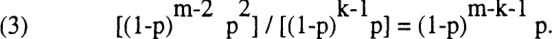
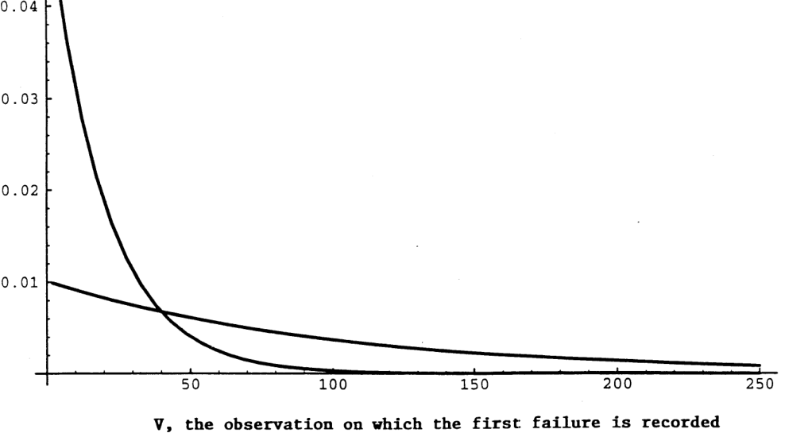
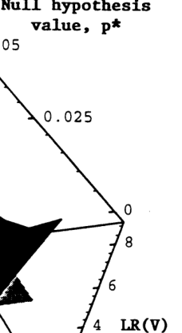
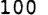
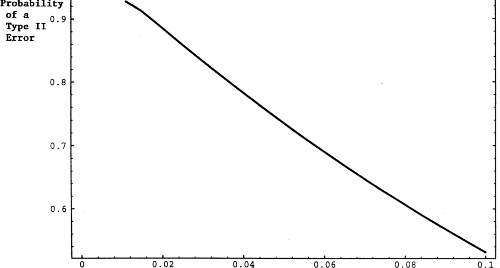
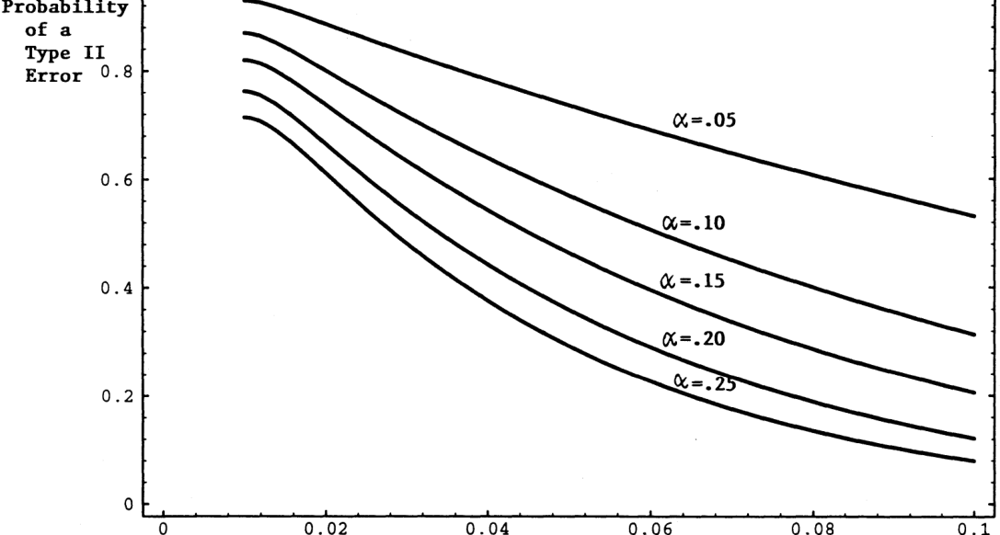
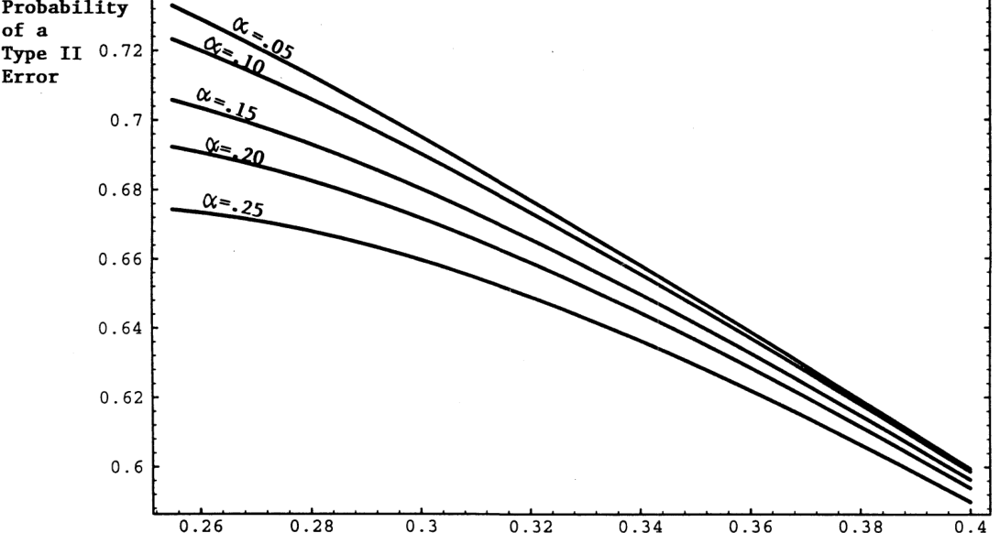
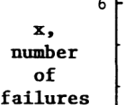
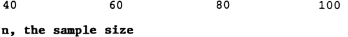
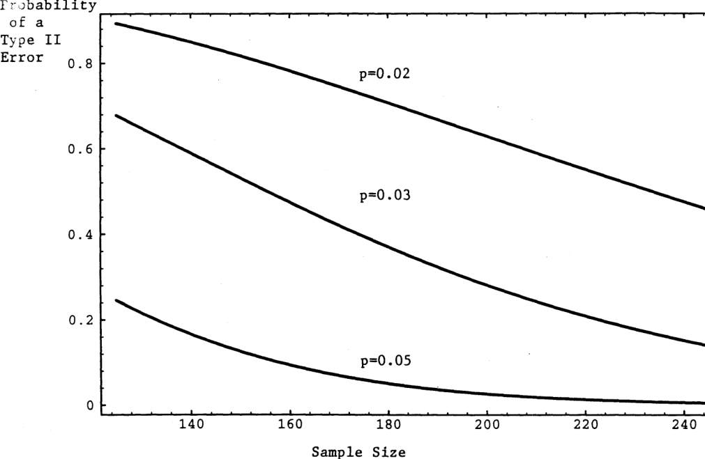

<!-- page: 1 -->

# Finance and Economics Discussion Series Division of Research and Statistics Division of Monetary Affairs Federal Reserve Board, Washington, D.C. 

##### RESERVE 

<!-- Start of picture text -->
D E i D D D <!-- End of picture text -->

**95-24** 

## TECHNIQUES FOR VERIFYING THE ACCURACY OF RISK MEASUREMENT MODELS 

## Paul H. Kupiec 

#### May 1995 

NOTE: Papers in the Finance and Economics Discussion Series are preliminary materials circulated to stimulate discussion and critical comment. The analysis and conclusions set forth are those of the authors and do not indicate concurrence by other members of the research staffs, by the Board of Governors, or by the Federal Reserve Banks. Upon request, single copies of the paper will be provided. References in publications to the Finance and Economics Discussion Series (other than acknowledgement by a writer that he has access to such unpublished material) should be cleared with the author to protect the tentative character of these papers.

<!-- page: 2 -->

<!-- Start of picture text -->
RESMA IV'CRI LIBRARY RESERVE ^ <!-- End of picture text -->

**Techniques for Verifying the Accuracy of Risk Measurement** 

**Models** 

by 

* 

Paul H Kupiec 

April 1995 

***** 

Senior Economist Board of Governors of the Federal Reserve System. The conclusions herein are those of the author and do not represent the views of the Federal Reserve Board, or any of the Federal Reserve Banks. I am grateful to Pat Parkinson, Greg Duffee, Mark Fisher and Matt Pritsker for comments on an earlier draft of this paper. phone 202-452-3723 or email at pkupiec@frb.gov

<!-- page: 3 -->

## **Techniques for Verifying the Accuracy of Risk Measurement Models** 

### Paul H. Kupiec 

### Division of Research and Statistics Board of Governors of the Federal Reserve System Washington, DC 20551 

Risk exposures are typically quantified in terms of a "value at risk" (VaR) estimate. A VaR estimate corresponds to a specific critical value of a portfolio's potential one-day profit and loss distribution. Given their functions both as internal risk management tools and as potential regulatory measures of risk exposure, it is important to assess and quantify the accuracy of an institution's VaR estimates. This study considers the formal statistical procedures that could be used to assess the accuracy of VaR estimates. The analysis demonstrates that verification of the accuracy of tail probability value estimates becomes substantially more difficult as fr e cumulative probability estimate being verified becomes smaller. In the extreme, it becomes virtually impossible to verify with any accuracy the potential losses associated with extremely rare events. Moreover, the _economic importance_ of not being able to reliably detect an inaccurate model or an under-reporting institution potentially becomes much more pronounced as the cumulative probability estimate being verified becomes smaller. It does not appear possible for a bank or its supervisor to reliably verify the accuracy of an institution's internal model loss exposure estimates using standard statistical techniques. The results have implications both for bank's that wish to assess the accuracy of their internal risk 

measurement models as well as for supervisors who must verify the accuracy of an institution's risk exposure estimate reported under an internal models approach to market risk.

<!-- page: 4 -->

## **Techniques for Verifying the Accuracy of Risk Measurement** 

## **Models** 

## **I. Introduction and Summary** 

This study considers statistical techniques that could be used to verify the accuracy of a financial institution's estimates of the tail values of the distribution of potential gains and losses on its portfolio of securities, futures, and derivative positions. The procedures use performance data (historical profits and losses) on the institution's trading account positions, or historical simulation exercises to "verify" an institution's estimate of its potential loss exposure. Such procedures, so-called 

"reality checks", have been advanced by some as a tool for determining the accuracy of internal risk measurement model exposure estimates. 

Dealer banks and broker-dealers active in financial markets typically maintain internal risk measurement models that are used to estimate the daily global exposures that are generated by the institution's portfolio of financial assets and derivative 

obligations.1 Risk exposures are typically quantified in terms of a "value at risk" (VaR) estimate. A VaR estimate corresponds to a specific critical value of the institution's portfolio potential one-day profit and loss distribution. Typically, a VaR estimate is defined by a loss amount large enough so that the cumulative probability that the institution could post larger losses is at most 1 or perhaps 5 percent. As such, a VaR measure corresponds to a specific left-hand critical value of a portfolio's profit and loss distribution. In addition to their importance for internal risk management, under the "Internal Models Approach" proposed by the Basle Bank Supervisors Committee, critical value estimates from a bank's internal risk measurement models would become the basis for 

1. See, The Group of Thirty (1993), Derivatives: Practices and Principles, Appendix HI: Survey of Industry Practice.

<!-- page: 5 -->

a bank's market risk regulatory capital requirement. Similarly, under a proposal by the Derivatives Policy Group, internal model risk exposure estimates could be used to establish capital guidelines for the derivative activities of unregulated affiliates of **3** U.S. broker-dealers. 

Given their functions both as internal risk management tools and as potential regulatory measures of risk exposure, it is important to assess and quantify the accuracy of an institution's internal model risk exposure measures. Despite the importance of accuracy assessment, no published research has analyzed the statistical techniques that would be appropriate forjudging the quality of a financial institution's VaR estimates. The Group of Thirty Study study suggests "reality checks" forjudging model 4 performance. The study recommends that an institution's VaR estimates be compared against the portfolio's subsequent profit and loss outcomes but does not provide any detail regarding the formal statistics that facilitate the suggested reality-check 

comparison. Similarly the Basle Supervisors recommend so-called "back-testing" as a means of verifying the accuracy of a bank's risk exposure estimates, but again they do not provide the statistical details of the recommended verification test5 

This study derives the formal statistical properties of reality-check test statistics. The results indicate that there are significant statistical difficulties surrounding the verification of the estimates of the size and likelihood of the very low 

2. See, An Internal Model-Based Approach to Market Risk Capital Requirements. Basle Committee on Banking Supervision, Basle, April 1995. The Basle proposal defines VaR in terms of a two-week holding period. 

3. See, A Framework for Voluntary Oversight. New York: Derivatives Policy Group, March 1995. 

4. Group of Thirty (1993), Derivatives: Practices and Principles, recommendation 8. 

5. An Internal Model-Based Approach to Market Risk Capital Requirements. (1995), page 15.

<!-- page: 6 -->

probability loss events that these tail value estimates represent. Although the study focuses on the regulatory verification problem, the results have implications both for bank's that wish to assess the accuracy of their internal risk measurement models as well as for supervisors who must verify the accuracy of an institution's risk exposure estimate reported under an internal models approach to market risk. 

Regardless of the regulatory horizon over which market risk exposure is estimated for regulatory capital purposes, the analysis indicates that the only practical way to verify a bank's internal model's performance using historical profits and losses is to compare its one-day potential loss estimates with its one-day actual performance statistics. An identical horizon would be adopted by a financial institution that was attempting to assess the accuracy of its internal risk exposure estimates. 

Even when performance is monitored at high frequencies, performance-based verification test statistics have extremely poor power for detecting a model (institution) that habitually under-estimates potential loss amounts. Moreover, this inability to detect under-reporting is shown to imply that an institution can substantially underestimate the magnitude of its potential losses (e.g., understate its potential loss exposure or capital requirement by 100 percent or more) with little probability of being detected either internally by the bank's risk management staff or externally by a supervisor using a performance-based verification scheme. 

Verification schemes need not be based on historical performance. Loss exposure estimates can, in theory, be corroborated using the critical value estimates from simulations of the historical loss distribution of an institution's current portfolio. The results presented show that historical simulation-based verification schemes also perform very poorly. When potential loss distributions are fat-tailed, simulation-based critical value estimates exhibit significant biases and have standard errors of substantial magnitude, even in relatively large samples. These problems are further

<!-- page: 7 -->

compounded when the underlying distribution is a mixture process. This is significant because when an institution's portfolio contains options, the portfolio's return distribution will be a mixture process. The characteristics of simulation-based verification tests do not recommend their use either as a technique for estimating tail values or as a means of performing ex ante validation checks of risk exposure estimates. 

The analysis demonstrates that verification of the accuracy of tail probability value estimates becomes substantially more difficult as the cumulative probability estimate being verified becomes smaller. In the extreme, it becomes virtually impossible to verify with any accuracy the potential losses associated with extremely rare events. Moreover, the _economic importance_ of not being able to reliably detect an inaccurate model or an under-reporting institution potentially becomes much more pronounced as the cumulative probability estimate being verified becomes smaller. It does not appear possible for a bank or its supervisor to reliably verify the accuracy of an institution's internal model loss exposure estimates using reality-check test statistics. 

## **II. The Regulatory Verification Problem** 

Under the internal models proposal for setting market risk capital requirements, banks would use their internal risk measurement models to estimate the distribution of potential loss exposure associated with their trading portfolio positions. Banks would be required to report to supervisors their estimate of the size of the potential loss that would not be exceed in excess of 1 percent of the time over a subsequent two week period. This loss estimate would, in effect, be the 1 percent left-hand critical value of their trading account's two-week potential profit and loss distribution.6 Market risk 

6. That is, 99 percent of the probability mass of the potential two-week profit and loss distribution would be associated with smaller losses or profitable outcomes. For a more detailed description, see Kupiec and O'Brien (1995), "The Use of Bank Trading Risk Measurement Models for Regulatory Capital Purposes."

<!-- page: 8 -->

capital requirements would be some multiple (the so-called "scaling factor") of the loss associated with the 1 percent critical value reported by the bank.7 

An important issue surrounding the internal models approach for setting market risk capital requirements is verification of the bank's critical value loss estimate. 

Presumably, if a bank's actual losses do not frequently exceed its ex ante internal modelbased critical value estimates, or if its loss estimates do not exceed the potential losses that would have been generated by the portfolio if it were held by the bank through some historic period, then the bank's loss estimates would be deemed to be accurate. 

Under the internal models approach, banks must report critical value loss estimates to supervisors who have no direct method of determining the accuracy of the reported loss estimate. However, supervisors are able to monitor bank performance and observe the outcome of a binomial event: either the bank's loss (profit) on trading activities was less than its ex ante estimate (a success), or the loss on trading activities exceeded the g ex ante estimate (a failure). Given the regulatory reporting guideline, the null hypothesis is that the probability of observing a failure in any period is 1 percent. As the bank's potential loss estimates are independent across periods, the performance data are distributed as a series of draws from an independent Bernoulli random variable with a 

7. As the the DPG recommendations do not include a mandatory regulatory capital requirement for the unregulated affiliates of SEC regulated broker-dealers, the discussion focuses on the verification problems faced by bank regulators. 

8. Because the supervisor has no knowledge of the parametric form of the bank's profit and loss distribution—and indeed there is good reason to believe that the form of the 

distribution changes depending of the composition of the bank's portfolio—the magnitude of the size of the differences between a banks potential loss estimate and its actual gains or losses is not informative.

<!-- page: 9 -->

probability of a failure on any one draw equal to 1 percent. 

### The Monitoring Horizon 

For risk management purposes, banks generally estimate their potential risk exposures over one-day horizons. Under current supervisory proposals, regulatory capital requirements are to be based on longer holding period horizons (e.g. 2 weeks or longer). If a supervisor wishes to verify the accuracy of a bank's potential loss estimates, which holding period risk estimate should be examined, the one-day estimate or the regulatory horizon estimate? Both practical considerations and formal statistical properties suggest that it is futile to monitor a model's accuracy at anything but a one-day horizon. 

A bank's one-day risk exposure estimates could be accurate and yet this accuracy could be compromised by the bias introduced by the creation of exposure estimates for the mandated regulatory horizon. Potential losses over the regulatory horizon would be estimated by scaling-up the bank' s one-day potential loss estimates in accordance with specific regulatory guidelines. The scaling factor introduces unknown biases into the potential loss estimates. This source of bias is introduced independent of accuracy of the bank's one-day risk exposure estimates. Furthermore, because the sign and size of the scaling factor bias depends on the composition of bank's portfolio, it will vary over 10 time. 

9. Each period the bank is required to estimate the size of the potential loss that will not be exceeded with one percent probability over the next day. Each day the bank produces a new estimate of this one-percent potential risk exposure estimate. If the bank is doing this properly, each day there should be a 1 percent probability that the bank's potential loss is violated. This probability should be independent of the bank's previous profit or loss experience because the portfolio is marked to market each day. Independence is an implication of an efficient bank forecast. 

10. See Kupiec and O'Brien (1995), "The Use of Bank Trading Risk Models for Regulatory Capital Purposes," for a discussion.

<!-- page: 10 -->

The use of historical performance data to verify internal model-based estimates of long holding period potential loss exposures risks is further complicated by the endogenous nature of the portfolio's risk exposure. Over the regulatory monitoring interval, the bank can and will adjust its trading risk exposure. For risk estimates over horizons longer than a day, a verification scheme based on historical performance attempts to verify a risk estimate for a portfolio of fixed composition by comparing that risk estimate with the profit or loss performance generated by a series of portfolios that differ in composition. Monitoring schemes based on historical performance are internally consistent only when they are performed for one-day value at risk measures. 

A final consideration is the time period necessary to conduct meaningful verification analysis and detect under-reporting banks. The statistical analysis that follows will show that relatively large sample sizes are necessary if verification tests are to have any power against local alternative hypothesis. The time interval necessary to accumulate a sufficiently large sample of independent two-week horizons is too long to be of practical use for supervisory purposes.1 1 

## Statistical Methods for Monitoring 

The null hypothesis—that the probability of a failure in any reporting period is 1 percent—can be tested in a variety of ways. The appropriate test depends on how the bank is being monitored. One alternative is daily monitoring of the bank's performance. Upon observing a failure, the supervisor can formally test the hypothesis that the bank is using a failure rate of 0.01 for estimating its reported potential loss critical value. An alternative approach is to monitor the bank at less frequent intervals (e.g. quarterly) and test the null hypothesis using the proportion of failures observed in the monitoring period sample.

<!-- page: 11 -->

As an alternative to monitoring a bank's actual performance, the bank's loss estimate can be compared to a simulated performance distribution. In this approach, the critical values of the bank's portfolio loss distribution are generated by historically simulating the day-to-day gains and losses the bank's current portfolio would have generated if it were held over some fixed historical time period. This verification technique is termed the historical simulation approach. 

## **III. The Internal Verification Problem** 

Institutions must also assess the accuracy of their risk measurement models. The task of assessing the accuracy of an institution's value at risk estimates is statistically similar regardless of whether the assessment is made by a supervisor or by an institution's risk management staff. Although it is conceivable that an institution's internal staff could have better information about the parametric form of the institution's potential profit or loss distributions, in practice this is unlikely to be the case. The parametric form of the profit and loss distribution will change daily as the options components in the institution's portfolio change. The complex nature of the parametric form of the distribution makes it extremely difficult if not impossible to incorporate such information into a daily performance comparison test statistic. Consequently, even from the perspective of an institution's internal risk management staff, model verification tests will be based on the outcomes of a series of Bernoulli trials: either the value at risk estimates were sufficiently large (a success), or they were smaller than the recorded loss (a failure). Absent information on the exact parametric form of the potential loss distribution, the magnitudes of the deviations of actual losses from the ex ante value at risk estimates provide no additional useful information.

<!-- page: 12 -->

## **IV. Verification Tests Based on Daily Monitoring** 

In a daily monitoring scheme, the initial monitoring statistic of interest is the number of observations until a failure is observed. Initially consider the verification problem associated with the time at which the first failure is observed. A subsequent section develops the verification tests required when analyzing additional failures. Aside from potential differences in the critical value of interest—institutions may focus on a 5 percent tail value whereas regulators are concerned with a 1 percent tail valuethe test setting is identical for an institution attempting to assess the accuracy of its risk measurement model's exposure estimates or a regulator attempting to verify the accuracy of a bank's reported risk exposure estimates. Recognizing this correspondence, for expositional convenience the tests will described only from the perspective of a supervisor attempting to verify the accuracy of a bank's reported potential loss estimates. The corresponding application to the institution's internal verification problem should be clear without explicit exposition. 

Let T denote the time (number of periods) until the first failure is recorded. If p is the probability of a failure on any given day, the probability of observing the first failure in period V is given by, 

## (1) Prob(T=V) = p (l-p)V 1 . 

Figure 1 plots the cumulative probability functions for T assuming p=0.01 and p=0.05. T has a geometric distribution with an expected value, the expected number of observations until the first failure is observed, of (1/p). For example, when p=0.01, the average time until the first failure is 100; when p=0.05, the average time until failure is 20.

<!-- page: 13 -->

Although the analytic expression for the average time until the first failure is observed is very intuitive, the distributional characteristics of T make hypothesis testing more opaque. Figure 2 plots the probability density functions for p values of .01 and .05. Notice that the smaller the probability of a failure on any given draw, the greater the probability in the right tail of the distribution of T. The probability density for T is skewed toward the right with increasing probability in the right tail as p values decrease toward 0. This characteristic leads to extremely wide confidence intervals for estimates of p under the null hypotheses that p is small. 

Given an observation on T, the number of periods until the first failure is recorded, a supervisor wishes to test the hypothesis that the bank's underlying potential loss estimates are consistent with a 1 percent value for p. This null hypothesis can be tested using a likelihood ratio (LR) test. The Neyman-Pearson Lemma establishes that the LR test is uniformly most powerful against alternative hypotheses in this context. Given ***** a value for T, T=V, the LR test statistic for testing the null hypothesis that p = p is * given by LR(V,p ), 

(2) LR(V,p*) = -2 Log[ p*(l-p*)V_1 / (1/V) (1- 1/V)V_1 ]. 

***** 

Under the null hypothesis, LR(V,p ) has a Chi-Square distribution with one degree of l 2 freedom. The five percent critical value of this distribution is 3.841; that is, if ***** the likelihood ratio statistic exceeds 3.841, the null hypothesis that p = p can be rejected at the 5 percent (Type I error) level. 

12. The Chi-Square distribution result is true asymptotically. Monte Carlo simulation results indicate that the critical values of the Chi-Square distribution provide good approximations in this setting.

<!-- page: 14 -->

Figure 3 illustrates the geometry of the likelihood ratio test for p = p . In ***** figure 3, the cross-hatched surface is LR(V,p ), the value of the LR test statistic for ***** selected values of V under alternative null hypothesis values for p, the probability of a failure on any single event. The grey non-hatched plane is the 5 percent critical value ***** for a Chi-Square distribution with one degree of freedom. Any points on the LR(V,p ) test statistic surface above the critical value plane will lead to a rejection of the corresponding null hypothesis. The non-rejection region for the test statistic ***** corresponds to the points on the LR(V,p ) surface below the plane. Notice that the non- ***** rejection region grows increasingly large as the null hypothesis values of p approach zero. 

* 13 For a null hypothesis of p =0.01, the critical values for V are V=6 and V=439. That is, if the first failure occurs before the seventh trading day, or after the 438th day, the supervisor can reject the hypothesis that the bank is reporting loss estimates consistent with p = 0.01. If no failures occur in the sample, or if the first failure occurs on any observation between the seventh and the 438th, the supervisor cannot reject the hypothesis that the bank is truly reporting losses consistent with a p-value of 1 ***** percent. For a null hypothesis of p = 0.05 (that is, that the bank is reporting loss estimates consistent with a 5 percent tail loss probability), the critical values of V from the likelihood ratio test are: between 0 and 1 (an impossibility), and 86; that is, it is impossible to determine, at the 5-percent level of the test, whether p > 0.05 since under the null hypothesis a failure occurs with 5 percent probability on the first draw. If V is greater that 85, it can be concluded at the 5 percent level of the test that the bank is using a p-value less than 0.05. 

13. If the first failure occurs before the 7th trading day, it can be concluded that p > 

0.01. If the first failure loss occurs after the 438th trading day, it can be concluded that p<0.01.

<!-- page: 15 -->

**As is evident in figure 3 and in the above discussion, the non-rejection region for * 14 V is very wide for the null hypothesis p = 0.01. If the first failure occurs on the * seventh trading day, the null of p = 0.01 cannot be rejected and yet the maximum likelihood estimate of p is (1/7) or 14.3 percent.** 

**Despite the fact that the LR test is the most powerful test when observing the time until the first failure, the substantial size of the region over which the null** hypothesis **cannot be rejected is an indication that the test statistic has a poor ability to distinguish among a wide range of alternative hypothesis. Figure 4 plots the so-called * operating characteristic curve for the LR test of p = 0.01. The value of the operating characteristic curve is the probability of accepting a false null hypothesis (committing a Type II error); that is, the probability of accepting the null hypothesis * p =0.01 when in fact the probability of a failure on any single observation is greater than 0.01.** 

**The probability of accepting a false null hypothesis depends on the true underlying value of p that generates the data. The larger the value of the true underlying probability of a failure, the smaller the probability of committing a Type II error. For example, figure 4 shows that if the first failure is observed between the 7th and 438th * observation, the null hypothesis p =0.01 cannot be rejected, and yet if the loss estimate reported by the bank is actually consistent with p = 0.02, over 88.5 percent of * the time the LR test of p = 0.01 would accept the null hypothesis.** 

**The difficulty of distinguishing between an 0.01 and a 0.02 tail probability loss estimate may, at first glance, appear to be a point of academic interest with little practical significance. To the contrary, the difference between 0.01 and 0.02 critical** 

***** 

**14. In fact, the non-rejection region is so wide for the null hypothesis p =0.01 that the entire acceptance region cannot be pictured in the scale of Figure 3. If the plot range were extended, the LR (cross-hatched) surface could be seen to "curl up" and intersect the critical value plane at V=439.**

<!-- page: 16 -->

values can have substantial economic implications for market risk capital requirements. Consider a typical "fat-tailed" probability distribution such as the Student T distribution. The 0.01 critical value of a T-distribution with one degree of freedom is - 31.82. The 0.02 critical value from the same distribution is -15.89. In this situation, a bank that was truly using a 0.02 cumulative probability tail loss estimate would be under-reporting their potential losses by 100 percent-that is, they would report potential losses that required 15.89 in capital and yet their true regulatory capital requirement would be 31.82. The particularly troubling aspect is that it would be virtually impossible for the regulatory authority to detect such a gross under-reporting. Although this T-distribution example is only an illustration of the problem, the qualitative point of the example is general: differences between the potential losses associated with 0.01 and 0.02 cumulative probability critical value estimates can imply substantially different capital charges under an internal models approach. 

The plots in figure 4 show that there is a very high probability that the null * hypothesis p = 0.01 could be accepted even when a bank: is using a true tail value far in excess of 0.01. The high Type II error probabilities indicate that the LR test has very * 15 poor power for testing p =0.01. The implication of these calculations is that this reality check statistic has a poor ability to reliability distinguish between alternative underlying values for the probability of a failure. 

The operating characteristic curve plotted in figure 4 pictures the Type II error ***** rates against alternative hypothesis for the LR test of p = 0.01 evaluated at an 0.05 Type I error rate (that is, the probability of incorrectly rejecting a true null hypothesis of * p = 0.01 is set at 5 percent). The LR test Type II error rates can be reduced if the investigator is willing to accept a greater probability of incorrectly rejecting a true 

15. The power of a statistical test is defined to be 1 minus the Type II error probability for a given alternative hypothesis.

<!-- page: 17 -->

***** null hypothesis of p =0.01. As the level of the test is increased (i.e., as the Type I error rate is increased), the null hypothesis acceptance region shrinks and the probability of incorrectly accepting a false null hypothesis (the Type II error) is reduced. Table 1 reports the null hypothesis acceptance region and the Type II error ***** rates against the alternative p = 0.02 for the LR test of p = 0.01 at different Type I error rates. As is evident in the table, the Type I and Type II error rates are inversely ***** related. The data in table 1 indicate that the LR test of the null p =0.01 has poor power against the alternative p = 0.02 even for large Type I error rates. Figure 5 plots ***** the operating characteristic curves for the LR tests p =0.01 for alternative Type I error rates. The plots further demonstrate the poor power characteristics of the LR test. 

The time until first failure test has particularly poor power against local alternatives when testing null hypotheses under which failures are very rare events (that ***** is, testing null hypothesis with very small p values). The test has slightly higher power for tests of null hypothesis under which failure is a more common occurrence. For example, Figure 6 plots the operating characteristic curves for the test of the null ***** hypothesis p = 0.25 under alternative Type I error rates. As the null hypothesis value of * * p is increased from the p = 0.01 level, the size of the acceptance region for V decreases. The smaller size of the acceptance region works to reduce the probability of committing a Type II error. Moreover, in regions associated with a greater failure rate probability under the null, tenable local alternative hypothesis (i.e., alternative hypothesis that have high Type II error rates) do not imply sizeable differences in critical values (loss estimates). More concretely, although the difference in the loss estimates associated with a p = 0.01 value and a p = 0.02 value can be substantial (over 15 in the earlier T-Distribution example), the difference in the loss estimates associated

<!-- page: 18 -->

with a p = 0.25 and p = 0.30 value are far smaller, even for fat-tailed distributions.1 6 The implication is that a Type II error in the outcome of a verification test (i.e. accepting an incorrect null hypothesis) is not as economically significant when the null hypothesis is that failures occur relatively frequently. 

The preceding analysis suggests that verification of the accuracy of tail probability value estimates becomes substantially more difficult as the cumulative probability estimate being verified becomes smaller. In the extreme, it becomes virtually impossible to verify with any accuracy the potential losses associated with extremely rare events. Moreover, the _economic importance_ of incorrectly accepting a false null ***** hypothesis increases as the null hypothesis tail-size value (p ) shrinks. 

## Multiple Failures in a Daily Monitoring Scheme 

It is highly probable that a supervisor may observe the first failure and not reject * the null hypothesis p =0.01. Beyond the first failure, the bank may experience additional failures which add information that can be used to verify the loss estimates reported by a bank. This section considers the statistical properties of "reality check" test statistics that are useful when a supervisor encounters additional failures under a daily monitoring scheme. 

_Tests Based on the Time Between Additional Failures_ 

The initial test that considers the temporal ordering of failures is the test based on the time until the first failure is recorded. The temporal ordering of additional failures determines the sample's conditional likelihood function and the corresponding LR test statistic for tests based on the time elapsed between failures. 

16. The critical value (the loss) for the 0.25 quantile of the standardized T-Distribution with 1 degree of freedom is -1 (a loss of 1) whereas the critical value for the 30 percent cumulative probability is -0.7265. For the normal distribution these values are -0.675 and - 0.525 respectively.

<!-- page: 19 -->

**Suppose that a supervisor is examining a bank's risk exposure estimates and cannot * reject the null hypothesis of p =0.01 after 6 observations. The next opportunity to reject the null hypothesis occurs if an additional failure is observed over a relatively short subsequent time period.** 

**The probability of observing 2 failures in a sample of size m, given that the first failure occurred on observation k>6 is,** 

**Given this conditional probability distribution, the maximum likelihood estimator of p is * [l/(m-k)], and the LR test statistic for the null hypothesis p = p is,** 

*** rri-k"-1 * m-k-1** (4) **-2 Log [(1-p ) (p )] + 2Log[(l-(l/(m-k)) ' (l/(m-k))].** 

**Upon making the substitution (m-k) = V, expression (4) is identical to expression (2). The equality implies that the conditional time until the second failure test is identical to the time until first failure test applied to the number of observations between the first and the second recorded failures. Consequently, if k>6 and (m-k) > 6, the * 17 investigator cannot reject the null hypothesis that p = 0.01.** 

***** 

**Suppose the examiner cannot reject the null hypothesis p =0.01 based on the timing of the first two failures. Assume that the first failure occurs on observation k>6, and the second failure occurs on observation m > k+6. If the third failure occurs on the th * n observation, it can be shown that the LR test statistic for the null p = p is** 

**equivalent to expression (1) upon setting V = n-m. Thus, for multiple failures, the time-** 

**17. Ignoring the other critical value of 439 because it is essentially irrelevant to this discussion.**

<!-- page: 20 -->

until-first-failure test generalizes into a time-between-failures test. If the time 

***** 

between failures is greater than 6, the null hypothesis p =0.01 cannot be rejected at the 5 percent level of the test (Type I error rate). 

#### **_Tests Based on the Number of Failures_** 

Tests based only on the time between failures ignore the information about the total number of failures that have occurred since monitoring began. When the time until the first failure test cannot reject the null hypothesis, the supervisor should begin monitoring using a test based on the number and order of failures in the sample. This test is derived from the unconditional likelihood function. Because this test uses more information than the time between failures test, it is a more powerful test. 

Suppose that the first failure occurs at observation k>6 and the second failure occurs at observation m. Upon observing the second failure, the supervisor wishes to test * the hypothesis that p =0.01. The likelihood function for this sample of observations is, 

- (4) p2 (l-p)m 2 , 

where p is the probability of a failure for any single observation. More generally, consider a situation in which a specific sequence of x-1 failures are observed without rejecting the null hypothesis, and the x failue occurs on the n observation. The likelihood function for this sample of observations is, 

- x n-x 

- (5) p (1-p) . 

Given these sample likelihood functions, the supervisor wishes to test the null hypothesis * that p = 0.01. In this instance, the likelihood ratio test of null hypothesis is again the uniformly most powerful test.

<!-- page: 21 -->

The maximum likelihood estimate of p is the sample proportion of failures, (x/n). The LR test statistic is given by, 

## (6) -2 Log [(l **-p*)****n** **~****X** **( p V ] +** 2 Log [(l-(x/n))n "X (x/n)X ], 

***** 

where n is the sample size, x is the number of failures in the sample, and p is the ***** probability of a failure under the null hypothesis. Under the null hypothesis, p = p , the statistic given in expression (6) has a Chi-Square distribution with one degree of freedom. 

For the specialized case of a single failure in a sample size of n, expression (6) is mathematically identical to expression (2) for V=n; that is, the LR test based on ***** expression (6) is identical to the LR test of p = p derived from the time until the first failure distribution. Given this equivalence, this test also has the same poor power properties described at length earlier. 

***** 

In tests of the hypothesis p = p from a sample with two or more violations, expression (6) can be compared with the critical value from the Chi-Square distribution. Alternatively, an analytical comparison can be used to enumerate the critical values of n ***** that are associated with a rejection of the null for alternative values of p and observed failures, x. Figure 7 shows the combinations of x and n values that produce a Chi-Square ***** value of 3.841 for alternative values of p . These "level set" values of the likelihood ratio function separate acceptance regions from rejection regions; the acceptance region for the null hypothesis is the area southeast of the critical value contour line. For ***** example, under the null hypothesis p =0.01, when x = 2, the likelihood ratio test statistic will equal 3.841 (the Chi-Square 5 percent critical value) at a sample size of n = 34. The implication is that if 2 failures are recorded in a sample size of 34 or ***** smaller, the null hypothesis p =0.01 can be rejected at the 5 percent level of the test

<!-- page: 22 -->

(Type I error). If the sample size is larger than 34, the null hypothesis cannot be rejected. Notwithstanding the continuity of the level sets pictured in figure 7, the binomial distribution is discrete and the critical values are defined only for integer values of x and n. A numerical partial listing of these critical values appears in table **2.** 

Similar to the time-until-first-failure test, the LR test based on the unconditional likelihood has poor power characteristics. That is, null hypothesis acceptance regions are large so there is a significant probability that the statistician will accept a false null hypothesis. As a consequence, the test has a poor ability to distinguish among competing hypothesis even in moderately large samples. 

This should not be surprising if one consider's the simple mathematical relationship implied by Chebyshev's inequality. In a sample of size n from a binomial population with a failure rate p, the proportion of failures in the sample, (x/n), has an expected value of p and a variance of {p(l-p)/n}. In this instance, Chebyshev's inequality states that for any given positive constant c, the probability that the sample proportion of failures **2** (x/n) is outside the interval {p-c < (x/n) < p+c} is less than or equal to {p(l-p)/(nc )}. The implication is that if the supervisor wants to choose a sample size so that the sample proportion of failures will be within 0.005 of the true value of p = 0.01 at least 95 percent of the time, the sample size must be greater than or equal to 7920. The Chebyshev's inequality relationship suggests that large sample sizes will be required to accurately estimate the true underlying proportion of failures from a sample of observations on the process. 

**18. The law of large numbers implies that, as the sample size increases towards infinity, the population proportion will converge to the true underlying value of p. However true, this result is irrelevant from a supervisor's perspective as even the 5 percent error rate tolerated in the prior example requires a sample size of 30.5 years of daily trading results.**

<!-- page: 23 -->

Consider a sample that contains two failures. The LR test statistic implies that * the null hypothesis p =0.01 will be accepted for samples containing 2 failures provided the sample size is larger than 34 (table 2). Figure 8 plots the probability of accepting * the null hypothesis p = 0.01, in samples with two failures, when the true probability of failure is greater than 0.01. As is evident in the plots, the probability of committing a Type II error declines as the sample size increases and as the true underlying process failure rate increases. Despite the power enhancement generated by larger sample sizes, figure 8 shows that the probability of making a Type II error (accepting a false null hypothesis) remains substantial for sample sizes in excess of 100 when alternative p values are 0.03 or smaller. 

In sample sizes of 76 and larger, 3 failures are not sufficient to conclude that ***** p >0.01 at the 5-percent level. Figure 9 plots the operating characteristic curves for ***** the 5-percent level LR tests of p = 0.01 for alternative hypothesis. These plots show that Type II error rates are very high for alternatives moderately close to the null hypothesis. Figure 10 plots the operating characteristic curves for samples containing 4 ***** failures. If the sample has 4 failures, the null hypothesis p =0.01 would be accepted at the 5-percent level in sample sizes larger than 124. 

The plots in figures 8 through 10 show that, unless the bank experiences few failures in a relatively large sample, there is a high probability that the supervisor ***** will accept the null hypothesis p =0.01 even though the bank could be reporting losses consistent with a much larger failure rate. These results again illustrate the statistical difficulties inherent in verifying the accuracy of extreme tail value ***** estimates. Tests of the null hypothesis p =0.01 have very poor power unless the sample size is large relative to the proportion of failures in the sample. 

Type I and Type II error rates are inversely related and the power of these tests can be improved by increasing the Type I error rate (the probability of incorrectly

<!-- page: 24 -->

rejecting a true null hypothesis). Consider figure 9. Suppose the supervisor decided that, based upon Type II error rates, an appropriate verification test was the requirement that the bank experience three or less failures in its reported daily value-at-risk measures in a year (about 250 trading days). From figure 9, if the bank were truly reporting a 2 percent tail loss estimate to the supervisor (instead of the 1-percent legal requirement), the supervisor could be confident that, if it used the 3 failures per year rule, such a mis-reporter would escape detection only 26.23 percent of the time. Although this verification rule is expected to catch almost 75 percent of the under-reporters, the l 9 Type I error rate associated with this rule is about 75 percent. This implies that in order to catch 75 percent of the banks under reporting their potential loss exposures, the supervisor must be willing to falsely accuse of under reporting 75 percent of all banks that are reporting accurately. As this example makes concrete, the statistical properties of tail events make it virtually impossible to accurately verify estimates of the probabilities associated with such rare events. 

## **V. Verification Test for Infrequent Monitoring Schemes** 

The choice of the audit period will depend on auditing costs, potential losses associated with delayed detection of an under-reporting bank, and the power characteristics supervisors deem appropriate for a statistical verification process. Given these factors, it may be optimal to monitor a bank infrequently-perhaps quarterly or even annually. Longer sample periods may allow for more powerful verification tests but they also raise the potential costs associated with delayed detection of undercapitalized banks. 

19. The Type I error rate must be calculated by evaluating the LR test and calculating the corresponding Chi-Square probability.

<!-- page: 25 -->

At the time of the audit, the supervisor would examine the daily performance of the bank's potential loss estimates over the sample (monitoring) period. The supervisor could consider the temporal ordering of successes and failures within the sample and apply the daily monitoring techniques already described. Alternatively, the supervisor could focus attention on the proportion of failures in the sample. This section analyzes the statistical properties of the sample proportion test statistics. 

The probability of observing x failures, regardless of order, in a sample of size n 

is, 

## (7) Binomial[n, x] (l-p)n X pX , 

where Binomial[n,x] signifies the binomial coefficient for n objects taken x at a time, and p is the probability of a failure on any of the n independent trials. The likelihood ratio test of the null hypothesis is again the uniformly most powerful test for a given sample size. 

The maximum likelihood estimate of p is again the sample proportion of failures, (x/n). The LR test statistic is given by, 

## (8) -2 Log [(l **-pY'****X** **( p*)****X** **] +** 2 Log [(l-(x/n))n "X (x/n)X ], 

***** where n is the sample size, x is the number of failures in the sample, and p is the probability of a failure under the null hypothesis. Because the binomial coefficient cancels out in the likelihood ratio, the statistic given in expression (8) is identical to the test given in expression (6). Consequently, the binomial test is equivalent to the unconditional sample distribution-based LR test discussed in the prior section.

<!-- page: 26 -->

## **VI. Verification Schemes Based on Historical Simulation** 

As an alternative to verification tests based on historical profit and loss performance, it is sometimes suggested that historical simulations can be used as a validation technique. For example, a bank could be required to take its current portfolio holdings and calculate the daily changes in value the portfolio would have experienced if it were held over some prior period. The daily changes in portfolio value that would have resulted from the historical day-to-day changes in market prices and interest rates could be used to construct a sample histogram. From such a histogram, 1 (or 5) percent critical value loss estimates could be determined. This simulation-based critical value loss estimate could then be compared to the bank's internal model-based critical value estimate as a verification tool. Alternatively, the historical simulation-based critical value estimate could be used as the basis for the bank's capital charge. An appealing quality of this approach is that it does not make assumptions about the underlying covariance structures among asset price changes. The historical volatilities and correlations are automatically captured in the historical simulation exercise. 

The drawback of such an approach is the large sampling errors associated with their empirical critical value estimates. Historical simulation-based frequency distributions are estimates of the true underlying distribution and consequently are subject to estimation error. In many cases, very large samples are necessary to reduce the sampling error associated with the critical value estimates associated with very small (or very large) cumulative probability values. 

It is possible to derive a theoretical approximation for the variance of the critical value from a sample frequency distribution. Let correspond to the p-percent critical value of a probability density f(x) such that the integral from negative infinity

<!-- page: 27 -->

to X equals p-percent. It can be shown that the variance of an estimate of X from a **P 2 0 ^** sample of size n is approximately equal to, 

(9) Var(Xp) = p (1-p) / [ n f(X )2 ]. 

For example, the standard error of the 0.01 critical value estimate from a sample of size **2** n from a normal distribution with a variance of a is approximately, 

3.7689 o n"1/2 . 

The standard error of the 0.05 critical value from this sample is approximately, 

2.1304 on"1 / 2 

These examples illustrate the general property that the standard errors of critical value estimates from sample histograms increase as the cumulative tail probability associated with the critical value declines. This property of the historical simulation approach is analogous to the property already discussed in the context of the historical performance approach to verification: the smaller the cumulative probability associated with a critical value loss estimate, the more difficult it is to verify the accuracy of the estimate. 

The importance of sampling error in historical simulation-derived estimates of critical values can be illustrated more concretely using Monte Carlo experiments. In the following experiments, 10,000 independent samples of various sizes are drawn from known 

20. See Kendall and Stuart (1960), The Advanced Theory of Statistics. London: Charles Griffin & Co, pages 236-237.

<!-- page: 28 -->

underlying probability distributions. For each of the 10,000 samples, a sample histogram is constructed and important critical values~the 0.01, 0.05, 0.10, and 0.25 cumulative probability critical values-are estimated. From these estimates, sampling distributions are constructed for the alternative critical value estimates. This experiment is repeated for alternative underlying distributions. 

Table 3 reports the simulation results for the standard normal distribution for 2 1 sample sizes of 100, 250, 500, 1000, and 2500 observations. Table 4 reports parallel results for the Student-T distribution with 8 degrees of freedom. Table 5 reports results for a T-distribution with 2 degrees of freedom, and Table 6 reports results for the T distribution with 1 degree of freedom. The progression of distributions from Table 3 through Table 6 includes distributions with increasingly large tail probability weights in their theoretical density functions. 

The empirical results reported in tables 3 through 6 illuminate some clear patterns of interest. As the sample size increases, on average, the bias in critical value estimates decreases. The results also show clearly that the standard error of a critical value estimate increases as the cumulative probability associated with the critical value estimate decreases. Consistent with the theoretical approximation, the standard errors of critical value estimates decline as the sample size used to generate the critical value estimates are increased. Similarly, as the sample size increases, the range of critical value estimates recorded for any critical value level declines. A very important pattern is visible in the results for the T-distribution: (1) the bias of 0.01 and 0.05 critical value estimates increases as the underlying distribution becomes more leptokurtotic (fattailed); and (2) the standard error of the 0.01 critical value estimates (and to a lesser degree, the 0.05 critical value estimates) increases enormously as the underlying

<!-- page: 29 -->

distribution becomes more leptokurtotic. The 0.01 critical value estimates for T- distributions with 1 and 2 degrees of freedom exhibit strong bias and standard errors that are very large (relative to underlying theoretical critical values) even in sample sizes as large as 2500~a sample size equivalent to almost ten years of daily data. 

In practice, the distribution that characterizes market movements may change from day-to-day. Some empirical research suggests that mixtures of distribution may better capture the characteristics of observed financial returns. It is difficult to generate the "fat tailed" nature observed in financial data using a single underlying **2 2** distribution. Moreover, if a bank's portfolio includes option positions, the portfolio return distribution will be a mixture process. Table 7 reports the characteristics of critical value estimates when the underlying distribution is a (specific example of) mixture process. 

In the samples underlying the results reported in table 7, each observation is a draw from either a standard normal distribution, a Student-T distribution with 3 degrees of freedom, or a T-distribution with 1 degree of freedom. For each observation in a sample, the probability of choosing each of the distributions is fixed at 1/3. In the simulation, 10,000 independent samples of size 100, 250, 500, 1000, and 2500 are generated. The results show that the 0.01 critical value estimates suffer from significant biases in small samples. Moreover, as the sizeable standard errors indicate, these critical value estimates are very unstable across samples, even in samples as large as 2500 observations. 

These simulation results suggest that historical simulation-based critical value estimates for 0.01 (and 0.05) cumulative probabilities may suffer from significant biases 

22. Even if one allows for time-varying variances, as in an ARCH model, it is still difficult to generate the leptokurtosis found in the data; that is, after correcting for ARCH effects, financial data still exhibit fat tails relative to the normal distribution.

<!-- page: 30 -->

and are subject to large sampling variation. When the underlying distribution has fattails or is a mixture of distributions, historical simulation-based critical value estimates for the 0.01 level are remarkably unreliable even in large samples. The bias and variation exhibited by historical simulation-based 0.01 critical value estimates suggests that they are not reliable estimates of potential losses. As a consequence, they are not suitable benchmarks for comparisons with alternative internal-model generated potential loss estimates, nor are they appropriate risk measures for the risk-based capital calculation. This analysis clearly does not support the use of historical simulations for validation exercises. 

## **VII. Conclusion** 

The statistical results reported in this study do not support the contention that so-called reality checks provide a reasonable means of verifying an institution's VaR risk exposure estimates. Verification statistics based on historical trading profits and losses have very poor power against even substantially larger alternative tail probability hypothesis. Historical simulation-based estimates of 0.01 critical values exhibit substantial bias and retain substantial sampling errors even in samples as large as ten years of daily data. The results indicate that there are significant statistical difficulties surrounding the verification of ex ante estimates of the size and likelihood of very low probability events. It does not appear possible for a bank or its supervisor to reliably verify the accuracy of a bank's internal model estimates.

<!-- page: 31 -->

## References 

Kendall and Stuart, (1960). The Advanced Theory of Statistics. London: Charles Griffin & Co. 

Kupiec, P. and J. O'Brien, (1995). "The Use of Bank Trading Risk Measurement Models for Regulatory Capital Purposes," FEDS Working Paper No. 95-11, Federal Reserve Board. 

Derivatives: Practices and Principles. (July, 1993). Washington D.C.: Group of Thirty. 

An Internal Model-Based Approach to Market Risk Capital Requirements. (April, 1995). Bank for International Settlements, Basle: Basle Committee on Banking Supervision.

<!-- page: 32 -->

Table 1: _Tradeoff Between Type I and Type II Error Rates for the Time Until First Failure Test_ 

|LevelofTests|Acceptance|TypeIIError Probability|
|---|---|---|
|(TypeIError)|Region|when true_p_= 0.02|
|0.05|6 <_V_< 439|0.8857|
|0.10|11 <_V_< 364|0.8001|
|0.15|15 <_V <_319|0.7370|
|0.20|20 <_V <_287|0.6646|
|0.25|24 <_V_< 262|0.6108|

Table 2: _Maximum sample size for which the null hypothesis p=p* is rejected at the 5 percent level of the test (Type I error rate)_ 

|Number||||||
|---|---|---|---|---|---|
|ofFailures|p*=0.01|p*=0.02|p*=0.03|p*=0.04|p*=0.05|
|_x =_1|6|3||||
|_x = 2_|34|17|11|9||
|_x = 3_|75|38|26|19|16|
|_x_= 4|124|63|44|32|26|

**Notes: For example, if 2 failures are observed in a sample, if the sample size is less than or equal 34, the null hypothesis p*=0.01 can be reject at the 5 percent level of the test.**

<!-- page: 33 -->

Table 3: _Accuracy of Historical Simulation-Based Critical Value Estimates for a Standard Normal Distribution for a Sample of Size N_ 

|Statistic|Theoretical Value|N=100|N=250|N=500|52! IIi— 1 o o o|N-2500|
|---|---|---|---|---|---|---|
|0.01critical value|-2.326|-2.148|-2.256|-2.285|-2.307|-2.317|
|standard deviation||0.309|0.209|0.159|0.116|0.074|
|minimum value||-3.658|-3.157|-2.910|-2.828|-2.595|
|maximum value||-1.212|-1.393|-1.755|-1.867|-1.987|
|0.05critical value|-1.645|-1.594|-1.624|-1.634|-1.638|-1.643|
|standard deviation||0.203|0.130|0.094|0.066|0.042|
|minimum value||-2.469|-2.136|-2.008|-1.910|-1.808|
|maximum value||-0.899|-1.119|-1.289|-1.401|-1.489|
|0.10critical value|-1.282|-1.254|-1.271|-1.275|-1.278|-1.280|
|standard deviation||0.177|0.107|0.077|0.053|0.034|
|minimum value||-1.865|-1.727|-1.579|-1.476|-1.440|
|maximum value||-0.705|-0.811|-0.989|-1.082|-1.140|
|0.25critical value|-0.674|-0.664|-0.669|-0.672|-0.673|-0.674|
|standard deviation||0.134|0.086|0.061|0.043|0.027|
|minimum value||-1.226|-1.027|-0.938|-0.838|-0.779|
|maximum value||-0.146|-0.319|-0.436|-0.489|-0.574|

**Notes: The estimates are based on the results from 10,000 sample histograms simulated in S-Plus.**

<!-- page: 34 -->

Table 4: _Accuracy of Historical Simulation-Based Critical Value Estimates for a T- Distribution with 8 Degrees of Freedom for a Sample of Size N_ 

|Statistic|Theoretical Value|N=100|N=250|N=500|N=1000|N=2500|
|---|---|---|---|---|---|---|
|0.01critical value|-2.896|-2.636|-2.787|-2.834|-2.867|-2.884|
|standard deviation||0.528|0.366|0.276|0.203|0.128|
|minimum value||-6.898|-4.749|-4.229|-3.832|-3.469|
|maximum value||-1.338|-1.794|-1.814|-2.279|-2.390|
|0.05critical value|-1.859|-1.803|-1.839|-1.848|-1.855|-1.857|
|standard deviation||0.270|0.176|0.125|0.090|0.057|
|minimum value||-3.111|-2.649|-2.367|-2.303|-2.092|
|maximum value||-1.000|-1.178|-1.333|-1.550|-1.636|
|0.10critical value|-1.397|-1.372|-1.387|-1.391|-1.395|-1.395|
|standard deviation||0.202|0.132|0.092|0.065|0.041|
|minimum value||-2.237|-1.926|-1.735|-1.709|-1.566|
|maximum value||-0.680|-0.882|-1.046|-1.169|-1.252|
|0.25critical value|-0.706|-0.699|-0.703|-0.705|-0.706|-0.706|
|standard deviation||0.145|0.094|0.066|0.046|0.030|
|minimum value||-1.404|-1.090|-0.973|-0.885|-0.839|
|maximum value||-0.164|-0.336|-0.465|-0.518|-0.596|

**Notes: The estimates are based on the results from 10,000 sample histograms simulated in S-Plus.**

<!-- page: 35 -->

Table 5: _Accuracy of Historical Simulation-Based Critical Value Estimates for a T- Distribution with 2 Degrees of Freedom for a Sample of Size N_ 

|Statistic|Theoretical Value|N=100|N=250|N=500|N=1000|N=2500|
|---|---|---|---|---|---|---|
|0.01critical value|-6.965|-6.235|-6.725|-6.774|-6.881|-6.933|
|standard deviation||3.357|2.201|1.571|1.142|0.715|
|minimum value||-64.393|-31.651|-22.241|-14.128|-11.064|
|maximum value||-1.601|-2.785|-3.475|-4.242|-4.821|
|0.05critical value|-2.919|-2.845|-2.887|-2.903|-2.914|-2.918|
|standard deviation||0.738|0.460|0.333|0.233|0.148|
|minimum value||-7.770|-5.193|-4.517|-3.987|-3.613|
|maximum value||-1.153|-1.668|-1.863|-2.190|-2.433|
|0.10critical value|-1.886|-1.862|-1.874|-1.879|-1.882|-1.885|
|standard deviation||0.390|0.248|0.174|0.121|0.079|
|minimum value||-4.273|-3.016|-2.611|-2.377|-2.165|
|maximum value||-0.786|-1.081|-1.367|-1.425|-1.594|
|0.25critical value|-0.816|-0.812|-0.814|-0.815|-0.816|-0.817|
|standard deviation||0.189|0.118|0.084|0.060|0.038|
|minimum value||-1.770|-1.284|-1.160|-1.035|-0.967|
|maximum value||-0.183|-0.432|-0.499|-0.601|-0.676|

**Explanatory Note: The estimates are based on the results from 10,000 sample histograms simulated in S-Plus.**

<!-- page: 36 -->

Table 6: _Accuracy of Historical Simulation-Based Critical Value Estimates for a T- Distribution with 1 Degrees of Freedom for a Sample of Size N_ 

|Statistic|Theoretical Value|N=100|N=250|N=500|o o o **1—1** II|N=2500|
|---|---|---|---|---|---|---|
|0.01critical value|-31.821|-33.168|-33.296|-32.144|-32.024|-31.834|
|standard deviation||58.425|29.338|15.638|10.720|6.548|
|minimum value||-2155.283|-1214.382|-215.127|-122.026|-84.157|
|maximum value||-2.901|-5.432|-7.562|-11.389|-16.628|
|0.05critical value|-6.314|-6.349|-6.341|-6.351|-6.323|-6.303|
|standard deviation||3.084|1.830|1.288|0.894|0.557|
|minimum value||-38.688|-23.420|-14.941|-10.475|-8.874|
|maximum value||-1.428|-2.349|-3.264|-3.822|-4.559|
|0.10critical value|-3.078|-3.093|-3.090|-3.087|-3.083|-3.076|
|standard deviation||1.055|0.634|0.444|0.315|0.198|
|minimum value||-12.350|-7.546|-5.791|-4.961|-3.960|
|maximum value||-0.996|-1.569|-1.704|-2.129|-2.454|
|0.25critical value|-1.000|-1.003|-1.004|-1.003|-1.001|-1.001|
|standard deviation||0.279|0.172|0.123|0.087|0.054|
|minimum value||-2.709|-1.751|-1.507|-1.506|-1.244|
|maximum value||-0.193|-0.425|-0.591|-0.659|-0.823|

**Notes: The estimates are based on the results from 10,000 sample histograms simulated in S-Plus.**

<!-- page: 37 -->

Table 7: _Accuracy of Historical Simulation-Based Critical Value Estimates for a Mixture Distribution for a Sample of Size N_ 

|Statistic|Theoretical Value|N=100|N=250|!z! II**Cn** **O** **O**|53 II o o o|N=2500|
|---|---|---|---|---|---|---|
|0.01critical value|-10.882|-11.755|-11.429|-10.943|-10.998|-10.879|
|standard deviation||22.943|8.104|5.233|3.478|2.116|
|minimum value||-860.021|-157.667|-77.465|-41.001|-23.971|
|maximum value||-1.573|-2.761|-3.391|-4.677|-5.720|
|0.05critical value|-2.742|-2.765|-2.761|-2.749|-2.748|-2.740|
|standard deviation||0.994|0.576|0.395|0.276|0.171|
|minimum value||-14.220|-7.876|-5.063|-4.654|-3.629|
|maximum value||-1.071|-1.482|-1.866|-2.019|-2.158|
|0.10critical value|-1.728|-1.719|-1.726|-1.726|-1.728|-1.726|
|standard deviation||0.363|0223|0.154|0.108|0.069|
|minimum value||-4.349|-2.889|-2.508|-2.198|-2.027|
|maximum value||-0.721|-1.072|-1.267|-1.334|-1.504|
|0.25critical value|-0.784|-0.776|-0.783|-0.783|-0.783|-0.783|
|standard deviation||0.175|0.110|0.077|0.055|0.035|
|minimum value||-1.605|-1.211|-1.061|-1.019|-0.921|
|maximum value||-0.173|-0.416|-0.474|-0.571|-0.649|

**Notes: The simulated distribution is an equal mixture of a standard normal distribution, a Student's T distribution with 3 degrees of freedom and a Student's T distribution with 1 degree of freedom. On each independent draw in a sample, each of these distributions has an equal (1/3) probability of being selected. The estimates are based on the results from 10,000 sample histograms simulated in S-Plus.**

<!-- page: 38 -->

#### **FIGURE 1** 

**Cunulative Probability Distribution for T, the Number of Observations until the First Failure is Recorded** 

<!-- Start of picture text -->
Prob (V)<V <!-- End of picture text -->

<!-- page: 39 -->

**FIGURE 2** 

**Probability Density Functions for T** 

**Prob (V)** 

<!-- Start of picture text -->
0.04 0.03 0 . 0 2 0.01 50  100  150  200  250 V, the observation on which the first failure is recorded <!-- End of picture text -->

**Prob(T=V) = p(l-p)****V_1**

<!-- page: 40 -->

#### **FIGURE 3** 

#### **Critical Values of the Likelihood Ratio Test Statistic for Alternative Values of p*** 

<!-- Start of picture text -->
Null hypothesis value, p* 4 LR(V) <!-- End of picture text -->

<!-- Start of picture text -->
100 <!-- End of picture text -->

**V, observation on which first failure is recorded**

<!-- page: 41 -->

#### **FIGURE 4** 

**Operating Characteristic Curve for Time Until First Failure Test** 

**Testing the Null Hypothesis p* = 0.01** 

<!-- Start of picture text -->
Probability of a 0.9 Type II Error 0 . 8 0.7 0 . 6 0.02  0.04  0 . 0 6  0.08  0.1 <!-- End of picture text -->

**True Value of the Probability of a Failure in Any Period**

<!-- page: 42 -->

#### **FIGURE 5** 

#### **Operating Characteristic Curves for the Time Until First Failure Test** 

**Testing the Null Hypothesis p* = 0-01 at Alternate Type I Error Rates** 

<!-- Start of picture text -->
Probability of a Type II Error 0-8 0 . 6 0.4 0 . 2 0 . 0 2  0.04  0.06  0 . 0 8  0.1 <!-- End of picture text -->

**True Value of the Probability of a Failure in Any Period**

<!-- page: 43 -->

#### **FIGURE 6** 

#### **Operating Characteristic Curves for the Time Until First Failure Test** 

**Testing the Null Hypothesis p* = 0-25 at Alternative Type I Error Rates** 

<!-- Start of picture text -->
Probability of a Type II 0.72 Error 0 . 6 8 0 . 6 6 0.64 0 . 6 2 0.26  0 . 2 8  0.3  0.32  0.34  0.36  0.38  0.4 <!-- End of picture text -->

**True Value of the Probability of a Failure in Any Period**

<!-- page: 44 -->

#### **FIGURE 7** 

#### **Critical Values of the Likelihood Ratio Test Statistic** 

<!-- Start of picture text -->
6  - x, number of failures <!-- End of picture text -->

<!-- Start of picture text -->
40  60  100 n, the sample size <!-- End of picture text -->

**The lines are level set values of the Likelihood Ratio test statistic surface for a value of 3.841.**

<!-- page: 45 -->

Operating Characteristic Curve for the Unconditional LR Test for a 

Sample Containing 2 Failures 

F obability 

Type II 

Sample Size

<!-- page: 46 -->

Figure 9 

Operating Characteristic Curve the Unconditional LR Test 

for a Sample Containing 3 Failures 

Sample Size

<!-- page: 47 -->

**Figure 10** 

**Operating Characteristic Curve for the Unconditional LR Test for a Sample Containing 4 Failures** 

<!-- Start of picture text -->
Probability of  a Type II Error 0 > g 0 . 6 0.4 0 . 2 140  160  180  200  220  240 Sample Size <!-- End of picture text -->
