<!-- page: 1 -->

This paper appeared in _Management Science_ , 1996, Vol. 42, No. 2, 269–285. 

# Estimating Security Price Derivatives Using Simulation 

Mark Broadie_∗_ 

Paul Glasserman_∗_ 

October 20, 1993 Revised: July 8, 1994 

# Abstract 

Simulation has proved to be a valuable tool for estimating security prices for which simple closed form solutions do not exist. In this paper we present two direct methods, a _pathwise method_ and a _likelihood ratio method_ , for estimating derivatives of security prices using simulation. With the direct methods, the information from a single simulation can be used to estimate multiple derivatives along with a security’s price. The main advantage of the direct methods over re-simulation is increased computational speed. Another advantage is that the direct methods give unbiased estimates of derivatives, whereas the estimates obtained by resimulation are biased. Computational results are given for both direct methods and comparisons are made to the standard method of re-simulation to estimate derivatives. The methods are illustrated for a path independent model (European options), a path dependent model (Asian options), and a model with multiple state variables (options with stochastic volatility). 

Keywords: Simulation, derivative estimation, security pricing, option pricing. 

> _∗_ Both authors are at the Graduate School of Business, Columbia University, New York, NY, 10027, USA.

<!-- page: 2 -->

# 1. Introduction 

In this paper two direct methods for estimating security price derivatives using Monte Carlo simulation are presented, a _pathwise method_ and a _likelihood ratio_ method. The standard indirect method of estimating a security price derivative is _re-simulation_ . In this approach, an initial simulation is run to determine a base price, then the parameter of interest is perturbed and another simulation is run to determine a perturbed price. The estimate of the derivative is the difference in the simulated prices divided by the parameter perturbation. The direct methods proposed in this paper offer increased _computational speed_ , in that they avoid the need to run additional simulations. The output from the initial simulation contains considerable information that can be used to estimate security price derivatives directly. This advantage becomes more pronounced as the number of derivatives to be estimated increases. While the re-simulation approach requires one additional simulation run for each derivative to be estimated, the direct methods require information only from the initial simulation run. A second advantage of the direct methods is that they give _unbiased_ estimates of derivatives, whereas the re-simulation estimates are generally biased. 

Boyle (1977) proposed the use of Monte Carlo simulation for estimating security prices. Since that time, simulation has proved to be a valuable tool in many situations where other tools are not available or are not practical to implement. For example, simulation is useful for estimating security prices when there is no analytical expression for the terminal distribution of the security price, when there are multiple state variables, and when there are path dependent payoffs. Simulation has been used to estimate prices of contingent claims, prices of mortgage backed securities, and to value swaps. Simulation is generally not appropriate for valuing American-style contingent claims, i.e., securities with opportunities for optimal early exercise. A complete survey of successful applications of the simulation approach would be too extensive to include here. However, for a brief sampling of the literature the reader is referred to Boyle (1977), Hull and White (1987), Johnson and Shanno (1987), Jones and Jacobs (1986), Kemna and Vorst (1990), Schwartz and Torous (1989), and Smith, Smithson, and Wilford (1990). 

The focus of this paper is using simulation to estimate security price derivatives. Derivative information is of practical and theoretical importance. For practitioners, derivative information is important for hedging, i.e., for reducing the risk of a security or portfolio of securities, when closing the position is not practical or desirable. For example, the derivative of an option price with respect to the price of the underlying security (i.e., the _delta_ ) indicates the number of units of the security to hold in the hedge portfolio. The corresponding second

<!-- page: 3 -->

derivative (i.e., the _gamma_ ) is related to the optimal time interval required for rebalancing a hedge under transactions costs. Other derivative information is useful for protecting against changes in the associated parameters, e.g., changes in volatility, time to maturity, or interest rates. On the theoretical side, Breeden and Litzenberger (1978) show that the second derivative with respect to the strike price can be interpreted as a state price density. Carr (1993) shows how first and higher order derivatives of an option’s price with respect to the initial price of the underlying security can be viewed as an expectation, under an appropriate change of measure, of the corresponding derivative at the terminal date. 

To estimate derivatives via simulation, two direct methods are investigated. The _pathwise method_ is based on the relationship between the security payoff and the parameter of interest. Differentiating this relationship leads, under appropriate conditions, to an unbiased estimator for the derivative of the security price. In contrast, the _likelihood ratio method_ , is based on the relationship between the probability density of the price of the underlying security and the parameter of interest. These methods have been studied in the discrete-event simulation literature, but have not received much attention in financial applications. Fu and Hu (1993b) also derive pathwise derivative estimates in the case of a European call option on a single underlying asset and illustrate their use in optimization. For an overview of the pathwise method, see Glasserman (1991), and for the likelihood ratio method (also called the score function method) see Glynn (1987) and Rubinstein and Shapiro (1993). 

The direct methods are described in detail through an example in Section 2. For ease of exposition, the example chosen in Section 2 is a European option on a dividend paying asset, an example for which simulation is not required. While both direct methods lead to unbiased estimators, they differ in their effectiveness and scope of applicability. Second derivative estimators are developed in Section 3. Computational comparisons of the two direct methods and the indirect re-simulation method are given in Section 4. To illustrate a range of applications, the examples in Section 4 include Asian options (path dependent payoffs) and options in a stochastic volatility setting (multiple state variables). Concluding remarks are given in Section 5. Detailed formulas and technical results are given in the appendices. 

# 2. Derivative Estimates for European Call Options 

In this section, the pathwise and likelihood ratio methods are developed for estimating sensitivities of security prices through simulation. For expository purposes, the two methods are introduced through a simple example — one for which simulation is not required. Consider the price _p_ of a European call option on a dividend paying asset that follows a lognormal diffusion. In particular, assume that the risk neutralized price of the underlying asset, _St_ ,

<!-- page: 4 -->

satisfies the stochastic differential equation 

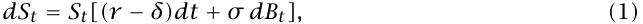

where _Bt_ is a standard Brownian motion process (see Hull (1992) for a general discussion of this model). In equation (1), _r_ is the riskless interest rate, _δ_ is the dividend rate, and _σ >_ 0 is the volatility parameter. Under the risk neutral measure, ln _(ST /S_ 0 _)_ is normally distributed with mean _(r − δ − σ_2 _/_ 2 _)T_ and variance _σ_2 _T_ . The option has a strike price of _K_ and matures at time _T >_ 0, with the current time taken to be _t =_ 0. In this “Black-Scholes world”, the option price is given by 

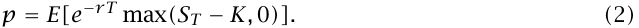

Throughout the paper, _E_ denotes the expectation operator under the risk neutral measure. See Harrison and Kreps (1979) for a justification of this pricing formula. 

# _Pathwise Derivatives_ 

To illustrate the application of the first method, we consider the problem of estimating _vega_ , which is _dp/dσ_ . We do this by defining the discounted payoff 

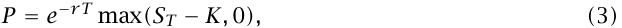

(so that _p = E[P]_ ) and examining how changes in _σ_ determine changes in _P_ . Since _σ_ affects _P_ only through _ST_ , we begin by examining the dependence of _ST_ on _σ_ . 

The lognormal random variable _ST_ can be represented as 

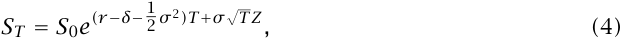

where _Z_ is a standard normal random variable. Consequently, 

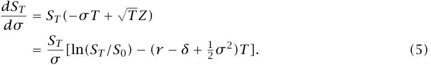

This tells us how a small change in _σ_ affects _ST_ . Now consider the effect on _P_ of a small change in _ST_ . If _ST ≥ K_ , then the option is in the money and any increase ∆ in _ST_ translates into an increase _e__−rT_ ∆ in _P_ . If, however, _ST < K_ , then _P =_ 0, and _P_ remains 0 for all sufficiently small changes in _ST_ . Thus, we arrive at the formal expression 

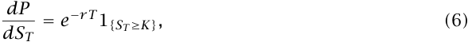

<!-- page: 5 -->

in which 1 _{·}_ denotes the indicator of the event in braces.1 Combining (5) and (6) gives 

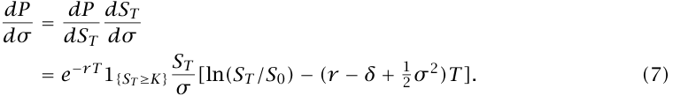

Each of the terms in this expression is easily evaluated in a simulation, making the estimator _dP/dσ_ easy to use. Moreover, it follows from Proposition 1 in Appendix A that this estimator is unbiased, i.e., 

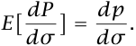

A similar argument leads to an estimator of _delta_ , the derivative of the option price with respect to the initial price of the underlying asset. Much as before, we have 

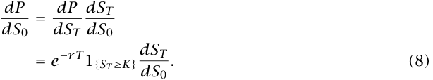

Furthermore, from (4) we find that 

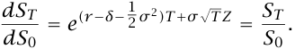

Substituting this into (8), we arrive at the estimator 

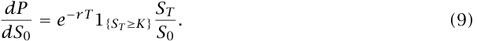

This estimator is also unbiased, i.e., 

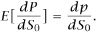

Similar arguments can be used to develop derivative estimates for options with path dependencies, for which simulation is often the only available computational approach (see Section 4). 

# _Derivatives Based on Likelihood Ratios_ 

The second method of estimating derivatives puts the dependence on the parameter of interest in an underlying probability density, rather than in a random variable. We continue with the European option example. It follows from (4) that under the risk neutral measure, the density of _ST_ is 

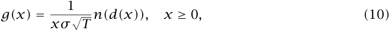

> 1 Equation (6) is valid if interpreted as a righthand derivative or as the almost everywhere defined derivative of a Lipschitz function. Technical issues of this type are treated in Appendix A.

<!-- page: 6 -->

1 where _n(z) =_ ~~√~~ 2 _π__e−z_2_/_2isthestandardnormaldensityand 

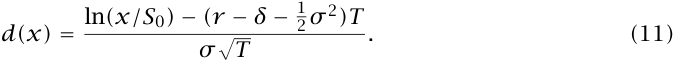

Thus, we can write (2) as 

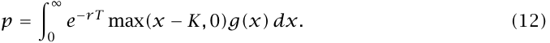

We now use this representation of _p_ to derive derivative estimates. We begin by considering _dp/dσ_ . Notice that in (12), _σ_ appears only as an argument of _g_ . Assuming we can interchange the derivative and integral, (12) implies that 

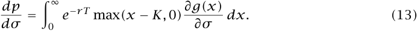

Multiplying and dividing the integrand in (13) by _g(x)_ and using the identity _(∂g/∂σ)/g = ∂_ ln _g/∂σ_ , gives 

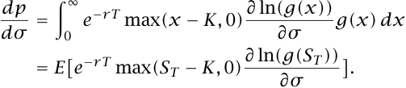

This indicates that the likelihood ratio estimator 

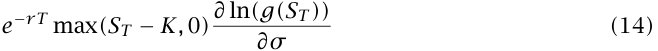

is an unbiased estimator of _dp/dσ_ when _ST_ is simulated under the risk neutral measure. The estimator in (14) is easily implemented using the formula 

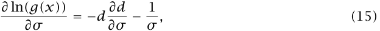

where _d_ is given in (11) and 

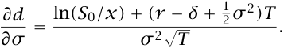

A similar argument provides an estimator of the derivative with respect to the initial asset price. Proceeding just as before, we arrive at the equation 

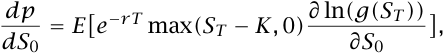

and hence obtain the unbiased likelihood ratio estimator 

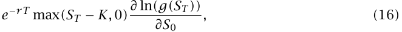

where 

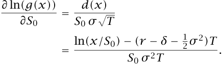

The estimator in (16) is easily used in a simulation of _ST_ .

<!-- page: 7 -->

# _Discussion_ 

We have seen through the European call option example that it is sometimes possible to obtain estimates of derivatives of security prices without re-simulation. The same methods apply when closed form expressions are not available and simulation is necessary. In general, the estimators obtained through the pathwise method and the likelihood ratio method are not the same. Numerical comparisons are presented in Section 4. At this point, we make some general observations about direct methods compared with re-simulation and the scope of the methods discussed above. 

Both pathwise derivative estimates and estimates based on likelihood ratios require an interchange of a derivative and an integral (expectation) for unbiasedness. It is largely this requirement that limits their scope, though the limitation is rarely an issue with standard pricing models. Classical conditions for this interchange require fairly strong smoothness conditions on the integrand; see, e.g., Franklin (1944), pp. 150–151. These conditions are typically satisfied by the probability densities arising in applications of the likelihood ratio method to pricing models. Indeed, the density in (10) is continuously differentiable in each of its parameters on its domain. In contrast, the pathwise dependence of the payoff of a derivative security may not be smooth. For example, the expression in (3) is continuous in _ST_ but fails to be differentiable at the point _ST = K_ . As a consequence, somewhat greater care is required with this method in justifying the interchange of derivative and integral. As a rough rule of thumb, if the payoff is continuous, the pathwise method is typically applicable; see Appendix A for a more precise discussion. 

Since smoothness is rarely a problem for densities, the main limitation in the application of the likelihood ratio method is that the parameter of interest may not be a parameter of the density at all. This is the case with the strike price in (2); the likelihood ratio method does not apply to this parameter (except possibly through a change of variables). The pathwise method, however, easily covers this case. 

It is important to note that the derivation of the likelihood ratio estimator (14) did not make use of any properties of the dependence of the option payoff on the underlying asset price. That is, the particular form of (3) was not important, except for the fact that it displays no explicit dependence on _σ_ . As a consequence, essentially the same estimator applies to _any_ derivative security. If the discounted payoff associated with some security is _f_ , meaning that its price is given by _p = E[f (ST )]_ , then its derivative with respect to _σ_ is given by 

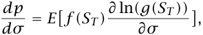

subject only to the validity of the interchange of derivative and integral. This contrasts

<!-- page: 8 -->

markedly with the pathwise method, which depends in an essential way on the form of the payoff. Using the pathwise method, one must derive a different estimator for each payoff function. On one hand, this distinction represents an implementation advantage for the likelihood ratio method; on the other hand, it suggests that the pathwise method is better able to exploit the structure of individual problems. 

# 3. Second Derivatives 

The _gamma_ of an option, i.e., the second derivative with respect to the initial price of the underlying security, is related to the optimal time interval required for rebalancing a hedge under transactions costs. In this section the direct methods are extended to the estimation of second derivatives. 

# _Pathwise Second Derivative Estimators_ 

We begin our discussion by considering the simple (if artificial) case of an exponential payoff. Suppose that the payoff of a contingent claim is _e__−ST_ when the final price of the underlying security is _ST_ . Then the value of this claim today is 

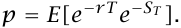

Consider the second derivative of _p_ with respect to the initial price _S_ 0. Differentiating twice inside the expectation gives 

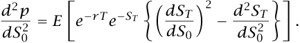

From (4), we find that _dST /dS_ 0 _= ST /S_ 0 and _d_2 _ST /dS_ 02_=_0.Makingthesesubstitutions,we get 

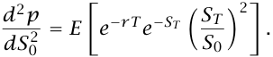

Now let _p_ once again be the European option price in (2). From (9) we have 

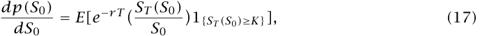

where the dependence of _ST_ on _S_ 0 is made explicit. Consider a small increase _h_ in _S_ 0. Since the ratio _ST /S_ 0 does not depend on _S_ 0, we get 

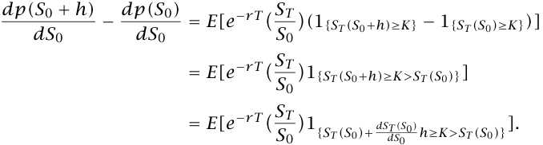

<!-- page: 9 -->

Dividing by _h_ and letting _h_ decrease to zero, the expectation becomes concentrated at _ST = K_ . Using _dST (S_ 0 _)/dS_ 0 _= ST /S_ 0, this gives2 

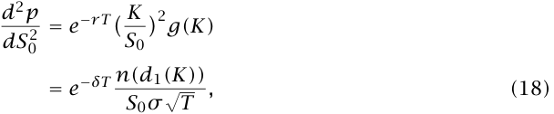

where _d_ 1 _(x) = [_ ln _(S_ 0 _/x)+(r −δ+_1 2_σ_2_)T]/(σ_ ~~√~~ _T) = −d(x)+σ_ ~~√~~ _T_ .3 Expression (18) involves no random quantities and thus requires no simulation. Indeed, the result is the well known formula for the gamma of an option, which is usually derived without reference to simulation (see, e.g., Hull (1992), p. 312). The effect of the expectation in (17) is to “smooth” the indicator function. We will see in Section 4 that similar smoothing arguments result in nontrivial second derivative estimators in settings where no closed form expression exists. 

# _Likelihood Ratio Second Derivative Estimators_ 

Consider again the problem of estimating the second derivative of _p_ in (2) with respect to the initial asset price _S_ 0. Starting from (12) and differentiating twice under the integral gives 

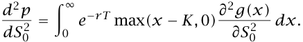

Multiplying and dividing the integrand by _g(x)_ turns the integral into an expectation and yields 

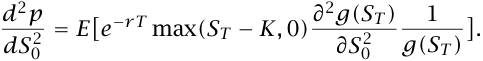

The expression 

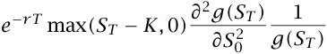

is thus an unbiased likelihood ratio estimator of the second derivative. The estimator can be written more explicitly using 

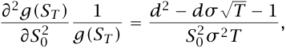

where _d = d(ST )_ is given in (11). 

> 2 The same result can be derived in another way. Taking the derivative of (17) again with respect to _S_ 0 gives 

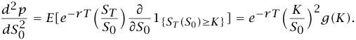

The second equality uses _d_ 1 _{ST (S_ 0 _)≥K}/dS_ 0 _= δ(K)dST /dS_ 0 _= δ(K)ST /S_ 0, where _δ(·)_ represents the Dirac delta function. This type of argument is used in Carr (1993) in a different context. 

> 3 The last equality in equation (18) follows from the identity _e−δT n(d_ 1 _(K)) = e−rT (K/S_ 0 _)n(d(K))_ .

<!-- page: 10 -->

# 4. Computational Results 

This section presents computational comparisons of the two direct methods and the indirect re-simulation method through three examples. The first example involves path independent claims, in particular, European options on dividend paying assets. To illustrate the methods on path dependent claims, derivatives of Asian option prices (i.e., options based on an arithmetic average price) are computed in the second example. To illustrate the methods on a model with multiple state variables, derivatives for options with stochastic volatility are computed in the third example. 

The re-simulation method is described next. Suppose that the security price _p_ depends on a parameter _θ_ and the goal is to estimate _dp/dθ_ at _θ = θ_ 0. Denote the simulation estimator of the price at _θ = θ_ 0 by _P(θ_ 0 _)_ . The simulation estimate of the price is the sample average over independent outcomes of _P(θ_ 0 _)_ . In the re-simulation method, the parameter is perturbed to _θ_ 1 _= θ_ 0 _+ h_ and the new simulation price estimator _P(θ_ 1 _)_ is computed. The re-simulation estimator of the derivative is the forward finite difference _(P(θ_ 1 _) − P(θ_ 0 _))/h_ . The re-simulation estimate is the average over all trials of this estimator. The choice of _h_ is discussed in Appendix B. The importance of using common random numbers for both estimators is also discussed in Appendix B. To estimate a second derivative, the parameter is perturbed to _θ−_ 1 _= θ_ 0 _− h_ and the new simulation price estimator _P(θ−_ 1 _)_ is computed. The resimulation estimator of the second derivative _d_2 _p/dθ_2 at _θ = θ_ 0 is the central finite difference _(P(θ−_ 1 _) −_ 2 _P(θ_ 0 _) + P(θ_ 1 _))/h_2 . 

An advantage of re-simulation compared with the direct methods is that it involves no programming effort beyond what is required for the pricing simulation itself. But this justification seems weak compared with the advantages of the direct estimators. The direct methods provide unbiased estimators whereas re-simulation inherits the bias that results from finite difference approximation to the derivative. Even more important is the fact that the computational savings with direct methods increases with the number of derivatives estimated. Estimating finite differences with respect to _n_ parameters requires _n +_ 1 simulations. All _n_ derivatives can be estimated from a single simulation using the direct methods. Thus, they offer a _potential (n +_ 1 _)-to-one computational advantage_ . Many simulation runs are needed to solve for the implied value of a parameter given a security price. In this case, the use of direct estimators of derivatives can lead to significant computational savings. The actual magnitude of the savings depends on the additional computational effort to use a derivative estimate compared to the cost of an additional simulation. Ordinarily, the cost of the former is small relative to the latter. In the first example, however, each trial of the simulation requires only

<!-- page: 11 -->

one random number, so the computational savings are not as great. 

Variance reduction techniques that apply to the original simulation estimator of a security price can often be used with the three simulation methods for estimating derivatives. In our examples, the control variate method was used to reduce the variance of the estimates. Further discussion of this technique is given at the end of this section. 

# _Example 1: European Options on Dividend Paying Assets_ 

For European options on dividend paying assets, explicit expressions for all derivatives are available. For completeness these expressions are given in Proposition 2 in Appendix C. The pathwise estimators and the likelihood ratio estimators are summarized in Propositions 3 and 4, respectively, in Appendix C. These are derived using the arguments in Sections 2 and 3. 

Table 1 contains simulation results for this example. Several points are noteworthy from Table 1. First, the simulation estimates are within two standard errors of the exact values. Second, the re-simulation method gives point estimates and standard errors that are almost identical to the pathwise method. One exception is the estimate of gamma, where the pathwise estimate gives an exact result in this case. The use of a small perturbation parameter _h_ leads to biases in the re-simulation method that are too small to detect in the results. Third, the standard errors with the likelihood ratio method are typically 1.5 to 4 times greater than the pathwise and re-simulation standard errors. The larger standard errors are likely due to the likelihood ratio estimators not depending on the form of the security payoff. 

The effectiveness of control variates seems quite sensitive to the estimator with which they are used. With pathwise estimates, the reduction in the estimated standard error is roughly 30-50%, and is very close to the corresponding reduction for the re-simulation estimates. In most cases, the impact on the likelihood ratio estimates is somewhat less. However, it is possible that a different control variate would yield different results. 

Why do the re-simulation and pathwise methods give nearly identical results in this example? Consider, for instance, estimating _dp/dσ_ . The re-simulation estimator is _(P(σ_ 1 _) − P(σ_ 0 _))/h_ , which can be written as 

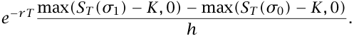

The pathwise estimator is _e__−rT_ 1 _{ST (σ_ 0 _)≥K}dST (σ_ 0 _)/dσ_ . If common random numbers are used, these estimators differ in two respects. First, they differ when _ST (σ_ 0 _) < K_ but _ST (σ_ 1 _) ≥ K_ . In this case the pathwise estimator is exactly zero, but the re-simulation estimator can differ significantly from zero. However, for small _h_ , the probability of this situation is also small. In all other cases, the estimators differ in the term _(_ max _(ST (σ_ 1 _) − K,_ 0 _) −_ max _(ST (σ_ 0 _) − K,_ 0 _))/h_

<!-- page: 12 -->

versus _dST (σ_ 0 _)/dσ_ . However, for small _h_ , these terms are nearly equal. In other words, as _h_ decreases to zero, the re-simulation estimator converges to the pathwise estimator. This, in fact, _defines_ the pathwise estimator. Hence it is not surprising that for small _h_ the results are nearly identical. 

# _Example 2: Asian Options_ 

In this example derivatives are computed for Asian options, i.e., options on an arithmetic average price. The payoff of these options is path dependent, that is, the payoff depends not only on the terminal security price but on all the previous prices that enter into the average. Closed form expressions for the option price and derivatives are not available for this model. However, analytical approximations have been developed in Turnbull and Wakeman (1991) and Ritchken, Sankarasubramanian, and Vijh (1993). Additional analytical results are given in Geman and Yor (1993). We use this example merely to illustrate simulation results for a path dependent example. While analytical approaches are available for some Asian option models, if the stochastic process of the underlying asset is modified slightly, it is straightforward to modify the simulation estimators but the analytical approaches may not carry through. 

We assume that the underlying asset satisfies the stochastic differential equation (1). Let _T_ be the maturity of the option written on the average of the last _m_ daily closing prices. Thus, _m_ the average price can be written as _S_¯ _=_ � _i=_ 1_Si/m_,where(byaslightabuseofnotation)_Si_is the price at time _ti = T − (m − i)/_ 365 _._ 25. For convenience we assume that _T > m/_ 365 _._ 25, i.e., the maturity is greater than the averaging period. The derivative estimators do not change significantly if this is not the case. When Asian options are initiated, the time until the averaging period begins, _t_ 1, is typically much larger than the increment between averaged prices (which is one day in this example). 

The estimators for this example are summarized in Propositions 5 and 6 in Appendix C. Here _theta_ is defined to be the negative of the derivative of the option price with respect to maturity for a _fixed_ averaging increment. In other words, a change in _T_ means a change in the time _t_ 1 until averaging begins. All estimators in Propositions 5 and 6 follow from the same reasoning as the previous ones, though the resulting expressions are more complicated. In particular, the pathwise estimator for gamma is no longer a constant. Results for this model are given in Table 2. The results are consistent with those in Example 1, e.g., the point estimates and standard errors are very close for the pathwise and re-simulation methods. An exception is gamma, where the standard errors for the pathwise method are smaller than the re-simulation method. This is due to using a larger value for _h_ , which is necessary because of machine precision; smaller values of _h_ can give unreliable results. For estimating gamma, a

<!-- page: 13 -->

Table 1. European Call Options on Dividend Paying Assets 

||||Initial Ass|et Price (_S_0|)||
|---|---|---|---|---|---|---|
||90|(Std. Err.)|100|(Std. Err.)|110|(Std. Err.)|
|_Call Price_|||||||
|Exact|1.220||5.126||12.327||
|Simulation estimate|1.182|0.034|4.993|0.073|12.171|0.107|
|Estimate with control|1.211|0.025|5.073|0.033|12.298|0.023|
|_Delta_ (_dp/dS_0) Exact|0.222||0.568||0.844||
|Re-simulation estimate|0.217|0.005|0.561|0.005|0.844|0.004|
|Re-simulation with control|0.221|0.003|0.566|0.003|0.848|0.002|
|Pathwise estimate|0.217|0.005|0.561|0.005|0.844|0.004|
|Pathwise with control|0.221|0.003|0.566|0.003|0.848|0.002|
|Likelihood ratio estimate|0.215|0.008|0.551|0.013|0.817|0.017|
|LR estimate with control|0.220|0.006|0.562|0.008|0.834|0.010|
|_Vega_ (_dp/dσ_) Exact|11.946||17.446||11.435||
|Re-simulation estimate|11.640|0.268|16.932|0.295|10.719|0.390|
|Re-simulation with control|11.887|0.175|17.236|0.155|11.110|0.220|
|Pathwise estimate|11.640|0.268|16.932|0.294|10.720|0.390|
|Pathwise with control|11.887|0.175|17.236|0.155|11.111|0.220|
|Likelihood ratio estimate|11.490|0.672|16.672|1.086|10.074|1.543|
|LR estimate with control|11.857|0.600|17.300|0.955|10.969|1.356|
|_Gamma_ (_d_2_p/dS_2 0) Exact|0.029||0.035||0.019||
|Re-simulation estimate|0.027|0.006|0.048|0.008|0.021|0.005|
|Re-simulation with control|0.027|0.006|0.048|0.008|0.021|0.005|
|Pathwise estimate|0.029||0.035||0.019||
|Likelihood ratio estimate|0.028|0.002|0.033|0.002|0.017|0.003|
|LR estimate with control|0.029|0.001|0.035|0.002|0.018|0.002|
|_Rho_ (_dp/dr_) Exact|3.751||10.344||16.108||
|Re-simulation estimate|3.672|0.076|10.212|0.098|16.130|0.075|
|Re-simulation with control|3.739|0.053|10.306|0.060|16.188|0.057|
|Pathwise estimate|3.672|0.076|10.212|0.098|16.130|0.075|
|Pathwise with control|3.739|0.053|10.305|0.060|16.189|0.057|
|Likelihood ratio estimate|3.625|0.134|10.012|0.241|15.544|0.361|
|LR estimate with control|3.723|0.107|10.229|0.162|15.889|0.222|
|_Theta_ (_−dp/dT_) Exact|_−_8.742||_−_14.370||_−_12.415||
|Re-simulation estimate|_−_8.524|0.191|_−_14.005|0.203|_−_11.979|0.245|
|Re-simulation with control|_−_8.701|0.124|_−_14.226|0.090|_−_12.240|0.119|
|Pathwise estimate|_−_8.525|0.191|_−_14.007|0.203|_−_11.980|0.245|
|Pathwise with control|_−_8.702|0.124|_−_14.227|0.090|_−_12.241|0.119|
|Likelihood ratio estimate|_−_8.414|0.463|_−_13.774|0.754|_−_11.371|1.074|
|LR estimate with control|_−_8.677|0.410|_−_14.240|0.649|_−_12.048|0.918|

Parameters: _r =_ 0 _._ 1, _K =_ 100, _δ =_ 0 _._ 03, _σ =_ 0 _._ 25, and _T =_ 0 _._ 2. All simulation results based on 10,000 trials. Re-simulation estimates use _h =_ 0 _._ 0001 except for gamma where _h =_ 0 _._ 05 is used.

<!-- page: 14 -->

hybrid method was also tested, i.e., the pathwise estimate of delta was re-simulated. 

# _Example 3: Options with Stochastic Volatility_ 

To illustrate the methods on a model with multiple state variables, derivatives for options with stochastic volatility are computed in this example. Following Johnson and Shanno (1987) and Hull and White (1987) we assume that _S_ and _σ_ follow the risk neutralized stochastic processes: 

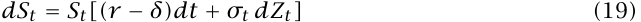

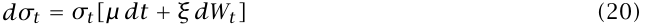

where _Z_ and _W_ are correlated Brownian motion processes with constant correlation _ρ_ . Johnson and Shanno (1987) present simulation results for this model and Hull and White (1987) give analytical results for certain special cases and simulation results for other cases. Additional analytical results for a similar model are given in Heston (1993) and Stein and Stein (1991). Our aim is to illustrate the simulation methods for derivative estimation on a model with multiple state variables. Closed form solutions, when available, are generally preferable to simulation methods because of their computational speed advantage. However, changes to the stochastic processes (19) and (20) are easily incorporated in the simulation methods, but the analytical solutions may not be so easily modified. 

Our simulation results are based on the following discrete time version of (19)–(20): 

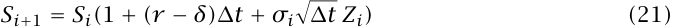

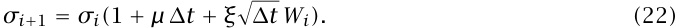

In (21)–(22), _m_ is the number of time steps in the discretization, ∆ _t = T/m_ , _ti = (i/m)T_ , and _Si_ and _σi_ are the simulated asset prices and volatilities at time _ti_ , respectively. Also, _Zi_ and _Wi_ are correlated standard normal random variables. This is a first order Euler approximation to (19)-(20). See Duffie (1992) for a discussion of discrete approximations to continuous time models. See Duffie (1992) and Duffie and Glynn (1993) for related convergence issues. 

Pathwise and re-simulation results for this example are given in Table 3. Likelihood ratio estimators are not used because the estimators are substantially more complicated in this example and because their performance in the earlier examples was not as promising. Pathwise derivative estimators for this model are given in Proposition 7 in Appendix C. In accordance with (21)–(22), theta is the negative of the derivative with respect to the maturity _T_ with _m_ held fixed; thus, _d(_ ∆ _t)/dT =_ 1 _/m_ . In addition to the usual derivatives, sensitivities with respect

<!-- page: 15 -->

Table 2. Asian Call Options on Dividend Paying Assets 

||||Initial Ass|et Price (_S_0|)||
|---|---|---|---|---|---|---|
||90|(Std. Err.)|100|(Std. Err.)|110|(Std. Err.)|
|_Call Price_ |||||||
|Simulation estimate |0.785|0.025|4.412|0.063|11.794|0.095|
|Estimate with control|0.772|0.020|4.368|0.034|11.722|0.037|
|_Delta_ (_dp/dS_0)|||||||
|Re-simulation estimate|0.173|0.004|0.567|0.005|0.873|0.004|
|Re-simulation with control|0.171|0.003|0.564|0.003|0.871|0.003|
|Pathwise estimate|0.173|0.004|0.567|0.005|0.873|0.004|
|Pathwise with control|0.171|0.003|0.564|0.003|0.871|0.003|
|Likelihood ratio estimate|0.177|0.007|0.573|0.013|0.896|0.019|
|LR estimate with control|0.174|0.006|0.566|0.010|0.886|0.014|
|_Vega_ (_dp/dσ_)|||||||
|Re-simulation estimate|8.872|0.225|15.190|0.251|8.846|0.344|
|Re-simulation with control|8.747|0.167|15.024|0.149|8.622|0.212|
|Pathwise estimate|8.871|0.225|15.190|0.251|8.843|0.345|
|Pathwise with control|8.747|0.167|15.024|0.149|8.618|0.212|
|Likelihood ratio estimate|9.161|0.962|13.844|2.516|5.338|4.812|
|LR estimate with control|8.984|0.937|13.511|2.483|4.854|4.777|
|_Gamma_ (_d_2_p/dS_2 0)|||||||
|Re-simulation estimate|0.020|0.005|0.046|0.008|0.025|0.006|
|Re-simulation with control|0.020|0.005|0.046|0.008|0.025|0.006|
|Pathwise estimate|0.023|0.004|0.044|0.005|0.021|0.003|
|Pathwise with control|0.023|0.004|0.044|0.005|0.021|0.003|
|Re-sim of pathwise delta|0.024|0.007|0.041|0.009|0.016|0.005|
|Previous est. with control|0.024|0.007|0.041|0.009|0.016|0.005|
|Likelihood ratio estimate|0.030|0.002|0.042|0.003|0.021|0.004|
|LR estimate with control|0.030|0.002|0.041|0.003|0.020|0.003|
|_Rho_ (_dp/dr_)|||||||
|Re-simulation estimate |2.349|0.056|8.216|0.077|13.037|0.053|
|Re-simulation with control|2.320|0.043|8.170|0.052|13.014|0.045|
|Pathwise estimate|2.349|0.056|8.217|0.077|13.036|0.053|
|Pathwise with control|2.320|0.043|8.170|0.052|13.013|0.045|
|Likelihood ratio estimate|2.378|0.095|8.189|0.196|13.139|0.316|
|LR estimate with control|2.334|0.079|8.071|0.134|12.931|0.189|
|_Theta_ (_−dp/dT_)|||||||
|Re-simulation estimate|_−_8.622|0.224|_−_16.638|0.262|_−_13.432|0.334|
|Re-simulation with control|_−_8.507|0.175|_−_16.489|0.189|_−_13.253|0.253|
|Pathwise estimate|_−_8.622|0.224|_−_16.640|0.262|_−_13.429|0.334|
|Pathwise with control|_−_8.507|0.175|_−_16.491|0.189|_−_13.249|0.253|
|Likelihood ratio estimate|_−_8.693|0.523|_−_16.792|0.978|_−_13.691|1.491|
|LR estimate with control|_−_8.535|0.487|_−_16.481|0.903|_−_13.220|1.377|

Parameters: _r =_ 0 _._ 1, _K =_ 100, _δ =_ 0 _._ 03, _σ =_ 0 _._ 25, and _T =_ 0 _._ 2. All simulation results based on 10,000 trials. The averaging period is _m =_ 30 days. Re-simulation estimates use _h =_ 0 _._ 0001 except for gamma where _h =_ 0 _._ 05 is used.

<!-- page: 16 -->

Table 3. Call Options on Dividend Paying Assets with Stochastic Volatility 

||||Initial Ass|et Price (_S_0 |)||
|---|---|---|---|---|---|---|
||90|(Std. Err.)|100|(Std. Err.)|110|(Std. Err.)|
|_Call Price_ |||||||
|Simulation estimate|1.306|0.039|5.139|0.077|12.286|0.111|
|Estimate with control|1.285|0.027|5.086|0.032|12.203|0.021|
|_Delta_ (_dp/dS_0)|||||||
|Re-simulation estimate |0.220 |0.005 |0.560 |0.005 |0.846 |0.004 |
|Re-simulation with control |0.217 |0.003 |0.556 |0.003 |0.843 |0.003 |
|Pathwise estimate|0.220|0.005|0.560|0.005|0.846|0.004|
|Pathwise with control|0.217|0.003|0.556|0.003|0.843|0.003|
|_Vega_ (_dp/dσ_0)|||||||
|Re-simulation estimate|12.229|0.286|17.604|0.314|11.272|0.411|
|Re-simulation with control|12.058|0.179|17.395|0.157|11.006|0.219|
|Pathwise estimate|12.227|0.286|17.604|0.314|11.272|0.411|
|Pathwise with control|12.056|0.179|17.396|0.157|11.006|0.219|
|_Vega1_ (_dp/dξ_)|||||||
|Re-simulation estimate |0.339|0.025|0.004|0.031|_−_0.201|0.037|
|Re-simulation with control|0.332|0.023|_−_0.003|0.030|_−_0.209|0.035|
|Pathwise estimate|0.339|0.025|0.004|0.031|_−_0.201|0.037|
|Pathwise with control|0.332|0.023|_−_0.003|0.030|_−_0.209|0.035|
|_Vega2_ (_dp/dµ_)|||||||
|Re-simulation estimate|0.302|0.008|0.429|0.009|0.273|0.012|
|Re-simulation with control|0.298|0.005|0.423|0.006|0.266|0.009|
|Pathwise estimate|0.302|0.008|0.429|0.009|0.273|0.012|
|Pathwise with control|0.298|0.005|0.423|0.006|0.266|0.009|
|_Gamma_ (_d_2_p/dS_2 0)|||||||
|Re-simulation estimate|0.024|0.006|0.022|0.005|0.021|0.005|
|Re-simulation with control|0.024|0.006|0.022|0.005|0.021|0.005|
|Pathwise estimate|0.029|0.001|0.034|0.001|0.018|0.001|
|Pathwise with control|0.028|0.001|0.034|0.001|0.019|0.001|
|Re-sim of pathwise delta|0.024|0.007|0.029|0.008|0.018|0.006|
|Previous est. with control|0.024|0.007|0.029|0.008|0.018|0.006|
|_Rho_ (_dp/dr_)|||||||
|Re-simulation estimate|3.687|0.077|10.159|0.098|16.140|0.075|
|Re-simulation with control|3.644|0.052|10.100|0.061|16.106|0.059|
|Pathwise estimate|3.686|0.077|10.159|0.098|16.139|0.075|
|Pathwise with control|3.643|0.052|10.100|0.061|16.105|0.059|
|_Theta_ (_−dp/dT_)|||||||
|Re-simulation estimate|_−_8.996|0.208|_−_14.191|0.222|_−_12.037|0.266|
|Re-simulation with control|_−_8.872|0.130|_−_14.040|0.099|_−_11.858|0.126|
|Pathwise estimate|_−_8.996|0.208|_−_14.193|0.222|_−_12.039|0.266|
|Pathwise with control|_−_8.871|0.130|_−_14.041|0.099|_−_11.859|0.126|

Parameters: _r =_ 0 _._ 1, _K =_ 100, _δ =_ 0 _._ 03, _σ_ 0 _=_ 0 _._ 25, _T =_ 0 _._ 2, _µ = −_ 0 _._ 1, _ξ =_ 0 _._ 3, and _ρ =_ 0 _._ 5. All simulation results based on 10,000 trials. Time is discretized using _m =_ 130 increments. Re-simulation estimates use _h =_ 0 _._ 0001 except for gamma where _h =_ 0 _._ 05 is used.

<!-- page: 17 -->

to _ξ_ and _µ_ are also computed. Although the estimators are somewhat more complicated than in the previous example, the results given in Table 3 are similar. 

As seen in all three examples, the bias in the re-simulation method is small enough that it is not an essential concern. Since the computational effort required by the pathwise and likelihood ratio methods are nearly identical, the difference in standard errors is a strong argument in favor of the pathwise method. Since the re-simulation method typically requires much more computational effort than the pathwise method, the nearly identical results for the two methods also favor the pathwise method. 

# _Control Variates_ 

Variance reduction techniques that apply to the original simulation estimator of a security price can often be applied to derivative estimators. Among the most powerful tools is the control variate technique. For consistency we used the same control variate, the terminal security price, for each of the three examples.4 Next we briefly summarize the control variate technique. Let _D_ represent an unbiased simulation estimator of the derivative. That is, _d = E[D]_ where _d_ is the true value of the derivative to be estimated. Let _ST_ represent the simulated terminal price of the security. Since _E[ST ] = e__(r−δ)T_ _S_ 0, another unbiased estimator of the derivative is 

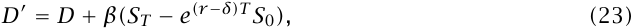

for any _β_ . The parameter _β_ can be chosen to _minimize_ the variance of the estimator _D__′_ . This problem is min _β E[D__′_ _− d]_2 . An easy computational device for solving this problem is linear regression. Thus, if the estimators _D_ are regressed on _ST_ , the slope of the regression line solves the minimization problem. The last step of optimizing over _β_ can significantly improve the effectiveness of the control variate technique.5 The efficiency of the resulting estimator _D__′_ depends on the absolute value of the correlation between the original estimator, _D_ , and the control variate, _ST_ . 

# 5. Conclusions 

In this paper two methods for estimating derivatives of security prices using simulation were presented. The first method uses the dependence of the security payoff on the parameter of interest. Differentiating this relationship leads, under appropriate conditions, to an unbiased estimator for the derivative of the security price. Since the dependence of the parameter 

> 4 Note that there is always a simple control variable available, namely the random numbers themselves. We used the terminal security price because it led to a larger reduction in variance. 

> 5 Although this observation is standard in the simulation literature, e.g., _§_ 11.4 of Law and Kelton (1991), it has been substantially underutilized in the finance literature.

<!-- page: 18 -->

is identified through the random security payoff, this method is termed the _pathwise method_ . The second method is based on _likelihood ratios_ . Here the dependence of the underlying probability density on the parameter of interest is exploited to obtain derivative information. 

The main advantage of the direct methods over re-simulation is increased computational speed. The estimation of _n_ derivatives by the re-simulation method requires _n +_ 1 simulation runs. With the direct methods, the information from a single simulation can be used to estimate all _n_ derivatives. Solving for the implied value of a parameter given a security price typically requires many simulation runs. The use of direct methods for estimating derivatives can lead to significant computational savings in these cases. Another advantage is that the direct methods give unbiased estimates of derivatives, whereas the estimates obtained by re-simulation are generally biased. 

To illustrate and compare the methods, derivatives were computed for a path independent model, a path dependent model, and a model with multiple state variables. The computational results indicate that the likelihood ratio method gives significantly larger standard errors than the pathwise method. The pathwise and re-simulation methods give nearly identical point estimates and standard errors. Hence, the bias in the re-simulation estimates is not a problem of practical significance in the examples we considered. Since the results for the pathwise and re-simulation methods are nearly identical, the computational speed advantage of the pathwise method is a strong argument in its favor. 

# 6. References 

- [1] F. Black and M. Scholes, “The Pricing of Options and Corporate Liabilities,” _Journal of Political Economy_ , Vol. 81, May–June 1973, pp. 637–654. 

- [2] P. Boyle, “Options: A Monte Carlo Approach,” _Journal of Financial Economics_ , Vol. 4, No. 3, 1977, 323–338. 

- [3] D.T. Breeden and R.H. Litzenberger, “Prices of State-contingent Claims Implicit in Option Prices,” _Journal of Business_ , Vol. 51, No. 4, 1978, 621–651. 

- [4] M. Broadie, “Estimating Duration using Simulation,” Shearson Lehman Hutton research report, January, 1988. 

- [5] P. Carr, “Deriving Derivatives of Derivative Securities,” Working paper, Cornell University, February 1993. 

- [6] D. Duffie, _Dynamic Asset Pricing Theory_ , Princeton University Press, Princeton, NJ, 1992. 

- [7] D. Duffie and P. Glynn, “Efficient Monte Carlo Simulation of Security Prices,” Working

<!-- page: 19 -->

paper, Stanford University, March 1993. 

- [8] P. Franklin, _Methods of Advanced Calculus_ , McGraw-Hill, New York, 1944. 

- [9] M.C. Fu and J. Hu, “Second Derivative Sample Path Estimators for the _GI/G/m_ Queue,” _Management Science_ , Vol. 39, No. 3, 1993a, 359–383. 

- [10] M.C. Fu and J. Hu, “Sensitivity Analysis for Monte Carlo Simulation of Option Pricing,” Working paper, College of Business and Management, University of Maryland, November 1993b. 

- [11] H. Geman and M. Yor, “Bessel Processes, Asian options, and perpetuities,” _Mathematical Finance_ , Vol. 3, No. 4, 1993, 349–375. 

- [12] P. Glasserman, _Gradient Estimation Via Perturbation Analysis_ , Kluwer Academic Publishers, Norwell, Massachusetts, 1991. 

- [13] P.W. Glynn, “Likelihood Ratio Estimation: An Overview,” in _Proceedings of the 1987 Winter Simulation Conference_ , The Society for Computer Simulation, San Diego, California, 1987, 366–375. 

- [14] P.W. Glynn, “Optimization of Stochastic Systems via Simulation,” in _Proceedings of the 1989 Winter Simulation Conference_ , The Society for Computer Simulation, San Diego, California, 1989, 90–105. 

- [15] J.M. Harrison and D. Kreps, “Martingales and Arbitrage in Multiperiod Securities Markets,” _Journal of Economic Theory_ , Vol. 20, 1979, pp. 381–408. 

- [16] S.L. Heston, “A Closed-Form Solution for Options with Stochastic Volatility with Applications to Bond and Currency Options,” _Review of Financial Studies_ , Vol. 6, No. 2, 1993, 327–343. 

- [17] J. Hull, _Options, Futures, and other Derivative Securities_ , 2nd edition, Prentice-Hall, Englewood Cliffs, New Jersey, 1992. 

- [18] J. Hull and A. White, “The Pricing of Options on Assets with Stochastic Volatilities,” _Journal of Finance_ , Vol. 42, No. 2, 1987, 281–300. 

- [19] H. Johnson and D. Shanno, “Option Pricing when the Variance is Changing,” _Journal of Financial and Quantitative Analysis_ , Vol. 22, No. 2, 1987, 143–151. 

- [20] R.A. Jones and R.L. Jacobs, “History Dependent Financial Claims: Monte Carlo Valuation,” Working paper, Simon Fraser University, 1986.

<!-- page: 20 -->

- [21] A.G.Z. Kemna and A.C.F. Vorst, “A Pricing Method for Options Based on Average Asset Values,” _Journal of Banking and Finance_ , Vol. 14, 1990, 113–129. 

- [22] A.M. Law and W.D. Kelton, _Simulation Modeling and Analysis_ , 2nd edition, McGraw-Hill, New York, 1991. 

- [23] P. L’Ecuyer, “A Unified View of the IPA, SF, and LR Gradient Estimation Techniques,” _Management Science_ , Vol. 36, No. 11, 1990, 1364–1383. 

- [24] R.C. Merton, “Theory of Rational Option Pricing,” _Bell Journal of Economics and Management Science_ , Vol. 4, 1973, 141–183. 

- [25] P. Ritchken, L. Sankarasubramanian, and A. Vijh, “The Valuation of Path Dependent Contracts on the Average,” _Management Science_ , Vol. 39, No. 10, 1993, 1202–1213. 

- [26] R.Y. Rubinstein and A. Shapiro, _Discrete Event Systems: Sensitivity Analysis and Stochastic Optimization by the Score Function Method_ , John Wiley & Sons, Chichester and New York, 1993. 

- [27] E.S. Schwartz and W.N. Torous, “Prepayment and the Valuation of Mortgage-Backed Securities,” _Journal of Finance_ , Vol. 44, No. 2, 1989, 375–392. 

- [28] C.W. Smith, Jr., C.W. Smithson, and D.S. Wilford, _Managing Financial Risk_ , Harper & Row, New York, 1990. 

- [29] E.M. Stein and J.C. Stein, “Stock Price Distributions with Stochastic Volatility: An Analytic Approach,” _Review of Financial Studies_ , Vol. 4, No. 4, 1991, 727–752. 

- [30] S.M. Turnbull and L.M. Wakeman, “A Quick Algorithm for Pricing European Average Options,” _Journal of Financial and Quantitative Analysis_ , Vol. 26, No. 3, 1991, 377–389. 

- [31] M. Zazanis and R. Suri, “Convergence Rates of Finite-Difference Sensitivity Estimates for Stochastic Systems,” _Operations Research_ , Vol. 41, No. 4, 1993, 694–703. 

# Appendix A: General Conditions for Unbiased Estimators 

In this appendix, we discuss general conditions for derivative estimators to be unbiased, giving particular attention to the more delicate case of pathwise estimators. 

- Let _{Xn, n ≥_ 0 _}_ be a vector-valued state process recording, for example, the price of an 

- underlying asset, the prevailing interest rate, and any other variables influencing the price of a derivative security. (Our vectors are column vectors.) The process _{Xn}_ may be a discretization of a continuous-time process. We take the discrete-time model as our starting point.

<!-- page: 21 -->

Suppose the discounted payoff associated with a derivative security is given by _f (X)_ , where _X = (X_ 1 _, . . . , XT )_ , _T_ is the maturity, and _f_ is real-valued. Thus, the price of the security is _p = E[f(X)]_ . 

Now suppose the state process is a function of a scalar parameter _θ_ ranging over an open interval Θ. In other words, each _Xn_ is a random function on Θ. For the existence of pathwise derivatives, we require the following conditions: 

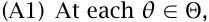

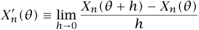

exists with probability 1. 

- (A2) If _Df_ denotes the set of points at which _f_ is differentiable, then _P(X(θ) ∈ Df ) =_ 1, for all _θ ∈_ Θ. 

Under these conditions, the discounted payoff has a pathwise derivative, given by 

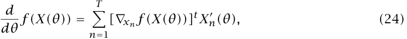

where _∇xn f_ denotes the vector of partial derivatives of _f_ with respect to the components of _Xn_ , and the superscript _t_ denotes transpose. For this pathwise derivative to be an unbiased estimator of the derivative of _p_ , we require further conditions: 

- (A3) There exists a constant _kf_ such that _|f (x) − f (y)| ≤ kf ∥x − y∥_ , for all vectors _x, y_ in the domain of _f_ . 

- (A4) There exist random variables _Kn_ , _n =_ 1 _,_ 2 _, . . ._ , such that _∥Xn(θ_ 2 _) − Xn(θ_ 1 _)∥≤ Kn|θ_ 2 _− θ_ 1 _|_ , for all _n_ , and for all _θ_ 1 _, θ_ 2 _∈_ Θ. For each _n_ , _E[Kn] < ∞_ . 

Condition (A3) states that _f_ is Lipschitz continuous; condition (A4) states each _Xn_ is almost surely Lipschitz with an integrable modulus _Kn_ . We now have 

Proposition 1: _If (A1)–(A4) hold, then at every θ ∈_ Θ _, dp(θ)/dθ exists and equals E[df(X)/dθ]._ 

Proof of Proposition 1: Let _P(θ) = f(X(θ))_ ; then, as already noted, _P__′_ _(θ)_ exists with probability 1 if (A1) and (A2) hold. The Lipschitz property is preserved by composition. Hence,

<!-- page: 22 -->

under (A3) and the first part of (A4), _P_ is almost surely Lipschitz continuous; that is, there exists a random variable _KP_ such that 

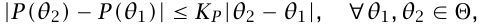

with probability 1. It follows that for any _θ_ and _θ + h_ in Θ, we have 

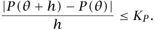

Moreover, under the second part of (A4), the bound _KP_ has finite expectation (it is bounded by a linear combination of _K_ 1 _, . . . , KT_ ), so we may invoke the dominated convergence theorem to interchange an expectation and the limit as _h →_ 0 to conclude that _p__′_ _(θ)_ exists and equals _E[P__′_ _(θ)]_ . _♦_ 

The same considerations that arise in justifying the interchange of derivative and integral for the likelihood ratio method arise in maximum likelihood estimation. Consequently, these issues have been addressed in the statistical literature, and standard sufficient conditions can be found in statistics texts. Generally speaking, if the density is a reasonably smooth function of the parameter in question, the interchange is permissible. For a more detailed examination of this interchange in the derivative estimation context, see L’Ecuyer (1990). 

When a pathwise estimator of a first derivative is Lipschitz continuous, the argument in Proposition 1 can be applied to show that the pathwise _second_ derivative is also unbiased. However, we have seen that first derivative estimators often involve indicator functions, making them discontinuous. As a result, pathwise estimators of second derivatives do not lend themselves to a simple, unified treatment along the lines of Proposition 1. The particular type of “smoothing” required to obtain an unbiased second derivative estimator is problem dependent. So, we justify our gamma estimators individually in Appendix C. Closely related approaches are used in other contexts in Fu and Hu (1993a) and in Chapter 7 of Glasserman (1991). 

# Appendix B: Optimal Choice of the Parameter Increment in the Re-simulation Method 

Let _h_ denote the parameter increment in the re-simulation method. There is an apparent tradeoff involved in the choice of _h_ . If _h_ is too small, then the variance in the estimates of the original and perturbed prices can cause a large variance in the estimate of the derivative. If _h_ is too large, then the nonlinearity of the price as a function of the parameter of interest can cause a large bias in the derivative estimate. This tradeoff is discussed next. For more

<!-- page: 23 -->

extensive treatments of this topic, see Zazanis and Suri (1993) for the case of independent re-simulations, and Glynn (1989) for the case of common random numbers. See also Broadie (1988). 

Suppose that the re-simulation method is used to estimate the derivative of the security price _p_ with respect to a parameter _θ_ . If the function _p(θ)_ is twice continuously differentiable, Taylor’s theorem implies that the function can be approximated by 

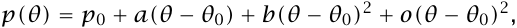

where _p_ 0 _= p(θ_ 0 _)_ and _a = dp/dθ_ evaluated at _θ = θ_ 0. Suppose that we wish to estimate _a_ . Let _h_ denote the size of the parameter perturbation and set _θ_ 1 _= θ_ 0 _+ h_ . Let _P(θi) = p(θi) + ϵi_ , for _i =_ 0 _,_ 1, denote the simulation estimator of _p(θi)_ . The re-simulation estimator of _a_ is ˆ _a = (P(θ_ 1 _) − P(θ_ 0 _))/h_ .6 

Suppose that the objective is to minimize the mean squared estimation error. Ignoring higher order terms, 

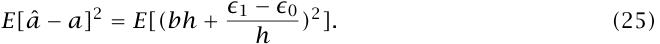

For simplicity, suppose that the variances of _ϵ_ 0 and _ϵ_ 1 are equal and denoted by _v_2 . Also, let _ρ_ denote the correlation of _ϵ_ 0 and _ϵ_ 1 and suppose it is independent of _h_ . 

With these assumptions, the parameter increment _h__∗_ that minimizes the mean squared estimation error is 

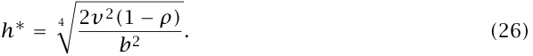

This follows by expanding the terms in (25) and minimizing (25) over _h_ . Equation (26) squares with intuition in several regards. As the accuracy of the estimators _P(θi)_ increases (i.e., as _v_2 decreases with additional trials in the simulation) the optimal increment _h__∗_ decreases. As _b_2 decreases (i.e., as _p(θ)_ becomes more nearly linear) the optimal increment _h__∗_ increases. Finally, _h__∗_ decreases as the correlation of the errors approaches one. 

ˆ Evaluating (25) at _h__∗_ gives _E[a − a]_2 _=_ 2 _|bv|_ ~~�~~ 2 _(_ 1 _− ρ)_ . This expression illustrates the importance of using common random numbers for the re-simulation. Using different random numbers gives a _ρ_ of zero, but using the same stream of random numbers typically gives a correlation near one, and hence a better derivative estimate. 

In our examples, the assumption of equal variances for _ϵ_ 0 and _ϵ_ 1 does not hold precisely, but more importantly, the assumption of a constant _ρ_ does not hold. In many simulation 

> 6 In terms of derivative estimation alone, it would be better to use a symmetric interval for the finite difference. That is, estimate the derivative at _θ_ 0 using the estimators _P(θ_ 0 _− h/_ 2 _)_ and _P(θ_ 0 _+ h/_ 2 _)_ . However, this approach requires two additional simulations for each derivative estimate instead of one with the approach in the text.

<!-- page: 24 -->

contexts, e.g., many discrete-event systems, the variance of _ϵ_ 1 _− ϵ_ 0 can be written as _hσ_ 12_(_1_−_ _ρ_ 1 _) + o(h)_ . The optimal increment _h_ in this case is typically smaller than indicated by (26); see Glynn (1989) for details. In our examples, the variance of _ϵ_ 1 _− ϵ_ 0 can be written as _h_2 _σ_ 12_(_1_−_ _ρ_ 1 _) + o(h_2 _)_ ; this always holds under assumptions (A1)–(A4) of Appendix A. This suggests that the optimal increment in our examples is _h__∗_ _=_ 0_+_ . In practice, we chose _h_ as small as possible, but large enough that machine precision does not pose a problem in the computations. For this reason and after some experimentation, we took _h =_ 0 _._ 0001 to estimate all derivatives except gamma, for which _h =_ 0 _._ 05 was used. 

# Appendix C: Summary of Estimators 

The proofs of the following propositions are generally similar to the derivations in the text. Hence, most of the propositions are stated without proof. Where necessary, sketches of the derivation are given. 

Proposition 2 (European call option derivatives): 

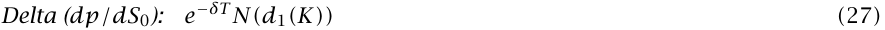

_where d_ 1 _(x) = [_ ln _(S_ 0 _/x) + (r − δ +_1 2_σ_2_)T]/(σ_ ~~√~~ _T) = −d(x) + σ_ ~~√~~ _T , and d_ 2 _(x) = −d(x). Also, N(·) is the cumulative distribution function of a standard normal random variable._ 

Proof of Proposition 2: The European call option value is _p = S_ 0 _e__−δT_ _N(d_ 1 _(K))−e__−rT_ _KN(d_ 2 _(K))_ , see, e.g., Black and Scholes (1973) and Merton (1973). The results follow by differentiation. _♦_ 

Proposition 3 (European option pathwise derivative estimators): _The following are unbiased pathwise estimators of the indicated derivatives of European option prices._ 

<!-- page: 25 -->

Proof of Proposition 3: For each case other than (34), differentiability with probability 1, as required by conditions (A1)–(A2) of Appendix A follows from (3) and (4): equation (4) shows that _ST_ is a smooth function of its parameters, and equation (3) shows that _P_ is differentiable in _ST_ except when _ST = K_ , which occurs with probability 0. For conditions (A3)–(A4), notice that addition, multiplication by a constant, and the max operation are all Lipschitz functions. Exponentiation is Lipschitz on bounded intervals and the square root function is Lipschitz away from the origin. In particular, the discounted payoff _P_ is Lipschitz in a neighborhood of each of its arguments (since _σ >_ 0 and _T >_ 0). Integrability of the corresponding moduli is easily verified in each case. The derivation and justification of the gamma estimator are given in Section 3. _♦_ 

Proposition 4 (European option likelihood ratio derivative estimators): _The following are unbiased likelihood ratio estimators of the indicated derivatives of European option prices._ 

_where in (38)–(41) d = d(ST ) = (_ ln _(ST /S_ 0 _) − (r − δ −_1 2_σ_2_)T)/(σ_ ~~√~~ _T), in (38) ∂d/∂σ = (_ ln _(S_ 0 _/ST )+(r −δ+_1 2_σ_2_)T)/(σ_2√ _T) and in (41) ∂d/∂T = (−_ ln _(ST /S_ 0 _)−(r −δ−_1 2_σ_2_)T)/(_2_σT_3_/_2_)._ 

Proposition 5 (Asian option pathwise derivative estimators): _The following are unbiased pathwise estimators of the indicated derivatives of Asian option prices._ 

<!-- page: 26 -->

_Estimating Security Price Derivatives Using Simulation_ 25 

_where in (44)_ ∆ _ti = ti − ti−_ 1 _, wm = m(K − S)_¯ _+ Sm, g(u, v, t) = n(d(u, v, t))/(vσ_ ~~√~~ _t), and d(u, v, t) = (_ ln _(v/u) − (r − δ −_1 2_σ_2_)t)/(σ_ ~~√~~ _t)._ 

In Table 2 in the text, a hybrid (biased) estimator of gamma is also used. This hybrid estimator, based on a re-simulation of the pathwise delta estimator, is defined by 

Proof of Proposition 5: The derivations of vega, theta and gamma are sketched. Note that _Si i_ can be written as _S_ 0 � _j=_ 1_Xj_where ln_(Xj)_is normally distributed with mean_(r −δ−_1 2_σ_2_)_∆_tj_ and variance _σ_2 ∆ _tj_ . To compute _dS/dσ_¯ , the intermediate terms _dSi/dσ_ are needed. Using 

_dSi/dσ_ can be written as _(Si/σ)(_ ln _(Si/S_ 0 _) − (r − δ +_1 2_σ_2_)ti)_.Theformulaforveganow follows from arguments similar to those in the text. 

For theta, recall that the derivative with respect to the maturity means the derivative with respect to _t_ 1, the time until averaging begins. With this understanding, the derivation is essentially the same as in the European case. 

By the same argument used in Section 3 for the European option, gamma can be written as the product of _e__−rT_ _(K/S_ 0 _)_2 and the density of _S_¯ at _S_¯ _= K_ . There is no closed form expression for this density, but it can be estimated in the simulation. Conditioning on _S_ 1 _, . . . , Sm−_ 1, we get, for any _x_ , 

<!-- page: 27 -->

where _G_ is the cumulative lognormal distribution of _Sm/Sm−_ 1. Differentiating both sides and setting _x = K_ , we find that an unbiased estimator of the required density value is _mg(Sm−_ 1 _, wm,_ ∆ _tm)_ . _♦_ 

Alternative estimators of gamma are obtained through the argument above by conditioning on _{Sj, j = i}_ , _i =_ 1 _, . . . , m −_ 1. The _i_th such estimator of the density of _S_¯ at _K_ is 

Averaging these _m_ unbiased estimators gives another estimator of gamma: 

Though theoretically this estimator should have smaller standard error than (44), empirically we found no significant difference. 

Proposition 6 (Asian option likelihood ratio derivative estimators): _The following are unbiased likelihood ratio estimators of the indicated derivatives of Asian option prices._ 

_where_ ∆ _ti = ti − ti−_ 1 _, in (49)–(52) di = (_ ln _(Si/Si−_ 1 _) − (r − δ −_1 2_σ_2_)_∆_ti)/(σ_ ~~�~~ ∆ _ti), in (49) ∂di/∂σ = (_ ln _(Si−_ 1 _/Si)+(r −δ+_1 2_σ_2_)_∆_ti)/(σ_2~~�~~ ∆ _ti), and in (52) ∂d_ 1 _/∂T is given by (−_ ln _(S_ 1 _/S_ 0 _)− (r − δ −_1 2_σ_2_)_∆_t_1_)/(_2_σ_∆_t_1 3 _/_ 2 _)._ 

Proposition 7 (Pathwise derivative estimators of option derivatives with stochastic volatility): _Let ti = (i/m)T and let Si, σi represent the simulated asset price and volatility, respectively,_

<!-- page: 28 -->

<!-- Start of picture text -->
—y ( ———_) — (0 (5 YO 1 ) (—) (——_) ( > —) —) — —(—) (Vv) — —(—) (>) —( —— —) <!-- End of picture text -->
