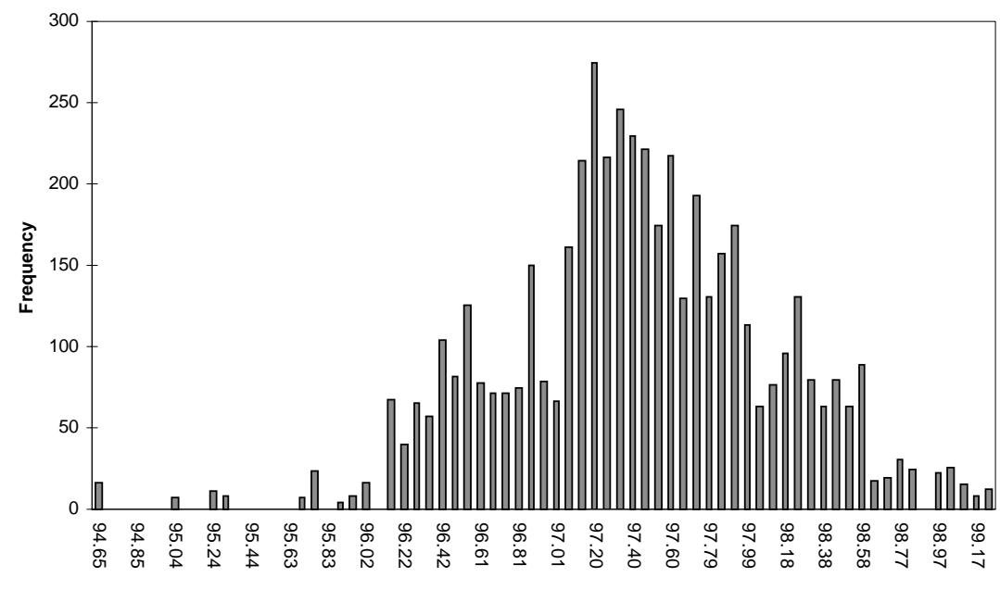
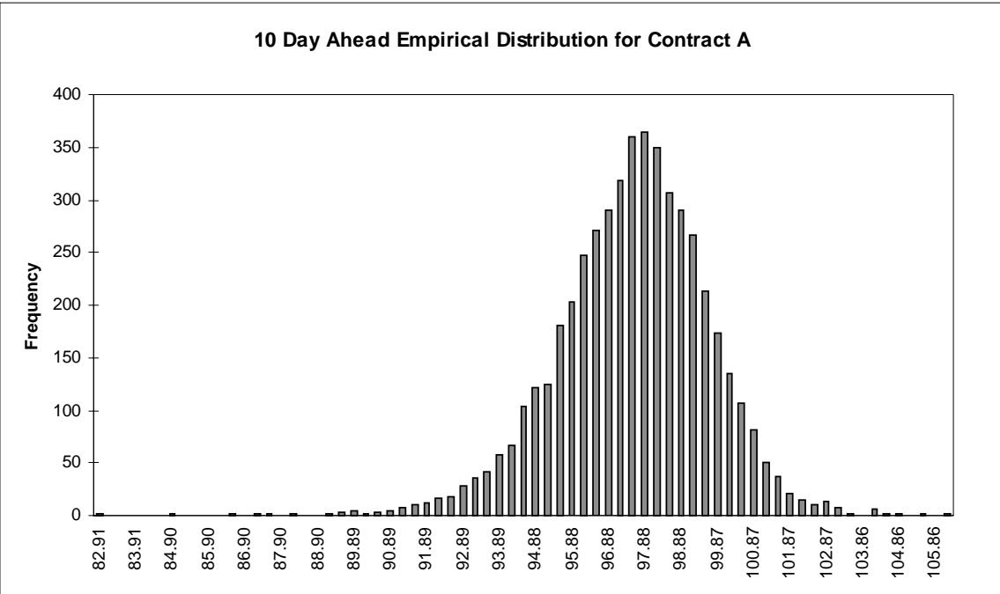
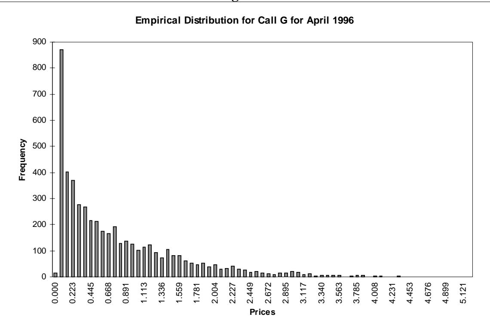
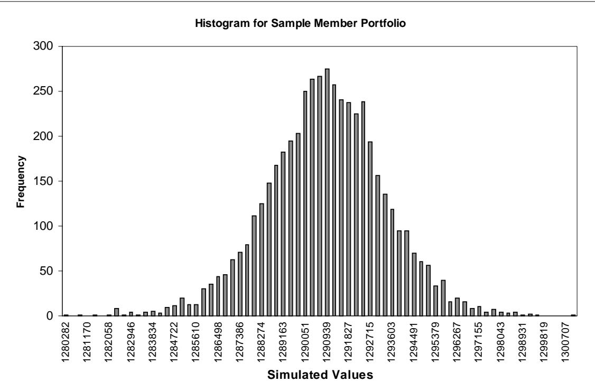
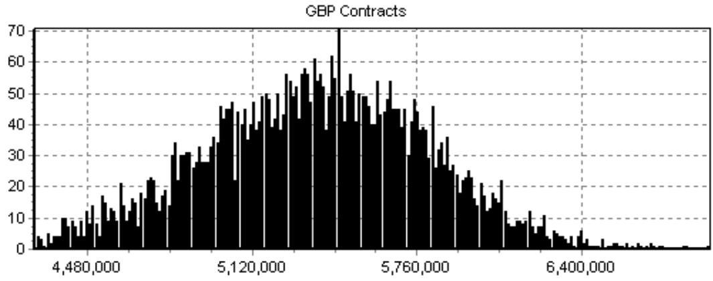
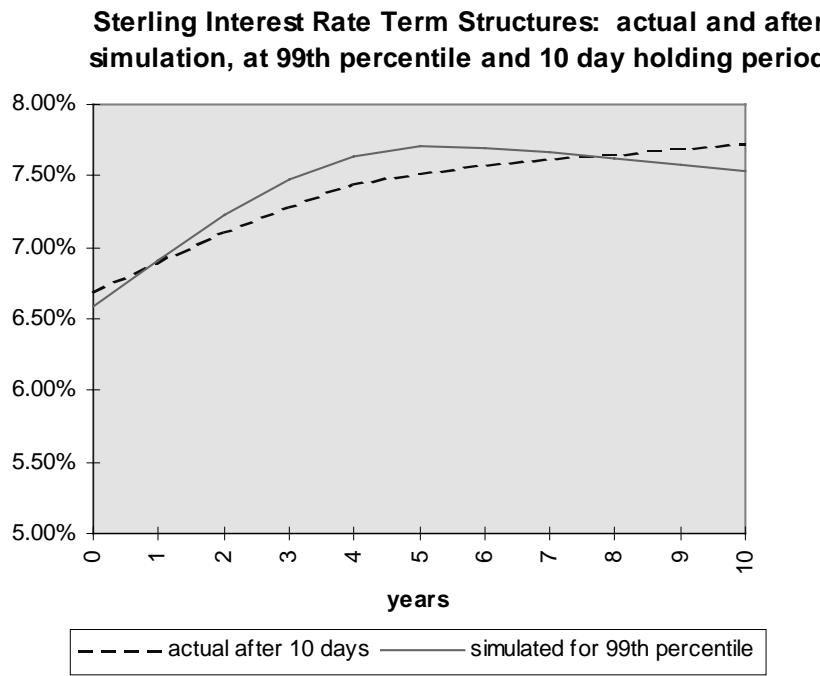

# 1999-barone-adesi-giannopoulos-vosper-var-without-correlations

<!-- page: 1 -->

Giovanni Barone-Adesi, Kostas Giannopoulos, Les Vosper

VaR without correlations for portfolio of derivative securities

Quaderno n. 99-04

'HFDQDWRGHOOD)DFROWjGL6FLHQ]HHFRQRPLFKH Via Ospedale, 13 CH-6900 Lugano. Tel. 091 912 46 09 / 08. Fax 091 912 46 29

<!-- page: 2 -->

VaR Without Correlations for Portfolios of Derivative Securities

03/09/99

## VaR Without Correlations for Portfolios of Derivative Securities

Giovanni Barone-Adesi

U.S.I., Lugano

& City University Business School, London

Kostas Giannopoulos

University of Westminster, London

Les Vosper

The London Clearing House Ltd

April 1997

Revised September 1998

Revised March 1999

<!-- page: 3 -->

## Abstract

We propose filtering historical simulation by GARCH processes to model the future distribution of assets and swap values. Options’ price changes are computed by full reevaluation on the changing prices of underlying assets. Our methodology takes implicitly into account assets’ correlations without restricting their values over time or computing them explicitly. VaR values for portfolios of derivative securities are obtained without linearising them. Historical simulation assigns equal probability to past returns, neglecting current market conditions. Our methodology is a refinement of historical simulation.

## 1 INTRODUCTION

Current methods of evaluating the risk of portfolios of derivative securities are unsatisfactory. Delta-gamma hedging becomes unstable for large asset price changes or for options at the money with short maturities (Allen 1997). Monte-Carlo simulations assume a particular distributional form, imposing the structure of the risk that they were supposed to investigate. Moreover, they often use factorisation techniques that are sensitive to the ordering of the data. Historical simulations usually sample from past data with equal probabilities. Therefore they are appropriate only if returns are i.i.d. (independently and identically distributed), an assumption violated by volatilities changing over time.This misspecification leads to inconsistent estimates of Value at Risk,as documented by Hendricks (1996) and Mc Neal and Frei (!998).

An overview of VaR (Value at Risk) estimation techniques is available in Davé and Stahl (1997). They show the effects of ignoring non-normality and volatility clustering in the computation of VaR. Even for the simple portfolios they consider current VaR methodologies underestimate substantially the severity of losses. From their results they infer that historical simulation modulated by a GARCH process is likely to be a better method. Such a technique is implemented with good results by Barone-Adesi, Bourgoin & Giannopoulos (1998) for a portfolio replicating a stock market index.

We propose to extend the recent methodology of Barone-Adesi, Bourgoin & Giannopoulos (1998) to portfolios with changing weights that may also include derivative securities. Following them we model changes in asset prices to depend on current asset volatilities. Asset volatilities are simulated to depend on the most recently sampled portfolio returns. Our simulation is based on the combination of GARCH modelling (parametric) and historical portfolio returns (non-parametric). Historical residual returns are adapted to current market conditions by scaling them by the ratio of current over past conditional volatility. By dividing historical residual returns by this volatility we standardise them for our simulation. These standardised residuals are then scaled by a volatility forecast that reflects current market conditions. Our simulated returns are based on these residuals.

<!-- page: 4 -->

The simulated returns are the basis of our simulation. To simulate a pathway of returns for each of a number of different assets over next 10 days we select randomly 10 past sets or “strips” of returns, each return in a strip corresponding to an asset’s price change which occurred on a day in the past. Thus each strip of returns represents a sample of the co-movements between asset prices. We compute residual returns from the returns. We then iteratively construct the daily volatilities for each asset that each of these strips of residuals imply according to the chosen GARCH model. We use ratio of these volatilities over historical volatility to change the scale of each of our sampled residuals. The resulting simulated asset returns therefore reflect current market conditions rather than historical ones. Derivatives on the assets are simulated by full re-evaluation at each point in time.

GARCH models are based on the assumption that residual asset returns follow a normal distribution. If residual returns are not normal GARCH estimates may be consistent but inefficient. A better filter could then be selected. Following a large literature in financial econometrics we will focus on GARCH.

In principle any GARCH or other time series model is suitable for our methodology provided it generates i.i.d residuals from our return series. Therefore residual diagnostics as well as the Rsquare of the Pagan-Ullah regression are important criteria for our model selection. The high t-statistics of our model parameters suggest that our models are wellspecified. Missspecification would result in poor predictions of conditional variances leading to poor backtesting results.

<!-- page: 5 -->

The core of our methodology is the historical returns of the data. The “raw” returns, however, are unsuitable for historical simulation because they do not fulfil the properties1 necessary for reliable results.

Among others Mandelbrot (1963) found that most financial series contain volatility clusters. In VaR analysis, volatility clusters imply that the probability of a specific loss being incurred is not the same on each day. During days of higher volatility we will expect larger than usual losses.

## SIMULATING A SINGLE PATHWAY

In our simulation we do not impose any theoretical distribution on the data. We use the empirical (historical) distribution of the return series. To render returns i.i.d. we need to remove any serial correlation and volatility clusters present in the dataset. Serial correlations can be removed by adding an MA term in the conditional mean equation. To remove volatility clusters it is necessary to model the process that generates them. We propose to capture volatility clusters by modelling returns as GARCH processes (Bollerslev, 1986)2. When appropriate we insert a moving average (MA) term in the conditional mean equation (1) to remove any serial dependency. As an example an ARMA-GARCH(1,1) model can be written as:

$$
\begin{array} { l } { { r _ { t } ~ = ~ \mu ~ r _ { t - 1 } ~ + ~ \Theta \varepsilon _ { t - 1 } ~ + \varepsilon _ { t } } } \\ { { { } } } \\ { { { } } } \\ { { { h _ { \mathrm { t } } ~ = ~ \mathfrak { o } ~ + ~ \mathsf { a } \left( \varepsilon _ { t - 1 } + \gamma \right) ^ { 2 } + ~ \mathsf { \beta } \mathsf { h } _ { { \mathrm { t } } - 1 } } } } \end{array}
$$

$$
\mathscr { E } _ { t } \sim \mathrm { N } ( 0 , h _ { \mathrm { t } } )\tag{1}
$$

(2)

where $\mu$ is the AR(1) term, θ is the MA term, ω is a constant and $ { \varepsilon } _ { t }$ the random residual. The GARCH(1,1) equation defines the volatility of $ { \varepsilon } _ { t }$ as a function of the constant ω plus two terms reflecting the contributions of the most recent surprise $\boldsymbol \varepsilon _ { t - 1 }$ and the last

1 For simulation, returns should be random numbers drawn from a stationary distribution i.e. they should be identically and independently distributed (i.i.d.).

2 The particular form of GARCH process used for a series was determined by statistical testing. Although the GARCH(1,1) specification is suitable for most series it may not be adequate for all the assets in the portfolio. Its failure may produce residuals that are not i.i.d. and do not satisfy the requirements of our historical simulation. We are currently investigating, in a different study, the relevance of GARCH mispecification on our VaR computations.

<!-- page: 6 -->

period’s volatility $h _ { \mathrm { t - l } }$ , respectively. The constants α and $\gamma$ determine the influence of the last observation and its asymmetry.

To standardise residual returns we need to divide the estimated residual, $\scriptstyle { \varepsilon _ { t } }$ by the corresponding daily volatility estimate, $\sqrt { \hat { h _ { t } } } ^ { 3 }$ . Thus, the standardised residual return is given as:

$$
e _ { t } = \frac { \varepsilon _ { t } } { \sqrt { \hat { h } _ { t } } }
$$

Under the GARCH hypothesis the set of standardised residuals are independently and identically distributed (i.i.d.) and therefore suitable for historical simulation. Empirical observations may depart from that to some degree.

As Barone-Adesi, Bourgoin and Giannopoulos (1998) have shown, historical standardised innovations can be drawn randomly (with replacement) and after being scaled with current volatility, may be used as innovations in the conditional mean (1) and variance (2) equations to generate pathways for future prices and variances respectively. Our methodology stands as follows:

• we draw standardised residual returns as a random vector $ { \varepsilon } _ { t }$ of outcomes from a data set Θ:

$$
e ^ { * } ~ = ~ \{ \not e _ { \mathrm { } } ^ { } , \ : e _ { \mathrm { } } ^ { } , \ : \cdots , \ : e _ { \tau } ^ { * } ~ \} ~ \ : \ : \ : \ : \ : \ : \ : \ : \ : \ : \ : \ : \ : \ : \ : \ : e _ { i } ^ { * } \in \Theta \ : \ : \ : \ : \ : \ : \ : \ : \ : \ : \ : \ : \ : \ : \ : \ : \ : \mathrm { w h e r e ~ i = 1 , \ldots , 1 0 ~ d a y s . }\tag{3}
$$

• to get the innovation forecast (simulated) value for period t+1, $z _ { t + 1 } ^ { * }$ , we draw a random standardised residual return from the dataset T and scale it with the volatility of $\mathrm { \ p e r i o d } ^ { 4 } \mathrm { t } + 1$ :

3 Henceforth, simply h and ε .

The variance of period t+1 can be calculated at the end of period t as:

ht+1 = ω\$ + α\$ ε 2 + \$ ht, in which is the latest estimated residual return in (1).

<!-- page: 7 -->

$$
z _ { t + 1 } ^ { * } = e _ { 1 } ^ { * } \cdot \sqrt { h _ { t + 1 } ^ { \vphantom { * } } }\tag{4}
$$

• we begin simulation of the pathway of the asset’s price from the currently known asset price, at period t. The simulated price $p _ { t + 1 } ^ { * }$ for t+1 is given as

$$
\boldsymbol { p } _ { t + 1 } ^ { * } \ = \ \boldsymbol { p } _ { t } + \boldsymbol { p } _ { t } ( \hat { \mu } \boldsymbol { r } _ { t } \ + \ \hat { \theta } \boldsymbol { z } _ { t } ^ { * } \ + \ \boldsymbol { z } _ { t + 1 } ^ { * } )\tag{5}
$$

where $z ^ { * }$ is estimated as in (4).

For i = 2, 3... the volatility is unknown and must be simulated from the randomly selected re-scaled residuals. In general $\sqrt { \boldsymbol { h } _ { t + i } ^ { * } }$ , the (simulated) volatility estimate for period t+i, is obtained as:

$$
\sqrt { \dot { h } _ { t + i } ^ { * } } ~ = ~ \sqrt { \hat { \omega } + ~ \hat { \alpha } ( z _ { \mathrm { t + i - 1 } } ^ { * } ) ^ { 2 } ~ + ~ \hat { \beta } h _ { t + i - 1 } ^ { * } } ~ \mathrm { ~ i ~ \ge ~ 2 ~ }\tag{6}
$$

where $z ^ { * }$ is estimated as in (4).

New elements $\boldsymbol { \varepsilon } _ { t } ^ { * }$ are drawn from the dataset T to form the simulated prices $p _ { t + i } ^ { * }$ as in (5).

The “empirical” distribution of simulated prices at the chosen time horizon (e.g. i = 10) for a single asset is obtained by replicating the above procedure a large number of times e.g. 5000.

## 2 SIMULATING MULTIPLE PATHWAYS

To estimate risks for a portfolio of multiple assets we need to preserve the multivariate properties of asset returns; however, methodologies which use the correlation matrix of asset returns encounter various problems with this. The use of conditional multivariate econometric models which allow for correlations to change over time is restricted to a few series at a time. The number of terms in a correlation matrix increases with the square of the number of assets in the portfolio: for large portfolios the number of pairwise correlations becomes unmanageable.

<!-- page: 8 -->

When estimating time-varying correlation coefficients independently from each other, there is no guarantee that the resulting matrix satisfies the multivariate properties of the data. In fact the resulting matrix may not be positive definite.

Additionally, the estimation of VaR from the correlation matrix requires knowledge of the probability distribution of each asset series. However, empirical distributions may not conform to any known distribution: often the empirical histograms are smoothed and forced to follow a known distribution convenient for the calculations. VaR measures which are based on arbitrary distributional assumptions may be unreliable; preliminary smoothing of data can cover up the non-normality of the data; VaR estimation, which is highly dependent on the good prediction of uncommon events, may be adversely affected from smoothing the data.

Finally, correlations measured from daily returns can be demonstrated to be unstable. Even their sign is ambiguous. Estimated correlation coefficients can be the subject of such great changes at any time, which even conditional models do not capture, that the successful forecast of portfolio losses may be seriously inhibited.

Our approach does not employ a correlation matrix. For a portfolio of multiple assets we extend our simulation methodology to simulate multiple pathways. We select a random date from the dataset, which will have an associated set of residual returns. This “strip” of residual returns, derived at a common date in the past, is one sample from which we begin modelling the co-movements between respective asset prices.

Thus for each asset for $\mathbf { i } = 1 . . . . 1 0$ days we have the sampled residuals denoted by subscripts 1, 2, 3,...., for the different assets.

Asset 1: $\begin{array} { l l l } { \boldsymbol { e } _ { 1 } ^ { * } } & { = } & { \{ \boldsymbol { e } _ { \textup { 1 } } , \boldsymbol { e } _ { 2 } , . . . , \boldsymbol { e } _ { \textup { T } } \} _ { 1 } } \end{array}$

(7)

$$
\mathrm { A s s e t } 2 \colon \ : e _ { 2 } ^ { * } \ = \ \{ e _ { 1 } , e _ { 2 } , . . . , e _ { \textup { T } } \} _ { 2 }\tag{8}
$$

$$
\mathrm { A s s e t } \ 3 : \ e _ { 3 } ^ { * } \ = \ \{ \ e _ { 1 } , \ e _ { 2 } , . . . , \ e _ { \textup { T } } \} _ { 3 }\tag{9}
$$

5 Additional reading about the this methodology can be found in Efron and Tibshirani (1993).

<!-- page: 9 -->

with $e _ { i } ^ { * } \in \Theta$ and so on for all the assets in the dataset: $\Theta = \left\{ \Theta _ { 1 } , . . . , \Theta _ { \scriptscriptstyle N } \right\}$ . From the dataset Θ of historical standardised innovations, for i = 1, a date is randomly drawn and hence the associated residuals $e _ { 1 } ^ { * } , e _ { 2 } ^ { * } , e _ { 3 } ^ { * }$ are selected. At i = 2 another date is drawn, with its corresponding residuals, and so on for i = 3, 4....etc. Thus pathways for variances, h , and prices, $p$ , are constructed for each asset which reflect the comovements between asset prices:

For $\dot { 1 } = 1$ to 10:

Asset 1:

$$
h _ { 1 , t + i } ^ { * } \ = \ \hat { \omega } _ { 1 } + \hat { \alpha } _ { 1 } ( z _ { 1 , t + i - 1 } ^ { * } ) ^ { 2 } + \hat { \beta } _ { 1 } h _ { 1 , t + i - 1 } ^ { * }\tag{10}
$$

$$
\begin{array} { r c l } { p _ { 1 , t + i } ^ { * } = } & { p _ { 1 , t + i - 1 } ^ { * } + \ p _ { 1 , t + i - 1 } ^ { * } ( \hat { \mu } _ { 1 } r _ { 1 , t + i - 1 } \ + \ \hat { \theta } _ { 1 } z _ { 1 , t + i - 1 } ^ { * } + \ z _ { 1 , t + i } ^ { * } ) } \end{array}\tag{11}
$$

Asset 2:

$$
h _ { 2 , t + i } ^ { * } \ = \ \hat { \omega } _ { 2 } + \hat { \alpha } _ { 2 } ( z _ { 2 , t + i - 1 } ^ { * } ) ^ { 2 } + \hat { \beta } _ { 2 } h _ { 2 , t + i - 1 } ^ { * }\tag{12}
$$

$$
\begin{array} { r l } { p _ { 2 , t + i } ^ { * } \ = \ } & { { } p _ { 2 , t + i - 1 } ^ { * } + \ p _ { 2 , t + i - 1 } ^ { * } ( \hat { \mu } _ { 2 } r _ { 2 , t + i - 1 } + \ \hat { \theta } _ { 2 } \ z _ { 2 , t + i - 1 } ^ { * } + \ z _ { 2 , t + i } ^ { * } ) } \end{array}\tag{13}
$$

Asset 3:

$$
h _ { 3 , t + i } ^ { * } = \hat { \omega } _ { 3 } + \hat { \alpha } _ { 3 } ( z _ { 3 , t + i - 1 } ^ { * } ) ^ { 2 } + \hat { \beta } _ { 3 } h _ { 3 , t + i - 1 } ^ { * }\tag{14}
$$

$$
\begin{array} { r c l } { p _ { 3 , t + i } ^ { * } ~ = } & { p _ { 3 , t + i - 1 } ^ { * } + ~ p _ { 3 , t + i - 1 } ^ { * } ( \hat { \mu } _ { 3 } ~ r _ { 3 , t + i - 1 } ~ + ~ \hat { \theta } _ { 3 } ~ z _ { 3 , t + i - 1 } ^ { * } + ~ z _ { 3 , t + i } ^ { * } ) } \end{array}\tag{15}
$$

where $z ^ { * }$ is estimated as in (4).

## 3 AN EMPIRICAL INVESTIGATION

We illustrate our methodology with a numerical example of a portfolio of three assets. Our hypothetical portfolio is invested across three LIFFE futures contracts and a call option on the Long Gilt future with net lots 2,-5, 10 and 7; lot conversion factors for the contracts are 2500, 500, 2500 and 500 respectively. Our historical data sets consists of two years of daily6 prices, from 4 January 1994 until 27 December 1995, for three

6 All three contracts are traded on the London International Futures Exchange (LIFFE) at different delivery months.

<!-- page: 10 -->

interest rate futures contracts, the 10-year German Government Bund (A), Long Gilt (G) and the three-month EuroSwiss Franc (S) contracts7.

Given the daily price, $p _ { t }$ we obtain the daily returns $r _ { t }$ as

$$
r _ { t } ~ = ~ \ln { ( \frac { p _ { t } } { p _ { t - 1 } } ) }\tag{16}
$$

and then we form continuous series of historical returns by rolling a few days before the expiration date to the next front month contract.

For each historical return series we fit the most suitable GARCH-ARMA specification, as in equations (1) and (2) to obtain i.i.d. residual returns. The parameter estimates together with standard errors and the likelihood value are shown in table 1.

7 The price of the LIFFE Euroswiss contract is derived by subtracting the appropriate forward-forward interest rate from 100. Hence pathway calculations are made using 100 minus the quoted price.

<!-- page: 11 -->

[Table source crop](assets/tables/1999-barone-adesi-giannopoulos-vosper-var-without-correlations-p0011-block-0001-c4b6b0e1db10c4cb.jpg)
• Table 1: GARCH Estimates

The low standard errors as well as the residual statistics (not reported) support our parametrization choices. The equations are estimated in four steps. First by OLS to get starting values, then by downhill simplex (because its robustness to bad starting values and discontinuities). The BHHH algorithm was then used to refine convergence and finally a quasi Newton method, the BFGS, was used to get reliable standard errors.

As an example let the current close business be February 21, 1996; we want to estimate the portfolio VaR over the next 2 business days. The closing prices and annualised volatilities for the three futures on that date are reported in table 2:

[Table source crop](assets/tables/1999-barone-adesi-giannopoulos-vosper-var-without-correlations-p0011-block-0004-0ccfb8a569bf1d63.jpg)
• Table 2: Close Prices and conditional volatility on 21&22 February

The conditional volatility of the next date, i.e. February 22, is calculated by substituting the last trading date’s residual error and variance into equation (2). To simulate asset prices for February 22 we draw a random (with replacement) row8 of historical

8 A row contains the –standardised - innovations that occur on a random date from the past across all contracts.

<!-- page: 12 -->

(standardised) asset residual returns9 and re-scale them with the corresponding asset’s volatility on February 22 to form a random surprise, $\varepsilon _ { \mathrm { t } }$ , in equation (1). In this way we generate parallel pathways for all linear assets in the portfolio without imposing the degree of cross correlation between the assets. By taking a row of random residuals we maintain the co-movement between the assets when we generate the simulated forecasts.

[Table source crop](assets/tables/1999-barone-adesi-giannopoulos-vosper-var-without-correlations-p0012-block-0002-a7bc79db32300f8a.jpg)
Table 3 shows a sample of the standardised residuals for each asset used in our simulation. • Table 3. Historical Standardised Residuals

• Let us assume that the random set of standardised residuals are : -1.15592, -1.13077 and 0.86704

for A, G and ${ \boldsymbol { \mathrm { S } } } ^ { 1 0 }$ contracts respectively11. At the first simulation run, the one date ahead re-scaled residuals, $z ^ { * }$ , for the three futures will be:

$$
{ \mathrm { A } } { \mathrm { : } } \qquad { \mathrm { Z } } _ { 1 , 1 + 1 } ^ { * } = - 1 . 1 5 5 9 2 ^ { * } { \frac { 0 . 0 9 3 4 7 } { \sqrt { 2 5 2 } } } = - 0 . 0 0 6 8 0 6 1 2
$$

9 Table 1 is an extract, for illustrative purposes, of standardised residual returns based on closing prices for three futures over a two year period. We can have as many columns of residual returns as there are assets, or as in the case of swaps in a given currency, a set of columns of interest rate residual returns e.g. from 1 day to 10 years per currency, from which swap evaluations may be performed.

10 This set corresponds to the 13.01.94

11 As the random sampling is with replacement, we may draw the same date more than once during the simulation process.

<!-- page: 13 -->

where $\mathrm { h } _ { 1 , \mathrm { t } + 1 } = \left( { \frac { 0 . 0 9 3 4 7 } { \sqrt { 2 5 2 } } } \right) ^ { 2 } = 0 . 0 0 0 0 3 4 6 7$

G:

$$
\textbf { z } _ { 2 , \mathrm { t } + 1 } ^ { * } = - 1 . 1 3 0 7 7 ^ { * } \frac { 0 . 0 9 6 2 3 } { \sqrt { 2 5 2 } } = - 0 . 0 0 6 8 5 4 6
$$

S:

$$
\textbf { z } _ { 3 , \mathrm { t } + 1 } ^ { * } = 0 . 8 6 7 0 4 ^ { * } \frac { 0 . 3 5 4 3 6 } { \sqrt { 2 5 2 } } = 0 . 0 1 9 3 5 4 5 7 1
$$

These are also the innovations for equation (1). Recall from equation (5) the $\dot { \mathbf { l } } _ { \mathrm { t h } }$ forecast for 22 February is given by:

$$
\begin{array} { r } { \mathrm { p } _ { \mathrm { ~ i , t + \tau } } ^ { \mathrm { ~ * ~ } } = \mathrm { p } _ { \mathrm { i , t } } + \mathrm { p } _ { \mathrm { i , t } } ( \hat { \mu } _ { i } \mathrm { r } _ { \mathrm { t } } + \hat { \theta } _ { i } ^ { \mathrm { ~ * ~ } } \mathrm { Z } _ { \mathrm { ~ i , t } } ^ { \mathrm { ~ * ~ } } + \mathrm { Z } _ { \mathrm { ~ i , t + 1 } } ^ { \mathrm { ~ * ~ } } ) } \end{array}
$$

where $( \hat { \mu } _ { i } \mathrm { r } _ { \mathrm { t } } + \hat { \theta } _ { i } { ^ * \mathrm { \mathbf { Z } } } _ { \mathrm { i , t } } ^ { * } + \mathrm { \mathbf { Z } } _ { \mathrm { i , t + 1 } } ^ { * } )$ is the simulated return. This gives us:

A:

$$
\begin{array} { r l } & { \mathsf { p } _ { ^ { 1 , t + 1 } } ^ { ^ { * } } = 9 7 . 3 9 + 9 7 . 3 9 ( - 0 . 4 3 0 8 4 ^ { * } 0 . 0 0 4 4 6 \mathrm { + - } 0 . 0 0 6 8 0 6 1 2 ) } \\ & { \quad \quad = 9 7 . 3 9 + 9 7 . 3 9 ( - 0 . 0 0 8 7 2 8 6 2 ) } \\ & { \quad \quad = 9 6 . 5 3 9 9 1 9 7 } \end{array}
$$

G:

$$
\boldsymbol { \mathrm { p } } ^ { * } _ { 2 , \mathrm { t + 1 } } = 1 0 7 . 2 1 9 + ( 1 0 7 . 2 1 9 ^ { * } - 0 . 0 0 6 8 5 4 6 4 ) = 1 0 6 . 4 8 4 0 5 2 6
$$

S:

$$
{ \begin{array} { r l } & { { \mathrm { ~ p } } _ { 3 , { \mathrm { t } } + 1 } ^ { * } = 1 0 0 \mathrm { - } ( 2 . 5 2 \mathrm { + } ( 2 . 5 2 ^ { * } 0 . 0 1 9 3 5 4 5 7 1 ) \mathrm { = } 9 7 . 4 3 1 2 2 6 4 8 } \\ & { ~ \to \mathrm { W o r k i n g ~ p r i c e = } 1 0 0 \mathrm { - } 9 7 . 4 3 1 2 2 6 4 8 \mathrm { = } 2 . 5 6 8 7 7 } \end{array} }
$$

To produce the ith simulated volatility for the second date ahead we substitute $\pmb { \varepsilon } _ { \mathrm { t - 1 } }$ with $z _ { 1 , t + 1 } ^ { * } , z _ { 2 , t + 1 } ^ { * } , z _ { 3 , t + 1 } ^ { * }$ , in (2). Hence the simulated variance for February, 23 1996 for contract A is:

$$
\begin{array} { r l } { h _ { 1 , t + 2 } ^ { * } } & { \quad = \quad \quad \mathfrak { O } _ { 1 } + \mathfrak { O } _ { 1 } \big ( z _ { 1 , t + 1 } ^ { * } + \gamma \big ) ^ { 2 } + \big \beta _ { 1 } h _ { 1 , t + 1 } ^ { * } } \\ & { \quad } \\ & { \quad = \quad 0 . 0 7 7 5 4 ( - 0 . 0 0 6 8 0 6 1 2 + - 0 . 0 0 2 9 2 0 8 3 ) ^ { 2 } + 0 . 8 6 4 2 1 ^ { * } 0 . 0 0 0 0 3 4 6 7 = 0 . 0 0 0 0 3 7 3 } \\ & { \quad = 0 . 0 7 7 5 4 ( - 0 . 0 0 6 8 0 6 1 2 + - 0 . 0 0 2 9 2 0 8 3 ) ^ { 2 } + 0 . 8 6 4 2 1 ^ { * } 0 . 0 0 0 0 3 4 6 7 = 0 . 0 0 0 0 0 3 7 3 } \end{array}
$$

Similarly we calculate the $\mathbf { i } _ { \mathrm { t h } }$ simulated variances for contracts G and S to be

<!-- page: 14 -->

$$
h _ { 2 , t + 2 } ^ { * } = \varpi _ { 2 } + \alpha _ { 2 } ( z _ { 2 , t + 1 } ^ { * } + \gamma _ { 2 } ) ^ { 2 } + \beta _ { 2 } h _ { 2 , t + 1 } ^ { * } = 0 . 0 0 0 0 4 0 5
$$

$$
h _ { 3 , t + 2 } ^ { * } = \varpi _ { 3 } + \alpha _ { 3 } ( z _ { 3 , t + 1 } ^ { * } + \gamma _ { 3 } ) ^ { 2 } + \beta _ { 3 } h _ { 3 , t + 1 } ^ { * } = 0 . 0 0 0 4 5 8 8 8 1
$$

We repeat the above calculations to get the N days ahead forecasts of the variances and prices for each of the three futures contracts. For example to obtain the 2 day ahead price forecasts: we randomly sample another row with historical standardised residuals, for each of the three contracts. Let us assume that this random set corresponds to November 13, 1995, and the values are 0.93074, 0.43796, -0.72107, for A, G and S respectively. When these random historical standardised residuals are re-scaled by the day 2 simulated volatilities the following set of scaled residuals are produced:

$$
\mathrm { 4 } ; \qquad \mathrm { z } _ { ~ 1 , t + 2 } ^ { \ast } = \sqrt { h _ { 1 , t + 2 } ^ { \ast } } \ast 0 . 9 3 0 7 4 = 0 . 0 0 6 1 0 7 1 9 4 ^ { \ast } 0 . 9 3 0 7 4 = 0 . 0 0 5 6 8 4 2 1
$$

G:

$$
\begin{array} { r } { \boldsymbol { z } ^ { * } _ { 2 , { \mathrm { t } } + 2 } = \sqrt { h _ { 2 , t + 2 } ^ { * } } \ast 0 . 4 3 7 9 6 = 0 . 0 0 6 3 6 3 8 5 8 ^ { * } 0 . 4 3 7 6 = 0 . 0 0 2 7 8 7 1 1 5 } \end{array}
$$

S:

$$
z _ { \ 3 , \mathrm { t } + 2 } ^ { \ast } = \sqrt { h _ { 3 , t + 2 } ^ { \ast } } \ \ast - 0 . 7 2 1 0 7 = 0 . 0 2 1 4 2 1 5 0 3 ^ { \ast } - 0 . 7 2 1 0 7 = - 0 . 0 1 5 4 4 6 4 0 3
$$

Hence, $z _ { 1 , t + 2 } ^ { * } , z _ { 2 , t + 2 } ^ { * } , z _ { 3 , t + 2 } ^ { * }$ are the simulated residuals for February 23. Therefore, the simulated set of prices for the same date will be:

A:

$$
\begin{array} { r } { \boldsymbol { \mathrm { p } } ^ { * } _ { 1 , \mathrm { t } + 2 } = \mathrm { 9 } 6 . 5 3 9 9 1 9 7 + \mathrm { 9 } 6 . 5 3 9 9 1 9 7 ^ { * } (  - 0 . 4 3 0 8 4 ^ { * } \mathrm { - } 0 . 0 0 8 7 2 8 6 2 + 0 . 0 0 5 6 8 4 2 1 ) } \\ { = 9 7 . 4 5 1 7 2 4 5 9 } \end{array}
$$

G:

$$
\begin{array} { r } { \mathrm { p } _ { \ 2 , { \scriptstyle t + 2 } } ^ { \ast } = \ 1 0 6 . 4 8 4 0 5 2 6 + 1 0 6 . 4 8 4 0 5 2 6 ^ { \ast } 0 . 0 0 2 7 8 7 1 1 5 } \\  = 1 0 6 . 7 8 0 8 3 6 \ \end{array}
$$

S:

$$
\begin{array} { r l } & { \mathrm { p } _ { 3 , 1 + 2 } ^ { * } = \ 1 0 0 \mathrm { - } ( 2 . 5 6 8 7 7 \mathrm { + } 2 . 5 6 8 7 7 ^ { * } \mathrm { - } 0 . 0 1 5 4 4 6 4 0 3 ) } \\ & { \quad \quad = 9 7 . 4 7 0 9 0 4 7 9 } \end{array}
$$

Note $\mu _ { 2 }$ and $\mu _ { 3 } = 0$ so the AR term is absent in these equations.

<!-- page: 15 -->

The above steps can be repeated to produce the entire set of, let us say 5000, simulated values. Figure 1 illustrates examples of distributions of price pathways for 21.02.96, for the LIFFE German Bund financial futures contract.

1 Day ahead Empirical Distribution for Contract A

Similarly, for longer VaR horizons our steps can be repeated to obtain a simulated pathway for each date ahead. Figure 2 shows the distribution of the 5000 simulation runs for the ${ 1 0 } ^ { \mathrm { t h } }$ date ahead for the German Bund. The asymmetry of our simulated distribution is apparent.

<!-- page: 16 -->

## 3.1 Options

Options price paths are obtained from the corresponding asset price paths by using an options pricing model applied to each asset price in the path and other relevant option pricing parameters e.g. implied volatility, σ, strike price, x, time to expiry, $\mathrm { { T } \cdot { t } , }$ and interest rate, r . For the present we keep the values of these other parameters equal to their values at the start of simulation.

Thus the call option price is denoted $\textbf { c } = \mathrm { f } ( p _ { t } , \mathrm { X } , \sigma , \mathrm { T } \mathrm { - } \mathrm { t } , \mathrm { r } )$

(17)

where $p _ { t }$ is the underlying asset price at current time t. The price path for the call option on a given asset is:

$$
\begin{array} { r l r } { \textbf { c } _ { t , t + 1 , t + i } } & { = } & { \mathbf { f } ( \boldsymbol { p } _ { t } , \mathbf { X } , \mathbb { O } , \boldsymbol { \mathbb { T } } \mathbf { - } \mathbf { t } , \mathbf { r } ) , \mathbf { f } ( \boldsymbol { p } _ { t + 1 } , \mathbf { X } , \mathbb { O } , \boldsymbol { \mathbb { T } } \mathbf { - } \mathbf { t } + 1 , \mathbf { r } ) , . . . , \mathbf { f } ( \boldsymbol { p } _ { t + i } , \mathbf { X } , \mathbb { O } , \boldsymbol { \mathbb { T } } \mathbf { - } \mathbf { t } + \mathrm { i } , \mathbf { r } ) } \end{array}\tag{18}
$$

Where $p _ { t } , . . . , p _ { t + i }$ is the first vector (i.e. for the first asset) from (15).

<!-- page: 17 -->

Additional option pathways use the asset prices from the corresponding asset price vectors in (15). Figure 3 illustrates an example of the ten day ahead distribution of prices for an out-of-the money call option, for 5000 simulation runs on the LIFFE Long Gilt futures contract. The time to expiry was one and a half months (expiry date 22/3/96), the strike price was 108 points and the underlying futures price was 107.219. The option’s market price was 0.670 and the ten-day median forecast price was 0.477. The minimum price was 0.00018 and the maximum 4.82152 illustrating the non-linearity of option pricing.

Using the Black ’76 model and the futures price path for contract G the following price pathway was generated for the call option above.

[Table source crop](assets/tables/1999-barone-adesi-giannopoulos-vosper-var-without-correlations-p0017-block-0003-168701051df80919.jpg)
Table 4: Option Pricing Model Input Values and Results

<!-- page: 18 -->

## 3.2 Aggregating Asset Pathways to Obtain Portfolio Pathways

For the first simulation we select the asset pathways which correspond to the contracts in the portfolio. These are the vectors

$$
{ \bf p } _ { 1 , \{ \mathrm { t } + \tau \} } , { \bf p } _ { 2 , \{ \mathrm { t } + \tau \} } , { \bf p } _ { 3 , \{ \mathrm { t } + \tau \} } , . . . . . , { \bf p } _ { \mathrm { n } , \{ \mathrm { t } + \tau \} }
$$

$$
\tau { = } 0 , 1 . . 1\tag{19}
$$

for n assets and a time horizon of i days. The position-weighted pathways in the portfolio are the vectors:

$$
\mathbf { W } _ { 1 } \mathbf { p } _ { 1 , \ \{ \mathrm { t } + \tau \} } , \ \mathbf { W } _ { 2 } \mathbf { p } _ { 2 , \ \{ \mathrm { t } + \tau \} } , \ \mathbf { W } _ { 3 } \mathbf { p } _ { 3 , \ \{ \mathrm { t } + \tau \} } , . . . . . . , \mathbf { W } _ { \mathrm { n } } \mathbf { p } _ { \mathrm { n } , \ \{ \mathrm { t } + \tau \} }
$$

$$
\tau { = } 0 , 1 . . 1\tag{20}
$$

where the scalars $\mathbf { w } _ { 1 } , \mathbf { w } _ { 2 } , \mathbf { w } _ { 3 } , . . . . , \mathbf { w } _ { \mathrm { n } }$ are the weights of contracts in the portfolio.

<!-- page: 19 -->

The vectors of pathways are added to form the portfolio path $\pi _ { \mathrm { t + \tau } }$

$$
\begin{array} { r } { \pi _ { \mathsf { t } + \tau } = \mathbf { w } _ { 1 } \mathbf { p } _ { 1 , \{ \mathsf { t } + \tau \} } + \mathbf { w } _ { 2 } \mathbf { p } _ { 2 , \{ \mathsf { t } + \tau \} } + \mathbf { w } _ { 3 } \mathbf { p } _ { 3 , \{ \mathsf { t } + \tau \} } + , . . . , + \mathbf { w } _ { \mathbf { n } } \mathbf { p } _ { \mathsf { n } , \{ \mathsf { t } + \tau \} } \qquad \tau = 0 , 1 . . . } \end{array}\tag{21}
$$

The price pathways above are modified by weights derived by multiplying together the relevant number of lots, the lot conversion factor and the currency rate (to Sterling). The exchange rate from DM is taken to be constant at 2.24 and the exchange rate from Swiss francs to Sterling taken constant at 1.82. The lot conversion factors are 2500 for the Euroswiss and Bund contracts and 500 for both Long Gilt contracts

$$
\begin{array} { r l } { \mathbf { A } { : } \mathrm { w } _ { 1 } \mathsf { p } _ { 1 \left\{ \mathsf { t } , \mathsf { t } + 1 , \mathsf { t } + 2 \right\} } { = } } & { 1 / ( 2 . 2 4 ) ^ { \ast } 2 5 0 0 ^ { \ast } 2 [ 9 7 . 3 9 0 0 , 9 6 . 5 3 9 9 , 9 7 . 4 5 1 7 ] } \\ & { \ = [ \pounds 2 1 7 3 8 8 , \ p { \Sigma } 2 1 5 4 9 1 , \pounds 2 1 7 5 2 6 ] } \end{array}
$$

$$
\begin{array} { r l } { \mathbf { G } \colon \mathbf { w } _ { 2 } \mathbf { p } _ { 2 , \{ \mathrm { t } , \mathrm { t } + 1 , \mathrm { t } + 2 \} } = } & { 5 0 0 ^ { * } - 5 [ 1 0 7 . 2 1 9 0 , 1 0 6 . 4 8 4 1 , 1 0 6 . 7 8 0 8 ] } \\ & { = [ - \pounds 2 6 8 0 4 8 , - \pounds 2 6 6 2 1 0 , - \pounds 2 6 6 9 5 2 ] } \end{array}
$$

Call Option on G = 500\*7[0.6717, 0.4096, 0.4759] = [£2351, £1433, £1666]

$$
\begin{array} { r l } & { \mathrm { S } { : } \mathrm { w } _ { 3 } \mathrm { p } _ { 3 , \{ \mathrm { t } , \mathrm { t } + 1 , 1 + 2 \} } = 1 / ( 1 . 8 2 ) ^ { * } 2 5 0 0 ^ { * } 1 0 [ 9 7 . 4 8 0 0 , 9 7 . 4 3 1 2 , 9 7 . 4 7 0 9 ] } \\ & { \qquad = [ \pounds 1 2 9 2 , \pounds 7 8 8 , \pounds 9 1 5 ] } \end{array}
$$

Thus the portfolio path based on prices is

$$
\begin{array} { r l } & { \pi _ { \mathfrak { t } , \mathfrak { t } + 1 , \mathfrak { t } + 2 } = \mathrm { w } _ { 1 } \mathrm { p } _ { 1 } \{ \mathfrak { t } , \mathfrak { t } + 1 , \mathfrak { t } + 2 \} + \mathrm { w } _ { 2 } \mathrm { p } _ { 2 , \{ \mathfrak { t } , \mathfrak { t } + 1 , \mathfrak { t } + 2 \} } + \mathrm { w } _ { 3 } \mathrm { p } _ { 3 , \{ \mathfrak { t } . \mathfrak { t } + 1 , 1 + 2 \} } } \\ & { \qquad = [ \pounds 2 1 7 3 8 8 , \quad \ p 2 1 5 4 9 1 , \ \pounds 2 1 7 5 2 6 ] } \\ & { \qquad + [ \ p 2 6 8 0 4 8 , \ p \ p \ p \ p \ p \mathscr { \mathrm { 2 6 6 } } 2 1 0 , \ p \ p \ p \mathscr { \mathrm { 2 6 } } 6 9 5 2 ] } \\ & { \qquad + [ \ p \ p 2 9 2 , \quad \ p \ p \ p \mathscr { \mathrm { 2 7 } } 8 8 , \quad \ p \mathscr { \mathrm { 2 9 } } 1 5 ] } \\ & { \qquad + [ \ p \ p 2 3 5 1 , \quad \ p \ p \pounds 1 4 3 3 , \quad \ p \pounds 1 6 6 6 ] } \end{array}
$$

$$
= [ - \pounds 4 7 0 1 6 , - \pounds 4 8 4 9 8 , - \pounds 4 6 8 4 5 ]
$$

The change in the portfolio’s value after 2 days from its closing value is

(-£46844.92496) -(-£47016.4787) = £171.5537 which in this (first) simulation path is a gain in value.

By repeating the above procedure with different random values the empirical distribution of portfolio values can be obtained. The representative “lowest value” of the portfolio e.g. for the $9 9 ^ { \mathrm { t h } }$ percentile, can be compared to the value of the portfolio at the start of simulation, to obtain the $9 9 ^ { \mathrm { t h } }$ percentile loss. A ten-day ahead multi-contract portfolio

<!-- page: 20 -->

example (a portfolio of futures and options in a variety of LIFFE contracts) is illustrated in Figure 4:

<!-- page: 21 -->

## SWAPS

Our methodology can be applied to any type of asset. We may have a portfolio comprising exchange traded futures and options, interest rate and currency swaps and swaptions.

For example a swap with three cash-flows remaining before it matures has its value denoted by an appropriate swap valuation function of zero coupon interest rates:

$$
\mathbf { s } = \mathbf { g } ( \boldsymbol { \imath } _ { 1 } , \boldsymbol { \imath } _ { 2 } , \boldsymbol { \imath } _ { 3 } , \boldsymbol { \Phi } )\tag{22}
$$

where $\boldsymbol { \Phi }$ represents parameters defined in the swap contract necessary to value it (e.g. coupon, floating and fixed interest rates, notional principal amount, payment dates of the cash-flows, maturity date, etc.); $\boldsymbol { \imath } _ { 1 } , \boldsymbol { \imath } _ { 2 }$ , and $\iota _ { 3 }$ are zero coupon interest rates (term

<!-- page: 22 -->

structure) for dates corresponding to the future payment dates. The value of a swap at a given close of business will utilise the zero coupon rates (term structure) at this time.

We consider interest rate swaps to demonstrate how the methodology may be applied. A pathway of swap values is obtained by simulating zero coupon interest rates curves. For the first scenario we simulate 10 zero coupon rates for each day of the holding period. This is replicated to obtain 5000 such simulations. To simulate a zero coupon rate curve we need to define how we create it from the source interest rates e.g. money market rates, interest rate futures and quoted swap rates for various maturities e.g. to 10 years. These source rates, which could be depicted as a curve, allow a zero coupon rate curve to be created12 from them; the zero coupon rate curve is defined by points of constant maturity which correspond to the maturities of the source rates.

We treat each of the source rates as an asset and simulate a single pathway for each source rate, as described in the foregoing sections for futures pathways i.e. starting from logarithmic returns from historical time series of (constant maturity) source interest rates. We obtain a pathway for each source interest rate at the current close of business i.e. we simulate the source interest rate curve for each day of the holding period (i=10). For each of these we apply the methodology, described by Hull (1997), to convert them to zero coupon interest rate curves. Replication of the process obtains 5000 zero coupon rate curves defined by a small number (ten) constant maturity points.

Interest rate swaps are evaluated from each of the simulated yield curves. This necessitates interpolation between the constant maturity points. During the simulation process we use linear interpolation as we believe this to be sufficiently accurate for simulation processes and much faster to compute than other methods (e.g. cubic splines), given the number of simulations we require.

In this way we create pathways of swaps prices which correspond in order (a holding period of 10 days over 5000 scenarios) to the futures and options pathways. The 5000 simulated portfolio values for exchange traded instruments and interest rate derivatives together can therefore be estimated, regardless of type or currency of instrument.

12 The methodology for the creation of zero coupon rate curves is described in “Options, Futures and Other Derivatives”, by John C. Hull, Prentice Hall (1997).

<!-- page: 23 -->

Figure 5 is an example of the term structure of interest rates out to 10 years for Sterling prior to simulatation, produced by linear interpolation:

$$
\begin{array} { r l r } { \textbf { R } } & { { } = } & { \left[ \begin{array} { c c c } { l _ { 1 , t + 1 } ^ { * } } & { l _ { 2 , t + 1 } ^ { * } } & { l _ { 3 , t + 1 } ^ { * } } \\ { l _ { 1 , t + 2 } ^ { * } } & { l _ { 2 , t + 2 } ^ { * } } & { l _ { 3 , t + 2 } ^ { * } } \\ { l _ { 1 , t + 3 } ^ { * } } & { l _ { 2 , t + 3 } ^ { * } } & { l _ { 3 , t + 3 } ^ { * } } \\ { \vdots } & { \vdots } & { \vdots } \\ { l _ { 1 , t + i } ^ { * } } & { l _ { 2 , t + i } ^ { * } } & { l _ { 3 , t + i } ^ { * } } \end{array} \right] } \end{array}\tag{23}
$$

where i = 1 to 10 days.

<!-- page: 24 -->

Each column of the matrix represents equations (11), (13) and (15) respectively i.e. they are the asset pathways to 10 days. To obtain a swap value pathway we require a row from the matrix for each day in the swap value path:

$$
\begin{array} { r l r } { \mathbf { S } _ { t + i } ^ { \mathrm { ~ * ~ } } } & { { } = } & { \mathrm { ~  ~ \pi ~ } \textbf { g } ( \boldsymbol { l } _ { 1 , t + 1 } ^ { \mathrm { ~ * ~ } } , \boldsymbol { l } _ { 2 , t + 1 } ^ { \mathrm { ~ * ~ } } , \boldsymbol { l } _ { 3 , t + 1 } ^ { \mathrm { ~ * ~ } } , . . . . . . . . . . . . . . , \boldsymbol { l } _ { 1 , t + i } ^ { \mathrm { ~ * ~ } } , \boldsymbol { l } _ { 2 , t + i } ^ { \mathrm { ~ * ~ } } , \boldsymbol { l } _ { 3 , t + i } ^ { \mathrm { ~ * ~ } } , \boldsymbol { \Phi } ) } \end{array}\tag{24}
$$

For swap portfolios, the swap value pathways are aggregated as described generally for any set of assets, in equations (19) to (21); the net positions $\mathrm { w _ { n } }$ for swaps can be represented as +1 or -1 for each swap, to describe the payment or receipt of fixed interest cash-flows respectively. Furthermore, aggregated values for portfolios of swaps and futures and options contracts may be obtained with no fundamental change to our methodology. 5000 simulation runs may be performed for portfolios of swaps, futures and options, from which worst case losses can be obtained.13

In figure 6, we simulate 5000 values of a random portfolio of “plain vanilla” interest rate swaps in Sterling, over a 10 day holding period. The 5000 portfolio values are obtained from 5000 simulated interest rate term structures.

13 Appropriate currency exchange rates for the given close of business are currently used in the simulations where contracts are denominated in different currencies, to convert all values to a common currency.

<!-- page: 25 -->

## )LJXUH

Random Swaps Portfolio Values over 10 day holding period for 5000 simulation runs (y-axis is the count of values in each bar). Portfolio Values in Sterling

The distribution of portfolio values is shown in the histogram; the lowest value, represented by $9 9 ^ { \mathrm { t h } }$ percentile, is compared to the median portfolio value. This is the “worst” loss for the portfolio, equal to £1,087,421 and is the difference between the least value at the 99th percentile of £4,280,410 and median value of £5,367,831.14

In Figure 7 we show the simulated linearly interpolated term structure from which the 99th percentile, 10 day holding period portfolio value is calculated. This simulated term structure is compared to the actual observed term structure 10 days on from the date at which simulation was started.

14 Alternatively the loss may be computed from the initial portfolio value as shown in the previous example, rather than the median. The two losses are the same in RiskMetrics because the median is assumed to be equal to the initial value in that methodology.

<!-- page: 26 -->

## 5 CONCLUSION

Our methodology simulates the returns of portfolios of derivative securities taking into account information available on current market conditions. We preserve the information on historical non-normalities of security returns and their co-movements, without introducing the complexities and the noise associated with the computation of large covariance matrices.

Our methodology leads to a fast evaluation of VaR. That is possible because it requires a simple historical simulation to be run each day through a preset time-series filter. The number of our computations increases linearly with the number of assets.

The reliability of our evaluation depends on the quality of the filters used in our time series analysis. A better filter would by definition lead to a better assessment of risk.

<!-- page: 27 -->

Therefore the adequacy of a particular filter in a given context needs to be verified through backtesting. In any event, the necessity of meeting the requirements of historical simulation must be recognised.

<!-- page: 28 -->

## Bibliography

Allen S (1997), “Comparing and Contrasting Different Approaches to Computing Value at Risk”, Risk Conference, New York, July.

Barone-Adesi G, F Bourgoin & K Giannopoulos (1998), “A Probabilistic Approach to Worst Case Scenarios”, Risk, August 1998.

Bollerslev T (1986), “Generalised Autoregressive Conditional Heteroskedasticity”, Journal of Econometrics, 31, 307-27.

Davé R and S Gerhard (1997), “On the Accuracy of VaR Estimates Based on the Variance-Covariance Approach”, Olsen & Associates Research Institute, Zurich.

Efron B and R Tibshirani (1993), “An Introduction to the Bootstrap”, Chapman & Hall: Monographs on Statistics and Applied Probability 57.

Hendricks D (1994), “Evaluation of Value at Risk Models Using Historical Data”, FRBNY, New York.

Hull J C (1997) “ Options, Futures and Other Derivatives”, Prentice Hall

Mandelbrot B (1963), “The Variation of Certain Speculative Prices”, Journal of Business, 36, 394-419.

Mc Neal A and Frei R (1998) “Estimation of Tail-Related Risk Measures for Heteroscedastic Financial Time Series : an Extreme Value Approach” ETH, Zurich.

We are grateful to The London Clearing House for their financial support. In particular we thank Andrew Lamb and Sara Williams for their continuous support and encouragement. We also thank David Bolton, Stavros Kontopanos, Clare Larter and Richard Paine for providing programming assistance and Cassandra Chinkin for producing the empirical examples.

<!-- page: 29 -->

## QUADERNI DELLA FACOLTÀ

I quaderni sono richiedibili (nell’edizione a stampa) alla Biblioteca universitaria di Lugano via Ospedale 13 CH 6900 Lugano tel. +41 91 9124675 ; fax +41 91 9124647 ; e-mail: biblioteca@lu.unisi.ch La versione elettronica (file PDF) è disponibile all’URL: http://www.lu.unisi.ch/biblioteca/Pubblicazioni/f\_pubblicazioni.htm The working papers (printed version) may be obtained by contacting the Biblioteca universitaria di Lugano via Ospedale 13 CH 6900 Lugano tel. +41 91 9124675 ; fax +41 91 9124647 ; e-mail: biblioteca@lu.unisi.ch The electronic version (PDF files) is available at URL: http://www.lu.unisi.ch/biblioteca/Pubblicazioni/f\_pubblicazioni.htm

Quaderno n. 98-01 P. Balestra, Efficient (and parsimonious) estimation of structural dynamic error component models

Quaderno n. 99-01 M. Filippini, Cost and scale efficiency in the nursing home sector : evidence from Switzerland

Quaderno n. 99-02 L.Bernardi, I sistemi tributari di oggi : da dove vengono e dove vanno

Quaderno n. 99-03 L.L.Pasinetti, Economic theory and technical progress

Quaderno n. 99-04 G. Barone-Adesi, K. Giannopoulos, L. Vosper, VaR without correlations for portfolios of derivative securities
