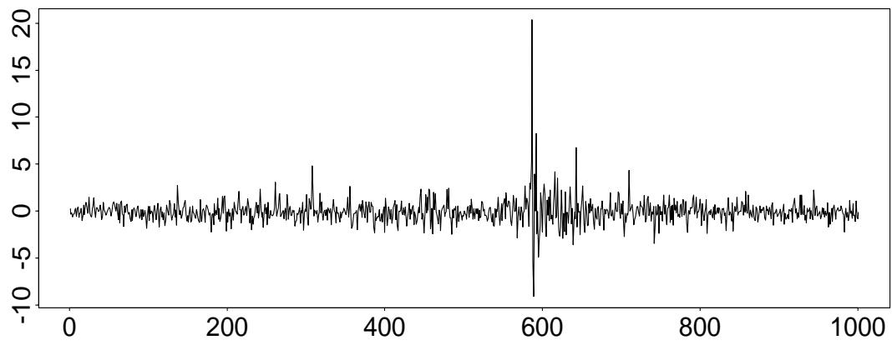
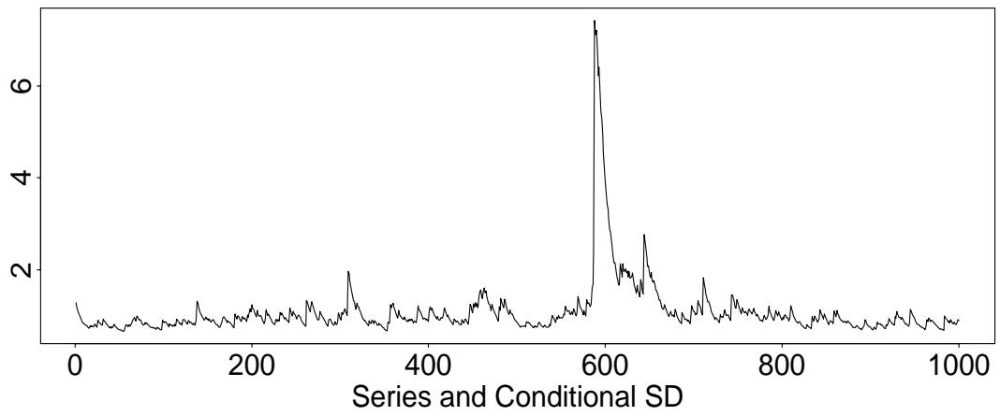
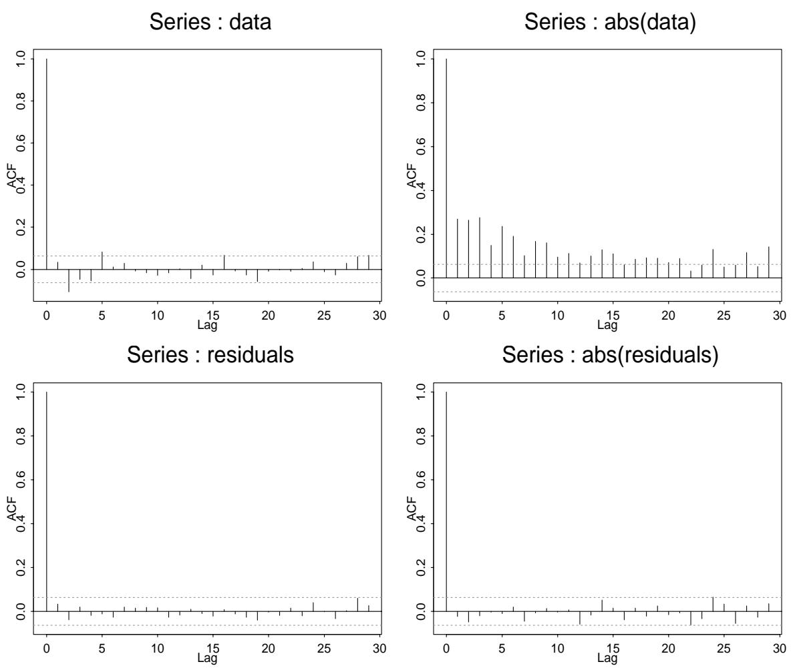
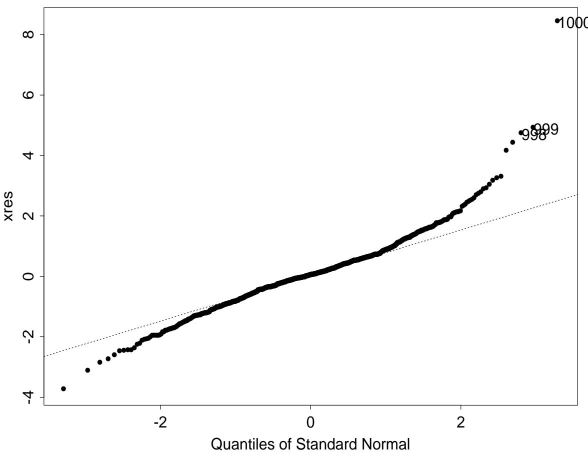
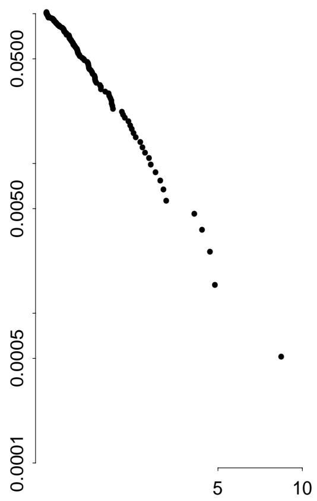
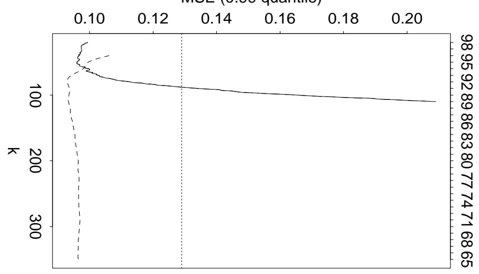
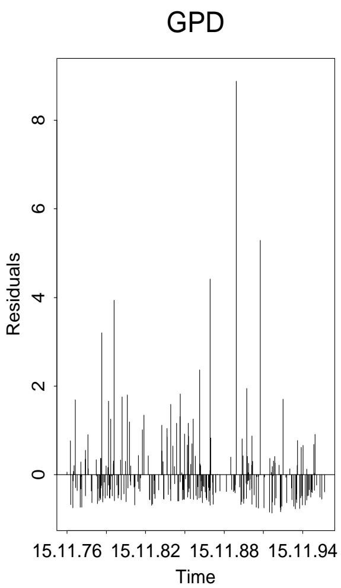

# 2000-mcneil-frey-tail-risk-evt

<!-- page: 1 -->

## Estimation of Tail-Related Risk Measures for Heteroscedastic Financial Time Series: an Extreme Value Approach

Alexander J. McNeil\* Department of Mathematics Federal Institute of Technology ETH Zentrum CH-8092 Zurich Tel: +41 1 632 61 62 Fax: +41 1 632 15 23 mcneil@math.ethz.ch Rüdiger Frey\* Swiss Banking Institute University of Zurich Plattenstrasse 14 CH-8032 Zurich Tel: +41 1 634 29 57 Fax: +41 1 634 49 03 freyr@isb.unizh.ch

June 19, 1999

## Abstract

We propose a method for estimating VaR and related risk measures describing the tail of the conditional distribution of a heteroscedastic financial return series. Our approach combines pseudo-maximum-likelihood fitting of GARCH models to estimate the current volatility and extreme value theory (EVT) for estimating the tail of the innovation distribution of the GARCH model. We use our method to estimate conditional quantiles (VaR) and conditional expected shortfalls (the expected size of a return exceeding VaR), this being an alternative measure of tail risk with better theoretical properties than the quantile. Using backtesting of historical daily return series we show that our procedure gives better one-day estimates than methods which ignore the heavy tails of the innovations or the stochastic nature of the volatility. With the help of our fitted models we adopt a Monte Carlo approach to estimating the conditional quantiles of returns over multiple-day horizons and find that this outperforms the simple square-root-of-time scaling method.

J.E.L. Subject Classification: C.22, G.10, G.21

Keywords: Risk Measures, Value at Risk, Financial Time Series, GARCH models, Extreme Value Theory, Backtesting

## 1 Introduction

The large increase in the number of traded assets in the portfolio of most financial institutions has made the measurement of market risk (the risk that a financial institution incurs losses on its trading book due to adverse market movements) a primary concern for regulators and for internal risk control. In particular, banks are now required to hold a certain amount of capital as a cushion against adverse market movements. According to the Capital Adequacy Directive by the Bank of International Settlement (BIS) in Basle, (Basle Comittee 1996) the risk capital of a bank must be sufficient to cover losses on the bank's trading portfolio over a ten-day holding period in 99% of occasions. This value is

\*We wish to thank Paul Embrechts, Peter Bühlmann, Daniel Straumann, Neil Shephard, an anonymous referee and seminar participants at UBS-Warburg Dillon Read for interesting remarks. The data on goldprices were obtained from the Finanzmarktdatenbank maintained by the SFB 303 at the University of Bonn. The binomial test in section 3 was suggested by Daniel Straumann. Financial support from Swiss Re (McNeil) and from UBS (Frey) is gratefully acknowledged.

<!-- page: 2 -->

usually referred to as Value at Risk (VaR). Of course, holding period and confidence level may vary according to application; for purposes of internal risk control most financial firms also use a holding period of one day and a confidence level of 95%. From a mathematical viewpoint VaR is simply a quantile of the Profit-and-Loss (P&L) distribution of a given portfolio over a prescribed holding period. Alternative measures of market risk have been proposed in the literature. In two recent papers, Artzner et al. (1997, 1998) show that VaR has various theoretical deficiencies as a measure of market risk; they propose the use of the so-called expected shortfall or tail conditional expectation instead. The expected shortfall measures the expected loss given that the loss L exceeds VaR; in mathematical terms it is given by E[L|L > VaR]. From a statistical viewpoint the main challenge in implementing one of these risk-measures is to come up with a good estimate for the tails of the underlying P&L distribution; given such an estimate both VaR and expected shortfall are fairly easy to compute. In this paper we are concerned with tail estimation for financial return series. Our basic idealisation is that returns follow a stationary time series model with stochastic volatility structure. There is strong empirical support for stochastic volatility in financial time series; see for instance Pagan (1996). The presence of stochastic volatility implies that returns are not necessarily independent over time. Hence with such models there are two types of return distribution to be considered - the conditional return distribution where the conditioning is on the current volatility and the marginal or stationary distribution of the process. Both distributions are of relevance to risk managers. A risk-manager who wants to measure the market risk of a given portfolio is mainly concerned with the possible extent of a loss caused by an adverse market movement over the next day (or next few days) given the current volatility background. His main interest is in the tails of the conditional return distribution, which are also the focus of the present paper. The estimation of unconditional tails provides different, but complementary information about risk. Here we take the long-term view and attempt to assign a magnitude to a specified rare adverse event, such as a 5-year loss (the size of a daily loss which occurs on average once every 5 years). This kind of information may be of interest to the risk manager who wishes to perform a scenario analysis and get a feeling for the scale of worst case or stress losses. In a referee's report the concern was raised that the use of conditional return distributions for market risk measurement might lead to capital requirements that fluctuate wildly over time and are therefore difficult to implement. Our answer to this important point is threefold: First, while it is admittedly impossible for a financial institution to rapidly adjust its capital base to changing market conditions, the firm might very well be able to adjust the size of its exposure instead. Moreover, besides providing a basis for the determination of risk capital, measures of market risk are also employed to give the management of a financial firm a better understanding of the riskiness of its portfolio, or parts thereof. We are convinced that the riskiness of a portfolio does indeed vary with the general level of market volatility, so that the current volatility background should be reflected in the risk-numbers reported to management. Finally, we think that the economic problem of defning an appropriate risk-measure for setting capital-adequacy standards should be separated from the statistical problem of estimating a given measure of market risk, which is the focus of the present paper. Schematically the existing approaches for estimating the P&L distribution of a portfolio of securities can be divided into three groups: the nonparametric historical simulation (HS) method; fully parametric methods based on an econometric model for volatility dynamics and the assumption of conditional normality (e.g. J.P. Morgan's Riskmetrics and most models from the ARCH/GARCH family); and finally methods based on extreme value theory (EVT) In the HS-approach the estimated P&L distribution of a portfolio is simply given by the

<!-- page: 3 -->

empirical distribution of past gains and losses on this portfolio. The method is therefore easy to implement and avoids “ad-hoc-assumptions" on the form of the P&L distribution. However, the method suffers from some serious drawbacks. Extreme quantiles are notoriously difficult to estimate, as extrapolation beyond past observations is impossible and extreme quantile estimates within sample tend to be very inefficient — the estimator is subject to a high variance. Furthermore, if we seek to mitigate these problems by considering long samples the method is unable to distinguish between periods of high and low volatility.

Econometric models of volatility dynamics that assume conditional normality, such as GARCH-models, do yield VaR estimates which reflect the current volatility background. The main weakness of this approach is that the assumption of conditional normality does not seem to hold for real data. As shown, for instance, in Danielsson and de Vries (1997c), models based on conditional normality are therefore not well-suited to estimating large quantiles of the P&L-distribution.1

The estimation of return distributions of financial time series via EVT is a topical issue which has given rise to some recent work (Embrechts, Resnick, and Samorodnitsky 1998b, Embrechts, Resnick, and Samorodnitsky 1998a, Longin 1997b, Longin 1997a, McNeil 1997, McNeil 1998, Danielsson and de Vries 1997b, Danielsson and de Vries 1997c, Danielsson Hartmann, and de Vries 1998). In all these papers the focus is on estimating the unconditional (stationary) distribution of asset returns. Longin (1997b) and McNeil (1998) use estimation techniques based on limit theorems for block maxima. Longin ignores the stochastic volatility exhibited by most financial return series and simply applies estimators for the iid-case. McNeil uses a similar approach but shows how to correct for the clustering of extremal events caused by stochastic volatility. Danielsson and de Vries (1997a,b) use a semiparametric approach based on the Hill-estimator of the tail index. Embrechts, Resnick, and Samorodnitsky (1998a) advocate the use of a parametric estimation technique which is based on a limit result for the excess-distribution over high thresholds. This approach will be adopted in this paper and explained in detail in Section 2.2.

EVT-based methods have two features which make them attractive for tail estimation: yhey are based on a sound statistical theory; they offer a parametric form for the tail of a distribution. Hence these methods allow for some extrapolation beyond the range of the data, even if care is required at this point. However, none of the previous EVT-based methods for quantile estimation yields VaR-estimates which reflect the current volatility background. Given the conditional heteroscedasticity of most financial data, which is welldocumented by the considerable success of the models from the ARCH/GARCH family, we believe this to be a major drawback of any kind of VaR-estimator.

In order to overcome the drawbacks of each of the above methods we combine ideas from all three approaches. We use GARCH-modelling and pseudo-maximum-likelihood estimation to obtain estimates of the conditional volatility. Statistical tests and exploratory data analysis confirm that the error terms or residuals do form, at least approximately, an iid series that exhibit heavy tails. We use historical simulation (for the central part of the distribution) and threshold methods from EVT (for the tails) to estimate the distribution of the residuals. The application of these methods is facilitated by the (approximate) independence over time of the residuals. An estimate of the conditional return distribution is now easily constructed from the estimated distribution of the residuals and estimates of the conditional mean and volatility. This approach reflects two stylized facts exhibited by most financial return series, namely stochastic volatility and the fat-tailedness of conditional return distributions over short time horizons.

1Note that the marginal distribution of a GARCH-model with normally distributed errors is usually fat-tailed as it is a a mixture of normal distributions. However, this matters only for quantile estimation over longer time-horizons; see e.g. Duffie and Pan (1997).

<!-- page: 4 -->

In a very recent paper Barone-Adesi, Bourgoin, and Giannopoulos (1998) have independently proposed an approach with some similarities to our own. They fit a GARCHmodel to a financial return series and use historical simulation to infer the distribution of the residuals. They do not use EVT-based methods to estimate the tails of the distribution of the residuals. Their approach may work well in large data sets — they use 13 years of daily data — where the empirical quantile provides a reasonable quantile estimator in the tails. With smaller data sets threshold methods from EVT will give better estimates of the tails of the residuals. During the revision of this paper we also learned that the central idea of our approach — the application of EVT to model residuals — has been independently proposed by Diebold, Schuermann, and Stroughair (1999).

We test our approach on various return series. Backtesting shows that it yields better estimates of VaR and expected shortfall than unconditional EVT or GARCH-modelling with normally distributed error terms. In particular, our analysis contradicts Danielsson and de Vries (1997c), who state that “an unconditional approach is better suited for VaR estimation than conditional volatility forecasts" (page 3 of their paper). On the other hand, we see that models with normally distributed conditional return distribution yield very bad estimates of the expected shortfall, so that there is a real need for working with leptokurtic error distributions. We also study quantile estimation over longer timehorizons using simulation. This is of interest, if we want to obtain an estimate of the 10-day VaR (as required by the BIS-rule) from a model fitted to daily data.

## 2 Methods

Let $( X _ { t } , t \in \mathbb { Z } )$ be a strictly stationary time series representing daily observations of the negative log return on a financial asset price.2 We assume that the dynamics of X are given by

$$
X _ { t } = \mu _ { t } + \sigma _ { t } Z _ { t } ,\tag{1}
$$

where the innovations $Z _ { t }$ are a strict white noise process (i.e. independent, identically distributed) with zero mean, unit variance and marginal distribution function $F _ { Z } ( z )$ . We assume that $\mu _ { t }$ and $\sigma _ { t }$ are measurable with respect to $\mathcal { G } _ { t - 1 }$ , the information about the return process available up to time $t - 1$

Let $F _ { X } ( x )$ denote the marginal distribution of $( X _ { t } )$ and, for a horizon $h \in \mathbb { N }$ let $F _ { X _ { t + 1 } + \ldots + X _ { t + h } | \mathcal { G } _ { t } } ( x )$ denote the predictive distribution of the return over the next h days, given knowledge of returns up to and including day t. We are interested in estimating quantiles in the tails of these distributions. For $0 < q < 1$ , an unconditional quantile is a quantile of the marginal distribution denoted by

$$
x _ { q } = \operatorname* { i n f } \left\{ x \in \mathbb { R } : F _ { X } ( x ) \geq q \right\} ,
$$

and a conditional quantile is a quantile of the predictive distribution for the return over the next h days denoted by

$$
x _ { q } ^ { t } ( h ) = \operatorname* { i n f } \left\{ x \in \mathbb { R } : F _ { X _ { t + 1 } + \ldots + X _ { t + h } | \mathcal { G } _ { t } } ( x ) \geq q \right\} .
$$

We also consider an alternative measure of risk for the tail of a distribution known as the expected shortfall. The unconditional expected shortfall is defined to be

$$
S _ { q } = E \left[ X \mid X > x _ { q } \right] ,
$$

2In the present paper we test our approach on return series generated by single assets only. However, the met hod obviously also applies to the time series of profits and losses generated by portfolios of financial instruments and can therefore by used for the estimation of market risk measures in a portfolio context.

<!-- page: 5 -->

and the conditional expected shortfall to be

$$
S _ { q } ^ { t } ( h ) = E \left[ \sum _ { j = 1 } ^ { h } X _ { t + j } \mid \sum _ { j = 1 } ^ { h } X _ { t + j } > x _ { q } ^ { t } ( h ) , \mathcal { G } _ { t } \right] .
$$

We are principally interested in quantiles and expected shortfalls for the 1-step predictive distribution, which we denote respectively by $x _ { q } ^ { t }$ and $S _ { q } ^ { t } .$ Since

$$
\begin{array} { r c l } { F _ { X _ { t + 1 } | \mathcal { G } _ { t } } ( x ) } & { = } & { P \left\{ \sigma _ { t + 1 } Z _ { t + 1 } + \mu _ { t + 1 } \leq x \mid \mathcal { G } _ { t } \right\} } \\ & { = } & { F _ { Z } ( ( x - \mu _ { t + 1 } ) / \sigma _ { t + 1 } ) , } \end{array}
$$

these measures simplify to

$$
\begin{array} { r c l } { x _ { q } ^ { t } } & { = } & { \mu _ { t + 1 } + \sigma _ { t + 1 } z _ { q } , } \end{array}\tag{2}
$$

$$
\begin{array} { r c l } { S _ { q } ^ { t } } & { = } & { \mu _ { t + 1 } + \sigma _ { t + 1 } E \left[ Z \mid Z > z _ { q } \right] , } \end{array}\tag{3}
$$

To implement an estimation procedure for these measures we must choose a specific process in the class (1), i.e. a particular model for the dynamics of the conditional mean and volatility. Many different models for volatility dynamics have been proposed in the econometric literature including models from the ARCH/GARCH family (Bollerslev, Chou, and Kroner 1992), HARCH processes (Müller, Dacarogna, Davé, Olsen, Pictet, and von Weizsäcker 1995) and stoc

where $z _ { q }$ is the upper qth quantile of the marginal distribution of $Z _ { t }$ which by assumption does not depend on t.

<!-- page: 6 -->

2. Consider the residuals to be a realisation of a strict white noise process and use extreme value theory (EVT) to model the tail of $F _ { Z } ( z )$ . Use this EVT model to estimate $z _ { q }$ for $q > 0 . 9 5$

We go into these stages in more detail in the next sections and illustrate them by means of an example using daily negative log returns on the Standard & Poors index.

## 2.1 Estimating $\sigma _ { t + 1 }$ and $\mu _ { t + 1 }$ using PML

For predictive purposes we fix a constant memory n so that at the end of day t our data consist of the last n negative log returns $( x _ { t - n + 1 } , \ldots , x _ { t - 1 } , x _ { t } )$ . We consider these to be a realisation from a $\mathrm { A R } ( 1 ) { \mathrm { - G A R C H } } ( 1 , 1 )$ process. Hence the conditional variance of the mean-adjusted series $\epsilon _ { t } = X _ { t } - \mu _ { t }$ is given by

$$
\sigma _ { t } ^ { 2 } = \alpha _ { 0 } + \alpha _ { 1 } \epsilon _ { t - 1 } ^ { 2 } + \beta \sigma _ { t - 1 } ^ { 2 } ,\tag{4}
$$

where $\alpha _ { 0 } > 0 , \alpha _ { 1 } > 0$ and $\beta > 0$ . The conditional mean is given by

$$
\mu _ { t } = \phi X _ { t - 1 } .\tag{5}
$$

This model is a special case of the general first order stochastic volatility process considered by Duan (1996), who uses a result by Brandt (1986) to give conditions for strict stationarity. The mean-adjusted series $\left( \epsilon _ { t } \right)$ is strictly stationary if

$$
E \left[ \log \left( \beta + \alpha _ { 1 } Z _ { t - 1 } ^ { 2 } \right) \right] < 0 .\tag{6}
$$

By using Jensen's inequality and the convexity of $- \log ( x )$ it is seen that a sufficient condition for (6) is that $\beta + \alpha _ { 1 } < 1$ , which moreover ensures that the marginal distribution $F _ { X } ( x )$ has a finite second moment.

This model is fitted using the pseudo-maximum-likelihood (PML) method. This means that the likelihood for a $\mathrm { G A R C H } ( 1 , 1 )$ model with normal innovations is maximized to obtain parameter estimates $\hat { \theta } = ( \hat { \phi } , \hat { \alpha _ { 0 } } , \hat { \alpha } _ { 1 } , \hat { \beta } ) ^ { T }$ . Whilst this amounts to fitting a model using a distributional assumption we do not necessarily believe, the PML method delivers reasonable parameter estimates. In fact, it can be shown that the PML method yields a consistent and asymptotically normal estimator; see for instance Chapter 4 of Gouriéroux (1997).

Estimates of the conditional mean and standard deviation series $\left( \hat { \mu } _ { t - n + 1 } , \ldots , \hat { \mu } _ { t } \right)$ and $\left( \hat { \sigma } _ { t - n + 1 } , \ldots , \hat { \sigma } _ { t } \right)$ can be calculated recursively from (4) and (5) after substitution of sensible starting values. In Figure 1 we show an arbitrary thousand day excerpt from our dataset containing the stock market crash of October 1987; the estimated conditional standard deviation derived from the GARCH fit is shown below the series

Residuals are calculated both to check the adequacy of the GARCH modelling and to use in Stage 2 of the method. They are calculated as

$$
\left( z _ { t - n + 1 } , \ldots , z _ { t } \right) = \left( \frac { x _ { t - n + 1 } - \hat { \mu } _ { t - n + 1 } } { \hat { \sigma } _ { t - n + 1 } } , \ldots , \frac { x _ { t } - \hat { \mu } _ { t } } { \hat { \sigma } _ { t } } \right) ,
$$

and should be iid if the fitted model is tenable. In Figure 2 we plot correlograms for the raw data and their absolute values as well as for the residuals and absolute residuals While the raw data are clearly not iid, this assumption may be tenable for the residuals.3

If we are satisfied with the fitted model, we end stage 1 by calculating estimates of the conditional mean and variance for day $t + 1$ , which are the obvious 1-step forecasts

$$
\begin{array} { r c l } { { { \hat { \mu } } _ { t + 1 } } } & { { = } } & { { { \hat { \phi } } x _ { t } , } } \\ { { { \hat { \sigma } } _ { t + 1 } ^ { 2 } } } & { { = } } & { { { \widehat { \alpha _ { 0 } } } + { \widehat { \alpha _ { 1 } } } { \hat { \epsilon } } _ { t } ^ { 2 } + { \hat { \beta } } { \hat { \sigma } } _ { t } ^ { 2 } , } } \end{array}
$$

where êt = xt − µt.

3We also ran some Ljung-Box tests in selected time periods and found no evidence against the iidhypothesis for the residuals.

<!-- page: 7 -->

## 2.2 Estimating $z _ { q }$ using EVT

We begin stage 2 by forming a QQ-Plot of the residuals against the normal distribution to confirm that an assumption of conditional normality is unrealistic, and that the innovation process has fat tails or is leptokurtic – see Figure 3.

We then fix a high threshold u and we assume that excess residuals over this threshold have a generalized Pareto distribution (GPD) with df

$$
G _ { \xi , \beta } ( y ) = { \left\{ \begin{array} { l l } { 1 - ( 1 + \xi y / \beta ) ^ { - 1 / \xi } } & { { \mathrm { i f ~ } } \xi \neq 0 , } \\ { 1 - \exp ( - y / \beta ) } & { { \mathrm { i f ~ } } \xi = 0 , } \end{array} \right. }
$$

where $\beta > 0$ , and the support is $y \geq 0$ when $\xi \ge 0$ and $0 \le y \le - \beta / \xi$ when $\xi < 0$

This particular distributional choice is motivated by a limit result in EVT. Consider a general df F and the corresponding excess distribution above the threshold u given by

$$
F _ { u } ( y ) = P \left\{ X - u \leq y \mid X > u \right\} = { \frac { F ( y + u ) - F ( u ) } { 1 - F ( u ) } } ,
$$

for $0 \leq y < x _ { 0 } - u$ , where $x _ { 0 }$ is the (finite or infinite) right endpoint of $F .$ Balkema and de Haan (1974) and Pickands (1975) showed for a large class of distributions $F$ that it is possible to find a positive measurable function $\beta ( u )$ such that

$$
\operatorname* { l i m } _ { u \to x _ { 0 } } \operatorname* { s u p } _ { 0 \leq y < x _ { 0 } - u } | F _ { u } ( y ) - G _ { \xi , \beta ( u ) } ( y ) | = 0 .\tag{7}
$$

For more details consult Theorem 3.4.13 on page 165 of Embrechts, Klüppelberg, and Mikosch (1997).

In the class of distributions for which this result holds are essentially all the common continuous distributions of statistics,4 and these may be further subdivided into three groups according to the value of the parameter $\xi$ in the limiting GPD approximation to the excess distribution. The case $\xi > 0$ corresponds to heavy-tailed distributions whose tails decay like power functions, such as the Pareto, Student's t, Cauchy, Burr, loggamma and Fréchet distributions. The case $\xi = 0$ corresponds to distributions like the normal, exponential, gamma and lognormal, whose tails essentially decay exponentially. The final group of distributions are short-tailed distributions $( \xi < 0 )$ with a finite right endpoint. such as the uniform and beta distributions.

We assume the the tail of the underlying distribution begins at the threshold $u .$ From our sample of n points a random number $N = N _ { u } > 0$ will exceed this threshold. If we assume that the N excesses over the threshold are iid with exact GPD distribution, Smith (1987) has shown that maximum likelihood estimates $\hat { \xi } = \hat { \xi } _ { N }$ and ${ \hat { \boldsymbol { \beta } } } = { \hat { \boldsymbol { \beta } } } _ { N }$ of the GPD parameters $\xi$ and $\beta$ are consistent and asymptotically normal as $N \infty$ provided $\xi > - 1 / 2$ Under the weaker assumption that the excesses are iid from $F _ { u } ( y )$ which is only approximately GPD he also obtains asymptotic normality results for $\hat { \xi }$ and ${ \hat { \boldsymbol { \beta } } } .$ By letting $u = u _ { n } \to x _ { 0 }$ and $N = N _ { u } \to \infty { \mathrm { ~ a s ~ } } n \to \infty$ he shows essentially that the procedure is asymptotically unbiased provided that $u x _ { 0 }$ sufficiently fast. The necessary speed depends on the rate of convergence in (7). In practical terms this means that our best GPD estimator of the excess distribution is obtained by trading bias off against variance. We choose u high to reduce the chance of bias whilst keeping N large (i.e. u low) to control the variance of the parameter estimates. The choice of u (or N) is the most important implementation issue in EVT and we discuss this issue in the context of finite samples from typical return distributions in Section 2.3.

4More precisely, the class comprises all distributions in the maximum domain of attraction of an extreme value distribution.

<!-- page: 8 -->

Consider now the following equality for points $x > u$ in the tail of $F$

$$
1 - F ( x ) = ( 1 - F ( u ) ) \left( 1 - F _ { u } ( x - u ) \right) .\tag{8}
$$

If we estimate the first term on the right hand side of (8) using the random proportion of the data in the tail $N / n$ , and if we estimate the second term by approximating the excess distribution with a generalized Pareto distribution fitted by maximum likelihood, we get the tail estimator

$$
\widehat { F ( x ) } = 1 - \frac { N } { n } \left( 1 + \hat { \xi } \frac { x - u } { \hat { \beta } } \right) ^ { - 1 / \hat { \xi } } ,
$$

for $x > u .$ Smith (1987) also investigates the asymptotic relative error of this estimator and gets a result of the form

$$
N ^ { { 1 } / { 2 } } \left( \frac { 1 - \widehat { F ( x ) } } { 1 - F ( x ) } - 1 \right) \stackrel { d } { \to } N ( 0 , v ^ { 2 } ) ,
$$

as $u = u _ { n } \to x _ { 0 }$ and $N = N _ { u } \to \infty$ ,where the asymptotic unbiasedness again requires that $u x _ { 0 }$ sufficiently fast.

In practice we will actually modify the procedure slightly and fix the number of data in the tail to be $N \ = \ k$ where $k \ll n$ This effectively gives us a random threshold at the $( k + 1 )$ th order statistic. Let $z _ { ( 1 ) } ~ \ge ~ z _ { ( 2 ) } ~ \ge ~ . ~ . ~ \ge ~ z _ { ( n ) }$ represent the ordered residuals. The generalized Pareto distribution with parameters ξ and $\beta$ is fitted to the data $( z _ { ( 1 ) } - z _ { ( k + 1 ) } , \dots , z _ { ( k ) } - z _ { ( k + 1 ) } )$ , the excess amounts over the threshold for all residuals exceeding the threshold. The form of the tail estimator for $F _ { Z } ( z )$ is then

$$
\widehat { F _ { Z } ( z ) } = 1 - \frac { k } { n } \left( 1 + \hat { \xi } \frac { z - z _ { ( k + 1 ) } } { \hat { \beta } } \right) ^ { - 1 / \hat { \xi } } .\tag{9}
$$

For $q > 1 - k / n$ we can invert this tail formula to get

$$
\widehat { z _ { q } } = \widehat { z _ { q , k } } = z _ { ( k + 1 ) } + \frac { \hat { \beta } } { \hat { \xi } } \left( \left( \frac { 1 - q } { k / n } \right) ^ { - \hat { \xi } } - 1 \right) ;\tag{10}
$$

we use the $\widehat { z _ { q , k } }$ notation when we want to emphasize the dependence of the estimator on the choice of k and the simpler $\widehat { z _ { q } }$ notation otherwise.

In Table 1 we give threshold values and GPD parameter estimates for both tails of the innovation distribution of the test data in the case that $n = 1 0 0 0$ and $k = 1 0 0 ;$ we discuss this choice of k in Section 2.3. In Figure 4 we show the corresponding tail estimators (9). We are principally interested in the left picture marked Losses which corresponds to large positive residuals. The solid lines in both pictures correspond to the GPD tail estimates and can be seen to model the residuals well. Also shown is a dashed line which corresponds to the standard normal distribution and a dotted line which corresponds to the estimated conditional t distribution (scaled to have variance 1) in a GARCH model with t-innovations. The normal distribution clearly underestimates the extent of large losses and also of the largest gains, which we would already expect from the QQ-plot. The t-distribution, on the other hand, underestimates the losses and overestimates the gains. This illustrates the drawbacks of using a symmetric distribution with data which are asymmetric in the tails.

With more symmetric data the conditional t-distribution often works quite well and it can, in fact, be viewed as a special case of our method. As already mentioned, it is an example of a heavy-tailed distribution, i.e. a distribution whose limiting excess distribution is GPD with $\xi > 0$ . Gnedenko (1943) characterized all such distributions as having tails of the form

<!-- page: 9 -->

[Table source crop](assets/tables/2000-mcneil-frey-tail-risk-evt-p0009-block-0001-35fdbcaf4446ba6f.jpg)
Table 1: Threshold values and maximum likelihood GPD parameter estimates used in the construction of tail estimators for both tails of the innovation distribution of the test data. Note that $k = 1 0 0$ in both cases. Standard errors (s.e.s) are calculated using a standard likelihood approach based on the observed Fisher information matrix.

$$
1 - F ( x ) = x ^ { - 1 / \xi } L ( x ) ,\tag{11}
$$

where $L ( x )$ is a slowly varying function and $\xi$ is the positive parameter of the limiting GPD. $1 / \xi$ is often referred to as the tail index of F. For the t-distribution with ν degrees of freedom the tail can be shown to satisfy

$$
1 - F ( x ) \sim \frac { \nu ^ { ( \nu - 2 ) / 2 } } { B ( 1 / 2 , \nu / 2 ) } x ^ { - \nu } ,\tag{12}
$$

where $B ( a , b )$ denotes the beta function, so that this provides a very simple example of a symmetric distribution in this class, and the value of ξ in the limiting GPD is the reciprocal of the degrees of freedom (see McNeil and Saladin (1997)).

Fitting a GARCH model with t innovations can be thought of as estimating the ξ in our GPD tail estimator by simpler means. Inspection of the form of the likelihood of the t-distribution shows that the estimate of ν will be sensitive mainly to large observations so that it is not surprising that the method gives a reasonable fit in the tails although all data are used in the estimation. Our method has, however, the advantage that we have an explicit model for each tail. We estimate two parameters in each case, which gives a better fit in general.

We also use the GPD tail estimator (9) to estimate the right tail of the negative return distribution $F _ { X } ( x )$ by applying it directly to the raw return data xt-n+1,... , xt; in this way we calculate an unconditional quantile estimate $\hat { x } _ { q }$ using unconditional EVT. We investigate whether this approach also provides reasonable estimates of $x _ { q } ^ { t } .$ It should however be noted that the assumption of independent excesses over threshold is much less satisfactory for the raw return data. The asymptotics of the GPD-based tail estimator are therefore much more poorly understood if applied directly to the raw return data.

Even if the procedure can be shown to be asymmptotically justified, in practice it is likely to give much more unstable results when applied to non-iid, finite sample data. Embrechts, Klüppelberg, and Mikosch (1997) provide a related example (see Figure 5.5.4. on page 270); they construct a first order autoregressive AR(1) process driven by a symmetric, heavy-tailed, iid noise, so that both noise distribution and marginal distribution of the process have the same tail index. They apply the Hill estimator (an alternative EVT procedure described in Section 2.3) to simulated data from the process and also to residuals obtained after fitting an AR(1) model to the raw data and find estimates of the tail index to be much more accurate and stable for the residuals, although the Hill estimator is theoretically consistent in both cases. This example supports the idea that pre-whitening of data through fitting of a dynamic model may be a sensible prelude to EVT analysis in practice.

<!-- page: 10 -->

## 2.3 Simulation study of threshold choice

To investigate the issue of threshold choice (i.e. choice of k) we perform a small simulation study. We also use this study to compare the GPD approach to tail estimation with the approach based on the Hill estimator and the approach based on the empirical distribution function (historical simulation).

The Hill estimator (Hill 1975) is designed for data from heavy-tailed distributions admitting the representation (11) with $\xi ~ > ~ 0$ The estimator for $\xi ,$ based on the k exceedances of the $( k + 1 )$ th order statistic, is

$$
\hat { \xi } ^ { ( H ) } = \hat { \xi } _ { k } ^ { ( H ) } = k ^ { - 1 } \sum _ { j = 1 } ^ { k } \log z _ { ( j ) } - \log z _ { ( k + 1 ) } ,
$$

and an associated quantile estimator is

$$
\widehat { z _ { q } } ^ { ( H ) } = \widehat { z _ { q , k } } ^ { ( H ) } = z _ { ( k + 1 ) } \left( \frac { 1 - q } { k / n } \right) ^ { - \widehat { \xi } ^ { ( H ) } } ;\tag{13}
$$

see Danielsson and de Vries (1997b) for details. The properties of these estimators have been extensively investigated in the EVT literature; in particular, a number of recent papers show consistency of the Hill estimator for dependent data (Resnick and Stărică 1995, Resnick and Stărică 1996) and develop bootstrap methods for optimal choice of the threshold $z _ { ( k + 1 ) } ( \mathrm { D }$ anielsson and de Vries 1997a).

In the simulation study we generate samples of size $n ~ = ~ 1 0 0 0$ from Student's tdistribution which, as we have observed, provides a rough approximation to the observed distribution of model residuals. The size of sample corresponds to the window length we use in applications of the two-step method. From (12) we know the tail index of the t-distribution and quantiles are easily calculated. We calculate $\hat { \xi } _ { k }$ and $\widehat { z _ { q , k } }$ (the maximumlikelihood and GPD-based estimators of $\xi$ and $z _ { q }$ based on k threshold exceedances) as well as $\hat { \xi } _ { k } ^ { ( H ) }$ and $\widehat { z _ { q , k } } ^ { ( H ) }$ for various values of $k ;$ for the quantile estimates we restrict our attention to values of k such that $k > 1 0 0 0 ( 1 - q )$ , so that the target quantile is beyond the threshold. Of interest are the mean squared errors (MSEs) and biases of these estimators, and the dependence of these errors on the choice of k. For each estimator we estimate MSE and bias using Monte Carlo estimates based on 1000 independent samples For example, we estimate $\operatorname { M S E } ( \widehat { z _ { q , k } } )$ by

$$
\widehat { \mathrm { M S E } } ( \widehat { z _ { q , k } } ) = \sum _ { j = 1 } ^ { 1 0 0 0 } \left( \widehat { z _ { q , k } } ^ { ( j ) } - z _ { q } \right) ^ { 2 } ,
$$

where $\widehat { z _ { q , k } } ^ { ( j ) }$ represents the quantile estimate obtained from the jth sample

Although the Hill estimator is generally the most efficient estimator of ξ (it gives the lowest MSE for sensibly chosen k) it does not provide the most efficient nor the most stable quantile estimator. Our simulations suggest that the GPD method should be preferred for estimating high quantiles.

An example is given in Figure 5. We plot the bias and MSE of estimators of the 99th percentile against k, in the case that the degrees of freedom of the t-distribution is $\nu = 4$ The Hill estimator is marked with a solid line, the GPD estimator is marked with a dashed line and the empirical HS-estimate $z _ { ( 1 1 ) }$ of the quantile is marked by a dotted line.

The Hill method has a negative bias for low values of k that becomes positive and then grows rapidly with k; the GPD estimator has a positive bias that grows much more slowly; the empirical estimate has a negative bias. The MSE reveals more about the relative merits of the methods: the GPD estimator attains its lowest value corresponding to a k value of about 100 but, more importantly, the MSE is very robust to the choice of k because of the slow growth of the bias. The Hill method performs well for $k \leq 7 0$ but then deteriorates rapidly. The HS method is obviously less efficient than the two EVT methods, which shows that EVT does indeed give more precise estimates of the 99th percentile based on samples of size 1000 from the t-distribution.

<!-- page: 11 -->

For the 99th percentile both the GPD and Hill estimators are clearly useful, if used correctly. In the case of GPD we must ensure that the variance of the estimator is kept low by setting k sufficiently high, but as long as k is greater than about 50 the method is robust; the issue of choosing an optimal threshold does not seem so critical for the GPD method. For the Hill method it is more important because the efficient range for k is smaller; it is important that the bias be kept under control by choosing a low k.

In this paper we only show results for the t-distribution with four degrees of freedom, but further simulations suggest that the same qualitative conclusions hold for other values of ν and other heavy-tailed distributions. For estimating more distant quantiles we observe that the GPD method appears to be more efficient than the Hill method and maintains its relative stability with respect to choice of k. The greater complexity of the GPD quantile estimator, which involves a second estimated scale parameter $\hat { \boldsymbol \beta }$ as well as the tail index estimator $\hat { \xi } ^ { - 1 }$ , seems to lead to better finite sample performance.

## 2.4 Summary: Advantages of the GPD approach

We favour the GPD approach to tail estimation in this paper for a variety of reasons that we list below.

• In finite samples of the order of 1000 points from typical return distributions EVT quantile estimators (whether maximum-likelihood and GPD-based or Hill-based) are more efficient than the historical simulation method.

• The GPD-based quantile estimator is more stable (in terms of mean squared error) with respect to choice of k than the Hill quantile estimator. In the present application a k value of 100 seems reasonable, but we could equally choose to use k values of 80 or 150.

• For high quantiles with $q \geq 0 . 9 9$ the GPD method is at least as efficient as the Hill method.

• The GPD method allows effective estimates of expected shortfall to be constructed as will be described in Section 4.

• The GPD method is applicable to light-tailed data $( \xi = 0 )$ or even short-tailed data $( \xi < 0 )$ , whereas the Hill method is designed specifically for the heavy-tailed case $( \xi > 0 )$ . There are periods when the conditional distribution of financial returns appears light-tailed rather than heavy-tailed.

## 3 Backtesting

We backtest the method on five historical series of log returns: the Standard & Poors index from January 1960 to June 1993, the DAX index from January 1973 to July 1996, the BMW share price over the same period, the US dollar British pound exchange rate from January 1980 to May 1996 and the price of gold from January 1980 to December 1997.

To backtest the method on a historical series $x _ { 1 } , \ldots x _ { m }$ , where $m \gg n$ , we calculate $\hat { x } _ { q } ^ { t }$ on days t in the set $T = \{ n , \dots , m - 1 \}$ using a time window of n days each time. In our implementation we have set $n = 1 0 0 0$ so that we use somewhat less than the last four years of data for each prediction. In a long backtest it is less feasible to examine the fitted model carefully every day and to choose a new value of k for the tail estimator each time; for this reason we always set $k = 1 0 0$ in these backtests, a choice that is supported by the simulation study of the previous section. This means effectively that the 90th percentile of the innovation distribution is estimated by historical simulation, but that higher percentiles are estimated using the GPD tail estimator. On each day $t \in T$ we fit a new AR(1)-GARCH(1,1) model and determine a new GPD tail estimate. Figure 6 shows part of the backtest for the DAX index. We have plotted the negative log returns for a three year period commencing on the first of October 1987; superimposed on this plot is the EVT conditional quantile estimate $\hat { x } _ { 0 . 9 9 } ^ { t }$ (dashed line) and the EVT unconditional quantile estimate ${ \hat { x } } _ { 0 . 9 9 }$ (dotted line).

<!-- page: 12 -->

We compare $\hat { x } _ { a } ^ { t }$ with $x _ { t + 1 }$ for $q \ \in \ \{ 0 . 9 5 , 0 . 9 9 , 0 . 9 9 5 \}$ . A violation is said to occur whenever $x _ { t + 1 } > \hat { x } _ { q } ^ { \bar { t } }$ The violations corresponding to the backtest in Figure 6 are shown in Figure 7. We use different plotting symbols to show violations of the conditional EVT, conditional normal and unconditional EVT quantile estimates. In Figure 8 the portion of Figure 7 relating to the crash of October 1987 has been enlarged.

[Table source crop](assets/tables/2000-mcneil-frey-tail-risk-evt-p0012-block-0003-65e399ab763835d1.jpg)
Table 2: Backtesting Results: Theoretically expected number of violations and number of violations obtained using our approach (conditional EVT), a GARCH-model with normally distributed innovations, a GARCH-model with Student t-innovations, and quantile estimates obtained from unconditional EVT for various return series. p-values for a binomial test are given in brackets.

It is possible to develop a binomial test of the success of these quantile estimation methods based on the number of violations. If we assume the dynamics described in (1), the indicator for a violation at time $t \in T$ is Bernoulli

$$
I _ { t } : = 1 _ { \{ X _ { t + 1 } > x _ { q } ^ { t } \} } = 1 _ { \{ Z _ { t + 1 } > z _ { q } \} } \sim B e ( 1 - q ) .
$$

Moreover, $I _ { t }$ and $I _ { s }$ are independent for $t , s \in T$ and $t \neq s ,$ since $Z _ { t + 1 }$ and $Z _ { s + 1 }$ are

<!-- page: 13 -->

independent. Therefore

$$
\sum _ { t \in T } I _ { t } \sim B \left( \mathrm { c a r d } ( T ) , 1 - q \right) ,
$$

i.e. the total number of violations is binomially distributed under the model.

Under the null hypothesis that a method correctly estimates the conditional quantiles, the empirical version of this statistic $\textstyle \sum _ { t \in T } { 1 _ { \left\{ x _ { t + 1 } > { \hat { x } } _ { q } ^ { t } \right\} } }$ is from the binomial distribution $B \left( \mathrm { c a r d } ( T ) , 1 - q \right)$ . We perform a two-sided binomial test of the null hypothesis against the alternative that the method has a systematic estimation error and gives too few or too many violations.⁵The corresponding binomial probabilities are given in Table 2 alongside the numbers of violations for each method. A p-value less than or equal to 0.05 will be interpreted as evidence against the null hypothesis.

In 11 out of 15 cases our approach is closest to the mark. On two occasions GARCH with conditional t innovations is best and on one occasion GARCH with conditional normal innovations is best. In one further case our approach and the conditional t approach are joint best. On no occasion does our approach fail (lead to rejection of the null hypothesis), whereas the conditional normal approach fails 11 times; unconditional EVT fails three times. Figures 7 and 8 give some idea of how the latter two methods fail. The conditional normal estimate of $x _ { 0 . 9 9 } ^ { t }$ like the conditional EVT estimate responds to changing volatility but tends to be violated rather more often, because it does not take into account the leptokurtosis of the residuals. The unconditional EVT estimate cannot respond quickly to changing volatility and tends to be violated several times in a row in stress periods.

## 4 Expected Shortfall

In two recent papers Artzner et. al (1997, 1998) have criticized quantile-based riskmeasures such as VaR as a measure of market risk on two grounds. First they show that VaR is not necessarily subadditive, i.e. there are cases where a portfolio can be split into sub-portfolios such that the sum of the VaR corresponding to the sub-portfolios is smaller than the VaR of the total portfolio. They explain that this may cause problems, if one bases a risk-management system of a financial institution on VaR-limits for individual books. Moreover, VaR gives only an upper bound on the losses that occur with a given frequency; VaR tells us nothing about the potential size of the loss given that a loss exceeding this upper bound has occurred. The expected shortfall, as defined in Section 2, is an alternative risk measure to the quantile which overcomes the theoretical deficiencies of the latter. In particular, this risk measure gives some information about the size of the potential losses given that a loss bigger than VaR has occurred

In this section we discuss methods for estimating the expected shortfall in our models. Moreover, we develop an approach for backtesting our estimates. Not surprisingly, we find that the estimates of expected shortfall are very sensitive to the choice of the model for the tail of the return distribution. In particular, while the conditional 0.95 quantile estimates derived under the GPD and normal assumptions typically do not differ greatly, we find that the same is not true of estimates of the expected shortfall at this quantile. It is thus much more problematic to base estimates of the conditional expected shortfall at even the 0.95 quantile on an assumption of conditional normality when there is evidence that the residuals are heavy-tailed.

5See also Christoffersen, Diebold, and Schuermann (1998) for related work on tests of data on VaR violations.

<!-- page: 14 -->

## 4.1 Estimation

We recall from (3) that the conditional (1-step) expected shortfall is given by

$$
S _ { q } ^ { t } = \mu _ { t + 1 } + \sigma _ { t + 1 } E \left[ Z \mid Z > z _ { q } \right] .
$$

To estimate this risk measure we require an estimate of the expected shortfall for the innovation distribution $E \left[ Z \mid Z > z _ { q } \right]$ . For a random variable W with an exact GPD distribution with parameters $\xi < 1$ and $\beta$ it can be verified that

$$
E \left[ W \mid W > w \right] = \frac { w + \beta } { 1 - \xi } ,\tag{14}
$$

where $\beta + w \xi > 0$ . Suppose that excesses over the threshold u have exactly this distribution, i.e. $Z - u \mid Z > u \sim G _ { \xi , \beta }$ . By noting that for $z _ { q } > u$ we can write

$$
Z - z _ { q } \mid Z > z _ { q } = ( Z - u ) - ( z _ { q } - u ) \mid ( Z - u ) > ( z _ { q } - u ) ,
$$

it can be easily shown that

$$
Z - z _ { q } \mid Z > z _ { q }
$$

<!-- page: 15 -->

as $x \infty ,$ from which it is clear that the expected shortfall to quantile ratio converges to one as $q 1 . { } ^ { 6 }$ This can be compared with the limit in the GPD case; for $\xi > 0$ the ratio converges to $( 1 - \xi ) ^ { - 1 } > 1$ as $q 1 ;$ for $\xi \le 0$ the ratio converges to 1.

In Table 3 we give values for $E \left[ Z \mid Z > z _ { q } \right] / z _ { q }$ in the GPD $( \xi > 0 )$ and normal cases For the value of the threshold u and the GPD parameters ξ and $\beta$ we have taken the values obtained from our analysis of the positive residuals from our test data (see Table 1). The table shows that when the innovation distribution is heavy-tailed the expected shortfall to quantile ratio is considerably larger than would be expected under an assumption of normality. It also shows that, at the kind of probability levels that interest us, the ratio is considerably larger than its asymptotic value so that scaling quantiles with the asymptotic ratio would tend to lead to an underestimation of expected shortfall.

[Table source crop](assets/tables/2000-mcneil-frey-tail-risk-evt-p0015-block-0003-24bea8c085df5e05.jpg)
Table 3: Values of the expected shortfall to quantile ratio for various quantiles of the noise distribution under two different distributional assumptions. In the first row we assume that excesses over the threshold $u = 1 . 2 1 5$ have an exact GPD distribution with parameters $\xi = 0 . 2 2 4$ and $\beta = 0 . 5 6 8$ (see Table 1). In the second row we assume that the innovation distribution is standard normal.

## 4.3 Backtesting

It is possible to develop a test along similar lines to the binomial test of quantile violation to verify that the GPD-based method gives much better estimates of the conditional expected shortfall than the normal method for our datasets. This time we are interested in the size of the discrepancy between $X _ { t + 1 }$ and $S _ { q } ^ { t }$ in the event of quantile violation. We define residuals

$$
R _ { t + 1 } = \frac { X _ { t + 1 } - S _ { q } ^ { t } } { \sigma _ { t + 1 } } = Z _ { t + 1 } - E \left[ Z \mid Z > z _ { q } \right] .
$$

It is clear that under our model (1) these residuals are iid and that, conditional on $\{ X _ { t + 1 } > x _ { q } ^ { t } \}$ or equivalently $\{ Z _ { t + 1 } > z _ { q } \}$ , they have expected value zero.

Suppose we again backtest on days in the set T. We can form empirical versions of these residuals on days when violation occurs, i.e. days on which $x _ { t + 1 } > x _ { q } ^ { t } .$ We will call these residuals exceedance residuals and denote them by

$$
\left\{ r _ { t + 1 } : t \in T , x _ { t + 1 } > \hat { x } _ { q } ^ { t } \right\} , \mathrm { w h e r e } r _ { t + 1 } = \frac { x _ { t + 1 } - \hat { S } _ { q } ^ { t } } { \hat { \sigma } _ { t + 1 } } ,
$$

where $\hat { S } _ { q } ^ { t }$ is an estimate of the shortfall. Under the null hypothesis that we correctly estimate the dynamics of the process $( \mu _ { t + 1 }$ and $\sigma _ { t + 1 } )$ and the frst moment of the truncated innovation distribution $\left( E [ Z \mid Z > z _ { q } ] \right)$ , these residuals should behave like an iid sample with mean zero. In Figure 9 we show these exceedance residuals for the BMW series and $q = 0 . 9 5$ . Clearly for residuals calculated under an assumption of conditional normality the null hypothesis seems doubtful.

To test the hypothesis of mean zero we use a bootstrap test that makes no assumption about the underlying distribution of the residuals (see page 224 of Efron and Tibshirani (1993)). We conduct a one-sided test against the alternative hypothesis that the residuals have mean greater than zero or, equivalently, that conditional expected shortfall is systematically underestimated, since this is the likely direction of failure. The residuals derived under an assumption of normality always fail the test with p-values in all cases much less than 0.01; we conclude that an assumption of conditional normality is useless for the purposes of calculating expected shortfall.

6A useful approximation to Mill’ ratio for x values in the range [Φ−1(0.95), Φ−1(0.995)] is κ(x) ≈ x (1 + (√1 + 8/x2 − 1)/4) ; see Johnson and Kotz (1970) for details.

<!-- page: 16 -->

On the other hand, the GPD-based residuals are much more plausibly mean zero. In the following Table 4 we give p-values for the test applied to the GPD residuals for all five test series and various values of q. The most problematic series are the two indices (S&P and $\mathrm { D A X } ) { \mathrm { ; } }$ for the former the null hypothesis is rejected (at the 5% level) for $q = 0 . 9 9$ and $q = 0 . 9 9 5 ;$ for the latter the null hypothesis is rejected for $q = 0 . 9 9 5$ . The null hypothesis is also rejected for the Gold price returns series and $q = 0 . 9 9$ . In all other cases it is not rejected and for the BMW and USD-GBP series the hypothesis of zero-mean seems quite strongly supported.

[Table source crop](assets/tables/2000-mcneil-frey-tail-risk-evt-p0016-block-0003-f140ab5c012b2144.jpg)
Table 4: p-values for a one-sided bootstrap test of the hypothesis that the exceedance residuals in the GPD case have mean zero against the alternative that the mean is greater than zero.

## 5 Multiple Day Returns

In this section we consider estimates of $x _ { q } ^ { t } ( h )$ for $h > 1$ . Among other reasons, this is of interest, if we want to obtain an estimate of the 10-day VaR (as required by the BISrule) from a model fitted to daily data. For GARCH-models $F _ { X _ { t + 1 } + \ldots + X _ { t + h } | \mathcal { G } _ { t } } ( x )$ is not known analytically even for a known innovation distribution, so we adopt a simulation approach to obtaining these estimates as follows. Working with the last n negative log returns we fit as before the $\mathrm { A R } ( 1 ) { \mathrm { - G A R C H } } ( 1 , 1 )$ model and this time we estimate both tails of the innovation distribution $F _ { Z } \left( z \right) . \ \hat { \xi } ^ { ( \mathrm { i } ) }$ and $\hat { \boldsymbol \beta } ^ { ( 1 ) }$ are used to denote the estimated parameters of the GPD excess distribution for the positive tail and $\hat { \xi } ^ { ( 2 ) }$ and $\hat { \boldsymbol \beta } ^ { ( 2 ) }$ denote the corresponding parameters for the negative tail.

We simulate iid noise from the innovation distribution by a combination of bootstrap and GPD simulation according to the following algorithm which was also proposed independently by Danielsson and de Vries (1997c).

1. Randomly select a residual from the sample of n residuals.

2. If the residual exceeds $z _ { ( k + 1 ) }$ sample a $\mathrm { G P D } ( \hat { \xi } ^ { ( 1 ) } , \hat { \beta } ^ { ( 1 ) } )$ distributed excess $y _ { 1 }$ from the right tail and return $z _ { ( k + 1 ) } + y _ { 1 }$

3. If the residual is less than $z _ { ( n - k ) }$ sample a $\mathrm { G P D } ( \hat { \xi } ^ { ( 2 ) } , \hat { \beta } ^ { ( 2 ) } )$ distributed excess $y _ { 2 }$ from the left tail and return $z _ { ( n - k ) } - y _ { 2 }$

4. Otherwise return the residual itself.

5. Replace residual in sample and repeat.

<!-- page: 17 -->

This gives points from the distribution

$$
\begin{array} { r } { \widehat { F _ { Z } ( z ) } = \left\{ \begin{array} { l l } { \frac { k } { n } \left( 1 + \widehat { \xi } ^ { ( 2 ) } \frac { | z - z _ { ( n - k ) } | } { \widehat { \beta } ^ { ( 2 ) } } \right) ^ { - 1 / \widehat { \xi } ^ { ( 2 ) } } } & { \mathrm { i f ~ } z < z _ { ( n - k ) } } \\ { \frac { 1 } { n } \sum _ { i = 1 } ^ { n } 1 _ { \left\{ z _ { i } \leq z \right\} } } & { \mathrm { i f ~ } z _ { ( n - k ) } \leq z \leq z _ { ( k + 1 ) } } \\ { 1 - \frac { k } { n } \left( 1 + \widehat { \xi } ^ { ( 1 ) } \frac { z - z _ { ( k + 1 ) } } { \widehat { \beta } ^ { ( 1 ) } } \right) ^ { - 1 / \widehat { \xi } ^ { ( 1 ) } } } & { \mathrm { i f ~ } z > z _ { ( k + 1 ) } , } \end{array} \right. } \end{array}
$$

which approximates $F _ { Z } \left( z \right)$

Using this composite estimate of the noise distribution and the fitted GARCH model we can simulate future paths $( x _ { t + 1 } , \ldots , x _ { t + h } )$ and calculate the corresponding cumulative sums which are simulated iid observations from our estimate for the distribution $F _ { X _ { t + 1 } + \ldots + X _ { t + h } | \mathcal { G } _ { t } } ( x )$ . In our implementation we choose to simulate 1000 paths and to construct 1000 iid observations of the conditional h-day return. To increase precision we then apply a second round of EVT by setting a threshold at the 101st order statistic of these data and calculating GPD-based estimates of $x _ { 0 . 9 5 } ^ { t } ( h )$ and $x _ { 0 . 9 9 } ^ { t } ( h )$ . In principle it would also be possible to calculate estimates of $S _ { 0 . 9 5 } ^ { t } ( h )$ and $S _ { 0 . 9 9 } ^ { t } ( h )$ in this way, although we do not go this far.

[Table source crop](assets/tables/2000-mcneil-frey-tail-risk-evt-p0017-block-0005-1a66cda1dabd7be8.jpg)
Table 5: Backtesting Results: Theoretically expected number of violations and number of violations obtained using our approach (Monte Carlo simulation from the k-day conditional distribution) and square-root-of-time scaling of 1-day estimates.

For horizons of $h = 5$ and $h = 1 0$ days backtesting results are collected in Table 5 for the same datasets used in Table 2. We compare the Monte-Carlo method proposed above, which we again label conditional EVT, with the approach where the conditional 1-day EVT estimates are simply scaled with the square-root of the horizon h. For a given historical series $x _ { 1 } , \ldots , x _ { m }$ , with $m \gg n$ , we calculate $\hat { x } _ { q } ^ { t } ( h )$ on days t in the set $T = \{ n , \dots , m - h \}$ and compare each estimate with $x _ { t + 1 } + . . . + x _ { t + h }$ . Under the null hypothesis of no systematic estimation error each comparison is a realization of a Bernoulli event with failure probability $1 - q ,$ but we have a series of dependent comparisons because we use overlapping k-day returns. It is thus difficult to construct formal tests of violation counts, as we did in the case of 1-day horizons. For the multiple day backtests we simply provide qualitative comparisons of expected and observed numbers of violations for the two methods.

<!-- page: 18 -->

In 16 out of 20 backtests the Monte Carlo method is closer to the expected number of violations and in all cases it performs reasonably well. In contrast, square-root-of-time seems to severely underestimate the relevant quantiles for the BMW stock returns and the two stock indices. Its performance is somewhat better for the dollar-sterling exchange rate and the price of gold.

We are not aware of a theoretical justification for a universal power law scaling relationship of the form $x _ { q } ^ { t } ( h ) / x _ { q } ^ { t } \approx h ^ { \lambda }$ for conditional quantiles. However, if such a rule is to be used, our results suggest that the exponent λ should be greater than a half, certainly for stock market return series. In this context see Diebold, Schuermann, Hickmann, and Inoue (1998), who also argue against square-root-of-time scaling. Our results also cast doubt on the usefulness for conditional quantiles of a scaling law proposed by Danielsson and de Vries (1997c) where the scaling exponent is ξ, the reciprocal of the tail index of the marginal distribution of the stationary time series, which typically takes values around 0.25.

## 6 Conclusion

The present paper is concerned with tail estimation for financial return series and, in particular, the estimation of measures of market risk such as value at risk (VaR) or the expected shortfall. We fit GARCH-models to return data using pseudo maximum likelihood and use a GPD-approximation suggested by extreme value theory to model the tail of the distribution of the innovations. This approach is compared to various other methods for tail estimation for financial data. Our main findings can be summarized as follows.

• We find that a conditional approach that models the conditional distribution of asset returns against the current volatility background is better suited for VaR estimation than an unconditional approach that tries to estimate the marginal distribution of the process generating the returns. The conditional approach is vindicated by the very satisfying overall performance of our method in various backtesting experiments.

• The distribution of the residuals is often found to be leptokurtic. As an “ad-hoc approach" the innovations can be modeled by a t-distribution where the degree-offreedom parameter is estimated with Maximum Likelihood. This approach works quite well for return series with symmetric tails but fails when the tails are asymmetric. We find the GPD-approximation to be preferable, because it can deal with asymmetries in the tails. Moreover, this method is based on a sound theoretical theory.

• We advocate the expected shortfall as an alternative risk measure with good theoretical properties. This risk measure is easy to estimate in our model. A comparison of estimates for the expected shortfall using our approach and a standard GARCHmodel with normal innovations shows again that the innovation distribution should be modelled by a fat-tailed distribution, preferably using EVT.

• We find that square-root-of-time scaling of one-day VaR estimates to obtain VaR estimates for longer time horizons of 5 or 10 days does not perform well in practice, particularly for stock market returns. In contrast we propose a Monte Carlo method based on our fitted models that gives more reasonable results.

<!-- page: 19 -->

In practice, VaR estimation is often concerned with multivariate return series. We are optimistic that our “two-stage-method" can be extended to multivariate series. However, a detailed analysis of this question is left for future research.

## References

ARTzNER, P., F. DELBAEN, J. EBER, and D. HEATH (1997): “Thinking Coherently," RISK, 10(11), 68–71. ARTZNER, P., F. DELBAEN, J. EBER, and D. HEATH (1998): “Coherent Measures of Risk," Université de Strasbourg, preprint. BALKEMA, A., and L. DE HAAN (1974): “Residual life time at great age," Annals of Probability, 2, 792–804. BARONE-ADESI, G., F. BOURGOIN, and K. GIANNOPOULOs (1998): "Don't look back," Risk, 11(8). Basle Comittee (1996): Overview of the Amendment of the Capital Accord to Incorporate Market Risk, Basle Committee on Banking Supervision. BOLLERSLEV, T., R. CHOU, and K. KRONER (1992): “ARCH modeling in finance," Journal of Econometrics, 52, 5–59. BRANDT, A. (1986): “The stochastic equation $Y _ { n + 1 } = A _ { n } Y _ { n } + B _ { n }$ with stationary coefficients," Advances in Applied Probability, 18, 211–220. CHRISTOFFERSEN, P., F. DIEBOLD, and T. SCHUERMANN (1998): “Horizon problems and extreme events in financial risk management," preprint, International Monetary Fund. DANIELssON, J., and C. DE VRIEs (1997a): “Beyond the sample: extreme quantile and probability estimation," Preprint, Tinbergen Institute, Rotterdam. DANIELssON, J., and C. DE VRIEs (1997b): “Tail index and quantile estimation with very high frequency data," Journal of Empirical Finance, 4, 241–257. DANIELssON, J., and C. DE VRIEs (1997c): “Value-at-Risk and extreme returns," FMG-Discussion Paper NO 273, Financial Markets Group, London School of Economics. DANIELSSON, J., P. HARTMANN, and C. DE VRIES (1998): “The cost of conservatism," RISK, 11(1), 101–103. DIEBOLD, F., T. SCHUERMANN, A. HICKMANN, and A. INOUE (1998): “Scale Models," Risk, 11, 104–107. DIEBOLD, F., T. SCHUERMANN, and J. STROUGHAIR (1999): “Pitfalls and Opportunities in the Use of Extreme Value Theory in Risk Management," in Advances in Computational Finance. Kluwer Academic Publishers, Amsterdam, To appear. DuAN, J.-C. (1996): “Augmented GARCH(p,q) process and its diffusion limit," Journal of Econometrics, To appear. DuFFIE, D., and J. PAN (1997): “An overview of Value at Risk," The Journal of Derivatives, (Spring:1997), 7–49. EFRON, B., and R. TIBSHIRANI (1993): An introduction to the bootstrap. Chapman & Hall, New York.

<!-- page: 20 -->

EMBRECHTs, P., C. KLÜPPELBERG, and T. MIKOSCH (1997): Modelling extremal events for insurance and finance. Springer, Berlin. EMBRECHTS, P., S. RESNICK, and G. SAMORODNITSKY (1998a): “Extreme Value Theory as a Risk Management Tool," North American Actuarial Journal, to appear. EMBRECHTs, P., S. RESNICK, and G. SAMORODNITSKY (1998b): “Living on the Edge," RISK Magazine, 11(1), 96–100. GNEDENKo, B. (1943): “Sur la distribution limite du terme maximum d’une série aléatoire," Annals of Mathematics, 44, 423–453. GOURIÉROUX, C. (1997): ARCH-Models and Financial Applications, Springer Series in Statistics. Springer, New York. HiLL, B. (1975): “A simple general approach to inference about the tail of a distribution," Annals of Statistics, 3, 1163–1174. JoHNsON, N., and S. KoTz (1970): Continuous univariate distributions - 2. Wiley, New York. LoNGIN, F. (1997a): “Beyond the VaR," Discussion Paper 97-011, CERESSEC. LoNGIN, F. (1997b): “From value at risk to stress testing, the extreme value approach," Discussion Paper 97-004, CERESSEC. McNEIL, A. (1997): “Estimating the Tails of Loss Severity Distributions using Extreme Value Theory," ASTIN Bulletin, 27, 117–137. McNEIL, A. (1998): “Calculating Quantile Risk Measures for Financial Return Series using Extreme Value Theory," preprint, ETH Zürich. McNEIL, A., and T. SALADIN (1997): “The Peaks over Thresholds Method for Estimating High Quantiles of Loss Distributions," in Proceedings of XXVIIth International ASTIN Colloquium, pp. 23–43, Cairns, Australia. MÜLLER, O., M. DACAROGNA, R. DAVÉ, R. OLSEN, O. PICTET, and J. VON WEIzsÄCKER (1995): “Volatilities of different time resolutions - analyzing the dynamics of market components," Journal of Empirical Finance, to appear. PAGAN, A. (1996): “The Econometrics of Financial Markets," Journal of Empirical Finance, 3, 15–102. PICKANDs, J. (1975): “Statistical inference using extreme order statistics," The Annals of Statistics, 3, 119–131. REsNICK, S., and C. STÅRICĂ (1995): “Consistency of Hill's estimator for dependent data," Journal of Applied probability, 32, 239–167. REsNICK, S., and C. STÅRICĂ (1996): “Tail index estimation for dependent data," Technical Report, School of ORIE, Cornell University. RiskMetrics (1995): RiskMetrics Technical Document, 3rd ed.,J.P. Morgan. SHEPHARD, N. (1996): “Statistical Aspects of ARCH and Stochastic Volatility," in Time Series Models in Econometrics, Finance and other Fields, ed. by D. Cox, D. Hinkley, and O. Barndorff-Nielsen, pp. 1–55, London. Chapman & Hall. SMITH, R. (1987): “Estimating Tails of Probability Distributions," The Annals of Statistics, 15, 1174–1207.

<!-- page: 21 -->

<!-- page: 22 -->

<!-- page: 23 -->

<!-- page: 24 -->

<!-- page: 25 -->

<!-- page: 26 -->

<!-- page: 27 -->

![Figure 7: Violations of $\hat { x } _ { 0 . 9 9 } ^ { t }$ and $\hat { x } _ { 0 . 9 9 }$ corresponding to the backtest in Figure 6. Triangles, circles and squares denote violations of the conditional normal, conditional EVT and unconditional EVT estimates respectively. The conditional normal estimate like the conditional EVT estimate responds to changing volatility but tends to be violated rather more often, because it does not take into account the leptokurtosis of the residuals. The unconditional EVT estimate cannot respond quickly to changing volatility and tends to be violated several times in a row in stress periods.](assets/figures/2000-mcneil-frey-tail-risk-evt-p0027-block-0001-b87fb7b5d8f546b2.jpg)

<!-- page: 28 -->

<!-- page: 29 -->

![Figure 9: Exceedance residuals for the BMW series and $q \ : = \ : 0 . 9 5$ Under the null hypothesis that the dynamics in (1) and the tail of the innovation distribution are correctly estimated, these should have mean zero. The right graph shows clear evidence against the conditional normality assumption; the left graph shows the assumption of a conditional GPD tail is more reasonable. Note that there are only 210 normal residuals as opposed to 261 GPD residuals; refer to Table 2 to see that conditional normality overestimates the conditional quantile $x _ { 0 . 9 5 } ^ { t }$ for the BMW data.](assets/figures/2000-mcneil-frey-tail-risk-evt-p0029-block-0002-6f382e5c35334b7d.jpg)
