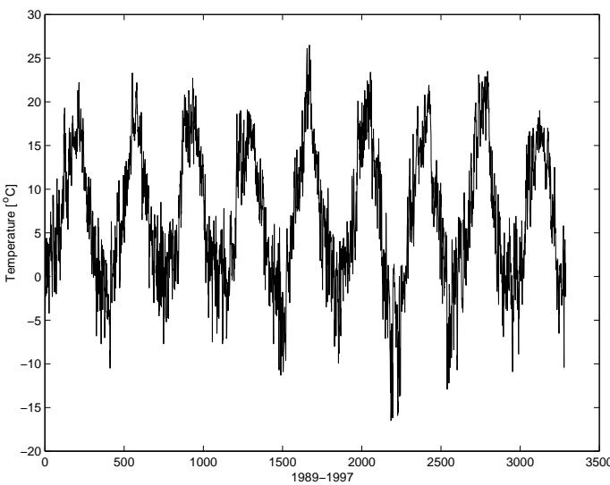
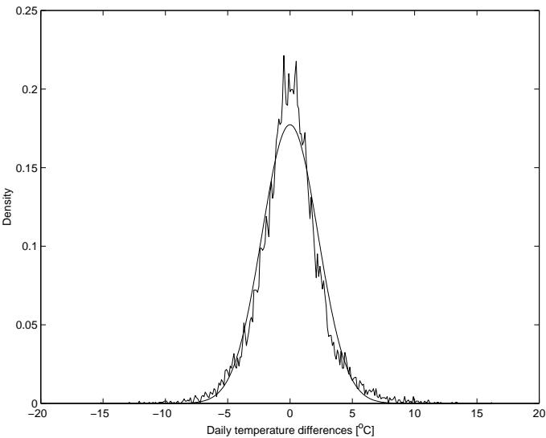
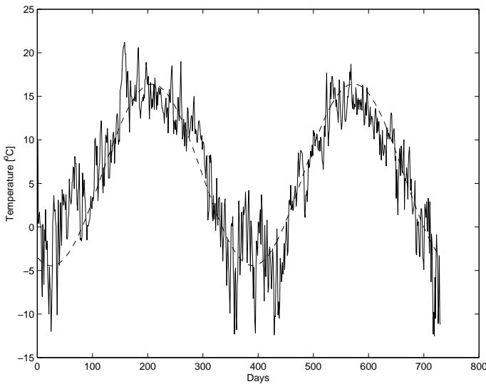
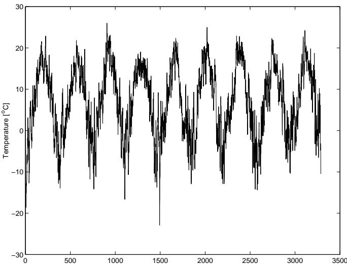
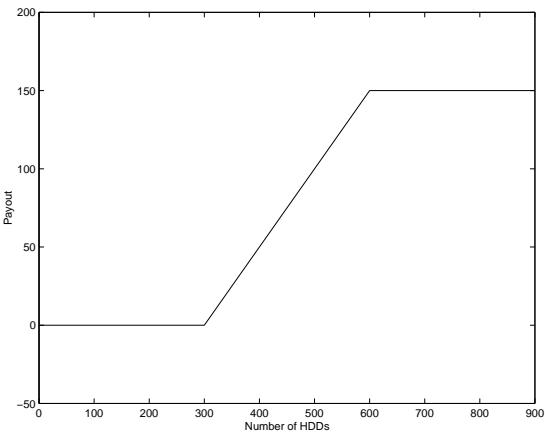

# 2002-alaton-et-al-weather-derivatives

<!-- page: 1 -->

## On Modelling and Pricing Weather Derivatives

Peter Alaton Fat Tails Financial Analysis AB∗

Boualem Djehiche and David Stillberger Dept. of Mathematics, KTH †

## Abstract

The main objective of this work is to find a pricing model for weather derivatives with payouts depending on temperature. We use historical data to first suggest a stochastic process that describes the evolution of the temperature. Since temperature is a non-tradable quantity, we obtain unique prices of contracts in an incomplete market, using the market price of risk. Numerical examples of prices of some contracts are presented, using an approximation formula as well as Monte Carlo simulations.

∗Kungsgatan 37 2tr, SE-111 56 Stockholm. e-mail: peter.alaton@fattails.com

†SE-100 44 Stockholm. e-mail: boualem@math.kth.se and f96-dst@nada.kth.se

<!-- page: 2 -->

## 1 Introduction

The weather has an enormous impact on business activities of many kinds. The list of businesses subject to weather risk is long and includes, for example, energy producers and consumers, supermarket chains, the leisure industry and the agricultural industries. But it is primarily the energy sector that has driven the demand for weather derivatives and has caused the weather risk management industry to now evolve rapidly. The main aim of this paper is to find a pricing model for weather derivatives. These are financial contracts with payouts that depend on the weather in some form. The underlying variables can be for example temperature, humidity, rain or snowfall. Since the most common underlying variable is temperature, only temperature based derivatives will be considered here.

There are a number of factors behind the growth of the weather derivatives market. One of these is the deregulation of the energy markets. Energy producers have for a long time been able to see that energy prices are highly correlated with the weather. In a competitive market the energy producers can no longer set the prices so that they will not sufer from ”bad” weather. Trading weather derivatives has become a way for these companies to hedge their risks. Another key factor is that the capital markets and the insurance markets have come closer to each other. There has been a growth in recent years in the number of catastrophe bonds issued, and the Chicago Board of Trade (CBOT) has introduced catastrophe options. Weather derivatives seem to be a logical extension of this. People are now beginning to realize that they can no longer blame low profits on the weather. Now that weather derivatives have been introduced there is a possibility to hedge a company’s cash-flow against ”bad” weather.

In Section 2, we give a short overview of the market of weather drivatives. In Section 3, we will focus on finding a stochastic process that describes the evolution of the temperature. We find that an Ornstein-Uhlenbeck process is appropriate. The unknown parameters in the model are estimated using historical temperature data. Since we have only discrete observations the estimation of some parameters in the model is based on the use of martingale estimation functions, proposed by Bibby & Sørensen. Section 4 is devoted to pricing contracts with temperature as the underlying. As temperature is a non-tradable quantity we have to consider the market price of risk in order to obtain unique prices of the contracts. Finally, numerical examples of prices of some contracts, using an approximation formula as well as Monte Carlo simulations are presented in Section 5.

## 2 The market of weather derivatives

Until today approximately 3000 deals with a total value of \$5.5 billion have been made in the US weather derivatives market, whereas in Europe only about 100 weather deals worth £30 million have been completed (see Jain & Baile [7]).

The first transaction in the weather derivatives market took place in the US in 1997, see Considine [5]. The market was jump started during the El Ni˜no1 winter of 1997-98, which was one of the strongest such events on record. This phenomenon received huge publicity in the American press. Many companies then decided to hedge their seasonal weather risk due to the risk of significant earnings decline.

1El Ni˜no is a periodic warming of the tropical Pacific ocean which afects weather around the world. Typical consequences of El Ni˜no include increased rainfall in the southern US

<!-- page: 3 -->

After that the market for weather derivatives expanded rapidly and contracts started to be traded over-the-counter (OTC) as individually negotiated contracts. This OTC market was primarily driven by companies in the energy sector. To increase the size of the market and to remove credit risk from the trading of the contracts, the Chicago Mercantile Exchange (CME) started an electronic market place for weather derivatives in September 1999. This was the first exchange where standard weather derivatives could be traded. In Section 2.1.1 below we will look more closely at the type of contracts that are traded on the CME. Among the major market makers for the CME are Aquila Energy, Koch Energy Trading, Southern Energy, Enron and Castlebridge Weather Markets. All these firms are also active in the OTC market for weather derivatives.

There are probably not so many end-users trading contracts on the CME. It can rather be seen as a possibility for the market makers to hedge the positions they take when ofering more specialized contracts to end-users.

This newly developed market for weather derivatives is currently not very liquid though. It seems like many companies have not yet established a hedging policy or even figured out their exposure to weather risk. This means that there is only a relatively small amount of contracts traded on the exchange, and the bid/ofer spreads are quite large.

The European market has not developed as quickly as the US market, but there are a number of factors that indicate its growth potential. One of them is the fact that Europe’s energy industry is not yet fully deregulated, and as deregulation spreads throughout the industry the volume in weather deals traded in Europe should increase. This will improve liquidity of the market and encourage new actors to enter.

When actors outside the energy sector become more interested in the weather derivatives market there will also be an enormous growth potential. As mentioned earlier there are companies in many diferent areas that are afected by the weather. When these companies start to look at the weather derivatives market for hedging purposes, increased liquidity as well as new products will probably follow.

Another key for the market to grow is the existence of standardised contracts. London International Financial Futures Exchange (LIFFE) is currently developing pan-European weather futures, which should increase the size of the overall weather derivatives market.

There are also some barriers that must be removed if the market is to grow. For example the quality and cost of weather data varies considerably across Europe. Companies that want to analyze their performance against historical weather data must often buy information from the national meteorological offices, and that could, in some countries, be quite expensive. It is also important that the quality of the weather data is good so that companies can rely on it when pricing derivatives.

and drought in the western Pacific. Winter temperatures in the north-central US states are typically higher than normal in El Ni˜no years, and lower than normal in the south-east and south-west of the country.

<!-- page: 4 -->

## 2.1 The contracts

Weather derivatives are usually structured as swaps, futures, and call/put options based on diferent underlying weather indices. Some commonly used indices are heating and cooling degree-days (See Definition 2.2), rain and snowfall. In this work we will only study the degree-days indices, because they are most often used.

We start with some basic definitions and terminology. When we from now on speak about the temperature we use the following definition.

Definition 2.1 (Temperature) Given a specific weather station, let Tmax and $T _ { i } ^ { m i n }$ denote the maximal and minimal temperatures (in degrees Celsius) measured on day i. We define the temperature for day i as

$$
T _ { i } \equiv \frac { T _ { i } ^ { m a x } + T _ { i } ^ { m i n } } { 2 } .\tag{2.1}
$$

As mentioned above, one important underlying variable for weather derivatives is the degree-day. This quantity is defined below.

Definition 2.2 (Degree-days) Let $T _ { i }$ denote the temperature for day i. We define the heating degree-days, $H D D _ { i }$ and the cooling degree-days, $C D D _ { i }$ , generated on that day as

$$
H D D _ { i } \equiv \mathrm { m a x } \{ 1 8 - T _ { i } , 0 \} ,\tag{2.2}
$$

and

$$
C D D _ { i } \equiv \mathrm { m a x } \{ T _ { i } - 1 8 , 0 \} ,\tag{2.3}
$$

respectively.

In Definition 2.2 above we see that the number of HDDs or CDDs for a specific day is just the number of degrees that the temperature deviates from a reference level. It has become industry standard in the US to set this reference level at $6 5 ^ { \mathrm { { o } } }$ Fahrenheit $\left( 1 8 ^ { \mathrm { o } } \ \mathrm { C } \right)$ . The names heating and cooling degree days originate from the US energy sector. The reason is that if the temperature is below $1 8 ^ { \mathrm { o } } ~ \mathrm { C }$ people tend to use more energy to heat their homes, whereas if the temperature is above $1 8 ^ { \mathrm { o } } \mathrm { ~ C ~ }$ people start turning their air conditioners on, for cooling.

Most temperature based weather derivatives are based on the accumulation of HDDs or CDDs during a ceratin period, usually one calender month or a winter/summer period. Typically the HDD season includes winter months from November to March and the CDD season is from May to September. April and October are often referred to as the ”shoulder months”.

## 2.1.1 The CME contracts

The CME ofers trading with futures based on the CME Degree Day Index, which is the cumulative sum of daily HDDs or CDDs during a calendar month, as well as options on these futures. The CME Degree Day Index is currently specified for eleven US cities.

The HDD/CDD Index futures are agreements to buy or sell the value of the HDD/CDD Index at a specific future date. The notional value of one contract is \$100 times the Degree Day Index, and the contracts are quoted in HDD/CDD Index points. The futures are cash-settled, which means that there is a daily marking-to-market based upon the index, with the gain or loss applied to the customer’s account.

<!-- page: 5 -->

A CME HDD or CDD call option is a contract which gives the owner the right, but not the obligation, to buy one HDD/CDD futures contract at a specific price, usually called the strike or exercise price. The HDD/CDD put option analogously gives the owner the right, but not the obligation, to sell one HDD/CDD futures contract. On the CME the options on futures are European style, which means that they can only be exercised at the expiration date.

## 2.1.2 Weather options

Outside the CME there are a number of diferent contracts traded on the OTC market. One common type of contract is the option. There are two types of options, calls and puts. The buyer of a HDD call, for example, pays the seller a premium at the beginning of the contract. In return, if the number of HDDs for the contract period is greater than the predetermined strike level the buyer will recieve a payout. The size of the payout is determined by the strike and the tick size. The tick size is the amount of money that the holder of the call receives for each degree-day above the strike level for the period. Often the option has a cap on the maximum payout unlike, for example, traditional options on stocks.

A generic weather option can be formulated by specifying the following parameters:

• The contract type (call or put)

• The contract period (e.g. January 2001)

• The underlying index (HDD or CDD)

• An oficial weather station from which the temperature data are obtained

• The strike level

• The tick size

• The maximum payout (if there is any)

To find a formula for the payout of an option, let K denote the strike level and α the tick size. Let the contract period consist of n days. Then the number of HDDs and CDDs for that period are

$$
H _ { n } = \sum _ { i = 1 } ^ { n } H D D _ { i } , \qquad { \mathrm { a n d } } \qquad C _ { n } = \sum _ { i = 1 } ^ { n } C D D _ { i }\tag{2.4}
$$

respectively. Now we can write the payout of an uncapped HDD call as

$$
\mathcal { X } = \alpha \operatorname* { m a x } \left\{ H _ { n } - K , 0 \right\} .\tag{2.5}
$$

The payouts for similar contracts like HDD puts and CDD calls/puts are defined in the same way.

<!-- page: 6 -->

## 2.1.3 Weather swaps

Swaps are contracts in which two parties exchange risks during a predetermined period of time. In most swaps, payments are made between the two parties, with one side paying a fixed price and the other side paying a variable price.

In one type of weather swap that is often used, there is only one date when the cash-flows are ”swapped”, as opposed to interest rate swaps, which usually have several swap dates. The swaps with only one period can therefore be thought of as forward contracts. Often the contract periods are single calendar months or a period such as January-March.

In the case of a standard HDD swap, the parties agree on a given strike of HDDs for the period, and the amount swapped is, for example, 10000 euro/HDD away from the strike. Usually there is also a maximum payout corresponding to 200 degree days.

## 2.2 Weather derivatives vs insurance contracts

Is there really any need for weather based derivatives? Why cannot the insurance industry take care of the need to hedge against the outcome of the weather?

The main diference between derivatives and insurance contracts is that the holder of an insurance contract has to prove that he has sufered a financial loss due to weather in order to be compensated. If he is not able to show this, the insurance company will not pay him any money. Payouts of weather derivatives are based only on the actual outcome of the weather, regardless of how it afects the holder of the derivative. One does not need to have any weather sensitive production, for example, to buy and benefit from a weather derivative. As any derivatives, these contracts can be bought for mere speculation.

Insurance contracts are usually designed to protect the holder from extreme weather events such as earthquakes and typhoons, and they do not work well with the uncertainties in normal weather. Weather derivatives, on the other hand, can be constructed to have payouts in any weather condition.

There is another important advantage of derivative contracts compared to insurance contracts. There may be two actors on the market, one of which will make profits if there is a very cold winter, whereas the other will benefit from a warm winter. In a derivatives market these two actors can meet and enter a contract such that they will hedge each other’s risks. This is not possible in the insurance market.

To understand how weather derivatives can be used in practice we give two simple examples.

Example 2.1 A heating oil retailer may feel that if the winter is very cold it will have high revenues, so it might sell a HDD call. If the winter is not particularly cold, the oil retailer keeps the premium of the call. On the other hand, if the winter is very cold, the retailer can aford to finance the payout of the option because its revenues are high. The company has thus reduced its exposure to weather risk. ✷

<!-- page: 7 -->

Example 2.2 This is an example taken from the real world. The London-based chain of wine bars Corney & Barrow last summer bought coverage to protect itself against bad weather, which would reduce its sales. Under the terms of the deal, if the temperature fell below 24o C on Thursdays or Fridays between June and September the company received a payment. The payments were fixed at £15000 per day, up to a maximum limit of £100000 in total for the whole period. ✷

## 3 Modelling temperature

Since we have decided to only focus on derivatives with the temperature as the underlying variable, we will in this section try to find a model that describes the temperature. The goal is to find a stochastic process describing the temperature movements. When we later on want to price weather derivatives based on temperature it will be of great use to have an idea of how the temperature process behaves.

To our help in finding a good model we have a database with temperatures from the last 40 years from diferent Swedish cities. The temperature data consists of daily mean temperatures, computed according to Definition 2.1. In Figure 1 we have plotted the daily mean temperatures at Stockholm Bromma Airport for 9 consecutive years.

In the following analysis we will use the whole 40 years data series obtained from Bromma Airport.

## 3.1 The mean temperature

From the temperature data in Figure 1 we clearly see that there is a strong seasonal variation in the temperature. The mean temperature seems to vary between about $2 0 ^ { \mathrm { o } } \ \mathrm { C }$ during the summers and $- 5 ^ { \mathrm { o } } \mathrm { ~ C ~ }$ during the winters. After a quick glance at Figure 1 we guess that it should be possible to model the seasonal dependence with, for example, some sine-function. This function would have the form

<!-- page: 8 -->

$$
\sin ( \omega t + \varphi ) ,\tag{3.1}
$$

where t denotes the time, measured in days. We let $t = 1 , 2 , \dots$ denote January 1, January 2 and so on. Since we know that the period of the oscillations is one year (neglecting leap years) we have $\omega = 2 \pi / 3 6 5$ . Because the yearly minimum and maximum mean temperatures do not usually occur at January 1 and July 1 respectively, we have to introduce a phase angle $\varphi .$ . Moreover, a closer look at the data series reveals a positive trend in the data. It is weak but it does exist. The mean temperature actually increases each year. There can be many reasons to this. One is the fact that we may have a global warming trend all over the world. Another is the so called urban heating efect, which means that temperatures tend to rise in areas nearby a big city, since the city is growing and warming its surroundings. To catch this weak trend from data we will assume, as a first approximation, that the warming trend is linear. We could have assumed it polynomial, but due to its weak efect on the overall dynamics of the mean temperature, it is only the linear term of this polynomial that will dominate.

Summing up, a deterministic model for the mean temperature at time $t , T _ { t } ^ { m }$ would have the form

$$
T _ { t } ^ { m } = A + B t + C \sin ( \omega t + \varphi ) .\tag{3.2}
$$

where, the parameters $A , B , C , \varphi$ have to be chosen so that the curve fits the data well. The estimation of these parameters is given in Section 3.4, below.

## 3.2 The driving noise process

Unfortunately temperatures are not deterministic. Thus, to obtain a more realistic model we now have to add some sort of noise to the deterministic model (3.2). One choice is a standard Wiener process, $( W _ { t } , t \ge 0 )$ . Indeed, this is reasonable not only with regard to the mathematical tractability of the model, but also because Figure 2 shows a good fit of the plotted daily temperature diferences with the corresponding normal distribution, though the probability of getting small diferences in the daily mean temperature will be slightly underestimated.

A closer look at the data series reveals that the quadratic variation $\sigma _ { t } ^ { 2 } \in \mathbb { R } _ { + }$ of the temperature varies across the diferent months of the year, but nearly constant within each month. Especially during the winter the quadratic variation is much higher than during the rest of the year. Therefore, we make the assumption that $\sigma _ { t }$ is a piecewise constant function, with a constant value during each month. We specify $\sigma _ { t }$ as

$$
\sigma _ { t } = \left\{ \begin{array} { c } { \sigma _ { 1 } , \mathrm { d u r i n g ~ J a n u a r y , ~ } } \\ { \sigma _ { 2 } , \mathrm { d u r i n g ~ F e b r u a r y , ~ } } \\ { \vdots \qquad \vdots } \\ { \sigma _ { 1 2 } , \mathrm { d u r i n g ~ D e c e m b e r , } } \end{array} \right.\tag{3.3}
$$

<!-- page: 9 -->

where $\left\{ \sigma _ { i } \right\} _ { i = 1 } ^ { 1 2 }$ are positive constants. Thus, a driving noise process of the temperature would be $\left( \sigma _ { t } W _ { t } , \ t \geq 0 \right)$

## 3.3 Mean-reversion

We also know that the temperature cannot, for example, rise day after day for a long time. This means that our model should not allow the temperature to deviate from its mean value for more than short periods of time. In other words, the stochastic process describing the temperature we are looking for should have a mean-reverting property.

Putting all the assumptions together, we model temperature by a stochastic process solution of the following SDE

$$
d T _ { t } = a ( T _ { t } ^ { m } - T _ { t } ) d t + \sigma _ { t } d W _ { t } ,\tag{3.4}
$$

where $a \in \mathbb { R }$ determines the speed of the mean-reversion. The solution of such an equation is usually called an Ornstein-Uhlenbeck process.

The problem with $\operatorname { E q . } ( 3 . 4 )$ is that it is actually not reverting to $T _ { t } ^ { m }$ in the long run– See, for example, Dornier & Queruel [6]. To obtain a process that really reverts to the mean (3.2) we have to add the term

$$
\frac { d T _ { t } ^ { m } } { d t } = B + \omega C \cos ( \omega t + \varphi )\tag{3.5}
$$

to the drift term in (3.4). As the mean temperature $T _ { t } ^ { m }$ is not constant this term will adjust the drift so that the solution of the SDE has the long run mean $T _ { t } ^ { m }$

Starting at $T _ { s } = x$ we now get the following model for the temperature

$$
d T _ { t } = \left\{ \frac { d T _ { t } ^ { m } } { d t } + a ( T _ { t } ^ { m } - T _ { t } ) \right\} d t + \sigma _ { t } d W _ { t } , \quad t > s\tag{3.6}
$$

<!-- page: 10 -->

whose solution is

$$
T _ { t } = \left( x - T _ { s } ^ { m } \right) e ^ { - a ( t - s ) } + T _ { t } ^ { m } + \int _ { s } ^ { t } e ^ { - a ( t - \tau ) } \sigma _ { \tau } d W _ { \tau } ,\tag{3.7}
$$

where

$$
T _ { t } ^ { m } = A + B t + C \sin ( \omega t + \varphi ) .\tag{3.8}
$$

## 3.4 Parameter estimation

In the previous section we decided to use the SDE (3.6) to model the temperature. In this section we will estimate the unknown parameters $A , B , C , \varphi ,$ a and $\sigma$ . The estimations are based on temperature data from Bromma Airport from the last 40 years.

## 3.4.1 Fitting the mean temperature model to data

To find numerical values of the constants in (3.8) we fit the function

$$
Y _ { t } = a _ { 1 } + a _ { 2 } t + a _ { 3 } \sin ( \omega t ) + a _ { 4 } \cos ( \omega t )\tag{3.9}
$$

to the temperature data using the method of least squares. This means that we have to find the parameter vector $\xi = ( a _ { 1 } , a _ { 2 } , a _ { 3 } , a _ { 4 } )$ that solves

$$
\operatorname* { m i n } _ { \boldsymbol { \xi } } \| \mathbf { Y } - \mathbf { X } \| ^ { 2 } ,\tag{3.10}
$$

where Y is the vector with elements (3.9) and X is the data vector. The constants in the model (3.8) are then obtained by

$$
A = a _ { 1 } ,\tag{3.11}
$$

$$
B = a _ { 2 } ,\tag{3.12}
$$

$$
C = { \sqrt { a _ { 3 } ^ { 2 } + a _ { 4 } ^ { 2 } } } ,\tag{3.13}
$$

$$
\varphi = \arctan \left( { \frac { a _ { 4 } } { a _ { 3 } } } \right) - \pi .\tag{3.14}
$$

Inserting the numerical values into $\operatorname { E q . } ( 3 . 8 )$ , we get the following function for the mean temperature,

$$
T _ { t } ^ { m } = 5 . 9 7 + 6 . 5 7 \cdot 1 0 ^ { - 5 } t + 1 0 . 4 \sin \left( \frac { 2 \pi } { 3 6 5 } t - 2 . 0 1 \right) .\tag{3.15}
$$

The amplitude of the sine-function is about $1 0 ^ { \mathrm { o } } \mathrm { ~ C ~ }$ which means that the diference in temperature between a typical winter day and a summer day is about $2 0 ^ { \mathrm { o } } \ \mathrm { C }$ . The trend is apparently very small, but during 40 years it will imply a rise of the mean temperature of about $1 ^ { \mathrm { { o } } } \mathrm { { C } } . \mathrm { { A } }$ plot of this function together with the temperature data is shown in Figure 3.

<!-- page: 11 -->

## 3.4.2 Estimation of σ

In this section we aim at deriving a reliable estimator of $\sigma$ from the data. We will derive two estimators of $\sigma$ from data collected for each month. Given a specific month $\mu$ of $N _ { \mu }$ days, denote the outcomes of the observed temperatures during the month $\mu$ by $T _ { j } , ~ j = 1 , \ldots , N _ { \mu }$ . The first estimator is based on the the quadratic variation of $T _ { t }$ (see e.g. Basawa & Prasaka Rao [1], pp. 212-213):

$$
\hat { \sigma } _ { \mu } ^ { 2 } = \frac { 1 } { N _ { \mu } } \sum _ { j = 0 } ^ { N _ { \mu } - 1 } ( T _ { j + 1 } - T _ { j } ) ^ { 2 } .\tag{3.16}
$$

The second estimator is derived by discretizing (3.6) and thinking of the discretised equation as a regression equation. Indeed, during a given month $\mu ,$ the discretised equation is

$$
T _ { j } = T _ { j } ^ { m } - T _ { j - 1 } ^ { m } + a T _ { j - 1 } ^ { m } + ( 1 - a ) T _ { j - 1 } + \sigma _ { \mu } \epsilon _ { j - 1 } , \quad j = 1 , \dots , N _ { \mu }\tag{3.17}
$$

where $\left\{ \epsilon _ { j } \right\} _ { j = 1 } ^ { N _ { \mu } - 1 }$ are independent standard normally distributed random variables. With $\tilde { T } _ { j } \equiv T _ { j } - ( T _ { j } ^ { m } - T _ { j - 1 } ^ { m } )$ we can write (3.17) as

$$
\tilde { T } _ { j } = a T _ { j - 1 } ^ { m } + ( 1 - a ) T _ { j - 1 } + \sigma _ { \mu } \epsilon _ { j - 1 } ,\tag{3.18}
$$

which can be seen as a regression of today’s temperature on yesterday’s temperature. Thus, an eficient estimator of $\sigma _ { \mu }$ is (see e.g. Brockwell & Davis [9])

$$
\hat { \sigma } _ { \mu } ^ { 2 } = \frac { 1 } { N _ { \mu } - 2 } \sum _ { j = 1 } ^ { N _ { \mu } } \left( \tilde { T } _ { j } - \hat { a } T _ { j - 1 } ^ { m } - ( 1 - \hat { a } ) T _ { j - 1 } \right) ^ { 2 } .\tag{3.19}
$$

Here we need an estimator of $a$ to find the estimator of $\sigma _ { \mu }$ . This is the objective of the following section.

<!-- page: 12 -->

## 3.4.3 Estimation of the mean-reversion parameter a

Since the time between observations of the temperature (one day) is obviously bounded away from zero, it is appropriate to estimate the mean-reversion parameter a using the martingale estimation functions method suggested in Bibby & Sørensen [3]: Based on observations collected during n days, an eficient estimator $\hat { a } _ { n }$ of a is obtained as a zero of the equation

$$
G _ { n } ( { \hat { a } } _ { n } ) = 0 ,\tag{3.20}
$$

where,

$$
G _ { n } ( a ) = \sum _ { i = 1 } ^ { n } { \frac { { \dot { b } } ( T _ { i - 1 } ; a ) } { \sigma _ { i - 1 } ^ { 2 } } } \left\{ T _ { i } - \operatorname { E } [ T _ { i } \mid T _ { i - 1 } ] \right\}\tag{3.21}
$$

and $\dot { b } ( T _ { t } ; a )$ denotes the derivative w.r.t. a of the drift term

$$
b ( T _ { t } ; a ) = \frac { d T _ { t } ^ { m } } { d t } + a ( T _ { t } ^ { m } - T _ { t } ) .\tag{3.22}
$$

To solve (3.20) we only have to determine each of the terms $\operatorname { E } [ T _ { i } \mid T _ { i - 1 } ]$ in (3.21). Indeed, by $\mathrm { E q . ( 3 . 7 ) }$ , for $t \geq s ,$

$$
T _ { t } = \left( T _ { s } - T _ { s } ^ { m } \right) e ^ { - a ( t - s ) } + T _ { t } ^ { m } + \int _ { s } ^ { t } e ^ { - a ( t - \tau ) } \sigma _ { \tau } d W _ { \tau } ,\tag{3.23}
$$

which yields

$$
\operatorname { E } [ T _ { i } \mid T _ { i - 1 } ] = \left( T _ { i - 1 } - T _ { i - 1 } ^ { m } \right) e ^ { - a } + T _ { i } ^ { m } ,\tag{3.24}
$$

where, again,

$$
T _ { t } ^ { m } = A + B t + C \sin ( \omega t + \varphi ) .
$$

Therefore,

$$
G _ { n } ( a ) = \sum _ { i = 1 } ^ { n } \frac { T _ { i - 1 } ^ { m } - T _ { i - 1 } } { \sigma _ { i - 1 } ^ { 2 } } \left\{ T _ { i } - \left( T _ { i - 1 } - T _ { i - 1 } ^ { m } \right) e ^ { - a } - T _ { i } ^ { m } \right\}\tag{3.25}
$$

from which it is easily checked that

$$
\hat { a } _ { n } = - \log \left( \frac { \sum _ { i = 1 } ^ { n } Y _ { i - 1 } \left\{ T _ { i } - T _ { i } ^ { m } \right\} } { \sum _ { i = 1 } ^ { n } Y _ { i - 1 } \left\{ T _ { i - 1 } - T _ { i - 1 } ^ { m } \right\} } \right)\tag{3.26}
$$

is the unique zero of Eq. (3.20), where

$$
Y _ { i - 1 } \equiv \frac { T _ { i - 1 } ^ { m } - T _ { i - 1 } } { \sigma _ { i - 1 } ^ { 2 } } \quad i = 1 , 2 , \ldots , n .\tag{3.27}
$$

Inserting the numerical values into (3.16) and (3.19) we get estimations of $\sigma$ for the diferent months. The estimations are listed in Table 1. With σ from

<!-- page: 13 -->

[Table source crop](assets/tables/2002-alaton-et-al-weather-derivatives-p0013-block-0001-b5287143f1bbd7a5.jpg)
Table 1: The estimators of σ, based on the quadratic variation and the regression approach, and their mean value.

Table 1 we obtain $\hat { a } = 0 . 2 3 7$ . It could be interesting to see how much this value difers from an estimation based only on the discretised score function

$$
\dot { \tilde { l } } _ { n } ( a ) = \sum _ { i = 1 } ^ { n } \frac { \dot { b } ( T _ { i - 1 } ; a ) } { \sigma _ { i - 1 } ^ { 2 } } ( T _ { i } - T _ { i - 1 } ) - \sum _ { i = 1 } ^ { n } \frac { { b } ( T _ { i - 1 } ; \theta ) \dot { b } ( T _ { i - 1 } ; a ) } { \sigma _ { i - 1 } ^ { 2 } } .\tag{3.28}
$$

Indeed, the unique zero of $\operatorname { E q } .$ . (3.28) is

$$
\hat { a } _ { n } ^ { \prime } = \frac { \sum _ { i = 1 } ^ { n } Y _ { i - 1 } \left\{ T _ { i } - T _ { i - 1 } - B - C \omega \cos ( \omega ( i - 1 ) + \varphi ) \right\} } { \sum _ { i = 1 } ^ { n } Y _ { i - 1 } \left\{ T _ { i - 1 } ^ { m } - T _ { i - 1 } \right\} } ,\tag{3.29}
$$

where $Y _ { i - 1 }$ is the same as defined in (3.27).

With the numerical values inserted into (3.29) we get $\hat { a } _ { n } ^ { \prime } = 0 . 2 1 1$ , which is 11 % less than $\hat { a } _ { n }$ . Thus, using the estimator $\hat { a } _ { n } ^ { \prime }$ could induce an error in the price of a derivative.

Now, having estimated all the unknown parameters in our temperature model (3.6)-(3.8), we are able to simulate trajectories of the Ornstein-Uhlenbeck process. Indeed, Figure 4 shows one possible trajectory of the temperature during the following years. Comparing this simulation with the real temperatures plotted earlier in Figure 1, we conclude that, at least visually, the temperature model (3.6)-(3.8) seems to have the same properties as the observed temperature.

## 4 Pricing weather derivatives

The market for weather derivatives is a typical example of an incomplete market, because the underlying variable, the temperature, is not tradable. Therefore we have to consider the market price of risk λ, in order to obtain unique prices for such contracts. Since there is not yet a real market from which we can obtain prices, we assume for simplicity that the market price of risk is constant. Furthermore, we assume that we are given a risk free asset with constant interest rate r and a contract that for each degree Celsius pays one unit of currency. Thus, under a martingale measure $\mathbb { Q } ,$ characterized by the market price of risk $\lambda ,$ our price process also denoted by $T _ { t }$ satisfies the following dynamics:

<!-- page: 14 -->

$$
d T _ { t } = \left\{ \frac { d T _ { t } ^ { m } } { d t } + a ( T _ { t } ^ { m } - T _ { t } ) - \lambda \sigma _ { t } \right\} d t + \sigma _ { t } d V _ { t } ,\tag{4.1}
$$

where, $\left( V _ { t } , \ t \ \ge \ 0 \right)$ is a Q–Wiener process. Since the price of a derivative is expressed as a discounted expected value under martingale measure $\mathbb { Q } .$ , we start by computing the expected value and the variance of $T _ { t }$ under the measure $\mathbb { Q } .$ Indeed, as a Girsanov transformation only changes the drift term, the variance of $T _ { t }$ is the same under both measures. Therefore,

$$
\operatorname { V a r } [ T _ { t } \mid { \mathcal { F } } _ { s } ] = \int _ { s } ^ { t } \sigma _ { u } ^ { 2 } e ^ { - 2 a ( t - u ) } d u .\tag{4.2}
$$

Moreover, it follows from (3.7) that

$$
\operatorname { E } ^ { \mathbb { P } } [ T _ { t } \mid { \mathcal { F } } _ { s } ] = ( T _ { s } - T _ { s } ^ { m } ) e ^ { - a ( t - s ) } + T _ { t } ^ { m } .\tag{4.3}
$$

Hence, in view of Eq.(4.1) we must have

$$
\operatorname { E } ^ { \mathbb { Q } } [ T _ { t } \mid { \mathcal { F } } _ { s } ] = \operatorname { E } ^ { \mathbb { P } } [ T _ { t } \mid { \mathcal { F } } _ { s } ] - \int _ { s } ^ { t } \lambda \sigma _ { u } e ^ { - a ( t - u ) } d u .\tag{4.4}
$$

Evaluating the integrals in one of the intervals where $\sigma$ is constant, we get that

$$
\operatorname { E } ^ { \mathbb { Q } } [ T _ { t } \mid { \mathcal { F } } _ { s } ] = \operatorname { E } ^ { \mathbb { P } } [ T _ { t } \mid { \mathcal { F } } _ { s } ] - { \frac { \lambda \sigma _ { i } } { a } } \left( 1 - e ^ { - a ( t - s ) } \right)\tag{4.5}
$$

<!-- page: 15 -->

and the variance is

$$
\operatorname { V a r } [ T _ { t } \mid { \mathcal { F } } _ { s } ] = { \frac { \sigma _ { i } ^ { 2 } } { 2 a } } \left( 1 - e ^ { - 2 a ( t - s ) } \right) .\tag{4.6}
$$

For later use, we need to compute the covariance of the temperature between two diferent days. Indeed, for $0 \leq s \leq t \leq u$

$$
\operatorname { C o v } [ T _ { t } , T _ { u } \mid { \mathcal { F } } _ { s } ] = e ^ { - a ( u - t ) } \operatorname { V a r } [ T _ { t } \mid { \mathcal { F } } _ { s } ] .\tag{4.7}
$$

Suppose now that $t _ { 1 }$ and $t _ { n }$ denote the first and last day of a month and start the process at some time s from the month before $[ t _ { 1 } , t _ { n } ]$ . To compute the expected value and variance of $T _ { t }$ in this case, we split the integrals in (4.4) and (4.2) into two integrals where σ is constant in each one of them. We then get

$$
\operatorname { E } ^ { \mathbb { Q } } [ T _ { t } \mid { \mathcal { F } } _ { s } ] = \operatorname { E } ^ { \mathbb { P } } [ T _ { t } \mid { \mathcal { F } } _ { s } ] - { \frac { \lambda } { a } } ( \sigma _ { i } - \sigma _ { j } ) e ^ { - a ( t - t _ { 1 } ) } + { \frac { \lambda \sigma _ { i } } { a } } e ^ { - a ( t - s ) } - { \frac { \lambda \sigma _ { j } } { a } }\tag{4.8}
$$

and the variance is

$$
\mathrm { V a r } [ T _ { t } \mid { \mathcal F } _ { s } ] = \frac { 1 } { 2 a } ( \sigma _ { i } ^ { 2 } - \sigma _ { j } ^ { 2 } ) e ^ { - 2 a ( t - t _ { 1 } ) } - \frac { \sigma _ { i } ^ { 2 } } { 2 a } e ^ { - 2 a ( t - s ) } + \frac { \sigma _ { j } ^ { 2 } } { 2 a } .\tag{4.9}
$$

The generalisation to larger time intervals becomes now obvious.

## 4.1 Pricing a heating degree day option

As mentioned before, most weather derivatives involving the temperature are based on heating or cooling degree days. In this section we will show how to price a standard heating degree day option.

We begin with the HDD call option. Recall from Section 2.1.2 that the payout of the HDD call option is of the form

$$
\mathcal { X } = \alpha \operatorname* { m a x } \left\{ H _ { n } - K , 0 \right\} ,\tag{4.10}
$$

where, for simplicity $\alpha = 1$ unit of currency/HDD and

$$
H _ { n } = \sum _ { i = 1 } ^ { n } \operatorname* { m a x } \{ 1 8 - T _ { t _ { i } } , 0 \} .\tag{4.11}
$$

The contract (4.10) is a type of an arithmetic average Asian option. In the case of a log-normally distributed underlying process, no exact analytic formula for the price of such an option is known. Here we have an underlying process which is normally distributed, but the maximum function complicates the task to find a pricing formula. We therefore try to make some sort of approximation.

We know that, under $\mathbb { Q } ,$ and given information at time $s ,$

$$
T _ { t } \sim N ( \mu _ { t } , v _ { t } ) ,\tag{4.12}
$$

where $\mu _ { t }$ is given by (4.8) and $v _ { t }$ by (4.9). Now suppose that we want to find the price of a contract whose payout depends on the accumulation of HDDs during some period in the winter, for example the month of January. In Stockholm,

<!-- page: 16 -->

the probability that max $\{ 1 8 - T _ { t _ { i } } , 0 \} = 0$ should be extremely small on a winter day. Therefore, for such a contract we may write

$$
H _ { n } = 1 8 n - \sum _ { i = 1 } ^ { n } T _ { t _ { i } } .\tag{4.13}
$$

The distribution of this is easier to determine. We know that $T _ { t _ { i } } , i = 1 , \ldots , n$ are all samples from an Ornstein-Uhlenbeck process, which is a Gaussian process. This means that also the vector $( T _ { t _ { 1 } } , T _ { t _ { 2 } } , \dots T _ { t _ { n } } )$ is Gaussian. Since the sum in (4.13) is a linear combination of the elements in this vector, $H _ { n }$ is also Gaussian. With this new structure of $H _ { n }$ it only remains to compute the first and second moments. We have, for $t < t _ { 1 }$ ，

$$
\operatorname { E } ^ { \mathbb { Q } } \left[ H _ { n } \mid { \mathcal { F } } _ { t } \right] = \operatorname { E } ^ { \mathbb { Q } } \left[ 1 8 n - \sum _ { i = 1 } ^ { n } T _ { t _ { i } } \ { \Bigg | } \ { \mathcal { F } } _ { t } \right] = 1 8 n - \sum _ { i = 1 } ^ { n } \operatorname { E } ^ { \mathbb { Q } } [ T _ { t _ { i } } \mid { \mathcal { F } } _ { t } ]\tag{4.14}
$$

and

$$
\mathrm { V a r } [ H _ { n } \mid { \mathcal F } _ { t } ] = \sum _ { i = 1 } ^ { n } \mathrm { V a r } \left[ T _ { t _ { i } } \mid { \mathcal F } _ { t } \right] + 2 { \sum _ { i < j } } \sum _ { \mathbf { C } \in \mathbf { \mathbf { v } } } \left[ T _ { t _ { i } } , T _ { t _ { j } } \mid { \mathcal F } _ { t } \right] .\tag{4.15}
$$

Now, suppose that we have made the calculations above, and found that

$$
\operatorname { E } ^ { \mathbb { Q } } [ H _ { n } \mid { \mathcal { F } } _ { t } ] = \mu _ { n } \quad { \mathrm { a n d } } \quad \operatorname { V a r } [ H _ { n } \mid { \mathcal { F } } _ { t } ] = \sigma _ { n } ^ { 2 } .\tag{4.16}
$$

Thus, $H _ { n }$ is $N ( \mu _ { n } , \sigma _ { n } )$ –distributed. Hence, the price at $t \leq t _ { 1 }$ of the claim (4.10) is

$$
\begin{array} { l } { { \displaystyle c ( t ) = e ^ { - r ( t _ { n } - t ) } \mathrm { E } ^ { \mathbb Q } \left[ \mathrm { m a x } \{ H _ { n } - K , 0 \} \mid { \mathcal F } _ { t } \right] \ ~ } } \\ { { \displaystyle ~ \infty } } \\ { { \displaystyle ~ = e ^ { - r ( t _ { n } - t ) } \int _ { K } ( x - K ) f _ { H _ { n } } ( x ) d x } } \\ { { \displaystyle ~ = e ^ { - r ( t _ { n } - t ) } \left( ( \mu _ { n } - K ) \Phi \left( - \alpha _ { n } \right) + \frac { \sigma _ { n } } { \sqrt { 2 \pi } } e ^ { - \frac { \alpha _ { n } ^ { 2 } } { 2 } } \right) } , } \end{array}\tag{4.17}
$$

where, $\alpha _ { n } = ( K - \mu _ { n } ) / \sigma _ { n }$ and Φ denotes the cumulative distribution function for the standard normal distribution.

In the same way we can derive a formula for the price of a HDD put option, which is the claim

$$
\mathcal { Y } = \operatorname* { m a x } \{ K - H _ { n } , 0 \} .\tag{4.18}
$$

The price is

$$
\begin{array} { l } { p ( t ) = e ^ { - r ( t _ { n } - t ) } \mathrm { E } ^ { \mathbb { Q } } \left[ \operatorname* { m a x } \{ K - H _ { n } , 0 \} \mid \mathcal { F } _ { t } \right] } \\ { K } \\ { = e ^ { - r ( t _ { n } - t ) } \displaystyle \int _ { 0 } ^ { \infty } ( K - x ) f _ { H _ { n } } ( x ) d x } \\ { = e ^ { - r ( t _ { n } - t ) } \left[ \left( K - \mu _ { n } \right) \left( \Phi \left( \alpha _ { n } \right) - \Phi \left( - \frac { \mu _ { n } } { \sigma _ { n } } \right) \right) + \frac { \sigma _ { n } } { \sqrt { 2 \pi } } \left( e ^ { - \frac { \alpha _ { n } ^ { 2 } } { 2 } } - e ^ { - \frac { 1 } { 2 } \left( \frac { \mu _ { n } } { \sigma _ { n } } \right) ^ { 2 } } \right) \right] . } \end{array}\tag{4.19}
$$

<!-- page: 17 -->

The formulas (4.17) and (4.19) above hold primarily for contracts during winter months, which typically is the period November-March. During the summer we cannot use these formulas without restrictions. If the mean temperatures are very close to, or even higher than, $1 8 ^ { \mathrm { o } } ~ \mathrm { C }$ we no longer have max $\{ 1 8 - T _ { t _ { i } } , 0 \} \neq 0$ For such contracts we could use the method of Monte Carlo simulations described in Section 4.2. As mentioned earlier this reference level $( 1 8 ^ { \mathrm { o } } ~ \mathrm { C } )$ originates from the US market, but it seems to be used also in Europe. Perhaps it could be more interesting to base the derivatives on some reference level which is closer to the expected mean temperature for the period.

## 4.1.1 Maximum payouts

In practice many options often have a cap on the maximum payout. The reason is to reduce the risks that extreme weather conditions would cause. An option with a maximum payout could be constructed from two options without maximum payouts. If we enter a long position in one option and a short position in another option with a higher strike value, we get a payout function that would look something like Figure 5. Thus, an option with a maximum payout can be

treated as a portfolio of two standard options. This means that we do not have to derive an explicit formula for the price of the capped option.

## 4.1.2 In-period valuation

Often one would like to find the price of the option inside the contract period. Suppose we want to find the the price at a time $t _ { i } , t _ { 1 } \leq t _ { i } \leq t _ { n }$ . We could then rewrite the variable $H _ { n }$ as

$$
H _ { n } = H _ { i } + H _ { j } .\tag{4.20}
$$

Here $H _ { i }$ is known at $t _ { i }$ and $H _ { j }$ is stochastic. The payout of the HDD call option can then be rewritten as

$$
\mathcal { X } = \operatorname* { m a x } \{ H _ { n } - K , 0 \} = \operatorname* { m a x } \{ H _ { i } + H _ { j } - K , 0 \} = \operatorname* { m a x } \{ H _ { j } - \tilde { K } , 0 \} ,\tag{4.21}
$$

<!-- page: 18 -->

where $\tilde { K } = K - H _ { i }$ . An in-period option can thus be valued as an out-of-period option with transformed variables as above.

## 4.2 Monte Carlo simulations

In this section we will not make any simplifying assumption about the distribution of $H _ { n }$ or any other variable. Instead we will use Monte Carlo simulations. The Monte Carlo simulation technique is a way to numerically calculate the expected value $\operatorname { E } [ g ( X ( t ) ) ]$ , where X is the solution to some SDE and $g$ is some function. The approximation is based on

$$
\mathrm { E } [ g ( X ( t ) ) ] \approx \frac { 1 } { N } \sum _ { i = 1 } ^ { N } g ( \overline { { X } } ( t , \omega _ { i } ) ) ,\tag{4.22}
$$

where $\overline { { X } }$ is an approximation of $X$ , which has to be used if the exact solution X is not available. The idea is to simulate a lot of trajectories of the process and then approximate the expected value with the arithmetic average.

When we simulate the temperature trajectories for a given period of time we could either start the simulation today, and use today’s observed temperature as the initial value, or we could start the simulation at a future date near the first day of the period we are interested in, with the expected mean temperature for that day as the initial value. If the contract period is far enough ahead in time it will not be necessary to start the simulations at today’s date. The reason is that the temperature in the nearby future will not afect the temperature very much during the contract period. After some time the temperature process will not be dependent on the initial value, and the variance will have reached its ”equilibrium” value. On the other hand, if we are close enough to the start of the contract period (or even inside it) we should start the simulations at the current date.

## 4.3 Calibrating the model to the market

Before we can calculate any prices at all we have to calibrate the pricing model to the market conditions. We first have to find the still unknown parameter $\lambda ,$ the market price of risk. To obtain an accurate pricing model we also have to take meteorological forecasts into account.

## 4.3.1 The market price of risk

To be able to simulate temperature trajectories under the risk neutral measure Q we have to determine the market price of risk, λ. We earlier made the assumption that this quantity is a constant. To find an estimate of λ we have to look at market prices for some contracts, and examine what value of λ that gives a price from our model that fits the market price. But unfortunately there is not yet a fully developed weather derivatives market for contracts on Swedish cities.

The ”market” today consists of a number of actors who quote prices on options and other derivatives. One of these actors, Scandic Energy, has provided us with prices for some options. These prices are not market quotes though, and should only be seen as indications. We received ”prices” on HDD call options

<!-- page: 19 -->

[Table source crop](assets/tables/2002-alaton-et-al-weather-derivatives-p0019-block-0001-cdd64a9b31571ff1.jpg)
for January and February. The specifications of these contracts are listed in Table 2. The premiums, in the beginning of December 2000, for option I and Table 2: The specifications of two HDD options.

II were 25 SEK and 45 SEK, respectively. Using the model presented here we obtain, with λ = 0, prices at about 29 SEK for both contracts. Thus we can conclude that the contracts were not ”priced” using the same market price of risk. The price 25 SEK of option I would correspond to a negative value of $\lambda ,$ and the price 45 SEK of option II corresponds to $\lambda \approx 0 . 0 8$ . Without any deeper knowledge of the temperature forecasts (in December) for January and February it is dificult to explain the big diference in the prices of these options. The strike levels are both set close to the expected value of $H _ { n }$ for the two periods, and the temperature variations during February are historically smaller than during January.

Although these results contradict the assumption made earlier that the market price of risk is constant, we will use this assumption in lack of better information. Pricing a derivative in an incomplete market is pricing a derivative in terms of the price of some benchmark derivative. So we now decide to use option II in Table 2, with the price 45 SEK, as our benchmark derivative. It would have been interesting to look at prices of contracts in the future, for example during some summer month. But unfortunately there are not yet any contracts traded in Sweden during other periods than the winter.

## 4.3.2 Using forecasts

So far we have determined prices without taking any meteorological forecasts into account. We could say that these prices hold at times long enough before the contract period starts. Meteorologists usually say that temperature predictions more than a week or so in advance are not very significant. However, they are often able to make some sort of rough long term forecasts which can give a hint if it during a certain period will be warmer or cooler than normal.

Therefore, when we want to find the price of a contract at a date suficiently close to the start of the contract period, we must adjust our model of the temperature. This adjustment can be made in several diferent ways. For example, if we believe that the temperature will be higher than normal, during the contract period, we would increase the parameter A in the model (3.8). This will lead to an increased mean temerature, and thus a decreased value of $H _ { n } ,$ for the period. Other ways to incorporate meteorological data into the pricing model could be to change the variation σ, or the amplitude C.

<!-- page: 20 -->

One way to use the existing meteorological expectations is to look at prices on the so called swap (forward) market. The EnronOnline website2 quotes prices on HDD swaps for diferent terms. As an example, in the beginning of December the bid/ofer prices of HDD swaps for January and February were 592/603 HDDs and 540/550 HDDs respectively. Thus we should adjust the model so that we get a mean value at about 600 HDDs for January and about 545 HDDs for February. The simplest way to do this is to change the parameter A.

This procedure is analogous to the method of fitting an interest rate model to the initial term structure.

## 5 Results

In this section we will calculate prices of some contracts, and compare the approximation formula with the Monte Carlo simulation method. We used 20000 sample paths for the Monte Carlo simulations.

The prices of the three diferent options listed in Table 3 have been calculated. The options are similar to those listed in Table 2, and they are priced in

[Table source crop](assets/tables/2002-alaton-et-al-weather-derivatives-p0020-block-0006-eeda65636075cf30.jpg)
Table 3: The specifications of three degree-day options.

terms of the price of option II in Table 2. Note that we have omitted the maximum payouts. These options are just some examples of derivatives whose price we could calculate, but they are probably quite similar to the options which can be traded in the market.

The resulting prices (in SEK) obtained, in the beginning of January, by Monte Carlo simulations and by the approximation formula are listed in Table 4.

[Table source crop](assets/tables/2002-alaton-et-al-weather-derivatives-p0020-block-0009-61622f084b5d496a.jpg)
Table 4: The prices of the options in Table 3.

Since the prices obtained are based on the price indication of a benchmark derivative it is not interesting to know whether the actual price of some option is 55.7 or 55.8. The prices obtained here are very dependent on the choice of the parameter λ. What is interesting to notice is that there seems to be a good fit between the results obtained from the Monte Carlo simulations and from the approximation formula. The results obtained, and our experience gained while working with the model, indicate that the fit is better the more in-the-money the option is.

2http://www.enrononline.com

<!-- page: 21 -->

## 6 Conclusion

There are several things that could be done to improve the pricing model that has been presented here. Perhaps the most important issue when pricing weather derivatives is to have a good model for the weather. The temperature model used here is of course a simplification of the real world, even though it seems to fit quite well the temperature data. One way to make the temperature model developed here even more realistic could be to use some more sophisticated model for the driving noise process. One could study historical data series and try to find some pattern of how the volatility is changing. Perhaps a model including stochastic volatility would be more realistic. To find a better model for the temperature one should perhaps consider larger models of the climate, in which the temperature is only one of several diferent variables. With the development of better models of the climate together with faster computers, the experts will probably be able to make more significant long term forecasts, which would be of great importance for the pricing of weather derivatives. As the market grows i.e. when there are real time prices to observe on the market, one could probably find a better structure for the market price of risk.

<!-- page: 22 -->

## References

[1] Basawa, I. V. & Prasaka Rao, B. L. S. Statistical Inference for Stochastic Processes, Academic Press, 1980. [2] Baxter, M. & Rennie, A. Financial Calculus, Cambridge University Press, 1998. [3] Bibby, B. M. & Sørensen, M. Martingale Estimation Functions for Discretely Observed Difusion Processes, Bernoulli vol. I numbers I/II March/June 1995. [4] Bj¨ork, T. Arbitrage Theory in Continuous Time, Oxford University Press, 1998. [5] Considine, G. Introduction to Weather Derivatives, Weather Derivatives Group, Aquila Energy. [6] Dornier, F. & Queruel, M. Caution to the Wind, Weather Risk Special Report 2000, Energy & Power Risk Management/Risk Magazine. [7] Jain, G. & Baile, C. Managing Weather Risks, Strategic Risk, September 2000, pp 28-31. [8] Øksendal, B. Stochastic Diferential Equations: An Introduction with Applications, Springer 1998. [9] Brockwell, P.J. & Davis, R.A. Time Series: Theory and Methods. Springer, Second edition 1990. [10] Weather Risk Special Report 1999, Energy & Power Risk Management/Risk Magazine. [11] Weather Risk Special Report 2000, Energy & Power Risk Management/Risk Magazine.
