# 2002-hagan-et-al-managing-smile-risk

<!-- page: 1 -->

## MANAGING SMILE RISK

PATRICK S. HAGAN¤, DEEP KUMARy , ANDREW S. LESNIEWSKIz , AND DIANA E. WOODWARDx

Abstract. Market smiles and skews are usually managed by using local volatility models a la Dupire. We discover that the dynamics of the market smile predicted by local vol models is opposite of observed market behavior: when the price of the underlying decreases, local vol models predict that the smile shifts to higher prices; when the price increases, these models predict that the smile shifts to lower prices. Due to this contradiction between model and market, delta and vega hedges derived from the model can be unstable and may perform worse than naive Black-Scholes’ hedges.

To eliminate this problem, we derive the SABR model, a stochastic volatility model in which the forward value satis…es

$$
d \hat { F } = \hat { a } \hat { F } ^ { \beta } d W _ { 1 }
$$

$$
d \hat { a } = \nu \hat { a } d W _ { 2 }
$$

and the forward $\hat { F }$ and volatility ^a are correlated: $d W _ { 1 } d W _ { 2 } = \rho d t$ . We use singular perturbation techniques to obtain the prices of European options under the SABR model, and from these prices we obtain explicit, closed-form algebraic formulas for the implied volatility as functions of today’s forward price $f = { \hat { F } } ( 0 )$ and the strike K. These formulas immediately yield the market price, the market risks, including vanna and volga risks, and show that the SABR model captures the correct dynamics of the smile. We apply the SABR model to USD interest rate options, and …nd good agreement between the theoretical and observed smiles.

Key words. smiles, skew, dynamic hedging, stochastic vols, volga, vanna

1. Introduction. European options are often priced and hedged using Black’s model, or, equivalently, the Black-Scholes model. In Black’s model there is a one-to-one relation between the price of a European option and the volatility parameter $\sigma _ { B }$ . Consequently, option prices are often quoted by stating the implied volatility $\sigma _ { B }$ , the unique value of the volatility which yields the option’s dollar price when used in Black’s model. In theory, the volatility $\sigma _ { B }$ in Black’s model is a constant. In practice, options with di¤erent strikes K require di¤erent volatilities $\sigma _ { B }$ to match their market prices. See …gure 1. Handling these market skews and smiles correctly is critical to …xed income and foreign exchange desks, since these desks usually have large exposures across a wide range of strikes. Yet the inherent contradiction of using di¤erent volatilitie for di¤erent options makes it di¢cult to successfully manage these risks using Black’s model.

The development of local volatility models by Dupire [2], [3] and Derman-Kani [4], [5] was a major advance in handling smiles and skews. Local volatility models are self-consistent, arbitrage-free, and can be calibrated to precisely match observed market smiles and skews. Currently these models are the most poThis model was featured at a Risk conference in 2000, and istherefore in the public domain. So post away. Of course any mentioning of my name in public or publications would be welcome since I am still trying to establish my reputation.pular way of managing smile and skew risk. However, as we shall discover in section 2, the dynamic behavior of smiles and skews predicted by local vol models is exactly opposite the behavior observed in the marketplace: when the price of the underlying asset decreases, local vol models predict that the smile shifts to higher prices; when the price increases, these models predict that the smile shifts to lower prices. In reality, asset prices and market smiles move in the same direction. This contradiction between the model and the marketplace tends to de-stabilize the delta and vega hedges derived from local volatility models, and often these hedges perform worse than the naive Black-Scholes’ hedges.

To resolve this problem, we derive the SABR model, a stochastic volatility model in which the asset price and volatility are correlated. Singular perturbation techniques are used to obtain the prices of European options under the SABR model, and from these prices we obtain a closed-form algebraic formula for the implied volatility as a function of today’s forward price f and the strike K. This closed-form formula for the implied volatility allows the market price and the market risks, including vanna and volga risks, to be obtained immediately from Black’s formula. It also provides good, and sometimes spectacular, …ts to the implied volatility curves observed in the marketplace. See …gure 1.1. More importantly, the formula shows that the SABR model captures the correct dynamics of the smile, and thus yields stable hedges.

¤phagan@nomurany.com; Nomura Securities International; 2 World Financial Center, Bldg B; New York NY 10281

yBNP Paribas; 787 Seventh Avenue; New York NY 10019

zBNP Paribas; 787 Seventh Avenue; New York NY 10019

xSociete Generale; 1221 Avenue of the Americas; New York NY 10020

<!-- page: 2 -->

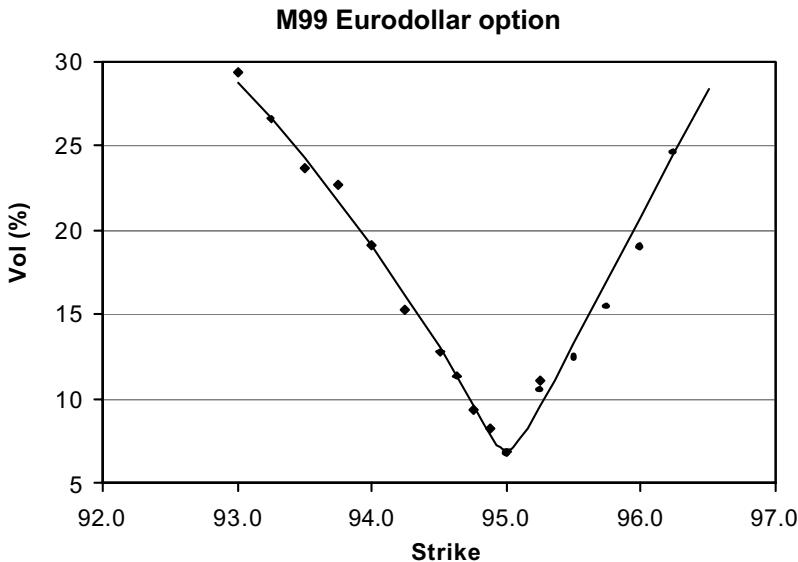

2. Reprise. Consider a European call option on an asset with exercise date $t _ { e x } ,$ settlement date $t _ { s e t } .$ and strike K . If the holder exercises the option on $t _ { e x }$ , then on the settlement date $t _ { s e t }$ he receives the underlying asset and pays the strike K. To derive the value of the option, de…ne $\ddot { F } ( t )$ to be the forward price of the asset for a forward contract that matures on the settlement date $t _ { s e t } ,$ and de…ne $f = { \hat { F } } ( 0 )$ to be today’s forward price. Also let $D ( t )$ be the discount factor for date $t ;$ that is, let $D ( t )$ be the value today of \$1 to be delivered on date t. In Appendix A the fundamental theorem of arbitrage free pricing [6], [7] is used to develop the theoretical framework for European options. There it is shown that the value of the call option is

$$
V _ { c a l l } = D ( t _ { s e t } ) \left\{ E [ \hat { F } ( t _ { e x } ) - K ] ^ { + } | \mathfrak { F } _ { 0 } \right\} ,\tag{2.1a}
$$

and the value of the corresponding European put is

$$
\begin{array} { c } { { V _ { p u t } = D ( t _ { s e t } ) E \left\{ [ K - \hat { F } ( t _ { e x } ) ] ^ { + } | \mathfrak { F } _ { 0 } \right\} } } \\ { { \equiv V _ { c a l l } + D ( t _ { s e t } ) [ K - f ] . } } \end{array}\tag{2.1b}
$$

Here the expectation E is over the forward measure, and $" | \mathfrak { F } _ { 0 } ? \rangle$ can be interpretted as “given all information available at $t = 0 . { } ^ { \ ' }$ See Appendix A. In Appendix A it is also shown that the forward price $\hat { F } ( t )$ is a

<!-- page: 3 -->

Martingale under the forward measure. Therefore, the Martingale representation theorem implies that $\hat { F } ( t )$ evolves according to

$$
d \hat { F } = C ( t , * ) d W , \qquad \hat { F } ( 0 ) = f ,\tag{2.1c}
$$

for some coe¢cient $C ( t , * )$ , where dW is Brownian motion in this measure. The coe¢cient $C ( t , * )$ may be deterministic or random, and may depend on any information that can be resolved by time t. This is as far as the fundamental theory of arbitrage free pricing goes. In particular, one cannot determine the coe¢cient $C ( t , * )$ on purely theoretical grounds. Instead one must postulate a mathematical model for $C ( t , * )$

European swaptions …t within an indentical framework. Consider a European swaption with exercise date $t _ { e x }$ and …xed rate (strike) $R _ { f i x }$ . Let $R _ { s } ( t )$ be the swaption’s forward swap rate as seen at date $t ,$ and let $R _ { 0 } = \hat { R } _ { s } ( 0 )$ be the forward swap rate as seen today. In Appendix A we show that the value of a payer swaption is

$$
V _ { p a y } = L _ { 0 } E \left\{ [ \hat { R } _ { s } ( t _ { e x } ) - R _ { f i x } ] ^ { + } | \mathfrak { F } _ { 0 } \right\} ,\tag{2.2a}
$$

and the value of a receiver swaption is

$$
\begin{array} { c } { { V _ { r e c } = L _ { 0 } E \left\{ [ R _ { f i x } - \hat { R } _ { s } ( t _ { e x } ) ] ^ { + } | \mathfrak { F } _ { 0 } \right\} } } \\ { { \equiv V _ { p a y } + L _ { 0 } [ R _ { f i x } - R _ { 0 } ] . } } \end{array}\tag{2.2b}
$$

Here $L _ { 0 }$ is today’s value of the level (annuity), which is a known quantity, and E is the expectation over the level measure of Jamshidean [9]. In Appendix A it is also shown that the forward swap rate $\hat { R } _ { s } ( t )$ is a Martingale in this measure, so once again

$$
\begin{array} { r } { d \hat { R } _ { s } = C ( t , * ) d W , \qquad \hat { R } _ { s } ( 0 ) = R _ { 0 } , } \end{array}\tag{2.2c}
$$

where $d W$ is Brownian motion. As before, the coe¢cient $C ( t , * )$ may be deterministic or random, and cannot be determined from fundamental theory. Apart from notation, this is identical to the framework provided by equations 2.1a - 2.1c for European calls and puts. Caplets and ‡oorlets can also be included in this picture, since they are just one period payer and receiver swaptions. For the remainder of the paper, we adopt the notation of 2.1a - 2.1c for general European options.

2.1. Black’s model and implied volatilities. To go any further requires postulating a model for the coe¢cient $C ( t , * )$ . In [10], Black postulated that the coe¢cient $C ( t , * )$ is $\sigma _ { B } \hat { F } ( t )$ , where the volatilty $\sigma _ { B }$ is a constant. The forward price $\hat { F } ( t )$ is then geometric Brownian motion:

$$
d \hat { F } = \sigma _ { B } \hat { F } ( t ) d W , \qquad \hat { F } ( 0 ) = f .\tag{2.3}
$$

Evaluating the expected values in 2.1a, 2.1b under this model then yields Black’s formula,

(2.4a)

$$
V _ { c a l l } = D ( t _ { s e t } ) \{ f { \mathcal { N } } ( d _ { 1 } ) - K { \mathcal { N } } ( d _ { 2 } ) \} ,\tag{2.4b}
$$

$$
V _ { p u t } = V _ { c a l l } + D ( t _ { s e t } ) [ K - f ] ,
$$

where

$$
d _ { 1 , 2 } = \frac { \log f / K \pm \frac { 1 } { 2 } \sigma _ { B } ^ { 2 } t _ { e x } } { \sigma _ { B } \sqrt { t _ { e x } } } ,\tag{2.4c}
$$

for the price of European calls and puts, as is well-known [10], [11], [12].

<!-- page: 4 -->

All parameters in Black’s formula are easily observed, except for the volatility $\sigma _ { B }$ ..An option’s implied volatility is the value of $\sigma _ { B }$ that needs to be used in Black’s formula so that this formula matches the market price of the option. Since the call (and put) prices in 2.4a - 2.4c are increasing functions of $\sigma _ { B }$ , the volatility $\sigma _ { B }$ implied by the market price of an option is unique. Indeed, in many markets it is standard practice to quote prices in terms of the implied volatility $\sigma _ { B } ;$ the option’s dollar price is then recovered by substituting the agreed upon $\sigma _ { B }$ into Black’s formula.

The derivation of Black’s formula presumes that the volatility $\sigma _ { B }$ is a constant for each underlying asset . However, the implied volatility needed to match market prices nearly always varies with both the strike K and the time-to-exercise $t _ { e x } .$ See …gure 2.1. Changing the volatility $\sigma _ { B }$ means that a di¤erent model is being used for the underlying asset for each K and $t _ { e x }$ . This causes several problems managing large books of options.

The …rst problem is pricing exotics. Suppose one needs to price a call option with strike $K _ { 1 }$ which has, say, a down-and-out knock-out at $K _ { 2 } < K _ { 1 }$ . Should we use the implied volatility at the call’s strike $K _ { 1 }$ , the implied volatility at the barrier $K _ { 2 } .$ , or some combination of the two to price this option? Clearly, this option cannot be priced without a single, self-consistent, model that works for all strikes without “adjustments.”

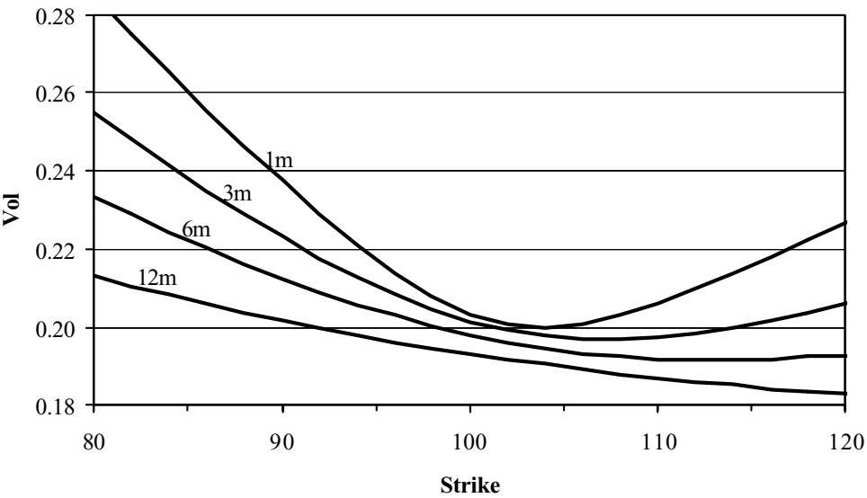

The second problem is hedging. Since di¤erent models are being used for di¤erent strikes, it is not clear that the delta and vega risks calculated at one strike are consistent with the same risks calculated at other strikes. For example, suppose that our 1 month option book is long high strike options with a total $\Delta$ risk of $+ \$ 1 M M$ , and is long low strike options with a $\Delta$ of $- \$ 1 M M$ . Is our is our option book really ¢-neutral, or do we have residual delta risk that needs to be hedged? Since di¤erent models are used at each strike, it is not clear that the risks o¤set each other. Consolidating vega risk raises similar concerns. Should we assume parallel or proportional shifts in volatility to calculate the total vega risk of our book? More explicitly, suppose that $\sigma _ { B }$ is 20% at $K = 1 0 0$ and 24% at $K = 9 0 .$ , as shown for the 1m options in …gure 2.1. Should we calculate vega by bumping $\sigma _ { B } \mathrm { \ b y } ,$ say, 0:2% for both options? Or by bumping $\sigma _ { B }$ by 0:2% for the …rst option and by 0:24% for the second option? These questions are critical to e¤ective book management, since this requires consolidating the delta and vega risks of all options on a given asset before hedging, so that only the net exposure of the book is hedged. Clearly one cannot answer these questions without a model that works for all strikes K.

<!-- page: 5 -->

The third problem concerns evolution of the implied volatility curve $\sigma _ { B } ( K )$ . Since the implied volatility $\sigma _ { B }$ depends on the strike $K _ { i }$ , it is likely to also depend on the current value f of the forward price: $\sigma _ { B } =$ $\sigma _ { B } ( f , K )$ . In this case there would be systematic changes in $\sigma _ { B }$ as the forward price f of the underlying changes See …gure 2.1. Some of the vega risks of Black’s model would actually be due to changes in the price of the underlying asset, and should be hedged more properly (and cheaply) as delta risks.

2.2. Local volatility models. An apparent solution to these problems is provided by the local volatility model of Dupire [2], which is also attributed to Derman [4], [5]. In an insightful work, Dupire essentially argued that Black was to bold in setting the coe¢cient $C ( t , * )$ to $\sigma _ { B } \ddot { F }$ . Instead one should only assume that $C$ is Markovian: $C = C ( t , { \hat { F } } )$ . Re-writing $C ( t , { \hat { F } } )$ as $\sigma _ { l o c } ( t , \hat { F } ) \hat { F }$ then yields the “local volatility model,” where the forward price of the asset is

$$
d \hat { F } = \sigma _ { l o c } ( t , \hat { F } ) \hat { F } d W , \qquad \hat { F } ( 0 ) = f ,\tag{2.5a}
$$

in the forward measure. Dupire argued that instead of theorizing about the unknown local volatility function $\sigma _ { l o c } ( t , \ddot { F } )$ , one should obtain $\sigma _ { l o c } ( t , { \hat { F } } )$ directly from the marketplace by “calibrating” the local volatility model to market prices of liquid European options.

In calibration, one starts with a given local volatility function $\sigma _ { l o c } ( t , { \hat { \boldsymbol { F } } } )$ , and evaluates

(2.5b)

$$
\begin{array} { l } { { V _ { c a l l } = D ( t _ { s e t } ) E \left\{ [ \hat { F } ( t _ { e x } ) - K ] ^ { + } | \hat { F } ( 0 ) = f , \right\} } } \\ { { \ \equiv V _ { p u t } + D ( t _ { s e t } ) ( f - K ) } } \end{array}\tag{2.5c}
$$

to obtain the theoretical prices of the options; one then varies the local volatility function $\sigma _ { l o c } ( t , { \hat { \boldsymbol { F } } } )$ until these theoretical prices match the actual market prices of the option for each strike K and exercise date $t _ { e x }$ . In practice liquid markets usually exist only for options with speci…c exercise dates $t _ { e x } ^ { 1 } , t _ { e x } ^ { 2 } , t _ { e x } ^ { 3 } , . . . ;$ for example, for 1m, 2m, 3m, 6m, and 12m from today. Commonly the local vols $\sigma _ { l o c } ( t , { \hat { F } } )$ are taken to be piecewise constant in time:

$$
\begin{array} { r l r l } & { \sigma _ { l o c } ( t , \hat { F } ) = \sigma _ { l o c } ^ { ( 1 ) } ( \hat { F } ) } & & { \mathrm { f o r ~ } t < t _ { e z } ^ { 1 } , } \\ & { \sigma _ { l o c } ( t , \hat { F } ) = \sigma _ { l o c } ^ { ( j ) } ( \hat { F } ) } & & { \mathrm { f o r ~ } t _ { e x } ^ { j - 1 } < t < t _ { e z } ^ { j } \qquad j = 2 , 3 , . . . J } \\ & { \sigma _ { l o c } ( t , \hat { F } ) = \sigma _ { l o c } ^ { ( J ) } ( \hat { F } ) } & & { \mathrm { f o r ~ } t > t _ { e z } ^ { J } } \end{array}\tag{2.6}
$$

One …rst calibrates $\sigma _ { l o c } ^ { ( 1 ) } ( \hat { F } )$ to reproduce the option prices at $t _ { e x } ^ { 1 }$ for all strikes $K$ , then calibrates $\sigma _ { l o c } ^ { ( 2 ) } ( \hat { F } )$ to reproduce the option prices at $t _ { e x } ^ { 2 }$ , for all $K ,$ and so forth . This calibration process can be greatly simpli…ed by using the results in [13] and [14]. There we solve to obtain the prices of European options under the local volatility model $2 . 5 \mathrm { a } \ - - 2 . 5 \mathrm { c }$ , and from these prices we obtain explicit algebraic formulas for the implied volatility of the local vol models.

Once $\sigma _ { l o c } ( t , { \hat { F } } )$ has been obtained by calibration, the local volatility model is a single, self-consistent model which correctly reproduces the market prices of calls (and puts) for all strikes K and exercise dates $t _ { e x }$ without “adjustment.” Prices of exotic options can now be calculated from this model without ambiguity. This model yields consistent delta and vega risks for all options, so these risks can be consolidated across strikes. Finally, perturbing f and re-calculating the option prices enables one to determine how the implied volatilites change with changes in the underlying asset price. Thus, the local volatility model thus provide a method of pricing and hedging options in the presence of market smiles and skews. It is perhaps the most popular method of managing exotic equity and foreign exchange options. Unfortunately, the local volatility model predicts the wrong dynamics of the implied volatility curve, which leads to inaccruate and often unstable hedges.

<!-- page: 6 -->

To illustrate the problem, consider the special case in which the local vol is a function of $\hat { F }$ only:

$$
d \hat { F } = \sigma _ { l o c } ( \hat { F } ) \hat { F } d W , \qquad \hat { F } ( 0 ) = f .\tag{2.7}
$$

In [13] and [14] singular perturbation methods were used to analyze this model. There it was found that European call and put prices are given by Black’s formula 2.4a - 2.4c with the implied volatility

$$
\sigma _ { B } ( K , f ) = \sigma _ { l o c } ( { \textstyle \frac { 1 } { 2 } } [ f + K ] ) \left\{ 1 + { \textstyle \frac { 1 } { 2 4 } } \frac { \sigma _ { l o c } ^ { \prime \prime } ( { \textstyle \frac { 1 } { 2 } } [ f + K ] ) } { \sigma _ { l o c } ( { \textstyle \frac { 1 } { 2 } } [ f + K ] ) } ( f - K ) ^ { 2 } + \cdots . \right.\tag{2.8}
$$

On the right hand side, the …rst term dominates the solution and the second term provides a much smaller correction The omitted terms are very small, usually less than 1% of the …rst term.

The behavior of local volatility models can be largely understood by examining the …rst term in 2.8. The implied volatility depends on both the strike K and the current forward price f: So supppose that today the forward price is $f _ { 0 }$ and the implied volatility curve seen in the marketplace is $\sigma _ { B } ^ { 0 } ( K )$ . Calibrating the model to the market clearly requires choosing the local volatility to be

$$
\sigma _ { l o c } ( \hat { F } ) = \sigma _ { B } ^ { 0 } ( 2 \hat { F } - f _ { 0 } ) \{ 1 + \cdots \} .\tag{2.9}
$$

Now that the model is calibrated, let us examine its predictions. Suppose that the forward value changes from $f _ { 0 }$ to some new value $f .$ . From 2.8, 2.9 we see that the model predicts that the new implied volatility curve is

$$
\sigma _ { B } ( K , f ) = \sigma _ { B } ^ { 0 } ( K + f - f _ { 0 } ) \{ 1 + \cdot \cdot \cdot \}\tag{2.10}
$$

for an option with strike K, given that the current value of the forward price is $f .$ In particular, if the forward price $f _ { 0 }$ increases to $f ,$ the implied volatility curve moves to the left; if $f _ { 0 }$ decreases to $f ,$ the implied volatility curve moves to the right. Local volatility models predict that the market smile/skew moves in the opposite direction as the price of the underlying asset. This is opposite to typical market behavior, in which smiles and skews move in the same direction as the underlying.

To demonstrate the problem concretely, suppose that today’s implied volatility is a perfect smile

$$
\sigma _ { B } ^ { 0 } ( K ) = \alpha + \beta [ K - f _ { 0 } ] ^ { 2 }\tag{2.11a}
$$

around today’s forward price $f _ { 0 }$ . Then equation 2.8 implies that the local volatility is

$$
\sigma _ { l o c } ( \hat { F } ) = \alpha + 3 \beta ( \hat { F } - f _ { 0 } ) ^ { 2 } + \cdot \cdot \cdot .\tag{2.11b}
$$

As the forward price $f$ evolves away from $f _ { 0 }$ due to normal market ‡uctuations, equation 2.8 predicts that the implied volatility is

$$
\begin{array} { r } { \sigma _ { B } ( K , f ) = \alpha + \beta [ K - ( \frac { 3 } { 2 } f _ { 0 } - \frac { 1 } { 2 } f ) ] ^ { 2 } + \frac { 3 } { 4 } \beta ( f - f _ { 0 } ) ^ { 2 } + \cdot \cdot \cdot . } \end{array}\tag{2.11c}
$$

. The implied volatility curve not only moves in the opposite direction as the underlying, but the curve also shifts upward regardless of whether f increases or decreases. Exact results are illustrated in …gures 2.2 - 2.4. There we assumed that the local volatility $\sigma _ { l o c } ( \hat { F } )$ was given by 2.11b, and used …nite di¤erence methods to obtain essentially exact values for the option prices, and thus implied volatilites.

Hedges calculated from the local volatility model are wrong. To see this, let $B S ( f , K , \sigma _ { B } , t _ { e x } )$ be Black’s formula 2.4a - 2.4c for, say, a call option. Under the local volatility model, the value of a call option is given by Black’s formula

$$
V _ { c a l l } = B S ( f , K , \sigma _ { B } ( K , f ) , t _ { e x } )\tag{2.12a}
$$

<!-- page: 7 -->

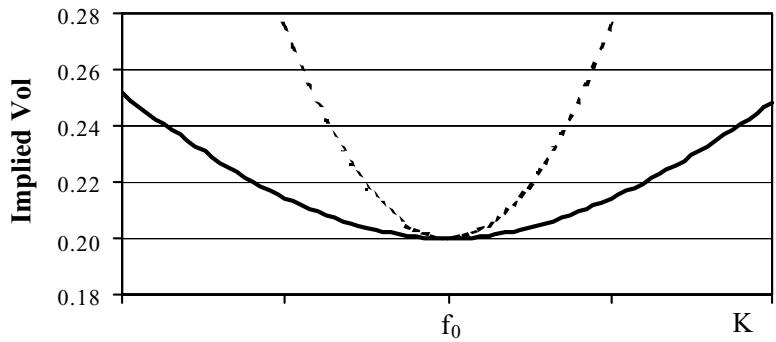

with the volatility $\sigma _ { B } ( K , f )$ given by 2.8. Di¤erentiating with respect to f yields the $\Delta$ risk

$$
\Delta \equiv \frac { \partial V _ { c a l l } } { \partial f } = \frac { \partial B S } { \partial f } + \frac { \partial B S } { \partial \sigma _ { B } } \frac { \partial \sigma _ { B } ( K , f ) } { \partial f } .\tag{2.12b}
$$

predicted by the local volatility model. The …rst term is clearly the $\Delta$ risk one would calculate from Black’s model using the implied volatility from the market. The second term is the local volatility model’s correction to the $\Delta$ risk, which consists of the Black vega risk multiplied by the predicted change in $\sigma _ { B }$ due to changes in the underlying forward price $f .$ In real markets the implied volatily moves in the opposite direction as the direction predicted by the model. Therefore, the correction term needed for real markets should have the opposite sign as the correction predicted by the local volatility model. The original Black model yields more accurate hedges than the local volatility model, even though the local vol model is self-consistent across strikes and Black’s model is inconsistent.

Local volatility models are also peculiar theoretically. Using any function for the local volatility $\sigma _ { l o c } ( t , { \hat { \boldsymbol { F } } } )$ except for a power law,

(2.13)

$$
C ( t , * ) = \alpha ( t ) \hat { F } ^ { \beta } ,\tag{2.14}
$$

$$
\sigma _ { l o c } ( t , \hat { F } ) = \alpha ( t ) \hat { F } ^ { \beta } / \hat { F } = \alpha ( t ) / \hat { F } ^ { 1 - \beta } ,
$$

<!-- page: 8 -->

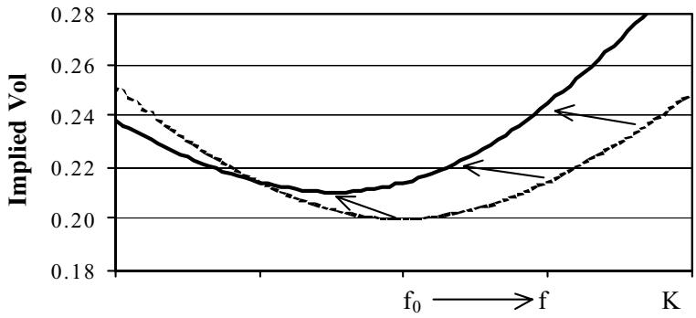

introduces an intrinsic “length scale” for the forward price $\hat { F }$ into the model. That is, the model becomes inhomogeneous in the forward price $\hat { F }$ . Although intrinsic length scales are theoretically possible, it is di¢cult to understand the …nancial origin and meaning of these scales [15], and one naturally wonders whether such scales should be introduced into a model without speci…c theoretical justi…cation.

2.3. The SABR model. The failure of the local volatility model means that we cannot use a Markovian model based on a single Brownian motion to manage our smile risk. Instead of making the model non-Markovian, or basing it on non-Brownian motion, we choose to develop a two factor model. To select the second factor, we note that most markets experience both relatively quiescent and relatively chaotic periods. This suggests that volatility is not constant, but is itself a random function of time. Respecting the preceding discusion, we choose the unknown coe¢cient $C ( t , * )$ to be $\hat { \alpha } \hat { F } ^ { \beta }$ , where the “volatility” ®^ is itself a stochastic process. Choosing the simplest reasonable process for ®^ now yields the “stochastic-®¯½ model,” which has become known as the SABR model. In this model, the forward price and volatility are

(2.15a)

$$
d \hat { F } = \hat { \alpha } \hat { F } ^ { \beta } d W _ { 1 } , \qquad \hat { F } ( 0 ) = f\tag{2.15b}
$$

$$
d \hat { \alpha } = \nu \hat { \alpha } d W _ { 2 } , \qquad \hat { \alpha } ( 0 ) = \alpha
$$

under the forward measure, where the two processes are correlated by:

$$
d W _ { 1 } d W _ { 2 } = \rho d t .\tag{2.15c}
$$

Many other stochastic volatility models have been proposed, for example [16], [17], [18], [19]; these models will be treated in section 5. However, the SABR model has the virtue of being the simplest stochastic volatility model which is homogenous in $\hat { F }$ and ®^. We shall …nd that the SABR model can be used to accurately …t the implied volatility curves observed in the marketplace for any single exercise date $t _ { e x }$ . More importantly, it predicts the correct dynamics of the implied volatility curves. This makes the SABR model an e¤ective means to manage the smile risk in markets where each asset only has a single exercise date; these markets include the swaption and caplet/‡oorlet markets.

As written, the SABR model may or may not …t the observed volatility surface of an asset which has European options at several di¤erent exercise dates; such markets include foreign exchange options and most equity options. Fitting volatility surfaces requires the dynamic SABR model which is introduced and analyzed in section 4.

<!-- page: 9 -->

It has been claimed by many authors that stochastic volatility models are models of incomplete markets, because the stochastic volatility risk cannot be hedged. This is not true. It is true that the risk to changes in ®^ (the vega risk) cannot be hedged by buying or selling the underlying asset. However, vega risk can be hedged by buying or selling options on the asset in exactly the same way that ¢-hedging is used to neutralize the risks to changes in the price $\hat { F } .$ . In practice, vega risks are hedged by buying and selling options as a matter of routine, so whether the market would be complete if these risks were not hedged is a moot question.

The SABR model 2.15a - 2.15c is analyzed in Appendix B. There singular perturbation techniques are used to obtain the prices of European options. From these prices, the options’ implied volatility $\sigma _ { B } ( K , f )$ is then obtained. The upshot of this analysis is that under the SABR model, the price of European options is given by Black’s formula,

(2.16a)

$$
V _ { c a l l } = D ( t _ { s e t } ) \{ f { \mathcal { N } } ( d _ { 1 } ) - K { \mathcal { N } } ( d _ { 2 } ) \} ,\tag{2.16b}
$$

$$
V _ { p u t } = V _ { c a l l } + D ( t _ { s e t } ) [ K - . f ] ,
$$

with

$$
d _ { 1 , 2 } = \frac { \log f / K \pm \frac { 1 } { 2 } \sigma _ { B } ^ { 2 } t _ { e x } } { \sigma _ { B } \sqrt { t _ { e x } } } ,\tag{2.16c}
$$

where the implied volatility $\sigma _ { B } ( f , K )$ is given by

$$
\begin{array}{c} \begin{array} { c c c } { \sigma _ { B } ( K , f ) = \frac { \alpha } { ( f K ) ^ { ( 1 - \beta ) / 2 } \left\{ 1 + \frac { ( 1 - \beta ) ^ { 2 } } { 2 4 } \log ^ { 2 } f / K + \frac { ( 1 - \beta ) ^ { 4 } } { 1 9 2 0 } \log ^ { 4 } f / K + \cdots \right\} } \cdot \left( \frac { z } { x ( z ) } \right) . }  \\ { { \left\{ 1 + \left[ \frac { ( 1 - \beta ) ^ { 2 } } { 2 4 } \frac { \alpha ^ { 2 } } { ( f K ) ^ { 1 - \beta } } + \frac { 1 } { 4 } \frac { \rho \beta \nu \alpha } { ( f K ) ^ { ( 1 - \beta ) / 2 } } + \frac { 2 - 3 \rho ^ { 2 } } { 2 4 } \nu ^ { 2 } \right] t _ { e x } + \cdots \ . \right.} \end{array}  }  \end{array}\tag{2.17a}
$$

Here

$$
z = \frac { \nu } { \alpha } { ( f K ) } ^ { ( 1 - \beta ) / 2 } \log f / K ,\tag{2.17b}
$$

and $x ( z )$ is de…ned by

$$
x ( z ) = \log \left\{ \frac { \sqrt { 1 - 2 \rho z + z ^ { 2 } } + z - \rho } { 1 - \rho } \right\} .\tag{2.17c}
$$

For the special case of at-the-money options, options struck at $K = f$ , this formula reduces to

$$
\sigma _ { A T M } = \sigma _ { B } ( f , f ) = \frac { \alpha } { f ^ { ( 1 - \beta ) } } \left\{ 1 + \left[ \frac { ( 1 - \beta ) ^ { 2 } } { 2 4 } \frac { \alpha ^ { 2 } } { f ^ { 2 - 2 \beta } } + { \frac { 1 } { 4 } } \frac { \rho \beta \alpha \nu } { f ^ { ( 1 - \beta ) } } + { \frac { 2 - 3 \sigma ^ { 2 } } { 2 4 } } \nu ^ { 2 } \right] t _ { e x } + \cdots . \right.\tag{2.18}
$$

These formulas are the main result of this paper. Although it appears formidable, the formula is explicit and only involves elementary trignometric functions. Implementing the SABR model for vanilla options is very easy, since once this formula is programmed, we just need to send the options to a Black pricer.In the next section we examine the qualitative behavior of this formula, and how it can be used to managing smile risk.

The complexity of the formula is needed for accurate pricing. Omitting the last line of $2 . 1 7 \mathrm { a } ,$ for example, can result in a relative error that exceeds three per cent in extreme cases. Although this error term seems small, it is large enough to be required for accurate pricing. The omitted terms $^ { 6 6 } + \cdot \cdot ^ { 5 3 }$ are much, much smaller. Indeed, even though we have derived more accurate expressions by continuing the perturbation expansion to higher order, 2.17a - 2.17c is the formula we use to value and hedge our vanilla swaptions, caps, and ‡oors. We have not implemented the higher order results, believing that the increased precision of the higher order results is super‡uous.

<!-- page: 10 -->

There are two special cases of note: $\beta = 1$ , representing a stochastic log normal model), and $\beta = 0 ;$ representing a stochastic normal model. The implied volatility for these special cases is obtained in the last section of Appendix B.

3. Managing smile risk. The complexity of the above formula for $\sigma _ { B } ( K , f )$ obscures the qualitative behavior of the SABR model. To make the model’s phenomenology and dynamics more transparent, note that formula 2.17a - 2.17c can be approximated as

$$
\begin{array} { l } { \displaystyle \sigma _ { B } ( K , f ) = \frac { \alpha } { f ^ { 1 - \beta } } \{ 1 - \frac { 1 } { 2 } ( 1 - \beta - \rho \lambda ) \log K / f  } \\ { \displaystyle  + \frac { 1 } { 1 2 } [ ( 1 - \beta ) ^ { 2 } + ( 2 - 3 \rho ^ { 2 } ) \lambda ^ { 2 } ] \log ^ { 2 } K / f + \cdots , } \end{array}\tag{3.1a}
$$

provided that the strike K is not too far from the current forward f. Here the ratio

$$
\lambda = \frac { \nu } { \alpha } f ^ { 1 - \beta }\tag{3.1b}
$$

measures the strength º of the volatility of volatility (the “volvol”) compared to the local volatility $\alpha / f ^ { 1 - \beta }$ at the current forward. Although equations 3.1a - 3.1b should not be used to price real deals, they are accurate enough to depict the qualitative behavior of the SABR model faithfully.

As f varies during normal trading, the curve that the ATM volatility $\sigma _ { B } \left( f , f \right)$ traces is known as the backbone, while the smile and skew refer to the implied volatility $\sigma _ { B } \left( K , f \right)$ as a function of strike K fo a …xed f. That is, the market smile/skew gives a snapshot of the market prices for di¤erent strikes K at a given instance, when the forward f has a speci…c price. Figures 3.1 and 3.2. show the dynamics of the smile/skew predicted by the SABR model.

Let us now consider the implied volatility $\sigma _ { B } ( K , f )$ in detail. The …rst factor $\alpha / f ^ { 1 - \beta }$ in 3.1a is the implied volatility for at-the-money (ATM) options, options whose strike K equals the current forward f. So the backbone traversed by ATM options is essentially $\sigma _ { B } ( f , f ) = \alpha / f ^ { 1 - \beta }$ for the SABR model. The backbone is almost entirely determined by the exponent $\beta ,$ with the exponent $\beta = 0$ (a stochastic Gaussian model) giving a steeply downward sloping backbone, and the exponent $\beta = 1$ giving a nearly ‡at backbone.

<!-- page: 11 -->

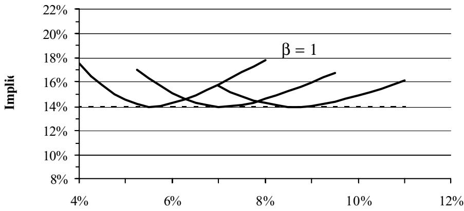

The second term $- \textstyle { \frac { 1 } { 2 } } ( 1 - \beta - \rho \lambda )$ log $K / f$ represents the skew, the slope of the implied volatility with respect to the strike K . The $- \frac { 1 } { 2 } ( 1 - \beta )$ log $K / f$ part is the beta skew, which is downward sloping since $0 \leq \beta \leq 1$ . It arises because the “local volatility” $\hat { \alpha } \hat { F } ^ { \beta } / \hat { F } ^ { 1 } = \hat { \alpha } / \hat { F } ^ { 1 - \beta }$ is a decreasing function of the forward price. The second part $\mid { \frac { \ l _ { 1 } } { \ l _ { 2 } } } \rho \lambda$ log $K / f$ is the vanna skew, the skew caused by the correlation between the volatility and the asset price. Typically the volatility and asset price are negatively correlated, so on average, the volatility $\alpha$ would decrease (increase) when the forward f increases (decreases). It thus seems unsurprising that a negative correlation $\rho$ causes a downward sloping vanna skew.

It is interesting to compare the skew to the slope of the backbone. As $f$ changes to $f ^ { \prime }$ the ATM vol changes to

$$
\sigma _ { B } ( f ^ { \prime } , f ^ { \prime } ) = \frac { \alpha } { f ^ { 1 - \beta } } \{ 1 - ( 1 - \beta ) \frac { f ^ { \prime } - f } { f } + \cdot \cdot \cdot \} .\tag{3.2a}
$$

Near $K = f ,$ the $\beta$ component of skew expands as

$$
\sigma _ { B } ( K , f ) = \frac { \alpha } { f ^ { 1 - \beta } } \{ 1 - { \textstyle \frac { 1 } { 2 } } ( 1 - \beta ) \frac { K - f } { f } + \cdot \cdot \cdot \} ,\tag{3.2b}
$$

so the slope of the backbone $\sigma _ { B } \left( f , f \right)$ is twice as steep as the slope of rthe smile $\sigma _ { B } ( K , f )$ due to the $\beta -$ component of the skew.

The last term in 3.1a also contains two parts. The …rst part ${ \textstyle \frac { 1 } { 1 2 } } ( 1 - \beta ) ^ { 2 } \log ^ { 2 } K / f$ appears to be a smile (quadratic) term, but it is dominated by the downward sloping beta skew, and, at reasonable strikes $K$ , it just modi…es this skew somewhat. The second part ${ \textstyle \frac { 1 } { 1 2 } } \big ( 2 - 3 \bar { \rho } ^ { 2 } \big ) \bar { \lambda } ^ { 2 } \log ^ { 2 } K / f$ is the smile induced by the volga (vol-gamma) e¤ect. Physically this smile arises because of “adverse selection”: unusually large movements of the forward $\hat { F }$ happen more often when the volatility ® increases, and less often when ® decreases, so strikes K far from the money represent, on average, high volatility environments.

3.1. Fitting market data. The exponent $\beta$ and correlation $\rho$ a¤ect the volatility smile in similar ways. They both cause a downward sloping skew in $\sigma _ { B } ( K , f )$ as the strike K varies. From a single market snapshot of $\sigma _ { B } ( K , f )$ as a function of K at a given $f ,$ it is di¢cult to distinguish between the two parameters.

<!-- page: 12 -->

This is demonstrated by …gure 3.3. There we …t the SABR parameters $\alpha , \rho , \nu$ with $\beta = 0$ and then re-…t the parameters $\alpha , \rho , \nu$ with $\beta = 1$ . Note that there is no substantial di¤erence in the quality of the …ts, despite the presence of market noise. This matches our general experience: market smiles can be …t equally well with any speci…c value of $\beta .$ In particular, $\beta$ cannot be determined by …tting a market smile since this would clearly amount to “…tting the noise.”

Figure 3.3 also exhibits a common data quality issue. Options with strikes $K$ away from the current forward $f$ trade less frequently than at-the-money and near-the-money options. Consequently, as $K$ moves away from $f ,$ the volatility quotes become more suspect because they are more likely to be out-of-date and not represent bona …de o¤ers to buy or sell options.

Suppose for the moment that the exponent $\beta$ is known or has been selected. Taking a snapshot of the market yields the implied volatility $\sigma _ { B } ( K , f )$ as a function of the strike K at the current forward price $f .$ With $\beta$ given, …tting the SABR model is a straightforward procedure. The three parameters $\alpha , \rho _ { ; }$ ; and º have di¤erent e¤ects on the curve: the parameter ® mainly controls the overall height of the curve, changing the correlation $\rho$ controls the curve’s skew, and changing the vol of vol º controls how much smile the curve exhibits. Because of the widely seperated roles these parameters play, the …tted parameter values tend to be very stable, even in the presence of large amounts of market noise.

The exponent $\beta$ can be determined from historical observations of the “backbone” or selected from “aesthetic considerations.” Equation 2.18 shows that the implied volatility of ATM options is

$$
\log \sigma _ { B } ( f , f ) = \log \alpha - ( 1 - \beta ) \log f + \log \left\{ 1 + [ \frac { ( 1 - \beta ) ^ { 2 } } { 2 4 } \frac { \alpha ^ { 2 } } { f ^ { 2 - 2 \beta } } + \frac { 1 } { 4 } \frac { \rho \beta \alpha \nu } { f ^ { ( 1 - \beta ) } } + \frac { 2 - 3 \rho ^ { 2 } } { 2 4 } \nu ^ { 2 } ] t _ { c x } + \cdot \cdot \cdot \right\} .\tag{3.3}
$$

The exponent $\beta$ can be extracted from a log log plot of historical observations of $f , \sigma _ { A T M }$ pairs. Since both $f$ and $\alpha$ are stochastic variables, this …tting procedure can be quite noisy, and as the $[ \cdot \cdot ] t _ { e x }$ term is typically less than one or two per cent, it is usually ignored in …tting $\beta .$

<!-- page: 13 -->

Selecting $\beta$ from “aesthetic” or other a priori considerations usually results in $\beta = 1$ (stochastic lognormal), $\beta = 0$ (stochastic normal), or $\beta = \textstyle { \frac { 1 } { 2 } }$ (stochastic CIR) models. Proponents of $\beta = 1$ cite log normal models as being “more natural.” or believe that the horizontal backbone best represents their market. These proponents often include desks trading foreign exchange options. Proponents of $\beta = 0$ usually believe that a normal model, with its symmetric break-even points, is a more e¤ective tool for managing risks, and would claim that $\beta = 0$ is essential for trading markets like Yen interest rates, where the forwards $f$ can be negative or near zero. Proponents of $\beta = \textstyle { \frac { 1 } { 2 } }$ are usually US interest rate desks that have developed trust in CIR models.

It is usually more convenient to use the at-the-money volatility $\sigma _ { A T M } , \beta , \rho ,$ and º as the SABR parameters instead of the original parameters $\alpha , \beta , \rho , \nu .$ :The parameter ® is then found whenever needed by inverting 2.18 on the ‡y; this inversion is numerically easy since the $[ \cdot \cdot \cdot ] t _ { e x }$ term is small. With this parameterization, …tting the SABR model requires …tting $\rho$ and º to the implied volatility curve, with $\sigma _ { A T M }$ and $\beta$ given. In many markets, the ATM volatilities need to be updated frequently, say once or twice a day, while the smiles and skews need to be updated infrequently, say once or twice a month. With the new parameterization, $\sigma _ { A T M }$ can be updated as often as needed, with $\rho , \nu$ (and ¯) updated only as needed.

Let us apply SABR to options on US dollar interest rates. There are three key groups of European options on US rates: Eurodollar future options, caps/‡oors, and European swaptions. Eurodollar future options are exchange-traded options on the 3 month Libor rate; like interest rate futures, EDF options are quoted on $1 0 0 ( 1 - r _ { L i b o r } )$ . Figure 1.1 …ts the SABR model (with $\beta = 1 )$ to the implied volatility for the June 99 contracts, and …gures $3 . 4 \textrm { - } 3 . 7 $ …t the model (also with $\beta = 1 )$ to the implied volatility for the September 99, December 99, and March 00 contracts. All prices were obtained from Bloomberg Information Services on March 23, 1999. Two points are shown for the same strike where there are quotes for both puts and calls. Note that market liquidity dries up for the later contracts, and for strikes that are too far from the money. Consequently, more market noise is seen for these options.

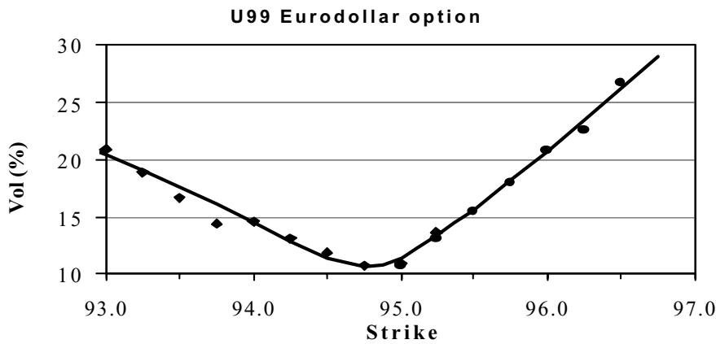

Caps and ‡oors are sums of caplets and ‡oorlets; each caplet and ‡oorlet is a European option on the 3 month Libor rate. We do not consider the cap/‡oor market here because the broker-quoted cap prices must be “stripped” to obtain the caplet volatilities before SABR can be applied.

A m year into n year swaption is a European option with m years to the exercise date (the maturity); if it is exercised, then one receives an n year swap (the tenor, or underlying) on the 3 month Libor rate. See Appendix A. For almost all maturities and tenors, the US swaption market is liquid for at-the-money swaptions, but is ill-liquid for swaptions struck away from the money. Hence, market data is somewhat suspect for swaptions that are not struck near the money. Figures 3.8 - 3.11 …ts the SABR model (with $\beta = 1 )$ to the prices of m into5Y swaptions observed on April 28, 2000. Data supplied courtesy of Cantor-Fitzgerald.

<!-- page: 14 -->

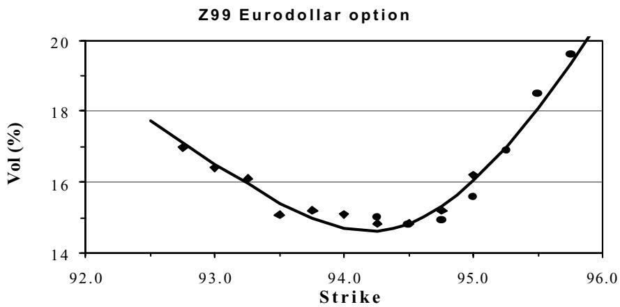

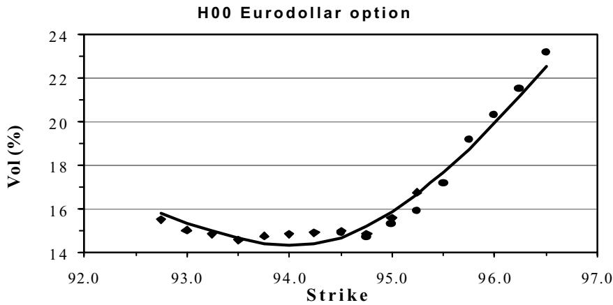

We observe that the smile and skew depend heavily on the time-to-exercise for Eurodollar future options and swaptions. The smile is pronounced for short-dated options and ‡attens for longer dated options; the skew is overwhelmed by the smile for short-dated options, but is important for long-dated options. This picture is con…rmed tables 3.1 and 3.2. These tables show the values of the vol of vol º and correlation ½ obtained by …tting the smile and skew of each “m into n” swaption, again using the data from April 28, 2000. Note that the vol of vol º is very high for short dated options, and decreases as the time-to-exercise increases, while the correlations starts near zero and becomes substantially negative. Also note that there is little dependence of the market skew/smile on the length of the underlying swap; both º and ½ are fairly constant across each row. This matches our general experience: in most markets there is a strong smile fo short-dated options which relaxes as the time-to-expiry increases; consequently the volatility of volatility º is large for short dated options and smaller for long-dated options, regardless of the particular underlying. Our experience with correlations is less clear: in some markets a nearly ‡at skew for short maturity options develops into a strongly downward sloping skew for longer maturities. In other markets there is a strong downward skew for all option maturities, and in still other markets the skew is close to zero for all maturities

<!-- page: 15 -->

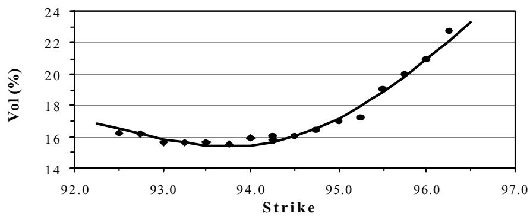

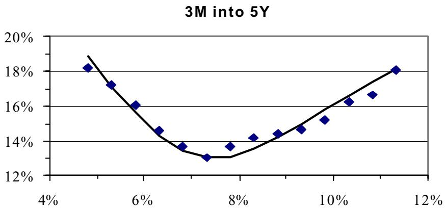

3.2. Managing smile risk. After choosing ¯ and …tting $\rho , \nu ,$ and either ® or $\sigma _ { A T M }$ , the SABR model

(3.4a)

$$
d \hat { F } = \hat { \alpha } \hat { F } ^ { \beta } d W _ { 1 } , \qquad \hat { F } ( 0 ) = f\tag{3.4b}
$$

$$
d \hat { \alpha } = \nu \hat { \alpha } d W _ { 2 } , \qquad \hat { \alpha } ( 0 ) = \alpha\tag{with}
$$

$$
d W _ { 1 } d W _ { 2 } = \rho d t\tag{3.4c}
$$

<!-- page: 16 -->

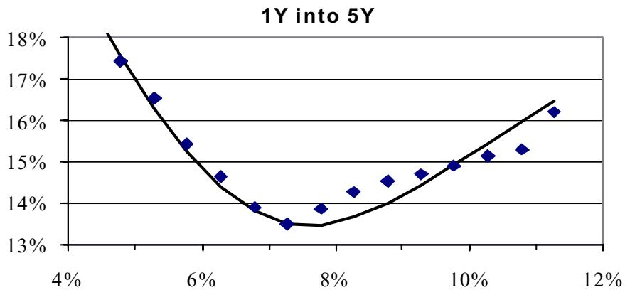

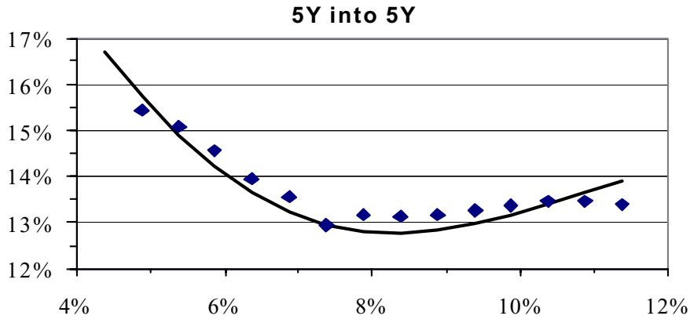

…ts the smiles and skews observed in the market quite well, especially considering the quality of price quotes away from the money . Let us take for granted that it …ts well enough. Then we have a single, self-consistent model that …ts the option prices for all strikes K without “adjustment,” so we can use this model to price exotic options without ambiguity. The SABR model also predicts that whenever the forward price f changes, the the implied volatility curve shifts in the same direction and by the same amount as the price f. This predicted dynamics of the smile matches market experience. $\mathrm { I f } \ \beta < 1$ , the “backbone” is downward sloping, so the shift in the implied volatility curve is not purely horizontal. Instead, this curve shifts up and down as the at-the-money point traverses the backbone. Our experience suggests that the parameters ½ and º are very stable (¯ is assumed to be a given constant), and need to be re-…t only every few weeks. This stability may be because the SABR model reproduces the usual dynamics of smiles and skews. In contrast, the at-the-money volatility ¾ATM , or, equivalently, ® may need to be updated every few hours in fast-paced markets.

Since the SABR model is a single self-consistent model for all strikes K, the risks calculated at one strike are consistent with the risks calculated at other strikes. Therefore the risks of all the options on the same asset can be added together, and only the residual risk needs to be hedged.

<!-- page: 17 -->

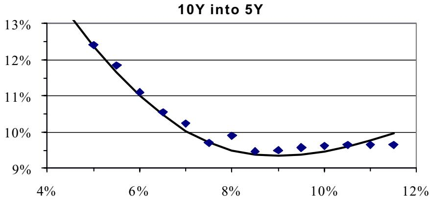

[Table source crop](assets/tables/2002-hagan-et-al-managing-smile-risk-p0017-block-0002-227a41f5a743a9a0.jpg)
Fig. 3.11. Volatilities of 10 year into 5 year options Table 3.1 Volatility of volatility º for European swaptions. Rows are time-to-exercise; columns are tenor of the underlying swap.

Let us set aside the $\Delta$ risk for the moment, and calculate the other risks. Let $B S ( f , K , \sigma _ { B } , t _ { e x } )$ be Black’s formula 2.4a - 2.4c for, say, a call option. According to the SABR model, the value of a call is

$$
V _ { c a l l } = B S ( f , K , \sigma _ { B } ( K , f ) , t _ { e x } )\tag{3.5}
$$

where the volatility $\sigma _ { B } ( K , f ) \equiv \sigma _ { B } ( K , f ; \alpha , \beta , \rho , \nu )$ is given by equations 2.17a - 2.17c. Di¤erentiating1 with respect to ® yields the vega risk, the risk to overall changes in volatility:

$$
\frac { \partial V _ { c a l l } } { \partial \alpha } = \frac { \partial B S } { \partial \sigma _ { B } } \cdot \frac { \partial \sigma _ { B } ( K , f ; \alpha , \beta , \rho , \nu ) } { \partial \alpha } .\tag{3.6}
$$

This risk is the change in value when ® changes by a unit amount. It is traditional to scale vega so that it represents the change in value when the ATM volatility changes by a unit amount. Since $\delta \sigma _ { A T M } =$

1 In practice risks are calculated by …nite di¤erences: valuing the option at ®, re-valuing the option after bumping the forward to ® + ±, and then subtracting to determine the risk This saves di¤erentiating complex formulas such as 2.17a - 2.17c.

<!-- page: 18 -->

[Table source crop](assets/tables/2002-hagan-et-al-managing-smile-risk-p0018-block-0001-f1a5d225cd008cdd.jpg)
Table 3.2 Matrix of correlations ½ be tween the underlying and the volatility for European swaptons.

$( \partial \sigma _ { A T M } / \partial \alpha ) \delta \alpha$ , the vega risk is

$$
{ \mathrm { v e g a } } \equiv { \frac { \partial V _ { c a l l } } { \partial \alpha } } = { \frac { \partial B S } { \partial \sigma _ { B } } } \cdot { \frac { { \frac { \partial \sigma _ { B } ( K , f ; \alpha , \beta , \rho , \nu ) } { \partial \alpha } } } { \frac { \partial \sigma _ { A T M } ( f ; \alpha , \beta , \rho , \nu ) } { \partial \alpha } } }\tag{3.7a}
$$

where $\sigma _ { A T M } ( f ) = \sigma _ { B } ( f , f )$ is given by 2.18. Note that to leading order, $\partial \sigma _ { B } / \partial \alpha \approx \sigma _ { B } / \alpha$ and @¾ $A T M /$ @® $\sigma _ { A T M } / \alpha$ , so the vega risk is roughly given by

$$
\begin{array} { r } { \mathrm { v e g a } \approx \displaystyle \frac { \partial B S } { \partial \sigma _ { B } } \cdot \frac { \sigma _ { B } ( K , f ) } { \sigma _ { A T M } ( f ) } = \frac { \partial B S } { \partial \sigma _ { B } } \cdot \frac { \sigma _ { B } ( K , f ) } { \sigma _ { B } ( f , f ) } . } \end{array}\tag{3.7b}
$$

Qualitatively, then, vega risks at di¤erent strikes are calculated by bumping the implied volatility at each strike K by an amount that is proportional to the implied volatiity $\sigma _ { B } ( K , f )$ at that strike. That is, in using equation 3.7a, we are essentially using proportional, and not parallel, shifts of the volatility curve to calculate the total vega risk of a book of options.

Since $\rho$ and º are determined by …tting the implied volatility curve observed in the marketplace, the SABR model has risks to $\rho$ and º changing. Borrowing terminology from foreign exchange desks, vanna is the risk to $\rho$ changing and volga (vol gamma) is the risk to º changing:

(3.8a)

$$
{ \mathrm { \ v a n n a } } = { \frac { \partial V _ { c a l l } } { \partial \rho } } = { \frac { \partial B S } { \partial \sigma _ { B } } } \cdot { \frac { \partial \sigma _ { B } ( K , f ; \alpha , \beta , \rho , \nu ) } { \partial \rho } } ,\tag{3.8b}
$$

$$
\mathrm { v o l g a } = { \frac { \partial V _ { c a l l } } { \partial \nu } } = { \frac { \partial B S } { \partial \sigma _ { B } } } \cdot { \frac { \partial \sigma _ { B } ( K , f ; \alpha , \beta , \rho , \nu ) } { \partial \nu } } .
$$

Vanna basically expresses the risk to the skew increasing, and volga expresses the risk to the smile becoming more pronounced. These risks are easily calculated by using …nite di¤erences on the formula for $\sigma _ { B }$ in equations $2 . 1 7 \mathrm { a \mathrm { ~ - ~ } 2 . 1 7 \mathrm { c } }$ . If desired, these risks can be hedged by buying or selling away-from-the-money options.

The delta risk expressed by the SABR model depends on whether one uses the parameterization $\alpha ,$ $\beta , \ \rho ,$ º or $\sigma _ { A T M } , \beta , \rho , \nu .$ . Suppose …rst we use the parameterization $\alpha , ~ \beta , ~ \rho , ~ \nu ,$ so that $\sigma _ { B } ( K , f ) \equiv$ $\sigma _ { B } ( K , f ; \alpha , \beta , \rho , \nu )$ . Di¤erentiating respect to f yields the ¢ risk

$$
\Delta \equiv \frac { \partial V _ { c a l l } } { \partial f } = \frac { \partial B S } { \partial f } + \frac { \partial B S } { \partial \sigma _ { B } } \frac { \partial \sigma _ { B } ( K , f ; \alpha , \beta , \rho , \nu ) } { \partial f } .\tag{3.9}
$$

<!-- page: 19 -->

The …rst term is the ordinary $\Delta$ risk one would calculate from Black’s model. The second term is the SABR model’s correction to the $\Delta$ risk. It consists of the Black vega times the predicted change in the implied volatility $\sigma _ { B }$ caused by the change in the forward $f .$ As discussed above, the predicted change consists of a sideways movement of the volatility curve in the same direction (and by the same amount) as the change in the forward price $f .$ In addition, if $\beta < 1$ the volatility curve rises and falls as the at-the-money point traverses up and down the backbone. There may also be minor changes to the shape of the skew/smile due to changes in $f .$

Now suppose we use the parameterization $\sigma _ { A M T } , \beta , \rho , \nu .$ Then ® is a function of ¾ATM and $f$ de…ned implicitly by 2.18. Di¤erentiating 3.5 now yields the $\Delta$ risk

$$
\Delta \equiv \frac { \partial B S } { \partial f } + \frac { \partial B S } { \partial \sigma _ { B } } \left\{ \frac { \partial \sigma _ { B } ( K , f ; \alpha , \beta , \rho , \nu ) } { \partial f } + \frac { \partial \sigma _ { B } ( K , f ; \alpha , \beta , \rho , \nu ) } { \partial \alpha } \frac { \partial \alpha ( \sigma _ { A T M } , f ) } { \partial f } \right\} .\tag{3.10}
$$

The delta risk is now the risk to changes in $f$ with $\sigma _ { A T M }$ held …xed. The last term is just the change in ® needed to keep $\sigma _ { A T M }$ constant while $f$ changes. Clearly this last term must just cancel out the vertical component of the backbone, leaving only the sideways movement of the implied volatilty curve. Note that this term is zero for $\beta = 1$

Theoretically one should use the $\Delta$ from equation 3.9 to risk manage option books. In many markets, however, it may take several days for volatilities $\sigma _ { B }$ to change following signi…cant changes in the forward price $f .$ In these markets, using $\Delta$ from 3.10 is a much more e¤ective hedge. For suppose one used $\Delta$ from equation 3.9. Then, when the volatility $\sigma _ { A T M }$ did not immediately change following a change in $f ,$ one would be forced to re-mark ® to compensate, and this re-marking would change the $\Delta$ hedges. As $\sigma _ { A T M }$ equilibrated over the next few days, one would mark ® back to its original value, which would change the $\Delta$ hedges back to their original value. This “hedging chatter” caused by market delays can prove to be costly.

## 4. The dynamic SABR model. Quote results for smile and skew.

For each exercise date, same smile as in the static SABR model! Same smile dynamics!

Calibrating volatility surface is no harder than calibrating smile.

Show some results. FX options?

## 5. Conclusions. Other models. Give results for other models

SABR and dynamic SABR have the advantage of being the simplest models which can be used to risk-manage smiles/skews.

## Appendix A. Martingale pricing.

Quote martingale theory. Derive the martingale pricing formulas for general options and for swaptions.

## Appendix B. Analysis of the SABR model.

Here we use singular perturbation techniques to price European options under the SABR model. Our analysis is based on a small volatility expansion, where we take both the volatility ®^ and the “volvol” º to be small. To carry out this analysis in a systematic fashion, we re-write $\hat { \alpha } \longrightarrow \varepsilon \hat { \alpha }$ ; and $\nu \longrightarrow \varepsilon \nu ,$ and analyze

(B.1a)

$$
d \hat { F } = \varepsilon \hat { \alpha } C ( \hat { F } ) d W _ { 1 } ,\tag{B.1b}
$$

$$
d \hat { \alpha } = \varepsilon \nu \hat { \alpha } d W _ { 2 } ,
$$

with

$$
d W _ { 1 } d W _ { 2 } = \rho d t ,\tag{B.1c}
$$

in the limit $\varepsilon \ll 1$ . This is the distinguished limit [21], [22] in the language of singular perturbation theory. After obtaining the results we replace $\varepsilon { \hat { \alpha } } \longrightarrow { \hat { \alpha } }$ ; and $\varepsilon \nu \longrightarrow \nu$ to get the answer in terms of the original

<!-- page: 20 -->

variables. We …rst analyze the model with a general $C ( \hat { F } )$ , and then specialize the results to the power law ${ \hat { F } } ^ { \beta }$ . This is notationally simpler than working with the power law throughout, and the more general result may prove valuable in some future application.

We …rst use the forward Kolmogorov equation to simplify the option pricing problem. Suppose the economy is in state $\hat { F } ( t ) = f , \hat { \alpha } ( t ) = \alpha$ at date t. De…ne the probability density $p ( t , f , \alpha ; T , F , A )$ by

$$
p ( t , f , \alpha ; T , F , A ) d F d A = \mathrm { p r o b } \left\{ F < \hat { F } ( T ) < F + d F , ~ A < \hat { \alpha } ( T ) < A + d A \Bigm | \hat { F } ( t ) = f , ~ \hat { \alpha } ( t ) = \alpha \right\} .\tag{B.2}
$$

As a function of the forward variables $T , F , A$ ; the density p satis…es the forward Kolmogorov equation (the F½okker-Planck equation)

$$
\begin{array} { r } { p _ { T } = \frac { 1 } { 2 } \varepsilon ^ { 2 } A ^ { 2 } [ C ^ { 2 } ( F ) p ] _ { F F } + \varepsilon ^ { 2 } \rho \nu [ A ^ { 2 } C ( F ) p ] _ { F A } + \frac { 1 } { 2 } \varepsilon ^ { 2 } \nu ^ { 2 } [ A ^ { 2 } p ] _ { A A } \qquad \mathrm { f o r } T > t , } \end{array}\tag{B.3a}
$$

with

$$
p = \delta ( F - f ) \delta ( A - \alpha ) \qquad { \mathrm { a t ~ } } T = t ,\tag{B.3b}
$$

as is well-known [24], [25], [26]. Here, and throughout, we use subscripts to denote partial derivatives.

Let $V ( t , f , \alpha )$ be the value of a European call option at date t, when the economy is in state ${ \hat { F } } ( t ) =$ $f , \ { \hat { \alpha } } ( t ) = \alpha$ . Let $t _ { e x }$ be the option’s exercise date, and let $K$ be its strike. Omitting the discount factor $D ( t _ { s e t } )$ , which factors out exactly, the value of the option is

$$
\begin{array} { l } { { \displaystyle V ( t , f , \alpha ) = E \left\{ [ \hat { F } ( t _ { e x } ) - K ] ^ { + } \mid \hat { F } ( t ) = f , \ \hat { \alpha } ( t ) = \alpha \right\} } } \\ { { \displaystyle \qquad = \int _ { - \infty } ^ { \infty } \int _ { K } ^ { \infty } ( F - K ) p ( t , f , \alpha ; t _ { e x } , F , A ) d F d A . } } \end{array}\tag{B.4}
$$

See 2.1a. Since

$$
p ( t , f , \alpha ; t _ { e x } , F , A ) = \delta ( F - f ) \delta ( A - \alpha ) + \int _ { t } ^ { t _ { e x } } p _ { T } ( t , f , \alpha ; T , F , A ) d T ,\tag{B.5}
$$

we can re-write $V ( t , f , \alpha )$ as

$$
V ( t , f , \alpha ) = [ f - K ] ^ { + } + \int _ { t } ^ { t _ { e x } } \int _ { K } ^ { \infty } \int _ { - \infty } ^ { \infty } ( F - K ) p _ { T } ( t , f , \alpha ; T , F , A ) d A d F d T .\tag{B.6}
$$

We substitute B.3a for $p _ { T }$ into B.6. Integrating the A derivatives $\varepsilon ^ { 2 } \rho \nu [ A ^ { 2 } C ( F ) p ] _ { F A }$ and $\begin{array} { r } { \frac { 1 } { 2 } \varepsilon ^ { 2 } \nu ^ { 2 } [ A ^ { 2 } p ] _ { A A } } \end{array}$ over all A yields zero. Therefore our option price reduces to

$$
V ( t , f , \alpha ) = [ f - K ] ^ { + } + { \textstyle \frac { 1 } { 2 } } \varepsilon ^ { 2 } \int _ { t } ^ { t _ { e x } } \int _ { - \infty } ^ { \infty } \int _ { K } ^ { \infty } A ^ { 2 } \left( F - K \right) [ C ^ { 2 } ( F ) p ] _ { F F } d F d A d T ,\tag{B.7}
$$

where we have switched the order of integration. Integrating by parts twice with respect to $F$ now yields

$$
V ( t , f , \alpha ) = [ f - K ] ^ { + } + { \textstyle \frac { 1 } { 2 } } \varepsilon ^ { 2 } C ^ { 2 } ( K ) \int _ { t } ^ { t _ { e x } } \int _ { - \infty } ^ { \infty } A ^ { 2 } p ( t , f , \alpha ; T , K , A ) d A d T .\tag{B.8}
$$

The problem can be simpli…ed further by de…ning

$$
P ( t , f , \alpha ; T , K ) = \int _ { - \infty } ^ { \infty } A ^ { 2 } p ( t , f , \alpha ; T , K , A ) d A .\tag{B.9}
$$

<!-- page: 21 -->

Then P satis…es the backward’s Kolmogorov equation [24], [25], [26]

(B.10a)

$$
\begin{array} { r } { P _ { t } + \frac { 1 } { 2 } \varepsilon ^ { 2 } \alpha ^ { 2 } C ^ { 2 } ( f ) P _ { f f } + \varepsilon ^ { 2 } \rho \nu \alpha ^ { 2 } C ( f ) P _ { f \alpha } + \frac { 1 } { 2 } \varepsilon ^ { 2 } \nu ^ { 2 } \alpha ^ { 2 } P _ { \alpha \alpha } = 0 , \qquad \mathrm { f o r } t < T } \end{array}\tag{B.10b}
$$

$$
P = \alpha ^ { 2 } \delta ( f - K ) , \quad \quad \mathrm { f o r } t = T .
$$

Since t does not appear explicitly in this equation, P depends only on the combination $T - t ,$ and not on t and T separately. So de…ne

$$
\tau = T - t , \qquad \tau _ { e x } = t _ { e x } - t .\tag{B.11}
$$

Then our pricing formula becomes

$$
V ( t , f , \alpha ) = [ f - K ] ^ { + } + { \textstyle \frac { 1 } { 2 } } \varepsilon ^ { 2 } C ^ { 2 } ( K ) \int _ { 0 } ^ { \tau _ { e x } } P ( \tau , f , \alpha ; K ) d \tau\tag{B.12}
$$

where $P ( \tau , f , \alpha ; K )$ is the solution of the problem

(B.13a)

$$
\begin{array} { r } { P _ { \tau } = \frac { 1 } { 2 } \varepsilon ^ { 2 } \alpha ^ { 2 } C ^ { 2 } ( f ) P _ { f f } + \varepsilon ^ { 2 } \rho \nu \alpha ^ { 2 } C ( f ) P _ { f \alpha } + \frac { 1 } { 2 } \varepsilon ^ { 2 } \nu ^ { 2 } \alpha ^ { 2 } P _ { \alpha \alpha } , \qquad \mathrm { f o r } \ \tau > 0 , } \end{array}\tag{B.13b}
$$

$$
P = \alpha ^ { 2 } \delta ( f - K ) , \qquad \mathrm { f o r } \ \tau = 0 .
$$

In this appendix we solve B.13a, B.13b to obtain $P ( \tau , f , \alpha ; K )$ , and then substitute this solution into B.12 to obtain the option value $V ( t , f , \alpha )$ . This yields the option price under the SABR model, but the resulting formulas are awkward and not very useful. To cast the results in a more usable form, we re-compute the option price under the normal model

$$
d { \hat { F } } = \sigma _ { N } d W ,\tag{B.14a}
$$

and then equate the two prices to determine which normal volatility $\sigma _ { N }$ needs to be used to reproduce the option’s price under the SABR model. That is, we …nd the “implied normal volatility” of the option under the SABR model. By doing a second comparison between option prices under the log normal model

$$
d { \hat { F } } = \sigma _ { B } { \hat { F } } d W\tag{B.14b}
$$

and the normal model, we then convert the implied normal volatility to the usual implied log-normal (Black-Scholes) volatility. That is, we quote the option price predicted by the SABR model in terms of the option’s implied volatility.

B.1. Singular perturbation expansion. Using a straightforward perturbation expansion would yield a Gaussian density to leading order,

$$
P = { \frac { \alpha } { \sqrt { 2 \pi \varepsilon ^ { 2 } C ^ { 2 } ( K ) \tau } } } e ^ { - { \frac { ( f - K ) ^ { 2 } } { 2 \varepsilon ^ { 2 } \alpha ^ { 2 } C ^ { 2 } ( K ) \tau } } } \{ 1 + \cdot \cdot \cdot \} .\tag{B.15a}
$$

Since the $^ { 6 6 } + \cdot \cdot \cdot ^ { 5 5 }$ involves powers of $( f - K ) / \varepsilon \alpha C ( K )$ , this expansion would become inaccurate as soon as $( f - K ) C ^ { \prime } ( K ) / C ( K )$ becomes a signi…cant fraction of $1 ; \ { \mathrm { i . e . } }$ , as soon as $C ( f )$ and $C ( K )$ are signi…cantly di¤erent. Stated di¤erently, small changes in the exponent cause much greater changes in the probability density. A better approach is to re-cast the series as

$$
P = { \frac { \alpha } { \sqrt { 2 \pi \varepsilon ^ { 2 } C ^ { 2 } ( K ) \tau } } } e ^ { - { \frac { ( f - K ) ^ { 2 } } { 2 \varepsilon ^ { 2 } \alpha ^ { 2 } C ^ { 2 } ( K ) \tau } } \{ 1 + \cdots \} }\tag{B.15b}
$$

<!-- page: 22 -->

and expand the exponent, since one expects that only small changes to the exponent will be needed to e¤ect the much larger changes in the density. This expansion also describes the basic physics better — P is essentially a Gaussian probability density which tails o¤ faster or slower depending on whether the “di¤usion coe¢cient” $C ( f )$ decreases or increases.

We can re…ne this approach by noting that the exponent is the integral

$$
{ \frac { ( f - K ) ^ { 2 } } { 2 \varepsilon ^ { 2 } \alpha ^ { 2 } C ^ { 2 } ( K ) \tau } } \{ 1 + \cdots \} = { \frac { 1 } { 2 \tau } } \left( { \frac { 1 } { \varepsilon \alpha } } \int _ { K } ^ { f } { \frac { d f ^ { \prime } } { C ( f ^ { \prime } ) } } \right) ^ { 2 } \{ 1 + \cdots \} .\tag{B.16}
$$

Suppose we de…ne the new variable

$$
z = \frac { 1 } { \varepsilon \alpha } \int _ { K } ^ { f } \frac { d f ^ { \prime } } { C ( f ^ { \prime } ) } .\tag{B.17}
$$

so that the solution $P$ is essentially $e ^ { - z ^ { 2 } / 2 }$ . To leading order, the density is Gaussian in the variable $z ,$ which is determined by how “easy” or “hard” it is to di¤use from K to $f ,$ which closely matches the underlying physics. The fact that the Gaussian changes by orders of magnitude as $z ^ { 2 }$ increases should be largely irrelevent to the quality of the expansion. This approach is directly related to the geometric optics technique that is so successful in wave propagation and quantum electronics [27], [22]. To be more speci…c, we shall use the near identity transform method to carry out the geometric optics expansion. This method, pioneered in [28], transforms the problem order-by-order into a simple canonical problem, which can then be solved trivially. Here we obtain the solution only through $O ( \varepsilon ^ { 2 } )$ , truncating all higher order terms.

Let us change variables from $f$ to

$$
z = \frac { 1 } { \varepsilon \alpha } \int _ { K } ^ { f } \frac { d f ^ { \prime } } { C ( f ^ { \prime } ) } ,\tag{B.18a}
$$

and to avoid confusion, we de…ne

$$
B ( \varepsilon \alpha z ) = C ( f ) .\tag{B.18b}
$$

Then

$$
\begin{array} { r } { \frac { \partial } { \partial f } \longrightarrow \frac { 1 } { \varepsilon \alpha C ( f ) } \frac { \partial } { \partial z } = \frac { 1 } { \varepsilon \alpha B ( \varepsilon \alpha z ) } \frac { \partial } { \partial z } , \qquad \frac { \partial } { \partial \alpha } \longrightarrow \frac { \partial } { \partial \alpha } - \frac { z } { \alpha } \frac { \partial } { \partial z } , } \end{array}\tag{B.19a}
$$

and

(B.19b)

$$
\frac { \partial ^ { 2 } } { \partial f ^ { 2 } } \longrightarrow \frac { 1 } { \varepsilon ^ { 2 } \alpha ^ { 2 } B ^ { 2 } ( \varepsilon \alpha z ) } \left\{ \frac { \partial ^ { 2 } } { \partial z ^ { 2 } } - \varepsilon \alpha \frac { B ^ { \prime } ( \varepsilon \alpha z ) } { B ( \varepsilon \alpha z ) } \frac { \partial } { \partial z } \right\} ,\tag{B.19c}
$$

$$
\frac { \partial ^ { 2 } } { \partial f \partial \alpha } \longrightarrow \frac { 1 } { \varepsilon \alpha B ( \varepsilon \alpha z ) } \left\{ \frac { \partial ^ { 2 } } { \partial z \partial \alpha } - \frac { z } { \alpha } \frac { \partial ^ { 2 } } { \partial z ^ { 2 } } - \frac { 1 } { \alpha } \frac { \partial } { \partial z } \right\} ,\tag{B.19d}
$$

$$
\begin{array} { r } { \frac { \partial ^ { 2 } } { \partial \alpha ^ { 2 } } \longrightarrow \frac { \partial ^ { 2 } } { \partial \alpha ^ { 2 } } - \frac { 2 z } { \alpha } \frac { \partial ^ { 2 } } { \partial z \partial \alpha } + \frac { z ^ { 2 } } { \alpha ^ { 2 } } \frac { \partial ^ { 2 } } { \partial z ^ { 2 } } + \frac { 2 z } { \alpha ^ { 2 } } \frac { \partial } { \partial z } . } \end{array}
$$

Also,

$$
\delta ( f - K ) = \delta ( \varepsilon \alpha z C ( K ) ) = \frac { 1 } { \varepsilon \alpha C ( K ) } \delta ( z ) .\tag{B.19e}
$$

<!-- page: 23 -->

Therefore, B.12 through B.13b become

$$
V ( t , f , a ) = [ f - K ] ^ { + } + { \textstyle \frac { 1 } { 2 } } \varepsilon ^ { 2 } C ^ { 2 } ( K ) \int _ { 0 } ^ { \tau _ { e x } } P ( \tau , z , \alpha ) d \tau ,\tag{B.20}
$$

where $P ( \tau , z , \alpha )$ is the solution of

(B.21a)

$$
\begin{array} { l } { { P _ { \tau } = { \frac { 1 } { 2 } } \left( 1 - 2 \varepsilon \rho \nu z + \varepsilon ^ { 2 } \nu ^ { 2 } z ^ { 2 } \right) P _ { z z } - { \frac { 1 } { 2 } } \varepsilon a { \frac { B ^ { \prime } } { B } } P _ { z } + ( \varepsilon \rho \nu - \varepsilon ^ { 2 } \nu ^ { 2 } z ) ( \alpha P _ { z \alpha } - P _ { z } ) } } \\ { { + { \frac { 1 } { 2 } } \varepsilon ^ { 2 } \nu ^ { 2 } \alpha ^ { 2 } P _ { \alpha a } \qquad \mathrm { f o r } \ \tau > 0 } } \end{array}\tag{B.21b}
$$

$$
P = { \frac { \alpha } { \varepsilon C ( K ) } } \delta ( z ) \qquad { \mathrm { a t ~ } } \tau = 0 .
$$

Accordingly, let us de…ne $\hat { P } ( \tau , z , \alpha )$ by

$$
\hat { P } = \frac { \varepsilon } { \alpha } C ( K ) P .\tag{B.22}
$$

In terms of $\hat { P } _ { ; }$ , we obtain

$$
V ( t , f , a ) = [ f - K ] ^ { + } + { \textstyle \frac { 1 } { 2 } } \varepsilon \alpha C ( K ) \int _ { 0 } ^ { \tau _ { e x } } \hat { P } ( \tau , z , \alpha ) d \tau ,\tag{B.23}
$$

where $\hat { P } ( \tau , z , \alpha )$ is the solution of

(B.24a)

$$
\begin{array} { r l } & { \hat { P } _ { \tau } = \frac { 1 } { 2 } \left( 1 - 2 \varepsilon \rho \nu z + \varepsilon ^ { 2 } \nu ^ { 2 } z ^ { 2 } \right) \hat { P } _ { \tilde { z } \tilde { z } } - \frac { 1 } { 2 } \varepsilon a \frac { B ^ { \prime } } { B } \hat { P } _ { \tilde { z } } + ( \varepsilon \rho \nu - \varepsilon ^ { 2 } \nu ^ { 2 } z ) \alpha \hat { P } _ { \tilde { z } \alpha } } \\ & { \qquad + \frac { 1 } { 2 } \varepsilon ^ { 2 } \nu ^ { 2 } ( \alpha ^ { 2 } \hat { P } _ { \alpha \alpha } + 2 \alpha \hat { P } _ { \alpha } ) \qquad \mathrm { f o r ~ } \tau > 0 , } \end{array}\tag{B.24b}
$$

$$
\hat { P } = \delta ( z ) \qquad \mathrm { a t } ~ \tau = 0 .
$$

To leading order $\hat { P }$ is the solution of the standard di¤usion problem $\begin{array} { r } { \hat { P } _ { \tau } = \frac { 1 } { 2 } \hat { P } _ { z } , } \end{array}$ with $\hat { P } = \delta ( z )$ at $\tau = 0 .$ So it is a Gaussian to leading order. The next stage is to transform the problem to the standard di¤usion problem through $O ( \varepsilon )$ , and then through $O ( \varepsilon ^ { 2 } ) , \ldots ,$ . This is the near identify transform method which has proven so powerful in near-Hamiltonian systems [28].

Note that the variable ® does not enter the problem for $\hat { P }$ until $O ( \varepsilon )$ , so

$$
\hat { P } ( \tau , z , \alpha ) = \hat { P } _ { 0 } ( \tau , z ) + \hat { P } _ { 1 } ( \tau , z , \alpha ) + \cdot \cdot \cdot\tag{B.25}
$$

Consequently, the derivatives $\hat { P } _ { z \alpha } , \hat { P } _ { \alpha \alpha } ,$ , and $\hat { P } _ { \alpha }$ are all $O ( \varepsilon )$ . Recall that we are only solving for $\hat { P }$ through $O ( \varepsilon ^ { 2 } )$ . So, through this order, we can re-write our problem as

(B.26a)

$$
\hat { P } _ { \tau } = { \textstyle { \frac { 1 } { 2 } } } \left( 1 - 2 \varepsilon \rho \nu z + \varepsilon ^ { 2 } \nu ^ { 2 } z ^ { 2 } \right) \hat { P } _ { z z } - { \textstyle { \frac { 1 } { 2 } } } \varepsilon a \frac { B ^ { \prime } } { B } \hat { P } _ { z } + \varepsilon \rho \nu \alpha \hat { P } _ { z \alpha } \qquad \mathrm { f o r } \ \tau > 0\tag{B.26b}
$$

$$
\hat { P } = \delta ( z ) \qquad \mathrm { a t } ~ \tau = 0 .
$$

Let us now eliminate the $\begin{array} { r } { \frac { 1 } { 2 } \varepsilon a ( B ^ { \prime } / B ) \hat { P } _ { z } } \end{array}$ term. De…ne $H ( \tau , z , \alpha )$ by

$$
\hat { P } = \sqrt { C ( f ) / C ( K ) } H \equiv \sqrt { B ( \varepsilon \alpha z ) / B ( 0 ) } H .\tag{B.27}
$$

<!-- page: 24 -->

Then

(B.28a)

$$
\hat { P } _ { z } = \sqrt { B ( \varepsilon \alpha z ) / B ( 0 ) } \left\{ H _ { z } + \textstyle { \frac { 1 } { 2 } } \varepsilon \alpha \frac { B ^ { \prime } } { B } H \right\} ,\tag{B.28b}
$$

$$
\hat { P } _ { z z } = \sqrt { B ( \varepsilon \alpha z ) / B ( 0 ) } \left\{ H _ { z z } + \varepsilon \alpha \frac { B ^ { \prime } } { B } H _ { z } + \varepsilon ^ { 2 } \alpha ^ { 2 } \left[ \frac { B ^ { \prime \prime } } { 2 B } - \frac { B ^ { \prime 2 } } { 4 B ^ { 2 } } \right] H \right\} ,\tag{B.28c}
$$

$$
\hat { P } _ { z \alpha } = \sqrt { B ( \varepsilon \alpha z ) / B ( 0 ) } \left\{ H _ { z \alpha } + { \textstyle \frac { 1 } { 2 } } \varepsilon z \frac { B ^ { \prime } } { B } H _ { z } + { \textstyle \frac { 1 } { 2 } } \varepsilon \alpha \frac { B ^ { \prime } } { B } H _ { \alpha } + { \textstyle \frac { 1 } { 2 } } \varepsilon \frac { B ^ { \prime } } { B } H + O ( \varepsilon ^ { 2 } ) \right\} .
$$

The option price now becomes

$$
V ( t , f , a ) = \left[ f - K \right] ^ { + } + { \textstyle \frac { 1 } { 2 } } \varepsilon \alpha \sqrt { B ( 0 ) B ( \varepsilon \alpha z ) } \int _ { 0 } ^ { \tau _ { e x } } H ( \tau , z , \alpha ) d \tau ,\tag{B.29}
$$

where

(B.30a)

$$
\begin{array} { c } { { H _ { \tau } = \frac 1 2 \left( 1 - 2 \varepsilon \rho \nu z + \varepsilon ^ { 2 } \nu ^ { 2 } z ^ { 2 } \right) H _ { z z } - \frac 1 2 \varepsilon ^ { 2 } \rho \nu \alpha \frac { B ^ { \prime } } { B } ( z H _ { z } - H ) } } \\ { { + \varepsilon ^ { 2 } \alpha ^ { 2 } \left( \frac 1 4 \frac { B ^ { \prime \prime } } { B } - \frac 3 8 \frac { B ^ { \prime 2 } } { B ^ { 2 } } \right) H + \varepsilon \rho \nu \alpha ( H _ { z \alpha } + \frac 1 2 \varepsilon \alpha \frac { B ^ { \prime } } { B } H _ { \alpha } ) \qquad \mathrm { f o r ~ } \tau > 0 } } \end{array}\tag{B.30b}
$$

$$
H = \delta ( z ) \qquad \mathrm { a t } ~ \tau = 0 .
$$

Equations B.30a, B.30b are independent of ® to leading order, and at $O ( \varepsilon )$ they depend on ® only through the last term "½º®( $\begin{array} { r } { H _ { z \alpha } + \frac { 1 } { 2 } \varepsilon \alpha \frac { B ^ { \prime } } { B } H _ { \alpha } ) } \end{array}$ . As above, since B.30a is independent of ® to leading order, we can conclude that the ® derivatives $H _ { \alpha }$ and $H _ { z \alpha }$ are no larger than $O ( \varepsilon )$ , and so the last term is actually no larger than $O ( \varepsilon ^ { 2 } )$ . Therefore H is independent of ® until $O ( \varepsilon ^ { 2 } )$ and the ® derivatives are actually no larger than $O ( \varepsilon ^ { 2 } )$ Thus, the last term is actually only $O ( \varepsilon ^ { 3 } )$ , and can be neglected since we are only working through $O ( \varepsilon ^ { 2 } )$ . $\mathrm { S o }$

(B.31a)

$$
H _ { \tau } = \frac { 1 } { 2 } \left( 1 - 2 \varepsilon \rho \nu z + \varepsilon ^ { 2 } \nu ^ { 2 } z ^ { 2 } \right) H _ { \ast z } - \frac { 1 } { 2 } \varepsilon ^ { 2 } \rho \nu \alpha \frac { B ^ { \prime } } { B } ( z H _ { \ast } - H ) + \varepsilon ^ { 2 } \alpha ^ { 2 } \left( \frac { 1 } { 4 } \frac { B ^ { \prime \prime } } { B } - \frac { 3 } { 8 } \frac { B ^ { \prime 2 } } { B ^ { 2 } } \right) H \qquad \mathrm { f o r } \ \tau > 0\tag{B.31b}
$$

$$
H = \delta ( z ) \qquad \mathrm { a t } ~ \tau = 0 .
$$

There are no longer any ® derivatives, so we can now treat ® as a parameter instead of as an independent variable. That is, we have succeeded in e¤ectively reducing the problem to one dimension.

Let us now remove the $H _ { z }$ term through $O ( \varepsilon ^ { 2 } )$ . To leading order, $B ^ { \prime } ( \varepsilon \alpha z ) / B ( \varepsilon \alpha z )$ and $B ^ { \prime \prime } ( \varepsilon \alpha z ) / B ( \varepsilon \alpha z )$ are constant. We can replace these ratios by

$$
b _ { 1 } = B ^ { \prime } ( \varepsilon \alpha z _ { 0 } ) / B ( \varepsilon \alpha z _ { 0 } ) , \qquad b _ { 2 } = B ^ { \prime \prime } ( \varepsilon \alpha z _ { 0 } ) / B ( \varepsilon \alpha z _ { 0 } ) ,\tag{B.32}
$$

commiting only an $O ( \varepsilon )$ error, where the constant $z _ { 0 }$ will be chosen later. We now de…ne $\hat { H }$ by

$$
H = e ^ { \varepsilon ^ { 2 } \rho \nu \alpha b _ { 1 } z ^ { 2 } / 4 } \hat { H } .\tag{B.33}
$$

Then our option price becomes

$$
V ( t , f , a ) = [ f - K ] ^ { + } + { \textstyle \frac { 1 } { 2 } } \varepsilon \alpha \sqrt { B ( 0 ) B ( \varepsilon \alpha z ) } e ^ { \varepsilon ^ { 2 } \rho \nu \alpha b _ { 1 } z ^ { 2 } / 4 } \int _ { 0 } ^ { \tau _ { e x } } \hat { H } ( \tau , z ) d \tau ,\tag{B.34}
$$

<!-- page: 25 -->

where $\hat { H }$ is the solution of

(B.35a)

$$
\begin{array} { r } { \hat { H } _ { \tau } = \frac { 1 } { 2 } \left( 1 - 2 \varepsilon \rho \nu z + \varepsilon ^ { 2 } \nu ^ { 2 } z ^ { 2 } \right) \hat { H } _ { z z } + \varepsilon ^ { 2 } \alpha ^ { 2 } \left( \frac { 1 } { 4 } b _ { 2 } - \frac { 3 } { 8 } b _ { 1 } ^ { 2 } \right) \hat { H } + \frac { 3 } { 4 } \varepsilon ^ { 2 } \rho \nu \alpha b _ { 1 } \hat { H } \qquad \mathrm { f o r } \ \tau > 0 } \end{array}\tag{B.35b}
$$

$$
\hat { H } = \delta ( z ) \qquad \mathrm { a t } ~ \tau = 0 .
$$

We’ve almost beaten the equation into shape. We now de…ne

$$
x = \frac { 1 } { \varepsilon \nu } \int _ { 0 } ^ { \varepsilon \nu z } \frac { d \zeta } { \sqrt { 1 - 2 \rho \zeta + \zeta ^ { 2 } } } = \frac { 1 } { \varepsilon \nu } \log \big ( \frac { \sqrt { 1 - 2 \varepsilon \rho \nu z + \varepsilon ^ { 2 } \nu ^ { 2 } z ^ { 2 } } - \rho + \varepsilon \nu z } { 1 - \rho } \big ) ,\tag{B.36a}
$$

which can be written implicitly as

$$
\varepsilon \nu z = \sinh \varepsilon \nu x - \rho ( \cosh \varepsilon \nu x - 1 ) .\tag{B.36b}
$$

In terms of $\mathbf { x } ,$ our problem is

$$
V ( t , f , a ) = [ f - K ] ^ { + } + { \frac { 1 } { 2 } } \varepsilon \alpha { \sqrt { B ( 0 ) B ( \varepsilon \alpha z ) } } e ^ { \varepsilon ^ { 2 } \rho \nu \alpha b _ { 1 } z ^ { 2 } / 4 } \int _ { 0 } ^ { \tau _ { e x } } { \hat { H } } ( \tau , x ) d \tau ,\tag{B.37}
$$

with

(B.38a)

$$
\begin{array} { r } { \hat { H } _ { \tau } = \frac 1 2 \hat { H } _ { x , x } - \frac 1 2 \varepsilon \nu I ^ { \prime } ( \varepsilon \nu z ) \hat { H } _ { x } + \varepsilon ^ { 2 } \alpha ^ { 2 } \left( \frac 1 4 b _ { 2 } - \frac { 3 } { 8 } b _ { 1 } ^ { 2 } \right) \hat { H } + \frac { 3 } { 4 } \varepsilon ^ { 2 } \rho \nu \alpha b _ { 1 } \hat { H } \qquad \mathrm { f o r } \ \tau > 0 } \end{array}\tag{B.38b}
$$

$$
\hat { H } = \delta ( x ) \qquad \mathrm { a t } \ \tau = 0 .
$$

Here

$$
I ( \zeta ) = \sqrt { 1 - 2 \rho \zeta + \zeta ^ { 2 } } .\tag{B.39}
$$

The …nal step is to de…ne $Q$ by

$$
\hat { H } = I ^ { 1 / 2 } ( \varepsilon \nu z ( x ) ) Q = \bigl ( 1 - 2 \varepsilon \rho \nu z + \varepsilon ^ { 2 } \nu ^ { 2 } z ^ { 2 } \bigr ) ^ { 1 / 4 } Q .\tag{B.40}
$$

Then

(B.41a)

$$
\begin{array} { r l } & { \hat { H } _ { x } = I ^ { 1 / 2 } ( \varepsilon \nu z ) \left[ Q _ { x } + \frac { 1 } { 2 } \varepsilon \nu I ^ { \prime } ( \varepsilon \nu z ) Q \right] , } \\ & { \hat { H } _ { x x } = I ^ { 1 / 2 } ( \varepsilon \nu z ) \left[ Q _ { x x } + \varepsilon \nu I ^ { \prime } Q _ { x } + \varepsilon ^ { 2 } \nu ^ { 2 } \left( \frac { 1 } { 2 } I ^ { \prime \prime } I + \frac { 1 } { 4 } I ^ { \prime } I ^ { \prime } \right) Q \right] , } \end{array}\tag{B.41b}
$$

and so

$$
V ( t , f , a ) = [ f - K ] ^ { + } + \frac { 1 } { 2 } \varepsilon \alpha \sqrt { B ( 0 ) B ( \varepsilon \alpha z ) } I ^ { 1 / 2 } ( \varepsilon \nu z ) e ^ { \frac { 1 } { 4 } \varepsilon ^ { 2 } \rho \nu \alpha b _ { 1 } z ^ { 2 } } \int _ { 0 } ^ { \tau _ { e x } } Q ( \tau , x ) d \tau ,\tag{B.42}
$$

where $Q$ is the solution of

$$
\begin{array} { r } { Q _ { \tau } = \frac { 1 } { 2 } Q _ { x x } + \varepsilon ^ { 2 } \nu ^ { 2 } \left( \frac { 1 } { 4 } I ^ { \prime \prime } I - \frac { 1 } { 8 } I ^ { \prime } I ^ { \prime } \right) Q + \varepsilon ^ { 2 } \alpha ^ { 2 } \left( \frac { 1 } { 4 } b _ { 2 } - \frac { 3 } { 8 } b _ { 1 } ^ { 2 } \right) Q + \frac { 3 } { 4 } \varepsilon ^ { 2 } \rho \nu \alpha b _ { 1 } Q } \end{array}\tag{B.43a}
$$

for $\tau > 0$ , with

$$
Q = \delta ( x ) \qquad \mathrm { a t } \ \tau = 0 .\tag{B.43b}
$$

<!-- page: 26 -->

As above, we can replace $I ( \varepsilon \nu z ) , I ^ { \prime } ( \varepsilon \nu z ) , I ^ { \prime \prime } ( \varepsilon \nu z )$ by the constants $I ( \varepsilon \nu z _ { 0 } ) , I ^ { \prime } ( \varepsilon \nu z _ { 0 } ) , I ^ { \prime \prime } ( \varepsilon \nu z _ { 0 } )$ , and commit only O(") errors. De…ne the constant · by

$$
\begin{array} { r } { \kappa = \nu ^ { 2 } \left( \frac { 1 } { 4 } I ^ { \prime \prime } ( \varepsilon \nu z _ { 0 } ) I ( \varepsilon \nu z _ { 0 } ) - \frac { 1 } { 8 } \left[ I ^ { \prime } ( \varepsilon \nu z _ { 0 } \right] ^ { 2 } ) \right) + \alpha ^ { 2 } \left( \frac { 1 } { 4 } b _ { 2 } - \frac { 3 } { 8 } b _ { 1 } ^ { 2 } \right) + \frac { 3 } { 4 } \rho \nu \alpha b _ { 1 } , } \end{array}\tag{B.44}
$$

where $z _ { 0 }$ will be chosen later. Then through $O ( \varepsilon ^ { 2 } )$ , we can simplify our equation to

(B.45a)

$$
\begin{array} { l } { { Q _ { \tau } = \frac 1 2 Q _ { x x } + \varepsilon ^ { 2 } \kappa Q \qquad \mathrm { f o r } \ \tau > 0 , } } \\ { { Q = \delta ( x ) \qquad \mathrm { a t } \ \tau = 0 . } } \end{array}\tag{B.45b}
$$

The solution of B.45a, B.45b is clearly

$$
Q = { \frac { 1 } { \sqrt { 2 \pi \tau } } } e ^ { - x ^ { 2 } / 2 \tau } e ^ { \varepsilon ^ { 2 } \kappa \tau } = { \frac { 1 } { \sqrt { 2 \pi \tau } } } e ^ { - x ^ { 2 } / 2 \tau } { \frac { 1 } { \left( 1 - { \frac { 2 } { 3 } } \kappa \varepsilon ^ { 2 } \tau + \cdot \cdot \cdot \right) ^ { 3 / 2 } } }\tag{B.46}
$$

through $O ( \varepsilon ^ { 2 } )$

This solution yields the option price

$$
V ( t , f , a ) = [ f - K ] ^ { + } + { \textstyle \frac { 1 } { 2 } } \varepsilon \alpha \sqrt { B ( 0 ) B ( \varepsilon \alpha z ) } I ^ { 1 / 2 } \big ( \varepsilon \nu z ) e ^ { \frac { 1 } { 4 } \varepsilon ^ { 2 } \rho \nu \alpha b _ { 1 } z ^ { 2 } } \int _ { 0 } ^ { \tau _ { e x } } \frac { 1 } { \sqrt { 2 \pi \tau } } e ^ { - x ^ { 2 } / 2 \tau } e ^ { \varepsilon ^ { 2 } \kappa \tau } d \tau .\tag{B.47}
$$

Observe that this can be written as

$$
V ( t , f , a ) = [ f - K ] ^ { + } + { \frac { 1 } { 2 } } { \frac { f - K } { x } } \int _ { 0 } ^ { \tau _ { e x } } { \frac { 1 } { \sqrt { 2 \pi \tau } } } e ^ { - x ^ { 2 } / 2 \tau } e ^ { \varepsilon ^ { 2 } \theta } e ^ { \varepsilon ^ { 2 } \kappa \tau } d \tau ,\tag{B.48a}
$$

where

$$
\varepsilon ^ { 2 } \theta = \log \left( \frac { \varepsilon \alpha z } { f - K } \sqrt { B ( 0 ) B ( \varepsilon \alpha z ) } \right) + \log \left( \frac { x I ^ { 1 / 2 } ( \varepsilon \nu z ) } { z } \right) + \textstyle { \frac { 1 } { 4 } } \varepsilon ^ { 2 } \rho \nu \alpha b _ { 1 } z ^ { 2 }\tag{B.48b}
$$

Moreover, quite amazingly,

$$
e ^ { \varepsilon ^ { 2 } \kappa \tau } = \frac { 1 } { \left( 1 - \frac { 2 } { 3 } \kappa \varepsilon ^ { 2 } \tau \right) ^ { 3 / 2 } } = \frac { 1 } { \left( 1 - 2 \varepsilon ^ { 2 } \tau \frac { \theta } { x ^ { 2 } } \right) ^ { 3 / 2 } } + O ( \varepsilon ^ { 4 } ) ,\tag{B.48c}
$$

through $O ( \varepsilon ^ { 2 } )$ . This can be shown by expanding $\varepsilon ^ { 2 } \theta$ through $O ( \varepsilon ^ { 2 } )$ , and noting that $\varepsilon ^ { 2 } \theta / x ^ { 2 }$ matches $\kappa / 3 .$ Therefore our option price is

$$
V ( t , f , a ) = [ f - K ] ^ { + } + { \frac { 1 } { 2 } } { \frac { f - K } { x } } \int _ { 0 } ^ { \tau _ { e x } } { \frac { 1 } { \sqrt { 2 \pi \tau } } } e ^ { - x ^ { 2 } / 2 \tau } e ^ { \varepsilon ^ { 2 } \theta } { \frac { d \tau } { \left( 1 - { \frac { 2 \tau } { x ^ { 2 } } } \varepsilon ^ { 2 } \theta \right) ^ { 3 / 2 } } } ,\tag{B.49}
$$

and changing integration variables to

$$
q = { \frac { x ^ { 2 } } { 2 \tau } } ,\tag{B.50}
$$

reduces this to

$$
V ( t , f , a ) = [ f - K ] ^ { + } + \frac { \vert f - K \vert } { 4 \sqrt { \pi } } \int _ { \frac { x ^ { 2 } } { 2 \tau _ { e x } } } ^ { \infty } \frac { e ^ { - q + \varepsilon ^ { 2 } \theta } } { \left( q - \varepsilon ^ { 2 } \theta \right) ^ { 3 / 2 } } d q .\tag{B.51}
$$

<!-- page: 27 -->

That is, the value of a European call option is given by

$$
V ( t , f , a ) = [ f - K ] ^ { + } + \frac { \vert f - K \vert } { 4 \sqrt { \pi } } \int _ { \frac { x ^ { 2 } } { 2 \tau _ { e x } } - \varepsilon ^ { 2 } \theta } ^ { \infty } \frac { e ^ { - q } } { q ^ { 3 / 2 } } d q ,\tag{B.52a}
$$

with

$$
\varepsilon ^ { 2 } \theta = \log \left( \frac { \varepsilon \alpha z } { f - K } \sqrt { B ( 0 ) B ( \varepsilon \alpha z ) } \right) + \log \left( \frac { x I ^ { 1 / 2 } ( \varepsilon \nu z ) } { z } \right) + \textstyle { \frac { 1 } { 4 } } \varepsilon ^ { 2 } \rho \nu \alpha b _ { 1 } z ^ { 2 } ,\tag{B.52b}
$$

through $O ( \varepsilon ^ { 2 } )$

B.2. Equivalent normal volatility. Equations B.52a and B.52a are a formula for the dollar price of the call option under the SABR model. The utility and beauty of this formula is not overwhelmingly apparent. To obtain a useful formula, we convert this dollar price into the equivalent implied volatilities. We …rst obtain the implied normal volatility, and then the standard log normal (Black) volatility.

Suppose we repeated the above analysis for the ordinary normal model

$$
d \hat { F } = \sigma _ { N } d W , \hat { F } ( 0 ) = f .\tag{B.53a}
$$

where the normal volatily $\sigma _ { N }$ is constant, not stochastic. (This model is also called the absolute or Gaussian model). We would …nd that the option value for the normal model is exactly

$$
V ( t , f ) = [ f - K ] ^ { + } + \frac { \vert f - K \vert } { 4 \sqrt { \pi } } \int _ { \frac { ( f - K ) ^ { 2 } } { 2 \sigma _ { N } ^ { 2 } \tau _ { e x } } } ^ { \infty } \frac { e ^ { - q } } { q ^ { 3 / 2 } } d q\tag{B.53b}
$$

This can be seen by setting $C ( f )$ to 1, setting "® to $\sigma _ { N }$ and setting $\nu$ to 0 in B.52a, B.52b. Working out this integral then yields the exact European option price

$$
V ( t , f ) = ( f - K ) \mathcal { N } ( \frac { f - K } { \sigma _ { N } \sqrt { \tau _ { e x } } } ) + \sigma _ { N } \sqrt { \tau _ { e x } } \mathcal { G } ( \frac { f - K } { \sigma _ { N } \sqrt { \tau _ { e x } } } ) ,\tag{B.54a}
$$

for the normal model, where $\mathcal { N }$ is the normal distribution and $\mathcal { G }$ is the Gaussian density

$$
\mathcal { G } ( q ) = \frac { 1 } { \sqrt { 2 \pi } } e ^ { - q ^ { 2 } / 2 } .\tag{B.54b}
$$

From B.53b it is clear that the option price under the normal mo del matches the option price under the SABR model B.52a, B.52a if and only if we choose the normal volatility $\sigma _ { N }$ to be

$$
\frac { 1 } { \sigma _ { N } ^ { 2 } } = \frac { x ^ { 2 } } { ( f - K ) ^ { 2 } } \left\{ 1 - 2 \varepsilon ^ { 2 } \frac { \theta } { x ^ { 2 } } \tau _ { e x } \right\} .\tag{B.55}
$$

Taking the square root now shows the option’s implied normal (absolute) volatility is given by

$$
\sigma _ { N } = \frac { f - K } { x } \left\{ 1 + \varepsilon ^ { 2 } \frac { \theta } { x ^ { 2 } } \tau _ { e x } + \cdot \cdot \cdot \right\}\tag{B.56}
$$

through $O ( \varepsilon ^ { 2 } )$

Before continuing to the implied log normal volatility, let us seek the simplest possible way to re-write this answer which is correct through $O ( \varepsilon ^ { 2 } )$ . Since $x = z [ 1 + O ( \varepsilon ) ]$ , we can re-write the answer as

$$
\sigma _ { N } = \left( \frac { f - K } { z } \right) \left( \frac { z } { x ( z ) } \right) \left\{ 1 + \varepsilon ^ { 2 } \left( \phi _ { 1 } + \phi _ { 2 } + \phi _ { 3 } \right) \tau _ { e x } + \cdot \cdot \cdot \right\} ,\tag{B.57a}
$$

<!-- page: 28 -->

where

$$
\frac { f - K } { z } = \frac { \varepsilon \alpha ( f - K ) } { \int _ { K } ^ { f } \frac { d f ^ { \prime } } { C ( f ^ { \prime } ) } } = \left( \frac { 1 } { f - K } \int _ { K } ^ { f } \frac { d f ^ { \prime } } { \varepsilon \alpha C ( f ^ { \prime } ) } \right) ^ { - 1 } .
$$

This factor represents the average di¢culty in di¤using from today’s forward f to the strike K, and would be present even if the volatility were not stochastic.

The next factor is

$$
\frac { z } { x ( z ) } = \frac { \zeta } { \log \left( \frac { \sqrt { 1 - 2 \rho \zeta + \zeta ^ { 2 } } - \rho + \zeta } { 1 - \rho } \right) } ,\tag{B.57b}
$$

where

$$
\zeta = \varepsilon \nu z = \frac { \nu } { \alpha } \int _ { K } ^ { f } \frac { d f ^ { \prime } } { C ( f ^ { \prime } ) } = \frac { \nu } { \alpha } \frac { f - K } { C ( f _ { a v } ) } \left\{ 1 + O ( \varepsilon ^ { 2 } ) \right\} .\tag{B.57c}
$$

Here $f _ { a v } = \sqrt { f K }$ is the geometric average of f and K . (The arithmetic average could have been used equally well at this order of accuracy). This factor represents the main e¤ect of the stochastic volatility.

The coe¢cients $\phi _ { 1 } , \phi _ { 2 }$ , and $\phi _ { 3 }$ provide relatively minor corrections. Through $O ( \varepsilon ^ { 2 } )$ these corrections are

(B.57d)

$$
\varepsilon ^ { 2 } \phi _ { 1 } = \frac { 1 } { z ^ { 2 } } \log \left( \frac { \varepsilon \alpha z } { f - K } \sqrt { { \cal C } ( f ) { \cal C } ( K ) } \right) = \frac { 2 \gamma _ { 2 } - \gamma _ { 1 } ^ { 2 } } { 2 4 } \varepsilon ^ { 2 } \alpha ^ { 2 } { \cal C } ^ { 2 } \left( f _ { a v } \right) + \cdot \cdot \cdot\tag{B.57e}
$$

$$
\varepsilon ^ { 2 } \phi _ { 2 } = \frac { 1 } { z ^ { 2 } } \log \left( \frac { x } { z } \left[ 1 - 2 \varepsilon \rho \nu z + \varepsilon ^ { 2 } \nu ^ { 2 } z ^ { 2 } \right] ^ { 1 / 4 } \right) = \frac { 2 - 3 \rho ^ { 2 } } { 2 4 } \varepsilon ^ { 2 } \nu ^ { 2 } + \cdot \cdot \cdot\tag{B.57f}
$$

$$
\varepsilon ^ { 2 } \phi _ { 3 } = { \textstyle \frac { 1 } { 4 } } \varepsilon ^ { 2 } \rho \alpha \nu \frac { B ^ { \prime } ( \varepsilon \nu z _ { 0 } ) } { B ( \varepsilon \nu z _ { 0 } ) } = { \textstyle \frac { 1 } { 4 } } \varepsilon ^ { 2 } \rho \nu \alpha \gamma _ { 1 } C ( f _ { a v } ) + \cdot \cdot \cdot
$$

where

$$
\gamma _ { 1 } = \frac { C ^ { \prime } ( f _ { a v } ) } { C ( f _ { a v } ) } , \qquad \gamma _ { 2 } = \frac { C ^ { \prime \prime } ( f _ { a v } ) } { C ( f _ { a v } ) } .\tag{B.57g}
$$

Let us brie‡y summarize before continuing. Under the normal model, the value of a European call option with strike K and exercise date $\tau _ { e x }$ is given by B.54a, B.54b. For the SABR model,

(B.58a)

$$
d \hat { F } = \varepsilon \hat { \alpha } C ( \hat { F } ) d W _ { 1 } , \qquad \hat { F } ( 0 ) = f\tag{B.58b}
$$

$$
d \hat { \alpha } = \varepsilon \nu \hat { \alpha } d W _ { 2 } , \qquad \hat { \alpha } ( 0 ) = \alpha\tag{B.58c}
$$

$$
d W _ { 1 } d W _ { 2 } = \rho d t ,
$$

the value of the call option is given by the same formula, at least through $O ( \varepsilon ^ { 2 } )$ , provided we use the implied normal volatility

$$
\begin{array} { l } { \displaystyle \sigma _ { N } ( K ) = \frac { \varepsilon \alpha ( f - K ) } { \int _ { K } ^ { f } \displaystyle \frac { d f ^ { \prime } } { C ( f ^ { \prime } ) } \cdot \left( \frac { \zeta } { \hat { x } ( \zeta ) } \right) } \cdot } \\ { \displaystyle \left. 1 + \left[ \frac { 2 \gamma _ { 2 } - \gamma _ { 1 } ^ { 2 } } { 2 4 } \alpha ^ { 2 } C ^ { 2 } \left( f _ { a v } \right) + \frac { 1 } { 4 } \rho \nu \alpha \gamma _ { 1 } C \left( f _ { a v } \right) + \frac { 2 - 3 \rho ^ { 2 } } { 2 4 } \nu ^ { 2 } \right] \varepsilon ^ { 2 } \tau _ { e x } + \cdot \cdot \cdot \right. . } \end{array}\tag{B.59a}
$$

<!-- page: 29 -->

Here

(B.59b)

$$
f _ { a v } = \sqrt { f K } , \qquad \gamma _ { 1 } = \frac { C ^ { \prime } ( f _ { a v } ) } { C ( f _ { a v } ) } , \qquad \gamma _ { 2 } = \frac { C ^ { \prime \prime } ( f _ { a v } ) } { C ( f _ { a v } ) } ,\tag{B.59c}
$$

$$
\zeta = \frac { \nu } { \alpha } \frac { f - K } { C ( f _ { a v } ) } , \qquad \hat { x } ( \zeta ) = \log \left( \frac { \sqrt { 1 - 2 \rho \zeta + \zeta ^ { 2 } } - \rho + \zeta } { 1 - \rho } \right) .
$$

The …rst two factors provide the dominant behavior, with the remaining factor $1 + [ \cdots ] \varepsilon ^ { 2 } \tau _ { e x }$ usually provideing corrections of around 1% or so.

One can repeat the analysis for a European put option, or simply use call/put parity. This shows that the value of the put option under the SABR model is

$$
V _ { p u t } ( f , \alpha , K ) = ( K - f ) \mathcal { N } ( \frac { K - f } { \sigma _ { N } \sqrt { \tau _ { e x } } } ) + \sigma _ { N } \sqrt { \tau _ { e x } } \mathcal { G } ( \frac { K - f } { \sigma _ { N } \sqrt { \tau _ { e x } } } )\tag{B.60}
$$

where the implied normal volatility $\sigma _ { N }$ is given by the same formulas B.59a - B.59c as the call.

We can revert to the original units by replacing $\varepsilon \alpha \longrightarrow \alpha , \varepsilon \nu \longrightarrow \nu$ everywhere in the above formulas; this is equivalent to setting " to 1 everywhere.

B.3. Equivalent Black vol. With the exception of JPY traders, most traders prefer to quote prices in terms of Black (log normal) volatilities, rather than normal volatilities. To derive the implied Black volatility, consider Black’s model

$$
d \hat { F } = \varepsilon \sigma _ { B } \hat { F } d W , \qquad \hat { F } ( 0 ) = f ,\tag{B.61}
$$

where we have written the volatility as $\varepsilon \sigma _ { B }$ to stay consistent with the preceding analysis. For Black’s model, the value of a European call with strike K and exercise date $\tau _ { e x }$ is

(B.62a)

$$
V _ { c a l l } = f \mathcal { N } ( d _ { 1 } ) - K \mathcal { N } ( d _ { 2 } ) ,\tag{B.62b}
$$

$$
V _ { p u t } = V _ { c a l l } + D ( t _ { s e t } ) [ K - f ] ,
$$

with

$$
d _ { 1 , 2 } = \frac { \log f / K \pm \frac { 1 } { \gamma } \varepsilon ^ { 2 } \sigma _ { B } ^ { 2 } \tau _ { e x } } { \varepsilon \sigma _ { B } \sqrt { \tau _ { e x } } } ,\tag{B.62c}
$$

where we are omitting the overall factor $D \left( t _ { s e t } \right)$ as before.

We can obtain the implied normal volatility for Black’s model by repeating the preceding analysis for the SABR model with $C ( f ) = f$ and $\nu = 0 ,$ . Setting $C ( f ) = f$ and $\nu = 0$ in B.59a -B.59c shows that the normal volatility is

$$
\sigma _ { N } ( K ) = { \frac { \varepsilon \sigma _ { B } ( f - K ) } { \log f / K } } \left\{ 1 - { \textstyle { \frac { 1 } { 2 4 } } } \varepsilon ^ { 2 } \sigma _ { B } ^ { 2 } \tau _ { e x } + \cdot \cdot \cdot \right\} .\tag{B.63}
$$

through $O ( \varepsilon ^ { 2 } )$ . Indeed, in [14] it is shown that the implied normal volatility for Black’s model is

$$
\sigma _ { N } ( K ) = \varepsilon \sigma _ { B } \sqrt { f K } \frac { 1 + \frac { 1 } { 2 4 } \log ^ { 2 } f / K + \frac { 1 } { 1 9 2 0 } \log ^ { 4 } f / K + \cdot \cdot \cdot } { 1 + \frac { 1 } { 2 4 } \left( 1 - \frac { 1 } { 1 2 0 } \log ^ { 2 } f / K \right) \varepsilon ^ { 2 } \sigma _ { B } ^ { 2 } \tau _ { e x } + \frac { 1 } { 5 7 6 0 } \varepsilon ^ { 4 } \sigma _ { B } ^ { 4 } \tau _ { e x } ^ { 2 } + \cdot \cdot \cdot } .\tag{B.64}
$$

<!-- page: 30 -->

through $O ( \varepsilon ^ { 4 } )$ . We can …nd the implied Black vol for the SABR model by setting $\sigma _ { N }$ obtained from Black’s model in equation B.63 equal to $\sigma _ { N }$ obtained from the SABR model in B.59a - B.59c. Through $O ( \varepsilon ^ { 2 } )$ this yields

$$
\begin{array} { l } { \displaystyle \sigma _ { B } ( K ) = \frac { \alpha \log f / K } { \int _ { K } ^ { f } \frac { d f ^ { \prime } } { C \left( f ^ { \prime } \right) } } \cdot \left( \frac { \zeta } { \hat { x } ( \zeta ) } \right) \cdot } \\ { \displaystyle \left. 1 + \left[ \frac { 2 \gamma _ { 2 } - \gamma _ { 1 } ^ { 2 } + 1 / f _ { a v } ^ { 2 } } { 2 4 } \alpha ^ { 2 } C ^ { 2 } \left( f _ { a v } \right) + \frac { 1 } { 4 } \rho \nu \alpha \gamma _ { 1 } C \left( f _ { a v } \right) + \frac { 2 - 3 \rho ^ { 2 } } { 2 4 } \nu ^ { 2 } \right] \varepsilon ^ { 2 } \tau _ { c x } + \cdot \cdot \cdot \right. } \end{array}\tag{B.65}
$$

This is the main result of this article. As before, the implied log normal volatility for puts is the same as for calls, and this formula can be re-cast in terms of the original variables by simpley setting " to 1:

B.4. Stochastic $\beta$ model. As originally stated, the SABR model consists of the special case $C ( f ) =$ $f ^ { \beta } { \mathrm { . } }$

(B.66a)

$$
d \hat { F } = \varepsilon \hat { \alpha } \hat { F } ^ { \beta } d W _ { 1 } , \qquad \hat { F } ( 0 ) = f\tag{B.66b}
$$

$$
d \hat { \alpha } = \varepsilon \nu \hat { \alpha } d W _ { 2 } , \qquad \hat { \alpha } ( 0 ) = \alpha\tag{B.66c}
$$

$$
d W _ { 1 } d W _ { 2 } = \rho d t .
$$

Making this substitution in $? ? - ? ?$ shows that the implied normal volatility for this model is

$$
\begin{array} { c l l } { \displaystyle \sigma _ { N } ( K ) = \frac { \varepsilon \alpha ( 1 - \beta ) ( f - K ) } { f ^ { 1 - \beta } - K ^ { 1 - \beta } } \cdot \left( \frac { \zeta } { \hat { x } ( \zeta ) } \right) \cdot } \\ { \displaystyle \left. 1 + \left[ \frac { - \beta ( 2 - \beta ) \alpha ^ { 2 } } { 2 4 f _ { a v } ^ { 2 - 2 \beta } } + \frac { \rho \alpha \nu \beta } { 4 f _ { a v } ^ { 1 - \beta } } + \frac { 2 - 3 \rho ^ { 2 } } { 2 4 } \nu ^ { 2 } \right] \varepsilon ^ { 2 } \tau _ { e x } + \cdots \right. } \end{array}\tag{B.67a}
$$

through $O ( \varepsilon ^ { 2 } )$ , where $f _ { a v } = \sqrt { f K }$ as before and

$$
\zeta = \frac { \nu } { \alpha } \frac { f - K } { f _ { a v } ^ { \beta } } , \qquad \hat { x } ( \zeta ) = \log \left( \frac { \sqrt { 1 - 2 \rho \zeta + \zeta ^ { 2 } } - \rho + \zeta } { 1 - \rho } \right) .\tag{B.67b}
$$

We can simplify this formula by expanding

(B.68a)

$$
\begin{array} { r } { f - K = \sqrt { f K } \log f / K \left\{ 1 + \frac { 1 } { 2 4 } \log ^ { 2 } f / K + \frac { 1 } { 1 9 2 0 } \log ^ { 4 } f / K + \cdot \cdot \cdot , \right. } \end{array}\tag{B.68b}
$$

$$
\begin{array} { r } { f ^ { 1 - \beta } - K ^ { 1 - \beta } = ( 1 - \beta ) ( f K ) ^ { ( 1 - \beta ) / 2 } \log f / K \left\{ 1 + \frac { ( 1 - \beta ) ^ { 2 } } { 2 4 } \log ^ { 2 } f / K + \frac { ( 1 - \beta ) ^ { 4 } } { 1 9 2 0 } \log ^ { 4 } f / K + \cdots \right\} . } \end{array}
$$

and neglecting terms higher than fourth order. This expansion reduces the implied normal volatility to

$$
\begin{array} { l } { { \sigma _ { N } ( K ) = \varepsilon \alpha ( f K ) ^ { \beta / 2 } \frac { 1 + \frac { 1 } { 2 4 } \log ^ { 2 } f / K + \frac { 1 } { 1 9 2 0 } \log ^ { 4 } f / K + \dots } { 1 + \frac { ( 1 - \beta ) ^ { 2 } } { 2 4 } \log ^ { 2 } f / K + \frac { ( 1 - \beta ) ^ { 4 } } { 1 9 2 0 } \log ^ { 4 } f / K + \dots } \cdot \left( \frac { \zeta } { \hat { x } ( \zeta ) } \right) \cdot } } \\ { { \left\{ 1 + \left[ \frac { - \beta ( 2 - \beta ) \alpha ^ { 2 } } { 2 4 ( f K ) ^ { 1 - \beta } } + \frac { \rho \alpha \nu \beta } { 4 ( f K ) ^ { ( 1 - \beta ) / 2 } } + \frac { 2 - 3 \rho ^ { 2 } } { 2 4 } \nu ^ { 2 } \right] \varepsilon ^ { 2 } \tau _ { e x } + \dots \right\} , } } \end{array}\tag{B.69a}
$$

where

$$
\zeta = \frac { \nu } { \alpha } ( f K ) ^ { ( 1 - \beta ) / 2 } \log f / K , \qquad \hat { x } ( \zeta ) = \log \left( \frac { \sqrt { 1 - 2 \rho \zeta + \zeta ^ { 2 } } - \rho + \zeta } { 1 - \rho } \right) .\tag{B.69b}
$$

<!-- page: 31 -->

This is the formula we use in pricing European calls and puts.

To obtain the implied Black volatility, we equate the implied normal volatility $\sigma _ { N } ( K )$ for the SABR model obtained in B.69a - B.69b to the implied normal volatility for Black’s model obtained in B.63. This shows that the implied Black volatility for the SABR model is

$$
\begin{array} { r l r } & { } & { \sigma _ { B } ( K ) = \frac { \varepsilon \alpha } { ( f K ) ^ { ( 1 - \beta ) / 2 } } \frac { 1 } { 1 + \frac { ( 1 - \beta ) ^ { 2 } } { 2 4 } \log ^ { 2 } f / K + \frac { ( 1 - \beta ) ^ { 4 } } { 1 9 2 0 } \log ^ { 4 } f / K + \dots } \cdot \left( \frac { \zeta } { \hat { x } ( \zeta ) } \right) \cdot } \\ & { } & { \left\{ 1 + \left[ \frac { ( 1 - \beta ) ^ { 2 } \alpha ^ { 2 } } { 2 4 ( f K ) ^ { 1 - \beta } } + \frac { \rho \alpha \nu \beta } { 4 ( f K ) ^ { ( 1 - \beta ) / 2 } } + \frac { 2 - 3 \rho ^ { 2 } } { 2 4 } \nu ^ { 2 } \right] \varepsilon ^ { 2 } \tau _ { e x } + \dots \right\} , } \end{array}\tag{B.69c}
$$

through $O ( \varepsilon ^ { 2 } )$ , where $\zeta$ and $\hat { x } ( \zeta )$ are given by B.69b as before. Apart from setting " to 1 to recover the original units, this is the formula quoted in section 2, and …tted to the market in section 3.

B.5. Special cases. Two special cases are worthy of special treatment: the stochastic normal model $( \beta ~ = ~ 0 )$ and the stochastic log normal model $( \beta = 1 )$ . Both these models are simple enough that the expansion can be continued through $O ( \varepsilon ^ { 4 } )$ . For the stochastic normal model $( \beta = 0 )$ the implied volatilities of European calls and puts are

(B.70a)

$$
\sigma _ { N } ( K ) = \varepsilon \alpha \left\{ 1 + \frac { 2 - 3 \rho ^ { 2 } } { 2 4 } \varepsilon ^ { 2 } \nu ^ { 2 } \tau _ { e x } + \cdot \cdot \cdot \right\}\tag{B.70b}
$$

$$
\sigma _ { B } ( K ) = \varepsilon \alpha \frac { \log f / K } { f - K } \cdot \left( \frac { \zeta } { \hat { x } ( \zeta ) } \right) \cdot \left\{ 1 + \left[ \frac { \alpha ^ { 2 } } { 2 4 f K } + \frac { 2 - 3 \rho ^ { 2 } } { 2 4 } \nu ^ { 2 } \right] \varepsilon ^ { 2 } \tau _ { e x } + \cdot \cdot \cdot \right\}
$$

through $O ( \varepsilon ^ { 4 } )$ , where

$$
\zeta = \frac { \nu } { \alpha } \sqrt { f K } \log f / K , \qquad \hat { x } ( \zeta ) = \log \left( \frac { \sqrt { 1 - 2 \rho \zeta + \zeta ^ { 2 } } - \rho + \zeta } { 1 - \rho } \right) .\tag{B.70c}
$$

For the stochastic log normal model $( \beta = 1 )$ the implied volatilities are

(B.71a)

$$
\sigma _ { N } ( K ) = \varepsilon \alpha \frac { f - K } { \log f / K } \cdot \left( \frac { \zeta } { \hat { x } ( \zeta ) } \right) \cdot \left\{ 1 + \left[ - \frac { 1 } { 2 4 } \alpha ^ { 2 } + \frac { 1 } { 4 } \rho \alpha \nu + \frac { 1 } { 2 4 } ( 2 - 3 \rho ^ { 2 } ) \nu ^ { 2 } \right] \varepsilon ^ { 2 } \tau _ { e x } + \cdot \cdot \cdot \right\}\tag{B.71b}
$$

$$
\sigma _ { B } ( K ) = \varepsilon \alpha \cdot \left( \frac { \zeta } { \hat { x } ( \zeta ) } \right) \cdot \left\{ 1 + \left[ \frac { 1 } { 4 } \rho \alpha \nu + \frac { 1 } { 2 4 } ( 2 - 3 \rho ^ { 2 } ) \nu ^ { 2 } \right] \varepsilon ^ { 2 } \tau _ { e x } + \cdot \cdot \cdot \right\}
$$

through $O ( \varepsilon ^ { 4 } )$ , where

$$
\zeta = \frac { \nu } { \alpha } \log f / K , \qquad \hat { x } ( \zeta ) = \log \left( \frac { \sqrt { 1 - 2 \rho \zeta + \zeta ^ { 2 } } - \rho + \zeta } { 1 - \rho } \right) .\tag{B.71c}
$$

Appendix C. Analysis of the dynamic SABR model.

We use e¤ective medium theory [23] to extend the preceding analysis to the dynamic SABR model. As before, we take the volatility $\gamma ( t ) \hat { \alpha }$ and “volvol” $\nu ( t )$ to be small, writng $\gamma ( t ) \longrightarrow \varepsilon \gamma ( t )$ ; and $\nu ( t ) \longrightarrow \varepsilon \nu ( t )$ and analyze

(C.1a)

$$
\begin{array} { r } { d \hat { F } = \varepsilon \gamma ( t ) \hat { \alpha } C ( \hat { F } ) d W _ { 1 } , } \end{array}\tag{C.1b}
$$

$$
d \hat { \alpha } = \varepsilon \nu ( t ) \hat { \alpha } d W _ { 2 } ,
$$

<!-- page: 32 -->

with

$$
d { \cal W } _ { 1 } d { \cal W } _ { 2 } = \rho ( t ) d t ,\tag{C.1c}
$$

in the limit $\varepsilon \ll 1$ . We obtain the prices of European options, and from these prices we obtain the implied volatity of these options. After obtaining the results, we replace $\varepsilon \gamma ( t ) \longrightarrow \gamma ( t )$ and $\varepsilon \nu ( t ) \longrightarrow \nu ( t )$ to get the answer in terms of the original variables.

Suppose the economy is in state $\hat { F } ( t ) = f , \hat { \alpha } ( t ) = \alpha$ at date t. Let $V \left( t , f , \alpha \right)$ be the value of, say, a European call option with strike K and exercise date $t _ { e x }$ . As before, de…ne the transition density $p ( t , f , \alpha ; T , F , A )$ by

$$
p ( t , f , \alpha ; T , F , A ) d F d A \equiv \mathrm { p r o b } \left\{ F < \hat { F } ( T ) < F + d F , \ A < \hat { \alpha } ( T ) < A + d A \Big | \ \hat { F } ( t ) = f , \ \hat { \alpha } ( t ) = \alpha \right\}\tag{C.2a}
$$

and de…ne

$$
P ( t , f , \alpha ; T , K ) = \int _ { - \infty } ^ { \infty } A ^ { 2 } p ( t , f , \alpha ; T , K , A ) d A .\tag{C.2b}
$$

Repeating the analysis in Appendix B through equation B.10a, B.10b now shows that the option price is given by

$$
V ( t , f , a ) = [ f - K ] ^ { + } + { \textstyle \frac { 1 } { 2 } } \varepsilon ^ { 2 } C ^ { 2 } ( K ) \int _ { t } ^ { t _ { e x } } \gamma ^ { 2 } ( T ) P ( t , f , \alpha ; T , K ) d T ,\tag{C.3}
$$

where $P ( t , f , \alpha ; T , K )$ is the solution of the backwards problem

(C.4a)

$$
\begin{array} { r } { P _ { t } + \frac { 1 } { 2 } \varepsilon ^ { 2 } \left\{ \gamma ^ { 2 } \alpha ^ { 2 } C ^ { 2 } ( f ) P _ { f f } + 2 \rho \gamma \nu \alpha ^ { 2 } C ( f ) P _ { f \alpha } + \nu ^ { 2 } \alpha ^ { 2 } P _ { \alpha \alpha } \right\} = 0 , \qquad \mathrm { f o r } \ t < T } \end{array}\tag{C.4b}
$$

$$
P = \alpha ^ { 2 } \delta ( f - K ) , \mathrm { f o r } t = T .
$$

We eliminate $\gamma ( t )$ by de…ning the new time variable

$$
s = \int _ { 0 } ^ { t } \gamma ^ { 2 } ( t ^ { \prime } ) d t ^ { \prime } , \qquad s ^ { \prime } = \int _ { 0 } ^ { T } \gamma ^ { 2 } ( t ^ { \prime } ) d t ^ { \prime } , \qquad s _ { e x } = \int _ { 0 } ^ { t _ { e x } } \gamma ^ { 2 } ( t ^ { \prime } ) d t ^ { \prime } .\tag{C.5}
$$

Then the option price becomes

$$
V ( t , f , a ) = [ f - K ] ^ { + } + { \textstyle \frac { 1 } { 2 } } \varepsilon ^ { 2 } C ^ { 2 } ( K ) \int _ { s } ^ { s _ { e x } } P ( s , f , \alpha ; s ^ { \prime } , K ) d s ^ { \prime } ,\tag{C.6}
$$

where $P ( s , f , \alpha ; s ^ { \prime } , K )$ solves the forward problem

(C.7a)

$$
\begin{array} { r l r } { P _ { s } + \frac { 1 } { 2 } \varepsilon ^ { 2 } \left\{ \alpha ^ { 2 } C ^ { 2 } ( f ) P _ { f f } + 2 \eta ( s ) \alpha ^ { 2 } C ( f ) P _ { f \alpha } + v ^ { 2 } ( s ) \alpha ^ { 2 } P _ { \alpha \alpha } \right\} = 0 } & { } & { \mathrm { f o r ~ } s < s ^ { \prime } } \\ { P = \alpha ^ { 2 } \delta ( f - K ) , } & { } & { \mathrm { f o r ~ } s = s ^ { \prime } . } \end{array}\tag{C.7b}
$$

Here

$$
\eta ( s ) = \rho ( t ) \nu ( t ) / \gamma ( t ) , \qquad \upsilon ( s ) = \nu ( t ) / \gamma ( t ) .\tag{C.8}
$$

We solve this problem by using an e¤ective media strategy [23]. In this strategy our objective is to determine which constant values ¹´ and À¹ yield the same option price as the the time dependent coe¢cients $\eta ( s )$ and $v ( s )$ . If we could …nd these constant values, this would reduce the problem to the non-dynamic SABR model solved in Appendix B.

<!-- page: 33 -->

We carry out this strategy by applying the same series of time-independent transformations that was used to solve the non-dynamic SABR model in Appendix B, de…ning the transformations in terms of the (as yet unknown) constants ´¹ and ¹À. The resulting problem is relatively complex, more complex than the canonical problem obtained in Appedix B. We use a regular perturbation expansion to solve this problem, and once we have solved this problem, we choose ¹´ and À¹ so that all terms arising from the time dependence of $\eta ( t )$ and $v ( t )$ cancel out. As we shall see, this simultaneously determines the “e¤ective” parameters and allows us to use the analysis in Appendix B to obtain the implied volatility of the option.

C.1. Transformation. As in Appendix B, we change independent variables to

$$
z = \frac { 1 } { \varepsilon \alpha } \int _ { K } ^ { f } \frac { d f ^ { \prime } } { C ( f ^ { \prime } ) } ,\tag{C.9a}
$$

and de…ne

$$
B ( \varepsilon \alpha z ) = C ( f ) .\tag{C.9b}
$$

We then change dependent variables from $P$ to $\hat { P } .$ , and then to $H \colon$

(C.9c)

$$
\hat { P } = \frac { \varepsilon } { \alpha } C ( K ) P ,\tag{C.9d}
$$

$$
H = \sqrt { C ( K ) / C ( f ) } \hat { P } \equiv \sqrt { B ( 0 ) / B ( \varepsilon \alpha z ) } \hat { P } .
$$

Following the reasoning in Appendix B, we obtain

$$
\begin{array} { r } { V ( t , f , a ) = [ f - K ] ^ { + } + \frac { 1 } { 2 } \varepsilon \alpha \sqrt { B ( 0 ) B ( \varepsilon \alpha z ) } \int _ { s } ^ { s _ { e x } } H ( s , z , \alpha ; s ^ { \prime } ) d s ^ { \prime } , } \end{array}\tag{C.10}
$$

where $H ( s , z , \alpha ; s ^ { \prime } )$ is the solution of

$$
H _ { s } + \textstyle { \frac { 1 } { 2 } } \left( 1 - 2 \varepsilon \eta z + \varepsilon ^ { 2 } v ^ { 2 } z ^ { 2 } \right) H _ { z z } - \textstyle { \frac { 1 } { 2 } } \varepsilon ^ { 2 } \eta \alpha \frac { B ^ { \prime } } { B } ( z H _ { z } - H ) + \varepsilon ^ { 2 } \alpha ^ { 2 } \left( \textstyle { \frac { 1 } { 4 } } \frac { B ^ { \prime \prime } } { B } - \frac { 3 } { 8 } \frac { B ^ { \prime 2 } } { B ^ { 2 } } \right) H = 0\tag{C.11a}
$$

for $s < s ^ { \prime }$ , and

$$
H = \delta ( z ) \qquad { \mathrm { a t ~ } } s = s ^ { \prime }\tag{C.11b}
$$

through $O ( \varepsilon ^ { 2 } )$ . See B.29, B.31a, and B.31b. There are no ® derivatives in equations C.11a, C.11b, so we can treat ® as a parameter instead of a variable. Through $O ( \varepsilon ^ { 2 } )$ we can also treat $B ^ { \prime } / B$ and $B ^ { \prime \prime } / B$ as constants:

$$
b _ { 1 } \equiv \frac { B ^ { \prime } ( \varepsilon \alpha z _ { 0 } ) } { B ( \varepsilon \alpha z _ { 0 } ) } , \qquad b _ { 2 } \equiv \frac { B ^ { \prime \prime } ( \varepsilon \alpha z _ { 0 } ) } { B ( \varepsilon \alpha z _ { 0 } ) } ,\tag{C.12}
$$

where $z _ { 0 }$ will be chosen later. Thus we must solve

(C.13a)

$$
\begin{array} { r } { H _ { s } + \frac { 1 } { 2 } \left( 1 - 2 \varepsilon \eta z + \varepsilon ^ { 2 } v ^ { 2 } z ^ { 2 } \right) H _ { z z } - \frac { 1 } { 2 } \varepsilon ^ { 2 } \eta \alpha b _ { 1 } ( z H _ { z } - H ) + \varepsilon ^ { 2 } \alpha ^ { 2 } \left( \frac { 1 } { 4 } b _ { 2 } - \frac { 3 } { 8 } b _ { 1 } ^ { 2 } \right) H = 0 \qquad \mathrm { f o r ~ } s < s ^ { \prime } , } \end{array}\tag{C.13b}
$$

$$
H = \delta ( z ) \qquad { \mathrm { a t ~ } } s = s ^ { \prime } .
$$

<!-- page: 34 -->

At this point we would like to use a time-independent transformation to remove the $z H _ { z }$ term from equation C.13a. It is not possible to cancel this term exactly, since the coe¢cient $\eta ( s )$ is time dependent. Instead we use the transformation

$$
H = e ^ { \frac { 1 } { 4 } \varepsilon ^ { 2 } \alpha b _ { 1 } \delta z ^ { 2 } } \hat { H } ,\tag{C.14}
$$

where the constant ± will be chosen later. This transformation yields

$$
\begin{array} { r } { \hat { H } _ { s } + \frac { 1 } { 2 } \left( 1 - 2 \varepsilon \eta z + \varepsilon ^ { 2 } v ^ { 2 } z ^ { 2 } \right) \hat { H } _ { z z } - \frac { 1 } { 2 } \varepsilon ^ { 2 } \alpha b _ { 1 } ( \eta - \delta ) z \hat { H } _ { z } } \end{array}
$$

$$
\begin{array} { r } { + \frac { 1 } { 4 } \varepsilon ^ { 2 } \alpha b _ { 1 } ( 2 \eta + \delta ) \hat { H } + \varepsilon ^ { 2 } \alpha ^ { 2 } \left( \frac { 1 } { 4 } b _ { 2 } - \frac { 3 } { 8 } b _ { 1 } ^ { 2 } \right) \hat { H } = 0 \qquad \mathrm { f o r } \ s < s ^ { \prime } , } \end{array}\tag{C.15b}
$$

$$
\hat { H } = \delta ( z ) \qquad \mathrm { a t } s = s ^ { \prime } ,
$$

through $O ( \varepsilon ^ { 2 } )$ . Later the constant ± will be selected so that the change in the option price caused by the term ${ \textstyle \frac { 1 } { 2 } } \varepsilon ^ { 2 } \alpha b _ { 1 } \eta z \hat { H } _ { z }$ is exactly o¤set by the change in price due to ${ \textstyle \frac { 1 } { 2 } } \varepsilon ^ { 2 } \alpha b _ { 1 } \delta z \hat { H } _ { z }$ term. In this way to the transformation cancels out the $z H _ { z }$ term “on average.”

In a similar vein we de…ne

$$
I ( \varepsilon { \bar { \upsilon } } z ) = \sqrt { 1 - 2 \varepsilon { \bar { \eta } } z + \varepsilon ^ { 2 } { \bar { \upsilon } } ^ { 2 } z ^ { 2 } } ,\tag{C.16a}
$$

and

$$
x = \frac { 1 } { \varepsilon \bar { v } } \int _ { 0 } ^ { \varepsilon \bar { v } z } \frac { d \zeta } { I ( \zeta ) } = \frac { 1 } { \varepsilon \bar { v } } \log { ( \frac { \sqrt { 1 - 2 \varepsilon \bar { \eta } z + \varepsilon ^ { 2 } \bar { v } ^ { 2 } z ^ { 2 } } - \bar { \eta } / \bar { v } + \varepsilon \bar { v } z } { 1 - \bar { \eta } / \bar { v } } ) } ,\tag{C.16b}
$$

where the constants ¹´ and À¹ will be chosen later. This yields

$$
\hat { H } _ { s } + \frac { 1 } { 2 } \frac { 1 - 2 \varepsilon \eta z + \varepsilon ^ { 2 } v ^ { 2 } z ^ { 2 } } { 1 - 2 \varepsilon \bar { \eta } z + \varepsilon ^ { 2 } \bar { v } ^ { 2 } z ^ { 2 } } ( \hat { H } _ { x x } - \varepsilon \bar { v } I ^ { \prime } ( \varepsilon \bar { v } z ) \hat { H } _ { x } ) - \frac { 1 } { 2 } \varepsilon ^ { 2 } \alpha b _ { 1 } ( \eta - \delta ) x \hat { H } _ { x }\tag{C.17a}
$$

$$
\begin{array} { r } { + \frac { 1 } { 4 } \varepsilon ^ { 2 } \alpha b _ { 1 } ( 2 \eta + \delta ) \hat { H } + \varepsilon ^ { 2 } \alpha ^ { 2 } \left( \frac { 1 } { 4 } b _ { 2 } - \frac { 3 } { 8 } b _ { 1 } ^ { 2 } \right) \hat { H } = 0 \qquad \mathrm { f o r } \ s < s ^ { \prime } , } \end{array}\tag{C.17b}
$$

$$
\hat { H } = \delta ( x ) \qquad \mathrm { a t } ~ s = s ^ { \prime } ,
$$

through $O ( \varepsilon ^ { 2 } )$ . Here we used $z = x + \cdots$ and $z { \hat { H } } _ { z } = x { \hat { H } } _ { x } + \cdot \cdot .$ to leading order to simplify the results. Finally, we de…ne

$$
\hat { H } = I ^ { 1 / 2 } ( \varepsilon \bar { v } z ) Q .\tag{C.18}
$$

Then the price of our call option is

$$
V ( t , f , a ) = [ f - K ] ^ { + } + \frac { 1 } { 2 } \varepsilon \alpha \sqrt { B ( 0 ) B ( \varepsilon \alpha z ) } I ^ { 1 / 2 } ( \varepsilon \bar { v } z ) e ^ { \frac { 1 } { 4 } \varepsilon ^ { 2 } \alpha b _ { 1 } \delta z ^ { 2 } } \int _ { s } ^ { s _ { e x } } Q ( s , x ; s ^ { \prime } ) d s ^ { \prime } ,\tag{C.19}
$$

where $Q ( s , x ; s ^ { \prime } )$ is the solution of

$$
Q _ { s } + \frac { 1 } { 2 } \frac { 1 - 2 \varepsilon \eta z + \varepsilon ^ { 2 } v ^ { 2 } z ^ { 2 } } { 1 - 2 \varepsilon \bar { \eta } z + \varepsilon ^ { 2 } \bar { v } ^ { 2 } z ^ { 2 } } Q _ { x x } - \frac { 1 } { 2 } \varepsilon ^ { 2 } \alpha b _ { 1 } ( \eta - \delta ) x Q _ { x } + \frac { 1 } { 4 } \varepsilon ^ { 2 } \alpha b _ { 1 } ( 2 \eta + \delta ) Q _ { x x } ,\tag{C.20a}
$$

<!-- page: 35 -->

$$
\begin{array} { r } { + \varepsilon ^ { 2 } \bar { v } ^ { 2 } \left( \frac { 1 } { 4 } I ^ { \prime \prime } I - \frac { 1 } { 8 } I ^ { \prime } I ^ { \prime } \right) Q + \varepsilon ^ { 2 } \alpha ^ { 2 } \left( \frac { 1 } { 4 } b _ { 2 } - \frac { 3 } { 8 } b _ { 1 } ^ { 2 } \right) Q = 0 \qquad \mathrm { f o r ~ } s < s ^ { \prime } , } \end{array}\tag{C.20b}
$$

$$
Q = \delta ( x ) \qquad { \mathrm { a t ~ } } s = s ^ { \prime } ,
$$

Using

$$
\begin{array} { r } { z = x - \frac { 1 } { 2 } \varepsilon \bar { \eta } x ^ { 2 } + \cdots , } \end{array}\tag{C.21}
$$

we can simplify this to

(C.22a)

$$
\begin{array} { r l } & { Q _ { s } + \frac { 1 } { 2 } Q _ { x x } = \varepsilon ( \eta - \bar { \eta } ) x Q _ { x x } - \frac { 1 } { 2 } \varepsilon ^ { 2 } \left[ v ^ { 2 } - \bar { v } ^ { 2 } - 3 \bar { \eta } ( \eta - \bar { \eta } ) \right] x ^ { 2 } Q _ { x x } + \frac { 1 } { 2 } \varepsilon ^ { 2 } \alpha b _ { 1 } ( \eta - \delta ) ( x Q _ { x } - Q ) } \\ & { \quad \quad \quad - \frac { 3 } { 4 } \varepsilon ^ { 2 } \alpha b _ { 1 } \delta Q - \varepsilon ^ { 2 } \bar { v } ^ { 2 } \left( \frac { 1 } { 4 } I ^ { \prime \prime } I - \frac { 1 } { 8 } I ^ { \prime } I ^ { \prime } \right) Q - \varepsilon ^ { 2 } \alpha ^ { 2 } \left( \frac { 1 } { 4 } b _ { 2 } - \frac { 3 } { 8 } b _ { 1 } ^ { 2 } \right) Q \qquad \mathrm { f o r ~ } s < s ^ { \prime } , } \end{array}\tag{C.22b}
$$

$$
Q = \delta ( x ) \qquad { \mathrm { a t ~ } } s = s ^ { \prime } ,
$$

through $O ( \varepsilon ^ { 2 } )$ . Note that $I , I ^ { \prime } .$ ; and $I ^ { \prime \prime }$ can be replaced by the constants $I ( \varepsilon { \bar { v } } z _ { 0 } ) , I ^ { \prime } ( \varepsilon { \bar { v } } z _ { 0 } )$ , and $I ^ { \prime \prime } ( \varepsilon \bar { v } z _ { 0 } )$ through $O ( \varepsilon ^ { 2 } )$

C.2. Perturbation expansion. Suppose we were to expand $Q ( s , x ; s ^ { \prime } )$ as a power series in $\varepsilon :$

$$
Q ( s , x ; s ^ { \prime } ) = Q ^ { ( 0 ) } ( s , x ; s ^ { \prime } ) + \varepsilon Q ^ { ( 1 ) } ( s , x ; s ^ { \prime } ) + \varepsilon ^ { 2 } Q ^ { ( 2 ) } ( s , x ; s ^ { \prime } ) + \cdot \cdot \cdot .\tag{C.23}
$$

Substituting this expansion into C.22a, C.22b yields the following hierarchy of equations. To leading order we have

(C.24a)

$$
Q _ { s } ^ { ( 0 ) } + { \textstyle \frac { 1 } { 2 } } Q _ { x x } ^ { ( 0 ) } = 0 \qquad \mathrm { f o r } s < s ^ { \prime } ,\tag{C.24b}
$$

$$
Q ^ { ( 0 ) } = \delta ( x ) \qquad \mathrm { a t } \ s = s ^ { \prime } .
$$

At O(") we have

(C.25a)

$$
\begin{array} { r } { Q _ { s } ^ { ( 1 ) } + \frac { 1 } { 2 } Q _ { x x } ^ { ( 1 ) } = ( \eta - \bar { \eta } ) x Q _ { x x } ^ { ( 0 ) } \qquad \mathrm { f o r } s < s ^ { \prime } , } \end{array}\tag{C.25b}
$$

$$
Q ^ { ( 1 ) } = 0 \qquad \mathrm { a t } s = s ^ { \prime } .
$$

$\operatorname { A t } O ( \varepsilon ^ { 2 } )$ we can break the solution into

$$
Q ^ { ( 2 ) } = Q ^ { ( 2 s ) } + Q ^ { ( 2 a ) } + Q ^ { ( 2 b ) } ,\tag{C.26}
$$

where

(C.27a)

$$
\begin{array} { r } { Q _ { s } ^ { ( 2 s ) } + \frac { 1 } { 2 } Q _ { x x } ^ { ( 2 s ) } = - \frac { 3 } { 4 } a b _ { 1 } \delta Q ^ { ( 0 ) } - \bar { v } ^ { 2 } \left( \frac { 1 } { 4 } I ^ { \prime \prime } I - \frac { 1 } { 8 } I ^ { \prime } I ^ { \prime } \right) Q ^ { ( 0 ) } - \alpha ^ { 2 } \left( \frac { 1 } { 4 } b _ { 2 } - \frac { 3 } { 8 } b _ { 1 } ^ { 2 } \right) Q ^ { ( 0 ) } \qquad \mathrm { f o r ~ } s < s ^ { \prime } , } \end{array}\tag{C.27b}
$$

$$
Q ^ { ( 2 s ) } = 0 \qquad \mathrm { a t } \ s = s ^ { \prime } ,
$$

where

$$
\begin{array} { r } { Q _ { s } ^ { ( 2 a ) } + \frac { 1 } { 2 } Q _ { x x } ^ { ( 2 a ) } = \frac { 1 } { 2 } \alpha b _ { 1 } ( \eta - \delta ) ( x Q _ { x } ^ { ( 0 ) } - Q ^ { ( 0 ) } ) \qquad \mathrm { f o r ~ } s < s ^ { \prime } , } \end{array}\tag{C.28a}
$$

<!-- page: 36 -->

$$
Q ^ { ( 2 a ) } = 0 \qquad \mathrm { a t } \ s = s ^ { \prime } ,\tag{C.28b}
$$

and where

(C.29a)

$$
\begin{array} { r } { Q _ { s } ^ { ( 2 b ) } + \frac { 1 } { 2 } Q _ { x x } ^ { ( 2 b ) } = ( \eta - \bar { \eta } ) x Q _ { x x } ^ { ( 1 ) } - \frac { 1 } { 2 } \left[ v ^ { 2 } - \bar { v } ^ { 2 } - 3 \bar { \eta } ( \eta - \bar { \eta } ) \right] x ^ { 2 } Q _ { x x } ^ { ( 0 ) } \qquad \mathrm { f o r ~ } s < s ^ { \prime } , } \end{array}\tag{C.29b}
$$

$$
Q ^ { ( 2 b ) } = 0 \qquad \mathrm { a t } s = s ^ { \prime } .
$$

Once we have solved these equations, then the option price is then given by

$$
V ( t , f , a ) = [ f - K ] ^ { + } + { \textstyle \frac { 1 } { 2 } } \varepsilon \alpha \sqrt { B ( 0 ) B ( \varepsilon \alpha z ) } I ^ { 1 / 2 } ( \varepsilon z ) e ^ { \textstyle { \frac { 1 } { 4 } } \varepsilon ^ { 2 } a b _ { 1 } \delta z ^ { 2 } } J ,\tag{C.30a}
$$

where

$$
\begin{array} { r } { J = \displaystyle \int _ { s } ^ { s _ { e x } } Q ^ { ( 0 ) } ( s , x ; s ^ { \prime } ) d s ^ { \prime } + \varepsilon \int _ { s } ^ { s _ { e x } } Q ^ { ( 1 ) } ( s , x ; s ^ { \prime } ) d s ^ { \prime } + \varepsilon ^ { 2 } \int _ { s } ^ { s _ { e x } } Q ^ { ( 2 s ) } ( s , x ; s ^ { \prime } ) d s ^ { \prime } } \\ { + \varepsilon ^ { 2 } \displaystyle \int _ { s } ^ { s _ { e x } } Q ^ { ( 2 a ) } ( s , x ; s ^ { \prime } ) d s ^ { \prime } + \varepsilon ^ { 2 } \displaystyle \int _ { s } ^ { s _ { e x } } Q ^ { ( 2 b ) } ( s , x ; s ^ { \prime } ) d s ^ { \prime } + \cdots . } \end{array}\tag{C.30b}
$$

The terms $Q ^ { ( 1 ) } , Q ^ { ( 2 a ) }$ ; and $Q ^ { ( 2 b ) }$ arise from the time-dependence of the coe¢cients ´(s) and $v ( s )$ . Indeed, if $\eta ( s )$ and $v ( s )$ were constant in time, we would have ${ \cal Q } ^ { ( 1 ) } \equiv { \cal Q } ^ { ( 2 a ) } \equiv Q ^ { ( 2 b ) } \equiv 0$ , and the solution would be just ${ \dot { Q } } ^ { ( s ) } \equiv { \dot { Q } } ^ { ( 0 ) } + \varepsilon ^ { 2 } Q ^ { ( 2 s ) }$ . Therefore, we will …rst solve for $Q ^ { ( 1 ) } , Q ^ { ( 2 a ) }$ ; and $Q ^ { ( 2 b ) }$ , and then try to choose the constants $\delta , \bar { \eta } ,$ and ¹À so that the last three integrals are zero for all $x .$ In this case, the option price woud be given by

$$
V ( t , f , a ) = \left[ f - K \right] ^ { + } + { \scriptstyle { \frac { 1 } { 2 } } } \varepsilon \alpha \sqrt { B ( 0 ) B ( \varepsilon \alpha z ) } I ^ { 1 / 2 } ( \varepsilon z ) e ^ { \frac { 1 } { 4 } \varepsilon ^ { 2 } a b _ { 1 } \delta z ^ { 2 } } \int _ { s } ^ { s _ { e x } } Q ^ { ( s ) } ( s , x ; s ^ { \prime } ) d s ^ { \prime } ,\tag{C.31a}
$$

and, through $O ( \varepsilon ^ { 2 } ) , Q ^ { ( s ) }$ would be the solution of the static problem

(C.31b)

$$
Q _ { s } ^ { ( s ) } + \textstyle { \frac { 1 } { 2 } } Q _ { x x } ^ { ( s ) } = - \textstyle { \frac { 3 } { 4 } } \varepsilon ^ { 2 } a b _ { 1 } \delta Q ^ { ( s ) } - \varepsilon ^ { 2 } { \overline { { v } } } ^ { 2 } \left( \textstyle { \frac { 1 } { 4 } } I ^ { \prime \prime } I - \textstyle { \frac { 1 } { 8 } } I ^ { \prime } I ^ { \prime } \right) Q ^ { ( s ) } - \varepsilon ^ { 2 } { \alpha } ^ { 2 } \left( \textstyle { \frac { 1 } { 4 } } b _ { 2 } - \textstyle { \frac { 3 } { 8 } } b _ { 1 } ^ { 2 } \right) Q ^ { ( s ) } \qquad \mathrm { f o r ~ } s < s ^ { \prime } ,\tag{C.31c}
$$

$$
Q ^ { ( s ) } = \delta ( x ) \qquad { \mathrm { a t ~ } } s = s ^ { \prime } .
$$

This is exactly the time-independent problem solved in Appendix B. See equations B.42, B.43a, and B.43b. So $i f$ we can carry out this strategy, we can obtain option prices for the dynamic SABR model by reducing them to the previously-obtained prices for the static model.

C.2.1. Leading order analysis. The solution of C.24a, C.24b is Gaussian:

$$
Q ^ { ( 0 ) } = G ( x / \sqrt { \Delta } )\tag{C.32a}
$$

where

$$
G ( x / \sqrt { \Delta } ) = { \frac { 1 } { \sqrt { 2 \pi \Delta } } } e ^ { - x ^ { 2 } / 2 \Delta } , \qquad \Delta = s ^ { \prime } - s .\tag{C.32b}
$$

For future reference, note that

(C.33a)

$$
G _ { x } = - \frac { x } { \Delta } G ; \qquad G _ { x x } = \frac { x ^ { 2 } - \Delta } { \Delta ^ { 2 } } G ; \qquad G _ { x x x } = - \frac { x ^ { 3 } - 3 \Delta x } { \Delta ^ { 3 } } G ;\tag{C.33b}
$$

$$
G _ { x x x x } = \frac { x ^ { 4 } - 6 \Delta x ^ { 2 } + 3 \Delta ^ { 2 } } { \Delta ^ { 4 } } G ; \qquad G _ { x x x x x } = - \frac { x ^ { 5 } - 1 0 \Delta x ^ { 3 } + 1 5 \Delta ^ { 2 } x } { \Delta ^ { 5 } } G ,\tag{C.33c}
$$

$$
G _ { x x x x x x } = \frac { x ^ { 6 } - 1 5 \Delta x ^ { 4 } + 4 5 \Delta ^ { 2 } x ^ { 2 } - 1 5 \Delta ^ { 3 } } { \Delta ^ { 6 } } G .
$$

<!-- page: 37 -->

C.2.2. Order ". Substituting $Q ^ { ( 0 ) }$ into the equation for $Q ^ { ( 1 ) }$ and using C.33a yields

$$
\begin{array} { r l } { Q _ { s } ^ { ( 1 ) } + \frac { 1 } { 2 } Q _ { x x } ^ { ( 1 ) } = ( \eta - \bar { \eta } ) \frac { x ^ { 3 } - \Delta x } { \Delta ^ { 2 } } G } & { { } } \\ { = - ( s ^ { \prime } - s ) ( \eta - \bar { \eta } ) G _ { x x x } - 2 ( \eta - \bar { \eta } ) G _ { x } } & { { } \quad \mathrm { f o r ~ } s < s ^ { \prime } , } \end{array}\tag{C.34}
$$

with the “initial” condition $Q ^ { ( 1 ) } = 0 \mathrm { \ a t \ } s = s ^ { \prime }$ . The solution is

(C.35a)

$$
\begin{array} { l } { \displaystyle { Q ^ { ( 1 ) } = A ( s , s ^ { \prime } ) G _ { x x x } + 2 A _ { s ^ { \prime } } ( s , s ^ { \prime } ) G _ { x } } } \\ { \displaystyle { \phantom { \frac { \partial } { \partial } } = \frac { \partial } { \partial s ^ { \prime } } \left\{ 2 A ( s , s ^ { \prime } ) G _ { x } ( x / \sqrt { s ^ { \prime } - s } \right\} , } } \end{array}\tag{C.35b}
$$

where

$$
A ( s , s ^ { \prime } ) = \int _ { s } ^ { s ^ { \prime } } ( { s ^ { \prime } } - { \tilde { s } } ) [ \eta ( { \tilde { s } } ) - { \bar { \eta } } ] d { \tilde { s } } ; \qquad A _ { s ^ { \prime } } ( s , s ^ { \prime } ) = \int _ { s } ^ { s ^ { \prime } } [ \eta ( { \tilde { s } } ) - { \bar { \eta } } ] d { \tilde { s } } .\tag{C.35c}
$$

This term contributes

$$
\int _ { s } ^ { s _ { e x } } Q ^ { ( 1 ) } ( s , x ; s ^ { \prime } ) d s ^ { \prime } = 2 A ( s , s _ { e x } ) G _ { x } ( x / \sqrt { s _ { e x } - s } )\tag{C.36}
$$

to the option price. See equations C.30a, C.30b. To eliminate this contribution, we chose $\bar { \eta }$ so that $A ( s , s _ { e x } ) =$ 0:

$$
\bar { \eta } = \frac { \int _ { s } ^ { s _ { e x } } \bigl ( s _ { e x } - \tilde { s } \bigr ) \eta ( \tilde { s } ) d \tilde { s } } { \frac { 1 } { 2 } \bigl ( s _ { e x } - s \bigr ) ^ { 2 } } .\tag{C.37}
$$

C.2.3. The $\varepsilon ^ { 2 } Q ^ { ( 2 a ) }$ term. From equation C.28a we obtain

$$
\begin{array} { c l } { { Q _ { s } ^ { ( 2 a ) } + \frac { 1 } { 2 } Q _ { x x } ^ { ( 2 a ) } = - \frac { 1 } { 2 } \alpha b _ { 1 } ( \eta - \delta ) \frac { x ^ { 2 } + \Delta } { \Delta } G } } \\ { { = - \frac { 1 } { 2 } \alpha b _ { 1 } ( \eta - \delta ) \Delta G _ { x x } - \alpha b _ { 1 } ( \eta - \delta ) G } } \end{array}\tag{C.38}
$$

for $s < s ^ { \prime } ,$ , with $Q ^ { ( 2 a ) } = 0$ at $s = s ^ { \prime }$ . Solving then yields

$$
{ \cal Q } ^ { ( 2 a ) } = \frac { \partial } { \partial s ^ { \prime } } \left\{ \alpha b _ { 1 } \int _ { s } ^ { s ^ { \prime } } ( s ^ { \prime } - \tilde { s } ) [ \eta ( \tilde { s } ) - \delta ] d \tilde { s } G ( x / \sqrt { s ^ { \prime } - s } ) \right\} .\tag{C.39}
$$

This term makes a contribution of

$$
\int _ { s } ^ { s _ { e x } } Q ^ { ( 2 a ) } ( s , x ; s ^ { \prime } ) d s ^ { \prime } = \alpha b _ { 1 } \left( \int _ { s } ^ { s _ { e x } } ( s _ { e x } - \tilde { s } ) [ \eta ( \tilde { s } ) - \delta ] d \tilde { s } \right) G ( x / \sqrt { s _ { e x } - s } )\tag{C.40}
$$

to the option price, so we choose

$$
\begin{array} { r } { \delta = \bar { \eta } = \frac { \int _ { s } ^ { s _ { e x } } \left( s _ { e x } - \tilde { s } \right) \left[ \eta \left( \tilde { s } \right) - \delta \right] d \tilde { s } } { \frac { 1 } { 2 } \left( s _ { e x } - \tilde { s } \right) ^ { 2 } } . } \end{array}\tag{C.41}
$$

to eliminate this contribution.

<!-- page: 38 -->

C.2.4. The $\varepsilon ^ { 2 } Q ^ { ( 2 b ) }$ term. Substituting $Q ^ { ( 1 ) }$ and $Q ^ { ( 0 ) }$ into equation C.29a, we obtain

$$
\begin{array} { r } { Q _ { s } ^ { ( 2 b ) } + \frac { 1 } { 2 } Q _ { x x } ^ { ( 2 b ) } = ( \eta - \bar { \eta } ) A x G _ { x x x x x } + 2 ( \eta - \bar { \eta } ) A _ { s ^ { \prime } } x G _ { x x x } - \frac { 1 } { 2 } \kappa x ^ { 2 } G _ { x x } , } \end{array}\tag{C.42a}
$$

for $s < s ^ { \prime }$ , where

$$
\kappa = v ^ { 2 } ( s ) - \bar { v } ^ { 2 } - 3 \bar { \eta } [ \eta ( s ) - \bar { \eta } ] .\tag{C.42b}
$$

This can be re-written as

$$
\begin{array} { r l } & { Q _ { s } ^ { ( 2 b ) } + \frac { 1 } { 2 } Q _ { x x } ^ { ( 2 b ) } = - ( \eta - \hat \eta ) A \big [ \Delta G _ { x x x x x x } + 5 G _ { x x x x } \big ] - 2 ( \eta - \hat \eta ) A _ { s ^ { \prime } } \big [ \Delta G _ { x x x x } + 3 G _ { x x } \big ] } \\ & { \qquad - \frac { 1 } { 2 } \kappa \big [ \Delta ^ { 2 } G _ { x x x x } + 5 \Delta G _ { x x } + 2 G \big ] } \end{array}\tag{C.43}
$$

Solving this with the initial condition $Q ^ { ( 2 b ) } = 0$ at $s = s ^ { \prime }$ yields

$$
\begin{array} { l } { { \displaystyle Q ^ { ( 2 b ) } = \frac { 1 } { 2 } A ^ { 2 } ( s , s ^ { \prime } ) G _ { x x x x x x } + 2 A ( s , s ^ { \prime } ) A _ { s ^ { \prime } } ( s , s ^ { \prime } ) G _ { x x x x } } } \\ { { \displaystyle ~ - 3 \int _ { s } ^ { s ^ { \prime } } [ \eta ( \tilde { s } ) - \bar { \eta } ] A ( \tilde { s } , s ^ { \prime } ) d \tilde { s } G _ { x x x x } + 3 A _ { s ^ { \prime } } ^ { 2 } ( s , s ^ { \prime } ) G _ { x x } } } \\ { { \displaystyle ~ + \frac { 1 } { 2 } \int _ { s } ^ { s ^ { \prime } } [ s ^ { \prime } - \tilde { s } ] ^ { 2 } \kappa ( \tilde { s } ) d \tilde { s } G _ { x x x x } + \frac { 5 } { 2 } \int _ { s } ^ { s ^ { \prime } } [ s ^ { \prime } - \tilde { s } ] \kappa ( \tilde { s } ) d \tilde { s } G _ { x x } + \int _ { s } ^ { s ^ { \prime } } \kappa ( \tilde { s } ) d \tilde { s } G . } } \end{array}\tag{C.44}
$$

This can be written as

$$
\begin{array} { c } { { Q ^ { ( 2 b ) } = \displaystyle \frac { \partial } { \partial s ^ { \prime } } \{ 4 A ^ { 2 } ( s , s ^ { \prime } ) G _ { s s } + 1 2 \int _ { s } ^ { s ^ { \prime } } [ \eta ( \tilde { s } ) - \bar { \eta } ] A ( \tilde { s } , s ^ { \prime } ) d \tilde { s } G _ { s }  } } \\ { { \displaystyle - 2 \int _ { s } ^ { s ^ { \prime } } ( s ^ { \prime } - \tilde { s } ) ^ { 2 } \kappa ( \tilde { s } ) d \tilde { s } G _ { s } + \int _ { s } ^ { s ^ { \prime } } ( s ^ { \prime } - \tilde { s } ) \kappa ( \tilde { s } ) d \tilde { s } G \} } } \end{array}\tag{C.45}
$$

Recall that ¹´ was chosen above so that $A ( s , s _ { e x } ) = 0$ . Therefore the contribution of $Q ^ { ( 2 b ) }$ to the option price is

$$
\begin{array} { l } { ( \mathbb { C } . 4 6 \int _ { s } ^ { s _ { \infty } } Q ^ { ( 2 b ) } ( s , x ; s ^ { \prime } ) d s ^ { \prime } = \left( 1 2 \int _ { s } ^ { s _ { \infty } } [ \eta ( \bar { s } ) - \bar { \eta } ] A ( \bar { s } , s _ { \infty } ) d \bar { s } - 2 \int _ { s } ^ { s _ { \infty } } ( s _ { \infty x } - \bar { s } ) ^ { 2 } \kappa ( \bar { s } ) d \bar { s } \right) G _ { s } ( x / \sqrt { s _ { \infty x } - s } ) } \\ { \quad \quad \quad + \left( \int _ { s } ^ { s _ { \infty } } ( s _ { \infty x } - \bar { s } ) \kappa ( \bar { s } ) d \bar { s } \right) G ( x / \sqrt { s _ { \infty x } - s } ) , } \end{array}
$$

where $\kappa = v ^ { 2 } ( s ) - \bar { v } ^ { 2 } - 3 \bar { \eta } [ \eta ( s ) - \bar { \eta } ]$

We can choose the remaining “e¤ective media” parameter ¹À to set either the coe¢cient of $G _ { s } ( x / \sqrt { s _ { e x } - s } )$ or the coe¢cient of $G ( x / \sqrt { s _ { e x } - s } )$ to zero, but cannot set both to zero to completely eliminate the contribution of the term ${ Q } ^ { ( 2 b ) }$ . We choose À¹ to set the coe¢cient of $G _ { s } ( x / \sqrt { s _ { e x } - s } )$ to zero, for reasons that will become apparent in a moment:

$$
\begin{array} { c } { { \displaystyle \bar { v } ^ { 2 } = \frac { 1 } { \frac { 1 } { 3 } ( s _ { e x } - \tilde { s } ) ^ { 3 } } \left\{ \int _ { s } ^ { s _ { e x } } ( s _ { e x } - \tilde { s } ) ^ { 2 } v ^ { 2 } ( \tilde { s } ) d \tilde { s } \ - 3 \bar { \eta } \int _ { s } ^ { s _ { e x } } ( s _ { e x } - \tilde { s } ) ^ { 2 } [ \eta ( \tilde { s } ) - \bar { \eta } ] d \tilde { s } \right. } } \\ { { \displaystyle \left. + 6 \int _ { s } ^ { s _ { e x } } \int _ { s } ^ { s _ { 1 } } s _ { 2 } [ \eta ( s _ { 1 } ) - \bar { \eta } ] [ \eta ( s _ { 2 } ) - \bar { \eta } ] d s _ { 2 } d s _ { 1 } . \right. } } \end{array}\tag{C.47}
$$

Then the remaining contribution to the option price is

$$
\int _ { s } ^ { s _ { e x } } Q ^ { ( 2 b ) } ( s , x ; s ^ { \prime } ) d s ^ { \prime } = \textstyle { \frac { 1 } { 2 } } \bar { \kappa } ( s _ { e x } - s ) ^ { 2 } G ( x / \sqrt { s _ { e x } - s } ) ,\tag{C.48a}
$$

<!-- page: 39 -->

where

$$
\bar { \kappa } = \frac { 1 } { \frac { 1 } { 2 } ( s _ { e x } - s ) ^ { 2 } } \int _ { s } ^ { s _ { e x } } ( s _ { e x } - \tilde { s } ) [ { v } ^ { 2 } ( \tilde { s } ) - { \bar { v } } ^ { 2 } ] d \tilde { s } .\tag{C.48b}
$$

Here we have used Since $\begin{array} { r } { \int _ { s } ^ { s _ { e x } } \bigl ( s _ { e x } - \tilde { s } \bigr ) \bigl ( \eta ( \tilde { s } ) - \bar { \eta } \bigr ) d \tilde { s } = 0 } \end{array}$ to simplify C.48b.

C.3. Equivalent volatilities. Let us gather the results together. The static problem C.31b - C.31c is homogeneous in time, so its solution $Q ^ { ( s ) }$ depends only on the time di¤erence $\tau - \tau ^ { \prime } .$ . The option price is thus

$$
9 ) \ V ( t , f , a ) = \left[ f - K \right] ^ { + } + \frac { 1 } { 2 } \varepsilon \alpha \sqrt { B ( 0 ) B ( \varepsilon \alpha z ) } I ^ { 1 / 2 } ( \varepsilon z ) e ^ { \frac { 1 } { 4 } \varepsilon ^ { 2 } a b _ { 1 } \bar { \eta } z ^ { 2 } } \left\{ \int _ { 0 } ^ { \tau } Q ^ { s } ( \tilde { \tau } , x ) d \tilde { \tau } + \frac { 1 } { 2 } \varepsilon ^ { 2 } \tau ^ { 2 } \bar { \theta } G ( x / \sqrt { \tau } ) \right\} ,\tag{C.4}
$$

where $Q ^ { s } ( \tau , x )$ is the solution of

(C.50a)

$$
\begin{array} { r } { Q _ { \tau } ^ { s } - \frac { 1 } { 2 } Q _ { x x } ^ { s } = \frac { 3 } { 4 } \varepsilon ^ { 2 } a b _ { 1 } \bar { \eta } Q ^ { s } + \varepsilon ^ { 2 } \bar { v } ^ { 2 } \left( \frac { 1 } { 4 } I ^ { \prime \prime } I - \frac { 1 } { 8 } I ^ { \prime } I ^ { \prime } \right) Q ^ { s } + \varepsilon ^ { 2 } \alpha ^ { 2 } \left( \frac { 1 } { 4 } b _ { 2 } - \frac { 3 } { 8 } b _ { 1 } ^ { 2 } \right) Q ^ { s } \qquad \mathrm { f o r } \ \tau > 0 , } \end{array}\tag{C.50b}
$$

$$
Q ^ { s } = \delta ( x ) \qquad \mathrm { a t } ~ \tau = 0 .
$$

Here we have replaced ± with ¹´. See C.41.Since the static solution is Gaussian to leading order, $Q ^ { s } =$ $G \left( x / \sqrt { \tau } \right)$ , we can re-write the option price as

$$
V ( t , f , a ) = [ f - K ] ^ { + } + \frac { 1 } { 2 } \varepsilon \alpha \sqrt { B ( 0 ) B ( \varepsilon \alpha z ) } I ^ { 1 / 2 } ( \varepsilon \bar { v } z ) e ^ { \frac { 1 } { 4 } \varepsilon ^ { 2 } a b _ { 1 } \bar { \eta } z ^ { 2 } } \int _ { 0 } ^ { \tau _ { e x } } Q ^ { s } ( \tilde { \tau } , x ) d \tilde { \tau }\tag{C.51a}
$$

through $O ( \varepsilon ^ { 2 } )$ , where

$$
\begin{array} { r } { \tau _ { e x } = \tau + \frac { 1 } { 2 } \varepsilon ^ { 2 } \tau ^ { 2 } \bar { \theta } . } \end{array}\tag{C.51b}
$$

The partial di¤erential equation C.50a, C.50b, and option price C.51a are identical to the equations obtained in Appendix B for the original non-dynamic SABR model, provided we make the identi…cations

(C.52a)

$$
\tau _ { e x } = \tau + \varepsilon ^ { 2 } \int _ { 0 } ^ { \tau } \tilde { \tau } [ v ^ { 2 } ( \tilde { \tau } ) - \bar { v } ^ { 2 } ] d \tilde { \tau } ,\tag{C.52b}
$$

$$
\nu \to \bar { \eta } / \bar { v } , \qquad \nu \to \bar { v } .
$$

See equations B.42 - B.43b. Following the reasoning in the preceding Appendix now shows that the European call price is given by the formula

$$
V ( t , f , K ) = ( f - K ) \mathcal { N } ( \frac { f - K } { \sigma _ { N } \sqrt { \tau _ { e x } } } ) + \sigma _ { N } \sqrt { \tau _ { e x } } \mathcal { G } ( \frac { f - K } { \sigma _ { N } \sqrt { \tau _ { e x } } } ) ,\tag{C.53}
$$

with the implied normal volatility

$$
\begin{array} { l } { \displaystyle \sigma _ { N } ( K ) = \frac { \varepsilon \alpha ( f - K ) } { \int _ { K } ^ { f } { \frac { d f ^ { \prime } } { C ( f ^ { \prime } ) } } } \cdot ( \frac { \zeta } { \hat { x } ( \zeta ) } ) \cdot } \\ { \displaystyle  1 + [ \frac { 2 \gamma _ { 2 } - \gamma _ { 1 } ^ { 2 } } { 2 4 } \alpha ^ { 2 } C ^ { 2 } ( f _ { a v } ) + \frac { 1 } { 4 } \bar { \eta } \alpha \gamma _ { 1 } C ( f _ { a v } ) + \frac { 2 \bar { v } ^ { 2 } - 3 \bar { \eta } ^ { 2 } } { 2 4 } + \frac { 1 } { 2 } \bar { \theta } ] \varepsilon ^ { 2 } \tau _ { e x } + \cdot \cdot \ . } \end{array}\tag{C.54a}
$$

<!-- page: 40 -->

where

(C.54b)

$$
\zeta = \frac { \bar { v } } { \alpha } \frac { f - K } { C ( f _ { a v } ) } , \qquad \hat { x } ( \zeta ) = \log \left( \frac { \sqrt { 1 - 2 \bar { \eta } \zeta / \bar { v } + \zeta ^ { 2 } } - \bar { \eta } / \bar { v } + \zeta } { 1 - \bar { \eta } / \bar { v } } \right) ,\tag{C.54c}
$$

$$
f _ { a v } = \sqrt { f K } , \qquad \gamma _ { 1 } = \frac { C ^ { \prime } ( f _ { a v } ) } { C ( f _ { a v } ) } , \qquad \gamma _ { 2 } = \frac { C ^ { \prime \prime } ( f _ { a v } ) } { C ( f _ { a v } ) } ,\tag{C.54d}
$$

$$
\bar { \theta } = \frac { \int _ { 0 } ^ { \tau } \tilde { \tau } [ v ^ { 2 } ( \tilde { \tau } ) - \bar { v } ^ { 2 } ] d \tilde { \tau } } { \frac { 1 } { 2 } \tau ^ { 2 } } .
$$

Equivalently, the option prices are given by Black’s formula with the e¤ective Black volatility of

$$
\begin{array} { l } { { \displaystyle \sigma _ { B } ( K ) = \frac { \alpha \log f / K } { \int _ { K } ^ { f } \displaystyle \frac { d f ^ { \prime } } { C ( f ^ { \prime } ) } \cdot ( \frac { \zeta } { \hat { x } ( \zeta ) } ) \cdot } } \cdot } \\ { { \displaystyle  1 + [ \frac { 2 \gamma _ { 2 } - \gamma _ { 1 } ^ { 2 } + 1 / f _ { a v } ^ { 2 } } { 2 4 } \alpha ^ { 2 } C ^ { 2 } ( f _ { a v } ) + \frac { 1 } { 4 } \bar { \eta } \alpha \gamma _ { 1 } C ( f _ { a v } ) + \frac { 2 \bar { \upsilon } ^ { 2 } - 3 \bar { \eta } ^ { 2 } } { 2 4 } + \frac { 1 } { 2 } \bar { \theta } ] \varepsilon ^ { 2 } \tau _ { e x } + \cdot \cdot . . } } \end{array}\tag{C.55}
$$

Appendix D. Analysis of other stochastic vol models.

Adapt analysis to other SV models. Just quote results?

Appendix E. Analysis of other stochastic vol models.

Adapt analysis to other SV models. Just quote results?

## REFERENCES

[1] D. T. Breeden and R. H. Litzenberger, Prices of state-contingent claims implicit in option prices, J. Business, 51 (1994), pp. 621-651. [2] Bruno Dupire, Pricing with a smile, Risk, Jan. 1994, pp. 18–20. [3] Bruno Dupire, Pricing and hedging with smiles, in Mathematics of Derivative Securities, M.A. H. Dempster and S. R. Pliska, eds., Cambridge University Press, Cambridge, 1997, pp. 103–111 [4] E. DermaN and I. Kani, Riding on a smile, Risk, Feb. 1994, pp. 32–39. [5] E. Derman and I. Kani, Stochastic implied trees: Arbitrage pricing with stochastic term and strike structure of volatility, Int J. Theor Appl Finance, 1 (1998), pp. 61–110. [6] Harrison and Pliska, Martingale pricing, SIAM J. Abbrev. Correctly, 2 (1992), pp. 000–000. [7] El Karoui & friends, Martingale pricing in incomplete marke ts, SIAM J. Abbrev. Correctly, 2 (1992), pp. 000–000. [8] Oxendall, Martingale pricing in incomple te markets, SIAM J. Abbrev. Correctly, 2 (1992), pp. 000–000. [9] Jamshidean, Jamshidean uses level numeraire, SIAM J. Abbrev. Correctly, 2 (1992), pp. 000–000. [10] Fischer Black, Black’s model 1, SIAM J. Abbrev. Correctly, 2 (1992), pp. 000–000. [11] John C. Hull, A Beginner’s Book of Option Pricing, Springer-Verlag, Berlin, New York, 1991. [12] Paul X Wilmott, Another Beginner’s Book of Option Pricing, Springer-Verlag, Berlin, New York, 1991 [13] Patrick S. Hagan and Diana E. Woodward, Equivalent Black volatilities, App. Math. Finance, 6 (1999), pp. 147–157 [14] P. S. Hagan, A. Lesniewski and D. E. Woodward, Geometric optics, App. Math. Finance, 6 (1999), pp. 147–157 [15] Fred Wan, A Beginner’s Book of Modeling, Springer-Verlag, Berlin, New York, 1991. [16] Hull and White, Stochastic vol models, App. Math. Finance, 6 (1987), pp. 147–157 [17] Heston, Stochactic vol models, App. Math. Finance, 6 (1999), pp. 147–157 [18] Someone else, Stochactic vol models, App. Math. Finance, 6 (1999), pp. 147–157 [19] Someone else, Stochactic vol models, App. Math. Finance, 6 (1999), pp. 147–157 [20] Paribas option guy, Vanna & volga, App. Math. Finance, 6 (1999), pp. 147–157 [21] J. D. Cole, Perturbation Theory, Springer-Verlag, Berlin, New York, 1991.

<!-- page: 41 -->

[22] J. Kevorkian and J. D. Cole, Perturbation Theory, Springer-Verlag, Berlin, New York, 1991. [23] Andrew Norris, E¤ective medium theory, SIAM J Appl Math, 6 (1999), pp. 147–157 [24] Math Guy A, Stochastic Processes A, Springer-Verlag, Berlin, New York, 1991 [25] Math Guy B, Stochastic Processes B, Springer-Verlag, Berlin, New York, 1991 [26] Math Guy C, Stochastic Processes C, Springer-Verlag, Berlin, New York, 1991 [27] G. B. Whitham, Linear and Nonlinear Waves, Springer-Verlag, Berlin, New York, 1991 [28] John C. Neu, Thesis, Springer-Verlag, Berlin, New York, 1991
