# 2003-ait-sahalia-duarte-nonparametric-option-pricing

<!-- page: 1 -->

## Nonparametric option pricing under shape restrictions

Yacine A'(t-Sahaliaa;∗, Je,erson Duarteb

aDepartment of Economics, Princeton University and NBER, Princeton, NJ 08544-1021, USA bDepartment of Finance and Business Economics, University of Washington, 267 MacKenzie Hall, Box 353200, Seattle, WA 98195-3200, USA

## Abstract

Frequently, economic theory places shape restrictions on functional relationships between economic variables. This paper develops a method to constrain the values of the 2rst and second derivatives of nonparametric locally polynomial estimators. We apply this technique to estimate the state price density (SPD), or risk-neutral density, implicit in the market prices of options. The option pricing function must be monotonic and convex. Simulations demonstrate that nonparametric estimates can be quite feasible in the small samples relevant for day-to-day option pricing, once appropriate theory-motivated shape restrictions are imposed. Using S&P 500 option prices, we show that unconstrained nonparametric estimators violate the constraints during more than half the trading days in 1999, unlike the constrained estimator we propose. c 2003 Elsevier B.V. All rights reserved.

JEL classi2cation: C22; G12

Keywords: State price density; Kernel; Local polynomials; Regression; Constraints; Monotonicity; Convexity

## 1. Introduction

In many settings, economic theory only restricts the direction of the relationship between variables, not the particular functional form of their relationship. Typically, a theory would predict that some economic variable Y should increase when some other variable X increases. Beyond that, the typical economic theory is often not very restrictive about the speci2c nature of the relationship between Y and X , and if it is, it is often as a result of choosing a particularly tractable model which the theorist understands to be for illustrative purposes only. Sometimes, economic theories manage to put additional restrictions on the shape of the function that links X to Y . For instance, the relationship may be predicted by the theory to be not only monotonic, but also concave. Or it may satisfy some other inequality restrictions on the function and/or its derivatives. Or the function may be homogenous of some degree, or homothetic (i.e., a positive monotonic transformation of the function is homogenous of degree one).

∗ Corresponding author. Tel.: +1-609-258-4015; fax: +1-609-258-0719.

E-mail addresses: yacine@princeton.edu (Y. A'(t-Sahalia), jduarte@u.washington.edu (J. Duarte).

<!-- page: 2 -->

Examples of this nature abound in economics (see for example Matzkin, 1991, 1992, Matzkin and Richter, 1991, and Varian, 1982, 1983, 1984). The cost function of a standard perfectly competitive 2rm must be increasing and convex. For such a 2rm, the production function linking its inputs and outputs must be increasing and concave. The utility function of a typical economic agent must be increasing and concave. In fact, the most speci2c result in this literature, Afriat’s Theorem, states that a utility function can be found to rationalize a set of observations on prices and quantities if and only if it is nonsatiated, continuous, concave and monotonic (see Afriat, 1967). No speci2c functional form can be deduced from the axioms of utility theory, yet one would often parametrize the utility function as an exponential function, a power function, a logarithmic function or rely on more complex functional forms.

Of course, stringent parametric assumptions are very useful for a variety of reasons. First, they allow extrapolation beyond the support of the observed data. Many economic policy questions require that hypothetical experiments be performed in the context of the model (what would the e,ect of a tax cut be on consumption and investment?). Strategic decisions made by 2rms also require extrapolation (how would pro2ts be a,ected if prices were raised further?). Second, it is easy to specify a functional form that will necessarily satisfy the theory-determined restrictions (for example, $Y = L n ( X )$ will always be increasing and concave). Indeed, the common approach in empirical work, for example in microeconometrics, has been to specify parametric functional forms which satisfy the necessary shape restrictions (see e.g., Diewert, 1973). Third, more general parametric models can be built and tested against nested models that satisfy the restrictions imposed by the theory to see if these restrictions are valid. For instance, if the function is predicted to be increasing and concave and the adopted model is $Y = X ^ { \rho }$ , an estimate of  can be readily used to test the concavity restriction, i.e., $0 < \rho < 1$ . Fourth, the theoretical restrictions can be imposed and result in a decrease in the variance of the estimated parameters.

Despite all their advantages, parametric assumptions have their drawbacks. First, any speci2cation error will typically lead to inconsistent estimates. Second, any test of the theory such as that described above is a joint test of the theory and the (essentially arbitrary) parametric model. Changing the parametric speci2cation of the model will produce di,erent answers. As a result, nonparametric methods are often used in empirical work, at least as a 2rst step in the analysis of the data useful to guide the speci2cation e,ort. With nonparametric methods, it becomes possible to examine say, whether Y increases with X , without assuming a particular model for the conditional expectation of Y given X. Unfortunately, nonparametric estimators pay for their robustness to speci2cation errors in other ways. They converge more slowly than their parametric counterparts, thereby requiring a larger sample size to achieve the same degree of accuracy—often, but not always, a small price to pay for the elimination of misspeci2cation risk. Moreover, their rate of convergence deteriorates even further when derivatives of the function are estimated. Consequently, in small samples, the estimated 2rst and second derivatives of the function of interest can often fail to satisfy the restrictions that the theory imposes, simply because of sampling noise.

<!-- page: 3 -->

It is therefore quite natural for the literature to have evolved towards estimates that are nonparametric in nature, yet satisfy whatever theory-motivated properties are appropriate. The main body of literature deals with the use of monotone restrictions to estimate a nonparametric regression (see Barlow et al., 1972; Robertson et al., 1988 and Matzkin, 1994 for an excellent survey). A common model is Y = m(X) + , where either the expected value or the median of given X is zero and m(·) is estimated by minimizing the least squares or least absolute deviations of the residuals, under the constraint that it be monotonous. Brunk (1970) and Hanson et al. (1973) proved the consistency of the estimator under di,erent assumptions.

The rate of convergence of the least squares estimator is available (see Wright, 1981). The estimation of concave regression functions (same context as above except that m(·) is known to be concave) has also been extensively considered (see e.g., Hildreth, 1954 and Hanson and Pledger, 1976) and its distribution is known in the least squares case (see Wang, 1993). Finally, algorithms that extend Hildreth’s to estimate a regression curve under inequality restrictions have been proposed by Dykstra (1983) and Ruud (1997), again in the constrained least squares context.

Rather than attempt to solve the least squares (or least absolute deviations) problem, we propose in this paper a method to impose shape restrictions as a simple modi2cation of nonparametric locally polynomial estimators. The standard Nadaraya– Watson kernel regression estimator is a special case of a locally polynomial estimator, corresponding to a “locally constant” speci2cation, i.e., a polynomial of order zero. By modifying locally polynomial estimators, instead of attempting to devise a new type of constrained nonparametric estimator, we can rely on a well-understood set of tools in the unconstrained regression case (see e.g., Fan and Gijbels, 1996). Moreover, our estimators are smooth like any other kernel-type regression estimator, unlike for instance the estimator produced by solving the constrained least squares problem. Our constrained nonparametric estimators satisfy, by construction, the restrictions imposed by economic theory. We focus on locally linear estimators and on the case where inequality constraints are imposed on the 2rst two derivatives of the regression function.

As is often the case, and the estimation of option-implied densities in 2nance is no exception, there are many di,erent ways to smooth a curve—Nadaraya–Watson kernel regression as in A'(t-Sahalia and Lo (1998), splines with a penalty for lack of smoothness (Mammen and Thomas-Agnan, 1999), constrained splines (Dole, 1999 and Bates, 2000), Sexible parametric functional forms (in the context of SPDs, see for example Abadir and Rockinger, 1998), neural networks (see Garcia and Gencay, 2000 and Haefke et al., 2000), etc. Bates’s paper in particular considers cubic splines estimated under the same constraints as ours, while Bondarenko (1997) considers the same constrained least squares problem we start with. Nonparametric methods have been applied to other asset-pricing contexts (see A'(t-Sahalia, 1996a, 1996b).

<!-- page: 4 -->

We focus on a particular method, locally polynomial regression. In our view, locally polynomial estimators present a few advantages, some of which are shared by the other possible choices. First, they are truly nonparametric. Second, they have well-documented good small sample behavior (see e.g., Fan and Gijbels, 1996), especially relative to Nadaraya–Watson kernel regression estimators. Third, we are able to implement the method in such a way that the locally polynomial estimator will always produce estimates satisfying the constraints, which is also possible with some of the other methods, but in our case turns out to require no modi2cation to the estimator, only its application to some transformed data. This said, we do not mean to suggest that local polynomials are necessarily a dominating alternative to everything else nonparametric (otherwise there would not be such a long list of available methods!), but rather our objective is to add to the nonparametric toolkit by showing how this particular method can be amended to reSect shape constraints, especially those that are of interest in derivative pricing. This is achieved in our main theoretical result, Proposition 1, which we hope will be of independent interest beyond our application to the estimation of state-price densities.

Our estimator extends the results of Mammen (1991). Mammen introduced a two-step kernel regression that results in monotonic estimates. We extend Mammen’s results in two directions. First, we incorporate restrictions in the 2rst and in the second derivatives, which is empirically relevant in a large number of economic contexts. Second, we work with locally polynomial estimators (locally linear in our speci2c context) as opposed to the Nadaraya–Watson kernel regression estimator used by Mammen, which is a locally constant polynomial estimator.

The remainder of the paper is organized as follows. We start in Section 2 by describing the main example that motivates this paper, the kernel estimation of the state-price density implicit in the market prices of traded options. In Section 3 we introduce our estimator and compare it to the unconstrained Nadaraya–Watson and locally linear nonparametric estimators. We show in particular that our estimator will satisfy the constraints imposed in sample and not just asymptotically. The results of a Monte-Carlo analysis of these three estimators are presented in Section 4. In Section 5, we apply our methodology to option pricing. Section 6 concludes. Technical proofs and results are in the Appendix.

## 2. Monotonicity and convexity of option pricing functions

The motivation for our empirical work is the theory-imposed restriction that the price of a call option must be a decreasing and convex function of the option’s strike price. Assuming that markets are dynamically complete, the absence of arbitrage opportunities implies the pricing operator is linear. Continuity and linearity of the pricing operator implies by the Riesz representation theorem the existence of a state-price density (SPD), which we denote by $p ^ { * } ( S _ { T } | S _ { t } , \tau , r _ { t , \tau } , \delta _ { t , \tau } ) .$ . 1 The call pricing function at time t is then given by:

<!-- page: 5 -->

$$
C ( S _ { t } , X , \tau , r _ { t , \tau } , \delta _ { t , \tau } ) = \mathrm { e } ^ { - r _ { t , \tau } \tau } \int _ { 0 } ^ { + \infty } \operatorname* { m a x } ( S _ { T } - X , 0 ) p ^ { * } ( S _ { T } | S _ { t } , \tau , r _ { t , \tau } , \delta _ { t , \tau } ) \mathrm { d } S _ { T }\tag{2.1}
$$

where $S _ { t }$ is the underlying asset price at date t, X the strike price,  the time-toexpiration, $T = t + \tau$ the expiration date, $r _ { t , \tau }$ the deterministic risk free interest rate for that maturity, and $\delta _ { t , \cdot }$  the corresponding dividend yield of the asset. In what follows, we will leave the conditioning information implicit, and write $p ^ { * } ( S _ { T } )$ for $p ^ { * } ( S _ { T } | S _ { t } , \tau , r _ { t , \tau } , \delta _ { t , \tau } )$

In order to rule out arbitrage opportunities, C must be a decreasing function of X and the 2rst derivative of C with respect to X must be greater than $- \mathbf { e } ^ { - r _ { t , \tau } \tau }$ . This follows from (2.1) since

$$
\frac { \widehat { \mathsf { o } } C ( S _ { t } , X , \tau , r _ { t , \tau } , \delta _ { t , \tau } ) } { \widehat { \mathsf { o } } X } = - \mathsf { e } ^ { - r _ { t , \tau } \tau } \int _ { X } ^ { + \infty } p ^ { * } ( S _ { T } ) \mathrm { d } S _ { T }\tag{2.2}
$$

thus from the positivity of the density and its integrability to one

$$
- \mathrm { e } ^ { - r _ { t , \tau } \tau } \leqslant \frac { \widehat { \vartheta } C ( S _ { t } , X , \tau , r _ { t , \tau } , \delta _ { t , \tau } ) } { \widehat { \vartheta } X } \leqslant 0 .\tag{2.3}
$$

By di,erentiating the call price function twice with respect to the strike price, one obtains, as in Breeden and Litzenberger (1978) and Banz and Miller (1978):

$$
\frac { \widehat { \boldsymbol { \sigma } } ^ { 2 } C ( S _ { t } , X , \tau , r _ { t , \tau } , \delta _ { t , \tau } ) } { \hat { \mathrm { d } } X ^ { 2 } } = \mathrm { e } ^ { - r _ { t , \tau } \tau } \boldsymbol { p } ^ { * } ( X ) \geqslant 0\tag{2.4}
$$

i.e., $\hat { 0 } ^ { 2 } C ( \cdot ) / \hat { 0 } X ^ { 2 }$ is proportional to a probability density function and hence must be positive. Any local non-convexity of the call pricing function implies negative state prices, which constitute a violation of the no arbitrage principle.

Thus the 2rst two derivatives of the “cross-sectional” option pricing function $X \mapsto$ $C _ { t , \tau } ( X ) \equiv C ( S _ { t } , X , \tau , r _ { t , \tau } , \delta _ { t , \tau } )$ for given $( S _ { t } , X , \tau , r _ { t , \tau } , \delta _ { t , \tau } )$ , i.e., at each point in time t and for each maturity , must satisfy the set of inequality constraints

$$
- \mathrm { e } ^ { - r _ { t , \tau } \tau } \leqslant C _ { t , \tau } ^ { \prime } ( X ) \leqslant 0 ,
$$

$$
C _ { t , \tau } ^ { \prime \prime } ( X ) \geqslant 0 .\tag{2.5}
$$

1 The existence and characterization of an SPD can be obtained either in preference-based equilibrium models, e.g., Lucas (1978), Rubinstein (1976), or in the arbitrage-based models by Black and Scholes (1973) and Merton (1973). In the equilibrium framework, the SPD can be expressed in terms of a stochastic discount factor or pricing kernel such that asset prices are martingales under the actual distribution of aggregate consumption after multiplication by the stochastic discount factor.

Among the no-arbitrage models, the SPD is often called the risk-neutral density based on the analysis of Cox and Ross (1976) who observed that the Black–Scholes formula can be obtained by assuming that all investors are risk neutral and, consequently, all assets in such a world must yield an expected return equal to the risk-free rate of interest. The SPD also uniquely characterizes the equivalent martingale measure under which all asset prices discounted at the risk-free rate of interest are martingales (see Harrison and Kreps, 1979), and the state-price de?ator (see DuUe, 1996). Finally, information about market eUciency can be gleaned by comparing the SPD estimated in complete markets from the cross-section of option prices to the SPD inferred from the time series of the underlying asset (see A'(t-Sahalia et al., 2001).

<!-- page: 6 -->

The theory also imposes no arbitrage bounds for the call option pricing function itself:

$$
\operatorname* { m a x } ( 0 , S _ { t } \mathrm { e } ^ { - \delta _ { t , \tau } \tau } - X \mathrm { e } ^ { - r _ { t , \tau } \tau } ) \leqslant C _ { t , \tau } ( X ) \leqslant S _ { t } \mathrm { e } ^ { - \delta _ { t , \tau } \tau } .\tag{2.6}
$$

Note 2rst that it follows from (2.1) and (2.4) that $C _ { t , \tau } ^ { \prime \prime } ( X ) \geqslant 0$ implies $C _ { t , \tau } ( X ) \geqslant 0$ Secondly, if the forward price $F _ { t , \tau }$ at t for delivery of the underlying asset at date $T = t + \tau$ is observable, then by no arbitrage

$$
\begin{array} { c } { { \displaystyle { F _ { t , \tau } = \int _ { 0 } ^ { + \infty } S _ { T } p ^ { * } ( S _ { T } ) \mathrm { d } S _ { T } } } } \\ { { = S _ { t } \exp ( ( r _ { t , \tau } - \delta _ { t , \tau } ) \tau ) . } } \end{array}\tag{2.7}
$$

In this case, it follows from the fact that $S _ { T } - X \leqslant \mathrm { m a x } ( S _ { T } - X , 0 ) \leqslant S _ { T }$ and from (2.1) and (2.7) that $C _ { t , \tau } ( X ) \leqslant S _ { t } \mathbf { e } ^ { - \delta _ { t , \tau } \tau }$ . It also follows from these equations and the fact that $p ^ { * }$ is a density that $C _ { t , \tau } ( X ) \geqslant S _ { t } \exp ( - \delta _ { t , \tau } \tau ) - X \mathrm { e x p } ( - r _ { t , \tau } \tau )$ . Indeed,

$$
\begin{array} { r l } {  { \mathrm { e } ^ { \mathsf { e } ^ { r _ { t , \tau } \tau } \{ C _ { t , \tau } ( X ) - S _ { t } \mathrm { e } ^ { - \delta _ { t , \tau } \tau } + X \mathrm { e } ^ { - r _ { t , \tau } \tau } \} } } } \\ & { = \int _ { X } ^ { + \infty } ( S _ { T } - X ) p ^ { * } ( S _ { T } ) \mathrm { d } S _ { T } - \int _ { 0 } ^ { + \infty } S _ { T } p ^ { * } ( S _ { T } ) \mathrm { d } S _ { T } + X } \\ & { = \displaystyle \int _ { 0 } ^ { X } ( X - S _ { T } ) p ^ { * } ( S _ { T } ) \mathrm { d } S _ { T } } \\ & { \geq 0 . } \end{array}
$$

These restrictions can be expressed as restrictions on $C _ { t , \tau } ^ { \prime \prime } ( X )$ , by writing them in the form

$$
\int _ { 0 } ^ { + \infty } C _ { t , \tau } ^ { \prime \prime } ( X ) \mathrm { d } X = \mathrm { e } ^ { - r _ { t , \tau } \tau } ,\tag{2.8}
$$

$$
\int _ { 0 } ^ { + \infty } X C _ { t , \tau } ^ { \prime \prime } ( X ) \mathrm { d } X = \mathrm { e } ^ { - r _ { t , \tau } \tau } F _ { t , \tau } .\tag{2.9}
$$

Therefore, the constraints imposed by the theory can all be summarized in terms of the functions $C _ { t , \tau } ^ { \prime } ( X )$ and $C _ { t , \tau } ^ { \prime \prime } ( X )$ , and our primary objective in this paper will be to construct nonparametric estimators of the functions $X \mapsto C _ { t , \tau } ^ { \prime } ( X )$ and $C _ { t , \tau } ^ { \prime \prime } ( X )$ that satisfy the constraints (2.5), (2.8) and (2.9).

A'(t-Sahalia and Lo (1998) proposed to estimate the SPD nonparametrically by using market prices to estimate an option-pricing formula $\hat { C } ( \cdot )$ nonparametrically, then differentiate this estimator twice with respect to X to obtain $\hat { \rho } ^ { 2 } \hat { C } ( \cdot ) / \hat { \rho } X ^ { 2 }$ . Under suitable regularity conditions, the convergence (in probability) of $\hat { C } ( \cdot )$ to the true option-pricing formula $C ( \cdot )$ implies that $\hat { \mathsf { o } } ^ { 2 } \hat { C } ( \cdot ) / \hat { \mathsf { o } } X ^ { 2 }$ will converge to $\hat { 0 } ^ { 2 } C ( \cdot ) / \hat { 0 } X ^ { 2 }$ . Consequently, to arrive at the SPD from (2.4) it is suUcient to estimate the second derivative of the call price function in relation to the strike price. Without any restrictions on the full nonparametric regression of call prices of stock value, strike, time-to-maturity, interest rate and dividend yield, the estimates are too variable to be useful in practice. Therefore A'(t-Sahalia and Lo (1998) reduced the dimensionality of the regression function by using a semiparametric speci2cation. Suppose that the call pricing function is given by the parametric Black–Scholes formula

<!-- page: 7 -->

$$
C _ { B S } ( F _ { t , \tau } , X , \tau , r _ { t , \tau } ; \sigma ) = { \mathrm e } ^ { - r _ { t , \tau } \tau } \{ F _ { t , \tau } \phi ( d _ { 1 } ) - X \phi ( d _ { 2 } ) \}\tag{2.10}
$$

where $F _ { t , \tau } = S _ { t } \exp ( ( r _ { t , \tau } - \delta _ { t , \tau } ) \tau )$ is the forward price for delivery of the underlying asset at date T and

$$
d _ { 1 } \equiv { \frac { \ln ( F _ { t , \tau } / X ) + ( \sigma ^ { 2 } / 2 ) \tau } { \sigma \sqrt { \tau } } } , d _ { 2 } \equiv d _ { 1 } - \sigma \sqrt { \tau }\tag{2.11}
$$

except that the volatility parameter for that option is a nonparametric function $\sigma ( X / F _ { t , \tau } , \tau )$ of the option’s moneyness $M _ { t , \tau } \equiv X / F _ { t , \tau }$ and time-to-maturity :

$$
C ( S _ { t } , X , \tau , r _ { t , \tau } , \delta _ { t , \tau } ) = C _ { B S } ( F _ { t , \tau } , X , \tau , r _ { t , \tau } ; \sigma ( X / F _ { t , \tau } , \tau ) ) .\tag{2.12}
$$

In this semiparametric model, they only need to compute the lower-dimensional kernel regression of implied volatilities on moneyness $F _ { t , \tau } , X$ and  to estimate $\hat { \sigma } ( \cdot )$ . The rest of the call pricing function $C ( S _ { t } , X , \tau , r _ { t , \tau } , \delta _ { t , \tau } )$ is parametric, thereby substantially reducing the sample size of options required to achieve the same degree of accuracy as the full nonparametric estimator. This approach nevertheless has its own drawbacks. First, it is not fully nonparametric. Second, it still requires a fairly large sample size to be e,ective. In a typical cross-section of options at one point in time, one often observes the prices of 20 to 50 options with di,erent strike prices (for a given maturity). This limitation of the traded strikes is a consequence of a deliberate strategy on the part of the options exchanges to insure that the market for each one of them remains suUciently liquid. Enlarging the sample by gathering data from di,erent dates is useful for data description purposes but opens the door to potential nonstationarity and regime shift issues. Moreover, the inputs of interest, such as the underlying assets price, its volatility or the interest rate, can be volatile enough to preclude aggregating data from di,erent days.

Finally, it is possible for the implied volatility smile function $\sigma ( X / F _ { t , \tau } , \tau )$ to have suUciently large derivatives with respect to the option’s moneyness $M _ { t , \tau }$ for the resulting semiparametric SPD to violate the nonnegativity constraint, especially for long-term options. That is, di,erentiating (2.12) yields

$$
\frac { \hat { \ b { \mathrm { \Lambda } } } \hat { C } } { \hat { \ b { \mathrm { \Lambda } } } } = \frac { \hat { \ b { \mathrm { \Lambda } } } \hat { C } _ { B S } } { \hat { \ b { \mathrm { \Lambda } } } \hat { X } } + \frac { 1 } { F } \frac { \hat { \ b { \mathrm { \Lambda } } } \hat { \ b { \sigma } } } { \hat { \ b { \mathrm { \Lambda } } } \hat { \ b { \mathrm { \Lambda } } } } \frac { \hat { \ b { \mathrm { \Lambda } } } \hat { C } _ { B S } } { \hat { \ b { \mathrm { \Lambda } } } \hat { \ b { \mathrm { \Lambda } } } \ b { \sigma } } ,
$$

$$
\hat  \begin{array} { c } { \hat { \cfrac { { \hat { v } } ^ { 2 } C } { { \hat { v } } X ^ { 2 } } = { \frac { { \hat { v } } ^ { 2 } C _ { B S } } { { \hat { v } } X ^ { 2 } } } + { \frac { 2 } { F } } { \frac { { \hat { v } } \sigma } { { \hat { v } } M } } { \frac { { \hat { \partial } } ^ { 2 } C _ { B S } } { { \hat { v } } X { \hat { v } } \sigma } } + { \frac { 1 } { F ^ { 2 } } } \left( { \frac { { \hat { v } } \sigma } { { \hat { v } } M } } \right) ^ { 2 } { \frac { { \hat { v } } ^ { 2 } C _ { B S } } { { \hat { v } } \sigma ^ { 2 } } } + { \frac { 1 } { F ^ { 2 } } } { \frac { { \hat { v } } ^ { 2 } \sigma } { { \hat { v } } M ^ { 2 } } } { \frac { { \hat { v } } C _ { B S } } { { \hat { \cfrac { { \hat { v } } } { \hat { v } } \sigma } } } } } \end{array} }
$$

and the right hand sides of these expressions need not satisfy the respective constraints that their left hand sides should satisfy.

<!-- page: 8 -->

Non- and semiparametric estimators of the call pricing function will satisfy the restrictions in the 2rst and second derivatives only when the sample is large enough, and the true function veri2es them. This follows simply from the pointwise convergence of nonparametric regression estimators and their derivatives. As in all the other examples from economic theory discussed above, nonparametric estimates may violate the theory-imposed convexity restriction, but parametric estimates can misspecify interesting properties of the SPD (such as its skewness and kurtosis patterns) because they are overly rigid.

As a result, the estimation of the SPD is an empirical problem where the sample size is small, and where economic theory places no restrictions on the function other than the restrictions (2.5), (2.8) and (2.9). Because of the potential risk involved in misspecifying the SPD, it is desirable not to impose tight parametric restrictions on the density. And the constraints imposed by the theory provide no guidance whatsoever in terms of specifying a parametric model for the SPD. In fact, as long as the candidate parametric SPD is a proper density function, no matter how it is speci2ed parametrically, the constraints will be satis2ed. Moreover, only when suUciently strong assumptions are made on the underlying asset-price dynamics can the SPD be obtained in closed form. For example, if asset prices follow geometric Brownian motion and the riskfree rate is constant, the SPD is log-normal—this is the Black–Scholes/Merton case. For more complex stochastic processes, the SPD cannot be computed in closed-form and must be approximated by numerically intensive methods. So this is a typical situation where we need a nonparametric estimator that can be constrained to satisfy given shape restrictions.

## 3. Constrained nonparametric estimation

To obtain a nonparametric estimator satisfying the required shape properties, we use a combination of constrained least squares regression and smoothing.

## 3.1. Constrained least squares regression

The problem of constrained least squares regression consists in 2nding the closest values $m _ { i } ,$ , in the sense of least squares, to a set of n observations $y _ { 1 } , y _ { 2 } , \ldots , y _ { n }$ satisfying a set of constraints. The constraints involve n observations on an explanatory variable, $x _ { 1 } , x _ { 2 } , \ldots , x _ { n }$ . In our case, $y _ { i }$ is the price of the call option with strike $x _ { i } .$ Without loss of generality assume that the observations on the explanatory variable have been ordered, i.e., $x _ { i } \geqslant x _ { j }$ for $i > j , i , j \in \{ 1 , 2 , . . . , n \}$

The constrained least squares regression consists in 2nding the vector m that solves, for the observation vector y:

$$
\operatorname* { m i n } _ { m \in R ^ { n } } \sum _ { i = 1 } ^ { n } ( m _ { i } - y _ { i } ) ^ { 2 } = \operatorname* { m i n } _ { m \in R ^ { n } } \| m - y \| ^ { 2 }\tag{3.1}
$$

<!-- page: 9 -->

subject to the slope and convexity constraints:

$$
- \mathrm { e } ^ { - r _ { t , \tau } \tau } \leqslant \frac { m _ { i + 1 } - m _ { i } } { x _ { i + 1 } - x _ { i } } \leqslant 0 \quad { \mathrm { ~ f o r ~ a l l ~ } } i = 1 , \ldots , n - 1 ,
$$

$$
{ \frac { m _ { i + 2 } - m _ { i + 1 } } { x _ { i + 2 } - x _ { i + 1 } } } \geqslant { \frac { m _ { i + 1 } - m _ { i } } { x _ { i + 1 } - x _ { i } } } \quad { \mathrm { ~ f o r ~ a l l ~ } } i = 1 , \ldots , n - 2 .\tag{3.2}
$$

If we were only imposing monotonicity of the pricing function, then this would reduce to the classical isotonic regression (see e.g., Barlow et al., 1972). We can eliminate some constraints that are redundant. The convexity constraints insure that the slopes $M _ { i + 1 , i } \equiv ( m _ { i + 1 } - m _ { i } ) / ( x _ { i + 1 } - x _ { i } )$ are nondecreasing. Therefore the inequality constraints on the interior slopes $( i { = } 2 , . . . , n - 2 )$ are redundant and only the boundary slope constraints (lower bound for i=1 and upper bound for $i { = } n { - } 1 )$ ) matter. Therefore the constraints (3.2) can be rewritten as

$$
{ \frac { m _ { 2 } - m _ { 1 } } { x _ { 2 } - x _ { 1 } } } \geqslant - \mathtt { e } ^ { - r _ { t , \tau } \tau } \quad { \mathrm { a n d } } \quad m _ { n - 1 } - m _ { n } \geqslant 0 ,
$$

$$
{ \frac { m _ { i + 2 } - m _ { i + 1 } } { x _ { i + 2 } - x _ { i + 1 } } } \geqslant { \frac { m _ { i + 1 } - m _ { i } } { x _ { i + 1 } - x _ { i } } } \quad { \mathrm { ~ f o r ~ a l l ~ } } i = 1 , 2 , \ldots , n - 2 .\tag{3.3}
$$

This reduces the total number of constraints from $2 n - 3$ to $n ,$ which has computational implications when n is moderately large.

Note that the price constraint corresponding to (2.6) can be imposed as

$$
\operatorname* { m a x } ( 0 , S _ { t } \mathrm { e } ^ { - \delta _ { t , \tau } } - x _ { i } \mathrm { e } ^ { - r _ { t , \tau } } ) \leqslant m _ { i } \leqslant S _ { t } \mathrm { e } ^ { - \delta _ { t , \tau } } \quad \mathrm { ~ f o r ~ a l l ~ } i = 1 , \ldots , n .
$$

In light of the monotonicity constraints already present, these n constraints can be reduced to

$$
S _ { t } \mathrm { e } ^ { - \delta _ { t , \tau } \tau } - x _ { 1 } \mathrm { e } ^ { - r _ { t , \tau } \tau } \leqslant m _ { 1 } \leqslant S _ { t } \mathrm { e } ^ { - \delta _ { t , \tau } \tau } \quad \mathrm { a n d } \quad m _ { n } \geqslant 0\tag{3.4}
$$

(with the call at strike $x _ { 1 }$ in the money and that at strike $x _ { n }$ out of the money). In any event, the three additional constraints (3.4) need not be implemented at this stage. As we discuss later in Section 3.6, we will obtain an estimator of the pricing function $C _ { t , \tau }$ directly from the SPD estimator, i.e., from $C _ { t , \tau } ^ { \prime \prime }$ up to discounting. Provided the SPD estimator satis2es constraints (2.8)–(2.9), which we will ensure, our price function estimator will satisfy the constraints (2.6).

When the strike prices are equally spaced, $x _ { i + 1 } - x _ { i } = \varDelta x$ for all i, which is the case in most if not all options markets, the second constraint in (3.3) becomes

$$
m _ { i + 2 } + m _ { i } - 2 m _ { i + 1 } \geq 0\tag{3.5}
$$

which says that the butterSy portfolio constructed by buying a call struck at $x _ { i + 2 }$ , one struck at $x _ { i }$ and selling two calls struck at $x _ { i + 1 }$ must have a nonnegative price.

When solving the constrained minimization problem, we are e,ectively “cleaning” the data $y _ { i }$ in a non-arbitrary manner. Of course, we mean to apply this step after obvious data recording errors (such as a price recorded as 0, etc.) have been corrected.

<!-- page: 10 -->

Solving this problem can be contrasted to the commonly used practice of simply deleting from the sample the recalcitrant observations—those that fail to satisfy the arbitrage restrictions—under the rationale that they must be the result of unacceptable measurement errors. Besides being questionable as a general practice, deleting observations can be quite damaging when the sample is tiny to start with.

Naturally, in cases where the constraints are satis2ed by the original option prices, the solution is simply $m _ { i } = y _ { i }$ for all $i = 1 , 2 , \ldots , n$ . But how often is this not the case empirically? Based on the full year 1999, violations of the constraints (3.3) occurred 24% of the time in the raw high frequency S&P 500 index option data from the Chicago Board Options Exchange (lower frequency observations have lower violation occurrences). Hentschel (2001) provides more evidence regarding how noisy the raw option data are.

Finally, the least squares criterion function (3.1) can be weighted as in

$$
\operatorname* { m i n } _ { m \in R ^ { n } } \sum _ { i = 1 } ^ { n } ( m _ { i } - y _ { i } ) ^ { 2 } \omega _ { i }\tag{3.6}
$$

to reSect the relative liquidity of di,erent options. In this framework, more actively traded options would receive a higher weight $\omega _ { i }$ than those less actively traded. Readily available data can be used for that purpose. In transaction-level data, the actual weights can be determined on the basis of the size and time of the most recent transaction and the bid-ask spread. In closing prices, the open interest and the bid-ask spread can be used to proxy for liquidity.

Solving the constrained least squares problem has a long history. Von Neumann (1950) originally proposed to solve it using alternative projections. While this insight remains at the heart of the more modern algorithms, Von Neumann’s approach was limited in the possible set of constraints. Hildreth (1954), then Dykstra (1983) progressively extended the set of possible constraints to convex cones (a cone is such that if the solution vector m belongs to it then "m also belongs to it for any constant "). This would suit our purposes, except that the lower bound constraint on the slopes in (3.3) make that constraint aUne (a convex set) instead of linear (a convex cone). We show in Appendix A that we can 2rst transform it to one with conic constraints, to which we can then apply Dykstra’s algorithm. We also describe Dykstra’s algorithm, applied to the transformed problem, in Appendix A.

## 3.2. Locally polynomial kernel smoothing

We now have the transformed data $m _ { i }$ . The transformed data (not $y _ { i } )$ then serve as inputs to the next and last step in our procedure. This step involves smoothing the transformed data $m _ { i }$ and we wish to do so in a way that preserves the constraints that were enforced in the previous step.

Let us now turn to a brief description of locally polynomial regression, which allows us also to introduce some notation. Suppose that the regression function $m ( z ) \equiv$ $E [ Y | Z = z ]$ is to be approximated locally for z in a neighborhood of a given state value

<!-- page: 11 -->

x by Taylor’s formula up to order p

$$
m ( z ) \approx \sum _ { k = 0 } ^ { p } \beta _ { k } ( x ) \times ( z - x ) ^ { k }\tag{3.7}
$$

with $\beta _ { k } ( x ) \equiv m ^ { ( k ) } ( x ) / k !$ . This representation of the function m suggests modeling $m ( z )$ around x by a polynomial in $z ,$ and to use the regression of $m ( z )$ on powers of $( z - x )$ to estimate the coeUcients $\beta _ { k }$ . To insure that the estimated coeUcients reSect the local nature of the representation, we should intuitively use a weighted regression putting more weights on points close to x. A natural way to achieve this is to introduce a kernel function $K ( . )$ , a bandwidth h and to use as weights $K _ { h } ( x _ { i } - x ) \equiv K ( ( x _ { i } - x ) / h ) / h$ . This leads to the estimates of the coeUcients $\hat { \beta } _ { k } ( x )$ as the minimizers of

$$
\sum _ { i = 1 } ^ { n } \left\{ m _ { i } - \sum _ { k = 0 } ^ { p } \beta _ { k , p } ( x ) \times \left( x _ { i } - x \right) ^ { k } \right\} ^ { 2 } K _ { h } ( x _ { i } - x )\tag{3.8}
$$

which ${ \mathrm { i s } } ,$ at each 2xed point x, a generalized least squares regression of the $m _ { i } ^ { \prime } s$ on powers of the $( x _ { i } - x ) ^ { \prime } s$ with diagonal weight matrix formed by the weights $K _ { h } ( x _ { i } - x )$ This regression is “local” in the sense that the regression coeUcients in equation are only valid in a neighborhood of each point x.

The estimates of the regression function (and its successive derivatives) are then given by

$$
\hat { m } ^ { ( k ) } ( x ) \equiv \hat { m } _ { k , p } ( x ) = k ! \hat { \beta } _ { k , p } ( x ) .\tag{3.9}
$$

In particular, $\hat { m } ( x ) \equiv \hat { \beta } _ { 0 , p } ( x )$ is the coeUcient of the constant term in the polynomial regression of degree $p .$ . In this framework, the classical Nadaraya–Watson kernel regression corresponds to the special case of a “locally constant” estimator where the polynomial is reduced to a constant term, i.e., $p = 0$ . Indeed,

$$
{ \hat { m } } _ { 0 , 0 } ( x ) = { \frac { \sum _ { i = 1 } ^ { n } K _ { h } ( x _ { i } - x ) m _ { i } } { \sum _ { i = 1 } ^ { n } K _ { h } ( x _ { i } - x ) } } = { \frac { \sum _ { i = 1 } ^ { n } k _ { i } m _ { i } } { \sum _ { i = 1 } ^ { n } k _ { i } } } ,\tag{3.10}
$$

where the heteroskedastic weights are $k _ { i } = K _ { h } ( x _ { i } - x )$ , is the generalized least squares (GLS) regression coeUcient of the $m _ { i } { ' } \mathbf { s }$ on a constant.

More generally, the GLS estimator $\hat { \beta } _ { p } = ( \hat { \beta } _ { 0 , p } , \hat { \beta } _ { 1 , p } , . . . , \hat { \beta } _ { p , p } ) ^ { \prime }$ can be written as

$$
\begin{array} { r } { \hat { \boldsymbol { \beta } } _ { p } = \left( \begin{array} { c c c c c } { S _ { n , 0 } } & { S _ { n , 1 } } & { \cdots } & { S _ { n , p } } \\ { S _ { n , 1 } } & { S _ { n , 2 } } & { \cdots } & { S _ { n , p + 1 } } \\ { \vdots } & { \vdots } & { \ddots } & { \vdots } \\ { S _ { n , p } } & { S _ { n , p + 1 } } & { \cdots } & { S _ { n , 2 p } } \end{array} \right) ^ { - 1 } \left( \begin{array} { c } { T _ { n , 0 } } \\ { T _ { n , 1 } } \\ { \vdots } \\ { T _ { n , p } } \end{array} \right) , } \end{array}\tag{3.11}
$$

where

$$
S _ { n , j } = \sum _ { i = 1 } ^ { n } ( x _ { i } - x ) ^ { j } k _ { i } \quad { \mathrm { ~ a n d ~ } } \quad T _ { n , j } = \sum _ { i = 1 } ^ { n } ( x _ { i } - x ) ^ { j } m _ { i } k _ { i } .\tag{3.12}
$$

<!-- page: 12 -->

The sums $S _ { n , j }$ and $T _ { n , j }$ depend on x, but we leave that dependence implicit to keep the notation simple. In particular if $p { = } 0$ (Nadaraya–Watson case), $\hat { m } _ { 0 , 0 } ( x ) = T _ { n , 0 } / S _ { n , 0 } ,$ while if $p = 1$ (locally linear regression), we have

$$
\hat { m } _ { 0 , 1 } ( x ) = \hat { \beta } _ { 0 , 1 } = \frac { S _ { n , 2 } T _ { n , 0 } - S _ { n , 1 } T _ { n , 1 } } { S _ { n , 2 } S _ { n , 0 } - S _ { n , 1 } ^ { 2 } }\tag{3.13}
$$

which can be rewritten in the form

$$
\hat { m } _ { 0 , 1 } ( x ) = \frac { \sum _ { i = 1 } ^ { n } w _ { i } m _ { i } } { \sum _ { i = 1 } ^ { n } w _ { i } }
$$

where the regression weights are $w _ { i } \equiv k _ { i } \{ S _ { n , 2 } - ( x _ { i } - x ) S _ { n , 1 } \}$ compared to $k _ { i }$ in the Nadaraya–Watson case of (3.10). Therefore the locally linear estimator assigns weights that are asymmetric, whereas the Nadaraya–Watson weights are always symmetric. This turns out to be a critical improvement especially when x is near the boundaries of the support, i.e., in the tails of the distribution. There, the locally polynomial regression assigns weights that adjust for the relative scarcity of the data, unlike those assigned by the locally constant Nadaraya–Watson estimator.

## 3.3. Estimation of derivatives

To estimate the derivative of order k of the regression function m, we can simply set $p = k + 1$ and use the estimator $\hat { m } _ { k , p }$ obtained from (3.9). For instance, a locally linear regression serves to estimate the regression function $\hat { m } _ { 0 , 1 } ,$ a locally quadratic regression for the 2rst derivative $\hat { m } _ { 1 , 2 }$ and a locally cubic regression for the second derivative $\hat { m } _ { 2 , 3 }$ . This is generally the optimal choice on the basis of asymptotics (see (3.17) below). But alternatives are available, and they may outperform the asymptotic optimum in small samples. The Nadaraya–Watson estimator in (3.10) can easily be di,erentiated to yield an estimator of the partial derivative of $m ( x )$ with respect to x.

$$
\hat { m } _ { 0 , 0 } ^ { \prime } ( x ) = \frac { ( \sum _ { i = 1 } ^ { n } k _ { i } ^ { \prime } m _ { i } ) } { ( \sum _ { i = 1 } ^ { n } k _ { i } ) } - \frac { ( \sum _ { i = 1 } ^ { n } k _ { i } m _ { i } ) ( \sum _ { i = 1 } ^ { n } k _ { i } ^ { \prime } ) } { ( \sum _ { i = 1 } ^ { n } k _ { i } ) ^ { 2 } } ,\tag{3.14}
$$

where $k _ { i } ^ { \prime } { = } ( 1 / h ) K ^ { \prime } ( ( x { - } x _ { i } ) / h )$ . Further di,erentiation of (3.10) will produce an estimator of the second derivative $m _ { 0 . 0 } ^ { \prime \prime } ( x )$

We can also consider the estimators $\hat { m } _ { 0 , 1 }$ for the regression function, $\hat { m } _ { 1 , 1 }$ for its 2rst derivative and $\hat { m } _ { 1 , 1 } ^ { \prime }$ for the second derivative. In this case,

$$
\hat { m } _ { 1 , 1 } ( x ) = \hat { \beta } _ { 1 , 1 } = \frac { S _ { n , 0 } T _ { n , 1 } - S _ { n , 1 } T _ { n , 0 } } { S _ { n , 2 } S _ { n , 0 } - S _ { n , 1 } ^ { 2 } } = \frac { \sum _ { i = 1 } ^ { n - 1 } \sum _ { j = i + 1 } ^ { n } ( x _ { i } - x _ { j } ) ( m _ { i } - m _ { j } ) k _ { i } k _ { j } } { \sum _ { i = 1 } ^ { n - 1 } \sum _ { j = i + 1 } ^ { n } ( x _ { i } - x _ { j } ) ^ { 2 } k _ { i } k _ { j } }\tag{3.15}
$$

from which $\hat { m } _ { 1 , 1 } ^ { \prime }$ follows. Our shape-constrained estimator is based on applying the latter estimators to the transformed data $m _ { i }$ rather than the original data $y _ { i }$ . We show below that this insures that the desired shape restrictions are satis2ed in sample, not just

<!-- page: 13 -->

asymptotically. For comparison purposes, we also consider the unconstrained estimators $\hat { m } _ { k , 2 }$ for $k { = } 0 , 1 , 2$ , corresponding to a locally quadratic regression, and $\hat { m } _ { k , 3 }$ for $k { = } 0 , 1 , 2 .$ corresponding to a locally cubic regression.

## 3.4. A word on asymptotics

Under standard regularity conditions, both ${ \hat { m } } ( x )$ and its derivatives converge pointwise to their true values, as the sample size n goes to in2nity. Assume that the conditional expectation $m ( x )$ admits $q$ continuous derivatives. The best achievable asymptotic rate of convergence of the estimator $\hat { m } ^ { ( k ) } ( x )$ of the kth derivative of $m ( x )$ —in the integrated mean-squared error sense—is given by:

$$
n ^ { ( q - k ) / ( 1 + 2 q ) } .\tag{3.16}
$$

This is actually the best rate of convergence that can be achieved by any nonparametric estimator (see Stone, 1983). The fact that the rate of convergence in (3.16) slows down as the order $k$ of the derivative to be estimated increases is often referred to as the curse of di,erentiation. This rate is achieved for instance by the Nadaraya– Watson kernel regression when the bandwidth satis2es $h { = } \mathrm { O } ( n ^ { 1 / ( 1 { + } 2 q { \bar { ) } } } )$ . In the case of locally polynomial estimators, the optimal choice of polynomial order $p$ on the basis of asymptotics is given by

$$
p = k + 1\tag{3.17}
$$

(see Fan and Gijbels (1996, Section 3.3)).

In theory, all the estimators we discussed so far have desirable asymptotic properties. In empirical work, however, the slow rate of convergence of the derivative estimators can be a major hindrance. In our empirical application, the object of interest is the second derivative of the call option pricing function, $C _ { t , \tau } ( \cdot )$ , with respect to the options strike price, $X ,$ , when the sample size is of the order of 20 to 50 observations. The asymptotic guidance given by (3.17) would lead to locally quadratic estimators to estimate $C _ { t , \cdot } ^ { \prime }$ and locally cubic ones for $C _ { t , \tau } ^ { \prime \prime }$ . We compare below these unconstrained (but asymptotically optimal) estimators to our constrained locally linear procedure. Monte Carlo simulations immediately reveal that the asymptotics are a poor guide in terms of predicting the behavior of the estimators for such small sample sizes and hence as a guide to selecting them. Moreover, as we illustrate in Figs. 1–3, the constraints are quite often violated by the unconstrained nonparametric estimators with these sample sizes. In addition, we would ideally like an increase in the sample size n to correspond to an increase in the number of strike prices for which prices are observed rather than additional prices obtained at a di,erent point of time for the same strikes. The latter could potentially introduce nonstationarity, with prices at a di,erent instant drawn from a di,erent state-price density. But then collecting data for additional strikes requires going to the over-the-counter market where quotes can be obtained beyond and between the Exchange’s limited traded strikes. Liquidity issues can be substantial. For all these reasons, we are interested in constructing estimators that will be nonparametric in nature, yet will not require large sample sizes to satisfy the constraints—we want them to satisfy the desired constraints in sample, rather than just asymptotically.

<!-- page: 14 -->

true function constraints average estimate 95 % confidence band

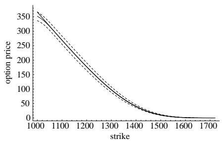

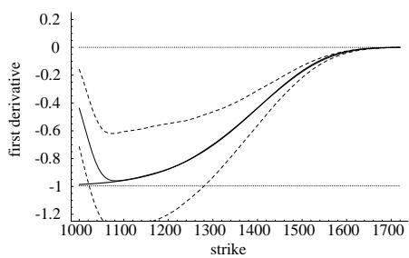

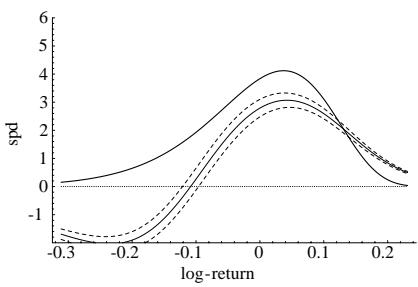

## 3.5. Bandwidth selection

A bandwidth of $h = 0$ results in interpolating each data point (the most complex model), whereas a bandwidth of in2nity results in a single global polynomial 2t of degree $p$ throughout the sample (the simplest model). How to choose the bandwidth is therefore equivalent to choosing the model’s complexity. Hence it is highly desirable to rely on automatic procedures that remove any potential arbitrariness in the bandwidth’s choice. By minimizing the conditional mean-squared error at x

$$
\{ E [ \hat { m } ^ { ( k ) } ( x ) | x ] - m ^ { ( k ) } ( x ) \} ^ { 2 } + V a r [ \hat { m } ^ { ( k ) } ( x ) | x ]\tag{3.18}
$$

the optimal local (i.e., variable with x) bandwidth is (see e.g., Fan and Gijbels, 1996):

$$
h _ { \mathrm { l o c a l } } ( x ) = C _ { k , p } \left[ \frac { v ( x ) } { \{ m ^ { ( p + 1 ) } ( x ) \} ^ { 2 } \pi ( x ) } \times \frac { 1 } { n } \right] ^ { 1 / ( 2 p + 3 ) } ,\tag{3.19}
$$

where $\pi ( x )$ is the marginal density of the regressors and v(x) their variance.

<!-- page: 15 -->

[Table source crop](assets/tables/2003-ait-sahalia-duarte-nonparametric-option-pricing-p0015-block-0001-d1c31a78b04db5d0.jpg)

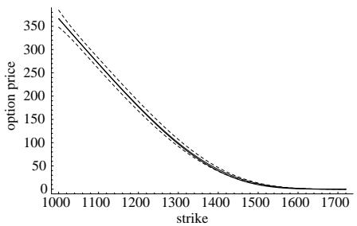

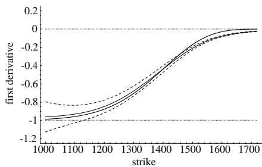

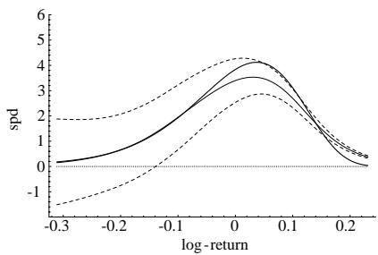

If we are interested in a global bandwidth (i.e., one that is independent of x), minimizing the weighted mean integrated squared error with weight function !(x)

$$
\int \{ \{ E [ \hat { m } ^ { ( k ) } ( x ) | x ] - m ^ { ( k ) } ( x ) \} ^ { 2 } + V a r [ \hat { m } ^ { ( k ) } ( x ) | x ] \} \omega ( x ) \mathrm { d } x\tag{3.20}
$$

produces the optimal bandwidth

$$
h _ { \mathrm { g l o b a l } } = C _ { k , p } \left[ \frac { \int v ( x ) \omega ( x ) / \pi ( x ) \mathrm { d } x } { \int \{ m ^ { ( p + 1 ) } ( x ) \} ^ { 2 } \omega ( x ) \mathrm { d } x } \times \frac { 1 } { n } \right] ^ { 1 / ( 2 p + 3 ) } .\tag{3.21}
$$

The constants $C _ { k , p }$ depend upon the choice of the kernel. For example, for the Gaussian kernel $K ( u ) { = } \exp ( - u ^ { 2 } / 2 ) / \sqrt { 2 \pi }$ , the relevant constants are $C _ { 0 , 1 } { = } 0 . 7 7 6 , C _ { 0 , 3 } { = } 1 . 1 6 1$ $C _ { 1 , 2 } = 0 . 8 8 4$ and $C _ { 2 , 3 } = 1 . 0 0 6$ . The bandwidth expressions involve unknown quantities:

<!-- page: 16 -->

true function constraints average estimate 95 % confidence band

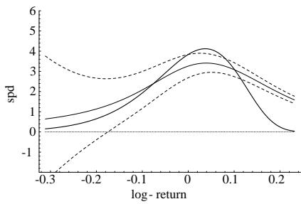

$\pi ( x ) , v ( x )$ and $m ^ { ( p + 1 ) } ( x )$ , which all need to be estimated prior to the calculation of the optimal bandwidth. A simple way to do so is by 2tting a polynomial of order $p + 3$ globally to m(x), i.e., $\begin{array} { r } { m ( x ) = \sum _ { k = 0 } ^ { \bar { p } + 3 } \alpha _ { k } x ^ { k } } \end{array}$ estimate the parameters $\alpha _ { k }$ by ordinary least squares, v by the sum of squares of residuals (so that the estimator is independent of $x )$ , and $m ^ { ( { p + 1 } ) } ( x )$ as the second order polynomial obtained by di,erentiation of the polynomial 2t of order $p + 3$ of $m ( x )$ , i.e.,

$$
m ^ { ( p + 1 ) } ( x ) = \sum _ { k = p + 1 } ^ { p + 3 } \alpha _ { k } k ( k - 1 ) \ldots ( k - p + 1 ) x ^ { k - ( p + 1 ) } .\tag{3.22}
$$

For the global optimal bandwidth, a typical choice of weighting function would be $\omega ( x ) = \omega _ { 0 } ( x ) f ( x )$ where $\omega _ { 0 } ( x )$ is a 2xed function (for instance $\omega _ { 0 } ( x )$ is 1 for all x between the mean of the $x _ { i } { } ^ { \circ } \mathbf { s }$ minus 1.5 times the standard deviation of the $x _ { i } { } ^ { \ , } \mathbf { s }$ and the mean plus 1.5 times the standard deviation, and 0 for x outside this interval). In this case, $\begin{array} { r } { \int \omega _ { 0 } ( x ) \mathrm { d } x = 3 \sqrt { V a r ( X ) } } \end{array}$ , estimated by replacing Var(X) by the sample moment.

<!-- page: 17 -->

The estimated optimal global bandwidth is then

$$
\hat { h } _ { \mathrm { g l o b a l } } = C _ { k , p } \left[ \frac { s s r \times \int \omega _ { 0 } ( x ) \mathrm { d } x } { \sum _ { i = 1 } ^ { n } \big \{ m ^ { ( p + 1 ) } ( X _ { i } ) \big \} ^ { 2 } \omega _ { 0 } ( X _ { i } ) } \times \frac { 1 } { n } \right] ^ { 1 / ( 2 p + 3 ) } ,\tag{3.23}
$$

where ssr is the sum of squares of residuals from the regression (3.22).

## 3.6. The result: Estimation under inequality constraints

We now show that the two-step procedure we proposed, namely constrained least square regression of the data followed by a locally linear estimation using the transformed data, results in an estimator satisfying the constraints. The following proposition states our result. The shape-constrained estimator we described will always satisfy the constraints for every sample size, not just asymptotically:

Proposition 1. Consider a set of n observations on the dependent variables, $y _ { 1 } , y _ { 2 } , \ldots ,$ $y _ { n }$ and the corresponding independent variable values $x _ { 1 } , x _ { 2 } , . . . . , x _ { n }$ . Without loss of generality, let $x _ { i } \geqslant x _ { j }$ for $i > j , i , j \in \{ 1 , 2 , . . . , n \}$ . Assume that the transformed data $m _ { i }$ result from applying the constrained least squares algorithm to the original data $y _ { i }$ . Then the locally linear estimator obtained from the transformed data and a log-concave kernel function satis2es the required constraints in sample: $- \ e ^ { - r _ { t , \tau } \tau } \leqslant$ $\hat { m } ^ { ( 1 ) } ( x ) \leqslant 0$ , and $\hat { m } ^ { ( 2 ) } ( x ) \geqslant 0$

## Proof. See Appendix B.

The last two constraints (2.8)–(2.9) on the function $\hat { m } ^ { ( 2 ) } ( x )$ are easily satis2ed. $\mathrm { R e } \mathrm { - }$ striction (2.8) is a scaling constraint: replacing $\hat { m } ^ { ( 2 ) } ( x )$ by ${ \mathrm { s x p } } ( - r _ { t , \tau } \tau ) \hat { m } ^ { ( \bar { 2 } ) } ( x ) / \int _ { 0 } ^ { + \infty } \hat { m } ^ { ( 2 ) }$ (z) dz produces the desired result. Note that $\hat { m } ^ { ( 2 ) }$ is an estimator of $C _ { t , \tau } ^ { \prime \prime }$ ; the corresponding estimator of the SPD $p ^ { * } ( x )$ is $\exp ( r _ { t , \tau } \tau ) \hat { m } ^ { ( 2 ) } ( x )$ : recall (2.4). Restriction (2.9) amounts to a 2xed translation of the estimated density exp $\mathbf { \bar { \rho } } _ { r _ { t , \tau } \tau } ) \hat { m } ^ { ( 2 ) } ( x )$ to achieve the desired expected value $F _ { t , \tau } \colon$ replace $\hat { m } ^ { ( 2 ) } ( x )$ by the shifted function $\hat { m } ^ { ( 2 ) } ( x - z )$ with the 2xed shift amount z determined by setting the expected value of the resulting function to the desired level $\exp ( - r _ { t , \tau } \tau ) F _ { t , \tau }$ . As we show in Section 4 below, these two adjustments have very little e,ect on the estimator in practice.

We then de2ne the estimator ${ \hat { m } } ^ { ( 0 ) } ( x )$ of the call pricing function from the SPD estimator by

$$
\hat { m } ^ { ( 0 ) } ( x ) \equiv \int _ { 0 } ^ { + \infty } \operatorname* { m a x } ( z - x , 0 ) \hat { m } ^ { ( 2 ) } ( z ) \mathrm { d } z\tag{3.24}
$$

(with an obvious generalization if we wish to price another European-style payo,: just replace max $( z - x , 0 )$ by that contingent claim’s payo, function). The estimator ${ \hat { m } } ^ { ( 0 ) } ( x )$ will automatically satisfy the no-arbitrage bounds (2.6) satis2ed by the call pricing function. In e,ect, having a proper SPD estimator in the form of $\exp ( r _ { t , \tau } \tau ) \hat { m } ^ { ( 2 ) } ( x )$ will automatically result in the price function satisfying the arbitrage bounds appropriate for its payo, structure (in particular, (2.6) for a call option). In the case of American-style payo,s, this would include adding to the right hand side of (3.24) a supremum over the dates over which exercise may occur.

<!-- page: 18 -->

Note that the price function estimator $\hat { m } _ { 0 , 1 }$ for the regression function will not necessarily satisfy the constraints (2.6) in sample, whereas $\hat { m } ^ { ( 0 ) }$ de2ned in (3.24) always will. When it does, however, $\hat { m } _ { 0 , 1 }$ is a straightforward estimator to use for the purpose of estimating the call pricing function, and one which avoids the computation of the SPD. This is worth keeping in mind because in practice the constraints (2.6) on the price function will only be violated in extreme circumstances, whereas the constraints on the higher derivatives are more likely to be violated. This works only for calls and puts, by put-call-parity. More complicated payo,s need to be priced via the SPD. As for the 2rst derivative, it can be estimated either by $\hat { m } _ { 1 , 1 }$ or by $\begin{array} { r } { - \int _ { x } ^ { + \infty } \hat { m } ^ { ( 2 ) } ( z ) \ d z } \end{array}$ dz. Both estimators satisfy in sample the constraints $- \mathrm { e } ^ { - r _ { t , \tau } \tau } \leqslant \hat { m } ^ { ( 1 ) } ( x ) \leqslant 0 .$ . It is logical to use $\hat { m } _ { 1 , 1 }$ when $\hat { m } _ { 0 , 1 }$ is used, and $\begin{array} { r } { - \int _ { x } ^ { + \infty } \hat { m } ^ { ( 2 ) } ( z ) \ d z } \end{array}$ dz when $\begin{array} { r } { \int _ { 0 } ^ { + \infty } \operatorname* { m a x } ( z - x , 0 ) \hat { m } ^ { ( 2 ) } ( z ) } \end{array}$ dz is used.

Finally, while we are motivated by the problem of constraining our locally polynomial estimator to have bounded 2rst derivatives and to be convex, it should be noted from the proof that the proposition in fact applies to more general inequalities on the 2rst two derivatives of the function, 2 not just the speci2c ones of interest in the context of estimating SPDs. The assumption that the kernel density function is log-concave is not much of a restriction since that class of kernel functions contains among others the Gaussian, uniform, Epanechnikov and Laplacian kernels, i.e., most of the kernels used in practice (see Mukerjee, 1988).

## 4. Monte-Carlo analysis

## 4.1. Comparison with unconstrained nonparametric estimators

We perform a Monte-Carlo analysis to determine the performance of the shapeconstrained nonparametric SPD estimator and compare it to the standard unconstrained Nadaraya–Watson and locally linear nonparametric estimators. The natural terrain to apply these tools involve S&P 500 index options, so we calibrate our Monte-Carlo simulation experiments to match the basic features of this market. We assume that the true price function is the Black–Scholes/Merton model with an implied volatility smile curve. Naturally, the advantage of our nonparametric approach lies in its robustness. If the options were priced by another formula, the nonparametric approach should be able to approximate it as well since, by de2nition, it does not rely on any parametric speci2cation for the underlying asset’s price process. Therefore, similar Monte-Carlo simulation experiments can be performed for alternative option-pricing models. However, we choose to perform the simulation experiments under an implied volatility smile model designed to be realistic for a typical trading day in 1999. The smile curve used as the data generating process for the simulations was calibrated based on the smile observed on May 13, 1999 on options on the S&P 500 traded at the Chicago Board Options Exchange (CBOE) with expiration in July. The assumed smile is a linear function of the strike with volatility equal to 40% at the strike price 1000 and 20% at the strike price 1700. We set the spot price $S _ { t }$ at 1365. The short term interest rate and the dividend yield are set at $r _ { t , \tau } = 4 . 5 \%$ and $\delta _ { t , \tau } = 2 . 5 \%$ , respectively. We consider both the 30 and $^ { 6 0 }$ maturities and plot the results for the 30-day options. The 60-day results are qualitatively similar.

2 If the inequalities are modi2ed, then the constraints in the constrained least squares need, of course, to be modi2ed accordingly.

<!-- page: 19 -->

We assume that we observe n = 25 option prices with strike prices equally spaced between 1000 and 1700, as would be the case with actual data. To create simulated option prices, we add uniformly distributed noise to the theoretical option prices. There are two possible rationalizations for the amount of noise to introduce around the assumed “true” option prices in order to carry out simulations. First, the noise can model the bid-ask spread and the di,erent liquidity of di,erent options. Second, we can assume that there is a true set of option prices at one point in time and introduce noise to capture the time series variations of the option prices in a short window of time around that date, after accounting for the variation of the underlying asset price in the same window.

In the 2rst approach, the assumed bid-ask spread, calibrated to the market data, is set to 5% of the option’s ask price, with a Soor at 50 cents and a cap at 2 dollars. The noise distribution around the theoretical price is then uniform between 0 and half of the bid-ask spread value. We also account for the di,erent liquidity of options with di,erent degrees of moneyness (most of the liquidity is near the money). Speci2cally, recall that the option’s moneyness is $M _ { t , \tau } \equiv X / F _ { t , }$ (strike divided by the forward value of the S&P 500). The noise distribution around the theoretical price is then uniform between 0 and half of the bid-ask spread value times a liquidity factor given by $1 + ( 2 / 0 . 2 ) | M _ { t , \tau } - 1 |$ . This makes the liquidity factor 1 at the money $( M _ { t , \tau } = 1 )$ and 2 at $M _ { t , \tau } = 0 . 8$ or 1:2, and proxies for the observed di,erences in liquidity of these options.

In the second approach, we calibrate the noise to the typical intraday variation of S&P 500 option prices, using their range to calibrate the uniform distribution of the noise term. In percentage terms, the range of values reached stretches from 3% of the option value for deep in the money options to 18% for deep out of the money options. In terms of the performance of the estimators, both models for the noise term produce qualitatively similar results with the provision that the lower the amount of noise, the lower the RMSE performance advantage of the constrained estimator over the unconstrained locally linear estimator (since fewer simulated data samples violate the constraints). This being said, one may argue that any violation of arbitrage constraints (such as those produced by the unconstrained estimator) is potentially much more damaging than its mere RMSE e,ect (it could for instance induce trading on a false perceived arbitrage) and should be penalized accordingly when assessing an estimator’s performance. Also, other things equal, more noise tends to increase the advantage of the constrained estimator. Nevertheless, the amount of noise we speci2ed above is not unrealistically high. It is, in fact, if anything, too conservative: see the empirical evidence in Hentschel (2001).

<!-- page: 20 -->

For estimation, we use a Gaussian kernel. We select a range of bandwidths including those given in Section 3.5 and repeat the estimation steps for each bandwidth value. Then for each function to be estimated, we selected the optimal bandwidth on the basis of minimizing the small sample weighted mean integrated squared error given in (3.20). We discuss this further below. The Monte-Carlo averages and con2dence intervals for each bandwidth, estimator and function to be estimated are based on 5000 simulations and we focus on simulations using the second speci2cation of the noise term, the results being qualitatively similar to the 2rst one.

Fig. 1 shows the average estimate, a 95% con2dence interval, and the true functions for the unconstrained Nadaraya–Watson estimator. Panel A of Fig. 1 shows the call pricing function estimator $\hat { m } _ { 0 , 0 } ,$ , Panel B shows the 2rst derivative $\hat { m } _ { 0 , 0 } ^ { \prime }$ of the pricing function with respect to the strike price, and Panel C shows the risk neutral density of the log-returns exp $( r _ { t , \tau } \tau ) \hat { m } _ { 0 , 0 } ^ { \prime \prime } / x$ . As observed in Panel C of Fig. 1, standard unconstrained Nadaraya–Watson estimates are, on average, negative near the left boundary, where the true probabilities are low. Of course, kernel estimation near the boundaries is known to be problematic, see e.g., Wand and Jones (1995).

Fig. 2 shows the same results for the (unconstrained) locally linear estimator, $\hat { m } _ { 0 , 0 }$ in Panel $\mathrm { A } , \hat { m } _ { 0 , 1 }$ in Panel B and $\exp ( r _ { t , \tau } \tau ) \hat { m } _ { 0 , 1 } ^ { \prime } / x$ in Panel C. As observed in Panel C of Fig. 2, the locally linear estimator has much lower boundary bias than the Nadaraya– Watson estimator, but the SPD still can be negative in the left boundary where the true probabilities are low.

Figs. 3 and 4 report the results for the locally quadratic $( \hat { m } _ { k , 2 }$ for $k = 0 , 1 , 2 )$ and locally cubic $( \hat { m } _ { k , 3 }$ for $k = 0 , 1 , 2 )$ estimators, respectively. As expected, higher order locally polynomial estimators perform poorly in this context because they e,ectively correspond to more complex local models in the absence of large enough samples. The net result is that the estimator’s biases can be entirely eliminated, but at the cost of a large variance penalty. At the optimal bandwidth choice (which is what is plotted in the 2gures), the trade-o, between squared bias and variance results in relatively large biases and variances (see Panels C in Figs. 3 and 4). In addition, these estimators often violate the constraints near the boundaries (see Panels B and C). Comparing the results for the unconstrained locally polynomial estimators corresponding to $p = 0 , 1 , 2 , 3$ , it appears that locally linear estimators perform best in our context.

Fig. 5 reports the results for our estimator, $\hat { m } ^ { ( 0 ) } , \hat { m } ^ { ( 1 ) }$ and $\exp ( r _ { t , \tau } \tau ) \hat { m } ^ { ( 2 ) } / x$ . As observed in Panel C of Fig. 5, the constrained estimator does not share the drawbacks of the unconstrained estimators. First, the constrained SPD estimator does not have the same boundary bias as the locally constant Nadaraya–Watson—it behaves rather like the locally linear estimator that it is. Second, unlike the unconstrained locally linear estimator, the constrained estimator remains nonnegative even when the true probabilities are low. Intuitively, imposing the constraints has the e,ect of allowing lower bandwidths than would be optimal for a locally linear estimator in their absence. This lowers the bias of the estimator without increasing the variance correspondingly because the constraints prevent the large deviations (which would violate the constraints) from occurring. The net e,ect is a more accurate estimator on the basis of its mean squared error properties. Recall that we scale our density estimator and shift it, as discussed in Section 3.6. Even though these last two constraints are necessary to rule out arbitrage opportunities, our Monte-Carlo analysis reveals that, in practice, they make a small di,erence on the estimated function $\hat { m } ^ { ( 2 ) } ( x )$ . Indeed, for the optimal bandwidth case the average value of $\begin{array} { r } { \exp ( r _ { t , \tau } \tau ) \int _ { 0 } ^ { + \infty } \hat { m } ^ { ( 2 ) } ( z ) } \end{array}$ dz is close to one (0.94) and the average shift z is 0.7% of the futures price.

<!-- page: 21 -->

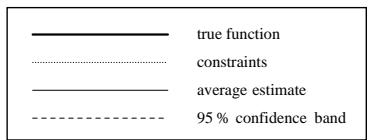

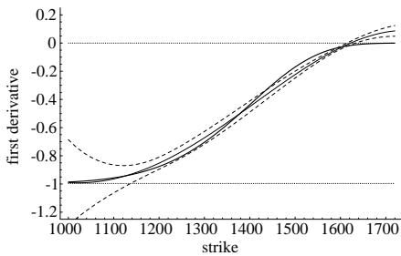

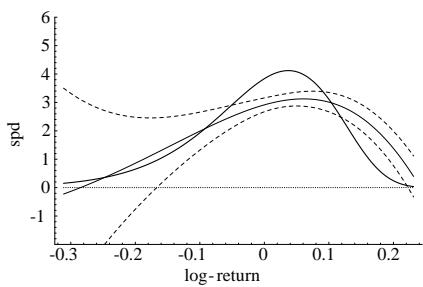

We con2rm that intuition by studying the mean squared error behavior of the various estimators, both pointwise and global, for the sample size under consideration. Fig. 6 reports the global root integrated mean squared error (RIMSE) of the 2ve estimators of the pricing function, the 2rst strike-derivative and the SPD, respectively. The RIMSE is the square root of the integral given in (3.20), unweighted. For each function to be estimated $( k = 0 , 1 , 2 )$ and estimator $( p = 0 , 1 , 2 , 3$ , and shape-constrained estimator) we used the bandwidth resulting in the lowest RIMSE. The fact that smaller (resp. larger) bandwidths result in smaller (resp. larger) bias and larger (resp. smaller) variance produce these U-shaped RIMSE curves with the bottom of the U identifying for each function and estimator the globally optimal bandwidth used in Figs. 1 through 5, respectively. Comparing speci2cally our constrained estimator to the unconstrained locally linear estimator con2rms the initial intuition: the shape-constrained estimator results in a lower RIMSE for lower bandwidths. For larger bandwidths, the two estimators converge because larger bandwidths result in Satter estimates, which consequently tend to satisfy the constraints. This explains why the RIMSE curves for these two estimators converge to one another to the right of their respective minima. However, the lowest RIMSE for the constrained estimator of the SPD is about 25% lower than that of the unconstrained estimator because lowering the bandwidth from the unconstrained optimum results in further decreases of the shape-constrained RIMSE. Fig. 7 shows the local, or pointwise, e,ect of oversmoothing (higher bias, lower variance) and undersmoothing (lower bias, higher variance) the constrained estimator relative to the optimal bandwidth.

<!-- page: 22 -->

[Table source crop](assets/tables/2003-ait-sahalia-duarte-nonparametric-option-pricing-p0022-block-0001-ce08913d02d85602.jpg)
Panel B: First Strike-Derivative

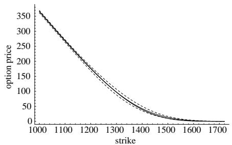

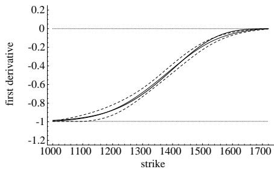

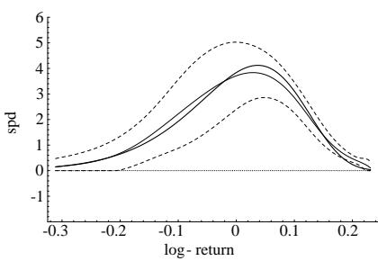

Furthermore, we should note that, in all likelihood, MSE-based error measures alone underestimate the true cost of using an estimator that can violate the constraints. The mean-squared error does not attach any penalty to violations of the constraints by the unconstrained estimators. Economic measures of the cost of violating the constraints could be quite large. For example, hedges based on option deltas that violate the constraints could quickly become ine,ective; pricing with an estimated SPD that is negative in the left tail leads to underestimation of out of the money put prices, trades could be put in place based on the false perception of arbitrage (locally negative SPD), etc.

<!-- page: 23 -->

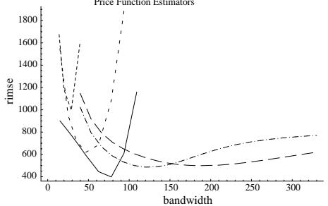

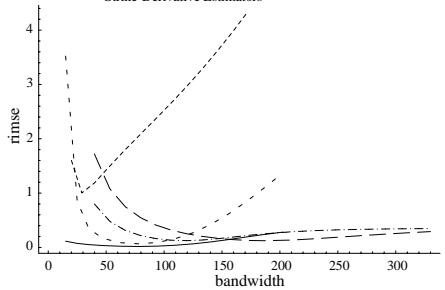

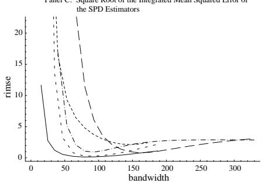

Simulation results for $n = 5 0$ observations, and the 2rst simulation design, are qualitatively similar. Overall, the results of the simulations suggest that for these types of sample sizes, imposing the shape constraints (2.5) results in a substantial improvement of the estimators.

## 4.2. Comparison with parametric alternatives

Finally, we also compare our estimator to two parametric alternatives. We consider the Jarrow and Rudd (1982) parametric extension of the Black–Scholes model where the lognormal density is replaced by a four-parameter expansion, namely

$$
p ( S _ { T } | S _ { t } ) = \frac { \exp \{ - z ^ { 2 } / 2 \} } { S _ { T } \sqrt { 2 \pi \tau \sigma } } \left( 1 + \frac { \mu _ { 3 } } { 6 } \left( z ^ { 3 } - 3 z \right) + \frac { \mu _ { 4 } } { 2 4 } ( z ^ { 4 } - 6 z ^ { 2 } + 3 ) \right) ,\tag{4.1}
$$

where

$$
z = z ( S _ { T } | S _ { t } ) = \frac { L n ( S _ { T } / S _ { t } ) - ( \mu _ { 1 } - \sigma ^ { 2 } / 2 ) \tau } { \sigma \sqrt { \tau } }
$$

<!-- page: 24 -->

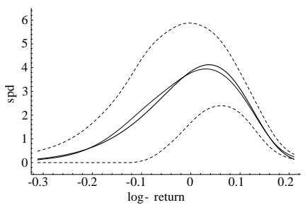

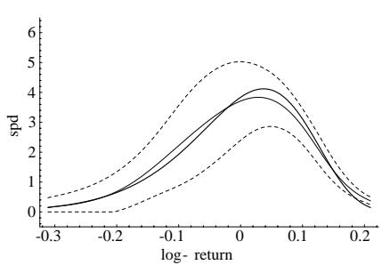

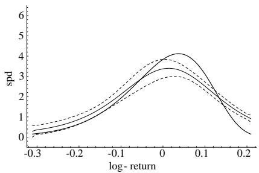

and the call price computed as

$$
P _ { t } = \mathrm { e } ^ { - r \tau } \int _ { K } ^ { + \infty } ( S _ { T } - K ) p ( S _ { T } | S _ { t } ) \mathrm { d } S _ { T } .\tag{4.2}
$$

The 4 parameters $\mu _ { 1 } , \sigma , \mu _ { 3 } , \mu _ { 4 }$ are estimated by minimizing the squared deviations between market prices and parametric prices. 3 Since there is no bandwidth choice involved in this parametric formula, there is only one density per simulation. Given the sample sizes we consider, more Sexible functional forms become essentially nonparametric in nature—if we have 25 observations and we are 2tting a parametric model with, say, up to 10 parameters, then the choice of the number of parameters becomes akin to the choice of the bandwidth in nonparametrics.

The second parametric family we use in our comparisons is a 2ve-parameter mixture of lognormal densities which has been used in this context by Bahra (1996). The

3 See Christo,ersen and Jacobs (2001) for a discussion of the inSuence of the choice of loss function in this context.

<!-- page: 25 -->

assumed model is

$$
p ( S _ { T } | S _ { t } ) = \alpha p _ { L N } ( S _ { T } | S _ { t } ; \mu _ { 1 } , \sigma _ { 1 } ) + ( 1 - \alpha ) p _ { L N } ( S _ { T } | S _ { t } ; \mu _ { 2 } , \sigma _ { 2 } ) ,\tag{4.3}
$$

where

$$
p _ { L N } ( S _ { T } | S _ { t } ; \mu , \sigma ) = \frac { 1 } { S _ { T } \sqrt { 2 \pi \tau } \sigma } \exp \left\{ - \frac { 1 } { 2 \sigma ^ { 2 } \tau } ( L n ( S _ { T } / S _ { t } ) - ( \mu _ { 1 } - \sigma ^ { 2 } / 2 ) \tau ) ^ { 2 } \right\}
$$

and the call price computed as in (4.2). The pricing formula corresponding to (4.3) is a linear combination of Black–Scholes formulae (2 times the Black–Scholes formula corresponding to parameters $( \mu _ { 1 } , \sigma _ { 1 } )$ plus $1 - \alpha$ times the Black–Scholes formula corresponding to parameters $\left( \mu _ { 2 } , \sigma _ { 2 } \right) )$

The 5 parameters $\alpha , \mu _ { 1 } , \sigma _ { 1 } , \mu _ { 2 } , \sigma _ { 2 }$ are estimated by minimizing the squared percentage deviations between market prices and parametric prices. The reason for using squared price errors in one case and squared percentage errors in the other is that they produced the best results for the two methods, respectively. Attempting to minimize squared price errors with the mixture of lognormals often produces nonsensical results, where one of the two densities is tailor-made to 2t in-the-money calls where pricing errors in dollars are costly, resulting in that density having a very low value of its $\sigma$ parameter (in addition to a very negative value of its $\mu$ parameter).

Both parametric models provide a better contrast between the results of a true parametric procedure and those of nonparametric ones. Panels A and B of Fig. 8 report the results for the estimated SPD resulting from these two methods, in the same format as Panel C of Figs. 1–5. Because they are global in nature, as opposed to local, the two types of parametric estimators are unable to cope well with arbitrage violations in the data. This is not due to the inadequacy of the parametrizations: as we show in Panels C and D of Fig. 8, the two models can 2t the true SPD assumed in the data generating process (with no noise) almost perfectly. The issues arise when we attempt to 2t a set of price data that includes noise, i.e., sometimes local violations of convexity, as this produces a global distortion of the estimator—in other words, the error propagates from the local violation (which often occurs in one tail) throughout the estimated distribution (including near the peak and in the other tail).

This results in RIMSE measures that, for the same simulation designs as the other estimators we considered, are worse than what can be achieved by our proposed locally linear constrained estimator. After all, avoiding this local-to-global contamination due to outliers, bad data, etc., is often why one uses nonparametric estimators in the 2rst place. Locally polynomial estimators are particularly apt at dealing with this issue.

## 5. Example: S&P 500 implied SPD under shape restrictions

A'(t-Sahalia and Lo (1998, 2000) estimated the market call pricing function from a sample of 14,441 option prices on the S&P 500 index. They used the semiparametric approach described in (2.12). They found empirically, without imposing shape constraints, that their SPD estimator is convex but only because of the dimension reduction involved in the semiparametric speci2cation, and because of the very large size of their sample. In practice, it would be desirable to have similar guarantees with substantially smaller samples. Indeed, as opposed to A'(t-Sahalia and Lo (1998, 2000), we work with samples of tiny sizes (a typical cross-section at one point in time of 20 to 30 options versus a time-aggregated cross-section of 14; 431 options).

<!-- page: 26 -->

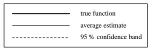

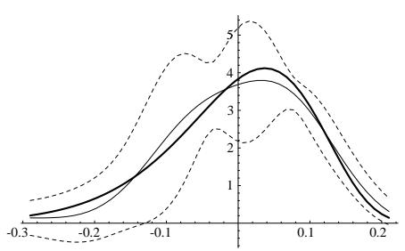

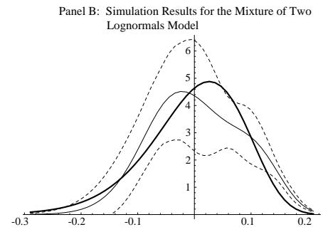

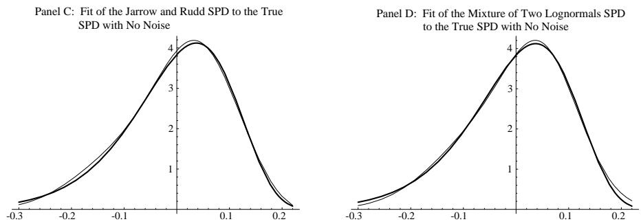

The data consist of the closing prices on May 13, 1999 for call options on the S&P 500 traded at the CBOE for a maturity of 65 days corresponding to the July 1999 expiration (July 17). The closing spot price of the S&P 500 on that day was 1367.56, and the risk free interest rate for that maturity was 4.83%. The dividend yield is implied through put-call parity for the put-call pair at the money. The results from applying the 2ve di,erent estimators (unconstrained Nadaraya–Watson, unconstrained locally linear, quadratic and cubic, shape-constrained locally linear) are reported in Fig. 9. The bandwidths correspond to the optimum identi2ed in the previous section. The three panels correspond to the three functions to be estimated. As is apparent from Panel A, all estimators produce sensible looking (and visually indistinguishable) estimates for the pricing function as long as strikes remain relatively near the money (strikes between 1200 and 1500). However, for values of the strike price above 1600 the locally quadratic and locally cubic estimators display their high variability tendency which was clearly apparent in the simulations. And the Nadaraya–Watson estimator exhibits poor boundary behavior below 1100, clearly violating the convexity constraint on prices.

<!-- page: 27 -->

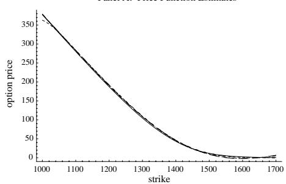

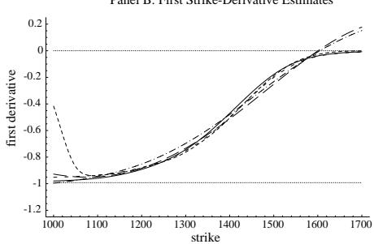

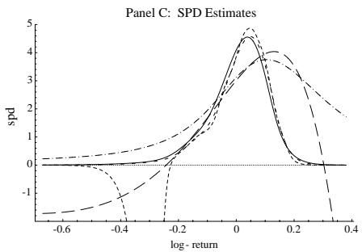

Naturally, di,erentiation tends to emphasize the di,erences between estimators. In Panel B, all remaining estimators except the two locally linear ones (constrained and unconstrained) violate the 2rst derivative constraints somewhere. Regarding SPD estimates in Panel C, all the unconstrained estimators either violate the positivity constraint in the left tail of the density, or are too Sat when evaluated at the globally optimal bandwidth. The unconstrained locally linear estimator tracks the constrained estimator relatively closely, except that the optimal bandwidth tends to produce an estimator that is slightly too Sat, as was evidenced in the discussion of our simulation results. By contrast, the optimal amount of smoothing for the shape-constrained estimator is slightly lower which produces an estimator that is more sensitive to 2ner features of the data. Indeed, our shape-constrained estimator produces an estimate of the SPD which looks quite plausible, displaying the expected level of negative skewness and excess kurtosis, while satisfying (by construction) the positivity constraint.

<!-- page: 28 -->

[Table source crop](assets/tables/2003-ait-sahalia-duarte-nonparametric-option-pricing-p0028-block-0001-8570d52a404305df.jpg)
Table 1 Occurrence of arbitrage restriction violations during 1999

Finally, we report in Table 1 the results of repeating this analysis for every trading day during the year 1999. We repeated the analysis for di,erent days (one set of quotes per day, each day treated separately) and report the frequency of arbitrage violations during that year. The unconstrained locally linear estimator violates the restrictions over 50% of the time, a percentage which rises to close to 100% as we move to the (unconstrained) locally quadratic and cubic estimators. By contrast, our estimator never violates the constraints (and still results in lower RIMSE). The violation of the arbitrage restrictions by the unconstrained estimators hold across a large spectrum of bandwidth values. Substantial oversmoothing is required to make the unconstrained estimator no longer violate the constraints. But this then results in a large bias.

## 6. Conclusions

This paper proposed a method to incorporate shape restrictions, such as monotonicity and convexity, into nonparametric locally linear estimators. The estimator is motivated by the practical problem of estimating state-price densities with option data, in a setting where no information other than monotonicity and convexity is available, yet the sample size is typically small. The simulations results indicate that nonparametric estimates can be quite feasible in sample sizes as small as twenty observations, provided that appropriate theory-motivated shape restrictions, such as monotonicity, and/or convexity, are imposed. As discussed in the Introduction, this is a frequent occurrence in other areas of economics as well.

In our speci2c context of SPD estimation, the shape-constrained SPD we estimated can have many uses. First, it provides us with an arbitrage-free method of pricing new, more complex, or less liquid securities, e.g., OTC derivatives or non-traded Sexible options, given a subset of observed and liquid “fundamental” prices, in this case basic call-option prices, that are used to estimate the SPD. We are able to achieve this in the context where very few fundamental securities are available, i.e., the observed cross-section is very sparse. Second, from a risk management perspective, our SPD estimates provide information that is crucial to understanding the nature of the fat tails of asset-return distributions implied by options data. Volatility cannot be used as a summary statistic for the entire distribution when typical return series display events that are three standard deviations from the mean approximately once a year. Our approach yields an estimate of the entire return distribution, from which single points, such as value-at-risk, can easily be derived. Third, our nonparametric estimator captures those features of the data that are most salient from an asset-pricing perspective and which ought to be incorporated into any successful parametric model. It also helps us understand what features are missed by tightly parametrized models, such as day-to-day or even intraday changes in the shape of the SPD, since we can now estimate such SPDs nonparametrically on the basis of very few observations. In fact, a nonparametric analysis can often be advocated as a prerequisite to the construction of any parsimonious parametric model, precisely because important features of the data are unlikely to be missed by nonparametric estimators.

<!-- page: 29 -->

## Acknowledgements

We are grateful to seminar and conference participants, and in particular RenZe Garcia, for their comments and suggestions. The comments of the Editors and three referees were very helpful. This research was conducted during the 2rst author’s tenure as an Alfred P. Sloan Research Fellow. Financial support from the NSF under grants SBR-9996023 and SES-0111140 (A'(t-Sahalia) and from the Center for Research in Security Prices at the University of Chicago Graduate School of Business (Duarte) is gratefully acknowledged.

## Appendix A. The constrained least square regression algorithm

## A.1. Transforming the constrained least squares problem to one with conic constraints

We start by rewriting the constrained least squares problem in such a way as to reduce it to a convex cone problem which is then amenable to Dykstra’s algorithm for constrained least squares under conic constraints. Goldman and Ruud (1995) contain ideas along those lines, although not a formal development. Write our constraints (3.3) in matrix form as $A . m - b \leqslant 0$ , where A is n (the number of constraints) by n (the number of $m _ { i } { \bf \dot { s } } )$ and $b$ is $n \times 1$ . In its original form, our problem is therefore

$$
\operatorname* { m i n } _ { m \in R ^ { n } } \quad \| m - y \| ^ { 2 }\tag{A.1}
$$

$$
\mathrm { s u b j e c t \ t o } A . m - b \leqslant 0 .
$$

<!-- page: 30 -->

De2ne

$$
u = { \binom { m - y } { t } } = { \binom { z } { t } } , \quad v = { \binom { 0 } { 1 } } , \quad C = ( A \mid A . y - b ) ,
$$

where t is $1 \times 1$ , and the 0 block in the vector v is $n \times 1$ . Then consider the problem

$$
\begin{array} { r l } { \underset { u \in R ^ { n + 1 } } { \operatorname* { m i n } } } & { \| u - v \| ^ { 2 } = \| z \| ^ { 2 } + | t - 1 | ^ { 2 } } \\ { \mathrm { s u b j e c t ~ t o ~ } } & { C . u \leqslant 0 \quad \mathrm { a n d } \quad t = 1 , } \end{array}\tag{A.2}
$$

where minimizing over u means minimizing over $( z , t )$ . The solution $u ^ { * * } = ( z ^ { * * } , 1 )$ to problem (A.2) gives the solution $m ^ { * * }$ of our original problem (A.1) as $m ^ { * * } \equiv z ^ { * * } + y$ Indeed, the solution $u ^ { * * }$ of (A.2) has set $t = 1$ and then minimized $\| z \| ^ { 2 }$ over $z$ under the constraint that $C . u \leqslant 0$ and we have

$$
C . \left( { z \atop 1 } \right) \leqslant 0 \Leftrightarrow A . \ : z + ( A . y - b ) \leqslant 0 \Leftrightarrow A . m - b \leqslant 0 .
$$

But problem (A.2) still does not have conic constraints (because of the constraint $t = 1$ , which is again aUne). So consider next the problem where we have relaxed the aUne constraint $t = 1$ to the linear (or conic) constraint $t \geqslant 0 ;$

$$
\begin{array} { r l } { \underset { u \in R ^ { n + 1 } } { \operatorname* { m i n } } } & { \| u - v \| ^ { 2 } = \| z \| ^ { 2 } + | t - 1 | ^ { 2 } } \\ { \mathrm { s u b j e c t ~ t o } } & { C . u \leqslant 0 \quad \mathrm { a n d } \quad t \geqslant 0 } \end{array}\tag{A.3}
$$

Now this problem is in Dykstra’s conic constraints form, and let its solution be denoted by $\boldsymbol { u } ^ { * } = ( z ^ { * } , t ^ { * } )$

Let us see how the solutions to the two problems (A.2) and (A.3) are related. Note that because $u ^ { * * }$ satis2es the constraint $C . u ^ { * * } \leqslant 0$ , we have

$$
A . \ z ^ { * * } + ( A . y - b ) \leqslant 0 .
$$

Since $t ^ { * } \geqslant 0$ , it follows that

$$
A . \ z ^ { * * } t ^ { * } + ( A . y - b ) t ^ { * } \leqslant 0 .
$$

Therefore $( z ^ { \ast \ast } t ^ { \ast } , t ^ { \ast } )$ satis2es the constraints of problem (A.3). Since by de2nition the optimum of problem (A.3) is reached at $u ^ { * } = ( z ^ { * } , t ^ { * } )$ , it follows that

$$
\| z ^ { * } \| ^ { 2 } + | t ^ { * } - 1 | ^ { 2 } \leqslant \| z ^ { * * } t ^ { * } \| ^ { 2 } + | t ^ { * } - 1 | ^ { 2 }
$$

<!-- page: 31 -->

or

$$
\| z ^ { * } \| ^ { 2 } \leqslant \| z ^ { * * } t ^ { * } \| ^ { 2 } .\tag{A.4}
$$

Now, it is also the case that, since $u ^ { * }$ satis2es the constraint $C . u ^ { * } \leqslant 0$ , we have

$$
A . \ z ^ { * } + ( A . y - b ) t ^ { * } \leqslant 0 .
$$

Since $t ^ { * } \geqslant 0$ , it follows that

$$
A . ( z ^ { * } / t ^ { * } ) + ( A . y - b ) \leqslant 0 ,
$$

so that $( ( z ^ { * } / t ^ { * } ) , 1 )$ satis2es the constraints of problem (A.2). But by de2nition the optimum of problem (A.2) is reached at $u ^ { * * } = ( z ^ { * * } , 1 )$ , thus

$$
\| z ^ { * * } \| ^ { 2 } \leqslant \| ( z ^ { * } / t ^ { * } ) \| ^ { 2 } .\tag{A.5}
$$

Multiplying equation (A.5) by $( t ^ { * } ) ^ { 2 }$ and combining with (A.4), it follows that $\| z ^ { * } \| ^ { 2 } = \| z ^ { * * } t ^ { * } \| ^ { 2 } ,$ so that the minimum of problem (A.2) is achieved at

$$
z ^ { * * } = z ^ { * } / t ^ { * } .\tag{A.6}
$$

Therefore the solution $( z ^ { * * } , 1 )$ of problem (A.2) can be obtained from the solution $( z ^ { * } , t ^ { * } )$ of problem (A.3). Recall that the solution $m ^ { * * }$ to our original problem (A.1) is obtained from the solution of problem $( \mathrm { A } . 2 )$ by $m ^ { * * } \equiv z ^ { * * } + y$ . Hence solving problem (A.3) using Dykstra’s algorithm to 2nd $( z ^ { * } , t ^ { * } )$ ultimately gives us the solution $m ^ { * * }$ to our original problem (A.1).

## A.2. Algorithm for constrained least squares under conic constraints

We now brieSy describe Dykstra (1983)’s algorithm to solve the constrained least square regression problem (A.3), which has conic constraints. De2ne the following cones in $R ^ { n + 1 }$ . For $j = 1 , \dotsc , n - 2$ , let

$$
\begin{array} { c } { { C _ { j } = \left\{ u \in R ^ { n + 1 } s . t . \frac { z _ { j + 2 } - z _ { j + 1 } } { x _ { j + 2 } - x _ { j + 1 } } - \frac { z _ { j + 1 } - z _ { j } } { x _ { j + 1 } - x _ { j } } + t \right. } } \\ { { \left. \qquad \times \left( \frac { y _ { j + 2 } - y _ { j + 1 } } { x _ { j + 2 } - x _ { j + 1 } } - \frac { y _ { j + 1 } - y _ { j } } { x _ { j + 1 } - x _ { j } } \right) \leqslant 0 \right\} \quad j = \left\{ 1 , . . . , n - 2 \right\} } } \end{array}
$$

and

$$
C _ { n - 1 } = \left\{ u \in R ^ { n + 1 } s . t . \ z _ { n } - z _ { n - 1 } + t \times \left( y _ { n } - y _ { n - 1 } \right) \leqslant 0 \right\}
$$

$$
C _ { n } = \left\{ u \in R ^ { n + 1 } s . t . - z _ { 2 } + z _ { 1 } + t \times ( - y _ { 2 } + y _ { 1 } - ( x _ { 2 } - x _ { 1 } ) \times \mathrm { e } ^ { - r _ { t , \tau } } ) \leqslant 0 \right\}
$$

$$
C _ { n + 1 } = \{ u \in R ^ { n + 1 } s . t . - t \leqslant 0 \} .
$$

<!-- page: 32 -->

The minimization problem (A.3) can be written as

$$
\operatorname* { m i n } _ { u \in \bigcap _ { j = 1 } ^ { n + 1 } C _ { j } } \sum _ { i = 1 } ^ { n } ( u _ { i } - v _ { i } ) ^ { 2 } .\tag{A.7}
$$

The algorithm consists in repeatedly projecting the vector u onto the cones $C _ { j }$ :

• Let $u _ { 1 , 1 }$ denote the projection of u onto the cone $C _ { 1 }$ . Let $I _ { 1 , 1 } = u _ { 1 , 1 } - u$ denote the incremental change incurred by the projection, so that $u _ { 1 , 1 } = u + I _ { 1 , 1 }$

• Let $u _ { 1 , 2 }$ denote the projection of $u _ { 1 , 1 }$ onto the cone $C _ { 2 }$ . Let $I _ { 1 , 2 } = u _ { 1 , 2 } - u _ { 1 , 1 }$ denote the incremental change incurred by the projection, so that $u _ { 1 , 2 } = u + I _ { 1 , 1 } + I _ { 1 , 2 }$

• Let $u _ { 1 , n + 1 }$ denote the projection of $u _ { 1 , n }$ onto the cone $C _ { n + 1 }$ . Let $I _ { 1 , n + 1 } = u _ { 1 , n + 1 } - u _ { 1 , n }$ denote the incremental change incurred by the projection, so that $u _ { 1 , n + 1 } = u + I _ { 1 , 1 } +$ $I _ { 1 , 2 } + I _ { 1 , 3 } + \cdot \cdot \cdot + I _ { 1 , n } + I _ { 1 , n + 1 }$

• After $u _ { 1 , n + 1 }$ and $I _ { 1 , n + 1 }$ are found. Let $u _ { 2 , 1 }$ denote the projection of $u + I _ { 1 , 2 } \cdots +$ $I _ { 1 , n + 1 }$ onto the cone $C _ { 1 }$ . Note that we have removed the increment $I _ { 1 , }$ before this projection. The new increment is $I _ { 2 , 1 } = u _ { 2 , 1 } - ( u + I _ { 1 , 2 } \cdot \cdot \cdot + I _ { 1 , n + 1 } )$

• Continue, until $u _ { \bullet , \bullet } \in \bigcap _ { j = 1 } ^ { n + 1 } C _ { j }$

The projections of $u _ { \bullet , \bullet }$ onto cones $C _ { j }$ are easily obtained. If we represent the cone $C _ { j }$ by $C _ { j } = \{ u \in R ^ { n + 1 } \ s . t . \ \sum _ { i = 1 } ^ { n + 1 } { \ a _ { j , i } u _ { i } } \leqslant 0 \}$ , then the projection of u onto $C _ { j }$ is given by

$$
P ( u | C _ { j } ) = \left\{ \begin{array} { l l } { { u } } & { { \mathrm { ~ i f ~ } \displaystyle \sum _ { i = 1 } ^ { n + 1 } a _ { j , i } u _ { i } \leqslant 0 } } \\ { { } } & { { } } \\ { { u ^ { \prime } } } & { { \mathrm { ~ i f ~ } \displaystyle \sum _ { i = 1 } ^ { n + 1 } a _ { j , i } u _ { i } > 0 } } \end{array} \right.
$$

where

$$
u _ { i } ^ { \prime } = u _ { i } - \frac { ( \sum _ { l = 1 } ^ { n + 1 } a _ { j , l } u _ { l } ) a _ { j , i } } { \sum _ { l = 1 } ^ { n + 1 } a _ { j , l } ^ { 2 } } .
$$

## Appendix B. Proof of Proposition 1

Part 1: Proof that ex $\mathsf { p } ( - r _ { t , \tau } \tau ) \leqslant \hat { m } _ { 1 , 1 } ( x ) \leqslant 0 .$

The proof is based essentially on rearranging the terms in the numerators and the denominators of the locally linear estimators in such a way that they can be signed. With $k _ { i } = K _ { h } ( x - x _ { i } ) = h ^ { - 1 } K ( h ^ { - 1 } ( x - x _ { i } ) )$ , the local linear estimator of the regression function is

$$
\hat { m } _ { 0 , 1 } ( x ) = \hat { \beta } _ { 0 , 1 } = \frac { S _ { n , 2 } T _ { n , 0 } - S _ { n , 1 } T _ { n , 1 } } { S _ { n , 2 } S _ { n , 0 } - S _ { n , 1 } ^ { 2 } }
$$

<!-- page: 33 -->

$$
\begin{array} { r l } & { = \frac { \sum _ { i = 1 } ^ { n } \sum _ { j = 1 } ^ { n } ( x _ { j } - x ) ^ { 2 } m _ { i } k _ { i } k _ { j } - \sum _ { i = 1 } ^ { n } \sum _ { j = 1 } ^ { n } ( x _ { j } - x ) ( x _ { i } - x ) m _ { i } k _ { i } k _ { j } } { \sum _ { i = 1 } ^ { n } \sum _ { j = 1 } ^ { n } ( x _ { j } - x ) ^ { 2 } k _ { i } k _ { j } - \sum _ { i = 1 } ^ { n } \sum _ { j = 1 } ^ { n } ( x _ { i } - x ) ( x _ { j } - x ) k _ { i } k _ { j } } } \\ & { = \frac { \sum _ { i = 1 } ^ { n - 1 } \sum _ { j = i + 1 } ^ { n } ( x _ { j } - x _ { i } ) ( ( x _ { j } - x ) m _ { i } - ( x _ { i } - x ) m _ { j } ) k _ { i } k _ { j } } { \sum _ { i = 1 } ^ { n - 1 } \sum _ { j = i + 1 } ^ { n } ( x _ { i } - x _ { j } ) ^ { 2 } k _ { i } k _ { j } } } \end{array}\tag{B.1}
$$

while the locally linear estimator of the 2rst partial derivative of $m ( x )$ with respect to x is given by

$$
\begin{array} { r l } & { \hat { m } _ { 1 , 1 } ( x ) = \hat { \beta } _ { 1 , 1 } = \frac { S _ { n , 0 } T _ { n , 1 } - S _ { n , 1 } T _ { n , 0 } } { S _ { n , 2 } S _ { n , 0 } } } \\ & { \quad = \frac { \sum _ { i = 1 } ^ { n } \sum _ { j = 1 } ^ { n } ( x _ { i } - x ) m _ { i } k _ { i } k _ { j } - \sum _ { i = 1 } ^ { n } \sum _ { j = 1 } ^ { n } ( x _ { j } - x ) m _ { i } k _ { i } k _ { j } } { \sum _ { i = 1 } ^ { n } \sum _ { j = 1 } ^ { n } ( x _ { j } - x ) ^ { 2 } k _ { i } k _ { j } - \sum _ { i = 1 } ^ { n } \sum _ { j = 1 } ^ { n } ( x _ { i } - x ) ( x _ { j } - x ) k _ { i } k _ { j } } } \\ & { \quad \quad = \frac { \sum _ { i = 1 } ^ { n } \sum _ { j = 1 } ^ { n } ( x _ { i } - x _ { j } ) m _ { i } k _ { i } k _ { j } } { \sum _ { i = 1 } ^ { n } \sum _ { j = 1 } ^ { n } ( x _ { j } - x ) ( x _ { i } - x _ { j } ) k _ { i } k _ { j } } } \\ & { \quad \quad = \frac { \sum _ { i = 1 } ^ { n } \sum _ { j = i + 1 } ^ { n } ( x _ { j } - x _ { i } ) ( m _ { j } - m _ { i } ) k _ { i } k _ { j } } { \sum _ { i = 1 } ^ { n } \sum _ { j = i + 1 } ^ { n } ( x _ { j } - x _ { i } ) ( m _ { j } - m _ { i } ) k _ { i } k _ { j } } } \\ &  \quad \quad = \frac { \sum _ { i = 1 } ^ { n - 1 } \sum _ { j = i + 1 } ^ { n } ( x _ { j } - x _ { i } ) ( m _ { j } - m _ { i } ) k _ { i } k _ { j } }  \sum _ { i = 1 } ^ { n } \sum _ { j = i + 1 } ^ { n } ( x _ { j } - x _ \end{array}\tag{B.2}
$$

Therefore if the bivariate sample $( x _ { 1 } , m _ { 1 } ) , \ldots , ( x _ { n } , m _ { n } )$ satis2es the property that if $x _ { i } < x _ { j }$ then $( m _ { j } - m _ { i } ) / ( x _ { j } - x _ { i } ) \geqslant \underline { { \mathtt { c } } } ,$ , for all i and $j > i ,$ where $\underline { { \mathbf { c } } }$ is a constant then

$$
\sum _ { i = 1 } ^ { n - 1 } \sum _ { j = i + 1 } ^ { n } ( x _ { j } - x _ { i } ) ( m _ { j } - m _ { i } ) k _ { i } k _ { j } \geqslant \underline { { \mathsf { c } } } \sum _ { i = 1 } ^ { n - 1 } \sum _ { j = i + 1 } ^ { n } ( x _ { j } - x _ { i } ) ^ { 2 } k _ { i } k _ { j }
$$

and hence $\hat { m } _ { 1 , 1 } ( x ) \geqslant \underline { { \mathfrak { c } } }$ . If in addition the bivariate sample $( x _ { 1 } , m _ { 1 } ) , \ldots , ( x _ { n } , m _ { n } )$ satis2es the property that if $x _ { i } < x _ { j }$ then $( m _ { j } - m _ { i } ) / ( x _ { j } - x _ { i } ) \leqslant \bar { c } ,$ , for all i and $j > i ,$ then

$$
\sum _ { i = 1 } ^ { n - 1 } \sum _ { j = i + 1 } ^ { n } ( x _ { j } - x _ { i } ) ( m _ { j } - m _ { i } ) k _ { i } k _ { j } \leqslant { \bar { c } } \sum _ { i = 1 } ^ { n - 1 } \sum _ { j = i + 1 } ^ { n } ( x _ { j } - x _ { i } ) ^ { 2 } k _ { i } k _ { j }
$$

and hence $\hat { m } _ { 1 , 1 } ( x ) \leqslant \bar { c }$ [. Applying this with $\underline { { \mathbf { c } } } = \exp ( - r _ { t , \tau } \tau )$ and $\bar { c } = 0$ gives the result.

Part 2: Proof that $\hat { m } _ { 1 . 1 } ^ { \prime } ( x ) \geqslant 0$

Let $M _ { i , j } = ( m _ { i } - m _ { j } ) / ( x _ { i } - x _ { j } ) = ( m _ { j } - m _ { i } ) / ( x _ { j } - x _ { i } )$ denote the local slope between $x _ { i }$ and $x _ { j }$ . Also de2ne $k _ { i , j } = ( x _ { i } - x _ { j } ) ^ { 2 } k _ { i } k _ { j }$ and let $k _ { i , j } ^ { \prime }$ denote the partial derivative of $k _ { i , j }$ with respect to x. Rewrite (B.2) as

$$
\hat { m } _ { 1 , 1 } ( x ) = \frac { \sum _ { i = 1 } ^ { n - 1 } \sum _ { j = i + 1 } ^ { n } M _ { i , j } k _ { i , j } } { \sum _ { k = 1 } ^ { n - 1 } \sum _ { l = k + 1 } ^ { n } k _ { k , l } }
$$

<!-- page: 34 -->

so that:

$$
\underbrace { \overbrace { m _ { 1 , 1 } ^ { n } } ^ { n ^ { \prime } } ( x ) = } _ { \left( \sum _ { i = 1 } ^ { n - 1 } \sum _ { j = i + 1 } ^ { n } M _ { i , j } k _ { i , j } ^ { \prime } \right) ~ \left( \sum _ { k = 1 } ^ { n - 1 } \sum _ { l = k + 1 } ^ { n } k _ { k , l } \right) ~ - ~ \left( \sum _ { i = 1 } ^ { n - 1 } \sum _ { j = i + 1 } ^ { n } M _ { i , j } k _ { i , j } \right) ~ \left( \sum _ { k = 1 } ^ { n - 1 } \sum _ { l = k + 1 } ^ { n } k _ { k , l } ^ { \prime } \right) } _ { \left( \sum _ { k = 1 } ^ { n - 1 } \sum _ { l = k + 1 } ^ { n } k _ { k , l } \right) ^ { 2 } } .\tag{B.3}
$$

Rearranging the terms in (B.3) yields

$$
\begin{array} { r } { \left( \displaystyle \sum _ { k = 1 } ^ { n - 1 } \sum _ { l = k + 1 } ^ { n } k _ { k , l } \right) ^ { 2 } \hat { m } _ { 1 , 1 } ^ { \prime } ( x ) = \displaystyle \sum _ { i = 1 } ^ { n - 1 } \sum _ { j = i + 1 } ^ { n } \sum _ { k = i + 1 } ^ { n - 1 } \sum _ { l = k + 1 } ^ { n } ( k _ { i , j } ^ { \prime } k _ { k , l } - k _ { i , j } k _ { k , l } ^ { \prime } ) ( M _ { i , j } - M _ { k , l } ) } \\ { + \displaystyle \sum _ { i = 1 } ^ { n - 1 } \sum _ { j = i + 1 } ^ { n } \sum _ { l = j + 1 } ^ { n } ( k _ { i , j } ^ { \prime } k _ { i , l } - k _ { i , j } k _ { i , l } ^ { \prime } ) ( M _ { i , j } - M _ { i , l } ) . \quad ( \mathrm { H z } ) \quad } \end{array}\tag{.4}
$$

We want to prove that $\hat { m } _ { 1 , 1 } ^ { \prime } ( x ) \geqslant 0 .$ , i.e., that the right hand side of (B.4) is nonnegative. Recall that we assumed that the kernel function $K ( \cdot )$ was a log-concave probability density. That is, log(K) is concave, i.e., its 2rst derivative is decreasing:

$$
{ \frac { K ^ { \prime } ( a ) } { K ( a ) } } \geqslant { \frac { K ^ { \prime } ( b ) } { K ( b ) } }
$$

if $b \geqslant a .$ . Therefore if $k \geqslant i$ and $l \geqslant j$ we have

$$
{ \frac { x - x _ { i } } { h } } \geqslant { \frac { x - x _ { k } } { h } } \quad { \mathrm { ~ a n d ~ } } \quad { \frac { x - x _ { j } } { h } } \geqslant { \frac { x - x _ { l } } { h } }
$$

and hence

$$
{ \frac { k _ { i } ^ { \prime } } { k _ { i } } } \leqslant { \frac { k _ { k } ^ { \prime } } { k _ { k } } } \quad { \mathrm { ~ a n d ~ } } \quad { \frac { k _ { j } ^ { \prime } } { k _ { j } } } \leqslant { \frac { k _ { l } ^ { \prime } } { k _ { l } } }
$$

where $k _ { i } = K _ { h } ( \boldsymbol { x } - \boldsymbol { x } _ { i } )$ and $k _ { i } ^ { \prime } = h ^ { - 1 } K _ { h } ^ { \prime } ( x - x _ { i } )$ . Therefore

$$
\frac { k _ { i } ^ { \prime } } { k _ { i } } - \frac { k _ { k } ^ { \prime } } { k _ { k } } + \frac { k _ { j } ^ { \prime } } { k _ { j } } - \frac { k _ { l } ^ { \prime } } { k _ { l } } \leqslant 0
$$

and

$$
k _ { i , j } ^ { \prime } k _ { k , l } - k _ { i , j } k _ { k , l } ^ { \prime } = ( x _ { i } - x _ { j } ) ^ { 2 } ( x _ { k } - x _ { l } ) ^ { 2 } k _ { i } k _ { k } k _ { j } k _ { l } \left( { \frac { k _ { i } ^ { \prime } } { k _ { i } } } - { \frac { k _ { k } ^ { \prime } } { k _ { k } } } + { \frac { k _ { j } ^ { \prime } } { k _ { j } } } - { \frac { k _ { l } ^ { \prime } } { k _ { l } } } \right) \leqslant 0\tag{B.5}
$$

if $k \geqslant i$ and $l \geqslant j$

From now on, let

$$
c _ { i , j , k , l } \equiv ( k _ { i , j } ^ { \prime } k _ { k , l } - k _ { i , j } k _ { k , l } ^ { \prime } ) ( M _ { i , j } - M _ { k , l } )\tag{B.6}
$$

denote the generic term in the sums (B.4). In addition to (B.5), it is also the case that $M _ { i , j } \leqslant M _ { k , l } \leqslant 0$ , hence $M _ { i , j } - M _ { k , l } \leqslant 0$ for all $( i , j , k , l )$ such that $k \geqslant i$ and $l \geqslant j$

<!-- page: 35 -->

Therefore for such $( i , j , k , l )$ we have $c _ { i , j , k , l } \geqslant 0$ . Throughout the 2rst sum in (B.4), the indices satisfy $k > i ,$ and in the second sum $k = i .$ . Thus as long as $l \geqslant j ,$ , the terms $c _ { i , j , k , l }$ are nonnegative throughout the two sums in $\left( \mathrm { B } . 4 \right)$ . That $l \geqslant j$ will be the case for all the terms in the second sum in (B.4), where $l \geqslant j + 1$ , but not necessarily in the 2rst sum where there are quadruplets $( i , j , k , l )$ such that $k \geqslant i$ but $l < j$ . For these, we cannot be sure that $c _ { i , j , k , l } \geqslant 0$

Consider such a quadruplet $( i , j , k , l )$ in the sum $\begin{array} { r } { \sum _ { i = 1 } ^ { n - 1 } \sum _ { j = i + 1 } ^ { n } \sum _ { k = i + 1 } ^ { n - 1 } \sum _ { l = k + 1 } ^ { n } c _ { i , j , k , l } } \end{array}$ for which nonnegativity of $c _ { i , j , k , l }$    is not guaranteed. Such a quadruplet satis2es $i < k <$ $l < j$ . The key to the proof that these terms are not big enough to make the overall sum negative is to consider this problematic quadruplet $( i , j , k , l )$ together with the two permutations $( i , k , l , j )$ and $( i , l , k , j )$ . These two permutations are used up only with that particular quadruplet: any other problematic quadruplet would not need to re-use the same permutations. For these two permutations, we have $c _ { i , k , l , j } \geqslant 0$ (since $l > i$ and $j > k )$ and $c _ { i , l , k , j } \geqslant 0$ (since $k > i$ and $j > l )$ and it turns out that adding these two terms to the problematic term produces a nonnegative result, that is

$$
c _ { i , j , k , l } + c _ { i , k , l , j } + c _ { i , l , k , j } \geqslant 0 .\tag{B.7}
$$

To prove this, we now show that

$$
\begin{array} { r l } & { c _ { i , j , k , l } + c _ { i , k , l , j } + c _ { i , l , k , j } = ( k _ { i , j } ^ { \prime } k _ { k , l } - k _ { i , j } k _ { k , l } ^ { \prime } ) ( M _ { i , j } - M _ { k , l } ) + ( k _ { i , k } ^ { \prime } k _ { l , j } - k _ { i , k } k _ { l , j } ^ { \prime } ) } \\ & { \qquad \times ( M _ { i , k } - M _ { l , j } ) + ( k _ { i , l } ^ { \prime } k _ { k , j } - k _ { i , l } k _ { k , j } ^ { \prime } ) ( M _ { i , l } - M _ { k , j } ) } \\ & { \qquad = k _ { i } k _ { j } k _ { k } k _ { l } \left( \frac { k _ { i } ^ { \prime } } { k _ { i } } t _ { i } + \frac { k _ { j } ^ { \prime } } { k _ { j } } t _ { j } + \frac { k _ { k } ^ { \prime } } { k _ { k } } t _ { k } + \frac { k _ { l } ^ { \prime } } { k _ { l } } t _ { l } \right) , } \end{array}\tag{B.8}
$$

where

$$
\begin{array} { r l } & { I _ { i } \equiv ( x _ { k } - x _ { i } ) ( x _ { i } - x _ { k } ) ( x _ { i } - x _ { i } ) \{ ( A _ { i , j } \cdot - M _ { i , i } ) ( 2 x _ { j } - x _ { k } - x _ { i } )  } \\ & { \qquad +  ( M _ { i , k } - M _ { i , i } ) ( 2 x _ { k } - x _ { j } - x _ { i } ) \} , } \\ & { I _ { i } \equiv ( x _ { j } - x _ { i } ) ( x _ { i } - x _ { k } ) ( x _ { j } - x _ { i } ) \{ ( M _ { i , i } - M _ { k , i } ) ( 2 x _ { i } - x _ { k } - x _ { i } )  } \\ & { \qquad +  ( M _ { i , j } - M _ { k , j } ) ( 2 x _ { l } - x _ { i } - x _ { k } ) \} , } \\ & { I _ { k } \equiv ( x _ { j } - x _ { k } ) ( x _ { i } - x _ { k } ) ( x _ { k } - x _ { i } ) \{ ( M _ { i , k } - M _ { k , i } ) ( 2 x _ { i } - x _ { j } - x _ { i } )  } \\ & { \qquad + ( M _ { k , j } - M _ { k , i } ) ( 2 x _ { j } - x _ { i } - x _ { i } ) \} , } \\ & { I _ { i } \equiv ( x _ { j } - x _ { i } ) ( x _ { i } - x _ { k } ) ( x _ { i } - x _ { i } ) \{ ( M _ { i , l } - M _ { k , i } ) ( 2 x _ { i } - x _ { j } - x _ { k } )  } \\ & { \qquad + ( M _ { i , j } - M _ { i , k } ) ( 2 x _ { l } - x _ { i } ) \} ( M _ { i , l } - M _ { k , i } ) ( 2 x _ { l } - x _ { j } - x _ { k } ) } \\ &  \qquad + ( M _ { i , j } - M _ { i , k } ) ( 2 x _ { l } - x _ { i } - x _ { k } ) \{ ( M _ { i , l } - M _ { k , i } ) ( 2 x _ { l } - x _  j \end{array}\tag{B.9}
$$

Note that

$$
\begin{array} { r l } & { t _ { i } + t _ { k } = 2 ( x _ { k } - x _ { i } ) ^ { 2 } ( x _ { j } - x _ { l } ) ^ { 2 } ( M _ { i , k } - M _ { l , j } ) , } \\ & { t _ { j } + t _ { l } = 2 ( x _ { k } - x _ { i } ) ^ { 2 } ( x _ { j } - x _ { l } ) ^ { 2 } ( M _ { l , j } - M _ { i , k } ) } \end{array}\tag{B.10}
$$

<!-- page: 36 -->

therefore

$$
\begin{array} { r l } & { t _ { i } + t _ { k } \leqslant 0 , } \\ & { t _ { j } + t _ { l } \geqslant 0 , } \\ & { t _ { i } + t _ { k } + t _ { j } + t _ { l } = 0 . } \end{array}\tag{B.11}
$$

Recall now that we are dealing with a quadruplet $( i , j , k , l )$ such that $i < k < l < j ;$ therefore we have

$$
\begin{array} { r c l } { { } } & { { } } & { { M _ { i , k } \leqslant M _ { i , l } \leqslant M _ { i , j } \leqslant M _ { l , j } , } } \\ { { } } & { { } } & { { M _ { i , k } \leqslant M _ { k , l } \leqslant M _ { k , j } \leqslant M _ { l , j } , } } \\ { { } } & { { } } & { { M _ { i , l } \leqslant M _ { k , l } . } } \end{array}\tag{B.12}
$$

These inequalities follow from repeated application of the fact that for any triplet (i; k; l) such that $i < k < l .$

$$
\frac { m _ { k } - m _ { i } } { x _ { k } - x _ { i } } \leqslant \frac { m _ { l } - m _ { i } } { x _ { l } - x _ { i } } \leqslant \frac { m _ { l } - m _ { k } } { x _ { l } - x _ { k } }\tag{B.13}
$$

which itself follows from

$$
{ \frac { m _ { l } - m _ { i } } { x _ { l } - x _ { i } } } = \left( { \frac { x _ { k } - x _ { i } } { x _ { l } - x _ { i } } } \right) { \frac { m _ { k } - m _ { i } } { x _ { k } - x _ { i } } } + \left( 1 - { \frac { x _ { k } - x _ { i } } { x _ { l } - x _ { i } } } \right) { \frac { m _ { l } - m _ { k } } { x _ { l } - x _ { k } } }
$$

where $0 \leqslant ( x _ { k } - x _ { i } ) / ( x _ { l } - x _ { i } ) \leqslant 1$ . Thus the middle slope $M _ { i , l }$ is a weighted average of the extreme slopes $M _ { k , l }$ and $M _ { i , l }$

As a consequence of (B.12), we have $t _ { k } \geqslant 0$ and $t _ { j } \geqslant 0$ . Combined with (B.11), it follows that:

$$
\begin{array} { c } { { t _ { i } \leqslant - t _ { k } \leqslant 0 , } } \\ { { \ } } \\ { { - t _ { j } \leqslant t _ { l } \leqslant 0 . } } \end{array}\tag{B.14}
$$

We can now return to (B.8). The sign of its right hand side is determined by the sign of

$$
\left( \frac { k _ { i } ^ { \prime } } { k _ { i } } t _ { i } + \frac { k _ { j } ^ { \prime } } { k _ { j } } t _ { j } + \frac { k _ { k } ^ { \prime } } { k _ { k } } t _ { k } + \frac { k _ { l } ^ { \prime } } { k _ { l } } t _ { l } \right)
$$

and since $i < k < l < j ;$ , we have

$$
\frac { k _ { i } ^ { \prime } } { k _ { i } } \leqslant \frac { k _ { k } ^ { \prime } } { k _ { k } } \leqslant \frac { k _ { l } ^ { \prime } } { k _ { l } } \leqslant \frac { k _ { j } ^ { \prime } } { k _ { j } }
$$

$$
{ \frac { k _ { i } ^ { \prime } } { k _ { i } } } t _ { k } \leqslant { \frac { k _ { k } ^ { \prime } } { k _ { k } } } t _ { k } \Rightarrow { \frac { k _ { i } ^ { \prime } } { k _ { i } } } t _ { i } + { \frac { k _ { k } ^ { \prime } } { k _ { k } } } t _ { k } \geqslant { \frac { k _ { i } ^ { \prime } } { k _ { i } } } ( t _ { i } + t _ { k } )
$$

by the log-concavity of the kernel function. Since $t _ { k } \geqslant 0$

<!-- page: 37 -->

and since $t _ { j } \geqslant 0$

$$
\frac { k _ { j } ^ { \prime } } { k _ { j } } t _ { j } \geqslant \frac { k _ { l } ^ { \prime } } { k _ { l } } t _ { j } \Rightarrow \frac { k _ { j } ^ { \prime } } { k _ { j } } t _ { j } + \frac { k _ { l } ^ { \prime } } { k _ { l } } t _ { l } \geqslant \frac { k _ { l } ^ { \prime } } { k _ { l } } ( t _ { l } + t _ { j } ) .
$$

Since now $t _ { l } + t _ { j } \geqslant 0$

$$
\frac { k _ { l } ^ { \prime } } { k _ { l } } \geqslant \frac { k _ { i } ^ { \prime } } { k _ { i } } \Rightarrow \frac { k _ { l } ^ { \prime } } { k _ { l } } ( t _ { l } + t _ { j } ) \geqslant \frac { k _ { i } ^ { \prime } } { k _ { i } } ( t _ { l } + t _ { j } )
$$

from which it follows that

$$
\left( { \frac { k _ { i } ^ { \prime } } { k _ { i } } } \ t _ { i } + { \frac { k _ { j } ^ { \prime } } { k _ { j } } } \ t _ { j } + { \frac { k _ { k } ^ { \prime } } { k _ { k } } } \ t _ { k } + { \frac { k _ { l } ^ { \prime } } { k _ { l } } } \ t _ { l } \right) \geqslant { \frac { k _ { i } ^ { \prime } } { k _ { i } } } \ ( t _ { i } + t _ { k } + t _ { l } + t _ { j } ) = 0\tag{B.15}
$$

hence the result (B.7).

Hence $\hat { m } _ { 1 , 1 } ^ { \prime } ( x ) \geq 0 .$ , as desired. Setting $\hat { m } ^ { ( 1 ) } ( x ) = \hat { m } _ { 1 , 1 } ( x )$ and $\hat { m } ^ { ( 2 ) } ( x ) = \hat { m } _ { 1 , 1 } ^ { \prime } ( x )$ we therefore have estimators of the slope and state-price density that will always satisfy the constraints in sample.

## References

Abadir, K., Rockinger, M., 1998. Density-embedding functions. Working paper, HEC School of Management. Afriat, S., 1967. The construction of a utility function from expenditure data. International Economic Review 8, 67–77. A'(t-Sahalia, Y., 1996a. Nonparametric pricing of interest rate derivative securities. Econometrica 64, 527– 560. A'(t-Sahalia, Y., 1996b. Testing continuous-time models of the spot interest rate. Review of Financial Studies 9, 385–426. A'(t-Sahalia, Y., Lo, A., 1998. Nonparametric estimation of state-price densities implicit in 2nancial asset prices. Journal of Finance 53, 499–547. A'(t-Sahalia, Y., Lo, A., 2000. Nonparametric risk management and implied risk aversion. Journal of Econometrics 94, 9–51. A'(t-Sahalia, Y., Wang, Y., Yared, F., 2001. Do option markets correctly price the probabilities of movement of the underlying asset? Journal of Econometrics 102, 67–110. Bahra, B., 1996. Probability distributions of future asset prices implied by option prices. Bank of England Quarterly Bulletin 36, 299–311. Banz, R., Miller, M., 1978. Prices for state-contingent claims: some estimates and applications. Journal of Business 51, 653–672. Barlow, R.E., Bartholomew, D.J., Bremner, J.M., Brunk, H.D., 1972. Statistical Inference under Order Restrictions. Wiley, New York, NY. Bates, D.S., 2000. Post-’87 crash fears in the S&P 500 futures option market. Journal of Econometrics 94, 181–238. Black, F., Scholes, M., 1973. The pricing of options and corporate liabilities. Journal of Political Economy 81, 637–659. Bondarenko, O., 1997. Testing rationality of 2nancial markets. Working paper, Caltech. Breeden, D., Litzenberger, R., 1978. Prices of state-contingent claims implicit in option prices. Journal of Business 51, 621–651. Brunk, H.D., 1970. Estimation of isotonic regression. In: Puri, M.L. (Ed.), Nonparametric Techniques in Statistical Inference, Cambridge University Press, Cambridge. Christo,ersen, P., Jacobs, K., 2001. The importance of the loss function in option pricing. Working paper, McGill University. Cox, J.C., Ross, S.A., 1976. The valuation of options for alternative stochastic processes. Journal of Financial Economics 3, 145–166.

<!-- page: 38 -->

Diewert, W.E., 1973. Functional forms for pro2t and transformation functions. Journal of Economic Theory 6, 284–316. Dole, D., 1999. Constrained scatterplot smoother for estimating convex, monotonic transformations. Journal of Business and Economic Statistics 17, 444–455. DuUe, D., 1996. Dynamic Asset Pricing Theory, Second Edition. Princeton University Press, Princeton, NJ. Dykstra, R.L., 1983. An algorithm for restricted least squares. Journal of the American Statistical Association 78, 837–842. Fan, J., Gijbels, I., 1996. Local Polynomial Modelling and its Applications. Chapman & Hall, London. Garcia, R., Gencay, R., 2000. Pricing and hedging derivative securities with neural networks and a homogeneity hint. Journal of Econometrics 94, 93–115. Goldman, S.M., Ruud, P., 1995. Nonparametric multivariate regression subject to constraint. Working paper, UC Berkeley. Haefke, C., White, H., Gottschling, A., 2000. Closed form integration of arti2cial neural networks with some applications in 2nance. Working paper, UC San Diego. Hanson, D.L., Pledger, G., 1976. Consistency in concave regression. The Annals of Statistics 4, 1038–1050. Hanson, D.L., Pledger, G., Wright, F.T., 1973. On consistency in monotonic regression. The Annals of Statistics 1, 401–421. Harrison, M., Kreps, D., 1979. Martingales and arbitrage in multiperiod securities markets. Journal of Economic Theory 20, 381–408. Hentschel, L., 2001. Errors in implied volatility estimation. Working paper, University of Rochester. Hildreth, C., 1954. Point estimates of ordinates of concave functions. Journal of the American Statistical Association 49, 598–619. Jarrow, R., Rudd, A., 1982. Approximate option valuation for arbitrary stochastic processes. Journal of Financial Economics 10, 347–369. Lucas, R.E., 1978. Asset prices in an exchange economy. Econometrica 46, 1429–1445. Mammen, E., 1991. Estimating a smooth monotone regression function. The Annals of Statistics 19, 724–740. Mammen, E., Thomas-Agnan, C., 1999. Smoothing splines and shape restrictions. Scandinavian Journal of Statistics 26, 239–252. Matzkin, R.L., 1991. Semiparametric estimation of monotone and concave utility functions for polychotomous choice models. Econometrica 59, 1315–1327. Matzkin, R.L., 1992. Nonparametric and distribution-free estimation of the binary choice and the threshold-crossing models of monotone and concave utility functions for polychotomous choice models. Econometrica 60, 239–270. Matzkin, R.L., 1994. Restrictions of economic theory in nonparametric methods. In: Engle, R.F., McFadden, D.L. (Eds.), Handbook of Econometrics, Vol. 4, North Holland, Amsterdam. Matzkin, R.L., Richter, M.K., 1991. Testing strictly concave rationality. Journal of Economic Theory 53, 287–303. Mukerjee, H., 1988. Monotone nonparametric regression. The Annals of Statistics 16, 741–750. Merton, R.C., 1973. Rational theory of option pricing. Bell Journal of Economics and Management Science 4, 141–183. Robertson, T., Wright, F.T., Dykstra, R.L., 1988. Order Restricted Statistical Inference. Wiley, New York. Rubinstein, M., 1976. The valuation of uncertain income streams and the pricing of options. Bell Journal of Economics, 407–425. Ruud, P., 1997. Restricted least squares subject to monotonicity and convexity constraints. In: Kreps, D.M., Wallis, K.F. (Eds.), Advances in Economics and Econometrics: Theory and Applications, Vol. III, Cambridge University Press, Cambridge. Stone, C.J., 1983. Optimal uniform rate of convergence for nonparametric estimators of a density function or its derivatives. In: M.H. Rezvi, J.S. Rustagi and D. Siegmund (Eds.), Recent Advances in Statistics: Papers in Honor of Herman Cherno,. Academic Press, New York. Varian, H.R., 1982. The nonparametric approach to demand analysis. Econometrica 50, 945–973. Varian, H.R., 1983. Nonparametric tests of models of investor behavior. Journal of Financial and Quantitative Analysis 18, 269–278. Varian, H.R., 1984. The nonparametric approach to production analysis. Econometrica 52, 579–597.

<!-- page: 39 -->

Von Neumann, J., 1950. Functional Operators, Volume II. Princeton University Press, Princeton, NJ. Wand, M.P., Jones, M.C., 1995. Kernel Smoothing. Chapman & Hall, London. Wang, Y., 1993. The limiting distribution in concave regression. Working paper, University of Missouri-Columbia. Wright, F.T., 1981. The asymptotic behavior of monotone regression estimators. The Annals of Statistics 9, 443–448.
