# 2003-jarrow-yildirim-inflation-hjm

<!-- page: 1 -->

## Pricing Treasury Inflation Protected Securities and Related Derivatives using an HJM Model

\* Robert Jarrow Yildiray Yildirim\*\*

August 31, 2000 revised February 19, 2002

J o h n s on G ra duat e Sc ho ol o f Ma na gem e n t , Co rne l l U ni ve rsi ty , I t ha c a , N. Y. 1 4 8 53 a n d Ka m a ku ra Corporation, raj15@cornell.edu, 607-255-4729.

\*\* Sc h oo l of M a na ge m e n t , Sy rac u se U ni ve rsi ty , Sy rac u se , N Y 132 4 4, y ildiray @sy r. edu, 315 - 4 43 - 4885.

<!-- page: 2 -->

## Pricing Treasury Inflation Protected Securities and Related Derivative Securities using an HJM Model

## Abstract

This paper uses an HJM model to price TIPS and related derivative securities. First, using the market prices of TIPS and ordinary U.S. Treasury securities, both the real and nominal zero-coupon bond price curves are obtained using standard coupon-bond price stripping procedures. Next, a three-factor arbitragefree term structure model is fit to the time series evolutions of the CPI-U and the real and nominal zerocoupon bond price curves. Then, using these estimated term structure parameters, the validity of the HJM model for pricing TIPS is confirmed via its hedging performance. Lastly, the usefulness of the pricing model is illustrated by valuing call options on the inflation index.

<!-- page: 3 -->

## Pricing Treasury Inflation Protected Securities and Related Derivative Securities using an HJM

## Model

## I. Introduction

In January 1997, the US Treasury started issuing inflation indexed bonds. Inflation indexed bonds called TIPS – Treasury Inflation Protected Securities – differ from conventional bonds in that the principal is constantly adjusted for inflation, modifying the semi-annual interest payments accordingly. The index for measuring the inflation rate is the Consumer Price Index for all urban consumers, hereafter referred to as the CPI-U (see Roll (1996)), and lagged by two months. The two-month lag is the time interval necessary for the data collection process and the tabulation of the CPI-U index. As such, TIPS provide (approximate) default-free real returns.

The purpose of this paper is to apply an HJM model to consistently price (and hedge) both TIPS, conventional U.S. Treasury bonds, and related derivative securities. The HJM foreign currency analogy (see Jarrow and Turnbull (1998)) is used to implement this methodology. Indeed, we consider a hypothetical cross-currency economy under the no-arbitrage assumption where nominal dollars correspond to the domestic currency, real dollars correspond to the foreign currency, and the inflation index corresponds to the spot exchange rate. In this setup, the fluctuations of the real and nominal interest rates and the inflation rate will be correlated. The modeling technology adopted is that of Amin and Jarrow (1991) who price contingent claims on foreign currencies in an HJM context (see also Frachot (1995)).

The first step in implementing an HJM model is to strip the nominal and real zero-coupon bond prices from the market prices of the coupon bearing conventional U.S. Treasury bonds and TIPS, respectively. Standard stripping techniques are used for this calculation. The best fitting piecewise constant forward rate curve is obtained using a nonlinear least square algorithm.

The second step is to fit a three-factor HJM model to the time series evolutions of the CPI-U and the real and nominal zero-coupon bond price curves. A simple extended-Vasicek type model is utilized for both the real and nominal term structures. We find that real interest rates and the rate of inflation are negatively correlated.

<!-- page: 4 -->

The third step is to utilize these estimated parameters to test the validity of the HJM model via it hedging performance in the secondary market for TIPS. Here, redundant TIPS are hedged with conventional Treasury bonds and other TIPS. The hedging analysis confirms the validity of the threefactor extended Vasicek model.

Finally, the usefulness of the model is illustrated by pricing a call option on the CPI-U inflation index. This option is evaluated in closed form. Although non-traded, such an option is easily constructed using standard hedging procedures in this complete markets model.

To our knowledge this the first paper to apply an HJM model to value TIPS. Previous papers on inflation-indexed bonds consider mostly British gilts and apply the Cox-Ingersol-Ross model (see Woodward (1990), Brown and Schafer (1994)). Related papers that estimate real term structures from nominal bond prices also use the CIR model (Brown and Dybvig (1986), Gibbons and Ramaswamy (1993)).

As outline for this paper is as follows. The next section presents the HJM model following the approach of Amin and Jarrow (1991). Section three describes the data. Section four strips the nominal, real and TIPS zero coupon bonds prices from market prices. Section five estimates the parameters and section six tests the HJM model. Section seven applies the HJM model to price options on the CPI-U index. Finally, section eight concludes the paper.

## II. The Model

Using a foreign currency analogy, real prices correspond to foreign prices, nominal prices correspond to the domestic prices, and the CPI-U index corresponds to the spot exchange rate. The following notations will be used in this paper:

‘r’ for real, ‘n’ for nominal.

$P _ { n } ( t , T )$ : time t price of a nominal zero-coupon bond maturing at time T in dollars.

<!-- page: 5 -->

I(t): time t CPI-U inflation index, i.e. dollars per CPI-U unit (lagged two months).

$P _ { r } ( t , T )$ : time t price of a real zero-coupon bond maturing at time T in CPI-U units.

$f _ { k } ( t , T )$ : time t forward rates for date T where $k \in \{ r , n \}$ , i.e.

$$
P _ { k } ( t , T ) = e x p \Biggl \{ - \intop _ { t } ^ { T } f _ { k } ( t , u ) d u \Biggr \} .\tag{1}
$$

$r _ { k } ( t ) = f _ { k } ( t , t )$ : the time t spot rate where $k \in \{ r , n \}$

$B _ { k } \left( t \right) = e x p \Bigg \{ \intop _ { 0 } ^ { t } \intop _ { k } \left( \nu \right) d \nu \Bigg \}$ : time t money market account value for $k \in \{ r , n \}$

$\mathcal { B } _ { n } ( { \boldsymbol { \theta } } )$ : time 0 price of a conventional coupon bearing bond in dollars where the coupon payment is C dollars per period, the maturity is time T, and the face value is F dollars, i.e.

$$
\mathcal { B } _ { n } \mathopen { } \mathclose \bgroup \left( 0 \aftergroup \egroup \right) = \sum _ { t = I } ^ { T } C P _ { n } \mathopen { } \mathclose \bgroup \left( 0 , t \aftergroup \egroup \right) + F P _ { n } \mathopen { } \mathclose \bgroup \left( 0 , T \aftergroup \egroup \right) .\tag{2}
$$

Expression (2) is a no arbitrage restriction that holds under the standard frictionless and competitive market hypotheses. In particular, it is assumed that there are no transaction costs, no restrictions on trades, and no differential taxes on coupons versus capital gains income.

$\mathcal { B } _ { \varPi \mathcal { P S } } ( \theta )$ : time 0 price of a TIPS coupon bearing bond in dollars issued at time $t _ { 0 } \leq 0$ with a coupon payment of C units of the CPI-U, the maturity is time T, and the face value is F units of the CPI-U,

$$
\mathcal { B } _ { \mathcal { T } \pi p s } ( 0 ) = \{ \sum _ { t = I } ^ { T } C I ( 0 ) P _ { r } ( 0 , t ) + F I ( 0 ) P _ { r } ( 0 , T ) \} / I ( t _ { 0 } ) .\tag{3}
$$

In expression (3), the TIPS coupon-bearing bond is only compensated for the inflation rate after the issue date, hence the ratio $( I ( 0 ) / I ( t _ { 0 } ) )$

1 The index value at time t is the CPI-U measured with a two-month lag. Nonetheless, the two-month lagged CPI-U index is the current value of the index against which the payments to TIPs are adjusted. For the remainder of the paper we will drop the phrase “two-month lagged.”

2 There is some recent evidence, however, that differential state taxes on corporate versus government bonds may be important for the determination of corporate bond yields (see Elton, Gruber, Agrawal, and Mann (2001)).

<!-- page: 6 -->

We define the price in dollars of a real zero-coupon bond without an issue date adjustment as

$$
P _ { T I P S } ( t , T ) = I ( t ) P _ { r } ( t , T ) .\tag{4}
$$

We consider a continuous trading economy with trading interval $I 0 , \tau J .$ . The uncertainty in the economy is characterized by a probability space $( \varOmega , \cal F , \cal P )$ where Ω is a state space, F is the set of possible events (a σ-algebra on Ω) and P is the statistical probability measure on (Ω,F). Furthermore let $\left\{ F _ { t } : t \in I ^ { 0 , T J } \right\}$ be the standard filtration generated by the three Brownian motions $\left( W _ { n } ( t ) , W _ { r } ( t ) , W _ { I } ( t ) : t \in \left[ 0 , T \right] \right)$ . These Brownian motions are initialized at zero with correlations given by $d W _ { n } ( t ) d W _ { r } ( t ) = \rho _ { n r } d t , d W _ { n } ( t ) d W _ { I } ( t ) = \rho _ { n I } d t$ and $d W _ { r } ( t ) d W _ { I } ( t ) = \rho _ { r I } d t$ . Hence, we will be studying a three-factor model.

Given the initial forward rate curve $f _ { n } ( 0 , T )$ , we assume that the nominal T-maturity forward rate evolves as:

$$
d f _ { n } ( t , T ) = \alpha _ { n } ( t , T ) d t + \sigma _ { n } ( t , T ) d W _ { n } ( t )\tag{5}
$$

where $\alpha _ { n } ( \nu , T )$ is random and $\sigma _ { n } ( \nu , T )$ is a deterministic function of time subject to some technical smoothness and boundedness conditions.3 The deterministic volatility in expression (5) implies that the nominal term structure of interest rates generates a Gaussian economy. Gaussian HJM economies have received significant attention in the literature because of their computational simplicity (see Musiela and Rutkowski (1997)).

Similarly, given the initial forward rate curve $f _ { r } ( \theta , T )$ , we assume that the real T- maturity forward rate evolves as:

$$
d f _ { r } ( t , T ) = \alpha _ { r } ( t , T ) d t + \sigma _ { r } ( t , T ) d W _ { r } ( t )\tag{6}
$$

T 3 (v,T) α n is Ft-adapted and jointly measurable with P-a.s. and ∫ < ∞|α n (v,T)| dv (v,T) σ n satisfies 0

T P-a.s.∫ 2 n (v,T)dv < ∞ 0

<!-- page: 7 -->

where $\alpha _ { r } ( t , T )$ and $\sigma _ { r } ( t , T )$ satisfy the same conditions as in expression (5).

The inflation index’s evolution is given by

$$
\frac { d I ( t ) } { I ( t ) } = \mu _ { I } ( t ) d t + \sigma _ { I } ( t ) d W _ { I } ( t )\tag{7}
$$

where $\mu _ { I } ( t )$ is random and $\sigma _ { I } ( t )$ is a deterministic function of time subject to some technical smoothness and boundedness conditions.4 The deterministic volatility in expression (7) implies that the inflation index follows a Geometric Brownian motion so that logarithm of the inflation index process will be normally distributed. This assumption complements the Gaussian HJM economy previously imposed.

These evolutions are arbitrage-free and the market is complete (see Amin and Jarrow (1991)) if there exits a unique equivalent probability measure Q such that :

$$
{ \frac { P _ { n } ( t , T ) } { B _ { n } ( t ) } } , { \frac { I ( t ) P _ { r } ( t , T ) } { B _ { n } ( t ) } } { \mathrm { ~ a n d ~ } } { \frac { I ( t ) B _ { r } ( t ) } { B _ { n } ( t ) } } { \mathrm { ~ a r e ~ } } Q - { \mathrm { m a r t i n g a l e s } } .\tag{8}
$$

By Girsanov’s theorem (see Protter (1990)), given that $\left( W _ { n } ( t ) , W _ { r } ( t ) , W _ { I } ( t ) : t \in \left[ 0 , T \right] \right)$ is a P-Brownian motion and that $\boldsymbol { Q }$ is a probability measure equivalent to $P ,$ then there exists market prices of risk $( \lambda _ { n } ( t ) , \lambda _ { r } ( t ) , \lambda _ { I } ( t ) \colon t \in [ 0 , T ] ) ^ { 5 }$ such that

$$
\tilde { \boldsymbol { W } } _ { k } ( t ) = \boldsymbol { W } _ { k } ( t ) - \intop _ { 0 } ^ { t } \lambda _ { k } ( s ) d s \mathrm { f o r } \ k \in \{ n , r , I \}\tag{9}
$$

2 µ (t) I is Ft-adapted with E ∫μ (t) t < ∞ and (t ) σ I is a deterministic function of time with ∫ < ∞2I (v)dv 0 0

P-a.s.

5 These market prices of risk are Ft -predictable. Additionally, the Radon-Nikodym derivative of Q with respect to P

d = exp <∫− T1 T at time T is: ∑ λk(s)dWk(), ∑λk(s)dWk(s)> + ∑∫λk(s)(Wk() where < ⋅,⋅ > dP 2 0 ∈ k {n,r,I} ∈ k {n,r,I} ∈ 0k {n,r,I}

is the quadratic variation process (see Protter (1990, p.58)).

<!-- page: 8 -->

are Q-Brownian motions. The stochastic processes $( \lambda _ { n } ( t ) , \lambda _ { r } ( t ) , \lambda _ { I } ( t ) ; t \in / 0 , T J )$ are the risk premiums for the three-risk factors in the economy.

We now provide a proposition that characterizes the necessary and sufficient conditions needed on the various bond price evolutions so that the economy is arbitrage-free.6

## Proposition 1: Arbitrage Free Term Structures

${ \frac { P _ { n } ( t , T ) } { B _ { n } ( t ) } } , { \frac { I ( t ) P _ { r } ( t , T ) } { B _ { n } ( t ) } }$ and $\frac { I ( t ) B _ { r } ( t ) } { B _ { n } ( t ) }$ are Q – martingales if and only if the following conditions hold:

(10.a)

$$
\alpha _ { n } ( t , T ) = \sigma _ { n } ( t , T ) { \binom { T } { t } } \sigma _ { n } ( t , s ) d s - \lambda \operatorname { \mu } _ { n } ( t ) \quad \quad\tag{10.b}
$$

$$
\alpha _ { r } ( t , T ) = \sigma _ { r } ( t , T ) \binom { T } { t } \sigma _ { r } ( t , s ) d s - \sigma _ { I } ( t ) \rho _ { r I } - \lambda \operatorname { \rho } _ { r } ( t ) \bigg )\tag{10.c}
$$

$$
\mu _ { I } ( t ) = r _ { n } ( t ) - r _ { r } ( t ) - \sigma _ { I } ( t ) \lambda _ { I } \left( t \right) .
$$

The proof is similar to that in Amin and Jarrow (1991), using the facts that both $P _ { n } ( t , T ) / B ( t )$ and $I ( t ) B _ { r } ( t ) / B _ { n } ( t )$ are martingales (and therefore omitted).

Expression (10.a) is the arbitrage-free forward rate drift restriction as in the original HJM model. Expression (10.b) is the analogous arbitrage-free forward rate drift restriction for the real forward rates. Note that the volatility of the inflation rate and its correlation appear in this expression. Last, expression (10.c) is the Fisher equation relating the nominal interest rate to the real interest rate and the expected inflation rate. The difference between the two spot interest rates is the well-known adjustment for an inflationary risk premium.

Ito’s lemma and the above proposition yield the following.

## Proposition 2: The Term Structure Evolutions under the Martingale Measure

The following price processes hold under the martingale measure:

6 The proof of this proposition and the next do not depend on the deterministic volatility assumptions for the term structure of interest rates or the inflation index.

<!-- page: 9 -->

(11)

$$
d f _ { n } ( t , T ) = { \sigma _ { n } } ( t , T ) \intop _ { t } ^ { T } { \sigma _ { n } ( t , s ) d s } + { \sigma _ { n } } ( t , T ) d \tilde { \dot { W _ { n } } } ( t )\tag{12}
$$

$$
d f _ { r } ( t , T ) = \sigma _ { r } ( t , T ) \left[ \int _ { t } ^ { T } \sigma _ { r } ( t , s ) d s - \rho _ { r I } \sigma _ { I } \left( t \right) \right] d t + \sigma _ { r } ( t , T ) d \tilde { \dot { W _ { r } } } ( t )\tag{13}
$$

$$
\frac { d I ( t ) } { I ( t ) } = [ r _ { n } \left( t \right) - r _ { r } \left( t \right) ] d t + \sigma _ { I } \left( t \right) d \tilde { W _ { I } } \left( t \right)\tag{14}
$$

$$
\frac { d P _ { n } \left( t , T \right) } { P _ { n } \left( t , T \right) } { = } r _ { n } \left( t \right) d t - \intop _ { t } ^ { T } \sigma _ { n } \left( t , s \right) d \tilde { W _ { n } } \left( t \right)\tag{15}
$$

$$
\frac { d P _ { T I P S } \left( t , T \right) } { P _ { T I P S } \left( t , T \right) } = r _ { n } ( t ) d t + \sigma _ { I } ( t ) d \tilde { W _ { I } } ( t ) - \intop _ { t } ^ { T } \sigma _ { r } ( t , s ) d s d \widetilde { W _ { r } } ( t )\tag{16}
$$

$$
\frac { d P _ { r } ( t , T ) } { P _ { r } ( t , T ) } = [ r _ { r } ( t ) - \rho _ { r I } \sigma _ { I } ( t ) ] ^ { T } \sigma _ { r } ( t , s ) d s ] d t - \intop _ { t } ^ { T } \sigma _ { r } ( t , s ) d s d \tilde { W _ { r } } ( t )
$$

These expressions for the evolution of the real and nominal forward rates, and the real and nominal zero-coupon bond prices (in dollars) will prove useful in the pricing of derivatives written on the inflation rate or either of the real and nominal term structures. Note that under these expressions, both the real and nominal forward rates are normally distributed, and the inflation index follows a geometric Brownian motion.

## III. Data Description

This section describes the data used in our empirical investigation. We have three different data sets: Treasury bond data, TIPS prices, and CPI-U data.

## A. Treasury Bond Price Data

We obtained daily bond prices on all available U.S. Treasury securities from 28-Apr-99 to 31- July-01. Initially, we had 69 outstanding Treasury bonds in our data set, but for liquidity reasons, we decided to use only the on-the-run bonds leaving 27 to 29 bonds remaining each day. The on-the-run bonds are defined to be those bonds in the data set of a given maturity whose time since issuance is smallest. These bonds have typically the most liquid secondary markets due to their being held in government dealer inventories (see Sundaresan (1997)).

<!-- page: 10 -->

Of the remaining on-the-run bonds, a visual inspection of the bond yields indicated some potentially poor quotes. Consequently, we applied an outlier procedure to remove “unusual” yields. Although there are many such methods for removing outliers (see Barnett and Lewis (1978)), we used the simplest approach. Our algorithm can be described as follows. First, including all bonds in the data set, we compute the mean yield ( mean(yield ) ) and the standard deviation of the yields $( \sigma _ { y i e l d } )$ for all the bonds in the sample. Then, we test to see if

$$
\left| \frac { y i e l d - m e a n ( y i e l d ) } { \sigma _ { y i e l d } } \right| \ \leq \ 3
$$

is satisfied by each bond in the data set. If this inequality is violated for any bond, we remove that bond from the sample. After removing all such bonds, we then repeat this procedure starting again with the recomputation of ( mean( ) yield , $\sigma _ { y i e l d } )$ for the remaining bonds. The algorithm stops when all bonds in the sample satisfy the inequality.

The Treasury bonds remaining after applying this outlier procedure are used for our estimations. For our data set, the algorithm did not remove many bonds. Out of 599 observation days, 226 days had no outliers removed, 362 days had one outlier and the remaining 11 days had only two outliers removed.

## B. TIPS Prices

We obtained the TIPS bond prices from Datastream. There are currently eight outstanding TIPS, see Table 1. We did our analysis for the time period 15-April-99 to 31-July-01.

The first TIPS included in this table, TII1, matures on 15-July-02. At the last observation date in our estimation period, this TIPS had less than one year to maturity. Consequently, the marginal trader’s tax treatment for coupons and capital gains income may differ for this bond as compared to the remaining TIPS, all of whose maturities exceed a year. To minimize the possible misspecification that the frictionless market assumption may have on the estimation, we excluded this TIPS from our analysis.

Furthermore, as seen in Table 1, the time period available for the bonds TII5 and TII6 starts after our estimation period begins, and therefore, we also dropped these TIPS from our initial analysis.

<!-- page: 11 -->

Therefore, we used only the remaining five TIPS (TII2, TII3, TII4, TII7, and TII8). Of the remaining five securities: TII2, TII3 and TII4 are 10-year bonds, while TII7 and TII8 are 30-year bonds. The time period 15-Apr-99 to 31-July-01 gives a total of 599 daily observations.

Figure 1 shows the time series prices of TII2, a representative TIPS (after adding accrued interest to the market prices). All of the remaining TIPS prices show similar patterns. TIPS prices declined over the first part of our sample period and increased thereafter.

## C. CPI-U Data

The TIPS are indexed to the non-seasonally adjusted U.S. City Average All Items Consumer Price Index for All Urban Consumers (CPI-U) lagged by two months. We obtained this index from Datastream.7 The index computes the cost of purchasing a fixed basket of goods and service in any given month. Unfortunately, due to data collection and computation issues, the index is always reported with a two-month lag. However, this two-month lag has no impact on the mathematics underlying the valuation formulas.8 Its only impact is on the economic interpretation of the return to the TIPS securities. Due to this lag, TIPS do not provide an exact real return but only an approximate real return. Nonetheless, this approximation is the best available to current market participants.

CPI-U data is available monthly from 31-Jan-50 to 31-July-01. Since we used daily bond price data from 15-Apr-99 to 31-July-01, we need to modify the inflation index accordingly. As suggested by the Treasury Department web page, we calculate the daily CPI values between the monthly observations using linear interpolation. Figure 2 shows the time series of the CPI-U values. The first graph plots the daily values after the linear interpolation for our observation period. The second graph gives the original CPI-U values monthly from 31-Jan-50 to 31-July-01. The second graphs indicates that the CPI-U index has been steadily increasing over the past 50 years. In fact, no deflation was experienced in any month over this 51 year time period.

7 Treasury data also downloaded from Datastream.

8 For example, it does not introduce a path dependency in the valuation. This statement can be understood by recognizing that TIPS are similar to commodity linked bonds where the “commodity” is the CPI-U index lagged by two months.

<!-- page: 12 -->

## IV. Coupon Bond Stripping

In this section, we discuss how to strip the nominal and real zero-coupon bond prices from the observed market prices of the coupon-bearing securities. Although there are many methods available to strip zeros from coupon-bond prices 9, for simplicity, we use piecewise linear forward rate curves. Bliss (1996) provides some evidence that piecewise linear forms work well. We use the quadratic programming estimation method as described in Jarrow (2002) to minimize the sum of squared error differences between market and model prices.

## A. Stripping the Real Zero-coupon Bond Prices

The returns on TIPS consist of two components: a real return and a compensation for inflation. Although indexed bonds are designed to provide the investor with a prespecified real return that is independent of the inflation rate, in practice this does not occur. As mentioned earlier, this is because there is a lag in the inflation index used to adjust the TIPS returns. In particular, there is a 2-month lag for the CPI-U. So, for example, the January 1, 1997 adjustment is based on the November 1996 CPI-U index level. To find the CPI-U for any date within January, we take the difference between the October 1996 and November 1996 index levels, divide by the actual number of days in the month, and use this to determine the daily adjustment based on linear interpolation.

The principal changes daily based on the CPI-U index. The coupons are paid semi-annually and are calculated as a fixed percentage of the adjusted principal at the coupon payment date. The adjusted principal is the par value multiplied by the CPI-U index level two months lagged. At maturity, investors receive the inflation-adjusted principal with one caveat. There is an embedded put option in the TIPS payoff. If the inflation-adjusted principal is below the par value at maturity, then the par value is received instead. However, since the inflation index has increased every month for the past 51 years (see Figure 2), this embedded put option has little (if any) value, and is therefore ignored in the subsequent valuation.

9 McMulloch (1975) uses polynomial splines, Vasicek and Fong (1982) and Shea (1985) use exponential splines, Adam and Deventer (1994) use a method to obtain the maximum smoothness forward rate curve, and Fama and Bliss (1987) use piecewise linear forms. These alternative smoothing procedures are left to subsequent research.

<!-- page: 13 -->

The basis for the coupon bond stripping procedure is the TIPS valuation equation (3).

$$
\mathcal { B } _ { \mathit { T I P S } } ( O ) = \{ \sum _ { t = I } ^ { T } C P _ { r } ( O , t ) I ( O ) + F P _ { r } ( O , T ) I ( O ) \} / I ( t _ { 0 } ) .\tag{17}
$$

Since both the market prices of TIPS and the index used for adjustment are observable, in principle, we can strip out the real zero-coupon prices directly. But, as there are more coupon payment dates then there are observable TIPS prices, we need to reduce the number of unknowns to be estimated. As shown in Jarrow (2002), determining the underlying forward rate curve rather than the zero-coupon bond prices directly, parameterized with fewer parameters than the number of unknowns, allows this estimation.

Towards this end, we assume that each term structure is modeled by a four-segment piecewise constant forward rate curve. Each forward rate curve is estimated by simultaneously minimizing the sum of squared of errors between the market price and the model price across all the bonds in a given day. Therefore, we can define the problem as follows:

$$
\underset { \{ f _ { r } ( \theta , t ) \geq 0 \} } { M i n } \sum _ { j = 0 } ^ { m } \left[ \mathcal { B } _ { \mathcal { T } \mathcal { T } \varrho s , j } ( \theta ) - \frac { I ( \theta ) } { I ( t _ { 0 , j } ) } \left( \underset { t = I } { \overset { T _ { j } } { \sum } } C _ { j } e x p \left\{ - \underset { i = 0 } { \overset { t - I } { \sum } } f _ { r } \left( \theta , i \right) \right\} + F _ { j } e x p \left\{ - \underset { i = 0 } { \overset { T _ { j } } { \sum } } f _ { r } \left( \theta , i \right) \right\} \right) \right] ^ { 2 }\tag{18}
$$

where $F _ { j }$ is the principal for the inflation indexed bond j , $t _ { 0 , j }$ is the issue date for the inflation indexed bond j, and m is equal to the number of inflation indexed bonds in our data set.

Since all quantities are observable in the above equation at time zero, we can apply a non-linear least square estimation procedure to determine the forward rates. We assume that forward rates are constant over the following intervals: 0 - 3 years, 3 years - 5 years, 5 years - 10 years, 10 years - 30 years. As mentioned earlier, this approximates the forward rate curve with a four-step piecewise constant function. As there are four different forward rates and five TIPS price observations, the minimization problem has a solution.

Zero coupon bond prices are calculated using equation (12) and solving the following expression:

<!-- page: 14 -->

$$
\frac { P _ { r } ( t , T ) } { P _ { r } ( t , T + \theta ) } = e x p { \binom { T + \theta } { T } } f _ { r } ( t , s ) d s ) = e x p { \big ( } f _ { r } ( t , T ) \theta { \big ) }\tag{19}
$$

where θ corresponds to the length of the interval over which the forward rate curve is assumed constant (3 years, 2 years, 5 years, or 20 years).

Figure 3 plots the two-dimensional 3-year, 5-year, 10-year, and 30-year time series observations of the real forward rates. As Figure 3 indicates, the short end of the real forward rate curve appears to be much more volatile than the long end.

## B. Stripping the Nominal Zero-coupon Bond Prices

The basic equation for stripping zero-coupon bonds from conventional Treasury securities is given by expression (2). Using a piecewise constant procedure analogous to that given in expression (18) above, we generate the nominal forward rate curves as given in Figure 4. Although significantly more bond prices are available for nominal Treasury bonds than for TIPS, we still implemented a four-step piecewise constant forward rate curve for comparison purposes. This comparison will be especially useful in the hedging analysis of section VI below. Figure 5 visually depicts the time series evolution of the nominal versus real forward rate curve spreads. As seen, this evolution illustrates the underlying 4- step piecewise constant forward rate curves.

## C. Testing the Real Zero-coupon Bond Price Forward Rate Curve

This section uses the omitted TIPS listed in Table 1 to investigate the validity of the stripping procedure. Given the real zero-coupon bond prices from Figure 3, we can compute a theoretical value for the omitted TIPS – TII1, TII5 and TII6 over the overlapping time interval. Summary statistics for the differences between the market values for these TIPS and their theoretical values are contained in Table 2.

Table 2 contains the percentage pricing error between expression (3) and the market prices for all the available TIPS, including those not initially used in the estimation. As seen, the pricing errors for all the TIPS are quite small, with the exception of TIPS – TII5 and TII6. TII5 and TII6 were not included in the original estimation and their maturities exceed those of all the other TIPS. In contrast, the pricing error of TII1, also not included in the original estimation, is quite small. This evidence indicates that our 4-parameter forward rate curve does not capture the long end of the term structure well (because it does not include within the estimation data from this end of the curve). However, it is successful in matching TIPS pricing on the short end of the curve (a year and less).

<!-- page: 15 -->

## V. Estimating the Term Structure Evolution Parameters

Given the real and nominal forward rates, we now estimate the volatility functions used in the 3- factor HJM model introduced in section II. There are at least two ways to estimate the volatility functions in an HJM model. The first method proposed by Heath, Jarrow, and Morton (1992) applies principal component analysis to determine both the number of factors and the volatility vectors simultaneously. The second method pre-specifies both the number of factors and the functional form of the volatility vectors. Given this structure, an analytic representation of the variance matrix for changes in forward rates can be determined. Using non-linear regression, this matrix becomes the basis for estimating the parameters. We employ the second method here.

## A. Volatility Parameters for the Real Forward Rates

We pre-specify a one-factor volatility function, and estimate its parameters using non-linear regression. In this regard, we consider a one-factor model with an exponentially declining volatility of the form:

$$
\sigma _ { r } ( t , T ) = \sigma _ { r } e ^ { - a _ { r } ( T - t ) }\tag{20}
$$

where $\sigma _ { r } , a _ { r }$ are constants. This model is sometimes called the extended Vasicek model.

Using expression (16), given this volatility function, it easily follows that bond returns evolve according to the following normal distribution:

$$
\frac { \Delta P _ { r } \left( t , T \right) } { P _ { r } \left( t , T \right) } - \left[ r _ { r } \left( t \right) + \rho _ { r I } \sigma _ { I } \left( t \right) \int _ { t } ^ { T } \sigma _ { r } \left( t , s \right) d s \right] \mathrm { \hat { d } } t \sim \mathit { N } \left[ 0 , \left( \begin{array} { c } { T } \\ { \int \sigma _ { r } \left( t , s \right) d s } \end{array} \right) ^ { 2 } \Delta t \right] .\tag{21}
$$

<!-- page: 16 -->

Using daily observations, $\Delta t = I / 3 6 0$ , the expected return on the bond $\Biggl ( r _ { r } \left( t \right) + \rho _ { r I } \sigma _ { { I } } ( t ) \intop _ { t } ^ { T } \sigma _ { { r } } ( t , s ) d s \Biggr ) \Delta t$ is small relative to its standard deviation $\left( \begin{array} { l } { T } \\ { \int \sigma _ { r } \left( t , s \right) d s } \\ { t } \end{array} \right) \sqrt { \Delta t }$ and can therefore be safely neglected in the estimation procedure. This approximation significantly simplifies the computation as it allows us to estimate the sample variance of the real spot rate of interest without initially estimating either the volatility of the inflation index or the correlation of the inflation index with the real spot rate of interest.

Given expressions (20) and (21), the variance of the real zero-coupon bond prices over the time interval $\left[ t , \ t + \Delta \right]$ satisfies the following equation:

$$
\nu a r \Biggl ( \frac { \Delta P _ { r } \left( t + \Delta , T \right) } { P _ { r } \left( t , T \right) } \Biggr ) = \frac { \sigma _ { r } ^ { 2 } \left( e ^ { - a _ { r } \left( T - t \right) } - I \right) ^ { 2 } \Delta } { a _ { r } ^ { 2 } } .\tag{22}
$$

Using the time series observations of real zero-coupon bond prices as generated in section IV, we can compute the sample variance – an estimate of the left side of expression (22). We then run a crosssectional non-linear regression based on expression (22) across the different maturity zero-coupon bond prices to estimate the parameters $\left( a _ { r } , \sigma _ { r } \right)$

The estimates of these parameters are $\hat { \sigma } _ { r } = 0 . 0 0 2 9 9$ and $\hat { a } _ { r } = 0 . 0 4 3 3 9$ as given in Table 3. Standard errors of these estimates are also provided. These parameters provide the volatility inputs needed for the real forward rates in the 3-factor HJM model (see expression (12)).

## B. Volatility Parameters for the Nominal Forward Rates

An analogous procedure is also employed to estimate the nominal forward rate parameters using an extended Vasicek model with parameters $( \alpha _ { n } , \sigma _ { n } )$ . The estimates of these parameters are $\hat { \sigma } _ { n } = 0 . 0 0 5 6 6$ and $\hat { a } _ { n } = 0 . 0 3 3 9 8$ as given in Table 3. As indicated, nominal forward rates exhibit over twice the volatility of real forward rates $( \hat { \sigma } _ { r } = 0 . 0 0 2 9 9$ versus $\hat { \sigma } _ { n } = 0 . 0 0 5 6 6 $ ).

## C. Parameters for the Index Process

<!-- page: 17 -->

From expressions (15) and (16) for the evolution of the real and nominal zero-coupon bond prices, crucial parameters to estimate for pricing derivatives are the volatility of the inflation rate, $\sigma _ { I }$ , which we assume to be a constant, and the correlations between the inflation index and the real spot rate of interest, $\rho _ { r I }$ , the inflation rate and the nominal spot interest rate, $\rho _ { n I }$ , and the real and nominal spot interest rate, $\rho _ { r n }$ . Using the sample moments, we can compute estimates of these parameters:

$$
\hat { \sigma } _ { \mathrm { I } } = \left\{ \frac { I } { \Delta } \nu a r \bigg ( \frac { \Delta I ( t ) } { I ( t ) } \bigg ) \right\} ^ { I / 2 } , \hat { \rho } _ { r I } = c o r \bigg ( \Delta r _ { r } ( t ) , \frac { \Delta I ( t ) } { I ( t ) } \bigg ) \ , \hat { \rho } _ { n I } = c o r \bigg ( \Delta r _ { n } ( t ) , \frac { \Delta I ( t ) } { I ( t ) } \bigg ) ,\tag{23}
$$

$$
\hat { \rho } _ { r n } = c o r ( \Delta r _ { r } ( t ) , \Delta r _ { n } ( t ) )
$$

using the historical CPI-U data, the real interest rates, and the nominal interest rates calculated in section IV. Here we employ monthly data, i.e. $\Delta = I / I 2$ , since we can not use the linearly interpolated daily CPI-U values. The reason is that the linear interpolation procedure for creating daily index values is deterministic and it would misspecify an estimate of a daily inflation rate’s volatility. This leaves us with only 28 monthly observations from our sample period. The estimates and the standard errors for these observations (where available) are also contained in Table 3.

The estimated inflation rate volatility is .00874 and its correlation with the real spot interest rate is negative and equals −0.32127. The correlation between the nominal spot interest rate and the inflation rate is positive at .06084. Nominal and real spot interest rates are (barely) positively correlated with a correlation coefficient of +.01482.

## VI. Hedging Analysis

This section tests the validity of the three-factor HJM through a hedging analysis. Given a threefactor model with five distinct TIPS trading along with the nominal Treasury bonds, the market is complete. This implies that under the model’s structure, a subset of the traded securities can be used to replicate the remaining instruments. If the theory is correct, then we should be able to replicate TIPS using other TIPS and nominal bonds. If the theory is incorrect, then there should be a large hedging error in such a replication.

<!-- page: 18 -->

The first step in the hedging analysis is to determine the “deltas” for the traded securities. The explicit form of the extended Vasicek model as specified in expression (20) determines the hedge ratios utilized. Due to the fact that the volatility structures are deterministic, the evolutions of the nominal and real term zero-coupon bonds are Markov in three state variables $( I ( t ) , r _ { n } ( t ) , r _ { r } ( t ) )$ . The relevant “deltas” are given in the following proposition.

## Proposition 3: Hedge Ratios

(24)

$$
\frac { \partial P _ { r } \left( t , T \right) } { \partial { { r } _ { r } } \left( t \right) } = - P _ { r } \left( t , T \right) \frac { { { b } _ { r } } \left( t , T \right) } { { { \sigma } _ { r } } }\tag{25}
$$

$$
{ \frac { \partial [ I ( t ) P _ { r } ( t , T ) ] } { \partial r _ { n } ( t ) } } = 0\tag{26}
$$

$$
\frac { \partial J I ( t ) P _ { r } ( t , T ) J } { \partial I ( t ) } { = } P _ { r } ( t , T )\tag{27}
$$

$$
\frac { \partial [ I ( t ) P _ { r } ( t , T ) J } { \partial r _ { r } ( t ) } = I ( t ) \Bigg ( \frac { \partial P _ { r } ( t , T ) } { \partial r _ { r } ( t ) } \Bigg ) = - I ( t ) P _ { r } ( t , T ) b _ { r } ( t , T ) / \sigma _ { r }\tag{28}
$$

$$
\frac { \partial P _ { n } ( t , T ) } { \partial I ( t ) } = 0\tag{29}
$$

$$
\frac { \partial P _ { n } ( t , T ) } { \partial r _ { r } ( t ) } = 0
$$

As indicated in expression (25), the TIPS zero-coupon bond prices do not depend directly on the nominal spot interest rate, hence, the TIPS term structure has only two-factors. Symmetrically, using expressions (28) and (29), the nominal zero-coupon bond prices do not depend on the real spot interest rate or the inflation index. Hence, the nominal term structure has only one-factor. It should be noted, however, that these factors are correlated across the two term structures.

Traded are coupon-bearing TIPS, not zero-coupon bonds. From proposition 3 and expression (17), we can derive the hedge ratios for the TIPS themselves:

$$
\frac { \partial \mathcal { B } _ { T I P S , j } ( 0 ) } { \partial I ( 0 ) } { = } \{ \sum _ { t = I } ^ { T } C _ { j } P _ { r } ( 0 , t ) + F _ { j } P _ { r } ( 0 , T ) \} / { I ( t _ { 0 , j } ) }\tag{30}
$$

<!-- page: 19 -->

$$
\frac { \hat { c } \mathcal { B } _ { T I P S , j } ( 0 ) } { \hat { c } r _ { r } ( 0 ) } = - \sum _ { t = l } ^ { T } C _ { j } \frac { I ( 0 ) } { I ( t _ { 0 , j } ) } P _ { r } ( 0 , t ) \frac { b _ { r } ( 0 , t ) } { \sigma _ { r } } + F _ { j } \frac { I ( 0 ) } { I ( t _ { 0 , j } ) } P _ { r } ( 0 , T ) \frac { b _ { r } ( 0 , T ) } { \sigma _ { r } } .\tag{31}
$$

A similar hedge ratio can be obtained for the nominal coupon bearing Treasury bonds:

$$
\frac { \partial \mathcal { B } _ { n , j } ( 0 ) } { \partial r _ { n } ( 0 ) } = - \underset { t = I } { \overset { T } { \sum } } C _ { j } P _ { n } ( 0 , t ) \frac { b _ { n } ( 0 , t ) } { \sigma _ { n } } + F _ { j } P _ { n } ( 0 , T ) \frac { b _ { n } ( 0 , T ) } { \sigma _ { n } } .\tag{32}
$$

Given these deltas, we can now construct the synthetic bonds. First, we synthetically construct one unit of TIPS1 using $n _ { 1 }$ units of a Treasury bond, $n _ { 2 }$ units of TIPS2, and $n _ { 3 }$ units of TIPS3. The system of equations to solve over each time period $[ t , t { + } \varDelta ]$ is:

$$
\nu ( t ) = I \mathcal { B } _ { T I P S I } \left( t \right) + n _ { I } \mathcal { B } _ { n } \left( t \right) + n _ { 2 } \mathcal { B } _ { T I P S 2 } \left( t \right) + n _ { 3 } \mathcal { B } _ { T I P S 3 } \left( t \right) = O\tag{33}
$$

$$
\frac { \hat { \sigma } \mathcal { B } _ { T I P S I } ( t ) } { \hat { \sigma } I ( t ) } + n _ { I } \frac { \hat { \sigma } \mathcal { B } _ { n } ( t ) } { \hat { \sigma } I ( t ) } + n _ { 2 } \frac { \hat { \sigma } \mathcal { B } _ { T I P S 2 } ( t ) } { \hat { \sigma } I ( t ) } + n _ { 3 } \frac { \hat { \sigma } \mathcal { B } _ { T I P S 3 } ( t ) } { \hat { \sigma } I ( t ) } = 0
$$

$$
\frac { \partial \mathcal { B } _ { T I P S I } ( t ) } { \partial \boldsymbol { r } _ { r } ( t ) } + n _ { I } \frac { \partial \mathcal { B } _ { n } ( t ) } { \partial \boldsymbol { r } _ { r } ( t ) } + n _ { 2 } \frac { \partial \mathcal { B } _ { T I P S 2 } ( t ) } { \partial \boldsymbol { r } _ { r } ( t ) } + n _ { 3 } \frac { \partial \mathcal { B } _ { T I P S 3 } ( t ) } { \partial \boldsymbol { r } _ { r } ( t ) } = 0 .
$$

We let $\varDelta = I$ day. Each day, we solve expression (33) for various TIPS and Treasuries, and compute the value of the portfolio $\nu ( t + \varDelta )$ . If the synthetic construction is perfect, then $\scriptstyle \nu ( t + \varDelta ) = 0$ . Otherwise, there is hedging error. Any observed hedging error is recorded. We repeat this hedge over the entire observation period 15-Apr-99 to 31-July-01. At the end of the observation period, we compute summary statistics for the hedging errors, normalized by the par value of the bond (100 dollars). This normalization generates percentage hedging errors. The results are reported in Table 4.

The first row gives the percentage hedging errors for hedging TII2 with TII3 and TII4. The percentage hedging error is –.00059974 basis points. The standard deviation of the hedging error is 0.06542544 basis points. Rows two through five of Table 4 give the percentage hedging error for the other TIPS as well, using various combinations of the remaining securities. The same nominal Treasury bond is used in all cases. In all of these hedges, the absolute hedging error is quite low, with a correspondingly small standard deviation, confirming the validity of the model.

<!-- page: 20 -->

To provide a relative comparison of the TIPS hedging performance, in addition to the absolute analysis just discussed, we also synthetically construct a nominal Treasury bond whose maturity is similar to the TIPS under consideration. This synthetic construction uses only other nominal Treasury bonds. Formally, we construct one unit of Treasury bond 1 using $n _ { 1 }$ units of Treasury bond 2 and $n _ { 2 }$ units of Treasury bond 3 with the following system of equations over each time period [t , t+∆] :

$$
\nu ( t ) = I \mathcal { B } _ { n l } ( t ) + n _ { I } \mathcal { B } _ { n 2 } ( t ) + n _ { 2 } \mathcal { B } _ { n 3 } ( t ) = 0\tag{34}
$$

$$
\frac { \partial { \mathcal { B } } _ { n l } ( t ) } { \partial \boldsymbol { r } _ { n } ( t ) } + n _ { I } \frac { \partial { \mathcal { B } } _ { n 2 } ( t ) } { \partial \boldsymbol { r } _ { n } ( t ) } + n _ { 2 } \frac { \partial { \mathcal { B } } _ { n 3 } ( t ) } { \partial \boldsymbol { r } _ { n } ( t ) } = 0 .
$$

As before, we let $\varDelta = I$ day and we compute the value of the portfolio $\nu ( t + \varDelta )$ . If the synthetic construction is perfect, then $\nu ( t + \varDelta ) = 0$ . A summary of the percentage hedging errors is also reported in Table 4. In all cases studied, the TIPS’ percentage hedging error is similar to the percentage hedging error of the like nominal Treasury bond.

This relative hedging comparison also confirms the validity of the pricing model. It should be noted, however, that the performance of the nominal Treasury bond hedge is influenced (negatively) by the use of only a four-step piecewise linear nominal forward rate curve. A more refined forward rate curve for the nominal bond term structure is possible. Such a refinement would surely improve the performance of the nominal Treasury bond hedging procedure.

## VII. Pricing Options on the Inflation Index

Given the HJM model is complete (3 factors and 5 TIPS plus numerous Treasuries trading), derivative securities written on either the nominal, real, on the inflation index can be priced by standard procedures. To illustrate these techniques, this section derives the value of a European call option issued against the inflation index and computes its values, based on the previous estimates.

Consider a European call option on the inflation index with a strike price of K index units and a maturity date T. Note that the index is not denominated in dollars, but dollars per CPI-U unit. To convert the option payoff to dollars we assume that each unit of the option is written on one CPI-U unit. Thus, the time T payoff to the option in dollars is:

<!-- page: 21 -->

$$
C _ { T } = m a x / I ( T ) - K , O J .\tag{35}
$$

The risk neutral valuation procedure gives the value of the option as:

$$
C _ { t } = \widetilde { E } _ { t } \left( m a x / I ( T ) - K , O J e ^ { - \int r _ { n } ( s ) d s } \right)\tag{36}
$$

where $\widetilde { E } _ { t } \left( \cdot \right)$ is expectation based on the martingale measure $Q .$

Using expression (13) for the evolution of the inflation index and given the extended Vasicek model for both the real and nominal term structures of interest rates, the option’s value is:

$$
C _ { t } = I ( t ) P _ { r } ( t , T ) N \left( \frac { l o g { \left( \frac { I ( t ) P _ { r } ( t , T ) } { K P _ { n } ( t , T ) } \right) } + ( I / 2 ) \eta ^ { 2 } } { \eta } \right) - K P _ { n } ( t , T ) N \left( \frac { l o g { \left( \frac { I ( t ) P _ { r } ( t , T ) } { K P _ { n } ( t , T ) } \right) } - ( I / 2 ) \eta ^ { 2 } } { \eta } \right)\tag{37}
$$

where $N ( . )$ is the standard cumulative normal distribution function,

$$
\sigma _ { k } ^ { P } ( t , T ) = \int _ { t } ^ { T } \sigma _ { k } ( t , u ) d u ~ f o r ~ k = n , r ~ , \ \mathrm { a n d }
$$

$$
\begin{array} { r } { \eta ^ { 2 } = \underset { t } { \int } ~ \sigma _ { n } ^ { P } ( u , T ) ^ { 2 } d u + 2 \underset { t } { \int } \rho _ { n r } \sigma _ { n } ^ { P } ( u , T ) \sigma _ { r } ^ { P } ( u , T ) d u + \underset { t } { \int } ~ \sigma _ { r } ^ { P } ( u , T ) ^ { 2 } d u } \\ { + 2 \rho _ { n I } \sigma _ { I } \underset { t } { \int } ~ \sigma _ { n } ^ { P } ( u , T ) d u - 2 \rho _ { r I } \sigma _ { I } \underset { t } { \int } ~ \sigma _ { r } ^ { P } ( u , T ) d u + \sigma _ { I } ^ { 2 } ( T - t ) . } \end{array}
$$

For the parameter values estimated in section V, simulated values of the option are computed and their time series graphed in Figure 6. For the time series graphs, the strike price is set at various percents of the initial value of the CPI-U index of 158.4354 (its value on 01/15/1997). Graphed are 3 year, 5 year, 10 year and 30-year maturity option values. Note that the 30-year option premiums are smaller than the 3- and 5-year values. This is due to the fact that the options are European (not exercisable early). For comparison purposes, Table 5 gives a strike-maturity matrix for the call option values on the last date in our observation period. Again, the strike price K in this table is given as a percent of the CPI-U index value of 158.4354.

<!-- page: 22 -->

## VIII. Conclusion

This paper uses an HJM model to price TIPS and related derivative securities. First, using the market prices of TIPS and ordinary U.S. Treasury securities, both the real and nominal zero-coupon bond price curves are obtained using standard coupon-bond price stripping procedures. Second, a three-factor arbitrage-free term structure model is then fit to the time series evolutions of the CPI-U and the real and nominal zero-coupon bond price curves. Third, using the estimated term structure parameters, the validity of the HJM model for pricing TIPS is tested via its hedging performance. The model’s validity is confirmed by the analysis. Last, the usefulness of the pricing model is illustrated by valuing call options on the CPI-U inflation index.

<!-- page: 23 -->

## References

Adams, K. and Deventer, D. "Fitting Yield Curves and Forward Rate Curves with Maximum Smoothness." The Journal of Fixed Income, 4 (June 1994), 52-62. Amin, K., and Jarrow, R., ''Pricing Foreign Currency Options under Stochastic Interest Rates.'' Journal of International Money and Finance, 10 (1991), 310-329. Barnett, V., Lewis, T., Outliers in Statistical Data. Wiley: New York (1978). Bliss, Robert R. "Testing Term Structure Estimation Methods." Advances in Futures and Options Research, 9 (1996), 197-231. Brown, S. and Dybig, P. “The Emprical Implications of the Cox, Ingersoll, Ross Theory of the Term Structure of Interest Rates.” The Journal of Finance, (July 1986), 617-630. Brown, R., and Schaefer, S., ''Ten Years of the Real Term Structure: 1984-1994.'' The Journal of Fixed Income, (1996), 6-22. Brown, R., and Schaefer, S., ''The Term Structure of Real Interest Rates and the Cox, Ingersoll, and Ross model.'' Journal of Financial Economics, 35 (1994), 4-42. Durrett, R., Stochastic Calculus. CRC Press: New York (1996). Elton, E.J., Gruber, M. J., Agrawal, D., and Mann, C , “Explaining the Rate Spread on Corporate Bonds.” Journal of Finance, 56 (2001), 247-277. Frachot, A., ''Factor Models of Domestic and Foreign Interest Rates wirh Stochastic Volatilities.'' Mathematical Finance, 5 (1995), 167-185. Greene H., W., Econometric Analysis. Macmillan Publishing Company: New York (1993). Gibbons, M., and Ramaswamy, K., ''A Test of the Cox, Ingersoll, and Ross Model of the Term Structure.'' The Review of Financial Studies, 6 (1993), 619-658. Heath, D., Jarrow, R., and Morton, A., ''Bond Pricing and the Term Structure of Interest Rates: A New Methodology for Contingent Claim Valuation.'' Econometrica, 60 (1992), 77-105. Jarrow, R. and Turnbull, S., ''A Unified Approach for Pricing Contingent Claims on Multiple Term Structures.'' Review of Quantitative Finance and Accounting, 10 (January 1998), 5-19.

<!-- page: 24 -->

Jarrow, R., Modelling Fixed Income Securities and Interest Rate Options. 2nd edition, Stanford University Press (forthcoming 2002). Karatzas, I. and Shreve, S., Brownian Motion and Stochastic Calculus. Springer-Verlag: New York (1991). Mcculloch, J.H., ''Measuring the Term Structure of Interest Rates.'' Journal of Business, 19 (1971), 19-31. Musiela, M. and M. Rutkowski, Martingale Methods in Financial Modelling. Springer-Verlag: New York (1997). Protter, P., Stochastic Integration and Differential Equations: A New Approach. Springer-Verlag: New York (1990). Roll, R., ''U.S. Treasury Inflation-Indexed Bonds: The Design of a New Security.'' The Journal of Fixed Income, (1996), 9-28. Shea, G. ''Interest Rate Term Structure Estimation with Exponential Splines: A Note.'' Journal of Finance, (March 1985), 319-325. Sundaresan, S. Fixed Income Markets and Their Derivatives. Cincinnati: South-Western Publishing (1997). Vankudre, P., Lindner, P., ''Treasury Inflation-Protection Securities: Opportunities and Risks.'' Lehman Brothers (1997). Vasicek, O., Gifford, F. "Term Structure Modeling Using Exponential Splines." The Journal of Finance, (May 1982), 339-348. Woodward, T., “The Real Thing: A Dynamic Profile of Term Structure of Real Interest Rates and Inflation Expectations in the United Kingdom, 1982-89.” Journal of Business, 63 (1990), 373-398.

<!-- page: 25 -->

Figure 1

The daily prices of a representative Treasury Inflation Protected Security TII2 over the time period 15- Apr-99 to 31-July-01.

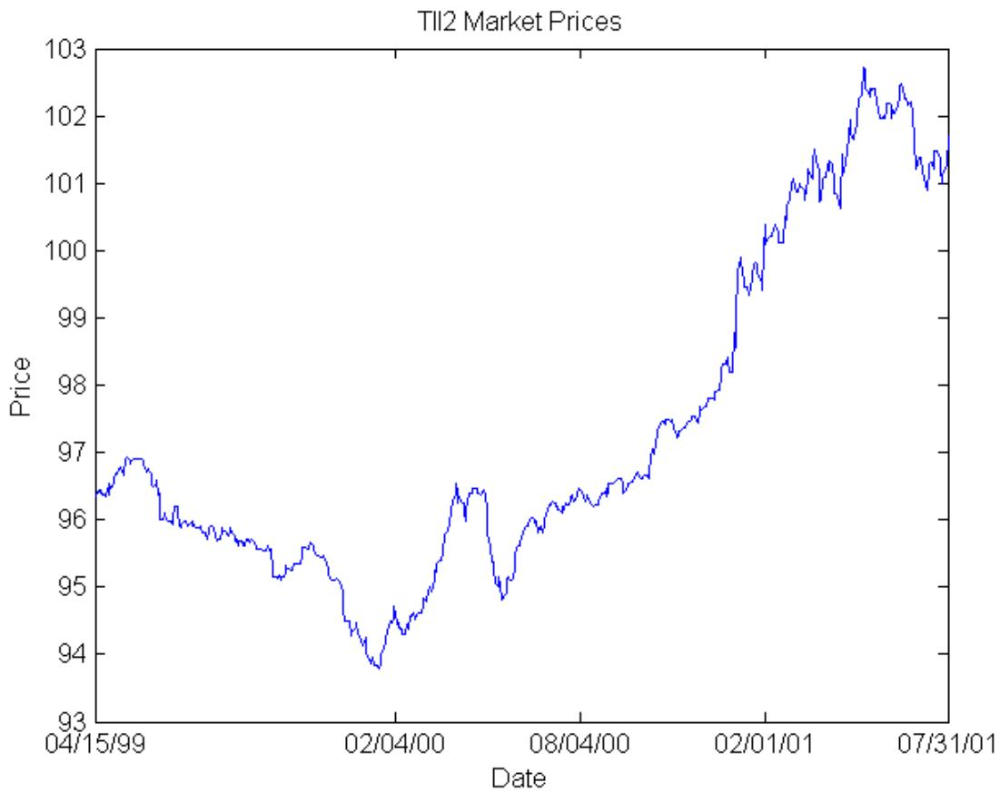

<!-- page: 26 -->

Figure 2

The daily and monthly CPI-U index levels over 15-Apr-99 to 31-July-01. The first graph includes the linear interpolation between the months used in the observation period to determine the daily values. The second graph gives the original CPI-U values from 31-Jan-50 to 31-July-01.

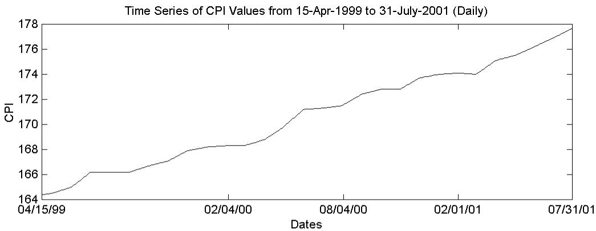

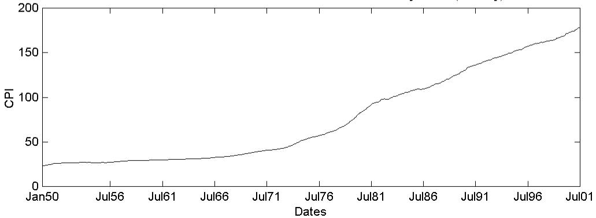

<!-- page: 27 -->

Figure 3

Time series graphs of the 3-, 5-, 10-, and 30- year real forward rates over the time period 15-Apr-99 to 31-July-01.

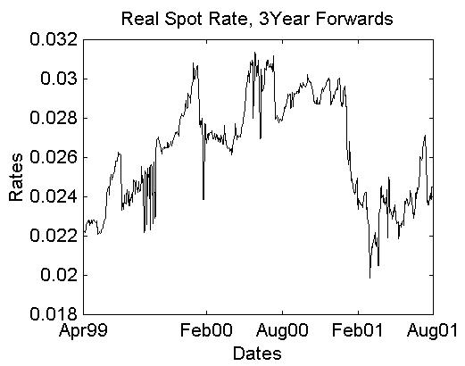

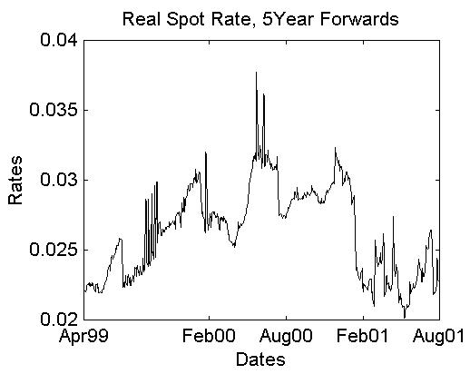

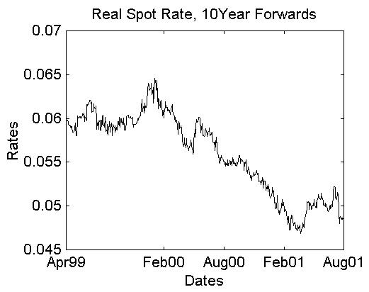

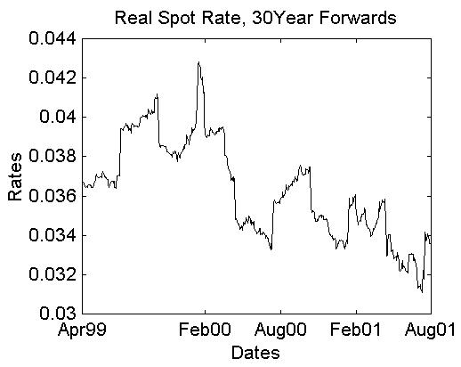

<!-- page: 28 -->

Figure 4

Time series graphs of the 3-, 5-, 10-, and 30-year nominal forward rates over the time period 15-Apr-99 to 31-July-01.

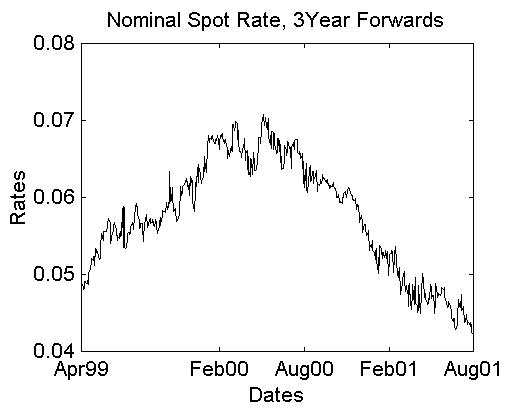

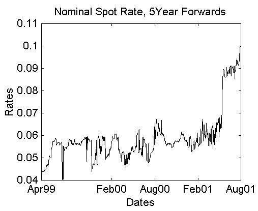

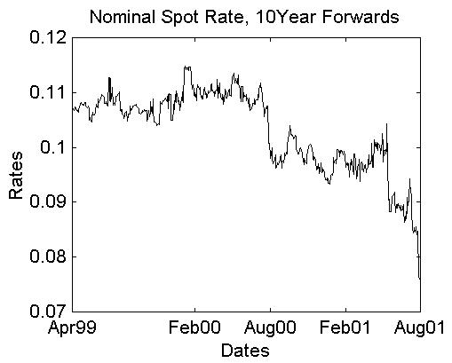

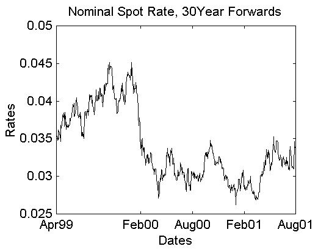

<!-- page: 29 -->

Figure 5

The nominal versus real forward rate spreads from 15-Apr-99 to 31-July-01. The 3-, 5-, 10-, and 30-year spreads are depicted as a piecewise constant curve.

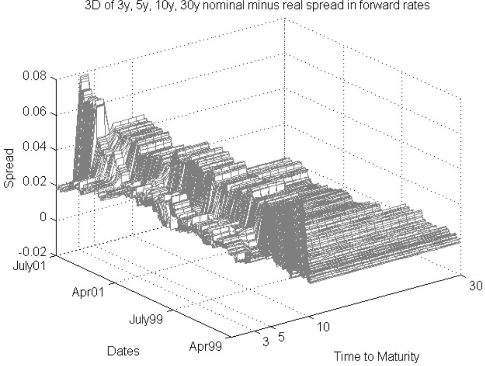

<!-- page: 30 -->

## Figure 6

Hypothetical European call option prices on the inflation index over the time period April 15 1999 – July 31 2001. The strike price K is given as a percent of the base CPI-U values of 158.4354, 161.5548, 164, 161.74, and 164.3933. The option maturities graphed are 3, 5, 10 and 30 years.

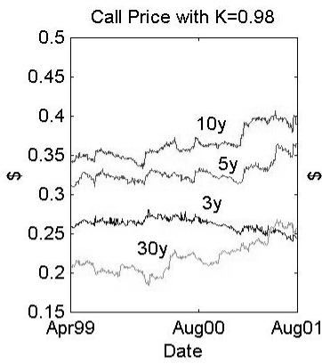

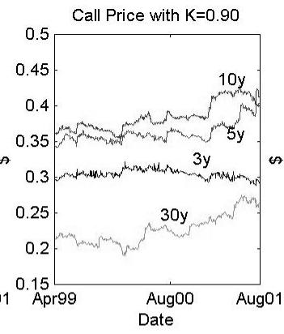

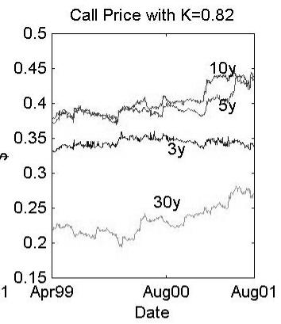

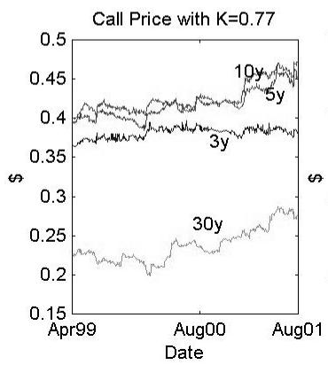

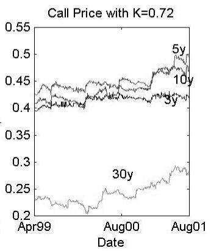

<!-- page: 31 -->

Table 1: TIPS Data

The TIPS data set is obtained from Datastream with prices available from the issue date till 31-July-01. Given in the table are the coupon rate, the date issued, and the maturity date of the various bonds.

[Table source crop](assets/tables/2003-jarrow-yildirim-inflation-hjm-p0031-block-0003-6df73be1d359b058.jpg)

## Table 2: Percentage Pricing Errors from Coupon Bond Stripping

The percentage pricing errors from the coupon bond stripping procedure are reported in the following table. The TIPS: TII1, TII5 and TII6 are the coupon bonds not included in the stripping estimation procedure.

[Table source crop](assets/tables/2003-jarrow-yildirim-inflation-hjm-p0031-block-0006-36036f10b04040dc.jpg)

<!-- page: 32 -->

## Table 3: Parameter Estimates

This table reports the estimated $\hat { \sigma } _ { n } , \hat { a } _ { n } , \hat { \sigma } _ { r } , \hat { a } _ { r } , \hat { \sigma } _ { I } , \hat { \rho } _ { r I } , \hat { \rho } _ { n I } , \hat { \rho } _ { r n }$ parameters and their standard errors, where available.

The parameters $\hat { \sigma } _ { r } , \hat { a } _ { r }$ r are estimated using a cross-sectional non-linear regression,

$$
\nu a r \Biggl ( \frac { \varDelta P _ { r } \left( t + A , T \right) } { P _ { r } \left( t , T \right) } \Biggr ) = \frac { \sigma _ { r } ^ { 2 } \left( e ^ { - a _ { r } \left( T - t \right) } - I \right) ^ { 2 } \varDelta } { a _ { r } ^ { 2 } }
$$

across the different maturities. The parameters $\hat { \sigma } _ { I } , \hat { \rho } _ { r I } , \hat { \rho } _ { n I } , \hat { \rho } _ { r n }$ , are found from equation (23) using the historical CPI data and the real spot rates calculated from equation (18).

A similar estimation procedure is used for the nominal term structure parameters.

[Table source crop](assets/tables/2003-jarrow-yildirim-inflation-hjm-p0032-block-0007-3953ff06a5916af5.jpg)

<!-- page: 33 -->

## Table 4: Percentage Hedging Errors

This table provides the percentage hedging errors from hedging the indicated TIPS with a Treasury security and two alternative TIPS. Standard deviations of the percentage hedging errors are also provided. For comparison purposes, the percentage hedging errors of a matched maturity Treasury security with two alternative and distinct Treasury securities is also provided.

[Table source crop](assets/tables/2003-jarrow-yildirim-inflation-hjm-p0033-block-0003-cc28ee5e594e5220.jpg)

<!-- page: 34 -->

## Table 5

Hypothetical European call option values in dollars on the inflation index computed on the last date in our observation period (7/31/2001). The strike price is given as the indicated percentage of the CPI-U index value of 158.4354. The option maturities included are 3, 5, 10 and 30 years.

[Table source crop](assets/tables/2003-jarrow-yildirim-inflation-hjm-p0034-block-0003-90db4ef37291d8a5.jpg)
