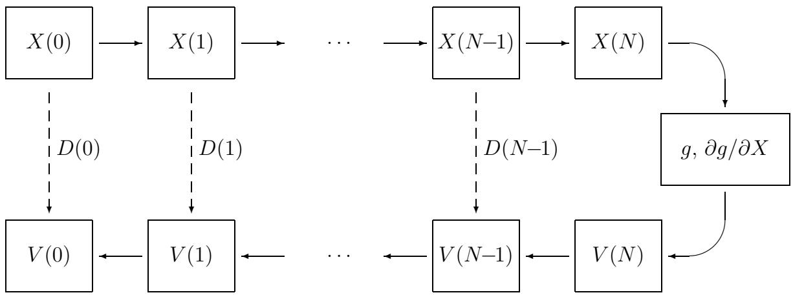
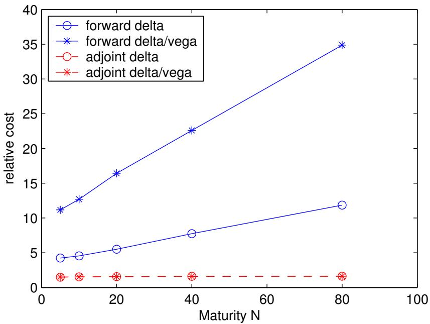

# 2006-giles-glasserman-smoking-adjoints

<!-- page: 1 -->

## Smoking Adjoints: fast evaluation of Greeks in Monte Carlo calculations

Michael Giles

Oxford University Computing Laboratory, Parks Road, Oxford, U.K.

Paul Glasserman

Columbia Business School, 403 Uris Hall, New York, NY 10028.

This paper presents an adjoint method to accelerate the calculation of Greeks by Monte Carlo simulation. The method calculates price sensitivities along each path; but in contrast to a forward pathwise calculation, it works backward recursively using adjoint variables. Along each path, the forward and adjoint implementations produce the same values, but the adjoint method rearranges the calculations to generate potential computational savings. The adjoint method outperforms a forward implementation in calculating the sensitivities of a small number of outputs to a large number of inputs. This applies, for example, in estimating the sensitivities of an interest rate derivatives book to multiple points along an initial forward curve or the sensitivities of an equity derivatives book to multiple points on a volatility surface. We illustrate the application of the method in the setting of the LIBOR market model. Numerical results confirm that the computational advantage of the adjoint method grows in proportion to the number of initial forward rates.

Key words and phrases: computational finance, Monte Carlo, adjoint

Oxford University Computing Laboratory

Numerical Analysis Group

Wolfson Building

Parks Road

Oxford, England OX1 3QD

<!-- page: 2 -->

## 1 Introduction

The eficient calculation of price sensitivities continues to be among the greatest practical challenges facing users of Monte Carlo methods in the derivatives industry. Computing Greeks is essential to hedging and risk management, but typically requires substantially more computing time than pricing a derivative. This article shows how an adjoint formulation can be used to accelerate the calculation of the Greeks. This method is particularly well suited to applications requiring sensitivities to a large number of parameters. Examples include interest rate derivatives requiring sensitivities to all initial forward rates and equity derivatives requiring sensitivities to all points on a volatility surface.

The simplest methods for estimating Greeks are based on finite diference approximations, in which a Monte Carlo pricing routine is re-run multiple times at diferent settings of the input parameters in order to estimate sensitivities to the parameters. In the fixed income setting, for example, this would mean perturbing each initial forward rate and then re-running the Monte Carlo simulation to re-price a security or a whole book. The main virtues of this method are that it is straightforward to understand and requires no additional programming. But the bias and variance properties of finite diference estimates can be rather poor, and their computing time requirements grow with the number of input parameters.

Better estimates of price sensitivities can often be derived by using information about model dynamics in a Monte Carlo simulation. Techniques for doing this include the pathwise method and likelihood ratio method, both of which are reviewed in Chapter 7 of Glasserman [4]. When applicable, these methods produce unbiased estimates of price sensitivities from a single set of simulated paths — i.e., without perturbing any parameters. The pathwise method accomplishes this by diferentiating the evolution of the underlying assets or state variables along each path; the likelihood ratio method instead diferentiates the transition density of the underlying assets or state variables. In comparison to finite diference estimates, these methods require additional model analysis and programming, but the additional efort is often justified by the improvement in the quality of calculated Greeks.

The adjoint method we develop here applies ideas used in computational fluid dynamics [3] to the calculation of pathwise estimates of Greeks. The estimate computed using the adjoint method is identical to the ordinary pathwise estimate; its potential advantage is therefore computational, rather than statistical. The relative merits of the ordinary (forward) calculation of pathwise Greeks and the adjoint calculation be summarized as follows:

The adjoint method is advantageous for calculating the sensitivities of a small number of securities with respect to a large number of parameters. The forward method is advantageous for calculating the sensitivities of many securities with respect to a small number of parameters.

The “small number of securities” in this dichotomy could be an entire book, consisting of many individual securities, so long as the sensitivities to be calculated are for the book as a whole and not for the constituent securities.

<!-- page: 3 -->

The rest of this article is organized as follows. Section 2 reviews the usual forward calculation of pathwise Greeks and Section 3 illustrates its application in the LIBOR market model. Section 4 develops the adjoint method for delta estimates. Section 5 extends it to applications like vega estimation requiring sensitivities to parameters of model dynamics, rather than just sensitivities to initial conditions; Section 6 extends it to gamma estimation. We use the LIBOR market model as an illustrative example in both settings. Section 7 presents numerical results which illustrate the computational savings ofered by the adjoint method.

## 2 Pathwise Delta: Forward Method

We start by reviewing the application of the pathwise method for computing price sensitivities in the setting of a multidimensional difusion process satisfying a stochastic diferential equation

$$
d \tilde { X } ( t ) = a ( \tilde { X } ( t ) ) d t + b ( \tilde { X } ( t ) ) d W ( t ) .\tag{2.1}
$$

The process $\tilde { X }$ is m-dimensional, W is a d-dimensional Brownian motion, $a ( \cdot )$ takes values in $R ^ { m }$ and $b ( \cdot )$ takes values in $R ^ { m \times d }$ . For example, $\tilde { X }$ could record a vector of equity prices $\mathrm { o r } \longrightarrow \mathrm { a s }$ in the case of the LIBOR market model, below $- \mathrm { ~ a ~ }$ vector of forward rates. We take (2.1) to be the risk-neutral or otherwise risk-adjusted dynamics of the relevant financial variables. $\mathrm { A }$ derivative security maturing at time $T$ with discounted payof $g ( \tilde { X } ( T ) )$ has price $E [ g ( \tilde { X } ( T ) ]$ , the expected value of the discounted payof.

In a Monte Carlo simulation, the evolution of the process $\tilde { X }$ is usually approximated using an Euler scheme. For simplicity, we take a fixed time step $h = T / N$ , with N an integer. We write $X ( n )$ for the Euler approximation at time $n h$ , which evolves according to

$$
X ( n + 1 ) = X ( n ) + a ( X ( n ) ) h + b ( X ( n ) ) Z ( n + 1 ) \sqrt { h } , \quad X ( 0 ) = \tilde { X } ( 0 ) ,\tag{2.2}
$$

where $Z ( 1 ) , Z ( 2 ) , . . .$ . are independent d-dimensional standard normal random vectors. With the normal random variables held fixed, (2.2) takes the form

$$
X ( n + 1 ) = F _ { n } ( X ( n ) )\tag{2.3}
$$

with $F _ { n }$ a transformation from $R ^ { m }$ to $R ^ { m }$

The price of the derivative with discounted payof function $g$ is estimated using the average of independent replications of $g ( X ( N ) )$ , $N = T / h$ . Now consider the problem of estimating

$$
\frac { \partial } { \partial X _ { j } ( 0 ) } E [ g ( \tilde { X } ( T ) ) ] ,
$$

the delta with respect to the jth underlying variable. The pathwise method estimates this delta using

$$
\frac { \partial } { \partial X _ { j } ( 0 ) } g ( \tilde { X } ( T ) ) ,
$$

<!-- page: 4 -->

the sensitivity of the discounted payof along the path. This is an unbiased estimate if

$$
E \left[ \frac { \partial } { \partial X _ { j } ( 0 ) } g ( \tilde { X } ( T ) ) \right] = \frac { \partial } { \partial X _ { j } ( 0 ) } E [ g ( \tilde { X } ( T ) ) ] ;
$$

i.e., if the derivative and expectation can be interchanged.

Conditions for this interchange are discussed in Glasserman [4], pp.393–395. Convenient suficient conditions impose some modest restrictions on the evolution of $\tilde { X }$ and some minimal smoothness on the discounted payof $^ { g , }$ such as a Lipschitz condition. If $g$ is Lipschitz, it is diferentiable almost everywhere and we may write

$$
\frac { \partial } { \partial X _ { j } ( 0 ) } g ( \tilde { X } ( T ) ) = \sum _ { i = 1 } ^ { m } \frac { \partial g ( \tilde { X } ( T ) ) } { \partial \tilde { X } _ { i } ( T ) } \frac { \partial \tilde { X } _ { i } ( T ) } { \partial \tilde { X } _ { j } ( 0 ) } .
$$

Conditions under which $\tilde { X } _ { i } ( T )$ is in fact diferentiable in $\tilde { X } _ { i } ( 0 )$ are discussed in Protter [9], p.250.

Using the Euler scheme (2.2), we approximate the pathwise derivative estimate using

$$
\sum _ { i = 1 } ^ { m } \frac { \partial g ( X ( N ) ) } { \partial X _ { i } ( N ) } \Delta _ { i j } ( N )\tag{2.4}
$$

with

$$
\Delta _ { i j } ( n ) = \frac { \partial X _ { i } ( n ) } { \partial X _ { j } ( 0 ) } , \quad i , j = 1 , \ldots , m .
$$

Thus, in order to evaluate (2.4), we need to compute the state sensitivities $\Delta _ { i j } ( N )$ . We simulate their evolution by diferentiating (2.2) to get

$$
\Delta _ { i j } ( n + 1 ) = \Delta _ { i j } ( n ) + \sum _ { k = 1 } ^ { m } { \frac { \partial a _ { i } } { \partial x _ { k } } } \Delta _ { k j } ( n ) h + \sum _ { \ell = 1 } ^ { d } \sum _ { k = 1 } ^ { m } { \frac { \partial b _ { i \ell } } { \partial x _ { k } } } \Delta _ { k j } ( n ) Z _ { \ell } ( n + 1 ) { \sqrt { h } } ,
$$

with $a _ { i }$ denoting the ith component of $a ( X ( n ) )$ and $b _ { i \ell }$ denoting the $( i , \ell )$ component of the $b ( X ( n ) )$ .

We can write this as a matrix recursion by letting $\Delta ( n )$ denote the $m \times m$ matrix with entries $\Delta _ { i j } ( n )$ . Let $D ( n )$ denote the $m \times m$ matrix with entries

$$
D _ { i k } ( n ) = \delta _ { i k } + \frac { \partial a _ { i } } { \partial x _ { k } } h + \sum _ { \ell = 1 } ^ { d } \frac { \partial b _ { i \ell } } { \partial x _ { k } } Z _ { \ell } ( n + 1 ) \sqrt { h } ,
$$

where $\delta _ { i k }$ is 1 if $i = k$ and 0 otherwise. The evolution of $\Delta$ can now be written as

$$
\Delta ( n + 1 ) = D ( n ) \Delta ( n ) ,\tag{2.5}
$$

with initial condition $\Delta ( 0 ) = I$ where I is the $m \times m$ identity matrix. The matrix $D ( n )$ is the derivative of the transformation $F _ { n }$ in (2.3). For large m, propagating this m m recursion may add substantially to the computational efort required to simulate the original vector recursion (2.2).

<!-- page: 5 -->

## 3 LIBOR Market Model

To help fix ideas, we now specialize to the LIBOR market model of Brace, Gatarek and Musiela [2]. Fix a set of $m + 1$ bond maturities $T _ { i } , \ i = 1 , \dots , m + 1$ , with spacings $T _ { i + 1 } - T _ { i } = \delta _ { i }$ . Let $\tilde { L } _ { i } ( t )$ denote the forward LIBOR rate fixed at time t for the interval $[ T _ { i } , T _ { i + 1 } ) , i = 1 , \dots , m$ . Let $\eta ( t )$ denote the index of the next maturity date as of time $t , T _ { \eta ( t ) - 1 } \leq t < T _ { \eta ( t ) }$ . The arbitrage-free dynamics of the forward rates take the form

$$
\frac { d \tilde { L } _ { i } ( t ) } { \tilde { L } _ { i } ( t ) } = \mu _ { i } ( \tilde { L } ( t ) ) d t + \sigma _ { i } ^ { \top } d W ( t ) , \quad 0 \leq t \leq T _ { i } , \quad i = 1 , \ldots , m ,
$$

where $W$ is a d-dimensional standard Brownian motion under a risk-adjusted measure and

$$
\mu _ { i } ( \tilde { L } ( t ) ) = \sum _ { j = \eta ( t ) } ^ { i } \frac { \sigma _ { i } ^ { \top } \sigma _ { j } \delta _ { j } \tilde { L } _ { j } ( t ) } { 1 + \delta _ { j } \tilde { L } _ { j } ( t ) } .
$$

Although $\mu _ { i }$ has an explicit dependence on t through $\eta ( t )$ , we suppress this argument. To keep this example as simple as possible, we take each $\sigma _ { i }$ (a d-vector of volatilities) to be a function of time to maturity,

$$
\sigma _ { i } ( t ) = \sigma _ { i - \eta ( t ) + 1 } ( 0 ) ,\tag{3.1}
$$

as in [5]; however, the same ideas apply if $\sigma _ { i }$ is itself a function of $\tilde { L } ( t )$ , as it often would be in trying to match a vol skew.

To simulate, we apply an Euler scheme to the logarithms of the forward rates, rather than the forward rates themselves. This yields

$$
L _ { i } ( n + 1 ) = L _ { i } ( n ) \exp \left( [ \mu _ { i } ( L ( n ) ) - \| \sigma _ { i } \| ^ { 2 } / 2 ] h + \sigma _ { i } ^ { \top } Z ( n + 1 ) \sqrt { h } \right) , \quad i = \eta ( n h ) , \ldots , m .\tag{3.2}
$$

Once a rate settles at its maturity it remains fixed, so we set $L _ { i } ( n + 1 ) \ = \ L _ { i } ( n )$ if $i < \eta ( n h )$ . The computational cost of implementing (3.2) is minimized by first evaluating the summations

$$
S _ { i } ( n ) = \sum _ { j = \eta ( t ) } ^ { i } \frac { \sigma _ { j } \delta _ { j } L _ { j } ( n ) } { 1 + \delta _ { j } L _ { j } ( n ) } , \quad i = \eta ( n h ) , \ldots , m .\tag{3.3}
$$

This then gives $\mu _ { i } = \sigma _ { i } ^ { \top } S _ { i }$ and hence the total computational cost is $O ( m )$ per timestep.

A simple example of a derivative in this context is a caplet for the interval $[ T _ { m } , T _ { m + 1 } )$ struck at $K$ . It has discounted payof

$$
\left( \prod _ { i = 0 } ^ { m } \frac { 1 } { 1 + \delta _ { i } \tilde { L } _ { i } ( T _ { i } ) } \right) \delta _ { m } \operatorname* { m a x } \{ 0 , \tilde { L } _ { m } ( T _ { m } ) - K \} .
$$

We can express this as a function of $\tilde { L } ( T _ { m } )$ (rather than $\tilde { L } ( T _ { i } ) , i = 1 , . . . , m )$ by freezing $\tilde { L } _ { i } ( t )$ at $\tilde { L } _ { i } ( T _ { i } )$ for $t > T _ { i }$ . It is convenient to include the maturities $T _ { i }$ among the simulated dates of the Euler scheme, introducing unequal step sizes if necessary.

<!-- page: 6 -->

$$
\begin{array} { r l r l r l } { D = \left( \begin{array} { l l l l l l l l l } { 1 } & & & & & & \\ & { 1 } & & & & & \\ & & { 1 } & & & & & \\ & & & { \times } & & & & \\ & & & { \times } & { \times } & & & \\ & & { \times } & { \times } & { \times } & \\ & & & { \times } & { \times } & { \times } \end{array} \right) , } & & { D ^ { \top } = \left( \begin{array} { l l l l l l l l } { 1 } & & & & & & \\ & { 1 } & & & & & \\ & & { 1 } & & & & \\ & & { \times } & { \times } & { \times } & { \times } \\ & & & & { \times } & { \times } \\ & & & & & { \times } & { \times } \\ & & & & & & { \times } \end{array} \right) } \\ & { \times } & { \times } & { \times } & { \times } \end{array}
$$

Figure 1: Structure of the matrix D and its transpose: is a non-zero entry, blanks are zero.

Glasserman and Zhao [5] develop (and rigorously justify) the application of the pathwise method in this setting. Their application includes the evolution of the derivatives

$$
\Delta _ { i j } ( n ) = { \frac { \partial L _ { i } ( n ) } { \partial L _ { j } ( 0 ) } } , \quad i = 1 , \ldots , m , \ j = 1 , \ldots , i ,
$$

which can be found by diferentiating (3.2). In the notation of (2.5), the matrix $D ( n )$ has the structure shown in Figure 1, with diagonal entries

$$
D _ { i i } ( n ) = \left\{ \begin{array} { l l } { 1 } & { i < \eta ( n h ) ; } \\ { \displaystyle \frac { L _ { i } ( n + 1 ) } { L _ { i } ( n ) } + \frac { L _ { i } ( n + 1 ) \| \sigma _ { i } \| ^ { 2 } \delta _ { i } h } { ( 1 + \delta _ { i } L _ { i } ( n ) ) ^ { 2 } } , } & { i \ge \eta ( n h ) ; } \end{array} \right.
$$

and, for $j \neq i ,$

$$
D _ { i j } ( n ) = \left\{ \begin{array} { l l } { \displaystyle \frac { L _ { i } ( n + 1 ) \sigma _ { i } ^ { \top } \sigma _ { j } \delta _ { j } h } { ( 1 + \delta _ { j } L _ { j } ( n ) ) ^ { 2 } } , i > j \geq \eta ( n h ) ; } \\ { 0 , } & { \mathrm { o t h e r w i s e } . } \end{array} \right.
$$

The eficient implementation used in the numerical results of [5] uses $\Delta _ { i j } ( n + 1 ) =$ $\Delta _ { i j } ( n )$ for $i < \eta ( n h )$ , while for $i \geq \eta ( n h )$

$$
\Delta _ { i j } ( n + 1 ) = \frac { L _ { i } ( n + 1 ) } { L _ { i } ( n ) } \Delta _ { i j } ( n ) + L _ { i } ( n + 1 ) \sigma _ { i } ^ { \top } \sum _ { k = \eta ( n h ) } ^ { i } \frac { \sigma _ { k } \delta _ { k } h \Delta _ { k j } ( n ) } { ( 1 + \delta _ { k } L _ { k } ( n ) ) ^ { 2 } } .
$$

The summations on the right can be computed at a cost which is $O ( m )$ for each $j ,$ and hence the total computational cost per timestep is $O ( m ^ { 2 } )$ rather than the $O ( m ^ { 3 } )$ cost of implementing (2.5) in general.

Despite this, the number of forward rates m in the LIBOR market model can easily be 20–80, making the numerical evaluation of $\Delta _ { i j } ( n )$ rather costly. To get around this problem, Glasserman and Zhao [5] proposed faster approximations to (2.5). The adjoint method in the next section can achieve computational savings without introducing any approximation beyond that already present in the Euler scheme.

<!-- page: 7 -->

## 4 Pathwise Delta: Adjoint Method

Consider again the general setting of (2.1) and (2.2) and write $\partial g / \partial X ( 0 )$ for the row vector of derivatives of $g ( X ( N ) )$ with respect to the elements of X(0). With (2.4) and (2.5), we can write this as

$$
\begin{array} { r c l } { { \displaystyle \frac { \partial g } { \partial X ( 0 ) } } } & { { = } } & { { \displaystyle \frac { \partial g } { \partial X ( N ) } \Delta ( N ) } } \\ { { } } & { { = } } & { { \displaystyle \frac { \partial g } { \partial X ( N ) } D ( N - 1 ) D ( N - 2 ) \cdots D ( 0 ) \Delta ( 0 ) } } \\ { { } } & { { \equiv } } & { { V ( 0 ) ^ { \top } \Delta ( 0 ) , } } \end{array}\tag{4.1}
$$

where $V ( 0 )$ can be calculated recursively using

$$
V ( n ) = D ( n ) ^ { \top } V ( n + 1 ) , \quad V ( N ) = \left( { \frac { \partial g } { \partial X ( N ) } } \right) ^ { \top } .\tag{4.2}
$$

The key point is that the adjoint relation (4.2) is a vector recursion whereas (2.5) is a matrix recursion. Thus, rather than update $m ^ { 2 }$ variables at each time step, it sufices to update the m entries of the adjoint variables $V ( n )$ . This can represent a substantial savings.

The adjoint method accomplishes this by fixing the payof $g$ in the initialization of $V ( N )$ , whereas the forward method allows calculation of pathwise deltas for multiple payofs once the $\Delta ( n )$ matrices have been simulated. Thus, the adjoint method is beneficial if we are interested in calculating sensitivities of a single function $g$ with respect to multiple changes in the initial condition X(0) – for example, if we need sensitivities with respect to each $X _ { i } ( 0 )$ . The function $g$ need not be associated with an individual security; it could be the value of an entire portfolio.

The adjoint recursion in (4.2) runs backward in time, starting at $V ( N )$ and working recursively back to $V ( 0 )$ . To implement it, we need to store the vectors $X ( 0 ) , \ldots , X ( N )$

<!-- page: 8 -->

as we simulate forward in time so that we can evaluate the matrices $D ( N { - } 1 ) , \ldots , D ( 0 )$ as we work backward. This introduces some additional storage requirements, but these requirements are relatively minor because it sufices to store just the current path. The final calculation $V ( 0 ) ^ { \top } \Delta ( 0 )$ produces exactly the same result as the forward calculations (2.4)–(2.5), but it does so with $O ( N m ^ { 2 } )$ operations rather than $O ( N m ^ { 3 } )$ operations.

To help fix ideas, we unravel the adjoint calculation in the setting of the LIBOR market model. After initializing $V ( N )$ according to (4.2), we set $V _ { i } ( n ) = V _ { i } ( n { + } 1 )$ for $i < \eta ( n h )$ , while for $i \geq \eta ( n h )$

$$
V _ { i } ( n ) = \frac { L _ { i } ( n + 1 ) V _ { i } ( n + 1 ) } { L _ { i } ( n ) } + \frac { \sigma _ { i } ^ { \top } \delta _ { i } h } { ( 1 + \delta _ { i } L _ { i } ( n ) ) ^ { 2 } } \sum _ { j = i } ^ { m } L _ { j } ( n + 1 ) V _ { j } ( n + 1 ) \sigma _ { j } .
$$

The summations on the right can be computed at a cost which is $O ( m )$ , so the total cost per timestep is $O ( m )$ which is better than in the general case.

This is an example of a general feature of adjoint methods; whenever there is a particularly eficient way of implementing the original calculation there is also an eficient implementation of the adjoint calculation. This comes from a general result in the theory of Algorithmic Diferentiation [7], proving that the computational complexity of the adjoint calculation is no more than 4 times greater than the complexity of the original algorithm. There are a variety of tools available for the automatic generation of eficient adjoint implementations, given an implementation of the original algorithm in C or C++ [1]. A brief overview of the key ideas in Algorithmic Diferentiation is given in the appendix.

## 5 Pathwise Vegas

Section 4 considers only the case of pathwise deltas, but similar ideas apply in calculating sensitivities to volatility parameters. The key distinction is that volatility parameters afect the evolution equation (2.3), and not just its initial conditions. Indeed, although we focus on vega, the same ideas apply to other parameters of the dynamics of the underlying process.

To keep the discussion generic, let θ denote a parameter of $F _ { n }$ in (2.3). For example, θ could parameterize an entire vol surface or it could be the volatility of an individual rate at a specific date. The pathwise estimate of sensitivity to $\theta$ is

$$
\frac { \partial g } { \partial \theta } = \sum _ { i = 1 } ^ { m } \frac { \partial g } { \partial X _ { i } ( N ) } \frac { \partial X _ { i } ( N ) } { \partial \theta } .
$$

If we write $\Theta ( n )$ for the vector $\partial X ( n ) / \partial \theta$ , then we get

$$
\begin{array} { l l l } { { \Theta ( n + 1 ) } } & { { = } } & { { \displaystyle \frac { \partial F _ { n } } { \partial X } ( X ( n ) , \theta ) \Theta ( n ) + \frac { \partial F _ { n } } { \partial \theta } ( X ( n ) , \theta ) } } \\ { { } } & { { = } } & { { \displaystyle D ( n ) \Theta ( n ) + B ( n ) , } } \end{array}\tag{5.1}
$$

<!-- page: 9 -->

with initial conditions $\Theta ( 0 ) = 0$ . The sensitivity to θ can then be evaluated as

$$
\begin{array} { r l r } {  { \frac { \partial g } { \partial \theta } = \frac { \partial g } { \partial X ( N ) } \Theta ( N ) } } \\ & { } & { = \frac { \partial g } { \partial X ( N ) } \{ B ( N - 1 ) + D ( N - 1 ) B ( N - 2 ) + \ldots + D ( N - 1 ) D ( N - 2 ) \ldots D ( 1 ) B ( 0 ) \} } \\ & { } & { = \sum _ { n = 0 } ^ { N - 1 } V ( n + 1 ) ^ { \top } B ( n ) , ( 5 . 2 ) } \end{array}
$$

where $V ( n )$ is the same vector of adjoint variables defined by (4.2).

In applying these ideas to the LIBOR market model, B becomes a matrix, with each column corresponding to a diferent element of the initial volatility vector $\sigma _ { j } ( 0 )$ . The derivative of the $i ^ { t h }$ element of $F _ { n } ( X _ { n } )$ with respect to $\sigma _ { j } ( n h )$ is

$$
\frac { \partial ( F _ { n } ) _ { i } } { \partial \sigma _ { j } ( n h ) } = \left\{ \begin{array} { l l } { \displaystyle \frac { L _ { i } ( n + 1 ) \sigma _ { i } \delta _ { i } L _ { i } ( n ) h } { 1 + \delta _ { i } L _ { i } ( n ) } } \\ { \quad + \left( S _ { i ^ { * } } h - \sigma _ { i ^ { * } } h + Z ( n + 1 ) \sqrt { h } \right) L _ { i } ( n + 1 ) , i = j \geq \eta ( n h ) , } \\ { \displaystyle \frac { L _ { i } ( n + 1 ) \sigma _ { i } \delta _ { j } L _ { j } ( n ) h } { 1 + \delta _ { j } L _ { j } ( n ) } , i > j \geq \eta ( n h ) ; } \\ { 0 , \quad \quad \quad \quad \quad \quad \quad \mathrm { o t h e r w i s e ; } } \end{array} \right.
$$

where $S _ { i }$ is as defined in (3.3). This has a similar structure to that of the matrix $D$ in Figure 1, except for the leading diagonal elements which are now zero. However, the matrix B is the derivative of $F _ { n } ( X _ { n } )$ with respect to the initial volatilities $\sigma _ { j } ( 0 )$ , so given the definition (3.1), the entries in the matrix B are ofset so that it has the structure shown in Figure 3.

From (5.2), the column vector of vega sensitivities is equal to

$$
\left( \frac { \partial g } { \partial \sigma ( 0 ) } \right) ^ { \top } = \sum _ { n = 0 } ^ { N - 1 } B ( n ) ^ { \top } V ( n + 1 )
$$

The $i ^ { t h }$ element of the product $B ( n ) ^ { \top } V ( n + 1 )$ is zero except for $1 \leq i \leq N - \eta ( n h ) + 1$ for which

$$
\Big ( S _ { i ^ { * } } h - \sigma _ { i ^ { * } } h + Z ( n + 1 ) \sqrt { h } \Big ) L _ { i ^ { * } } ( n + 1 ) V _ { i ^ { * } } ( n + 1 ) + \frac { \delta _ { i ^ { * } } L _ { i ^ { * } } ( n ) h } { 1 + \delta _ { i ^ { * } } L _ { i ^ { * } } ( n ) } \sum _ { j = i ^ { * } } ^ { m } L _ { j } ( n + 1 ) V _ { j } ( n + 1 ) \sigma _ { j }
$$

where $i ^ { * } \equiv i + \eta ( n h ) - 1$ . The summations on the right for the diferent values of $i ^ { * }$ are exactly the same summations performed in the eficient implementation of the adjoint calculation described in the previous section. Hence, the computational cost is $O ( m )$ per timestep.

<!-- page: 10 -->

$$
\begin{array} { r } { B = \left( \begin{array} { l l l l l l l } { ~ } & { ~ } & { ~ } & { ~ } & { ~ } & { ~ } & { ~ } \\ { ~ } & { ~ } & { ~ } & { ~ } & { ~ } & { ~ } & { ~ } \\ { ~ \times ~ } & { ~ } & { ~ } & { ~ } & { ~ } & { ~ } & { ~ } \\ { ~ \times ~ } & { ~ \times ~ } & { ~ } & { ~ } & { ~ } & { ~ } \\ { ~ \times ~ } & { ~ \times ~ } & { ~ } & { ~ } & { ~ } & { ~ } \end{array} \right) , ~ B ^ { \intercal } = \left( \begin{array} { l l l l l l l } { ~ } & { ~ } & { ~ \times ~ } & { \times ~ } & { \times ~ } \\ { ~ } & { ~ } & { ~ \times ~ } & { \times ~ } & { \times ~ } \\ { ~ } & { ~ } & { ~ } & { ~ \times ~ } & { \times ~ } & { ~ } \\ { ~ } & { ~ } & { ~ } & { ~ } & { ~ \times ~ } & { ~ } \\ { ~ } & { ~ } & { ~ \times ~ } & { ~ } & { ~ } & { ~ } \end{array} \right) } \\ { \times ~ } & { \times ~ } & { \times ~ } & { ~ } & { ~ } & { ~ } & { ~ } \end{array}
$$

Figure 3: Structure of the matrix B and its transpose: is a non-zero entry, blanks are zero.

## 6 Pathwise Gamma

The second order sensitivity of g to changes in $X ( 0 )$ is

$$
\frac { \partial ^ { 2 } g } { \partial X _ { j } ( 0 ) \partial X _ { k } ( 0 ) } = \sum _ { i = 1 } ^ { m } \frac { \partial g } { \partial X _ { i } ( N ) } \Gamma _ { i j k } ( N ) + \sum _ { i = 1 } ^ { m } \sum _ { \ell = 1 } ^ { m } \frac { \partial ^ { 2 } g } { \partial X _ { i } ( N ) \partial X _ { \ell } ( N ) } \Delta _ { i j } ( N ) \Delta _ { \ell k } ( N ) ,\tag{6.1}
$$

where

$$
\Gamma _ { i j k } ( n ) = \frac { \partial ^ { 2 } X _ { i } ( n ) } { \partial X _ { j } ( 0 ) \partial X _ { k } ( 0 ) } .
$$

Diferentiating (2.3) twice yields

$$
\Gamma _ { i j k } ( n + 1 ) = \sum _ { \ell = 1 } ^ { m } D _ { i \ell } ( n ) \Gamma _ { \ell j k } ( n ) + \sum _ { \ell = 1 } ^ { m } \sum _ { m = 1 } ^ { m } E _ { i \ell m } ( n ) \Delta _ { \ell j } ( n ) \Delta _ { m k } ( n ) ,
$$

where $D _ { i \ell } ( n )$ is as defined previously, and

$$
E _ { i \ell m } ( n ) = \frac { \partial ^ { 2 } F _ { i } ( n ) } { \partial X _ { \ell } ( n ) \partial X _ { m } ( n ) } .
$$

For a particular index pair $( j , k )$ , by defining

$$
G _ { i } ( n ) = \Gamma _ { i j k } ( n ) , \quad C _ { i } ( n ) = \sum _ { \ell = 1 } ^ { m } \sum _ { m = 1 } ^ { m } E _ { i \ell m } ( n ) \Delta _ { \ell j } ( n ) \Delta _ { m k } ( n ) ,
$$

this may be written as

$$
G ( n + 1 ) = D ( n ) G ( n ) + C ( n ) .
$$

This is now in exactly the same form as the vega calculation, and so the same adjoint approach can be used. Option payofs ordinarily fail to be twice diferentiable, so using (6.1) requires replacing the true payof g with a smoothed approximation.

The computational operation count is $O ( N m ^ { 3 } )$ for the forward calculation of $L ( n )$ and $\Delta ( n )$ (and hence $D ( n )$ and the vectors $C ( n )$ for each index pair $( j , k ) )$ plus $O ( N m ^ { 2 } )$ for the backward calculation of the adjoint variables $V ( n )$ , followed by an $O ( N m ^ { 3 } )$ cost for evaluating the final sums in (5.2) for each $( j , k )$ This is again a factor $O ( m )$ less expensive than the alternative approach based on a forward calculation of $\Gamma _ { i j k } ( n )$

<!-- page: 11 -->

## 7 Numerical Results

Since the adjoint method produces exactly the same sensitivity values as the forward pathwise approach, the numerical results address the computational savings given by the adjoint approach applied to the LIBOR market model. The calculations are performed using one timestep per LIBOR interval (i.e., the timestep h equals the spacing $\delta _ { i } \equiv \delta$ which we take to be a quarter of a year). We take the initial forward curve to be flat at 5% and all volatilities equal to 20% in a single-factor (d = 1) model. Our test portfolio consists of options on 1-year, 2-year, 5-year, 7-year and 10-year swaps with quarterly payments and swap rates of 4.5%, 5.0% and 5.5%, for a total of 15 swaptions. All swaptions expire in N periods, with N varying from 1 to 80.

Figure 4 plots the execution time for the forward and adjoint evaluation of both deltas and vegas, relative to the cost of simply valuing the swaption portfolio. The two curves marked with circles compare the forward and adjoint calculations of all deltas; the curves marked with stars compare the combined calculations of all deltas and vegas.

As expected, the relative cost of the forward method increases linearly with N, whereas the relative cost of the adjoint method is approximately constant. Moreover, adding the vega calculation to the delta calculation substantially increases the time required using the forward method; but this has virtually no impact on the adjoint method because the deltas and vegas use the same adjoint variables.

It is also interesting to note the actual magnitudes of the costs. For the forward method, the time required for each delta and vega evaluation is approximately 10% and 20%, respectively, of the time required to evaluate the portfolio. This makes the forward method 10–20 times more eficient than using central diferences, indicating a clear superiority for forward pathwise evaluation compared to finite diferences for applications in which one is interested in the sensitivities of a large number of diferent financial products. For the adjoint method, the observation is that one can obtain the sensitivity of one financial product (or a portfolio) to any number of input parameters for less than the cost of the original product evaluation.

<!-- page: 12 -->

The reason for the forward and adjoint methods having much lower computational cost than one might expect, relative to the original evaluation, is that in modern microprocessors, division and exponential function evaluation are 10–20 times more costly than multiplication and addition. By re-using quantities such as $L _ { i } ( n + 1 ) / L _ { i } ( n )$ and $( 1 + \delta _ { i } L _ { i } ( n ) ) ^ { - 1 }$ which have already been evaluated in the original calculation, the forward and adjoint methods can be implemented using only multiplication and addition, making their execution very rapid.

## 8 Conclusions

We have shown how an adjoint formulation can be used to accelerate the calculation of Greeks by Monte Carlo simulation using the pathwise method. The adjoint method produces exactly the same value on each simulated path as would be obtained using a forward implementation of the pathwise method; but it rearranges the calculations – working backward along each path – to generate potential computational savings.

The adjoint formulation outperforms a forward implementation in computing the sensitivity of a small number of outputs to a large number of inputs. This applies, for example, in a fixed income setting, in which the output is the value of a derivatives book and the inputs are points along the forward curve. We have illustrated the use of the adjoint method in the setting of the LIBOR market model and found it to be fast — smoking fast.

## References

[1] Automatic Diferentiation research community website, www.autodiff.org. [2] Brace, A., Gatarek, D., and Musiela, M. (1997) The market model of interest rate dynamics, Mathematical Finance 7:127–155. [3] Giles, M.B., and Pierce, N.A. (2000) An introduction to the adjoint approach to design, Flow, Turbulence and Control 65:393–415. [4] Glasserman, P. Monte Carlo Methods in Financial Engineering, Springer-Verlag, New York, (2004). [5] Glasserman, P., and Zhao, X. (1999) Fast Greeks by simulation in forward LIBOR models, Journal of Computational Finance 3:5–39.

<!-- page: 13 -->

[6] Giering, R., and Kaminski, T. (1998) Recipes for adjoint code construction, ACM Transactions on Mathematical Software 24(4):437–474. [7] Griewank, A. Evaluating derivatives : principles and techniques of algorithmic differentiation, SIAM, (2000). [8] Griewank, A., and Juedes, D. and Utke, J. (1996) ADOL-C: a package for the automatic diferentiation of algorithms written in C/C++, ACM Transactions on Mathematical Software 22(2):437–474. [9] Protter, P. Stochastic Integration and Diferential Equations, Springer-Verlag, Berlin, (1990).

<!-- page: 14 -->

## Appendix A Algorithmic Diferentiation

AD, which can stand for either Algorithmic Diferentiation [7] or Automatic Diferentiation [8], concerns the computation of sensitivity information from an algorithm or computer program.

Consider a computer program which starts with a number of input variables $u _ { i } , i =$ $1 , \ldots I$ which can be represented collectively as an input vector $\mathbf { u } ^ { 0 }$ . Each step in the execution of the computer program computes a new value as a function of two previous values; unitary functions such as $\exp ( x )$ can be viewed as a binary function with no dependence on the second parameter. Appending this new value to the vector of active variables, the $n ^ { t h }$ execution step can be expressed as

$$
\mathbf { u } ^ { n } = \mathbf { f } ^ { n } ( \mathbf { u } ^ { n - 1 } ) \equiv \left( \frac { \mathbf { u } ^ { n - 1 } } { f _ { n } ( \mathbf { u } ^ { n - 1 } ) } \right) ,\tag{A.1}
$$

where $f _ { n }$ is a scalar function of two of the elements of $\mathbf u ^ { n - 1 }$ . The result of the complete N steps of the computer program can then be expressed as the composition of these individual functions to give

$$
\mathbf { u } ^ { N } = \mathbf { f } ^ { N } \circ \mathbf { f } ^ { N - 1 } \circ \dots \circ \mathbf { f } ^ { 2 } \circ \mathbf { f } ^ { 1 } ( \mathbf { u } ^ { 0 } ) .\tag{A.2}
$$

In computing sensitivities, what we are interested in is the derivative of one or more elements of the output vector $\mathbf { u } ^ { N }$ with respect to one or more elements of the input vector $ { \mathbf { u } } ^ { 0 }$ . Using the notation which is standard within the AD literature, we define $\dot { { \mathbf { u } } } ^ { n }$ to be the derivative of the vector $ { \mathbf { u } } ^ { n }$ with respect to one particular element of $\mathbf { u } ^ { 0 }$ Diferentiating (A.1) then gives

$$
\dot { \mathbf { u } } ^ { n } = L ^ { n } \dot { \mathbf { u } } ^ { n - 1 } , \quad L ^ { n } = \left( \frac { I ^ { n - 1 } } { \partial f _ { n } / \partial \mathbf { u } ^ { n - 1 } } \right) ,\tag{A.3}
$$

with $I ^ { n - 1 }$ being the identity matrix with dimension equal to the length of the vector $\mathbf u ^ { n - 1 }$ . The derivative of (A.2) then gives

$$
\dot { \mathbf { u } } ^ { N } = L ^ { N } L ^ { N - 1 } \dots L ^ { 2 } L ^ { 1 } \dot { \mathbf { u } } ^ { 0 } ,\tag{A.4}
$$

which gives the sensitivity of the entire output vector to the change in one particular element of the input vector. The elements of the initial vector $\dot { \mathbf { u } } ^ { 0 }$ are all zero except for a unit value for the particular element of interest. If one is interested in the sensitivity to $N _ { I }$ diferent input elements, then (A.4) must be evaluated for each one, at a cost which is proportional to $N _ { I }$

The above description is of the forward mode of AD sensitivity calculation, which is intuitively quite natural. However, there is a second approach, the reverse or adjoint mode, which is computationally much more eficient when one is interested in the sensitivity of a small number of output quantities with respect to a large number of input parameters. Again using the standard AD notation, we define the column vector $\overline { { \mathbf { u } } } ^ { n }$ to be the derivative of a particular element of the output vector $u _ { i } ^ { N }$ with respect to the elements of $ { \mathbf { u } } ^ { n }$ . Using the chain rule of diferentiation,

<!-- page: 15 -->

$$
\left( \overline { { { \bf u } } } ^ { n - 1 } \right) ^ { T } \ = \ \frac { \partial u _ { i } ^ { N } } { \partial { \bf u } ^ { n - 1 } } \ = \ \frac { \partial u _ { i } ^ { N } } { \partial { \bf u } ^ { n } } \ \frac { \partial { \bf u } ^ { n } } { \partial { \bf u } ^ { n - 1 } } \ = \ \left( \overline { { { \bf u } } } ^ { n } \right) ^ { T } L ^ { n } \quad \Longrightarrow \quad \overline { { { \bf u } } } ^ { n - 1 } = \left( L ^ { n } \right) ^ { T } \overline { { { \bf u } } } ^ { n } .\tag{A.5}
$$

Hence, the sensitivity of the particular output element to all of the elements of the input vector is given by

$$
\overline { { \mathbf { u } } } ^ { 0 } = \left( L ^ { 1 } \right) ^ { T } \left( L ^ { 2 } \right) ^ { T } \ldots \left( L ^ { N - 1 } \right) ^ { T } \left( L ^ { N } \right) ^ { T } \overline { { \mathbf { u } } } ^ { N } .\tag{A.6}
$$

If one is interested in the sensitivity of $N _ { O }$ diferent output elements, then (A.6) must be evaluated for each one, at a cost which is proportional to $N _ { O }$ . Thus the reverse mode is computationally much more eficient than the forward mode when $N _ { O } \ll N _ { I }$

Looking in more detail at what is involved in (A.3) and (A.5), suppose that the $n ^ { t h }$ step of the original program involves the computation

$$
c = f ( a , b ) .
$$

The corresponding forward mode step will be

$$
{ \dot { c } } = { \frac { \partial f } { \partial a } } { \dot { a } } + { \frac { \partial f } { \partial b } } { \dot { b } }
$$

at a computational cost which is no more than a factor 3 greater than the original nonlinear calculation. Looking at the structure of $( L ^ { n } ) ^ { T }$ , one finds that the corresponding reverse mode step consists of two calculations:

$$
\begin{array} { r } { \displaystyle \overline { { a } } ~ = ~ \overline { { a } } + \frac { \partial f } { \partial a } \overline { { c } } } \\ { \displaystyle \overline { { b } } ~ = ~ \overline { { b } } + \frac { \partial f } { \partial b } \overline { { c } } . } \end{array}
$$

At worst, this has a cost which is a factor 4 greater than the original nonlinear calculation. Note however that the reverse mode calculation proceeds backwards from $n { = } N$ to $n { = } 1$ Therefore, it is necessary to first perform the original calculation forwards from $n = 1$ to $n { = } N$ , storing all of the partial derivatives needed for $L ^ { n }$ , before then doing the reverse mode calculation. In some applications, for example in computational fluid dynamics, the storage requirements can be excessive, but in financial Monte Carlo applications the sensitivities are calculated one path at a time, requiring very little storage.

The above description outlines a clear algorithmic approach to the reverse mode calculation of sensitivity information. However, the programming implementation can be tedious and error-prone. Fortunately, tools have been developed to automate this process, either through operator overloading involving a process known as “taping” which records all of the partial derivatives in the nonlinear calculation then performs the reverse mode calculations [8], or through source code transformation which takes as an input the original program and generates a new program to perform the necessary calculations [6]. Further information about AD tools and publications is available from a website [1] which includes links to all of the major groups working in this field.
