<!-- page: 1 -->

## The Little Heston Trap 

Hansj¨org Albrecher∗ Philipp Mayer† Wim Schoutens‡ Jurgen Tistaert§ 

First Version: 6 December 2005 This Version: 11 September 2006 

> ∗Radon Institute, Austrian Academy of Sciences, Linz and Graz University of Technology, Austria,E-mail: albrecher@tugraz.at 

> †Graz University of Technology, Austria,E-mail: mayer@finanz.math.tugraz.at 

> ‡K.U.Leuven, W. De Croylaan 54, B-3001 Leuven, Belgium. E-mail: 

> K.U.Leuven, W. De Croylaan 54, B-3001 Leuven, Belgium. E-mail: wim@schoutens.be 

> §ING Financial Markets, Financial Modeling, Marnixlaan 24, B-1000 Brussels, Belgium. E-mail: Jurgen.Tistaert@ing.be

<!-- page: 2 -->

##### Abstract 

The role of characteristic functions in finance has been strongly amplified by the development of the general option pricing formula by Carr and Madan. As these functions are defined and operating in the complex plane, they potentially encompass a few well known numerical issues due to ”branching”. A number of elegant publications have emerged tackling these effects specifically for the Heston model. For the latter however we have two specifications for the characteristic function as they are the solutions to a Riccati equation. In this article we put the i’s and cross the t’s by formally pointing out the properties of and relations between both versions. For the first specification we show that for nearly any parameter choice, instabilities will occur for large enough maturities. We subsequently establish - under an additional parameter restriction - the existence of a “threshold” maturity from which the complex operations become a spoil-sport. For the second specification of the characteristic function it is proved that stability is guaranteed under the full dimensional and unrestricted parameter space. We blend the theoretical results with a few examples.

<!-- page: 3 -->

### 1 Introduction 

Since its inception in 1993, the Heston stochastic volatility model [5] has received a growing attention amongst practitioners and academics. It relaxes the constant volatility assumption in the classical Black-Scholes model by incorporating an instantaneous short term variance process. As such, a decent (though not all) number of smile and skew patterns can be built into volatility surfaces by a relatively restricted number of parameters. Several (extended) Monte-Carlo schemes and finite-difference techniques are available to perform exotic option pricing. Many interesting extensions have been proposed recently, e.g. by B¨uhler [2] within the context of consistent frameworks for variance modeling. 

In its basic form we can rely on a closed formula for the characteristic function, on which the main part of this story is related to. The latter was originally proposed to be used twice in a numerical integration scheme. The Fast Fourier approach by Carr & Madan [3] literally speeded up and extended its practical use by its ability to facilitate the calibration of plain vanilla option prices. 

### 2 Heston Model Revisited 

Let us shortly formalise the model, mainly for subsequent notation purposes. The dynamics of the stock price process S = {St, t ≥ 0} are very similar to the Black-Scholes setting. 

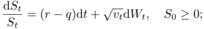

The instantaneous variance parameter is modeled as a mean-reverting square root stochastic process (also called CIR process), described by the following SDE: 

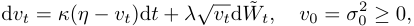

where W = {Wt, t ≥ 0} and W˜ = {W˜ t, t ≥ 0} are two correlated standard Brownian motions such that Cov[dWtd W˜ t] = ρdt. The involved parameters are: initial volatility, σ0 > 0, the mean reversion rate κ > 0, the long run variance η > 0, the volatility of the variance λ > 0 and the correlation −1 < ρ < 1. The variance process is always positive and cannot reach zero if 2κη > λ2 . The latter is often referred to as the Feller condition. In absence of the stochastic factor, we have an exponential attraction to long run variance, the equilibrium point being vt = η. Typically, the correlation ρ is negative, pointing to the fact that a down-move in the stock price is correlated with an up-move in the volatility. It is worthwhile mentioning that the variance process vt is Noncentrally Chi-Square distributed and the volatility process√ <u>vt</u> is Rayleigh distributed ([8]). For the log-stock price distribution, we return to the characteristic function 

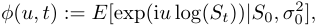

where i is the imaginary unit. 

### 3 The Little Trap 

Browsing through the literature the attentive reader will notice that there are two formulas for the Heston characteristic function around. The first one can be found e.g. in the original paper of

<!-- page: 4 -->

Heston [5] or in J¨ackel & Kahl [6] and looks like: 

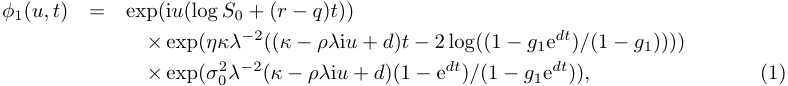

where: 

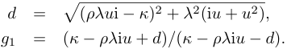

The second one is e.g. used in Schoutens-Simons-Tistaert [9] or in Gatheral [4] and is given by: 

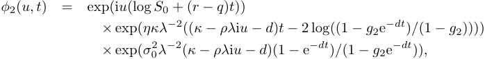

where d is as above and: 

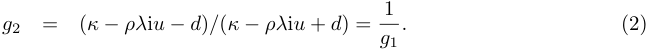

Looking closely you’ll notice that the minus and plus signs in front of the d are flipped around. At a first glance one might think that one of them is wrong (a typo), but in fact they are equivalent! To see this, just observe that: 

and: 

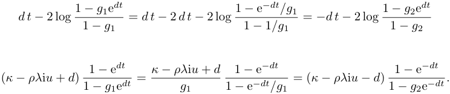

The origin of the two representations for the Heston characteristic function lies in the fact that the complex root d has two possible values and the second value is exactly minus the first value. The function z2 maps each complex number z to a well-defined number z2 . Its inverse function however,~~√~~ <u>z</u> maps e.g. the value −9 to 3i and −3i. While a unique principal value can be chosen for such functions (in this case, the principal square root 3i), the choices cannot be made continuous over the whole complex plane. Instead, lines of discontinuity occur. A branch cut is a curve in the complex plane across which a function is discontinuous. Its ends can be possibly open, closed, or half-open. The principal square root of a number is returned by most software packages. Not only the square root function has branch cuts, but many more other functions, like the logarithmic function. It is precisely the branch cut of this logarithmic function which is the axis of evil in this story.

<!-- page: 5 -->

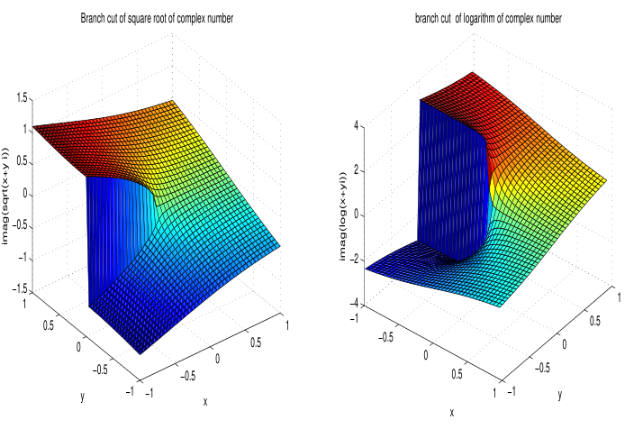

<!-- Start of picture text -->
Branch cut of square root of complex number branch cut  of logarithm of complex number 1.5 1 4 0.5 2 0 0 −0.5 −1 −2 −1.5 1 1 −4 0.5 1 −1 0.5 0 0.5 −0.5 0 0 0 −0.5 −0.5 0.5 −0.5 y −1 −1 x 1 −1 y x imag(sqrt(x+y i)) imag(log(x+yi)) <!-- End of picture text -->

Figure 1: Branch cut: square root function (left) and logarithmic function (right) 

Figure 1 represents Im (~~√~~ x + yi) (left) and Im (log(x + yi)) (right). The imaginary part of the complex square root function has, just like the imaginary part of the logarithmic function, a branch cut along the negative real axis. 

Note that because of this discontinuous nature of the square root function in the complex plane, the law~~√~~ <u>z1z2</u> =√ <u>z1</u>~~√~~ <u>z2</u> for complex numbers z1 and z2 is in general not true. Wrongly assuming this law underlies several faulty ”proofs”, for instance the following one showing that −1 = 1: 

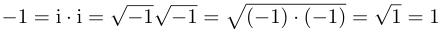

Projecting this intermezzo back to the Heston situation, we want to highlight the relevance of the distinction between φ1 and φ2. It has been reported recently by Kahl & J¨ackel [6] that numerical problems occur when doing vanilla pricing using Fourier techniques with characteristic function φ1(u, t) (and this is the form usually employed in practice), whereas our practical experience showed us that using φ2(u, t) always seemed to lead to a stable procedure. This observation is based on the fact that the main value of the complex square root is taken (slicing the complex plane at the negative real axis, this means halving the argument of d). Unfortunately, by using that main value φ1(u, t) crosses the negative real axis when increasing u and hence leads to a discontinuous function causing all the numerical trouble, including potential mispricings. One could choose the second root of d in equation (11) of [6] for the particular solution of the Riccati equation, eventually leading to φ2 instead of φ1. A posteriori one can of course argue directly that choosing the second root of d in φ1 gives φ2.

<!-- page: 6 -->

The resulting mispricings under φ1(u, t) are not that obvious to notice. If one prices and back tests on short or middle term maturities only, one might not detect the problem and would be tempted to blindly use the technique at longer maturities. However - as we will prove later on - using the representation φ2 together with the main value of the square root leads to a stable procedure, as these discontinuities do not occur. Intuitively, changing the sign of both the real and imaginary part of d does the job and the representation φ2 takes care that the overall value of φ is not modified by this operation. Note that choosing the second instead of the main root of the complex value d in φ1 is equivalent to choosing the main value of the root d in φ2. In particular, in this way one can circumvent counting the number of crossings of the half-axis as proposed by J¨ackel & Kahl [6]. 

In Section 4, we will illustrate by real world examples the numerical problems and corresponding “mispricings” when applying φ1 together with the main value of d in the Carr-Madan formula for option pricing. We will show that for nearly any choice of parameters in the Heston model, these instabilities occur for large enough maturity. Under an additional restriction on the parameter space, we calculate the “threshold” maturity on from which numerical problems occur and underpin the result by a numerical illustration. 

In Section 5, we prove that - under the full dimensional and unrestricted parameter space - these problems do not occur at all when using φ2. 

Finally, we would like to note that in independent parallel research, Lord and Kahl [7] recently used a different technique to prove the stability of φ2 under certain parameter restrictions. 

### 4 Threshold maturity for φ1(u, t) 

We start with a given market situation and take as first example market prices of 41 European vanilla calls on the Eurostoxx 50 on the 5th of April 2005. We deliberately only took the short maturities into account. The prices are given by the o-signs in Figure 2 and correspond to maturities of T = 0.200, 0.449, 0.699, 1.696 years. We price vanillas using the Carr-Madan FFT pricing technique [3]. 

The basic formula for the price C(K, T ) of a European call option with strike K and time to maturity T is given by: 

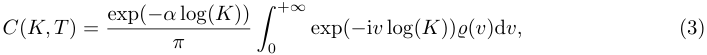

where: 

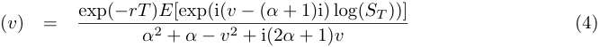

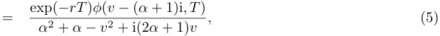

where α is a positive constant such that the (1 + α)th moment of the stock price exists and φ is the characteristic function of the log stock price (at time T ). Using Fast Fourier Transforms, one can compute within a second the complete option surface on an ordinary computer.

<!-- page: 7 -->

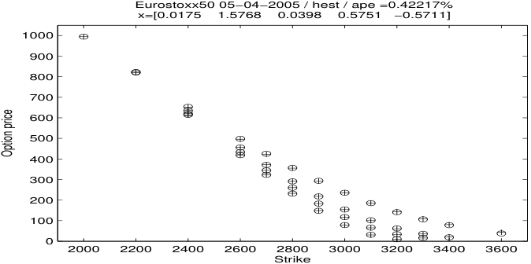

<!-- Start of picture text -->
Eurostoxx50 05−04−2005 / hest / ape =0.42217% x=[0.0175    1.5768    0.0398    0.5751   −0.5711] 1000 900 800 700 600 500 400 300 200 100 0 2000 2200 2400 2600 2800 3000 3200 3400 3600 Strike Option price <!-- End of picture text -->

Figure 2: Heston calibration 

Alternatively, one could also use the generic formula on the basis quote in the original Heston paper: 

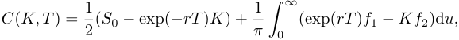

where f1 and f2 are: 

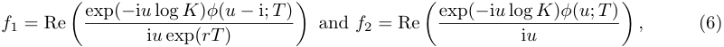

and φ(u; T ) is the characteristic function of the logarithm of the stock price process at time T . 

Calibrating, by minimizing the difference between market and model implied vol in a least squared sense gives for both φ1 and φ2 the following set of optimal parameters: v0 = 0.0175, κ = 1.5768, η = 0.0398, λ = 0.5751 and ρ = −0.5711. We remark that the Feller condition is not satisfied in this example. 

Suppose we now price ATM call options with maturities ranging from 1 to 15 years (with steps of 1 year). This leads to a serious price difference as can be seen from Figure 3, where the corresponding call prices are given. Also in Figure 3 the implied volatilities for all these ATM options are graphed for φ1(u, t) (red curve) and φ2(u, t) (blue curve). 

The ATM prices (as percentages of the spot) for maturities up to 15 years are given in Table 1 (r = 2.5% and q = 0). 

T 1 2 3 4 5 6 7 8 9 10 11 12 13 14 15 H1 7.27 11.73 15.48 18.77 21.70 23.90 25.76 27.49 28.83 29.83 30.68 31.36 31.57 31.85 32.57 H2 7.27 11.73 15.48 18.77 21.75 24.50 27.05 29.44 31.70 33.84 35.88 37.82 39.68 41.46 43.17 MC 7.30 11.79 15.54 18.84 21.83 24.58 27.13 29.52 31.79 33.93 35.98 37.91 39.77 41.56 43.28 

Table 1: ATM prices 

Which one to trust? In order to get a first rough idea, we calculated the Monte-Carlo estimate of the ATM prices using a million simulation paths based on a Milstein scheme with an absorbing

<!-- page: 8 -->

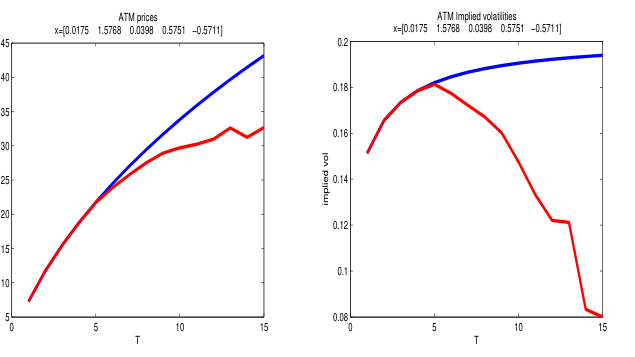

<!-- Start of picture text -->
ATM prices ATM Implied volatilities x=[0.0175    1.5768    0.0398    0.5751   −0.5711] x=[0.0175    1.5768    0.0398    0.5751   −0.5711] 45 0.2 40 0.18 35 0.16 30 25 0.14 20 0.12 15 0.1 10 5 0.08 0 5 10 15 0 5 10 15 T T implied vol <!-- End of picture text -->

Figure 3: Heston ATM prices and implied volatilities 1 ≤ T ≤ 15. 

variance barrier. As the Feller condition in this example is not satisfied, one should apply the exact procedure by Broadie and Kaya ([1]) to improve the accuracy. Pricing with φ2(u, t) gives almost no error; in Figure 4 the error for φ1(u, t) is visualised. 

As already mentioned above, the numerical problem when using φ1(u; T ) arises from the discontinuity of (v) in (4) or correspondingly from f1 and f2 in (6). Following the same approach as [6], Figure 5 depicts f1 and f2, where the red curve corresponds to φ1(u; T ) and the blue one φ2(u; T ). This discontinuity is caused by the discontinuity of φ1(u; T ) as a function of u. From (1) one detects easily that the problem occurs in the function: 

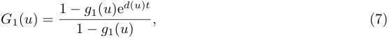

which repeatedly crosses the negative real axis as opposed to the function: 

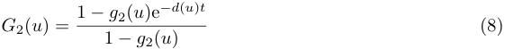

occurring in φ2(u; t). In the characteristic functions, the logarithm is taken and recall that the imaginary part of the logarithmic function of a complex number has the negative real axis as a branch cut. To illustrate the problem of crossing this branch cut, consider the trajectory in the complex plane of: 

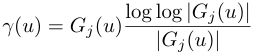

It has the structural shape of a spiral in case of j = 1, but has no cycle for φ2(u; T ), see Figure 6. 

The cause of the numerical problems stems from the fact that ed(u)t is a spiral with exponentially growing radius, if Im (d(u)) = 0. This implies that for t sufficiently large the dominant term in

<!-- page: 9 -->

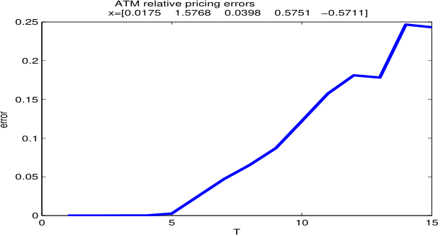

<!-- Start of picture text -->
ATM relative pricing errors x=[0.0175    1.5768    0.0398    0.5751   −0.5711] 0.25 0.2 0.15 0.1 0.05 0 0 5 10 15 T error <!-- End of picture text -->

Figure 4: Heston ATM pricing error 1 ≤ T ≤ 15. 

G1(u) is: 

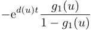

and since only ed(u)t depends on t one sees that for all u > 0 with Im (d(u)) = 0 there exists a minimum value t such that: 

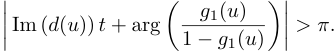

Hence all the above leads to: 

Proposition 1 Whenever the parameters of the Heston model are such that Im (d(u)) = 0 and 2κη = λ2 n (where n ∈ N), then using φ1(u; t) with the main value of the square root d(u) leads to numerical instabilities for some sufficiently large maturity t. 

#### Remark: 

The second condition in the above proposition is in particular violated if the Feller condition is exactly fulfilled (n = 1). The mathematical reason why there is no problem for both φ1 and φ2 in this case is that the power of the function G1 is then an integer so that we do not have a branching effect when crossing the negative halfline. 

In some cases the minimum value t for which numerical problems occur can be calculated analytically. In the following we give an example, the proof of which can be found in the appendix.

<!-- page: 10 -->

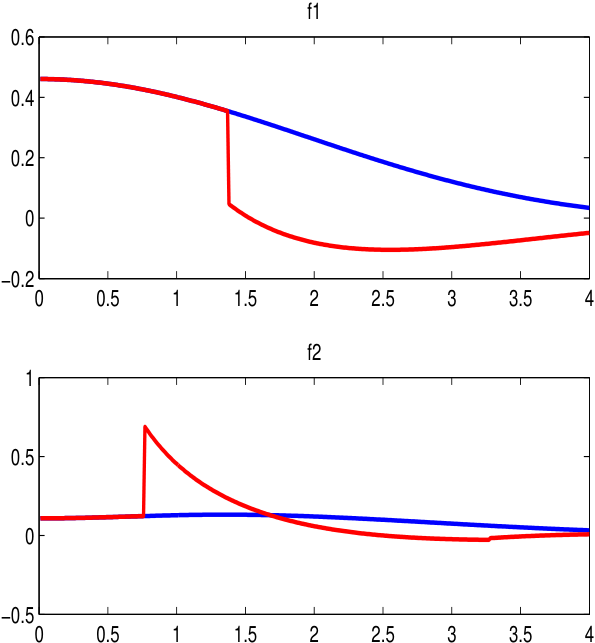

<!-- Start of picture text -->
f1 0.6 0.4 0.2 0 −0.2 0 0.5 1 1.5 2 2.5 3 3.5 4 f2 1 0.5 0 −0.5 0 0.5 1 1.5 2 2.5 3 3.5 4 <!-- End of picture text -->

Figure 5: f1 and f2 

Proposition 2 Let ρ < 0 and λ2 (2α + 1) + 2ρλ�κ − ρλ(α + 1)� < 0. Then using φ1(u; t) with the main value of the square root d(u) leads to numerical instabilities for all maturities larger than 

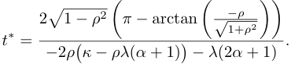

Note that the assumptions of Proposition 2 are fulfilled for the parameter setting of Figure 4 and indeed t∗ = 4.32, in accordance with the corresponding plot. 

The proposition above gives the threshold value on from which problems occur. The size of the resulting pricing error will of course depend on the specific parameter setting. Assume for instance a stock price at 100, strikes ranging from 50 to 150, r = 2.5% and q = 0. We first look for

<!-- page: 11 -->

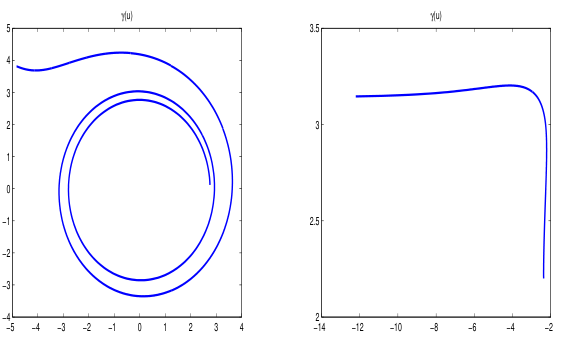

<!-- Start of picture text -->
γ(u) γ(u) 5 3.5 4 3 2 3 1 0 −1 2.5 −2 −3 −4 2 −5 −4 −3 −2 −1 0 1 2 3 4 −14 −12 −10 −8 −6 −4 −2 <!-- End of picture text -->

Figure 6: γ(u) for φ1(u; 10) (left) and φ2(u; 10) (right) 

a combination of ρ, λ and κ such that t∗ is relatively low. We then play around with η to obtain large differences between the call prices generated by φ1 and φ2. The values v0 = 0.04, κ = 1.5, η = 0.04, λ = 0.3 and ρ = −0.9 provide us with such a parameter set (the Feller condition is satisfied in this case and t∗ = 0.79 with α = 0.75). The ATM prices (as percentages of the spot) for maturities up to 15 years are given in Table 2 and are graphed in Figure 7 together with the corresponding error. 

|T H1|1 8.8950|2 12.94|3 16.37|4 19.47|5 22.17|6 24.24|7 25.93|8 27.18|9 28.01|10 28.42|11 28.92|12 28.79|13 28.93|14  27.91|15 27.54|
|---|---|---|---|---|---|---|---|---|---|---|---|---|---|---|---|
|H2|8.8948|13.20|16.79|19.96|22.84|25.50|27.99|30.32|32.52|34.61|36.60|38.51|40.33|42.08|43.75|
|MC|8.8929|13.20|16.79|19.96|22.84|25.50|27.98|30.32|32.52|34.62|36.61|38.51|40.33|42.08|43.75|

Table 2: ATM prices 

To get an idea of the price differences over maturities and strikes, we plotted the deviations of call prices between φ1(u, t) and φ2(u, t) in Figure 8. Notice that although individual price differences can be enormous, the average deviation across maturities and strikes is relatively low. This explains why one might encounter real-life examples where the parameters resulting from a calibration under φ1(u, t) or φ2(u, t) will not differ much. Moreover, the remark after Proposition 1 also indicates that under φ1 your optimizer might find a calibration solution which exactly satisfies the Feller condition. As a consequence of the remark after proposition 1, the performance differences between φ1 and φ2 will diminish as the parameters approach to satisfy 2κη = λ2 . Based only on numerical examples so far, we tend to believe more in the accuracy of φ2. The next section provides the proof. 

### 5 Stability of φ2(u, t) 

We continue by focusing on φ2 and prove its stability under the unrestricted and full dimensional parameter space. Recall that d(u) = �(κ − ρλui)2 + λ2 u2 + λ2 ui, where now the dependence on

<!-- page: 12 -->

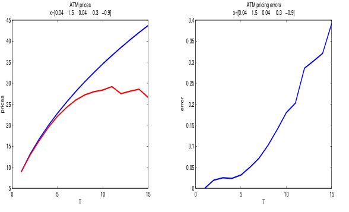

<!-- Start of picture text -->
ATM prices ATM pricing errors x=[0.04    1.5    0.04     0.3   −0.9] x=[0.04    1.5    0.04     0.3   −0.9] 45 0.4 40 0.35 35 0.3 30 0.25 25 0.2 20 0.15 15 0.1 10 0.05 5 0 0 5 10 15 0 5 10 15 T T prices error <!-- End of picture text -->

Figure 7: Heston ATM prices and error 

u is pronounced. Due to the slicing of the complex plane at the negative real axis, we always have Re (d(u)) > 0. In the Carr-Madan Fast Fourier approach for the calculation of option prices one has to evaluate φ(u − (α +1)i) for positive u. While this causes numerical problems when the main value of the square root is taken, we will prove here that these problems can be circumvented by using the second (and not the main) value of the complex square root d(u) (equivalently, using φ2 with the main value of the complex root, cf. Section 3). 

For ease of notation, denote: 

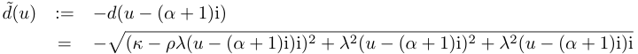

for u > 0. To avoid a discontinuity of d˜ (u) at u = 0, choose d˜ (0) := limu→0 d˜ (u). (Depending on the set of parameters the corresponding sign of the imaginary part is either that of +d(−(α + 1)i) or of −d(−(α + 1)i)). 

Theorem 3 As u increases from 0 to ∞, G2(u − (α + 1)i) does not cross the negative real axis. 

Proof. 

In the sequel we will write arg(z) for the argument, Im (z) for the imaginary part and Re (z) for the real part of a complex number z. First note that for u > 0: 

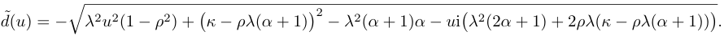

For simplicity of notation, define: 

� G2(u) := 2 G2(u − (α + 1)i)

<!-- page: 13 -->

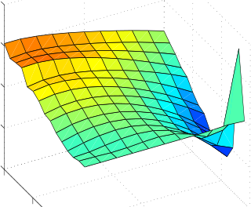

<!-- Start of picture text -->
SCENee eeq enn | SN <!-- End of picture text -->

( <u>C) ))</u> ~~(——~~ ) <u>(_) ))</u> 

)

<!-- page: 14 -->

<!-- Start of picture text -->
— (——) - (———) | (—) v———— ee ee oe ee <!-- End of picture text -->

<!-- page: 15 -->

# ~~oo~~ 

( 

( ( 

) ) ( 

) ) ( ( ( 

) ) ) ) 

) 

) ) ~~(———_)~~ 

_ <u>( )</u> 

<u>( ) )</u> ) <u>( ) ( ) ( ))</u> _ ) ~ ~~)—~~ Ss» ~~—— (—) 0 (-—-~~

<!-- page: 16 -->

<!-- Start of picture text -->
(—) (—) (—) - ( —) () : : -  — ( )—— <!-- End of picture text -->

<!-- Start of picture text -->
7 <!-- End of picture text -->

( ~~{—____—~~ 

)

<!-- page: 17 -->

<!-- Start of picture text -->
(_) ( ) ( )) ) ) ( ——— _ ?) ) ) ) ) ) A ) ( <!-- End of picture text -->

<!-- page: 18 -->

Note that B˜ − ρλC˜ < 0: 

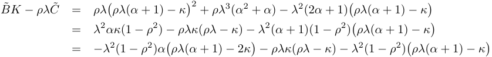

and since B˜ > 0, ρλ − 2κ > 0. Thus of course (15) is non-positive. Hence to prove that (14) is non-positive it suffices to show that: 

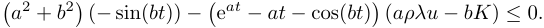

The above is certainly true for bt ≤ π and as a ≥ b we can assume at > π in the following. This implies that eat − at − cos(bt) > 2at and: 

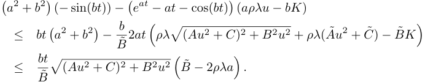

Observe that a2 > C˜ and hence: 

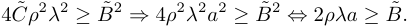

Using the fact that ρλ�ρλ(α + 1) − κ� >λ2(2 2α+1) we finally find: 

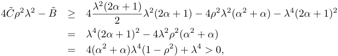

which completes the proof. 

### 6 Conclusion 

In this paper we investigated in detail the properties of and relations between both specifications of the Heston characteristic function. Regarding their properties we provided full blown proofs that φ1 is unstable under certain conditions and φ2 is stable under the full parameter space. Moreover, we established a threshold maturity from which φ1 suffers from instability. When the Feller condition is exactly satisfied, we encounter no problems in any of both versions. The upshot of all this above leaves no doubt on the usage of φ2 from a computational point of view, at least for the Heston model in its basic form.

<!-- page: 19 -->

<!-- Start of picture text -->
© (=) ( ) <!-- End of picture text -->

<!-- Start of picture text -->
 (( ) ot (——) <!-- End of picture text -->

<!-- page: 20 -->

<!-- Start of picture text -->
fp r—esa _ | ——) (- ——) (—) oe a (—) ) -  (-) ; 4 ©) <!-- End of picture text -->

<!-- page: 21 -->

### References 

- [1] Broadie, M. and Kaya, O. (2004): Exact simulation of stochastic volatility and other affine jump diffusion processes, Discussion Paper, Columbia University, Graduate School of Business. 

- [2] B¨uhler, H., (2006): Volatility markets. Consistent modeling, hedging and practical implementation, Ph.D. thesis, Technical University of Berlin, 163 pp. 

- [3] Carr, P. and Madan, D. (1998): Option valuation using the Fast Fourier Transform, Journal of Computational Finance 2, 61–73. 

- [4] Gatheral, J. (2005): The volatility surface: A practioner’s guide, Wiley Finance, New York, p. 20. 

- [5] Heston, S. (1993): A closed-form solution for options with stochastic volatility with applications to bond and currency options, Review of Financial Studies 6, 327-343. 

- [6] Kahl, C. and J¨ackel, P. (2005): Not-so-complex logarithms in the Heston model, Wilmott Magazine, September 2005, 94–103. 

- [7] Lord, R. and Kahl, C. (2006): Why the rotation count algorithm works, Working Paper, University of Wuppertal. 

- [8] Miller, K. S., Bernstein, R. I. and Blumenson L. E. (1958): Generalized Rayleigh processes, Quarterly of Applied Mathematics 16, 137-145. 

- [9] Schoutens, W., Simons E. and Tistaert, J. (2004): A perfect calibration ! Now what ?, Wilmott Magazine, March 2005, 66–78.
