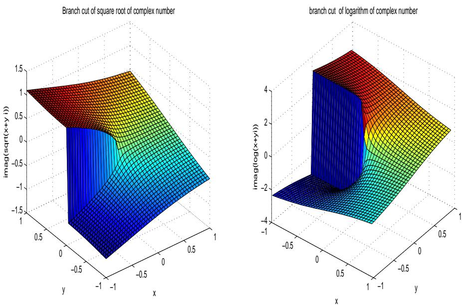
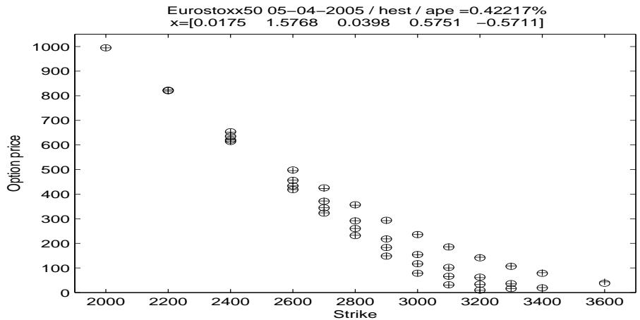
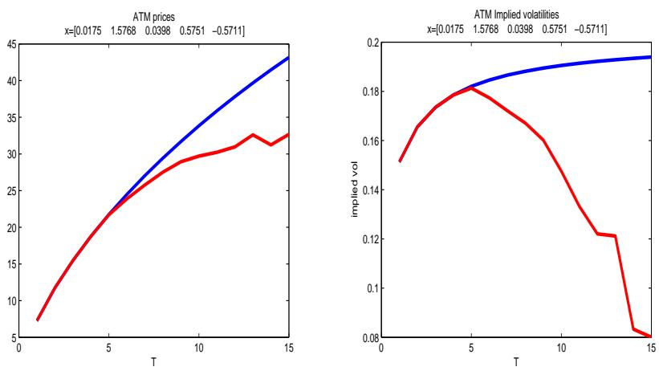
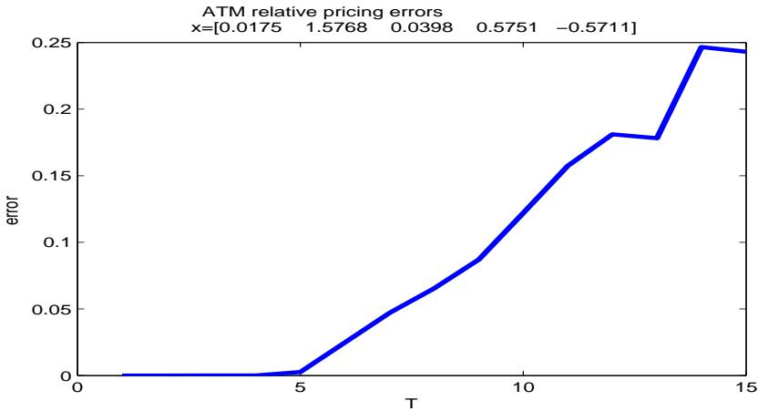
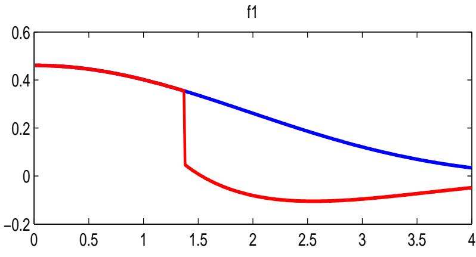
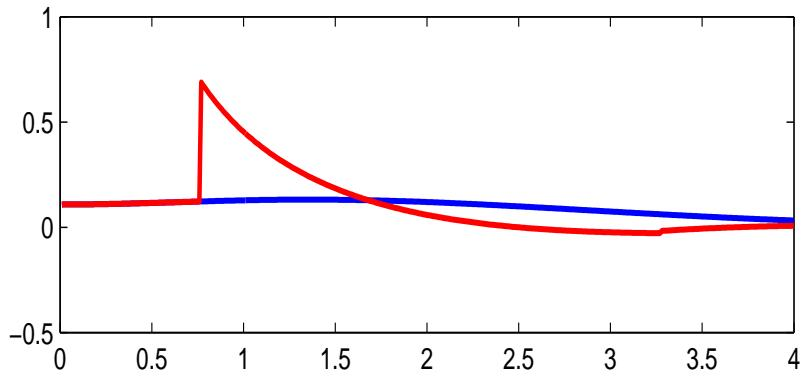
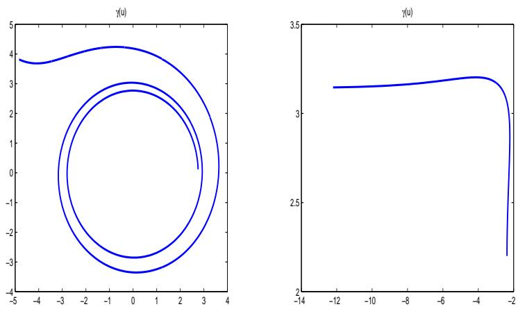
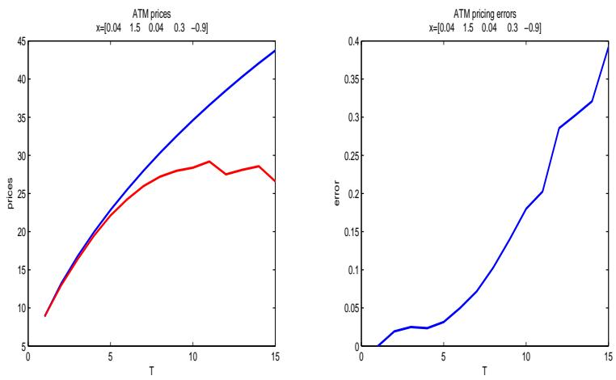
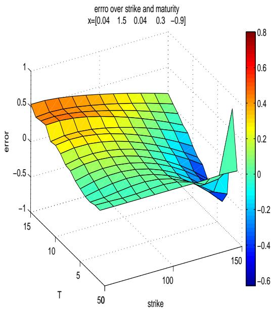

# 2007-albrecher-et-al-little-heston-trap

<!-- page: 1 -->

## The Little Heston Trap

Hansj¨org Albrecher∗ Philipp Mayer † Wim Schoutens ‡ Jurgen Tistaert§

First Version: 6 December 2005

This Version: 11 September 2006

∗Radon Institute, Austrian Academy of Sciences, Linz and Graz University of Technology, Austria,E-mail: albrecher@tugraz.at

†Graz University of Technology, Austria,E-mail: mayer@finanz.math.tugraz.at

‡K.U.Leuven, W. De Croylaan 54, B-3001 Leuven, Belgium. E-mail: wim@schoutens.be

§ING Financial Markets, Financial Modeling, Marnixlaan 24, B-1000 Brussels, Belgium. E-mail: Jurgen.Tistaert@ing.be

<!-- page: 2 -->

## Abstract

The role of characteristic functions in finance has been strongly amplified by the development of the general option pricing formula by Carr and Madan. As these functions are defined and operating in the complex plane, they potentially encompass a few well known numerical issues due to ”branching”. A number of elegant publications have emerged tackling these efects specifically for the Heston model. For the latter however we have two specifications for the characteristic function as they are the solutions to a Riccati equation. In this article we put the i’s and cross the t’s by formally pointing out the properties of and relations between both versions. For the first specification we show that for nearly any parameter choice, instabilities will occur for large enough maturities. We subsequently establish - under an additional parameter restriction - the existence of a “threshold” maturity from which the complex operations become a spoil-sport. For the second specification of the characteristic function it is proved that stability is guaranteed under the full dimensional and unrestricted parameter space. We blend the theoretical results with a few examples.

<!-- page: 3 -->

## 1 Introduction

Since its inception in 1993, the Heston stochastic volatility model [5] has received a growing attention amongst practitioners and academics. It relaxes the constant volatility assumption in the classical Black-Scholes model by incorporating an instantaneous short term variance process. As such, a decent (though not all) number of smile and skew patterns can be built into volatility surfaces by a relatively restricted number of parameters. Several (extended) Monte-Carlo schemes and finite-diference techniques are available to perform exotic option pricing. Many interesting extensions have been proposed recently, $\mathrm { e . g . }$ . by B¨uhler [2] within the context of consistent frameworks for variance modeling.

In its basic form we can rely on a closed formula for the characteristic function, on which the main part of this story is related to. The latter was originally proposed to be used twice in a numerical integration scheme. The Fast Fourier approach by Carr $\&$ Madan [3] literally speeded up and extended its practical use by its ability to facilitate the calibration of plain vanilla option prices.

## 2 Heston Model Revisited

Let us shortly formalise the model, mainly for subsequent notation purposes. The dynamics of the stock price process $S = \{ S _ { t } , t \ge 0 \}$ are very similar to the Black-Scholes setting.

$$
\frac { \mathrm { d } S _ { t } } { S _ { t } } = ( r - q ) \mathrm { d } t + \sqrt { v _ { t } } \mathrm { d } W _ { t } , \quad S _ { 0 } \geq 0 ;
$$

The instantaneous variance parameter is modeled as a mean-reverting square root stochastic process (also called CIR process), described by the following SDE:

$$
\mathrm { d } v _ { t } = \kappa ( \eta - v _ { t } ) \mathrm { d } t + \lambda \sqrt { v _ { t } } \mathrm { d } \tilde { W } _ { t } , \quad v _ { 0 } = \sigma _ { 0 } ^ { 2 } \geq 0 ,
$$

where $W = \{ W _ { t } , t \geq 0 \}$ and $\tilde { W } = \{ \tilde { W } _ { t } , t \geq 0 \}$ are two correlated standard Brownian motions such that Cov $[ \mathrm { d } W _ { t } \mathrm { d } \tilde { W } _ { t } ] = \rho \mathrm { d } t$ The involved parameters are: initial volatility, $\sigma _ { 0 } > 0$ , the mean reversion rate $\kappa > 0 .$ , the long run variance $\eta > 0$ , the volatility of the variance $\lambda > 0$ and the correlation $- 1 < \rho < 1$ . The variance process is always positive and cannot reach zero if $2 \kappa \eta > \lambda ^ { 2 }$ The latter is often referred to as the Feller condition. In absence of the stochastic factor, we have an exponential attraction to long run variance, the equilibrium point being $v _ { t } = \eta$ . Typically, the correlation $\rho$ is negative, pointing to the fact that a down-move in the stock price is correlated with an up-move in the volatility. It is worthwhile mentioning that the variance process $v _ { t }$ is Noncentrally Chi-Square distributed and the volatility process $\sqrt { v _ { t } }$ is Rayleigh distributed ([8]). For the log-stock price distribution, we return to the characteristic function

$$
\phi ( u , t ) : = E [ \exp ( \mathrm { i } u \log ( S _ { t } ) ) | S _ { 0 } , \sigma _ { 0 } ^ { 2 } ] ,
$$

where i is the imaginary unit.

## 3 The Little Trap

Browsing through the literature the attentive reader will notice that there are two formulas for the Heston characteristic function around. The first one can be found $\mathrm { e . g . }$ in the original paper of

<!-- page: 4 -->

Heston [5] or in J¨ackel & Kahl [6] and looks like:

$$
\begin{array} { r c l } { \phi _ { 1 } ( u , t ) } & { = } & { \exp ( \mathrm { i } u ( \log S _ { 0 } + ( r - q ) t ) ) } \\ & & { \quad \times \exp ( \eta \kappa \lambda ^ { - 2 } ( ( \kappa - \rho \lambda \mathrm { i } u + d ) t - 2 \log ( ( 1 - g _ { 1 } \mathrm { e } ^ { d t } ) / ( 1 - g _ { 1 } ) ) ) ) } \\ & & { \quad \times \exp ( \sigma _ { 0 } ^ { 2 } \lambda ^ { - 2 } ( \kappa - \rho \lambda \mathrm { i } u + d ) ( 1 - \mathrm { e } ^ { d t } ) / ( 1 - g _ { 1 } \mathrm { e } ^ { d t } ) ) , } \end{array}\tag{1}
$$

where:

$$
\begin{array} { r c l } { { d } } & { { = } } & { { \sqrt { ( \rho \lambda u \mathrm { i } - \kappa ) ^ { 2 } + \lambda ^ { 2 } ( \mathrm { i } u + u ^ { 2 } ) } , } } \\ { { g _ { 1 } } } & { { = } } & { { ( \kappa - \rho \lambda \mathrm { i } u + d ) / ( \kappa - \rho \lambda \mathrm { i } u - d ) . } } \end{array}
$$

The second one is e.g. used in Schoutens-Simons-Tistaert [9] or in Gatheral [4] and is given by:

$$
\begin{array} { r c l } { \phi _ { 2 } ( u , t ) } & { = } & { \exp ( \mathrm { i } u ( \log S _ { 0 } + ( r - q ) t ) ) } \\ & & { \quad \times \exp ( \eta \kappa \lambda ^ { - 2 } ( ( \kappa - \rho \lambda \mathrm { i } u - d ) t - 2 \log ( ( 1 - g _ { 2 } \mathrm { e } ^ { - d t } ) / ( 1 - g _ { 2 } ) ) ) ) } \\ & & { \quad \times \exp ( \sigma _ { 0 } ^ { 2 } \lambda ^ { - 2 } ( \kappa - \rho \lambda \mathrm { i } u - d ) ( 1 - \mathrm { e } ^ { - d t } ) / ( 1 - g _ { 2 } \mathrm { e } ^ { - d t } ) ) , } \end{array}
$$

where d is as above and:

$$
\begin{array} { l l l } { g _ { 2 } } & { = } & { ( \kappa - \rho \lambda \mathrm { i } u - d ) / ( \kappa - \rho \lambda \mathrm { i } u + d ) = \displaystyle \frac { 1 } { g _ { 1 } } . } \end{array}\tag{2}
$$

Looking closely you’ll notice that the minus and plus signs in front of the d are flipped around. At a first glance one might think that one of them is wrong (a typo), but in fact they are equivalent! To see this, just observe that:

$$
d t - 2 \log { \frac { 1 - g _ { 1 } \mathrm { e } ^ { d t } } { 1 - g _ { 1 } } } = d t - 2 d t - 2 \log { \frac { 1 - \mathrm { e } ^ { - d t } / g _ { 1 } } { 1 - 1 / g _ { 1 } } } = - d t - 2 \log { \frac { 1 - g _ { 2 } \mathrm { e } ^ { d t } } { 1 - g _ { 2 } } }
$$

and:

$$
( \kappa - \rho \lambda \mathsf { i } u + d ) \frac { 1 - \mathrm { e } ^ { d t } } { 1 - g _ { 1 } \mathrm { e } ^ { d t } } = \frac { \kappa - \rho \lambda \mathsf { i } u + d } { g _ { 1 } } \frac { 1 - \mathrm { e } ^ { - d t } } { 1 - \mathrm { e } ^ { - d t } / g _ { 1 } } = \left( \kappa - \rho \lambda \mathsf { i } u - d \right) \frac { 1 - \mathrm { e } ^ { - d t } } { 1 - g _ { 2 } \mathrm { e } ^ { - d t } } .
$$

The origin of the two representations for the Heston characteristic function lies in the fact that the complex root d has two possible values and the second value is exactly minus the first value. The function $z ^ { 2 }$ maps each complex number z to a well-defined number $z ^ { 2 } .$ . Its inverse function however, $\sqrt { z }$ maps e.g. the value 9 to 3i and 3i. While a unique principal value can be chosen for such functions (in this case, the principal square root 3i), the choices cannot be made continuous over the whole complex plane. Instead, lines of discontinuity occur. A branch cut is a curve in the complex plane across which a function is discontinuous. Its ends can be possibly open, closed, or half-open. The principal square root of a number is returned by most software packages. Not only the square root function has branch cuts, but many more other functions, like the logarithmic function. It is precisely the branch cut of this logarithmic function which is the axis of evil in this story.

<!-- page: 5 -->

Figure 1 represents Im $( { \sqrt { x + y \mathrm { i } } } )$ (left) and Im $( \log ( x + y \mathrm { i } ) )$ ) (right). The imaginary part of the complex square root function has, just like the imaginary part of the logarithmic function, a branch cut along the negative real axis.

Note that because of this discontinuous nature of the square root function in the complex plane, the law ${ \sqrt { z _ { 1 } z _ { 2 } } } = { \sqrt { z _ { 1 } } } { \sqrt { z _ { 2 } } }$ for complex numbers $z _ { 1 }$ and $z _ { 2 }$ is in general not true. Wrongly assuming this law underlies several faulty ”proofs”, for instance the following one showing that $- 1 = 1$

$$
- 1 = \mathrm { i } \cdot \mathrm { i } = { \sqrt { - 1 } } { \sqrt { - 1 } } = { \sqrt { ( - 1 ) \cdot ( - 1 ) } } = { \sqrt { 1 } } = 1
$$

Projecting this intermezzo back to the Heston situation, we want to highlight the relevance of the distinction between $\phi _ { 1 }$ and $\phi _ { 2 }$ . It has been reported recently by Kahl & J¨ackel [6] that numerical problems occur when doing vanilla pricing using Fourier techniques with characteristic function $\phi _ { 1 } ( u , t )$ (and this is the form usually employed in practice), whereas our practical experience showed us that using $\phi _ { 2 } ( u , t )$ always seemed to lead to a stable procedure. This observation is based on the fact that the main value of the complex square root is taken (slicing the complex plane at the negative real axis, this means halving the argument of $d )$ . Unfortunately, by using that main value $\phi _ { 1 } ( u , t )$ crosses the negative real axis when increasing u and hence leads to a discontinuous function causing all the numerical trouble, including potential mispricings. One could choose the second root of $d$ in equation (11) of [6] for the particular solution of the Riccati equation, eventually leading to $\phi _ { 2 }$ instead of $\phi _ { 1 }$ . A posteriori one can of course argue directly that choosing the second root of $d$ in $\phi _ { 1 }$ gives $\phi _ { 2 }$

<!-- page: 6 -->

The resulting mispricings under $\phi _ { 1 } ( u , t )$ are not that obvious to notice. If one prices and back tests on short or middle term maturities only, one might not detect the problem and would be tempted to blindly use the technique at longer maturities. However - as we will prove later on - using the representation $\phi _ { 2 }$ together with the main value of the square root leads to a stable procedure, as these discontinuities do not occur. Intuitively, changing the sign of both the real and imaginary part of d does the job and the representation $\phi _ { 2 }$ takes care that the overall value of $\phi$ is not modified by this operation. Note that choosing the second instead of the main root of the complex value d in $\phi _ { 1 }$ is equivalent to choosing the main value of the root d in $\phi _ { 2 }$ . In particular, in this way one can circumvent counting the number of crossings of the half-axis as proposed by J¨ackel & Kahl [6].

In Section 4, we will illustrate by real world examples the numerical problems and corresponding “mispricings” when applying $\phi _ { 1 }$ together with the main value of d in the Carr-Madan formula for option pricing. We will show that for nearly any choice of parameters in the Heston model, these instabilities occur for large enough maturity. Under an additional restriction on the parameter space, we calculate the “threshold” maturity on from which numerical problems occur and underpin the result by a numerical illustration.

In Section $5 ,$ we prove that - under the full dimensional and unrestricted parameter space - these problems do not occur at all when using $\phi _ { 2 }$

Finally, we would like to note that in independent parallel research, Lord and Kahl [7] recently used a diferent technique to prove the stability of $\phi _ { 2 }$ under certain parameter restrictions.

## 4 Threshold maturity for $\phi _ { 1 } ( u , t )$

We start with a given market situation and take as first example market prices of 41 European vanilla calls on the Eurostoxx 50 on the 5th of April 2005. We deliberately only took the short maturities into account. The prices are given by the o-signs in Figure 2 and correspond to maturities of $T = 0 . 2 0 0 , 0 . 4 4 9 , 0 . 6 9 9$ , 1.696 years. We price vanillas using the Carr-Madan FFT pricing technique [3].

The basic formula for the price $C ( K , T )$ of a European call option with strike K and time to maturity $T$ is given by:

$$
C ( K , T ) = \frac { \exp ( - \alpha \log ( K ) ) } { \pi } \int _ { 0 } ^ { + \infty } \exp ( - \mathrm { i } v \log ( K ) ) \varrho ( v ) \mathrm { d } v ,\tag{3}
$$

where:

$$
\begin{array} { r c l } { \varrho ( v ) } & { = } & { \displaystyle \frac { \exp ( - r T ) E [ \exp ( \mathrm { i } ( v - ( \alpha + 1 ) \mathrm { i } ) \log ( S _ { T } ) ) ] } { \alpha ^ { 2 } + \alpha - v ^ { 2 } + \mathrm { i } ( 2 \alpha + 1 ) v } } \\ & { = } & { \displaystyle \frac { \exp ( - r T ) \phi ( v - ( \alpha + 1 ) \mathrm { i } , T ) } { \alpha ^ { 2 } + \alpha - v ^ { 2 } + \mathrm { i } ( 2 \alpha + 1 ) v } , } \end{array}\tag{4}
$$

(5)

where $\alpha$ is a positive constant such that the $( 1 + \alpha )$ th moment of the stock price exists and $\phi$ is the characteristic function of the log stock price (at time T). Using Fast Fourier Transforms, one can compute within a second the complete option surface on an ordinary computer.

<!-- page: 7 -->

Alternatively, one could also use the generic formula on the basis quote in the original Heston paper:

$$
C ( K , T ) = \frac 1 2 ( S _ { 0 } - \exp ( - r T ) K ) + \frac 1 \pi \int _ { 0 } ^ { \infty } ( \exp ( r T ) f _ { 1 } - K f _ { 2 } ) \mathrm { d } u ,
$$

where $f _ { 1 }$ and $f _ { 2 }$ are:

$$
f _ { 1 } = \mathrm { R e } \left( \frac { \exp ( - \mathrm { i } u \log K ) \phi ( u - \mathrm { i } ; T ) } { \mathrm { i } u \exp ( r T ) } \right) \mathrm { ~ a n d ~ } f _ { 2 } = \mathrm { R e } \left( \frac { \exp ( - \mathrm { i } u \log K ) \phi ( u ; T ) } { \mathrm { i } u } \right) ,\tag{6}
$$

and $\phi ( u ; T )$ is the characteristic function of the logarithm of the stock price process at time $T .$ Calibrating, by minimizing the diference between market and model implied vol in a least squared sense gives for both $\phi _ { 1 }$ and $\phi _ { 2 }$ the following set of optimal parameters: $v _ { 0 } = 0 . 0 1 7 5$ κ = 1.5768, η = 0.0398, λ = 0.5751 and $\rho = - 0 . 5 7 1 1$ . We remark that the Feller condition is not satisfied in this example.

Suppose we now price ATM call options with maturities ranging from 1 to 15 years (with steps of 1 year). This leads to a serious price diference as can be seen from Figure 3, where the corresponding call prices are given. Also in Figure 3 the implied volatilities for all these ATM options are graphed for $\phi _ { 1 } ( u , t )$ (red curve) and $\phi _ { 2 } ( u , t )$ (blue curve).

The ATM prices (as percentages of the spot) for maturities up to 15 years are given in Table 1 $( r = 2 . 5 \%$ and $q = 0 )$ .

[Table source crop](assets/tables/2007-albrecher-et-al-little-heston-trap-p0007-block-0009-762d2699eb3ce322.jpg)
Table 1: ATM prices

Which one to trust? In order to get a first rough idea, we calculated the Monte-Carlo estimate of the ATM prices using a million simulation paths based on a Milstein scheme with an absorbing variance barrier. As the Feller condition in this example is not satisfied, one should apply the exact procedure by Broadie and Kaya ([1]) to improve the accuracy. Pricing with $\phi _ { 2 } ( u , t )$ gives almost no error; in Figure 4 the error for $\phi _ { 1 } ( u , t )$ is visualised.

<!-- page: 8 -->

As already mentioned above, the numerical problem when using $\phi _ { 1 } ( u ; T )$ arises from the discontinuity of $\varrho ( v )$ in (4) or correspondingly from $f _ { 1 }$ and $f _ { 2 }$ in (6). Following the same approach as [6], Figure 5 depicts $f _ { 1 }$ and $f _ { 2 }$ , where the red curve corresponds to $\phi _ { 1 } ( u ; T )$ and the blue one $\phi _ { 2 } ( u ; T )$ . This discontinuity is caused by the discontinuity of $\phi _ { 1 } ( u ; T )$ as a function of u. From (1) one detects easily that the problem occurs in the function:

$$
G _ { 1 } ( u ) = \frac { 1 - g _ { 1 } ( u ) \mathrm { e } ^ { d ( u ) t } } { 1 - g _ { 1 } ( u ) } ,\tag{7}
$$

which repeatedly crosses the negative real axis as opposed to the function:

$$
G _ { 2 } ( u ) = \frac { 1 - g _ { 2 } ( u ) \mathrm { e } ^ { - d ( u ) t } } { 1 - g _ { 2 } ( u ) }\tag{8}
$$

occurring in $\phi _ { 2 } ( u ; t )$ . In the characteristic functions, the logarithm is taken and recall that the imaginary part of the logarithmic function of a complex number has the negative real axis as a branch cut. To illustrate the problem of crossing this branch cut, consider the trajectory in the complex plane of:

$$
\gamma ( u ) = G _ { j } ( u ) \frac { \log \log | G _ { j } ( u ) | } { | G _ { j } ( u ) | }
$$

It has the structural shape of a spiral in case of $j = 1$ , but has no cycle for $\phi _ { 2 } ( u ; T )$ , see Figure 6.

The cause of the numerical problems stems from the fact that $e ^ { d ( u ) t }$ is a spiral with exponentially growing radius, if Im $( d ( u ) ) \ne 0$ . This implies that for t suficiently large the dominant term in

<!-- page: 9 -->

$G _ { 1 } ( u )$ is:

$$
- \mathrm { e } ^ { d ( u ) t } \frac { g _ { 1 } ( u ) } { 1 - g _ { 1 } ( u ) }
$$

and since only $e ^ { d ( u ) t }$ depends on t one sees that for all $u > 0$ with Im $( d ( u ) ) \ne 0$ there exists a minimum value t such that:

$$
\bigg | \operatorname { I m } \left( d ( u ) \right) t + \arg \left( \frac { g _ { 1 } ( u ) } { 1 - g _ { 1 } ( u ) } \right) \bigg | > \pi .
$$

Hence all the above leads to:

Proposition 1 Whenever the parameters of the Heston model are such that Im $( d ( u ) ) \ne 0$ and 2κη = $\lambda ^ { 2 } n$ (where $n \in \mathbb { N } )$ , then using $\phi _ { 1 } ( u ; t )$ with the main value of the square root $d ( u )$ leads to numerical instabilities for some suficiently large maturity t.

## Remark:

The second condition in the above proposition is in particular violated if the Feller condition is exactly fulfilled $( n = 1 )$ . The mathematical reason why there is no problem for both $\phi _ { 1 }$ and $\phi _ { 2 }$ in this case is that the power of the function $G _ { 1 }$ is then an integer so that we do not have a branching efect when crossing the negative halfline.

In some cases the minimum value t for which numerical problems occur can be calculated analytically. In the following we give an example, the proof of which can be found in the appendix.

<!-- page: 10 -->

Proposition 2 Let $\rho < 0$ and $\lambda ^ { 2 } ( 2 \alpha + 1 ) + 2 \rho \lambda \bigl ( \kappa - \rho \lambda ( \alpha + 1 ) \bigr ) < 0$ . Then using $\phi _ { 1 } ( u ; t )$ with the main value of the square root $d ( u )$ leads to numerical instabilities for all maturities larger than

$$
t ^ { * } = \frac { 2 \sqrt { 1 - \rho ^ { 2 } } \left( \pi - \arctan \left( \frac { - \rho } { \sqrt { 1 + \rho ^ { 2 } } } \right) \right) } { - 2 \rho ( \kappa - \rho \lambda ( \alpha + 1 ) ) - \lambda ( 2 \alpha + 1 ) } .
$$

Note that the assumptions of Proposition $2$ are fulfilled for the parameter setting of Figure 4 and indeed $t ^ { * } = 4 . 3 2$ , in accordance with the corresponding plot.

The proposition above gives the threshold value on from which problems occur. The size of the resulting pricing error will of course depend on the specific parameter setting. Assume for instance a stock price at 100, strikes ranging from 50 to 150, $r = 2 . 5 \%$ and $q = 0$ . We first look for a combination of $\rho , \lambda$ and κ such that $t ^ { * }$ is relatively low. We then play around with η to obtain large diferences between the call prices generated by $\phi _ { 1 }$ and $\phi _ { 2 }$ . The values $v _ { 0 } = 0 . 0 4 , \kappa = 1 . 5 ,$ $\eta = 0 . 0 4 , \lambda = 0 . 3$ and $\rho = - 0 . 9$ provide us with such a parameter set (the Feller condition is satisfied in this case and $t ^ { * } = 0 . 7 9$ with $\alpha = 0 . 7 5 )$ . The ATM prices (as percentages of the spot) for maturities up to 15 years are given in Table 2 and are graphed in Figure 7 together with the corresponding error.

<!-- page: 11 -->

[Table source crop](assets/tables/2007-albrecher-et-al-little-heston-trap-p0011-block-0003-96f5c1314439336a.jpg)
Table 2: ATM prices

To get an idea of the price diferences over maturities and strikes, we plotted the deviations of call prices between $\phi _ { 1 } ( u , t )$ and $\phi _ { 2 } ( u , t )$ in Figure 8. Notice that although individual price diferences can be enormous, the average deviation across maturities and strikes is relatively low. This explains why one might encounter real-life examples where the parameters resulting from a calibration under $\phi _ { 1 } ( u , t )$ or $\phi _ { 2 } ( u , t )$ will not difer much. Moreover, the remark after Proposition 1 also indicates that under φ1 your optimizer might find a calibration solution which exactly satisfies the Feller condition. As a consequence of the remark after proposition 1, the performance diferences between $\phi _ { 1 }$ and $\phi _ { 2 }$ will diminish as the parameters approach to satisfy $2 \kappa \eta = \lambda ^ { 2 }$ Based only on numerical examples so far, we tend to believe more in the accuracy of $\phi _ { 2 }$ . The next section provides the proof.

## 5 Stability of $\phi _ { 2 } ( u , t )$

We continue by focusing on $\phi _ { 2 }$ and prove its stability under the unrestricted and full dimensional parameter space. Recall that $d ( u ) = \sqrt { ( \kappa - \rho \lambda u \mathrm { i } ) ^ { 2 } + \lambda ^ { 2 } u ^ { 2 } + \lambda ^ { 2 } u \mathrm { i } }$ , where now the dependence on u is pronounced. Due to the slicing of the complex plane at the negative real axis, we always have Re $( d ( u ) ) > 0$ . In the Carr-Madan Fast Fourier approach for the calculation of option prices one has to evaluate $\phi ( u - ( \alpha + 1 ) i )$ for positive u. While this causes numerical problems when the main value of the square root is taken, we will prove here that these problems can be circumvented by using the second (and not the main) value of the complex square root $d ( u )$ (equivalently, using φ with the main value of the complex root, cf. Section 3).

<!-- page: 12 -->

For ease of notation, denote:

$$
\begin{array} { l c l } { \tilde { d } ( u ) } & { : = } & { - d ( u - ( \alpha + 1 ) \mathrm { i } ) } \\ & { = } & { - \sqrt { ( \kappa - \rho \lambda ( u - ( \alpha + 1 ) \mathrm { i } ) \mathrm { i } ) ^ { 2 } + \lambda ^ { 2 } ( u - ( \alpha + 1 ) \mathrm { i } ) ^ { 2 } + \lambda ^ { 2 } ( u - ( \alpha + 1 ) \mathrm { i } ) \mathrm { i } } } \end{array}
$$

for $u > 0$ . To avoid a discontinuity of $\tilde { d } ( u )$ at $u = 0$ , choose $\tilde { d } ( 0 ) : = \mathrm { l i m } _ { u 0 } \tilde { d } ( u )$ . (Depending on the set of parameters the corresponding sign of the imaginary part is either that of $+ d ( - ( \alpha + 1 ) \mathrm { i } )$ or $\mathrm { o f } - d ( - ( \alpha + 1 ) \mathrm { i } ) )$ ).

Theorem 3 As u increases from 0 to $\infty , G _ { 2 } ( u - ( \alpha + 1 ) i )$ does not cross the negative real axis. Proof.

In the sequel we will write $\mathrm { a r g } ( z )$ for the argument, Im (z) for the imaginary part and Re $( z )$ for the real part of a complex number z.

First note that for $u > 0$

$$
\tilde { d } ( u ) = - \sqrt { \lambda ^ { 2 } u ^ { 2 } ( 1 - \rho ^ { 2 } ) + \left( \kappa - \rho \lambda ( \alpha + 1 ) \right) ^ { 2 } - \lambda ^ { 2 } ( \alpha + 1 ) \alpha - u \mathrm { i } \big ( \lambda ^ { 2 } ( 2 \alpha + 1 ) + 2 \rho \lambda ( \kappa - \rho \lambda ( \alpha + 1 ) ) \big ) } .
$$

For simplicity of notation, define:

$$
\widetilde { G _ { 2 } } ( u ) : = 2 G _ { 2 } ( u - ( \alpha + 1 ) \mathrm { i } )
$$

<!-- page: 13 -->

and observe that $\widetilde { G _ { 2 } } ( u )$ and $G _ { 2 } ( u - ( \alpha + 1 ) \mathrm { i } )$ cross the negative real axis for the same values of u. fIn order to show that $\widetilde { G _ { 2 } } ( u )$ does not cross the negative real axis we distinguish five cases with frespect to the signs of the three quantities $\kappa - \rho \lambda ( \alpha + 1 ) , \lambda ^ { 2 } ( 2 \alpha + 1 ) + 2 \rho \lambda \big ( \kappa - \rho \lambda ( \alpha + 1 ) \big )$ and $\rho .$ First we consider the cases with $\rho \le 0$ , which immediately implies $\kappa - \rho \lambda ( \stackrel { \cdot } { \alpha } + 1 ) \geq 0$

Case 1: $\Big ( \rho \le 0 \Big ) \wedge \Big ( \lambda ^ { 2 } ( 2 \alpha + 1 ) + 2 \rho \lambda \big ( \kappa - \rho \lambda ( \alpha + 1 ) \big ) \le 0 \Big )$

Here it is convenient to write $\widetilde { G _ { 2 } } ( u )$ as follows:

$$
\widetilde { G _ { 2 } } ( u ) = \left( \frac { \kappa - \rho \lambda ( \alpha + 1 ) - \rho \lambda u \mathrm { i } } { - \tilde { d } ( u ) } + 1 \right) - \left( \frac { \kappa - \rho \lambda ( \alpha + 1 ) - \rho \lambda u \mathrm { i } } { - \tilde { d } ( u ) } - 1 \right) \mathrm { e } ^ { \tilde { d } ( u ) t }\tag{9}
$$

As $\mathrm { R e } ( \tilde { d } ( u ) ) < 0$ and Im $( \tilde { d } ( u ) ) < 0$ , the real part of $\frac { \kappa - \rho \lambda ( \alpha + 1 ) - \rho \lambda u i } { - \tilde { d } ( u ) }$ is non-negative. Hence:

$$
\left| \frac { \kappa - \rho \lambda ( \alpha + 1 ) - \rho \lambda u \mathrm { i } } { - \tilde { d } ( u ) } + 1 \right| \geq \left| \frac { \kappa - \rho \lambda ( \alpha + 1 ) - \rho \lambda u \mathrm { i } } { - \tilde { d } ( u ) } - 1 \right| \mathrm { e } ^ { - a } .
$$

and since Re $\begin{array} { r } { \left( \frac { \kappa - \rho \lambda ( \alpha + 1 ) - \rho \lambda u \mathrm { i } } { - \tilde { d } ( u ) } + 1 \right) > 0 } \end{array}$ only the positive real axis can be crossed.

Case 2: $\Big ( \rho \le 0 \Big ) \wedge \Big ( \lambda ^ { 2 } ( 2 \alpha + 1 ) + 2 \rho \lambda \big ( \kappa - \rho \lambda ( \alpha + 1 ) \big ) > 0 \Big )$

<!-- page: 14 -->

In this case Re $( \tilde { d } ( u ) ) < 0$ and Im $( \tilde { d } ( u ) ) > 0$ holds. As the main value of a square root can be written as:

$$
{ \sqrt { \alpha + \mathrm { i } \beta } } = { \sqrt { \frac { \alpha + { \sqrt { \alpha ^ { 2 } + \beta ^ { 2 } } } } { 2 } } } + \mathrm { i } \ \mathrm { s g n } \beta { \sqrt { \frac { - \alpha + { \sqrt { \alpha ^ { 2 } + \beta ^ { 2 } } } } { 2 } } }
$$

we find:

$$
\tilde { d } ( u ) = - \left( \sqrt { \frac { \sqrt { ( A u ^ { 2 } - C ) ^ { 2 } + B ^ { 2 } u ^ { 2 } } - ( C - A u ^ { 2 } ) } { 2 } } - \sqrt { \frac { \sqrt { ( A u ^ { 2 } - C ) ^ { 2 } + B ^ { 2 } u ^ { 2 } } + ( C - A u ^ { 2 } ) } { 2 } } \mathrm { i } \right) ,
$$

where:

$$
\begin{array} { r c l } { { A } } & { { = } } & { { \lambda ^ { 2 } ( 1 - \rho ^ { 2 } ) > 0 } } \\ { { B } } & { { = } } & { { \lambda ^ { 2 } ( 2 \alpha + 1 ) + 2 \rho \lambda \big ( \kappa - \rho \lambda ( \alpha + 1 ) \big ) > 0 } } \\ { { C } } & { { = } } & { { \lambda ^ { 2 } ( \alpha + 1 ) \alpha - ( \kappa - \rho \lambda ( \alpha + 1 ) ) ^ { 2 } . } } \end{array}
$$

We want to show that:

$$
0 \leq \arg \left( \frac { \kappa - \rho \lambda ( \alpha + 1 ) - \rho \lambda u \mathrm { i } } { - \tilde { d } ( u ) } \right) \leq \frac { \pi } { 2 } .\tag{10}
$$

Recalling that the numerator lies in the first quadrant and the denominator lies in the fourth quadrant the left inequality is trivially fulfilled. Note that for $\rho = 0 \ ( 1 0 )$ clearly holds. For $\rho < 0$ consider the right inequality:

For $u = 0 \mathrm { : }$

$$
\arg \left( \frac { \kappa - \rho \lambda ( \alpha + 1 ) - \rho \lambda u \mathrm { i } } { - \tilde { d } ( u ) } \right) = \left\{ \begin{array} { l l } { \pi / 2 \quad \mathrm { f o r } \quad C > 0 } \\ { 0 \quad \mathrm { f o r } \quad C \le 0 . } \end{array} \right.
$$

Thus let $u > 0$ and observe that:

$$
\begin{array} { r l r } { \arg \left( \frac { 1 } { - \tilde { d } ( u ) } \right) } & { = } & { \arctan \left( \frac { \sqrt { \frac { \sqrt { ( A u ^ { 2 } - C ) ^ { 2 } + B ^ { 2 } u ^ { 2 } } + ( C - A u ^ { 2 } ) } { 2 } } } { \sqrt { \frac { \sqrt { ( A u ^ { 2 } - C ) ^ { 2 } + B ^ { 2 } u ^ { 2 } } - ( C - A u ^ { 2 } ) } { 2 } } } \right) } \\ & { = } & { \arctan \left( \frac { C - A u ^ { 2 } + \sqrt { B ^ { 2 } u ^ { 2 } + ( C - A u ^ { 2 } ) ^ { 2 } } } { B u } \right) . } \end{array}
$$

Hence in this case the right inequality in (10) is equivalent to:

$$
\arctan \left( \frac { C - A u ^ { 2 } + \sqrt { B ^ { 2 } u ^ { 2 } + \left( C - A u ^ { 2 } \right) ^ { 2 } } } { B u } \right) \quad \le \quad \frac { \pi } { 2 } - \arctan \left( \frac { - \rho \lambda u } { \kappa - \rho \lambda ( \alpha + 1 ) } \right) .\tag{11}
$$

Note that both sides lie between 0 and $\pi / 2$ . Hence applying tan( ) on both sides retains the inequality and from tan $\ c ( \pi / 2 - x ) = \cot ( x )$ for $0 \leq x \leq \pi / 2$ we obtain:

$$
\frac { C - A u ^ { 2 } + \sqrt { B ^ { 2 } u ^ { 2 } + \left( C - A u ^ { 2 } \right) ^ { 2 } } } { B u } \leq \frac { \kappa - \rho \lambda ( \alpha + 1 ) } { - \rho \lambda u } ,
$$

<!-- page: 15 -->

which is equivalent to:

$$
\begin{array} { r l r } { B ( \kappa - \rho \lambda ( \alpha + 1 ) ) + C \rho \lambda - A u ^ { 2 } \rho \lambda } & { \geq } & { - \rho \lambda \sqrt { B ^ { 2 } u ^ { 2 } + ( C - A u ^ { 2 } ) ^ { 2 } } . } \end{array}
$$

The right hand side is trivially positive, and:

$$
\begin{array} { r c l } { B ( \kappa - \rho \lambda ( \alpha + 1 ) ) + C \rho \lambda } & { = } & { \kappa B - \rho \lambda ( ( \alpha + 1 ) B - C ) } \\ & { \geq } & { - \rho \lambda \left( ( \alpha + 1 ) ^ { 2 } \lambda ^ { 2 } ( 1 - \rho ^ { 2 } ) + \kappa ^ { 2 } \right) > 0 , } \end{array}
$$

so the left hand side is positive too. Hence we can square the inequality:

$$
\begin{array} { r l r } { \Big ( B \big ( \kappa - \rho \lambda ( \alpha + 1 ) \big ) + \rho \lambda ( C - A u ^ { 2 } ) \Big ) ^ { 2 } } & { \geq } & { \rho ^ { 2 } \lambda ^ { 2 } \Big ( B ^ { 2 } u ^ { 2 } + ( C - A u ^ { 2 } ) ^ { 2 } \Big ) , } \end{array}
$$

which further gives:

$$
- \rho \lambda u ^ { 2 } B \Big ( 2 A \big ( \kappa - \rho \lambda ( \alpha + 1 ) \big ) + B \rho \lambda \Big ) + B \big ( \kappa - \rho \lambda ( \alpha + 1 ) \big ) \Big ( B \big ( \kappa - \rho \lambda ( \alpha + 1 ) \big ) + 2 \rho \lambda C \Big ) \ge 0 .
$$

The latter is true since:

$$
2 A { \big ( } \kappa - \rho \lambda ( \alpha + 1 ) { \big ) } + B \rho \lambda = \lambda ^ { 2 } ( 2 \kappa - \rho \lambda ) \geq 0
$$

and:

$$
B \big ( \kappa - \rho \lambda ( \alpha + 1 ) \big ) + 2 \rho \lambda C = \lambda ^ { 2 } \big ( \kappa ( 2 \alpha + 1 ) - \rho \lambda ( \alpha + 1 ) \big ) \geq 0 .
$$

Hence inequality (10) holds and therefore $\begin{array} { r } { \mathrm { R e } \left( \frac { \kappa - \rho \lambda ( \alpha + 1 ) - \rho \lambda u i } { - \tilde { d } ( u ) } \right) \geq 0 } \end{array}$ . Following the lines of Case $1 , \widetilde { G _ { 2 } } ( u )$ can again not cross the negative real axis.

$$
\mathbf { C a s e \ 3 } \colon \left( \rho > 0 \right) \wedge \left( \kappa - \rho \lambda ( \alpha + 1 ) \geq 0 \right)
$$

The condition $( \kappa - \rho \lambda ( \alpha + 1 ) ) \ge 0$ implies $\lambda ^ { 2 } ( 2 \alpha + 1 ) + 2 \rho \lambda \bigl ( \kappa - \rho \lambda ( \alpha + 1 ) \bigr ) \geq 0$ and hence the case can be proven along the lines of Case 1 noting that also here the real part of $\frac { \kappa - \rho \lambda ( \alpha + 1 ) - \rho \lambda u \mathrm { i } } { - \tilde { d } ( u ) }$ is non-negative, together with $\mathrm { R e } ( \tilde { d } ( u ) ) < 0$ and Im $( \tilde { d } ( u ) ) > 0$

$$
\left( \rho > 0 \right) \wedge \left( \left( \kappa - \rho \lambda ( \alpha + 1 ) \right) < 0 \right) \wedge \left( \lambda ^ { 2 } ( 2 \alpha + 1 ) + 2 \rho \lambda \big ( \kappa - \rho \lambda ( \alpha + 1 ) \big ) > 0 \right)
$$

$\lambda ^ { 2 } ( 2 \alpha + 1 ) + 2 \rho \lambda \bigl ( \kappa - \rho \lambda ( \alpha + 1 ) \bigr ) > 0$ implies $\tilde { d } ( u ) = - a + b \mathrm { i }$ with $a > 0 , b > 0 \forall u \in \mathbb { R }$ . We prove that $\widetilde { G _ { 2 } } ( u )$ cannot be in the second quadrant. Observe that:

$$
\widetilde { G _ { 2 } } ( u ) = \left( \kappa - \rho \lambda ( \alpha + 1 ) \right) \frac { 1 - \mathrm { e } ^ { \tilde { d } ( u ) t } } { - \tilde { d } ( u ) } - \rho \lambda u \frac { 1 - \mathrm { e } ^ { \tilde { d } ( u ) t } } { - \tilde { d } ( u ) } \mathrm { i } + 1 + \mathrm { e } ^ { \tilde { d } ( u ) t }\tag{12}
$$

and:

$$
\arg \left( \frac { 1 - \mathrm { e } ^ { \tilde { d } ( u ) t } } { - \tilde { d } ( u ) } \right) = \arctan \left( \frac { b } { a } \right) - \arctan \left( \frac { \sin b t } { \mathrm { e } ^ { a t } - \cos b t } \right)
$$

<!-- page: 16 -->

and hence trivially arg $\left( \frac { 1 - \mathrm { e } ^ { \tilde { d } ( u ) t } } { - \tilde { d } ( u ) } \right) \leq \pi$ . Since:

$$
{ \frac { b } { a } } - { \frac { \sin b t } { \mathrm { e } ^ { a t } - \cos b t } } \geq 0 ,
$$

it is clear that $\begin{array} { r } { 0 \leq \arg \left( \frac { 1 - \mathrm { e } ^ { \tilde { d } ( u ) t } } { - \tilde { d } ( u ) } \right) \leq \pi } \end{array}$ holds.

If arg $\begin{array} { r } { \left( \frac { 1 - \mathrm { e } ^ { \tilde { d } ( u ) t } } { - \tilde { d } ( u ) } \right) \geq \frac { \pi } { 2 } } \end{array}$ then:

$$
\mathrm { R e } \left( \big ( \kappa - \rho \lambda ( \alpha + 1 ) - \rho \lambda u \mathrm { i } \big ) \frac { 1 + \mathrm { e } ^ { \tilde { d } ( u ) t } } { - \tilde { d } ( u ) } \right) \geq 0
$$

and since Re $\left( 1 - \mathrm { e } ^ { \tilde { d } ( u ) } \right) \ge 0$ , the real part of $\widetilde { G _ { 2 } } ( u )$ is non-negative. Therefore $\widetilde { G _ { 2 } } ( u )$ can in particular not be in the second quadrant.

If on the other hand arg $\textstyle \left( { \frac { 1 - \mathrm { e } ^ { d t } } { - d } } \right) < { \frac { \pi } { 2 } }$ , then $ { - } \rho \lambda u \frac { 1 - \mathrm { e } ^ { \tilde { d } ( u ) t } } { - \tilde { d } ( u ) } \mathrm { i }$ is in the fourth quadrant and it sufices to show that $\begin{array} { r } { \left( \kappa - \rho \lambda ( \alpha + 1 ) \right) \frac { 1 - \mathrm { e } ^ { \tilde { d } ( u ) t } } { - \tilde { d } ( u ) } + 1 + \mathrm { e } ^ { \tilde { d } ( u ) t } } \end{array}$ cannot be in the second quadrant. Setting $\kappa - \rho \lambda ( \alpha + 1 ) : = - C < 0 :$

$$
\begin{array} { r c l } { - C \displaystyle \frac { 1 - \mathrm { e } ^ { \bar { d } ( u ) t } } { - \tilde { d } ( u ) } + 1 + \mathrm { e } ^ { \bar { d } ( u ) t } } & { = } & { - C \displaystyle \frac { 1 - \mathrm { e } ^ { - a t } \cos b t - \mathrm { i } \mathrm { e } ^ { - a t } \sin b t } { a - b \mathrm { i } } + 1 + \mathrm { e } ^ { - a t } \cos b t + \mathrm { i } \mathrm { e } ^ { - a t } \sin b t } \\ & { = } & { \displaystyle \frac { ( a ^ { 2 } + b ^ { 2 } ) ( \mathrm { e } ^ { a t } + \cos b t ) - C ( a \mathrm { e } ^ { a t } - a \cos b t + b \sin b t ) } { \mathrm { e } ^ { a t } ( a ^ { 2 } + b ^ { 2 } ) } } \\ & & { + \displaystyle \frac { ( a ^ { 2 } + b ^ { 2 } ) \sin b t - C ( b \mathrm { e } ^ { a t } - b \cos b t - a \sin b t ) } { \mathrm { e } ^ { a t } ( a ^ { 2 } + b ^ { 2 } ) } \mathrm { i } . } \end{array}\tag{3}
$$

Thus Im $( \widetilde { G _ { 2 } } ( u ) ) > 0$ implies:

$$
\displaystyle ( a ^ { 2 } + b ^ { 2 } ) \sin b t > C ( b \mathrm { e } ^ { a t } - b \cos b t - a \sin b t )
$$

and since the right hand side of this inequality is positive, sin bt has to be positive as well, implying:

$$
a ^ { 2 } + b ^ { 2 } > { \frac { C ( b \mathrm { e } ^ { a t } - b \cos b t - a \sin b t ) } { \sin b t } } .
$$

Therefore:

$$
\begin{array} { r c l } { \operatorname { s g n } ( \operatorname { R e } ( \widetilde { G } _ { 2 } ( u ) ) ) } & { = } & { \operatorname { s g n } \bigl ( ( a ^ { 2 } + b ^ { 2 } ) ( \mathrm { e } ^ { a t } + \cos b t ) - C ( a \mathrm { e } ^ { a t } - a \cos b t + b \sin b t ) \bigr ) } \\ & { \ge } & { \operatorname { s g n } \Bigl \{ \frac { C \left( b \mathrm { e } ^ { a t } - b \cos b t - a \sin b t \right) } { \sin b t } ( \mathrm { e } ^ { a t } + \cos b t ) - C ( a \mathrm { e } ^ { a t } - a \cos b t + b \sin b t ) \Bigr \} } \\ & { = } & { \operatorname { s g n } ( b \mathrm { e } ^ { 2 a t } - 2 a \mathrm { e } ^ { a t } \sin b t - b ) } \\ & { \ge } & { \operatorname { s g n } \big ( b \mathrm { e } ^ { 2 a t } - 2 \mathrm { e } ^ { a t } a t - 1 \big ) \big ) = 1 . } \end{array}
$$

Hence if Im $( \widetilde { G _ { 2 } } ( u ) ) > 0$ then also Re $( \widetilde { G _ { 2 } } ( u ) ) > 0$ implying $\widetilde { G _ { 2 } } ( u )$ cannot be in the second quadrant.

<!-- page: 17 -->

Case 5: $\left( \rho > 0 \right) \wedge \left( \kappa - \rho \lambda ( \alpha + 1 ) < 0 \right) \wedge \left( \lambda ^ { 2 } ( 2 \alpha + 1 ) + 2 \rho \lambda \big ( \kappa - \rho \lambda ( \alpha + 1 ) \big ) \leq 0 \right)$

Here $\tilde { d } ( u ) = - a - b \mathrm { i }$ , where $a \geq 0 , b \geq 0 \forall u \in \mathbb { R }$

Note that if $\lambda ^ { 2 } ( 2 \alpha + 1 ) + 2 \rho \lambda \bigl ( \kappa - \rho \lambda ( \alpha + 1 ) \bigr ) < 0$ then:

$$
\begin{array} { r } { \big ( \kappa - \rho \lambda ( \alpha + 1 ) \big ) ^ { 2 } - \lambda ^ { 2 } ( \alpha + 1 ) \alpha > 0 . } \end{array}
$$

Therefore $a > b$ holds. Observe that the imaginary part of $\widetilde { G _ { 2 } } ( u )$ is given by:

$$
\begin{array} { r l } & { \qquad \quad \mathrm { I m } \left( 1 + \mathrm { e } ^ { \tilde { d } } + \frac { \kappa - \rho \lambda ( \alpha + 1 ) - \rho \lambda u \mathrm { i } } { - \tilde { d } } ( 1 - \mathrm { e } ^ { \tilde { d } } ) \right) = } \\ & { \qquad \quad \quad - \sin ( b t ) \left( a ^ { 2 } + b ^ { 2 } + a K + \rho \lambda u b \right) - \left( a \rho \lambda u - K b \right) \left( \mathrm { e } ^ { a t } - \cos ( b t ) \right) } \\ & { \qquad \quad \quad \left( a ^ { 2 } + b ^ { 2 } \right) \mathrm { e } ^ { a t } } \end{array}
$$

where $K = \rho \lambda ( \alpha + 1 ) - \kappa > 0$ . We will prove that the expression above is non-positive. The denominator is positive and we can restrict the attention to the numerator:

$$
- \sin ( b t ) \left( a ^ { 2 } + b ^ { 2 } + a K + \rho \lambda u b \right) - \left( a \rho \lambda u - K b \right) \left( \mathrm { e } ^ { a t } - \cos ( b t ) \right) .\tag{14}
$$

First note that:

$$
\begin{array} { l l l } { ( a K + \rho \lambda b u ) ( - \sin ( b t ) ) - a t ( a \rho \lambda u - b K ) } & { \leq } & { b t ( a K + \rho \lambda b u ) - a t ( \rho \lambda a u - b K ) } \\ & { = } & { t \left( a b K + \rho \lambda b ^ { 2 } u - \rho \lambda a ^ { 2 } u + a b K \right) } \\ & { = } & { t \left( \rho \lambda ( b ^ { 2 } - a ^ { 2 } ) u + 2 a b K \right) . } \end{array}\tag{15}
$$

Similarly to Case 2 we use:

$$
\tilde { d } ( u ) = - \left( \sqrt { \frac { \sqrt { ( \tilde { A } u ^ { 2 } + \tilde { C } ) ^ { 2 } + \tilde { B } ^ { 2 } u ^ { 2 } } + ( \tilde { C } + \tilde { A } u ^ { 2 } ) } { 2 } } + \sqrt { \frac { \sqrt { ( \tilde { A } u ^ { 2 } + \tilde { C } ) ^ { 2 } + \tilde { B } ^ { 2 } u ^ { 2 } } - ( \tilde { C } + \tilde { A } u ^ { 2 } ) } { 2 } } \right) ,
$$

where:

$$
\begin{array} { r c l } { { \tilde { A } } } & { { = } } & { { \lambda ^ { 2 } ( 1 - \rho ^ { 2 } ) > 0 } } \\ { { \tilde { B } } } & { { = } } & { { 2 \rho \lambda \big ( \rho \lambda ( \alpha + 1 ) - \kappa \big ) - \lambda ^ { 2 } ( 2 \alpha + 1 ) > 0 } } \\ { { \tilde { C } } } & { { = } } & { { ( \rho \lambda ( \alpha + 1 ) - \kappa ) ^ { 2 } - \lambda ^ { 2 } ( \alpha + 1 ) \alpha > 0 . } } \end{array}
$$

With this parametrisation the right-hand side of (15) can be written as:

$$
t u \left( \tilde { B } K - \rho \lambda ( \tilde { A } u ^ { 2 } + \tilde { C } ) \right) .
$$

<!-- page: 18 -->

Note that $\tilde { B } - \rho \lambda \tilde { C } < 0 \colon$

$$
\begin{array} { l c l } { { \tilde { B } K - \rho \lambda \tilde { C } } } & { { = } } & { { \rho \lambda { \bigl ( } \rho \lambda ( \alpha + 1 ) - \kappa { \bigr ) } ^ { 2 } + \rho \lambda ^ { 3 } { \bigl ( } \alpha ^ { 2 } + \alpha { \bigr ) } - \lambda ^ { 2 } ( 2 \alpha + 1 ) { \bigl ( } \rho \lambda ( \alpha + 1 ) - \kappa { \bigr ) } } } \\ { { } } & { { = } } & { { \lambda ^ { 2 } \alpha \kappa ( 1 - \rho ^ { 2 } ) - \rho \lambda \kappa ( \rho \lambda - \kappa ) - \lambda ^ { 2 } ( \alpha + 1 ) ( 1 - \rho ^ { 2 } ) { \bigl ( } \rho \lambda ( \alpha + 1 ) - \kappa { \bigr ) } } } \\ { { } } & { { = } } & { { - \lambda ^ { 2 } ( 1 - \rho ^ { 2 } ) \alpha { \bigl ( } \rho \lambda ( \alpha + 1 ) - 2 \kappa { \bigr ) } - \rho \lambda \kappa ( \rho \lambda - \kappa ) - \lambda ^ { 2 } ( 1 - \rho ^ { 2 } ) { \bigl ( } \rho \lambda ( \alpha + 1 ) - \kappa { \bigr ) } } } \end{array}
$$

and since $\tilde { B } > 0 , \rho \lambda - 2 \kappa > 0$ . Thus of course (15) is non-positive.

Hence to prove that (14) is non-positive it sufices to show that:

$$
\left( a ^ { 2 } + b ^ { 2 } \right) ( - \sin ( b t ) ) - \left( \mathrm { e } ^ { a t } - a t - \cos ( b t ) \right) ( a \rho \lambda u - b K ) \le 0 .
$$

The above is certainly true for $b t \leq \pi$ and as $a \geq b$ we can assume at $> \pi$ in the following. This implies that $\mathrm { e } ^ { a t } - a t - \cos ( b t ) > 2 a t$ and:

$$
\begin{array} { r l r } {  { ( a ^ { 2 } + b ^ { 2 } ) ( - \sin ( b t ) ) - ( e ^ { a t } - a t - \cos ( b t ) ) ( a \rho \lambda u - b K ) } } \\ & { \leq } & { b t ( a ^ { 2 } + b ^ { 2 } ) - \frac { b } { \tilde { B } } 2 a t ( \rho \lambda \sqrt { ( A u ^ { 2 } + C ) ^ { 2 } + B ^ { 2 } u ^ { 2 } } + \rho \lambda ( \tilde { A } u ^ { 2 } + \tilde { C } ) - \tilde { B } K ) } \\ & { \leq } & { \frac { b t } { \tilde { B } } \sqrt { ( A u ^ { 2 } + C ) ^ { 2 } + B ^ { 2 } u ^ { 2 } } ( \tilde { B } - 2 \rho \lambda a ) . } \end{array}
$$

Observe that $a ^ { 2 } > { \tilde { C } }$ and hence:

$$
4 \tilde { C } \rho ^ { 2 } \lambda ^ { 2 } \geq \tilde { B } ^ { 2 } \Rightarrow 4 \rho ^ { 2 } \lambda ^ { 2 } a ^ { 2 } \geq \tilde { B } ^ { 2 } \Leftrightarrow 2 \rho \lambda a \geq \tilde { B } .
$$

Using the fact that $\begin{array} { r } { \rho \lambda \big ( \rho \lambda ( \alpha + 1 ) - \kappa \big ) > \frac { \lambda ^ { 2 } ( 2 \alpha + 1 ) } { 2 } } \end{array}$ we finally find:

$$
\begin{array} { r c l } { { 4 \tilde { C } \rho ^ { 2 } \lambda ^ { 2 } - \tilde { B } } } & { { \geq } } & { { 4 \displaystyle \frac { \lambda ^ { 2 } ( 2 \alpha + 1 ) } { 2 } \lambda ^ { 2 } ( 2 \alpha + 1 ) - 4 \rho ^ { 2 } \lambda ^ { 2 } ( \alpha ^ { 2 } + \alpha ) - \lambda ^ { 4 } ( 2 \alpha + 1 ) ^ { 2 } } } \\ { { } } & { { = } } & { { \lambda ^ { 4 } ( 2 \alpha + 1 ) ^ { 2 } - 4 \lambda ^ { 2 } \rho ^ { 2 } ( \alpha ^ { 2 } + \alpha ) } } \\ { { } } & { { = } } & { { 4 ( \alpha ^ { 2 } + \alpha ) \lambda ^ { 4 } ( 1 - \rho ^ { 2 } ) + \lambda ^ { 4 } > 0 , } } \end{array}
$$

which completes the proof.

## 6 Conclusion

In this paper we investigated in detail the properties of and relations between both specifications of the Heston characteristic function. Regarding their properties we provided full blown proofs that $\phi _ { 1 }$ is unstable under certain conditions and $\phi _ { 2 }$ is stable under the full parameter space. Moreover, we established a threshold maturity from which $\phi _ { 1 }$ sufers from instability. When the Feller condition is exactly satisfied, we encounter no problems in any of both versions. The upshot of all this above leaves no doubt on the usage of $\phi _ { 2 }$ from a computational point of view, at least for the Heston model in its basic form.

<!-- page: 19 -->

## Appendix A: Proof of Proposition 2:

Define:

$$
\widetilde { G } _ { 1 } ( u ) = 2 G _ { 1 } ( u - ( \alpha + 1 ) \mathrm { i } ) \quad \mathrm { a n d } \quad \widehat { d } ( u ) = d ( u - ( \alpha + 1 ) \mathrm { i } ) .
$$

Note that:

$$
\widetilde { G _ { 1 } } ( u ) = \left( 1 - \frac { \kappa - \rho \lambda ( \alpha + 1 ) - \rho \lambda u \mathrm { i } } { \widehat { d } ( u ) } \right) + \left( 1 + \frac { \kappa - \rho \lambda ( \alpha + 1 ) - \rho \lambda u \mathrm { i } } { \widehat { d } ( u ) } \right) { \mathrm { e } } ^ { d ( u ) t }
$$

and

$$
\begin{array} { r l r } { \widehat { d } ( u ) } & { = } & { \sqrt { \frac { \sqrt { ( \tilde { A } u ^ { 2 } + \tilde { C } ) ^ { 2 } + \tilde { B } ^ { 2 } u ^ { 2 } } + ( \tilde { C } + \tilde { A } u ^ { 2 } ) } { 2 } } + \sqrt { \frac { \sqrt { ( \tilde { A } u ^ { 2 } + C ) ^ { 2 } + \tilde { B } ^ { 2 } u ^ { 2 } } - ( \tilde { C } + \tilde { A } u ^ { 2 } ) } { 2 } } \mathrm { i } } \\ & { = } & { a ( u ) + b ( u ) \mathrm { i } , } \end{array}
$$

where

$$
\begin{array} { r c l } { { \tilde { A } } } & { { = } } & { { \lambda ^ { 2 } ( 1 - \rho ^ { 2 } ) > 0 } } \\ { { \tilde { B } } } & { { = } } & { { 2 \rho \lambda \big ( \rho \lambda ( \alpha + 1 ) - \kappa \big ) - \lambda ^ { 2 } ( 2 \alpha + 1 ) > 0 } } \\ { { \tilde { C } } } & { { = } } & { { ( \rho \lambda ( \alpha + 1 ) - \kappa ) ^ { 2 } - \lambda ^ { 2 } ( \alpha + 1 ) \alpha > 0 } } \end{array}
$$

and $a ( u ) > 0$ and $b ( u ) > 0$ (cf. Case 5 of Theorem 3).

The only possibility for $\widetilde { G _ { 1 } } ( u )$ to cross the negative real axis is that $\arg ( \widetilde { G _ { 1 } } ( u ) )$ crosses $\pi \ \mathrm { ( t h i s }$ follows directly from $b ( u ) \geq 0 )$ . Hence $\widetilde { G _ { 1 } } ( u )$ fcrosses the negative real axis exactly when

$$
\widetilde { f } ( u ) = - \mathrm { I m } \left( \frac { \kappa - \rho \lambda ( \alpha + 1 ) - \rho \lambda u \mathrm { i } } { \widehat { d } ( u ) } \right) + \left( 1 + \frac { \kappa - \rho \lambda ( \alpha + 1 ) - \rho \lambda u \mathrm { i } } { \widehat { d } ( u ) } \right) \mathrm { e } ^ { d ( u ) t }
$$

does, i.e. when $\arg ( \tilde { f } ( u ) ) \geq \pi$ . We will show that:

$$
\arg ( \widetilde f ( u ) ) \leq \operatorname* { l i m } _ { u  \infty } \arg ( \widetilde f ( u ) ) = t \frac { \tilde { B } } { 2 \sqrt { \tilde { A } } } + \arctan ( \frac { - \rho \lambda } { \sqrt { \tilde { A } } } )
$$

and hence attains its maximum for $u \to \infty$ . Denoting

$$
I _ { 1 } : = \mathrm { I m } \left( \frac { \kappa - \rho \lambda ( \alpha + 1 ) - \rho \lambda u \mathrm { i } } { \widehat { d } ( u ) } \right) \quad \mathrm { a n d } \quad R _ { 1 } : = \mathrm { R e } \left( \frac { \kappa - \rho \lambda ( \alpha + 1 ) - \rho \lambda u \mathrm { i } } { \widehat { d } ( u ) } \right) ,
$$

$\widetilde f ( u )$ can be written as:

$$
\arg ( \widetilde { f } ( u ) ) = b ( u ) t + \arctan \left( \frac { I _ { 1 } - \mathrm { e } ^ { - a ( u ) t } I _ { 1 } \cos b ( u ) t } { R _ { 1 } - \mathrm { e } ^ { - a ( u ) t } I _ { 1 } \sin b ( u ) t } \right) .\tag{16}
$$

<!-- page: 20 -->

$b ( u )$ is increasing in u, since diferentiating yields:

$$
\begin{array} { r c l } { \mathrm { s g n } ( b ^ { \prime } ( u ) ) } & { = } & { \mathrm { s g n } \left( 2 \tilde { A } \left( \tilde { A } u ^ { 2 } + \tilde { C } \right) + \tilde { B } ^ { 2 } - 2 \tilde { A } \sqrt { ( \tilde { A } u ^ { 2 } + \tilde { C } ) ^ { 2 } + \tilde { B } ^ { 2 } u ^ { 2 } } \right) } \\ & & { = } & { \mathrm { s g n } \left( 4 \tilde { A } \tilde { C } \tilde { B } ^ { 2 } + \tilde { B } ^ { 4 } \right) } \end{array}
$$

and $\tilde { C } \geq 0$ (cf. Case 5 of Theorem 3).

Thus to show that arg $( \widetilde f ( u ) )$ takes its maximum for $u \to \infty$ it sufices to prove that $\frac { I _ { 1 } - e ^ { - a ( u ) t } I _ { 1 } \cos b ( u ) t } { R _ { 1 } - e ^ { - a ( u ) t } I _ { 1 } \sin b ( u ) t }$ eattains its maximum for $u \to \infty$ . Plugging in the definitions of $I _ { 1 }$ and $R _ { 1 }$ yields:

$$
\begin{array} { r l } { \frac { I _ { 1 } - \frac { I _ { 1 } \cos ( u ) t } { \Theta \alpha ( w ) } } { R _ { 1 } - \frac { I _ { 1 } \sin ( w ) t } { \Theta \alpha ( w ) } } } & { = \phantom { - } \frac { ( - \rho ) \lambda u a ( u ) - ( \kappa - \rho \lambda ( \alpha + 1 ) ) ) \big ( 1 - \mathrm { e } ^ { - \alpha ( u ) t } \cos ( b ( u ) t ) \big ) } { a ( u ) ^ { 2 } + b ( u ) ^ { 2 } + \big ( \kappa - \rho \lambda ( \alpha + 1 ) \big ) a ( u ) \left( 1 + \frac { b ( u ) \sin ( b ( u ) t ) } { \Theta ^ { \alpha ( w ) } a ( w ) } \right) - \rho \lambda u a ( u ) \left( \frac { b ( u ) } { a ( u ) } - \frac { \sin ( b ( u ) t ) } { \mathrm { e } ^ { \alpha ( w ) t } } \right) } } \\ & { \le \phantom { - } \frac { - \rho \lambda u \Big ( 1 - \frac { \cos ( b ( u ) t ) } { \Theta ^ { \alpha ( w ) } } \Big ) } { a ( u ) + \frac { b ( w ) ^ { 2 } } { a ( w ) } } \le \frac { - \rho \lambda u } { a ( u ) } , } \end{array}
$$

where the last inequality holds due to

$$
\begin{array} { r l r } {  { \operatorname { s g n } ( \frac { - \rho \lambda u } { a ( u ) } - \frac { - \rho \lambda u ( 1 - \frac { \cos ( b ( u ) t ) } { \mathrm { e } ^ { a ( u ) t } } ) } { a + \frac { b ^ { 2 } } { a } } ) = } } \\ & { = } & { \operatorname { s g n } ( \frac { b ^ { 2 } } { a } + \frac { a \cos ( b ( u ) t ) } { \mathrm { e } ^ { a ( u ) t } } ) } \\ & { \geq } & { \operatorname { s g n } ( \frac { a ( u ) t } { \mathrm { e } ^ { a ( u ) t } } ) = 1 , } \end{array}
$$

and for the last inequality:

$$
\cos ( b ( u ) t ) \geq 1 - b ( u ) ^ { 2 } t ^ { 2 } / 2 \quad \mathrm { a n d } \quad \mathrm { e } ^ { a ( u ) t } \geq a ( u ) ^ { 2 } t ^ { 2 } / 2 .
$$

was used. Hence:

$$
\arg ( \widetilde { f } ( u ) ) \leq b ( u ) t + \arctan \left( \frac { - \rho \lambda u } { a ( u ) } \right)
$$

and because $\frac { - \rho \lambda u } { a ( u ) }$ is increasing in u, we finally conclude:

$$
\arg ( \widetilde f ( u ) ) \leq \operatorname* { l i m } _ { u \to \infty } \left( b ( u ) t + \arctan \left( \frac { - \rho \lambda u } { a ( u ) } \right) \right) = t \frac { \widetilde B } { 2 \sqrt { \widetilde A } } + \arctan \left( \frac { - \rho \lambda } { \sqrt { \widetilde A } } \right) = \operatorname* { l i m } _ { u \to \infty } \arg ( \widetilde f ( u ) ) .
$$

Thus the first maturity for which the original Heston formula causes numerical problems is given by:

$$
t = \frac { \pi - \arctan \left( \frac { - \rho \lambda } { \sqrt { \tilde { A } } } \right) } { \frac { \tilde { B } } { 2 \sqrt { \tilde { A } } } } = \frac { 2 \sqrt { 1 - \rho ^ { 2 } } \left( \pi - \arctan \left( \frac { - \rho } { \sqrt { 1 + \rho ^ { 2 } } } \right) \right) } { - 2 \rho ( \kappa - \rho \lambda ( \alpha + 1 ) ) - \lambda ( 2 \alpha + 1 ) } .
$$

<!-- page: 21 -->

## References

[1] Broadie, M. and Kaya, O. (2004): Exact simulation of stochastic volatility and other afine jump difusion processes, Discussion Paper, Columbia University, Graduate School of Business. [2] B¨uhler, H., (2006): Volatility markets. Consistent modeling, hedging and practical implementation, Ph.D. thesis, Technical University of Berlin, 163 pp. [3] Carr, P. and Madan, D. (1998): Option valuation using the Fast Fourier Transform, Journal of Computational Finance 2, 61–73. [4] Gatheral, J. (2005): The volatility surface: A practioner’s guide, Wiley Finance, New York, p. 20. [5] Heston, S. (1993): A closed-form solution for options with stochastic volatility with applications to bond and currency options, Review of Financial Studies 6, 327-343. [6] Kahl, C. and J¨ackel, P. (2005): Not-so-complex logarithms in the Heston model, Wilmott Magazine, September 2005, 94–103. [7] Lord, R. and Kahl, C. (2006): Why the rotation count algorithm works, Working Paper, University of Wuppertal. [8] Miller, K. S., Bernstein, R. I. and Blumenson L. E. (1958): Generalized Rayleigh processes, Quarterly of Applied Mathematics 16, 137-145. [9] Schoutens, W., Simons E. and Tistaert, J. (2004): A perfect calibration ! Now what ?, Wilmott Magazine, March 2005, 66–78.
