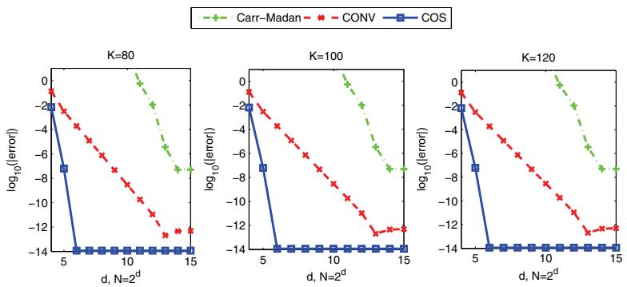
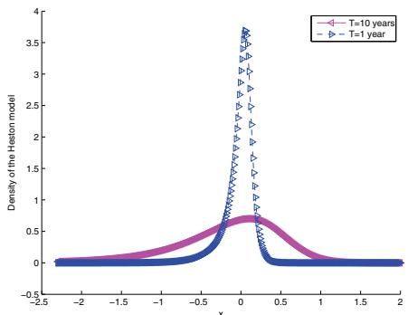
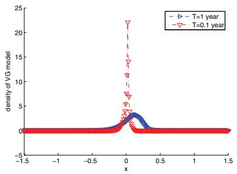
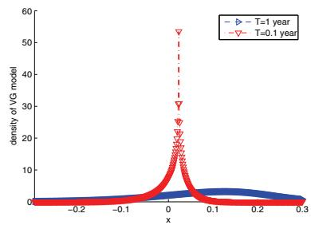
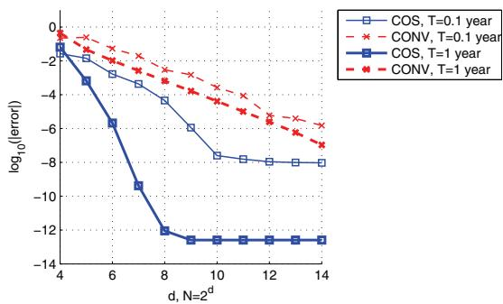
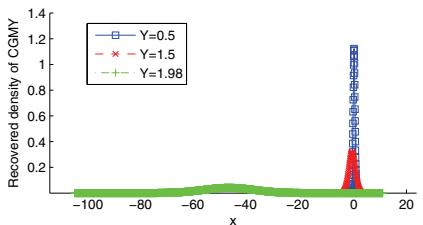
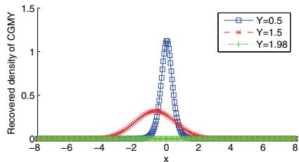

# 2008-fang-oosterlee-cos-method

<!-- page: 1 -->

## A NOVEL PRICING METHOD FOR EUROPEAN OPTIONS BASED ON FOURIER-COSINE SERIES EXPANSIONS∗

F. FANG† AND C. W. OOSTERLEE‡

Abstract. Here we develop an option pricing method for European options based on the Fouriercosine series and call it the COS method. The key insight is in the close relation of the characteristic function with the series coeficients of the Fourier-cosine expansion of the density function. In most cases, the convergence rate of the COS method is exponential and the computational complexity is linear. Its range of application covers underlying asset processes for which the characteristic function is known and various types of option contracts. We will present the method and its applications in two separate parts. The first one is this paper, where we deal with European options in particular. In a follow-up paper we will present its application to options with early-exercise features.

Key words. option pricing, European options, Fourier-cosine expansion

AMS subject classifications. 65T40, 42A10, 60E10, 62P05, 91B28

DOI. 10.1137/080718061

1. Introduction. In option pricing, it is the famous Feynman–Kac theorem that relates the conditional expectation of the value of a contract payof function under the risk-neutral measure to the solution of a partial diferential equation. In the research areas covered by this theorem, various numerical pricing techniques can be developed. In brief, existing numerical methods can be classified into three groups: partial-(integro) diferential equation (PIDE) methods, Monte Carlo simulation, and numerical integration methods. The distinction between the PIDE and the integration methods is, however, subtle: Given the option pricing PIDE, one can formally write down the solution as a Green’s function integral. Often the Fourier transform of the Green’s function is known; hence the problem reduces to evaluating the integral numerically. The Green’s function, modulo a discounting term, is the risk-neutral probability density in finance-speak.

Eficient numerical methods are required to rapidly price complex contracts and calibrate financial models. During calibration, i.e., when fitting model parameters of the stochastic asset processes to market data, we typically need to price European options at a single spot price, with many diferent strike prices, very quickly. Particular examples of where this is important would be processes with several parameters, like the Heston model [14] or the infinite activity L´evy processes (see, for example, [10]), since there the pricing problem (for many strikes) is used inside an optimization method.

The integration methods are used for calibration purposes whenever the characteristic function of the asset price process is known analytically. State-of-the-art numerical integration techniques have in common that they rely on a transformation to the Fourier domain [8, 20]. The Carr–Madan method [8] is one of the best known examples of this class. The probability density function appearing in the integration in the original pricing domain is not known for many relevant asset processes. However, its Fourier transform, the characteristic function, is often available, for example from the L´evy–Khinchine theorem for underlying L´evy processes or by other means, as for the Heston model. In the Fourier domain it is then possible to price various derivative contracts eficiently. By means of the fast Fourier transform (FFT), integration can be performed with a computational complexity of $O ( N \log _ { 2 } N )$ , where N represents the number of integration points. The computational speed, especially for plain vanilla options, makes these integration methods state of the art for calibration at financial institutions.

∗Received by the editors March 10, 2008; accepted for publication (in revised form) July 15, 2008; published electronically November 14, 2008.

http://www.siam.org/journals/sisc/31-2/71806.html

†Delft Institute of Applied Mathematics, Delft University of Technology, Delft, The Netherlands (f.fang@ewi.tudelft.nl).

‡CWI – Centrum Wiskunde & Informatica, Amsterdam, The Netherlands (c.w.oosterlee@cwi.nl).

<!-- page: 2 -->

An important aspect of research in computational finance is to further increase the performance of the pricing methods. Quadrature rule based techniques are not of the highest eficiency when solving Fourier transformed integrals. As the integrands are highly oscillatory, a relatively fine grid has to be used for satisfactory accuracy with the FFT.

In this paper we will focus on Fourier-cosine expansions in the context of numerical integration as an alternative for the methods based on the FFT. We will show that this novel method, called the COS method, can further improve the speed of pricing plain vanilla and some exotic options. Its application to American-style products will be covered in a follow-up paper. It is due to the impressive speed reported here for the COS method that we devote a paper to the European-style products.

Other highly eficient techniques for pricing plain vanilla options include the fast Gauss transform [6] and the double-exponential transformation [19, 25]. The COS method can, however, handle more general dynamics for the underlying compared to these methods. In fact, we can price a vector of strike prices simultaneously. Furthermore, the COS method ofers a highly eficient way to recover the density from the characteristic function, which is of importance for several financial applications, like calibration, the computation of forward starting options, or static hedging.

This paper is organized as follows. In section 2, we introduce the Fourier-cosine expansion for solving inverse Fourier integrals. Based on this, we derive, in section 3, the formulas for pricing European options and the Greeks. We focus on the L´evy and the Heston processes for the underlying. An error analysis is presented in section 4, and numerical results are given in section 5.

The results presented in this paper are the following:

• Options for many strikes can be priced highly eficiently in one computation with the COS method.

• The method does not rely on artificial damping parameters for convergence.

• A detailed comparison with other FFT methods is presented.

• The COS method can exhibit exponential convergence.

2. Fourier integrals and cosine series. The point of departure for pricing European options with numerical integration techniques is the risk-neutral valuation formula:

$$
v ( x , t _ { 0 } ) = e ^ { - r \Delta t } \mathbb { E } ^ { \mathbb { Q } } \left[ v ( y , T ) | x \right] = e ^ { - r \Delta t } \int _ { \mathbb { R } } v ( y , T ) f ( y | x ) d y ,\tag{1}
$$

where v denotes the option value, $\Delta t$ is the diference between the maturity, $T _ { \mathrm { : } }$ , and the initial date, $t _ { 0 } ,$ and $\mathbb { E } ^ { \mathbb { Q } } [ \cdot ]$ is the expectation operator under risk-neutral measure $\mathbb { Q } .$ . x and y are state variables at times $t _ { 0 }$ and $T _ { \cdot }$ , respectively; $f ( y | x )$ is the probability density of y given $x ,$ and $r$ is the risk-neutral interest rate.

<!-- page: 3 -->

In the Carr–Madan approach [8] and its variants, the Fourier transform of a version of valuation formula (1) is taken with respect to the log-strike price. Damping of the payof is then necessary as, for example, a call option is not $L ^ { 1 }$ -integrable with respect to the logarithm of the strike price. The method’s accuracy depends on the correct value of the damping parameter. A closed-form expression for the resulting integral is available in Fourier space. To return to the log-price domain, quadrature rules have to be applied to the inverse Fourier integral for which the application of the FFT algorithm is appropriate.

The range of applications of numerical integration methods in finance has recently been increased by the presentation of eficient techniques for options with early exercise features [20, 2, 3, 17]. Especially the CONV method [17] achieves almost linear complexity, also with the help of the FFT algorithm, for Bermudan and American options. This method can also be eficiently used for European options, and numerical experiments in [17] show that the accuracy is not influenced by the choice of the damping parameter. The diference with the Carr–Madan approach is that the transform is with respect to the log-spot price in the CONV method instead of the log-strike price (something which [15] and [22] also consider). In the derivation of the CONV method the risk-neutral valuation formula is rewritten as a cross-correlation between the option value and the transition density. The cross-correlation is handled numerically by replacing the option value by its Fourier series expansion so that the cross-correlation is transformed into an inner product of series coeficients. The coeficients are recovered by applying quadrature rules, combined with the FFT algorithm. Error analysis and experimental results have demonstrated second order accuracy and $O ( N \log _ { 2 } ( N ) )$ computational complexity for European options.

These numerical integration methods have to numerically solve certain forward or inverse1 Fourier integrals. The density and its characteristic function, f(x) and φ(ω), form an example of a Fourier pair,

(2)

$$
\phi ( \omega ) = \int _ { \mathbb { R } } e ^ { i x \omega } f ( x ) d x ,\tag{3}
$$

$$
f ( x ) = { \frac { 1 } { 2 \pi } } \int _ { \mathbb { R } } e ^ { - i \omega x } \phi ( \omega ) d \omega .
$$

Existing numerical integration methods in finance typically compute the Fourier integrals by applying equally spaced numerical integration rules and then employing the FFT algorithm by imposing the Nyquist relation to the grid sizes in the x- and ω-domains,

$$
\Delta x \cdot \Delta \omega \equiv 2 \pi / N ,
$$

with N representing the number of grid points. The grid values can then be obtained in $O ( N \log _ { 2 } N )$ operations. However, there are three disadvantages: The error convergence of equally spaced integration rules, except for the Clenshaw–Curtis rule, is not very high; N has to be a power of two; finally, the relation imposed on the grid sizes prevents one from using coarse grids in both domains.

Remark 2.1. In principle we could use the fractional FFT algorithm (FrFT), which does not require the Nyquist relation to be satisfied, as in [9]. However, numerical tests for several options indicated that this advantage of the FrFT did not outweigh the speed of the FFT in our applications.

1Here we use the convention of the Fourier transform definition often seen in the financial engineering literature. Other conventions can also be used, and modifications to the methods are then straightforward.

<!-- page: 4 -->

Remark 2.2. Alternative methods for the forward Fourier integral, based on replacing $f ( x )$ in (2) by its Chebyshev [21] or Legendre [11] polynomial expansion, can achieve a high accuracy with only a limited number of terms in the expansion. However, the resulting computational complexity is typically at least quadratic.

2.1. Inverse Fourier integral via cosine expansion. In this section, as a first step, we present a diferent methodology for solving, in particular, the inverse Fourier integral in (3). The main idea is to reconstruct the whole integral—not just the integrand—from its Fourier-cosine series expansion (also called “cosine expansion”), extracting the series coeficients directly from the integrand. Fourier-cosine series expansions usually give an optimal approximation of functions with a finite support2 [5]. In fact, the cosine expansion of $f ( x )$ in x equals the Chebyshev series expansion of $f ( \cos ^ { - 1 } ( t ) )$ in t.

For a function supported on $[ 0 , \pi ]$ , the cosine expansion reads

$$
f ( \theta ) = et { } { ' } \sum _ { k = 0 } ^ { \infty } A _ { k } \cdot \cos { ( k \theta ) } \quad \mathrm { w i t h } \quad A _ { k } = \frac { 2 } { \pi } \int _ { 0 } ^ { \pi } f ( \theta ) \cos ( k \theta ) d \theta ,\tag{4}
$$

where $\Sigma ^ { \prime }$ indicates that the first term in the summation is weighted by one-half. For functions supported on any other finite interval, say $[ a , b ] \in \mathbb { R }$ , the Fourier-cosine series expansion can easily be obtained via a change of variables:

$$
\theta : = \frac { x - a } { b - a } \pi , \quad x = \frac { b - a } { \pi } \theta + a .
$$

It then reads

$$
f ( x ) = \sum _ { k = 0 } ^ { \infty } { } ^ { \prime } A _ { k } \cdot \cos \left( k \pi { \frac { x - a } { b - a } } \right) ,\tag{5}
$$

with

$$
A _ { k } = { \frac { 2 } { b - a } } \int _ { a } ^ { b } f ( x ) \cos \left( k \pi { \frac { x - a } { b - a } } \right) d x .\tag{6}
$$

Since any real function has a cosine expansion when it is finitely supported, the derivation starts with a truncation of the infinite integration range in (3). Due to the conditions for the existence of a Fourier transform, the integrands in (3) have to decay to zero at ±∞ and we can truncate the integration range in a proper way without losing accuracy.

Suppose $[ a , b ] \in \mathbb { R }$ is chosen such that the truncated integral approximates the infinite counterpart very well, i.e.,

$$
\phi _ { 1 } ( \omega ) : = \int _ { a } ^ { b } e ^ { i \omega x } f ( x ) d x \approx \int _ { \mathbb { R } } e ^ { i \omega x } f ( x ) d x = \phi ( \omega ) .\tag{7}
$$

By subscripts for variables, like i in $\phi _ { i }$ , we denote subsequent numerical approxima tions (not to be confused with subscripted series coeficients, $A _ { k }$ and $F _ { k } )$

Comparing (7) with the cosine series coeficients of $f ( x )$ on [a, b] in (6), we find that

$$
{ \cal A } _ { k } \equiv \frac { 2 } { b - a } \mathrm { R e } \left\{ \phi _ { 1 } \left( \frac { k \pi } { b - a } \right) \cdot \exp \left( - i \frac { k a \pi } { b - a } \right) \right\} ,\tag{8}
$$

2The usual Fourier series expansion is actually superior when a function is periodic.

<!-- page: 5 -->

where $\operatorname { R e } \{ \cdot \}$ denotes taking the real part of the argument. It then follows from (7) that $A _ { k } \approx F _ { k }$ with

$$
F _ { k } \equiv \frac { 2 } { b - a } \mathrm { R e } \left\{ \phi \left( \frac { k \pi } { b - a } \right) \cdot \exp \left( - i \frac { k a \pi } { b - a } \right) \right\} .\tag{9}
$$

We now replace $A _ { k }$ by $F _ { k }$ in the series expansion of $f ( x )$ on [a, b], i.e.,

$$
f _ { 1 } ( x ) = \sum _ { k = 0 } ^ { \infty } { } ^ { ' } F _ { k } \cos \left( k \pi { \frac { x - a } { b - a } } \right) ,\tag{10}
$$

and truncate the series summation such that

$$
f _ { 2 } ( x ) = \sum _ { k = 0 } ^ { N - 1 } F _ { k } \cos \left( k \pi { \frac { x - a } { b - a } } \right) .\tag{11}
$$

The resulting error in $f _ { 2 } ( x )$ consists of two parts: a series truncation error from (10) to (11) and an error originating from the approximation of $A _ { k }$ by $F _ { k }$ . An error analysis that takes these diferent approximations into account is presented in section 4.

Since the cosine series expansion of entire functions (i.e., functions without any singularities3 anywhere in the complex plane, except at ∞) exhibits an exponential convergence [5], we can expect (11) to give highly accurate approximations to functions that have no singularities on [a, b], with a small N.

To demonstrate this, here we evaluate (11), where

$$
f ( x ) = { \frac { 1 } { \sqrt { 2 \pi } } } e ^ { - { \frac { 1 } { 2 } } x ^ { 2 } } ,
$$

and determine the accuracy for diferent values of N. We choose $[ a , b ] = [ - 1 0 , 1 0 ]$ and the maximum absolute error is measured at $x = \{ - 5 , - 4 , \ldots , 4 , 5 \}$

Table 1 indicates that a very small error is obtained with only a small number of terms, N, in the expansion. From the diferences in the CPU times in the table, defined as ${ } ^ { \mathrm { . . } } \mathrm { t i m e } ( N ) \mathrm { - t i m e } ( N / 2 ) { , } ^ { \mathrm { . } }$ ” we can observe a linear complexity. This technique is thus highly eficient for the recovery of the density function; see also section 5.

[Table source crop](assets/tables/2008-fang-oosterlee-cos-method-p0005-block-0013-2f6abfae3cbb7a2f.jpg)
Table 1 Maximum error when recovering f(x) from φ(ω) by Fourier-cosine expansion.

3. Pricing European options. In this section, we derive the COS formula for European-style options by replacing the density function by its Fourier-cosine series. We make use of the fact that a density function tends to be smooth and therefore only a few terms in the expansion may already give a good approximation.

Since the density rapidly decays to zero as $y \pm \infty$ in (1), we truncate the infinite integration range without losing significant accuracy to $[ a , b ] \subset \mathbb { R }$ , and we obtain approximation v1:

$$
v _ { 1 } ( x , t _ { 0 } ) = e ^ { - r \Delta t } \int _ { a } ^ { b } v ( y , T ) f ( y | x ) d y .\tag{12}
$$

We will give insight into the choice of [a, b] in section $5 .$

3By “singularity” we mean [5] poles, fractional powers, logarithms, other branch points, and discontinuities in a function or in any of its derivatives.

<!-- page: 6 -->

In the second step, since $f ( y | x )$ is usually not known whereas the characteristic function is, we replace the density by its cosine expansion in $y _ { \mathrm { { i } } }$

$$
f ( y | x ) = \sum _ { k = 0 } ^ { + \infty } { A _ { k } ( x ) \cos \left( k \pi { \frac { y - a } { b - a } } \right) }\tag{13}
$$

with

$$
A _ { k } ( x ) : = { \frac { 2 } { b - a } } \int _ { a } ^ { b } f ( y | x ) \cos \left( k \pi { \frac { y - a } { b - a } } \right) d y ,\tag{14}
$$

so that

$$
v _ { 1 } ( x , t _ { 0 } ) = e ^ { - r \Delta t } \int _ { a } ^ { b } v ( y , T ) { \sum _ { k = 0 } ^ { + \infty } } ^ { \prime } A _ { k } ( x ) \cos \left( k \pi \frac { y - a } { b - a } \right) d y .\tag{15}
$$

We interchange the summation and integration, and insert the definition

$$
V _ { k } : = \frac { 2 } { b - a } \int _ { a } ^ { b } v ( y , T ) \cos \left( k \pi \frac { y - a } { b - a } \right) d y ,\tag{16}
$$

resulting in

$$
v _ { 1 } ( x , t _ { 0 } ) = \frac { 1 } { 2 } ( b - a ) e ^ { - r \Delta t } \cdot et { } { ' } { \sum _ { k = 0 } ^ { + \infty } } ^ { + \infty } A _ { k } ( x ) V _ { k } .\tag{17}
$$

Note that the $V _ { k }$ are the cosine series coeficients of payof function $v ( y , T )$ in $y .$ Thus, from (12) to (17) we have transformed the product of two real functions, $f ( y | x )$ and $v ( y , T )$ , into that of their Fourier-cosine series coeficients.

Due to the rapid decay rate of these coeficients, we further truncate the series summation to obtain approximation $v _ { 2 } \colon$

$$
v _ { 2 } ( x , t _ { 0 } ) = \frac { 1 } { 2 } ( b - a ) e ^ { - r \Delta t } \cdot \sum _ { k = 0 } ^ { N - 1 } A _ { k } ( x ) V _ { k } .\tag{18}
$$

Similar to section 2, coeficients $A _ { k } ( x )$ defined in (14) can be approximated by $F _ { k } ( x )$ as defined in (9). Replacing $A _ { k } ( x )$ in (18) by $F _ { k } ( x )$ , we obtain

$$
v ( x , t _ { 0 } ) \approx v _ { 3 } ( x , t _ { 0 } ) = e ^ { - r \Delta t } { \sum _ { k = 0 } ^ { N - 1 } } ^ { \prime } \mathrm { R e } \left\{ \phi \left( \frac { k \pi } { b - a } ; x \right) e ^ { - i k \pi \frac { a } { b - a } } \right\} V _ { k } ,\tag{19}
$$

with characteristic function $\phi .$ This is the COS formula for general underlying processes. We will show that the $V _ { k }$ can be obtained analytically for plain vanilla and digital options, and that (19) can be simplified for the L´evy and the Heston models, so that many strikes can be handled simultaneously.

The key step in obtaining this semianalytic formula (19) for option pricing is the replacement of the probability density function by its Fourier-cosine series expansion. The advantage is that the product of the density and the payof is transformed into a linear combination of products of cosine basis functions and a (payof) function which is known analytically.

Important for convergence is therefore the convergence of the density function’s cosine series, not the cosine series of the payof, which appears only because we interchanged the summation and the integration in (17).

Heuristically speaking, we decompose the probability density into a weighted sum of many “density-like basis functions” with which option values can be obtained analytically. What matters for the accuracy and the computational speed is how well this probability density function is approximated.

<!-- page: 7 -->

3.1. Coeficients $V _ { k }$ for plain vanilla options. Before we can use (19) for pricing options, the payof series coeficients, $V _ { k }$ , have to be recovered. We can find analytic solutions for $V _ { k }$ for several contracts.

As we assume here that the characteristic function of the log-asset price is known, we represent the payof as a function of the log-asset price. Let us denote the log-asset prices by

$$
x : = \ln ( S _ { 0 } / K ) \quad \mathrm { a n d } \quad y : = \ln ( S _ { T } / K ) ,
$$

with $S _ { t }$ the underlying price at time t and $K$ the strike price. The payof for European options, in log-asset price, reads

$$
v ( y , T ) \equiv [ \alpha \cdot K ( e ^ { y } - 1 ) ] ^ { + } \quad \mathrm { w i t h } \quad \alpha = \left\{ \begin{array} { c c } { { 1 } } & { { \mathrm { f o r ~ a ~ c a l l } , } } \\ { { - 1 } } & { { \mathrm { f o r ~ a ~ p u t . } } } \end{array} \right.
$$

Before deriving $V _ { k }$ from its definition in (16), we need two mathematical results.

Result 3.1. The cosine series coeficients, χk, of $g ( y ) = e ^ { y } \ o n \ [ c , d ] \subset [ a , b ]$

$$
\chi _ { k } ( c , d ) : = \int _ { c } ^ { d } e ^ { y } \cos \left( k \pi \frac { y - a } { b - a } \right) d y ,\tag{20}
$$

and the cosine series coeficients, $\psi _ { k } , \ o f \ g ( y ) = 1 \ o n \ [ c , d ] \subset [ a , b ]$

$$
\psi _ { k } ( c , d ) : = \int _ { c } ^ { d } \cos \left( k \pi \frac { y - a } { b - a } \right) d y ,\tag{21}
$$

are known analytically.

Proof. Basic calculus shows that

$$
\begin{array} { c } { { \chi _ { k } ( c , d ) : = \displaystyle \frac { 1 } { 1 + \left( \frac { k \pi } { b - a } \right) ^ { 2 } } \left[ \cos \left( k \pi \frac { d - a } { b - a } \right) e ^ { d } - \cos \left( k \pi \frac { c - a } { b - a } \right) e ^ { c } \right. } } \\ { { \displaystyle \left. + \frac { k \pi } { b - a } \sin \left( k \pi \frac { d - a } { b - a } \right) e ^ { d } - \frac { k \pi } { b - a } \sin \left( k \pi \frac { c - a } { b - a } \right) e ^ { c } \right] } } \end{array}\tag{22}
$$

and

$$
\psi _ { k } ( c , d ) : = \left\{ \begin{array} { l l } { \left[ \sin \left( k \pi \frac { d - a } { b - a } \right) - \sin \left( k \pi \frac { c - a } { b - a } \right) \right] \frac { b - a } { k \pi } , } & { k \neq 0 , } \\ { } & { } \\ { ( d - c ) , } & { k = 0 . } \end{array} \right.\tag{23}
$$

Focusing, for example, on a call option, we obtain

$$
V _ { k } ^ { c a l l } = \frac { 2 } { b - a } \int _ { 0 } ^ { b } K ( e ^ { y } - 1 ) \cos \left( k \pi \frac { y - a } { b - a } \right) d y = \frac { 2 } { b - a } K \left( \chi _ { k } ( 0 , b ) - \psi _ { k } ( 0 , b ) \right) ,\tag{24}
$$

where $\chi _ { k }$ and $\psi _ { k }$ are given by (22) and (23), respectively. Similarly, for a vanilla put, we find

$$
V _ { k } ^ { p u t } = \frac { 2 } { b - a } K \left( - \chi _ { k } ( a , 0 ) + \psi _ { k } ( a , 0 ) \right) .\tag{25}
$$

Analytic expressions of $V _ { k }$ can also be obtained for some exotic options.

<!-- page: 8 -->

3.2. Coeficients $V _ { k }$ for digital and gap options. Whereas for European products (19) always applies, the coeficients $V _ { k }$ are diferent for diferent payof functions. With analytic expressions for these coeficients, the convergence of the COS does not depend on the continuity of the payof.

Digital options are popular in the financial markets for hedging and speculation. They are also important to financial engineers as building blocks for constructing more complex option products. Here we consider the payof of a cash-or-nothing call option as an example, which is 0 if $S _ { T } \leq K$ and K if $S _ { T } > K$ . For this contract the cash-or-nothing call coeficients, $V _ { k } ^ { c a s h }$ , can be obtained analytically:

$$
V _ { k } ^ { c a s h } = \frac { 2 } { b - a } K \int _ { 0 } ^ { b } \cos \left( k \pi \frac { y - a } { b - a } \right) d y = \frac { 2 } { b - a } K \psi _ { k } ( 0 , b ) .
$$

We also give the formula for a so-called gap call option [13], whose payof reads

$$
v ( y , T ) = [ K ( e ^ { y } - 1 ) ^ { + } - R b ] \cdot \mathbf { 1 } _ { \left\{ S _ { T } < H \right\} } + R b ,
$$

where $\mathbf { 1 } _ { \Psi }$ equals 0 if Ψ is empty and 1 otherwise, and Rb is a so-called rebate and is paid if the barrier is hit. The time-dependent version of this payof represents a barrier option, which will be discussed in the follow-up paper. The integral that defines $V _ { k } ^ { g a p }$ for such payof functions can be split into two parts:

$$
V _ { k } ^ { g a p } = \frac { 2 } { b - a } \int _ { 0 } ^ { h } K ( e ^ { y } - 1 ) \cos \left( k \pi \frac { y - a } { b - a } \right) d y + \frac { 2 } { b - a } \int _ { h } ^ { b } R b \cdot \cos \left( k \pi \frac { y - a } { b - a } \right) d y ,
$$

where $h : = \ln ( H / K )$ . It then follows that

$$
V _ { k } ^ { g a p } = \frac { 2 } { b - a } K \left( \chi _ { k } ( 0 , h ) - \psi _ { k } ( 0 , h ) \right) + \frac { 2 } { b - a } R b \cdot \psi _ { k } ( h , b ) .\tag{26}
$$

For those contracts, however, for which the $V _ { k }$ can be obtained only numerically, the error convergence is dominated by the numerical rules employed.

3.3. Formula for exponential L´evy processes and the Heston model. It is worth mentioning that (19) is greatly simplified for the L´evy and the Heston models, so that options for many strike prices can be computed simultaneously. Here we use boldfaced values to distinguish vectors.

For L´evy processes, whose characteristic functions can be represented by

$$
\phi ( \omega ; \mathbf { x } ) = \varphi _ { l e v y } ( \omega ) \cdot e ^ { i \omega \mathbf { x } } \quad \mathrm { w i t h } \quad \varphi _ { l e v y } ( \omega ) : = \phi ( \omega ; 0 ) ,\tag{27}
$$

the pricing formula is simplified to

$$
v ( \mathbf { x } , t _ { 0 } ) \approx e ^ { - r \Delta t } { \sum _ { k = 0 } ^ { N - 1 } } \mathrm { R e } \left\{ \varphi _ { l e v y } \left( \frac { k \pi } { b - a } \right) e ^ { i k \pi \frac { \mathbf { x } - a } { b - a } } \right\} \mathbf { V } _ { k } .\tag{28}
$$

Recalling the Vk-formulas for vanilla European options in (24) and (25), we can now present them as a vector multiplied by a scalar,

$$
\mathbf { V } _ { k } = U _ { k } \mathbf { K } ,
$$

where

$$
U _ { k } = \left\{ \begin{array} { l l } { \frac { 2 } { b - a } \left( \chi _ { k } ( 0 , b ) - \psi _ { k } ( 0 , b ) \right) } & { \mathrm { f o r ~ a ~ c a l l } , } \\ { \frac { 2 } { b - a } \left( - \chi _ { k } ( a , 0 ) + \psi _ { k } ( a , 0 ) \right) } & { \mathrm { f o r ~ a ~ p u t } . } \end{array} \right.\tag{29}
$$

<!-- page: 9 -->

As a result, the pricing formula rea $\mathrm { l s ^ { 4 } }$

$$
v ( \mathbf { x } , t _ { 0 } ) \approx \mathbf { K } e ^ { - r \Delta t } \cdot \mathrm { R e } \left\{ \sum _ { k = 0 } ^ { N - 1 } \varphi _ { l e v y } \left( \frac { k \pi } { b - a } \right) U _ { k } \cdot e ^ { i k \pi \frac { \mathbf { x } - a } { b - a } } \right\} ,\tag{30}
$$

where the summation can be written as a matrix-vector product if K (and therefore $\mathbf { x } )$ is a vector. In the section with numerical results, we will show that with very small $N$ we can achieve highly accurate results.

Remark 3.1. Equation (30) is an expression with independent variable x. It is therefore possible to obtain the option prices for diferent strikes in one single numerical experiment, by choosing a K-vector as the input vector (the same is true for the Carr–Madan formula).

Next, we give some details of the characteristic functions for the L´evy processes and refer the reader to the literature [10, 7, 14] for background information on these processes. In particular, for the CGMY/KoBol model, which encompasses the geometric Brownian motion (GBM) and variance gamma (VG) models, the characteristic function of the log-asset price is of the form

$$
\begin{array} { c } { \displaystyle { \varphi _ { l e v y } ( \omega ) = \exp \bigg ( i \omega ( r - q ) \Delta t - \frac { 1 } { 2 } \omega ^ { 2 } \sigma ^ { 2 } \Delta t \bigg ) } } \\ { \displaystyle { \qquad \cdot \exp \big ( \Delta t C { \Gamma ( - Y ) } [ ( M - i \omega ) ^ { Y } - M ^ { Y } + ( G + i \omega ) ^ { Y } - { G } ^ { Y } ] \big ) , } } \end{array}\tag{31}
$$

where $r$ is the risk-free interest rate, q is a continuous dividend yield, and $\Gamma ( \cdot )$ represents the gamma function. In the CGMY model, the parameters should satisfy $C \geq 0 , G \geq 0 , M \geq 0$ , and $Y < 2$ . When $\sigma = 0$ and $Y = 0$ we obtain the VG model; for $C = 0$ the Black–Scholes model is obtained.

In the Heston model [14], the volatility, denoted by $\sqrt { u _ { t } }$ , is modeled by an additional stochastic diferential equation,

$$
\begin{array} { r l r } { d x _ { t } } & { = } & { \left( \mu - \frac { 1 } { 2 } u _ { t } \right) d t + \sqrt { u _ { t } } d W _ { 1 t } , } \\ { d u _ { t } } & { = } & { \lambda ( \bar { u } - u _ { t } ) d t + \eta \sqrt { u _ { t } } d W _ { 2 t } , } \end{array}\tag{32}
$$

where $x _ { t }$ denotes the log-asset price variable and $u _ { t }$ the variance of the asset price process. Parameters $\lambda \ge 0 , \bar { u } \ge 0$ , and $\eta \geq 0$ are called the speed of mean reversion, the mean level of variance, and the volatility of volatility, respectively. Furthermore, the Brownian motions $W _ { 1 t }$ and $W _ { 2 t }$ are assumed to be correlated with correlation coeficient $\rho .$

For the Heston model, the COS pricing equation is also simplified, since

$$
\phi ( \omega ; \mathbf { x } , u _ { 0 } ) = \varphi _ { h e s } ( \omega ; u _ { 0 } ) \cdot e ^ { i \omega \mathbf { x } } ,\tag{33}
$$

with $u _ { 0 }$ the volatility of the underlying at the initial time and $\varphi _ { h e s } ( \omega ; u _ { 0 } ) : = \phi ( \omega ; 0 , u _ { 0 } )$ We then find

$$
v ( { \bf x } , t _ { 0 } , u _ { 0 } ) \approx { \bf K } e ^ { - r \Delta t } \cdot \mathrm { R e } \left\{ \sum _ { k = 0 } ^ { N - 1 } \varphi _ { h e s } \left( \frac { k \pi } { b - a } ; u _ { 0 } \right) U _ { k } \cdot e ^ { i k \pi \frac { { \bf x } - a } { b - a } } \right\} .\tag{34}
$$

The characteristic function of the log-asset price, $\varphi _ { h e s } ( \omega ; u _ { 0 } )$ , reads

4Although the Uk values are real, we keep them in the curly brackets. This allows us to interchange Re {·} and , and it simplifies the implementation in MATLAB.

<!-- page: 10 -->

$$
\begin{array} { c l l } { \displaystyle { \varphi _ { h e s } ( \omega ; u _ { 0 } ) = \exp \bigg ( i \omega \mu \Delta t + \frac { u _ { 0 } } { \eta ^ { 2 } } \left( \frac { 1 - e ^ { - D \Delta t } } { 1 - G e ^ { - D \Delta t } } \right) ( \lambda - i \rho \eta \omega - D ) \bigg ) } } \\ { \displaystyle { \qquad \cdot \exp \bigg ( \frac { \lambda \bar { u } } { \eta ^ { 2 } } \left( \Delta t ( \lambda - i \rho \eta \omega - D ) - 2 \log \left( \frac { 1 - G e ^ { - D \Delta t } } { 1 - G } \right) \right) \bigg ) , } } \end{array}
$$

with

$$
D = { \sqrt { ( \lambda - i \rho \eta \omega ) ^ { 2 } + ( \omega ^ { 2 } + i \omega ) \eta ^ { 2 } } } \quad { \mathrm { a n d } } \quad G = { \frac { \lambda - i \rho \eta \omega - D } { \lambda - i \rho \eta \omega + D } } .
$$

This characteristic function is uniquely specified, since we take $\sqrt { ( x + y i ) }$ such that its real part is nonnegative, and we restrict the complex logarithm to its principal branch. In this case the resulting characteristic function is the correct one for all complex ω in the strip of analycity of the characteristic function, as proven in [18].

Remark 3.2 (the Greeks). Series expansions for the Greeks, $\mathrm { e . g . , ~ } \Delta$ and $\Gamma ,$ can be derived similarly. Since

$$
\Delta = \frac { \partial v } { \partial S _ { 0 } } = \frac { \partial v } { \partial x } \frac { \partial x } { \partial S _ { 0 } } = \frac { 1 } { S _ { 0 } } \frac { \partial v } { \partial x } , \qquad \Gamma = \frac { \partial ^ { 2 } v } { \partial S _ { 0 } ^ { 2 } } = \frac { 1 } { S _ { 0 } ^ { 2 } } \left( - \frac { \partial v } { \partial S _ { 0 } } + \frac { \partial ^ { 2 } v } { \partial S _ { 0 } ^ { 2 } } \right) ,
$$

it then follows that

$$
\Delta \approx e ^ { - r \Delta t } { \sum _ { k = 0 } ^ { N - 1 } } ^ { \prime } \mathrm { R e } \left\{ \varphi \left( { \frac { k \pi } { b - a } } ; u _ { 0 } \right) e ^ { i k \pi { \frac { x - a } { b - a } } } { \frac { i k \pi } { b - a } } \right\} { \frac { V _ { k } } { S _ { 0 } } }\tag{35}
$$

and

$$
\Gamma \approx e ^ { - r \Delta t } { \sum _ { k = 0 } ^ { N - 1 } } ^ { \prime } \mathrm { R e } \left\{ \varphi \left( \frac { k \pi } { b - a } ; u _ { 0 } \right) e ^ { i k \pi \frac { x - a } { b - a } } \left[ - \frac { i k \pi } { b - a } + \left( \frac { i k \pi } { b - a } \right) ^ { 2 } \right] \right\} \frac { V _ { k } } { S _ { 0 } ^ { 2 } } .\tag{36}
$$

It is also easy to obtain the formula for Vega, $\frac { \partial v } { \partial u _ { 0 } }$ , for example, for the Heston model (34), as $u _ { 0 }$ appears only in the coeficients:

$$
\frac { \partial v ( x , t _ { 0 } , u _ { 0 } ) } { \partial u _ { 0 } } \approx e ^ { - r \Delta t } { \sum _ { k = 0 } ^ { N - 1 } } ^ { \prime } \operatorname { R e } \left\{ \frac { \partial \varphi _ { h e s } \left( \frac { k \pi } { b - a } ; u _ { 0 } \right) } { \partial u _ { 0 } } e ^ { i k \pi \frac { x - a } { b - a } } \right\} V _ { k } .\tag{37}
$$

4. Error analysis. In the derivation of the COS formula there are three steps that introduce errors: the truncation of the integration range in the risk-neutral valuation formula, the substitution of the density by its cosine series expansion on the truncated range, and the substitution of the series coeficients by the characteristic function approximation. Therefore, the overall error consists of three parts:

1. The integration range truncation error:

$$
\epsilon _ { 1 } : = v ( x , t _ { 0 } ) - v _ { 1 } ( x , t _ { 0 } ) = \int _ { \mathbb { R } \backslash [ a , b ] } v ( y , T ) f ( y | x ) d y .\tag{38}
$$

2. The series truncation error on $[ a , b ]$

$$
\epsilon _ { 2 } : = v _ { 1 } ( x , t _ { 0 } ) - v _ { 2 } ( x , t _ { 0 } ) = \frac { 1 } { 2 } ( b - a ) e ^ { - r \Delta t } \sum _ { k = N } ^ { + \infty } A _ { k } ( x ) \cdot V _ { k } ,\tag{39}
$$

where $A _ { k } ( x )$ and $V _ { k }$ are defined in (14) and (16), respectively.

<!-- page: 11 -->

3. The error related to approximating $A _ { k } ( x )$ by $F _ { k } ( x )$ in (9):

$$
\begin{array} { l } { \displaystyle \epsilon _ { 3 } : = v _ { 2 } ( x , t _ { 0 } ) - v _ { 3 } ( x , t _ { 0 } ) } \\ { = \displaystyle e ^ { - r \Delta t } \sum _ { k = 0 } ^ { N - 1 } \mathrm { R e } \left\{ \int _ { \mathbb { R } \setminus [ a , b ] } e ^ { i k \pi \frac { y - a } { b - a } } f ( y | x ) d y \right\} V _ { k } . } \end{array}\tag{40}
$$

We do not have to take any error in the coeficients $V _ { k }$ into account here, as we have a closed-form solution, at least for the plain vanilla options considered in this paper.

The key to bound the errors lies in the decay rate of the cosine series coeficients. The convergence rate of the Fourier-cosine series depends on the properties of the functions on the expansion interval. We first give the definitions classifying the rate of convergence of the series for diferent classes of functions, taken from [5].

Definition 4.1 (algebraic index of convergence). The algebraic index of convergence $n ( \geq 0 )$ is the largest number for which

$$
\operatorname* { l i m } _ { k \to \infty } \left| A _ { k } \right| k ^ { n } < \infty , \qquad k \gg 1 ,
$$

where the $A _ { k }$ are the coeficients of the series. An alternative definition is that $i f$ the coeficients of a series, $A _ { k }$ , decay asymptotically as

$$
A _ { k } \sim { \cal O } ( 1 / k ^ { n } ) , \qquad k \gg 1 ,
$$

then n is the algebraic index of convergence.

Definition 4.2 (exponential index of convergence). If the algebraic index of convergence $n ( \geq 0 )$ is unbounded—in other words, if the coeficients, $A _ { k }$ , decrease faster than $1 / k ^ { n }$ for any finite n—the series is said to have exponential convergence. Alternatively, if

$$
A _ { k } \sim { \cal O } ( \exp ( - \gamma k ^ { r } ) ) , \qquad k \gg 1 ,
$$

with $\gamma ,$ the constant, being the “asymptotic rate of convergence,” for some $r > 0$ , then the series shows exponential convergence. The exponent r is the index of convergence. For the converaence is called subaeometric

For $r < 1$ , the convergence is called subgeometric.

For $r = 1$ , the convergence is either called supergeometric with

$$
A _ { k } \sim O ( k ^ { - n } \exp ( - ( k / j ) \ln ( k ) ) )
$$

(for some $j > 0 )$ or geometric with

$$
A _ { k } \sim O ( k ^ { - n } \exp ( - \gamma k ) ) .\tag{41}
$$

The density of the GBM process is a typical function that has a geometrically converging cosine series expansion.

Proposition 4.1 (convergence of Fourier-cosine series [5, pp. 70–71]). $I f g ( x )$ is infinitely diferentiable with nonzero derivatives, then its Fourier-cosine series expansion on $[ a , b ]$ has geometric convergence. The constant γ in (41) is then determined by the location in the complex plane of the singularities nearest to the expansion interval. Exponent n is determined by the type and strength of the singularity.

Otherwise, the convergence is algebraic. Integration by parts shows that the algebraic index of convergence, $n ,$ is at least as large as $n ^ { \prime }$ , with n denoting the highest order of derivative that exists or is nonzero.

<!-- page: 12 -->

If the function $g ( x )$ has a discontinuity in $[ a , b ]$ , say at $x _ { 0 }$ , then at the discontinuity the series value converges to $\begin{array} { r } { \frac { 1 } { 2 } ( g ( x _ { 0 } ^ { + } ) + g ( x _ { 0 } ^ { - } ) ) } \end{array}$ , as the Fourier-cosine series has in essence the same properties as a Fourier series.

References to the proof of this proposition are available in [5]. Note that in the case of a discontinuous probability density function, we will encounter a very low algebraic convergence order, which can be related to the well-known Gibbs phenomenon observed in Fourier series expansions of discontinuous functions.

The following proposition further bounds the series truncation error of an algebraically converging series.

Proposition 4.2 (series truncation error of algebraically converging series). It can be shown that the series truncation error of an algebraically converging series behaves like

$$
\sum _ { k = N + 1 } ^ { \infty } { \frac { 1 } { k ^ { n } } } \sim { \frac { 1 } { ( n - 1 ) N ^ { n - 1 } } } .
$$

The proof can be found in [4].

With the two propositions above, we can state the following lemmas.

Lemma 4.1. Error $\epsilon _ { 3 }$ merely consists of integration range truncation errors, and can be bounded $b y$

$$
\left| \epsilon _ { 3 } \right| < \left| \epsilon _ { 1 } \right| + Q \left| \epsilon _ { 4 } \right| ,\tag{42}
$$

where $Q$ is some constant independent of N and

$$
\epsilon _ { 4 } : = \int _ { \mathbb { R } \backslash [ a , b ] } f ( y | x ) d y .
$$

Proof. Assuming $f ( y | x )$ to be a real function, we rewrite (40) as

$$
\epsilon _ { 3 } = e ^ { - r \Delta t } { \sum _ { k = 0 } ^ { N - 1 } } V _ { k } \int _ { \mathbb { R } \setminus [ a , b ] } \cos \left( k \pi { \frac { y - a } { b - a } } \right) f ( y | x ) d y .
$$

After interchanging the summation and integration, we rewrite $\sum { _ { k = 0 } ^ { \prime } } ^ { N - 1 }$ as ${ ( \sum _ { k = 0 } ^ { \prime + \infty } - }$ $\sum _ { k = N } ^ { + \infty } )$ and replace the cosine expansion of $v ( y , T )$ in y by $v ( y , T )$

$$
\epsilon _ { 3 } = e ^ { - r \Delta t } \int _ { \mathbb { R } \setminus [ a , b ] } \left[ v ( y , T ) - \sum _ { k = N } ^ { + \infty } \cos \left( k \pi { \frac { y - a } { b - a } } \right) \cdot V _ { k } \right] f ( y | x ) d y\tag{43}
$$

$$
= \epsilon _ { 1 } - e ^ { - r \Delta t } \int _ { \mathbb { R } \backslash [ a , b ] } \left[ \sum _ { k = N } ^ { + \infty } \cos \left( k \pi { \frac { y - a } { b - a } } \right) \cdot V _ { k } \right] f ( y | x ) d y .
$$

According to Propositions 4.1 and 4.2, the $V _ { k }$ exhibit at least algebraic convergence, and we can therefore bound the expression as follows:

$$
\left| \sum _ { k = N } ^ { + \infty } \cos \left( k \pi \frac { y - a } { b - a } \right) \cdot V _ { k } \right| \le \sum _ { k = N } ^ { + \infty } | V _ { k } | \le \frac { Q ^ { * } } { ( N - 1 ) ^ { n - 1 } } \le Q ^ { * } , \quad \mathrm { f o r ~ } N \gg 1 , \ n \ge 1 ,
$$

for some positive constant $Q ^ { * }$ . It then follows from (43) that

$$
\vert \epsilon _ { 3 } \vert < \vert \epsilon _ { 1 } \vert + Q \vert \epsilon _ { 4 } \vert
$$

with $Q ~ : = ~ e ^ { - r \Delta t } Q ^ { * }$ and $\begin{array} { r } { \epsilon _ { 4 } : = \int _ { \mathbb { R } \backslash [ a , b ] } f ( y | x ) d y } \end{array}$ , which depends on the size of [a, b]. □

<!-- page: 13 -->

Thus, two of the three error components are truncation range related. When the truncation range is suficiently large, the overall error is dominated by $\epsilon _ { 2 } .$

Equation (39) indicates that $\epsilon _ { 2 }$ depends on both $A _ { k } ( x )$ and $V _ { k }$ , the series coeficients of the density and that of the payof, respectively. We assume that the density is typically smoother than the payof functions in finance and that the coeficients $A _ { k }$ decay faster than $V _ { k }$ . Consequently, the product of $A _ { k }$ and $V _ { k }$ converges faster than either $A _ { k }$ or $V _ { k }$ , and we can bound this product as follows:

$$
\left| \sum _ { k = N } ^ { + \infty } A _ { k } ( x ) \cdot V _ { k } \right| \leq C \sum _ { k = N } ^ { + \infty } \left| A _ { k } ( x ) \right| ,\tag{44}
$$

with $C$ some constant. Error $\epsilon _ { 2 }$ is thus dominated by the series truncation error of the density function.

Proposition 4.3 (series truncation error of geometrically converging series [5, $\mathrm { p . 4 8 ] ) }$ . If a series has geometrical convergence, then the error after truncation of the expansion after $( N + 1 )$ terms, $E _ { T } ( N )$ , reads

$$
E _ { T } ( N ) \sim P ^ { * } \exp ( - N \nu ) .
$$

Here constant $\nu > 0$ is called the asymptotic rate of convergence of the series, which satisfies

$$
\nu = \operatorname* { l i m } _ { n \to \infty } \left( - \log | E _ { T } ( n ) | / n \right) ,
$$

and $P ^ { * }$ denotes a factor which varies less than exponentially with $N$

Lemma 4.2. Error $\epsilon _ { 2 }$ converges exponentially in the case of density functions $g ( x ) \in \mathbb { C } ^ { \infty } ( [ a , b ] )$ with nonzero derivatives:

$$
| \epsilon _ { 2 } | < P \exp ( - ( N - 1 ) \nu ) ,\tag{45}
$$

where $\nu > 0$ is a constant and P is a term that varies less than exponentially with $N .$

The proof of this is straightforward, applying Proposition 4.3 to (44).

Based on Proposition 4.2, we can prove the following lemma.

Lemma 4.3. Error $\epsilon _ { 2 } f o r$ densities having discontinuous derivatives can be bounded as follows:

$$
| \epsilon _ { 2 } | < \frac { \bar { P } } { ( N - 1 ) ^ { \beta - 1 } } ,\tag{46}
$$

where $\bar { P }$ is a constant and $\beta \ge n \ge 1$ (n the algebraic index of convergence of $V _ { k } )$

The proof of this lemma is straightforward. Note that $\beta \geq n$ because the density function is usually smoother than a payof function.

Collecting the results (38), (42), (45), and (46), we can summarize that, with a properly chosen truncation of the integration range, the overall error converges either exponentially for density functions, with nonzero derivatives, belonging to $\mathbb { C } ^ { \infty } ( [ a , b ] \subset$ R), i.e.,

$$
\left| \epsilon \right| < 2 \left| \epsilon _ { 1 } \right| + Q \left| \epsilon _ { 4 } \right| + P e ^ { - ( N - 1 ) \nu } ,\tag{47}
$$

or algebraically for density functions with a discontinuity in one of its derivatives, i.e.,

<!-- page: 14 -->

$$
\vert \epsilon \vert < 2 \vert \epsilon _ { 1 } \vert + Q \vert \epsilon _ { 4 } \vert + { \frac { \bar { P } } { ( N - 1 ) ^ { \beta - 1 } } } .\tag{48}
$$

5. Numerical results. In this section, we perform a variety of numerical tests to evaluate the eficiency and accuracy of the COS method. Implementation of the COS formula is straightforward. We focus on the plain vanilla European options and consider diferent processes for the underlying asset from GBM to the Heston stochastic volatility process and the infinite activity L´evy processes VG and CGMY. In the latter case we choose a value for parameter $Y$ close to 2, representing a distribution with very heavy tails. We will choose long and short maturities in the tests.

The underlying density function for each individual experiment is also recovered with the help of the cosine series based inversion technique presented in section 2. This may help the reader to get some insight into the relationship between the error convergence and the properties of the densities.

We compare our results with the COS method to two of its competitors, the Carr– Madan method [8] and the CONV method [17]. However, contrary to the common implementations of these methods we use the Simpson rule for the Fourier integrals in order to achieve fourth order accuracy. The FFT has been used for the Carr–Madan as well as for the CONV method.

By these numerical experiments and comparisons with the other methods, we aim to demonstrate the stability and robustness of the COS method, also under extreme conditions.

It should be noted that parameter N in the experiments to follow denotes, for the COS method, the number of terms in the Fourier-cosine expansion, and it denotes the number of grid points for the other two methods.

All CPU times presented, in milliseconds, are determined after averaging the computing times obtained from $1 0 ^ { 4 }$ experiments. The computer used for all experiments has an Intel Pentium 4 CPU, 2.80GHz with cache size 1024 KB; the code is written in MATLAB 7-4.

Remark 5.1. Some experience is helpful when choosing the correct truncation range and damping factor α in the Carr–Madan method. A suitable choice appears to be $\alpha = 0 . 7 5$ from [23] for the experiments based on GBM as well as on the Heston model. This is the parameter used in the experiments to follow. However, many α-values have been suggested in the literature for optimal convergence, even $\alpha = 2 5$ in [22]. Optimal values are determined numerically in [16].

The CONV method can be used without any form of damping for the option parameters here.

5.1. Truncation range for COS method. To determine the interval of integration [a, b] within the COS method, we propose the following:

$$
[ a , b ] : = \left[ c _ { 1 } - L \sqrt { c _ { 2 } + \sqrt { c _ { 4 } } } , \quad c _ { 1 } + L \sqrt { c _ { 2 } + \sqrt { c _ { 4 } } } \right] \quad \mathrm { w i t h ~ } L = 1 0 .\tag{49}
$$

Here c denotes the nth cumulant of ln $c _ { n }$ $( S _ { T } / K )$ . The cumulants for the models employed are presented in Appendix A.

Cumulant $c _ { 4 }$ is included in (49), because the density functions of many L´evy processes for short maturity, $T ,$ have sharp peaks and fat tails (correctly indicated via $c _ { 4 } )$

<!-- page: 15 -->

c1 + rate for extremely short maturities, like T =0.00 rule which includes cumulant c6, such as [a, b] :=c1 −L c2 + c4 + √ !, however, relatively dificult to derive for ma 7

by SIAM. Unauthorized reproduction of this article

<!-- page: 16 -->

observe that the error convergence rate is basically the same for the diferent strike prices.

In Table 2, CPU time and error convergence information, comparing the COS and the Carr–Madan method, are displayed for pricing the options at $K = 8 0 , 1 0 0$ , and 120. The maximum error of the option values over the three strike prices is presented. The results for these strikes are obtained in one single computation for both methods.

To get the same level of accuracy, the COS method uses significantly less CPU time, which becomes more prominent when the desired accuracy is high. For the Carr–Madan computation we have used a truncation range of size [0, 100] in this latter experiment.6

Remark 5.3. In all numerical experiments we observe a linear computational complexity for the COS method. By doubling N, performing the computations, and checking the diferences between subsequent timings, we can distinguish the linear complexity from the computational overhead.

[Table source crop](assets/tables/2008-fang-oosterlee-cos-method-p0016-block-0006-5bcb51349848eb9a.jpg)
Table 2 Error convergence and $C P U$ time comparing the COS and Carr–Madan methods for European calls under GBM, with parameters as in (51); $K = 8 0 , 1 0 0 , 1 2 0$ ; reference val. = 20.799226309 . . . , 3.659968453 $\cdot \cdot \cdot ,$ and $0 . 0 4 4 5 7 7 8 1 4 \ldots ,$ respectively.

5.2.1. Cash-or-nothing option. We confirm that the convergence of the COS method does not depend on a discontinuity in the payof function, provided we have an analytic expression for the coeficients $V _ { k } ^ { c a s h }$ by pricing a cash-or-nothing call option here. The underlying process is GBM, so that an analytic solution exists. Parameters selected for this test are

$$
S _ { 0 } = 1 0 0 , \quad K = 1 2 0 , \quad r = 0 . 0 5 , \quad q = 0 , \quad T = 0 . 1 , \quad \sigma = 0 . 2 .\tag{52}
$$

6To produce the Carr–Madan results from Figure 2 with the very small errors, we needed a larger truncation range, i.e., [0, 1200].

<!-- page: 17 -->

[Table source crop](assets/tables/2008-fang-oosterlee-cos-method-p0017-block-0001-c41ec89a8811fc3e.jpg)
Table 3 Error and CPU time for a cash-or-nothing call option with the COS method, with parameters as in (52); reference val. = 0.273306496 . . ..

Table 3 presents the exponential convergence of the COS method. Since the payof is bounded here, we apply the COS formula (30) directly.

5.3. The Heston model. As a second test we choose the Heston model and price calls with the following parameters:

$$
\begin{array} { r l } & { S _ { 0 } = 1 0 0 , \quad K = 1 0 0 , \quad r = 0 , \quad q = 0 , \quad \lambda = 1 . 5 7 6 8 , \quad \eta = 0 . 5 7 5 1 , } \\ & { \hat { u } = 0 . 0 3 9 8 , \quad u _ { 0 } = 0 . 0 1 7 5 , \quad \rho = - 0 . 5 7 1 1 . } \end{array}\tag{53}
$$

Two maturities, $T = 1$ and $T = 1 0$ , are considered. Since the analytic formula for $c _ { 4 }$ is involved (it can be obtained using Maple, but it is lengthy), we define the truncation range, instead of (49), by

$$
[ a , b ] : = [ c _ { 1 } - 1 2 \sqrt { | c _ { 2 } | } , c _ { 1 } + 1 2 \sqrt { | c _ { 2 } | } ] .
$$

Cumulant $c _ { 2 }$ may become negative for sets of Heston parameters that do not satisfy the Feller condition, i.e., $2 \bar { u } \lambda > \eta ^ { 2 }$ . We therefore use the absolute value of $c _ { 2 }$

Figure 3 presents the recovered density functions. It shows that $T = 1$ gives rise to a sharper-peaked density than $T = 1 0$ , as expected.

In this test, we compare the COS method with the Carr–Madan method, which is often used for the calibration of the Heston model in industry. The option price reference values are obtained by the Carr–Madan method using $N = 2 ^ { 1 7 }$ points, and the truncated Fourier domain is set to [0, 1200] for the experiment with $T = 1$ and to [0, 500] for $T = 1 0$

Tables 4 and 5 illustrate the high eficiency of the COS method compared to the Carr–Madan method.

Note the very diferent values of N that the two methods require for satisfactory convergence. All CPU times are given in milliseconds. The COS method appears to be approximately a factor 20 faster than the Carr–Madan method for the same level of accuracy. The convergence rate of the COS method is somewhat slower for the short maturity example, as compared to the 10 year maturity. This is due to the fact that the density function for the latter case is smoother, as seen in Figure 3. The COS convergence rate for $T = 1$ is, however, still exponential in the Heston model.

<!-- page: 18 -->

[Table source crop](assets/tables/2008-fang-oosterlee-cos-method-p0018-block-0001-10cd8909612d350d.jpg)
Table 4 Error convergence and $C P U$ times $f o r$ the COS and Carr–Madan methods for calls under the Heston model with $T = 1 ,$ with parameters as in (53); reference val. = 5.785155450 . . .. Table 5

[Table source crop](assets/tables/2008-fang-oosterlee-cos-method-p0018-block-0002-4b7aac5efaabe09a.jpg)
Error convergence and CPU time $f o r$ the COS and Carr–Madan methods for calls under the Heston model with $T = 1 0 .$ with parameters as in (53); reference val. = 22.318945791 . . ..

Additionally, for a fair comparison, we mimic the calibration situation, in which around 20 strikes are priced simultaneously. We repeat the experiment for $T = 1$ but now with 21 consecutive strikes, $K = 5 0 , 5 5 , 6 0 , \ldots , 1 5 0 $ see the results in Table 6. The maximum error over all strike prices is presented. With $N = 1 6 0$ , the COS method can price all options for 21 strikes highly accurately, within 3 milliseconds.

[Table source crop](assets/tables/2008-fang-oosterlee-cos-method-p0018-block-0005-958bded31d43101f.jpg)
Table 6 Error convergence and CPU time for calls under the Heston model by the COS and Carr–Madan method, pricing 21 strikes, with $T = 1 ,$ with parameters as in (53).

5.4. VG. As a next example we price call options under the VG process, which belongs to the class of infinite activity L´evy processes. The VG process is usually parameterized with parameters $\sigma , \theta ,$ , and ν related to $C , G ,$ , and M in (31) through

$$
C = \frac { 1 } { \nu } , \quad G = \frac { \theta } { \sigma ^ { 2 } } + \sqrt { \frac { \theta ^ { 2 } } { \sigma ^ { 4 } } + \frac { 2 } { \nu \sigma ^ { 2 } } } , \quad M = - \frac { \theta } { \sigma ^ { 2 } } + \sqrt { \frac { \theta ^ { 2 } } { \sigma ^ { 4 } } + \frac { 2 } { \nu \sigma ^ { 2 } } } .\tag{54}
$$

The parameters selected in the numerical experiments are

$$
K = 9 0 , ~ S _ { 0 } = 1 0 0 , ~ r = 0 . 1 , ~ q = 0 , ~ \sigma = 0 . 1 2 , ~ \theta = - 0 . 1 4 , ~ \nu = 0 . 2 , ~ L = 1 0 .\tag{55}
$$

<!-- page: 19 -->

[Table source crop](assets/tables/2008-fang-oosterlee-cos-method-p0019-block-0003-28d1e2a27641eb45.jpg)
Table 7 Convergence of the COS method for a call under the VG model with $K = 9 0$ and other parameters as in (55).

This case has been chosen because a relatively slow convergence was reported for the CONV method for very short maturities in [17]. Here we compare the convergence for $T = 1$ year and for $T = 0 . 1$ year.

Figure 4 presents the diference in shape of the two recovered density functions. For $T = 0 . 1$ , the density is much more peaked. Results are summarized in Table 7. Note that for $T = 0 . 1$ the error convergence of the COS method is algebraic instead of exponential. This is in agreement with the recovered density function in Figure 4, which is clearly not in $C ^ { \infty } ( [ a , b ] )$ . In the extreme case, we would observe a delta function-like function for $T 0$

We also plot the errors in Figure 5, comparing the convergence of the COS method to that of the CONV method.7 The convergence rate of the COS method for $T = 1$ is significantly faster than that of the CONV method, but for $T = 0 . 1$ the convergence is comparable.

5.5. CGMY process. Finally, we evaluate the method’s convergence for calls under the CGMY model. It has been reported in [1, 24] that PIDE methods have dificulty solving the cases for which parameter $Y \in [ 1 , 2 ]$ . Therefore we evaluate the COS method with $Y = 0 . 5 , Y = 1 . 5$ , and $Y = 1 . 9 8$ , respectively. The other parameters are selected as follows:

$$
S _ { 0 } = 1 0 0 , \ K = 1 0 0 , \ r = 0 . 1 , \ q = 0 , \ C = 1 , \ G = 5 , \ M = 5 , \ T = 1 .\tag{56}
$$

In Figure $6 ,$ the recovered density functions for the three cases are plotted. For large values of $Y _ { i }$ , the tails of the density function are fatter and the center of the

7The Simpson rule did not improve the convergence rate here.

<!-- page: 20 -->

distribution shifts.

Reference values for the numerical experiments are computed by the COS method with $N = 2 ^ { 1 4 }$ , as there are no reference values available for the latter cases. The numerical results are presented in Tables 8 and 9 for $Y = 0 . 5$ and $Y = 1 . 5$ , respectively.

Again, the COS method converges exponentially, which is faster than the fourth order convergence of the CONV method. With a relatively small value of N, i.e., $N \leq 1 0 0$ , the COS results are accurate up to seven digits. The computational time spent is less than 0.1 millisecond. Comparing Tables 8 and 9, we notice that the convergence rate with $Y = 1 . 5$ is faster than that of $Y = 0 . 5$ , because density functions from fat-tailed distributions can often be well represented by cosine basis functions. In Table 10, for example, with $Y = 1 . 9 8$ we need very small values of N for highly accurate call option prices. No other pricing method, to our knowledge, can price options for very large $Y \approx 2$ accurately in a robust way.

6. Conclusions and discussion. In this paper we have introduced an option pricing method based on Fourier-cosine series expansions, the COS method, for pricing European-style options. The method can be used as long as a characteristic function for the underlying price process is available. The COS method is based on the insight that the series coeficients of many density functions can be accurately retrieved from their characteristic functions. As such, one can decompose a density function into a linear combination of cosine functions. It is this decomposition that makes the numerical computation of the risk-neutral valuation formula easy and highly eficient.

Derivation of the COS method has been accompanied by an error analysis. In several numerical experiments, the convergence rate of the COS method has shown to be exponential, in accordance with the analysis. When the density function of the underlying process has a discontinuity in one of its derivatives an algebraic convergence is expected and was observed. The computational complexity of the COS method is linear in the number of terms, N, chosen in the Fourier-cosine series expansion. Very fast computing times were reported here for the Heston and the L´evy models. With $N < 1 5 0$ , all numerical results (except for the VG model with very short maturities) are accurate up to eight digits, in less than 1 millisecond of CPU time. By recovering the density function we can estimate the convergence behavior of our numerical method.

<!-- page: 21 -->

[Table source crop](assets/tables/2008-fang-oosterlee-cos-method-p0021-block-0001-413dc71a889f373b.jpg)
Table 8 Comparison of the COS and CONV methods in accuracy and speed for CGMY with $Y = 0 . 5$ and other parameters as in (56); reference val. $= 1 9 . 8 1 2 9 4 8 8 4 3$ Table 9

[Table source crop](assets/tables/2008-fang-oosterlee-cos-method-p0021-block-0002-d9852543bf53b673.jpg)
Comparison of the COS and CONV methods in accuracy and speed for CGMY with Y = 1.5 and other parameters from (56); reference val. = 49.790905469 . . .. Table 10

[Table source crop](assets/tables/2008-fang-oosterlee-cos-method-p0021-block-0003-350e4b958f1775ff.jpg)
The COS method for CGMY model with Y = 1.98 and other parameters as in (56); reference $v a l . \ = \ 9 9 . 9 9 9 9 0 5 5 1 0 \ldots$

The generalization of the COS method for options with early-exercise features, like Bermudan and American options, is on its way; see [12].

The generalization to high dimensional option pricing problems is not trivial, because an analytic formula for the coeficients $V _ { k }$ cannot easily be obtained. The $V _ { k }$ should then be recovered numerically, which has an impact on the convergence rate of the COS method. This is part of our future research.

Appendix A. Cumulants of $\ln ( S _ { t } / K )$ . The cumulants, $c _ { n } ,$ , are defined by the cumulant-generating function g(t):

$$
g ( t ) = \log ( E ( e ^ { t \cdot X } ) )
$$

for some random variable X. The cumulants are given by the derivatives, at zero, of $g ( t )$ . We present the cumulants $c _ { 1 } , c _ { 2 }$ , and $c _ { 4 }$ needed to determine the truncation

<!-- page: 22 -->

Table 11

Cumulants, $c _ { n } , o f \ln ( S _ { t } / K )$ for diferent models of the underlying; and $w ,$ the drift correction term, which satisfies $\exp ( - w t ) = \varphi ( - i , t )$ .

[Table source crop](assets/tables/2008-fang-oosterlee-cos-method-p0022-block-0003-89175306733f2b09.jpg)

range in (49). They are given, for the price processes discussed in this paper, in Table 11.

Acknowledgments. The authors would like to thank Roger Lord (Rabobank, London), Mike Staunton (London Business School), and Hans van der Weide (Delft University of Technology) for fruitful discussions.

## REFERENCES

[1] A. Almendral and C. W. Oosterlee, Accurate evaluation of European and American options under the CGMY process, SIAM J. Sci. Comput., 29 (2007), pp. 93–117. [2] A. D. Andricopoulos, M. Widdicks, P. W. Duck, and D. P. Newton, Universal option valuation using quadrature methods, J. Fin. Economics, 67 (2003), pp. 447–471. [3] A. D. Andricopoulos, M. Widdicks, P. W. Duck, and D. P. Newton, Extending quadrature methods to value multi-asset and complex path dependent options, J. Fin. Economics, 83 (2007), pp. 471–499. [4] C. M. Bender and S. A. Orszag, Advanced Mathematical Methods for Scientists and Engineers, McGraw–Hill, New York, 1978. [5] J. P. Boyd, Chebyshev & Fourier Spectral Methods, Springer-Verlag, Berlin, 1989. [6] M. Broadie and Y. Yamamoto, Application of the fast Gauss transform to option pricing, Management Sci., 49 (2003), pp. 1071–1008. [7] P. P. Carr, H. Geman, D. B. Madan, and M. Yor, The fine structure of asset returns: An empirical investigation, J. Business, 75 (2002), pp. 305–332. [8] P. P. Carr and D. B. Madan, Option valuation using the fast Fourier transform, J. Comp. Finance, 2 (1999), pp. 61–73. [9] K. Chourdakis, Option pricing using the fractional FFT, J. Comp. Finance, 8 (2004), pp. 1–18.

<!-- page: 23 -->

[10] R. Cont and P. Tankov, Financial Modelling with Jump Processes, Chapman and Hall, Boca Raton, FL, 2004. [11] G. A. Evans and J. R. Webster, A comparison of some methods for the evaluation of highly oscillatory integrals, J. Comput. Appl. Math., 112 (1999), pp. 55–69. [12] F. Fang and C. W. Oosterlee, Pricing Early-Exercise and Discrete Barrier Options by Fourier-Cosine Series Expansions, http://ta.twi.tudelft.nl/mf/users/oosterle/oosterlee /bermCOS.pdf (2008), submitted. [13] E. G. Haug, The Complete Guide to Option Pricing Formulas, McGraw–Hill, New York, 1998. [14] S. Heston, A closed-form solution for options with stochastic volatility with applications to bond and currency options, Rev. Financ. Studies, 6 (1993), pp. 327–343. [15] A. Lewis, A Simple Option Formula for General Jump-Difusion and Other Exponential L´evy Processes, SSRN working paper, http://ssrn.com/abstract=282110 (2001). [16] R. Lord and C. Kahl, Optimal Fourier inversion in semi-analytical option pricing, J. Comp. Finance, 10 (2007), pp. 1–30. [17] R. Lord, F. Fang, F. Bervoets, and C. W. Oosterlee, A fast and accurate FFT-based method for pricing early-exercise options under L´evy processes, SIAM J. Sci. Comput., 30 (2008), pp. 1678–1705. [18] R. Lord and Ch. Kahl, Complex Logarithms in Heston-Like Models, Working paper, Rabobank International and ABN-AMRO, http://ssrn.com/abstract id=1105998 (2008).- [19] M. Mori and M. Sugihara, The double-exponential transformation in numerical analysis, J. Comput. Appl. Math., 127 (2001), pp. 287–296. [20] C. O’Sullivan, Path Dependent Option Pricing under L´evy Processes, EFA 2005 Moscow Meetings paper, http://ssrn.com/abstract=673424 (Feb., 2005). [21] R. Piessens and F. Poleunis, A numerical method for the integration of oscillatory functions, BIT, 11 (1971), pp. 317–327. [22] S. Raible, L´evy Processes in Finance: Theory, Numerics and Empirical Facts, Ph.D. thesis, Inst. f¨ur Math. Stochastik, Albert-Ludwigs-University Freiburg, Freiburg, Germany, 2000. [23] W. Schoutens, E. Simons, and J. Tistaert, A perfect calibration! Now what?, Wilmott Magazine, March, 2004, pp. 66–78. [24] I. Wang, J. W. Wan, and P. Forsyth, Robust numerical valuation of European and American options under the CGMY process, J. Comp. Finance, 10 (2007), pp. 31–70. [25] Y. Yamamoto, Double-exponential fast Gauss transform algorithms for pricing discrete lookback options, Publ. Res. Inst. Math. Sci., 41 (2005), pp. 989–1006.
