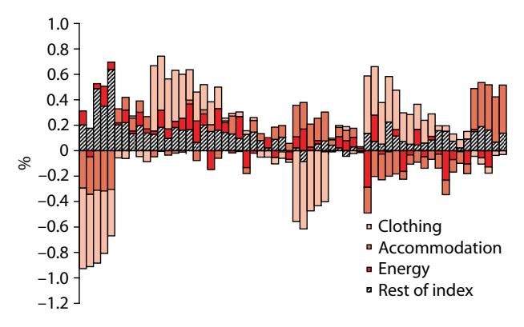
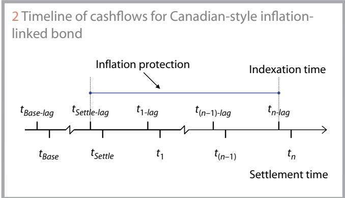
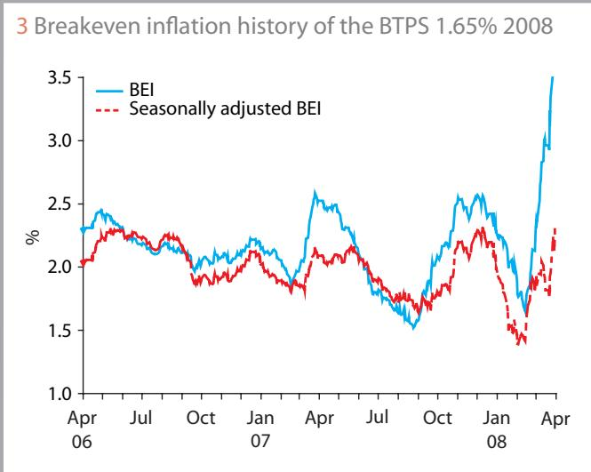
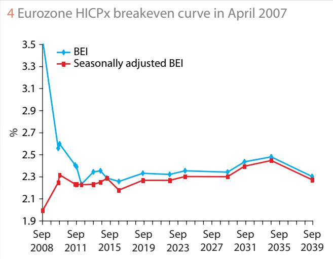
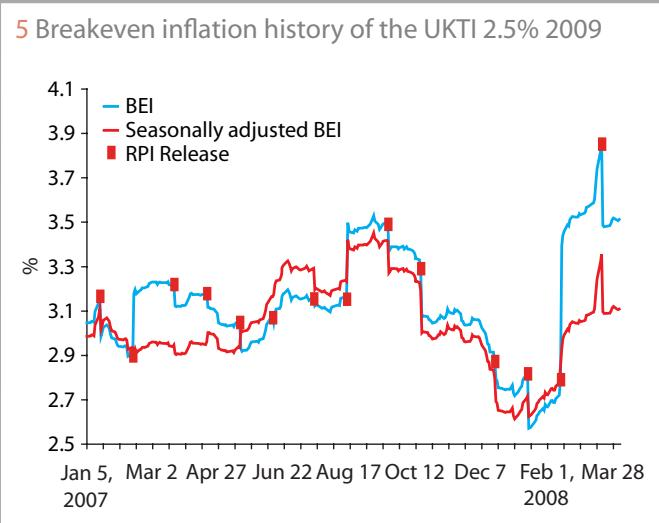
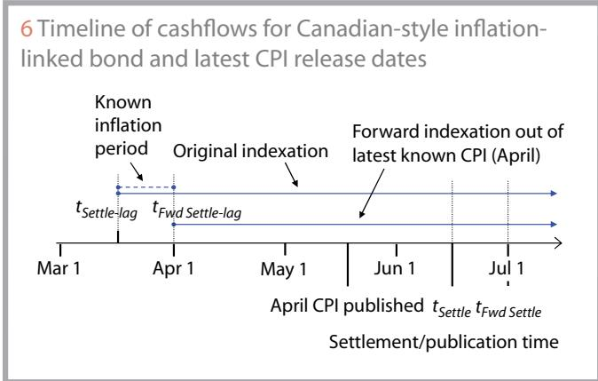

# 2009-canty-seasonally-adjusted-inflation-linked-bonds

<!-- page: 1 -->

## Seasonally adjusted prices for inflation-linked bonds

Inflation-linked bond markets are used ever more frequently by policy-makers, economists and commentators to assess the market’s opinion about the future path of inflation and real yields. But important efects such as seasonality and carry are often ignored, which can make such assessments seriously flawed. There is a lack of consensus among investors and traders on the best way to account for these efects. Paul Canty proposes a method for calculating the seasonally adjusted clean price of inflation-linked bonds that can be used to isolate and remove seasonality and short-term carry factors

is highly seasonal. Food and energy prices ensure Inflation that inflation is also volatile from month to month. One-of future inflationary events may be known about months in advance. These three factors apply to the consumer price index (CPI) measures used in the calculation of global inflation-linked bond (ILB) markets. They make it dificult to extract meaningful information from the prices of ILBs. In particular, they hide the trend rate of inflation, which is, arguably, the most valuable piece of information.

Central bank policy-makers often refer to the level of breakeven inflation (BEI – the diference between the yield of a nominal bond for a given maturity date and the real yield of an inflationlinked bond of the same maturity) implied by the bond markets to justify interest rate policy decisions. But they tend to do so without quantifying or clarifying the efects of seasonality and carry. For example, if the BEI has increased by 5 basis points over the course of a month, one may conclude that inflationary expectations have risen. However, if the BEI carry for that period was an increase of 10bp, then inflationary expectations have actually fallen by 5bp.

In the US, the Federal Open Market Committee tends to avoid this problem by focusing on the forward inflation rate between five and 10 years’ time (the 5Y w 5Y forward) as a key indicator. This has the advantage of always being a whole number of years in length (so avoiding seasonal considerations) and it bypasses the short-term, volatile part of the BEI curve (up to five years in this case). The approach outlined below makes it unnecessary to so limit the amount of trend information that can be extracted from the market.

Many economists and market commentators exhibit a lack of clarity when talking about real yield and breakeven inflation levels of ILBs. It is not really meaningful to talk about the level of BEI or changes to that level without also quantifying the efects of seasonality and carry (the diference between the forward rate and the spot rate). Frequently, there is also a lack of understanding of the dynamics of ILB prices. For example, concepts that are relatively simple in nominal bond markets, such as the steepness of the yield curve, become much more complicated in inflation-linked bond and swap markets. The real yield of a bond with a maturity of five years will react to seasonality diferently from a 10-year bond. Thus the spread between the two yields (the steepness of the curve) is seasonally dependent. Answering the question ‘How steep is the real yield curve?’ is not straightforward.

This article addresses these problems and describes a method that allows the efects of seasonality and other short-term factors to be quantified and eliminated, thus exposing the underlying inflationary trend. It is beyond the scope of the article to outline the general status of seasonality modelling. For most markets, seasonally adjusted series are published by the oficial statistical agencies (for example, Eurostat in the case of eurozone Harmonised Index of Consumer Prices (HICP) and the Bureau of Labor Statistics for US CPI). See Belgrade & Benhamou (2004) for a more complete discussion on seasonality modelling in the context of inflation markets, or DeLurgio (1998) for a more general treatment of time-series analysis. Here, we focus on the application of the seasonal factors rather than their calculation. It is organised as follows. The first part outlines the underlying causes of the issues described above. Then we introduce the concept of seasonally adjusted prices, before extending the approach to take account of volatile components (such as energy) and other short-term efects in the section on fully adjusted prices. The methodology can be extended to other inflation products, including derivatives such as zero-coupon swaps.

A note on carry: inflation strategists focus much of their attention on the carry of breakeven inflation rates, since the forward rate several months in the future can be rather diferent from the spot level. These considerations become much less important once the transformation has been made to forward-valued, fully adjusted breakeven inflation rates. For a discussion of the carry efect on Treasury Inflation Protected Securities (Tips), see D’Amico, Kim & Wei (2007).

<!-- page: 2 -->

## Causes of seasonality, volatility and other factors

Seasonal influences are defined as periodic and recurrent; the efects should be reasonably stable in terms of timing, direction and magnitude. The main causes of seasonality in consumer price inflation measures are clothing, accommodation and, particularly in the US, motor fuels. One can see from figure 1 that most of the seasonality in the eurozone HICP comes from clothing and accommodation, which represent only around 10% of the index (see table A for example component weights of the eurozone HICP).

The main causes of volatility, or noise, in the CPI are the food and energy components, in particular motor fuels. These components can make short-term or tactical trading decisions dificult as their efect on breakeven inflation can be tricky to quantify.

In addition to seasonality and volatility, there may be known, or at least expected, future inflationary or deflationary shocks that do not sit well under the noise (or volatility) category as they are known about some time in advance and with some certainty of magnitude. These items would include the value-added tax increase in Germany in January 2007 and the impact of bank interest rate changes on the mortgage interest payment component of the Retail Price Index (RPI) in the UK.

## Seasonally adjusted prices

For simplicity, we deal initially with Canadian-style ILBs with annual coupons. Later, the approach is extended to semiannual Canadian-style ILBs and the specific case of index-linked gilts in the UK with an eight-month lag. The approach can be extended to cover bonds with other payment conventions.

Whenever the maturity of an ILB is not a whole number of years after its settlement date, seasonality becomes an issue. For example, if a bond settles in April and matures some years later in September, the indexation period includes an extra six months of inflation from January to June (due to the threemonth lag). Inflation in this period is typically much higher than from July to December, which means that the overall breakeven inflation rate should be higher than the same bond with a whole number of years left to maturity. This article focuses on quantifying this efect.

The timeline for the annual coupon Canadian-style ILB is shown in figure 2. The indexation period covered by the bond is from three months before the settlement date to three months before the maturity date, where each index observation is a linear interpolation between the index values for two months and three months prior to the month of the settlement date (see later for precise definition). The times $\{ t _ { i } ( i = 1 \mathrm { t o } n ) \}$ represent the coupon payment dates of the bond.

We start with the definition of the dirty price (DP) of an ILB with annual real cashflows $C _ { i }$ at times {t (i = 1 to n)}:

$$
D P = \sum _ { i = 1 } ^ { n } C _ { i } \frac { I _ { i } } { I _ { B a s e } } d f _ { i }\tag{1}
$$

1 Month-on-month seasonal variations for the past five years due to clothing, energy and the rest of the index for the eurozone HICP Ex-Tobacco index

[Table source crop](assets/tables/2009-canty-seasonally-adjusted-inflation-linked-bonds-p0002-block-0014-c8eb70a7e308a64c.jpg)
A. Component weights of the eurozone HICP: 2008

where $d f _ { i }$ is the nominal discount factor relating to the cashflow at time $\dot { t } _ { i } .$ . We can apply a multiplicative decomposition to the index $I _ { { _ t } }$ by writing:

$$
I _ { t } = T _ { t } S _ { t }\tag{2}
$$

where $T _ { _ t }$ is the trend component and $S _ { \ t { t } }$ is the seasonal component. See the appendix for an example of seasonal factors defined in this way. Substituting (2) into expression (1) gives:

<!-- page: 3 -->

$$
D P = \sum _ { i = 1 } ^ { n } C _ { i } \frac { T _ { i } S _ { i } } { I _ { B a s e } } d f _ { i }\tag{3}
$$

Since the payments on the bond are annual, all the $S _ { _ i }$ are equal, and in particular equal to the seasonal factor at maturity, which we shall call $S _ { g _ { a t u r i t y } } .$ We make an important assumption here that the seasonal factors remain constant over time. There are alternative approaches to seasonality in inflation models, such as exponentially decaying seasonal factors so that, after a long time, there is no seasonality evident. Given the definition of seasonality (periodic and recurrent), it is a reasonable assumption that the factors should remain constant. Then we have:

$$
D P = \left( \sum _ { i = 1 } ^ { n } C _ { i } \frac { T _ { i } } { I _ { B a s e } } d f _ { i } \right) S _ { M a t u r i t y }\tag{4}
$$

The expression in brackets is the seasonally adjusted dirty price (SADP). It contains only the trend growth rate of inflation. So we have:

$$
D P = S A D P \times S _ { M a t u r i t y }\tag{5}
$$

or:

$$
S A D P = \frac { D P } { S _ { M a t u r i t y } }\tag{6}
$$

The clean price (CP) of the bond is defined as:

$$
C P = \frac { I _ { B a s e } } { I _ { S e t t l e } } D P - R A I\tag{7}
$$

where RAI is the real accrued interest (the interest earned on the bond since the last coupon date before adjusting for inflation). Substituting the DP in (4) into (7) gives:

$$
C P = \frac { I _ { B a s e } } { I _ { S e t t l e } } \Bigg ( \sum _ { i = 1 } ^ { n } C _ { i } \frac { T _ { i } } { I _ { B a s e } } d f _ { i } \Bigg ) S _ { M a t u r i t y } - R A I\tag{8}
$$

Applying the decomposition a second time to the index at the settlement date of the bond, $I _ { s e t t l e } ,$ gives:

$$
C P = \frac { I _ { B a s e } } { T _ { S e t t l e } S _ { S e t t l e } } \Bigg ( \sum _ { i = 1 } ^ { n } C _ { i } \frac { T _ { i } } { I _ { B a s e } } d f _ { i } \Bigg ) S _ { M a t u r i t y } - R A I\tag{9}
$$

Simplifying this gives:

$$
C P = \left( \sum _ { i = 1 } ^ { n } C _ { i } \frac { T _ { i } } { T _ { S e t t l e } } d f _ { i } \right) \frac { S _ { M a t u r i t y } } { S _ { S e t t l e } } - R A I\tag{10}
$$

The expression in brackets is close to the seasonally adjusted clean price (SACP). We define SACP as:

$$
S A C P = \sum _ { i = 1 } ^ { n } C _ { i } \frac { T _ { i } } { T _ { S e t t l e } } d f _ { i } - R A I\tag{11}
$$

Then, from (10) and (11), we have the relationship:

$$
C P = \left( S A C P + R A I \right) \frac { S _ { M a t u r i t y } } { S _ { S e t t l e } } - R A I\tag{12}
$$

or:

$$
S A C P = C P \frac { S _ { S e t t l e } } { S _ { M a t u r i t y } } + R A I \Bigg ( \frac { S _ { S e t t l e } } { S _ { M a t u r i t y } } - 1 \Bigg )\tag{13}
$$

In markets where the real accrued interest is small relative to the clean price (most developed inflation-linked bond markets have coupons lower than 5%, and are often paid semiannually) and $( S _ { M a t u r i t y } / S _ { S e t t l e } - 1 )$ is close to zero, the second term may be ignored and the following approximation may be used:

$$
S A C P \approx C P { \frac { S _ { S e t t l e } } { S _ { M a t u r i t y } } }\tag{14}
$$

Hence, the seasonally adjusted clean price is approximately equal to the original CP multiplied by the ratio of seasonal factors for the settlement date of the bond and its maturity date.

Note that when the maturity date of the bond is on an anniversary of the settlement date then $S _ { s e t t l e } = S _ { _ { M a t u r i t y } }$ and the seasonally adjusted clean price is equal to the quoted clean price.

The expressions in (13) and (14) form the key result of this article. It is a very quick and concise way to strip out the seasonal noise from an individual inflation-linked bond to expose the underlying trend inflation rate. There are alternative methods (such as bootstrapping or fitting annual, zero-coupon inflation curves through a set of bond prices) to extract the inflation trend rate, but this approach keeps the analysis at the individual, tradable instrument level and does not depend on a complex model.

The seasonally adjusted real yield is simply the real yield calculated in the usual way using the seasonally adjusted clean price. The seasonally adjusted BEI rate is the diference between the nominal yield to the same maturity and the seasonally adjusted real yield. These concepts are useful for a number of reasons, including:

<!-- page: 4 -->

N Historical analysis of real yields and breakeven inflation rates. N Plotting the term structure of breakeven inflation when bonds mature at diferent times of the year.

N Relative value trading decisions across the curve. For example, whether to buy a bond maturing in July versus one maturing in September, or whether to invest in a five-year bond or a 10-year bond.

N Pricing new issues of inflation-linked bonds where there is no comparable bond of the same maturity month.

Figure 3 shows the BEI history of the BTPS 1.65% 2008 Italian inflation-linked bond for both unadjusted and seasonally adjusted series. We see that the seasonally adjusted series is much less volatile than the original series and follows a narrower range. In particular, the seasonal peak in April 2007 is much less pronounced. Figure 4 shows the eurozone HICPx breakeven curve in April 2007 for both unadjusted and seasonally adjusted rates. There are two main features to point out here: first, the unadjusted BEI curve is extremely inverted while the seasonally adjusted BEI is very well behaved at the short end (that is, it is smoother and moderately upward sloping).

Second, the DBRei April 2016 point sits nicely on the seasonally adjusted curve rather than being an outlier on the unadjusted curve. Note that the BEI of this bond does not really change under seasonal adjustment. This is because the settlement date and maturity date are both in April so the bond has almost a whole number of years left to maturity, a property touched upon earlier.

The yield calculation of the old-style eight-month lag ILBs in the UK covers inflation indexation from the latest RPI release to the month, which is eight months prior to the maturity date. This means that whenever a new RPI number is released the quoted yield shows a jump, even for no change in price. But a lot of this jump is due to the seasonal variation of the index. Figure 5 shows the recent breakeven inflation history of the UKTI 2.5% 2009, and demonstrates the fact that seasonality accounts for most of the jump in yield experienced as a result of a new RPI release. This is a good example of the application of the seasonal adjustment of yields because historical analysis of UK eight-month lag bonds is notoriously dificult due to the discontinuous nature of the yield.

So far we have considered only bonds with annual coupons. Many ILBs pay coupons semiannually: Tips in the US, Italian BTPs in Europe and all UK government inflation-linked bonds.

In this case, the assumption made in (5) above (that all the $S _ { _ i }$ are equal, and in particular equal to the seasonal factor at maturity) no longer holds. There will be two seasonal factors: one for each of the two coupon payment months. We can separate the two factors as follows. Recalling the definition of DP in (5) above, we rewrite it in terms of the two seasonal factors. The DP then becomes a weighted average of two seasonal components $S _ { \nu }$ and $S _ { \gamma }$ . We assume an even number of coupon payments for simplicity:

$$
D P = \sum _ { i = 1 , 3 , 5 , \ldots , n - 3 , n - 1 } C _ { i } { \frac { T _ { i } S _ { 1 } } { I _ { B a s e } } } d f _ { i } + \sum _ { i = 2 , 4 , 6 , \ldots , n - 2 , n } C _ { i } { \frac { T _ { i } S _ { 2 } } { I _ { B a s e } } } d f _ { i }\tag{15}
$$

Given a single bond, we do not know the term structure of discount factors so we cannot calculate the weights exactly, but we can make a guess by using the real yield of the bond to calculate an approximate value for each seasonally adjusted real discount factor, $( T _ { i } / I _ { B a s e } ) d f _ { i } ,$ in (15). The approximation is:

$$
\frac { T _ { i } } { I _ { B a s e } } d f _ { i } = \frac { 1 } { \left( 1 + R Y \right) ^ { t _ { i } } }\tag{16}
$$

where $R Y$ is the real yield of the bond and $t _ { \scriptscriptstyle i }$ is the time until payment.

Following a similar analysis as earlier, the seasonally adjusted clean price in the semiannual case can be written as:

$$
S A C P \approx C P \left( { \frac { w _ { 1 } { \frac { S _ { s e t t l e } } { S _ { 1 } } } + w _ { 2 } { \frac { S _ { s e t t l e } } { S _ { 2 } } } } { w _ { 1 } + w _ { 2 } } } \right)\tag{17}
$$

where $w _ { 1 }$ and $w _ { \gamma }$ are the approximate contributions to the total clean price due to each of the two seasonal factors, as in (18) and (19). We have substituted the real discount factors implied by the yield of the bond for the product of the index ratio and nominal discount factor, $( T _ { i } / I _ { s e t t l e } ) d f _ { i }$

The weights are defined as:

$$
w _ { 1 } = \sum _ { i = 1 , 3 , 5 , \ldots , n - 3 , n - 1 } C _ { i } { \frac { 1 } { \left( 1 + R Y \right) ^ { t _ { i } } } }\tag{18}
$$

$$
w _ { 2 } = \sum _ { i = 2 , 4 , 6 , \ldots , n - 2 , n } C _ { i } { \frac { 1 } { \left( 1 + R Y \right) ^ { t _ { i } } } }\tag{19}
$$

## Seasonally adjusted forward prices

The inflation protection embedded in inflation-linked bonds contains some known, historical inflation due to the delay mechanism (or lag) in the indexation (for example, three months in Canadian-style bonds). If this known period contained events that meant that inflation diverged from the seasonally adjusted trend, it is important to account for them. We do this by considering forward-looking breakeven rates starting from the last known index publication.

Recall the timeline in figure 2. In the period between $t _ { s e t t l e - l a g }$ and $t _ { s e t t l e }$ (a period usually of three months) there will be one or two CPI releases. So we know for certain some information about inflation in the period of indexation of the bond. But we are interested in the market’s expectation of future inflation, so we need to exclude the known inflation in the period between $t _ { s e t t l e - l a g }$ and the latest known CPI release date. To do this, we calculate the forward price up to the furthest known settlement date given the latest CPI release.

<!-- page: 5 -->

For example, when the French CPI index for April 2007 was published on May 15, 2007, the furthest forward date in the future where we could calculate the clean price with certainty (assuming a given repo rate) was July 1, 2007. On this date, the three-month lag would refer to the April index value; on any later date, we would need to interpolate between the April and May values, and so would require knowledge of the May print. Figure 6 illustrates this point.

The application of the seasonal adjustment then follows in exactly the same way as earlier except that, in the case of the breakeven inflation rate, the forward nominal yield to the same settlement date should be used.

## Fully adjusted prices

The analysis can be extended further by incorporating an extra term in the index decomposition used in (2) earlier:

$$
I _ { t } = T _ { t } S _ { t } O _ { t }\tag{20}
$$

The term $O _ { t }$ is called the outlier index and contains information about expected future one-of shocks to the inflation index. For example, if we expected the Monetary Policy Committee in the UK to increase interest rates in three months time, we might include a term that looked like this: {O } = {1.000, 1.000, 1.002, 1.002, 1.002} in order to reflect the increase in inflation due to the mortgage interest payment component of the RPI.

Using a similar argument to that above for the seasonal adjustment, we define the fully adjusted clean price (FACP) as:

$$
F A C P \approx C P \frac { S _ { S e t t l e } } { S _ { M a t u r i t y } } \frac { 1 } { { \cal O } _ { M a t u r i t y } }\tag{21}
$$

This extended analysis is required when there are significant nonseasonal items afecting the shorter end of the real yield curve. For example, in the Tips market, gasoline price volatility can mean that even since the last CPI release there has been considerable movement in motor fuel prices. This is information that should be incorporated into any breakeven inflation adjustment. N

## Appendix A: seasonal factors

We model the inflation index as $I _ { t } = T _ { t } S _ { t }$ where $T _ { t }$ is the trend index and $S _ { t } \mathrm { i } s$ the index of seasonal factors. For example, S could be the list of factors shown in the second column of table B (for completeness the equivalent set of additive seasonal factors is included in the third column). An important assumption in the analysis is that the complete series of seasonal factors is generated by repeating the set of 12 monthly factors. That is, the seasonal factors remain constant over time.

For a given base date t and a forward date T, the forward index is given by the following expression:

$$
I _ { T } = I _ { t } \frac { S _ { T } } { S _ { t } } \mathrm { e x p } \big ( r _ { t , T } \left( T - t \right) \big ) \quad \quad
$$

where $r _ { t , T }$ is the continuously compounded trend rate of growth between times t and T.

In most inflation-linked bond markets, the inflation index is calculated using an interpolated three-month lag. The interpolated index is defined as:

$$
\overset { \cdot } { I } _ { I n t e r p } = I _ { 1 } + w \bigl ( I _ { 2 } - I _ { 1 } \bigr )
$$

where $I _ { 1 }$ is the index three months prior to the month of settlement, $. I _ { \gamma }$ is the index two months prior to the month of settlement, $w = 1 - ( \mathrm { d } _ { \mathrm { i } } \mathrm { - } 1 / \mathrm { d } _ { \mathrm { 2 } } ) , d _ { \mathrm { 1 } } \mathrm { i } 5$ the day of the month of the settlement date and d is the number of days in the settlement month. The seasonal adjustment of prices in this case requires an approximation. We use the following approximation:

$$
\dot { I } _ { I n t e r p } \approx T _ { I n t e r p } S _ { I n t e r p } \ .
$$

where $T _ { _ { I n t e r p } } | \mathrm { { s } }$ the trend index and $S _ { _ { I n t e r p } }$ is the seasonal index in the usual decomposition, which can be made as the cross terms in the expansion are negligible.

[Table source crop](assets/tables/2009-canty-seasonally-adjusted-inflation-linked-bonds-p0005-block-0022-38d055794af49e41.jpg)
B. Example of multiplicative and additive seasonal factors

## References

Belgrade N and E Benhamou, 2004 Impact of seasonality in inflation derivatives pricing Working paper QRFI 08-04/2, CDC Ixis Quantitative Research DeLurgio S, 1998 Forecasting principles and applications McGraw-Hill

D’Amico S, D Kim and M Wei, 2007 Tips from Tips: the informational content of Treasury Inflation-Protected Security prices Working paper

Paul Canty is European head of inflation trading at Deutsche Bank. Email: paul.canty@db.com
