<!-- page: 1 -->

# **A Simple Approximate Long-Memory Model of Realized Volatility** 

### Fulvio Corsi 

_University of Lugano and Swiss Finance Institute_ 

## abstract 

The paper proposes an additive cascade model of volatility components defined over different time periods. This volatility cascade leads to a simple AR-type model in the realized volatility with the feature of considering different volatility components realized over different time horizons and thus termed Heterogeneous Autoregressive model of Realized Volatility (HAR-RV). In spite of the simplicity of its structure and the absence of true long-memory properties, simulation results show that the HAR-RV model successfully achieves the purpose of reproducing the main empirical features of financial returns (long memory, fat tails, and self-similarity) in a very tractable and parsimonious way. Moreover, empirical results show remarkably good forecasting performance. ( _JEL_ : C13, C22, C51, C53) 

keywords: high-frequency data, long-memory models, realized volatility, volatility forecast 

## **1 INTRODUCTION** 

Financial data present a series of well-known stylized facts that pose serious challenges to standard econometric models. The autocorrelations of the square and absolute returns show very strong persistence that last for long time periods (months). Return distributions at different horizons show fat tails and tail crossover, i.e., 

Earlier versions of this paper were circulated and cited under the title “A Simple Long Memory Model of Realized Volatility.” The author would like to thank Ren´e Garcia (the editor), the associate editor, an anonymous referee, Francesco Audrino, Giovanni Barone-Adesi, Tim Bollerslev, Michel Dacorogna, Patrick Gagliardini, Ramazan Genc¸ay, Giampiero Gallo, Paul Lynch, Loriano Mancini, Ulrich M¨uller, Roberto Ren`o, Adrian Trapletti, Fabio Trojani, and Gilles Zumbach for helpful comments and insightful discussions. Address correspondence to Fulvio Corsi, Institute of Finance, University of Lugano, Via Buffi 13, CH-6904, Lugano, Switzerland, or e-mail: fulvio.corsi@lu.unisi.ch. 

doi: 10.1093/jjfinec/nbp001 

Advance Access publication February 19, 2009 

> ⃝C The Author 2009. Published by Oxford University Press. All rights reserved. For permissions, please e-mail: journals.permissions@oxfordjournals.org.

<!-- page: 2 -->

return probability density functions are leptokurtic with shapes depending on the time scale and present a very slow convergence to the normal distribution as time scales increase. Financial data also show evidence of scaling and multiscaling (i.e., different scaling exponents for different powers of the absolute returns).1 Standard GARCH and stochastic volatility models are not able to reproduce all of these features. The observed data contain noticeable fluctuations in the size of price changes at all time scales, while standard GARCH and stochastic volatility short-memory models appear like white noise once aggregated over longer time periods (no scaling behavior). Hence, growing interest in long-memory processes has recently emerged in financial econometrics. 

Long-memory volatility is usually obtained by employing fractional difference operators as in the FIGARCH models of returns or ARFIMA models of realized volatility. Fractional integration achieves long memory in a parsimonious way by imposing a set of infinite-dimensional restrictions on the infinite variable lags. Those restrictions are transmitted by the fractional difference operators. However, fractionally integrated models also pose some problems. Fractional integration is a convenient mathematical trick but lacks a clear economic interpretation. Comte and Renault (1998) argue that the fractional difference filter (1 − _L_ )_d_ introduces some artificial mixing between long- and short-term characteristics that makes it difficult to disentangle them. Fractionally integrated models are nontrivial to estimate and not easily extendible to multivariate processes.2 Moreover, the application of the fractional difference operator requires a long build-up period which results in the loss of many observations. Finally, these kinds of models are able to reproduce only the unifractal (or monofractal) type of scaling but not the multiscaling behavior found in the empirical data. 

An alternative approach views the long-memory and multiscaling features observed in the data as an _apparent behavior_ generated from a process which is not really long memory or multiscaling. If the aggregation level is not large enough compared to the lowest frequency component of the model, truly asymptotic shortmemory and monoscaling models can, in fact, be mistaken for long-memory and multiscaling ones. In other words, the usual tests employed on the empirical data can indicate the presence of long memory and multiscaling even when none exists, just because the largest aggregation level we are able to consider is actually not large enough. For instance, LeBaron (2001) shows that a very simple additive model 

> 1Evidence of scaling (fractal) and multiscaling (multifractal) behavior in financial data has been found (though without explicitly referring to the multiscaling or multifractal terminology) by Ding, Granger, and Engle (1993), Andersen and Bollerslev (1997), Lobato and Savin (1998), and Dacorogna, Genc¸ay, M¨uller, Olsen, and Pictet (2001). 

> 2These shortcomings are evident in the FIGARCH case. But, also for ARFIMA models, it has been shown that the heuristic method of estimating _d_ separately via a Geweke–Porter-Hudak (GPH) method, for instance, gives notably biased and inefficient estimates especially in the presence of large AR or MA roots (which seems to be our case). As argued in Comte and Renault (1998), this difficulty is an artifact of the standard parameterization of the ARFIMA model. Joint ML estimation of all the parameters in ARFIMA ( _p_ , _d_ , _q_ ) models, though more efficient, makes the estimation procedure more complex and even

<!-- page: 3 -->

defined as the sum of only three different AR(1) processes displays a decaying memory pattern that can be mistaken for a hyperbolic one (provided that the longest component has a half-life that is long relative to the tested aggregation ranges).3 This means that the set of stochastic processes able to generate the stylized facts found in the data is much larger than commonly thought. 

Since it is empirically very difficult to statistically discern between true longmemory processes and simple component models with few time scales and given that the latter are much easier to estimate and interpret, we follow this alternative view by proposing a simple component model for conditional volatility which is able to reproduce the main empirical features observed in the data while remaining parsimonious and easy to estimate. Inspired by the HARCH model of M¨uller et al. (1997) and Dacorogna et al. (1998) and by the asymmetric propagation of volatility between long and short time horizons, we propose an additive cascade model of different volatility components each of which is generated by the actions of different types of market participants. This additive volatility cascade leads to a simple AR-type model in the realized volatility with the feature of considering volatilities realized over different time horizons. We thus term this model, Heterogeneous Autoregressive model of Realized Volatility (HAR-RV). Surprisingly, in spite of its simplicity and the fact that it does not formally belong to the class of long-memory models, the HAR-RV model is able to reproduce the same volatility persistence observed in the empirical data as well as many of the other main stylized facts of 

The rest of the paper is organized as follows. Section 2 introduces the notation and derivation of the model and shows the properties of the simulated HARRV series. Section 3 describes the data set employed in the empirical study and presents the estimation and forecasting results of the model compared with some benchmark models. Section 4 concludes. 

## **2 THE MODEL** 

## **2.1 Notation** 

In this section we introduce the notation for integrated latent volatilities and realized volatilities aggregated over different time horizons. Let us start by considering the standard continuous time process 

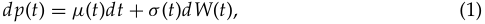

where _p_ ( _t_ ) is the logarithm of instantaneous price, _μ_ ( _t_ ) is cadl´ag finite variation process, _W_ ( _t_ ) is a standard Brownian motion, and _σ_ ( _t_ ) is a stochastic process independent of _W_ ( _t_ ). For this diffusion process, the integrated variance associated 

> 3The appearance of long memory as a combination of short-memory processes is not surprising given the result of Granger (1980), which shows that the sum of an infinite number of short-memory processes can give rise to long memory. However, what is surprising is that those results can be mimicked with only three different time scales.

<!-- page: 4 -->

with day _t_ is the integral of the instantaneous variance over the one-day interval [ _t_ − 1 _d_ , _t_ ], where a full-trading day is represented by the time interval 1 _d_ , 

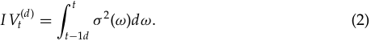

Some authors refer to this quantity as integrated volatility, while we will devote this term to the square root of the integrated variance, i.e., in our notation, the integrated volatility is _σt_(_d_) = ( _I Vt_(_d_) )1_/_2 . 

As shown in a series of seminal papers by Andersen, Bollerslev, Diebold, and Labys (2001), Andersen, Bollerslev, Diebold, and Ebens (2001), and BarndorffNielsen and Shephard (2002a, 2002b), the integrated variance _I Vt_(_d_) can be approximated to an arbitrary precision using the sum of intraday squared returns. Importantly, Andersen, Bollerslev, Diebold, and Labys (2003) showed that direct time series modeling of realized volatility strongly outperforms, in terms of outof-sample forecasting, the popular GARCH and stochastic volatility models. The standard definition (for an equally spaced return series) of the realized volatility over a time interval of one day is 

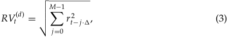

where _�_ = 1 _d/M_ , and _rt_ − _j_ · _�_ = _p_ ( _t_ − _j_ · _�_ ) − _p_ ( _t_ − ( _j_ + 1) · _�_ ) defines continuously compounded _�_ -frequency returns, that is, intraday returns sampled at time interval _�_ (here, the subscript _t_ indexes the day, while _j_ indexes the time within the day _t_ ). 

In the following, we will also consider latent integrated volatility and realized volatility viewed over different time horizons longer than one day. In order to allow direct comparison among quantities defined over various time horizons, these multiperiod volatilities are normalized sums of the one-period realized volatilities (i.e., a simple average of the daily quantities). For example, in our notation, a weekly realized volatility at time _t_ is given by the average4 

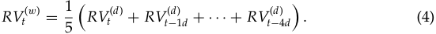

In particular, we will make use of weekly and monthly aggregation periods. Indicating the aggregation period as an upper script, the notation for weekly integrated and realized volatility is, respectively, _σt_(_w_) and _RVt_(_w_) , while a monthly aggregation is denoted by _σt_(_m_) and _RVt_(_m_) . In the following, irrespective of their actual 

> 4Note that because of Jensen’s inequality, the aggregated volatility, as defined here, cannot be exactly interpreted as the realized volatility over the specific time interval. However, the difference is immaterial in empirical applications, while this definition will allow for a much simpler interpretation of the HAR model in terms of a restricted AR(22) model, as discussed below.

<!-- page: 5 -->

frequency, all return and volatility quantities are intended to be annualized to facilitate comparison among different frequencies. 

## **2.2 Motivations** 

The motivating idea stems from the so-called Heterogeneous Market Hypothesis presented by M¨uller et al. (1993), which recognizes the presence of heterogeneity across traders. This view of financial markets can be related to the “Fractal Market Hypothesis” of Peters (1994), the “Interacting Agent View” of Lux and Marchesi (1999) and Alfarano and Lux (2007), and the “Agent-based” model of LeBaron (2006). The idea of multiple components in the volatility process has also been suggested by Andersen and Bollerslev (1997) in their “Mixture of Distribution Hypothesis.” In this latter view, the multicomponent structure stems from the heterogeneous nature of the information arrivals. 

In financial markets, heterogeneity may arise for various reasons: differences in agents’ endowments, institutional constraints, and risk profiles dissimilarity in processing information, temporal horizons, geographical locations, and so on. Here, we concentrate on the heterogeneity that originates from the difference in the time horizons. Typically, a financial market is composed of participants having a large spectrum of trading frequency. At one end of the spectrum we have dealers, market makers, and intraday speculators, with very high intraday frequency as a trading horizon. At the other end, there are institutional investors, such as insurance companies and pension funds who trade much less frequently and possibly for larger amounts. The main idea is that agents with different time horizons perceive, react to, and cause different types of volatility components. Simplifying a bit, we can identify three primary volatility components: the short-term traders with daily or higher trading frequency, the medium-term investors who typically rebalance their positions weekly, and the long-term agents with a characteristic time of one or more months. Although this categorization finds its justification in the simple observation of financial markets and has a clear and appealing economic interpretation, it has been mainly overlooked in econometric modeling. A noteworthy exception is the HARCH model of M¨uller et al. (1997) and Dacorogna et al. (1998).5 

Studying the interrelations of volatility, measured over different time horizons, allows one to reveal the dynamics of the different market components. It has been recently observed that volatility over longer time intervals has a stronger influence on volatility over shorter time intervals than conversely. This asymmetric behavior of volatility has been confirmed employing different statistical tools.6 

> 5The HARCH process belongs to the wide ARCH family, but differs from all other ARCH-type processes in the unique property of considering squared returns aggregated over different intervals. The heterogeneous set of return interval sizes leads to the name HARCH for “Heterogeneous interval ARCH,” but the first “H” may also stand for “Heterogeneous market.” 

> 6M¨uller et al. (1997) employ a lead–lag correlation analysis of “fine” and “coarse” volatility to investigate causal relation in a Granger sense. Arneodo, Muzy, and Sornette (1998) and Genc¸ay and Selc¸uk (2004) perform a wavelets analysis, while Lynch and Zumbach (2003) clearly visualize the asymmetric

<!-- page: 6 -->

The overall pattern that emerges is a volatility cascade from low frequencies to high frequencies. This can be economically explained by noticing that for shortterm traders the level of long-term volatility matters because it determines the expected future size of trends and risk. Then, on the one hand, short-term traders react to changes in long-term volatility by revising their trading behavior and thereby causing short-term volatility. On the other hand, the level of short-term volatility does not affect the trading strategies of long-term traders. This hierarchical structure has induced some authors to propose a formal analogy between FX dynamics and the motion of turbulent fluid where a multiplicative energy cascade from large to small spatial scales is present.7 More recently, Calvet and Fisher (2004, 2007) proposed a multifrequency model obtained as a multiplicative product of a large number of Markov-switching processes operating at different frequencies (expressed in terms of different probability transitions). 

Motivated by the theoretical ability of simple models with only a few relevant components to replicate the statistical behavior of financial data, and from the empirical observation that heterogeneous market structure generates volatility cascades, we propose a volatility cascade model with three heterogeneous volatility components. 

## **2.3 The HAR-RV Model** 

˜ Defining the _latent partial volatility σt_(·)as the volatility generated by a certain market component, the proposed model can be described as an additive cascade of partial volatilities, each having an “almost AR(1)” structure.8 To simplify, we consider a hierarchical model with only three volatility components corresponding to time horizons of one day (1 _d_ ), one week (1 _w_ ), and one month (1 _m_ ) denoted respectively ˜ ˜ ˜ by _σt_(_d_) , _σt_(_w_) , and _σt_(_m_) . Obviously, more components could easily be added. By the same token, for the sake of the exposition, the model here is presented (and subsequently employed) for the realized volatility (i.e., the square-root transformation of the variance), but analogous models could be written for the variance or for its logarithmic transformation. 

The high-frequency return process is determined by the highest frequency volatility component in the cascade (the daily one in this simplified case) with 

propagation of volatility by plotting the level of correlation between the volatility first difference and the realized volatility. 

> 7Borrowing from the Kolmogorov model of hydrodynamic turbulence, multiplicative cascade processes for volatility have been proposed by Ghashaghaie et al. (1996) and Breymann et al. (2000). Although these types of models are able, in theory, to reproduce the main features of the financial data, their empirical estimation still remains an open question. 

> 8Since on the right-hand side it is not the lagged latent volatility that appears but rather the corresponding realized volatility, the process is not, strictly speaking, a true AR(1). The fact that the realized volatility is a close proxy for the latent one makes this process similar to an AR(1). More formally, this model could be classified in the broad class of hidden Markov models (an application of hidden Markov models to volatility forecasting is in Rossi and Gallo [2006]).

<!-- page: 7 -->

_σ_ ˜ _t_(_d_) = _σt_(_d_) the daily integrated volatility. Then the return process is 

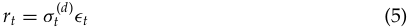

with _ϵt_ ∼ _NI D_ (0, 1). The model for the unobserved partial volatility processes ˜ _σt_(·) at each level of the cascade is assumed to be a function of the past realized volatility experienced at the same time scale (the “AR(1)” component) and, due to the asymmetric propagation of volatility, of the expectation of the next-period values of the longer-term partial volatilities (the hierarchical component). For the longest time scale (monthly), only the “AR(1)” structure remains. Then the model reads 

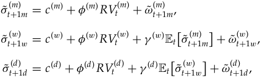

where _RVt_(_d_) , _RVt_(_w_) , and _RVt_(_m_) are respectively the daily, weekly, and monthly (ex post) observed realized volatilities as previously described, while the volatility innovations _ω_ ˜ _t_(_m_ +) 1 _m_,_ω_˜ _t_(_w_ +) 1 _w_, and_ω_˜ _t_(_d_ +) 1 _d_are contemporaneously and serially independent zero-mean nuisance variates with an appropriately truncated left tail to guarantee the positivity of partial volatilities.9 

The economic interpretation is that each volatility component in the cascade corresponds to a market component that forms expectations for the next period’s volatility based on the observation of the current realized volatility and on the expectation for the longer horizon volatility (which is known to affect the future level of their relevant volatility). 

By straightforward recursive substitutions of the partial volatilities and recalling that _σ_ ˜ _t_(_d_) = _σt_(_d_) , such a cascade model can be simply written as 

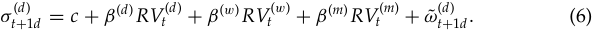

Equation (6) can be seen as a three-factor stochastic volatility model, where the factors are directly the past realized volatilities viewed at different frequencies. From this process for the latent volatility, it is easy to derive the functional form for a time series model in terms of realized volatilities by simply noticing that, ex post, _σt_( +_d_) 1 _d_can be written as 

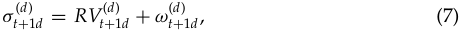

> 9An alternative way to ensure positiveness of partial volatilities would be to write the model in terms of the log of RV.

<!-- page: 8 -->

where _ωt_(_d_) subsumes both latent daily volatility measurement and estimation errors. Equation (7) links our ex post volatility estimate _RVt_( +_d_ 1) _d_tothecontempora- neous measure of daily latent volatility _σt_( +_d_) 1 _d_.10 

Substituting Equation (7) in Equation (6) and recalling that measurement errors on the dependent variable can be absorbed into the disturbance term of the regression, we obtain a very simple time series representation of the proposed cascade model, 

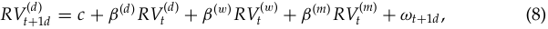

with _ωt_ +1 _d_ = _ω_ ˜ _t_(_d_ +) 1 _d_−_ω_ _t_(_d_ +) 1 _d_.Equation(8)hasasimpleautoregressivestructurein the realized volatility but with the feature of considering volatilities realized over different interval sizes; it could then be labeled as HAR(3)-RV. In general, denoting _l_ and _h_ , respectively, the lowest and highest frequency in the cascade, Equation (8) is an AR( _h__<u>l</u>_)modelreparameterizedinaparsimoniouswaybyimposingeco- nomically meaningful restrictions (which take the form of a step function for the autoregressive weights).11 

## **2.4 Simulation Results** 

The purpose of this section is to show that, in spite of its simplicity, the proposed model is able to produce rich dynamics for returns and volatilities which closely reproduce what we observe in empirical data. These dynamics are generated by the heterogeneous reaction of the different market components to a given price change, which in turn affects the future size of price changes. This causes a complex process by which the market reacts to its own price history with different reaction times. Thus, market volatilities feed on themselves.12 

To assess the ability of the model to replicate the main stylized facts of the empirical data, we compare the time series returns and volatilities produced by the simulation of the HAR(3)-RV model with those of the USD/CHF series (described in Section 3.1). In order to give the model the time aggregation necessary to unfold its dynamics at the daily level, the HAR(3)-RV process is simulated at the frequency of two hours (2 _h_ ) (corresponding to _M_ = 12 for a full 24-hour trading day). The 

> 10The presence of a mean-zero error term _ωt_(_d_ +) 1 _d_in Equation (7) makes it clear that we are not treating realized volatility as an error-free measure of latent volatility. Note that the consistency of the realized volatility is not enough to state that _ωt_(_d_) is a mean-zero error term. Unbiased estimators of latent volatilities and hence a proper finite sample treatment of microstructure effects are needed. 

> 11In this sense, the HAR can be related to the MIDAS regression of Ghysels, Santa-Clara, and Valkanov (2006), Ghysels, Sinko, and Valkanov (2006), and Forsberg and Ghysels (2007), although the standard MIDAS with the estimated Beta function lag polynomial cannot reproduce the HAR step function weights. 

> 12This mechanism is sometimes called “price-driven volatility” in contrast to the “event-driven volatility” consistent with the EMH and the “error-driven volatility” due to over- and underreaction of the market to incoming information.

<!-- page: 9 -->

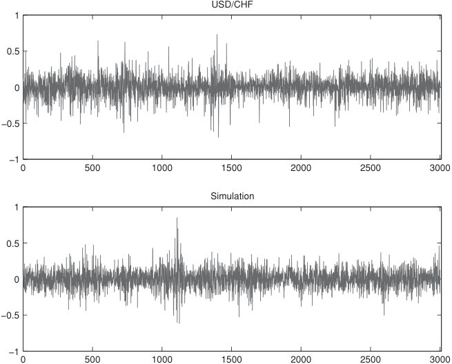

<!-- Start of picture text -->
USD/CHF 1 0.5 0 −0.5 −1 0 500 1000 1500 2000 2500 3000 Simulation 1 0.5 0 −0.5 −1 0 500 1000 1500 2000 2500 3000 <!-- End of picture text -->

**Figure 1** Comparison of actual (top) and simulated (bottom) daily returns series. 

simulated model then reads 

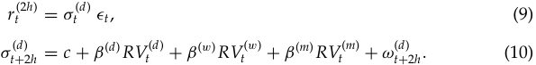

The parameters of the model ( _β_(·) ) are simply calibrated to obtain realistic results. They are _β_(_d_) = 0.36, _β_(_w_) = 0.28, and _β_(_m_) = 0.28. 

The analysis begins with a simple visual inspection of a sample of the two time series for the returns (Figure 1) and the realized volatilities (Figure 2). In both Figures 1 and 2, the upper panels show a sample of the empirical data for USD/CHF, while the lower panels display a visually very similar sample realization of the simulated process. 

Figure 3 summarizes the character of the simulated and actual return distribution for 1-, 5-, and 22-day intervals. In these and the subsequent comparison figures, the number of observations for the real and simulated data differ substantially. The 14 years of USD/CHF yields 3599 daily observations, while the HAR(3)-RV process is simulated for a period corresponding to 150,000 daily observations (approximately 600 years). 

Table 1 reports the values of the kurtosis of the distributions corresponding to the three aggregation intervals. This table clearly shows how the simple HAR

<!-- page: 10 -->

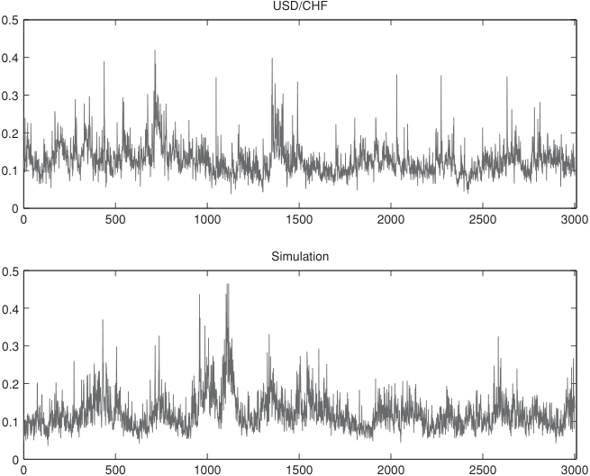

<!-- Start of picture text -->
USD/CHF 0.5 0.4 0.3 0.2 0.1 0 0 500 1000 1500 2000 2500 3000 Simulation 0.5 0.4 0.3 0.2 0.1 0 0 500 1000 1500 2000 2500 3000 <!-- End of picture text -->

**Figure 2** Comparison of actual (top) and simulated (bottom) daily RV series. 

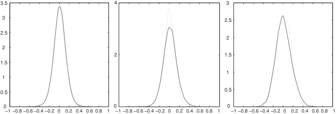

<!-- Start of picture text -->
3.5 4 3 3 2.5 2.5 2 2 2 1.5 1.5 1 1 0.5 0.5 0 0 0 −1 −0.8 −0.6 −0.4 −0.2 0 0.2 0.4 0.6 0.8 1 −1 −0.8 −0.6 −0.4 −0.2 0 0.2 0.4 0.6 0.8 1 −1 −0.8 −0.6 −0.4 −0.2 0 0.2 0.4 0.6 0.8 1 <!-- End of picture text -->

**Figure 3** Comparison of actual (dotted) and simulated (solid) probability density functions of returns for different time horizons. From left to right: daily, weekly, and monthly. 

**Table 1** Kurtosis. 

||Daily returns|Weekly returns|Monthly returns|
|---|---|---|---|
|USD/CHF|4.74|3.82|3.24|
|HAR(3)-RV|4.89|3.90|3.50|

_Note._ Comparison of actual and simulated kurtosis of returns over different time horizons.

<!-- page: 11 -->

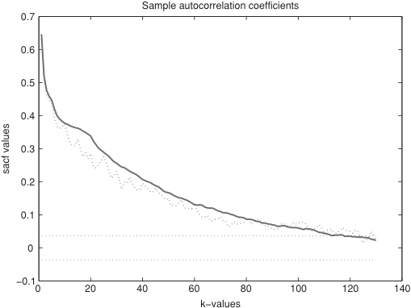

<!-- Start of picture text -->
Sample autocorrelation coefficients 0.7 0.6 0.5 0.4 0.3 0.2 0.1 0 −0.1 0 20 40 60 80 100 120 140 k−values sacf values <!-- End of picture text -->

**Figure 4** Comparison of actual (dotted) and simulated (solid) autocorrelations of daily realized volatility. 

model for the realized volatility is able to reproduce not only the excess of kurtosis of the daily returns, but also the empirical cross-over from fat tail to thin tail distributions as the aggregation interval increases. 

However, what we are mainly interested in, is the ability of the model to reproduce the volatility persistence of empirical data. Figure 4 shows the actual autocorrelation function of USD/CHF daily realized volatility13 together with the autocorrelation of HAR daily realized volatility simulated over a period corresponding to 600 years. This figure shows that the purpose of reproducing the long memory of the empirical volatility seems to have been fully achieved. It is important to remark that theoretically the HAR model for volatility is a shortmemory process, which asymptotically should not exhibit hyperbolic decay of the autocorrelation. However, for the aggregation interval considered, the simulated model shows a volatility memory that is at least as long as that of empirical data (and it could even be made much longer, with an appropriate choice of the parameters). Also the partial autocorrelation functions share quite a remarkable agreement (Figure 5). 

Similar results are also achieved for the distributions of the daily realized volatilities (Figure 6) and the scaling behavior of periodograms (Figure 7) which display a high degree of linearity (typical of true self-similar processes) for both empirical and simulated data. 

> 13Computed with the two scales estimator of Zhang, A¨ıt-Sahalia, and Mykland (2005) as described in Section 3.1.

<!-- page: 12 -->

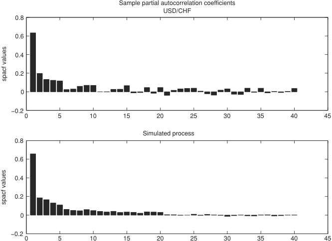

<!-- Start of picture text -->
Sample partial autocorrelation coefficients USD/CHF 0.8 0.6 0.4 0.2 0 −0.2 0 5 10 15 20 25 30 35 40 45 Simulated process 0.8 0.6 0.4 0.2 0 −0.2 0 5 10 15 20 25 30 35 40 45 spacf values spacf values <!-- End of picture text -->

**Figure 5** Comparison of actual (top) and simulated (bottom) partial autocorrelations of daily realized volatility. 

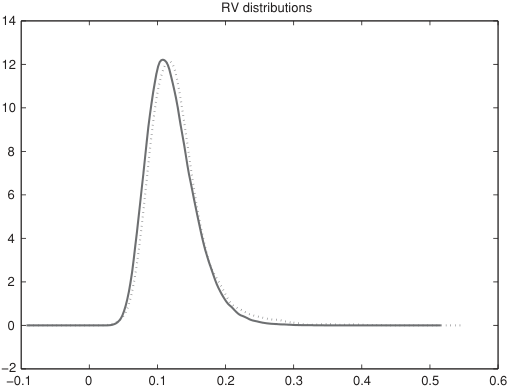

<!-- Start of picture text -->
RV distributions 14 12 10 8 6 4 2 0 −2 −0.1 0 0.1 0.2 0.3 0.4 0.5 0.6 <!-- End of picture text -->

**Figure 6** Comparison of actual (dotted) and simulated (solid) distributions of daily realized volatility.

<!-- page: 13 -->

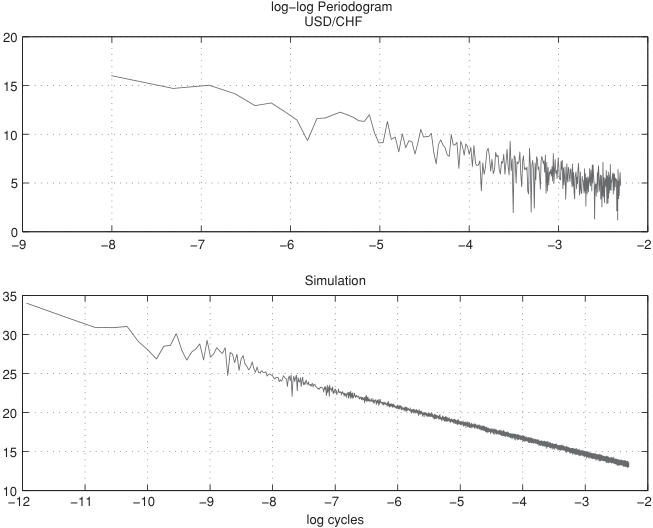

<!-- Start of picture text -->
log−log Periodogram USD/CHF 20 15 10 5 0 −9 −8 −7 −6 −5 −4 −3 −2 Simulation 35 30 25 20 15 10 −12 −11 −10 −9 −8 −7 −6 −5 −4 −3 −2 log cycles <!-- End of picture text -->

**Figure 7** Comparison of actual (top) and simulated (bottom) periodograms of daily returns on log–log plane. 

## **3 EMPIRICAL ANALYSIS** 

## **3.1 Data** 

Our data set consists of long tick-by-tick series for USD/CHF, S&P500 Futures, and 30-year US Treasury Bond Futures. The USD/CHF series covers 14 years from December 1989 to December 2003 of tick-by-tick spot log–arithmic middle prices. Log mid prices are computed as averages of the logarithmic bid and ask quotes obtained from the Reuters FXFX screen. In order to avoid explicitly modeling the seasonal behavior of trading activity induced by the weekend, we exclude all the realized volatility taking place from Friday 21:00 GMT to Sunday 22:00 GMT. For the S&P500 Futures, we dispose of all transactions from January 1990 to July 2007, while for the T-Bond Futures our data series is from January 1990 to October 2003. 

For all three series, we compute daily tick-by-tick realized volatility estimates employing the two scales estimator proposed by Zhang, A¨ıt-Sahalia, and Mykland (2005) with the slower frequency of ten ticks returns. As previously described, the daily realized volatility is aggregated at weekly and monthly scales according to Equation (4) in order to have comparable realized volatility measures over different horizons.

<!-- page: 14 -->

**Table 2** HAR(3) estimation. 

||_RV_(_d_) _t_+1_d_ =_c_ +_β_(_d_)_RV_(_d_) _t_ +_β_(_w_)_RV_(_w_) _t_ +_β_(_m_)_RV_(_m_) _t_ +_ωt_+1_d_||
|---|---|---|
||USD/CHF S&P500|T-Bond|
|_c_|1.121 0.781|1.494|
||(5.404) (4.065)|(6.475)|
|_βd_|0.352 0.372|0.039|
||(13.501) (9.858)|(1.672)|
|_βw_|0.323 0.343|0.412|
||(7.509) (7.263)|(8.941)|
|_βm_|0.235 0.224|0.361|
||(6.301) (6.467)|(7.987)|

_Notes._ In-sample estimation results of the least squares regression of HAR(3) model for USD/CHF exchange data from December 1989 to December 2003 (3599 daily observations), S&P500 Futures from January 1990 to July 2007 (4344 observations), and T-Bond Futures from January 1990 to October 2003 (3391 observations). Reported in parentheses are the _t_ -statistics based on standard errors computed with Newey–West correction for serial correlation of order 5. 

## **3.2 Estimation** 

Following the recent literature on realized volatility, we can consider all the terms in Equation (8) as observed and then easily estimate its parameters _β_(·) by applying simple linear regression. Standard OLS regression estimators are consistent and normally distributed. In order to account for the possible presence of serial correlation in the data, the Newey–West covariance correction for serial correlation is employed. 

Table 2 reports the results of the estimation of the HAR-RV model of Equation (8) for three series. From the values of the _t_ -statistics, it is clear that all the three realized volatilities aggregated over the three different horizons are all highly significant. The only exception is the coefficient of daily realized volatility for the T-Bond. This result may be due to the fact that the time series of the T-Bond realized volatility seems to show a higher level of noise than that of the S&P and USD/CHF,14 due to a lower mean tick arrival frequency and a higher impact of market microstructure. The noisier estimation of the daily realized volatility induces a lack of significance of the daily volatility component, while weekly and monthly realized volatilities, being averages over longer periods, arguably contain less noise and more information on the volatility process and, hence, receive higher weights from the model. 

It is worth noticing that if we accept the interpretation that realized volatilities aggregated over different horizons are reasonable proxies for volatilities generated by the corresponding market components, an interesting by-product of this simple OLS regression is a direct estimate of the market component weights, that is, 

> 14This is confirmed by the comparison of the autocorrelation functions and the much lower _R_ 2s of the HAR estimation.

<!-- page: 15 -->

**Table 3** 

||USD/CHF||S&P500|T-Bond|
|---|---|---|---|---|
|F-test|2.801||3.498|4.585|
||(1.910)||(1.909)|(1.912)|
|||AIC|||
|AR(22)|1.929||2.577|1.898|
|HAR(3)|1.928||2.579|1.903|
|||BIC|||
|AR(22)|1.969||2.611|1.938|
|HAR(3)|1.935||2.585|1.910|

_Note._ Results of the F-test for multiple hypothesis testing between the unrestricted AR(22) model and the restricted HAR(3) model (1% critical values in parentheses) and their respective Akaike information criterion (AIC) and Bayesian information criterion (BIC). 

a ready evaluation of the contribution of each market component to the overall market activity. For instance, in the USD/CHF and S&P500 series, it seems that the importance of the market components decreases with the horizon of the aggregation. Moreover, if a moving window regression is performed, a time series evolution of such weights is easily attained as well. 

As mentioned above, the HAR-RV process is an autoregressive model reparameterized in a parsimonious way by imposing economically meaningful restrictions. We can then evaluate if those restrictions are valid by comparing the restricted HAR model with the unrestricted AR one. Since the HAR model considered here employs monthly realized volatility (which corresponds to 22 working days), the corresponding unrestricted autoregressive model is an AR(22). A multiple hypothesis test based on the difference between restricted and unrestricted residual sums of squares is then computed. The results of these F-tests, together with the information criteria measures for the two models, are reported in Table 3. The F-tests turn out to be significant for the three series,15 while looking at the information criteria gives less clear-cut results: the Akaike information criteria of the unrestricted AR(22) models and those of the HAR(3) are very similar, while on the basis of the Bayesian information criterion (which imposes larger penalty for additional coefficients), the HAR(3) is clearly preferred. 

## **3.3 Forecast** 

The in-sample one-day-ahead forecasts of the model are shown in Figure 8 and Table 4. These forecasts are obtained by first estimating the parameters of the 

> 15Given the high number of restrictions (19) and observations, rejection of the joint test F could somehow be expected. The detailed cause of the rejection of the restrictions is asset dependent. For the S&P, it is probably due to the absence of some minor but still significant frequencies (two days and biweekly). For USD/CHF it is, instead, due to a periodic increase of the regression coefficient every five lags (one week) i.e., coefficients at lag 5, 10, 15, 20 turn out to be slightly higher. For the T-Bond, the reason seems more related to the high instability of the coefficients at higher lags (greater than three weeks).

<!-- page: 16 -->

**Table 4** One-day-ahead in-sample performance. 

||U|SD/CH|F||S&P500|||T-Bond||
|---|---|---|---|---|---|---|---|---|---|
||RMSE|MAE|_R_2|RMSE|MAE|_R_2|RMSE|MAE|_R_2|
|AR(1)|2.803|1.938|0.493|3.927|2.542|0.648|2.770|2.080|0.109|
|AR(3)|2.675|1.830|0.539|3.690|2.364|0.691|2.683|2.010|0.166|
|ARFIMA(5,_d_, 0)|2.649|1.765|0.559|3.611|2.316|0.703|2.580|1.919|0.237|
|HAR(3)|2.607|1.757|0.565|3.605|2.305|0.707|2.576|1.905|0.236|

_Notes._ Comparison of the in-sample performances of the one-day-ahead forecasts of AR(1), AR(3), ARFIMA(5, _d_ , 0), and HAR(3) models for USD/CHF exchange data, S&P500 Futures, and T-Bond Futures. The parameters of the ARFIMA(5, _d_ , 0) model are estimated with a two-step procedure where the fractional coefficient _d_ is first estimated on the full sample with the GPH algorithm followed by an AR(5) fit. Performance measures are the root mean square error (RMSE), the mean absolute error (MAE), and the _R_2 of the Mincer–Zarnowitz regressions. 

models on the full sample and then performing a series of static one-step-ahead forecasts. The visual impression of a quite accurate forecast shown in the top and middle panels of Figure 8 is confirmed by the remarkably high _R_2 of the regression in Table 4. From the right panels of Figure 8, which displays the time series of the forecasting errors, the presence of a significant heteroskedasticity in the residuals is apparent. This remark has led Corsi, Mittnik, Pigorsch, and Pigorsch (2008) to consider more sophisticated estimation procedures that, being able to take into account this GARCH effect in the volatility residuals, may increase the estimation efficiency of the HAR-RV model. 

For comparison purposes other models are added: the AR(1) and AR(3) model of realized volatility as well as a fractionally integrated model for realized volatility as employed by Andersen, Bollerslev, Diebold, and Labys (2003). They propose a fractional differentiation of the realized volatility series with a fractional coefficient _d_ estimated on the full sample through the GPH algorithm followed by an AR(5) fit. Hence, the model is an ARFIMA(5, _d_ , 0) estimated with a two-step procedure. 

In Table 4, the forecasting performances are evaluated on the basis of root mean square error (RMSE) and mean absolute error (MAE). Moreover, following the analysis of Andersen and Bollerslev (1998), Andersen, Bollerslev, and Diebold (2007), and A¨ıt-Sahalia and Mancini (2008), Table 4 also reports the results of the _R_2 of the Mincer-Zarnowitz regressions 

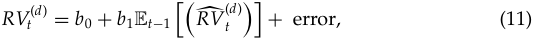

that is, a regression of the ex post realized volatility on a constant and the various model forecasts based on time _t_ − 1 information. In Table 4, the difference in forecasting performance between the standard short-memory models and the ones able to capture the persistence of the empirical data is evident. 

Table 5 and Figure 9 report the results for out-of-sample forecasts of the realized volatility in which the models are reestimated daily on a moving window

<!-- page: 17 -->

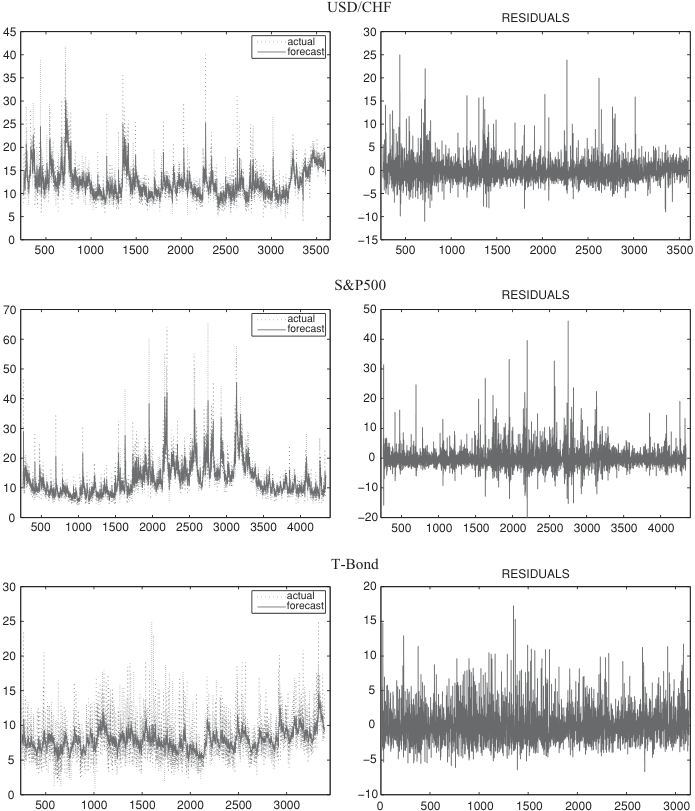

<!-- Start of picture text -->
USD/CHF RESIDUALS 45 30 actual 40 forecast 25 35 20 30 15 25 10 20 5 15 0 10 −5 5 −10 0 −15 500 1000 1500 2000 2500 3000 3500 500 1000 1500 2000 2500 3000 3500 S&P500 RESIDUALS 70 50 actual forecast 60 40 50 30 40 20 30 10 20 0 10 −10 0 −20 500 1000 1500 2000 2500 3000 3500 4000 500 1000 1500 2000 2500 3000 3500 4000 T-Bond RESIDUALS 30 20 actual forecast 25 15 20 10 15 5 10 0 5 −5 0 −10 500 1000 1500 2000 2500 3000 0 500 1000 1500 2000 2500 3000 <!-- End of picture text -->

**Figure 8** Comparisons of actual (dotted) and 1-day-ahead in-sample prediction (solid) of the HAR model for daily realized volatilities (left panels) and the corresponding residuals (right panels). Top: USD/CHF exchange data from December 1989 to July 2003. Middle: S&P500 Futures from January 1990 to July 2007. Bottom: US Treasury Bond Futures from January 1990 to October 2003. 

of 1000 observations. An exception is made for the ARFIMA model for which the fractional difference coefficients _d_ are first estimated on the whole sample and employed to fractionally differentiate the realized volatility series. For the fractional difference operator, we choose the standard cutoff limits of the Taylor expansion of 1000, which for values of _d_ around 0.4 induces a cutoff error of about 4%. After fractional differentiation, the optimal length of the moving window used in the estimation of the AR parameters turns out to be about 250 days. The

<!-- page: 18 -->

**Table 5** Out-of-sample forecasts. 

|||1 day|||1 week|||2 weeks||
|---|---|---|---|---|---|---|---|---|---|
||RMSE|MAE|_R_2|RMSE|MAE|_R_2|RMSE|MAE|_R_2|
|||||U|SD/CHF|||||
|AR(1)|2.540|1.796|0.497|2.699|2.089|0.213|2.764|2.178|0.038|
|AR(3)|2.459|1.699|0.530|2.194|1.673|0.523|2.406|1.909|0.316|
|ARFIMA|2.430|1.674|0.546|1.864|1.362|0.611|1.812|1.360|0.576|
|HAR(3)|2.377|1.622|0.551|1.878|1.361 S&P500|0.609|1.829|1.381|0.570|
|AR(1)|4.170|2.669|0.640|4.878|3.550|0.323|5.273|4.012|0.166|
|AR(3)|3.953|2.518|0.680|3.783|2.583|0.613|4.381|3.184|0.408|
|ARFIMA|4.085|2.762|0.651|3.409|2.403|0.678|3.502|2.478|0.633|
|HAR(3)|3.873|2.475|0.696|3.352|2.237|0.698|3.539|2.437|0.627|
||||||T-Bond|||||
|AR(1)|2.746|2.044|0.152|1.971|1.505|0.076|1.797|1.388|0.075|
|AR(3)|2.672|1.984|0.197|1.820|1.396|0.246|2.406|1.909|0.316|
|ARFIMA|2.587|1.914|0.256|1.505|1.140|0.442|1.371|1.024|0.445|
|HAR(3)|2.568|1.886|0.264|1.516|1.153|0.440|1.401|1.052|0.438|

_Notes._ Comparison of the out-of-sample performances of the 1-day-, 1-week-, and 2-week-ahead forecasts of the AR(1), AR(3), ARFIMA(5, _d_ , 0), and HAR(3) models for USD/CHF exchange data, S&P500 Futures, and T-Bond Futures. The AR(1), AR(3), and HAR(3) are daily reestimated on a moving window of 1000 observations. For the ARFIMA(5, _d_ , 0), the coefficient of fractional integration _d_ is preestimated on the whole sample. After fraction differentiation with a cutoff limit of the Taylor expansion of 1000, the optimal length of the moving window for the estimation of the AR(5) parameters is around 250 days. Performance measures are the root mean square error (RMSE), the mean absolute error (MAE), and the _R_2 of the Mincer–Zarnowitz regressions. The multistep-ahead forecasts are evaluated comparing the aggregated realized and predicted volatility over the multiperiod horizon. 

forecasting performances are compared over three different time horizons: one day, one week, and two weeks. The multistep-ahead forecasts are evaluated considering the aggregated volatility realized and predicted over the multiperiod horizon. For an _h_ -step-ahead forecast, the target function is then�_h_ _j_ =0_RV_ _t_( +_d_ _j_)and the Mincer–Zarnowitz regression becomes 

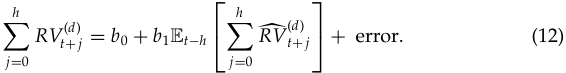

Out-of-sample, it turns out that the parsimonious HAR(3) model steadily outperforms the short-memory models at all the three time horizons considered (one day, one week, and two weeks) and compares similarly to the true long-memory ARFIMA model. It is noteworthy that though the superior performance of the ARFIMA and HAR(3) was already apparent at daily horizon, it becomes striking at weekly and biweekly horizons. The reason is that the AR(1) and AR(3) models

<!-- page: 19 -->

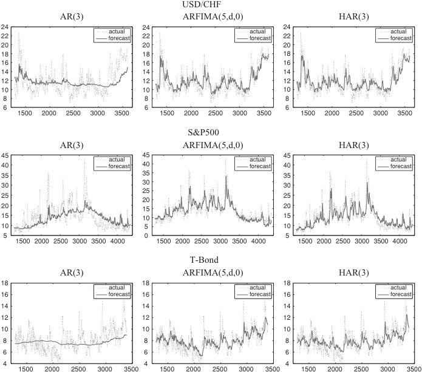

<!-- Start of picture text -->
USD/CHF AR(3) ARFIMA(5,d,0) HAR(3) 24 24 24 actual actual actual 22 forecast 22 forecast 22 forecast 20 20 20 18 18 18 16 16 16 14 14 14 12 12 12 10 10 10 8 8 8 6 6 6 1500 2000 2500 3000 3500 1500 2000 2500 3000 3500 1500 2000 2500 3000 3500 S&P500 AR(3) ARFIMA(5,d,0) HAR(3) 45 45 45 actual actual actual 40 forecast 40 forecast 40 forecast 35 35 35 30 30 30 25 25 25 20 20 15 20 15 10 15 10 5 10 5 0 5 1500 2000 2500 3000 3500 4000 1500 2000 2500 3000 3500 4000 1500 2000 2500 3000 3500 4000 T-Bond AR(3) ARFIMA(5,d,0) HAR(3) 18 18 18 actual actual actual 16 forecast 16 forecast 16 forecast 14 14 14 12 12 12 10 10 10 8 8 8 6 6 6 4 4 4 1500 2000 2500 3000 3500 1500 2000 2500 3000 3500 1500 2000 2500 3000 3500 <!-- End of picture text -->

**Figure 9** Comparison of the out-of-sample performances of 2-week-ahead forecasts of the AR(3), ARFIMA(5, _d_ , 0), and HAR(3) models for USD/CHF exchange data (top), S&P500 Futures (middle), and T-Bond Futures (bottom). The continuous line is the aggregated prediction, while the dotted line is the ex post aggregated realized volatility over a 2-week period. The AR(3) and HAR(3) are daily reestimated on a moving window of 1000 observations. For the ARFIMA(5, _d_ , 0), the fractional difference parameter _d_ is preestimated on the whole sample. After fraction differentiation with a cutoff limit of 1000, the optimal length of the moving window for the estimation of the AR(5) parameters is around 250 days. 

have a memory which is too short compared to the forecasting horizon and hence converge too quickly to their unconditional mean for longer forecasting horizons. 

This explanation is confirmed by Figure 9 which compares the dynamic behavior of the different models for the two-week forecasting periods. For this time horizon, the importance of long memory becomes manifest. What is surprising is the ability of the HAR-RV model to attain these results with only a few parameters. 

Confronting the results of the HAR(3) and ARFIMA(5, _d_ ,0), Table 5 shows that the performances of the two models are comparable (with a slight advantage for the HAR model for daily and weekly horizons and for the ARFIMA for the biweekly

<!-- page: 20 -->

horizon).16 However, it should be noted that while the HAR model is extremely simple and straightforward to implement (even on a daily moving window), the ARFIMA model is much more cumbersome and complicated (especially on moving windows). Moreover, ARFIMA model estimation and forecasts are quite sensitive to the choice of the Taylor expansion cutoff limit of the fractional difference operator and, for the GPH estimation of _d_ , also quite sensitive to the choice of the frequency cut off. 

## **4 CONCLUSIONS** 

We propose a volatility model in which an additive volatility cascade inspired by the Heterogeneous Market Hypothesis leads to a simple AR-type model in the realized volatility. This model has the feature of considering volatilities realized over different interval sizes. We term this model HAR-RV. The new HAR-RV model seems to successfully achieve the purpose of modeling the long-memory behavior of volatility in a very simple and parsimonious way (although not formally belonging to the class of long-memory models). Moreover, in spite of the simplicity of its structure and estimation, the HAR-RV model shows remarkably good forecasting performance. Based on the out-of-sample forecasting results for the three long series of realized volatilities of USD/CHF, S&P500, and T-Bond, the HAR(3) model steadily outperforms the short-memory models at all the time horizons considered (one day, one week, and two weeks) and is comparable to the much more complicated and tedious to estimate long-memory ARFIMA model. 

The simplicity of the proposed model allows it to be easily extended in various directions. Other statistically and economically significant variables could be simply added as additional regressors. For example, different measures of jumps could be included (after separating them from the continuous volatility components) as in Andersen et al. (2007) and Corsi, Pirino, and Ren`o (2008). Leverage effects can be considered by simply adding lagged positive and negative returns as regressors (see Corsi and Ren`o 2008). Extensions of the HAR model to account for nonlinear effects can be obtained by combining it with smooth transition or tree-structured models as in McAleer and Medeiros (2008) and Audrino and Corsi (2008), respectively. The same logic based on heterogeneous components can be applied to other different models such as the alternative approach to modeling and forecasting realized volatility proposed in the Multiplicative Error Models of Engle and Gallo (2006). Moreover, its simple autoregressive structure suggests a natural way to extend it to the multivariate case by developing a Vector-HAR model analogous to the standard VAR model as in Bauer and Vorkink (2007). 

_Received July 7, 2008; revised December 31, 2008; accepted January 14, 2009._ 

> 16It should be recalled, however, that the ARFIMA forecasts are not truly out of sample, since the fractional difference coefficient _d_ is estimated on the whole sample.

<!-- page: 21 -->

## **REFERENCES** 

- A¨ıt-Sahalia, Y., and L. Mancini. 2008. “Out of sample forecasts of quadratic variation.” _Journal of Econometrics_ 147: 17–33. 

- Alfarano, S., and T. Lux. 2007. “A noise trader model as a generator of apparent financial power laws and long memory.” _Macroeconomic Dynamics_ 11: 80–101. 

- Andersen, T. G., and T. Bollerslev. 1997. “Heterogeneous information arrivals and return volatility dynamics: Uncovering the long run in high frequency data.” _Journal of Finance_ 52: 975–1005. 

- Andersen, T. G., and T. Bollerslev. 1998. “Answering the skeptics: Yes, standard volatility models do provide accurate forecasts.” _International Economic Review_ 39: 885–905. 

- Andersen, T. G., T. Bollerslev, and F. X. Diebold. 2007. “Roughing it up: Including jump components in the measurement, modeling, and forecasting of return volatility.” _The Review of Economic and Statistics_ 89(4), 701–720. 

- Andersen, T. G., T. Bollerslev, F. X. Diebold, and H. Ebens. 2001. “The distribution of stock returns volatilities.” _Journal of Financial Economics_ 61: 43–76. 

- Andersen, T. G., T. Bollerslev, F. X. Diebold, and P. Labys. 2001. “The distribution of realized exchange rate volatility.” _Journal of the American Statistical Association_ 96: 42–55. 

- Andersen, T. G., T. Bollerslev, F. X. Diebold, and P. Labys. 2003. “Modeling and forecasting realized volatility.” _Econometrica_ 71: 579–625. 

- Arneodo, A., J. Muzy, and D. Sornette. 1998. “Causal cascade in stock market from the ‘infrared’ to the ‘ultraviolet’.” _European Physical Journal,_ B 2: 277–282. 

- Audrino, F., and F. Corsi. 2008. “Modeling tick-by-tick realized correlations.” University of St. Gallen, Department of Economics, Discussion paper No. 2008-05. 

- Barndorff-Nielsen, O., and N. Shephard. 2002a. “Econometric analysis of realized volatility and its use in estimating stochastic volatility models.” _Journal of the Royal Statistical Society,_ B 64: 253–280. 

- Barndorff-Nielsen, O., and N. Shephard. 2002b. “Estimating quadratic variation using realized variance.” _Journal of Applied Econometrics_ 17: 457–477. 

- Bauer, G., and K. Vorkink. 2007. “Multivariate realized stock market volatility.” Working paper, Bank of Canada. 

- Breymann, W., S. Ghashghaie, and P. Talkner. 2000. “A stochastic cascade model for FX dynamics.” _International Journal of Theoretical and Applied Finance_ 3: 357– 360. 

- Calvet, L., and A. Fisher. 2004. “How to forecast long-run volatility: Regime switching and the estimation of multifractal processes.” _Journal of Financial Econometrics_ 2: 49–83. 

- Calvet, L., and A. Fisher. 2007. “Multifrequency news and stock returns.” _Journal of Financial Economics_ 86: 178–212. 

- Comte, F., and E. Renault. 1998. “Long memory in continuous time stochastic volatility models.” _Mathematical Finance_ 8: 291–323. 

- Corsi, F., S. Mittnik, C. Pigorsch, and U. Pigorsch. 2008. “The volatility of realized volatility.” _Econometric Reviews_ 27: 46–78. 

- Corsi, F., D. Pirino, and R. Ren`o. 2008. “Volatility forecasting: The jumps do matter.” Working paper, University of Siena.

<!-- page: 22 -->

- Corsi, F., and R. Ren`o. 2008. “Volatility components: Heterogeneity, leverage, and jumps.” Working paper, University of Siena. 

- Dacorogna, M., U. M¨uller, R. Dav, R. Olsen, and O. Pictet. 1998. “Modelling shortterm volatility with GARCH and HARCH models.” In _Nonlinear Modelling of High Frequency Financial Time Series_ , _ed_ . C. Dunis and B. Zhou, 161–76. Chichester, UK: Wiley. 

- Dacorogna, M. M., R. Genay, U. A. M¨uller, R. B. Olsen, and O. V. Pictet. 2001. _An Introduction to High-Frequency Finance_ . San Diego, CA: Academic Press. 

- Ding, Z., C. Granger, and R. Engle. 1993. “A long memory property of stock market returns and a new model.” _Journal of Empirical Finance_ 1: 83–106. 

- Engle, R., and G. Gallo. 2006. “A multiple indicators model for volatility using intradaily data.” _Journal of Econometrics_ 131: 3–27. 

- Forsberg, L., and E. Ghysels. 2007. “Why do absolute returns predict volatility so well?” _Journal of Financial Econometrics_ 5: 31–67. 

- Genc¸ay, R., and F. Selc¸uk. (2004). “Asymmetry of information flow between volatilities across time scales.” North American Winter Meetings 90, Econometric Society. 

- Ghashghaie, S., W. Breymann, J. Peinke, P. Talkner, and Y. Dodge. 1996. “Turbulent cascades in foreign exchange markets.” _Nature_ 381: 767–770. 

- Ghysels, E., P. Santa-Clara, and R. Valkanov. 2006. “Predicting volatility: Getting the most out of return data sampled at different frequencies.” _Journal of Econometrics_ 131: 59–95. 

- Ghysels, E., A. Sinko, and R. Valkanov. 2006. “Midas regressions: Further results and new directions.” _Econometric Reviews_ 26: 53–90. 

- Granger, C. 1980. “Long memory relationships and the aggregation of dynamic models.” _Journal of Econometrics_ 14: 227–238. 

- LeBaron, B. 2001. “Stochastic volatility as a simple generator of financial power laws and long memory.” _Quantitative Finance_ 1: 621–631. 

- LeBaron, B. 2006. “Agent-based financial markets: Matching stylized facts with style.” In _Post Walrasian Macroeconomics: Beyond the DSGE Model_ , _ed._ D. Colander, 221–235. Cambridge, UK: Cambridge University Press. 

- Lobato, I., and N. Savin. 1998. “Real and spurious long-memory properties of stock market data.” _Journal of Business and Economic Statistics_ 16: 261–283. 

- Lux, T., and M. Marchesi. 1999. “Scaling and criticality in a stochastic multi-agent model _Nature_ 397: 498–500. 

- Lynch, P., and G. Zumbach. 2003. “Market heterogeneities and the causal structure of volatility.” _Quantitative Finance_ 3: 320–331. 

- McAleer, M., and M. Medeiros. 2008. “A multiple regime smooth transition heterogeneous autoregressive model for long memory and asymmetries.” _Journal of Econometrics_ 147: 104–119. 

- M¨uller, U., M. Dacorogna, R. Dav, R. Olsen, O. Pictet, and J. von Weizsacker. 1997. “Volatilities of different time resolutions – Analysing the dynamics of market components.” _Journal of Empirical Finance_ 4: 213–239. 

- M¨uller, U., M. Dacorogna, R. Dav, O. Pictet, R. Olsen, and J. Ward. 1993. “Fractals and intrinsic time – A challenge to econometricians.” 39th International AEA Conference on Real Time Econometrics, 14–15 October 1993, Luxembourg. 

- Peters, E. 1994. _Fractal Market Analysis_ . New York: Wiley.

<!-- page: 23 -->

- Rossi, A., and G. Gallo. 2006. “Volatility estimation via hidden Markov models.” _Journal of Empirical Finance_ 13: 203–230. 

- Zhang, L., Y. A¨ıt-Sahalia, and P. A. Mykland. 2005. “A tale of two time scales: Determining integrated volatility with noisy high frequency data.” _Journal of the American Statistical Association_ 100: 1394–1411.
