<!-- page: 1 -->

## **Incorporating Functional Knowledge in Neural Networks** 

#### **Charles Dugas** 

DUGAS@DMS.UMONTREAL.CA 

_Department of Mathematics and Statistic Universit´e de Montr´eal 2920 Chemin de la tour, suite 5190 Montreal, Qc, Canada H3T 1J4_ 

#### **Yoshua Bengio** 

BENGIOY@IRO.UMONTREAL.CA 

_Department of Computer Science and Operations Research Universit´e de Montr´eal 2920 Chemin de la tour, suite 2194 Montreal, Qc, Canada H3A 1J4_ 

#### **Franc¸ois B´elisle Claude Nadeau** 

BELISLE.FRANCOIS@GMAIL.COM CLAUDE NADEAU@HC-SC.GC.CA 

_Health Canada Tunney’s Pasture, PL 0913A Ottawa, On, Canada K1A 0K9_ 

#### **Ren´e Garcia** 

GARCIAR@CIRANO.QC.CA 

_CIRANO 2020 rue University, 25e ´etage Montr´eal, Qc, Canada H3A 2A5_ 

**Editor:** Peter Bartlett 

### **Abstract** 

Incorporating prior knowledge of a particular task into the architecture of a learning algorithm can greatly improve generalization performance. We study here a case where we know that the function to be learned is non-decreasing in its two arguments and convex in one of them. For this purpose we propose a class of functions similar to multi-layer neural networks but (1) that has those properties, (2) is a universal approximator of Lipschitz1 functions with these and other properties. We apply this new class of functions to the task of modelling the price of call options. Experiments show improvements on regressing the price of call options using the new types of function classes that incorporate the _a priori_ constraints. 

**Keywords:** neural networks, universal approximation, monotonicity, convexity, call options 

### **1. Introduction** 

Incorporating _a priori_ knowledge of a particular task into a learning algorithm helps reduce the necessary complexity of the learner and generally improves performance, if the incorporated knowledge is relevant to the task and brings enough information about the unknown generating process of the data. In this paper we consider prior knowledge on the positivity of some first and second derivatives of the function to be learned. In particular such constraints have applications to modelling 

> 1. A function _f_ is Lipschitz in Ω if ∃ _c_ > 0, ∀ _x_ , _y_ ∈ Ω , | _f_ ( _y_ ) − _f_ ( _x_ )| ≤ _c_ | _y_ − _x_ | (Delfour and Zol´esio, 2001).

<!-- page: 2 -->

the price of stock options. Based on the Black-Scholes formula, the price of a call stock option is monotonically increasing in both the “moneyness” and time to maturity of the option, and it is convex in the “moneyness”. Section 4 better explains these terms and stock options. For a function _f_ ( _x_ 1, _x_ 2) of two real-valued arguments, this corresponds to the following properties: 

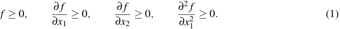

The mathematical results of this paper (Section 2) are the following: we introduce a class of one-argument functions that is positive, non-decreasing and convex in its argument. Second, we use this new class of functions as a building block to design another class of functions that is a universal approximator for functions with positive outputs. Third, once again using the first class of functions, we design a third class that is a universal approximator to functions of two or more arguments, with the set of arguments partitioned in two groups: those arguments for which the second derivative is known positive and those arguments for which we have no prior knowledge on the second derivative. The first derivative is positive for any argument. The universality property of the third class rests on additional constraints on cross-derivatives, which we illustrate below for the case of two arguments: 

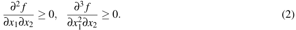

Thus, we assume that _f_ ∈ _C_3 , the set of functions three times continuously differentiable. Comparative experiments on these new classes of functions were performed on stock option prices, showing improvements when using these new classes rather than ordinary feedforward neural networks. The improvements appear to be non-stationary but the new class of functions shows the most stable behavior in predicting future prices. Detailed experimental results are presented in section 6. 

### **2. Theory** 

**Definition 1** _A class of functions F_ˆ _from_ R_n_ _to_ R _is a_ **universal approximator** _for a class of functions F from_ R_n_ _to_ R _if for any f_ ∈ _F , any compact domain D_ ⊂ R_n_ _, and any positive_ ε _, one can find a f_ˆ ∈ _F_ˆ _with_ sup _x_ ∈ _D_ | _f_ ( _x_ ) − _f_ˆ ( _x_ )| ≤ ε _._ 

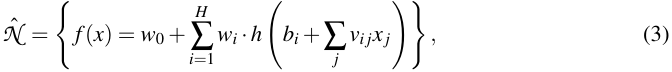

for example, with a sigmoid activation function _h_ ( _s_ ) = 1/(1 + _e_−_s_ ), is a universal approximator of continuous functions (Cybenko, 1988, 1989; Hornik et al., 1989; Barron, 1993). Furthermore, Leshno et al. (1993) have shown that any non-polynomial activation function will suffice for universal approximation. The number of hidden units _H_ of the neural network is a hyper-parameter that controls the accuracy of the approximation and it should be chosen to balance the trade-off (see also Moody, 1994) between accuracy (bias of the class of functions) and variance (due to the finite sample used to estimate the parameters of the model). Because of this trade-off, in the finite sample

<!-- page: 3 -->

case, it may be advantageous to consider a “simpler” class of functions that is appropriate to the task. 

Since the sigmoid _h_ is monotonically increasing ( _h_′ ( _s_ ) = _h_ ( _s_ )(1 − _h_ ( _s_ )) > 0), it is easy to force the first derivatives with respect to _x_ to be positive by forcing the weights to be positive, for example with the exponential function: 

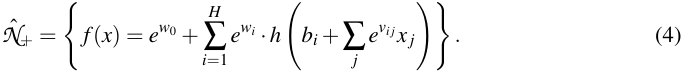

Note that the positivity of _f_ ( _x_ ) and _f_′ ( _x_ ) is not affected by the values of the { _bi_ } parameters. Since the sigmoid _h_ has a positive first derivative, its primitive, which we call _softplus_ , is convex: 

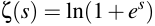

where ln(·) is the natural logarithm operator. Note that _d_ ζ ( _s_ )/ _ds_ = _h_ ( _s_ ) = 1/(1 + _e_−_s_ ). 

#### **2.1 Universality for Functions with Positive Outputs** 

positive outputs: 

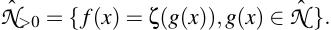

**Theorem 2** ˆ _Within the set of continuous functions from_ R_n_ _to_ R+ = { _x_ : _x_ ∈ R, _x_ > 0} _, the class N_ >0 _is a universal approximator._ 

**Proof** Consider a positive function _f_ ( _x_ ), which we want to approximate arbitrarily well. Consider ˆ _g_ ( _x_ ) = ζ−1 ( _f_ ( _x_ )) = ln( _e__f_(_x_) − 1), the inverse softplus transform of _f_ ( _x_ ). Choose _g_ ( _x_ ) from _N_ˆ such ˆ that sup _x_ ∈ _D_ | _g_ ( _x_ ) − _g_ ( _x_ )| ≤ ε , where _D_ is any compact domain over R_n_ and ε is any positive real ˆ number. The existence of _g_ ( _x_ ) is ensured by the universality property of _N_ˆ . Set _f_ˆ ( _x_ ) = ζ ( _g_ ˆ( _x_ )) = ln(1 + _e__g_ˆ(_x_) ). Consider any particular _x_ and define _a_ = min( _g_ ˆ( _x_ ), _g_ ( _x_ )) and _b_ = max( _g_ ˆ( _x_ ), _g_ ( _x_ )). Since _b_ − _a_ ≤ ε , we have, 

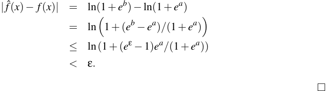

Thus, the use of the softplus function to transform the output of a regular one hidden layer artificial neural network ensures the positivity of the final output without hindering the universality property. 

#### **2.2 The Class** _c_ , _nN_ˆ ++ 

In this section, we use the softplus function, tive outputs, positive first derivatives w.r.t. all input variables and positive second derivatives w.r.t.

<!-- page: 4 -->

some of the input variables. The basic idea is to replace the sigmoid of a sum by a product of either softplus or sigmoid functions over each of the dimensions (using the softplus over the convex dimensions and the sigmoid over the others): 

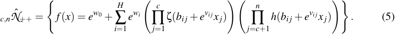

_x j_ are positive, and the second derivatives w.r.t. _x j_ for _j_ ≤ _c_ are positive. However, this class of functions has other properties that are summarized by the following: 

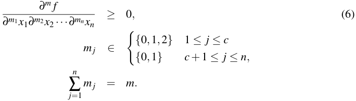

Here, we have assumed that _f_ ∈ _C__c_+_n_ , the set of functions that are _c_ + _n_ times continuously differentiable. We will also restrict ourselves to Lispschitz functions since the proof of the theorem relies on the fact that the derivative of the function is bounded. The set of functions that respect these derivative conditions will be referred to as _c_ , _nF_ˆ ++. Note that, as special cases we find that _f_ is positive ( _m_ = 0), and that it is monotonically increasing w.r.t. any of its inputs ( _m_ = 1), and convex w.r.t. the first _c_ inputs ( _m_ = 2, ∃ _j_ : _m j_ = 2). Also note that, when applied to our particular case where _n_ = 2 and _c_ = 1, this set of equations corresponds to Equations (1) and (2). We now state the main universality theorem: 

**Theorem 3** _Within the set c_ , _nF_ˆ ++ _of Lipschitz functions from_ R_n_ _to_ R _whose set of derivatives as specified by Equation_ (6) _are non-negative, the class c_ , _nN_ˆ ++ _is a universal approximator._ The proof of the theorem is given in Section A. 

#### **2.3 Parameter Optimization** 

In our experiments, conjugate gradient descent was used to optimize the parameters of the model. The backpropagation equations are obtained as the derivatives of _f_ ∈ _c_ , _nN_ˆ ++ (Equation 5) w.r.t. to its parameters. Let _zi_ , _j_ = _bij_ + _e__vi j_ _x j_ , _ui_ = _e__wi_ ( ∏_c_ _j_ =1ζ(_zi_,_j_))(∏_n_ _j_ = _c_ +1_h_(_zij_))and_f_=_ew_0 +∑_H_ _i_ =1_ui_. Then, we have 

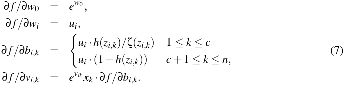

Except for terms _h_ ( _zi_ , _k_ ), _k_ ≤ _c_ of Equation (7), all values are computed through the forward phase, that is, while computing the value of _f_ . Error backpropagation can thus be performed efficiently if

<!-- page: 5 -->

careful attention is paid, during the forward phase, to store the values to be reused in the backpropagation phase. 

Software implementing parameter optimization of the proposed architecture and the numerical experiments of the following section is available on-line.2 Code was written using the “R” statistical software package.3 

### **3.** 

In this section, we present a series of controlled experiments in order to assess the potential improvements that can be gained from using the proposed architecture in cases where some derivatives of the target function are known to be positive. The emphasis is put on analyzing the evolution of the model bias and model variance values w.r.t. various noise levels and training set sizes. 

The function we shall attempt to learn is 

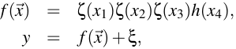

where ζ (·) _h_ (·) is the sigmoid function. The input values are drawn from a uniform distribution over the [0,1] interval, that is, _xi_ ∼ _U_ (0, 1). The noise term ξ is added to the true function _f_ ( _x_ ) to generate the target value _y_ . Finally, ξ ∼ _N_ (0, σ2 ), that is, we used additive Gaussian noise. Different values for σ have been tested. 

For each combination of noise level ( σ ∈{1e-2, 3e-2, 1e-1}) and training set size (25, 50, 100, 200, 400), we chose the best performing combination of number of hidden units and weight decay. In order to perform model selection, 100 models were trained using different random training sets, for each combination. Based on validation set performance, 50 models were retained and their validation set performances were averaged. The best performing combination was chosen based on this average validation performance. Bias and variance were measured using these 50 selected models when applied on another testset of 10000 examples. In each case, the number of training epochs was 10000. The process was repeated for two architectures: the proposed architecture of products of softplus and sigmoid functions over input dimensions with constrained weights (CPSD) and regular unconstrained multi-layered perceptrons with a single hidden layer (UMLP). 

average of the _ND_ = 50 model outputs: 

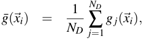

where _g j_ ( _xi_ ) is the output of the _j__th_ model associated to the _i__th_ input vector _xi_ . 

The variance was unbiasedly approximated as the average over all test examples ( _Ni_ = 10000), of the sample variance of model outputs _g j_ ( _xi_ ) w.r.t. the corresponding mean output _g_ ¯( _xi_ ): 

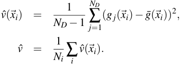

> 2. Software can be found at `http://www.dms.umontreal.ca/˜dugas/convex/` . 

> 3. Code found at `http://www.r-project.org/` .

<!-- page: 6 -->

The bias was unbiasedly estimated as the average over all test examples, of the squared deviation of the mean output _g_ ¯( _xi_ ) w.r.t. the known true function value _f_ ( _xi_ ), less a variance term: 

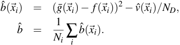

Let _b_ ( _xi_ ) = ( _EG_ ( _g_ ( _xi_ )) − _f_ ( _xi_ ))2 be the true bias, at point _xi_ where _EG_ () denotes expectation taken over training set distribution, which induces a distribution of the function _g_ produced by the learning algorithm. Let us show that _EG_ ( _b_ˆ ( _xi_ )) = _b_ ( _xi_ ): 

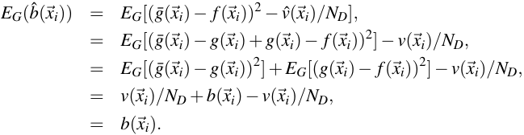

Table 1 reports the results for these simulations. In all cases, the bias and variance are lower for the proposed architecture than for a regular neural network architecture, which is the result we expected. The variance reduction is easy to understand because of the appropriate constraints on the class of functions. The bias reduction, we conjecture to be a side effect of the bias-variance tradeoff being performed by the model selection on the validation set: to achieve a lower validation error, a larger bias is needed with the unconstrained artificial neural network. The improvements are generally more important for smaller sample sizes. A possible explanation is that the proposed architecture helps reduce the variance of the estimator. With small sample sizes, this is very beneficial and becomes less important as the number of points increases. 

### **4. Estimating Call Option Prices** 

An option is a contract between two parties that entitles the buyer to a claim at a future date _T_ that depends on the future price, _ST_ of an underlying asset whose price at current time _t_ is _St_ . In this paper we consider the very common European call options, in which the buyer (holder) of the option obtains the right to buy the asset at a fixed price _K_ called the strike price. This purchase can only occur at maturity date (time _T_ ). Thus, if at maturity, the price of the asset _ST_ is above the strike price _K_ , the holder of the option can _exercise_ his option and buy the asset at price _K_ , then sell it back on the market at price _ST_ , thus making a profit of _ST_ − _K_ . If, on the other hand, the price of the asset at maturity _ST_ is below the strike price _K_ , then the holder of the option has no interest in exercising his option (and does not have to) and the option simply expires worthless and unexercised. For this reason, the option is considered to be worth max(0, _ST_ − _K_ ) at maturity and our goal is to estimate _Ct_ , the value of that worth at current time _t_ . 

In the econometric literature, the call function is often expressed in terms of the primary economic variables that influence its value: the actual market price of the security ( _St_ ), the strike price ( _K_ ), the remaining time to maturity ( τ = _T_ − _t_ ), the risk free interest rate ( _r_ ), and the volatility of the return ( σ ). One important result is that under mild conditions, the call option function is homogeneous of degree one with respect to the strike price and so we can perform dimensionality reduction

<!-- page: 7 -->

#### **Bias and Variance Analy** 

|Ntrain|Noise|Architecture|Bias|Variance|Sum|
|---|---|---|---|---|---|
||1e-02|UMLP|2.31e-04|9.20e-05|3.23e-04|
|||CPSD|**1.04e-04**|**3.97e-05**|**1.43e-04**|
|25|3e-02|UMLP|1.06e-03|3.46e-04|1.40e-03|
|||CPSD|**9.37e-04**|**2.30e-04**|**1.17e-03**|
||1e-01|UMLP|1.07e-02|2.68e-03|1.33e-02|
|||CPSD|**1.02e-02**|**2.45e-03**|**1.27e-02**|
||1e-02|UMLP|1.55e-04|9.41e-05|2.49e-04|
|||CPSD|**1.03e-04**|**1.99e-05**|**1.23e-04**|
|50|3e-02|UMLP|1.05e-03|1.28e-04|1.18e-03|
|||CPSD|**9.35e-04**|**9.29e-05**|**1.03e-03**|
||1e-01|UMLP|1.03e-02|1.22e-03|1.15e-02|
|||CPSD|**1.02e-02**|**1.11e-03**|**1.13e-02**|
||1e-02|UMLP|1.27e-04|3.98e-05|1.67e-04|
|||CPSD|**1.02e-04**|**1.01e-05**|**1.12e-04**|
|100|3e-02|UMLP|9.82e-04|2.11e-04|1.19e-03|
|||CPSD|**9.39e-04**|**4.77e-05**|**9.87e-04**|
||1e-01|UMLP|1.04e-02|6.28e-04|1.10e-02|
|||CPSD|**1.02e-02**|**5.30e-04**|**1.07e-02**|
||1e-02|UMLP|1.07e-04|2.24e-05|1.29e-04|
|||CPSD|**1.02e-04**|**5.01e-06**|**1.07e-04**|
|200|3e-02|UMLP|9.45e-04|1.10e-04|1.05e-03|
|||CPSD|**9.15e-04**|**4.31e-05**|**9.58e-04**|
||1e-01|UMLP|1.03e-02|3.38e-04|1.07e-02|
|||CPSD|**1.02e-02**|**3.21e-04**|**1.05e-02**|
||1e-02|UMLP|1.03e-04|1.14e-05|1.15e-04|
|||CPSD|**1.02e-04**|**2.41e-06**|**1.04e-04**|
|400|3e-02|UMLP|9.32e-04|6.15e-05|9.94e-04|
|||CPSD|**9.15e-04**|**2.10e-05**|**9.36e-04**|
||101|UMLP|1.04e-02|1.75e-04|1.05e-02|
||e-|CPSD|**1.02e-02**|**1.43e-04**|**1.03e-02**|

Table 1: Comparison of the bias and variance values for two neural network architectures, three levels of noise, and five sizes of training sets (Ntrain), using artificial data. In bold, the best performance between the two models. 

by letting our approximating function depend on the “moneyness” ratio ( _M_ = _St_ / _K_ ) instead of the current asset price _St_ and the strike price _K_ independently. We must then modify the target to be the price of the option divided by the strike price: _Ct_ / _K_ . 

Most of the research on call option modelling relies on strong parametric assumptions of the underlying asset price dynamics. Any misspecification of the stochastic process for the asset price will

<!-- page: 8 -->

lead to systematic mispricings for any option based on the asset (Hutchinson et al., 1994). The wellknown Black-Scholes formula (Black and Scholes, 1973) is a consequence of such specifications and other assumptions: 

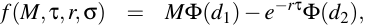

where Φ (·) is the cumulative Gaussian function evaluated in points 

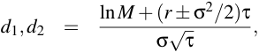

that is, _d_ 1 = _d_ 2 + σ~~√~~ τ . In particular, two assumptions on which this formula relies have been challenged by empirical evidence: the assumed lognormality of returns on the asset and the assumed constance of volatility over time. 

On the other hand, nonparametric models such as neural networks do not rely on such strong assumptions and are therefore robust to model specification errors and their consequences on option modelling and this motivates research in the direction of applying nonparametric techniques for option modelling. 

risk free interest rate ( _r_ ) needs to be somehow extracted from the term structure of interest rates and the volatility ( σ ) needs to be forecasted. This latter task is a field of research in itself. Dugas et al. (2000) have previously tried to feed in neural networks with estimates of the volatility using historical averages but the gains have remained insignificant. We therefore drop these two features and rely on the ones that can be observed ( _St_ , _K_ , τ ) to obtain the following: 

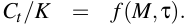

The novelty of our approach is to account for properties of the call option function as stated in Equation (1). These properties derive from simple arbitrage pricing theory.4 Now even though we know the call option function to respect these properties, we do not know if it does respect the additional cross derivative properties of Equation (2). In order to gain some insight in this direction, we confront the Black-Scholes formula to our set of constraints: 

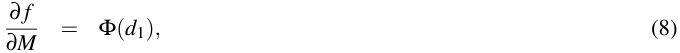

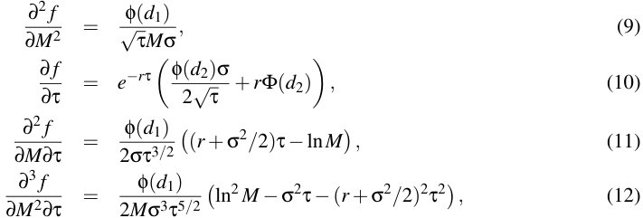

where φ (·) is the Gaussian density function. Equations (8), (9) and (10) that the BlackScholes formula is in accordance with our prior knowledge of the call option function: all three 

> 4. The convexity of the call option w.r.t. the moneyness is a consequence of the strategy (Garcia and Genc¸ay, 1998).

<!-- page: 9 -->

derivatives are positive. Equations (11) and (12) are the cross derivatives which will be positive for any function chosen from 1,2 _N_ˆ ++. When applied to the Black-Scholes formula, it is less clear whether these values are positive, too. In particular, one can easily see that both cross derivatives can not be simultaneously positive. Thus, the Black-Scholes formula is not within the set 1,2 _F_ˆ ++. Then again, it is known that the Black-Scholes formula does not adequately represent the market pricing of options, but it is considered as a useful guide for evaluating call option prices. So, we do not know if these constraints on the cross derivatives are present in the true price function. 

Nonetheless, even if these additional constraints are not respected by the true function on all of its domain, one can hope that the increase in the bias of the estimator due to the constraints will be offset (because we are searching in a smaller function space) by a decrease in the variance of that estimator and that overall, the mean-squared error will decrease. This strategy has often been used successfully in machine learning (e.g., regularization, feature selection, smoothing). 

### **5. Experimental Setup** 

As a reference model, we use a simple multi-layered perceptron with one hidden layer (Equation 3). For **UMLP models** , weights are left unconstrained whereas for **CMLP models** , weights are constrained, through exponentiation, to be positive. We also compare our results with a recently proposed model (Garcia and Genc¸ay, 1998) that closely resembles the Black-Scholes formula for option pricing (i.e., another way to incorporate possibly useful prior knowledge): 

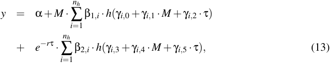

with inputs _M_ , τ , parameters _r_ , α , β , γ and hyperparameter _nh_ (number of hidden units). We shall refer to Equation (13) as the **UBS models** . Constraining the weights of Equation (13) through exponentiation leads to a different architecture we refer to as the **CBS models** . 

The proposed architecture involves the product of softplus and sigmoid functions over input dimensions, hence the **UPSD models** and **CPSD models** labels for an unconstrained version of the proposed architecture and the proposed constrained architecture, respectively. Finally, we also tested another architecture derived from the proposed one by simply summing, instead of multiplying, softplus and sigmoid functions. For that last architecture (with constrained weights), positivity, monotonicity and convexity properties are respected but in that case, cross-derivatives are all equal to zero. We do not have a universality proof for that specific class of functions. The unconstrained and constrained architectures are labelled as **USSD models** and **CSSD models** , respectively. 

We used European call option data from 1988 to 1993. A total of 43518 transaction prices on European call options on the S&P500 index were used. In Section 6, we report results on 1988 data. In each case, we used the first two quarters of 1988 as a training set (3434 examples), the third quarter as a validation set (1642 examples) for model selection and the fourth quarter as a test set (each with around 1500 examples) for final generalization error estimation. In tables 2 and 3, we present results for networks with unconstrained weights on the left-hand side, and weights constrained to positive and monotone functions through exponentiation of parameters on the righthand side. For each model, the number of hidden units varies from one to nine. The mean squared

<!-- page: 10 -->

error results reported were obtained as follows: we randomly sampled the parameter space 1000 times. We picked the best (lowest training error) model and trained it up to 1000 more epochs. Repeating this procedure 10 times, we selected and averaged the performance of the best of these 10 models (those with training error no more than 10% worse than the best out of 10). In figure 1, we present tests of the same models on each quarter up to and including 1993 (20 additional test sets) in order to assess the persistence (conversely, the degradation through time) of the trained models. 

### **6. Forecasting Results** 

As can be seen in tables 2 and 3, unconstrained architectures obtain better training, validation and testing (test 1) results but fail in the extra testing set (test 2). A possible explanation is that constrained architectures capture more fundamental relationships between variables and are more robust to nonstationarities of the underlying process. Constrained architectures therefore seem to give better generalization when considering longer time spans. 

The importance in the difference in performance between constrained and unconstrained architectures on the second test set lead us to look even farther into the future and test the selected models on data from later years. In Figure 1, we see that the Black-Scholes similar constrained model performs slightly better than other models on the second test set but then fails on later quarters. All in all, at the expense of slightly higher initial errors our proposed architecture allows one to forecast with increased stability much farther in the future. This is a very welcome property as new derivative products have a tendency to lock in values for much longer durations (up to 10 years) than traditional ones. 

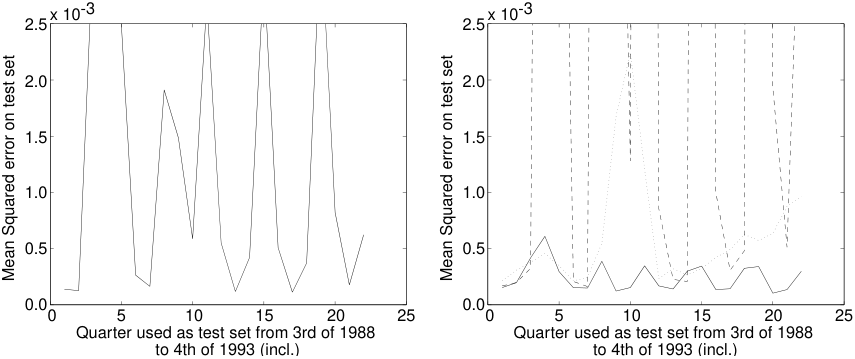

<!-- Start of picture text -->
2.5 x 10-3 2.5 x 10-3 2.0 2.0 1.5 1.5 1.0 1.0 0.5 0.5 0.0 0.0 0 5 10 15 20 25 0 5 10 15 20 25 Quarter used as test set from 3rd of 1988 Quarter used as test set from 3rd of 1988 to 4th of 1993 (incl.) to 4th of 1993 (incl.) Mean Squared error on test set Mean Squared error on test set <!-- End of picture text -->

Figure 1: Out-of-sample results from the third quarter of 1988 to the fourth of 1993 (incl.) for models with best validation results. Left: unconstrained models; results for the UBS models. Other unconstrained models exhibit similar swinging result patterns and levels of errors. Right: constrained models. The proposed CPSD architecture (solid) does best. The model with sums over dimensions (CSSD) obtains similar results. Both CMLP (dotted) and CBS (dashed) models obtain poorer results. (dashed).

<!-- page: 11 -->

Mean Squared Error Results on Call Option Pricing <u>(×10</u>−4 <u>)</u> 

|Hidden Units||**UM**|**LP**|||**CM**|**LP**||
|---|---|---|---|---|---|---|---|---|
||Train|Valid|Test1|Test2|Train|Valid|Test1|Test2|
|1|2.38|1.92|2.73|6.06|2.67|2.32|3.02|3.60|
|2|1.68|1.76|1.51|5.70|2.63|2.14|3.08|3.81|
|3|1.40|1.39|1.27|27.31|2.63|2.15|3.07|3.79|
|4|1.42|1.44|1.25|27.32|2.65|2.24|3.05|3.70|
|5|1.40|1.38|**1**.**27**|**30**.**56**|2.67|2.29|3.03|3.64|
|6|1.41|1.43|1.24|33.12|2.63|2.14|**3**.**08**|**3**.**81**|
|7|1.41|1.41|1.26|33.49|2.65|2.23|3.05|3.71|
|8|1.41|1.43|1.24|39.72|2.63|2.14|3.07|3.80|
|9|1.40|1.41|1.24|38.07|2.66|2.27|3.04|3.67|

|Hidden Units||**U**|**BS**|||**C**|**BS**||
|---|---|---|---|---|---|---|---|---|
||Train|Valid|Test1|Test2|Train|Valid|Test1|Test2|
|1|1.54|1.58|1.40|4.70|2.49|2.17|2.78|3.61|
|2|1.42|1.42|1.27|24.53|1.90|1.71|2.05|3.19|
|3|1.40|1.41|1.24|30.83|1.88|1.73|2.00|3.72|
|4|1.40|1.39|**1**.**27**|**31**.**43**|1.85|1.70|1.96|3.15|
|5|1.40|1.40|1.25|30.82|1.87|1.70|2.01|3.51|
|6|1.41|1.42|1.25|35.77|1.89|1.70|2.04|3.19|
|7|1.40|1.40|1.25|35.97|1.87|1.72|1.98|3.12|
|8|1.40|1.40|1.25|34.68|1.86|1.69|**1**.**98**|**3**.**25**|
|9|1.42|1.43|1.26|32.65|1.92|1.73|2.08|3.17|

- Table 2: Left: the parameters are free to take on negative values. Right: parameters are constrained through exponentiation so that the resulting function is both positive and monotone increasing everywhere w.r.t. both inputs as in Equation (4). Top: regular feedforward artificial neural networks. Bottom: neural networks with an architecture resembling the Black-Scholes formula as defined in Equation (13). The number of hidden units varies from 1 to 9 for each network architecture. The first two quarters of 1988 were used for training, the third of 1988 for validation and the fourth of 1988 for testing. The first quarter of 1989 was used as a second test set to assess the persistence of the models through time (figure 1). In bold: test results for models with best validation results. 

In another series of experiments, we tested the unconstrained multi-layered perceptron against the proposed constrained products of softplus convex architecture using data from years 1988 through 1993 incl. For each year, the first two quarters were used for training, the third quarter for model selection (validation) and the fourth quarter for testing. We trained neural networks for 50000 epochs and with a number of hidden units ranging from 1 through 10. In Table 4, we report training, validation and test results for the two chosen architectures. Model selection was performed using the validation set in order to choose the best number of hidden units, learning rate, learning rate decrease and weight decay. In all cases, except for 1988, the proposed architecture outperformed the multi-layered perceptron model. This might explain why the proposed architecture did

<!-- page: 12 -->

Mean Squared Error Results on Call Option Pricing <u>(×10</u>−4 <u>)</u> 

|Hidden Units||**UP**|**SD**|||**CP**|**SD**||
|---|---|---|---|---|---|---|---|---|
||Train|Valid|Test1|Test2|Train|Valid|Test1|Test2|
|1|2.27|2.15|2.35|3.27|2.28|2.14|2.37|3.51|
|2|1.61|1.58|1.58|14.24|2.28|2.13|2.37|3.48|
|3|1.51|1.53|1.38|18.16|2.28|2.13|2.36|3.48|
|4|1.46|1.51|1.29|20.14|1.84|1.54|**1**.**97**|**4**.**19**|
|5|1.57|1.57|1.46|10.03|1.83|1.56|1.95|4.18|
|6|1.51|1.53|1.35|22.47|1.85|1.57|1.97|4.09|
|7|1.62|1.67|1.46|7.78|1.86|1.55|2.00|4.10|
|8|1.55|1.54|1.44|11.58|1.84|1.55|1.96|4.25|
|9|1.46|1.47|**1**.**31**|**26**.**13**|1.87|1.60|1.97|4.12|

|Hidden Units||**US**|**SD**|||**CS**|**SD**||
|---|---|---|---|---|---|---|---|---|
||Train|Valid|Test1|Test2|Train|Valid|Test1|Test2|
|1|1.83|1.59|1.93|4.10|2.30|2.19|2.36|3.43|
|2|1.42|1.45|**1**.**26**|**25**.**00**|2.29|2.19|2.34|3.39|
|3|1.45|1.46|1.32|35.00|1.84|1.58|1.95|4.11|
|4|1.56|1.69|1.33|21.80|1.85|1.56|1.99|4.09|
|5|1.60|1.69|1.42|10.11|1.85|1.52|**2**.**00**|**4**.**21**|
|6|1.57|1.66|1.39|14.99|1.86|1.54|2.00|4.12|
|7|1.61|1.67|1.48|8.00|1.86|1.60|1.98|3.94|
|8|1.64|1.72|1.48|7.89|1.85|1.54|1.98|4.25|
|9|1.65|1.70|1.52|6.16|1.84|1.54|1.97|4.25|

- Table 3: Similar results as in table 2 but for two new architectures. Top: products of softplus along the convex axis with sigmoid along the monotone axis. Bottom: the softplus and sigmoid functions are summed instead of being multiplied. Top right: the fully constrained proposed architecture (CPSD). 

not perform as well as other architectures on previous experiments using only data from 1988. Also note that the MSE obtained in 1989 is much higher. This is a possible explanation for the bad results obtained in tables 2 and 3 on the second test set. A hypothesis is that the process was undergoing nonstationarities that affected the forecasting performances. This shows that performance can vary by an order of magnitude from year to year and that forecasting in the presence of nonstationary processes is a difficult task. 

### **7. Conclusions** 

Motivated by prior knowledge on the positivity of the derivatives of the function that gives the price of European options, we have introduced new classes of functions similar to multi-layer neural networks that have those properties. We have shown universal approximation properties for these classes. On simulation experiments, using artificial data sets, we have shown that these classes of functions lead to a reduction in the variance and the bias of the associated estimators. When applied

<!-- page: 13 -->

Mean Squared Error Results on Call Option Pricing <u>(×10</u>−5 <u>)</u> 

|Year|Architecture|Units|Train|Valid|Test|
|---|---|---|---|---|---|
|1988|UMLP|9|2.09|1.45|3.28|
||CPSD|9|3.86|2.70|5.23|
|1989|UMLP|4|9.10|28.89|51.39|
||CPSD|2|9.31|23.96|48.22|
|1990|UMLP|9|2.17|4.81|5.61|
||CPSD|9|1.58|4.18|5.39|
|1991|UMLP|9|2.69|1.76|3.41|
||CPSD|8|2.62|1.25|2.74|
|1992|UMLP|8|3.46|1.16|1.52|
||CPSD|8|3.27|1.28|1.27|
|1993|UMLP|9|1.34|1.47|1.76|
||CPSD|10|0.68|0.54|0.65|

Table 4: Comparison between a simple unconstrained multi-layered architecture (UMLP) and the proposed architecture (CPSD). Data from the first two quarters of each year was used as training set, data from the third quarter was used for validation and the fourth quarter was used for testing. We also report the number of units chosen by the model selection process. 

in empirical tests of option pricing, we showed that the architecture from the proposed constrained classes usually generalizes better than a standard artificial neural network. 

### **Appendix A. Proof of the Universality Theorem for Class** _c_ , _nN_ˆ ++ 

In this section, we prove theorem 2.2. In order to help the reader through the formal mathematics, we first give an outline of the proof, that is, a high-level informal overview of the proof, in Section A.1. Then, in Section A.2, we make use of two functions namely, the threshold θ ( _x_ ) = _Ix_ ≥0 and positive part _x_ + = max(0, _x_ ) functions. These two functions are part of the closure of the set _c_ , _nN_ˆ ++ since 

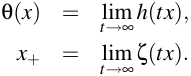

This extended class of functions that includes θ ( _x_ ) and _x_ + shall be referred to as _c_ , _nN_ˆ ++∞. In Section A.3, we give an illustration of the constructive algorithm used to prove universal approximation. Now the proof, as it is stated in Section A.2, only involves functions θ ( _x_ ) and _x_ +, that is, the limit cases of the class _c_ , _n__N_ˆ ++∞whichareactuallynotpartofclass _c_ , _n__N_ˆ ++.Functionsθ(_x_)and_x_ + assume the use of parameters of infinite value, making the proof without any practical bearing. For this reason, in Section A.4, we broaden the theorem’s application from _c_ , _nN_ˆ ++∞to_c_,_nN_ˆ++, building upon the proof of Section A.2.

<!-- page: 14 -->

#### **A.1 Outline of the Proof** 

we start by setting the approximating function equal to a constant function. Then, we build a grid over the domain of interest and scan through it. At every point of the grid we add a term to the approximating function. This term is a function itself that has zero value at every point of the grid that has already been visited. Thus, this term only affects the current point being visited and some of the points to be visited. The task is therefore to make sure the term being added is such that the approximating function matches the actual function at the point being visited. The functions to be added are chosen from the set _c_ , _n__N_ˆ ++∞sothateachofthemindividuallyrespectstheconstraintsonthederivatives.Thebulkof the work in the proof is to show that, throughout the process, at each scanned point, we need to add a positive term to match the approximating function to the true function. For illustrative purposes, we consider the particular case of call options of Section A.3. 

algorithm is used with the same increment values. We simply consider sigmoidal and softplus functions that are greater or equal, in every point, than their limit counterparts, used in the first part. Products of these softplus and sigmoidal functions are within _c_ , _nN_ˆ ++. Consequently, the function built here is always greater than or equal to its counterpart of the first main part. The main element of the second part is that the difference between these two functions, _at gridpoints_ , is capped. This is done by setting the sigmoid and softplus parameter values appropriately. Universality of approximation follows from (1) the capped difference, at gridpoints, between the functions obtained in the first and second parts, (2) the exact approximation obtained at gridpoints in the first part and (3) the bounded function variation between gridpoints. 

#### **A.2 Proof of the Universality Theorem for Class** _c_ , _nN_ˆ ++∞ 

Let _D_ be the compact domain over which we wish to obtain an approximation error below ε in every point. Suppose the existence of an oracle allowing us to evaluate the function in a certain number of points. Let _T_ be the smallest hyperrectangle encompassing _D_ . Let us partition _T_ in hypercubes with sides of length _L_ so that the variation of the function between two arbitrary points of any hypercube is bounded by ε /2. For example, given _s_ , an upper bound on the derivative of the function in any direction, setting _L_ ≤ 2 _s_~~√~~ <u>ε</u> _~~n~~_would do the trick.Since we have assumed the function to be approximated is Lipschitz, then its derivative is bounded and _s_ does exist. The number of gridpoints is _N_ 1 + 1 over the _x_ 1 axis, _N_ 2 + 1 over the _x_ 2 axis, ..., _Nn_ + 1 over the _xn_ axis. Thus, the number of points on the grid formed within _T_ is _H_ = ( _N_ 1 + 1) · ( _N_ 2 + 1) · ... · ( _Nn_ + 1). We define gridpoints _a_ = ( _a_ 1, _a_ 2, ··· , _an_ ) and _b_ = ( _b_ 1, _b_ 2, ··· , _bn_ ) as the innermost (closest to origin) and outermost corners of _T_ , respectively. Figure 2 illustrates these values. The points of the grid

<!-- page: 15 -->

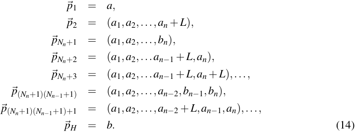

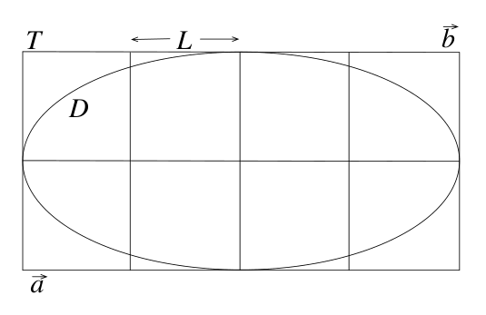

<!-- Start of picture text -->
T L b D a <!-- End of picture text -->

Figure 2: Two dimensional illustration of the proof of universality: ellipse _D_ corresponds to the domain of observation over which we wish to obtain a universal approximator. Rectangle _T_ encompasses _D_ and is partitioned in squares of length _L_ . Points _a_ and _b_ are the innermost (closest to origin) and outermost corners of _T_ , respectively. 

We start with an approximating function _f_ˆ 0 = _f_ ( _a_ ), that is, the function _f_ˆ 0 is initially set to a constant value equal to _f_ ( _a_ ) over the entire domain. Note that, for the remainder of the proof, notations _f_ˆ _h_ , _fh_ , _g_ ˆ _h_ , without any argument, refer to the functions themselves. When an argument is present, such as in _fh_ ( _p_ ), we refer to the value of the function _fh_ evaluated at point _p_ . 

After setting _f_ˆ 0 to its initial value, we scan the grid according to the order defined in Equation (14). At each point along the grid, we add a term ( ˆ _gh_ , a function) to the current approximating function so that it becomes exact at point { _ph_ }: 

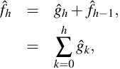

where we have set _g_ ˆ0 = _f_ˆ 0.

<!-- page: 16 -->

ˆ The functions _f_ˆ _h_ , _gh_ and _f_ˆ _h_ −1 are defined over the whole domain and the increment function _g_ ˆ _h_ must be such that at point _ph_ , we have _f_ˆ _h_ ( _ph_ ) = _f_ ( _ph_ ). We compute the constant term δ _h_ as the difference between the value of the function evaluated at point _ph_ , _f_ ( _ph_ ), and the value of the currently accumulated approximating function at the same point _f_ˆ _h_ −1( _ph_ ): 

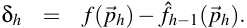

Now, the function _g_ ˆ _h_ must not affect the value of the approximating function at gridpoints that have already been visited. According to our sequencing of the gridpoints, this corresponds to having _g_ ˆ _h_ ( _pk_ ) = 0 for 0 < _k_ < _h_ . Enforcing this constraint ensures that ∀ _k_ ≤ _h_ , _f_ˆ _h_ ( _pk_ ) = _f_ˆ _k_ ( _pk_ ) = _f_ ( _pk_ ). 

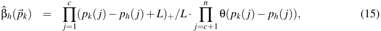

where _pk_ ( _j_ ) is the _j_th coordinate of _pk_ and similarly for _ph_ . We have assumed, without loss of generality, that the convex dimensions are the first _c_ ones. One can readily verify that βˆ _h_ ( _pk_ ) = 0 for 0 < _k_ < _h_ and βˆ _h_ ( _ph_ ) = 1. We can now define the incremental function as: 

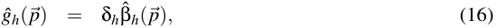

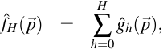

with _f_ ( _p_ ) = _f_ˆ _H_ ( _p_ ) for all gridpoints. 

So far, we have devised a way to approximate the target function as a sum of terms from the set _c_ , _nN_ˆ ++∞.Weknowourapproximationtobeexactineverypointofagridandthatthegridis tight enough so that the approximation error is bounded above by ε /2 anywhere within _T_ (thus within _D_ ): take any point _q_ within a hypercube. Let _q_ 1 and _q_ 2 be the innermost (closest to origin) and outermost gridpoints of _q_ ’s hypercube, respectively. Then, we have _f_ ( _q_ 1) ≤ _f_ ( _q_ ) ≤ _f_ ( _q_ 2) and, _assuming_ δ _h_ ≥ 0 ∀ _h_ , _f_ ( _q_ 1) = _f_ˆ _H_ ( _q_ 1) ≤ _f_ˆ _H_ ( _q_ ) ≤ _f_ˆ _H_ ( _q_ 2) = _f_ ( _q_ 2). Thus, | _f_ˆ _H_ ( _q_ ) − _f_ ( _q_ )| ≤ <u>ε</u> | _f_ ( _q_ 2) − _f_ ( _q_ 1)| ≤ _Ls_~~√~~ _~~n~~_ ≤ ε /2, since we have set _L_ ≤ 2 _s_~~√~~ _~~n~~_.Andthereremainstobeshownthat, effectively, δ _h_ ≥ 0 ∀ _h_ . In order to do so, we will express the target function at gridpoint _ph_ , _f_ ( _ph_ ) in terms of the δ _k_ coefficients (0 < _k_ ≤ _h_ ), then solve for δ _h_ and show that it is necessarily positive. First, let _pk_ ( _j_ ) = _a_ ( _j_ ) + ι _k_ ( _j_ ) _L_ and define ι _k_ = ( _ik_ (1), _ik_ (2),..., _ik_ ( _n_ )) so that _pk_ = _a_ + _L_ · ι _k_ . Now, looking at Equations (15) and (16), we see that _g_ ˆ _k_ ( _p_ ) is equal to zero if, for any _j_ , _pk_ ( _j_ ) > _p_ ( _j_ ). Conversely, _g_ ˆ _k_ ( _p_ ) can only be different from zero if _pk_ ( _j_ ) ≤ _p_ ( _j_ ), ∀ _j_ or, equivalently, if _ik_ ( _j_ ) ≤ _i_ ( _j_ ), ∀ _j_ . 

of {1, 2,..., _H_ }, the indices of the gridpoints of _T_ . Given index _h_ , define _Qh_ , _l_ ⊂{1, 2,..., _H_ } as 

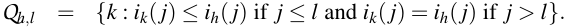

<!-- page: 17 -->

In particular, _Qh_ , _n_ = { _k_ : _ik_ ( _j_ ) ≤ _ih_ ( _j_ ) ∀ _j_ } and _Qh_ ,0 = { _h_ }. Thus, we have 

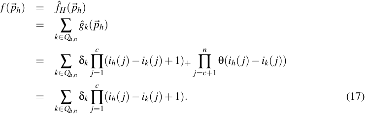

Now, let us define the finite difference of the function along the _l_th axis as 

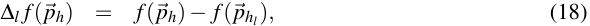

where _phl_ is the neighbor of _ph_ on _T_ with all coordinates equal except along the _l_th axis where _ihl_ ( _l_ ) = _ih_ ( _l_ ) − 1. The following relationship shall be useful: 

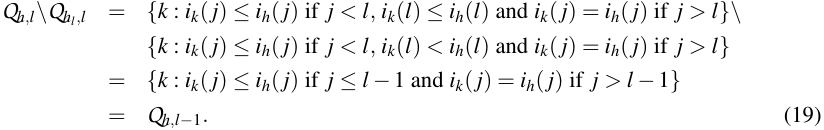

We now have the necessary tools to solve for δ _h_ by differentiating the target function. Using Equations (17), (18) and (19) we get: 

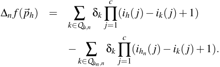

Since _ihn_ ( _j_ ) = _ih_ ( _j_ ) for _j_ ≤ _c_ , then 

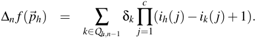

This process is repeated for non-convex dimensions _n_ − 1, _n_ − 2,..., _c_ + 1 until we obtain 

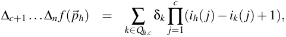

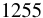

<!-- page: 18 -->

at which point we must consider differentiating with respect to convex dimensions: 

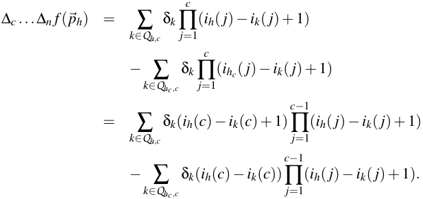

According to Equation (19), _Qh_ , _c_ \ _Qhc_ , _c_ = _Qh_ , _c_ −1 and by _ik_ ( _c_ ) − _ih_ ( _c_ ) = 0 ∀ _k_ ∈ _Qh_ , _c_ −1. Using this, we subtract a sum of zero terms from the last equation in order to simplify the result: 

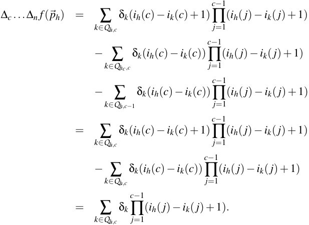

Differentiating once again with respect to dimension _c_ : 

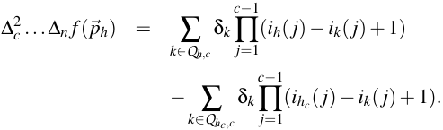

and since _ihc_ ( _j_ ) = _ih_ ( _c_ ) ∀ _j_ ≤ _c_ − 1, then 

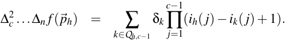

<!-- page: 19 -->

This process of differentiating twice is repeated for all convex dimensions so that 

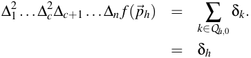

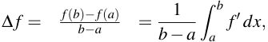

so that if _f_′ ≥ 0 over the range [ _a_ , _b_ ], then consequently, ∆ _f_ ≥ 0. Since, according to Equation (6), we have 

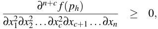

> _ph_) ≥0 andδ_h_ then ∆2 1...∆ _c_2∆_c_+1...∆_nf_(≥0. 

For gridpoints with either _ih_ ( _j_ ) = 1 for any _j_ or with _ih_ ( _j_ ) = 2 for any _j_ ≤ _c_ , solving for δ _h_ requires fewer than _n_ + _c_ differentiations. Since the positivity of the derivatives of _f_ corresponding to these lower order differentiations are covered by Equation (6), then we also have that δ _h_ ≥ 0 for these gridpoints laying at or near some of the boundaries of _T_ . Thus, _c_ , _n__N_ˆ ++∞isauniversal approximator of _c_ , _nF_ˆ ++. 

#### **A.3 Illustration of the Constructive Algorithm** 

In order to give the reader a better intuition regarding the constructive algorithm and as how to solve for δ _h_ , we apply the developments of the previous subsection to 1,2 _N_ˆ ++, the set of functions that include call price functions, that is, positive convex w.r.t. the first variable and monotone increasing w.r.t. both variables. Figure 3 illustrates the two dimensional setting of our example with the points of the grid labelled in the order in which they are scanned according the constructive procedure. Here, we will solve δ 6. 

For the set 1,2 _N_ˆ ++, we have, 

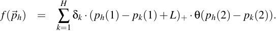

Applying this to the six gridpoints of Figure 3, we obtain _f_ ( _p_ 1) = δ 1, _f_ ( _p_ 2) = ( δ 1 + δ 2), _f_ ( _p_ 3) = (2 δ 1 + δ 3), _f_ ( _p_ 4) = (2 δ 1 + 2 δ 2 + δ 3 + δ 4), _f_ ( _p_ 5) = (3 δ 1 + 2 δ 3 + δ 5), _f_ ( _p_ 6) = (3 δ 1 + 3 δ 2 + 2 δ 3 + 2 δ 4 + δ 5 + δ 6). 

Differentiating w.r.t. 

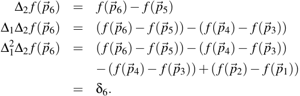

<!-- page: 20 -->

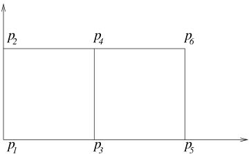

<!-- Start of picture text -->
p2 p4 p6 p 1 p 3 p 5 <!-- End of picture text -->

Figure 3: Illustration in two dimensions of the constructive proof. The points are labelled according to the order in which they are visited. The function is known to be convex w.r.t. to the first variable (abscissa) and monotone increasing w.r.t. both variables. 

be positive in order for δ 6 to be positive as well. As stated above, enforcing the corresponding derivative to be positive is a stronger condition which is respected by all element functions of _c_ , _n__N_ˆ ++.Intheillustrationabove,otherincrementterms(δ 1throughδ 5)canbesolvedforwith fewer differentiations. As mention in the previous subsection, derivatives associated to these lower order differentiations are all positive. 

#### **A.4 Proof of the Universality Theorem for Class** _c_ , _nN_ˆ ++ 

In Section A.2, we obtained an approximating function _f_ˆ _H_ ∈ _c_ , _nN_ˆ ++∞such that | ˆ_fH_−_f_| ≤ε/2. Here, we will build a function _f_˜ _H_ ∈ _c_ , _nN_ˆ ++ everywhere greater or equal to _f_ˆ _H_ , but we will show how the difference between the two functions can be bounded so that _f_˜ _H_ − _f_ˆ _H_ ≤ ε /2 at all gridpoints. 

We start with an approximating function _f_˜ 0 = _f_ˆ 0 = _f_ ( _a_ ), that is, _f_˜ 0 is initially set to a constant value equal to _f_ ( _a_ ) over the entire domain. Then, we scan the grid in an orderly manner, according to the definition of the set of points { _ph_ }. At each point _ph_ along the grid, we add a term _g_ ˜ _h_ (a function) to the current approximating function _f_˜ _h_ −1: 

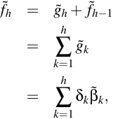

where the δ _k_ are kept equal to the ones found in Section A.2 and we define the set of β˜ _k_ functions as a product of sigmoid and softplus functions, one for each input dimension: 

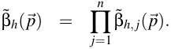

For each of the convex coordinates, we set: 

<!-- page: 21 -->

<!-- Start of picture text -->
1 + � 1 � � 0 0 ph (j) �L p(j) ph (j) �L ph (j) p(j) Convex dimension Non-convex dimension <!-- End of picture text -->

Figure 4: Illustration of the difference between β˜ _h_ , _j_ (solid) and βˆ _h_ , _j_ (dotted) for convex (left) and non-convex (right) dimensions. 

where α > 0. Now, note that κ , the maximum of the difference between the softplus function of Equation (20) and the positive part function βˆ _h_ , _j_ ( _p_ ) = ( _p_ ( _j_ ) − _ph_ ( _j_ ) + _L_ )+, is attained for _p_ ( _j_ ) = _ph_ ( _j_ ) − _L_ where the difference is ln2/ α . Thus, in order to cap the difference resulting from the approximation along the convex dimensions, we simply need to set κ ( α ) to a small (large) enough Let us now turn to the non-convex dimensions where we set: 

and add two constraints: 

Solving for γ and η , we obtain: 

For non-convex dimensions, we have βˆ _h_ , _j_ ( _p_ ) = θ ( _p_ ( _j_ ) − _ph_ ( _j_ )). Thus, for values of _p_ ( _j_ ) such that _ph_ ( _j_ ) − _L_ < _p_ ( _j_ ) < _ph_ ( _j_ ), we have a maximum difference β˜ _h_ , _j_ − βˆ _h_ , _j_ of 1. For other values of _p_ ( _j_ ), the difference is capped by κ . In particular, the difference is bounded above by κ for all gridpoints and is zero for gridpoints with _p_ ( _j_ ) = _ph_ ( _j_ ). These values are illustrated in Figure 4. 

We now compare incremental terms. Our goal is to cap the difference between _g_ ˜ _h_ and _g_ ˆ _h_ by ε /2 _H_ . This will lead us to bound the value of κ . At gridpoints, βˆ _h_ is equal to 

# ˆ _n_ β _h_ = ∏ _m j_ , _j_ =1

<!-- page: 22 -->

f ( 

ae, 

(

<!-- page: 23 -->

Values for α = ln2/ κ , γ , and η (Equations 21 and 22) are derived accordingly. Thus, for any gridpoint, we have: 

In Section A.2, we developed an algorithm such that _f_ˆ = _f_ for any gridpoint. In this present subsection, _f_ ˆ + ε /2 for any gridpoint.we showed thatNote thatsoftplus _f_ and, _f_ ˆ, andsigmoid _f_ ˜ are increasing along each input dimension.parameters could be chosen such that _f_ˆ ≤ _f_˜ ≤ 

As in Section A.2, consider any point _q_ ∈ _D_ . Let _q_ 1 and _q_ 2 be the innermost and outermost gridpoints of _q_ ’s encompassing hypercube of side length _L_ . In Section A.2, we showed how a grid could be made tight enough so that _f_ ( _q_ 2) − _f_ ( _q_ 1) ≤ ε /2. 

˜ With these˜ resultsˆ at hand, we can set upper and lower bounds on _f_˜ ( _q_ ). ˜ First, observe that _fH_ ( _q_ ) ≥ _fH_ ( _q_ 1) ≥ _fH_ ( _q_ 1) = _f_ ( _q_ 1), which provides us with a lower bound on _fH_ ( _q_ ). Next, for the upper bound we have: _f_˜ _H_ ( _q_ ) ≤ _f_˜ _H_ ( _q_ 2) ≤ _f_ˆ _H_ ( _q_ 2)+ ε /2 = _f_ ( _q_ 2)+ ε /2 ≤ _f_ ( _q_ 1)+ ε . Thus, _f_˜ _H_ ( _q_ ) ∈ [ _f_ ( _q_ 1), _f_ ( _q_ 1) + ε ] and _f_ ( _q_ ) ∈ [ _f_ ( _q_ 1), _f_ ( _q_ 1) + ε /2] ⊂ [ _f_ ( _q_ 1), _f_ ( _q_ 1) + ε ]. Since both _f_ ( _q_ ) and _f_˜ ( _q_ ) are within a range of length ε , then | _f_˜ ( _q_ ) − _f_ ( _q_ )| ≤ ε . 

### **References** 

- A. R. Barron. Universal approximation bounds for superpositions of a sigmoidal function. _IEEE Transactions on Information Theory_ , 39(3):930–945, 1993. 

- F. Black and M. Scholes. The pricing of options and corporate liabilities. _Journal of Political Economy_ , 81(3):637–654, 1973. 

- G. Cybenko. Technical report, Department of Computer Science, Tufts University, Medford, MA, 1988. 

- G. Cybenko. Approximation by superpositions of a sigmoidal function. _Mathematics of Control, Signals, and Systems_ , 2:303–314, 1989. 

- M.C. Delfour and J.-P. Zol´esio. _Shapes and Geometries: Analysis, Differential Calculus, and Optimization_ . SIAM, 2001. 

- C. Dugas, O. Bardou, and Y. Bengio. Analyses empiriques sur des transactions d’options. Technical Report 1176, D´epartment d’informatique et de Recherche Op´erationnelle, Universit´e de Montr´eal, Montr´eal, Qu´ebec, Canada, 2000. 

- R. Garcia and R. Genc¸ay. Pricing and hedging derivative securities with neural networks and a homogeneity hint. Technical Report 98s-35, CIRANO, Montr´eal, Qu´ebec, Canada, 1998. 

- K. Hornik, M. Stinchcombe, and H. White. Multilayer feedforward networks are universal approximators. _Neural Networks_ , 2:359–366, 1989.

<!-- page: 24 -->

- J.M. Hutchinson, A.W. Lo, and T. Poggio. A nonparametric approach to pricing and hedging derivative securities via learning networks. _Journal of Finance_ , 49(3):851–889, 1994. 

- M. Leshno, V. Lin, A. Pinkus, and S. Schocken. Multilayer feedforward networks with a nonpolynomial activation function can approximate any function. _Neural Networks_ , 6:861–867, 1993. 

- J. Moody. _Prediction Risk and Architecture Selection for Neural Networks_ . Springer, 1994.
