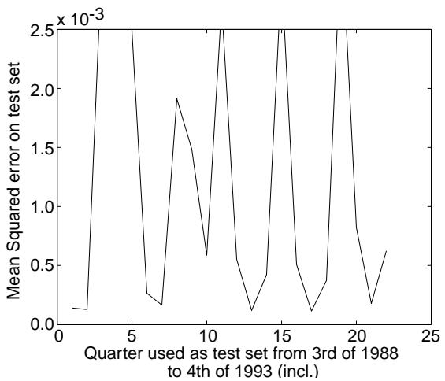
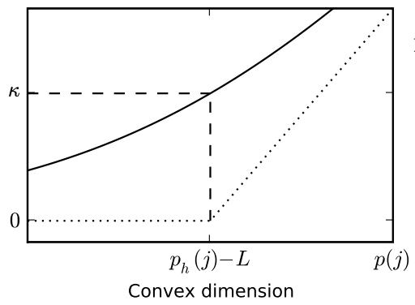
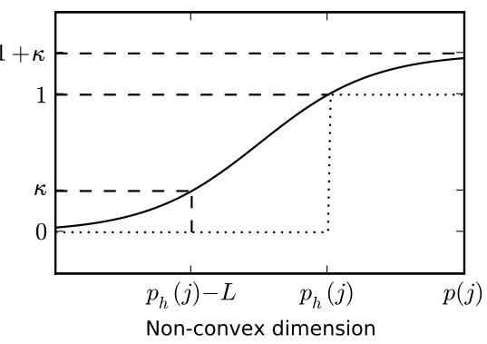

# 2009-dugas-et-al-functional-knowledge-neural-networks

<!-- page: 1 -->

## Incorporating Functional Knowledge in Neural Networks

Charles Dugas Department ofMathematics and Statistic Universite de Montr´ eal´ 2920 Chemin de la tour, suite 5190 Montreal, Qc, Canada H3T 1J4 Yoshua Bengio Department of Computer Science and Operations Research Universite de Montr´ eal´ 2920 Chemin de la tour, suite 2194 Montreal, Qc, Canada H3A 1J4 Franc¸ois Belisle´ Claude Nadeau Health Canada Tunney’s Pasture, PL 0913A Ottawa, On, Canada K1A 0K9 Rene Garcia´ CIRANO 2020 rue University, 25e etage´ Montreal, Qc, Canada H3A 2A5´

DUGAS@DMS.UMONTREAL.CA

BENGIOY@IRO.UMONTREAL.CA

BELISLE.FRANCOIS@GMAIL.COM CLAUDE NADEAU@HC-SC.GC.CA

GARCIAR@CIRANO.QC.CA

Editor: Peter Bartlett

## Abstract

Incorporating prior knowledge of a particular task into the architecture of a learning algorithm can greatly improve generalization performance. We study here a case where we know that the function to be learned is non-decreasing in its two arguments and convex in one of them. For this purpose we propose a class of functions similar to multi-layer neural networks but (1) that has those properties, (2) is a universal approximator of Lipschitz1 functions with these and other properties. We apply this new class of functions to the task of modelling the price of call options. Experiments show improvements on regressing the price of call options using the new types of function classes that incorporate the a priori constraints.

Keywords: neural networks, universal approximation, monotonicity, convexity, call options

## 1. Introduction

Incorporating a priori knowledge of a particular task into a learning algorithm helps reduce the necessary complexity of the learner and generally improves performance, if the incorporated knowledge is relevant to the task and brings enough information about the unknown generating process of the data. In this paper we consider prior knowledge on the positivity of some first and second derivatives of the function to be learned. In particular such constraints have applications to modelling the price of stock options. Based on the Black-Scholes formula, the price of a call stock option is monotonically increasing in both the “moneyness” and time to maturity of the option, and it is convex in the “moneyness”. Section 4 better explains these terms and stock options. For a function $f ( x _ { 1 } , x _ { 2 } )$ of two real-valued arguments, this corresponds to the following properties:

1. A function f is Lipschitz in Ω if c > 0, x, y Ω, f(y) f(x) c y x (Delfour and Zolesio, 2001).´

<!-- page: 2 -->

$$
f \geq 0 , \qquad { \frac { \partial f } { \partial x _ { 1 } } } \geq 0 , \qquad { \frac { \partial f } { \partial x _ { 2 } } } \geq 0 , \qquad { \frac { \partial ^ { 2 } f } { \partial x _ { 1 } ^ { 2 } } } \geq 0 .\tag{1}
$$

The mathematical results of this paper (Section 2) are the following: first we introduce a class of one-argument functions that is positive, non-decreasing and convex in its argument. Second, we use this new class of functions as a building block to design another class of functions that is a universal approximator for functions with positive outputs. Third, once again using the first class of functions, we design a third class that is a universal approximator to functions of two or more arguments, with the set of arguments partitioned in two groups: those arguments for which the second derivative is known positive and those arguments for which we have no prior knowledge on the second derivative. The first derivative is positive for any argument. The universality property of the third class rests on additional constraints on cross-derivatives, which we illustrate below for the case of two arguments:

$$
\frac { \partial ^ { 2 } f } { \partial x _ { 1 } \partial x _ { 2 } } \geq 0 , \frac { \partial ^ { 3 } f } { \partial x _ { 1 } ^ { 2 } \partial x _ { 2 } } \geq 0 .\tag{2}
$$

Thus, we assume that $f \in C ^ { 3 }$ , the set of functions three times continuously differentiable. Comparative experiments on these new classes of functions were performed on stock option prices, showing improvements when using these new classes rather than ordinary feedforward neural networks. The improvements appear to be non-stationary but the new class of functions shows the most stable behavior in predicting future prices. Detailed experimental results are presented in section 6.

## 2. Theory

Definition 1 A class of functions $\hat { \mathcal F }$ from $\mathbb { R } ^ { n }$ to R is a universal approximator for a class of functions F from $\mathbb { R } ^ { n }$ to R iffor any $f \in { \mathcal { F } }$ , any compact domain $D \subset \mathbb { R } ^ { n }$ , and any positive ε, one canfind a $\hat { f } \in \hat { \mathcal F }$ with $\begin{array} { r } { \operatorname* { s u p } _ { x \in D } | f ( x ) - \hat { f } ( x ) | \leq \mathfrak { E } . } \end{array}$

It has already been shown that the class of artificial neural networks with one hidden layer:

$$
\hat { \mathcal { N } } = \left\{ f ( x ) = w _ { 0 } + \sum _ { i = 1 } ^ { H } w _ { i } \cdot h \left( b _ { i } + \sum _ { j } \nu _ { i j } x _ { j } \right) \right\} ,\tag{3}
$$

for example, with a sigmoid activation function $h ( s ) = 1 / ( 1 + e ^ { - s } )$ , is a universal approximator of continuous functions (Cybenko, 1988, 1989; Hornik et al., 1989; Barron, 1993). Furthermore, Leshno et al. (1993) have shown that any non-polynomial activation function will suffice for universal approximation. The number of hidden units H of the neural network is a hyper-parameter that controls the accuracy of the approximation and it should be chosen to balance the trade-off (see also Moody, 1994) between accuracy (bias of the class of functions) and variance (due to the finite sample used to estimate the parameters of the model). Because of this trade-off, in the finite sample case, it may be advantageous to consider a “simpler” class of functions that is appropriate to the task.

<!-- page: 3 -->

Since the sigmoid h is monotonically increasing $( h ^ { \prime } ( s ) = h ( s ) ( 1 - h ( s ) ) > 0 )$ , it is easy to force the first derivatives with respect to x to be positive by forcing the weights to be positive, for example with the exponential function:

$$
\hat { \mathcal { N } } _ { \downarrow } = \left\{ f ( x ) = e ^ { w _ { 0 } } + \sum _ { i = 1 } ^ { H } e ^ { w _ { i } } \cdot h \left( b _ { i } + \sum _ { j } e ^ { v _ { i j } } x _ { j } \right) \right\} .\tag{4}
$$

Note that the positivity of $f ( x )$ and $f ^ { \prime } ( x )$ is not affected by the values of the $\{ b _ { i } \}$ parameters. Since the sigmoid h has a positive first derivative, its primitive, which we call $s o f t p l u s .$ , is convex:

$$
\boxed { \zeta ( s ) = \ln ( 1 + e ^ { s } ) }
$$

where $\ln ( \cdot )$ is the natural logarithm operator. Note that $d \zeta ( s ) / d s = h ( s ) = 1 / ( 1 + e ^ { - s } )$

## 2.1 Universality for Functions with Positive Outputs

Using the softplus function introduced above, we define a new class of functions, all of which have positive outputs:

$$
\begin{array} { r } { \hat { \mathcal { N } } _ { 0 } = \{ f ( x ) = \zeta ( g ( x ) ) , g ( x ) \in \hat { \mathcal { N } } \} . } \end{array}
$$

Theorem 2 Within the set of continuous functions from $\mathbb { R } ^ { n }$ to $\mathbb { R } _ { + } = \left\{ x : x \in \mathbb { R } , x > 0 \right\}$ , the class $\hat { \mathcal { N } } _ { } 0$ is a universal approximator.

Proof Consider a positive function $f ( x )$ , which we want to approximate arbitrarily well. Consider $g ( x ) = \zeta ^ { - 1 } ( f ( x ) ) = \ln ( e ^ { f ( x ) } - 1 )$ , the inverse softplus transform of $f ( x )$ . Choose $\hat { g } ( x )$ from $\hat { \mathcal { N } }$ such that $\begin{array} { r } { \operatorname* { s u p } _ { x \in D } | g ( x ) - \hat { g } ( x ) | \leq \mathfrak { E } , } \end{array}$ , where D is any compact domain over $\mathbb { R } ^ { n }$ and ε is any positive real number. The existence of $\hat { g } ( x )$ is ensured by the universality property of $\hat { \mathcal { N } }$ Set ${ \hat { f } } ( x ) = \zeta ( { \hat { g } } ( x ) ) =$ $\ln ( 1 + e ^ { \hat { g } ( x ) } )$ . Consider any particular x and define $a = \mathrm { m i n } ( \hat { g } ( x ) , g ( x ) )$ and $\boldsymbol { b } = \operatorname* { m a x } ( \hat { g } ( \boldsymbol { x } ) , g ( \boldsymbol { x } ) )$ . Since $b - a \leq \varepsilon .$ , we have,

$$
\begin{array} { r c l } { | \hat { f } ( x ) - f ( x ) | } & { = } & { \ln ( 1 + e ^ { b } ) - \ln ( 1 + e ^ { a } ) } \\ & { = } & { \ln \left( 1 + ( e ^ { b } - e ^ { a } ) / ( 1 + e ^ { a } ) \right) } \\ & { \leq } & { \ln \left( 1 + ( e ^ { \varepsilon } - 1 ) e ^ { a } / ( 1 + e ^ { a } ) \right) } \\ & { < } & { \varepsilon . } \end{array}
$$

Thus, the use of the softplus function to transform the output of a regular one hidden layer artificial neural network ensures the positivity of the final output without hindering the universality property.

## 2.2 The Class $\mathbf { \Lambda } _ { c , n } \hat { \mathcal { N } } _ { + + }$

In this section, we use the softplus function, in order to define a new class of functions with positive outputs, positive first derivatives w.r.t. all input variables and positive second derivatives w.r.t.

<!-- page: 4 -->

some of the input variables. The basic idea is to replace the sigmoid of a sum by a product of either softplus or sigmoid functions over each of the dimensions (using the softplus over the convex dimensions and the sigmoid over the others):

$$
\mathbf { } _ { c , n } { \hat { \mathcal { N } } } _ { \dagger + } = \left\{ f ( x ) = e ^ { w _ { 0 } } + \sum _ { i = 1 } ^ { H } e ^ { w _ { i } } \left( \prod _ { j = 1 } ^ { c } \zeta ( b _ { i j } + e ^ { \nu _ { i j } } x _ { j } ) \right) \left( \prod _ { j = c + 1 } ^ { n } h ( b _ { i j } + e ^ { \nu _ { i j } } x _ { j } ) \right) \right\} .\tag{5}
$$

One can readily check that the output is necessarily positive, the first derivatives w.r.t. $x _ { j }$ are positive, and the second derivatives w.r.t. $x _ { j }$ for $j \le c$ are positive. However, this class of functions has other properties that are summarized by the following:

$$
\begin{array} { r c l } { { \displaystyle \frac { \partial ^ { m } f } { \partial ^ { m _ { 1 } } x _ { 1 } \partial ^ { m _ { 2 } } x _ { 2 } \cdot \cdot \cdot \cdot \partial ^ { m _ { n } } x _ { n } } } } & { { \ge } } & { { 0 , } } \\ { { } } & { { } } & { { } } \\ { { m _ { j } } } & { { \in } } & { { \left\{ \begin{array} { l l } { { \{ 0 , 1 , 2 \} } } & { { 1 \leq j \leq c } } \\ { { \{ 0 , 1 \} } } & { { c + 1 \leq j \leq n , } } \end{array} \right. } } \\ { { } } & { { } } & { { } } \\ { { \displaystyle \sum _ { j = 1 } ^ { n } m _ { j } } } & { { = } } & { { m . } } \end{array}\tag{6}
$$

Here, we have assumed that $f \in C ^ { c + n }$ , the set of functions that are $c + n$ times continuously differentiable. We will also restrict ourselves to Lispschitz functions since the proof of the theorem relies on the fact that the derivative of the function is bounded. The set of functions that respect these derivative conditions will be referred to as ${ } _ { c , n } \hat { \mathcal { F } } _ { + + }$ . Note that, as special cases we find that $f$ is positive $( m = 0 )$ , and that it is monotonically increasing w.r.t. any of its inputs $( m = 1 )$ ), and convex w.r.t. the first c inputs $( m = 2 , \exists j : m _ { j } = 2 )$ . Also note that, when applied to our particular case where $n = 2$ and $c = 1$ , this set of equations corresponds to Equations (1) and (2). We now state the main universality theorem:

Theorem 3 Within the set ${ } _ { c , n } \hat { \mathcal { F } } _ { + + }$ of Lipschitz functions from $\mathbb { R } ^ { n }$ to R whose set of derivatives as specified by Equation (6) are non-negative, the class $_ { c , n } \hat { \mathcal { N } } _ { + + }$ is a universal approximator.

The proof of the theorem is given in Section A.

## 2.3 Parameter Optimization

In our experiments, conjugate gradient descent was used to optimize the parameters of the model. The backpropagation equations are obtained as the derivatives of $f \in \mathbf { \Phi } _ { c , n } \mathbf { \mathcal { N } } _ { \mathrm { 4 + } }$ (Equation 5) w.r.t. to its parameters. Let $z _ { i , j } = b _ { i j } + e ^ { \nu _ { i j } } x _ { j } , u _ { i } = e ^ { w _ { i } } ( \prod _ { j = 1 } ^ { c } \zeta ( z _ { i , j } ) ) ( \prod _ { j = c + 1 } ^ { n } h ( z _ { i j } ) ) $ and $\begin{array} { r } { f = e ^ { w _ { 0 } } + \sum _ { i = 1 } ^ { H } u _ { i } . } \end{array}$ Then, we have

$$
\begin{array} { r c l } { \partial f / \partial w _ { 0 } } & { = } & { e ^ { w _ { 0 } } , } \\ { \partial f / \partial w _ { i } } & { = } & { u _ { i } , } \\ { \partial f / \partial b _ { i , k } } & { = } & { \left\{ \begin{array} { c c } { u _ { i } \cdot h ( z _ { i , k } ) / \zeta ( z _ { i , k } ) } & { 1 \leq k \leq c } \\ { u _ { i } \cdot ( 1 - h ( z _ { i , k } ) ) } & { c + 1 \leq k \leq n , } \end{array} \right. } \\ { \partial f / \partial \nu _ { i , k } } & { = } & { e ^ { \nu _ { i k } } x _ { k } \cdot \partial f / \partial b _ { i , k } . } \end{array}\tag{7}
$$

Except for terms $h ( z _ { i , k } ) , k \leq c$ of Equation (7), all values are computed through the forward phase, that is, while computing the value of $f .$ . Error backpropagation can thus be performed efficiently if

<!-- page: 5 -->

careful attention is paid, during the forward phase, to store the values to be reused in the backpropagation phase.

Software implementing parameter optimization of the proposed architecture and the numerical experiments of the following section is available on-line.2 Code was written using the $\mathbf { \ddot { \delta } } \mathbf { \Phi } _ { \mathbf { R } } \mathbf { \Psi } ^ { \mathrm { , , } }$ statistical software package.3

## 3. Experiments with Artificial Data

In this section, we present a series of controlled experiments in order to assess the potential improvements that can be gained from using the proposed architecture in cases where some derivatives of the target function are known to be positive. The emphasis is put on analyzing the evolution of the model bias and model variance values w.r.t. various noise levels and training set sizes.

The function we shall attempt to learn is

$$
\begin{array} { r c l } { { f ( \vec { x } ) } } & { { = } } & { { \zeta ( x _ { 1 } ) \zeta ( x _ { 2 } ) \zeta ( x _ { 3 } ) h ( x _ { 4 } ) , } } \\ { { y } } & { { = } } & { { f ( \vec { x } ) + \xi , } } \end{array}
$$

where $\zeta ( \cdot )$ is the softplus function defined above and $h ( \cdot )$ is the sigmoid function. The input values are drawn from a uniform distribution over the [0,1] interval, that is, $x _ { i } \sim \mathcal { U } ( 0 , 1 )$ . The noise term $\xi$ is added to the true function $f ( \vec { x } )$ to generate the target value y. Finally, $\xi \sim \mathcal { N } ( 0 , \sigma ^ { 2 } )$ , that is, we used additive Gaussian noise. Different values for σ have been tested.

For each combination of noise level $( \sigma \in \{ 1 { \mathrm { e } } { - } 2 , 3 { \mathrm { e } } { - } 2 , 1 { \mathrm { e } } { - } 1 \} )$ ) and training set size (25, 50, 100, 200, 400), we chose the best performing combination of number of hidden units and weight decay. In order to perform model selection, 100 models were trained using different random training sets, for each combination. Based on validation set performance, 50 models were retained and their validation set performances were averaged. The best performing combination was chosen based on this average validation performance. Bias and variance were measured using these 50 selected models when applied on another testset of 10000 examples. In each case, the number of training epochs was 10000. The process was repeated for two architectures: the proposed architecture of products of softplus and sigmoid functions over input dimensions with constrained weights (CPSD) and regular unconstrained multi-layered perceptrons with a single hidden layer (UMLP).

In order to compute the bias and variance values, we first computed, for each test example, the average of the $N _ { D } = 5 0$ model outputs:

$$
\bar { g } ( \vec { x } _ { i } ) = \frac { 1 } { N _ { D } } \sum _ { j = 1 } ^ { N _ { D } } g _ { j } ( \vec { x } _ { i } ) ,
$$

where $g _ { j } ( \vec { x } _ { i } )$ is the output of the $j ^ { t h }$ model associated to the $i ^ { t h }$ input vector $\vec { x } _ { i }$

The variance was unbiasedly approximated as the average over all test examples $( N _ { i } = 1 0 0 0 0 )$ of the sample variance of model outputs $g _ { j } ( \vec { x } _ { i } )$ w.r.t. the corresponding mean output $\bar { g } ( \vec { x } _ { i } )$

$$
\begin{array} { r c l } { { \hat { \nu } ( \vec { x } _ { i } ) } } & { { = } } & { { \displaystyle \frac { 1 } { N _ { D } - 1 } \sum _ { j = 1 } ^ { N _ { D } } ( g _ { j } ( \vec { x } _ { i } ) - \bar { g } ( \vec { x } _ { i } ) ) ^ { 2 } , } } \\ { { \hat { \nu } } } & { { = } } & { { \displaystyle \frac { 1 } { N _ { i } } \sum _ { i } \hat { \nu } ( \vec { x } _ { i } ) . } } \end{array}
$$

2. Software can be found at http://www.dms.umontreal.ca/˜dugas/convex/.

3. Code found at http://www.r-project.org/.

<!-- page: 6 -->

The bias was unbiasedly estimated as the average over all test examples, of the squared deviation of the mean output $\bar { g } ( \vec { x } _ { i } )$ w.r.t. the known true function value $f ( \vec { x } _ { i } )$ , less a variance term:

$$
\begin{array} { r c l } { { \hat { b } ( \vec { x } _ { i } ) } } & { { = } } & { { ( \bar { g } ( \vec { x } _ { i } ) - f ( \vec { x } _ { i } ) ) ^ { 2 } - \hat { \nu } ( \vec { x } _ { i } ) / N _ { D } , } } \\ { { \hat { b } } } & { { = } } & { { \displaystyle \frac { 1 } { N _ { i } } \sum _ { i } \hat { b } ( \vec { x } _ { i } ) . } } \end{array}
$$

Let $b ( \vec { x } _ { i } ) = ( E _ { G } ( g ( \vec { x } _ { i } ) ) - f ( \vec { x } _ { i } ) ) ^ { 2 }$ be the true bias, at point $\vec { x } _ { i }$ where $E _ { G } ( \ v r )$ denotes expectation taken over training set distribution, which induces a distribution of the function g produced by the learning algorithm. Let us show that $E _ { G } ( \hat { b } ( \vec { x } _ { i } ) ) = b ( \vec { x } _ { i } )$

$$
\begin{array} { l l l } { { E _ { G } ( \hat { b } ( \vec { x } _ { i } ) ) } } & { { = } } & { { E _ { G } [ ( \bar { g } ( \vec { x } _ { i } ) - f ( \vec { x } _ { i } ) ) ^ { 2 } - \hat { \nu } ( \vec { x } _ { i } ) / N _ { D } ] , } } \\ { { } } & { { = } } & { { E _ { G } [ ( \bar { g } ( \vec { x } _ { i } ) - g ( \vec { x } _ { i } ) + g ( \vec { x } _ { i } ) - f ( \vec { x } _ { i } ) ) ^ { 2 } ] - \nu ( \vec { x } _ { i } ) / N _ { D } , } } \\ { { } } & { { = } } & { { E _ { G } [ ( \bar { g } ( \vec { x } _ { i } ) - g ( \vec { x } _ { i } ) ) ^ { 2 } ] + E _ { G } [ ( g ( \vec { x } _ { i } ) - f ( \vec { x } _ { i } ) ) ^ { 2 } ] - \nu ( \vec { x } _ { i } ) / N _ { D } , } } \\ { { } } & { { = } } & { { \nu ( \vec { x } _ { i } ) / N _ { D } + b ( \vec { x } _ { i } ) - \nu ( \vec { x } _ { i } ) / N _ { D } , } } \\ { { } } & { { = } } & { { b ( \vec { x } _ { i } ) . } } \end{array}
$$

Table 1 reports the results for these simulations. In all cases, the bias and variance are lower for the proposed architecture than for a regular neural network architecture, which is the result we expected. The variance reduction is easy to understand because of the appropriate constraints on the class of functions. The bias reduction, we conjecture to be a side effect of the bias-variance tradeoff being performed by the model selection on the validation set: to achieve a lower validation error, a larger bias is needed with the unconstrained artificial neural network. The improvements are generally more important for smaller sample sizes. A possible explanation is that the proposed architecture helps reduce the variance of the estimator. With small sample sizes, this is very beneficial and becomes less important as the number of points increases.

## 4. Estimating Call Option Prices

An option is a contract between two parties that entitles the buyer to a claim at a future date $T$ that depends on the future price, $S _ { T }$ of an underlying asset whose price at current time t is $S _ { t }$ . In this paper we consider the very common European call options, in which the buyer (holder) of the option obtains the right to buy the asset at a fixed price $K$ called the strike price. This purchase can only occur at maturity date (time T). Thus, if at maturity, the price of the asset $S _ { T }$ is above the strike price $K ,$ the holder of the option can exercise his option and buy the asset at price K, then sell it back on the market at price $S _ { T }$ , thus making a profit of $S _ { T } - K$ . If, on the other hand, the price of the asset at maturity $S _ { T }$ is below the strike price $K ,$ , then the holder of the option has no interest in exercising his option (and does not have to) and the option simply expires worthless and unexercised. For this reason, the option is considered to be worth max $( 0 , S _ { T } - K )$ at maturity and our goal is to estimate $C _ { t }$ , the value of that worth at current time t.

In the econometric literature, the call function is often expressed in terms of the primary economic variables that influence its value: the actual market price of the security $( S _ { t } )$ , the strike price $( K )$ , the remaining time to maturity $( \tau = T - t )$ , the risk free interest rate (r), and the volatility of the return (σ). One important result is that under mild conditions, the call option function is homogeneous of degree one with respect to the strike price and so we can perform dimensionality reduction by letting our approximating function depend on the “moneyness” ratio $( M = S _ { t } / K )$ instead of the current asset price St and the strike price K independently. We must then modify the target to be the price of the option divided by the strike price: $C _ { t } / K$

<!-- page: 7 -->

[Table source crop](assets/tables/2009-dugas-et-al-functional-knowledge-neural-networks-p0007-block-0001-a5b29b4a6f80b1d0.jpg)
Bias and Variance Analysis on Artificial Data Table 1: Comparison of the bias and variance values for two neural network architectures, three levels of noise, and five sizes of training sets (Ntrain), using artificial data. In bold, the best performance between the two models.

Most of the research on call option modelling relies on strong parametric assumptions of the underlying asset price dynamics. Any misspecification of the stochastic process for the asset price will lead to systematic mispricings for any option based on the asset (Hutchinson et al., 1994). The wellknown Black-Scholes formula (Black and Scholes, 1973) is a consequence of such specifications and other assumptions:

<!-- page: 8 -->

$$
f ( M , \tau , r , \sigma ) = { \cal M } \Phi ( d _ { 1 } ) - e ^ { - r \tau } \Phi ( d _ { 2 } ) ,
$$

where $\Phi ( \cdot )$ is the cumulative Gaussian function evaluated in points

$$
d _ { 1 } , d _ { 2 } = { \frac { \ln M + ( r \pm \sigma ^ { 2 } / 2 ) \tau } { \sigma { \sqrt { \tau } } } } ,
$$

that is, $d _ { 1 } = d _ { 2 } + \sigma { \sqrt { \tau } } .$ . In particular, two assumptions on which this formula relies have been challenged by empirical evidence: the assumed lognormality of returns on the asset and the assumed constance of volatility over time.

On the other hand, nonparametric models such as neural networks do not rely on such strong assumptions and are therefore robust to model specification errors and their consequences on option modelling and this motivates research in the direction of applying nonparametric techniques for option modelling.

Analyzing the primary economic variables that influence the call option price, we note that the risk free interest rate (r) needs to be somehow extracted from the term structure of interest rates and the volatility (σ) needs to be forecasted. This latter task is a field of research in itself. Dugas et al. (2000) have previously tried to feed in neural networks with estimates of the volatility using historical averages but the gains have remained insignificant. We therefore drop these two features and rely on the ones that can be observed $( S _ { t } , K , \tau )$ to obtain the following:

$$
C _ { t } / K \ = \ f ( M , \tau ) .
$$

The novelty of our approach is to account for properties of the call option function as stated in Equation (1). These properties derive from simple arbitrage pricing theory.4 Now even though we know the call option function to respect these properties, we do not know if it does respect the additional cross derivative properties of Equation (2). In order to gain some insight in this direction, we confront the Black-Scholes formula to our set of constraints:

$$
\frac { \partial f } { \partial M } = \Phi ( d _ { 1 } ) ,\tag{8}
$$

$$
\frac { \partial ^ { 2 } f } { \partial M ^ { 2 } } = \frac { \Phi ( d _ { 1 } ) } { \sqrt { \tau } M \sigma } ,\tag{9}
$$

$$
\frac { \partial f } { \partial \tau } = e ^ { - r \tau } \left( \frac { \Phi ( d _ { 2 } ) \sigma } { 2 \sqrt { \tau } } + r \Phi ( d _ { 2 } ) \right) ,\tag{10}
$$

$$
\frac { \partial ^ { 2 } f } { \partial M \partial \tau } = \frac { \Phi ( d _ { 1 } ) } { 2 \sigma \tau ^ { 3 / 2 } } \left( ( r + \sigma ^ { 2 } / 2 ) \tau - \ln M \right) ,\tag{11}
$$

$$
\frac { \partial ^ { 3 } f } { \partial M ^ { 2 } \partial \tau } = \frac { \Phi ( d _ { 1 } ) } { 2 M \sigma ^ { 3 } \tau ^ { 5 / 2 } } \left( \ln ^ { 2 } M - \sigma ^ { 2 } \tau - ( r + \sigma ^ { 2 } / 2 ) ^ { 2 } \tau ^ { 2 } \right) ,\tag{12}
$$

where $\phi ( \cdot )$ is the Gaussian density function. Equations (8), (9) and (10) confirm that the Black-Scholes formula is in accordance with our prior knowledge of the call option function: all three derivatives are positive. Equations (11) and (12) are the cross derivatives which will be positive for any function chosen from $_ { 1 , 2 } \hat { \mathcal { N } } _ { + + }$ . When applied to the Black-Scholes formula, it is less clear whether these values are positive, too. In particular, one can easily see that both cross derivatives can not be simultaneously positive. Thus, the Black-Scholes formula is not within the set ${ } _ { 1 , 2 } \hat { \mathcal { F } } _ { + + }$ Then again, it is known that the Black-Scholes formula does not adequately represent the market pricing of options, but it is considered as a useful guide for evaluating call option prices. So, we do not know if these constraints on the cross derivatives are present in the true price function.

4. The convexity of the call option w.r.t. the moneyness is a consequence of the butterfly spread strategy (Garcia and Genc¸ay, 1998).

<!-- page: 9 -->

Nonetheless, even if these additional constraints are not respected by the true function on all of its domain, one can hope that the increase in the bias of the estimator due to the constraints will be offset (because we are searching in a smaller function space) by a decrease in the variance of that estimator and that overall, the mean-squared error will decrease. This strategy has often been used successfully in machine learning (e.g., regularization, feature selection, smoothing).

## 5. Experimental Setup

As a reference model, we use a simple multi-layered perceptron with one hidden layer (Equation 3). For UMLP models, weights are left unconstrained whereas for CMLP models, weights are constrained, through exponentiation, to be positive. We also compare our results with a recently proposed model (Garcia and Genc¸ay, 1998) that closely resembles the Black-Scholes formula for option pricing (i.e., another way to incorporate possibly useful prior knowledge):

$$
\begin{array} { r c l } { { y } } & { { = } } & { { \displaystyle \alpha + M \cdot \sum _ { i = 1 } ^ { n _ { h } } \beta _ { 1 , i } \cdot h \big ( \gamma _ { i , 0 } + \gamma _ { i , 1 } \cdot M + \gamma _ { i , 2 } \cdot \tau \big ) } } \\ { { } } & { { + } } & { { \displaystyle e ^ { - r \tau } \cdot \sum _ { i = 1 } ^ { n _ { h } } \beta _ { 2 , i } \cdot h \big ( \gamma _ { i , 3 } + \gamma _ { i , 4 } \cdot M + \gamma _ { i , 5 } \cdot \tau \big ) , } } \end{array}\tag{13}
$$

with inputs M, τ, parameters $r , { \mathbf { { Q } } } , { \mathbf { \beta } } , { \boldsymbol { \gamma } }$ and hyperparameter $n _ { h }$ (number of hidden units). We shall refer to Equation (13) as the UBS models. Constraining the weights of Equation (13) through exponentiation leads to a different architecture we refer to as the CBS models.

We evaluate two new architectures incorporating all of the constraints defined in Equation (6). The proposed architecture involves the product of softplus and sigmoid functions over input dimensions, hence the UPSD models and CPSD models labels for an unconstrained version of the proposed architecture and the proposed constrained architecture, respectively. Finally, we also tested another architecture derived from the proposed one by simply summing, instead of multiplying, softplus and sigmoid functions. For that last architecture (with constrained weights), positivity, monotonicity and convexity properties are respected but in that case, cross-derivatives are all equal to zero. We do not have a universality proof for that specific class of functions. The unconstrained and constrained architectures are labelled as USSD models and CSSD models, respectively.

We used European call option data from 1988 to 1993. A total of 43518 transaction prices on European call options on the S&P500 index were used. In Section 6, we report results on 1988 data. In each case, we used the first two quarters of 1988 as a training set (3434 examples), the third quarter as a validation set (1642 examples) for model selection and the fourth quarter as a test set (each with around 1500 examples) for final generalization error estimation. In tables 2 and 3, we present results for networks with unconstrained weights on the left-hand side, and weights constrained to positive and monotone functions through exponentiation of parameters on the righthand side. For each model, the number of hidden units varies from one to nine. The mean squared error results reported were obtained as follows: first, we randomly sampled the parameter space 1000 times. We picked the best (lowest training error) model and trained it up to 1000 more epochs. Repeating this procedure 10 times, we selected and averaged the performance of the best of these 10 models (those with training error no more than 10% worse than the best out of 10). In figure 1, we present tests of the same models on each quarter up to and including 1993 (20 additional test sets) in order to assess the persistence (conversely, the degradation through time) of the trained models.

<!-- page: 10 -->

## 6. Forecasting Results

As can be seen in tables 2 and 3, unconstrained architectures obtain better training, validation and testing (test 1) results but fail in the extra testing set (test 2). A possible explanation is that constrained architectures capture more fundamental relationships between variables and are more robust to nonstationarities of the underlying process. Constrained architectures therefore seem to give better generalization when considering longer time spans.

The importance in the difference in performance between constrained and unconstrained architectures on the second test set lead us to look even farther into the future and test the selected models on data from later years. In Figure 1, we see that the Black-Scholes similar constrained model performs slightly better than other models on the second test set but then fails on later quarters. All in all, at the expense of slightly higher initial errors our proposed architecture allows one to forecast with increased stability much farther in the future. This is a very welcome property as new derivative products have a tendency to lock in values for much longer durations (up to 10 years) than traditional ones.

<!-- page: 11 -->

[Table source crop](assets/tables/2009-dugas-et-al-functional-knowledge-neural-networks-p0011-block-0001-a61a1674f829e27a.jpg)
Mean Squared Error Results on Call Option Pricing ( 10−4)

[Table source crop](assets/tables/2009-dugas-et-al-functional-knowledge-neural-networks-p0011-block-0002-dfd52bcba7ac3382.jpg)
Table 2: Left: the parameters are free to take on negative values. Right: parameters are constrained through exponentiation so that the resulting function is both positive and monotone increasing everywhere w.r.t. both inputs as in Equation (4). Top: regular feedforward artificial neural networks. Bottom: neural networks with an architecture resembling the Black-Scholes formula as defined in Equation (13). The number of hidden units varies from 1 to 9 for each network architecture. The first two quarters of 1988 were used for training, the third of 1988 for validation and the fourth of 1988 for testing. The first quarter of 1989 was used as a second test set to assess the persistence of the models through time (figure 1). In bold: test results for models with best validation results.

In another series of experiments, we tested the unconstrained multi-layered perceptron against the proposed constrained products of softplus convex architecture using data from years 1988 through 1993 incl. For each year, the first two quarters were used for training, the third quarter for model selection (validation) and the fourth quarter for testing. We trained neural networks for 50000 epochs and with a number of hidden units ranging from 1 through 10. In Table 4, we report training, validation and test results for the two chosen architectures. Model selection was performed using the validation set in order to choose the best number of hidden units, learning rate, learning rate decrease and weight decay. In all cases, except for 1988, the proposed architecture outperformed the multi-layered perceptron model. This might explain why the proposed architecture did not perform as well as other architectures on previous experiments using only data from 1988. Also note that the MSE obtained in 1989 is much higher. This is a possible explanation for the bad results obtained in tables 2 and 3 on the second test set. A hypothesis is that the process was undergoing nonstationarities that affected the forecasting performances. This shows that performance can vary by an order of magnitude from year to year and that forecasting in the presence of nonstationary processes is a difficult task.

<!-- page: 12 -->

[Table source crop](assets/tables/2009-dugas-et-al-functional-knowledge-neural-networks-p0012-block-0001-7e01eb3e9f79fd52.jpg)
Mean Squared Error Results on Call Option Pricing ( 10−4) Table 3: Similar results as in table 2 but for two new architectures. Top: products of softplus along the convex axis with sigmoid along the monotone axis. Bottom: the softplus and sigmoid functions are summed instead of being multiplied. Top right: the fully constrained proposed architecture (CPSD).

## 7. Conclusions

Motivated by prior knowledge on the positivity of the derivatives of the function that gives the price of European options, we have introduced new classes of functions similar to multi-layer neural networks that have those properties. We have shown universal approximation properties for these classes. On simulation experiments, using artificial data sets, we have shown that these classes of functions lead to a reduction in the variance and the bias of the associated estimators. When applied in empirical tests of option pricing, we showed that the architecture from the proposed constrained classes usually generalizes better than a standard artificial neural network.

<!-- page: 13 -->

[Table source crop](assets/tables/2009-dugas-et-al-functional-knowledge-neural-networks-p0013-block-0001-80dc6e1fd618ea4a.jpg)
Mean Squared Error Results Table 4: Comparison between a simple unconstrained multi-layered architecture (UMLP) and the proposed architecture (CPSD). Data from the first two quarters of each year was used as training set, data from the third quarter was used for validation and the fourth quarter was used for testing. We also report the number of units chosen by the model selection process.

## Appendix A. Proof of the Universality Theorem for Class $_ { c , n } \hat { \mathcal { N } } _ { + + }$

In this section, we prove theorem 2.2. In order to help the reader through the formal mathematics, we first give an outline of the proof, that is, a high-level informal overview of the proof, in Section A.1. Then, in Section A.2, we make use of two functions namely, the threshold $\theta ( x ) = I _ { x \geq 0 }$ and positive part $x _ { + } = \operatorname* { m a x } ( 0 , x )$ functions. These two functions are part of the closure of the set $_ { c , n } \hat { \mathcal { N } } _ { + + }$ since

$$
\begin{array} { r l r } { \theta ( x ) } & { = } & { \underset { t  \infty } { \operatorname* { l i m } } h ( t x ) , } \\ { x _ { + } } & { = } & { \underset { t  \infty } { \operatorname* { l i m } } \zeta ( t x ) . } \end{array}
$$

This extended class of functions that includes $\theta ( x )$ and $x _ { + }$ shall be referred to as $_ { c , n } \hat { \mathcal { N } } _ { + - } ^ { \infty }$ . In Section A.3, we give an illustration of the constructive algorithm used to prove universal approximation. Now the proof, as it is stated in Section A.2, only involves functions θ(x) and $x _ { + }$ , that is, the limit cases of the class $_ { c , n } \hat { \mathcal { N } } _ { + + } ^ { \infty }$ which are actually not part of class ${ } _ { c , n } \hat { \mathcal { N } } _ { + + }$ . Functions $\theta ( x )$ and $x _ { + }$ assume the use of parameters of infinite value, making the proof without any practical bearing. For this reason, in Section A.4, we broaden the theorem’s application from ${ } _ { c , n } \hat { \mathcal { N } } _ { + + } ^ { \infty }$ to ${ } _ { c , n } \hat { \mathcal { N } } _ { + + }$ , building upon the proof of Section A.2.

<!-- page: 14 -->

## A.1 Outline of the Proof

The proof of the first main part (Section A.2) works by construction: we start by setting the approximating function equal to a constant function. Then, we build a grid over the domain of interest and scan through it. At every point of the grid we add a term to the approximating function. This term is a function itself that has zero value at every point of the grid that has already been visited. Thus, this term only affects the current point being visited and some of the points to be visited. The task is therefore to make sure the term being added is such that the approximating function matches the actual function at the point being visited. The functions to be added are chosen from the set ${ } _ { c , n } \mathcal { \hat { N } } _ { + - } ^ { \infty }$ so that each of them individually respects the constraints on the derivatives. The bulk of the work in the proof is to show that, throughout the process, at each scanned point, we need to add a positive term to match the approximating function to the true function. For illustrative purposes, we consider the particular case of call options of Section A.3.

In the second part (Section A.4), we build upon the proof of the first part. The same constructive algorithm is used with the same increment values. We simply consider sigmoidal and softplus functions that are greater or equal, in every point, than their limit counterparts, used in the first part. Products of these softplus and sigmoidal functions are within ${ } _ { c , n } \hat { \mathcal { N } } _ { + + }$ . Consequently, the function built here is always greater than or equal to its counterpart of the first main part. The main element of the second part is that the difference between these two functions, at gridpoints, is capped. This is done by setting the sigmoid and softplus parameter values appropriately. Universality of approximation follows from (1) the capped difference, at gridpoints, between the functions obtained in the first and second parts, (2) the exact approximation obtained at gridpoints in the first part and (3) the bounded function variation between gridpoints.

## A.2 Proof of the Universality Theorem for Class $_ { c , n } \hat { \mathcal { N } } _ { + + } ^ { \infty }$

Let D be the compact domain over which we wish to obtain an approximation error below ε in every point. Suppose the existence of an oracle allowing us to evaluate the function in a certain number of points. Let T be the smallest hyperrectangle encompassing D. Let us partition T in hypercubes with sides of length L so that the variation of the function between two arbitrary points of any hypercube is bounded by $ \varepsilon / 2$ . For example, given s, an upper bound on the derivative of the function in any direction, setting $\textstyle L \leq { \frac { \mathfrak { E } } { 2 s { \sqrt { n } } } }$ would do the trick. Since we have assumed the function to be approximated is Lipschitz, then its derivative is bounded and s does exist. The number of gridpoints is $N _ { 1 } + 1$ over the $x _ { 1 }$ axis, $N _ { 2 } + 1$ over the x2 axis, $\ldots , N _ { n } + 1$ over the $x _ { n }$ axis. Thus, the number of points on the grid formed within T is $H = ( N _ { 1 } + 1 ) \cdot ( N _ { 2 } + 1 ) \cdot \ldots \cdot ( N _ { n } + 1 )$ . We define gridpoints ${ \vec { a } } = \left( a _ { 1 } , a _ { 2 } , \cdots , a _ { n } \right)$ and ${ \vec { b } } = ( b _ { 1 } , b _ { 2 } , \cdots , b _ { n } )$ as the innermost (closest to origin) and outermost corners of T, respectively. Figure 2 illustrates these values. The points of the grid

<!-- page: 15 -->

are defined as:

$$
\begin{array} { r c l } { { \vec { p } _ { 1 } } } & { { = } } & { { a , } } \\ { { \vec { p } _ { 2 } } } & { { = } } & { { ( a _ { 1 } , a _ { 2 } , . . . , a _ { n } + L ) , } } \\ { { \vec { p } _ { N _ { n + 1 } } } } & { { = } } & { { ( a _ { 1 } , a _ { 2 } , . . . , b _ { n } ) , } } \\ { { \vec { p } _ { N _ { n + 2 } } } } & { { = } } & { { ( a _ { 1 } , a _ { 2 } , . . . a _ { n - 1 } + L , a _ { n } ) , } } \\ { { \vec { p } _ { N _ { n + 3 } } } } & { { = } } & { { ( a _ { 1 } , a _ { 2 } , . . . a _ { n - 1 } + L , a _ { n } + L ) , . . . , } } \\ { { \vec { p } ( \ O _ { N _ { n + 1 } } ) ( \ O _ { N _ { n - 1 } + 1 } ) } } & { { = } } & { { ( a _ { 1 } , a _ { 2 } , . . . , a _ { n - 2 } , b _ { n - 1 } , b _ { n } ) , } } \\ { { \vec { p } ( \ O _ { N + 1 } ) ( \ O _ { N _ { n - 1 } + 1 } ) + 1 } } & { { = } } & { { ( a _ { 1 } , a _ { 2 } , . . . , a _ { n - 2 } + L , a _ { n - 1 } , a _ { n } ) , . . . , } } \\ { { \vec { p } _ { H } } } & { { = } } & { { b . } } \end{array}\tag{14}
$$

We start with an approximating function ${ \hat { f } } _ { 0 } = f ( { \vec { a } } )$ , that is, the function $\hat { f } _ { 0 }$ is initially set to a constant value equal to $f ( \vec { a } )$ over the entire domain. Note that, for the remainder of the proof, notations $\hat { f } _ { h } , f _ { h } , \hat { g } _ { h }$ , without any argument, refer to the functions themselves. When an argument is present, such as in $f _ { h } ( \vec { p } )$ , we refer to the value of the function $f _ { h }$ evaluated at point ${ \vec { p } } .$

After setting $\hat { f } _ { 0 }$ to its initial value, we scan the grid according to the order defined in Equation (14). At each point along the grid, we add a term $( \hat { g } _ { h }$ , a function) to the current approximating function so that it becomes exact at point $\left\{ \vec { p } _ { h } \right\}$

$$
\begin{array} { r c l } { { \hat { f } _ { h } } } & { { = } } & { { \hat { g } _ { h } + \hat { f } _ { h - 1 } , } } \\ { { } } & { { } } & { { } } \\ { { } } & { { = } } & { { \displaystyle \sum _ { k = 0 } ^ { h } \hat { g } _ { k } , } } \end{array}
$$

where we have set $\hat { g } _ { 0 } = \hat { f } _ { 0 }$

<!-- page: 16 -->

The functions $\hat { f } _ { h } , \hat { g } _ { h }$ and $\hat { f } _ { h - 1 }$ are defined over the whole domain and the increment function $\hat { g } _ { h }$ must be such that at point ${ \vec { p } } _ { h } ,$ , we have ${ \hat { f } } _ { h } ( { \vec { p } } _ { h } ) = f ( { \vec { p } } _ { h } )$ . We compute the constant term $\delta _ { h }$ as the difference between the value of the function evaluated at point $\vec { p } _ { h } , f ( \vec { p } _ { h } )$ , and the value of the currently accumulated approximating function at the same point $\hat { f } _ { h - 1 } ( \vec { p } _ { h } )$

$$
\begin{array} { r c l } { { \delta _ { h } } } & { { = } } & { { f \left( \vec { p } _ { h } \right) - \hat { f } _ { h - 1 } \left( \vec { p } _ { h } \right) . } } \end{array}
$$

Now, the function $\hat { g } _ { h }$ must not affect the value of the approximating function at gridpoints that have already been visited. According to our sequencing of the gridpoints, this corresponds to having $\hat { g } _ { h } ( \vec { p } _ { k } ) = 0$ for $0 < k < h$ . Enforcing this constraint ensures that $\forall k \leq h , \hat { f } _ { h } ( \vec { p } _ { k } ) = \hat { f } _ { k } ( \vec { p } _ { k } ) = f ( \vec { p } _ { k } )$ We define

$$
\widehat { \mathsf { B } } _ { h } ( \vec { p } _ { k } ) = \prod _ { j = 1 } ^ { c } ( p _ { k } ( j ) - p _ { h } ( j ) + L ) _ { + } / L \cdot \prod _ { j = c + 1 } ^ { n } \mathsf { \Theta } \mathsf { \Theta } \mathsf { \Theta } ( p _ { k } ( j ) - p _ { h } ( j ) ) ,\tag{15}
$$

where $p _ { k } ( j )$ is the $j ^ { \mathrm { t h } }$ coordinate of $\vec { p } _ { k }$ and similarly for ${ \vec { p } } _ { h }$ . We have assumed, without loss of generality, that the convex dimensions are the first c ones. One can readily verify that $\hat { \beta } _ { h } ( \vec { p } _ { k } ) = 0$ for $0 < k < h$ and $\hat { \beta } _ { h } ( \vec { p } _ { h } ) = 1$ . We can now define the incremental function as:

$$
\begin{array} { c c l } { { \hat { g } _ { h } ( \vec { p } ) } } & { { = } } & { { \delta _ { h } \hat { \beta } _ { h } ( \vec { p } ) , } } \end{array}\tag{16}
$$

so that after all gridpoints have been visited, our final approximation is

$$
\hat { f } _ { H } ( \vec { p } ) = \sum _ { h = 0 } ^ { H } \hat { g } _ { h } ( \vec { p } ) ,
$$

with $f ( \vec { p } ) = \hat { f } _ { H } ( \vec { p } )$ for all gridpoints.

So far, we have devised a way to approximate the target function as a sum of terms from the set ${ \bf \Lambda } _ { c , n } \hat { \mathcal { N } } _ { { \bf \Lambda } + } ^ { \infty }$ . We know our approximation to be exact in every point of a grid and that the grid is tight enough so that the approximation error is bounded above by $ \varepsilon / 2$ anywhere within T (thus within D): take any point $\vec { q }$ within a hypercube. Let $\vec { q } _ { 1 }$ and $\vec { q } _ { 2 }$ be the innermost (closest to origin) and outermost gridpoints of $\vec { q } ^ { \cdot } \mathrm { s }$ hypercube, respectively. Then, we have $f ( \vec { q } _ { 1 } ) \leq f ( \vec { q } ) \leq f ( \vec { q } _ { 2 } )$ and, assuming $\delta _ { h } \geq 0 \forall h , f ( \vec { q } _ { 1 } ) = \hat { f } _ { H } ( \vec { q } _ { 1 } ) \leq \hat { f } _ { H } ( \vec { q } ) \leq \hat { f } _ { H } ( \vec { q } _ { 2 } ) = f ( \vec { q } _ { 2 } )$ Thus, $| \hat { f } _ { H } ( \vec { q } ) - f ( \vec { q } ) | \leq$ $| f ( \vec { q } _ { 2 } ) - f ( \vec { q } _ { 1 } ) | \leq L s \sqrt { n } \leq \varepsilon / 2$ , since we have set $L \leq { \frac { \mathfrak { L } } { 2 s { \sqrt { n } } } }$ . And there remains to be shown that, effectively, $\delta _ { h } \geq 0 \forall h$ . In order to do so, we will express the target function at gridpoint ${ \vec { p } } _ { h } , f ( { \vec { p } } _ { h } )$ in terms of the $\delta _ { k }$ coefficients $( 0 < k \leq h )$ , then solve for $\delta _ { h }$ and show that it is necessarily positive.

First, let $p _ { k } ( j ) = a ( j ) + \vec { \mathfrak { i } } _ { k } ( j ) L$ and define $\vec { \mathbf { i } } _ { k } = ( i _ { k } ( 1 ) , i _ { k } ( 2 ) , \dots , i _ { k } ( n ) )$ so that $\vec { p } _ { k } = \vec { a } + L \cdot \vec { 1 } _ { k }$ Now, looking at Equations (15) and (16), we see that $\hat { g } _ { k } ( \vec { p } )$ is equal to zero if, for any $j , p _ { k } ( j ) >$ $p ( j )$ . Conversely, $\widehat { g } _ { k } ( \vec { p } )$ can only be different from zero if $p _ { k } ( j ) \leq p ( j ) , \forall j$ or, equivalently, if $i _ { k } ( j ) \le i ( j ) , \forall j$

Next, in order to facilitate the derivations to come, it will be convenient to define some subsets of $\{ 1 , 2 , \ldots , H \}$ , the indices of the gridpoints of T. Given index h, define $Q _ { h , l } \subset \{ 1 , 2 , \ldots , H \}$ as

$$
\begin{array} { r l r } { Q _ { h , l } } & { = } & { \{ k : i _ { k } ( j ) \leq i _ { h } ( j ) \mathrm { ~ i f ~ } j \leq l \mathrm { ~ a n d ~ } i _ { k } ( j ) = i _ { h } ( j ) \mathrm { ~ i f ~ } j > l \} . } \end{array}
$$

<!-- page: 17 -->

In particular, $Q _ { h , n } = \{ k : i _ { k } ( j ) \leq i _ { h } ( j ) \forall j \}$ and $Q _ { h , 0 } = \{ h \}$ . Thus, we have

$$
\begin{array} { l l l } { f ( \vec { p } _ { h } ) } & { = } & { \displaystyle \hat { f } _ { H } ( \vec { p } _ { h } ) } \\ & { = } & { \displaystyle \sum _ { k \in \mathcal { Q } _ { h , n } } \hat { g } _ { k } ( \vec { p } _ { h } ) } \\ & { = } & { \displaystyle \sum _ { k \in \mathcal { Q } _ { h , n } } \delta _ { k } \prod _ { j = 1 } ^ { c } ( i _ { h } ( j ) - i _ { k } ( j ) + 1 ) _ { j = c + 1 } \prod _ { j = c + 1 } ^ { n } \Theta ( i _ { h } ( j ) - i _ { k } ( j ) ) } \\ & { = } & { \displaystyle \sum _ { k \in \mathcal { Q } _ { h , n } } \delta _ { k } \prod _ { j = 1 } ^ { c } ( i _ { h } ( j ) - i _ { k } ( j ) + 1 ) . } \end{array}\tag{17}
$$

Now, let us define the finite difference of the function along the $l ^ { \mathrm { t h } }$ axis as

$$
\begin{array} { r c l } { { \Delta _ { l } f \big ( \vec { p } _ { h } \big ) } } & { { = } } & { { f \big ( \vec { p } _ { h } \big ) - f \big ( \vec { p } _ { h _ { l } } \big ) , } } \end{array}\tag{18}
$$

where $\vec { p } _ { h _ { l } }$ is the neighbor of ${ \vec { p } } _ { h }$ on $T$ with all coordinates equal except along the $l ^ { \mathrm { t h } }$ axis where $i _ { h _ { l } } ( l ) = i _ { h } ( l ) - 1$ . The following relationship shall be useful:

$$
\begin{array} { l c l } { { Q _ { h , l } \setminus Q _ { h , l } } } & { { = } } & { { \{ k : i _ { k } ( j ) \leq i _ { h } ( j ) \mathrm { ~ i f ~ } j < l , i _ { k } ( l ) \leq i _ { h } ( l ) \mathrm { ~ a n d ~ } i _ { k } ( j ) = i _ { h } ( j ) \mathrm { ~ i f ~ } j > l \} \setminus } } \\ { { } } & { { } } & { { \{ k : i _ { k } ( j ) \leq i _ { h } ( j ) \mathrm { ~ i f ~ } j < l , i _ { k } ( l ) < i _ { h } ( l ) \mathrm { ~ a n d ~ } i _ { k } ( j ) = i _ { h } ( j ) \mathrm { ~ i f ~ } j > l \} } } \\ { { } } & { { = } } & { { \{ k : i _ { k } ( j ) \leq i _ { h } ( j ) \mathrm { ~ i f ~ } j \leq l - 1 \mathrm { ~ a n d ~ } i _ { k } ( j ) = i _ { h } ( j ) \mathrm { ~ i f ~ } j > l - 1 \} } } \\ { { } } & { { = } } & { { Q _ { h , l - 1 } . } } \end{array}\tag{19}
$$

We now have the necessary tools to solve for $\delta _ { h }$ by differentiating the target function. Using Equations (17), (18) and (19) we get:

$$
\begin{array} { r c l } { \Delta _ { n } f ( \vec { p } _ { h } ) } & { = } & { \displaystyle \sum _ { k \in Q _ { h , n } } \delta _ { k } \prod _ { j = 1 } ^ { c } ( i _ { h } ( j ) - i _ { k } ( j ) + 1 ) } \\ & & { \displaystyle - \sum _ { k \in Q _ { h , n } } \delta _ { k } \prod _ { j = 1 } ^ { c } ( i _ { h _ { n } } ( j ) - i _ { k } ( j ) + 1 ) . } \end{array}
$$

Since $i _ { h _ { n } } ( j ) = i _ { h } ( j )$ for $j \leq c ,$ , then

$$
\Delta _ { n } f ( \vec { p } _ { h } ) ~ = ~ \sum _ { k \in Q _ { h , n - 1 } } \delta _ { k } \prod _ { j = 1 } ^ { c } ( i _ { h } ( j ) - i _ { k } ( j ) + 1 ) .
$$

This process is repeated for non-convex dimensions $n - 1 , n - 2 , \ldots , c + 1$ until we obtain

$$
\Delta _ { c + 1 } \ldots \Delta _ { n } f ( \vec { p } _ { h } ) = \sum _ { k \in Q _ { h , c } } \delta _ { k } \prod _ { j = 1 } ^ { c } ( i _ { h } ( j ) - i _ { k } ( j ) + 1 ) ,
$$

<!-- page: 18 -->

at which point we must consider differentiating with respect to convex dimensions:

$$
\begin{array} { r c l } { \displaystyle \Delta _ { c } \dots \Delta _ { n } f ( \vec { p } _ { h } ) } & { = } & { \displaystyle \sum _ { k \in \mathbb { Q } _ { \epsilon , \epsilon } } \delta _ { k } \prod _ { j = 1 } ^ { \epsilon } ( i _ { h } ( j ) - i _ { k } ( j ) + 1 ) } \\ & & { \displaystyle - \sum _ { k \in \mathbb { Q } _ { \epsilon , \epsilon } } \delta _ { k } \prod _ { j = 1 } ^ { \epsilon } ( i _ { k _ { c } } ( j ) - i _ { k } ( j ) + 1 ) } \\ & { = } & { \displaystyle \sum _ { k \in \mathbb { Q } _ { \epsilon , r } } \delta _ { k } ( i _ { h } ( c ) - i _ { k } ( c ) + 1 ) \prod _ { j = 1 } ^ { \epsilon - 1 } ( i _ { h } ( j ) - i _ { k } ( j ) + 1 ) } \\ & & { \displaystyle - \sum _ { k \in \mathbb { Q } _ { \epsilon , \epsilon } } \delta _ { k } ( i _ { h } ( c ) - i _ { k } ( c ) ) \prod _ { j = 1 } ^ { \epsilon - 1 } ( i _ { h } ( j ) - i _ { k } ( j ) + 1 ) . } \end{array}
$$

According to Equation (19), $Q _ { h , c } \backslash Q _ { h _ { c } , c } = Q _ { h , c - 1 }$ and by definition $i _ { k } ( c ) - i _ { h } ( c ) = 0 \forall k \in Q _ { h , c - 1 }$ Using this, we subtract a sum of zero terms from the last equation in order to simplify the result:

$$
\begin{array} { r l } { \Lambda _ { \mathrm { C } } \dots \Lambda _ { d } f ( j \hat { \mathcal { M } } ) \ } & { = \ \displaystyle \sum _ { s \in \mathcal { Q } _ { s } } \hat { S } _ { \mathrm { t } } ( \hat { a } _ { s } ( i \hat { c } _ { s } ) - \hat { a } _ { s } ( c ) + 1 ) \displaystyle \sum _ { j = 1 } ^ { \lfloor \mathrm { T } \rfloor } ( \mathrm { a } ( \hat { a } ) ) - \delta _ { s } ( j ( j ) + 1 ) } \\ & { \quad - \displaystyle \sum _ { s \in \mathcal { Q } _ { s } } \hat { S } _ { \mathrm { t } } ( \hat { a } _ { s } ( c ) - \delta _ { s } ( c ) ) \displaystyle \sum _ { j = 1 } ^ { \lfloor \mathrm { T } \rfloor } ( \hat { a } _ { s } ( \hat { a } ) - \delta _ { s } ( j ) + 1 ) } \\ & { \quad - \displaystyle \sum _ { s \in \mathcal { Q } _ { s } } \hat { S } _ { \mathrm { t } } ( \hat { a } _ { s } ( c ) - \delta _ { s } ( c ) ) \displaystyle \sum _ { j = 1 } ^ { \lfloor \mathrm { T } \rfloor } ( \hat { a } _ { s } ( \hat { a } ) ) - \delta _ { s } ( j ( j ) + 1 ) } \\ & { = \ \displaystyle \sum _ { s \in \mathcal { Q } _ { s } } \hat { S } _ { \mathrm { t } } ( \hat { a } _ { s } ( c ) - \hat { a } _ { s } ( c ) + 1 ) \displaystyle \sum _ { j = 1 } ^ { \lfloor \mathrm { T } \rfloor } ( \mathrm { a } ( j ) - \delta _ { s } ( j ) + 1 ) } \\ & { \quad - \displaystyle \sum _ { s \in \mathcal { Q } _ { s } } \hat { S } _ { \mathrm { t } } ( \hat { a } _ { s } ( c ) - \hat { a } _ { s } ( c ) ) \displaystyle \sum _ { j = 1 } ^ { \lfloor \mathrm { T } \rfloor } ( \mathrm { a } ( \hat { a } ) - \delta _ { s } ( j ) + 1 ) } \\ &  = \ \displaystyle \sum _ { s \in \mathcal { Q } _ { s } } \hat { S } _ { \mathrm { t } } ( \hat { a } _ { s } ( c ) - \end{array}
$$

Differentiating once again with respect to dimension c:

$$
\begin{array} { r c l } { \Delta _ { c } ^ { 2 } \ldots \Delta _ { n } f ( \vec { p } _ { h } ) } & { = } & { \displaystyle \sum _ { k \in { \cal Q } _ { h , c } } \delta _ { k } \prod _ { j = 1 } ^ { c - 1 } ( i _ { h } ( j ) - i _ { k } ( j ) + 1 ) } \\ & & { \displaystyle - \sum _ { k \in { \cal Q } _ { h , c } } \delta _ { k } \prod _ { j = 1 } ^ { c - 1 } ( i _ { h _ { c } } ( j ) - i _ { k } ( j ) + 1 ) . } \end{array}
$$

and since $i _ { h _ { c } } ( j ) = i _ { h } ( c ) \forall j \leq c - 1$ , then

$$
\Delta _ { c } ^ { 2 } \ldots \Delta _ { n } f ( \vec { p } _ { h } ) = \sum _ { k \in Q _ { h , c - 1 } } \delta _ { k } \prod _ { j = 1 } ^ { c - 1 } ( i _ { h } ( j ) - i _ { k } ( j ) + 1 ) .
$$

<!-- page: 19 -->

This process of differentiating twice is repeated for all convex dimensions so that

$$
\begin{array} { r c l } { { \Delta _ { 1 } ^ { 2 } \ldots \Delta _ { c } ^ { 2 } \Delta _ { c + 1 } \ldots \Delta _ { n } f ( \vec { p } _ { h } ) } } & { { = } } & { { \displaystyle \sum _ { k \in { \cal Q } _ { h , 0 } } \delta _ { k } . } } \\ { { } } & { { } } & { { = } } & { { \delta _ { h } } } \end{array}
$$

Now, by definition of the integral operator,

$$
\Delta f = { \begin{array} { l l l } { { \frac { f ( b ) - f ( a ) } { b - a } } } & { = { \frac { 1 } { b - a } } { \displaystyle \int _ { a } ^ { b } } f ^ { \prime } d x , } \end{array} }
$$

so that if $f ^ { \prime } \geq 0$ over the range $[ a , b ]$ , then consequently, $\Delta f \ge 0$ . Since, according to Equation (6), we have

$$
\frac { \partial ^ { n + c } f ( p _ { h } ) } { \partial x _ { 1 } ^ { 2 } \partial x _ { 2 } ^ { 2 } \ldots \partial x _ { c } ^ { 2 } \partial x _ { c + 1 } \ldots \partial x _ { n } } \geq 0 ,
$$

then $\Delta _ { 1 } ^ { 2 } \ldots \Delta _ { c } ^ { 2 } \Delta _ { c + 1 } \ldots \Delta _ { n } f ( \vec { p } _ { h } ) \geq 0$ and $\delta _ { h } \geq 0 .$

For gridpoints with either $i _ { h } ( j ) = 1$ for any j or with $i _ { h } ( j ) = 2$ for any $j \leq c ,$ , solving for $\delta _ { h }$ requires fewer than n + c $n + c$ differentiations. Since the positivity of the derivatives of f corresponding to these lower order differentiations are covered by Equation (6), then we also have that $\delta _ { h } \geq 0$ for these gridpoints laying at or near some of the boundaries of T. Thus, $_ { c , n } \hat { \mathcal { N } } _ { + + } ^ { \infty }$ is a universal approximator of ${ } _ { c , n } \hat { \mathcal { F } } _ { + + }$

## A.3 Illustration of the Constructive Algorithm

In order to give the reader a better intuition regarding the constructive algorithm and as how to solve for $\delta _ { h }$ , we apply the developments of the previous subsection to ${ } _ { 1 , 2 } \hat { \mathcal { N } } _ { + + }$ , the set of functions that include call price functions, that is, positive convex w.r.t. the first variable and monotone increasing w.r.t. both variables. Figure 3 illustrates the two dimensional setting of our example with the points of the grid labelled in the order in which they are scanned according the constructive procedure. Here, we will solve $\delta _ { 6 }$

For the set ${ } _ { 1 , 2 } \hat { \mathcal { N } } _ { + + }$ , we have,

$$
f ( \vec { p } _ { h } ) = \sum _ { k = 1 } ^ { H } \delta _ { k } \cdot ( p _ { h } ( 1 ) - p _ { k } ( 1 ) + L ) _ { + } \cdot \Theta ( p _ { h } ( 2 ) - p _ { k } ( 2 ) ) .
$$

Applying this to the six gridpoints of Figure 3, we obtain $f ( \vec { p } _ { 1 } ) = \ S _ { 1 } , f ( \vec { p } _ { 2 } ) = ( \ S _ { 1 } + \ S _ { 2 } ) , f ( \vec { p } _ { 3 } ) =$ $( 2 \delta _ { 1 } + \delta _ { 3 } ) , f ( \vec { p } _ { 4 } ) = ( 2 \delta _ { 1 } + 2 \delta _ { 2 } + \delta _ { 3 } + \delta _ { 4 } ) , f ( \vec { p } _ { 5 } ) = ( 3 \delta _ { 1 } + 2 \delta _ { 3 } + \delta _ { 5 } ) , f ( \vec { p } _ { 6 } ) = ( 3 \delta _ { 1 } + 3 \delta _ { 2 } + 2 \delta _ { 3 } + \delta _ { 7 } ) .$ $2 8 _ { 4 } + 8 _ { 5 } + 8 _ { 6 } )$

Differentiating w.r.t. the second variable, then the first, we have:

$$
\begin{array} { r c l } { \Delta _ { 2 } f ( \vec { p } _ { 6 } ) } & { = } & { f ( \vec { p } _ { 6 } ) - f ( \vec { p } _ { 5 } ) } \\ { \Delta _ { 1 } \Delta _ { 2 } f ( \vec { p } _ { 6 } ) } & { = } & { \left( f ( \vec { p } _ { 6 } ) - f ( \vec { p } _ { 5 } ) \right) - \left( f ( \vec { p } _ { 4 } ) - f ( \vec { p } _ { 3 } ) \right) } \\ { \Delta _ { 1 } ^ { 2 } \Delta _ { 2 } f ( \vec { p } _ { 6 } ) } & { = } & { \left( f ( \vec { p } _ { 6 } ) - f ( \vec { p } _ { 5 } ) \right) - \left( f ( \vec { p } _ { 4 } ) - f ( \vec { p } _ { 3 } ) \right) } \\ & & { - \left( f ( \vec { p } _ { 4 } ) - f ( \vec { p } _ { 3 } ) \right) + \left( f ( \vec { p } _ { 2 } ) - f ( \vec { p } _ { 1 } ) \right) } \\ & { = } & { \delta _ { 6 } . } \end{array}
$$

<!-- page: 20 -->

The conclusion associated with this result is that the third finite difference of the function must be positive in order for $\delta _ { 6 }$ to be positive as well. As stated above, enforcing the corresponding derivative to be positive is a stronger condition which is respected by all element functions of $\mathbf { \Phi } _ { c , n } \hat { \mathcal { N } } _ { + } { } _ { + }$ . In the illustration above, other increment terms $( \delta _ { 1 }$ through $ \delta _ { 5 } )$ can be solved for with fewer differentiations. As mention in the previous subsection, derivatives associated to these lower order differentiations are all positive.

## A.4 Proof of the Universality Theorem for Class $_ { c , n } \hat { \mathcal { N } } _ { + + }$

In Section A.2, we obtained an approximating function $\hat { f } _ { H } \in \mathbf { \Phi } _ { c , n } \hat { \mathcal { N } } _ { 4 } ^ { \infty } $ such that $| \hat { f } _ { H } - f | \le \mathtt { \varepsilon } / 2$ . Here, we will build a function $\tilde { f } _ { H } \in \mathbf { \Phi } _ { c , n } \hat { \mathcal { N } } _ { \mathbf { + } + }$ everywhere greater or equal to $\hat { f } _ { H }$ , but we will show how the difference between the two functions can be bounded so that $\bar { \hat { f } _ { H } } - \hat { f } _ { H } \leq \varepsilon / 2$ at all gridpoints.

We start with an approximating function $\tilde { f } _ { 0 } = \hat { f } _ { 0 } = f ( \vec { a } )$ , that is, $\tilde { f } _ { 0 }$ is initially set to a constant value equal to $f ( \vec { a } )$ over the entire domain. Then, we scan the grid in an orderly manner, according to the definition of the set of points $\left\{ \vec { p } _ { h } \right\}$ . At each point $\vec { p } _ { h }$ along the grid, we add a term $\tilde { g } _ { h }$ (a function) to the current approximating function $\tilde { f } _ { h - 1 } :$

$$
\begin{array} { l l l } { { { \tilde { f } } _ { h } } } & { { = } } & { { { \tilde { g } } _ { h } + { \tilde { f } } _ { h - 1 } } } \\ { { } } & { { = } } & { { \displaystyle \sum _ { k = 1 } ^ { h } { \tilde { g } } _ { k } } } \\ { { } } & { { = } } & { { \displaystyle \sum _ { k = 1 } ^ { h } \delta _ { k } { \tilde { \beta } } _ { k } , } } \end{array}
$$

where the $\delta _ { k }$ are kept equal to the ones found in Section $\mathsf { A } . 2$ and we define the set of $\tilde { \beta } _ { k }$ functions as a product of sigmoid and softplus functions, one for each input dimension:

$$
\tilde { \mathsf { B } } _ { h } ( \vec { p } ) = \prod _ { j = 1 } ^ { n } \tilde { \mathsf { B } } _ { h , j } ( \vec { p } ) .
$$

For each of the convex coordinates, we set:

$$
\tilde { \beta } _ { h , j } ( \vec { p } ) = \frac { 1 } { \alpha } \zeta ( \alpha \cdot ( p ( j ) - p _ { h } ( j ) + L ) ) .\tag{20}
$$

<!-- page: 21 -->

where $\alpha > 0$ . Now, note that κ, the maximum of the difference between the softplus function of Equation (20) and the positive part function $\hat { \beta } _ { h , j } ( \vec { p } ) = ( p ( j ) - p _ { h } ( j ) + L ) _ { + }$ , is attained for $p ( j ) =$ $p _ { h } ( j ) - L$ where the difference is ln $2 / \alpha .$ . Thus, in order to cap the difference resulting from the approximation along the convex dimensions, we simply need to set κ (α) to a small (large) enough value which we shall soon define. Let us now turn to the non-convex dimensions where we set:

$$
\begin{array} { r l r } { \tilde { \beta } _ { h , j } ( \vec { p } ) } & { = } & { ( 1 + \kappa ) h ( \gamma \cdot p ( j ) + \eta ) } \end{array}
$$

and add two constraints:

$$
\begin{array} { r l r } { h ( \gamma ( p _ { h } ( j ) - L ) + \pmb { \eta } ) } & { = } & { \frac { \pmb { \kappa } } { 1 + \pmb { \kappa } } , } \\ { h ( \gamma \cdot p _ { h } ( j ) + \pmb { \eta } ) } & { = } & { \frac { 1 } { 1 + \pmb { \kappa } } . } \end{array}
$$

Solving for γ and η, we obtain:

$$
\gamma \ = \ - \frac { 2 } { L } \ln { \kappa } ,\tag{21}
$$

$$
\begin{array} { l l l } { \eta } & { = } & { \left( \frac { 2 p _ { h } ( j ) } { L } - 1 \right) \ln \kappa . } \end{array}\tag{22}
$$

For non-convex dimensions, we have $\hat { \ B { \beta } } _ { h , j } ( \vec { p } ) = \theta ( p ( j ) - p _ { h } ( j ) )$ . Thus, for values of $p ( j )$ such that $p _ { h } ( j ) - L < p ( j ) < p _ { h } ( j )$ , we have a maximum difference $\tilde { \beta } _ { h , j } - \hat { \beta } _ { h , j }$ of 1. For other values of $p ( j )$ the difference is capped by κ. In particular, the difference is bounded above by κ for all gridpoints and is zero for gridpoints with $p ( j ) = p _ { h } ( j )$ . These values are illustrated in Figure 4.

We now compare incremental terms. Our goal is to cap the difference between $\tilde { g } _ { h }$ and $\hat { g } _ { h }$ by $\varepsilon / 2 H$ . This will lead us to bound the value of κ. At gridpoints, $\hat { \beta } _ { h }$ is equal to

$$
{ \hat { \mathsf { \mathsf { \mathsf { \beta } } } } } _ { h } \ = \ \prod _ { j = 1 } ^ { n } m _ { j } ,
$$

<!-- page: 22 -->

where $m _ { j } \in \{ 0 , 1 \}$ along non-convex dimensions and $m _ { j }$ is equal to a non-negative integer along the convex dimensions. Also, since $\begin{array} { r l r } { { } } & { { } } & { \tilde { \beta } _ { h , j } - \hat { \beta } _ { h , j } \leq } \end{array}$ κ at gridpoints, then

$$
\tilde { \beta } _ { h } \leq \prod _ { j = 1 } ^ { n } ( m _ { j } + \kappa ) .
$$

In order find a bound on the value of κ, we need to consider two cases. First, consider the case where $m _ { j } > 0 \forall j \colon$

$$
\begin{array} { r c l } { \displaystyle \tilde { g } _ { h } - \hat { g } _ { h } } & { \le } & { \displaystyle \delta _ { h } \left( \prod _ { j = 1 } ^ { n } ( m _ { j } + \kappa ) - \prod _ { j = 1 } ^ { n } m _ { j } \right) } \\ & { \le } & { \displaystyle \delta _ { h } \left( \prod _ { j = 1 } ^ { n } m _ { j } ( 1 + \kappa ) - \prod _ { j = 1 } ^ { n } m _ { j } \right) } \\ & { = } & { \displaystyle \delta _ { h } \big ( ( 1 + \kappa ) ^ { n } - 1 \big ) \prod _ { j = 1 } ^ { n } m _ { j } } \\ & { \le } & { \displaystyle \delta _ { h } \big ( ( 1 + \kappa ) ^ { n } - 1 \big ) \prod _ { j = 1 } ^ { n } ( N _ { j } + 1 ) } \\ & { \le } & { \displaystyle \varepsilon \big ( ( 1 + \kappa ) ^ { n } - 1 \big ) H . } \end{array}
$$

In that case, we have $\tilde { g } _ { h } - \hat { g } _ { h } < \mathfrak { E } / 2 H$ if

$$
\begin{array} { l c l } { \kappa } & { \leq } & { ( 1 / 2 H ^ { 2 } + 1 ) ^ { 1 / n } - 1 . } \end{array}\tag{23}
$$

Now, consider cases where j : $m _ { j } = 0$ . Let $d = \# \{ j : m _ { j } = 0 \}$ . Then,

$$
\begin{array} { r c l } { \displaystyle \tilde { g } _ { h } - \hat { g } _ { h } } & { \le } & { \displaystyle \delta _ { h } \left( \prod _ { j = 1 } ^ { n } ( m _ { j } + \mathbf { \boldsymbol { \kappa } } ) - \prod _ { j = 1 } ^ { n } m _ { j } \right) } \\ & { \le } & { \displaystyle \delta _ { h } \kappa ^ { d } \prod _ { m _ { j } \neq 0 } ( N _ { j } + 1 ) ( 1 + \mathbf { \boldsymbol { \kappa } } ) } \\ & { \le } & { \displaystyle \delta _ { h } \kappa ^ { d } \big ( 1 + \mathbf { \boldsymbol { \kappa } } \big ) ^ { n - d } H } \\ & { \le } & { \displaystyle \kappa \kappa ^ { d } 2 ^ { n - d } H } \\ & { \le } & { \displaystyle \kappa \kappa ^ { 2 n - 1 } H , } \end{array}
$$

so that here, the bound on κ is:

$$
\kappa \ \leq \ \frac { 1 } { 2 ^ { n } H ^ { 2 } } .\tag{24}
$$

Depending on the relative values of n and H, one of the two bounds may be effective so that both values of Equations (23) and (24) must be considered in order to set an upper bound on κ:

$$
\textbf { \ K } \leq \operatorname* { m i n } \left( ( 1 / 2 H ^ { 2 } + 1 ) ^ { 1 / n } - 1 , \frac { 1 } { 2 ^ { n } H ^ { 2 } } \right) .
$$

<!-- page: 23 -->

Values for $\begin{array} { r } { \alpha = \ln 2 / \kappa , \gamma , } \end{array}$ and η (Equations 21 and 22) are derived accordingly.

Thus, for any gridpoint, we have:

$$
\begin{array} { l l l } { \displaystyle { \tilde { f } _ { h } - \hat { f } _ { h } } } & { = } & { \displaystyle \sum _ { k = 1 } ^ { H } \tilde { g } _ { h } - \hat { g } _ { h } } \\ & { \leq } & { H \cdot \varepsilon / 2 H } \\ & { = } & { \varepsilon / 2 . } \end{array}
$$

In Section A.2, we developed an algorithm such that ${ \hat { f } } = f$ for any gridpoint. In this present subsection, we showed that softplus and sigmoid parameters could be chosen such that $\hat { f } \leq \tilde { f } \leq$ $\hat { f } + \varepsilon / 2$ for any gridpoint. Note that $f , { \hat { f } } ;$ , and $\tilde { f }$ are increasing along each input dimension.

As in Section $\mathsf { A } . 2 ,$ consider any point $\vec { q } \in D$ . Let $\vec { q } _ { 1 }$ and $\vec { q } _ { 2 }$ be the innermost and outermost gridpoints of $\vec { q } ^ { \cdot } \mathrm { s }$ encompassing hypercube of side length $L .$ . In Section A.2, we showed how a grid could be made tight enough so that $f ( \vec { q } _ { 2 } ) - f ( \vec { q } _ { 1 } ) \leq \mathfrak { E } / 2$

With these results at hand, we can set upper and lower bounds on $\tilde { f } ( \vec { q } )$ . First, observe that $\tilde { f } _ { H } ( \vec { q } ) \geq \tilde { f } _ { H } ( \vec { q } _ { 1 } ) \geq \hat { f } _ { H } ( \vec { q } _ { 1 } ) = f ( \vec { q } _ { 1 } )$ , which provides us with a lower bound on $\tilde { f } _ { H } ( \vec { q } )$ . Next, for the upper bound we have: $\tilde { f } _ { H } ( \vec { q } ) \leq \tilde { f } _ { H } ( \vec { q } _ { 2 } ) \leq \hat { f } _ { H } ( \vec { q } _ { 2 } ) + \varepsilon / 2 = f ( \vec { q } _ { 2 } ) + \varepsilon / 2 \leq f ( \vec { q } _ { 1 } ) + \varepsilon$ . Thus, $\tilde { f } _ { H } ( \vec { q } ) \in$ $[ f ( \vec { q } _ { 1 } ) , f ( \vec { q } _ { 1 } ) + \mathfrak { E } ]$ and $f ( \vec { q } ) \in [ f ( \vec { q } _ { 1 } ) , f ( \vec { q } _ { 1 } ) + \varepsilon / 2 ] \subset [ f ( \vec { q } _ { 1 } ) , f ( \vec { q } _ { 1 } ) + \varepsilon ]$ . Since both $f ( \vec { q } )$ and $\tilde { f } ( \vec { q } )$ are within a range of length ε, then $| \tilde { f } ( \vec { q } ) - f ( \vec { q } ) | \leq \mathfrak { E }$

## References

A. R. Barron. Universal approximation bounds for superpositions of a sigmoidal function. IEEE Transactions on Information Theory, 39(3):930–945, 1993. F. Black and M. Scholes. The pricing of options and corporate liabilities. Journal of Political Economy, 81(3):637–654, 1973. G. Cybenko. Continuous valued neural networks with two hidden layers are sufficient. Technical report, Department of Computer Science, Tufts University, Medford, MA, 1988. G. Cybenko. Approximation by superpositions of a sigmoidal function. Mathematics of Control, Signals, and Systems, 2:303–314, 1989. M.C. Delfour and J.-P. Zolesio. ´ Shapes and Geometries: Analysis, Differential Calculus, and Optimization. SIAM, 2001. C. Dugas, O. Bardou, and Y. Bengio. Analyses empiriques sur des transactions d’options. Technical Report 1176, Department d’informatique et de Recherche Op´ erationnelle, Universit´ e de´ Montreal, Montr´ eal, Qu´ ebec, Canada, 2000.´ R. Garcia and R. Genc¸ay. Pricing and hedging derivative securities with neural networks and a homogeneity hint. Technical Report 98s-35, CIRANO, Montreal, Qu´ ebec, Canada, 1998.´ K. Hornik, M. Stinchcombe, and H. White. Multilayer feedforward networks are universal approximators. Neural Networks, 2:359–366, 1989.

<!-- page: 24 -->

J.M. Hutchinson, A.W. Lo, and T. Poggio. A nonparametric approach to pricing and hedging derivative securities via learning networks. Journal ofFinance, 49(3):851–889, 1994. M. Leshno, V. Lin, A. Pinkus, and S. Schocken. Multilayer feedforward networks with a nonpolynomial activation function can approximate any function. Neural Networks, 6:861–867, 1993. J. Moody. Prediction Risk and Architecture Selection for Neural Networks. Springer, 1994.
