<!-- page: 1 -->

<!-- Start of picture text -->
iG <!-- End of picture text -->

iG

<!-- page: 2 -->

Tinbergen Institute The Tinbergen Institute is the institute for economic research of the Erasmus Universiteit Rotterdam, Universiteit van Amsterdam, and Vrije Universiteit Amsterdam. Tinbergen Institute Amsterdam Roetersstraat 31 1018 WB Amsterdam The Netherlands Tel.: +31(0)20 551 3500 Fax: +31(0)20 551 3555 Tinbergen Institute Rotterdam Burg. Oudlaan 50 3062 PA Rotterdam The Netherlands Tel.: +31(0)10 408 8900 Fax: +31(0)10 408 9031 Most TI discussion papers can be downloaded at http://www.tinbergen.nl.

<!-- page: 3 -->

# **A comparison of biased simulation schemes for stochastic volatility models** 

Roger Lord1 Remmert Koekkoek2 Dick van Dijk3 

First version: June 23, 2005 This version: February 6, 2008 

#### **ABSTRACT** 

Using an Euler discretisation to simulate a mean-reverting CEV process gives rise to the problem that while the process itself is guaranteed to be nonnegative, the discretisation is not. Although an exact and efficient simulation algorithm exists for this process, at present this is not the case for the CEV-SV stochastic volatility model, with the Heston model as a special case, where the variance is modelled as a mean-reverting CEV process. Consequently, when using an Euler discretisation, one must carefully think about how to fix negative variances. Our contribution is threefold. Firstly, we unify all Euler fixes into a single general framework. Secondly, we introduce the new full truncation scheme, tailored to minimise the positive bias found when pricing European options. Thirdly and finally, we numerically compare all Euler fixes to recent quasi-second order schemes of Kahl and Jäckel and Ninomiya and Victoir, as well as to the exact scheme of Broadie and Kaya. The choice of fix is found to be extremely important. The full truncation scheme outperforms all considered biased schemes in terms of bias and root-mean-squared error. 

**Keywords:** Stochastic volatility, Heston, square root process, CEV process, EulerMaruyama, discretisation, strong convergence, weak convergence, boundary behaviour. 

**AMS Classification:** 62P05, 65C05, 68U20. **JEL Classification:** C63, G13. 

Part of this research was carried out while the first author was employed by the Modelling and Research department at Rabobank International and the Tinbergen Institute at the Erasmus University of Rotterdam, and the second author was writing his Master’s thesis with the Trading Risk Management department of the ING Group. We thank Christian Kahl for many useful comments and suggestions. We are also grateful to Michel Vellekoop, Karsten Weber, the anonymous referees and seminar participants at Rabobank International, the Finance mini-symposium at the 42nd Dutch Mathematical Congress and the Fourth World Congress of the Bachelier Finance Society in Tokyo for comments. Any remaining errors are our own. 

- 1 Financial Engineering, Rabobank International, Thames Court, 1 Queenhithe, London EC4V 3RL (email: roger.lord@rabobank.com). 

> 2 Robeco Alternative Investments, Coolsingel 120, 3011 AG Rotterdam, The Netherlands (e-mail: r.koekkoek@robeco.nl). 

> 3 Erasmus University Rotterdam, Econometric Institute, P.O. Box 1738, 3000 DR Rotterdam, The Netherlands (e-mail: djvandijk@few.eur.nl).

<!-- page: 4 -->

## **1. Introduction** 

Within the area of mathematical finance, most models used for the pricing of derivatives start from a set of stochastic differential equations (SDEs) that describe the evolution of certain financial variables, such as the stock price, interest rate or volatility of an asset. For the valuation of exotic derivatives Monte Carlo simulation is often the method of choice, due to its ability to handle both early exercise and path dependent features with relative ease. In such cases it is important to know exactly how to simulate the evolution of the variables of interest. Obviously, if the SDEs can be solved such that the relevant variables can be expressed as a function of a finite set of state variables for which we know the joint distribution, the problem is reduced to sampling from this distribution. This is for example the case with the Black-Scholes model. 

Unfortunately not all models allow for such simple representations. For these models the conceptually straightforward Euler-Maruyama (Euler for short) discretisation can be used, see e.g. Kloeden and Platen [1999], Jäckel [2002] or Glasserman [2003]. The Euler scheme discretises the time interval of interest, such that the financial variables are simulated on this discrete time grid. Under certain conditions it can be proven that the Euler scheme converges to the true process as the time discretisation is made finer and finer. Nevertheless, the disadvantages of such a discretisation are clear. Firstly, the magnitude of the bias is unknown for a certain time discretisation, so that one will have to rerun the same simulation with a finer discretisation to check whether the result is sufficiently accurate. Secondly, the time grid required for a given accuracy may be much finer than is strictly necessary for the derivative under consideration – many trades only depend on the realisation of the processes at a small number of dates. Clearly, if exact and efficient simulation methods can be devised for a model, they should be preferred. 

In this paper we consider simulation schemes based on Euler discretisation for the class of models generally referred to as CEV-SV models, see e.g. Andersen and Brotherton-Ratcliffe [2005] and Andersen and Piterbarg [2007]. The asset price process (S) and the variance process (V) evolve according to the following SDEs, specified under the risk-neutral probability measure: 

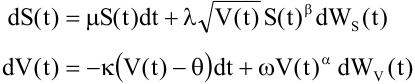

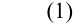

Here μ is the risk neutral drift of the asset price, κ ≥ 0 is the speed of mean-reversion of the variance, θ ≥ 0 is the long-term average variance, and ω ≥ 0 is the so-called volatility of variance or volatility of volatility. Finally, λ is a scaling constant and WS and WV are correlated Brownian motions, with instantaneous correlation coefficient ρ . 

To simplify the exposition, we will mainly concentrate on the special case α = ½ and β = 1, leading to the popular Heston [1993] model. The best performing simulation schemes will however also be tested in a more general example. The Heston model was heavily inspired by the interest rate model of Cox, Ingersoll and Ross [1985], who used the same mean-reverting square root process to model the spot interest rate. It is well known that, given an initial nonnegative value, a square root process cannot become negative, see e.g. Feller [1951], giving the process some intuitive appeal for the modelling of interest rates or variances. The Heston model is often used as an extension of the Black-Scholes model to incorporate stochastic volatility, and is often used for product classes such as equity and foreign exchange, although extensions to an interest rate context also exist, see e.g. Andersen and Andreasen [2002] and Andersen and BrothertonRatcliffe [2005].

<!-- page: 5 -->

Although pricing in the Cox-Ingersoll-Ross (CIR) and Heston models is a well-documented topic, most textbooks seem to avoid the issue of how to simulate these models. If we focus purely on the mean-reverting square-root component of (1), there is not a real problem, as Cox et al. [1985] found that the conditional distribution of V(t) given V(s) is noncentral chi-squared. Both Glasserman [2003] and Broadie and Kaya [2006] provide a detailed description of how to simulate from such a process. Combining this algorithm with recent advances on the simulation of gamma random variables by Marsaglia and Tsang [2000] will lead to a fast and efficient simulation of the mean-reverting square root process. 

Complications arise, however, when we superimpose a correlated asset price, as in (1). As there is no straightforward way to simulate a noncentral chi-squared increment together with a correlated normal increment for the asset price process, the next idea that springs to mind is an Euler discretisation. This involves two problems, the first of which is of a practical nature. Despite the domain of the square root process being the nonnegative real line, for any choice of the time grid the probability of the variance becoming negative at the next time step is strictly greater than zero. As we will see, this is much more of an issue in a stochastic volatility context than in the CIR interest rate model, due to the much higher values typically found for the volatility of variance ω . Practitioners have therefore often opted for a quick “fix” by either setting the process equal to zero whenever it attains a negative value, or by reflecting it in the origin, and continuing from there on. These fixes are often referred to as _absorption_ or _reflection_ , see e.g. Gatheral [2006]. Interestingly this problem also arises in a discrete time setting, a lead we follow up on in the final section. 

The second problem is of both a theoretical and practical nature. The usual theorems leading to strong or weak convergence in Kloeden and Platen [1999] require the drift and diffusion coefficients to satisfy a linear growth condition, as well as being globally Lipschitz. Since the square root is not globally Lipschitz, convergence of the Euler scheme is not guaranteed. Although the global Lipschitz condition on the diffusion coefficient can be relaxed to a local one, see Gyöngy [1998], the square root is not locally Lipschitz around zero. For this reason, various alternative methods have been used to prove convergence of particular discretisations for the square root process. We mention Deelstra and Delbaen [1998], Diop [2003], Bossy and Diop [2004], Alfonsi [2005], and Berkaoui, Bossy and Diop [2008], who deal with the square root process in isolation. 

It is only recently that papers dealing with the simulation of the Heston model in its full glory have started appearing. Andersen and Brotherton-Ratcliffe [2005] were among the first to suggest an approximation scheme for (1) which preserves the positivity of both S and V for general values of α and β . In Broadie and Kaya [2004,2006] an exact simulation algorithm has been devised for the Heston model. In numerical comparisons of their algorithm to an Euler discretisation with the absorption fix, they find that for the pricing of European options in the Heston model and variations thereof, the exact algorithm compares favourably in terms of rootmean-squared (RMS) error. Their algorithm is however highly time-consuming, as we will see, and therefore certainly not recommendable for the pricing of strongly path dependent options that require the value of the asset price on a large number of time instants. Higham and Mao [2005] considered an Euler discretisation of the Heston model with a novel fix, for which they prove strong convergence. To the best of our knowledge they are the first to rigorously prove that using an Euler discretisation in the Heston model is theoretically correct, by proving that the sample averages of certain options converge to the true values. Unfortunately they do not provide numerical results on the convergence of their fix compared to other Euler fixes. The recent paper of Kahl and Jäckel [2006] considers a number of discretisation methods for a wide range of stochastic volatility models. For the Heston model they find that their IJK-IMM scheme, a quasisecond order scheme tailored specifically toward stochastic volatility models, gives the best results. Their numerical results are however not comparable to those of Broadie and Kaya, as they use a strong convergence measure which cannot directly be related to an RMS error. Finally we

<!-- page: 6 -->

should mention the simulation schemes recently constructed by Andersen [2007]. As this paper compares to our full truncation scheme and as it postdates an initial version of our paper, we chose not to include these schemes in our comparison. The schemes, specifically tailored for the Heston model, seem to produce a smaller bias than any scheme considered in this paper, at the cost of a more complex implementation. 

The contribution of this article is threefold. Firstly, we unify all Euler discretisations corresponding to the different fixes for the problem of negative variance known thus far under a single framework. Secondly, we propose a new fix, called the full truncation scheme. Full truncation is a modification of the Euler scheme of Deelstra and Delbaen [1998], which we will refer to as the partial truncation method. The difference between both methods lies in the treatment of the drift. Whereas partial truncation only truncates terms involving the variance in the diffusion of the variance, full truncation also truncates within the drift. In both schemes however the variance process itself remains negative. Both schemes are extended to (1). Following the train of thought of Higham and Mao, we are able to prove strong convergence for both of these fixes. With this proof in hand the pricing of plain vanilla options and certain exotics via Monte Carlo is justified, as we can then appeal to the results of Higham and Mao. Thirdly and finally, we numerically compare all Euler fixes to the other schemes mentioned above in terms of the size of the bias, as well as RMS error given a certain computational budget. 

The article is structured as follows. Section 2 deals with the CEV-SV model and its properties. Section 3 considers simulation schemes for the Heston model. In section 4 we consider Euler schemes for the CEV-SV model and introduce the full truncation scheme, for which we prove strong convergence. Section 5 provides numerical results, whereas section 6 concludes. 

## **2. The CEV-SV model and its properties** 

For reasons of clarity, we repeat equation (1) here, which specifies the dynamics of the asset price and variance process in the CEV-SV model under the risk neutral probability measure: 

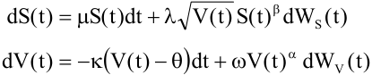

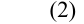

We restrict β to be lie in (0,1] and α to be positive. This model is analysed in great detail in Andersen and Piterbarg [2007]. Before turning to the issue of the simulation of (2) in general and the Heston model in particular, we briefly mention some well-known properties of the process V(t) and S(t) that we require in the remainder of this paper. The mean-reverting CEV process V(t) has the following properties: 

- i) 0 is always an attainable boundary for 0 < α < ½; 

2 ii) 0 is an attainable boundary when α = ½ and ω > 2 κθ . The boundary is strongly reflecting; iii) 0 is unattainable for α > ½; 

iv) ∞ is an unattainable boundary. 

Via the Yamada condition it can be verified that the SDE for V(t) has a unique strong solution when α ≥ ½. For α < ½ we impose that the process for V(t) is reflected in the origin. All properties follow from the classical Feller boundary classification criteria (see e.g. Karlin and 2 Taylor [1981]). Turning to the condition ω > 2 κθ , we mention that to calibrate the Heston model to the skew observed in equity or FX markets, one often requires large values for the volatility of variance ω , see e.g. the calibration results in Duffie, Pan and Singleton [2000] where

<!-- page: 7 -->

ω ≈ 60%. In the CIR model ω , then representing the volatility of interest rates, is markedly lower, see e.g. the calibration results in Brigo and Mercurio [2001, p. 115] where this parameter is around 5%. Moreover, the product κθ is usually of the same magnitude in both models if we use a deterministic shift extension to fit the initial term structure in the CIR model, so that it is safe to say that for typical parameter values the origin will be attainable within the Heston model, whereas in the CIR interest rate model it will not. Concerning ii) we mention that strongly reflecting here means that the time spent in the origin is zero - V(t) can touch zero, but will leave it immediately. The interested reader is referred to Revuz and Yor [1991] for more details. 

Turning to the asset price process in the CEV-SV model, Andersen and Piterbarg [2007] prove that the process S can reach 0 with a positive probability. To ensure that the SDE in (2) has a unique solution, they impose the natural boundary condition that: 

v) S(t) has an absorbing barrier at 0. 

We do the same here, and mention that v) seems to be consistent with the asymptotic expansion derived for the SABR model in Hagan, Kumar, Lesniewski and Woodward [2002]. The SABR model is a special case of an CEV-SV model with θ = 0, κ = - ω2 /4 and α = 1. 

The following section specifically considers the simulation of the Heston model as this model is of great practical importance. 

## **3. Simulation schemes for the Heston model** 

We now turn to the simulation of (2) when α = ½ and β = 1, i.e. the Heston model. Obviously there are myriads of schemes one could use to simulate the Heston model. Though we by no means aim to be complete, we outline some schemes here that yield promising results or are frequently cited. We postpone the treatment of Euler schemes to the next section. Firstly, we demonstrate why in the case of the Heston model it is not wise to change coordinates to the volatility, i.e. the square root of V. Secondly, we briefly discuss the exact simulation method of Broadie and Kaya [2006]. Finally, we take a look at alternative discretisations, in particular the quasi-second order schemes of Ninomiya and Victoir [2004] and Kahl and Jäckel [2006]. 

Apart from the schemes considered in this section, lately a number of papers have appeared in which splitting schemes are considered for mean-reverting CEV processes, see e.g. Moro [2004] and Dornic, Chaté and Muñoz [2005] and Moro and Schurz [2007]. The schemes in these papers heavily rely on an exact solution being known for a subsystem of the original SDE. Whilst this is certainly the case for univariate mean-reverting CEV processes, it does not seem likely that such a splitting can be found for the full-blown CEV-SV model. For this reason we do not further consider these schemes here, though the topic does warrant further study. 

### **3.1. Changing coordinates** 

For reasons of increased speed of convergence it is often preferable to transform an SDE in such a way that it obtains a constant volatility term, see e.g. Jäckel [2002, section 4.2.3]. If we do this for the process V(t) in (2) with α = ½, we can achieve this by considering volatility itself: 

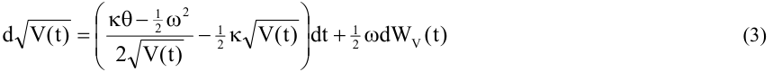

<!-- page: 8 -->

Although this transformation is seemingly correct, we are only allowed to apply Itō’s lemma if the square root is twice differentiable on the domain of V(t). However, since the origin is 2 attainable for ω > 2 κθ , and the square root is not differentiable in zero, the process obtained by incorrectly applying Itō’s lemma is structurally different, as is also mentioned in Jäckel [2004]. Even when the origin is inaccessible, the numerical behaviour of the transformed equation is 2 rather unstable. Unless ω = 2 κθ , when V(t) is sufficiently small, the drift term in (3) will blow up, temporarily assigning a much too high volatility to the stock price, in turn greatly distorting the sample average of the Monte Carlo simulation. Luckily, anyone trying to implement (3) will pick up this feature rather quickly, as will be illustrated in the numerical results in section 4. We mention that similar issues arise with other coordinate transformations, such as switching to the logarithm of V(t). 

### **3.2. Exact simulation of the Heston model** 

As mentioned, Broadie and Kaya [2004,2006] have recently derived a method to simulate without bias from the Heston stochastic volatility model in (2). Although we refer to their papers for the exact details, we outline their algorithm here to motivate why it is highly time-consuming. First of all a large part of their algorithm relies on the result that for s ≤ t, V(t) conditional upon V(s) is, up to a constant scaling factor, noncentral chi-squared: 

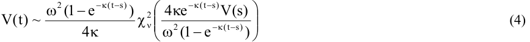

> where χν 2 ( ξ ) is a noncentral chi-squared random variable with ν degrees of freedom and non− 2 centrality parameter ξ . The degrees of freedom are equal to ν = 4 κθω . Glasserman [2003] as well as Broadie and Kaya show how to simulate from a noncentral chi-squared distribution. Combining this with recent advances by Marsaglia and Tsang [2000] on the simulation of gamma random variables (the chi-squared distribution is a special case of the gamma distribution), leads to a fast and efficient simulation of V(t) conditional upon V(s). 

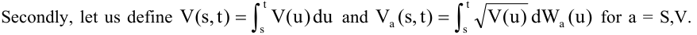

First of all Broadie and Kaya recognized that integrating the equation for the variance yields: 

V)t( = V)s( − κ V)t,s( + κθ t( − )s + ω VV )t,s( (5) 

so that we can calculate VV(s,t) if we know V(s), V(t) and V(s,t). Knowing all these terms, and solving for ln S(t) conditional upon ln S(s) yields the final step: 

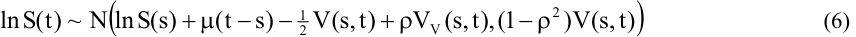

where N indicates the normal distribution. The algorithm can thus be summarised by: 

1. Simulate V(t), conditional upon V(s) from (4) 

2. Simulate V(s,t) conditional upon V(t) and V(s) 

3. Calculate VV(s,t) from (5) 

4. <u>Simulate S(t) given V(s,t), VV(s,t) and S(s), by means of (6)</u> 

**Algorithm 1:** Exact simulation of the Heston model by Broadie and Kaya

<!-- page: 9 -->

The crucial and time-consuming step is the one we skipped over for a reason – step 2. Broadie and Kaya show how to derive the characteristic function of V(s,t) conditional upon V(t) and V(s). This step utilises the transform method, so that one has to numerically invert the cumulative distribution function, itself found by the numerical Fourier inversion of the characteristic function. Since the characteristic function non-trivially depends on the two realisations V(s) and V(t) via e.g. modified Bessel functions of the first kind, it is not trivial to cache a major part of the calculations. Hence we must repeat this step at each path and date that is relevant for the derivative at hand. It suffices to say that this makes step 2 very time-consuming and unsuitable for highly path-dependent exotics. 

### **3.3. Quasi-second order schemes** 

In Glasserman [2003, pp. 356-358], a quasi-second order4 Taylor scheme is considered. Its convergence is found to be rather erratic, which is one of the reasons why Broadie and Kaya [2006] chose not to compare their exact scheme to second order Taylor schemes. A closer look at Glasserman’s scheme shows the probable cause of this erratic convergence – the discretisation contains terms which are very similar to the drift term in (3), and can therefore become quite large when V(t) is small. Since then, two papers have applied second order schemes to either the mean-reverting square root process or the Heston model in its full-fledged form, namely Alfonsi [2005] and Kahl and Jäckel [2006]. We start with the latter. After comparing a variety of schemes, Kahl and Jäckel conclude that at least for the Heston model applying the implicit Milstein method5 (IMM) to the variance, combined with their bespoke IJK scheme for the logarithm of the stock price, yields the best results as measured by a strong convergence measure. Their results indicate that their scheme by far outperforms the Euler schemes with the absorption fix. The IMM method discretises the variance as follows: 

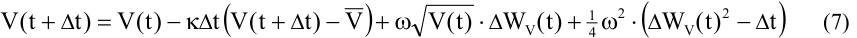

The IMM method actually preserves positivity for the mean-reverting square root process, 2 provided ω < 4 κθ , see Kahl [2004]. Unfortunately, this condition is not frequently satisfied in an implied calibration of the Heston model. For values outside this range, a fix is again required. The best scheme for the logarithm of the stock price is their IJK scheme: 

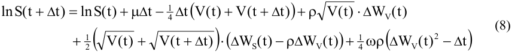

which is specifically tailored to stochastic volatility models, where typically ρ is highly negative. For more details on both discretisations, we refer the interested reader to Kahl [2004] and Kahl and Jäckel [2006]. In the remainder we will refer to (7)-(8) as the IJK-IMM scheme. 

Alfonsi [2005] deals with the mean-reverting square root process in isolation, and develops an implicit scheme that also preserves positivity by considering the transformed equation (3). The 2 range of parameters for which the scheme works is again ω < 4 κθ . He also considers Taylor expansions of this implicit scheme, the best of which (his E(0) scheme) is equivalent to (7) to first order in Δ t. We therefore purely focus on Kahl and Jäckel’s scheme in our numerical results. As 

> 4  By quasi-second order we mean schemes that do not simulate the double Wiener integral. 

> 5  Though they consider the balanced Milstein method (BMM), for the square root process their control functions (see their figure 6) coincide with the implicit Milstein method. From now on we will therefore refer to their scheme as the IJK-IMM scheme.

<!-- page: 10 -->

an interesting sidenote, the E(0) scheme coincides exactly with a special case of the variance equation in the Heston and Nandi [2000, Appendix B] model, which they show converges to the mean-reverting square-root process as the time step tends to zero. 

Finally, we consider a second-order scheme proposed in Ninomiya and Victoir [2004] for SDEs whose drift and diffusion coefficients are smooth functions with bounded derivatives of any order. Though the scheme converges weakly with order 2, it does not seem applicable to the Heston model – the first derivative of the square root function is already not bounded. The example the authors consider however is based in the Heston model, and does, for their choice of parameters, seem to have a second order convergence. Nevertheless, as the technical conditions on the drift and diffusion coefficients are not satisfied, we will refer to the scheme as a quasisecond order scheme. 

Let us first describe their scheme for a fully general SDE in Stratonovich form: 

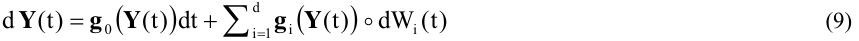

where **Y** ∈ n and **g** i:  n →  n for i = 1, ... d are smooth functions whose derivatives of any order are bounded. Starting from **y** (t), a discretisation of **Y** (t), the value at the next time step is: 

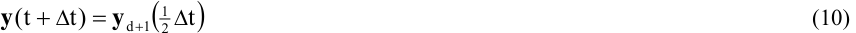

which is found by solving the following d+2 ordinary differential equations (ODEs): 

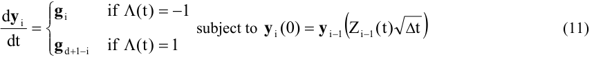

> for i = 0, ..., d+1. With the exception of Z 0 = 12 Δ t , all Zi(t)’s for i = 1, ..., d are i.i.d. standard 

> normal random variables. Further, Λ (t) is an independent Bernoulli random variable of parameter 1/2, and the initial condition of the last ODE is **y** 0(0) = **y** (t). Finally, **g** d+1 = **g** 0. If available, closedform solutions to the ODE should be preferred, otherwise one can turn to approximations. 

> Ninomiya and Victoir’s example dealt with the Heston model for ρ = 0 and considered the T T 

> system **Y** )t( = ( St(), V)t( ) . We consider their scheme for **Y** )t( = ( Xt(), V)t( ) , where X(t) is ln S(t), for general values of ρ . The Stratonovich SDE for this system is: 

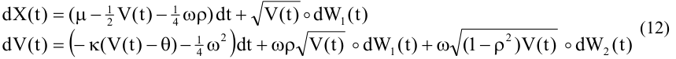

Before stating the NV scheme, we first need to deal with one problematic ODE. 

**Lemma 1:** 

′ The solution to the ODE v )t( = α v)t( , with v(0) ≥ 0 a known constant, is: 

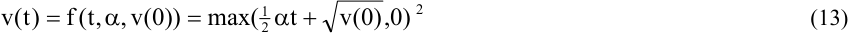

> if we make the choice that v(t) immediately leaves the origin when v(0) = 0 and α , t ≥ 0.

<!-- page: 11 -->

##### **Proof:** 

> Let us assume that t ≥ 0 as by symmetry the solution for t < 0 is the same as that for v(-t) from the 

> above ODE with - α . The general solution is: 

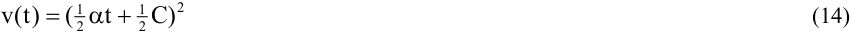

with C an arbitrary constant. In order to satisfy the initial condition, C has to equal ± 2 v(0) . It is clear that v(t) must be monotonically decreasing when α < 0, and increasing when α > 0. As v ′ (0) = <u>12</u> α C , C must be positive and thus C = 2 v(0) . The solution for α < 0 needs to be adapted slightly. The time at which v reaches zero follows as the solution to v(t* ) = 0 in (14): 

t * = − 2 α v(0) (15) 

Hereafter, v(t) must be absorbed in zero, as v(t) must remain nonnegative and its derivative cannot be positive. The only problematic case is when α > 0 and v(0) = 0. As the square root is not Lipschitz in 0, it follows that the solution to the ODE with v(0) = 0 is not guaranteed to be unique. Indeed, both v(t) = 0 and v)t( = <u>14</u> α 2t 2 are valid solutions, and can be combined to create an infinite number of solutions. As the origin is strongly reflecting for the square root process, we choose the latter to remain as close to the SDE as possible. This leads to (13). � 

We remark that the ODE in lemma 1 is incorrectly solved in Ninomiya and Victoir’s paper. We expect this to be less important in their example, as ω is there 10%. With the aid of lemma 1, the solutions to the ODEs in (11) now follow as: 

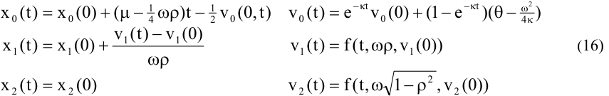

where f is the solution in (13), and: 

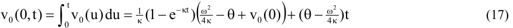

We trust the reader can grasp how the scheme works. As in the schemes of Kahl and Jäckel and Alfonsi, the condition ω2 < 4 κθ ensures the variance remains positive, as otherwise v0(t) becomes negative for t > − κ 1 ln 4 κθ 4 −κθω− 2 ω− 24 κ v ≡ t*(v) . When ω2 > 4 κθ we fix this by using v0( τ ) instead of v0(t), and v0(0, τ ) in x0(t) instead of v0(0,t), where τ = min(t* (v0(0)), t). 

As a final remark, it should be clear that not absorbing v in zero is the right choice. If we would absorb, consider the situation where ω2 < 4 κθ and v(0) = 0. Then v(t) = 0, and: 

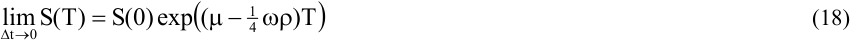

which clearly is undesirable. As we will see the forward asset price is still far from the correct one, even if we impose that v(t) leaves zero immediately. For this reason we omit numerical results for those configurations where ω2 < 4 κθ is violated.

<!-- page: 12 -->

## **4. Euler schemes for the CEV-SV model** 

Given that the exact simulation method of Broadie and Kaya can be rather time-consuming, as well as the fact that no exact scheme is likely to be devised for the non-affine CEV-SV model, a simple Euler discretisation is certainly not without merit. Even if in future a more efficient exact simulation method for the Heston model would be developed, Euler and higher-order discretisations will remain useful for strongly path-dependent options and stochastic volatility extensions of the LIBOR market model, see e.g. Andersen and Andreasen [2002] and Andersen and Brotherton-Ratcliffe [2005], as it is unlikely that the complicated drift terms in such models will allow for exact simulation methods to be devised. 

In Section 4.1 we firstly unify all presently known Euler discretisations for the CEV-SV model into one framework. Section 4.2 compares all schemes and makes a case for a new scheme – the full truncation scheme. In Section 4.3 we prove strong convergence of this scheme. Finally, Section 4.4 takes a look at the Euler scheme of Andersen and Brotherton-Ratcliffe [2005], which preserves positivity of the variance process in an alternative way. 

### **4.1. Euler discretisations - unification** 

Turning to Euler discretisations, a naïve Euler discretisation for V in (1) would read: 

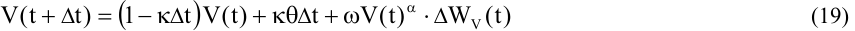

> with Δ WV(t) = WV(t+ Δ t) – WV(t). When V(t) > 0, the probability of V(t+ Δ t) going negative is: 

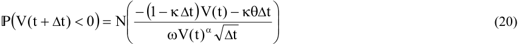

where N is the standard normal cumulative distribution function. Although the probability decays as a function of the time step Δ t, it will be strictly positive for any choice hereof. Furthermore, since ω typically is much higher in a stochastic volatility setting than in an interest rate setting, the problem will be much more pronounced for the Heston model. Without care, the scheme for V will not be defined, so we will have to decide what to do in case V turns negative. Practitioners have often opted for a quick “fix” by either setting the process equal to zero whenever it attains a negative value, or by reflecting it in the origin, and continuing from there on. These fixes are often referred to as _absorption_ and _reflection_ respectively, see e.g. Gatheral [2006]. We note that this terminology is somewhat at odds with the terminology used to classify the boundary behaviour of stochastic processes, see Karlin and Taylor [1981]. In that respect the absorption fix is much more similar to reflection in the origin for a continuous stochastic process, whereas absorption as a boundary classification means that the process stays in the absorbed state for the rest of time. Deelstra and Delbaen [1998] and Higham and Mao [2005] have considered other approaches for fixing the variance when it becomes negative. These are discussed below. 

All of these Euler schemes can be unified in a single general framework: 

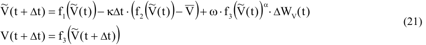

<!-- page: 13 -->

where V~ (0) = V(0) and the functions fi, i = 1 through 3 have to satisfy: 

- f i (x) = x for x ≥ 0 and i = 1, 2, 3; 

- f i (x) ≥ 0 for x ∈  and i = 1, 3. 

The second condition is a strict requirement for any scheme: we have to fix the volatility term when the variance becomes negative. The first condition seems quite a natural thing to ask from a simulation scheme: if the volatility is not negative, the “fixing” functions f1 through f3 should collapse to the identity function in order not to distort the results. In the remainder we use the identity function x, the absolute value function |x| and x+ = max(x,0) as fixing functions. Obviously only the last two are suitable choices for f3. The schemes considered thus far in the literature, as well as our new scheme that is introduced below, are summarised in Table 1. 

|**Scheme**|**Paper**|**f1(x)** |**f2(x)** |**f3(x)** |
|---|---|---|---|---|
|Absorption|Unknown|x+|x+|x+|
|Reflection|Diop [2003], Bossy and Diop [2004], Berkaouiet al. [2008]||x|||x|||x||
|HighamandMao|HighamandMao [2005]|x|x||x| |
|Partialtruncation|Deelstra andDelbaen[1998]|x|x|x+|
|Fulltruncation|Lord,Koekkoekand Van Dijk[2007]|x|x+|x+|

**Table 1:** Overview of Euler schemes known in the literature 

While the mentioned papers, apart from Higham and Mao, have dealt with the mean-reverting CEV process in isolation, we also have the asset price S to simulate. For the asset price we switch to logarithms, as in Andersen and Brotherton-Ratcliffe [2005]. This guarantees non-negativity: 

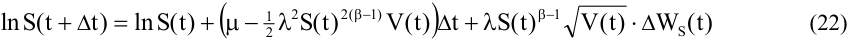

and automatically ensures that the first moment of the asset is matched exactly. In an implementation of (22) one would use the Cholesky decomposition to arrive at Δ WS)t( = ρΔ WV)t( + 1 − ρ 2 Δ Z)t( , with Z(t) independent of WV(t). Note that special care has to be taken when S(t) drops to zero, due to property v). 

### **4.2. Euler discretisations – a comparison and a new scheme** 

One thing to keep in mind when fixing negative variances is the behaviour of the true process. At the beginning of this section we mentioned that the origin is strongly reflecting if it is attainable, in the sense that when the variance touches zero, it leaves again immediately. If we think of both the reflection and the absorption fixes in a discretisation context, the absorption fix seems to capture this behaviour as closely as possible. To analyse the behaviour of all fixes, it is worthwhile to consider the case where an Euler discretisation causes the variance to go negative, say V~ )t( = −δ < 0 , whereas the true process would stay positive and close to zero, V(t) = ε ≥ 0. In Table 2 we have depicted the new starting point f1 ( V~ )t( ) , the effective variance6 f 3 ( V~ )t( ) and the drift for all fixes as well for the true process. 

> 6  By effective variance we mean the instantaneous variance of the stock price.

<!-- page: 14 -->

|**Scheme**|**New starting point**|**Effective variance**|**Drift**|
|---|---|---|---|
|Trueprocess|ε|ε|κ(θ-ε)|
|Absorption|0|0|κθ|
|Reflection|δ|δ|κ(θ-δ)|
|Higham and Mao|-δ|δ|κ(θ+δ)|
|Partial truncation|-δ|0|κ(θ+δ)|
|Full truncation|-δ|0|κθ|

**Table 2:** Analysis of the dynamics when V(t) = ε ≥ 0, but the Euler discretisation equals - δ < 0 

A priori we expect that the effect of a misspecified effective variance will be the largest, as this directly affects the stock price on which the options we are pricing depend. From Table 2 it seems that reflection has the closest resemblance to the true scheme. However, if δ > ε , which often is the case, it can be expected that the misspecified variance will cause a larger positive bias than absorption. It is worthwhile to note that in the context of the Heston model it has been numerically demonstrated by Broadie and Kaya [2006] that the absorption fix induces a positive bias in the price of a plain vanilla European call. The Higham and Mao fix tries to lower the bias in the reflection scheme by letting the auxiliary process V~ )t( remain negative. This however has an undesirable side-effect when at the same time reflecting the variance in the origin to obtain the effective volatility. If V~ )t( drops even further, the effective variance f 3 ( V~ )t( ) will be much too 

high, in turn causing larger than intended moves in the stock price. 

Both the schemes by Deelstra and Delbaen and ourselves can be interpreted as corrections to the absorption scheme. As in the Higham and Mao scheme, both schemes aim to achieve this by allowing the auxiliary process to attain negative values. Contrary to the Higham and Mao scheme, the side-effect of leaving the auxiliary variance negative is not present here, as the effective variance is set equal to zero. We dub the scheme by Deelstra and Delbaen the partial truncation scheme, as only terms involving V in the diffusion of V are truncated at zero. Note that Glasserman [2003, eq. (3.66)] also uses this scheme for the CIR process. As will be demonstrated in the numerical results, partial truncation still causes a positive bias. With a view to lowering the bias, we introduce a new Euler scheme, called full truncation, where the drift of V is truncated as well. By doing this the auxiliary process remains negative for longer periods of time, effectively lowering the volatility of the stock, which helps in reducing the bias. 

Though this argumentation is heuristic and hard to prove rigorously, the first moment of all “fixed” Euler schemes matches the pattern we described above. 

##### **Lemma 2:** 

When Δ t < 1/ κ the first moments of V~ )t( in the various “fixed” Euler schemes in Table 1 satisfy the following ordering: 

Reflection > Absorption > Higham-Mao = Partial truncation > Full truncation 

##### **Proof:** 

We consider a finite time horizon [0,T], discretised on a uniform grid tn = n Δ t, n = 1, …, T/ Δ t. Let us denote all discretisations as: 

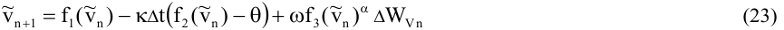

<!-- page: 15 -->

with~ v n indicating the value of the discretisation at tn and Δ WVn = WV(tn+1) – WV(tn). Let us define the first moment as x n = [~ vn ] , where the expectation is taken at time 0. The first moment of the Higham-Mao scheme can be shown to satisfy the difference equation x n + 1 = 1( − κΔ )tx n + κΔ t θ , which by noting that x0 = v0 can be solved as: 

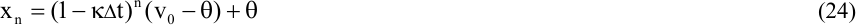

The result holds regardless of the chosen function f3, and therefore also holds for the partial truncation scheme. This is an accurate approximation of the first moment of the continuous process V(t), as it is a well-known result that [Vt()] = 1( − e −κ t )(V(0) − θ ) + θ . Since we initially have x0 = v0 for all schemes, the remaining results can be found by noting that: 

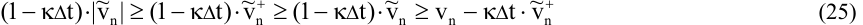

which are the drift terms of, from left to right, the reflection, absorption, Higham-Mao, partial and full truncation schemes. As xn+1 is exactly the expectation of these terms, the statement follows by induction, starting with n = 0. In the second step (n = 1) the inequality already becomes strict, as in each of the schemes v1 can become negative. � 

Certainly the first moment is not all that matters, but the above lemma does demonstrate that both the Higham-Mao and truncation fixes adjust respectively the reflection and absorption fixes such that the first moment is lowered. Both the partial truncation and the Higham-Mao scheme already obtain an accurate approximation of the true first moment. By truncating the drift, full truncation pulls the first moment down even further, with a view to adjust any remaining bias of the partial truncation scheme. 

### **4.3. Strong convergence of the full truncation scheme** 

As it is our final goal to price derivatives in the Heston model, we have to be absolutely sure that the sample averages of the realised payoffs converge to the option prices as the time step used in the discretisation tends to zero. For European options weak convergence is typically enough to prove this result for Euler discretisations, see e.g. Kloeden and Platen [1999], although for more complex path-dependent derivatives strong convergence may be required. As mentioned earlier though, the non-Lipschitzian dynamics of the CEV-SV model preclude us from invoking the usual theorems on weak and strong convergence of Euler discretisations. Focusing on meanreverting CEV processes, many authors have proven convergence of their particular discretisation. Recently, Diop [2003] and Bossy and Diop [2004] have proven that an Euler discretisation with the reflection fix converges weakly for a variety of mean-reverting CEV processes. For the special case of the mean-reverting square root process, weak convergence of order 1 in the time step is proven, provided that ω 2 < <u>12</u> κθ . This certainly ensures that the origin is not attainable. As the proof may carry over to the general case, we mention that the order of convergence derived is min (κθω− 2, 1 ) . Diop proves strong convergence in the Lp (p ≥ 2) sense of order ½ under a very restrictive condition, which is relaxed somewhat in Berkaoui et al. [2008]. For p = 2 the condition becomes: 

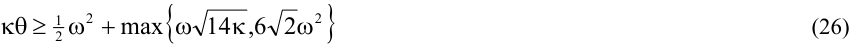

<!-- page: 16 -->

One can easily check that, unfortunately, this condition is hardly ever satisfied for any practical values of the parameters. Both Higham and Mao and Deelstra and Delbaen prove strong convergence for their discretisation, without any restrictions on the parameters. As for the absorption scheme, to the best of our knowledge there is no paper dealing with the convergence properties of the absorption fix, although its use in practice is widespread, see e.g. Broadie and Kaya [2004,2006] and Gatheral [2006]. 

For the mean-reverting CEV process in isolation, following Deelstra and Delbaen and Higham and Mao, we use Yamada’s [1978] method to find the order of strong convergence. In the proof we restrict α to lie in the interval [½, 1]. This seems to be the case for most practical applications so that the restriction is not that severe. The big picture of our proof is identical to that of Higham and Mao, but the truncated drift complicates the proofs considerably. The full proof is given in the Appendix, here we merely report the main findings. 

First let us introduce some notation. The discretisation has already been introduced in equation (23) of lemma 2. For the full truncation scheme we have f1(x) = x and f2(x) = f3(x) = x+ . To distinguish between the discretisation of the variance and the true process, we will denote the discretisation with lowercase letters and the true process with uppercase letters. Following Higham and Mao [2005] we also require the continuous-time approximation of (23): 

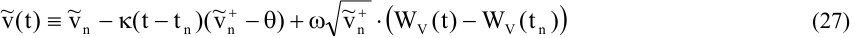

The convergence of the full truncation scheme is proven in the following theorem. 

##### **Theorem – Strong convergence of v(t) in the L****1** **sense** 

The full truncation scheme converges strongly in the L1 sense, i.e. for sufficiently small values of the time step Δ t we have: 

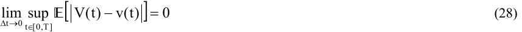

**Proof:** See the appendix. � 

Although the above theorem is only proven for the full truncation scheme, it also holds for the partial truncation scheme, albeit with a slightly easier proof. As the proof of strong convergence for the full CEV-SV process and the proof of convergence for plain-vanilla and barrier option prices are quite similar to those provided by Higham and Mao, we omit them here. 

### **4.4. Euler schemes with moment matching** 

Before comparing all schemes to each other, we finally mention a moment-matching Euler scheme suggested by Andersen and Brotherton-Ratcliffe [2005]. In their discretisation, the variance V is locally lognormal, where the parameters are determined such that the first two moments of the discretisation coincide with the theoretical moments: 

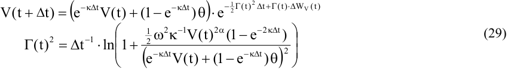

<!-- page: 17 -->

The advantage of this scheme is that no “fixes” have to be used to prevent the variance from becoming negative. As mentioned earlier, Andersen [2007] constructs more discretisations for the Heston model along the lines of (29), taking the shape of the Heston density function into account.  We only compare to (29) and show that it is already much more effective than many of the Euler fixes mentioned in Section 4.1. 

## **5. Numerical results** 

The previous section established the strong convergence of the full truncation scheme. Though it is certainly useful to theoretically establish the convergence of a scheme, at the end of the day we should be interested in what practitioners really care about: the size of the mispricing given a certain computational budget. It is our goal in this section to compare all mentioned schemes to each other. In our comparisons we take into account both the bias and RMS error, as well as the computation time required. To be clear, if α is the true price of a European call, and α ˆ is its ˆ Monte Carlo estimator, the bias of the estimator equals [ α ] − α , the variance of the estimator is 

Var( α ˆ ) , and finally the root-mean-squared error (RMS error or RMSE) is defined as (bias2 +variance)1/2 . This fills an important gap in the literature as far as the Euler fixes are concerned, as we do not know of a numerical study that compares the various fixes to one another. In the context of the Heston model, Broadie and Kaya only consider the absorption scheme, and estimate its order of weak convergence to be about ½. Alfonsi [2005] compares both reflection and partial truncation to his scheme, but only for the mean-reverting square root process in isolation. 

|**Example**|κ|ω|ρ|θ|**V(0)**|α|
|---|---|---|---|---|---|---|
|**SV-I **|2|1|-0.3|0.09|0.09|0.5|
|**SV-II**|0.5|1|-0.9|0.04|0.04|0.5|
|**SV-III**|0.5|1|0|0.04|0.04|0.5|
|**SVJ**|3.99|0.27|-0.79|0.014|0.008836|0.5|
|**CEV-SV**|1|1.4|0|1|1|0.75|

**Table 3:** Parameter configurations of the examples used 

The parameter configurations we consider for the variance process are given in Table 3. We first focus on the Heston (SV) model, and next consider the Bates (SVJ) model. The latter is an extension of the Heston model to include jumps in the asset price. Clearly all results readily carry over to further extensions of the Heston model, such as the models by Duffie, Pan and Singleton [2000] and Matytsin [1999], both of which add jumps to the stochastic variance process. The final subsection considers a non-Heston CEV-SV model. 

### **5.1. Results for the Heston model** 

In this subsection we investigate the performance of the various simulation schemes for the Heston model. As Heston [1993] solved the characteristic function of the logarithm of the stock price, European plain vanilla options can be valued efficiently using the Fourier inversion approach of Carr and Madan [1999]. For very recent developments with regard to the evaluation of the multi-valued complex logarithm in the Heston model we refer the interested reader to Lord and Kahl [2007a]. Among other things, this paper proves how to keep the characteristic function in both the Heston model and Broadie and Kaya’s exact simulation algorithm continuous for all possible inputs. Finally, for a very efficient Fourier inversion technique which works for virtually all strike prices and maturities we point the reader to Lord and Kahl [2007b].

<!-- page: 18 -->

For the Heston model we consider three parameter configurations, which can be found in 2 Table 3. In all three examples ω >> 2 κθ , implying that the origin of the mean-reverting square root process is attainable. An example where the origin is not attainable is deferred to section 5.2. For the quasi-second order scheme of Kahl and Jäckel this means we have to use a fix. We opted for the absorption fix, which they also use in their examples. The probability of a particular discretisation yielding a negative value for V(t) is magnified via the large value of ω , cf. equation (20), so that the way in which each discretisation treats the boundary condition will be put to the test. The first example stems from Broadie and Kaya [2006], and is the harder of the two examples they consider. Conveniently, using the example of Broadie and Kaya allows us to compare all biased schemes to their exact scheme. The second example stems from Andersen [2007], where it is used to represent the market for long-dated FX options. The lower level of mean-reversion should make the example more challenging than the first. The third example finally is used to price a double-no-touch option. The correlation of example SV-II is changed to zero here, as this allows us to use reference values from the literature. 

As Broadie and Kaya report computation times for both the Euler scheme with absorption and their exact scheme, we scaled our computation times to match their results. Their results were generated on a desktop PC with an AMD Athlon 1.66 GhZ processor, 624 Mb RAM, using Microsoft Visual C++ 6.0 in a Windows XP environment. Relative to the Euler schemes from section 4.2, the IJK-IMM scheme, the Andersen and Brotherton-Ratcliffe (ABR) scheme and the Ninomiya and Victoir (NV) scheme take respectively 14%, 16% and 25% longer to value a European option. One final word should be mentioned on the implementation of the biased simulation schemes. Clearly, the efficiency of the simulations could be improved greatly by using the conditional Monte Carlo techniques of Willard [1997]. As Broadie and Kaya point out, this only affects the standard error and the computation time, not the size of the bias, which arises mainly due to the integration of the variance process. We therefore chose to keep the implementation as straightforward as possible. 

Starting with the first example, Table 4 reports the biases of all biased schemes for an at-themoney (ATM) call. To obtain accurate estimates of the bias we used 10 million simulation paths. If a bias is not significantly different from zero at the 95% confidence level, it is marked bold. The first thing to notice is the enormous difference in the magnitude of the bias, demonstrating the need for an appropriate fix. To relate the size of the bias to implied volatilities, we can glance at Figure 1. Even with twenty time steps per year the bias of the full truncation scheme is only 7 basispoints (bp) for the ATM call, i.e. the option has an implied volatility of 28.69% instead of 28.62%. This is already accurate enough for practical purposes. In contrast, the bias for the absorption scheme is 3.02%, and 6.28% for the reflection scheme. The ABR scheme seems to yield the best results for the ATM case, though Figure 1 demonstrates that considered over all strikes the bias of the full truncation scheme is much lower and more stable. 

For the order of weak convergence, it is worthwhile to note that under suitable regularity conditions, see e.g. Theorem 14.5.2. of Kloeden and Platen [1999], the Euler scheme converges weakly with order 1 in the time step. Though the SDE for the mean-reverting square root process does not satisfy these conditions, and it is quite hard to properly estimate the weak order7 of convergence with only 10 million paths, both truncation schemes seem to regain this weak order. In contrast, absorption and reflection have a weak order of convergence slightly under ½. 

For the quasi-second-order IJK-IMM scheme we note the convergence is somewhat erratic, similar to the aforementioned findings of Glasserman [2003, pp. 356-358]. The bias seems to increase when increasing the number of time steps per year from 40 to 80. In contrast, the absolute value of the bias decreases uniformly for all Euler schemes, neglecting those cases where the bias is statistically indistinguishable from zero. 

> 7 The order of weak convergence was estimated here by regressing ln(|bias|) on a constant plus ln( Δ t).

<!-- page: 19 -->

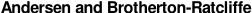

<!-- Start of picture text -->
Andersen and Brotherton-Ratcliffe <!-- End of picture text -->

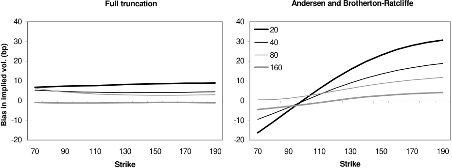

<!-- Start of picture text -->
Full truncation Andersen and Brotherton-Ratcliffe 40 40 20 30 30 40 80 20 20 160 10 10 0 0 -10 -10 -20 -20 70 90 110 130 150 170 190 70 90 110 130 150 170 190 Strike Strike  ... Bias in implied vol. (bp) <!-- End of picture text -->

**Figure 1:** Bias as a function of the strike and the time step in example SV-I 

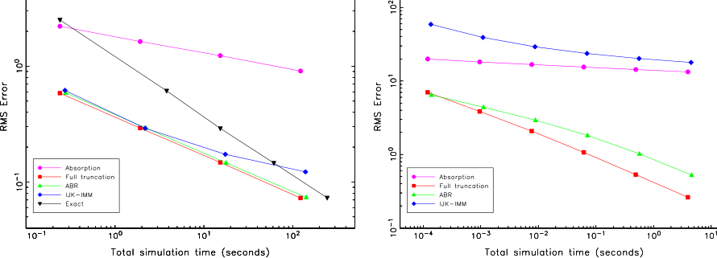

**Figure 2:** Convergence of the RMS error in the Heston model for an ATM call Left panel: SV-I example, Right panel: SV-II example 

|**Steps/yr.**|**A**|**R**|**HM**|**PT**|**FT**|**ABR**|**IJK-IMM**|
|---|---|---|---|---|---|---|---|
|20|2.114|4.385|2.732|0.424|0.052|**0.004**|-0.223|
|40|1.602|3.207|1.680|0.197|**0.031**|**-0.001**|**-0.016**|
|80|1.225|2.388|1.046|0.096|**0.027**|**0.015**|0.094|
|160|0.906|1.759|0.615|**0.020**|**-0.008**|**-0.014**|0.098|
|**O(**Δ**t ****p****)**|0.41|0.44|0.71|1.42|0.82|-0.94|0.10|

**Table 4:** Bias when pricing an ATM call in example SV-I Asset price process: S(0) = 100, μ = r = 0.05, λ = 1, β = 1 Deal specification: European call option, Maturity 5 yrs. True option price: 34.9998. 

|**Paths**|**Steps/yr.**|**Full** |**truncati** |**on** ||**ABR** ||**Exact s** |**cheme** |
|---|---|---|---|---|---|---|---|---|---|
|||**Bias**|**RMSE**|**CPU**|**Bias**|**RMSE**|**CPU**|**RMSE**|**CPU**|
|10,000|20|0.052|0.585|0.2|**0.004**|0.590|0.3|0.613|3.8|
|40,000|40|**0.031**|0.292|1.9|**-0.001**|0.293|2.2|0.290|15.3|
|160,000|80|**0.027**|0.147|15.4|**0.015**|0.146|17.8|0.146|61.3|
|640,000|160|**-0.008**|0.073|122.6|**-0.014**|0.074|142.1|0.073|244.5|
||**O(**Δ**t ****p****)**|0.95|1.00||-0.94|1.00||1.02||

**Table 5:** Bias, RMS error and CPU time (in sec.) in the example SV-I for an ATM call

<!-- page: 20 -->

Finally, let us examine the RMS error and computation time. These are reported in Table 5 for full truncation, ABR and the exact scheme. In the left panel of Figure 2 the RMSE is plotted as a function of the time step for all schemes. The choice of the number of paths is an important issue here. Duffie and Glynn [1995] have proven that if the weak order of convergence is p, one should increase the number of paths proportional to ( Δ t)-p. When p = 1, this means that if the time step is halved, we should quadruple the number of paths. Obviously, a priori we often do not have an exact value for p, nor do we know the optimal constant of proportionality. We refer the interested reader to the discussion in Broadie and Kaya for the rationale behind the choice of the number of paths in this example. The convergence of the exact scheme is clearly the best. The method produces no bias and hence has O(N-1/2) convergence8 , N being the number of paths. For a scheme that converges weakly with order p, Duffie and Glynn have proven that for the optimal allocation the RMSE has O(N-p/(2p+1)) convergence. Indeed, all biased schemes show a lower rate of convergence than the exact scheme. However, due to the fact that the full truncation scheme already produces virtually no bias with only twenty time steps per year, the RMSEs of both schemes are roughly the same. 

For the SV-II example we only report the bias in Table 6 as results from the exact scheme are not available to us for this parameter configuration. Again, the truncation schemes outperform the simple Euler schemes by far. Though the ABR scheme initially has a lower bias, it converges 

|**Steps/yr.**|**A**|**R**|**HM**|**PT**|**FT**|**ABR**|**IJK-IMM**|
|---|---|---|---|---|---|---|---|
|1|18.962|48.472|32.332|12.219|6.371|5.438|57.924|
|2|17.959|43.321|32.433|8.503|3.710|4.136|38.866|
|4|16.720|37.842|24.983|5.682|2.041|2.863|29.176|
|8|15.481|33.161|22.163|3.596|1.055|1.801|23.683|
|16|14.321|29.200|17.508|2.148|0.525|1.016|20.218|
|32|13.305|25.987|13.988|1.205|0.259|0.523|17.859|
|**O(**Δ**t ****p****)**|0.10|0.18|0.25|0.67|0.93|0.68|0.33|

**Table 6:** Bias when pricing an ATM call in example SV-II Asset price process: S(0) = 100, μ = r = 0, λ = 1, β = 1 

Deal specification: European call option, Maturity 10 yrs. True option price: 13.0847. 

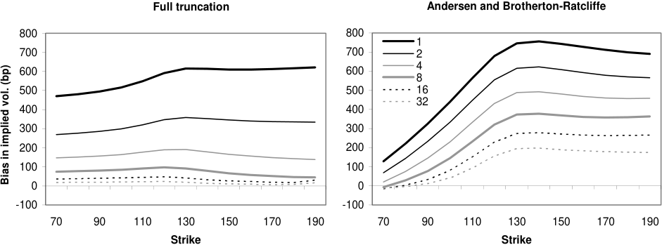

<!-- Start of picture text -->
Full truncation Andersen and Brotherton-Ratcliffe 800 800 1 700 700 2 4 600 600 8 500 500 16 32 400 400 300 300 200 200 100 100 0 0 -100 -100 70 90 110 130 150 170 190 70 90 110 130 150 170 190 Strike Strike  ... Bias in implied vol. (bp) <!-- End of picture text -->

**Figure 3:** Bias as a function of the strike and the time step in example SV-II 

> 8 The discussion here clearly only holds true when using pseudo random numbers, as we do in this paper. In a Quasi-Monte Carlo setting the convergence would be O((ln N)2 /N).

<!-- page: 21 -->

considerably slower than the full truncation scheme. Considered over all strikes the full truncation again generates the least bias, making it the clear winner. Interestingly, the IJK-IMM scheme performs much worse than in the SV-I example – the bias is too large for any practical application. As mentioned in Section 3.3 we do not consider the NV scheme for the parameter 2 configurations where ω > 2 κθ , as even the forward is already far from correct. This is particularly evident in this example. If we take e.g. 32 steps per year, the forward price of the asset in the NV scheme equals roughly 179. Considering the fact that the reflection scheme, which at 32 steps per year has the highest bias of the schemes considered, produces a forward price of 101 (the correct answer is 100), it should be clear that the NV scheme is unsuitable when the origin of the square root process is attainable. 

So far we have only considered the bias present in European option prices, which reflects the terminal distribution of the underlying asset. As a measure of how well these schemes approximate the joint distribution of the asset at various times, we will investigate the bias in double-no-touch prices, which are path-dependent options. A double-no-touch option pays 1 unit of currency if the spot price never hits one of the two barriers. Such options are not uncommon in FX option markets. One reason why we consider them here is that Faulhaber [2002] has shown9 how to modify Lipton’s [2001] eigenfunction expansion approach in order to price double-notouch options when ρ = 0 and the underlying has no drift. This conveniently allows us to generate a reference value with which the simulated values can be compared. Note that both barriers are continuously monitored. 

|**Steps/yr.**|**A**|**R**|**HM**|**PT**|**FT**|**ABR**|**IJK-IMM**|
|---|---|---|---|---|---|---|---|
|250|-0.190|-0.372|-0.358|0.020|0.022|0.017|-0.235|
|500|-0.182|-0.346|-0.329|0.016|0.017|0.015|-0.228|
|1000|-0.174|-0.321|-0.301|0.012|0.013|0.012|-0.218|
|2000|-0.165|-0.298|-0.275|0.009|0.010|0.009|-0.207|

**Table 7:** Bias when pricing a double-no-touch option in example SV-III Asset price process: S(0) = 100, μ = r = 0, λ = 1, β = 1 

Deal specification: 1 yr. double-no-touch option, barriers at 90 and 110. True price: 0.5011. 

In Table 7 the bias of the various schemes is reported. The number of time steps per year coincides with the number of monitoring dates used in the simulation. Though both truncation schemes and the ABR scheme do quite a good job, all other schemes produce a completely wrong price, even for an option with a maturity of 1 year. The need for a scheme which correctly treats the boundary behaviour of the variance process is apparent. 

### **5.2. Results for the Bates model** 

In the Bates (SVJ) model [1996], the Heston model is extended with lognormal jumps for the stock price process, where the jumps arrive via a Poisson process: 

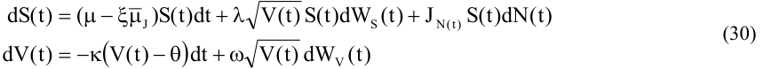

where N is a Poisson process with intensity ξ , independent of the Brownian motions. The random variable Ji denotes the ith relative jump size and is lognormally distributed, ln Ji ~ N( μ J, σ J2). If the 

> 9 The author has provided an implementation at <u>http://www.oliverfaulhaber.de.</u>

<!-- page: 22 -->

ith jump occurs at time t, the stock price right after the jump equals S(t+) = (1+Ji) S(t-). To ensure no arbitrage, ~~μ~~ J in (30) has to be the expected relative jump size: 

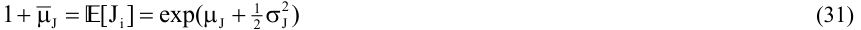

The Bates model is often used in an equity or FX context, where the jumps mainly serve to fit the model to the short term skew. Since the jump process is specified independently from the remainder of the model, the same simulation procedure as for the Heston model can be used. If a time step of length T is made till the next relevant date, we draw a random Poisson variable with mean ξ T, representing the number of jumps. Subsequently the jump sizes are drawn from the lognormal distribution, and the stock price is adjusted accordingly. In this way the addition of jumps does not add to the discretisation error. 

The SVJ example stems from Duffie, Pan and Singleton [2000], where parameters resulted from a calibration to S&P500 index options. Broadie and Kaya [2006] also use this example, which again allows us to compare the various biased simulation schemes to their exact scheme. 2 We note that the example under consideration satisfies ω << 2 κθ , which firstly means that the origin of the square root process is not attainable. Secondly, the low level of ω implies that the probability of any discretisation yielding a negative value for V is significantly smaller than in the Heston example. Hence we may expect that the biases are lower than in the previous example. 

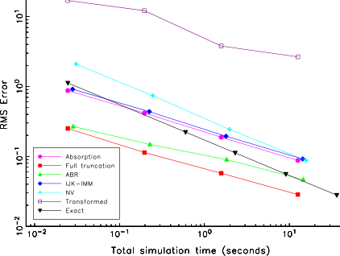

> **Figure 4:** Convergence of the RMS error in the SVJ example for an ATM call 

Thirdly and finally, this combination of parameters is such that the quasi-second order schemes preserve positivity. Contrary to the previous examples this means that the IJK-IMM scheme does not require additional assumptions about the treatment of V at the boundary. Furthermore, the NV scheme should converge. 

The bias and RMSE of all schemes, now also including the Euler scheme where we transformed coordinates of the variance as in (3), are reported in Table 8 and Figure 4 respectively. The number of paths used for the tests in Table 8 are 10000, 40000, 160000 and 640000 respectively. The overall picture is the same as before – the full truncation scheme yields the lowest bias, followed by the ABR scheme and the partial truncation scheme. As the level of bias is so low here, given a fixed computational budget the full truncation scheme by far outperforms the exact scheme. Turning to the transformed scheme, we see its bias is huge compared to the other schemes. Its standard deviation is also much larger, due to the fact that the drift in (3) blows up when V becomes small. Finally, though the quasi-second order schemes

<!-- page: 23 -->

|**Steps/yr.**|**A**|**R**|**HM**|**PT**|**FT**|**ABR**|**IJK-IMM**|**NV**|**Trans**|
|---|---|---|---|---|---|---|---|---|---|
|2|0.836|2.489|5.774|2.790|0.106|-0.146|0.887|2.081|9.043|
|4|0.400|0.900|0.898|0.399|0.016|-0.096|0.423|0.733|6.844|
|8|0.179|0.396|0.239|0.083|**-0.013**|-0.070|0.186|0.237|3.725|
|16|0.083|0.175|0.065|0.019|**-0.005**|-0.037|0.088|0.078|2.518|
|**O(**Δ**t ****p****)**|1.12|1.27|2.13|2.38|1.36|0.64|1.12|1.58|0.64|

**Table 8:** Bias when pricing an ATM call in the SVJ example Asset price process: S(0) = 100, μ = r = 0.0319, λ = 1, β = 1 Jump process: ξ = 0.11, ~~μ~~ J = -0.12, σ J = 0.15 Deal specification: European call option, Maturity 5 yrs. True option price: 20.1642. 

automatically preserve positivity for this parameter configuration, they are outperformed in terms of bias and order of weak convergence by the full truncation scheme. 

### **5.3. Results for a non-Heston CEV-SV model** 

To conclude our extensive numerical analysis, we consider a non-Heston example. The CEVSV example from Table 3 stems from Andersen and Brotherton-Ratcliffe [2005, Appendix A], where their moment-matching Euler scheme is benchmarked to a solution found by solving the corresponding partial differential equation via finite differences. Note that α = 0.75, so the origin of the variance process is certainly not attainable. 

|**Steps/yr.**|**A**|**R**|**HM**|**PT**|**FT**|**ABR**|
|---|---|---|---|---|---|---|
|1|5.462|13.007|13.007|5.462|1.278|0.460|
|2|3.097|6.637|4.887|1.821|0.405|0.273|
|4|1.381|2.824|1.424|0.513|0.092|0.141|
|8|0.421|0.844|0.249|0.088|**0.012**|0.073|
|16|0.062|0.132|**0.010**|**-0.002**|**-0.009**|**0.033**|
|32|**-0.028**|**-0.023**|**-0.033**|**-0.033**|**-0.033**|**-0.011**|
|**O(**Δ**t ****p****)**|1.62|1.84|2.07|1.94|1.30|1.07|

**Table 9:** Bias when pricing an ATM call in the CEV-SV example Asset price process: S(0) = 100, μ = 0, λ = 0.04899, β = 0.5, discount factor: 2687.74 Deal specification: European call option, Maturity 10 yrs. True option price: 39.22. 

Table 9 reports the biases of all Euler schemes. Though the schemes in Kahl and Jäckel [2006] and Ninomiya and Victoir [2004] can be used for the more general CEV-SV process, we chose to focus on the Euler schemes as many of them outperformed the quasi-second order schemes in the previous tests. Once again we conclude that all Euler schemes arrive at the correct answer sooner or later, though the truncation and ABR schemes require much less time steps to do so. 

## **6. Conclusions and further research** 

In this paper we have considered the simulation of the CEV-SV stochastic volatility model and varieties thereof, focusing largely on the Heston model. In the CEV-SV model, the stochastic variance is modelled as a mean-reverting CEV process. When discretising this process we run into the problem that although the process itself is guaranteed to be nonnegative, any Euler discretisation has a nonzero probability of becoming negative in the next time step, regardless of the size of the time step. Hence, we have to “fix” these negative variances.

<!-- page: 24 -->

Our contribution is threefold. Firstly, we unify all “fixes” appearing in the literature in a single general framework. Secondly, by analysing the rationale behind the known fixes, we are led up to propose a new scheme, the full truncation scheme, designed specifically to minimise the positive bias one finds when pricing European options using the traditional fixes. Strong convergence is proven for this scheme. 

Thirdly and finally, we numerically compare the various Euler schemes to each other, as well as to the quasi-second order schemes by Kahl and Jäckel [2006] and Ninomiya and Victoir [2004], and finally the exact scheme of Broadie and Kaya [2006]. All three of these papers compare their schemes to the Euler scheme with an absorption fix and find their scheme to be superior. Our numerical results demonstrate that using the correct fix at the boundary is extremely important, and significantly impacts the magnitude of the bias. In our examples, we find the full truncation scheme produces the smallest bias, closely followed by the moment-matching Euler scheme of Andersen and Brotherton-Ratcliffe [2005] and the partial truncation scheme. The order of weak convergence of the full truncation scheme appears to be close to 1 in the time step, bringing back the order of weak convergence convergence to the theoretical level for an Euler discretisation of an SDE with Lipschitzian dynamics. The performance of the quasi-second order schemes is found to be somewhat disappointing. In particular, we demonstrated the NV scheme is 2 unsuitable for parameter configurations where ω < 2 κθ , often not the case in practice. 

When the volatility of volatility is not too high, the full truncation scheme has relatively small levels of bias and is able to generate a smaller RMS error given a certain computational budget than any other biased or exact scheme considered here. This holds true for both European and path-dependent options. Since an initial version of this paper, Andersen [2007] has specifically designed simulation schemes for the Heston model which mimic its distribution quite closely. These schemes have negligible bias, at the cost of a more complex implementation. On the other hand the full truncation scheme, or indeed that of Andersen and Brotherton-Ratcliffe, is very easy to implement and appears to work fine for a wide variety of processes. 

As a final note, we return to the lead mentioned in the introduction, namely that the issues considered here in a continuous time setting can also arise in a discrete time setting. Examples of models where such problems can arise are the model of Heston and Nandi [2000] and the BoxCox model of Christoffersen and Jacobs [2004]. Let us be more specific and look at the firstorder version of the Heston and Nandi model. Here the log-stock price is modelled as: 

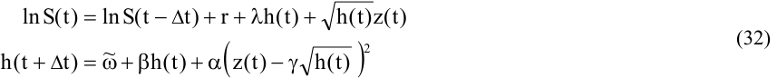

where z(t) is a standard normal random variable and h(t) is the conditional variance of the log-return between t- Δ t and t. In this setup h(t) is known at time t- Δ t. Note that all the model parameters will depend on the chosen time step Δ t. The process remains stationary with finite first two moments if β + αγ2 < 1. Without further restrictions on the parameters, h(t+ Δ t) can become negative. In their estimates however ω , β and α are positive and significant at the 95% confidence level, so that there does not seem to be a problem. Turning to their appendix B however, where they prove convergence of (32) to the Heston model with ρ = -1 as the time step tends to zero, we see that in their proof they choose10 ω ~ = ( κθ − <u>14</u> ω 2 )( Δ )t 2 , β = 0 and α = <u>14</u> ω 2 ( Δ )t 2 . Positivity of the conditional variance h(t+ Δ t) can thus only be guaranteed provided that κθ ≥ <u>14</u> ω 2 . This is the same condition under which the schemes of Alfonsi [2005] and Kahl and Jäckel [2006] preserve positivity, and not surprisingly so as we already remarked the equivalence of these three schemes 

> 10 It seems to us that there are different ways to prove this; the conclusion here will however be the same.

<!-- page: 25 -->

to first order in Δ t in section 3.3. Looking in closer detail at their estimation procedure, we see that they only included options with an absolute moneyness less than or equal to ten percent, i.e. at or around at-the-money options. In the Heston model κθ can certainly be smaller than <u>14</u> ω 2 

when the skew is quite pronounced. This would not be noticed if only options with strikes at or around the at-the-money level would be included in the calibration procedure. Concluding, it may be necessary to introduce restrictions on the parameters in a discrete time setting in order to ensure that the conditional variance process remains positive. 

## **Bibliography** 

- ALFONSI, A. (2005). “On the discretization schemes for the CIR (and Bessel squared) processes”, _Monte Carlo Methods and Applications_ , vol. 11, no. 4, pp. 355-384. 

- ANDERSEN, L.B.G. (2007). “Efficient simulation of the Heston stochastic volatility model”, working paper, Bank of America. 

- ANDERSEN, L.B.G. AND J. ANDREASEN (2002). “Volatile volatilities”, _Risk_ , vol. 15, no. 12, December 2002, pp. 163-168. 

- ANDERSEN, L.B.G. AND R. BROTHERTON-RATCLIFFE (2005). “Extended LIBOR market models with stochastic volatility”, _Journal of Computational Finance_ , vol. 9, no. 1, pp. 1-40. 

- ANDERSEN, L.B.G. AND V.V. PITERBARG (2007). “Moment explosions in stochastic volatility models”, _Finance and Stochastics_ , vol. 11, no. 1, pp. 29-50. 

- BATES, D.S. (1996). “Jumps and stochastic volatility: exchange rate processes implicit in Deutsche Mark options”, _Review of Financial Studies_ , vol.9, no.1., pp. 69-107. 

- BERKAOUI, A., BOSSY, M. AND A. DIOP (2008). “Euler scheme for SDEs with non-Lipschitz diffusion coefficient: strong convergence”, _ESAIM Probability and Statistics_ , vol. 12,no. 1, pp. 1-11. 

- BOSSY, M. AND A. DIOP (2004). “An efficient discretization scheme for one dimensional SDEs with a diffusion coefficient function of the form |x|α , α ∈ [1/2, 1)”, INRIA working paper no. 5396. 

- BROADIE, M. AND Ö. KAYA (2004). “Exact simulation of option greeks under stochastic volatility and jump diffusion models”, in R.G. Ingalls, M.D. Rossetti, J.S. Smith and B.A. Peters (eds.), _Proceedings of the 2004 Winter Simulation Conference_ . 

- BROADIE, M. AND Ö. KAYA (2006). “Exact simulation of stochastic volatility and other affine jump diffusion processes”, _Operations Research_ , vol. 54, no. 2, pp. 217-231. 

- BRIGO, D. AND F. MERCURIO (2001). _Interest Rate Models: Theory and Practice_ , Springer. 

- CARR, P. AND D.B. MADAN (1999). “Option valuation using the Fast Fourier Transform”, _Journal of Computational Finance_ , vol. 2, no. 4, pp. 61-73. 

- CHRISTOFFERSEN, P. AND K. JACOBS (2004). “Which GARCH model for option valuation?”, _Management Science_ , vol. 50, no. 9, pp. 1204-1221. 

- COX, J.C., INGERSOLL, J.E. AND S.A. ROSS (1985). “A theory of the term structure of interest rates”, _Econometrica_ , vol. 53, no. 2, pp. 385-407.

<!-- page: 26 -->

- DEELSTRA, G. AND F. DELBAEN (1998). “Convergence of discretized stochastic (interest rate) processes with stochastic drift term”, _Applied Stochastic Models and Data Analysis_ , vol. 14, no. 1, pp. 77-84. 

- DIOP, A. (2003). “Sur la discrétisation et le comportement à petit bruit d’EDS unidimensionelles dont les coefficients sont à derives singulières”, PhD thesis, INRIA. 

- DORNIC, I., CHATÉ, H. AND M.A. MUÑOZ (2005). “Integration of Langevin equations with multiplicative noise and the viability of field theories for absorbing phase transitions”, _Physical Review Letters_ , vol. 94, no. 10, pp. 100601-1, 100601-4. 

- DUFFIE, D. AND P. GLYNN (1995). “Efficient Monte Carlo simulation of security prices”, _Annals of Applied Probability_ , vol. 5, no. 4, pp. 897-905. 

- DUFFIE, D., PAN, J. AND K. SINGLETON (2000). “Transform analysis and asset pricing for affine jumpdiffusions”, _Econometrica_ , vol. 68, pp. 1343-1376. 

- FAULHABER, O. (2002). “Analytic methods for pricing double barrier options in the presence of stochastic volatility”, MSc thesis, University of Kaiserslautern, available at: <u>http://www.oliverfaulhaber.de/diplomathesis/HestonBarrierAnalytic.pdf</u> 

- FELLER, W. (1951). “Two singular diffusion problems”, _Annals of Mathematics_ , vol. 54, pp. 173-182. 

- GATHERAL, J. (2006). _The Volatility Surface: A Practitioner’s Guide_ , John Wiley and Sons, New York. 

- GLASSERMAN, P. (2003). _Monte Carlo Methods in Financial Engineering_ , Springer Verlag, New York. 

- GYÖNGY, L. (1998). “A note on Euler approximations”, _Potential Analysis_ , vol. 8, no. 3, pp. 205-216. 

- HAGAN, P.S., KUMAR, D., LESNIEWSKI, A.S. AND D.E. WOODWARD (2002). “Managing Smile Risk”, _Wilmott Magazine_ , July 2002, pp. 84-108. 

- HESTON, S.L. (1993). “A closed-form solution for options with stochastic volatility with applications to bond and currency options”, _Review of Financial Studies_ , vol. 6, no. 2, pp. 327-343. 

- HESTON, S.L. AND S. NANDI (2000). “A closed-form GARCH option valuation model”, _Review of Financial Studies_ , vol. 13, no. 3, pp. 585-625. 

- HIGHAM, D.J. AND X. MAO (2005). “Convergence of the Monte Carlo simulations involving the meanreverting square root process”, _Journal of Computational Finance_ , vol. 8, no. 3, pp. 35-62. 

- JÄCKEL, P. (2002). _Monte Carlo Methods in Finance_ , John Wiley and Sons, New York. 

- JÄCKEL, P. (2004). “Stochastic volatility models: past, present and future”, pp. 379-390 in P. Wilmott (ed). _The Best of Wilmott 1: Incorporating the Quantitative Finance Review_ , P. Wilmott (ed.), John Wiley and Sons, New York. 

- KAHL, C. (2004). “Positive numerical integration of stochastic differential equations”, Diploma thesis, University of Wuppertal and ABN·AMRO.

<!-- page: 27 -->

- KAHL, C. AND P. JÄCKEL (2006). “Fast strong approximation Monte-Carlo schemes for stochastic volatility models”, _Quantitative Finance_ , vol. 6, no. 6, pp. 513-536. 

- KARLIN, S. AND H. TAYLOR (1981). _A Second Course in Stochastic Processes_ , Academic Press, New York. 

- KLOEDEN, P.E. AND E. PLATEN (1999). _Numerical Solution of Stochastic Differential Equations_ , 3rd edition, Springer Verlag, New York. 

- LIPTON, A. (2001). _Mathematical Methods for Foreign Exchange – A Financial Engineer’s Approach,_ World Scientific, Singapore. 

- LORD, R. AND C. KAHL (2007A). “Complex logarithms in Heston-like stochastic volatility models”, working paper, Rabobank International and ABN·AMRO. 

- LORD, R. AND C. KAHL (2007B). “Optimal Fourier inversion in semi-analytical option pricing”, _Journal of Computational Finance_ , vol. 10, no. 4. 

- MARSAGLIA, G. AND W.W. TSANG (2000). “A simple method for generating gamma variables”, _ACM Transactions on Mathematical Software_ , vol. 26, no. 3, pp. 363-372. 

- MATYTSIN, A. (1999). “Modelling volatility and volatility derivatives”, Columbia Practitioners Conference on the Mathematics of Finance. 

- MORO, E. (2004). “Numerical schemes for continuum models of reaction-diffusion systems subject to internal noise”, _Physical Review E_ , vol. 70, no. 4, pp. 045102(R)-1, 045102(R)-4. 

- MORO, E. AND H. SCHURZ (2007). “Boundary preserving semi-analytic numerical algorithms for stochastic differential equations”, _SIAM Journal of Scientific Computing_ , vol. 29, no. 4, pp. 15251549. 

- NINOMIYA, S. AND N. VICTOIR (2004). “Weak approximation of stochastic differential equations and application to derivative pricing”, working paper, Tokyo Institute of Technology and Oxford University. 

- REVUZ, D. AND M. YOR (1991). _Continuous Martingales and Brownian Motion_ , Springer Verlag, New York. 

- WILLARD, G.A. (1997). “Calculating prices and sensitivities for path-independent derivative securities in multifactor models”, _Journal of Derivatives_ , vol. 5, no. 1, pp. 45-61. 

- YAMADA, T. (1978). “Sur une construction des solutions d’équations différentielles stochastiques dans le cas non-Lipschitzien”, in _Séminaire de Probabilité_ , vol. XII, LNM 649, pp. 114-131, Springer, Berlin.

<!-- page: 28 -->

## **Appendix – Proof of strong convergence** 

In this appendix we prove strong convergence of the full truncation scheme applied to the mean-reverting CEV process with ½ ≤ α ≤ 1. We use the same style of proof as Deelstra and Delbaen [1998], and Higham and Mao [2005]. As the proof of convergence for the full CEV-SV process follows along the same lines, we only focus on the strong L1 convergence for the stochastic variance here. Though lemmas 2 and 3 also hold when 0 < α < ½, the proof used for the main theorem no longer seems applicable. Nevertheless, all practical applications seem to use α ≥ ½, so that this is no restriction. 

For ease of exposure the discretisation over a finite time horizon [0,T] is performed on a uniform grid tn = n Δ t, n = 1, …, T/ Δ t. The discretisation of the auxiliary process at tn is given by: 

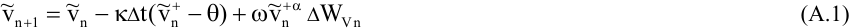

+ where Δ WVn = WV(tn+1) – WV(tn). The effective variance is v n =~ vn . To distinguish between the discretisation of the variance and the true process, we will denote the discretisation with small letters and the true process with capital letters. Following Higham and Mao [2005] we will consider the continuous-time approximation of (A.1): 

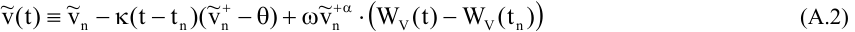

or, in integral notation: 

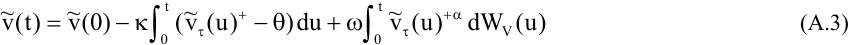

where~ v(0) = v0 ,~ v τ (0) =~ v( τ t()) and τ (t) equals t n if t n ≤ t ≤ t n+1. Obviously~ v τ )t( coincides with~ v)t( at the gridpoints of the discretisation. 

One of the elements required in proving strong convergence of the full truncation scheme, are bounds on the first and second moments of the effective variance vn. In the remainder we denote 2 the first and second moments by x n ≡ [~ vn ] and yn ≡ [~ vn ] respectively. In the main text lemma 2 already supplied the following inequality: 

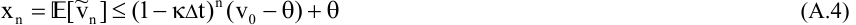

As we do not require sharp bounds, we will use the following corollary which follows directly. 

**Corollary 1:** 

For Δ t < 2/ κ the first moment of~ vn in the full truncation scheme is bounded from above by: 

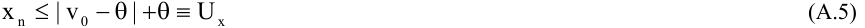

**Proof:** 

Follows immediately from lemma 2. � 

Secondly, we will find an upper bound on the second moment of~ vn .

<!-- page: 29 -->

##### **Lemma 3 – Bounding the second moment of the full truncation scheme** 

For any n = 0, …, N where N Δ t = T, and Δ t < 2/ κ , the second moment of~ vn in the full truncation scheme is bounded by: 

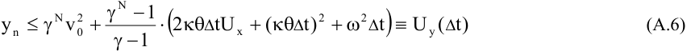

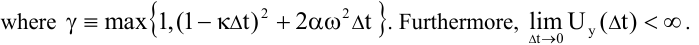

##### **Proof:** 

2 Clearly, y0 = v0 so that the assertion is true for n = 0. Suppose the lemma now holds true for some n. Using (A.1) we can then write: 

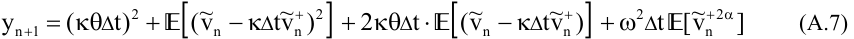

To bound this expression, we note that, apart from the first constant, the right-hand side can be written as the expectation of the following function: 

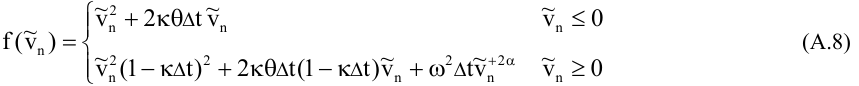

Since~ vn + 2 α ≤ 1 + 2 α~ vn2 as long as α ≤ 1, (A.8) can be bounded from above by: 

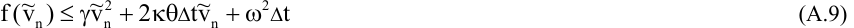

where γ is as defined above. Returning to (A.7) we then have: 

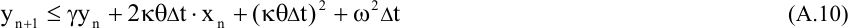

Repeated use of (A.10) and our corollary immediately yields (A.6). Finally, it follows that: 

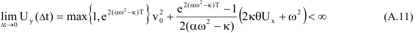

so that the second moment of the discretisation does not blow up in finite time. � 

Before addressing the strong L1 error we need a bound on the L2 difference between the two continuous-time approximations v τ (t) and v(t). The proof entirely depends on lemmas 2 and 3. 

**Lemma 4 – The L****2** **difference between v** τ **(t) and v(t)** For Δ t < 2/ κ we have: 

<!-- page: 30 -->

##### **Proof:** 

The first term can be bounded from above by: 

> The supremum on [0,T] is then bounded from above by (A.12), which completes the proof. � 

> Clearly Ucont( Δ t) is of O( Δ t), so that the difference between the discrete-time approximation and its continuous extension vanishes when the time step tends to zero. We are now ready to prove strong convergence in the L1 sense. 

##### **Theorem – Strong convergence of v(t) in the L****1** **sense** 

The full truncation scheme converges strongly in the L1 sense: 

##### **Proof:** 

First note that  [ V)t( − v)t( ] ≤  [ V)t( −~ v)t( ] , so that it is sufficient to show (A.16) for the latter expression. We will bound it from above in a function of the time step, so that we can prove that this L1 norm tends to zero as the time step tends to zero. As in Yamada [1978], this is achieved by bounding  [ φ k ( V)t( −~ v)t( ) ] for a series of C2 (,) functions φ k which tend to the absolute function. Here we use the same notation as in Higham and Mao [2005]. First of all let a k − 1 − 1 ak = e-k(k+1)/2 for k ≥ 0, so that u du = k . For each integer k ≥ 1 there exists a continuous ∫ a k − 1 − 1 a k function ψ k with support in (a k-1, a k) such that 0 ≤ ψ k (u) ≤ 2k u and ψ k (u)du = 1. ∫ a k − 1 |x| y Defining φ k (x) = k (u) du dy , it follows that φ k ∈ C2 (,), φ k(0) = 0, and: ∫∫ 0 0ψ 

<!-- page: 31 -->

Consider φ k ( V)t( −~ v)t( ) . Using Itō’s lemma and taking expectations yields: 

where we defined: 

Note that for ½ ≤ α ≤ 1 we can bound: 

> and furthermore we have V(u) −~ v τ (u) ≤ V(u) −~ v ( u ) +~ v(u) −~ v τ (u) . Using the property ~ 

> of the second derivative of φ in (A.17) it follows that, with α = 2 α − 1: 

where we used  [ | X | ] ≤ [X2 ] for any random variable X and lemma 4. Turning to M(t), we use the property of the first derivative of φ from (A.17) to obtain: 

Combining the bounds on I(t) and M(t) in (A.18) with the third property in (A.17) yields: 

<!-- page: 32 -->

Since (A.24) holds for any value of k and Δ limt → 0 U k,I ,t( Δ )t = 0 due to (A.11) and (A.12), it follows that lim sup  [ V)t( −~ v)t( ] = 0 as in corollary 3.1 of Higham and Mao. This Δ t → 0 t ∈ [,0T] immediately implies (A.16). The order of convergence unfortunately does not follow from this proof, as klim →∞ U k,I ,t( Δ )t = ∞ . �
