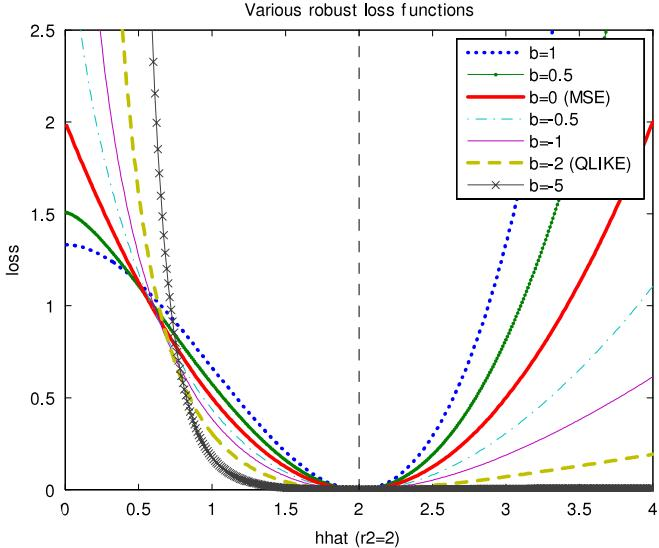
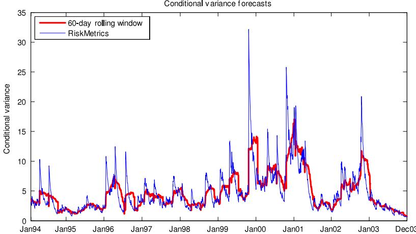

# 2011-patton-volatility-forecast-comparison

<!-- page: 1 -->

## Volatility forecast comparison using imperfect volatility proxies

Andrew J. Patton ∗

Department ofEconomics, Duke University, USA

Oxford-Man Institute ofQuantitative Finance, University ofOxford, UK

## a r t i c l e i n f o

Article history: Available online xxxx

JEL classification: C53 C52 C22 Keywords: Forecast evaluation Forecast comparison Loss functions Realised variance Range

## a b s t r a c t

The use of a conditionally unbiased, but imperfect, volatility proxy can lead to undesirable outcomes in standard methods for comparing conditional variance forecasts. We motivate our study with analytical results on the distortions caused by some widely used loss functions, when used with standard volatility proxies such as squared returns, the intra-daily range or realised volatility. We then derive necessary and sufficient conditions on the functional form of the loss function for the ranking of competing volatility forecasts to be robust to the presence of noise in the volatility proxy, and derive some useful special cases of this class of ‘‘robust’’ loss functions. The methods are illustrated with an application to the volatility of returns on IBM over the period 1993 to 2003.

© 2010 Published by Elsevier B.V.

## 1. Introduction

Many forecasting problems in economics and finance involve a variable of interest that is unobservable, even ex post. The most prominent example of such a problem is the forecasting of volatility for use in financial decision making. Other problems include forecasting the true rates of inflation, GDP growth or unemployment (not simply the announced rates); forecasting trade intensities; and forecasting default probabilities or ‘crash’ probabilities. While evaluating and comparing economic forecasts is a well-studied problem, dating back at least to Cowles (1933), if the variable of interest is latent then the problem of forecast evaluation and comparison becomes more complicated.1

This complication can be resolved, at least partly, if an unbiased estimator of the latent variable of interest is available. In volatility forecasting, for example, the squared return on an asset over the period t (assuming a zero mean return) can be interpreted as a conditionally unbiased estimator of the true unobserved conditional variance of the asset over the period t.2 Many of the standard methods for forecast evaluation and comparison, such as the Mincer and Zarnowitz (1969) regression and the Diebold and Mariano (1995) and West (1996) tests, can be shown to be applicable when such a conditionally unbiased proxy is used, see Hansen and Lunde (2006) for example. However, it is not true that using a conditionally unbiased proxy will always lead to the same outcome as if the true latent variable were used: Andersen and Bollerslev (1998) and Andersen et al. (2005), amongst others, study the reduction in finite-sample power of tests based on noisy volatility proxies; we focus, like Hansen and Lunde (2006), on distortions in the rankings of competing forecasts that can arise when using a noisy volatility proxy in some commonly used tests for forecast comparison.

For example, in the volatility forecasting literature numerous authors have expressed concern that a few extreme observations may have an unduly large impact on the outcomes of forecast evaluation and comparison tests, see Bollerslev and Ghysels (1994), Andersen et al. (1999) and Poon and Granger (2003) amongst others. One common response to this concern is to employ forecast loss functions that are ‘‘less sensitive’’ to large observations than the usual squared forecast error loss function, such as absolute error or proportional error loss functions. In this paper we show analytically that such approaches can lead to incorrect inferences and the selection of inferior forecasts over better forecasts.

✩ Matlab code used in this paper is available from

∗ Corresponding address: Department of Economics, Duke University, 213 Social Sciences Building, Box 90097, Durham NC 27708-0097, USA.

E-mail address: andrew.patton@duke.edu.

1 For recent surveys of the forecast evaluation literature see Clements (2005) and West (2006). For recent surveys ofthe volatility forecasting literature, see Andersen et al. (2006), Poon and Granger (2003) and Shephard (2005).

2 The high/low range and realised volatility, see Parkinson (1980) and Andersen et al. (2003) for example, have also been used as volatility proxies. These are discussed in detail below.

<!-- page: 2 -->

We focus on volatility forecasting as a specific case of the more general problem of latent variable forecasting. In Section 5 we discuss the extension of our results to other latent variable forecasting problems. Our research builds on work by Andersen and Bollerslev (1998), Meddahi (2001) and Hansen and Lunde (2006), who were among the first to analyse the problems introduced by the presence of noise in a volatility proxy. This paper extends the existing literature in two important directions, discussed below.

Firstly, we derive explicit analytical results for the distortions that may arise when some common loss functions are employed, considering the three most commonly used volatility proxies: the daily squared return, the intra-daily range and a realised variance estimator. We show that these distortions can be large, even for favourable scenarios (such as Gaussianity). Further, we show that the distortions vary greatly with the choice of loss function, thus providing a theoretical explanation for the widespread finding of conflicting rankings of volatility forecasts when ‘‘non-robust’’ loss functions (defined precisely in Section 2) are used in applied work, see Lamoureux and Lastrapes (1993), Hamilton and Susmel (1994), Bollerslev and Ghysels (1994) and Hansen and Lunde (2005), amongst many others.3

Secondly, we provide necessary and sufficient conditions on the functional form of the loss function to ensure that the ranking of various forecasts is preserved when using a noisy volatility proxy. These conditions are related to those of Gourieroux et al. (1984) for quasi-maximum likelihood estimation. Interestingly, we find that there are an infinite number of loss functions that satisfy these conditions, and that these loss functions differ in meaningful ways (such as the penalty applied to over-prediction versus underprediction). Thus our class of ‘‘robust’’ loss functions is not simply the quadratic loss function or minor variations thereof.

The canonical problem in point forecasting is to find the forecast that minimises the expected loss, conditional on time t information. That is,

$$
\hat { Y } _ { t + h , t } ^ { * } \equiv \arg \operatorname* { m i n } _ { \hat { y } \in \mathcal { Y } } E \left[ L \left( Y _ { t + h } , \hat { y } \right) | \mathcal { F } _ { t } \right]\tag{1}
$$

where $Y _ { t + h }$ is the variable of interest, L is the forecast user’s loss function, Y is the set of possible forecasts, and $\mathcal { F } _ { t }$ is the time t information set. Starting with the assumption that the forecast user is interested in the conditional variance, we effectively take the solution of the optimisation problem above (the conditional variance) as given, and consider the loss functions that will generate the desired solution. This approach is unusual in the economic forecasting literature: the more common approach is to take the forecast user’s loss function as given and derive the optimal forecast for that loss function; related papers here are Granger (1969), Engle (1993), Christoffersen and Diebold (1997), Christoffersen and Jacobs (2004) and Patton and Timmermann (2007), amongst others. The fact that we know the forecast user desires a variance forecast places limits on the class of loss functions that may be used for volatility comparison, ruling out some choices previously used in the literature. However we show that the class of‘‘robust’’ loss functions still admits a wide variety of loss functions, allowing much flexibility in representing volatility forecast users’ preferences.

One practical implication of this paper is that the stated goal of forecasting the conditional variance is not consistent with the use of some loss functions when an imperfect volatility proxy is employed. However, these loss functions are not inherently invalid or inappropriate: if the forecast user’s preferences are indeed described by an ‘‘non-robust’’ loss function, then this simply implies that the object of interest to that forecast user is not the conditional variance but rather some other quantity.4 In academic research the preferences of the end-user of the forecast are often unknown, and a common response to this to is to select forecasts based on their average distance, somehow measured, to the true latent conditional variance. In such cases, the methods outlined in this paper can be applied to identify the forecast that is closest to the true conditional variance by using imperfect volatility proxy and a ‘‘robust’’ loss function.

The remainder of this paper is as follows. In Section 2 we analytically consider volatility forecast comparison tests using an imperfect volatility proxy, showing the problems that arise when using some common loss functions. We initially consider using squared daily returns as the proxy, and then consider using the range and realised variance. In Section 3 we provide necessary and sufficient conditions on the functional form of a loss function for the ranking of competing volatility forecasts to be robust to the presence of noise in the volatility proxy, and derive some useful special cases of this class of robust loss functions. One of these special cases is a parametric family of loss functions that nests two of the most widely used loss functions in the literature, namely the MSE and QLIKE loss functions (defined in Eqs. (5) and (6) below). In Section 4 we present an empirical illustration using two widely used volatility forecasting methods, and in Section 5 we conclude and suggest extensions. All proofs and derivations are provided in Appendix.

## 1.1. Notation

Let $r _ { t }$ be the variable whose conditional variance is of interest, usually a daily or monthly asset return in the volatility forecasting literature. The information set used in defining the conditional variance of interest is denoted $\mathcal { F } _ { t - 1 }$ , which is assumed to contain $\sigma ( r _ { t - j } , j \ge 1 )$ , but may also include other variables and/or variables measured at a higher frequency than r (such as intra-daily returns). Denote $V [ r _ { t } | \bar { \mathcal { F } } _ { t - 1 } ] \ \equiv \ \dot { V } _ { t - 1 } \mathbf { \bar { [ } } r _ { t } ] \ \equiv \ \dot { \sigma _ { t } ^ { 2 } }$ . We will assume throughout that $E [ r _ { t } | \mathcal { F } _ { t - 1 } ] \equiv E _ { t - 1 } [ r _ { t } ] = 0$ , and so $\sigma _ { t } ^ { 2 } = E _ { t - 1 } [ r _ { t } ^ { 2 } ] .$ Let $\varepsilon _ { t } \equiv r _ { t } / \sigma _ { t }$ denote the ‘standardised return’. Let a forecast of the conditional variance of $r _ { t }$ be denoted $h _ { t } , \operatorname { o r } h _ { i , t }$ if there is more than one forecast under analysis. We will take forecasts as ‘‘primitive’’, and not consider the specific models and estimators that may have generated the forecasts. The loss function of the forecast user is $L : \mathbb { R } _ { + } \times \mathcal { H } \to \mathbb { R } _ { + }$ , where the first argument of L is $\sigma _ { t } ^ { 2 }$ or some proxy for $\sigma _ { t } ^ { 2 }$ , denoted $\hat { \sigma } _ { t } ^ { 2 }$ , and the second is $h _ { t } . \mathbb { R } .$ and $\mathbb { R } _ { + + }$ denote the non-negative and positive parts of the real line respectively, and H is a compact subset ofR $^ { \circ } { \therefore } + -$ . Commonly used volatility proxies are the squared return, $r _ { t } ^ { 2 }$ , realised volatility, RV , and the range, $\mathsf { R G } _ { t }$ . Optimal forecasts for a given loss function and proxy are denoted $\bar { h } _ { t } ^ { * }$ and are defined as:

$$
\begin{array} { r } { h _ { t } ^ { * } \equiv \underset { h \in \mathcal { H } } { \arg \operatorname* { m i n } } E \left[ L \left( \hat { \sigma } _ { t } ^ { 2 } , h \right) | \mathcal { F } _ { t - 1 } \right] . } \end{array}\tag{2}
$$

3 All of the results in this paper apply directly to the problem of forecasting integrated variance (IV), which Andersen et al. (2010), amongst others, argue is a more ‘‘relevant’’ notion of variability. We focus on the problem of conditional variance forecasting due to its prevalence in applied work in the past two decades. If we take expected IV rather than the conditional variance as the latent object of interest, then we only require that an unbiased realised variance estimator is available for the results to go through. In the presence of jumps in the price process, quadratic variation (QV) is a more appropriate measure ofrisk, and a similar extension is possible.

4 For example, the utility of realised returns on a portfolio formed using a volatility forecast, or the profits obtained from an option trading strategy based on a volatility forecast, see West et al. (1993) and Engle et al. (1993) for example, define economically meaningful loss functions, even though the optimal forecasts under those loss functions will not generally be the true conditional variance.

<!-- page: 3 -->

## 2. Volatility forecast comparison using an imperfect volatility proxy

We consider volatility forecast comparisons based on expected loss, or distance to the true conditional variance. These comparisons can be implemented in finite samples using the tests of Diebold and Mariano (1995) and West (1996), (henceforth DMW). If we define $u _ { i , t } \equiv L ( \sigma _ { t } ^ { 2 } , h _ { i , t } )$ , where L is the forecast user’s loss function, and let $d _ { t } ~ = ~ u _ { 1 , t } - u _ { 2 , t }$ , then a DMW test of equal predictive accuracy can be conducted as a simple Wald test that $\bar { E } [ d _ { t } ] = 0 . ^ { 5 }$

Of primary interest is whether the feasible ranking of two forecasts obtained using an imperfect volatility proxy is the same as the infeasible ranking that would be obtained using the unobservable true conditional variance. In such a case we are able to compare average forecast accuracy even though the variable of interest is unobservable. We define loss functions that yield such an equivalence as ‘‘robust’’:

Definition 1. A loss function, L, is ‘‘robust’’ ifthe ranking ofany two (possibly imperfect) volatility forecasts, $h _ { 1 t }$ and $h _ { 2 t }$ , by expected loss is the same whether the ranking is done using the true conditional variance, $\sigma _ { t } ^ { 2 }$ , or some conditionally unbiased volatility proxy, $\hat { \sigma } _ { t } ^ { 2 }$ . That is,

$$
E \left[ L \left( \sigma _ { t } ^ { 2 } , h _ { 1 t } \right) \right] \gtrapprox E \left[ L \left( \sigma _ { t } ^ { 2 } , h _ { 2 t } \right) \right]\tag{3}
$$

$$
\Leftrightarrow E [ L ( \hat { \sigma } _ { t } ^ { 2 } , h _ { 1 t } ) ] \acute {  } E [ L ( \hat { \sigma } _ { t } ^ { 2 } , h _ { 2 t } ) ]
$$

for any $\hat { \sigma } _ { t } ^ { 2 } \operatorname { s . t . } E [ \hat { \sigma } _ { t } ^ { 2 } | \mathcal { F } _ { t - 1 } ] = \sigma _ { t } ^ { 2 } .$

Meddahi (2001) showed that the ranking of forecasts on the basis of the $R ^ { 2 }$ from the Mincer–Zarnowitz regression:

$$
\hat { \sigma } _ { t } ^ { 2 } = \beta _ { 0 } + \beta _ { 1 } h _ { i t } + e _ { i t }\tag{4}
$$

is robust to noise in $\hat { \sigma } _ { t } ^ { 2 }$ . Hansen and Lunde (2006) showed that the $R ^ { 2 }$ from a regression of $\log ( \hat { \sigma } _ { t } ^ { 2 } )$ on a constant and $\log ( h _ { t } )$ is not robust to noise, and showed more generally that a sufficient condition for a loss function to be robust is that $\bar { \partial } ^ { 2 } L ( \sigma ^ { 2 } , h ) / \partial ( \sigma ^ { 2 } ) ^ { 2 }$ does not depend on h. In Section 3 we generalise this result by providing necessary and sufficient conditions for a loss function to be robust.6,7

It is worth noting that although the ranking obtained from a robust loss function will be invariant to noise in the proxy, the actual level of expected loss obtained using a proxy will be larger than that which would be obtained when using the true conditional variance. This point was compellingly presented in Andersen and Bollerslev (1998) and Andersen et al. (2004). Andersen et al. (2005) provide a method to estimate the distortion in the level of expected loss and thereby obtain an estimator of the level of expected loss that would be obtained using the true latent variable of interest.

It follows directly from the definition of a robust loss function that the true conditional variance is the optimal forecast (we formally show this in the proof of Proposition 1), and thus a necessary condition for a loss function to be robust to noise is that the true conditional variance is the optimal forecast. In this section we determine whether this condition holds for some common loss functions, and analytically characterise the distortion for those cases where it is violated.

A common response to the concern that a few extreme observations drive the results of volatility forecast comparison studies is to employ alternative measures of forecast accuracy to the usual MSE loss function, see Pagan and Schwert (1990), Bollerslev and Ghysels (1994); Bollerslev et al. (1994), Diebold and Lopez (1996), Andersen et al. (1999), Poon and Granger (2003) and Hansen and Lunde (2005), for example. A collection of loss functions employed in the literature on volatility forecast evaluation is presented below.8 In the next two sub-sections we will study the properties of these loss functions and show that for almost all choices of volatility proxy most of these loss functions are not robust and can lead to incorrect rankings of volatility forecasts.

$$
\mathsf { M S E } : L \left( \hat { \sigma } ^ { 2 } , h \right) = \left( \hat { \sigma } ^ { 2 } - h \right) ^ { 2 }\tag{5}
$$

$$
\mathrm { Q L I K E } : L \left( \hat { \sigma } ^ { 2 } , h \right) = \log h + \frac { \hat { \sigma } ^ { 2 } } { h }\tag{6}
$$

$$
\mathsf { M S E \mathrm { - } L O G } : L \left( \hat { \sigma } ^ { 2 } , h \right) = \left( \log \hat { \sigma } ^ { 2 } - \log h \right) ^ { 2 }\tag{7}
$$

$$
\mathrm { M S E - S D } : L \left( { \hat { \sigma } } ^ { 2 } , h \right) = \left( { \hat { \sigma } } - { \sqrt { h } } \right) ^ { 2 }\tag{8}
$$

$$
\mathsf { M S E - p r o p } : L \left( \hat { \sigma } ^ { 2 } , h \right) = \left( \frac { \hat { \sigma } ^ { 2 } } { h } - 1 \right) ^ { 2 }\tag{9}
$$

$$
\mathrm { M A E } : L \left( \hat { \sigma } ^ { 2 } , h \right) = \left| \hat { \sigma } ^ { 2 } - h \right|
$$

$$
\mathrm { M A E \mathrm { - } L O G } : L \left( { \hat { \sigma } } ^ { 2 } , h \right) = \left| \log { \hat { \sigma } } ^ { 2 } - \log h \right|\tag{10}
$$

(11)

$$
\mathrm { M A E - S D } : L \left( { \hat { \sigma } } ^ { 2 } , h \right) = \left| { \hat { \sigma } } - { \sqrt { h } } \right|\tag{12}
$$

$$
\mathrm { M A E - p r o p } : L \left( { \hat { \sigma } } ^ { 2 } , h \right) = \left| { \frac { { \hat { \sigma } } ^ { 2 } } { h } } - 1 \right| .\tag{13}
$$

## 2.1. Using squared returns as a volatility proxy

In this section we will focus on the use of daily squared returns for volatility forecast evaluation, and in Section 2.2 we will examine the use of realised volatility and the range. We will derive our results under three assumptions for the conditional distribution of daily returns:

$$
r _ { t } | \mathcal F _ { t - 1 } \sim \left\{ \begin{array} { l l } { F _ { t } \left( 0 , \sigma _ { t } ^ { 2 } \right) } \\ { \mathrm { S t u d e n t } ^ { \ast } \mathrm { s } t \left( 0 , \sigma _ { t } ^ { 2 } , \nu \right) } \\ { N \left( 0 , \sigma _ { t } ^ { 2 } \right) } \end{array} \right.
$$

where $F _ { t } ( 0 , \sigma _ { t } ^ { 2 } )$ is some unspecified distribution with mean zero and variance $\sigma _ { t } ^ { 2 }$ , and Student’s $t ( 0 , \sigma _ { t } ^ { 2 } , \nu )$ is a Student’s t distribution with mean zero, variance $\sigma _ { t } ^ { 2 }$ and ν degrees offreedom.

5 The key difference between the approaches of Diebold and Mariano (1995) and West (1996) is that the latter explicitly allows for forecasts that are based on estimated parameters, whereas the null of equal predictive accuracy is based on population parameters, see West (2006). The problems we identify below arise even in the absence of estimation error in the forecasts, thus our treatment of the forecasts as primitive, and so for our purposes these two approaches coincide.

6 Our use of the adjective ‘‘robust’’ is related, though not equivalent, to its use in estimation theory, where it applies to estimators that insensitive/less sensitive to the presence of outliers in the data, see Huber (1981) for example. A ‘‘robust’’ loss function, in the sense of Definition 1, will generally not be robust to the presence of outliers.

7 In recent work Giacomini and White (2006) propose ranking forecasts by expected loss conditional on some information set G , rather than by unconditional expected loss as in Definition 1. The numerical examples provided below will differ in this more general case, of course, however the theoretical results in this paper go through if G ⊆ F , which is true for all of the examples considered by Giacomini and White (2006).

8 Some of these loss functions are called different names by different authors: MSE-prop is also known as ‘‘heteroskedasticity-adjusted MSE (HMSE)’’; MAE-prop is also known as ‘‘mean absolute percentage error (MAPE)’’ or as ‘‘heteroskedasticity-adjusted MAE (HMAE)’’.

<!-- page: 4 -->

In all cases it is clear that $E _ { t - 1 } [ r _ { t } ^ { 2 } ] = \sigma _ { t } ^ { 2 }$ , and so the squared daily return is a valid volatility proxy.

It is trivial to show that the MSE loss function generates an optimal forecast equal to the conditional variance: $\bar { h } _ { t } ^ { * } = E _ { t - 1 } [ r _ { t } ^ { 2 } ] \stackrel { - } { = }$ $\sigma _ { t } ^ { 2 }$ , and thus satisfies the necessary condition for robustness. Further, the MSE loss function also satisfies the sufficient condition of Hansen and Lunde (2006), and thus MSE is a ‘‘robust’’ loss function. Another commonly used loss function is the MSE loss function on standard deviations rather than variances, MSE-SD, see Eq. (8). The motivation for this loss function is that taking square root of the two arguments of the squared-error loss function shrinks the larger values towards zero, reducing the impact of the most extreme values of $r _ { t }$ . However it also leads to an incorrect volatility forecast being selected as optimal:

$$
h _ { t } ^ { * } \equiv \underset { h \in \mathcal { H } } { \arg \operatorname* { m i n } } E _ { t - 1 } \left[ \left( | r _ { t } | - \sqrt { h } \right) ^ { 2 } \right]
$$

$$
\mathsf { F O C } 0 = \left. \frac { \partial } { \partial h } E _ { t - 1 } \left[ \left( | \boldsymbol { r } _ { t } | - \sqrt { h } \right) ^ { 2 } \right] \right| _ { h = h _ { t } ^ { * } }
$$

$$
\begin{array} { r l } & { \mathsf { s o } h _ { t } ^ { * } = ( E _ { t - 1 } \left[ | r _ { t } | \right] ) ^ { 2 } } \\ & { \quad \quad = \sigma _ { t } ^ { 2 } \left( E _ { t - 1 } \left[ | \varepsilon _ { t } | \right] \right) ^ { 2 } } \\ & { \quad \quad = \left\{ \begin{array} { l l } { \displaystyle \frac { \nu - 2 } { \pi } \left( \Gamma \left( \frac { \nu - 1 } { 2 } \right) \bigg / \Gamma \left( \frac { \nu } { 2 } \right) \right) ^ { 2 } \sigma _ { t } ^ { 2 } , } & \\ { \displaystyle \mathrm { i f } r _ { t } | \mathcal { F } _ { t - 1 } \sim \mathrm { S t u d e n t } ^ { * } s t \left( 0 , \sigma _ { t } ^ { 2 } , \nu \right) , \nu > 2 } \\ { \displaystyle \frac { 2 } { \pi } \sigma _ { t } ^ { 2 } \approx 0 . 6 4 \sigma _ { t } ^ { 2 } , } & { \mathrm { i f } r _ { t } | \mathcal { F } _ { t - 1 } \sim N \left( 0 , \sigma _ { t } ^ { 2 } \right) . } \end{array} \right. } \end{array}\tag{14}
$$

(15)

This distortion is present even under Gaussianity, and excess kurtosis in asset returns exacerbates the distortion: For example, if returns follow the Student’s t distribution with six degrees of freedom then the coefficient on $\sigma _ { t } ^ { 2 }$ in the above expression is 0.56.

As mentioned in the Introduction, if the forecast user’s loss function truly is the square of the difference between the absolute return and the square root of the forecast, then the ‘‘distortion’’ in the optimal forecast above is desirable, as this is the forecast that minimises his/her expected loss. However, if the goal is to find the forecast that is closest to the true conditional variance, then this distortion in the optimal forecast can lead to an incorrect ranking of competing forecasts.9 Thus the MSE-SD loss function is not consistent with the goal of ranking volatility forecasts by their distance to the true conditional variance when using the squared return as the volatility proxy: either the proxy has to be re-scaled by a term that depends critically on the underlying conditional distribution of returns, or, more simply, a different loss function must be chosen.

The corresponding calculations for the remaining loss functions in Eqs. (5) to (13) are provided in Patton (2006), and the results are summarised in Table 1. This table shows that the degree of distortion in the optimal forecast according to some of the loss functions used in the literature can be substantial. Under normality the optimal forecast under these loss functions ranges from about one quarter of the true conditional variance to three times the true conditional variance. If returns exhibit excess conditional kurtosis then the range of optimal forecasts from these loss functions is even wider.

Table 1 provides a theoretical explanation for the widespread finding of conflicting rankings of volatility forecasts when nonrobust loss functions are used in applied work. Lamoureux and Lastrapes (1993), Hamilton and Susmel (1994), Bollerslev and

Ghysels (1994) and Hansen and Lunde (2005), amongst many others, use some or all of the nine loss functions considered in Table 1 and find that the best-performing volatility model changes with the choice of loss function. Given that, for example, the MSE-prop loss function leads to an optimal forecast that is biased upwards by at least a factor of three, while the MAE loss function leads to an optimal forecast that is biased downwards by at least a factor of two, it is no surprise that different rankings of volatility forecasts are found.

## 2.2. Using better volatility proxies

It has long been known that squared returns are a rather noisy proxy for the true conditional variance. One alternative volatility proxy that has gained much attention recently is ‘‘realised volatility’’, see Andersen et al. (2001, 2003), and Barndorff-Nielsen and Shephard (2002, 2004). Another commonly used alternative to squared returns is the intra-daily range. It is well known that if the log stock price follows a Brownian motion then both of these estimators are unbiased and more efficient than the squared return. In this section we obtain the rate at which the distortion in the ranking ofalternative forecasts disappears when using realised volatility as the proxy, as the sampling frequency increases, for a simple data generating process (DGP).

Assume that there are m equally-spaced observations per trade day, and let $r _ { i , m , t }$ denote the ith intra-daily return on day t. While recent work on realised volatility would enable us to consider a quite general class of DGPs, in order to obtain analytical results for problems involving the range as a volatility proxy we consider only a simple DGP: zero mean return, no jumps, and constant conditional volatility within a trade day.10 Patton and Sheppard (2009) present the corresponding results for a range of more realistic DGPs via simulation.11 Let

$$
r _ { t } = \mathsf { d } \log P _ { t } = \sigma _ { t } \mathsf { d } W _ { t }
$$

$$
\sigma _ { \tau } = \sigma _ { t } \quad \forall \tau \in ( t - 1 , t ]\tag{16}
$$

(17)

$$
r _ { i , m , t } \equiv \int _ { ( i - 1 ) / m } ^ { i / m } r _ { \tau } \mathrm { d } \tau = \sigma _ { t } \int _ { ( i - 1 ) / m } ^ { i / m } \mathrm { d } W _ { \tau }\tag{18}
$$

$$
{ \sf s o } \left\{ r _ { i , m , t } \right\} _ { i = 1 } ^ { m } \sim \mathrm { i . i . d . } N \left( 0 , \frac { \sigma _ { t } ^ { 2 } } { m } \right) .\tag{19}
$$

The ‘‘realised volatility’’ or ‘‘realised variance’’ is defined as:

$$
\mathsf { R V } _ { t } ^ { ( m ) } \equiv \sum _ { i = 1 } ^ { m } r _ { i , m , t } ^ { 2 } .
$$

Realised variance, like the daily squared return (which is obtained in the above framework by setting m = 1), is a conditionally unbiased estimator ofthe daily conditional variance. Its main advantage is that it is more efficient estimator than the daily squared return: for this DGP it can be shown that $E _ { t - 1 } [ ( r _ { t } ^ { 2 } - \sigma _ { t } ^ { 2 } ) ^ { 2 } ] \stackrel { . } { = } 2 \sigma _ { t } ^ { 4 }$ while $E _ { t - 1 } [ ( \mathrm { R V } _ { t } ^ { ( m ) } - \sigma _ { t } ^ { 2 } ) ^ { 2 } ] = 2 \sigma _ { t } ^ { 4 } / m$ . Thus $\mathsf { R V } _ { t } ^ { ( m ) } \to ^ { p } \sigma _ { t } ^ { 2 }$ as m → ∞, under these assumptions, and we find in this case that $\sigma _ { t } ^ { 2 }$ is observable. As expected, all distortions vanish in this case.

Please cite this article in press as: Patton, A.J., Volatility forecast comparison using imperfect volatility proxies. Journal of Econometrics (2010), doi:10.1016/j.jeconom.2010.03.034

10 Analytical and empirical results on the range and ‘‘realised range’’ under more flexible DGPs are presented in two recent papers by Christensen and Podolskij (2007) and Martens and van Dijk (2007).

9 This distortion remains if the target is instead the conditional standard deviation, as the absolute return is not an unbiased proxy for that quantity.

11 When the DGP is specified to be log-normal or GARCH stochastic volatility diffusions, Patton and Sheppard (2009) find results very similar to those obtained for the case below. Using the same parameterisations as those in the simulations of Gonçalves and Meddahi (2009), slightly larger biases from the non-robust loss functions are found, but they generally differ from those in Table 2 only in the second decimal place. In contrast, the biases are found to be much larger under the two-factor stochastic volatility diffusion considered by Gonçalves and Meddahi (2009).

<!-- page: 5 -->

[Table source crop](assets/tables/2011-patton-volatility-forecast-comparison-p0005-block-0001-c99d07d42f771205.jpg)
Table 1 Optimal forecasts under various loss functions.

The range, or the high/low, estimator has been used in finance for many years, see Garman and Klass (1980) and Parkinson (1980). The intra-daily log range is defined as:

$$
\mathrm { R G } _ { t } \equiv \operatorname* { m a x } _ { \tau } \log P _ { \tau } - \operatorname* { m i n } _ { \tau } \log P _ { \tau } , \quad t - 1 < \tau \leq t .\tag{20}
$$

Under the dynamics in Eq. (16) Feller (1951) presented the density of $\mathsf { R G } _ { t } ,$ , and Parkinson (1980) presented a formula for obtaining moments of the range, which enable us to compute:

$$
E _ { t - 1 } \left[ { \mathrm { R } } G _ { t } ^ { 2 } \right] = 4 \log { ( 2 ) } \cdot \sigma _ { t } ^ { 2 } \approx 2 . 7 7 2 6 \sigma _ { t } ^ { 2 } .\tag{21}
$$

Details on the distributional properties ofthe range under this DGP are presented in Patton (2006). The above expression shows that squared range is not a conditionally unbiased estimator of $\sigma _ { t } ^ { 2 } ;$ we will thus focus below on the adjusted range:

$E \left[ \sqrt { \chi _ { m } ^ { 2 } } \right] \approx \sqrt { m } - \frac 1 { 4 \sqrt { m } }$ by a Taylor series approximation

$$
\mathrm { R G } _ { t } ^ { * } \equiv \frac { \mathsf { R G } _ { t } } { 2 \sqrt { \log { ( 2 ) } } } \approx 0 . 6 0 0 6 \mathrm { R G } _ { t }\tag{22}
$$

which, when squared, is an unbiased proxy for the conditional variance. Note that the adjustment factor depends critically on the assumed DGP, which is a potential drawback of the range as a volatility proxy. Using the results ofParkinson (1980) it is simple to determine that $\begin{array} { r } { \mathsf { M S E } _ { t - 1 } [ { \mathsf { R G } } _ { t } ^ { * 2 } ] ~ \approx ~ 0 . 4 0 7 3 \sigma _ { t } ^ { 4 } } \end{array}$ , which is approximately one-fifth of the MSE of the daily squared return.

We now determine the optimal forecasts obtained using the various loss functions considered above, when $\hat { \sigma } _ { t } ^ { 2 } = \mathsf { R V } _ { t } ^ { ( m ) } \operatorname { o r } \hat { \sigma } _ { t } ^ { 2 } =$ $\mathsf { R G } _ { t } ^ { * 2 }$ is used as a proxy for the conditional variance rather than $r _ { t } ^ { 2 }$ We initially leave m unspecified for the realised volatility proxy, and then specialise to three cases: $m = 1$ , 13 and 78, corresponding to the use of daily, half-hourly and 5-min returns, on a stock listed on the New York Stock Exchange (NYSE).

For MSE and QLIKE the optimal forecast is simply the conditional mean of $\hat { \sigma } _ { t } ^ { 2 }$ , which equals the conditional variance, as $\mathsf { R V } _ { t } ^ { ( m ) }$ and $\mathsf { R G } _ { t } ^ { * 2 }$ are both conditionally unbiased. The MSE-SD loss function yields $( E _ { t - 1 } [ \hat { \sigma } _ { t } ] ) ^ { 2 }$ as the optimal forecast. Under the setup above,

$$
 { \mathrm { R V } } _ { t } ^ { ( m ) } \equiv \sum _ { i = 1 } ^ { m } { r } _ { t , i } ^ { 2 } = \frac { \sigma _ { t } ^ { 2 } } { m } \sum _ { i = 1 } ^ { m } \varepsilon _ { t , i } ^ { 2 }
$$

$$
\mathsf { s o } m \sigma _ { t } ^ { - 2 } \mathsf { R V } _ { t } ^ { ( m ) } \sim \chi _ { m } ^ { 2 }
$$

$$
s _ { 0 } \ : h _ { t } ^ { * } = \frac { \sigma _ { t } ^ { 2 } } { m } \left( E \left[ \sqrt { \chi _ { m } ^ { 2 } } \right] \right) ^ { 2 }
$$

$$
\begin{array} { r } { s \circ h _ { t } ^ { * } \approx \sigma _ { t } ^ { 2 } \left( 1 - \frac { 1 } { 2 m } + \frac { 1 } { 1 6 m ^ { 2 } } \right) \qquad } \\ { \approx \left\{ \begin{array} { l l } { 0 . 5 6 2 5 \cdot \sigma _ { t } ^ { 2 } } & { \mathrm { f o r } m = 1 } \\ { 0 . 9 6 1 9 \cdot \sigma _ { t } ^ { 2 } } & { \mathrm { f o r } m = 1 3 } \\ { 0 . 9 9 3 6 \cdot \sigma _ { t } ^ { 2 } } & { \mathrm { f o r } m = 7 8 . } \end{array} \right. } \end{array}
$$

The results for the MSE-SD loss function using realised volatility show that reducing the noise in the volatility proxy improves the optimal forecast, $\cdot ^ { 1 2 }$ consistent with Hansen and Lunde (2006). Using the range we find that

$$
h _ { t } ^ { * } = \left( E _ { t - 1 } \left[ \mathrm { R G } _ { t } ^ { * } \right] \right) ^ { 2 } = \frac { 2 } { \pi \log 2 } \sigma _ { t } ^ { 2 } \approx 0 . 9 1 8 4 \sigma _ { t } ^ { 2 }
$$

and so the distortion from using the range is approximately equal to that incurred when using a realised volatility constructed using 6 intra-daily observations. Calculations for the remaining loss functions are collected in Patton (2006), and the results are summarised in Table 2.

The results in Table 2 confirm that as the proxy used to measure the true conditional variance gets more efficient the degree of distortion decreases for all loss functions. Using half-hour returns (13 intra-daily observations) or the intra-daily range still leaves substantial distortions in the optimal forecasts, but using 5-min returns (78 intra-daily observations) eliminates almost all of the bias, at least in this simple framework. While high frequency data is available and reliable for some assets (the most liquid assets on well-developed exchanges), for most assets it is not possible to obtain reliable high-frequency data, and thus the impact of noise in the volatility proxy cannot be ignored.

## 3. A class of robust loss functions

In the previous section we showed that amongst nine loss functions commonly used to compare volatility forecasts, only the MSE and the QLIKE loss functions lead to $h _ { t } ^ { * } = E _ { t - 1 } [ \hat { \sigma } _ { t } ^ { 2 } ] = \sigma _ { t } ^ { 2 }$ which is a necessary condition for a loss function to be robust

12 Note that the result for m = 1 is different to that obtained in Section 2, which was h∗ = π exactly, using results for the normal distribution, whereas for arbitrary m we relied on a second-order Taylor series approximation.

Please cite this article in press as: Patton, A.J., Volatility forecast comparison using imperfect volatility proxies. Journal of Econometrics (2010), doi:10.1016/j.jeconom.2010.03.034

<!-- page: 6 -->

[Table source crop](assets/tables/2011-patton-volatility-forecast-comparison-p0006-block-0001-d9a5310049e9838b.jpg)
Optimal forecasts under various loss functions, using realised volatility and range.

$$
\overline { { h _ { t } ^ { * } } }
$$

$$
E _ { t - 1 } [ L ( \hat { \sigma } _ { t } ^ { 2 } , h ) ]
$$

$$
\hat { \sigma } _ { t } ^ { 2 } = \mathbf { R } G _ { t } ^ { * 2 }
$$

$$
\widehat { \sigma } _ { t } ^ { 2 } = \mathsf { R V } _ { t }
$$

a For the MSE-LOG and MAE-prop loss functions we used simulations, numerical integration and numerical optimisation to obtain the expressions given. Details on the computation of the figures in this table are given in Patton (2006).

to noise in the volatility proxy. The following proposition is the main theoretical contribution of the paper; it provides a necessary and sufficient class of robust loss functions for volatility forecast comparison, which are related to the class of linear-exponential densities ofGourieroux et al. (1984), and to the work ofGourieroux et al. (1987). We will show below that this class contains an infinite number of loss functions, and allows for asymmetric penalties to be applied to over- versus under-predictions, as well as for a symmetric penalty. We make the following assumptions:

$\mathsf { A } 1 \colon E _ { t - 1 } [ \hat { \sigma } _ { t } ^ { 2 } ] = \sigma _ { t } ^ { 2 }$ for all t.

A2: $\hat { \sigma } _ { t } ^ { 2 } | \mathcal { F } _ { t - 1 } \sim F _ { t } \in \tilde { F }$ , the set of all absolutely continuous distribution functions on $\mathbb { R } _ { + }$

A3: L is twice continuously differentiable with respect to h and $\hat { \sigma } ^ { 2 }$ , and has a unique minimum at $\hat { \sigma } ^ { 2 } = h$

A4: There exists some $h _ { t } ^ { * } \in \mathrm { i n t } ( \mathcal { H } )$ such that $h _ { t } ^ { * } = E _ { t - 1 } [ \hat { \sigma } _ { t } ^ { 2 } ] ,$ where H is a compact subset of $\mathbb { R } _ { + + }$

A5: L and $F _ { t }$ are such that: $( \mathsf { a } ) E _ { t - 1 } [ L ( \hat { \sigma } _ { t } ^ { 2 } , h ) ] <$ ∞ for some $h \in$ $\mathcal { H } ; ( { \mathsf { b } } ) | E _ { t - 1 } [ \partial L ( \hat { \sigma } _ { t } ^ { 2 } , h ) / \partial h | _ { h = \sigma _ { t } ^ { 2 } } ] | < \infty ;$ ; and (c) $| E _ { t - 1 } [ \partial ^ { 2 } L ( \hat { \sigma } _ { t } ^ { 2 } , h ) /$ $\partial h ^ { 2 } | _ { h = \sigma _ { t } ^ { 2 } } ] | < \infty ,$ , for all t.

Proposition 1. Let assumptions A1 to A5 hold. Then a lossfunction L is robust, in the sense of Definition 1, ifand only ifit takes thefollowing form:

$$
L \left( \hat { \sigma } ^ { 2 } , h \right) = \tilde { C } \left( h \right) + B \left( \hat { \sigma } ^ { 2 } \right) + C \left( h \right) \left( \hat { \sigma } ^ { 2 } - h \right)\tag{23}
$$

where B and C are twice continuously differentiable, C is a strictly decreasingfunction on H, and C is the anti-derivative of C.˜

Remark 1. If we normalise the loss function to yield zero loss when ${ \hat { \sigma } } ^ { 2 } = h ,$ , then $B ( \hat { \sigma } ^ { 2 } ) = - \tilde { C } ( \hat { \sigma } ^ { 2 } )$ ).

Remark 2. Up to additive and multiplicative constants, MSE loss is obtained by setting $C ( z ) = - z , \tilde { C } ( z ) = - z ^ { 2 } / 2$ and $B ( z ) = z ^ { 2 } / 2$ and QLIKE is obtained by setting $C ( z ) = 1 / z , \tilde { C } ( z ) = \log ( z )$ and $B ( z ) = 0$

Given the widespread interest in economics and finance in loss functions that depend only on the forecast error or the standardised forecast error, we present below a somewhat surprising result on the subset of robust loss functions that satisfy one of these restrictions.

Proposition 2. (i) The $" M S E '$ loss function is the only robust loss function satisfying assumptions A1–A5 that depends solely on the forecast error, ${ \hat { \sigma } } ^ { 2 } - h .$

(ii) The $" Q L I K '$ lossfunction is the only robust lossfunction satisfying assumptions $\mathtt { A 1 - A 5 }$ that depends solely on the standardised forecast error, ${ \hat { \sigma } } ^ { 2 } / h$

The standardised forecast error will be centred approximately around 1 (if h is somewhat accurate) and, more interestingly, the conditional variance of the standardised forecast error will be approximately 2 (under Gaussianity) regardless of the level of volatility of returns. Thus the average QLIKE loss will be less affected (generally) by the most extreme observations in the sample. The MSE loss, on the other hand, depends on the usual forecast error, $\hat { \sigma } ^ { 2 } - h ,$ which will be centred approximately around zero, but will have variance that is proportional to the square ofthe variance of returns, $\mathrm { i } . \mathrm { e } . , \sigma ^ { 4 }$ . As noted by several previous authors, this implies that MSE is sensitive to extreme observations and the level of volatility of returns.

In most economic and financial applications, the choice of units ofmeasurement is arbitrary, e.g., measuring prices in dollars versus cents, or measuring returns in percentages versus decimals. Given this, it is useful to consider the impact of a simple change in units on the ranking of two competing forecasts by expected loss. The class of loss functions presented in Proposition 1 guarantees that the true conditional variance will be chosen (subject to sampling variation) over any other forecast regardless ofthe choice units. However it does not guarantee that the ranking of two imperfect forecasts will be invariant to the choice of units. The following proposition shows that by using a homogeneous robust loss function, the ranking of any two (possibly imperfect) forecasts is invariant to a re-scaling of the data. It further provides an example where the ranking can be reversed simply with a rescaling of the data if a non-homogeneous robust loss function is used.

Proposition 3. Recall that a loss function L is homogeneous oforder k if

$$
{ \cal L } \left( a \hat { \sigma } ^ { 2 } , a h \right) = a ^ { k } L \left( \hat { \sigma } ^ { 2 } , h \right) \quad \forall a > 0 f o r s o m e k .
$$

Then:

(i) The ranking of any two (possibly imperfect) volatility forecasts by expected loss is invariant to a re-scaling of the data if the loss function is homogeneous.

<!-- page: 7 -->

(ii) The ranking ofany two (possibly imperfect) volatilityforecasts by expected loss may not be invariant to a re-scaling ofthe data ifthe lossfunction is robust but not homogeneous.

With the above motivation for homogeneous loss functions, we now derive the subset of homogeneous, robust loss functions. It turns out that this subset of functions is indexed by a single parameter, which determines the both degree of homogeneity and the shape of the loss function. Naturally, the MSE loss function is nested in this case (homogeneous of order $^ { 2 ) , }$ as is the QLIKE loss function (homogeneous of order zero).

Proposition 4. Thefollowingfamily oflossfunctions, indexed by the scalar parameter $b ,$ corresponds to the entire subset of robust and homogeneous loss functions. The degree of homogeneity is equal to $b + 2$

$$
L \left( \hat { \sigma } ^ { 2 } , h ; b \right) = \left\{ \begin{array} { l l } { \displaystyle \frac { 1 } { \left( b + 1 \right) ( b + 2 ) } ( \hat { \sigma } ^ { 2 b + 4 } - h ^ { b + 2 } ) } \\ { \displaystyle - \frac { 1 } { b + 1 } h ^ { b + 1 } \left( \hat { \sigma } ^ { 2 } - h \right) , \quad { f o r } b \notin \{ - 1 , - 2 \} } \\ { \displaystyle h - \hat { \sigma } ^ { 2 } + \hat { \sigma } ^ { 2 } \log \frac { \hat { \sigma } ^ { 2 } } { h } , \quad { f o r } b = - 1 } \\ { \displaystyle \frac { \hat { \sigma } ^ { 2 } } { h } - \log \frac { \hat { \sigma } ^ { 2 } } { h } - 1 , \quad { f o r } b = - 2 . } \end{array} \right.\tag{24}
$$

The MSE loss function is obtained when $b = 0$ and the QLIKE loss function is obtained when $b = - 2$ , up to additive and multiplicative constants. In Fig. 1 we present the above class of functions for various values of $b ,$ ranging from $1 \ \mathrm { t o } \ - 5 ,$ , and including the MSE and QLIKE cases. This figure shows that this family of loss functions can take a wide variety of shapes, ranging from symmetric $( b = 0$ , corresponding to MSE) to asymmetric, with heavier penalty either on under-prediction $( b < 0 )$ or over-prediction $( b > 0 )$ . Fig. 2 plots the ratio of losses incurred for negative forecast errors to those incurred for positive forecast errors, to make clearer the form of asymmetries in these loss functions. Other considerations when choosing a loss function from the class in Eq. (24) include the moment conditions required for formal tests and the finite-sample power of these tests. Patton (2006) presents results on how moment and memory conditions required for DMW tests vary with the shape parameter b. It is noteworthy that the moment conditions required under MSE loss are substantially stronger than those using QLIKE loss. Related to this, Patton and Sheppard (2009) find that the power of DMW tests using QLIKE loss are higher than those using MSE loss, providing further motivation for using QLIKE rather than MSE in volatility forecasting applications.

## 4. Empirical application to forecasting IBM return volatility

In this section we consider the problem of forecasting the conditional variance of the daily open-to-close return on IBM, using data from the TAQ database over the period from January 1993 to December 2003. We consider two simple volatility forecasting models that are widely used in industry: a 60-day rolling window forecast, and the RiskMetrics volatility forecast based on daily returns:

$$
h _ { 1 t } = \frac { 1 } { 6 0 } \sum _ { j = 1 } ^ { 6 0 } r _ { t - j } ^ { 2 }\tag{25}
$$

$$
\mathrm { R i s k M e t r i c s : } \ : h _ { 2 t } = \lambda h _ { 2 t - 1 } + \left( 1 - \lambda \right) r _ { t - 1 } ^ { 2 } , \quad \lambda = 0 . 9 4 .\tag{26}
$$

We use approximately the first year ofobservations (272 observations) to initialise the RiskMetrics forecasts, and the remaining 2500 observations to compare the forecasts. A plot of the volatility forecasts is provided in Fig. 3. Recall that the theory in the previous section requires that the volatility proxy $( \hat { \sigma } _ { t } ^ { 2 } )$ is conditionally unbiased, but no such assumption is required for the volatilityforecasts $( h _ { i t } )$ : the rolling window and RiskMetrics forecasts can be biased, or inaccurate in other ways. (Indeed, Mincer–Zarnowitz tests reported in Patton (2006) indicate that both of these forecasts are biased.)

We employ a variety of volatility proxies in the comparison of these forecasts: the daily squared return, and realised variance (RV) computed using 65-min, 15-min and 5-min returns.13 In order for the theory in the previous section to be applied, we require the proxy to be conditionally unbiased. For a liquid stock such as IBM, all of these proxies can plausibly be considered free from market microstructure effects. The same is not likely true for very high frequencies (such as 1-s or 30-s), and may not be true for 5-min RV for less liquid stocks.

13 We use 65-min returns rather than 60-min returns so that there are an even number of intervals within the NYSE trade day, which runs from 9.30 am to 4 pm.

Please cite this article in press as: Patton, A.J., Volatility forecast comparison using imperfect volatility proxies. Journal of Econometrics (2010), doi:10.1016/j.jeconom.2010.03.034

<!-- page: 8 -->

[Table source crop](assets/tables/2011-patton-volatility-forecast-comparison-p0008-block-0002-16a395f5329fbe75.jpg)
Comparison of rolling window and RiskMetrics forecasts.

In comparing these forecasts we present the results of Diebold–Mariano–West tests using the loss function presented in Proposition 4, for five different choices of the loss function parameter: $b = \{ 1 , 0 , - 1 , - 2 , - 5 \}$ . MSE loss and QLIKE loss correspond to b = 0 and $b = - 2$ respectively. Table 3 presents tests comparing the RiskMetrics forecasts based on daily returns with the 60-day rolling window volatility forecasts. The only loss function for which the difference in forecast performance is significantly different from zero is the QLIKE loss function: the difference is significant at the 0.05 level using 65-min, 15-min and 5-min realised variances as the volatility proxy, and significant at the 0.10 level using daily squared returns as the proxy. In all of these cases the t-statistic is positive, indicating that the rolling window forecasts generated larger average loss than the RiskMetrics forecasts.

Interestingly, under MSE loss, the differences in average loss favour the rolling window forecasts, though these differences are not statistically significant. Mincer–Zarnowitz tests (presented in Patton (2006)) revealed, unsurprisingly, that neither of these forecasts is optimal. Robust loss functions are designed to always select the true conditional variance over any competing forecast, but when comparing two imperfect forecasts the ranking can, as in this example, change depending on the choice of loss function. This emphasises the flexibility that remains even when we restrict attention to homogeneous, robust loss functions.

## 5. Conclusion

This paper analytically demonstrated some problems with volatility forecast comparison techniques used in the literature. These techniques invariably rely on a volatility proxy, which is some imperfect estimator of the true conditional variance, and the presence of noise in the volatility proxy can lead an imperfect volatility forecast being selected over the true conditional variance for certain choices of loss function. Thus noisy volatility proxies not only reduce power, as discussed in Andersen and Bollerslev (1998) for example, they can also seriously affect the asymptotic size of commonly used tests. We showed analytically that less noisy volatility proxies, such as the intra-daily range and realised volatility, lead to less distortion, though in many cases the degree of distortion is still large.

We derived necessary and sufficient conditions for the loss function to yield rankings of volatility forecasts that are robust to noise in the proxy. We also proposed a new parametric family of robust and homogeneous loss functions, which yield inference that is invariant to the choice of units of measurement. The new family of loss function nests both squared-error (MSE) and the ‘‘QLIKE’’ loss functions, two of the most widely used in the volatility forecasting literature. A small empirical study of IBM equity volatility illustrated the new loss functions in forecast comparison tests.

Whilst volatility forecasting is a prominent example of a problem in economics where the variable ofinterest is unobserved, there are many other such examples: forecasting the true rate of GDP growth (not simply the announced rate); forecasting default probabilities; and forecasting covariances or correlations. The derivations in this paper exploited the fact that the latent variable ofinterest in volatility forecasting (namely the conditional variance) is a positive random variable, and the proxy is nonnegative and continuously distributed. Extending the results in this paper to handle latent variables of interest with support on the entire real line, as would be required for applications to studies of the ‘‘true’’ rates of growth in macroeconomic aggregates or to conditional covariances, should not be difficult. Extending our results to handle proxies with discrete support, such as those that would be used in default forecasting applications, may require a different method of proof. We leave such extensions to future research.

<!-- page: 9 -->

## Acknowledgements

The author would particularly like to thank Peter Hansen, Ivana Komunjer and Asger Lunde for helpful suggestions and comments. Thanks are also due to Torben Andersen, Tim Bollerslev, Peter Christoffersen, Rob Engle, Christian Gourieroux, Tony Hall, Mike McCracken, Nour Meddahi, Roel Oomen, Adrian Pagan, Neil Shephard, Kevin Sheppard, and Ken Wallis. Runquan Chen provided excellent research assistance. The author gratefully acknowledges financial support from the Leverhulme Trust under Grant F/0004/AF. Some of the work on this paper was conducted while the author was a visiting scholar at the School ofFinance and Economics, University of Technology, Sydney.

## Appendix

Proof of Proposition 1. We prove this proposition by showing the equivalence of the following three statements:

S1: The loss function takes the form given the statement of the proposition;

S2: The loss function is robust in the sense of Definition 1;

S3: The optimal forecast under the loss function is the conditional variance.

We will show that $\delta 1 \Rightarrow \delta 2 \Rightarrow \delta 3 \Rightarrow \delta 1$ . That $\delta 1 \ \Rightarrow$ S2 follows from Hansen and Lunde (2006): their assumption 2 is satisfied given the assumptions for the proposition and noting that $\partial ^ { 2 } L ( \hat { \sigma } ^ { 2 } , \breve { h } ) / \partial ( \hat { \sigma } ^ { 2 } ) ^ { 2 } = B ^ { \prime \prime } ( \hat { \sigma } ^ { 2 } )$ does not depend on h.

We next show that $\mathbf { \mathcal { S } } 2 \Rightarrow \mathbf { \mathcal { S } } 3 \mathbf { \mathcal { \mathrm { : } } }$ : by the definition of $h _ { t } ^ { * }$ we have

$$
E _ { t - 1 } \left[ L \left( \hat { \sigma } _ { t } ^ { 2 } , h _ { t } ^ { * } \right) \right] \leq E _ { t - 1 } \left[ L \left( \hat { \sigma } _ { t } ^ { 2 } , \tilde { h } _ { t } \right) \right]
$$

for any other sequence of $\mathcal { F } _ { t - 1 }$ -measurable forecasts $\tilde { h } _ { t } .$ . Then

$$
E \left[ L \left( \hat { \sigma } _ { t } ^ { 2 } , h _ { t } ^ { * } \right) \right] \leq E \left[ L \left( \hat { \sigma } _ { t } ^ { 2 } , \tilde { h } _ { t } \right) \right] \mathrm { b y t h e \ L I E }
$$

and $E \left[ L \left( \sigma _ { t } ^ { 2 } , h _ { t } ^ { * } \right) \right] \leq E \left[ L \left( \sigma _ { t } ^ { 2 } , \tilde { h } _ { t } \right) \right]$ since L is robust under ${ \mathbf { } } 8 2 .$

But $L ( \hat { \sigma } ^ { 2 } , h )$ has a unique minimum at $\hat { \sigma } ^ { 2 } \ = \ h$ , and if we set $\tilde { h } _ { t } = \sigma _ { t } ^ { 2 }$ then it must be the case that $h _ { t } ^ { * } = \sigma _ { t } ^ { 2 }$

Proving $\mathcal { S } 3 \Rightarrow \mathcal { S } 1$ is more challenging. For this part we follow the proof of Theorem 1 of Komunjer and Vuong (2006), adapted to our problem. We seek to show that the functional form of the loss function given in the proposition is necessary for $h _ { t } ^ { * } = E _ { t - 1 } [ \hat { \sigma } _ { t } ^ { 2 } ] ,$ for any $F _ { t } \in \tilde { F } .$ . Notice that we can write

$$
\frac { \partial L \left( \hat { \sigma } _ { t } ^ { 2 } , h _ { t } \right) } { \partial h } = c \left( \hat { \sigma } _ { t } ^ { 2 } , h _ { t } \right) \left( \hat { \sigma } _ { t } ^ { 2 } - h _ { t } \right)
$$

where $c ( \hat { \sigma } _ { t } ^ { 2 } , h _ { t } ) = ( \hat { \sigma } _ { t } ^ { 2 } - h _ { t } ) ^ { - 1 } \partial L ( \hat { \sigma } _ { t } ^ { 2 } , h _ { t } ) / \partial h ,$ since $\hat { \sigma } _ { t } ^ { 2 } \neq h _ { t }$ a.s. by assumption A2. Now decompose $c ( \hat { \sigma } _ { t } ^ { 2 } , h _ { t } )$ into

$$
c \left( \hat { \sigma } _ { t } ^ { 2 } , h _ { t } \right) = { \cal E } _ { t - 1 } \left[ c \left( \hat { \sigma } _ { t } ^ { 2 } , h _ { t } \right) \right] + \varepsilon _ { t }
$$

where $E _ { t - 1 } [ \varepsilon _ { t } ] = 0$ . Thus

$$
\begin{array} { r l } & { { E } _ { t - 1 } \left[ \displaystyle \frac { \partial L \left( \hat { \sigma } _ { t } ^ { 2 } , h _ { t } ^ { * } \right) } { \partial h } \right] = { E } _ { t - 1 } \left[ c \left( \hat { \sigma } _ { t } ^ { 2 } , h _ { t } ^ { * } \right) \left( \hat { \sigma } _ { t } ^ { 2 } - h _ { t } ^ { * } \right) \right] } \\ & { ~ = { E } _ { t - 1 } \left[ c \left( \hat { \sigma } _ { t } ^ { 2 } , h _ { t } \right) \right] { E } _ { t - 1 } \left[ \hat { \sigma } _ { t } ^ { 2 } - h _ { t } ^ { * } \right] + { E } _ { t - 1 } \left[ \varepsilon _ { t } \left( \hat { \sigma } _ { t } ^ { 2 } - h _ { t } ^ { * } \right) \right] . } \end{array}
$$

If $E _ { t - 1 } [ \partial L ( \hat { \sigma } _ { t } ^ { 2 } , h _ { t } ^ { * } ) / \partial h ] \ = \ 0$ for $h _ { t } ^ { * } = E _ { t - 1 } [ \hat { \sigma } _ { t } ^ { 2 } ]$ , then it must be that $E _ { t - 1 } [ { \hat { \sigma } } _ { t } ^ { 2 } \ - \ h _ { t } ^ { * } ] \ = \ 0 \ \Rightarrow \ E _ { t - 1 } [ \varepsilon _ { t } ( { \hat { \sigma } } _ { t } ^ { 2 } \ - \ h _ { t } ^ { * } ) ] \ = \ 0$ for all $F _ { t } \in \tilde { F }$ . Employing a generalised Farkas lemma, see Lemma 8.1 of Gourieroux and Monfort (1996), this implies that $\exists \lambda \in \mathbb { R }$ such that $\lambda ( \hat { \sigma } _ { t } ^ { 2 } - h _ { t } ^ { * } ) = \varepsilon _ { t } ( \hat { \sigma } _ { t } ^ { 2 } - h _ { t } ^ { * } )$ for every $F _ { t } \in \tilde { F }$ and for all t. Since $\hat { \sigma } _ { t } ^ { 2 } - h _ { t } ^ { * } \neq 0 \mathrm { a } . s$ . by assumption A2 this implies that $\varepsilon _ { t } = \lambda \mathsf { a } . s$ for all t. Since $E _ { t - 1 } [ \varepsilon _ { t } ] = 0$ we then have $\lambda = 0$ . Thus $c ( \hat { \sigma } _ { t } ^ { 2 } , h _ { t } ^ { * } ) =$

$E _ { t - 1 } [ c ( \hat { \sigma } _ { t } ^ { 2 } , h _ { t } ^ { * } ) ]$ for all t, which implies that $c ( \hat { \sigma } _ { t } ^ { 2 } , h _ { t } ^ { * } ) = c ( h _ { t } ^ { * } )$ , and thus that $\partial { \cal L } ( \hat { \sigma } _ { t } ^ { 2 } , h _ { t } ) / \partial h = c ( h _ { t } ) ( \hat { \sigma } _ { t } ^ { 2 } - h _ { t } ) .$

The remainder of the proof is straightforward: A necessary condition for $h _ { t } ^ { * }$ to minimise $E _ { t - 1 } [ L ( \hat { \sigma } _ { t } ^ { 2 }$ , h)] is that $E _ { t - 1 } [ \partial ^ { 2 } L ( \hat { \sigma } _ { t } ^ { 2 } , h _ { t } ^ { * } ) /$ $\partial h ^ { 2 } ] \geq 0 ,$ using A5 to interchange expectation and differentiation. Using the previous result we have:

$$
\begin{array} { c } { { E _ { t - 1 } \left[ { \displaystyle \frac { \partial ^ { 2 } L \left( \hat { \sigma } _ { t } ^ { 2 } , h _ { t } ^ { * } \right) } { \partial h ^ { 2 } } } \right] = E _ { t - 1 } \left[ c ^ { \prime } \left( h _ { t } ^ { * } \right) \left( \hat { \sigma } _ { t } ^ { 2 } - h _ { t } ^ { * } \right) - c \left( h _ { t } ^ { * } \right) \right] } } \\ { { = - c \left( h _ { t } ^ { * } \right) } } \end{array}
$$

which is non-negative iff $c ( h _ { t } ^ { * } )$ is non-positive. From assumption A4 we know that the optimum is in the interior of H and so we know that $c \neq 0 ,$ and thus $c ( h ) < 0 \forall h \in \mathcal { H } .$ . To obtain the loss function corresponding to the given first derivative we simply integrate up:

$$
\begin{array} { l } { { \displaystyle { \cal L } \left( \hat { \sigma } ^ { 2 } , h \right) = \hat { \sigma } ^ { 2 } \int c \left( h \right) \mathrm { d } h - \int c \left( h \right) h \mathrm { d } h } } \\ { ~ } \\ { { = { \cal B } \left( \hat { \sigma } ^ { 2 } \right) + \hat { \sigma } ^ { 2 } C \left( h \right) - C \left( h \right) h + \int C \left( h \right) \mathrm { d } h } } \\ { { ~ } } \\ { { = \tilde { C } \left( h \right) + { \cal B } \left( \hat { \sigma } ^ { 2 } \right) + C \left( h \right) \left( \hat { \sigma } ^ { 2 } - h \right) } } \end{array}
$$

where C is a strictly decreasing function $( \mathrm { i } . { \mathsf { e } } . { \mathsf { C } } ^ { \prime } \equiv c$ is negative) and $\tilde { C }$ is the anti-derivative of $C .$ By assumption A3 both B and C are twice continuously differentiable. Thus $\mathcal { S } 3 \Rightarrow \mathcal { S } 1$ , completing the proof. 

Proof of Proposition 2. Without loss of generality, we work below with loss functions that have been normalised to imply zero loss when the forecast error is zero: ${ \cal L } ( \hat { \sigma } ^ { 2 } , h ) = \tilde { C } ( h ) - \tilde { C } ( \hat { \sigma } ^ { 2 } ) +$ $C ( h ) ( \hat { \sigma } ^ { 2 } - h )$

(i) We want to find the general sub-set of loss functions that satisfy ${ \cal L } ( \hat { \sigma } ^ { 2 } , h ) = \tilde { L } ( \hat { \sigma } ^ { 2 } - h ) \ \forall ( \hat { \sigma } ^ { 2 } , h )$ for some function ${ \tilde { L } } .$ This condition implies

$$
\begin{array} { l } { \displaystyle \frac { \partial L \left( \hat { \sigma } ^ { 2 } , h \right) } { \partial \hat { \sigma } ^ { 2 } } = - \frac { \partial L \left( \hat { \sigma } ^ { 2 } , h \right) } { \partial h } \quad \forall \left( \hat { \sigma } ^ { 2 } , h \right) } \\ { \displaystyle - C \left( \hat { \sigma } ^ { 2 } \right) + C \left( h \right) + C ^ { \prime } \left( h \right) \left( \hat { \sigma } ^ { 2 } - h \right) = 0 \quad \forall \left( \hat { \sigma } ^ { 2 } , h \right) . } \end{array}
$$

Taking the derivative of both sides w.r.t. $\hat { \sigma } ^ { 2 }$ we obtain:

$$
\begin{array} { l } { { - C ^ { \prime } \left( \hat { \sigma } ^ { 2 } \right) + C ^ { \prime } \left( h \right) = 0 \forall \left( \hat { \sigma } ^ { 2 } , h \right) } } \\ { { \mathrm { w h i c h i m p l i e s } C ^ { \prime } \left( h \right) = \kappa _ { 1 } \forall h } } \end{array}
$$

and since we know C is strictly decreasing, we also have $\kappa _ { 1 } < 0$

$$
\begin{array} { l } { { s 0 C \left( h \right) = \kappa _ { 1 } h + \kappa _ { 2 } \left( \hat { \sigma } ^ { 2 } \right) } } \\ { { \tilde { C } \left( h \right) = \displaystyle \frac { 1 } { 2 } \kappa _ { 1 } h ^ { 2 } + \kappa _ { 2 } \left( \hat { \sigma } ^ { 2 } \right) h + \kappa _ { 3 } \left( \hat { \sigma } ^ { 2 } \right) } } \end{array}
$$

where $\kappa _ { 2 } , \kappa _ { 3 }$ are constants of integration, and may be functions of $\hat { \sigma } ^ { 2 }$ . Thus the loss function becomes

$$
\begin{array} { l } { { { \cal L } \left( \hat { \sigma } ^ { 2 } , h \right) = \displaystyle \frac { 1 } { 2 } \kappa _ { 1 } h ^ { 2 } + \kappa _ { 2 } \left( \hat { \sigma } ^ { 2 } \right) h + \kappa _ { 3 } \left( \hat { \sigma } ^ { 2 } \right) - \displaystyle \frac { 1 } { 2 } \kappa _ { 1 } \hat { \sigma } ^ { 4 } } } \\ { { \displaystyle ~ - \kappa _ { 2 } \left( \hat { \sigma } ^ { 2 } \right) \hat { \sigma } ^ { 2 } - \kappa _ { 3 } \left( \hat { \sigma } ^ { 2 } \right) + \left( \kappa _ { 1 } h + \kappa _ { 2 } \left( \hat { \sigma } ^ { 2 } \right) \right) \left( \hat { \sigma } ^ { 2 } - h \right) } } \\ { { \displaystyle ~ = - \frac { 1 } { 2 } \kappa _ { 1 } \left( \hat { \sigma } ^ { 2 } - h \right) ^ { 2 } . } } \end{array}
$$

Since proportionality constants do not affect the loss function, we find that the only loss function that depends on $( \hat { \sigma } ^ { 2 } , h )$ only through the forecast error, ${ \hat { \sigma } } ^ { 2 } - h ,$ , is the MSE loss function.

(ii) We next want to find the general sub-set of loss functions that satisfy $L ( \hat { \sigma } ^ { 2 } , h ) = \tilde { L } ( \hat { \sigma } ^ { 2 } / h ) \forall ( \hat { \sigma } ^ { 2 }$ , h) for some function L˜. Note that this condition implies that L is homogeneous of degree zero.

Please cite this article in press as: Patton, $\mathsf { A } . \mathsf { J } .$ , Volatility forecast comparison using imperfect volatility proxies. Journal of Econometrics (2010), doi:10.1016/j.jeconom.2010.03.034

<!-- page: 10 -->

Using Proposition 4 below, this implies that the loss function must be of the form:

$$
L \left( \hat { \sigma } ^ { 2 } , h \right) = \frac { \hat { \sigma } ^ { 2 } } { h } - \log \frac { \hat { \sigma } ^ { 2 } } { h } - 1
$$

which is the QLIKE loss function up to additive and multiplicative constants. 

Proof of Proposition 3. (i) If L is homogeneous then $E [ L ( a \hat { \sigma } _ { t } ^ { 2 }$ $a h _ { 1 t } ) ] \geq E [ L ( a \hat { \sigma } _ { t } ^ { 2 } , a h _ { 2 t } ) ] \Leftrightarrow E [ a ^ { k } L ( \hat { \sigma } _ { t } ^ { 2 } , h _ { 1 t } ) ] \geq E [ a ^ { k } L ( \hat { \sigma } _ { t } ^ { 2 } , h _ { 2 t } ) ] \stackrel { \cdot \cdot } { \Leftrightarrow }$ $E [ L ( \hat { \sigma } _ { t } ^ { 2 } , h _ { 1 t } ) ] \ge E [ L ( \hat { \sigma } _ { t } ^ { 2 } , h _ { 2 t } ) ]$ , for any $a > 0 .$

(ii) Here we need only provide an example. Consider the following stylised case: $\sigma _ { t } ^ { - } \stackrel { - } { = } 1 { \mathsf { a . s . } } \forall t , ( h _ { 1 t } , \bar { h _ { 2 t } } ) = ( \gamma _ { 1 } , \gamma _ { 2 } ) \forall t ,$ and $\hat { \sigma } _ { t } ^ { 2 }$ is such that $E _ { t - 1 } [ \hat { \sigma } _ { t } ^ { 2 } ] ~ = ~ 1$ a.s. ∀t. As a robust but nonhomogeneous loss we will use the one generated by the following specification for $C ^ { \prime } { : }$

C0 (h) = − log (1 + h)

so C (h) = h − (1 + h) log (1 + h)

$$
\mathrm { a n d ~ } \tilde { C } \left( h \right) = \frac { 1 } { 4 } \left[ h \left( 3 h + 2 \right) - 2 \left( 1 + h \right) ^ { 2 } \log \left( 1 + h \right) \right] .
$$

For small h this loss function resembles the $b = ~ 1$ loss function from Proposition 4 (up to a scaling constant), but for medium to large h this loss function does not correspond to any in Proposition 4.

Given this set-up, we have

$$
\begin{array} { l } { { \displaystyle { E \left[ L \left( a \hat { \sigma } _ { t } ^ { 2 } , a h _ { i t } \right) \right] = \frac { 1 } { 4 } \left[ a \gamma _ { i } \left( 3 a \gamma _ { i } + 2 \right) - 2 \left( 1 + a \gamma _ { i } \right) ^ { 2 } \log \left( 1 + a \gamma _ { i } \right) \right] } } } \\ { { \displaystyle { ~ - E \left[ \tilde { C } \left( a \hat { \sigma } _ { t } ^ { 2 } \right) \right] + a \left[ a \gamma _ { i } - ( 1 + a \gamma _ { i } ) \log \left( 1 + a \gamma _ { i } \right) \right] \left( 1 - \gamma _ { i } \right) . } } } \end{array}
$$

Then define

$$
\begin{array} { l } { { d _ { t } \left( \gamma _ { 1 } , \gamma _ { 2 } , a \right) \equiv L \left( a \hat { \sigma } _ { t } ^ { 2 } , a \gamma _ { 1 } \right) - L \left( a \hat { \sigma } _ { t } ^ { 2 } , a \gamma _ { 2 } \right) } } \\ { { \displaystyle E \left[ d _ { t } \left( \gamma _ { 1 } , \gamma _ { 2 } , a \right) \right] = \frac a 4 \left( \gamma _ { 1 } - \gamma _ { 2 } \right) \left( 2 - 4 a - a \left( \gamma _ { 1 } + \gamma _ { 2 } \right) \right) } } \\ { { \displaystyle ~ + \frac 1 2 \left( a ^ { 2 } \left( \gamma _ { 1 } - 1 \right) ^ { 2 } - \left( 1 + a \right) ^ { 2 } \right) \log \left( 1 + a \gamma _ { 1 } \right) } } \\ { { \displaystyle ~ - \frac 1 2 \left( a ^ { 2 } \left( \gamma _ { 2 } - 1 \right) ^ { 2 } - \left( 1 + a \right) ^ { 2 } \right) \log \left( 1 + a \gamma _ { 2 } \right) } . } \end{array}
$$

Let $h _ { 1 t } \ = \ \gamma _ { 1 } \ = \ 1 / 3$ and let $h _ { 2 t } \ = \ \gamma _ { 2 } \ = \ 3 / 2 .$ . Then $E [ d _ { t } ( h _ { 1 t } ,$ $h _ { 2 t } , 1 ) ] = - 0 . 0 0 8 7 ,$ , and so the first forecast has lower expected loss than the second using the ‘‘original’’ scaling of the data. But $E [ d _ { t } ( h _ { 1 t } , h _ { 2 t } , 2 ) ] = 0 . 0 0 6 1$ , and so if all variables are multiplied by 2 then the second forecast has lower expected loss than the first. 

Proof of Proposition 4. We seek the subset of robust loss functions that are homogeneous of order $k : L ( a \hat { \sigma } ^ { 2 } , a h ) = a ^ { k } L ( \hat { \sigma } ^ { 2 } , h )$ $\forall a > 0 .$ Let

$$
\begin{array} { r } { \lambda \left( \hat { \sigma } ^ { 2 } , h \right) \equiv \partial L \left( \hat { \sigma } ^ { 2 } , h \right) / \partial h } \\ { = C ^ { \prime } \left( h \right) \left( \hat { \sigma } ^ { 2 } - h \right) } \end{array}
$$

Since L is homogeneous of order k, λ is homogeneous of order $( k -$ 1). This implies $\bar { \lambda } ( a \hat { \sigma } ^ { 2 } , a h ) = a ^ { k - 1 } \lambda ( \hat { \sigma } ^ { 2 } , h ) \overset { } { = } a ^ { k - 1 } C ^ { \prime } ( h ) ( \hat { \sigma } ^ { 2 } - h )$ while direct substitution yields $\lambda ( a \hat { \sigma } ^ { 2 } , a h ) \ = \ a C ^ { \prime } ( a h ) ( \hat { \sigma } ^ { 2 } \ - \ h )$ Thus $C ^ { \prime } ( a h ) \ = \ a ^ { k - 2 } C ^ { \prime } ( h ) \ \forall a \ > \ 0$ , that is, $C ^ { \prime }$ is homogeneous of order (k − 2).

Next we apply Euler’s Theorem to $C ^ { \prime } \colon C ^ { \prime \prime } ( h ) h \ : = \ : ( k - 2 ) C ^ { \prime } ( h )$ $\forall h > 0 ,$ and so

$$
\left( 2 - k \right) C ^ { \prime } \left( h \right) + C ^ { \prime \prime } \left( h \right) h = 0 .
$$

We can solve this first-order differential equation to find:

$$
C ^ { \prime } \left( h \right) = \gamma h ^ { k - 2 }
$$

where γ is an unknown scalar. Since $C ^ { \prime } < 0$ we know that $\gamma < 0 ,$ and as this is just a scaling parameter we set it $\mathbf { t o } - 1$ without loss of generality.

$$
C ^ { \prime } \left( h \right) = - h ^ { k - 2 }
$$

$$
C \left( h \right) = \left\{ \frac { 1 } { 1 - k } h ^ { k - 1 } + z _ { 1 } \quad k \neq 1 \atop - \log h + z _ { 1 } \quad k = 1 \right.
$$

$$
\tilde { C } \left( h \right) = \left\{ \begin{array} { l l } { z _ { 1 } h + \displaystyle \frac { 1 } { k \left( 1 - k \right) } h ^ { k } + z _ { 2 } } & { k \notin \{ 0 , 1 \} } \\ { z _ { 1 } h + h - h \log h + z _ { 2 } } & { k = 1 } \\ { z _ { 1 } h + \log h + z _ { 2 } } & { k = 0 } \end{array} \right.
$$

where $z _ { 1 }$ and $z _ { 2 }$ are constants of integration. Finally, we substitute the expressions for C and C˜ into Eq. (23), set $B = - \tilde { C }$ , and simplify to obtain the loss functions in Eq. (24) with $k = b + 2$ 

## References

Andersen, T.G., Bollerslev, T., 1998. Answering the skeptics: yes, standard volatility models do provide accurate forecasts. International Economic Review 39, 885–905. Andersen, T.G., Bollerslev, T., Christoffersen, P.F., Diebold, F.X., 2006. Volatility and correlation forecasting. In: Elliott, G., Granger, C.W.J., Timmermann, A. (Eds.), Handbook of Economic Forecasting. North Holland Press, Amsterdam. Andersen, T.G., Bollerslev, T., Diebold, F.X., 2010. Parametric and nonparametric volatility measurement. In: Hansen, L.P., Aï t-Sahalia, Y. (Eds.), Handbook of Financial Econometrics. North-Holland Press, Amsterdam. Andersen, T.G., Bollerslev, T., Diebold, F.X., Ebens, H., 2001. The distribution of realized stock return volatility. Journal of Financial Economics 61, 43–76. Andersen, T.G., Bollerslev, T., Diebold, F.X., Labys, P., 2003. Modeling and forecasting realized volatility. Econometrica 71 (2), 579–625. Andersen, T.G., Bollerslev, T., Lange, S., 1999. Forecasting financial market volatility: sample frequency vis-à-vis forecast horizon. Journal of Empirical Finance 6, 457–477. Andersen, T.G., Bollerslev, T., Meddahi, N., 2005. Correcting the errors: volatility forecast evaluation using high-frequency data and realized volatilities. Econometrica 73 (1), 279–296. Andersen, T.G., Bollerslev, T., Meddahi, N., 2004. Analytic evaluation of volatility forecasts. International Economic Review 45, 1079–1110. Barndorff-Nielsen, O.E., Shephard, N., 2002. Econometric analysis of realised volatility and its use in estimating stochastic volatility models. Journal of the Royal Statistical Society, Series B 64, 253–280. Barndorff-Nielsen, O.E., Shephard, N., 2004. Econometric analysis of realized covariation: high frequency based covariance, regression and correlation in financial economics. Econometrica 72 (3), 885–925. Bollerslev, T., Engle, R.F., Nelson, D.B., 1994. ARCH models. In: Engle, R.F., McFadden, D. (Eds.), Handbook of Econometrics. North Holland Press, Amsterdam. Bollerslev, T., Ghysels, E., 1994. Periodic autoregressive conditional heteroscedasticity. Journal of Business and Economic Statistics 14 (2), 139–151. Christensen, K., Podolskij, M., 2007. Realized range-based estimation of integrated variance. Journal of Econometrics 141, 323–349. Christoffersen, P.F., Diebold, F.X., 1997. Optimal prediction under asymmetric loss. Econometric Theory 13, 808–817. Christoffersen, P.F., Jacobs, K., 2004. The importance of the loss function in option valuation. Journal of Financial Economics 72, 291–318. Clements, M.P., 2005. Evaluating Econometric Forecasts of Economic and Financial Variables. Palgrave MacMillan, United Kingdom. Cowles, A., 1933. Can stock market forecasters forecast? Econometrica 1 (3), 309–324. Diebold, F.X., Lopez, J.A., 1996. Forecast evaluation and combination. In: Maddala, G.S., Rao, C.R. (Eds.), Handbook of Statistics. North-Holland, Amsterdam, pp. 241–268. Diebold, F.X., Mariano, R.S., 1995. Comparing predictive accuracy. Journal of Business and Economic Statistics 13 (3), 253–263. Engle, R.F., 1993. A comment on Hendry and Clements on the limitations of comparing mean square forecast errors. Journal of Forecasting 12, 642–644. Engle, R.F., Hong, C.-H., Kane, A., Noh, J., 1993. Arbitrage valuation of variance forecasts with simulated options. In: Chance, D., Tripp, R. (Eds.), Advances in Futures and Options Research. JIA Press, Greenwich, USA. Feller, W., 1951. The asymptotic distribution of the range of sums of random variables. Annals of Mathematical Statistics 22, 427–432. Garman, M.B., Klass, M.J., 1980. On the estimation of security price volatilities from historical data. Journal of Business 53 (1), 67–78. Giacomini, R., White, H., 2006. Tests of conditional predictive ability. Econometrica 74 (6), 1545–1578. Gonçalves, S., Meddahi, N., 2009. Bootstrapping realized volatility. Econometrica 77 (1), 283–306. Gourieroux, C., Monfort, A., 1996. Statistics and Econometric Models, Vol. 1. Cambridge University Press, Great Britain, (Q. Vuong, Trans.) (in French). Gourieroux, C., Monfort, A., Renault, E., 1987. Consistent M-estimators in a semiparametric model, CEPREMAP Working Paper 8720. Please cite this article in press as: Patton, A.J., Volatility forecast comparison using imperfect volatility proxies. Journal of Econometrics (2010), doi:10.1016/j.jeconom.2010.03.034

<!-- page: 11 -->

Gourieroux, C., Monfort, A., Trognon, A., 1984. Pseudo maximum likelihood methods: theory. Econometrica 52 (3), 681–700. Granger, C.W.J., 1969. Prediction with a generalized cost function. Operations Research Quarterly 20, 199–207. Hamilton, J.D., Susmel, R., 1994. Autoregressive conditional heteroskedasticity and changes in regime. Journal of Econometrics 64 (1–2), 307–333. Hansen, P.R., Lunde, A., 2006. Consistent ranking of volatility models. Journal of Econometrics 131 (1–2), 97–121. Hansen, P.R., Lunde, A., 2005. A forecast comparison of volatility models: does anything beat a GARCH(1, 1)? Journal of Applied Econometrics 20 (7), 873–889. Huber, P.J., 1981. Robust Statistics. Wiley, New York, USA. Komunjer, I., Vuong, Q., 2006. Efficientt conditional quantile estimation: the time series case, Working Paper 2006–10, Department of Economics, UC-San Diego. Lamoureux, C.G., Lastrapes, W.D., 1993. Forecasting stock return variance: toward an understanding of stochastic implied volatilities. Review of Financial Studies 6 (2), 293–326. Martens, M., van Dijk, D., 2007. Measuring volatility with the realized range. Journal of Econometrics 138, 181–207. Meddahi, N., 2001. A theoretical comparison between integrated and realized volatilities, Manuscript, Université de Montréal. Mincer,J., Zarnowitz, V., 1969. The evaluation ofeconomic forecasts. In: Zarnowitz,J. (Ed.), Economic Forecasts and Expectations. National Bureau of Economic Research, New York. Pagan, A.R., Schwert, G.W., 1990. Alternative models for conditional volatility. Journal of Econometrics 45, 267–290. Parkinson, M., 1980. The extreme value method for estimating the variance of the rate of return. Journal of Business 53 (1), 61–65. Patton, A.J., 2006. Volatility forecast comparison using imperfect volatility proxies, Research Paper 175, Quantitative Finance Research Centre, University of Technology Sydney. Patton, A.J., Sheppard, K., 2009. Evaluating volatility and correlation forecasts. In: Andersen, T.G., Davis, R.A., Kreiss, J.-P., Mikosch, T. (Eds.), The Handbook of Financial Time Series. Springer Verlag. Patton, A.J., Timmermann, A., 2007. Properties of optimal forecasts under asymmetric loss and nonlinearity. Journal of Econometrics 140 (2), 884–918. Poon, S.-H., Granger, C.W.J., 2003. Forecasting volatility in financial markets.Journal of Economic Literature 41, 478–539. Shephard, N., 2005. Stochastic Volatility: Selected Readings. Oxford University Press, United Kingdom. West, K.D., 2006. Forecast evaluation. In: Elliott, G., Granger, C.W.J., Timmermann, A. (Eds.), Handbook of Economic Forecasting. North Holland Press, Amsterdam. West, K.D., 1996. Asymptotic inference about predictive ability. Econometrica 64, 1067–1084. West, K.D., Edison, H.J., Cho, D., 1993. A utility-based comparison of some models of exchange rate volatility. Journal of International Economics 35, 23–45.
