<!-- page: 1 -->

# **Arbitrage-free SVI volatility surfaces** 

### Jim Gatheral_∗_ , Antoine Jacquier_†_ 

November 27, 2024 

##### **Abstract** 

In this article, we show how to calibrate the widely-used SVI parameterization of the implied volatility smile in such a way as to guarantee the absence of static arbitrage. In particular, we exhibit a large class of arbitrage-free SVI volatility surfaces with a simple closed-form representation. We demonstrate the high quality of typical SVI fits with a numerical example using recent SPX options data. 

## **1 Introduction** 

The _stochastic volatility inspired_ or _SVI_ parameterization of the implied volatility smile was originally devised at Merrill Lynch in 1999 and subsequently publicly disseminated in [13]. This parameterization has two key properties that have led to its popularity with practitioners: 

- For a fixed time to expiry _t_ , the implied Black-Scholes variance _σ_ BS2(_k, t_) is linear in the log-strike _k_ as _|k| →∞_ consistent with Roger Lee’s moment formula [23]. 

- It is relatively easy to fit listed option prices whilst ensuring no calendar spread arbitrage. 

The consistency of the SVI parameterization with arbitrage bounds for extreme strikes has also led to its use as an extrapolation formula [20]. Moreover, as shown in [15], the SVI parameterization is not arbitrary in the sense that the large-maturity limit of the Heston implied volatility smile is exactly SVI. However it is well-known that SVI smiles may be arbitrageable. Previous work has shown how to calibrate SVI to given implied volatility data (for example [27]). Other recent work [6] has been concerned with showing 

> _∗_ Department of Mathematics, Baruch College, CUNY. `jim.gatheral@baruch.cuny.edu` 

> _†_ Department of Mathematics, Imperial College, London. `ajacquie@imperial.ac.uk`

<!-- page: 2 -->

how to parameterize the volatility surface in such a way as to preclude dynamic arbitrage. There has been some work on arbitrage-free interpolation of implied volatilities or equivalently of option prices [1], [11], [16], [21]. Prior work has not successfully attempted to eliminate static arbitrage and indeed, efforts to find simple closed-form arbitrage-free parameterizations of the implied volatility surface are still widely considered to be futile. 

In this article, we exhibit a large class of SVI volatility surfaces with a simple closedform representation, for which absence of static arbitrage is guaranteed. Absence of static arbitrage—as defined by Cox and Hobson [8]—corresponds to the existence of a non-negative martingale on a filtered probability space such that European call option prices can be written as the expectation, under the risk-neutral measure, of their final payoffs. This definition also implies (see [11]) that the corresponding total variance must be an increasing function of the maturity (absence of calendar spread arbitrage). Using some mathematics from the Renaissance, we show how to eliminate any calendar spread arbitrage resulting from a given set of SVI parameters. We also present a set of necessary conditions for the corresponding density to be non-negative (absence of butterfly arbitrage), which corresponds—from the definition of static arbitrage—to call prices being decreasing and convex functions of the strike. We go on to use the existence of such arbitrage-free surfaces to devise a new algorithm for eliminating butterfly arbitrage should it occur. With both types of arbitrage eliminated, we achieve a volatility surface that typically calibrates well to given implied volatility data and is guaranteed free of static arbitrage. 

In Section 2.1, we present a necessary and sufficient condition for the absence of calendar spread arbitrage. In Section 2.2, we present a necessary and sufficient condition for the absence of butterfly arbitrage, or negative densities. In Section 3, we present various equivalent forms of the SVI parameterization. In Section 4, we exhibit a large and useful class of SVI volatility surfaces that are guaranteed to be free of static arbitrage. In Section 5, we show how to calibrate SVI to observed option prices, avoiding both butterfly and calendar spread arbitrages. We further show how to interpolate and extrapolate in such a way as to guarantee the absence of static arbitrage. Finally, in Section 6, we summarize and conclude. 

**Notations.** In the foregoing, we consider a stock price process ( _St_ ) _t≥_ 0 with natural filtration ( _Ft_ ) _t≥_ 0, and we define the forward price process ( _Ft_ ) _t≥_ 0 by _Ft_ := E ( _St|F_ 0). For any _k ∈_ R and _t >_ 0, _C_ BS( _k, σ_2 _t_ ) denotes the Black-Scholes price of a European Call option on _S_ with strike _Ft_ e_k_ , maturity _t_ and volatility _σ >_ 0. We shall denote the Black-Scholes implied volatility by _σ_ BS( _k, t_ ), and define the total implied variance by 

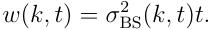

The implied variance _v_ shall be equivalently defined as _v_ ( _k, t_ ) = _σ_ BS2(_k, t_) =_w_(_k, t_)_/t_.We shall refer to the two-dimensional map ( _k, t_ ) _�→ w_ ( _k, t_ ) as the volatility surface, and for any fixed maturity _t >_ 0, the function _k �→ w_ ( _k, t_ ) will represent a slice. We propose below three different—yet equivalent—slice parameterizations of the total implied variance, and give the exact correspondence between them. For a given maturity slice, we shall use the notation _w_ ( _k_ ; _χ_ ) where _χ_ represents a set of parameters, and drop the _t_ -dependence.

<!-- page: 3 -->

## **2 Characterisation of static arbitrage** 

In this section we provide model-independent definitions of (static) arbitrage and some preliminary results. We define static arbitrage for a given volatility surface in the following way, which is equivalent to the definition of static arbitrage for call options recalled in the introduction (see also [25]). 

**Definition 2.1.** _A volatility surface is free of static arbitrage if and only if the following conditions are satisfied:_ 

- _(i) it is free of calendar spread arbitrage;_ 

- _(ii) each time slice is free of butterfly arbitrage._ 

In particular, absence of butterfly arbitrage ensures the existence of a (non-negative) probability density, and absence of calendar spread arbitrage implies monotonicity of option prices with respect to the maturity. The following two subsections analyse in details each of these two types of arbitrage, in a model-independent way. 

### **2.1 Calendar spread arbitrage** 

Calendar spread arbitrage is usually expressed as the monotonicity of European call option prices with respect to the maturity (see for example [5] or [9]). Since our main focus here is on the implied volatility, we translate this definition into a property of the implied volatility. Indeed, assuming proportional dividends, we establish a necessary and sufficient condition for an implied volatility parameterization to be free of calendar spread arbitrage. This can also be found in [11] and [13] and we outline its proof for completeness. 

**Lemma 2.1.** _If dividends are proportional to the stock price, the volatility surface w is free of calendar spread arbitrage if and only if_ 

_Proof._ Let ( _Xt_ ) _t≥_ 0 be a martingale, _L ≥_ 0 and 0 _≤ t_ 1 _< t_ 2. Then the inequality 

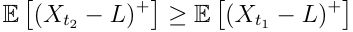

is standard. For any _i_ = 1 _,_ 2, let _Ci_ be options with strikes _Ki_ and expirations _ti_ . Suppose that the two options have the same moneyness, i.e. 

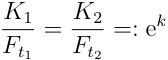

Then, if dividends are proportional, the process ( _Xt_ ) _t≥_ 0 defined by _Xt_ := _St/Ft_ for all _t ≥_ 0 is a martingale and 

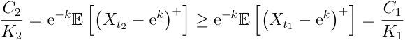

<!-- page: 4 -->

So, if dividends are proportional, keeping the moneyness constant, option prices are nondecreasing in time to expiration. The Black-Scholes formula for the non-discounted value of an option may be expressed in the form _C_ BS( _k, w_ ( _k, t_ )) with _C_ BS strictly increasing in its second argument. It follows that for fixed _k_ , the function _w_ ( _k, ·_ ) must be nondecreasing. 

Lemma 2.1 motivates the following definition. 

**Definition 2.2.** _A volatility surface w is free of calendar spread arbitrage if_ 

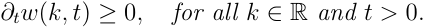

### **2.2 Butterfly arbitrage** 

In Section 2.1, we provided conditions under which a volatility surface could be guaranteed to be free of calendar spread arbitrage. We now consider a different type of arbitrage, namely butterfly arbitrage (Definition 2.3). Absence of this arbitrage corresponds to the existence of a risk-neutral martingale measure and the classical definition of no static arbitrage, as developed in [12] or [8]. In this section, we consider only one slice of the implied volatility surface, i.e. the map _k �→ w_ ( _k, t_ ) for a given fixed maturity _t >_ 0. For clarity we therefore drop—in this section only—the _t_ -dependence of the smile and use the notation _w_ ( _k_ ) instead. Unless otherwise stated, we shall always assume that the map _k �→ w_ ( _k, t_ ) is at least of class _C_2 (R) for all _t ≥_ 0. 

**Definition 2.3.** _A slice is said to be free of butterfly arbitrage if the corresponding density is non-negative._ 

Recall the Black-Scholes formula for a European call option price: 

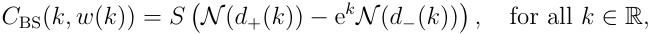

where _N_ is the Gaussian cdf and _d±_ ( _k_ ) := _−k/_ ~~�~~ _w_ ( _k_ ) _±_ ~~�~~ _w_ ( _k_ ) _/_ 2. Let us define the function _g_ : R _→_ R by 

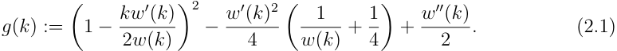

This function will be the main ingredient in the determination of butterfly arbitrage as stated in the following lemma. 

**Lemma 2.2.** _A slice is free of butterfly arbitrage if and only if g_ ( _k_ ) _≥_ 0 _for all k ∈_ R _and_ lim _k→_ + _∞__d_+(_k_) =_−∞._

<!-- page: 5 -->

_Proof._ It is well known [2] that the probability density function _p_ may be computed from the call price function _C_ as 

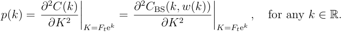

Explicit differentiation of the Black-Scholes formula then gives for any _k ∈_ R, 

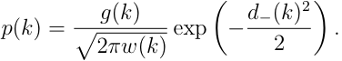

We have so far implicitly assumed that the function _p_ is a well-defined density, and in particular that it integrates to one. This may not always be the case though, and one needs to impose asymptotic boundary conditions. In particular, call prices must converge to 0 as _k_ tends to infinity, which is equivalent to having lim _k→_ + _∞ d_ +( _k_ ) = _−∞_ . We refer the reader to [24] for a proof of this equivalence. 

## **3 SVI formulations** 

We first recall here the original SVI formulation proposed in [13], and then present some alternative (but equivalent) ones. We emphasize in particular that even though the original (“raw”) formulation is very tractable and has become popular with practitioners, it is difficult—seemingly impossible—to find precise conditions on the parameters to prevent arbitrage. 

### **3.1 The raw SVI parameterization** 

For a given parameter set _χR_ = _{a, b, ρ, m, σ}_ , the _raw SVI parameterization_ of total implied variance reads: 

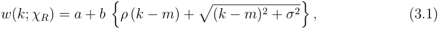

where _a ∈_ R, _b ≥_ 0, _|ρ| <_ 1, _m ∈_ R, _σ >_ 0, and the obvious condition _a_ + _b σ_ ~~�~~ 1 _− ρ_2 _≥_ 0, which ensures that _w_ ( _k_ ; _χR_ ) _≥_ 0 for all _k ∈_ R. This condition indeed ensures that the minimum of the function _w_ ( _·_ ; _χR_ ) is non-negative. Note further that the function _k �→ w_ ( _k_ ; _χR_ ) is (strictly) convex on the whole real line. It follows immediately that changes in the parameters have the following effects: 

- Increasing _a_ increases the general level of variance, a vertical translation of the smile; 

- Increasing _b_ increases the slopes of both the put and call wings, tightening the smile; 

- Increasing _ρ_ decreases (increases) the slope of the left(right) wing, a counter-clockwise rotation of the smile;

<!-- page: 6 -->

- Increasing _m_ translates the smile to the right; 

- Increasing _σ_ reduces the at-the-money (ATM) curvature of the smile. 

We exclude the trivial cases _ρ_ = 1 and _ρ_ = _−_ 1, where the volatility smile is respectively strictly increasing and decreasing. We also exclude the case _σ_ = 0 which corresponds to a linear smile. 

### **3.2 The natural SVI parameterization** 

For a given parameter set _χN_ = _{_ ∆ _, µ, ρ, ω, ζ}_ , the _natural SVI parameterization_ of total implied variance reads: 

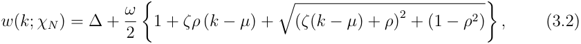

where _ω ≥_ 0, ∆ _∈_ R, _µ ∈_ R, _|ρ| <_ 1 and _ζ >_ 0. It is straightforward to derive the following correspondence between the raw and natural SVI parameters: 

**Lemma 3.1.** _We have the following mapping of parameters between the raw and the natural SVI:_ 

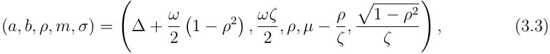

_and its inverse transformation, between the natural and the raw SVI:_ 

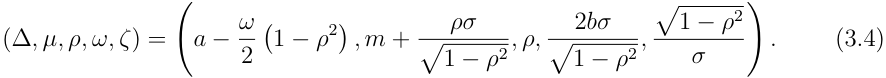

### **3.3 The SVI Jump-Wings (SVI-JW) parameterization** 

Neither the raw SVI nor the natural SVI parameterizations are intuitive to traders in the sense that a trader cannot be expected to carry around the typical value of these parameters in his head. Moreover, there is no reason to expect these parameters to be particularly stable. The _SVI-Jump-Wings (SVI-JW) parameterization_ of the implied variance _v_ (rather than the implied total variance _w_ ) was inspired by a similar parameterization attributed to Tim Klassen, then at Goldman Sachs. For a given time to expiry _t >_ 0 and a parameter set _χJ_ = _{vt, ψt, pt, ct,_ � _vt}_ the SVI-JW parameters are defined from

<!-- page: 7 -->

the raw SVI parameters as follows: 

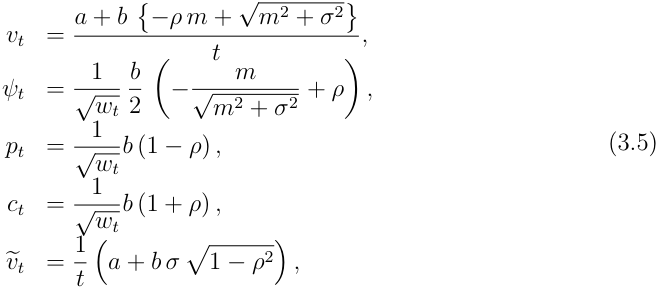

with _wt_ := _vtt_ . Note that this parameterization has an explicit dependence on the time to expiration _t_ , and hence can be viewed as generalizing the raw (expiration-independent) SVI parameterization. The SVI-JW parameters have the following interpretations: 

- _vt_ gives the ATM variance; 

- _ψt_ gives the ATM skew; 

- _pt_ gives the slope of the left (put) wing; 

- _ct_ gives the slope of the right (call) wing; 

- 

- _• vt_ is the minimum implied variance. 

If smiles scaled perfectly as 1 _/__√_ _<u>wt</u>_ (as is approximately the case empirically), these parameters would be constant, independent of the slice _t_ . This makes it easy to extrapolate the SVI surface to expirations beyond the longest expiration in the data set. Also note that by definition, for any _t >_ 0 we have 

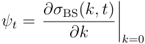

The choice of volatility skew as the skew measure rather than variance skew for example, reflects the empirical observation that volatility is roughly lognormally distributed. Specifically, following the lines of [14, Chapter 7], assume that the instantaneous variance process satisfies the SDE 

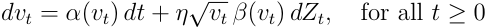

where _η >_ 0, ( _Zt_ ) _t≥_ 0 is a standard Brownian motion and _α_ and _β_ two functions on R+ ensuring the existence of a unique strong solution to the SDE (see for instance [22] for exact conditions), then the ATM variance skew 

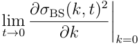

<!-- page: 8 -->

exists and is proportional to _β_ ( _v_ ). If the variance process is lognormal so that _β_ ( _v_ ) behaves like_√_ _<u>v</u>_ , the limit of the at-the-money _volatility_ skew as time to expiry tends to zero is constant and independent of the volatility level. This consistency of the SVIJW parameterization with empirical volatility dynamics thus leads in practice to greater parameter stability over time. The following lemma provides the inverse representation of (3.5). 

**Lemma 3.2.** _Assume that m_ = 0 _. For any t >_ 0 _, define the (t-dependent) quantities:_ 

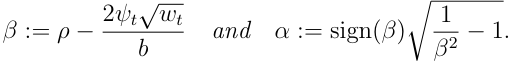

_where we have further assumed that β ∈_ [ _−_ 1 _,_ 1]1 _. Then, the raw SVI and SVI-JW parameters are related as follows:_ 

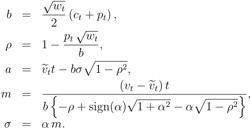

_If m_ = 0 _, then the formulae above for b, ρ and a still hold, but σ_ = ( _vtt − a_ ) _/b._ 

_Proof._ The expressions for _b_ , _ρ_ and _a_ follow directly from (3.5). Assume that _m_ = 0 and let _β_ := _ρ −_ 2 _ψt__√_ _<u>wt/b</u>_ and _α_ := _σ/m ∈_ R. Then the expressions in (3.5) give 

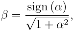

which implies that 

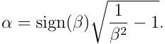

Using (3.5), we also have 

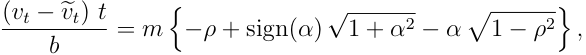

from which we deduce _m_ in terms of _α_ , and the expression of _σ_ is recovered from the equality _σ_ = _αm_ . The expression for _σ_ in the case _m_ = 0 is straightforward from (3.5). 

> 1The condition _β ∈_ [ _−_ 1 _,_ 1] is equivalent to _−pt ≤_ 2 _ψt ≤ ct_ , i.e. to the convexity of the smile.

<!-- page: 9 -->

### **3.4 Arbitrage and absence thereof in SVI parameterizations** 

Given a volatility surface, it is natural to wonder whether it is free of arbitrage. Since we can easily switch from any of the SVI formulations to either of the other two using Lemma 3.3 and Lemma 3.2, we shall state the following results only for the raw SVI parameterization (3.1). Referring to (3.1) as a volatility surface is a slight abuse of language since (3.1) is really an expiry-independent slice parameterization. A volatility surface is thus understood as a (discrete) collection of slices, with a different set of parameters for each expiry. Checking calendar arbitrage in the sense of Lemma 2.1 is then equivalent to checking for calendar arbitrage for any pair of expiries _t_ 1 and _t_ 2. The following lemma establishes a sufficient condition for the absence of calendar spread arbitrage. 

**Lemma 3.3.** _The raw SVI surface_ (3.1) _is free of calendar spread arbitrage if a certain quartic polynomial (given in_ (3.7) _below) has no real root._ 

_Proof._ By definition, there is no calendar arbitrage if for any two dates _t_ 1 = _t_ 2, the corresponding slices _w_ ( _·, t_ 1) and _w_ ( _·, t_ 2) do not intersect. Let these two slices be characterised by the sets of parameters _χ_ 1 := _{a_ 1 _, b_ 1 _, σ_ 1 _, ρ_ 1 _, m_ 1 _}_ and _χ_ 2 := _{a_ 2 _, b_ 2 _, σ_ 2 _, ρ_ 2 _, m_ 2 _}_ , and assume for convenience that 0 _< t_ 1 _< t_ 2. We therefore need to determine the (real) roots of the equation _w_ ( _k, t_ 1) = _w_ ( _k, t_ 2). The latter is equivalent to 

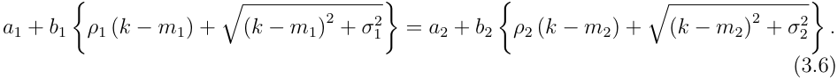

Leaving ( _k − m_ 1)2 + _σ_ 12ononeside,squaringtheequalityandrearrangingitleadsto ~~�~~ 

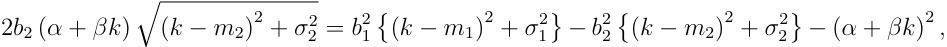

where _α_ := _a_ 2 _− a_ 1 + _b_ 1 _ρ_ 1 _m_ 1 _− b_ 2 _ρ_ 2 _m_ 2 and _β_ := _b_ 2 _ρ_ 2 _− b_ 1 _ρ_ 1. Squaring the last equation above gives a quartic polynomial equation of the form 

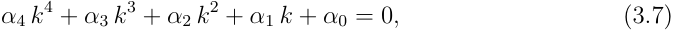

where each of the coefficients lengthy yet explicit expressions2 in terms of the parameters _{a_ 1 _, b_ 1 _, ρ_ 1 _, σ_ 1 _, m_ 1 _}_ and _{a_ 2 _, b_ 2 _, ρ_ 2 _, σ_ 2 _, m_ 2 _}_ . If this quartic polynomial has no real root, then the slices do not intersect and the lemma follows. Roots of a quartic polynomial are known in closed-form thanks to Ferrari and Cardano [3]. Thus there exist closed-form expressions in terms of _χ_ 1 and _χ_ 2 for the possible intersection points of the two SVI slices. 

**Remark 3.1.** _If the quartic polynomial_ (3.7) _has one or more real roots, we need to check whether the latter are indeed solutions of the original problem_ (3.6) _, or spurious solutions arising from the two squaring operations. The absence of real roots of the quartic polynomial is clearly a sufficient—but not necessary—condition._ 

> 2Explicit expressions for these coefficients can be found in the R-code posted on `http://faculty. baruch.cuny.edu/jgatheral` .

<!-- page: 10 -->

**Remark 3.2.** _By a careful study of the minima and the shapes of the two slices w_ ( _·, t_ 1) _and w_ ( _·, t_ 2) _, it is possible to determine a set of conditions on the parameters ensuring no calendar spread arbitrage. However these conditions involve tedious combinations of the parameters and will hence not match the computational simplicity of the lemma._ 

For a given slice, we now wish to determine conditions on the parameters of the raw SVI formulation (3.1) such that butterfly arbitrage is excluded. By Lemma 2.1, this is equivalent to showing (i) that the function _g_ defined in (2.1) is always positive and (ii) that call prices converge to zero as the strike tends to infinity. Sadly, the highly non-linear behaviour of _g_ makes it seemingly impossible to find general conditions on the parameters that would eliminate butterfly arbitrage. We provide below an example where butterfly arbitrage is violated. Notwithstanding our inability to find general conditions on the parameters that would preclude arbitrage, in Section 4, we will introduce a new sub-class of SVI volatility surface for which the absence of butterfly arbitrage is guaranteed for all expiries. 

**Example 3.1.** _(From Axel Vogt on wilmott.com) Consider the raw SVI parameters:_ 

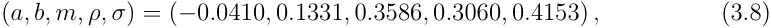

_with t_ = 1 _. These parameters give rise to the total variance smile w and the function g (defined in_ (2.1) _) on Figure 1, where the negative density is clearly visible._ 

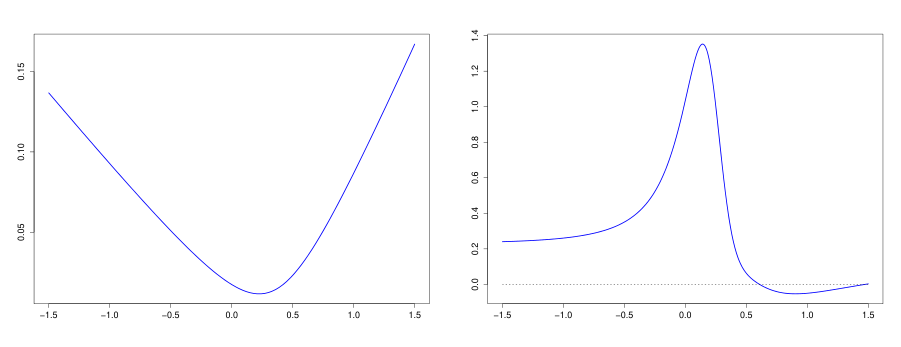

<!-- Start of picture text -->
−1.5 −1.0 −0.5 0.0 0.5 1.0 1.5 −1.5 −1.0 −0.5 0.0 0.5 1.0 1.5 1.4 0.15 1.2 1.0 0.8 0.10 0.6 0.4 0.05 0.2 0.0 <!-- End of picture text -->

Figure 1: Plots of the total variance smile _w_ (left) and the function _g_ defined in (2.1) (right), using the parameters (3.8). 

## **4 Surface SVI: A surface free of static arbitrage** 

We now introduce a class of SVI volatility surfaces—which we shall call SSVI (for ‘Surface SVI’)—as an extension of the natural parameterization (3.2). For any maturity _t ≥_ 0,

<!-- page: 11 -->

define the at-the-money (ATM) implied total variance _θt_ := _σ_ BS2(0_, t_)_t_.Weshallassume that the function _θ_ is at least of class _C_1 on R_∗_An ATM option with zero time to expiry +. has no value so _θ_ 0 := lim _t→_ 0 _θt_ = 0. 

**Definition 4.1.** _Let ϕ be a smooth function from_ R_∗_ +_to_R_∗_ +_such that the limit_lim_t→_0_θtϕ_(_θt_) _exists in_ R _. We refer to as_ SSVI _the surface defined by_ 

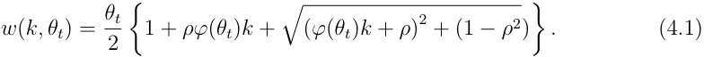

From Section 3, SSVI corresponds to the natural SVI volatility surface parameterization (3.2) with _χN_ = _{_ 0 _,_ 0 _, ρ, θt, ϕ_ ( _θt_ ) _}_ . Note that this representation amounts to considering the volatility surface in terms of ATM variance time, instead of standard calendar time, similar in spirit to the stochastic subordination of [7]. 

**Remark 4.1.** _In the parameterization_ (4.1) _, the ATM variance curve θt may be viewed as a (vector) parameter of the volatility surface. Moreover, this parameter is directly observable given market prices for a finite set of expiries, and can be considered wellknown to traders even for expiries which are not explicitly quoted. The explicit reference to θt also emphasizes the importance of studies such as [10] of the ATM variance structure in classical models which may shed some light on how to impose dynamics on SSVI._ 

The ATM implied total variance is _θt_ = _σ_ BS2(0_, t_)_t_andtheATMvolatilityskewis given by 

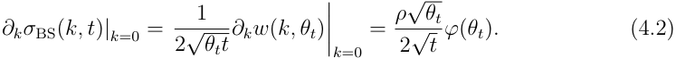

Furthermore the smile is symmetric around at-the-money if and only if _ρ_ = 0. This is consistent with [4, Theorem 3.4] which states that in a standard stochastic volatility model, the smile is symmetric if and only if the correlation between the stock price and its instantaneous volatility is null. Since _θ_ 0 = 0, we have at time _t_ = 0: 

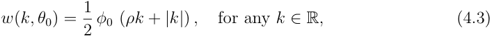

where _φ_ 0 := lim _θ→_ 0 _θϕ_ ( _θ_ ). _φ_ 0 = 0 is characteristic of stochastic volatility models as in Example 4.1; _φ_ 0 _>_ 0 as in Example 4.2 gives a V-shaped time zero smile which is characteristic of models with jumps and in particular, characteristic of empirically observed volatility surfaces. For notational convenience, we shall always assume that lim _t↗∞ θt_ = _∞_ . As proved in [24], this is equivalent (assuming no interest rate) to the stock price (assumed to be a non-negative martingale) to converging to zero as _t_ tends to infinity. Although this holds in many popular models (Black-Scholes, Heston, exponential L´evy), this is not always true, see [19] for counter-examples. If lim _t↗∞ θt_ is finite, all our results remain valid, but only on the support of the function _t �→ θt_ . 

The following theorem gives precise necessary and sufficient conditions to ensure that the SSVI volatility surface (4.1) is free of calendar spread arbitrage (Lemma 2.1) and also matches the term structure of ATM volatility and the term structure of the ATM volatility skew.

<!-- page: 12 -->

**Theorem 4.1.** _The SSVI surface_ (4.1) _is free of calendar spread arbitrage if and only if_ 

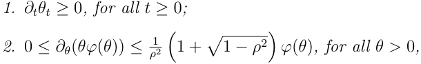

_where the upper bound is infinite when ρ_ = 0 _._ 

In particular, this theorem implies that the SSVI surface (4.1) is free of calendar spread arbitrage if the skew in total variance terms is monotonically increasing in trading time and the skew in implied variance terms is monotonically decreasing in trading time. In practice, any reasonable skew term structure that a trader defines has these properties. 

_Proof._ Since the definition of calendar spread arbitrage does not depend on the logmoneyness _k_ , there is no loss of generality in assuming _k_ fixed. First note that _∂tw_ ( _k, θt_ ) = _∂θw_ ( _k, θt_ ) _∂tθt_ so the SSVI volatility surface (4.1) is free of calendar spread arbitrage if _∂θw_ ( _k, θ_ ) _≥_ 0 for all _θ >_ 0. 

Consider first the case _|ρ| <_ 1. To proceed, we compute, for any _θ >_ 0, 

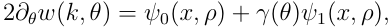

with _x_ := _kϕ_ ( _θ_ ), _γ_ ( _θ_ ) := _∂θ_ ( _θϕ_ ( _θ_ )) _/ϕ_ ( _θ_ ), 

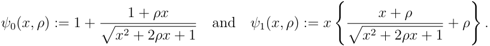

For any _|ρ| <_ 1, _ψ_ 0( _x, ρ_ ) is strictly positive for all _x ∈_ R. Now define the set 

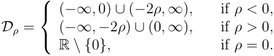

Then _ψ_ 1( _·, ρ_ ) _>_ 0 if _x ∈Dρ_ and _ψ_ 1( _·, ρ_ ) _<_ 0 if _x ∈_ R _\_ ( _Dρ ∪{_ 0 _, −_ 2 _ρ}_ ). It follows that 

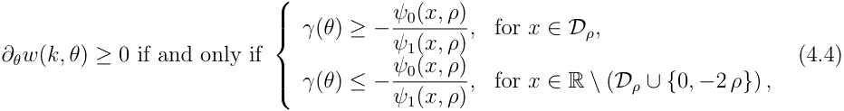

When _x ∈{_ 0 _, −_ 2 _ρ}_ , then _ψ_ 1( _x, ρ_ ) = 0 and so _∂θw_ ( _k, θ_ ) _≥_ 0. The inequalities (4.4) thus give necessary and sufficient conditions for absence of calendar spread arbitrage for any given _x ∈_ R. To determine the tightest possible bounds on _γ_ ( _θ_ ), we compute 

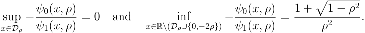

<!-- page: 13 -->

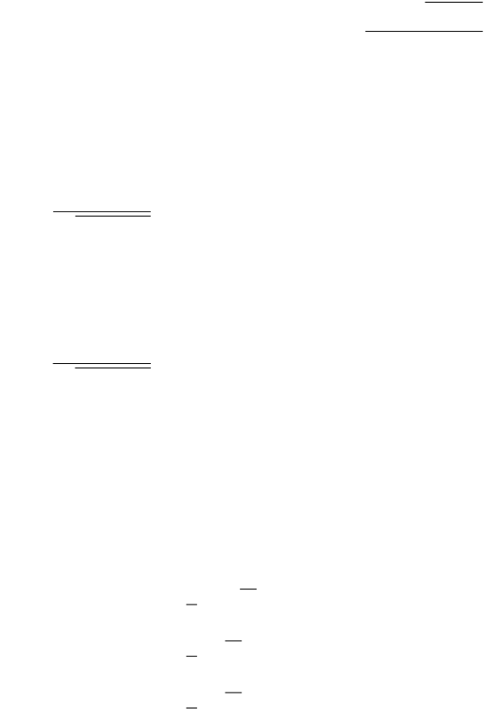

<!-- Start of picture text -->
Vv (r) { (r)  { - -J -J <!-- End of picture text -->

~~“1 —}~~ 

<u>|</u> 

<u>)</u> 

~~a~~

<!-- page: 14 -->

_For any λ >_ 0 _, the map θ �→ ∂θ_ ( _θϕ_ ( _θ_ )) _/ϕ_ ( _θ_ ) _is strictly decreasing on_ (0 _, ∞_ ) _with limit as θ tends to zero equal to one. Since the quantity_ (1 + ~~�~~ 1 _− ρ_2 ) _/ρ_2 _is greater than one for any ρ ∈_ [ _−_ 1 _,_ 1] _, the conditions of Theorem 4.1 are satisfied. This function is consistent with the implied variance skew in the Heston model as shown in [14, Equation 3.19]._ 

#### **Example 4.2. Power-law parameterization** 

_Consider ϕ_ ( _θ_ ) = _ηθ__−γ_ _with η >_ 0 _and_ 0 _< γ <_ 1 _. Then ∂θ_ ( _θϕ_ ( _θ_ )) _/ϕ_ ( _θ_ ) = 1 _− γ ∈_ (0 _,_ 1) _holds for all θ >_ 0 _, and hence the conditions of Theorem 4.1 are satisfied. In particular if γ_ = 1 _/_ 2 _then Lemma 4.1 implies that the SVI-JW parameters ψt, pt, and ct associated with the SSVI volatility surface_ (4.1) _are constant and independent of the time to expiration t. Furthermore, Equation 4.2 implies that the ATM volatility skew is given by_ 

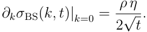

The following theorem provides sufficient conditions for a SSVI surface (4.1) to be free of butterfly arbitrage. 

**Theorem 4.2.** _The SSVI volatility surface_ (4.1) _is free of butterfly arbitrage if the following conditions are satisfied for all θ >_ 0 _:_ 

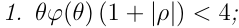

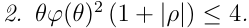

_Proof._ For ease of notation, we suppress the explicit dependence of _θ_ and _ϕ_ on _t_ . By symmetry, it is enough to prove the theorem for 0 _≤ ρ <_ 1. We shall therefore assume so, and we define _z_ := _ϕk_ . The function _g_ defined in (2.1) reads 

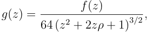

where 

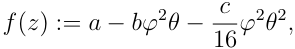

and where _a_ , _b_ and _c_ depend on _z_ . In the following, we frequently use the inequality 

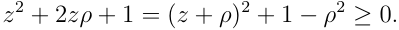

Computing the coefficient of _ϕ_2 _θ_2 in _f_ ( _z_ ) explicitly gives 

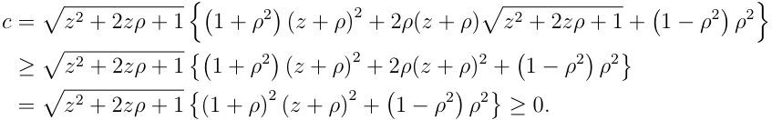

<!-- page: 15 -->

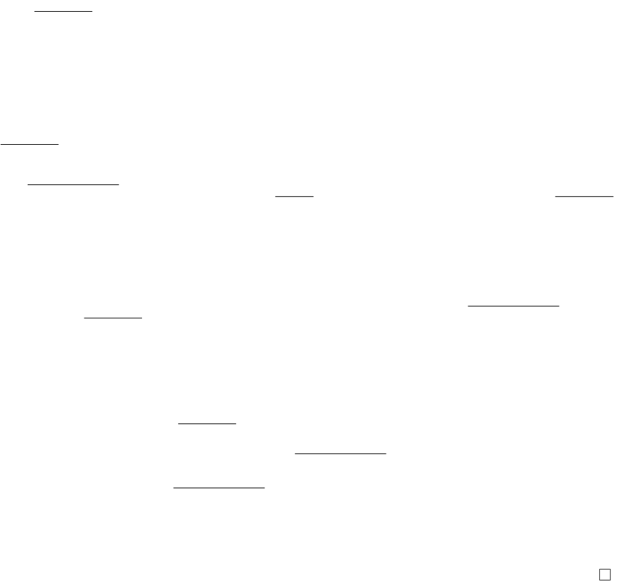

<!-- Start of picture text -->
— Vv { ( ) fF ( ) ) ( ) vo F H) CS} { ( ) ( ) fF —— ( ) ( ) ov —— ( ) f io ? ( CJ <!-- End of picture text -->

<!-- page: 16 -->

The following lemma shows that Theorem 4.2 is almost if-and-only-if. 

**Lemma 4.2.** _The SSVI volatility surface_ (4.1) _is free of butterfly arbitrage only if_ 

_θϕ_ ( _θ_ ) (1 + _|ρ|_ ) _≤_ 4 _, for all θ >_ 0 _._ 

_Moreover if θϕ_ ( _θ_ ) (1 + _|ρ|_ ) = 4 _, the SSVI surface is free of butterfly arbitrage only if_ 

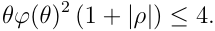

_Thus Condition 1 of Theorem 4.2 is necessary and Condition 2 is tight._ 

_Proof._ Considering the SSVI surface (4.1) and the function _g_ defined in (2.1), we have 

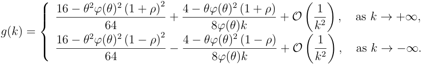

The result follows by inspection. 

**Remark 4.3.** _The asymptotic behavior of SSVI_ (4.1) _as |k| tends to infinity is_ 

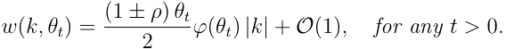

_We thus observe that the condition θϕ_ ( _θ_ ) (1 + _|ρ|_ ) _≤_ 4 _of Theorem 4.2 corresponds to the upper bound of_ 2 _on the asymptotic slope established by Lee [23] and so again, Condition 1 of Theorem 4.2 is necessary._ 

The following corollary follows directly from Theorems 4.1 and 4.2. 

**Corollary 4.1.** _The SSVI surface_ (4.1) _is free of static arbitrage if the following conditions are satisfied:_ 

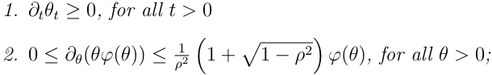

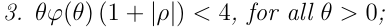

**Remark 4.4.** _Consider the function ϕ_ ( _θ_ ) = _ηθ__−γ_ _with η >_ 0 _from Example 4.2, then Condition 2 imposes γ ∈_ (0 _,_ 1) _. From Condition 3, such surfaces can be free of static arbitrage only up to some maximum expiry. Take for instance the simple case θt_ := _σ_2 _t for some σ >_ 0 _. Then the map ψ_ : _t �→ θtϕ_ ( _θt_ ) (1 + _|ρ|_ ) _−_ 4 _is clearly strictly increasing with ψ_ (0) = _−_ 4 _and_ lim _t→∞ ψ_ ( _t_ ) = _∞. Therefore there exists t__∗_ 0_>_0_suchthatψ_(_t_)_≤_0 _for t ≤ t__∗_ 0_.Themapψ_2:_t �→θtϕ_(_θt_)2 (1 +_|ρ|_)_−_4_is_

<!-- page: 17 -->

- _strictly increasing if γ ∈_ (0 _,_ 1 _/_ 2) _with ψ_ 2(0) = _−_ 4 _and_ lim_thereexists_ _t→∞__ψ_(_t_) = +_∞;_ 

- _t__∗_ 1_>_0_suchthatψ_2(_t_)_≤_0_fort ≤t∗_ 1_._ 

- _strictly decreasing if γ ∈_ (1 _/_ 2 _,_ 1) _with_ lim _t→_ 0_ψ_2(0)=+_∞and_ _t_lim _→∞__ψ_(_t_)=_−_4_;there_ _exists t__∗_ 1_>_0_suchthatψ_2(_t_)_≤_0_fort ≥t∗_ 1_._ 

- _constant if α_ = 1 _/_ 2 _with ψ_ 2 _≡−_ 4 _._ 

_When γ ∈_ (0 _,_ 1 _/_ 2) _, the surface is guaranteed to be free of static arbitrage only for t ≤ t__∗_ 0_∧t_ 1_∗._ _For γ ∈_ (1 _/_ 2 _,_ 1) _, this remains true only for t ∈_ (0 _, t__∗_ 0)_∩_(_t_ 1_∗, ∞_)_(whichmaybeempty)._ _When γ_ = 1 _/_ 2 _, static arbitrage cannot occur for t ≤ t__∗_ 0_.However,thebehaviorforlargeθ_ _can be easily modified so as to ensure that the entire surface is free of static arbitrage. For example, the choice_ 

_gives a surface that is completely free of static arbitrage provided that η_ (1 + _|ρ|_ ) _≤_ 2 _._ 

**Remark 4.5.** _In the Heston-like parameterization of Example 4.1, note that_ 

_Therefore Condition 3 of Corollary 4.1 imposes λ ≥_ (1 + _|ρ|_ ) _/_ 4 _._ 

The following model-independent theorem provides a way to expand the class of volatility surfaces that are guaranteed to be free of static arbitrage by adding a suitable timedependent function. 

**Theorem 4.3.** _Let_ ( _k, t_ ) _�→ w_ ( _k, t_ ) _be a SSVI volatility surface_ (4.1) _satisfying the conditions of Corollary 4.1 (in particular free of static arbitrage), and α_ : R+ _→_ R+ _a nonnegative and increasing function of time. Then the volatility surface_ ( _k, t_ ) _�→ wα_ ( _k, θt_ ) := _w_ ( _k, θt_ ) + _αt is also free of static arbitrage._ 

_Proof._ Since _∂twα_ ( _k, θt_ ) := _∂tw_ ( _k, θt_ )+ _∂tαt_ , Lemma 2.1 implies that _wα_ is free of calendar spread arbitrage if _∂tαt ≥_ 0 and _αt ≥_ 0. We now show that _wα_ is also free of butterfly arbitrage. For clarity, since butterfly arbitrage does not depend on the time parameter _t_ , we shall use the simplified notation _w_ ( _k_ ) := _w_ ( _k, θt_ ), and likewise _wα_ ( _k_ ) := _wα_ ( _k, θt_ ). Similarly, in view of (2.1), we shall define the map _gα_ ( _k_ ), where the function _w_ is replaced by _wα_ . We consider the case _ρ <_ 0 since the case _ρ >_ 0 follows by symmetry, and the result is obvious when _ρ_ = 0. Let us consider the function _Gα_ : R _→_ R defined by 

and let _k__∗_ := _−_ 2 _ρ/ϕ_ ( _θt_ ) _>_ 0 be the unique solution to the equation _w__′_ ( _k_ ) = 0. We can compute explicitly the following: 

<!-- page: 18 -->

which implies 

Since _w__′_ (0) = _ρθtϕ_ ( _θt_ ) _<_ 0 the equation _w__′_ ( _k_ ) + 4 _k_ = 0 has a unique solution _k∗ >_ 0, and _w__′_ ( _k_ ) + 4 _k_ is strictly positive for any _k > k∗_ and strictly negative when _k < k∗_ . By strict convexity of the function _w_ it also follows that _k∗ < k__∗_ . Therefore for any _k ∈_ ( _k∗, k__∗_ ), the two inequalities _w__′_ ( _k_ ) _<_ 0 and _w__′_ ( _k_ )+4 _k >_ 0 hold, and therefore _∂αGα_ ( _k_ ) _>_ 0. Since by construction _G_ 0( _k_ ) = 0, we therefore conclude that _g_ ( _k_ ) _> gα_ ( _k_ ) for any _k ∈_ ( _k∗, k__∗_ ). For _k ∈/_ ( _k∗, k__∗_ ), the inequality _g_ ( _k_ ) _< gα_ ( _k_ ) holds as soon as _∂αGα_ ( _k_ ) _<_ 0. Consider first the case _k > k__∗_ . We can rewrite (4.6) as 

so that it suffices to prove the inequality 2 _wα_ ( _k_ ) _− kw__′_ ( _k_ ) _>_ 0 for any _k > k__∗_ . It suffices to prove _∂αGα_ ( _k_ ) _<_ 0 for then we have the inequality _gα_ ( _k_ ) _> g_ ( _k_ ) _≥_ 0 and there is no butterfly arbitrage. 

First consider the case _k > k__∗_ , so that _w__′_ ( _k_ ) _>_ 0. Recall that a continuously differentiable function _f_ is convex on the interval ( _a, b_ ) if and only if _f_ ( _x_ ) _− f_ ( _y_ ) _≥ f__′_ ( _x_ )( _x − y_ ) for all ( _x, y_ ) _∈_ ( _a, b_ ). Setting _x_ = _k_ and _y_ = 0, we conclude that 2 _wα_ ( _k_ ) _− kw__′_ ( _k_ ) _>_ 0 since _wα_ (0) _≥_ 0. It follows that _∂αGα_ ( _k_ ) _<_ 0 for any _k > k__∗_ . 

For any _k <_ 0, we always have _w__′_ ( _k_ ) _<_ 0, the inequality 2 _wα_ ( _k_ ) _− kw__′_ ( _k_ ) _>_ 0 follows by convexity as above, and hence _∂αGα_ ( _k_ ) _<_ 0 for any _k <_ 0. We prove here that _gα_ ( _k_ ) _≥ gα_ (0) for all such _k_ . Since we already showed that _gα_ (0) _>_ 0, the result follows. From the definition of _gα_ and (2.1), 

A straightforward analysis shows that the function _k �→ w__′′_ ( _k_ ) is strictly increasing on the interval (0 _, k__∗_ _/_ 2) and strictly decreasing on ( _k__∗_ _/_ 2 _, k__∗_ ). The easy computation _w__′′_ (0) = _w__′′_ ( _k__∗_ ) implies that _w__′′_ ( _k_ ) _≥ w__′′_ (0) on (0 _, k__∗_ ). Also, _w__′_ (0)2 _> w__′_ ( _k_ )2 on (0 _, k__∗_ ). Simplifying (4.7), it follows that 

<!-- page: 19 -->

Note that _w__′_ ( _k_ )2 _≤ w__′_ (0) _w__′_ ( _k_ ) _≤ w__′_ (0)2 on the interval (0 _, k__∗_ ) so 

We now prove the following claim: _kw_ (0) _−__w′_ 4<u>(0)</u>[_w_(_k_)_−w_(0)]_≥_0 for_k∈_(0_, k∗_).Indeed, 

Condition 2 of Theorem 4.2 implies that 1 _−__<u>ρ</u>_2_θ_ 8_<u>ϕ</u>_2 _≥_ 0. Then (recall that _ρ ≤_ 0) the right-hand side of the above equality represents an increasing function on (0 _, k__∗_ ) which is equal to zero at the origin, and the claim holds. Then, from (4.8), 

**Remark 4.6.** _Given a set of expirations_ 0 _< t_ 1 _< . . . < tn (n ≥_ 1 _) and at-the-money implied total variances_ 0 _< θt_ 1 _< . . . < θtn, Corollary 4.1 gives us the freedom to match three features of one smile (level, skew, and curvature say) but only two features of all the other smiles (level and skew say), subject of course to the given smiles being themselves arbitrage-free. Theorem 4.3 may allow us to match an additional feature of each smile through αt._ 

## **5 Numerics and calibration methodology** 

### **5.1 How to eliminate butterfly arbitrage** 

In Section 4, we showed how to define a volatility smile that is free of butterfly arbitrage. This smile is completely defined given three observables. The ATM volatility and ATM skew are obvious choices for two of them. The most obvious choice for the third observable in equity markets would be the asymptotic slope for _k_ negative and in FX markets and interest rate markets, perhaps the ATM curvature of the smile might be more appropriate. 

In view of Lemma 4.1, supposing we choose to fix the SVI-JW parameters _vt_ , _ψt_ and _pt_ of a given SVI smile, we may guarantee a smile with no butterfly arbitrage by choosing the remaining parameters _c__′_ _t_and_v_� _t__′_as 

In other words, given a smile defined in terms of its SVI-JW parameters, we are guaranteed to be able to eliminate butterfly arbitrage by changing the call wing _ct_ and the minimum

<!-- page: 20 -->

variance _v_ � _t_ , both parameters that are hard to calibrate with available quotes in equity options markets. 

**Example 5.1.** _Consider again the arbitrageable smile from Example 3.1. The corresponding SVI-JW parameters read_ 

_We know then that choosing_ ( _ct,_ � _vt_ ) = ( _c__o_ _t__,_�_v_ _t__o_):=(0_._3493158_,_0_._01548182)_givesasmile_ _free of butterfly arbitrage. It follows by continuity of the parameterization in all of its parameters, that there must exist some pair of parameters_ ( _c__∗_ _t__,_�_v_ _t__∗_)_withc∗_ _t__∈_(_co_ _t__, ct_)_and_ _v_ � _t__∗∈_(_v_�_t, v_ _t__o_)_suchthatthenewsmileisfreeofbutterflyarbitrageandisascloseas_ _possible to the original one in some sense. In this particular case, choosing the objective function as the sum of squared option price differences plus a large penalty for butterfly arbitrage, we arrive at the following “optimal” choices of the call wing and minimum variance parameters that still ensure no butterfly arbitrage:_ 

_Note that the optimizer has left_ � _vt unchanged but has decreased the call wing. The resulting smiles and plots of the function g are shown in Figure 2._ 

<!-- Start of picture text -->
−1.5 −1.0 −0.5 0.0 0.5 1.0 1.5 −1.5 −1.0 −0.5 0.0 0.5 1.0 1.5 1.4 0.15 1.2 1.0 0.8 0.10 0.6 0.4 0.05 0.2 0.0 <!-- End of picture text -->

Figure 2: Plots of the total variance smile (left) and the function _g_ defined in (2.1) (right), using the parameters (3.8). The graphs corresponding to the original Vogt parameters is solid, to the guaranteed butterfly-arbitrage-free parameters dashed, and to the “optimal” choice of parameters dotted. 

**Remark 5.1.** _The additional flexibility potentially afforded to us through the parameter αt of Theorem 4.3 sadly does not help us with the Vogt smile of Example 5.1. For αt to help, we must have αt >_ 0 _; it is straightforward to verify that this translates to the_ ˜ _condition vt_ (1 _− ρ_2 ) _< vt which is violated in the Vogt case._

<!-- page: 21 -->

### **5.2 Calibration of SVI parameters to implied volatility data** 

There are many possible ways of defining an objective function, the minimization of which would permit us to calibrate SVI to observed implied volatilities. Whichever calibration strategy we choose, we need an efficient fitting algorithm and a good choice of initial guess. The approach we will present here involves taking a square-root fit as the initial guess. We then fit SVI slice-by-slice with a heavy penalty for calendar spread arbitrage (i.e. crossed lines on a total variance plot). Consider two SVI slices with parameters _χ_ 1 and _χ_ 2 where _t_ 2 _> t_ 1. We first compute the points _ki_ ( _i_ = 1 _, . . . , n_ ) with _n ≤_ 4 at which the slices cross, sorting them in increasing order. If _n >_ 0, we define the points� _ki_ as 

For each of the _n_ + 1 points� _ki_ , we compute the amounts _ci_ by which the slices cross: 

**Definition 5.1.** _The_ crossedness _of two SVI slices is defined as the maximum of the ci_ ( _i_ = 1 _, . . . , n_ ) _. If n_ = 0 _, the crossedness is null._ 

#### **An example SVI calibration recipe** 

- Given mid implied volatilities _σij_ = _σ_ BS( _ki, tj_ ), compute mid option prices using the Black-Scholes formula. 

- Fit the square-root SVI surface by minimizing sum of squared distances between the fitted prices and the mid option prices. This is now the initial guess. 

- Starting with the square-root SVI initial guess, change SVI parameters slice-by slice so as to minimize the sum of squared distances between the fitted prices and the mid option prices with a big penalty for crossing either the previous slice or the next slice (as quantified by the crossedness from Definition 5.1). 

There are obviously many possible variations on this recipe. The objective function may be changed and when finally working to optimize the fit slice-by-slice, one can work from the shortest expiration to the longest expiration or in the reverse order. In practice, working forward or in reverse seems to make little difference. Changing the objective function on the other hand will make some difference especially for very short expirations. 

### **5.3 Interpolation and extrapolation of calibrated slices** 

Suppose we follow the above recipe above to fit SVI to options with a discrete set of expiries. In particular, each of the resulting SVI smiles will be free of butterfly arbitrage.

<!-- page: 22 -->

It’s not immediately obvious that we can interpolate these smiles in such a way as to ensure the absence of static arbitrage in the interpolated surface. The following lemma shows that it is possible to achieve this. 

**Lemma 5.1.** _Given two volatility smiles w_ ( _k, t_ 1) _and w_ ( _k, t_ 2) _with t_ 1 _< t_ 2 _where the two smiles are free of butterfly arbitrage and such that w_ ( _k, τ_ 2) _≥ w_ ( _k, τ_ 1) _for all k, there exists an interpolation such that the interpolated volatility surface is free of static arbitrage for t_ 1 _< t < t_ 2 _._ 

_Proof._ Given the two smiles _w_ ( _k, t_ 1) and _w_ ( _k, t_ 2), we may compute the (undiscounted) prices _C_ ( _Fi, Ki, ti_ ) =: _Ci_ of European calls with expirations _ti_ ( _i_ = 1 _,_ 2) using the BlackScholes formula. In particular, since the two smiles are free of butterfly arbitrage, 

Consider any monotonic interpolation _θt_ of the at-the-money implied total variance _w_ (0 _, t_ ). Let _Ki_ = _Fi_ e_k_ and _Kt_ = _Ft_ e_k_ . Then for any _t_ 1 _< t < t_ 2, define the price _Ct_ = _C_ ( _Ft, Kt, t_ ) of a European call option to be 

where for any _t ∈_ ( _t_ 1 _, t_ 2), we define 

By construction, for fixed _k_ , the inequality 

holds so that there is no calendar spread arbitrage. Also, because of the square-roots in the definition (5.2), the at-the-money interpolated option price will be almost perfectly consistent with the chosen implied total variance interpolation _θt_ . Moreover, if the two smiles _w_ ( _k, t_ 1) and _w_ ( _k, t_ 2) are free of butterfly arbitrage, we have _∂K,KC_ ( _k, t_ ) _≥_ 0. To see this, first note that because all the options have the same moneyness, the identity (5.1) is equivalent to 

Then note that the ratio _C_ ( _F, K, t_ ) _/F_ is a function of _F_ and _K_ only through the logmoneyness _k_ . Also, for _K_ = _Kt, K_ 1 _, K_ 2, we have 

<!-- page: 23 -->

Applying this to (5.3), we obtain 

All the terms on the rhs are non-negative, so the lhs must also be non-negative. We conclude that there is no butterfly arbitrage in the interpolated slice and thus that there is no static arbitrage. The interpolated volatility surface may be retrieved by inversion of the Black-Scholes formula. 

We could conceive of a myriad of algorithms for extrapolating the volatility surface. For example, one way to extrapolate a given set of _n ≥_ 1 (arbitrage-free) volatility smiles with expirations 0 _< t_ 1 _< . . . < tn_ would be as follows: At time _t_ 0 = 0, the value of a call option is just the intrinsic value. We may then interpolate between _t_ 0 and _t_ 1 using the algorithm presented in the proof of Lemma 5.1, thereby guaranteeing no static arbitrage. For extrapolation beyond the final slice, we suggest to first recalibrate the final slice using the SSVI form (4.1). Then fix a monotonic increasing extrapolation of _θt_ (asymptotically linear in time would seem to be reasonable) and extrapolate the smile for _t > tn_ according to 

which is free of static arbitrage if _w_ ( _k, θtn_ ) is free of butterfly arbitrage by Theorem 4.3. 

### **5.4 A calibration example** 

We take SPX option quotes as of 3pm on 15-Sep-2011 (the day before triple-witching) and compute implied volatilities for all 14 expirations. The result of fitting square-root SVI is shown in Figure 3. The result of fitting SVI following the recipe provided in Section 5.2 is shown in Figure 4. With the sole exception of the first expiration (options expiring at the market open on the following morning), the fit quality is almost perfect.

<!-- page: 24 -->

<!-- Start of picture text -->
T = 0.0027 T = 0.019 T = 0.038 T = 0.099 T = 0.18 -0.08 -0.04 0.00 0.04 -0.25 -0.15 -0.05 0.05 -0.4 -0.3 -0.2 -0.1 0.0 0.1 -0.6 -0.4 -0.2 0.0 0.2 -0.8 -0.6 -0.4 -0.2-0.2 0.0 0.2 Log-Strike Log-Strike Log-Strike Log-Strike Log-Strike T = 0.25 T = 0.29 T = 0.50 T = 0.54 T = 0.75 -1.0 -0.5 0.0 -0.6 -0.4 -0.2 0.0 0.2 -1.0 -0.5 0.0 -0.4 -0.2 0.0 0.2 0.4 -1.5 -1.0 -0.5 0.0 0.5 Log-Strike Log-Strike Log-Strike Log-Strike Log-Strike T = 0.79 T = 1.27 T = 1.77 T = 2.26 -0.6 -0.4 -0.2 0.0 0.2 -2.5 -2.0 -1.5 -1.0 -0.5 0.0 0.5 -2.5 -2.0 -1.5 -1.0 -0.5 0.0 0.5 -2.5 -2.0 -1.5 -1.0 -0.5 0.0 0.5 1.0 Log-Strike Log-Strike Log-Strike Log-Strike Figure 3: Red dots are bid implied volatilities; blue dots are offered implied volatilities; the orange solid line is the square-root SVI fit 6 Summary and conclusion We have found and described a large class of arbitrage-free SVI volatility surfaces with a simple closed-form representation. Taking advantage of the existence of such surfaces, we showed how to eliminate both calendar spread and butterfly arbitrages when calibrating SVI to implied volatility data. We have also demonstrated the high quality of typical SVI fits with a numerical example using recent SPX options data. The potential applications of this work to modelling the dynamics of the implied volatility surface are left for future research. Acknowledgments The first author is very grateful to his former colleagues at Bank of America Merrill Lynch for their work on SVI and its implementation, in particular Chrif Youssfi and Peter Friz. We also thank Richard Holowczak of the Subotnick Financial Services Center at Baruch College for supplying the SPX options data, Andrew Chang of the Baruch MFE program for helping with the data analysis, Julien Guyon and the participants of Global Derivatives, Barcelona 2012 for their feedback and comments. We are very grateful to the anonymous referees for their helpful comments and suggestions, and in particular to one of the referees who led us to tighten our results and correct an error in one proof. 0.8 0.8 1.0 1.0 0.7 0.8 0.8 0.8 0.6 0.6 0.5 0.6 0.6 0.6 Implied Vol. 0.4 Implied Vol. 0.4 Implied Vol. 0.4 Implied Vol. 0.4 Implied Vol. 0.4 0.3 0.2 0.2 0.2 0.2 0.2 1.0 0.7 0.8 0.50.5 0.8 0.6 0.8 0.5 0.6 0.4 0.6 0.6 0.4 Implied Vol. Implied Vol. Implied Vol. 0.4 Implied Vol. 0.3 Implied Vol. 0.4 0.4 0.3 0.2 0.2 0.2 0.2 0.2 0.6 0.8 0.5 0.8 0.7 0.4 0.6 0.6 0.5 Implied Vol. 0.3 Implied Vol. 0.4 Implied Vol. 0.40.4 Implied Vol. 0.3 0.2 0.2 0.20.2 0.1 <!-- End of picture text -->

<!-- page: 25 -->

<!-- Start of picture text -->
T = 0.0027 T = 0.019 T = 0.038 T = 0.099 T = 0.18 -0.08 -0.04 0.00 0.04 -0.25 -0.15 -0.05 0.05 -0.4 -0.3 -0.2 -0.1 0.0 0.1 -0.6 -0.4 -0.2 0.0 0.2 -0.8 -0.6 -0.4 -0.2 0.0 0.2 Log-Strike Log-Strike Log-Strike Log-Strike Log-Strike T = 0.25 T = 0.29 T = 0.50 T = 0.54 T = 0.75 -1.0 -0.5 0.0 -0.6 -0.4 -0.2 0.0 0.2 -1.0 -0.5 0.0 -0.4 -0.2 0.0 0.2 0.4 -1.5 -1.0 -0.5 0.0 0.5 Log-Strike Log-Strike Log-Strike Log-Strike Log-Strike T = 0.79 T = 1.27 T = 1.77 T = 2.26 -0.6 -0.4 -0.2 0.0 0.2 -2.5 -2.0 -1.5 -1.0 -0.5 0.0 0.5 -2.5 -2.0 -1.5 -1.0 -0.5 0.0 0.5 -2.5 -2.0 -1.5 -1.0 -0.5 0.0 0.5 1.0 Log-Strike Log-Strike Log-Strike Log-Strike Figure 4: Red dots are bid implied volatilities; blue dots are offered implied volatilities; the orange solid line is the SVI fit following recipe of Section 5.2 0.8 0.8 1.0 1.0 0.7 0.7 0.8 0.8 0.8 0.6 0.6 0.5 0.5 0.6 0.6 0.6 Implied Vol. 0.4 Implied Vol. 0.4 Implied Vol. 0.4 Implied Vol. 0.4 Implied Vol. 0.4 0.3 0.3 0.2 0.2 0.2 0.2 0.2 1.0 0.7 0.8 0.5 0.8 0.6 0.8 0.5 0.6 0.4 0.6 0.60.6 Implied Vol. Implied Vol. 0.4 Implied Vol. 0.4 Implied Vol. 0.3 Implied Vol. 0.4 0.4 0.3 0.2 0.2 0.2 0.2 0.2 0.6 0.8 0.8 0.5 0.8 0.7 0.6 0.4 0.6 0.6 0.5 Implied Vol. 0.3 Implied Vol. 0.4 Implied Vol. 0.4 Implied Vol. 0.4 0.3 0.2 0.2 0.2 0.2 0.1 <!-- End of picture text -->

## **References** 

- [1] Andreasen J., Huge B. Volatility interpolation, _Risk_ , 86–89, March 2011. 

- [2] Breeden, D.T., Litzenberger, R.H. Prices of state-contingent claims implicit in option prices, _The Journal of Business_ **51** (4): 621-651, 1978. 

- [3] Cardano, G., Ars magna or The Rules of Algebra, _Dover_ , 1545. 

- [4] Carr, P., Lee, R. Put-call symmetry: Extensions and applications, _Mathematical Finance_ **19** (4): 523–560, 2009. 

- [5] Carr, P., Madan, D. A note on sufficient conditions for no arbitrage, _Finance Research Letters_ **2** : 125–130, 2005. 

- [6] Carr, P., Wu, L. A new simple approach for for constructing implied volatility surfaces, _Preprint_ available at SSRN, 2010. 

- [7] Clark, P.K. A subordinated stochastic process model with finite variance for speculative prices, _Econometrica_ **41** (1): 135–155, 1973. 

- [8] Cox, A., Hobson, D. Local Martingales, Bubbles and Option Prices, _Finance and Stochastics_ **9** (4): 477–492, 2005.

<!-- page: 26 -->

- [9] Cousot, L. Conditions on option prices for absence of arbitrage and exact calibration, _Journal of Banking and Finance_ **31** (11): 3377–3397, 2007. 

- [10] De Marco, S., Martini, C. The Term Structure of Implied Volatility in Symmetric Models with Applications to Heston, _IJTAF_ **15** (4), 2012. 

- [11] Fengler, M. Arbitrage-free smoothing of the implied volatility surface, _Quantitative Finance_ **9** (4): 417–428, 2009. 

- [12] F¨ollmer, H., Schied, A. Stochastic Finance: An Introduction in Discrete Time, de Gruyter, 2002. 

- [13] Gatheral, J., A parsimonious arbitrage-free implied volatility parameterization with application to the valuation of volatility derivatives, _Presentation at Global Derivatives_ , 2004. 

- [14] Gatheral, J., The Volatility Surface: A Practitioner’s Guide, Wiley Finance, 2006. 

- [15] Gatheral, J., Jacquier, A., Convergence of Heston to SVI, _Quantitative Finance_ **11** (8): 1129–1132, 2011. 

- [16] Glaser, J., Heider, P., Arbitrage-free approximation of call price surfaces and input data risk, _Quantitative Finance_ **12** (1): 61–73, 2012. 

- [17] Harrison, J.M., Pliska, S.R., Martingales and stochastic integrals in the theory of continuous trading, _Stochastic Processes and Applications_ **11** : 251–260, 1981. 

- [18] Harrison, J.M., Kreps, D.M., Martingales and arbitrage in multiperiod securities markets _Journal of Economic Theory_ **20** (3): 381–408, 1979. 

- [19] Hobson, D. Comparison results for stochastic volatility models via coupling. _Finance and Stochastics_ **14** (1): 129-152, 2010. 

- [20] J¨ackel, P., Kahl, C. Hyp hyp hooray, _Wilmott Magazine_ 70–81, March 2008. 

- [21] Kahal´e, N. An arbitrage-free interpolation of volatilities, _Risk_ **17** :102–106, 2004. 

- [22] Karatzas, I., Shreve, S. Brownian motion and stochastic calculus. _Springer-Verlag_ , 1991. 

- [23] Lee, R., The moment formula for implied volatility at extreme strikes, _Mathematical Finance_ **14** (3): 469–480, 2004. 

- [24] Rogers, C. Tehranchi, M.. Can the implied volatility surface move by parallel shift? _Finance & Stochastics_ **14** (2): 235-248, 2010. 

- [25] Roper, M.P.V., Implied Volatility: General Properties and Asymptotics, PhD thesis, The University of New South Wales, 2009.

<!-- page: 27 -->

- [26] Stineman, R. W., A consistently well-behaved method of interpolation, _Creative Computing_ 54–57, 1980. 

- [27] Zeliade Systems, Quasi-explicit calibration of Gatheral’s SVI model, _Zeliade white paper_ , 2009.
