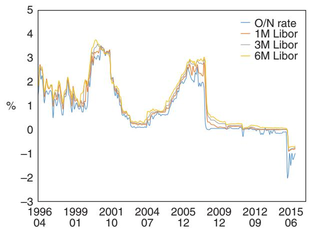
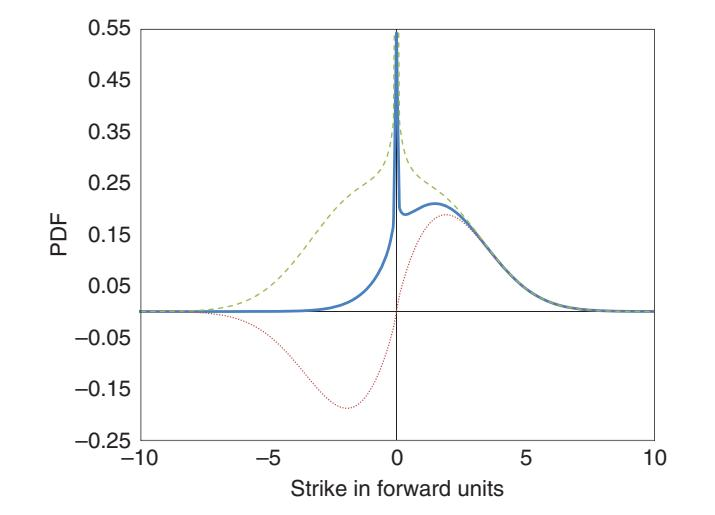
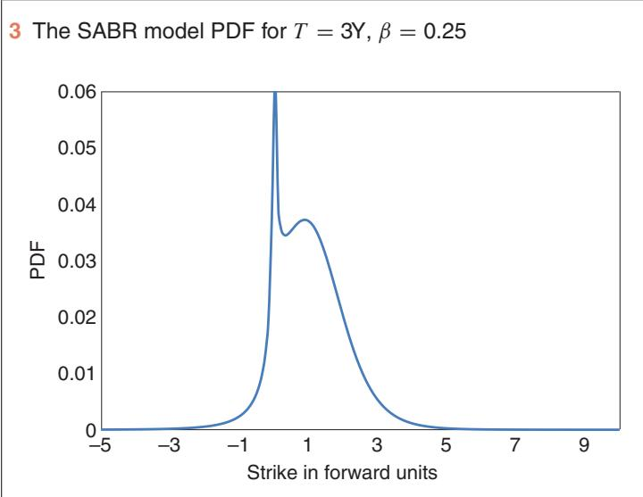
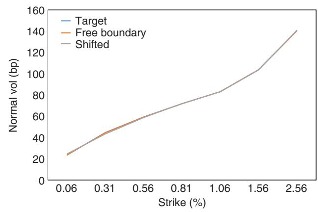
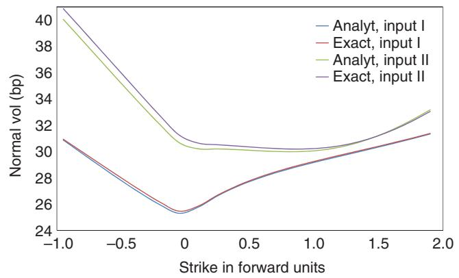

# 2015-antonov-et-al-free-boundary-sabr

<!-- page: 1 -->

Risk management • derivatives • regulation

Risk.net September 2015

Cutting edge Interest rates

## The free boundary SABR

Natural extension to negative rates

<!-- page: 2 -->

## The free boundary SABR: natural extension to negative rates

In the current low interest rate environment, extending option models to negative rates has become an important issue. Here, Alexandre Antonov, Michael Konikov and Michael Spector extend the widely used SABR model to the free boundary SABR model that can handle negative rates. They derive an exact option pricing formula for the zero correlation case, and a suitable approximation for the general case. The analytical results are successfully compared with the Monte Carlo simulations

T et al 2002) for a rate,differential equation , and its volaDE): $( F _ { 0 } , v _ { 0 } , \beta , \rho , \gamma ) ^ { 1 }$ (Hagan et al 2002) for a rate, $F _ { t }$ tility, $v _ { t }$ , has the stochastic differential equation (SDE):

$$
\mathrm { d } F _ { t } = F _ { t } ^ { \beta } v _ { t } \mathrm { d } W _ { 1 t }\tag{1}
$$

$$
\mathrm { d } v _ { t } = \gamma v _ { t } \mathrm { d } W _ { 2 t }\tag{2}
$$

with correlation $E [ \mathrm { d } W _ { 2 t } \mathrm { d } W _ { 1 t } ] = \rho$ dt and power $0 \leqslant \beta < 1$ . The solution is not uniquely defined by the SDE; we also need to impose a boundary condition. The standard choice is to assume the absorbing boundary at zero, which enforces positivity and martingality of the rate. See Andreasen & Huge (2013), Antonov, Konikov & Spector (2013), Balland & Tran (2013), Hagan et al (2014), Henry-Labordere (2008), Islah (2009) and Paulot (2009) for further references.

The SABR model is primarily used for volatility cube interpolation and for pricing constant maturity swaps products by replication with vanilla options. It is also used in term structure models (see, for example, Mercurio & Morini 2009; Rebonato, McKay & White 2009).

When the SABR model was introduced, positivity of the rates seemed a reasonable and attractive property. In the current market conditions, when rates are extremely low and even negative, it is important to extend the SABR model to negative rates. For example, figure 1 shows a historical evolution of Swiss franc (Sfr) interest rates (overnight (O/N) and Libors of tenors 1M, 3M and 6M). We can see that rates reach 2% in some cases. Another important observation is that the rates ‘stick’ to the zero level for certain periods of time, suggesting their probability density functions have a singularity at zero.

The simplest way to take into account negative rates is to shift the SABR process:

$$
\mathrm { d } F _ { t } = ( F _ { t } + s ) ^ { \beta } v _ { t } \mathrm { d } W _ { 1 t }
$$

where s is a deterministic positive shift. This moves the lower bound on $F _ { t }$ from 0 to s.

Unfortunately, this model has some important drawbacks. In general, people fix the shift prior to calibration,2 for example, to 2% in case of Sfr short rates. Selecting the shift value manually and calibrating only the standard parameters, $( v _ { 0 } , \beta , \rho , \gamma )$ might require readjustment of the shift parameter if rates went lower than anticipated. This can result in a jump in the other SABR parameters as the calibration response to such a readjustment. As a consequence, we can get jumps in the values/Greeks of the trades dependent on the swaption or cap

## Swiss franc interest rates

volatilities. To cover for potential losses in such situations, traders are likely to be asked to reserve part of their profit and loss. Also, having the swaption prices being bounded from above (due to the rate being bounded from below) can lead to situations when the shifted SABR cannot attain market prices. Moreover, the shifted SABR distribution has a delta mass at s (by its construction from the absorbing SABR). Such strong singularity means that upon reaching value of s the rate should stay there forever which definitely does not make any financial sense. In summary, we need a more natural and elegant solution that permits negative rates.

For $\beta = 0 ,$ the normal SABR model, $\mathrm { d } F _ { t } = v _ { t } \mathrm { d } W _ { 1 t }$ , allows the rates to become negative when a free boundary condition is enforced. Below, we come up with a generalisation of this model:

$$
\mathrm { d } F _ { t } = | F _ { t } | ^ { \beta } v _ { t } \mathrm { d } W _ { 1 t }
$$

with $\begin{array} { r } { 0 \leqslant \beta < \frac { 1 } { 2 } } \end{array}$ and a free boundary. As we will see, such a model allows for negative rates and contains a certain ‘stickiness’ at zero. Moreover, the process $F _ { t }$ is conserving and a (global) martingale.

In what follows, we consider only the $F _ { 0 } > 0$ case (unless explicitly stated otherwise). When $F _ { 0 } < 0$ , we note that $\tilde { F } _ { t } = - F _ { t }$ satisfies the SABR SDE with parameters $( - F _ { 0 } , v _ { 0 } , \beta , - \rho , \gamma )$ , and the time value of a European option (call or put) on $F _ { t }$ struck at K equals that of an option on $\tilde { F } _ { t }$ struck $\mathrm { a t } - K$ . We do not distinguish between call and put time values because for norm-conserving and martingale processes they coincide:

$$
\begin{array} { r } { \mathbb { E } [ ( F _ { T } - K ) ^ { + } ] - ( F _ { 0 } - K ) ^ { + } = \mathbb { E } [ ( K - F _ { T } ) ^ { + } ] - ( K - F _ { 0 } ) ^ { + } } \end{array}
$$

2 Note that calibrating the shift does not add a new degree of freedom (its influence on the skew is very similar to that of the power ˇ) and still requires fixing the upper shift bound for a numerical solver.

1 Sometimes ˛ is used instead of v0.

<!-- page: 3 -->

To gain intuition about the free boundary, we start with the constant elasticity of variance example, $\mathrm { d } F _ { t } = | F _ { t } | ^ { \beta } \mathrm { d } W _ { t }$ , and study the probability density function (PDF) and option prices. Then we switch to the SABR model with the free boundary condition and present an exact solution for the zero-correlation case. For the general case, we show an accurate approximation for European options prices. We demonstrate that the exact formula, as well as its approximation, can be presented in terms of a one-dimensional integral of elementary functions, making it attractive for a fast calibration.3 We finish with simulation schemes and numerical results.

## The CEV process

To aid intuition, we consider the CEV model $\mathrm { d } F _ { t } = F _ { t } ^ { \beta }$ dWt with $0 \leqslant \beta < 1$ . The forward Kolmogorov (FK) equation on the density $p ( t , f )$

$$
p _ { t } - { \textstyle \frac { 1 } { 2 } } ( f ^ { 2 \beta } p ) _ { f f } = 0
$$

has two types of solution, depending on the boundary conditions; fixing the PDE (or SDE) is not on its own sufficient to uniquely define the solution. Here, $( \cdot ) _ { f f }$ is the second derivative with respect to $f .$ One can show (see, for example, Antonov, Konikov & Spector 2015) there are two distinct solutions with asymptotics $p _ { \mathrm { A } } \sim f ^ { 1 - 2 \beta }$ and $p _ { \mathrm { R } } \sim f ^ { - 2 \beta }$ . We call the first solution ‘absorbing’ and the second one ‘reflecting’. The latter exists only for $\beta < \frac 1 2$ ; otherwise, the norm around zero diverges.

The asymptotics are closely related to conservation laws, which can be obtained by integrating the FK equation by parts with some payoffs $h ( f )$ . First consider the norm case of $h ( f ) = 1$ . It is easy to see that the asymptotics of the absorbing solution lead to non-conservation of the norm, while the reflecting solution conserves the norm. For the first moment conservation, we take $h ( f ) = f$ and deduce that the asymptotics of the reflecting solution lead to non-conservation of the first moment (ie, non-martingality), while the absorbing solution is a martingale.

The PDF of the CEV process is known explicitly (see Antonov, Konikov & Spector 2015; Jeanblanc, Yor & Chesney 2009) in terms of the modified Bessel functions, which permits calculation of a call option time value via the time integral without the boundary term:

$$
\mathcal { O } ( T , K ) = \mathbb { E } [ ( F _ { T } - K ) ^ { + } ] - ( F _ { 0 } - K ) ^ { + } = \frac { _ 1 } { 2 } K ^ { 2 \beta } \int _ { 0 } ^ { T } \mathrm { d } t \ p ( t , K )\tag{/}
$$

(3)

As explained in Antonov, Konikov & Spector (2015), this is not the case for put options, where a boundary term is present.

Below, we will need option prices for absorbing/reflecting solutions via a one-dimensional integral (seeAntonov, Konikov & Spector 2015;

2 The blue solid line represents the free PDF, the red dotted line depicts the absorbing density expression sign. $f ) p _ { \mathrm { A } } ( t , | f | )$ , while the green dashed line gives the symmetrised reflecting solution

Antonov et al 2014):

$$
\begin{array} { l } { \displaystyle \mathcal { O } _ { \mathrm { A / R } } ( T , K ) } \\ { \displaystyle = \frac { \sqrt { K F _ { 0 } } } { \pi } \bigg ( \int _ { 0 } ^ { \pi } \mathrm { d } \phi \frac { \sin ( | \nu | \phi ) \sin ( \phi ) } { b - \cos ( \phi ) } \exp \left( - \frac { \bar { q } ( b - \cos ( \phi ) ) } { T } \right) } \\ { \displaystyle \qquad + \sin ( | \nu | \pi ) \int _ { 0 } ^ { \infty } \mathrm { d } \psi \frac { \mathrm { e } ^ { \mp | \nu | \psi } \sinh ( \psi ) } { b + \cosh ( \psi ) } } \\ { \displaystyle \qquad \times \exp \left( - \frac { \bar { q } ( b + \cos h ( \psi ) ) } { T } \right) \bigg ) } \end{array}\tag{4}
$$

for index $\nu = - 1 / ( 2 ( 1 - \beta ) )$ and parameters:

$$
\bar { q } = q _ { 0 } q _ { K } , \quad b = \frac { q _ { 0 } ^ { 2 } + q _ { K } ^ { 2 } } { 2 q _ { 0 } q _ { K } } , \quad q _ { 0 } = \frac { F _ { 0 } ^ { 1 - \beta } } { 1 - \beta } \quad \mathrm { a n d } \quad q _ { K } = \frac { K ^ { 1 - \beta } } { 1 - \beta }
$$

Now consider an extension of the CEV model to the entire real line by modifying the SDE as follows:

$$
\mathrm { d } F _ { t } = | F _ { t } | ^ { \beta } \mathrm { d } W _ { t }\tag{5}
$$

for $\begin{array} { r } { 0 \leqslant \beta < \frac { 1 } { \gamma } } \end{array}$ . The corresponding FK equation is:

$$
\begin{array} { r } { \partial _ { t } p ( t , f ) = \frac { 1 } { 2 } ( | f | ^ { 2 \beta } p ( t , f ) ) _ { f f } } \end{array}\tag{6}
$$

A norm-conserving and martingale solution that satisfies the FK equation with the initial condition $p ( 0 , f ) = \delta ( f - F _ { 0 } )$ can be constructed from the reflecting and absorbing solutions as:

$$
\begin{array} { r } { p ( t , f ) = \frac { 1 } { 2 } ( p _ { \mathrm { R } } ( t , | f | ) + \mathrm { s i g n } ( f ) p _ { \mathrm { A } } ( t , | f | ) ) } \end{array}\tag{7}
$$

We can get the same expression for density with a purely probabilistic argument (see Antonov, Konikov & Spector 2015).

The solutions for typical parameters are shown in figure 2.

Taking a limit of $f \cdot f _ { 0 } 0$ in the Bessel functions underlying the absorbing and reflecting densities (Antonov, Konikov & Spector 2015), we obtain the leading behaviour of the free CEV density:

$$
\begin{array} { r l } & { p ( t , f , f _ { 0 } ) \underset { f \cdot \mathcal { F } _ { 0 }  0 } { = } | f | ^ { - 2 \beta } ( C _ { 1 } + C _ { 2 } | f f _ { 0 } | ^ { 2 ( 1 - \beta ) } ) } \\ & { \qquad + C _ { 3 } \mathrm { s i g n } ( f f _ { 0 } ) | f _ { 0 } | ^ { 1 / 2 } | f | ^ { 1 - 2 \beta } } \end{array}
$$

3 Note that the SABR approximation (Hagan et al 2002) based on the heat kernel expansion cannot be applied to the free SABR because it does not take into account the boundary conditions.

<!-- page: 4 -->

We observe that for small $f _ { 0 }$ the density becomes symmetric as a function of f (the anti-symmetric absorbing part is attenuated due to small $f _ { 0 } )$ , which leads to zero skew of the normal implied volatility.

Note also that at zero the PDF diverges as $p ( t , f ) \sim | f | ^ { - 2 \beta }$ (the asymptotics are inherited from the reflecting solution). The observed singularity is quite natural; one can observe ‘sticky’ behaviour of the rates near zero (see figure 1 for the Swiss franc rate).

A call option payoff $h ( f ) = ( f - K ) ^ { + }$ leads to an option time value of:

$$
\begin{array} { r l r } {  { \mathcal { O } _ { F } ^ { \mathrm { C E V } } ( T , K ) = \frac { 1 } { 2 } | K | ^ { 2 \beta } \int _ { 0 } ^ { T } \mathrm { d } t \ p ( t , K ) } } \\ & { } & { = \frac { 1 } { 2 } | K | ^ { 2 \beta } \int _ { 0 } ^ { T } \mathrm { d } t \ \frac { 1 } { 2 } ( p _ { \mathrm { R } } ( t , | K | ) + \mathrm { s i g n } ( K ) p _ { \mathrm { A } } ( t , | K | ) ) } \\ & { } & { = \frac { 1 } { 2 } ( { \mathcal { O } _ { \mathrm { R } } } ( T , | K | ) + \mathrm { s i g n } ( K ) { \mathcal { O } _ { \mathrm { A } } } ( T , | K | ) ) \phantom { x x x x x x x x x x x x x x x x x x x x x x x x x x x x x x x x x x x x x x x x x } } \end{array}
$$

Finally, we present the free CEV option integral. Its time value can be easily derived from the absorbing-reflecting solutions (4) and (8), yielding:

$$
\begin{array} { l } { \displaystyle { \mathcal { O } _ { F } ^ { \mathrm { C E V } } ( \tau , K ) } } \\ { \displaystyle { = \frac { \sqrt { | K F _ { 0 } | } } { \pi } \bigg ( \mathbf { 1 } _ { K \gtrsim 0 } \int _ { 0 } ^ { \pi } \mathrm { d } \phi \frac { \sin ( | \nu | \phi ) \sin \phi } { b - \cos \phi } \exp { \left( - \frac { \bar { q } ( b - \cos \phi ) } { \tau } \right) } } } \\ { \displaystyle { + \sin ( | \nu | \pi ) \int _ { 0 } ^ { \infty } \mathrm { d } \psi \frac { ( \mathbf { 1 } _ { K \geq 0 } \cosh ( | \nu | \psi ) + \mathbf { 1 } _ { K < 0 } \sinh ( | \nu | \psi ) ) \sinh \psi } { b + \cosh \psi } } } \\ { \displaystyle { \qquad \times \exp { \left( - \frac { \bar { q } ( b + \cosh \psi ) } { \tau } \right) } \bigg ) } \quad \mathrm { ( 9 ) } } \end{array}
$$

where $\nu = - 1 / ( 2 ( 1 - \beta ) )$ / and:

$$
\bar { q } = \frac { | F _ { 0 } K | ^ { 1 - \beta } } { ( 1 - \beta ) ^ { 2 } }
$$

with:

$$
b = \frac { | F _ { 0 } | ^ { 2 ( 1 - \beta ) } + | K | ^ { 2 ( 1 - \beta ) } } { 2 | F _ { 0 } K | ^ { 1 - \beta } }
$$

We will use this formula to derive analytics for the SABR model in the section below. Note that we put the absolute value for $F _ { 0 }$ for symmetry with respect to the strike: $F _ { 0 }$ is considered to be positive, according to the remark in the introduction.

Regarding a sensitive region of small strikes and/or small rates, we notice the call option price (the full one, including the intrinsic value) is a smooth function of $K$ and $F _ { 0 }$ at zero. The thorough analysis reveals the main terms of expansion near zero are linear ones, followed by terms of the order of $| K | ^ { 2 ( 1 - \beta ) }$ for small strikes and of $\vert F _ { 0 } \vert ^ { 2 ( 1 - \beta ) }$ for small spots.

## SABR

Now, let us come back to the SABR process (1)–(2). The standard choice of the absorbing boundary will be generalised to the free boundary. Namely, we will consider the SDE:

$$
\mathrm { d } F _ { t } = | F _ { t } | ^ { \beta } v _ { t } \mathrm { d } W _ { 1 t }
$$

for $0 \leqslant \beta < \frac { 1 } { 2 }$ (with the same process (2) for the stochastic volatility $v _ { t } )$ . Such a construction permits negative rates and ‘stickiness’ at zero.

Looking forward, we plot the SABR density function, which is shown in figure 3 for the Input I parameters from table D. We also observe the singularity, which reflects ‘sticky’ behaviour of the rates at zero (see figure 1).

� Zero-correlation case. The zero-correlation free SABR model can be solved exactly. Indeed, the option price can be computed as:

$$
\mathcal { O } _ { F } ^ { \mathrm { S A B R } } ( T , K ) = E [ \mathcal { O } _ { F } ^ { \mathrm { C E V } } ( \tau _ { T } , K ) ]\tag{10}
$$

where $\mathcal { O } _ { F } ^ { \mathrm { C E V } } ( \tau , K )$ is the free boundary CEV option price (9) and the stochastic time $\begin{array} { r } { \tau _ { T } ~ = ~ \int _ { 0 } ^ { T } v _ { t } ^ { 2 } } \end{array}$ dt is the cumulative variance for the geometric Brownian motion $v _ { t } \ ( 2 )$ . The dependence on � in both integrand terms of (9) is of the form $\exp ( - \lambda / \tau )$ . Thus, averaging over stochastic time, $E [ \mathcal { O } _ { F } ^ { \mathrm { C E V } } ( \tau _ { T } , K ) ]$ , requires calculating the mean value $E [ \exp ( - \lambda / \tau _ { T } ) ]$

The moment-generating function of the inverse stochastic time was derived in Antonov et al (2014):

$$
E \Bigg [ \exp \Bigg ( - \frac { \lambda } { \tau _ { T } } \Bigg ) \Bigg ] = \frac { G ( T \gamma ^ { 2 } , s ) } { \cosh s }
$$

where:

$$
s = \sinh ^ { - 1 } \left( \frac { \sqrt { 2 \lambda } \gamma } { v _ { 0 } } \right)
$$

The function G.t; s/:

$$
G ( t , s ) = 2 { \frac { \mathrm { e } ^ { - t / 8 } } { t { \sqrt { \pi t } } } } \int _ { s } ^ { \infty } \mathrm { d } u u \mathrm { e } ^ { - u ^ { 2 } / 2 t } { \sqrt { \cosh u - \cosh s } }
$$

was introduced in Antonov, Konikov & Spector (2013); it is closely related to the McKean heat kernel on the hyperbolic plane $H ^ { 2 }$ . It is important to notice that although the function $G ( t , s )$ is a onedimensional integral, it can be very efficiently approximated by a closed formula (see Antonov, Konikov & Spector 2013).

Thus, the exact option price for the zero-correlation case can be presented as:

$$
\mathcal { O } _ { F } ^ { \mathrm { S A B R } } ( T , K ) = \frac { 1 } { \pi } \sqrt { | K F _ { 0 } | } \{ { \bf 1 } _ { K \geqslant 0 } A _ { 1 } + \sin ( | \nu | \pi ) A _ { 2 } \}
$$

<!-- page: 5 -->

with integrals:

$$
\begin{array} { l } { { A _ { 1 } = \displaystyle \int _ { 0 } ^ { \pi } \mathrm { d } \phi { \frac { \sin \phi \sin ( | \nu | \phi ) } { b - \cos \phi } } { \frac { G ( T \gamma ^ { 2 } , s ( \phi ) ) } { \cosh s ( \phi ) } } } \ ~ } \\ { { A _ { 2 } = \displaystyle \int _ { 0 } ^ { \infty } \mathrm { d } \psi { \frac { \sinh \psi ( { \bf 1 } _ { K \geqslant 0 } \cosh ( | \nu | \psi ) + { \bf 1 } _ { K < 0 } \sinh ( | \nu | \psi ) ) } { b + \cosh \psi } } { \frac { G ( T \gamma ^ { 2 } , s ( \psi ) ) } { \cosh s ( \psi ) } } } \ ~ } \\ { { \times { \frac { G ( T \gamma ^ { 2 } , s ( \psi ) ) } { \cosh s ( \psi ) } } } } \end{array}\tag{11}
$$

(12)

Here, s has the following parametrisation with respect to $\phi$ and $\psi :$

$$
\begin{array} { r l } & { \sinh s ( \phi ) = \gamma v _ { 0 } ^ { - 1 } \sqrt { 2 \bar { q } ( b - \cos \phi ) } } \\ & { \sinh s ( \psi ) = \gamma v _ { 0 } ^ { - 1 } \sqrt { 2 \bar { q } ( b + \cosh \psi ) } } \end{array}
$$

where q and b are the same as in the CEV free boundary option.

General correlation case. As in Antonov, Konikov & Spector (2013), we approximate the general correlation option price by using the zero-correlation one, $\mathrm { d } \tilde { F } _ { t } = | \tilde { F } | _ { t } ^ { \beta } \tilde { v } _ { t } \mathrm { d } \tilde { W } _ { 1 t }$ and $\mathrm { d } \tilde { v } _ { t } = \tilde { \gamma } \tilde { v } _ { t } \mathrm { d } \tilde { W } _ { 2 t } .$ with $\mathbb { E } [ \mathrm { d } \tilde { W } _ { 1 t } \mathrm { d } \tilde { W } _ { 2 t } ] = 0$ , ie:

$$
E [ ( F _ { t } - K ) ^ { + } ] \simeq E [ ( \tilde { F } _ { t } - K ) ^ { + } ]
$$

For the free boundary, we reuse the same effective coefficients of the zero-correlation SABR as in Antonov, Konikov & Spector (2013) for the absorbing boundary. The power and volatility-of-volatility are strike independent:

$$
\begin{array} { r } { \tilde { \beta } = \beta \quad \mathrm { a n d } \quad \tilde { \gamma } ^ { 2 } = \gamma ^ { 2 } - \frac { 3 } { 2 } \{ \gamma ^ { 2 } \rho ^ { 2 } + v _ { 0 } \gamma \rho ( 1 - \beta ) F _ { 0 } ^ { \beta - 1 } \} } \end{array}
$$

while the initial stochastic volatility is more complicated and strike dependent. Its $\tilde { v } _ { 0 }$ can be calculated as an expansion:

$$
\tilde { v } _ { 0 } = \tilde { v } _ { 0 } ^ { ( 0 ) } + T \tilde { v } _ { 0 } ^ { ( 1 ) } + \cdots\tag{13}
$$

The leading volatility term can be expressed as:

$$
\tilde { v } _ { 0 } ^ { ( 0 ) } = \frac { 2 \varPhi \delta \tilde { q } \tilde { \gamma } } { \varPhi ^ { 2 } - 1 } \quad \mathrm { f o r } \varPhi = \left( \frac { v _ { \mathrm { m i n } } + \rho v _ { 0 } + \gamma \delta q } { ( 1 + \rho ) v _ { 0 } } \right) ^ { \tilde { \gamma } / \gamma }\tag{14}
$$

where:

$$
\begin{array} { c } { { v _ { \mathrm { m i n } } ^ { 2 } = \gamma ^ { 2 } \delta q ^ { 2 } + 2 \gamma \rho \delta q v _ { 0 } + v _ { 0 } ^ { 2 } } } \\ { { \displaystyle \quad \delta q = \frac { k ^ { 1 - \beta } - F _ { 0 } ^ { 1 - \beta } } { 1 - \beta } } } \\ { { \displaystyle \quad \delta \tilde { q } = \frac { k ^ { 1 - \tilde { \beta } } - F _ { 0 } ^ { 1 - \tilde { \beta } } } { 1 - \tilde { \beta } } } } \end{array}
$$

The effective strike k is a floored initial strike; all of the effective parameters in the heat kernel expansion work only for positive strikes. In our experiments we used $k = \operatorname* { m a x } ( K , 0 . 1 F _ { 0 } ) . ^ { 4 }$ The initial value of the rate $F _ { 0 }$ is considered to be positive (see the remark in the introduction about negative $F _ { 0 } )$

4 To avoid potential problems related to non-smooth behaviour around $F _ { 0 } ~ = ~ 1 0 K .$ , we suggest max. $( K , 0 . 1 F ) ~ \approx ~ 0 . 1 F + { \textstyle { \frac { 1 } { 2 } } } ( K - 0 . 1 F +$ $\sqrt { ( K - 0 . 1 F ) ^ { 2 } + \epsilon ^ { 2 } } )$ , where � is a small parameter of around 1bp.

The first-order correction is more complicated (see also Henry-Labordere (2008) and Paulot (2009)), and is given by:

$$
\frac { \tilde { v } _ { 0 } ^ { ( 1 ) } } { \tilde { v } _ { 0 } ^ { ( 0 ) } } = \tilde { \gamma } ^ { 2 } \sqrt { 1 + \tilde { R } ^ { 2 } } \frac { \frac { 1 } { 2 } \ln ( v _ { 0 } v _ { \mathrm { m i n } } / \tilde { v } _ { 0 } ^ { ( 0 ) } \tilde { v } _ { \mathrm { m i n } } ) - \mathcal { B } _ { \mathrm { m i n } } } { \tilde { R } \ln ( \sqrt { 1 + \tilde { R } ^ { 2 } } + \tilde { R } ) } \quad \mathrm { f o r ~ } \tilde { R } = \frac { \delta q \tilde { \gamma } } { \tilde { v } _ { 0 } ^ { ( 0 ) } }
$$

where:

$$
\tilde { v } _ { \mathrm { m i n } } = \sqrt { \tilde { \gamma } ^ { 2 } \delta q ^ { 2 } + ( \tilde { v } _ { 0 } ^ { ( 0 ) } ) ^ { 2 } }
$$

and ${ \mathcal { B } } _ { \operatorname* { m i n } }$ is the so-called parallel transport, defined as:

$$
\begin{array} { c } { { \displaystyle \mathcal { B } _ { \mathrm { m i n } } = - \frac { 1 } { 2 } \frac { \beta } { 1 - \beta } \frac { \rho } { \sqrt { 1 - \rho ^ { 2 } } } } } \\ { { \displaystyle \qquad \times \left( \pi - \operatorname { a r c c o s } \left( - \frac { \delta q \gamma + v _ { 0 } \rho } { v _ { \mathrm { m i n } } } \right) - \operatorname { a r c c o s } \rho - I \right) } } \end{array}
$$

and:

$$
I = \left\{ \begin{array} { l l } { { \displaystyle \frac { 2 } { \sqrt { 1 - L ^ { 2 } } } \left( \arctan \frac { u _ { 0 } + L } { \sqrt { 1 - L ^ { 2 } } } - \arctan \frac { L } { \sqrt { 1 - L ^ { 2 } } } \right) } } & { { \mathrm { f o r } L < 1 } } \\ { { \displaystyle \frac { 1 } { \sqrt { L ^ { 2 } - 1 } } \ln \frac { u _ { 0 } ( L + \sqrt { L ^ { 2 } - 1 } ) + 1 } { u _ { 0 } ( L - \sqrt { L ^ { 2 } - 1 } ) + 1 } } } & { { \mathrm { f o r } L > 1 } } \end{array} \right.\tag{15}
$$

where:

$$
L = \frac { v _ { \mathrm { m i n } } ( 1 - \beta ) } { k ^ { 1 - \beta } \gamma \sqrt { 1 - \rho ^ { 2 } } } \quad \mathrm { a n d } \quad u _ { 0 } = \frac { \delta q \gamma \rho + v _ { 0 } - v _ { \mathrm { m i n } } } { \delta q \gamma \sqrt { 1 - \rho ^ { 2 } } }
$$

Being a real process, the free SABR model is naturally arbitragefree. On the other hand, its approximation described above, strictly speaking, is not (except in the case of the zero correlation when it becomes exact). However, given high approximation accuracy, we can call the resulting analytical formula quasi-arbitrage-free.

Limiting cases and asymptotics. Below, we briefly address the behaviour of the free SABR call option ${ \mathcal { C } } _ { F } ^ { \mathrm { S A B R } } ( T , K )$ for sensitive limiting cases.

Like the CEV model, the free SABR call price is a smooth function of the strike and the forward. That is, one can show that:

$$
\begin{array} { r l } & { \mathfrak { C } _ { F } ^ { \mathrm { { S A B R } } } \underset { K \to 0 } { = } { C } _ { 1 } + C _ { 2 } K + C _ { 3 } | K | ^ { 2 ( 1 - \beta ) } + \cdots } \\ & { \mathfrak { C } _ { F } ^ { \mathrm { { S A B R } } } \underset { F _ { 0 } \to 0 } { = } { C } _ { 1 } ^ { \prime } + C _ { 2 } ^ { \prime } F _ { 0 } + C _ { 3 } ^ { \prime } | F _ { 0 } | ^ { 2 ( 1 - \beta ) } + \cdots } \end{array}
$$

where constants $C _ { i }$ and $C _ { i } ^ { \prime }$ depend on the model parameters. This means the call option ‘delta’ is a smooth function of $F _ { 0 }$ with the following behaviour around zero:

$$
\partial { \mathcal C } _ { F } ^ { \mathrm { S A B R } } / \partial F _ { 0 } \underset { F _ { 0 } \to 0 } { = } C _ { 2 } ^ { \prime } + C _ { 3 } ^ { \prime } 2 ( 1 - \beta ) \mathrm { s i g n } ( F _ { 0 } ) | F _ { 0 } | ^ { 1 - 2 \beta } + \cdots
$$

The option ‘gamma’ is smooth everywhere except zero. This weak (integrable) divergence around zero, $\partial ^ { 2 } \mathcal { C } _ { F } ^ { \mathrm { S A B R } } / \partial F _ { 0 } ^ { 2 } \ \sim \ | F _ { 0 } | ^ { - 2 \beta }$ reflects the rate ‘stickiness’. On the other hand, a standard way of calculating Greeks based on finite differences with a spacing of 1–5bp produces a moderately finite ‘gamma’ spike at zero.

We have mentioned that the CEV model for the zero spot case has a symmetric density function and, as a consequence, it has zero implied volatility skew at zero strike. However, for the SABR model itself, the asymmetry is introduced by the correlation with the stochastic

<!-- page: 6 -->

[Table source crop](assets/tables/2015-antonov-et-al-free-boundary-sabr-p0006-block-0001-ed870c96f7e92f1d.jpg)

## 4 Target and calibrated normal implied volatilities

[Table source crop](assets/tables/2015-antonov-et-al-free-boundary-sabr-p0006-block-0004-cf97b8923f3535b6.jpg)

volatility. This means that for small or zero spots, the model can control the normal implied volatility skew around zero strikes by means of the correlation.

The case $\beta = 0$ is clearly regular. In the more interesting case of $\beta > \frac { 1 } { 2 }$ , the reflecting and absorbing solutions merge, and only the latter exists at $\beta > ^ { \bar { \frac { 1 } { 2 } } }$ . Thus, by construction (7), the free solution coincides with the absorbing one for $\begin{array} { r } { \beta \geqslant \frac { 1 } { 2 } } \end{array}$

## Numerical experiments

� Calibration to real data. We start with a real data example of a 1Y15Y Swiss franc swaption from February 10, 2015, with a forward of $F _ { 0 } = 0 . 5 6 \%$ . The swaption prices are quoted in terms of normal implied volatility (bp). We calibrate the free boundary and the shifted SABR with respect to this data using our analytical approximations. The output is presented in table A and figure 4: the calibration errors are tiny for both models.

Calibrated $\alpha = v _ { 0 } , \rho , \gamma$ and $\beta$ are given in table B (the value of the shift is 2%).

Note the extremely high values of the correlation � and the fairly high values of volatility-of-volatility �. The reason for such a high correlation is a very steep skew, currently prevailing in the Swiss franc market.

[Table source crop](assets/tables/2015-antonov-et-al-free-boundary-sabr-p0006-block-0011-8445a74bbc3febac.jpg)

[Table source crop](assets/tables/2015-antonov-et-al-free-boundary-sabr-p0006-block-0012-20da78e1e7578a28.jpg)

Now we will study the accuracy of the analytical approximation for the free SABR model. First, let us briefly address the Monte Carlo simulation scheme (see Antonov, Konikov & Spector (2015) for more details). Suppose we have simulated the stochastic volatility for all time steps and paths $v _ { t }$ (this is trivial for the lognormal process). Our goal is to simulate $F _ { t + \Delta t }$ given this information.

The first thing to try is an Euler scheme without any boundary conditions $F _ { t + \Delta t } = F _ { t } + | F _ { t } | ^ { \beta } v _ { t } \Delta W _ { 1 t }$ . One can check that the Euler scheme has an extremely slow convergence in both paths and time steps. Thus, we should come up with a more careful scheme based on numerical inversion of the CDF. Such an expression can be found in Antonov, Konikov & Spector (2015). However, such a procedure is very slow and we use a regime-switching scheme similar to that in Andersen (2008) in order to accelerate the simulations. For out-ofboundary values, use the moment matching to approximate $F _ { t + \Delta t }$ via the quadratic Gaussian step, and for near-boundary values numerically invert the CDF.

In table C we compare the Monte Carlo simulations (‘Exact’) described above and our analytical formula based on the map to the zero-correlation SABR model (‘Analyt’) for the calibrated parameters (see table B). We observe excellent agreement between the simulations and our formula.

Note that both models can also successfully fit the same smile with zero forward value; ie, having 23.5bp normal volatility for 50bp of strike, 44.7bp of volatility for 25bp of strike, 59.3bp of volatility for 0 at-the-money (ATM) strike (forward), etc.

� Approximation accuracy analysis. We provide approximation accuracy analysis for two more inputs (somehow more ‘classical’; eg, with a negative correlation).

The implied volatility results are presented in table E and plotted in figure 5.

We observe an excellent approximation quality for 3Y, as well as for strikes $\begin{array} { r } { K > \frac { 1 } { 2 } F _ { 0 } } \end{array}$ for 10Y. There is a slight degeneration for other strikes for 10Y. We can see that the normal implied volatility possesses significant smiles with the bottom between zero and the ATM strike. In general, increasing the volatility-of-volatility and the maturity moves the vertex of the smile to the ATM strike.

<!-- page: 7 -->

[Table source crop](assets/tables/2015-antonov-et-al-free-boundary-sabr-p0007-block-0001-280a3b2c79a8fa98.jpg)

## Conclusion

We have presented a natural generalisation of the SABR model to negative rates – which is very important in our current low interest rate environment – and we have described its properties. We derived an exact formula for the option price in the zero-correlation case and an efficient approximation for general correlation written in terms of a one-dimensional integral of elementary functions. The simplicity of

5 Monte Carlo (‘Exact’) and analytical (‘Analyt’) normal implied volatilities

the approximation permits straightforward implementation. Moreover, the main formulae from our ‘absorbing’ (standard) SABR approximation can be directly reused. Finally, we have numerically checked the approximation accuracy for option pricing. R

Alexandre Antonov is a senior vice-president in the quantitative research team at Numerix in Paris. Michael Konikov is an executive director and head of quantitative development, and Michael Spector is a director of the quantitative research team at Numerix in New York. The authors are indebted to Serguei Mechkov for his discussions and help with numerical implementation, as well as to their colleagues at Numerix, especially GregoryWhitten and Serguei Issakov for supporting this work, and Nic Trainor for excellent editing.

Email: antonov@numerix.com,

mkonikov@numerix.com, mspector@numerix.com.

## REFERENCES

Andreasen J and B Huge, 2013 Expanded forward volatility Risk January, pages 101–107

Andersen L, 2008 Simple and efficient simulation of the Heston stochastic volatility model Journal of Computational Finance 11(3), pages 1–42

Antonov A, M Konikov and M Spector, 2013 SABR spreads its wings Risk August, pages 58–63

Antonov A, M Konikov and M Spector, 2015 The free boundary SABR: natural extension to negative rates SSRN paper Antonov A, M Konikov, D Rufino and M Spector, 2014 Exact solution to CEVmodel with uncorrelated stochastic volatility SSRN paper

Balland P and Q Tran, 2013 SABR goes normal Risk May, pages 76–81

Jeanblanc M, M Yor and M Chesney, 2009 Mathematical Methods for Financial Markets Springer

Hagan P, D Kumar, A Lesniewski and D Woodward, 2002 Managing smile risk Wilmott Magazine September, pages 84–108

Hagan P, D Kumar, A Lesniewski and D Woodward, 2014 Arbitrage free SABR Wilmott Magazine January, pages 60–75

Henry-Labordere P, 2008 Analysis, Geometry, and Modeling in Finance: Advanced Methods in Option Pricing Chapman & Hall

Islah O, 2009 Solving SABR in exact form and unifying it with Libor market model SSRN paper

Mercurio F and M Morini, 2009 Joining the SABR and Libor models together Risk March, pages 80–85

Paulot L, 2009 Asymptotic implied volatility at the second order with application to the SABR model SSRN paper Rebonato R, K McKay and R White, 2009 The SABR/Libor Market Model: Pricing, Calibration and Hedging for Complex Interest-Rate Derivatives Wiley
