<!-- page: 1 -->

# Pricing under rough volatility 

Christian Bayer WIAS Berlin bayer@math.tu-berlin.de 

Peter Friz TU Berlin and WIAS Berlin friz@math.tu-berlin.de 

Jim Gatheral 

Baruch College, City University of New York jim.gatheral@baruch.cuny.edu 

January 23, 2015 

##### **Abstract** 

From an analysis of the time series of volatility using recent high frequency data, Gatheral, Jaisson and Rosenbaum [12] previously showed that log-volatility behaves essentially as a fractional Brownian motion with Hurst exponent _H_ of order 0 _._ 1, at any reasonable time scale. The resulting Rough Fractional Stochastic Volatility (RFSV) model is remarkably consistent with financial time series data. We now show how the RFSV model can be used to price claims on both the underlying and integrated volatility. We analyze in detail a simple case of this model, the rBergomi model. In particular, we find that the rBergomi model fits the SPX volatility markedly better than conventional Markovian stochastic volatility models, and with fewer parameters. Finally, we show that actual SPX variance swap curves seem to be consistent with model forecasts, with particular dramatic examples from the weekend of the collapse of Lehman Brothers and the Flash Crash.

<!-- page: 2 -->

## **1 Introduction** 

From an analysis of the time series of volatility using recent high frequency data, Gatheral, Jaisson and Rosenbaum [12] showed that log-volatility behaves essentially as a fractional Brownian motion with Hurst exponent _H_ of order 0 _._ 1, at any reasonable time scale. The following stationary Rough Fractional Stochastic Volatility (RFSV) model was proposed: 

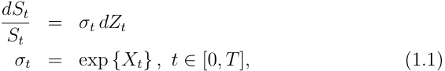

where _Xt_ is a fractional Ornstein-Uhlenbeck process (fOU process for short) satisfying 

_dXt_ = _ν dWt__H−α_(_Xt−m_)_dt,_ 

where _m ∈_ R and _ν_ and _α_ are positive parameters, see [5]. Recall that sample paths of fractional Brownian motion _W__H_ are ( _H − ε_ )-H¨older (and hence “rougher” than Brownian motion whenever _H <_ 1 _/_ 2. The reversion time scale is understood to be very long so that _α T ≪_ 1 for any reasonable time scale _T_ of practical interest, in which case, the log-volatility behaves locally (at time scales smaller than _T_ ) as a fractional Brownian motion (fBm). The RSFV model is remarkably consistent with financial time series data. Moreover, the RFSV model has a quantitative market microstructure-based foundation based on the modeling of order flow using Hawkes processes. 

On the other hand, from the perspective of options pricing, it is wellknown that conventional low-dimensional Markovian stochastic volatility models such as the Hull and White, Heston, and SABR models generate implied volatility surfaces whose shapes differ substantially from that of the empirically observed volatility surface. A typical such volatility surface generated from a “stochastic volatility inspired” (SVI) [11] fit to closing SPX option prices as of August 14, 20131 is shown in Figure 1.1. It is a stylized fact that, at least in equity markets, although the level and orientation of the volatility surface do change over time, the general overall shape of the volatility surface does not change, at least to a first approximation. This suggests that it is desirable to model volatility as a time-homogenous process, _i.e._ a process whose parameters are independent of price and time. 

1Closing prices of SPX options for all available strikes and expirations were sourced from OptionMetrics ( `www.optionmetrics.com` ) via Wharton Research Data Services (WRDS).

<!-- page: 3 -->

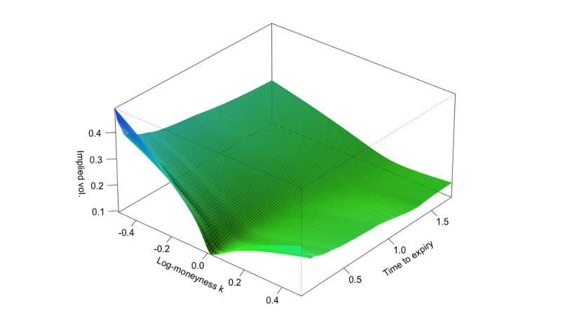

<!-- Start of picture text -->
0.4 2 03 2 Qa § 02 0.1 1.5 -0.4 -0.2 RS) “09. 0.0 1.0e°of Ong, ase Mes, 4 02 0.5 0.4 <!-- End of picture text -->

<!-- page: 4 -->

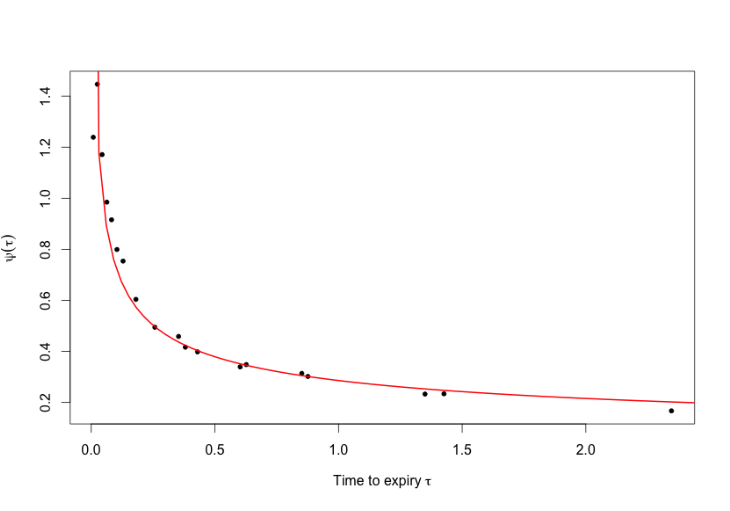

<!-- Start of picture text -->
+t N ° SF @ = so o oO + oO N o 0.0 0.5 1.0 1.5 2.0 Time to expiry t <!-- End of picture text -->

<!-- page: 5 -->

expiration _T_ , and 

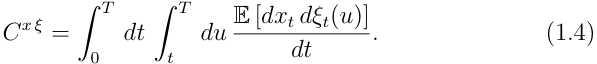

where _xt_ = log _St/S_ 0. Thus, given a stochastic model written in the forward variance curve form (1.2), we can easily (at least in principle) compute the term structure of ATM skew _ψ_ ( _τ_ ) to first order in _λ_ . 

One well-known example of a stochastic volatility model expressed in forward variance curve form is the Bergomi model [2]. The _n_ -factor Bergomi variance curve model may be written in the form 

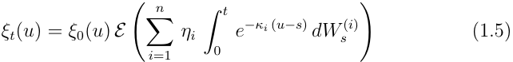

where _E_ ( _·_ ) denotes the stochastic exponential2 . _ξt_ ( _u_ ) is thus a martingale in _t_ , consistent with the fact that forward variances are tradable. As was pointed out by Bergomi, the entire forward variance curve _ξt_ ( _·_ ) = _{ξt_ ( _u_ ) : _u > t}_ is determined by _n_ -factors, each of OU-type. Indeed, in the case _n_ = 1 (for notational simplicity only) one has 

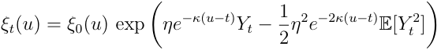

in terms of a scalar OU process, 

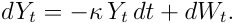

To achieve a decent fit to the observed volatility surface, and to control the forward smile, we need at least two factors. In the two-factor case, there are 7 parameters: _η_ 1 _, η_ 2 _, κ_ 1 _, κ_ 2, and the (constant) correlations _ρZ,W_ (1) _, ρZ,W_ (2) _, ρW_ (1) _,W_ (2), in addition to the initial forward variance curve _ξ_ 0( _u_ ). When calibrating the two-factor Bergomi model to option prices, we find that it is already over-parameterized. Any combination of the parameters _ηi_ , _κi_ , and the various correlation parameters that gives a roughly 1 _/√T_ 

> 2 For a continuous (semi)martingale _Z_ , the stochastic exponential is classically defined as _E_ ( _Z_ ) _t_ = exp( _Zt − Z_ 0 _−_<u>1</u> 2[_Z, Z_]0_,t_).If_Z_isalocalmartingale,thensois_E_(_Z_).Onthe other hand, for a zero-mean Gaussian random variable Ψ, one defines the “Wick” exponential as _E_ (Ψ) = exp(Ψ _−_<u>1</u> 2E[_|_Ψ_|_2]).WhenΨistheincrementofaGaussianmartingale _t_ - such as �0_f_(_s_)_dWs_withdeterministicintegrand-thetwonotionscoincide.

<!-- page: 6 -->

term structure of ATM skew fits well enough. Moreover, the calibrated correlations between the Brownian increments _dWs_(_i_) tend to be high. The Bergomi model generates a term structure of volatility skew _ψ_ ( _τ_ ) that has the qualitative form 

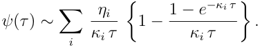

Indeed, it can be seen from the Bergomi-Guyon expansion that this functional form is related to the term structure of the autocorrelation functional _C__xξ_ , as defined in (1.4), which is in turn driven by the exponential kernels in the exponent in (1.5). To generate the empirically observed _ψ_ ( _τ_ ) _∼ τ__−α_ for some _α_ , it would be tempting to replace the exponential kernels in (1.5) with a power-law kernel. This would give a model of the form 

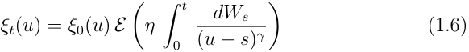

with _ξt_ ( _u_ ) again a martingale in _t_ . Assuming constant _ξ_ 0( _u_ ) _≡ σ_ 02,and with the Wick interpretation of the stochastic exponential, we would have instantaneous stochastic volatility 

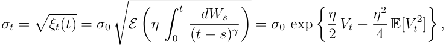

where _Vt_ = �0 _t_ ( _tdW−ss_ )_γ_is known as “Volterra” fractional Brownian motion with Hurst parameter _H_ = 1 _/_ 2 _−γ_ and has, similar to classical fractional Brownian motion, ( _H − ε_ )-H¨older sample paths. We note a striking resemblance to the RFSV model (1.1). Moreover, by applying his Martingale expansion to a special case of a model originally proposed by Al´os [1], Fukasawa [9] shows formally that the volatility skew generated by such models has the form 

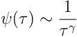

for small _τ_ . 

In this paper, we show that the RFSV model does indeed lead naturally to a non-Markovian generalization of the Bergomi model, which we call the Rough Bergomi (rBergomi) model. This model fits the observed volatility surface markedly better than conventional Markovian stochastic volatility models, and with fewer parameters.

<!-- page: 7 -->

### **1.1 Main results and organization of the paper** 

Our paper is organized as follows. In Section 2, we show how the RFSV model leads naturally to an options pricing model. In Section 3, we analyze a special case of this model, the rBergomi model, where the change of measure from P to Q is deterministic. In Section 4, we show how to simulate the rBergomi model, and in Section 5 we show that volatility surfaces generated using the rBergomi model simulation are remarkably consistent with observed ones (at least on the two specific days presented). In Section 6, we examine consistency between the rBergomi model and the VIX options market, finding that in general, the rBergomi model is not consistent with the VIX options market. In Section 7, we compute coefficients of the BergomiGuyon expansion of the rBergomi model up to second order in volatility of volatility; sadly, we find that this asymptotic expansion does not converge with parameters of practical interest. In Section 8, we show that the evolution of market variance swap curves is consistent with forecasts obtained from the historical realized variance time series; we examine the cases of the collapse of Lehman Brothers and the Flash Crash in detail. Finally, in Section 9, we summarize and conclude. Some more detailed computations are relegated to the appendix. 

## **2 Pricing under rough volatility** 

In [12], using RV estimates as proxies for daily spot volatilities, two startlingly simple regularities were uncovered. Firstly, consistent with many prior studies, distributions of increments of log volatility were found to be close to Gaussian. Second and more interestingly, for reasonable timescales of practical interest, the time series of volatility was found to be consistent with the simple model 

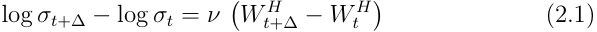

where _W__H_ is fractional Brownian motion, which is simply the RFSV model (1.1) with _α_ = 0. This relationship was found to hold for all 21 equity indices in the Oxford-Man database, Bund futures, Crude Oil futures, and Gold futures. Perhaps this feature of the time series of volatility is universal? Consider the Mandelbrot-Van Ness representation of fractional Brownian

<!-- page: 8 -->

<!-- Start of picture text -->
ii  — J j/———_ fo ] 4 ii — | —} Uw F b O S a ( <!-- End of picture text -->

<!-- page: 9 -->

This computation reveals that the conditional distribution of _vu_ depends on _Ft_ only through the variance forecasts EP [ _vu| Ft_ ] _, u > t_5 . In particular, to price options, one does not need to know _Ft_ , the entire history of the Brownian motion _Ws_Pfor_s < t_. 

### **2.1 Pricing under** Q 

We have a model (2.3) that accurately mimics the behavior of realized variance time series data, written under P : 

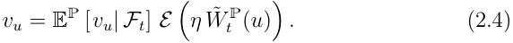

where in particular EP [ _vu| Ft_ ] is adapted to the filtration generated by _W_P which we assume is the same as the filtration generated by _W_Q . Consider some general change of measure 

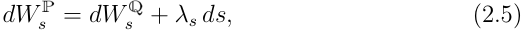

where _{λs_ : _s > t}_ has a natural interpretation as the price of volatility risk. We may then rewrite (2.4) as 

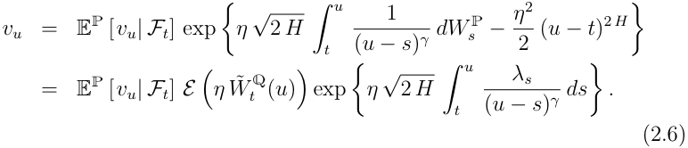

The last term in the exponent obviously changes the marginal distribution of the _vu_ ; although the conditional distribution of _vu_ under P is lognormal, it will not be lognormal in general under Q . 

#### **VIX smiles and the change of measure** 

In the case of SPX, it is obvious from the shape of VIX implied volatility smiles that the change of measure cannot be deterministic. If the change of measure were deterministic, it follows from (2.6) that _vu_ would be conditionally lognormal, VIX would also be approximately lognormal and so the VIX 

> 5This is analogous to what happens in Comte, Coutin and Renault [6] in the context of their fractionally integrated square root model.

<!-- page: 10 -->

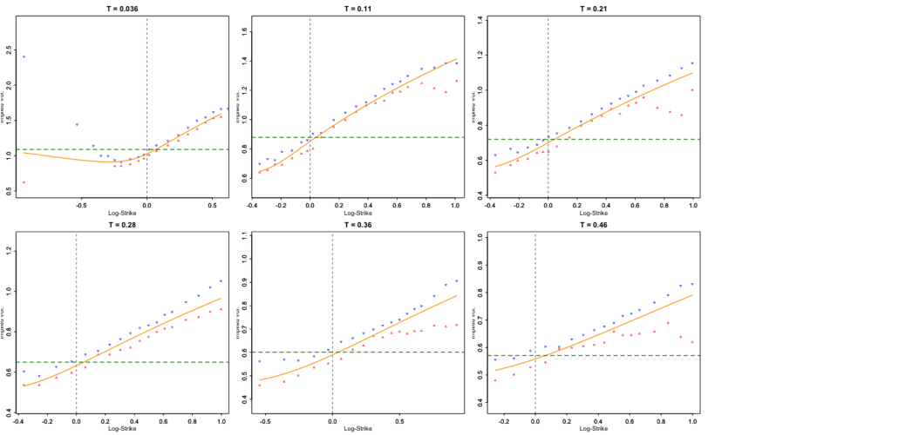

<!-- Start of picture text -->
T=0.036 T=0.11 T=0.21 77=7 :© : ' 4a. ':\ * :\: o- '': 3 a ' a~a '‘ ia7a ey 72 ' es. « 2 H 2 ‘ _* . 2 H bad 7” '''y ue.arg ' is wonn nn f'a<S------------------Z o= SST TT nnn_ <aoe “See eee o voYu' eo} .a aah' o :' ©s :' . '' 8::«3: 05 Log-Strike 0.0 05 04 02 0.0 02 Log-Strike04 06 08 10 04 02 0.0 02Log-Strike04 06 08 10 T=0.28 T= 0.36 T=0.46 a~:t‘cse:H: a ::: °-:‘.‘'.2o‘'. ‘mk: . 23 ee: : ee‘ ee so poop cipe-e2-------------------vr 4304 02 00:H02Log-Strike04 06 08 1.0 =©05 0.0 : Log-Strike os *602 0.0 : 02 Log-Strike04 06 08 10 <!-- End of picture text -->

<!-- page: 11 -->

where _λ_ ( _s_ ) is a deterministic function of _s_ . Then from (2.6), we would have 

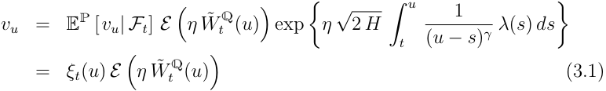

where by definition, _ξt_ ( _u_ ) = EQ [ _vu| Ft_ ]. Moreover, the forward variance curve 

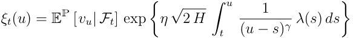

is the product of two terms: EP [ _vu| Ft_ ] which depends on the history of the driving Brownian motion as explained earlier, and a term which depends on the price of risk _λ_ ( _s_ ). 

The model (3.1) is a non-Markovian generalization of the Bergomi model (1.5) which we might dub a _rough Bergomi_ (or _rBergomi_ ) model. Specifically, this rBergomi model is non-Markovian in the instantaneous variance _vt_ : EQ [ _vu| Ft_ ] = EQ [ _vu|vt_ ] but is Markovian in the (infinite-dimensional) state vector EQ [ _vu| Ft_ ] = _ξt_ ( _u_ ). 

Note also that with (3.1), we have achieved the aim we set out in the introduction by replacing the exponential kernels in the Bergomi model (1.5) with a power-law kernel. We may therefore expect that the rBergomi model will generate a realistic term structure of ATM volatility skew. 

The observed anticorrelation between price moves and volatility moves may be modeled naturally, just as in the conventional Bergomi model, by anticorrelating the Brownian motion _W_ that drives the volatility process with the Brownian motion driving the price process. Thus 

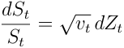

with 

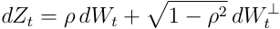

where _ρ_ is the correlation between volatility moves and price moves. 

### **3.1 Re-interpretation of the conventional Bergomi model** 

According to [2], the conventional Bergomi model is a _market model_ , by which it is meant that _ξt_ ( _u_ ) can be any given initial forward variance swap curve

<!-- page: 12 -->

consistent with market prices. However, for the Bergomi model to properly describe the evolution of this curve, _ξt_ ( _u_ ) = E [ _vu| Ft_ ] should be consistent with the assumed dynamics; in this sense, a conventional _n_ -factor Bergomi model is not self-consistent in general. 

Viewed from the perspective of the rBergomi model however, the initial curve _ξt_ ( _u_ ) reflects the history _{Ws_ ; _s < t}_ of the driving Brownian motion up to time _t_ . The exponential kernels in the exponent of (1.5) approximate more realistic power-law kernels. The conventional two-factor Bergomi model is then justified in practice as a tractable Markovian engineering approximation to a more realistic rBergomi model. 

## **4 Simulation of the rBergomi model** 

To simplify notation, we set the origin of the simulation to be _t_ = 0 and drop the explicit reference to the pricing measure Q . From (3.1), the model to be simulated is 

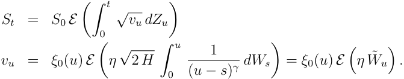

where _W_˜ is a Volterra process6 with the scaling property Var[ _W_˜ _u_ ] = _u_2_H_ _._ So far _W_˜ behaves just like fBm. However, the dependence structure is different. Specifically, for _v > u_ , 

where, for _x ≥_ 1, 

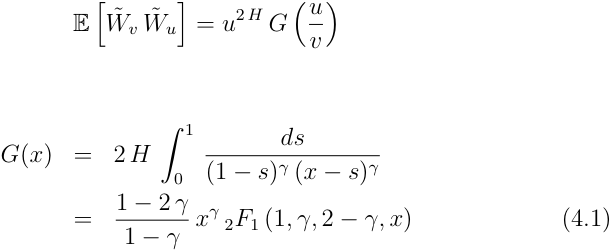

where 2 _F_ 1( _·_ ) denotes the confluent hypergeometric function. 

> 6This is identical up to a constant factor to the definition of [7].

<!-- page: 13 -->

**Remark 4.1.** _The dependence structure of the Volterra process W_˜ _is markedly different from that of fBm with the Molchan-Golosov kernel. In particular, for small H, correlations drop precipitously as the ratio u/v moves away from_ 1 _._ 

We also need covariances of the Brownian motion _Z_ with the Volterra process _W_˜ . With _v ≥ u_ , these are given by 

and 

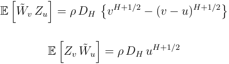

where for future convenience, we have defined the constant, 

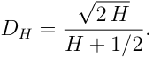

These two formulae may be conveniently combined as 

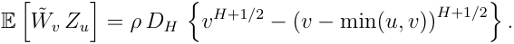

Lastly, of course, for _v ≥ u_ , E [ _Zv Zu_ ] = _u_ . 

With _m_ the number of time steps and _n_ the number of simulations, our rBergomi model simulation algorithm may then be summarized as follows. 

- Construct the joint covariance matrix for the Volterra process _W_˜ and the Brownian motion _Z_ and compute its Cholesky decomposition. 

- For each time, generate iid normal random vectors and multiply them by the lower-triangular matrix obtained by the Cholesky decomposition to get a _m ×_ 2 _n_ matrix of paths of _W_˜ and _Z_ with the correct joint marginals. 

- With these paths held in memory, we may evaluate the expectation under Q of any payoff of interest. 

The simulation procedure we have described is unsurprisingly very slow because of the high number of matrix-vector multiplications with a lowertriangular but otherwise dense matrix. We leave the search for faster simulation techniques based on the specific structure of the problem, including the specific choice of the correlation structure between _Z_ and _W_˜ for future research.

<!-- page: 14 -->

## **5 Consistency of the rBergomi model with the SPX volatility surface** 

As explained above, our simulation of the rBergomi model is very slow and this effectively rules out optimization in practice. However, the model parameters _H_ , _η_ and _ρ_ have very direct interpretations. _H_ controls the decay of the term structure of volatility skew for very short expirations whereas the product _ρ η_ sets the level of the ATM skew for longer expirations. Keeping the product _ρ η_ roughly constant but decreasing _ρ_ (so as to make it more negative) has the effect of pushing the minimum of each smile towards higher strikes. Thus, it is possible to guess parameters. Moreover, as we will show below, _H_ and _η_ may be estimated from historical data. We will now show that on two particular days in history, the rBergomi model was surprisingly consistent with the observed volatility surface. Fits for other days we tried are not always as impressive as these two but nevertheless visibly superior to fits of conventional Markovian stochastic volatility models. 

### **5.1 Parameter estimation from the time series of realized variance** 

Both the roughness parameter (or Hurst parameter) _H_ and the volatility of volatility _η_ should be the same under P and Q . 

In [12], we estimated the RFSV model (1.1) on the Oxford-Man realized variance dataset obtaining the historical effective parameter estimates _Heff ≈_ 0 _._ 14 and volatility of volatility _νeff ≈_ 0 _._ 3. Recall however that the instantaneous volatility _σt_ is not observed; rather we observe the realized _δ_ variance<u>1</u> _δ_ �0_σ_ _t_2_dt_where_δ_correspondstoatradingdayfromtheopento the close, roughly 3 _/_ 4 of a whole day from close to close. Following the computation in Appendix C of [12], we may use these historical estimates to approximate the roughness and volatility of volatility corresponding to instantaneous volatility. This gives _H ≈_ 0 _._ 05 and _ν ≈_ 1 _._ 7. From Section 2, we have the relationship 

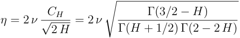

which yields the estimate _η ≈_ 2 _._ 5.

<!-- page: 15 -->

### **5.2 Estimation of the variance swap curve** 

Variance swaps are actively traded so in principle, computation of the forward variance swap curve should be straightforward. In practice however, it is not easy to obtain high quality variance swap quote data and in any case, the bid/ask spread is wide. We thus choose to proxy the value of a _τ_ -maturity variance swap by the value of a _τ_ -expiration log contract as explained for example in Chapter 11 of [10]. To price the log contract for a particular expiration _τ_ requires us to know the prices of _τ_ -expiration options for all strikes; of course prices are only quoted for a finite number of strikes. We therefore choose to interpolate and extrapolate observed implied volatilities using the arbitrage-free SVI parameterization of the volatility surface as explained in [11]. For any given day, we obtain the closing prices of SPX options for all available strikes and expirations from OptionMetrics ( `www.optionmetrics.com` ) via Wharton Research Data Services (WRDS). Having estimated variance swaps to each expiration, we interpolate total variances using a monotonic spline to estimate variance swaps for intermediate dates. This allows us in turn to estimate the the forward variance swap curve. 

One subtlety is that by choosing SVI to interpolate and extrapolate, we may be assuming a smile that is inconsistent with the one generated by the rBergomi model, and therefore that the forward variance curve may not be accurate. The practical effect of this is that at-the-money implied volatilities are not matched in the first pass, with good agreement for very short expirations but rather less good agreement as time to expiry increases. A simple iteration on the forward variance curve soon reaches a fixed point that achieves consistency between model ATM volatilities and market ATM volatilities. 

### **5.3 Fits to two specific days in history** 

#### **February 4, 2010** 

For our first comparison of the model to SPX options data, we choose February 4, 2010, a day when the ATM volatility term structure happened to be pretty flat. With guessed parameters _H_ = 0 _._ 07, _η_ = 1 _._ 9, _ρ_ = _−_ 0 _._ 9, we obtain the impressive fit shown in Figure 5.1. Only three parameters to get a very good fit to the whole SPX volatility surface, including the shortest dated smile (Figure 5.2).

<!-- page: 16 -->

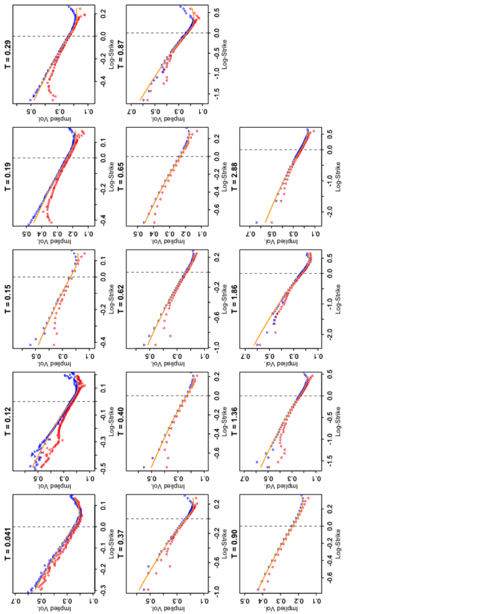

<!-- Start of picture text -->
"t \* ” 5 its) wh] a . ‘ts, a f a a F of a M j aa! “se o" 9 F aonno 5a] F Z éa‘ * Sk a ot77 J 4 c=) 4 ‘ ag 7 eo al LO £0 co 0 Lo JOA Peyduy ‘OA payduly By 4 4 Po : aa eee ee ae =] a Aeo «| #£€ |[%en 2% 2 =so : ze ae 2 = " Bi acs on Mw on Ke fi!i a gilak f a 25ka a4 5a4 Pe 7 G 4 J a 4 i'sid « : 4 cial9 a wo. 3 ‘ o fe oo FO £0 fo LO fo FO £0 20 LO £0 0 £0 LO OA, popu] }O, payduyy “BA, papi be) 4 a) a 3 ptej i ~1 w3} a Sa i=] ee ee aad a as i iw aw # So o a 3 ; 5s é B= o8 " bj aq oll ya a ll fs = 2 kK 4 o5be he oik fs 4 :49: 4. y o4 — 2 & a " * y b 4 9 big a bd 0 £0 ‘0 so eo LO ‘ £0 50 eo LO 724, pagduy pO, payduyy “PA pad) ba 4 o l be "=] eee eee ee ee eee a a 3 Tas fac ; ca " ol wall id a Ee Se A air ‘3 o4 ‘ “ 4 . -| 7 * 4 7 : Ssba 5 oar ahr a 5 4 es " oo 0 LO oo al Lo £0 eo eo LO ‘JOA, payduyy ‘A, payday “PA, perdu he: ba oat nw5 rii ‘ _.......-.. Le a ---------4f----19 = fi “2 5 32 & <2 Ss a -Hs as a5 in ke gall 3 oll o E & ae a wok a5 gf rs » * 9 4 z oa > 4 ie o de “ 9 £0 Rik)go £0 LO 3 be70 eo LO =‘ so FO4 £0 2O 10 712A, Pandy “POA, paupduuy “PA padi) <!-- End of picture text -->

<!-- page: 17 -->

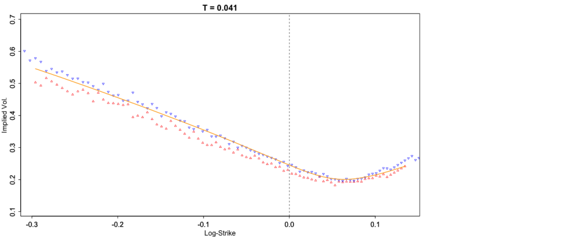

<!-- Start of picture text -->
T = 0.041 nN H S : [oy ° ' ° ° ar ae ' 2saata 4,aM2“'H 3' ee aeer Pees 204 -0.3 -0.2 -0.1 0.0 0.1 Log-Strike <!-- End of picture text -->

<!-- page: 18 -->

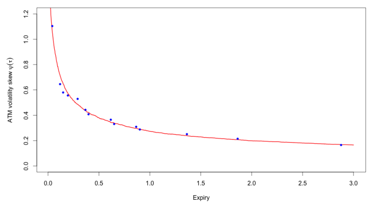

<!-- Start of picture text -->
N ad Se > So x&ao 2 6© & $ = x < o N So o So 0.0 0.5 1.0 1.5 2.0 25 3.0 Expiry <!-- End of picture text -->

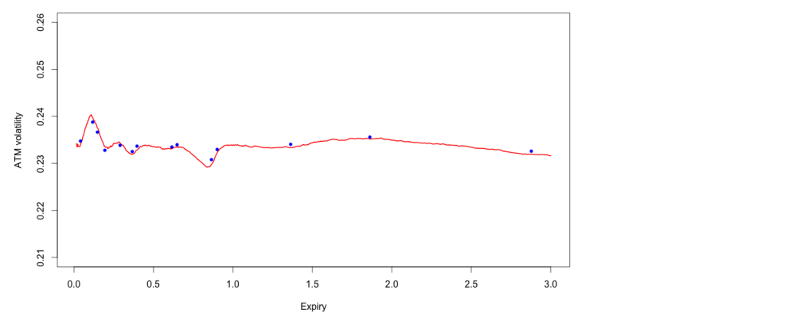

<!-- Start of picture text -->
© N o wo No 2 a a) 8 =g °. : ° z8o N N Co Q o 0.0 0.5 1.0 1.5 2.0 2.5 3.0 Expiry <!-- End of picture text -->

<!-- page: 19 -->

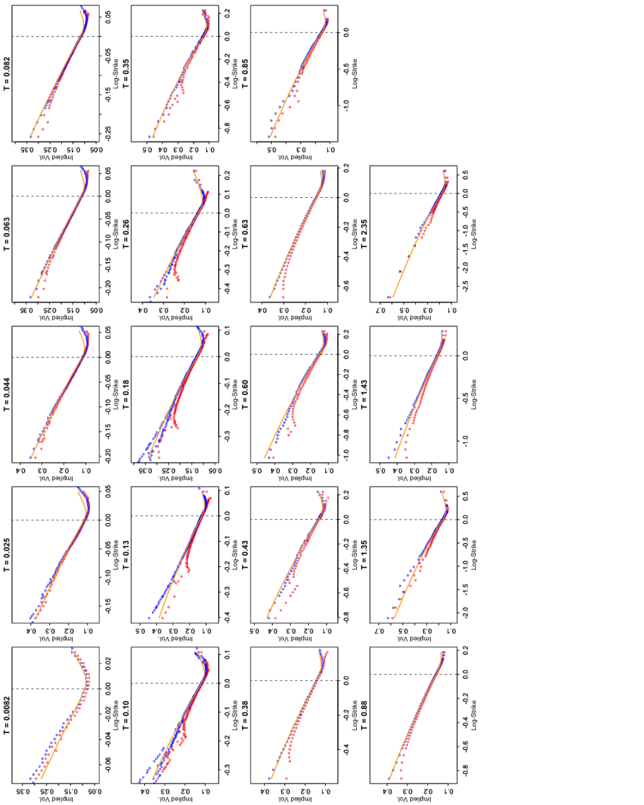

<!-- Start of picture text -->
3°2°o so -------------§- 3 -------------£--1¢2oc x 32 3 F 728 728 22 s oe 34 2G r—u E; wig ‘3 Sik5 3 p, ag .9<“o¢ ofaa“°7 8 . °9 > seo szO Slo S00 gO v0 €0 ZO 10 so £0 ro ‘TOA pariduuy “JOA payduyy ‘JOA payduu 8 0 5 2 so AI o co © 520 ° afew q fou gu Pad : 3 FE Y ose2 gir« ; air*2 osg7 : g ‘ ‘ <¢ :3 2 " ©q e! . yy« ?: 2« gq “ oy s0 S70 SO soo vo €0 ZO +0 vo €0 zo +0 40 sO ¢0 +0 ‘OA pariduyy “OA payduy ‘OA payduyy ‘OA payduyy & 8¢ \ co5 PY 7 --------------le a Z SG e ne “oeg28 Fen28 F2 o1 egnac if ascom Sou5a ooge a gar ; gah eik s Po9= Fi. “4% o3‘ f°eras7,ee 929 vso/s7.? 2 g J . v/s = 3 heP ea 2: rl »/ si« vo €0 zo 10 seo S70 Slo S00 so vo €0 ZO 10 so vo €O ZO 10 ‘OA pariduyy “OA payduy ‘OA payduyy ‘OA parduyy 8 bad g 1s i. ts 3 w Ss Nn " 8 gi #29 f 928 eg FEs" otk7Geu9° agioiege f eetgia~ v/sQ oo?<4a f Pa 4 ? - 9 . FZ 9 oh- 3 ‘ ; 23 oey 9 vo £0 70 10 so vo £0 Z0 10 so vo £0 zZ0 10 40 sO €0 10 ‘JOA payiduuy ‘JOA payduyy ‘JOA payduu ‘1A payiduu > = ‘J 0o nNocoa o a Ane ° s8° is ° 855g¢<= $59£8to) ga6=a22 Fe5= a :3% 7 SeWt Seot f Seot o3xo Ry 3 i} n a f 3 ¢ . ¢ 3 z 5 3 Pe , : ¢ ‘ veeed ¢ »ra &be g% / bd« 3¢ seo S70 GLO go0 vo £0 70 10 vo ©€0 70 10 vo ©€0 ZO 10 “TOA porpduu “JOA poyduyy TOA poy ‘TOA perdu <!-- End of picture text -->

<!-- page: 20 -->

#### **5.3.1 Jump-like behavior of the rBergomi price process** 

It has often been claimed that jumps are required to explain the observed extreme short-dated smile in SPX. In particular, in [4], Carr and Wu determine whether or not there are jumps in the asset process, and if so, whether such jumps are finite or infinite activity. They determine based on their analysis that jumps are required to generate the smiles observed in SPX. However, the class of processes that Carr and Wu consider is too restrictive, excluding models like rBergomi where the out-of-the-money smile explodes as time to expiration _τ →_ 0. It is apparent from Figures 5.1 and 5.5 that the rBergomi model (where the price process is continuous) generates smiles consistent with those observed empirically _even for very short expirations_ ; there is no need for jumps. 

## **6 The rBergomi model and VIX options** 

We pointed out earlier in Section 2.1 that observed VIX smiles are inconsistent with the rBergomi model. Nevertheless, even if the rBergomi model is misspecified, it may be possible to impute its parameters _H_ and _η_ by examining the term structure of VIX variance swaps7 ; if VIX corresponds to volatility, then VIX of VIX should correspond to “volatility of volatility”. Denote the terminal value of the VIX futures by ~~�~~ _ζ_ ( _T_ ). Then, by definition8 , 

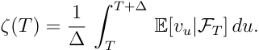

> 7The VIX log-strip forms the basis for the VVIX (VIX of VIX) index computation. Indeed, following CBOE ( `www.cboe.com` ), the VVIX term structure is computed every day ( _t_ ) for various maturities ( _T_ ) of VIX options using the usual log-strip formula that is used for the construction of VIX. More specifically, given _T > t_ and assuming that VIX options with expiry _T_ are traded, the VVIX _t,T_ is given by 

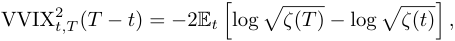

where _ζ_ ( _s_ ) denotes the square of VIX at _s_ and E _t_ log � _ζ_ ( _T_ ) can be expressed in terms of put and call prices on VIX with expiry _T_ . The usual VVIX index (at a given _t_ ) then corresponds to VVIX _t,t_ +∆ for ∆equal to one month. 8See Chapter 11 of [10] for more details.

<!-- page: 21 -->

( <u>~~</u> ~~{—)~~ 

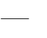

<!-- Start of picture text -->
—/ <!-- End of picture text -->

~~| tI (—)~~ | Pv ~~|| (—)~~

<!-- page: 22 -->

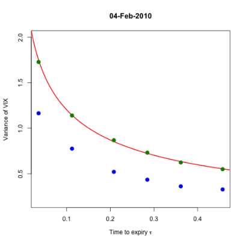

<!-- Start of picture text -->
04-Feb-2010 SsN rr) > 8 > re ° 0.1 0.2 0.3 04 Time to expiry + <!-- End of picture text -->

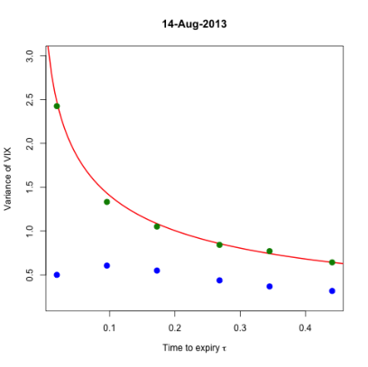

<!-- Start of picture text -->
14-Aug-2013 Sso at“ ° % > 8 > ° woo 0.1 0.2 0.3 04 Time to expiry t <!-- End of picture text -->

<!-- page: 23 -->

~~<u>a FH</u> -—(~~ 

) 

; 

/

<!-- page: 24 -->

/ [| ~~—— ff~~ f | ~~———| —— — vy fe~~ 

~~i~~

<!-- page: 25 -->

Also, _w_ = _σ_ ¯2 _T_ . Substituting back into (7.2) and then (7.1) gives, to first order in _η_ , 

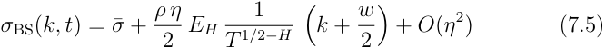

In particular, we see that to first order in _η_ , the term structure of at-themoney volatility skew is given by 

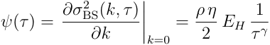

with _γ_ = 1 _/_ 2 _− H_ . Similarly, substituting _ξ_ 0( _u_ ) = _σ_ ¯2 into (A.2) and (A.3) respectively gives the terms required for computation of the second order contribution: 

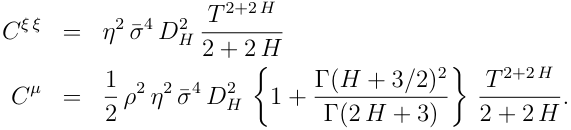

It follows that to second order in _η_ , the term structure of at-the-money volatility skew is given by 

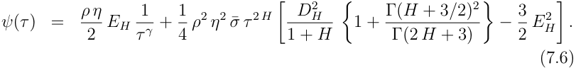

#### **Numerical test** 

The dimensionless Bergomi-Guyon expansion parameter is _λ_ = _η T__H_ . When _H_ is very small, _λ ∼ η_ for all reasonable expirations; with _H <_ 0 _._ 1 as in Section 5.3, _λ ∼_ 1 _._ 9 which is not small enough for the asymptotic expansion to converge, even at-the-money. With the much smaller value _η_ = 0 _._ 4, we see in Figure 7.1 very good agreement between the Bergomi-Guyon asymptotic skew formula (7.6) and the simulation. 

We thus conclude that both our Bergomi-Guyon computations and the simulation are likely to be correct. Sadly however, the Bergomi-Guyon expansion does not converge with values of _η_ consistent with the SPX volatility surface, so the Bergomi-Guyon expansion is not useful in practice for calibration of the rBergomi model.

<!-- page: 26 -->

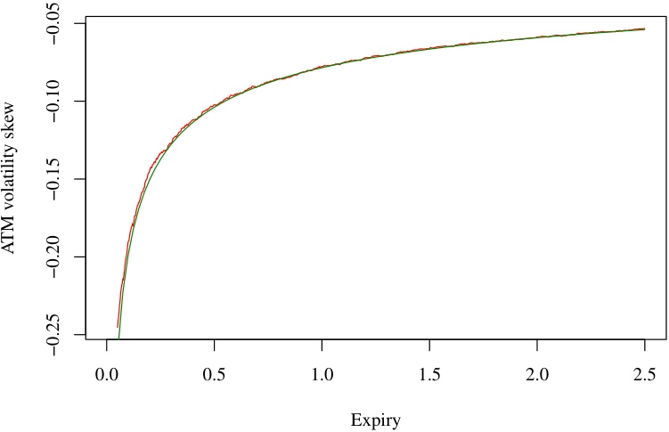

<!-- Start of picture text -->
0.0 0.5 1.0 1.5 2.0 2.5 Expiry −0.05 −0.10 −0.15 ATM volatility skew −0.20 −0.25 <!-- End of picture text -->

Figure 7.1: The Bergomi-Guyon second order ATM skew approximation is in green; ATM skews from Monte Carlo simulation are in red. Parameters used were _H_ = 0 _._ 1 _, η_ = 0 _._ 4 _, ρ_ = _−_ 0 _._ 85 _,_ ¯ _σ_ = 0 _._ 235. 

## **8 the variance curve Forecasting swap** 

Recall that in the RFSV model (1.1), log _vt ≈_ 2 _ν Wt__H_ + _C_ for some constant _C_ . In [14], it is shown, assuming _H ∈_ (0 _,_ 1 _/_ 2) _,_ ∆ _>_ 0, that _Wt__H_ +∆is conditionally Gaussian with conditional expectation9 

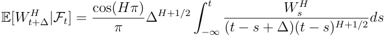

and conditional variance 

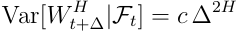

> 9Trivially E[ _W Ht_ +∆_|Ft_]=_W H_ _t_ when either ∆= 0 or _H_ = 1 _/_ 2. This corresponds to the singular behavior of the integrand, as either ∆ _→_ 0 or _H →_ 1 _/_ 2, with the necessary compensation given by ∆_H_+1_/_2 cos( _Hπ_ ) _∼_ 0 in these regimes.

<!-- page: 27 -->

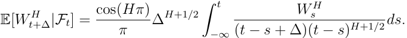

and conditional variance 

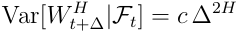

where 

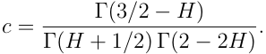

Thus, we obtain the following natural form for the RFSV predictor of the variance: 

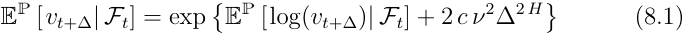

where 

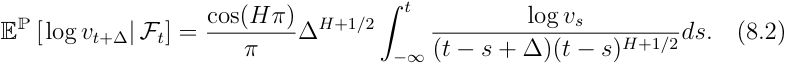

The fair value of a _τ_ -maturity variance swap is given (approximately) by 

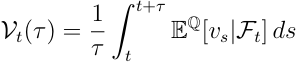

where Q is the risk neutral measure. If it were possible to ignore the change of measure so that 

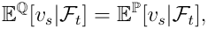

it would be possible to forecast variance swap curves using (8.1). In fact, we will see that from the data, Q is close to P in this sense. We now proceed to compare forecast and actual variance swaps curves. 

SPX variance curve forecasts are formed using the predictor (8.1) from the time series of daily realized variance estimates from same Oxford-Man dataset that was used in [12]. 

As for market variance swap curves, although there is an active market, it is not easy to obtain high quality variance swap quote data and in any case, the bid/ask spread is wide. We thus choose to proxy the value of a

<!-- page: 28 -->

<!-- Start of picture text -->
8 WUwef KE WyRN: APRbe be YAfo uy\ Mal 5 1 Wadadhs weeud owe Wy! “ual, Jan03 Jan02  Jan03Jan3Jang3dano2 Jand2JanG#  Jan03. Jano3.— van a ate <!-- End of picture text -->

<!-- Start of picture text -->
% K Jan03 Jan02  dan03Jan3Jand8 Jand2 Jano? Jano# JanG3an03. Janda a iate <!-- End of picture text -->

<!-- page: 29 -->

<!-- Start of picture text -->
| Mi WM Mythy“AAYi ANmt Jan03Jan02Jan03dan0300, “2008 200806 dan 03“aor” Jan02JanG2JanGS“2008Date “2008 “2010.20Jan03Jan03_dan02“a12 “aot8 <!-- End of picture text -->

<!-- Start of picture text -->
3 ‘gle HONS aa AVJ m uN Jon0300 Jan02“200 dJan032005“dan 03 Jan“20a” 03 Jan02—“200820082010Date Jon02—Jano#an03art dan“ane 03. Jan2“20K8 <!-- End of picture text -->

<!-- Start of picture text -->
Bal yi H SH | Jan03Jan02Jan03dan0300, “2008 200806 dan 03“aor” Jan02JanG2JanGS“2008Date “2008 “2010.20Jan03Jan03_dan02“a12 “aot8 <!-- End of picture text -->

<!-- Start of picture text -->
so | ede Wg Jon0300 Jan02“200 dJan032005“dan 03 Jan“20a” 03 Jan02—“200820082010Date Jon02—Jano#an03art dan“ane 03. Jan2“20K8 <!-- End of picture text -->

<!-- page: 30 -->

<!-- Start of picture text -->
w v 2 fe} =] i] s' °' 1 i) Oo rs] Ss w a Sove] ¢ oo w a \ 85 8 KXs 5 SC On > % Gott nee ---- oo ~N\ 099 gr SO afa] “Os“~O.~99 ———— 90 9g. en = OoFS———————_9 >= = o o ™ oOo 0.0 0.5 1.0 1.5 20 Time to maturity t <!-- End of picture text -->

<!-- page: 31 -->

<!-- Start of picture text -->
re o 4 — Mays —— May? 2 i ° ua t i) 2 ° =]a S s2 =© %, ee 3 a ° Ue = GB o————_# zs 2 = - a oO oy).; ae—_—i=———— 2°R | of c=) | i) 0.0 0.5 1.0 1.5 2.0 25 Maturity <!-- End of picture text -->

<!-- page: 32 -->

<!-- Start of picture text -->
1. i 6o — May7 Ss May 10 o +So éi= gsgsF’ 89° ° _Semae= 39 > —___—_—_\_°_ § 6 gfeS 0 ,© 0—e—egg wo o Sox Co 0.0 0.5 1.0 15 2.0 25 Time to maturity « <!-- End of picture text -->

<!-- Start of picture text -->
rey bd3 o — May7 May Ss 10 o So+ 2 9 es] & Ff2 8 ° 8s, On= 9pWoe—___—_\_—_ eee errr ? €°e ae 6 > 8° | o>~-soe—e—eSC0© en —e wo o Sox o 0.0 0.5 1.0 15 2.0 25 Time to maturity « <!-- End of picture text -->

<!-- page: 33 -->

## **9 Summary and conclusions** 

The Rough Fractional Stochastic Volatility (RFSV) model of [12] is remarkably consistent with the time series of realized volatility for a wide range of different underlying assets. In this paper, we have shown that this model written under the physical measure P leads naturally to an options pricing model under Q that is remarkably consistent with the observed shape of the implied volatility surface in the particular case of SPX. A special case of this model where we assume a deterministic change of measure between P and Q turns out to be a non-Markovian extension of the well-known Bergomi model, which we consequently dub the Rough Bergomi (or rBergomi) model. The rBergomi model is particularly tractable and seems to fit the SPX volatility surface very well, despite our lack at this stage of an efficient computational algorithm. We computed terms Bergomi-Guyon expansion up to second order in volatility of volatility but the expansion parameter _λ_ = _η τ__H_ _≈_ 2 required to fit SPX option prices is too big for this asymptotic expansion to be valid. However, we do not see agreement between the rBergomi model and the term structure of VIX volatility (VVIX). 

Taken together, the present work and the econometric analysis of [12] offer a (perhaps even the first) promising paradigm for the understanding of asset price formation all the way from a basic microstructure description at the order book level to option pricing. Not least, our framework allows for accurate prediction of the volatility surface from high-frequency price data. More efficient computational methods and a more thorough investigation of the market implied change of measure _d_ Q _/d_ P are left for further research.

<!-- page: 34 -->

J <u>[|</u> ~~——~~ <u>of fF Ww</u> | ~~<u>|</u> i~~ Jfo ~~f ——~~ J/ | ~~f——~~ | **(** J ~~—)—~~ ) fo ~~fo~~

<!-- page: 35 -->

<!-- Start of picture text -->
— ors i 4 art f f v— ya tf vo [vf— ( fvfv |  —YF <!-- End of picture text -->

~~“~~ | 

~~(|~~

<!-- page: 36 -->

<!-- Start of picture text -->
/ if —f f — —/ i | —] | | (—) —f i | / / oe —(-- <!-- End of picture text -->

<!-- page: 37 -->

## **References** 

- [1] E. Al`os, J. A. Le´on, and J. Vives. On the short-time behavior of the implied volatility for jump-diffusion models with stochastic volatility. _Finance and Stochastics_ , 11(4):571–589, Aug. 2007. 

- [2] L. Bergomi. Smile dynamics II. _Risk October_ , pages 67–73, 2005. 

- [3] L. Bergomi and J. Guyon. Stochastic volatility’s orderly smiles. _Risk May_ , pages 60–66, 2012. 

- [4] P. Carr and L. Wu. What type of process underlies options? A simple robust test. _Journal of Finance_ , 58(6):2581–2610, 2003. 

- [5] P. Cheridito, H. Kawaguchi, and M. Maejima. Fractional OrnsteinUhlenbeck processes. _Electron. J. Probab_ , 8(3):14, 2003. 

- [6] F. Comte, L. Coutin, and E. Renault. Affine fractional stochastic volatility models. _Annals of Finance_ , 8(2-3):337–378, 2012. 

- [7] F. Comte and E. Renault. Long memory continuous time models. _Journal of Econometrics_ , 73(1):101–149, 1996. 

- [8] F. Corsi, N. Fusari, and D. La Vecchia. Realizing smiles: Options pricing with realized volatility. _Journal of Financial Economics_ , 107(2):284–304, 2013. 

- [9] M. Fukasawa. Asymptotic analysis for stochastic volatility: Martingale expansion. _Finance and Stochastics_ , 15(4):635–654, 2011. 

- [10] J. Gatheral. _The volatility surface: A practitioner’s guide_ . John Wiley & Sons, 2006. 

- [11] J. Gatheral and A. Jacquier. Arbitrage-free SVI volatility surfaces. _Quantitative Finance_ , 14(1):59–71, 2014. 

- [12] J. Gatheral, T. Jaisson, and M. Rosenbaum. Volatility is rough. _Available at SSRN 2509457_ , 2014. 

- [13] D. Noureldin, N. Shephard, and K. Sheppard. Multivariate highfrequency-based volatility (heavy) models. _Journal of Applied Econometrics_ , 27(6):907–933, 2012.

<!-- page: 38 -->

- [14] C. J. Nuzman and V. H. Poor. Linear estimation of self-similar processes via Lamperti’s transformation. _Journal of Applied Probability_ , 37(2):429–452, 2000.
