# 2016-bayer-friz-gatheral-pricing-rough-volatility

<!-- page: 1 -->

## Pricing under rough volatility

Christian Bayer WIAS Berlin bayer@math.tu-berlin.de

Peter Friz TU Berlin and WIAS Berlin friz@math.tu-berlin.de

Jim Gatheral Baruch College, City University of New York jim.gatheral@baruch.cuny.edu

January 23, 2015

## Abstract

From an analysis of the time series of volatility using recent high frequency data, Gatheral, Jaisson and Rosenbaum [12] previously showed that log-volatility behaves essentially as a fractional Brownian motion with Hurst exponent H of order 0.1, at any reasonable time scale. The resulting Rough Fractional Stochastic Volatility (RFSV) model is remarkably consistent with financial time series data. We now show how the RFSV model can be used to price claims on both the underlying and integrated volatility. We analyze in detail a simple case of this model, the rBergomi model. In particular, we find that the rBergomi model fits the SPX volatility markedly better than conventional Markovian stochastic volatility models, and with fewer parameters. Finally, we show that actual SPX variance swap curves seem to be consistent with model forecasts, with particular dramatic examples from the weekend of the collapse of Lehman Brothers and the Flash Crash.

<!-- page: 2 -->

## 1 Introduction

From an analysis of the time series of volatility using recent high frequency data, Gatheral, Jaisson and Rosenbaum [12] showed that log-volatility behaves essentially as a fractional Brownian motion with Hurst exponent H of order 0.1, at any reasonable time scale. The following stationary Rough Fractional Stochastic Volatility (RFSV) model was proposed:

$$
\begin{array} { r c l } { \displaystyle \frac { d S _ { t } } { S _ { t } } } & { = } & { \sigma _ { t } d Z _ { t } } \\ { \sigma _ { t } } & { = } & { \exp \left\{ X _ { t } \right\} , \ t \in [ 0 , T ] , } \end{array}\tag{1.1}
$$

where $X _ { t }$ is a fractional Ornstein-Uhlenbeck process (fOU process for short) satisfying

$$
d X _ { t } = \nu d W _ { t } ^ { H } - \alpha ( X _ { t } - m ) d t ,
$$

where $m \in \mathbb { R }$ and ν and α are positive parameters, see [5]. Recall that sample paths of fractional Brownian motion $W ^ { H }$ are $( H - \varepsilon )$ -H¨older (and hence “rougher” than Brownian motion whenever $H < 1 / 2$ . The reversion time scale is understood to be very long so that α $T \ll 1$ for any reasonable time scale T of practical interest, in which case, the log-volatility behaves locally (at time scales smaller than T) as a fractional Brownian motion (fBm). The RSFV model is remarkably consistent with financial time series data. Moreover, the RFSV model has a quantitative market microstructure-based foundation based on the modeling of order flow using Hawkes processes.

On the other hand, from the perspective of options pricing, it is wellknown that conventional low-dimensional Markovian stochastic volatility mod els such as the Hull and White, Heston, and SABR models generate implied volatility surfaces whose shapes difer substantially from that of the empirically observed volatility surface. A typical such volatility surface generated from a “stochastic volatility inspired” (SVI) [11] fit to closing SPX option prices as of August 14, 20131 is shown in Figure 1.1. It is a stylized fact that, at least in equity markets, although the level and orientation of the volatility surface do change over time, the general overall shape of the volatility surface does not change, at least to a first approximation. This suggests that it is desirable to model volatility as a time-homogenous process, i.e. a process whose parameters are independent of price and time.

1Closing prices of SPX options for all available strikes and expirations were sourced from OptionMetrics (www.optionmetrics.com) via Wharton Research Data Services (WRDS).

<!-- page: 3 -->

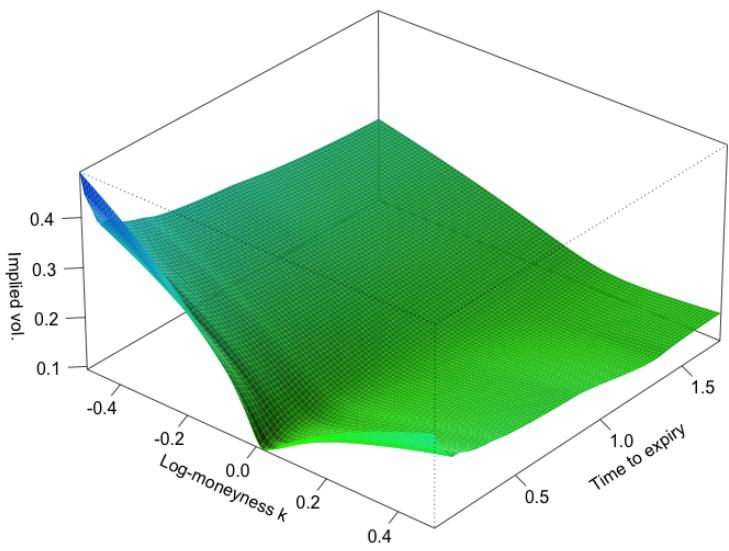

Given an implied volatility smile for a single expiration, little can be said about the process generating it; any process that generates uncertain realized volatility from inception to expiration and with some correlation between changes in volatility and returns of the underlying might sufice. To say more about the underlying process, the scaling of smiles with respect to time to expiration needs to be examined. In particular, one feature of the volatility surface that really does distinguish between models is the term structure of at-the-money (ATM) volatility skew defined as

$$
\psi ( \tau ) : = \left| \frac { \partial } { \partial k } \sigma _ { \mathrm { B S } } ( k , \tau ) \right| _ { k = 0 } .
$$

where $\tau = T - t$ denotes time to expiration. In conventional stochastic volatility models, the ATM volatility skew $\psi ( \tau )$ is constant for short dates and inversely proportional to $\tau$ for long dates. Empirically, as shown in Figure 1.2, we observe that $\psi ( \tau )$ is proportional to $1 / \tau ^ { \alpha }$ for some $0 < \alpha < 1 / 2$ over a very wide range of expirations.

Let $v _ { u } = \sigma _ { u } ^ { 2 }$ denote instantaneous variance at time $u \ > \ t$ . Then the forward variance curve is given by

$$
\xi _ { t } ( u ) = \mathbb { E } \left[ v _ { u } | \mathcal { F } _ { t } \right] , u \ge t .
$$

<!-- page: 4 -->

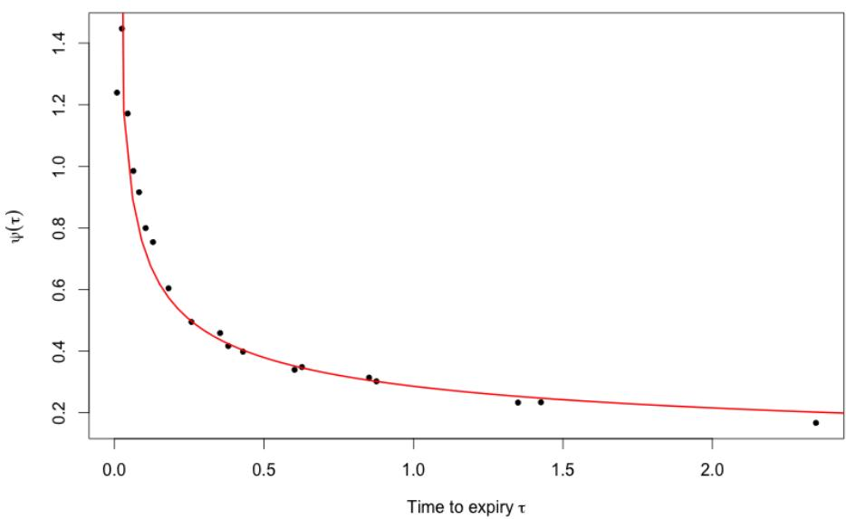

Bergomi and Guyon [3] derive a small noise expansion for the smile in a stochastic volatility model written in the following forward variance curve form:

$$
\begin{array} { r c l } { \displaystyle \frac { d S _ { t } } { S _ { t } } } & { = } & { \sqrt { \xi _ { t } ( t ) } d Z _ { t } } \\ { d \xi _ { t } ( u ) } & { = } & { \lambda ( t , u , \xi _ { t } ) d W _ { t } } \end{array}\tag{1.2}
$$

where $Z _ { t }$ is a Brownian motion driving the asset price $S _ { t }$ and $W _ { t }$ is a (suitably correlated) d-dimensional Brownian motion driving the evolution of the forward variance curve. To first order in the volatility of volatility λ, The Bergomi-Guyon expansion takes the form

$$
\sigma _ { \mathrm { B S } } ( k , T ) = \sigma _ { 0 } ( T ) + \sqrt { \frac { w } { T } } \frac { 1 } { 2 w ^ { 2 } } C ^ { x \xi } k + { \cal O } ( \lambda ^ { 2 } )\tag{1.3}
$$

where the log-strike $\begin{array} { r } { k \ = \ \log K / S _ { 0 } , \ w \ = \ \int _ { 0 } ^ { T } \xi _ { 0 } ( s ) d s } \end{array}$ is total variance to

<!-- page: 5 -->

expiration $T ,$ and

$$
C ^ { x \xi } = \int _ { 0 } ^ { T } d t \int _ { t } ^ { T } d u \frac { \mathbb { E } \left[ d x _ { t } d \xi _ { t } ( u ) \right] } { d t } .\tag{1.4}
$$

where $x _ { t } = \log S _ { t } / S _ { 0 }$ . Thus, given a stochastic model written in the forward variance curve form (1.2), we can easily (at least in principle) compute the term structure of ATM skew $\psi ( \tau )$ to first order in $\lambda .$

One well-known example of a stochastic volatility model expressed in forward variance curve form is the Bergomi model [2]. The n-factor Bergomi variance curve model may be written in the form

$$
\xi _ { t } ( u ) = \xi _ { 0 } ( u ) \mathcal { E } \left( \sum _ { i = 1 } ^ { n } \eta _ { i } \int _ { 0 } ^ { t } e ^ { - \kappa _ { i } ( u - s ) } d W _ { s } ^ { ( i ) } \right)\tag{1.5}
$$

where $\mathcal { E } ( \cdot )$ denotes the stochastic exponential2. $\xi _ { t } ( u )$ is thus a martingale in t, consistent with the fact that forward variances are tradable. As was pointed out by Bergomi, the entire forward variance curve $\xi _ { t } ( \cdot ) = \{ \xi _ { t } ( u ) : u > t \}$ is determined by n-factors, each of $_ \mathrm { O U - t y p e }$ . Indeed, in the case $n = 1$ (for notational simplicity only) one has

$$
\xi _ { t } ( u ) = \xi _ { 0 } ( u ) \exp \left( \eta e ^ { - \kappa ( u - t ) } Y _ { t } - \frac { 1 } { 2 } \eta ^ { 2 } e ^ { - 2 \kappa ( u - t ) } \mathbb { E } [ Y _ { t } ^ { 2 } ] \right)
$$

in terms of a scalar OU process,

$$
d Y _ { t } = - \kappa Y _ { t } d t + d W _ { t } .
$$

To achieve a decent fit to the observed volatility surface, and to control the forward smile, we need at least two factors. In the two-factor case, there are $7$ parameters: $\eta _ { 1 } , \eta _ { 2 } , \kappa _ { 1 } , \kappa _ { 2 }$ , and the (constant) correlations $\rho _ { Z , W ^ { ( 1 ) } } , \rho _ { Z , W ^ { ( 2 ) } } , \rho _ { W ^ { ( 1 ) } , W ^ { ( 2 ) } }$ , in addition to the initial forward variance curve $\xi _ { 0 } ( u )$ . When calibrating the two-factor Bergomi model to option prices, we find that it is already over-parameterized. Any combination of the parameters $\eta _ { i } , \kappa _ { i } ,$ and the various correlation parameters that gives a roughly $1 / \sqrt { T }$ term structure of ATM skew fits well enough. Moreover, the calibrated correlations between the Brownian increments $\it d W _ { s } ^ { ( i ) }$ tend to be high.

2 For a continuous (semi)martingale Z, the stochastic exponential is classically defined as E(Z)t = exp(Zt − Z0 − 1 [Z, Z]0,t). If Z is a local martingale, then so is E(Z). On the other hand, for a zero-mean Gaussian random variable Ψ, one defines the “Wick” exponential as E(Ψ) = exp(Ψ − 1 E[|Ψ|2]). When Ψ is the increment of a Gaussian martingale - such as R t f(s)dWs with deterministic integrand - the two notions coincide.

<!-- page: 6 -->

The Bergomi model generates a term structure of volatility skew $\psi ( \tau )$ that has the qualitative form

$$
\psi ( \tau ) \sim \sum _ { i } \frac { \eta _ { i } } { \kappa _ { i } \tau } \left\{ 1 - \frac { 1 - e ^ { - \kappa _ { i } \tau } } { \kappa _ { i } \tau } \right\} .
$$

Indeed, it can be seen from the Bergomi-Guyon expansion that this functional form is related to the term structure of the autocorrelation functional $C ^ { x \xi }$ as defined in (1.4), which is in turn driven by the exponential kernels in the exponent in (1.5). To generate the empirically observed $\psi ( \tau ) \sim \tau ^ { - \alpha }$ for some $\alpha ,$ it would be tempting to replace the exponential kernels in (1.5) with a power-law kernel. This would give a model of the form

$$
\xi _ { t } ( u ) = \xi _ { 0 } ( u ) \ : { \mathcal { E } } \left( \eta \int _ { 0 } ^ { t } \frac { d W _ { s } } { ( u - s ) ^ { \gamma } } \right)\tag{1.6}
$$

with $\xi _ { t } ( u )$ again a martingale in t. Assuming constant $\xi _ { 0 } ( u ) \equiv \sigma _ { 0 } ^ { 2 } $ , and with the Wick interpretation of the stochastic exponential, we would have instantaneous stochastic volatility

$$
\sigma _ { t } = \sqrt { \xi _ { t } ( t ) } = \sigma _ { 0 } \sqrt { \mathcal { E } \left( \eta \int _ { 0 } ^ { t } \frac { d W _ { s } } { ( t - s ) ^ { \gamma } } \right) } = \sigma _ { 0 } \exp \left\{ \frac { \eta } { 2 } V _ { t } - \frac { \eta ^ { 2 } } { 4 } \mathbb { E } [ V _ { t } ^ { 2 } ] \right\} ,
$$

where $\begin{array} { r } { V _ { t } = \int _ { 0 } ^ { t } \frac { d W _ { s } } { ( t - s ) ^ { \gamma } } } \end{array}$ is known as “Volterra” fractional Brownian motion with Hurst parameter $\dot { H } = 1 / 2 - \gamma$ and has, similar to classical fractional Brownian motion, $( H - \varepsilon )$ -H¨older sample paths. We note a striking resemblance to the RFSV model (1.1). Moreover, by applying his Martingale expansion to a special case of a model originally proposed by Al´os [1], Fukasawa [9] shows formally that the volatility skew generated by such models has the form

$$
\psi ( \tau ) \sim \frac { 1 } { \tau ^ { \gamma } }
$$

for small $\tau .$

In this paper, we show that the RFSV model does indeed lead naturally to a non-Markovian generalization of the Bergomi model, which we call the Rough Bergomi (rBergomi) model. This model fits the observed volatility surface markedly better than conventional Markovian stochastic volatility models, and with fewer parameters.

<!-- page: 7 -->

## 1.1 Main results and organization of the paper

Our paper is organized as follows. In Section 2, we show how the RFSV model leads naturally to an options pricing model. In Section 3, we analyze a special case of this model, the rBergomi model, where the change of measure from P to Q is deterministic. In Section 4, we show how to simulate the rBergomi model, and in Section 5 we show that volatility surfaces generated using the rBergomi model simulation are remarkably consistent with observed ones (at least on the two specific days presented). In Section 6, we examine consistency between the rBergomi model and the VIX options market, finding that in general, the rBergomi model is not consistent with the VIX options market. In Section 7, we compute coeficients of the Bergomi-Guyon expansion of the rBergomi model up to second order in volatility of volatility; sadly, we find that this asymptotic expansion does not converge with parameters of practical interest. In Section 8, we show that the evolution of market variance swap curves is consistent with forecasts obtained from the historical realized variance time series; we examine the cases of the collapse of Lehman Brothers and the Flash Crash in detail. Finally, in Section 9, we summarize and conclude. Some more detailed computations are relegated to the appendix.

## 2 Pricing under rough volatility

In [12], using RV estimates as proxies for daily spot volatilities, two startlingly simple regularities were uncovered. Firstly, consistent with many prior studies, distributions of increments of log volatility were found to be close to Gaussian. Second and more interestingly, for reasonable timescales of practical interest, the time series of volatility was found to be consistent with the simple model

$$
\log \sigma _ { t + \Delta } - \log \sigma _ { t } = \nu \left( W _ { t + \Delta } ^ { H } - W _ { t } ^ { H } \right)\tag{2.1}
$$

where $W ^ { H }$ is fractional Brownian motion, which is simply the RFSV model (1.1) with $\alpha = 0$ This relationship was found to hold for all 21 equity indices in the Oxford-Man database, Bund futures, Crude Oil futures, and Gold futures. Perhaps this feature of the time series of volatility is universal?

Consider the Mandelbrot-Van Ness representation of fractional Brownian

<!-- page: 8 -->

motion $W ^ { H }$ in terms of Wiener integra $\mathrm { | s ^ { 3 } }$ :

$$
W _ { t } ^ { H } = C _ { H } \left\{ \int _ { - \infty } ^ { t } \frac { d W _ { s } ^ { \mathbb { P } } } { ( t - s ) ^ { \gamma } } - \int _ { - \infty } ^ { 0 } \frac { d W _ { s } ^ { \mathbb { P } } } { ( - s ) ^ { \gamma } } \right\}
$$

where $\gamma = 1 / 2 - H$ and the choice $\begin{array} { r } { C _ { H } = \sqrt { \frac { 2 H \Gamma ( 3 / 2 - H ) } { \Gamma ( H + 1 / 2 ) \Gamma ( 2 - 2 H ) } } } \end{array}$ ensures that

$$
\mathbb { E } \left[ W _ { t } ^ { H } W _ { s } ^ { H } \right] = \frac { 1 } { 2 } \left\{ t ^ { 2 H } + s ^ { 2 H } - | t - s | ^ { 2 H } \right\} .
$$

Substituting into (2.1) (and in terms of $v _ { t } = \sigma _ { t } ^ { 2 } )$ , we obtain the following model for the evolution of $v _ { u }$ under the physical measure $\mathbb { P } ;$

$$
\begin{array} { r l r } & { \log v _ { u } - \log v _ { t } } \\ & { = } & { 2 \nu C _ { H } \left\{ \int _ { - \infty } ^ { u } \displaystyle \frac { d W _ { s } ^ { \mathbb { P } } } { ( u - s ) ^ { \gamma } } - \int _ { - \infty } ^ { t } \displaystyle \frac { d W _ { s } ^ { \mathbb { P } } } { ( t - s ) ^ { \gamma } } \right\} } \\ & { = } & { 2 \nu C _ { H } \left\{ \int _ { t } ^ { u } \displaystyle \frac { 1 } { ( u - s ) ^ { \gamma } } d W _ { s } ^ { \mathbb { P } } + \int _ { - \infty } ^ { t } \left[ \displaystyle \frac { 1 } { ( u - s ) ^ { \gamma } } - \displaystyle \frac { 1 } { ( t - s ) ^ { \gamma } } \right] d W _ { s } ^ { \mathbb { P } } \right\} } \\ & { = : } & { 2 \nu C _ { H } \left\{ M _ { t } ( u ) + Z _ { t } ( u ) \right\} . } \end{array}\tag{.2}
$$

Note that $Z _ { t } ( u )$ is $\mathcal { F } _ { t } .$ -measurable, whereas $M _ { t } ( u )$ is independent of $\mathcal { F } _ { t }$ , and Gaussian with mean zero, and variance $( u - t ) ^ { 2 H } / ( 2 H )$ . We introduce

$$
\tilde { W } _ { t } ^ { \mathbb { P } } ( u ) : = \sqrt { 2 H } \int _ { t } ^ { u } \frac { d W _ { s } ^ { \mathbb { P } } } { ( u - s ) ^ { \gamma } }
$$

which has the same properties as $M _ { t } ( u )$ , only with variance $( u - t ) ^ { 2 H }$ . With $\eta : = 2 \nu C _ { H } / \sqrt { 2 H }$ we have $2 \nu C _ { H } M _ { t } ( u ) = \eta \tilde { W } _ { t } ^ { \mathbb { P } } ( u )$ and so

$$
\mathbb { E } ^ { \mathbb { P } } \left[ v _ { u } | \mathcal { F } _ { t } \right] = v _ { t } \exp \left\{ 2 \nu C _ { H } Z _ { t } ( u ) + \frac { 1 } { 2 } \eta ^ { 2 } \mathbb { E } | \tilde { W } _ { t } ^ { \mathbb { P } } ( u ) | ^ { 2 } \right\} .
$$

As a consequence, in terms of the (Wick) stochastic exponential4

$$
\begin{array} { r c l } { { v _ { u } } } & { { = } } & { { v _ { t } \exp \left\{ \eta \tilde { W } _ { t } ^ { \mathbb { P } } ( u ) + 2 \nu C _ { H } { Z } _ { t } ( u ) \right\} } } \\ { { } } & { { = } } & { { { \mathbb { E } } ^ { \mathbb { P } } \left[ v _ { u } | { \mathcal F } _ { t } \right] { \mathcal E } \left( \eta \tilde { W } _ { t } ^ { \mathbb { P } } ( u ) \right) . } } \end{array}\tag{2.3}
$$

3Strictly speaking, this expression is only formal. The rigorous form, as used in the computations below, exploits the cancellation between the integrands as s → −∞.

4E(Ψ) = exp(Ψ − 1 EP[|Ψ|2]) where Ψ is zero-mean, Gaussian under P. (To be fully consistent, we should write E = EP).

<!-- page: 9 -->

This computation reveals that the conditional distribution of $v _ { u }$ depends on $\mathcal { F } _ { t }$ only through the variance forecasts $\mathbb { E } ^ { \mathbb { P } } \left[ v _ { u } | \mathcal { F } _ { t } \right] , u > t ^ { 5 }$ . In particular, to price options, one does not need to know $\mathcal { F } _ { t } .$ the entire history of the Brownian motion $W _ { s } ^ { \mathbb { P } }$ for $s < t$

## 2.1 Pricing under Q

We have a model (2.3) that accurately mimics the behavior of realized variance time series data, written under P:

$$
v _ { u } = \mathbb { E } ^ { \mathbb { P } } \left[ v _ { u } | \mathcal { F } _ { t } \right] \mathcal { E } \left( \eta \tilde { W } _ { t } ^ { \mathbb { P } } ( u ) \right) .\tag{2.4}
$$

where in particular $\mathbb { E } ^ { \mathbb { P } } \left[ v _ { u } | \mathcal { F } _ { t } \right]$ is adapted to the filtration generated by $W ^ { \mathbb { P } }$ which we assume is the same as the filtration generated by $W ^ { \mathbb { Q } }$ . Consider some general change of measure

$$
d W _ { s } ^ { \mathbb { P } } = d W _ { s } ^ { \mathbb { Q } } + \lambda _ { s } d s ,\tag{2.5}
$$

where $\{ \lambda _ { s } : s > t \}$ has a natural interpretation as the price of volatility risk. We may then rewrite (2.4) as

$$
\begin{array} { r c l } { { v _ { u } } } & { { = } } & { { \displaystyle { \mathbb { E } } ^ { \mathbb { P } } [ v _ { u } | { \mathcal F } _ { t } ] \exp \{ \eta \sqrt { 2 H } \int _ { t } ^ { u } \frac { 1 } { ( u - s ) ^ { \gamma } } d W _ { s } ^ { \mathbb { P } } - \frac { \eta ^ { 2 } } { 2 } ( u - t ) ^ { 2 H } \} } } \\ { { } } & { { = } } & { { \displaystyle { \mathbb { E } } ^ { \mathbb { P } } [ v _ { u } | { \mathcal F } _ { t } ] { \mathcal E } ( \eta \tilde { W } _ { t } ^ { \mathbb { Q } } ( u ) ) \exp \{ \eta \sqrt { 2 H } \int _ { t } ^ { u } \frac { \lambda _ { s } } { ( u - s ) ^ { \gamma } } d s \} . } } \end{array}\tag{2.6}
$$

The last term in the exponent obviously changes the marginal distribution of the $v _ { u } ;$ although the conditional distribution of $v _ { u }$ under $\mathbb { P }$ is lognormal, it will not be lognormal in general under Q.

## VIX smiles and the change of measure

In the case of SPX, it is obvious from the shape of VIX implied volatility smiles that the change of measure cannot be deterministic. If the change of measure were deterministic, it follows from (2.6) that $v _ { u }$ would be conditionally lognormal, VIX would also be approximately lognormal and so the VIX implied volatility smiles would be approximately flat, a well-known problem with the conventional Bergomi model. In contrast, we observe VIX smiles that are strongly upward sloping (see Figure 2.1 for example), reflecting the intuition that high volatility scenarios are priced more highly by the market than low volatility scenarios. Specifically, we conclude that we the change of measure λ must be positively correlated with $W ^ { \mathbb { Q } }$

5This is analogous to what happens in Comte, Coutin and Renault [6] in the context of their fractionally integrated square root model.

<!-- page: 10 -->

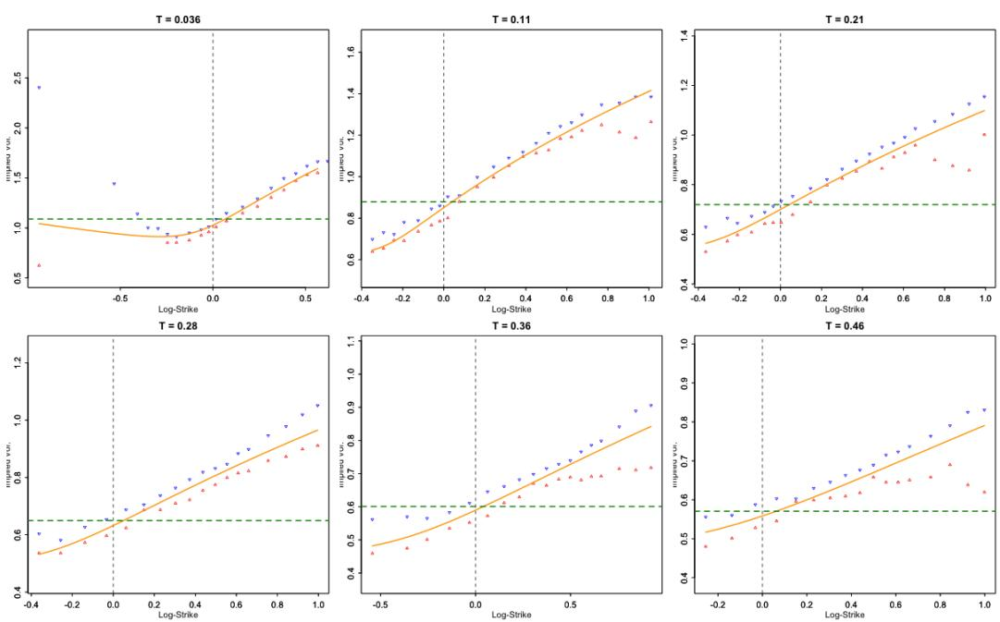

## 3 The Rough Bergomi (rBergomi) model

Despite the inconsistency with VIX smiles pointed out above, let’s nevertheless consider the simplest change of measure

$$
d W _ { s } ^ { \mathbb { P } } = d W _ { s } ^ { \mathbb { Q } } + \lambda ( s ) d s ,
$$

<!-- page: 11 -->

where $\lambda ( s )$ is a deterministic function of s. Then from (2.6), we would have

$$
\begin{array} { r c l } { { v _ { u } } } & { { = } } & { { { \mathbb { E } } ^ { { \mathbb { P } } } \left[ v _ { u } | { \mathcal F } _ { t } \right] { \mathcal E } \left( \eta \tilde { W } _ { t } ^ { { \mathbb Q } } ( u ) \right) \exp \left\{ \eta \sqrt { 2 H } \displaystyle \int _ { t } ^ { u } \frac { 1 } { ( u - s ) ^ { \gamma } } \lambda ( s ) d s \right\} } } \\ { { } } & { { } } & { { } } \\ { { } } & { { = } } & { { \xi _ { t } ( u ) { \mathcal E } \left( \eta \tilde { W } _ { t } ^ { { \mathbb Q } } ( u ) \right) } \ }  \end{array}\tag{3.1}
$$

where by definition, $\xi _ { t } ( u ) ~ = ~ \mathbb { E } ^ { \mathbb { Q } } \left[ v _ { u } | \mathcal { F } _ { t } \right]$ . Moreover, the forward variance curve

$$
\xi _ { t } ( u ) = \mathbb { E } ^ { \mathbb { P } } \left[ v _ { u } | \mathcal { F } _ { t } \right] \exp \left\{ \eta \sqrt { 2 H } \int _ { t } ^ { u } \frac { 1 } { ( u - s ) ^ { \gamma } } \lambda ( s ) d s \right\}
$$

is the product of two terms: $\mathbb { E } ^ { \mathbb { P } } \left[ v _ { u } | \mathcal { F } _ { t } \right]$ which depends on the history of the driving Brownian motion as explained earlier, and a term which depends on the price of risk $\lambda ( s )$

The model (3.1) is a non-Markovian generalization of the Bergomi model (1.5) which we might dub a rough Bergomi (or rBergomi) model. Specifically, this rBergomi model is non-Markovian in the instantaneous variance $v _ { t } \colon \mathbb { E } ^ { \mathbb { Q } } \left[ v _ { u } | \mathcal { F } _ { t } \right] \neq \mathbb { E } ^ { \mathbb { Q } } [ v _ { u } | v _ { t } ]$ but is Markovian in the (infinite-dimensional) state vector $\mathbb { E } ^ { \mathbb { Q } } \left[ v _ { u } | \mathcal { F } _ { t } \right] = \xi _ { t } ( u )$

Note also that with (3.1), we have achieved the aim we set out in the introduction by replacing the exponential kernels in the Bergomi model (1.5) with a power-law kernel. We may therefore expect that the rBergomi model will generate a realistic term structure of ATM volatility skew.

The observed anticorrelation between price moves and volatility moves may be modeled naturally, just as in the conventional Bergomi model, by anticorrelating the Brownian motion $W$ that drives the volatility process with the Brownian motion driving the price process. Thus

$$
\frac { d S _ { t } } { S _ { t } } = \sqrt { v _ { t } } d Z _ { t }
$$

with

$$
d Z _ { t } = \rho d W _ { t } + \sqrt { 1 - \rho ^ { 2 } } d W _ { t } ^ { \perp }
$$

where $\rho$ is the correlation between volatility moves and price moves.

## 3.1 Re-interpretation of the conventional Bergomi model

According to [2], the conventional Bergomi model is a market model, by which it is meant that $\xi _ { t } ( u )$ can be any given initial forward variance swap curve consistent with market prices. However, for the Bergomi model to properly describe the evolution of this curve, $\xi _ { t } ( u ) = \mathbb { E } \left[ v _ { u } | \mathcal { F } _ { t } \right]$ should be consistent with the assumed dynamics; in this sense, a conventional n-factor Bergomi model is not self-consistent in general.

<!-- page: 12 -->

Viewed from the perspective of the rBergomi model however, the initial curve $\xi _ { t } ( u )$ reflects the history $\{ W _ { s } ; s < t \}$ of the driving Brownian motion up to time t. The exponential kernels in the exponent of (1.5) approximate more realistic power-law kernels. The conventional two-factor Bergomi model is then justified in practice as a tractable Markovian engineering approximation to a more realistic rBergomi model.

## 4 Simulation of the rBergomi model

To simplify notation, we set the origin of the simulation to be $t = 0$ and drop the explicit reference to the pricing measure Q. From (3.1), the model to be simulated is

$$
\begin{array} { r c l } { { S _ { t } } } & { { = } } & { { S _ { 0 } { \mathcal E } \left( \displaystyle \int _ { 0 } ^ { t } \sqrt { v _ { u } } d Z _ { u } \right) } } \\ { { } } & { { } } & { { } } \\ { { v _ { u } } } & { { = } } & { { \xi _ { 0 } ( u ) { \mathcal E } \left( \eta \sqrt { 2 H } \displaystyle \int _ { 0 } ^ { u } \frac { 1 } { ( u - s ) ^ { \gamma } } d W _ { s } \right) = \xi _ { 0 } ( u ) { \mathcal E } \left( \eta \tilde { W } _ { u } \right) . } } \end{array}
$$

where $\tilde { W }$ is a Volterra process6 with the scaling property $\mathrm { V a r } [ \tilde { W } _ { u } ] = u ^ { 2 H }$ . So far $\tilde { W }$ behaves just like fBm. However, the dependence structure is diferent. Specifically, for $v > u$

$$
\mathbb { E } \left[ \tilde { W } _ { v } \tilde { W } _ { u } \right] = u ^ { 2 H } G \left( \frac { u } { v } \right)
$$

where, for $x \geq 1$

$$
\begin{array} { l l l } { G ( x ) } & { = } & { 2 { \cal H } \displaystyle \int _ { 0 } ^ { 1 } \frac { d s } { ( 1 - s ) ^ { \gamma } ( x - s ) ^ { \gamma } } } \\ & { = } & { \displaystyle \frac { 1 - 2 \gamma } { 1 - \gamma } x ^ { \gamma } _ { 2 } F _ { 1 } \left( 1 , \gamma , 2 - \gamma , x \right) } \end{array}\tag{4.1}
$$

where ${ } _ { 2 } F _ { 1 } ( \cdot )$ denotes the confluent hypergeometric function.

6This is identical up to a constant factor to the definition of [7].

<!-- page: 13 -->

Remark 4.1. The dependence structure of the Volterra process $\tilde { W }$ is markedly diferent from that of fBm with the Molchan-Golosov kernel. In particular, for small H, correlations drop precipitously as the ratio u/v moves away from 1.

We also need covariances of the Brownian motion $Z$ with the Volterra process $\tilde { W }$ . With $v \geq u .$ , these are given by

$$
{ \mathbb E } \left[ \tilde { W } _ { v } Z _ { u } \right] = \rho D _ { H } \left\{ v ^ { H + 1 / 2 } - ( v - u ) ^ { H + 1 / 2 } \right\}
$$

and

$$
\mathbb { E } \left[ Z _ { v } \tilde { W } _ { u } \right] = \rho D _ { H } u ^ { H + 1 / 2 }
$$

where for future convenience, we have defined the constant,

$$
D _ { H } = \frac { \sqrt { 2 H } } { H + 1 / 2 } .
$$

These two formulae may be conveniently combined as

$$
{ \mathbb E } \left[ \tilde { W } _ { v } Z _ { u } \right] = \rho D _ { H } \left\{ v ^ { H + 1 / 2 } - ( v - \operatorname* { m i n } ( u , v ) ) ^ { H + 1 / 2 } \right\} .
$$

Lastly, of course, for $v \geq u , \mathbb { E } \left[ Z _ { v } Z _ { u } \right] = u$

With m the number of time steps and n the number of simulations, our rBergomi model simulation algorithm may then be summarized as follows.

• Construct the joint covariance matrix for the Volterra process $\tilde { W }$ and the Brownian motion $Z$ and compute its Cholesky decomposition.

• For each time, generate iid normal random vectors and multiply them by the lower-triangular matrix obtained by the Cholesky decomposition to get a $m \times 2 n$ matrix of paths of $\tilde { W }$ and Z with the correct joint marginals.

• With these paths held in memory, we may evaluate the expectation under Q of any payof of interest.

The simulation procedure we have described is unsurprisingly very slow because of the high number of matrix-vector multiplications with a lowertriangular but otherwise dense matrix. We leave the search for faster simulation techniques based on the specific structure of the problem, including the specific choice of the correlation structure between $Z$ and $\tilde { W }$ for future research.

<!-- page: 14 -->

## 5 Consistency of the rBergomi model with the SPX volatility surface

As explained above, our simulation of the rBergomi model is very slow and this efectively rules out optimization in practice. However, the model parameters H, $\eta$ and $\rho$ have very direct interpretations. H controls the decay of the term structure of volatility skew for very short expirations whereas the product $\rho \eta$ sets the level of the ATM skew for longer expirations. Keeping the product $\rho \eta$ roughly constant but decreasing $\rho$ (so as to make it more negative) has the efect of pushing the minimum of each smile towards higher strikes. Thus, it is possible to guess parameters. Moreover, as we will show below, H and $\eta$ may be estimated from historical data. We will now show that on two particular days in history, the rBergomi model was surprisingly consistent with the observed volatility surface. Fits for other days we tried are not always as impressive as these two but nevertheless visibly superior to fits of conventional Markovian stochastic volatility models.

## 5.1 Parameter estimation from the time series of realized variance

Both the roughness parameter (or Hurst parameter) H and the volatility of volatility η should be the same under P and Q.

In [12], we estimated the RFSV model (1.1) on the Oxford-Man realized variance dataset obtaining the historical efective parameter estimates $H _ { e f f } \approx 0 . 1 4$ and volatility of volatility $\nu _ { e f f } \approx 0 . 3$ . Recall however that the instantaneous volatility $\sigma _ { t }$ is not observed; rather we observe the realized variance $\textstyle { \frac { 1 } { \delta } } \int _ { 0 } ^ { \delta } \sigma _ { t } ^ { 2 } d t$ where $\delta$ corresponds to a trading day from the open to the close, roughly $3 / 4$ of a whole day from close to close. Following the computation in Appendix C of [12], we may use these historical estimates to approximate the roughness and volatility of volatility corresponding to instantaneous volatility. This gives $H \approx 0 . 0 5$ and $\nu \approx 1 . 7$ . From Section 2, we have the relationship

$$
\eta = 2 \nu { \frac { C _ { H } } { \sqrt { 2 H } } } = 2 \nu \sqrt { { \frac { \Gamma ( 3 / 2 - H ) } { \Gamma ( H + 1 / 2 ) \Gamma ( 2 - 2 H ) } } }
$$

which yields the estimate $\eta \approx 2 . 5$

<!-- page: 15 -->

## 5.2 Estimation of the variance swap curve

Variance swaps are actively traded so in principle, computation of the forward variance swap curve should be straightforward. In practice however, it is not easy to obtain high quality variance swap quote data and in any case, the bid/ask spread is wide. We thus choose to proxy the value of a τ -maturity variance swap by the value of a τ -expiration log contract as explained for example in Chapter 11 of [10]. To price the log contract for a particular expiration τ requires us to know the prices of τ -expiration options for all strikes; of course prices are only quoted for a finite number of strikes. We therefore choose to interpolate and extrapolate observed implied volatilities using the arbitrage-free SVI parameterization of the volatility surface as explained in [11]. For any given day, we obtain the closing prices of SPX options for all available strikes and expirations from OptionMetrics (www.optionmetrics.com) via Wharton Research Data Services (WRDS). Having estimated variance swaps to each expiration, we interpolate total variances using a monotonic spline to estimate variance swaps for intermediate dates. This allows us in turn to estimate the the forward variance swap curve.

One subtlety is that by choosing SVI to interpolate and extrapolate, we may be assuming a smile that is inconsistent with the one generated by the rBergomi model, and therefore that the forward variance curve may not be accurate. The practical efect of this is that at-the-money implied volatilities are not matched in the first pass, with good agreement for very short expirations but rather less good agreement as time to expiry increases. A simple iteration on the forward variance curve soon reaches a fixed point that achieves consistency between model ATM volatilities and market ATM volatilities.

## 5.3 Fits to two specific days in history

## February 4, 2010

For our first comparison of the model to SPX options data, we choose February 4, 2010, a day when the ATM volatility term structure happened to be pretty flat. With guessed parameters $H = 0 . 0 7 , \eta = 1 . 9 , \rho = - 0 . 9$ , we obtain the impressive fit shown in Figure 5.1. Only three parameters to get a very good fit to the whole SPX volatility surface, including the shortest dated smile (Figure 5.2).

<!-- page: 16 -->

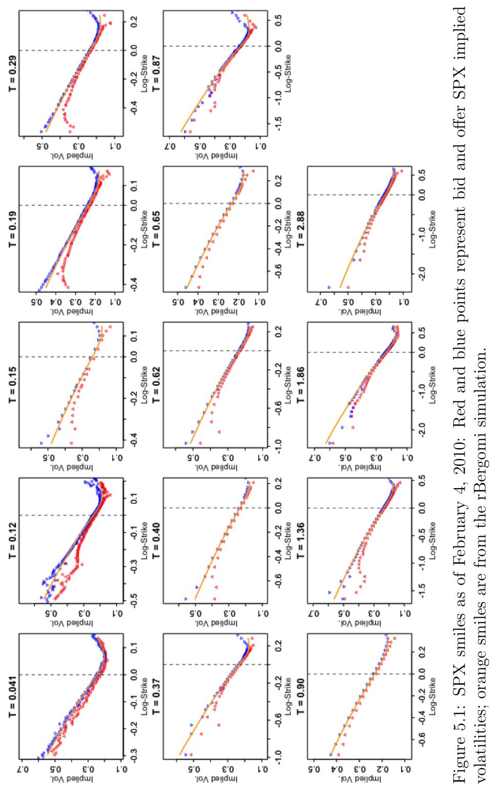

<!-- page: 17 -->

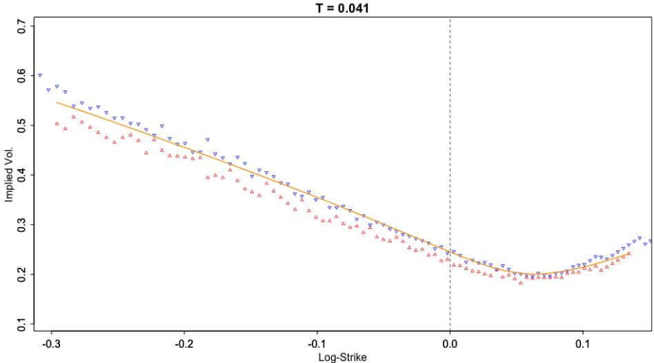

In Figures 5.3 and 5.4, we see just how well the rBergomi model can match empirical skews and vols. Recall also that the parameters we used are just guesses!

## August 14, 2013

For our second comparison, we choose a date just prior to an expiration date for SPX options. Rather than choosing the last Thursday of trading, we examine the volatility surface as of the close on the final Wednesday prior to expiration so that the shortest expiration smile is more meaningful; the latest such date available to us in our OptionMetrics data set is Wednesday August 14, 2013. With guessed parameters $H = 0 . 0 5 , \eta = 2 . 3 , \rho = - 0 . 9$ , we obtain the fit shown in Figure 5.5. Once again, only three parameters to get a very good fit to the whole SPX volatility surface, including the shortest dated smile (from options with only one day of trading left).

<!-- page: 18 -->

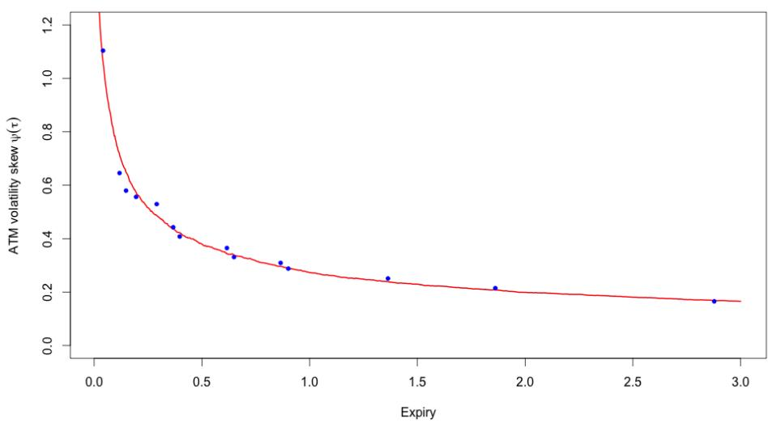

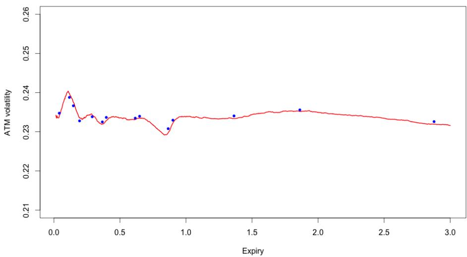

<!-- page: 19 -->

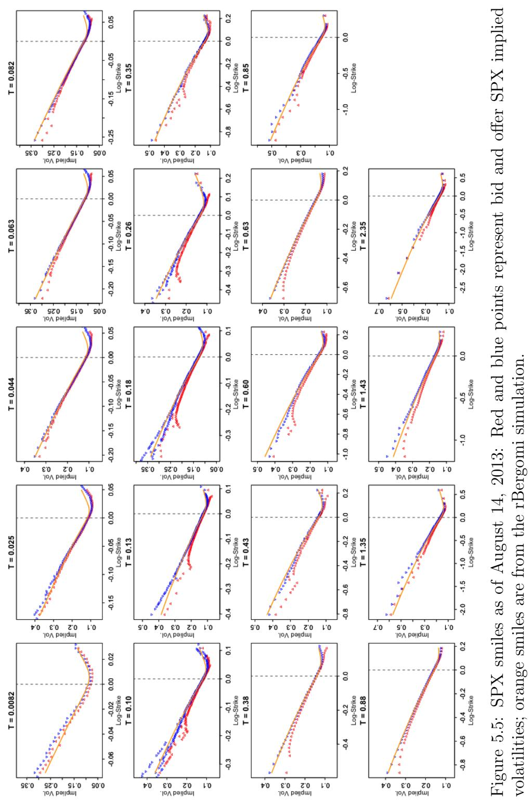

<!-- page: 20 -->

## 5.3.1 Jump-like behavior of the rBergomi price process

It has often been claimed that jumps are required to explain the observed extreme short-dated smile in SPX. In particular, in [4], Carr and Wu determine whether or not there are jumps in the asset process, and if so, whether such jumps are finite or infinite activity. They determine based on their analysis that jumps are required to generate the smiles observed in SPX. However, the class of processes that Carr and Wu consider is too restrictive, excluding models like rBergomi where the out-of-the-money smile explodes as time to expiration $\tau 0$ . It is apparent from Figures 5.1 and 5.5 that the rBergomi model (where the price process is continuous) generates smiles consistent with those observed empirically even $f o r$ very short expirations; there is no need for jumps.

## 6 The rBergomi model and VIX options

We pointed out earlier in Section 2.1 that observed VIX smiles are inconsistent with the rBergomi model. Nevertheless, even if the rBergomi model is misspecified, it may be possible to impute its parameters H and $\eta$ by examining the term structure of VIX variance swaps7; if VIX corresponds to volatility, then VIX of VIX should correspond to “volatility of volatility”.

Denote the terminal value of the VIX futures by $\sqrt { \zeta ( T ) }$ . Then, by definition8,

$$
\zeta ( T ) = \frac { 1 } { \Delta } \int _ { T } ^ { T + \Delta } \mathbb { E } [ v _ { u } | \mathcal { F } _ { T } ] d u .
$$

7The VIX log-strip forms the basis for the VVIX (VIX of VIX) index computation. Indeed, following CBOE (www.cboe.com), the VVIX term structure is computed every day (t) for various maturities $( T )$ of VIX options using the usual log-strip formula that is used for the construction of VIX. More specifically, given $T > t$ and assuming that VIX options with expiry $T$ are traded, the $\mathrm { V V I X } _ { t , T }$ is given by

$$
\mathrm { V V I X } _ { t , T } ^ { 2 } ( T - t ) = - 2 \mathbb { E } _ { t } \left[ \log \sqrt { \zeta ( T ) } - \log \sqrt { \zeta ( t ) } \right] ,
$$

where ζ(s) denotes the square of VIX at s and Et log pζ(T) can be expressed in terms of put and call prices on VIX with expiry T. The usual VVIX index (at a given t) then corresponds to VVIXt,t+∆ for ∆ equal to one month.

8See Chapter 11 of [10] for more details.

<!-- page: 21 -->

where $\Delta$ is one month. In the rBergomi model,

$$
v _ { u } = \xi _ { t } ( u ) \mathcal { E } \left( \eta \sqrt { 2 H } \int _ { t } ^ { u } \frac { d W _ { s } } { ( u - s ) ^ { \gamma } } \right)
$$

with $\gamma = 1 / 2 - H$ . Instantaneous variances $v _ { u }$ are thus lognormally distributed. It should therefore be a good approximation (and so it turns out) to assume that the VIX payof and its square $\zeta ( T )$ are also lognormally distributed. In that case, the terminal distribution of $\zeta ( T )$ is completely determined by E $\left[ \zeta ( T ) | \mathcal { F } _ { t } \right]$ and $\operatorname { V a r } [ \log \zeta ( T ) | \mathcal { F } _ { t } ]$

It is immediate that

$$
\mathbb { E } \left[ \zeta ( T ) | \mathcal { F } _ { t } \right] = \frac { 1 } { \Delta } \int _ { T } ^ { T + \Delta } { \xi _ { t } ( u ) d u } .
$$

To estimate the conditional variance of $\zeta ( T )$ , we approximate the arithmetic mean by the geometric mean as follows:

$$
\zeta ( T ) \approx \exp \left\{ \frac { 1 } { \Delta } \int _ { T } ^ { T + \Delta } \mathbb { E } [ \log v _ { u } | \mathcal { F } _ { T } ] d u \right\} .
$$

After some computation detailed in Appendix B, we obtain

$$
\mathrm { V a r } [ \log \zeta ( T ) | \mathcal { F } _ { t } ] \approx \eta ^ { 2 } ( T - t ) ^ { 2 H } f ^ { H } \left( \frac { \Delta } { T - t } \right)
$$

where

$$
f ^ { H } ( \theta ) = \frac { D _ { H } ^ { 2 } } { \theta ^ { 2 } } \int _ { 0 } ^ { 1 } \left[ ( 1 + \theta - x ) ^ { 1 / 2 + H } - ( 1 - x ) ^ { 1 / 2 + H } \right] ^ { 2 } d x .\tag{6.1}
$$

It is straightforward to show that $f ^ { H } ( \theta ) 1$ as $\theta 0$ which is the limit in which $\zeta ( T ) v _ { T }$ . In Appendix B we show further how to express $f ^ { H } ( \theta )$ explicitly in terms of the hypergeometric function. However, the above form (6.1) is more convenient for computation.

The VIX variance swaps $( V V I X ^ { 2 } )$ are then given by

$$
\begin{array} { r c l } { { V V I X _ { t , T } ^ { 2 } \left( T - t \right) } } & { { \approx } } & { { \mathrm { V a r } \left[ \log \sqrt { \zeta ( T ) } \right| \left. \mathcal { F } _ { t } \right] } } \\ { { } } & { { } } & { { } } \\ { { } } & { { \approx } } & { { \displaystyle \frac { 1 } { 4 } \eta ^ { 2 } ( T - t ) ^ { 2 H } f ^ { H } \left( \displaystyle \frac { \Delta } { T - t } \right) . } } \end{array}\tag{6.2}
$$

<!-- page: 22 -->

VIX variance swaps may also be estimated directly from market prices of options on VIX using the log-strip in the usual way as

$$
\begin{array} { r } { V V I X _ { t , T } ^ { 2 } \left( T - t \right) = - 2 \mathbb { E } \left[ \log \sqrt { \zeta ( T ) } - \log \sqrt { \zeta ( t ) } \Big \vert \mathcal { F } _ { t } \right] . } \end{array}\tag{6.3}
$$

By comparing the model VVIX term structure (6.2) with the market VVIX term structure (6.3), we can in principle fix the model parameters H and η.

## 6.1 The VVIX term structure in practice

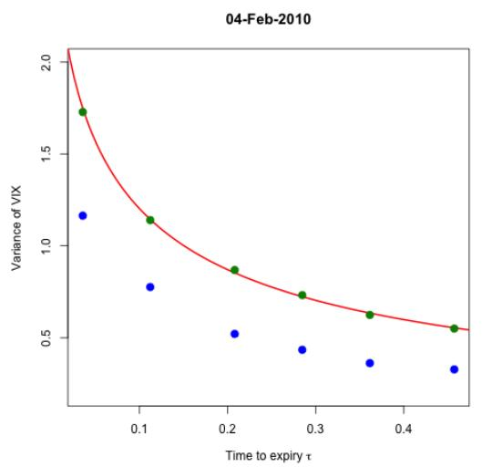

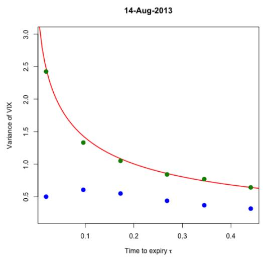

Recall that the parameters we used to obtain the reasonably impressive SPX fits of Section 5.3 were just guessed; specifically these parameters were as follows:

[Table source crop](assets/tables/2016-bayer-friz-gatheral-pricing-rough-volatility-p0022-block-0008-2a74aecc0dcf08a2.jpg)

<!-- page: 23 -->

In Figure 6.1, we show plots of equation (6.2) with the above parameters, superimposed on the empirically estimated variances of VIX. At least for February 4, 2010, given the qualitative agreement between the shape of the curve (6.2) and empirical estimates, it might be possible to argue some consistency of the rBergomi model with observation; for August 14, 2013 however, there is not even qualitative agreement. Whether this disagreement between model and market should be ascribed to a misspecified model, wrong market prices, or indeed both of these, is left for future research.

## 7 Volatility of volatility expansion

As simulation of the rBergomi model is so slow, one potential alternative is to estimate rBergomi parameters using an asymptotic expansion. Given a model expressed in variance curve form, Bergomi and Guyon [3] derive the following expression for the Black-Scholes implied volatility smile to second order in volatility of volatility:

$$
\sigma _ { \mathrm { B S } } ( k , t ) = \hat { \sigma } _ { T } + \mathcal { S } _ { T } \ : k + \mathcal { C } _ { T } \ : k ^ { 2 } + O ( \eta ^ { 3 } )\tag{7.1}
$$

where

$$
\begin{array} { l l l } { { \hat { \sigma } _ { T } } } & { { = } } & { { \displaystyle \sqrt { \frac w T } \left\{ 1 + \frac { 1 } { 4 w } C ^ { \alpha \xi } + \frac { 1 } { 3 2 w ^ { 3 } } \left( 1 2 \left( C ^ { \alpha \xi } \right) ^ { 2 } - w \left( w + 4 \right) C ^ { \xi \xi } + 4 w \left( w - 4 \right) C ^ { \mu } \right) \right\} } } \\ { { \displaystyle \mathcal { S } _ { T } } } & { { = } } & { { \displaystyle \sqrt { \frac w T } \left\{ \frac { 1 } { 2 w ^ { 2 } } C ^ { \alpha \xi } + \frac { 1 } { 8 w ^ { 3 } } \left( 4 w C ^ { \mu } - 3 ( C ^ { \alpha \xi } ) ^ { 2 } \right) \right\} } } \\ { { \displaystyle \mathcal { C } _ { T } } } & { { = } } & { { \displaystyle \sqrt { \frac w T } \frac { 1 } { 8 w ^ { 4 } } \left( 4 w C ^ { \mu } + w C ^ { \xi \xi } - 6 ( C ^ { \alpha \xi } ) ^ { 2 } \right) } } \end{array}
$$

and

$$
w = \int _ { 0 } ^ { T } \xi _ { 0 } ( s ) d s
$$

<!-- page: 24 -->

is total variance to expiration $T .$ . The autocorrelation functionals $C ^ { x \xi } , C ^ { \xi \xi }$ and $C ^ { \mu }$ have the following explicit expressions:

$$
\begin{array} { r c l } { { \displaystyle C ^ { x \xi } } } & { { = } } & { { \displaystyle \int _ { 0 } ^ { T } d t \int _ { t } ^ { T } d u \frac { \mathbb { E } [ d x _ { t } d \xi _ { t } ( u ) ] } { d t } } } \\ { { \displaystyle C ^ { \xi \xi } } } & { { = } } & { { \displaystyle \int _ { 0 } ^ { T } d t \int _ { t } ^ { T } d s \int _ { t } ^ { T } d u \frac { \mathbb { E } [ d \xi _ { t } ( s ) d \xi _ { t } ( u ) ] } { d s } } } \\ { { \displaystyle C ^ { \mu } } } & { { = } } & { { \displaystyle \int _ { 0 } ^ { T } d t \int _ { t } ^ { T } d u \frac { \mathbb { E } [ d x _ { t } d \xi _ { t } ( u ) ] } { d t } \frac { \delta C _ { t } ^ { x \xi } } { \delta \xi _ { t } ( u ) } } } \end{array}\tag{7.3}
$$

where the notation $\delta / \delta \xi _ { t } ( u )$ denotes a functional derivative.

In the case of the rBergomi model (3.1), we have

$$
\begin{array} { r c l } { \displaystyle \frac { d S _ { t } } { S _ { t } } } & { = } & { \sqrt { \xi _ { t } ( t ) } d Z _ { t } } \\ { \displaystyle \frac { d \xi _ { t } ( u ) } { \xi _ { t } ( u ) } } & { = } & { \eta \sqrt { 2 H } \displaystyle \frac { d W _ { t } } { ( u - t ) ^ { \gamma } } } \end{array}
$$

with $\mathbb { E } [ d Z _ { t } d W _ { t } ] = \rho d t$ so that

$$
\frac { \mathbb { E } \left[ d x _ { t } d \xi _ { t } ( u ) \right] } { d t } = \rho \eta \sqrt { 2 H } \sqrt { \xi _ { t } ( t ) } \frac { \xi _ { t } ( u ) } { ( u - t ) ^ { \gamma } } .
$$

The various autocorrelation functionals (7.3) may then be computed; explicit computations are presented in Appendix A.

## 7.1 Special case: Flat variance curve

The special case $\xi _ { 0 } ( u ) = \bar { \sigma } ^ { 2 } , u \ge 0$ where the initial forward variance curve is flat, is particularly instructive. First, from (A.1), we have

$$
\begin{array} { r c l } { { C ^ { x \xi } } } & { { = } } & { { \rho \eta \sqrt { 2 H } \displaystyle \int _ { 0 } ^ { T } \sqrt { \xi _ { t } ( s ) } d s \displaystyle \int _ { s } ^ { T } \xi _ { t } ( u ) \displaystyle \frac { d u } { ( u - s ) ^ { \gamma } } } } \\ { { } } & { { = } } & { { \rho \eta \bar { \sigma } ^ { 3 } E _ { H } { \cal T } ^ { H + 3 / 2 } . } } \end{array}\tag{7.4}
$$

where we have further defined

$$
E _ { H } = \frac { D _ { H } } { H + 3 / 2 } .
$$

<!-- page: 25 -->

Also, $w = \bar { \sigma } ^ { 2 } T$ . Substituting back into (7.2) and then (7.1) gives, to first order in η,

$$
\sigma _ { \mathrm { B S } } ( k , t ) = \bar { \sigma } + \frac { \rho \eta } { 2 } E _ { H } \frac { 1 } { T ^ { 1 / 2 - H } } \left( k + \frac { w } { 2 } \right) + O ( \eta ^ { 2 } )\tag{7.5}
$$

In particular, we see that to first order in $\eta ,$ , the term structure of at-themoney volatility skew is given by

$$
\psi ( \tau ) = \left. \frac { \partial \sigma _ { \mathrm { B S } } ^ { 2 } ( k , \tau ) } { \partial k } \right| _ { k = 0 } = \frac { \rho \eta } { 2 } E _ { H } \frac { 1 } { \tau ^ { \gamma } }
$$

with $\gamma = 1 / 2 - H$ . Similarly, substituting $\xi _ { 0 } ( u ) = \bar { \sigma } ^ { 2 }$ into (A.2) and $\mathrm { ( A . 3 ) }$ respectively gives the terms required for computation of the second order contribution:

$$
\begin{array} { r c l } { { C ^ { \xi \xi } } } & { { = } } & { { \eta ^ { 2 } \bar { \sigma } ^ { 4 } D _ { H } ^ { 2 } { \displaystyle \frac { T ^ { 2 + 2 H } } { 2 + 2 H } } } } \\ { { } } & { { } } & { { } } \\ { { C ^ { \mu } } } & { { = } } & { { { \displaystyle \frac { 1 } { 2 } \rho ^ { 2 } \eta ^ { 2 } \bar { \sigma } ^ { 4 } D _ { H } ^ { 2 } \left\{ 1 + { \displaystyle \frac { \Gamma ( H + 3 / 2 ) ^ { 2 } } { \Gamma ( 2 H + 3 ) } } \right\} { \displaystyle \frac { T ^ { 2 + 2 H } } { 2 + 2 H } } } . } } \end{array}
$$

It follows that to second order in $\eta _ { \mathrm { : } }$ , the term structure of at-the-money volatility skew is given by

$$
\psi ( \tau ) ~ = ~ \frac { \rho \eta } { 2 } E _ { H } \frac { 1 } { \tau ^ { \gamma } } + \frac { 1 } { 4 } \rho ^ { 2 } \eta ^ { 2 } \bar { \sigma } \tau ^ { 2 H } \left[ \frac { D _ { H } ^ { 2 } } { 1 + H } \left\{ 1 + \frac { \Gamma ( H + 3 / 2 ) ^ { 2 } } { \Gamma ( 2 H + 3 ) } \right\} - \frac { 3 } { 2 } E _ { H } ^ { 2 } \right] .\tag{7.6}
$$

## Numerical test

The dimensionless Bergomi-Guyon expansion parameter is $\lambda = \eta T ^ { H }$ . When H is very small, $\lambda \sim \eta$ for all reasonable expirations; with $H < 0 . 1$ as in Section $5 . 3 , \lambda \sim 1 . 9$ which is not small enough for the asymptotic expansion to converge, even at-the-money. With the much smaller value $\eta = 0 . 4$ , we see in Figure 7.1 very good agreement between the Bergomi-Guyon asymptotic skew formula (7.6) and the simulation.

We thus conclude that both our Bergomi-Guyon computations and the simulation are likely to be correct. Sadly however, the Bergomi-Guyon expansion does not converge with values of η consistent with the SPX volatility surface, so the Bergomi-Guyon expansion is not useful in practice for calibration of the rBergomi model.

<!-- page: 26 -->

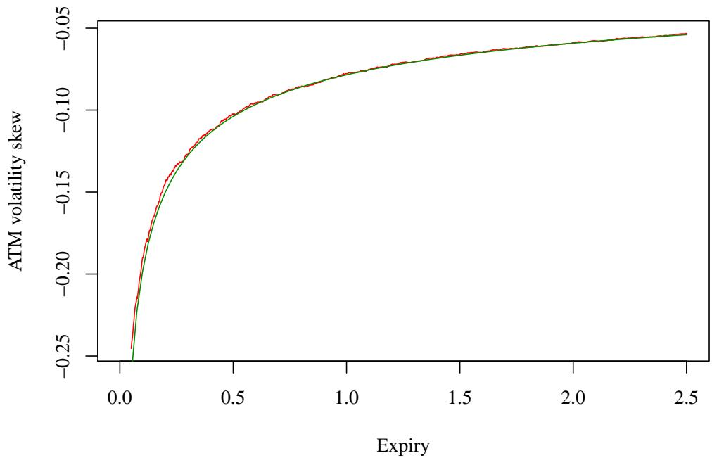

## 8 Forecasting the variance swap curve

Recall that in the RFSV model (1.1), log $v _ { t } \approx 2 \nu W _ { t } ^ { H } + C$ for some constant C. In [14], it is shown, assuming $H \in ( 0 , 1 / 2 ) , \Delta > 0$ , that $W _ { t + \Delta } ^ { H }$ is conditionally Gaussian with conditional expectation9

$$
\mathbb { E } [ W _ { t + \Delta } ^ { H } | \mathcal { F } _ { t } ] = \frac { \cos ( H \pi ) } { \pi } \Delta ^ { H + 1 / 2 } \int _ { - \infty } ^ { t } \frac { W _ { s } ^ { H } } { ( t - s + \Delta ) ( t - s ) ^ { H + 1 / 2 } } d s
$$

and conditional variance

$$
\mathrm { V a r } [ W _ { t + \Delta } ^ { H } | \mathcal { F } _ { t } ] = c \Delta ^ { 2 H }
$$

9Trivially E[WHt+∆|Ft] = WHt when either ∆ = 0 or H = 1/2. This corresponds to the singular behavior of the integrand, as either ∆ → 0 or H → 1/2, with the necessary compensation given by ∆H+1/2 cos(Hπ) ∼ 0 in these regimes.

<!-- page: 27 -->

$$
\mathbb { E } [ W _ { t + \Delta } ^ { H } | \mathcal { F } _ { t } ] = \frac { \cos ( H \pi ) } { \pi } \Delta ^ { H + 1 / 2 } \int _ { - \infty } ^ { t } \frac { W _ { s } ^ { H } } { ( t - s + \Delta ) ( t - s ) ^ { H + 1 / 2 } } d s .
$$

and conditional variance

$$
\mathrm { V a r } [ W _ { t + \Delta } ^ { H } | \mathcal { F } _ { t } ] = c \Delta ^ { 2 H }
$$

where

$$
c = \frac { \Gamma ( 3 / 2 - H ) } { \Gamma ( H + 1 / 2 ) \Gamma ( 2 - 2 H ) } .
$$

Thus, we obtain the following natural form for the RFSV predictor of the variance:

$$
\mathbb { E } ^ { \mathbb { P } } \left[ v _ { t + \Delta } \vert \mathcal { F } _ { t } \right] = \exp \left. \mathbb { E } ^ { \mathbb { P } } \left[ \log ( v _ { t + \Delta } ) \vert \mathcal { F } _ { t } \right] + 2 c \nu ^ { 2 } \Delta ^ { 2 H } \right.\tag{8.1}
$$

where

$$
\mathbb { E } ^ { \mathbb { P } } \left[ \log v _ { t + \Delta } | \mathcal { F } _ { t } \right] = \frac { \cos ( H \pi ) } { \pi } \Delta ^ { H + 1 / 2 } \int _ { - \infty } ^ { t } \frac { \log v _ { s } } { ( t - s + \Delta ) ( t - s ) ^ { H + 1 / 2 } } d s .\tag{8.2}
$$

The fair value of a τ -maturity variance swap is given (approximately) by

$$
\mathcal { V } _ { t } ( \tau ) = \frac { 1 } { \tau } \int _ { t } ^ { t + \tau } \mathbb { E } ^ { \mathbb { Q } } [ v _ { s } | \mathcal { F } _ { t } ] d s
$$

where $\mathbb { Q }$ is the risk neutral measure. If it were possible to ignore the change of measure so that

$$
\mathbb { E } ^ { \mathbb { Q } } [ v _ { s } | \mathcal { F } _ { t } ] = \mathbb { E } ^ { \mathbb { P } } [ v _ { s } | \mathcal { F } _ { t } ] ,
$$

it would be possible to forecast variance swap curves using (8.1). In fact, we will see that from the data, Q is close to $\mathbb { P }$ in this sense. We now proceed to compare forecast and actual variance swaps curves.

SPX variance curve forecasts are formed using the predictor (8.1) from the time series of daily realized variance estimates from same Oxford-Man dataset that was used in [12].

As for market variance swap curves, although there is an active market, it is not easy to obtain high quality variance swap quote data and in any case, the bid/ask spread is wide. We thus choose to proxy the value of a τ -maturity variance swap by the value of a τ -expiration log contract as explained for example in Chapter 11 of [10]. To price the log contract for a particular expiration τ requires us to know the prices of τ -expiration options for all strikes; of course prices are only quoted for a finite number of strikes. We therefore choose to interpolate and extrapolate observed implied volatilities using the arbitrage-free SVI parameterization of the volatility surface as explained in [11]. With closing prices of SPX options for all available strikes and expirations sourced from OptionMetrics (www.optionmetrics.com) via Wharton Research Data Services (WRDS), we follow the procedure just described to compute proxy variance swap curves each day from January 4, 1996 to August 30, 2013, a total of 4,443 days. We also need a suficient history to be able to compute a forecast. We end up with 2,681 days of forecast and actual variance swap curves from Jan 3, 2003 to August 31, 2013.

<!-- page: 28 -->

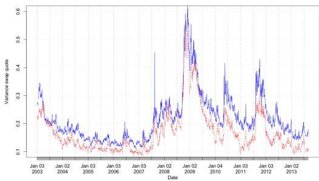

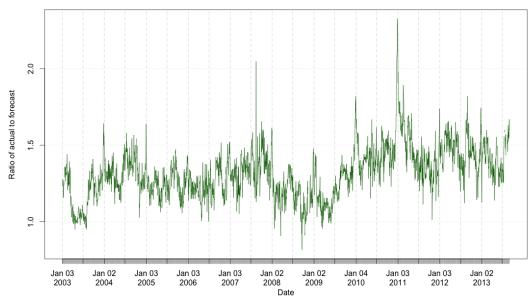

Plotting actual versus forecast 3-month variance swap curves in Figure 8.1, we immediately see that the actual variance swap curve is a factor (of roughly 1.4) higher than the forecast one, which we may attribute to overnight movements of the index. Recall that RV estimates are intraday from open to close. Realized variance forecasts must therefore be rescaled to obtain close-to-close realized variance forecasts as explained for example in [8] or alternatively using an econometric model such as the HEAVY model

<!-- page: 29 -->

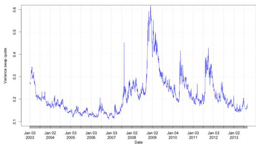

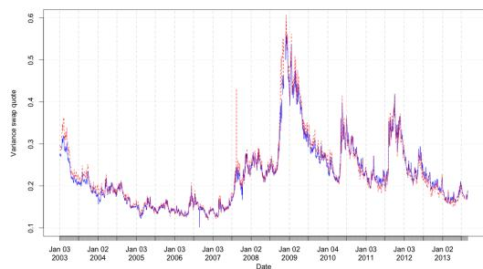

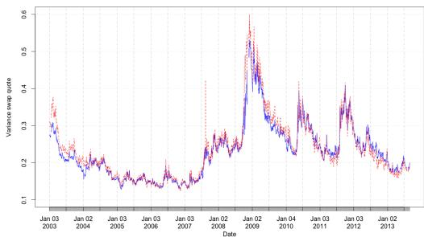

In Figure 8.2, we see that the 6-month, 9-month, and 12-month forecasts rescaled by the 3-month ratio of actual to forecast seem to be very consistent with actual variance swap quotes. This implies that although we can only forecast variance swap curves up to a factor, we can accurately forecast their shapes. We now demonstrate this further with two dramatic examples where the variance swap curve moved significantly from one day to the next. We will see that in both these cases, the evolution of the variance swap curve seems to be consistent with our model paradigm.

<!-- page: 30 -->

## 8.1 The collapse of Lehman Brothers

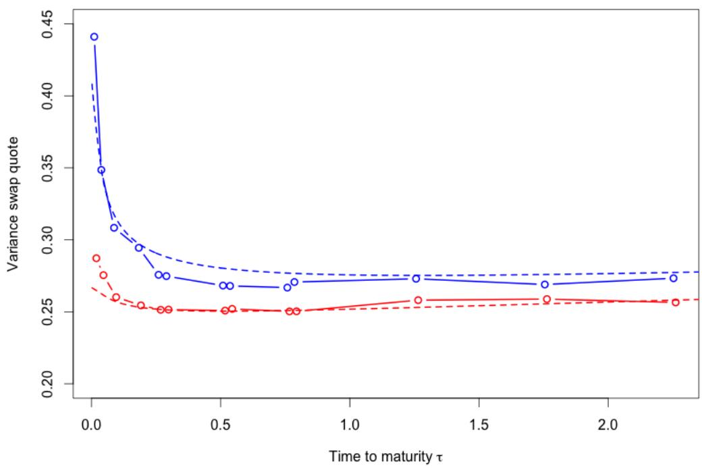

As an interesting experiment10, consider the evolution of the S&P variance swap curve over the weekend of the collapse of Lehman Brothers. As of the market close on Friday September 12, 2008, it was generally expected that Lehman Brothers would be rescued over the weekend. As of the market close on Monday September 15 however, there had been no rescue and the market was in crisis. In Figure 8.3, we plot the actual variance swaps curves as of the Friday and Monday market closes together with forecast curves rescaled by the 3-month ratio as of the close on Friday September 12 (which was 1.29). Perhaps surprisingly, it appears that most of the evolution of the variance swap curve may be explained by a single extra data point – intraday realized variance from the open to the close of trading on Monday September 15, 2008.

10Suggested by Peter Leoni of KU Leuven.

<!-- page: 31 -->

## 8.2 The Flash Crash

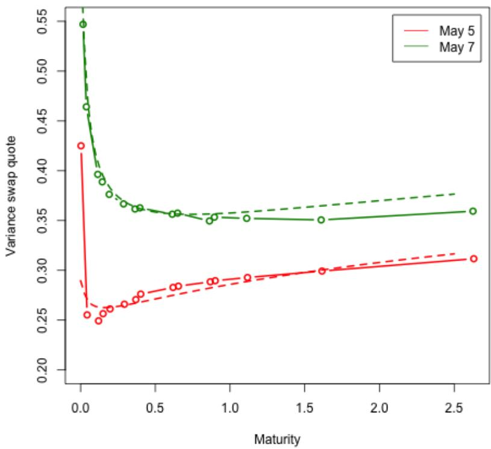

In the so-called Flash Crash of Thursday May 6, 2010, major US equity indices suddenly dropped by about 10% intraday only to recover within 30 minutes or so. Consequently, intraday realized variance for May 6 was much higher than normal. In Figure 8.4, using the same methodology as in Section

<!-- page: 32 -->

8.1, we plot the actual variance swap curves as of the Wednesday and Friday market closes together with forecast curves rescaled by the 3-month ratio as of the close on Wednesday May 5 (which was 2.52). We see that the actual variance curve as of the close on Friday is consistent with a forecast from the time series of realized variance that includes the anomalous price action of Thursday May 6. In Figure 8.5 we see that actual variance swap curve as of the following Monday close is no longer consistent with the forecast. However, if we drop the May 6 datapoint, we get a forecast that is much closer to the actual variance swap curve. The obvious explanation is that volatility traders realized over the weekend that the anomalous intraday price action of the Flash Crash should not influence future realized variance projections, adjusting index option quotes accordingly.

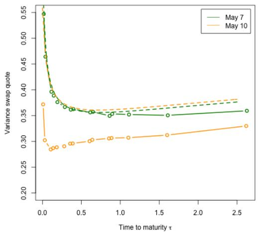

<!-- page: 33 -->

## 9 Summary and conclusions

The Rough Fractional Stochastic Volatility (RFSV) model of [12] is remarkably consistent with the time series of realized volatility for a wide range of diferent underlying assets. In this paper, we have shown that this model written under the physical measure P leads naturally to an options pricing model under Q that is remarkably consistent with the observed shape of the implied volatility surface in the particular case of SPX. A special case of this model where we assume a deterministic change of measure between P and Q turns out to be a non-Markovian extension of the well-known Bergomi model, which we consequently dub the Rough Bergomi (or rBergomi) model. The rBergomi model is particularly tractable and seems to fit the SPX volatility surface very well, despite our lack at this stage of an eficient computational algorithm. We computed terms Bergomi-Guyon expansion up to second order in volatility of volatility but the expansion parameter $\lambda = \eta \tau ^ { H } \approx 2$ required to fit SPX option prices is too big for this asymptotic expansion to be valid. However, we do not see agreement between the rBergomi model and the term structure of VIX volatility (VVIX).

Taken together, the present work and the econometric analysis of [12] ofer a (perhaps even the first) promising paradigm for the understanding of asset price formation all the way from a basic microstructure description at the order book level to option pricing. Not least, our framework allows for accurate prediction of the volatility surface from high-frequency price data. More eficient computational methods and a more thorough investigation of the market implied change of measure $d \mathbb { Q } / d \mathbb { P }$ are left for further research.

<!-- page: 34 -->

## A Computation of Bergomi-Guyon autocorrelation functionals in the rBergomi model

Computation of $C ^ { x \xi }$

$$
\begin{array} { l l l } { { C _ { t } ^ { x \xi } } } & { { = } } & { { \displaystyle \int _ { t } ^ { T } d s \int _ { s } ^ { T } d u \frac { \mathbb { E } \left[ d x _ { s } d \xi _ { s } ( u ) \right] } { d s } } } \\ { { \mathrm { } } } & { { = } } & { { \displaystyle \rho \eta \sqrt { 2 H } \int _ { t } ^ { T } d s \int _ { s } ^ { T } \mathbb { E } \left[ \left. \sqrt { \xi _ { s } ( s ) } \xi _ { s } ( u ) \right| \mathcal { F } _ { t } \right] \frac { d u } { ( u - s ) ^ { \gamma } } } } \\ { { \mathrm { } } } & { { = } } & { { \displaystyle \rho \eta \sqrt { 2 H } \int _ { t } ^ { T } \sqrt { \xi _ { t } ( s ) } d s \int _ { s } ^ { T } \xi _ { t } ( u ) \frac { d u } { ( u - s ) ^ { \gamma } } + \mathcal { O } ( \eta ^ { 3 } ) . } } \end{array}\tag{A.1}
$$

Computation of $C ^ { \xi \xi }$

By definition,

$$
\begin{array} { r c l } { { C ^ { \xi \xi } } } & { { = } } & { { \displaystyle \int _ { 0 } ^ { T } d t \int _ { t } ^ { T } d u \int _ { t } ^ { T } d s \frac { \mathbb { E } \left[ d \xi _ { t } ( s ) d \xi _ { t } ( u ) \right] } { d t } } } \\ { { } } & { { = } } & { { \displaystyle \int _ { 0 } ^ { T } d t \int _ { t } ^ { T } d u \int _ { t } ^ { T } d s \frac { \eta ^ { 2 } 2 H } { ( u - t ) ^ { \gamma } ( s - t ) ^ { \gamma } } \xi _ { t } ( s ) \xi _ { t } ( u ) } } \\ { { } } & { { = } } & { { \displaystyle \eta ^ { 2 } 2 H \int _ { 0 } ^ { T } d t \left( \int _ { t } ^ { T } \frac { \xi _ { t } ( u ) } { ( u - t ) ^ { \gamma } } d u \right) ^ { 2 } } } \\ { { } } & { { = } } & { { \displaystyle \eta ^ { 2 } 2 H \int _ { 0 } ^ { T } d t \left( \int _ { t } ^ { T } \frac { \xi _ { 0 } ( u ) } { ( u - t ) ^ { \gamma } } d u \right) ^ { 2 } + \mathcal { O } ( \eta ^ { 4 } ) . } } \end{array}\tag{A.2}
$$

Computation of $C ^ { \mu }$

By definition,

$$
C ^ { \mu } = \int _ { 0 } ^ { T } d t \int _ { t } ^ { T } d u \frac { \mathbb { E } \left[ d x _ { t } d \xi _ { t } ( u ) \right] } { d t } \frac { \delta C _ { t } ^ { x \xi } } { \delta \xi _ { t } ( u ) }
$$

<!-- page: 35 -->

and from (A.1) above,

$$
\begin{array} { r c l } { \displaystyle \frac { \delta C _ { t } ^ { x \xi } } { \delta \xi _ { t } ( v ) } } & { = } &  \displaystyle \rho \eta \sqrt { 2 H } \left\{ \int _ { t } ^ { T } { d s \sqrt { \xi _ { t } ( s ) } \frac { 1 } { ( v - s ) ^ { \gamma } } \mathbf { 1 } _ { v > s } + \frac { 1 } { 2 \sqrt { \xi _ { t } ( v ) } } \int _ { v } ^ { T } { \xi _ { t } ( u ) \frac { d u } { ( u - v ) ^ { \gamma } } } \right\} } \\ { \displaystyle } & { = } &  \displaystyle \rho \eta \sqrt { 2 H } \left\{ \int _ { t } ^ { v } { d s \sqrt { \xi _ { t } ( s ) } \frac { 1 } { ( v - s ) ^ { \gamma } } + \frac { 1 } { 2 \sqrt { \xi _ { t } ( v ) } } \int _ { v } ^ { T } { \xi _ { t } ( u ) \frac { d u } { ( u - v ) ^ { \gamma } } } \right\} . } \end{array}
$$

Thus

$$
\begin{array} { r l } { C ^ { n } = } & { \rho ^ { 2 } \eta ^ { 2 } 2 H \int _ { 0 } ^ { \pi } \sqrt { \xi _ { \xi } ( t ) } d t \int _ { t } ^ { \pi } d n \frac { \xi ( u ) } { ( u - t ) ^ { \pi } } } \\ & { \qquad \times \left\{ \int _ { t } ^ { u } d s \sqrt { \xi _ { \xi } ( s ) } \frac { 1 } { ( u - s ) ^ { \pi } } + \frac { 1 } { 2 } \frac { 1 } { \sqrt { \xi _ { \xi } ( u ) } } \int _ { s } ^ { \pi } \xi _ { \xi } ( s ) \frac { d s } { ( s - u ) ^ { \pi } } \right\} } \\ & { = \rho ^ { 2 } \eta ^ { 2 } 2 H \int _ { 0 } ^ { \pi } \sqrt { \xi _ { \xi } ( t ) } d t \int _ { t } ^ { \pi } \frac { d u } { ( u - t ) ^ { \pi } } } \\ & { \qquad \times \left\{ \int _ { t } ^ { u } \sqrt { \xi _ { \xi } ( s ) } \frac { \xi _ { \xi } ( u ) } { ( u - s ) ^ { \pi } } d s + \frac { 1 } { 2 } \sqrt { \xi _ { \xi } ( u ) } \int _ { u } ^ { T } \frac { \xi _ { \xi } ( s ) } { ( s - u ) ^ { \pi } } d s \right\} } \\ & { = \rho ^ { 2 } \eta ^ { 2 } 2 H \int _ { 0 } ^ { \pi } \sqrt { \xi _ { \Theta } ( \tilde { u } ) } d t \int _ { t } ^ { \pi } \frac { d u } { ( u - t ) ^ { \pi } } } \\ & { \qquad \times \left\{ \int _ { t } ^ { u } \sqrt { \xi _ { \xi } ( s ) } \frac { \xi _ { \Theta } ( u ) } { [ u - s ] ^ { \pi } } d s + \frac { 1 } { 2 } \sqrt { \xi _ { \Theta } ( \tilde { u } ) } \int _ { s } ^ { \pi } \frac { \xi _ { \Theta } ( s ) } { [ u - u ] ^ { \pi } } d s \right\} + \mathcal { O } ( \eta ^ { \tilde { \pi } } ) , } \end{array}\tag{A.3}
$$

For any given initial forward variance curve $\xi _ { 0 } ( u )$ , the above expressions for $C ^ { x \xi } , C ^ { \xi \xi }$ and $C ^ { \mu }$ may be easily computed numerically.

## B Approximate variance of VIX

Let $y _ { u } = \log v _ { u }$ and consider the following approximation of the arithmetic mean by the geometric mean:

$$
\psi ( T ) = { \frac { 1 } { \Delta } } \int _ { T } ^ { T + \Delta } \mathbb { E } [ v _ { u } | { \mathcal { F } } _ { T } ] d u \approx \exp \left\{ { \frac { 1 } { \Delta } } \int _ { T } ^ { T + \Delta } \mathbb { E } [ y _ { u } | { \mathcal { F } } _ { T } ] d u \right\} .
$$

<!-- page: 36 -->

Apart from $\mathcal { F } _ { t }$ measurable terms (abbreviated as $\mathrm { ^ { 6 6 } d r i f t } ^ { \prime \prime } )$ , we have

$$
\begin{array} { l } { { \displaystyle \int _ { T } ^ { T + \Delta } E [ y _ { u } | \mathcal { F } _ { T } ] d u = \eta \sqrt { 2 H } \int _ { t } ^ { T } \frac { d W _ { s } } { ( u - s ) ^ { \gamma } } d u + \mathrm { d r i f t } } \ ~ } \\ { { \displaystyle ~ = \eta \sqrt { 2 H } \int _ { t } ^ { T } \int _ { T } ^ { T + \Delta } \frac { d u } { ( u - s ) ^ { \gamma } } d W _ { s } + \mathrm { d r i f t } } \ ~ } \\ { { \displaystyle ~ = \eta \frac { \sqrt { 2 H } } { 1 - \gamma } \int _ { t } ^ { T } \left[ ( T + \Delta - s ) ^ { 1 - \gamma } - ( T - s ) ^ { 1 - \gamma } \right] d W _ { s } + \mathrm { d r i f t } . } } \end{array}
$$

This gives

$$
\begin{array} { r c l } { { \mathrm { V a r } [ \log \psi ( T ) | \mathcal { F } _ { t } ] } } & { { \approx } } & { { \displaystyle \frac { \eta ^ { 2 } D _ { H } ^ { 2 } } { \Delta ^ { 2 } } \int _ { t } ^ { T } \left[ ( T + \Delta - s ) ^ { 1 / 2 + H } - ( T - s ) ^ { 1 / 2 + H } \right] ^ { 2 } d s } } \\ { { } } & { { = } } & { { \displaystyle \eta ^ { 2 } ( T - t ) ^ { 2 H } f ^ { H } \left( \displaystyle \frac { \Delta } { T - t } \right) } } \end{array}
$$

where

$$
D _ { H } = \frac { \sqrt { 2 H } } { H + 1 / 2 }
$$

and

$$
f ^ { H } ( \theta ) = \frac { D _ { H } ^ { 2 } } { \theta ^ { 2 } } \int _ { 0 } ^ { 1 } \left[ ( 1 + \theta - x ) ^ { 1 / 2 + H } - ( 1 - x ) ^ { 1 / 2 + H } \right] ^ { 2 } d x .
$$

To compute this integral explicitly, we use that, for $\kappa = 1 / 2 + H$ 2

$$
\begin{array} { r l r } {  { \int _ { t } ^ { T } ( T + \Delta - s ) ^ { \kappa } ( T - s ) ^ { \kappa } d s = \int _ { 0 } ^ { \tau } ( s + \Delta ) ^ { \kappa } s ^ { \kappa } d s } } \\ & { } & { = \frac { \tau ( \Delta \tau ) ^ { \kappa } } { 1 + \kappa } { _ 2 F _ { 1 } } ( - ( H + 1 / 2 ) , 3 / 2 + H , 5 / 2 + H , - \tau / \Delta ) . } \end{array}
$$

Thus, we get

$$
\begin{array} { l } { \displaystyle \mathrm { V a r } [ \log \psi ( T ) | \mathcal { F } _ { t } ] \approx \frac { 2 H \eta ^ { 2 } } { \Delta ^ { 2 } } \bigg [ \frac { ( \tau + \Delta ) ^ { 2 ( H + 1 ) } - \Delta ^ { 2 ( H + 1 ) } + \tau ^ { 2 ( H + 1 ) } } { 2 ( H + 1 ) } } \\ { \displaystyle \qquad - 2 \frac { \tau ( \tau \Delta ) ^ { H + 1 / 2 } } { H + 3 / 2 } { } _ { 2 } F _ { 1 } \left( - ( H + \frac 1 2 ) , H + \frac 3 2 , H + \frac 5 2 , - \frac { \tau } { \Delta } \right) \bigg ] } \end{array}
$$

with $\tau : = T - t$

<!-- page: 37 -->

## References

[1] E. Al\`os, J. A. Le´on, and J. Vives. On the short-time behavior of the implied volatility for jump-difusion models with stochastic volatility. Finance and Stochastics, 11(4):571–589, Aug. 2007. [2] L. Bergomi. Smile dynamics II. Risk October, pages 67–73, 2005. [3] L. Bergomi and J. Guyon. Stochastic volatility’s orderly smiles. Risk May, pages 60–66, 2012. [4] P. Carr and L. Wu. What type of process underlies options? A simple robust test. Journal of Finance, 58(6):2581–2610, 2003. [5] P. Cheridito, H. Kawaguchi, and M. Maejima. Fractional Ornstein-Uhlenbeck processes. Electron. J. Probab, 8(3):14, 2003. [6] F. Comte, L. Coutin, and E. Renault. Afine fractional stochastic volatility models. Annals of Finance, 8(2-3):337–378, 2012. [7] F. Comte and E. Renault. Long memory continuous time models. Journal of Econometrics, 73(1):101–149, 1996. [8] F. Corsi, N. Fusari, and D. La Vecchia. Realizing smiles: Options pricing with realized volatility. Journal of Financial Economics, 107(2):284–304, 2013. [9] M. Fukasawa. Asymptotic analysis for stochastic volatility: Martingale expansion. Finance and Stochastics, 15(4):635–654, 2011. [10] J. Gatheral. The volatility surface: A practitioner’s guide. John Wiley & Sons, 2006. [11] J. Gatheral and A. Jacquier. Arbitrage-free SVI volatility surfaces. Quantitative Finance, 14(1):59–71, 2014. [12] J. Gatheral, T. Jaisson, and M. Rosenbaum. Volatility is rough. Available at SSRN 2509457, 2014. [13] D. Noureldin, N. Shephard, and K. Sheppard. Multivariate highfrequency-based volatility (heavy) models. Journal of Applied Econometrics, 27(6):907–933, 2012.

<!-- page: 38 -->

[14] C. J. Nuzman and V. H. Poor. Linear estimation of self-similar processes via Lamperti’s transformation. Journal of Applied Probability, 37(2):429–452, 2000.
