<!-- page: 1 -->

# **Bartlett’s delta in the SABR model** 

**Patrick S. Hagan Andrew Lesniewski** Gorilla Science Department of Mathematics PatHagan@GorillaSci.Com Baruch College One Bernard Baruch Way New York, NY 10010 USA 

First draft: April 14, 2016 This draft: May 6, 2020

<!-- page: 2 -->

### **Abstract** 

The presence of stochastic volatility in an option model impacts the values of the hedge ratios (the “greeks”), and in particular the option delta. In the context of the SABR model, the greeks were calculated in [4] based on the asymptotic expression for the implied volatility derived there. In [2], the option delta of [4] was modified to take into account the effects of the correlation between the dynamics of the forward and the stochastic volatility. It was empirically observed there that the modified delta (“Bartlett’s delta”) provides a more accurate and robust hedging strategy than the original SABR delta. In this paper we refine the analysis of hedging strategies carried out in [2]. In particular, we provide a justification of the empirical observations regarding the robustness of the modified delta. This is done by means of an asymptotic analysis of the explicit expression for the implied volatility derived in [4]. In particular, we show that the modified option delta is practically insensitive to the choice of the the CEV parameter _β_ .

<!-- page: 3 -->

## **1 Introduction** 

The key requirement of an option model, in addition to its utility as an accurate pricing tool, is its ability to produce reliable risk metrics. This allows the portfolio manager or market maker to confidently put on appropriate hedges on his options positions in a way that reflects his view or mandate. 

The presence of stochastic volatility in an option model impacts the values of the the option greeks, and in particular the option delta. In this note we are concerned with hedging under the SABR model of volatility smile ([4], [7], [5]). Originally, the values of the greeks under the SABR model were calculated in [4] based on the asymptotic expression for the implied volatility. In [2], the option delta proposed in [4] was modified to take into account the effects of the correlation between the dynamics of the forward and the stochastic volatility. It was empirically observed there that the modified delta provides a more accurate and robust hedging strategy than the original SABR delta. 

The results described below are a refinement of the work presented in [2]. The SABR model’s specification requires four parameters _σ, α, β, ρ_ , whose values are calibrated to options market prices. According to the prevailing market practice, one of these parameters, the CEV exponent _β_ is usually set to a pre-specified value, while the remaining three parameters are optimized. This practice is justified by the fact that there is a degree of redundancy between the CEV exponent _β_ and the correlation parameter _ρ_ in the SABR parameterization of the smile curve. While this choice introduces a higher degree of stability of the model parameters, it brings up the question whether the resulting hedges are equally robust, i.e. whether the choice of _β_ made by the portfolio manager has a significant impact on the hedging strategy. 

It was argued in [2] that the modified delta ∆mod introduced there leads to more robust hedges than the classic SABR delta [4], namely, across a large range of strikes, it is nearly independent of the choice of _β_ . This claim was supported there by empirical and numerical arguments, see also [1], [5], and [8]. The purpose of this note is to provide a theoretical justification of this claim. This is done by means of an asymptotic analysis of the explicit expression for the implied volatility derived in [4]. Furthermore, we show here that the modified delta of an at the money option is exactly independent of the choice of _β_ . 

The robustness of ∆mod is of direct and measurable practical significance. Proper hedging allows the portfolio manager or market maker better implement his views, which may have an impact on his P&L. Accurate hedge ratios allow for reliable portfolio return attribution, which facilitates his communication with the management, clients, and auditors. Also, from the perspective of regulatory requirements and model risk management, the advantage of the modified SABR delta is clear. It provides a robust option delta, which is insensitive to possible model misspecification, and it thus is a model risk mitigant. 

We consider a European call or put struck at _K_ and expiring in _τ_ years from the current time, and let _F_ denote the current value of the underlying forward. The implied volatility curve is a function _σ_imp = _σ_imp ( _τ, F, K, σ_ ) such that when combined with the Black-Scholes formula, it yields (close approximations to) the market option prices. Two market observable quantities are of particular interest to option traders: the at the money implied volatility, 

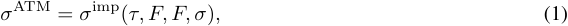

and the skew, 

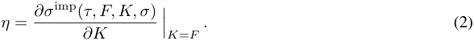

The latter is the slope of the volatility curve calculated at the money. These two quantities are model independent, and can be directly inferred from option prices. Any reasonable volatility smile model, regardless of its specification, can be calibrated so that these two quantities match the market values sufficiently closely. 

Our main results is that, for each strike _K_ , the modified SABR delta ∆mod has approximately the following structure: 

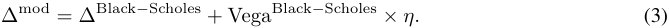

In other words, other than the standard Black-Scholes greeks calculated for strike _K_ , the modified SABR delta does not involve any details of the smile model specification. In contrast, the standard SABR delta has the structure 

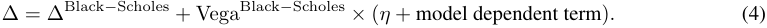

<!-- page: 4 -->

The last term in the expression above is responsible for potential mishedging in case of model miscalibration discussed in [2]. 

## **2 The SABR model** 

The dynamics of the SABR model of option implied volatility is specified in terms of two state variables: the forward _Ft_ and the instantaneous volatility _σt_ . Explicitly, the dynamics is given by the system of stochastic differential equations: 

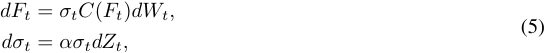

where _Wt_ and _Zt_ are two Brownian motions with 

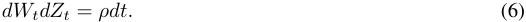

The positive function _C_ ( _F_ ) determines the backbone of the volatility smile, and is usually assumed to be of the CEV form 

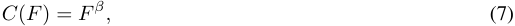

where _β ≤_ 1 is the CEV parameter1 . This will be our default choice in the following. 

The normal implied volatility in the SABR model is given by the following asymptotic expression [4] in the (small) parameter _ε_ = _α_2 _τ_ : 

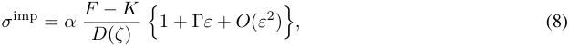

where _F_ denotes here the currently observed value of the forward. The distance function _D_ ( _ζ_ ) entering the formula above is given by 

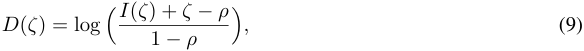

where 

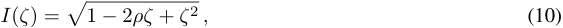

and where 

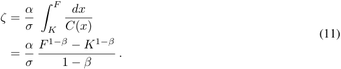

The parameter _σ_ denotes the currently observed value of the instantaneous volatility. 

Various forms of the first order correction Γ have been derived in the literature, see [6] for discussion and recent results. The original version [4] is explicitly given by 

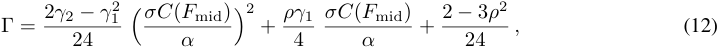

where 

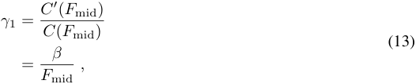

> 1In order to handle negative forward rates in interest rate markets, some practitioners choose _C_ ( _F_ ) = ( _F_ + _θ_ ) _β_ , with _θ >_ 0.

<!-- page: 5 -->

and 

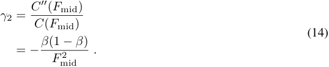

The value _F_ mid denotes a conveniently chosen midpoint between _F_ and _K_ (such as the arithmetic average ( _F_ + _K_ ) _/_ 2). 

It follows from (8) that the at the money volatility in the SABR model is given by 

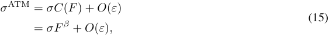

while the skew is 

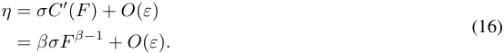

## **3 SABR greeks** 

In this section we derive explicit expressions for the greeks in the SABR model, and in particular we obtain the modified delta and vega of [2]. To focus attention we use the normal Black-Scholes model as the basis for option pricing, and assume that the discounting interest rate is zero. We let _T_ denote the date on which the option expires and denote by _τ_ = _T − t_ the time to expiration. 

Let _B_ denote the standard Black-Scholes pricing function in the normal model, i.e. 

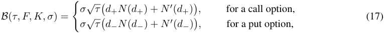

where _N_ ( _x_ ) denotes the cumulative normal distribution, and where 

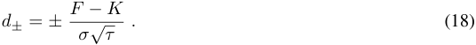

Then the current time _t_ price _Pt_ of an option expiring at time _T_ under the SABR model is then given by 

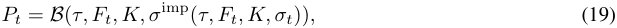

where _σ_imp is given by (8). We should emphasize that this expression is only an approximation to the true SABR option price, to the degree to which the asymptotic implied formula (8) represents an accurate approximation to the true, analytically unknown expression for the SABR implied volatility (see [5] for an extensive discussion). 

We decompose the Brownian motion _Zt_ into _Wt_ and a Brownian motion _Wt__⊥_,independent of_Wt_:_Zt_= _ρWt_ +�1 _− ρ_2 _Wt__⊥_. Then,_dσt_can be written as a sum of_ρα/C_(_Ft_)_dFt_and a contribution_dσ_ _t__⊥_uncorrelated with _dFt_ , namely _dσt__⊥_=_ασtdW_ _t__⊥_.From Ito’s lemma we obtain: 

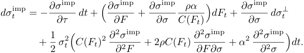

This yields the following risk decomposition: 

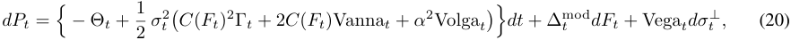

<!-- page: 6 -->

where the first and second order greeks are defined as follows: 

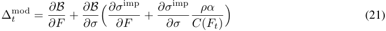

is the modified SABR delta, 

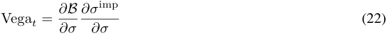

is the SABR vega, 

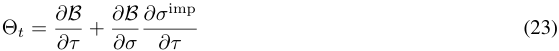

is the SABR time decay, 

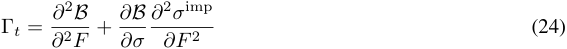

is the SABR gamma, 

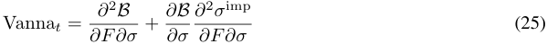

is the SABR vanna, and 

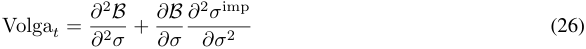

is the SABR volga. Formula (20) represents a risk decomposition of an option in terms of independent risk factors _dF_ and _dσ__⊥_ , time decay, and second order greeks. 

Alternatively, we can represent _Wt_ in terms of _Zt_ and its independent complement _Zt__⊥_as_Wt_=_ρZt_+ ~~�~~ 1 _− ρ_2 _dZt__⊥_, and arrive at the following risk decomposition: 

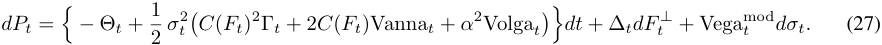

Here, the meaning of the greeks is as follows: 

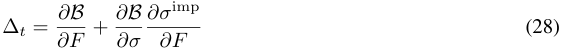

is the standard SABR delta, and 

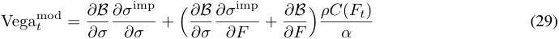

is the modified SABR vega. Formula (27) is a decomposition of an option’s risk in terms of an alternative basis of independent risk factors, namely _dF__⊥_ and _dσ_ . 

The two decompositions show that part of the option’s volatility sensitivity can be viewed as a component of its delta or its vega, depending on risk management approach. We take the view that it should be allocated to the delta risk, as monitoring and executing delta hedges are generally easier than vega hedges. Note also that the second order greeks do not contain any correlation dependent correction terms, and retain their form under both decompositions. 

## **4** 

We will now turn to the main point of this note and derive an explicit asymptotic expression for the modified SABR delta. Taking derivatives of (8) we find that, to within the leading order in _ε_ , 

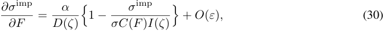

<!-- page: 7 -->

and 

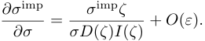

In the following, in order not to overburden the formulas, we will be suppressing the terms _O_ ( _ε_ ). It should be understood though that all formulas stated below are accurate to within _O_ ( _ε_ ). Now note that, for _ζ_ small, we have 

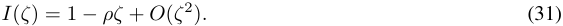

As a consequence, the factor entering the modified delta (21) can be written as 

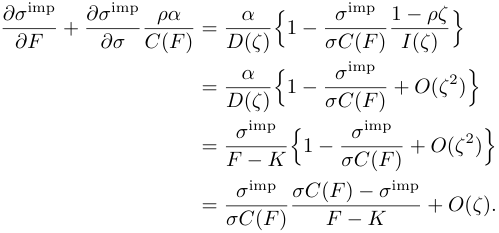

In the limit _K → F_ , we have _σ_imp _→ σC_ ( _F_ ), and hence 

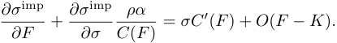

As a result of these calculations, the modified SABR delta is given by 

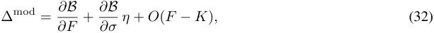

as claimed in the Introduction. Note that, to the leading order in the option moneyness, this expression is independent of the details of the backbone function _C_ ( _F_ ), it only depends on the implied volatility for the strike _K_ and the skew _η_ . Both of these quantities are market observable, and the calibrated model fits them. This explains the empirical observation made in [2] that the modified SABR delta is practically insensitive to the choice of the parameter _β_ , once the remaining parameters have been optimized. In particular, the expression above shows that the modified delta of an at the money option, _K_ = _F_ , is independent of the choice of _β_ . 

This is to be contrasted with the behavior of the classic SABR delta. Indeed, we have 

and therefore 

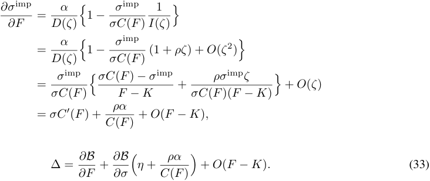

In other words, the classic SABR delta, and thus the corresponding hedging strategy, depends on the choice of the backbone function _C_ ( _F_ ).

<!-- page: 8 -->

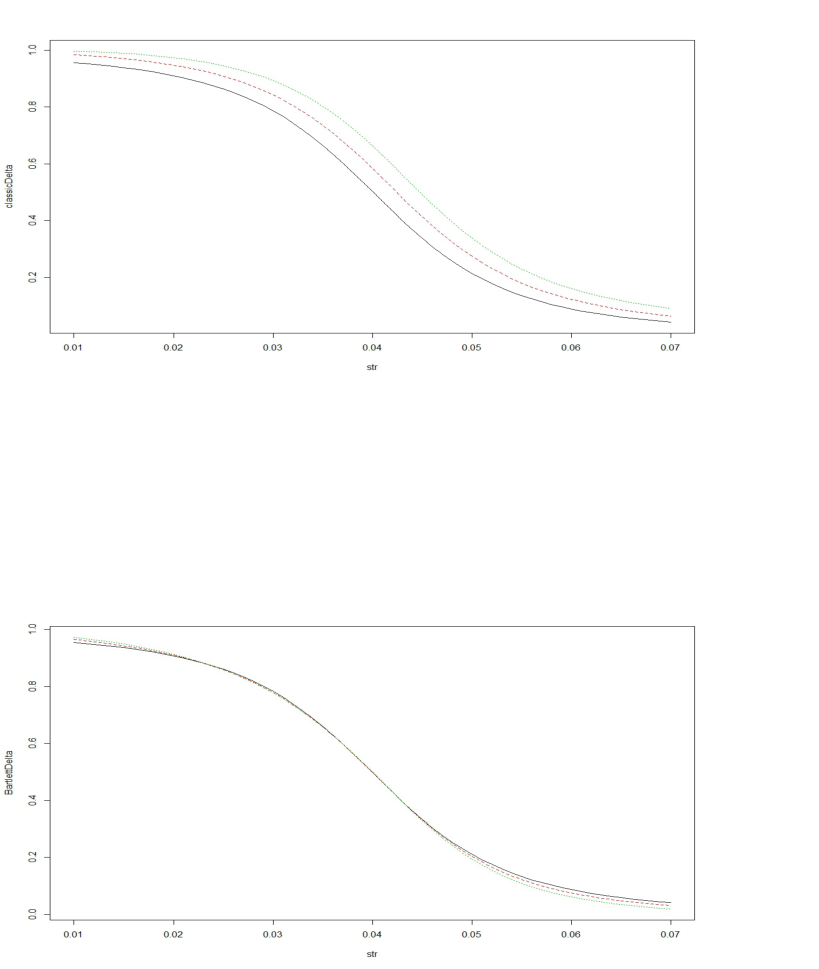

<!-- Start of picture text -->
° ©3“3S,x o = 2 3 kK a223 8 S*. s,‘: k =s 7 m ny N rg 0.01 0.02 0.03 0.04 0.05 0.06 0.07 str ° 3~ Fs]QoO2 po©g oof\ :S\ = x ao =\=Bs i Ss 0.01 0.02 0.03 0.04 0.05 0.06 0.07 str <!-- End of picture text -->

<!-- page: 9 -->

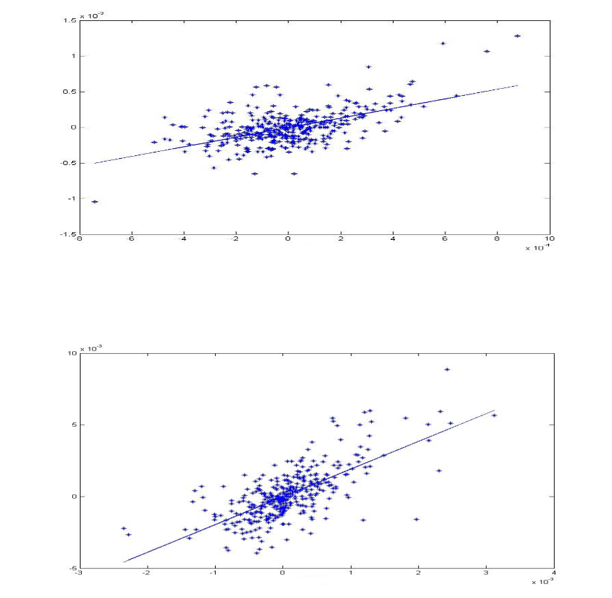

<!-- Start of picture text -->
i acl x 10° ge se ; * sag - cues ne = * iae “oia caehg SMGaleseS geeoeoe oeeea a eea < ; “i a mer we ee, ae + * ag eee cad _ = eS % ote eee 0.5 oe oea, ee te a ~ tb -1.5a -6 -4 = ao > ze & 4 il x 1o7 10 x 10° re . me ee+ ” a pn oe “4 **= x Rea* ee~~ mas:a,we, ge RE eae . + oe et aa = *~ pe +E + +a - * 50 Sorted FT + = geaTé' et aeTS +s+ = ~ ss “ oe + * > 5-3 2 -1 D 4 4 | x 10° <!-- End of picture text -->

<!-- page: 10 -->

- [4] Hagan, P., Kumar, D., Lesniewski, A., and Woodward, D. 2002. Managing smile risk, _Wilmott Magazine_ , **September** , 84 - 108. 

- [5] Hagan, P., Kumar, D., Lesniewski, A., and Woodward, D. 2014. Arbitrage free SABR, _Wilmott Magazine_ , **January** , 60 - 75. 

- [6] Hagan, P., Kumar, D., Lesniewski, A., and Woodward, D. 2016. Universal smiles, _Wilmott Magazine_ , **July** , 40 - 55. 

- [7] Hagan, P., Lesniewski, A., and Woodward, D. 2005. Probability distribution in the SABR model of stochastic volatility, preprint. 

- [8] Hull, J., and White, J. 2016: Optimal delta hedging for options, preprint (2016).
