# 2017-han-jentzen-e-deep-bsde

<!-- page: 1 -->

## Deep learning-based numerical methods for high-dimensional parabolic partial diferential equations and backward stochastic diferential equations

Weinan E<sup>1</sup>, Jiequn Han<sup>2</sup>, and Arnulf Jentzen<sup>3</sup>

<sup>1</sup>Beijing Institute of Big Data Research (China), Princeton University (USA), and Peking University (China), e-mail: weinan (at) math.princeton.edu

<sup>2</sup>Princeton University (USA), e-mail: jiequnh (at) princeton.edu

<sup>3</sup>ETH Zurich (Switzerland), e-mail: arnulf.jentzen (at) sam.math.ethz.ch

June 16, 2017

## Abstract

We propose a new algorithm for solving parabolic partial diferential equations (PDEs) and backward stochastic diferential equations (BSDEs) in high dimension, by making an analogy between the BSDE and reinforcement learning with the gradient of the solution playing the role of the policy function, and the loss function given by the error between the prescribed terminal condition and the solution of the BSDE. The policy function is then approximated by a neural network, as is done in deep reinforcement learning. Numerical results using TensorFlow illustrate the eficiency and accuracy of the proposed algorithms for several 100-dimensional nonlinear PDEs from physics and finance such as the Allen-Cahn equation, the Hamilton-Jacobi-Bellman equation, and a nonlinear pricing model for financial derivatives.

## Contents

## 1 Introduction

2 Main ideas of the algorithm

2.1 An example: a semilinear heat partial diferential equation (PDE) . . . . . 4

2.2 Formulation of the PDE as a suitable stochastic control problem . . . . . 4

2.3 The nonlinear Feynman-Kac formula . . 5

2.4 Forward discretization of the backward stochastic diferential equation (BSDE) 5

arXiv:1706.04702v1 [math.NA] 15 Jun 2017

<!-- page: 2 -->

2.5 Deep learning-based approximations 6 2.6 Stochastic optimization algorithms 6 3 Details of the algorithm 7 3.1 Formulation of the proposed algorithm in the case of semilinear heat equations 7 3.2 Formulation of the proposed algorithm in the general case 8 3.3 Comments on the proposed algorithm . 9 4 Examples for nonlinear partial diferential equations (PDEs) and nonlin ear backward stochastic diferential equations (BSDEs) 9 4.1 Setting . . 10 4.2 Allen-Cahn equation 12 4.3 A Hamilton-Jacobi-Bellman (HJB) equation 13 4.4 Pricing of European financial derivatives with diferent interest rates for borrowing and lending 18 4.5 Multidimensional Burgers-type PDEs with explicit solutions 20 4.6 An example PDE with quadratically growing derivatives and an explicit solution 24 4.7 Time-dependent reaction-difusion-type example PDEs with oscillating ex plicit solutions . 24 5 Appendix A: Special cases of the proposed algorithm 27 5.1 Stochastic gradient descent (SGD) . 27 5.2 Adaptive Moment Estimation (Adam) with mini-batches 27 5.3 Geometric Brownian motion 28 5.4 Euler-Maruyama scheme 29 6 Appendix B: Python and Matlab source codes 29 6.1 Python source code for an implementation of the deep BSDE solver in the case of the Allen-Cahn PDE (35) in Subsection 4.2 29 6.2 Matlab source code for the Branching difusion method used in Subsection 4.2 34 6.3 Matlab source code for the classical Monte Carlo method used in Subsec tion 4.3 36

## 1 Introduction

Developing eficient numerical algorithms for high dimensional (say, hundreds of dimensions) partial diferential equations (PDEs) has been one of the most challenging tasks in applied mathematics. As is well-known, the dificulty lies in the “curse of dimensionality” [1], namely, as the dimensionality grows, the complexity of the algorithms grows exponentially. For this reason, there are only a limited number of cases where practical high dimensional algorithms have been developed. For linear parabolic PDEs, one can use the Feynman-Kac formula and Monte Carlo methods to develop eficient algorithms to evaluate solutions at any given space-time locations. For a class of inviscid Hamilton-Jacobi equations, Darbon & Osher have recently developed an algorithm which performs numerically well in the case of such high dimensional inviscid Hamilton-Jacobi equations; see [9]. Darbon & Osher’s algorithm is based on results from compressed sensing and on the Hopf formulas for the Hamilton-Jacobi equations. A general algorithm for (nonlinear) parabolic PDEs based on the Feynman-Kac and Bismut-Elworthy-Li formula and a multilevel decomposition of Picard iteration was developed in [11] and has been shown to be quite eficient on a number examples in finance and physics. The complexity of the algorithm is shown to be $O ( d \varepsilon ^ { - 4 } )$ for semilinear heat equations, where d is the dimensionality of the problem and ε is the required accuracy.

<!-- page: 3 -->

In recent years, a new class of techniques, called deep learning, have emerged in machine learning and have proven to be very efective in dealing with a large class of high dimensional problems in computer vision (cf., e.g., [23]), natural language processing (cf., e.g., [20]), time series analysis, etc. (cf., e.g., [15, 24]). This success fuels in speculations that deep learning might hold the key to solve the curse of dimensionality problem. It should be emphasized that at the present time, there are no theoretical results that support such claims although the practical success of deep learning has been astonishing. However, this should not prevent us from trying to apply deep learning to other problems where the curse of dimensionality has been the issue.

In this paper, we explore the use of deep learning for solving general high dimensional PDEs. To this end, it is necessary to formulate the PDEs as a learning problem. Motivated by ideas in [16] where deep learning-based algorithms were developed for high dimensional stochastic control problems, we explore a connection between (nonlinear) parabolic PDEs and backward stochastic diferential equations (BSDEs) (see [26, 28, 25]) since BSDEs share a lot of common features with stochastic control problems.

## 2 Main ideas of the algorithm

We will consider a fairly general class of nonlinear parabolic PDEs (see (30) in Subsection 4.1 below). The proposed algorithm is based on the following set of ideas:

(i) Through the so-called nonlinear Feynman-Kac formula, we can formulate the PDEs equivalently as BSDEs.

(ii) One can view the BSDE as a stochastic control problem with the gradient of the solution being the policy function. These stochastic control problems can then be viewed as model-based reinforcement learning problems.

(iii) The (high dimensional) policy function can then be approximated by a deep neural network, as has been done in deep reinforcement learning.

<!-- page: 4 -->

Instead of formulating initial value problems, as is commonly done in the PDE literature, we consider the set up with terminal conditions since this facilitates making connections with BSDEs. Terminal value problems can obviously be transformed to initial value problems and vice versa.

In the remainder of this section we present a rough sketch of the derivation of the proposed algorithm, which we refer to as deep BSDE solver. In this derivation we restrict ourself to a specific class of nonlinear PDEs, that is, we restrict ourself to semilinear heat equations (see (PDE) below) and refer to Subsections 3.2 and 4.1 below for the general introduction of the deep BSDE solver.

## 2.1 An example: a semilinear heat partial diferential equation (PDE)

Let $T \in ( 0 , \infty ) , d \in \mathbb { N } , \xi \in \mathbb { R } ^ { d }$ , let $f \colon { \mathbb { R } } \times { \mathbb { R } ^ { d } } \to { \mathbb { R } }$ and $g \colon { \mathbb { R } ^ { d } } \to { \mathbb { R } }$ be continuous functions, and let $u = ( u ( t , x ) ) _ { t \in [ 0 , T ] , x \in \mathbb { R } ^ { d } } \in C ^ { 1 , 2 } ( [ 0 , T ] \times \mathbb { R } ^ { d }$ , R) satisfy for all $t \in [ 0 , T ]$ $\boldsymbol { x } \in \mathbb { R } ^ { d }$ that $u ( T , x ) = g ( x )$ and

$$
\frac { \partial u } { \partial t } ( t , x ) + \frac { 1 } { 2 } ( \Delta _ { x } u ) ( t , x ) + f \big ( u ( t , x ) , ( \nabla _ { x } u ) ( t , x ) \big ) = 0 .\tag{PDE}
$$

A key idea of this work is to reformulate the PDE (PDE) as an appropriate stochastic control problem.

## 2.2 Formulation of the PDE as a suitable stochastic control problem

More specifically, let $( \Omega , \mathcal { F } , \mathbb { P } )$ be a probability space, let $W \colon [ 0 , T ] \times \Omega \ \ \mathbb { R } ^ { d }$ be a d-dimensional standard Brownian motion on $( \Omega , \mathcal { F } , \mathbb { P } )$ , let $\mathbb { F } = ( \mathbb { F } _ { t } ) _ { t \in [ 0 , T ] }$ be the normal filtration on $( \Omega , \mathcal { F } , \mathbb { P } )$ generated by W, let A be the set of all F-adapted $\mathbb { R } ^ { d } .$ -valued stochastic processes with continuous sample paths, and for every $y \in \mathbb { R }$ and every $Z \in { \mathcal { A } }$ let $Y ^ { y , Z } \colon [ 0 , T ] \times \Omega \mathbb { R }$ be an F-adapted stochastic process with continuous sample paths which satisfies that for all $t \in [ 0 , T ]$ it holds $\mathbb { P } { \mathrm { - a . s } }$ . that

$$
Y _ { t } ^ { y , Z } = y - \int _ { 0 } ^ { t } f \left( Y _ { s } ^ { y , Z } , Z _ { s } \right) d s + \int _ { 0 } ^ { t } { \langle Z _ { s } , d W _ { s } \rangle _ { \mathbb { R } ^ { d } } } .\tag{1}
$$

We now view the solution $u \in C ^ { 1 , 2 } ( [ 0 , T ] \times \mathbb { R } ^ { d } , \mathbb { R } )$ of (PDE) and its spatial derivative as the solution of a stochastic control problem associated to (1). More formally, under suitable regularity hypotheses on the nonlinearity f it holds that the pair consisting of $u ( 0 , \xi ) \in \mathbb { R }$ and $( ( \nabla _ { x } u ) ( t , \xi + W _ { t } ) ) _ { t \in [ 0 , T ] } \in \mathcal { A }$ is the (up to indistinguishability) unique global minimum of the function

$$
\begin{array} { r } { \mathbb { R } \times \mathcal { A } \ni ( y , Z ) \mapsto \mathbb { E } \big [ | Y _ { T } ^ { y , Z } - g ( \xi + W _ { T } ) | ^ { 2 } \big ] \in [ 0 , \infty ] . } \end{array}\tag{2}
$$

<!-- page: 5 -->

One can also view the stochastic control problem (1)–(2) (with Z being the control) as a model-based reinforcement learning problem. In that analogy, we view $Z$ as the policy and we approximate $Z \in { \mathcal { A } }$ using feedforward neural networks (see (11) and Section 4 below for further details). The process $u ( t , \xi + W _ { t } ) , t \in [ 0 , T ]$ , corresponds to the value function associated to the stochastic control problem and can be computed approximatively by employing the policy $Z \ ( \sec \ ( 9 )$ below for details). The connection between the PDE (PDE) and the stochastic control problem (1)–(2) is based on the nonlinear Feynman-Kac formula which links PDEs and BSDEs (see (BSDE) and (3) below).

## 2.3 The nonlinear Feynman-Kac formula

Let $Y \colon [ 0 , T ] \times \Omega \mathbb { R }$ and $Z \colon [ 0 , T ] \times \Omega { \mathbb { R } } ^ { d }$ be F-adapted stochastic processes with continuous sample paths which satisfy that for all $t \in [ 0 , T ]$ it holds $\mathbb { P } { \mathrm { - a . s } }$ . that

$$
Y _ { t } = g ( \xi + W _ { T } ) + \int _ { t } ^ { T } f ( Y _ { s } , Z _ { s } ) d s - \int _ { t } ^ { T } \langle Z _ { s } , d W _ { s } \rangle _ { \mathbb { R } ^ { d } } .\tag{BSDE}
$$

Under suitable additional regularity assumptions on the nonlinearity f we have that the nonlinear parabolic PDE (PDE) is related to the BSDE (BSDE) in the sense that for all $t \in [ 0 , T ]$ it holds P-a.s. that

$$
Y _ { t } = u ( t , \xi + W _ { t } ) \in \mathbb R \qquad \mathrm { a n d } \qquad Z _ { t } = ( \nabla _ { x } u ) ( t , \xi + W _ { t } ) \in \mathbb R ^ { d }\tag{3}
$$

$( \mathrm c f . , \ e . g . , \ [ 2 5 $ , Section 3] and [27]). The first identity in (3) is sometimes referred to as nonlinear Feynman-Kac formula in the literature.

## 2.4 Forward discretization of the backward stochastic diferential equation (BSDE)

To derive the deep BSDE solver, we first plug the second identity in (3) into (BSDE) to obtain that for all $t \in [ 0 , T ]$ it holds P-a.s. that

$$
Y _ { t } = g ( \xi + W _ { T } ) + \int _ { t } ^ { T } f \left( Y _ { s } , ( \nabla _ { x } u ) ( s , \xi + W _ { s } ) \right) d s - \int _ { t } ^ { T } \left. ( \nabla _ { x } u ) ( s , \xi + W _ { s } ) , d W _ { s } \right. _ { \mathbb { R } ^ { d } } .\tag{4}
$$

In particular, we obtain that for all $t _ { 1 } , t _ { 2 } \in [ 0 , T ]$ with $t _ { 1 } \leq t _ { 2 }$ it holds $\mathbb { P } \mathrm { - a . s }$ . that

$$
Y _ { t _ { 2 } } = Y _ { t _ { 1 } } - \int _ { t _ { 1 } } ^ { t _ { 2 } } f { \big ( } Y _ { s } , ( \nabla _ { x } u ) ( s , \xi + W _ { s } ) { \big ) } d s + \int _ { t _ { 1 } } ^ { t _ { 2 } } { \langle } ( \nabla _ { x } u ) ( s , \xi + W _ { s } ) , d W _ { s } \rangle _ { \mathbb { R } ^ { d } } .\tag{5}
$$

Next we apply a time discretization to (5). More specifically, let $N \in { \mathbb { N } }$ and let $t _ { 0 } , t _ { 1 } , \dots , t _ { N } \in$ [0, T] be real numbers which satisfy

$$
0 = t _ { 0 } < t _ { 1 } < . . . < t _ { N } = T\tag{6}
$$

<!-- page: 6 -->

and observe that (5) suggests for $N \in { \mathbb { N } }$ suficiently large that

$$
\begin{array} { r l } { } & { Y _ { t _ { n + 1 } } } \\ { } & { \approx Y _ { t _ { n } } - f \big ( Y _ { t _ { n } } , ( \nabla _ { x } u ) ( t _ { n } , \xi + W _ { t _ { n } } ) \big ) ( t _ { n + 1 } - t _ { n } ) + \big \langle ( \nabla _ { x } u ) ( t _ { n } , \xi + W _ { t _ { n } } ) , W _ { t _ { n + 1 } } - W _ { t _ { n } } \big \rangle _ { \mathbb { R } ^ { d } } . } \end{array}\tag{}
$$

## 2.5 Deep learning-based approximations

In the next step we employ a deep learning approximation for

$$
( \nabla _ { \boldsymbol { x } } \boldsymbol { u } ) ( t _ { n } , \boldsymbol { x } ) \in { \mathbb R } ^ { d } , \qquad \boldsymbol { x } \in { \mathbb R } ^ { d } , \qquad \boldsymbol { n } \in \{ 0 , 1 , \ldots , N \} ,\tag{8}
$$

but not for $u ( t _ { n } , x ) \in \mathbb { R } , \ x \in \mathbb { R } ^ { d } , \ n \in \{ 0 , 1 , . . . , N \}$ . Approximations for $u ( t _ { n } , x ) \in \mathbb { R }$ $x \in \mathbb { R } ^ { d } , n \in \{ 0 , 1 , \ldots , N \}$ , in turn, can be computed recursively by using (7) together with deep learning approximations for (8). More specifically, let $\rho \in \mathbb { N }$ , let $\mathcal { U } ^ { \theta } \in \mathbb { R } , \theta \in \mathbb { R } ^ { \rho }$ , be real numbers, let $\mathcal { V } _ { n } ^ { \theta } \colon { \mathbb { R } } ^ { d } \to { \mathbb { R } } ^ { d } , n \in \{ 0 , 1 , \dots , N - 1 \} , \theta \in { \mathbb { R } } ^ { \rho }$ , be continuous functions, and let $\mathcal { Y } ^ { \theta } \colon \{ 0 , 1 , \ldots , N \} \times \Omega \to \mathbb { R } , \theta \in \mathbb { R } ^ { \rho }$ , be stochastic processes which satisfy for all $\theta \in \mathbb { R } ^ { \rho } , n \in \{ 0 , 1 , . . . , N - 1 \}$ that $\mathcal { V } _ { 0 } ^ { \theta } = \mathcal { U } ^ { \theta }$ and

$$
\mathscr { V } _ { n + 1 } ^ { \theta } = \mathscr { V } _ { n } ^ { \theta } - f \big ( \mathscr { V } _ { n } ^ { \theta } , \mathscr { V } _ { n } ^ { \theta } ( \xi + W _ { t _ { n } } ) \big ) ( t _ { n + 1 } - t _ { n } ) + \big \langle \mathscr { V } _ { n } ^ { \theta } ( \xi + W _ { t _ { n } } ) , W _ { t _ { n + 1 } } - W _ { t _ { n } } \big \rangle _ { \mathbb { R } ^ { d } } .\tag{9}
$$

We think of $\rho \in \mathbb { N }$ as the number of parameters in the neural network, for all appropriate $\theta \in \mathbb { R } ^ { \rho }$ we think of $\mathcal { U } ^ { \theta } \in \mathbb { R }$ as suitable approximations

$$
\mathcal { U } ^ { \theta } \approx u ( 0 , \xi )\tag{10}
$$

of $u ( 0 , \xi )$ , and for all appropriate $\theta \in \mathbb { R } ^ { \rho } , \ x \in \mathbb { R } ^ { d } , \ n \in \{ 0 , 1 , \dots , N - 1 \}$ we think of $\mathcal { V } _ { n } ^ { \theta } ( x ) \in \mathbb { R } ^ { 1 \times d }$ as suitable approximations

$$
\mathcal { V } _ { n } ^ { \theta } ( x ) \approx ( \nabla _ { x } u ) ( t _ { n } , x )\tag{11}
$$

of $( \nabla _ { x } u ) ( t _ { n } , x )$

## 2.6 Stochastic optimization algorithms

The “appropriate” $\theta \in \mathbb { R } ^ { \rho }$ can be obtained by minimizing the expected loss function through stochastic gradient descent-type algorithms. For the loss function we pick the squared approximation error associated to the terminal condition of the BSDE (BSDE). More precisely, assume that the function $\mathbb { R } ^ { \rho } \ni \theta \mapsto \mathbb { E } \left[ | \mathcal { Y } _ { N } ^ { \theta } - g ( \mathcal { X } _ { N } ) | ^ { 2 } \right] \in [ 0 , \infty ]$ has a unique global minimum and let $\Lambda \in \mathbb { R } ^ { \rho }$ be the real vector for which the function

$$
\mathbb { R } ^ { \rho } \ni \theta \mapsto \mathbb { E } \big [ | \mathcal { V } _ { N } ^ { \theta } - g ( \mathcal { X } _ { N } ) | ^ { 2 } \big ] \in [ 0 , \infty ]\tag{12}
$$

is minimal. Minimizing the function (12) is inspired by the fact that

$$
\mathbb { E } \left[ | Y _ { T } - g ( X _ { T } ) | ^ { 2 } \right] = 0\tag{13}
$$

<!-- page: 7 -->

according to (BSDE) above (cf. (2) above). Under suitable regularity assumptions, we approximate the vector $\Lambda \in \mathbb { R } ^ { \rho }$ through stochastic gradient descent-type approximation methods and thereby we obtain random approximations $\Theta _ { 0 } , \Theta _ { 1 } , \Theta _ { 2 } , \tiny { \cdot . . . } : \Omega \tiny { \to } \mathbb { R } ^ { \rho }$ of $\Lambda \in$ $\mathbb { R } ^ { \rho _ { \vartheta } }$ . For suficiently large $N , \rho , m \in \mathbb { N }$ we then employ the random variable $\mathcal { U } ^ { \Theta _ { m } } : \Omega \to \mathbb { R }$ as a suitable implementable approximation

$$
\mathcal { U } ^ { \Theta _ { m } } \approx u ( 0 , \xi )\tag{14}
$$

of $u ( 0 , \xi )$ (cf. (10) above) and for suficiently large $N , \rho , m \in \mathbb { N }$ and all $x \in \mathbb { R } ^ { d } , \ n \in$ $\{ 0 , 1 , \ldots , N - 1 \}$ we use the random variable $\mathcal { V } _ { n } ^ { \Theta _ { m } } ( x ) \colon \Omega \ \ \mathbb { R } ^ { 1 \times d }$ as a suitable implementable approximation

$$
\mathcal { V } _ { n } ^ { \Theta _ { m } } ( x ) \approx ( \nabla _ { x } u ) ( t _ { n } , x )\tag{15}
$$

of $( \nabla _ { x } u ) ( t _ { n } , x )$ (cf. (11) above). In the next section the proposed approximation method is described in more detail.

To simplify the presentation we have restricted us in (PDE), (1), (2), (BSDE) above and Subsection 3.1 below to semilinear heat equations. We refer to Subsection 3.2 and Section 4 below for the general description of the deep BSDE solver.

## 3 Details of the algorithm

## 3.1 Formulation of the proposed algorithm in the case of semilinear heat equations

In this subsection we describe the algorithm proposed in this article in the specific situation where (PDE) is the PDE under consideration, where batch normalization (see Iofe & Szegedy [21]) is not employed, and where the plain-vanilla stochastic gradient descent approximation method with a constant learning rate $\gamma \in ( 0 , \infty )$ and without minibatches is the employed stochastic algorithm. The general framework, which includes the setting in this subsection as a special case, can be found in Subsection 3.2 below.

Framework 3.1 (Specific case). Let $T , \gamma \in ( 0 , \infty ) , d , \rho , N \in \mathbb { N } , \xi \in \mathbb { R } ^ { d } , l e t f \colon \mathbb { R } \times \mathbb { R } ^ { d } \to$ R and $g \colon { \mathbb { R } ^ { d } } \to$ R be functions, let $( \Omega , \mathcal { F } , \mathbb { P } )$ be a probability space, let $W ^ { m } \colon [ 0 , T ] \times \Omega \ $ $\mathbb { R } ^ { d } , m \in \mathbb { N } _ { 0 }$ , be independent d-dimensional standard Brownian motions on $( \Omega , \mathscr { F } , { \mathbb { P } } )$ , let $t _ { 0 } , t _ { 1 } , \ldots , t _ { N } \in [ 0 , T ]$ be real numbers with

$$
0 = t _ { 0 } < t _ { 1 } < . . . < t _ { N } = T ,\tag{16}
$$

for every $\theta \in \mathbb { R } ^ { \rho }$ let $\mathcal { U } ^ { \theta } \in \mathbb { R }$ , for every $\theta \in \mathbb { R } ^ { \rho } , n \in \{ 0 , 1 , . . . , N - 1 \}$ let $\mathcal { V } _ { n } ^ { \theta } \colon { \mathbb { R } } ^ { d } \to { \mathbb { R } } ^ { d }$ be a function, for every $m \in { \mathbb { N } } _ { 0 } , \theta \in { \mathbb { R } } ^ { \rho }$ let $\mathcal { V } ^ { \theta , m } \colon \{ 0 , 1 , \ldots , N \} \times \Omega \to \mathbb { R } ^ { k }$ be the stochastic process which satisfies for all $n \in \{ 0 , 1 , \ldots , N - 1 \}$ that $\mathcal { V } _ { 0 } ^ { \theta , m } = \mathcal { U } ^ { \theta }$ and

$$
\mathcal { V } _ { n + 1 } ^ { \theta , m } = \mathcal { V } _ { n } ^ { \theta , m } - f \big ( \mathcal { Y } _ { n } ^ { \theta , m } , \mathcal { V } _ { n } ^ { \theta } ( \xi + W _ { t _ { n } } ^ { m } ) \big ) ( t _ { n + 1 } - t _ { n } ) + \big \langle \mathcal { V } _ { n } ^ { \theta } ( \xi + W _ { t _ { n } } ^ { m } ) , W _ { t _ { n + 1 } } ^ { m } - W _ { t _ { n } } ^ { m } \big \rangle _ { \mathbb { R } ^ { d } } ,\tag{17}
$$

<!-- page: 8 -->

for every $m \in { \mathbb { N } } _ { 0 }$ let $\phi ^ { m } \colon \mathbb { R } ^ { \rho } \times \Omega \mathbb { R }$ be the function which satisfies for all $\theta \in \mathbb { R } ^ { \rho } , \omega \in \Omega$ that

$$
\phi ^ { m } ( \theta , \omega ) = \big | \mathcal { V } _ { N } ^ { \theta , m } ( \omega ) - g ( \xi + W _ { T } ^ { m } ( \omega ) ) \big | ^ { 2 } ,\tag{18}
$$

for every $m \in \mathbb { N } _ { 0 }$ let $\Phi ^ { m } \colon \mathbb { R } ^ { \rho } \times \Omega \ \ \mathbb { R } ^ { \rho }$ be a function which satisfies for all $\omega \in \Omega ,$ $\theta \in \{ v \in \mathbb { R } ^ { \rho } \colon ( \mathbb { R } ^ { \rho } \ni w \mapsto \phi _ { \mathbf { s } } ^ { m } ( w , \omega ) \in \mathbb { R }$ is diferentiable at $v \in \mathbb { R } ^ { \rho } ) \}$ that

$$
\Phi ^ { m } ( \theta , \omega ) = ( \nabla _ { \theta } \phi ^ { m } ) ( \theta , \omega ) ,\tag{19}
$$

and let Θ: $ { \mathbb { N } } _ { 0 } \times \Omega \to { \mathbb { R } } ^ { \rho }$ be a stochastic process which satisfy for all $m \in \mathbb { N }$ that

$$
\begin{array} { r } { \Theta _ { m } = \Theta _ { m - 1 } - \gamma \cdot \Phi ^ { m } ( \Theta _ { m - 1 } ) . } \end{array}\tag{20}
$$

Under suitable further hypotheses (cf. Sections 4 and 5 below), we think in the case of suficiently large $\rho , N , m \in \mathbb { N }$ and suficiently small $\gamma \in \mathsf { \Gamma } ( 0 , \infty )$ of $\mathcal { U } ^ { \Theta _ { m } } \in \mathbb { R }$ as an appropriate approximation

$$
u ( 0 , \xi ) \approx \mathcal { U } ^ { \Theta _ { m } }\tag{21}
$$

of the solution $u ( t , x ) \in \mathbb { R } , ( t , x ) \in [ 0 , T ] \times \mathbb { R } ^ { d }$ , of the PDE

$$
\frac { \partial u } { \partial t } ( t , x ) + \frac { 1 } { 2 } \left( \Delta _ { x } u \right) ( t , x ) + f \big ( u ( t , x ) , ( \nabla _ { x } u ) ( t , x ) \big ) = 0\tag{22}
$$

for $( t , x ) \in [ 0 , T ] \times \mathbb { R } ^ { d } .$

## 3.2 Formulation of the proposed algorithm in the general case

Framework 3.2 (General case). Let $T \in ( 0 , \infty ) , d , k , \rho , \varrho , N , \varsigma \in \mathbb { N } , \xi \in \mathbb { R } ^ { d }$ , let $f \colon [ 0 , T ] \times$ $\mathbb { R } ^ { d } \times \mathbb { R } ^ { k } \times \mathbb { R } ^ { k \times d } \mathbb { R } , g \colon \mathbb { R } ^ { d } \mathbb { R } ^ { k }$ , and Υ : $\lceil 0 , T \rceil ^ { 2 } \times \mathbb { R } ^ { d } \times \mathbb { R } ^ { d } \mathbb { R } ^ { d }$ be functions, let $( \Omega , \mathcal { F } , \mathbb { P } )$ be a probability space, let $W ^ { m , j } \colon [ 0 , T ] \times \Omega \to \mathbb { R } ^ { d } , m , j \in \mathbb { N } _ { 0 }$ , be independent d-dimensional standard Brownian motions on $( \Omega , \mathcal { F } , \mathbb { P } )$ , let $t _ { 0 } , t _ { 1 } , \ldots , t _ { N } \in [ 0 , T ]$ be real numbers with

$$
0 = t _ { 0 } < t _ { 1 } < . . . < t _ { N } = T ,\tag{23}
$$

for every $\theta \in \mathbb { R } ^ { \rho }$ let $\mathcal { U } ^ { \theta } \in \mathbb { R } ^ { k }$ , for every $\theta \in \mathbb { R } ^ { \rho } , \mathbf { s } \in \mathbb { R } ^ { \varsigma } , n \in \{ 0 , 1 , . . . , N - 1 \} , j \in \mathbb { N } _ { 0 }$ let $\mathcal { V } _ { n , j } ^ { \theta , \mathbf { s } } \colon ( \mathbb { R } ^ { \breve { d } } ) ^ { \mathbb { N } } \to \mathbb { R } ^ { k \times d }$ be a function, for every $m , j \in { \mathbb { N } } _ { 0 }$ let $\mathcal { X } ^ { m , j } \colon \{ 0 , 1 , \ldots , N \} \times \Omega \to { \mathbb { R } } ^ { d }$ and $\mathcal { V } ^ { \theta , \mathbf { s } , m , j } \colon \{ 0 , 1 , \ldots , N \} \times \Omega \to \mathbb { R } ^ { k } , \theta \in \mathbb { R } ^ { \rho } , \mathbf { s } \in \mathbb { R } ^ { \varsigma }$ , be stochastic processes which satisfy for all $\theta \in \mathbb { R } ^ { \rho } , \mathbf { s } \in \mathbb { R } ^ { \varsigma } , n \in \{ 0 , 1 , . . . , N - 1 \}$ that

$$
\chi _ { 0 } ^ { m , j } = \xi , \qquad \boldsymbol { \mathcal { Y } } _ { 0 } ^ { \theta , \mathrm { s } , m , j } = \boldsymbol { \mathcal { U } } ^ { \theta } , \qquad \boldsymbol { \mathcal { X } } _ { n + 1 } ^ { m , j } = \boldsymbol { \Upsilon } \bigl ( t _ { n } , t _ { n + 1 } , \boldsymbol { \mathcal { X } } _ { n } ^ { m , j } , \boldsymbol { W } _ { t _ { n + 1 } } ^ { m , j } - \boldsymbol { W } _ { t _ { n } } ^ { m , j } \bigr ) ,\tag{24}
$$

$$
\begin{array} { r l } & { \mathcal { Y } _ { n + 1 } ^ { \theta , { s } , m , j } = \mathcal { Y } _ { n } ^ { \theta , { s } , m , j } - f \left( t _ { n } , \mathcal { X } _ { n } ^ { m , j } , \mathcal { Y } _ { n } ^ { \theta , { s } , m , j } , \mathcal { Y } _ { n , j } ^ { \theta , { s } } ( \{ \mathcal { X } _ { n } ^ { m , i } \} _ { i \in \mathbb { R } } ) \right) ( t _ { n + 1 } - t _ { n } ) } \\ & { \qquad + \mathcal { Y } _ { n , j } ^ { \theta , { s } } ( \{ \mathcal { X } _ { n } ^ { m , i } \} _ { i \in \mathbb { N } } ) ( W _ { t _ { n + 1 } } ^ { m , j } - W _ { t _ { n } } ^ { m , j } ) , } \end{array}\tag{25}
$$

<!-- page: 9 -->

for every m, $j \in \mathbb { N } _ { 0 } , \mathbf { s } \in \mathbb { R } ^ { \varsigma }$ let $\phi _ { \mathbf { s } } ^ { m , j } \colon \mathbb { R } ^ { \rho } \times \Omega \mathbb { R }$ be the function which satisfies for all $\theta \in \mathbb { R } ^ { \rho } , \omega \in \Omega$ that

$$
\phi _ { \mathrm { s } } ^ { m , j } ( \theta , \omega ) = \lVert \mathcal { Y } _ { N } ^ { \theta , \mathrm { s } , m , j } ( \omega ) - g ( \mathcal { X } _ { N } ^ { m , j } ( \omega ) ) \rVert _ { \mathbb { R } ^ { k } } ^ { 2 } ,\tag{26}
$$

for every $m , j \in \mathbb { N } _ { 0 } , \mathbf { s } \in \mathbb { R } ^ { \varsigma }$ let $\Phi _ { \mathbf { s } } ^ { m , j } \colon \mathbb { R } ^ { \rho } \times \Omega \mathbb { R } ^ { \rho }$ be a function which satisfies for all $\omega \in \Omega , \theta \in \{ v \in \mathbb { R } ^ { \rho } \colon ( \mathbb { R } ^ { \rho } \ni w \mapsto \phi _ { \mathbf { s } } ^ { m , j } ( w , \omega ) \in \mathbb { R }$ is diferentiable at $v \in \mathbb { R } ^ { \rho } ) ]$ } that

$$
\begin{array} { r } { \Phi _ { \mathbf { s } } ^ { m , j } ( \theta , \omega ) = ( \nabla _ { \theta } \phi _ { \mathbf { s } } ^ { m , j } ) ( \theta , \omega ) , } \end{array}\tag{27}
$$

let $\mathcal { S } \colon \mathbb { R } ^ { \varsigma } \times \mathbb { R } ^ { \rho } \times ( \mathbb { R } ^ { d } ) ^ { \{ 0 , 1 , \ldots , N - 1 \} \times \mathbb { N } } \to \mathbb { R } ^ { \varsigma }$ be a function, for every m $\in \mathbb { N }$ let $\psi _ { m } \colon \mathbb { R } ^ { \varrho } \mathbb { R } ^ { \rho }$ and $\Psi _ { m } \colon \mathbb { R } ^ { \varrho } \times ( \mathbb { R } ^ { \rho } ) ^ { \mathbb { N } } \mathbb { R } ^ { \varrho }$ be functions, and let S: $\mathbb { N } _ { 0 } \times \Omega \to \mathbb { R } ^ { \varsigma } , \Xi \colon \mathbb { N } _ { 0 } \times \Omega \to \mathbb { R } ^ { \varrho }$ , and $\Theta \colon { \mathbb { N } } _ { 0 } \times \Omega \to { \mathbb { R } } ^ { \rho }$ be stochastic processes which satisfy for all m ∈ N that

$$
\mathbb { S } _ { m } = { \cal S } \bigl ( \mathbb { S } _ { m - 1 } , \Theta _ { m - 1 } , \{ \pmb { \chi } _ { n } ^ { m - 1 , i } \} _ { ( n , i ) \in \{ 0 , 1 , \dots , N - 1 \} \times \mathbb { N } } \bigr ) ,\tag{28}
$$

$$
\Xi _ { m } = \Psi _ { m } \bigl ( \Xi _ { m - 1 } , \{ \Phi _ { \Xi _ { m } } ^ { m - 1 , j } ( \Theta _ { m - 1 } ) \} _ { j \in \mathbb { N } } \bigr ) , \qquad a n d \qquad \Theta _ { m } = \Theta _ { m - 1 } - \psi _ { m } ( \Xi _ { m } ) .\tag{29}
$$

## 3.3 Comments on the proposed algorithm

The dynamics in (24) associated to the stochastic processes $( \mathcal X _ { n } ^ { m , j } ) _ { n \in \{ 0 , 1 , . . . , N \} }$ for $m , j \in$ $ { \mathbb { N } } _ { 0 }$ allows us to incorporate diferent algorithms for the discretization of the considered forward stochastic diferential equation (SDE) into the deep BSDE solver in Subsection 3.2. The dynamics in (29) associated to the stochastic processes $\Xi _ { m } , m \in { \mathbb { N } } _ { 0 }$ , and $\Theta _ { m } , m \in \mathbb { N } _ { 0 }$ allows us to incorporate diferent stochastic approximation algorithms such as

• stochastic gradient descent with or without mini-batches (see Subsection 5.1 below) as well as

• adaptive moment estimation (Adam) with mini-batches (see Kingma & Jimmy [22] and Subsection 5.2 below) into the deep BSDE solver in Subsection 3.2.

The dynamics in (28) associated to the stochastic process $\mathbb { S } _ { m } , \ m \in \ \mathbb { N } _ { 0 }$ , allows us to incorporate the standardization procedure in batch normalization (see Iofe & Szegedy [21] and also Section 4 below) into the deep BSDE solver in Subsection 3.2. In that case we think of $\mathbb { S } _ { m } , m \in \mathbb { N } _ { 0 }$ , as approximatively calculated means and standard deviations.

## 4 Examples for nonlinear partial diferential equations (PDEs) and nonlinear backward stochastic diferential equations (BSDEs)

In this section we illustrate the algorithm proposed in Subsection 3.2 using several concrete example PDEs. In the examples below we will employ the general approximation method in Subsection 3.2 in conjunction with the Adam optimizer (cf. Example 5.2 below and Kingma & Ba [22]) with mini-batches with 64 samples in each iteration step (see Subsection 4.1 for a detailed description).

<!-- page: 10 -->

In our implementation we employ N −1 fully-connected feedforward neural networks to represent $\mathcal { V } _ { n , j } ^ { \theta }$ for $n \in \{ 1 , 2 , . . . , N - 1 \} , j \in \{ 1 , 2 , . . . , 6 4 \} , \theta \in \mathbb { R } ^ { \rho }$ (cf. also Figure 1 below for a rough sketch of the architecture of the deep BSDE solver). Each of the neural networks consists of 4 layers (1 input layer [d-dimensional], 2 hidden layers [both d+10-dimensional], and 1 output layer [d-dimensional]). The number of hidden units in each hidden layer is equal to $d + 1 0$ . We also adopt batch normalization (BN) (see Iofe & Szegedy [21]) right after each matrix multiplication and before activation. We employ the rectifier function $\mathbb { R } \ni x \mapsto \operatorname* { m a x } \{ 0 , x \} \in [ 0 , \infty )$ as our activation function for the hidden variables. All the weights in the network are initialized using a normal or a uniform distribution without any pre-training. Each of the numerical experiments presented below is performed in Python using TensorFlow on a Macbook Pro with a 2.90 Gigahertz (GHz) Intel Core i5 micro processor and 16 gigabytes (GB) of 1867 Megahertz (MHz) double data rate type three synchronous dynamic random-access memory (DDR3-SDRAM). We also refer to the Python code 1 in Subsection 6.1 below for an implementation of the deep BSDE solver in the case of the 100-dimensional Allen-Cahn PDE (35).

## 4.1 Setting

Assume the setting in Subsection 3.2, assume for all $\theta = ( \theta _ { 1 } , \ldots , \theta _ { \rho } ) \in \mathbb { R } ^ { \rho }$ that $k = 1$ 2 $\rho = d + 1 + ( N - 1 ) \left( 2 d ( d + 1 0 ) + ( d + 1 0 ) ^ { 2 } + 4 ( d + 1 0 ) + 2 d \right) , \varrho = 2 \rho , \mathcal { U } ^ { \theta } = \theta _ { 1 } , \Xi _ { 0 } = 0$ let $\mu \colon [ 0 , T ] \times \mathbb { R } ^ { d } \to \mathbb { R } ^ { d }$ and $\sigma \colon [ 0 , T ] \times \mathbb { R } ^ { d } \mathbb { R } ^ { d \times d }$ be functions, let $u \colon [ 0 , T ] \times \mathbb { R } ^ { d } $ R be a continuous and at most polynomially growing function which satisfies for all $( t , x ) \in$ $[ 0 , T ) \times \mathbb { R } ^ { d }$ that $u | _ { [ 0 , T ) \times \mathbb { R } ^ { d } } \in C ^ { 1 , 2 } ( [ 0 , T ) \times \mathbb { R } ^ { d } , \mathbb { R } ) , u ( T , x ) = g ( x )$ , and

$$
\frac { \partial u } { \partial t } ( t , x ) + \frac { 1 } { 2 } \operatorname { T r a c e } \bigl ( \sigma ( t , x ) \left[ \sigma ( t , x ) \right] ^ { * } ( \operatorname { H e s s } _ { x } u ) ( t , x ) \bigr ) + \left. \mu ( t , x ) , ( \nabla _ { x } u ) ( t , x ) \right.
$$

$$
+ f \big ( t , x , u ( t , x ) , [ ( \nabla _ { x } u ) ( t , x ) ] ^ { * } \sigma ( t , x ) \big ) = 0 ,\tag{30}
$$

let $\begin{array} { r } { \varepsilon = 1 0 ^ { - 8 } , \mathbb { X } = \frac { 9 } { 1 0 } , \mathbb { Y } = \frac { 9 9 9 } { 1 0 0 0 } , J = 6 4 , ( \gamma _ { m } ) _ { m \in \mathbb { N } } \subseteq ( 0 , \infty ) } \end{array}$ , let $\mathrm { P o w } _ { r } \colon \mathbb { R } ^ { \rho } \to \mathbb { R } ^ { \rho } , r \in ( 0 , \infty )$ 2 be the functions which satisfy for all $r \in ( 0 , \infty ) , x = ( x _ { 1 } , \ldots , x _ { \rho } ) \in \mathbb { R } ^ { \rho }$ that

$$
\mathrm { P o w } _ { r } ( x ) = ( | x _ { 1 } | ^ { r } , \ldots , | x _ { \rho } | ^ { r } ) ,\tag{31}
$$

and assume for all $m \in \mathbb { N } , x , y \in \mathbb { R } ^ { \rho } , ( \varphi _ { j } ) _ { j \in \mathbb { N } } \in ( \mathbb { R } ^ { \rho } ) ^ { \mathbb { N } }$ that

$$
\begin{array} { r } { \Psi _ { m } ( x , y , ( \varphi _ { j } ) _ { j \in \mathbb { R } } ) = \left( \mathbb { X } x + ( 1 - \mathbb { X } ) \big ( \frac { 1 } { J } \sum _ { j = 1 } ^ { J } \varphi _ { j } \big ) , \mathbb { Y } y + ( 1 - \mathbb { Y } ) \operatorname { P o w } _ { 2 } \big ( \frac { 1 } { J } \sum _ { j = 1 } ^ { J } \varphi _ { j } \big ) \right) } \end{array}\tag{32}
$$

and

$$
\psi _ { m } ( x , y ) = \left[ \varepsilon + \mathrm { P o w } _ { 1 / 2 } \left( \frac { y } { ( 1 - \mathbb { Y } ^ { m } ) } \right) \right] ^ { - 1 } \frac { \gamma _ { m } x } { ( 1 - \mathbb { X } ^ { m } ) } .\tag{33}
$$

(cf. Example 5.2 below and Kingma & Ba [22]).

<!-- page: 11 -->

Remark 4.1. In this remark we illustrate the specific choice of the dimension $\rho \in \mathbb { N }$ of $\theta = ( \theta _ { 1 } , \ldots , \theta _ { \rho } ) \in \mathbb { R } ^ { \rho }$ in the framework in Subsection 4.1 above.

(i) The first component of $\theta = ( \theta _ { 1 } , \ldots , \theta _ { \rho } ) \in \mathbb { R } ^ { \rho }$ is employed for approximating the real number $u ( 0 , \xi ) \in \mathbb { R }$

(ii) The next d-components of $\theta = ( \theta _ { 1 } , \ldots , \theta _ { \rho } ) \in \mathbb { R } ^ { \rho }$ are employed for approximating the components of the (1 × d)-matrix $\textstyle ( { \frac { \partial } { \partial x } } u ) ( { \dot { 0 } } , \xi ) \sigma ( 0 , \xi ) \in \mathbb { R } ^ { 1 \times d }$

(iii) In each of the employed N − 1 neural networks we use $d ( d + 1 0 )$ components of $\theta = ( \theta _ { 1 } , \ldots , \theta _ { \rho } ) \in \mathbb { R } ^ { \rho }$ to describe the linear transformation from the d-dimensional first layer (input layer) to the (d + 10)-dimensional second layer (first hidden layer) (to uniquely describe a real (d + 10) × d-matrix).

(iv) In each of the employed N − 1 neural networks we use $( d + 1 0 ) ^ { 2 }$ components of $\theta = ( \theta _ { 1 } , \ldots , \theta _ { \rho } ) \in \mathbb { R } ^ { \rho }$ to uniquely describe the linear transformation from the (d+10)- dimensional second layer (first hidden layer) to the (d + 10)-dimensional third layer (second hidden layer) (to uniquely describe a real (d + 10) × (d + 10)-matrix).

(v) In each of the employed N − 1 neural networks we use d(d + 10) components of θ = $( \theta _ { 1 } , \ldots , \theta _ { \rho } ) \in \mathbb { R } ^ { \rho }$ to describe the linear transformation from the (d + 10)-dimensional third layer (second hidden layer) to the d-dimensional fourth layer (output layer) (to uniquely describe a real $d \times ( d + 1 0 ) – m a t r i x )$

(vi) After each of the linear transformations in items (iii)–(v) above we employ a componentwise afine linear transformation (multiplication with a diagonal matrix and addition of a vector) within the batch normalization procedure, i.e., in each of the employed N−1 neural networks, we use 2(d+10) components of $\theta = ( \theta _ { 1 } , \ldots , \theta _ { \rho } ) \in \mathbb { R } ^ { \rho }$ for the componentwise afine linear transformation between the first linear transformation (see item (iii)) and the first application of the activation function, we use 2(d + 10) components of $\theta = ( \theta _ { 1 } , \ldots , \theta _ { \rho } ) \in \mathbb { R } ^ { \rho }$ for the componentwise afine linear transformation between the second linear transformation (see item (iv)) and the second application of the activation function, and we use 2d components of $\theta = ( \theta _ { 1 } , \ldots , \theta _ { \rho } ) \in \mathbb { R } ^ { \rho }$ for the componentwise afine linear transformation after the third linear transformation (see item (v)).

Summing (i)–(vi) results in

$$
\begin{array} { l } { \rho = \underbrace { \textstyle \frac { 1 + d } { 4 } } _ { i t e m s ~ \mathrm { ( i ) - ( i i ) } } + \underbrace { \left( N - 1 \right) \left( d ( d + 1 0 ) + \left( d + 1 0 \right) ^ { 2 } + d ( d + 1 0 ) \right) } _ { i t e m s ~ \mathrm { ( i i i ) - ( v ) } } } \\ { + \underbrace { \left( N - 1 \right) \left( 2 ( d + 1 0 ) + 2 ( d + 1 0 ) + 2 d \right) } _ { i t e m ~ \mathrm { ( v i ) } } } \\ { = d + 1 + \left( N - 1 \right) \left( 2 d ( d + 1 0 ) + \left( d + 1 0 \right) ^ { 2 } + 4 ( d + 1 0 ) + 2 d \right) . } \end{array}\tag{34}
$$

<!-- page: 12 -->

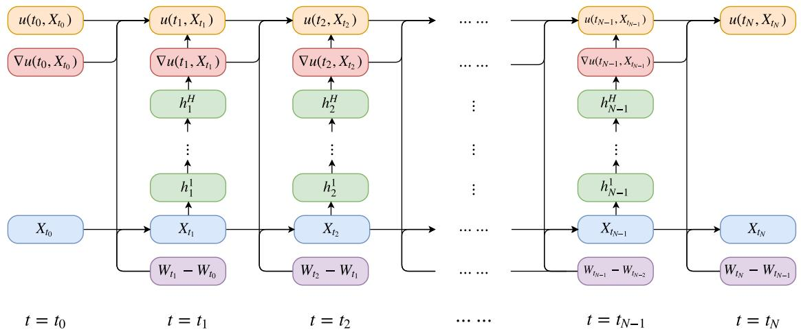

## 4.2 Allen-Cahn equation

In this section we test the deep BSDE solver in the case of an 100-dimensional Allen-Cahn PDE with a cubic nonlinearity (see (35) below).

More specifically, assume the setting in the Subsection 4.1 and assume for all $s , t \in$ $\begin{array} { r } { [ 0 , T ] , \ x , w \ \in \ \mathbb { R } ^ { d } , \ y \in \mathbb { R } , \ z \in \ \mathbb { R } ^ { 1 \times d } , \ m \ \in \mathbb { N } \ \mathrm { t h a t } \ \gamma _ { m } \ = \ 5 \cdot 1 0 ^ { - 4 } , \ d = \ 1 0 0 , \ T \ = \ \frac { 3 } { 1 0 } , } \end{array}$ $N = 2 0 , \mu ( t , x ) = 0 , \sigma ( t , x ) w = { \sqrt { 2 } } w , \xi = ( 0 , 0 , \ldots , 0 ) \in \mathbb { R } ^ { d } , { \mathrm { ~ } } \mathbb { { Y } } ( s , t , x , w ) = x + { \sqrt { 2 } } w ,$ $f ( t , x , y , z ) = y - y ^ { 3 }$ , and $\begin{array} { r } { g ( x ) = \left[ 2 + \frac { 2 } { 5 } \| x \| _ { \mathbb { R } ^ { d } } ^ { 2 } \right] ^ { - 1 } } \end{array}$ . Note that the solution u of the PDE (30) then satisfies for all $t \in [ 0 , T )$ , $x \in \mathbb { R } ^ { d }$ that $u ( T , x ) = g ( x )$ and

$$
\frac { \partial u } { \partial t } ( t , x ) + u ( t , x ) - \left[ u ( t , x ) \right] ^ { 3 } + ( \Delta _ { x } u ) ( t , x ) = 0 .\tag{35}
$$

In Table 1 we approximatively calculate the mean of $\mathcal { U } ^ { \Theta _ { m } }$ , the standard deviation of $\mathcal { U } ^ { \Theta _ { m } }$ the relative L<sup>1</sup>-approximatin error associated to $\mathcal { U } ^ { \Theta _ { m } }$ , the standard deviation of the relative L<sup>1</sup>-approximatin error associated to $\mathcal { U } ^ { \Theta _ { m } }$ , and the runtime in seconds needed to calculate one realization of $\mathcal { U } ^ { \Theta _ { m } }$ against $m \in \{ 0 , 1 0 0 0 , 2 0 0 0 , 3 0 0 0 , 4 0 0 0 \}$ based on 5 independent realizations (5 independent runs) (see also the Python code 1 below). Table 1 also depicts the mean of the loss function associated to $\Theta _ { m }$ and the standard deviation of the loss function associated to $\Theta _ { m }$ against $m \in \{ 0 , 1 0 0 0 , 2 0 0 0 , 3 0 0 0 , 4 0 0 0 \}$ based on 256 Monte Carlo samples and 5 independent realizations (5 independent runs). In addition, the relative L<sup>1</sup>-approximation error associated to $\mathcal { U } ^ { \Theta _ { m } }$ against $m \in \{ 1 , 2 , 3 , \ldots , 4 0 0 0 \}$ is pictured on the left hand side of Figure 2 based on 5 independent realizations (5 independent runs) and the mean of the loss function associated to $\Theta _ { m }$ against m $\in \{ 1 , 2 , 3 , . . . , 4 0 0 0 \}$ is pictured on the right hand side of Figure 2 based on 256 Monte Carlo samples and 5 independent realizations (5 independent runs). In the approximative computations of the relative $L ^ { 1 } -$

<!-- page: 13 -->

[Table source crop](assets/tables/2017-han-jentzen-e-deep-bsde-p0013-block-0001-f544fbaa8a929cba.jpg)
approximation errors in Table 1 and Figure 2 the value $u ( 0 , \xi ) = u ( 0 , 0 , \dots , 0 )$ of the exact solution u of the PDE (35) is replaced by the value 0.052802 which, in turn, is calculated by means of the Branching difusion method (see the Matlab code 2 below and see, e.g., [17, 19, 18] for analytical and numerical results for the Branching difusion method in the literature). Table 1: Numerical simulations for the deep BSDE solver in Subsection 3.2 in the case of the PDE (35).

## 4.3 A Hamilton-Jacobi-Bellman (HJB) equation

In this subsection we apply the deep BSDE solver in Subsection 3.2 to a Hamilton-Jacobi-Bellman (HJB) equation which admits an explicit solution that can be obtained through the Cole-Hopf transformation (cf., e.g., Chassagneux & Richou [7, Section 4.2] and Debnath [10, Section 8.4]).

Assume the setting in the Subsection 4.1 and assume for all $s , t \in [ 0 , T ] , \ x , w \in \mathbb { R } ^ { d }$ $y \in \mathbb { R } , \ z \in \mathbb { R } ^ { 1 \times d } , \ m \in \mathbb { N }$ that $\begin{array} { r } { d \ = \ 1 0 0 , \ T \ = \ 1 , \ N \ = \ 2 0 , \ \gamma _ { m } \ = \ \frac { 1 } { 1 0 0 } , \ \mu ( t , x ) \ = \ 0 } \end{array}$ $\begin{array} { r } { \sigma ( t , x ) w = \sqrt { 2 } w , \xi = ( 0 , 0 , \ldots , 0 ) \in \mathbb { R } ^ { d } , \Upsilon ( s , t , x , w ) = x + \sqrt { 2 } w , f ( t , x , y , z ) = - \| z \| _ { \mathbb { R } ^ { 1 \times d } } ^ { 2 } . } \end{array}$ and $g ( x ) = \ln ( \frac { 1 } { 2 } \left[ 1 + \left. x \right. _ { \mathbb { R } ^ { d } } ^ { 2 } \right] )$ . Note that the solution u of the PDE (30) then satisfies for all $t \in [ 0 , T ) , x \mathbf { \bar { \theta } } \in \mathbb { R } ^ { d }$ that $u ( T , x ) = g ( x )$ and

$$
\frac { \partial u } { \partial t } ( t , x ) + ( \Delta _ { x } u ) ( t , x ) = \| ( \nabla _ { x } u ) ( t , x ) \| _ { \mathbb { R } ^ { d } } ^ { 2 } .\tag{36}
$$

In Table 2 we approximatively calculate the mean of $\mathcal { U } ^ { \Theta _ { m } }$ , the standard deviation of $\mathcal { U } ^ { \Theta _ { m } }$ the relative $L ^ { 1 } { \mathrm { - a p p r o x i m a t i n } }$ error associated to $\mathcal { U } ^ { \Theta _ { m } }$ , the standard deviation of the relative L<sup>1</sup>-approximatin error associated to $\mathcal { U } ^ { \Theta _ { m } }$ , and the runtime in seconds needed to calculate one realization of $\mathcal { U } ^ { \Theta _ { m } }$ against $m \in \{ 0 , 5 0 0 , 1 0 0 0 , 1 5 0 0 , 2 0 0 0 \}$ based on 5 independent realizations (5 independent runs). Table 2 also depicts the mean of the loss function associated to $\Theta _ { m }$ and the standard deviation of the loss function associated to $\Theta _ { m }$ against $m \in \{ 0 , 5 0 0 , 1 0 0 0$ , 1500, 2000} based on 256 Monte Carlo samples and 5 independent realizations (5 independent runs). In addition, the relative $L ^ { 1 } { \mathrm { - a p p r o x i m a t i o n } }$ error associated to $\mathcal { U } ^ { \Theta _ { m } }$ against $m \in \{ 1 , 2 , 3 , \ldots , 2 0 0 0 \}$ is pictured on the left hand side of Figure 3 based on 5 independent realizations (5 independent runs) and the mean of the loss function associated to $\Theta _ { m }$ against $m \in \{ 1 , 2 , 3 , \ldots , 2 0 0 0 \}$ is pictured on the right hand side of Figure 3 based on 256 Monte Carlo samples and 5 independent realizations (5 independent runs). In the approximative computations of the relative $L ^ { 1 } { \mathrm { - a p p r o x i m a t } }$ ion errors in Table 2 and Figure 3 the value $u ( 0 , \xi ) = u ( 0 , 0 , \dots , 0 )$ of the exact solution u of the PDE (35) is replaced by the value 4.5901 which, in turn, is calculated by means of Lemma 4.2 below (with $d = 1 0 0 , T = 1 , \alpha = 1 , \beta = - 1 , g = \mathbb { R } ^ { d } \ni x \mapsto \ln ( { \textstyle { \frac { 1 } { 2 } } } \left[ 1 + \| x \| _ { \mathbb { R } ^ { d } } ^ { 2 } \right] ) \in \mathbb { R }$ in the notation of Lemma 4.2) and a classical Monte Carlo method (see the Matlab code 3 below).

<!-- page: 14 -->

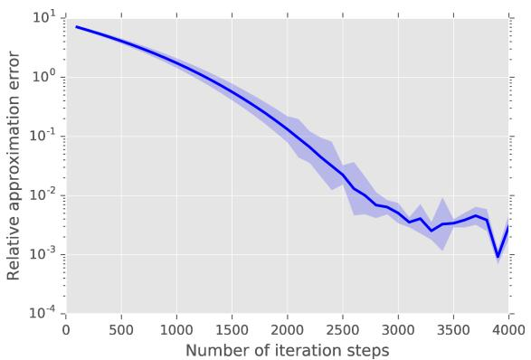


Lemma 4.2 (Cf., e.g., Section 4.2 in $[ 7 ]$ and Section 8.4 in [10]). Let $d \in \mathbb { N } , T , \alpha \in$ $( 0 , \infty ) , \beta \in \mathbb { R } \backslash \{ 0 \}$ , let $( \Omega , \mathcal { F } , \mathbb { P } )$ be a probability space, let $W \colon [ 0 , T ] \times \Omega \mathbb { R } ^ { d }$ be a $d -$ dimensional standard Brownian motion, let $g \in C ^ { 2 } ( { \mathbb { R } } ^ { d } , { \mathbb { R } } )$ be a function which satisfies $\mathrm { s u p } _ { x \in \mathbb { R } ^ { d } } \left[ \beta g ( x ) \right] < \infty$ , let $f \colon [ 0 , T ] \times { \mathbb { R } } ^ { d } \times { \mathbb { R } } \times { \mathbb { R } } ^ { d } \to$ R be the function which satisfies for all $t \in [ 0 , T ] , x = ( x _ { 1 } , \ldots , x _ { d } ) , z = ( z _ { 1 } , \ldots , z _ { d } ) \in \mathbb { R } ^ { d } , y \in \mathbb { R }$ that

$$
\begin{array} { r } { f ( t , x , y , z ) = \beta \| z \| _ { \mathbb { R } ^ { d } } ^ { 2 } = \beta \sum _ { i = 1 } ^ { d } | z _ { i } | ^ { 2 } , } \end{array}\tag{37}
$$

<!-- page: 15 -->

[Table source crop](assets/tables/2017-han-jentzen-e-deep-bsde-p0015-block-0001-f29441db50ba8250.jpg)
Table 2: Numerical simulations for the deep BSDE solver in Subsection 3.2 in the case of the PDE (36).

and let $u \colon [ 0 , T ] \times \mathbb { R } ^ { d } \mathbb { R }$ be the function which satisfies for all $( t , x ) \in [ 0 , T ] \times \mathbb { R } ^ { d }$ that

$$
u ( t , x ) = \frac { \alpha } { \beta } \ln \bigg ( \mathbb { E } \Big [ \exp \Big ( \frac { \beta g ( x + W _ { T - t } \sqrt { 2 \alpha } ) } { \alpha } \Big ) \Big ] \bigg ) .\tag{38}
$$

Then

(i) it holds that $u \colon [ 0 , T ] \times \mathbb { R } ^ { d } \mathbb { R }$ is a continuous function,

(ii) it holds that $u | _ { [ 0 , T ) \times \mathbb { R } ^ { d } } \in C ^ { 1 , 2 } ( [ 0 , T ) \times \mathbb { R } ^ { d } , \mathbb { R } )$ , and

(iii) it holds for all $( t , x ) \in [ 0 , T ) \times { \mathbb { R } } ^ { d }$ that $u ( T , x ) = g ( x )$ and

$$
\begin{array} { l } { \displaystyle \frac { \partial u } { \partial t } ( t , x ) + \alpha ( \Delta _ { x } u ) ( t , x ) + f \big ( t , x , u ( t , x ) , ( \nabla _ { x } u ) ( t , x ) \big ) } \\ { \displaystyle = \frac { \partial u } { \partial t } ( t , x ) + \alpha ( \Delta _ { x } u ) ( t , x ) + \beta \| ( \nabla _ { x } u ) ( t , x ) \| _ { \mathbb { R } ^ { d } } ^ { 2 } } \\ { \displaystyle = \frac { \partial u } { \partial t } ( t , x ) + \alpha ( \Delta _ { x } u ) ( t , x ) + \beta \displaystyle \sum _ { j = 1 } ^ { d } \left| \frac { \partial u } { \partial x _ { j } } ( t , x ) \right| ^ { 2 } = 0 . } \end{array}\tag{39}
$$

Proof of Lemma 4.2. Throughout this proof let $\textstyle c = { \frac { \alpha } { \beta } } \in \mathbb { R } \backslash \{ 0 \}$ and let $\mathcal { V } \colon { \mathbb { R } ^ { d } } \to ( 0 , \infty )$ and $v \colon [ 0 , T ] \times \mathbb { R } ^ { d } \to ( 0 , \infty )$ be the functions which satisfy for all $t \in [ 0 , T ] , x \in \mathbb { R } ^ { d }$ that

$$
\mathcal { V } ( x ) = \exp \Big ( \frac { g ( x ) } { c } \Big ) = \exp \Big ( \frac { \beta g ( x ) } { \alpha } \Big ) \qquad \mathrm { a n d } \qquad v ( t , x ) = \mathbb { E } \big [ \mathcal { V } \big ( x + W _ { T - t } \sqrt { 2 \alpha } \big ) \big ] .\tag{40}
$$

<!-- page: 16 -->

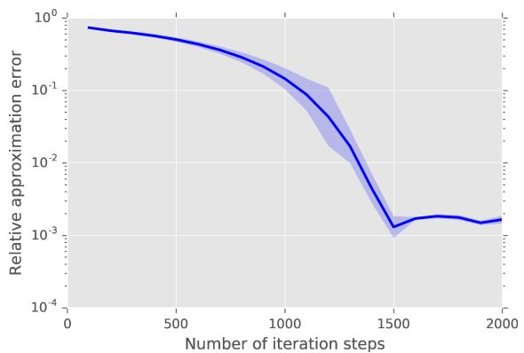

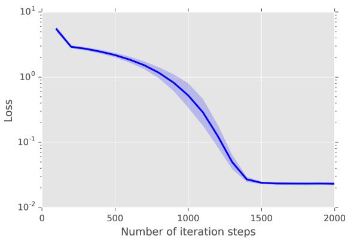

Figure 3: Relative $L ^ { 1 } .$ -approximation error of $\mathcal { U } ^ { \Theta _ { m } }$ and mean of the loss function against m $\in \{ 1 , 2 , 3 , \dots , 2 0 0 0 \}$ . The deep BSDE approximation $\mathcal { U } ^ { \Theta _ { 2 0 0 0 } } \approx u ( 0 , \xi )$ achieves a relative L<sup>1</sup>-approximation error of size 0.0017 in a runtime of 283 seconds.

Observe that the hypothesis that $\mathrm { s u p } _ { x \in \mathbb { R } ^ { d } } \left[ \beta g ( x ) \right] < \infty$ ensures that for all $\omega \in \Omega$ it holds that

$$
\begin{array} { r l r } {  { \operatorname* { s u p } _ { t \in [ 0 , T ] } \operatorname* { s u p } _ { x \in \mathbb { R } ^ { d } } \big | \mathcal { V } \big ( x + W _ { T - t } ( \omega ) \sqrt { 2 \alpha } \big ) \big | \leq \operatorname* { s u p } _ { x \in \mathbb { R } ^ { d } } | \mathcal { V } ( x ) | = \operatorname* { s u p } _ { x \in \mathbb { R } ^ { d } } \mathcal { V } ( x ) } } \\ & { } & { = \exp \bigg ( \frac { \operatorname* { s u p } _ { x \in \mathbb { R } ^ { d } } \big [ \beta g ( x ) \big ] } { \alpha } \bigg ) < \infty . } \end{array}\tag{41}
$$

Combining this with Lebesgue’s theorem of dominated convergence ensures that $v \colon [ 0 , T ] \times$ $\mathbb { R } ^ { d } \to ( 0 , \infty )$ is a continuous function. This and the fact that

$$
\forall ( t , x ) \in [ 0 , T ] \times \mathbb { R } ^ { d } \colon u ( t , x ) = c \ln ( v ( t , x ) )\tag{42}
$$

establish Item (i). Next note that the Feynman-Kac formula ensures that for all $t \in [ 0 , T )$ $\boldsymbol { x } \in \mathbb { R } ^ { d }$ it holds that $v | _ { [ 0 , T ) \times \mathbb { R } ^ { d } } \in C ^ { 1 , 2 } ( [ 0 , T ) \times \mathbb { R } ^ { d } , ( 0 , \infty ) )$ and

$$
\frac { \partial v } { \partial t } ( t , x ) + \alpha ( \Delta _ { x } v ) ( t , x ) = 0 .\tag{43}
$$

This and (42) demonstrate Item (ii). It thus remains to prove Item (iii). For this note that the chain rule and (42) imply that for all $t \in [ 0 , T ) , x = ( x _ { 1 } , \ldots , x _ { d } ) \in \mathbb { R } ^ { d } , i \in \{ 1 , 2 , \ldots , d \}$ it holds that

$$
{ \frac { \partial u } { \partial t } } ( t , x ) = { \frac { c } { v ( t , x ) } } \cdot { \frac { \partial v } { \partial t } } ( t , x ) \qquad { \mathrm { a n d } } \qquad { \frac { \partial u } { \partial x _ { i } } } ( t , x ) = { \frac { c } { v ( t , x ) } } \cdot { \frac { \partial v } { \partial x _ { i } } } ( t , x ) .\tag{44}
$$

<!-- page: 17 -->

Again the chain rule and (42) hence ensure that for all $t \in [ 0 , T ) , x = ( x _ { 1 } , \ldots , x _ { d } ) \in \mathbb { R } ^ { d }$ $i \in \{ 1 , 2 , \ldots , d \}$ it holds that

$$
\frac { \partial u ^ { 2 } } { \partial x _ { i } ^ { 2 } } ( t , x ) = \frac { c } { v ( t , x ) } \cdot \frac { \partial v ^ { 2 } } { \partial x _ { i } ^ { 2 } } ( t , x ) - \frac { c } { \left[ v ( t , x ) \right] ^ { 2 } } \cdot \left[ \frac { \partial v } { \partial x _ { i } } ( t , x ) \right] ^ { 2 } .\tag{45}
$$

This assures that for all $t \in [ 0 , T ) , x = ( x _ { 1 } , \ldots , x _ { d } ) \in \mathbb { R } ^ { d } , i \in \{ 1 , 2 , \ldots , d \}$ it holds that

$$
\begin{array} { l } { \displaystyle \alpha ( \Delta _ { x } u ) ( t , x ) = \frac { \alpha c } { v ( t , x ) } \cdot ( \Delta _ { x } v ) ( t , x ) - \frac { \alpha c } { \left[ v ( t , x ) \right] ^ { 2 } } \cdot \sum _ { i = 1 } ^ { d } \left[ \frac { \partial v } { \partial x _ { i } } ( t , x ) \right] ^ { 2 } } \\ { \displaystyle \qquad = \frac { \alpha c ( \Delta _ { x } v ) ( t , x ) } { v ( t , x ) } - \frac { \alpha c \| ( \nabla _ { x } v ) ( t , x ) \| _ { \mathbb { R } ^ { d } } ^ { 2 } } { \left[ v ( t , x ) \right] ^ { 2 } } . } \end{array}\tag{46}
$$

Combining this with (44) demonstrates that for all $t \in [ 0 , T ) , x \in \mathbb { R } ^ { d }$ it holds that

$$
\begin{array} { r l } & { \displaystyle \frac { \partial u } { \partial t } ( t , x ) + \alpha ( \Delta _ { x } u ) ( t , x ) + \beta \left\| ( \nabla _ { x } u ) ( t , x ) \right\| _ { \mathbb { R } ^ { d } } ^ { 2 } } \\ & { = \displaystyle \frac { c } { v ( t , x ) } \cdot \frac { \partial v } { \partial t } ( t , x ) + \frac { \alpha c ( \Delta _ { x } v ) ( t , x ) } { v ( t , x ) } - \frac { \alpha c \left\| ( \nabla _ { x } v ) ( t , x ) \right\| _ { \mathbb { R } ^ { d } } ^ { 2 } } { [ v ( t , x ) ] ^ { 2 } } + \beta \left\| ( \nabla _ { x } u ) ( t , x ) \right\| _ { \mathbb { R } ^ { d } } ^ { 2 } . } \end{array}\tag{47}
$$

Equation (43) hence shows that for all $t \in [ 0 , T ) , x = ( x _ { 1 } , \ldots , x _ { d } ) \in \mathbb { R } ^ { d }$ it holds that

$$
\begin{array} { r l } & { \frac { \partial u } { \partial t } ( t , \boldsymbol { x } ) + \alpha ( \Delta _ { \boldsymbol { x } } u ) ( t , \boldsymbol { x } ) + \beta \left. ( \nabla _ { \boldsymbol { x } } u ) ( t , \boldsymbol { x } ) \right. _ { \mathbb { R } ^ { d } } ^ { 2 } } \\ & { \ = \beta \left. ( \nabla _ { \boldsymbol { x } } u ) ( t , \boldsymbol { x } ) \right. _ { \mathbb { R } ^ { d } } ^ { 2 } - \frac { \alpha c \left. ( \nabla _ { \boldsymbol { x } } v ) ( t , \boldsymbol { x } ) \right. _ { \mathbb { R } ^ { d } } ^ { 2 } } { \left[ v ( t , \boldsymbol { x } ) \right] ^ { 2 } } } \\ & { \ = \beta \left[ \displaystyle \sum _ { i = 1 } ^ { d } \left| \frac { \partial u } { \partial x _ { i } } ( t , \boldsymbol { x } ) \right| ^ { 2 } \right] - \frac { \alpha c \left. ( \nabla _ { \boldsymbol { x } } v ) ( t , \boldsymbol { x } ) \right. _ { \mathbb { R } ^ { d } } ^ { 2 } } { \left[ v ( t , \boldsymbol { x } ) \right] ^ { 2 } } . } \end{array}\tag{48}
$$

This and (44) demonstrate that for all $t \in [ 0 , T ) , x = ( x _ { 1 } , \ldots , x _ { d } ) \in \mathbb { R } ^ { d }$ it holds that

$$
\begin{array} { l } { \displaystyle \frac { \partial u } { \partial t } ( t , x ) + \alpha ( \Delta _ { x } u ) ( t , x ) + \beta \| ( \nabla _ { x } u ) ( t , x ) \| _ { \mathbb { R } ^ { d } } ^ { 2 } } \\ { = \beta \left[ \displaystyle \sum _ { i = 1 } ^ { d } \left| \frac { c } { v ( t , x ) } \cdot \frac { \partial v } { \partial x _ { i } } ( t , x ) \right| ^ { 2 } \right] - \frac { \alpha c \| ( \nabla _ { x } v ) ( t , x ) \| _ { \mathbb { R } ^ { d } } ^ { 2 } } { [ v ( t , x ) ] ^ { 2 } } } \\ { = \frac { c ^ { 2 } \beta } { [ v ( t , x ) ] ^ { 2 } } \left[ \displaystyle \sum _ { i = 1 } ^ { d } \left| \frac { \partial v } { \partial x _ { i } } ( t , x ) \right| ^ { 2 } \right] - \frac { \alpha c \| ( \nabla _ { x } v ) ( t , x ) \| _ { \mathbb { R } ^ { d } } ^ { 2 } } { [ v ( t , x ) ] ^ { 2 } } } \\ { = \frac { [ c ^ { 2 } \beta - c \alpha ] \| ( \nabla _ { x } v ) ( t , x ) \| _ { \mathbb { R } ^ { d } } ^ { 2 } } { [ v ( t , x ) ] ^ { 2 } } = 0 . } \end{array}\tag{49}
$$

<!-- page: 18 -->

This and the fact that

$$
\forall x \in \mathbb { R } ^ { d } \colon u ( T , x ) = c \ln ( v ( T , x ) ) = c \ln ( \mathcal { V } ( x ) ) = c \ln \left( \exp \left( \frac { g ( x ) } { c } \right) \right) = g ( x )\tag{50}
$$

establish Item (iii). The proof of Lemma 4.2 is thus completed.

## 4.4 Pricing of European financial derivatives with diferent interest rates for borrowing and lending

In this subsection we apply the deep BSDE solver to a pricing problem of an European financial derivative in a financial market where the risk free bank account used for the hedging of the financial derivative has diferent interest rates for borrowing and lending (see Bergman [4] and, e.g., [12, 2, 3, 5, 8, 11] where this example has been used as a test example for numerical methods for BSDEs).

Assume the setting in Subsection 4.1, let $\textstyle { \bar { \mu } } = { \frac { 6 } { 1 0 0 } } , { \bar { \sigma } } = { \frac { 2 } { 1 0 } } , R ^ { l } = { \frac { 4 } { 1 0 0 } } , R ^ { b } = { \frac { 6 } { 1 0 0 } }$ , and assume for all $s , t \in [ 0 , T ] , \ x = ( x _ { 1 } , \ldots , x _ { d } ) , w = \overleftarrow { ( w _ { 1 } , \ldots , w _ { d } ) } \in \mathbb { R } ^ { d } , \overleftarrow { y } \in \mathbb { R } , \ z \in \mathbb { R } ^ { 1 \times d } ,$ $m \in \mathbb { N }$ that $d = 1 0 0 , T = 1 / 2 , N = 2 0 , \gamma _ { m } = 5 \cdot 1 0 ^ { - 3 } = 0 . 0 0 5 , \mu ( t , x ) = \bar { \mu } x , \sigma ( t , x ) = 0 . 0 0 5 , T = 1 0 0 , T = 1 0 0 0$ $\bar { \sigma } \mathrm { d i a g } _ { \mathbb { R } ^ { d \times d } } ( x _ { 1 } , \dots , x _ { d } ) , \xi = ( 1 0 0 , 1 0 0 , \dots , 1 0 0 ) \in \mathbb { R } ^ { d }$ , and

$$
g ( x ) = \operatorname* { m a x } \left\{ \left[ \operatorname* { m a x } _ { 1 \leq i \leq 1 0 0 } x _ { i } \right] - 1 2 0 , 0 \right\} - 2 \operatorname* { m a x } \left\{ \left[ \operatorname* { m a x } _ { 1 \leq i \leq 1 0 0 } x _ { i } \right] - 1 5 0 , 0 \right\} ,\tag{51}
$$

$$
\Upsilon ( s , t , x , w ) = \exp \left( \left( \bar { \mu } - \frac { \bar { \sigma } ^ { 2 } } { 2 } \right) ( t - s ) \right) \exp \left( \bar { \sigma } \mathrm { d i a g } _ { \mathbb { R } ^ { d \times d } } ( w _ { 1 } , \dots , w _ { d } ) \right) x ,\tag{52}
$$

$$
f ( t , x , y , z ) = - R ^ { l } y - \frac { ( \bar { \mu } - R ^ { l } ) } { \bar { \sigma } } \sum _ { i = 1 } ^ { d } z _ { i } + ( R ^ { b } - R ^ { l } ) \operatorname* { m a x } \left\{ 0 , \left[ \frac 1 { \bar { \sigma } } \sum _ { i = 1 } ^ { d } z _ { i } \right] - y \right\} .\tag{53}
$$

Note that the solution u of the PDE (30) then satisfies for all $t \in [ 0 , T ) , x = ( x _ { 1 } , x _ { 2 } , \ldots , x _ { d } ) \in$ $\mathbb { R } ^ { d }$ that $u ( T , x ) = g ( x )$ and

$$
{ \frac { \partial u } { \partial t } } ( t , x ) + f { \big ( } t , x , u ( t , x ) , { \bar { \sigma } } \ \mathrm { d i a g } _ { \mathbb { R } ^ { d \times d } } ( x _ { 1 } , \ldots , x _ { d } ) ( \nabla _ { x } u ) ( t , x ) { \big ) } + { \bar { \mu } } \sum _ { i = 1 } ^ { d } x _ { i } { \frac { \partial u } { \partial x _ { i } } } ( t , x )
$$

$$
+ \frac { \bar { \sigma } ^ { 2 } } { 2 } \sum _ { i = 1 } ^ { d } | x _ { i } | ^ { 2 } \frac { \partial ^ { 2 } u } { \partial x _ { i } ^ { 2 } } ( t , x ) = 0 .\tag{54}
$$

Hence, we obtain for all $t \in [ 0 , T ) , x = ( x _ { 1 } , x _ { 2 } , \ldots , x _ { d } ) \in \mathbb { R } ^ { d }$ that $u ( T , x ) = g ( x )$ and

$$
\begin{array} { r l } & { \displaystyle \frac { \partial u } { \partial t } ( t , x ) + \frac { \bar { \sigma } ^ { 2 } } { 2 } \sum _ { i = 1 } ^ { d } \vert x _ { i } \vert ^ { 2 } \frac { \partial ^ { 2 } u } { \partial x _ { i } ^ { 2 } } ( t , x ) } \\ & { \displaystyle + \operatorname* { m a x } \Bigl \{ R ^ { b } \left( \left[ \sum _ { i = 1 } ^ { d } x _ { i } \left( \frac { \partial u } { \partial x _ { i } } \right) ( t , x ) \right] - u ( t , x ) \right) , R ^ { l } \left( \left[ \sum _ { i = 1 } ^ { d } x _ { i } \left( \frac { \partial u } { \partial x _ { i } } \right) ( t , x ) \right] - u ( t , x ) \right) \Bigl \} = 0 . } \end{array}\tag{55}
$$

<!-- page: 19 -->

This shows that for all $t \in [ 0 , T ) , x = ( x _ { 1 } , x _ { 2 } , \ldots , x _ { d } ) \in \mathbb { R } ^ { d }$ it holds that $u ( T , x ) = g ( x )$ and

$$
\begin{array} { r l r } {  { \frac { \partial u } { \partial t } ( t , x ) + \frac { \bar { \sigma } ^ { 2 } } { 2 } \sum _ { i = 1 } ^ { d } | x _ { i } | ^ { 2 } \frac { \partial ^ { 2 } u } { \partial x _ { i } ^ { 2 } } ( t , x ) } } \\ & { } & { \qquad - \operatorname* { m i n } \Biggl \{ R ^ { b } \bigg ( u ( t , x ) - \sum _ { i = 1 } ^ { d } x _ { i } \frac { \partial u } { \partial x _ { i } } ( t , x ) \bigg ) , R ^ { l } \bigg ( u ( t , x ) - \sum _ { i = 1 } ^ { d } x _ { i } \frac { \partial u } { \partial x _ { i } } ( t , x ) \bigg ) \Biggr \} = 0 . } \end{array}\tag{56}
$$

In Table 3 we approximatively calculate the mean of $\mathcal { U } ^ { \Theta _ { m } }$ , the standard deviation of $\mathcal { U } ^ { \Theta _ { m } }$ the relative $L ^ { 1 } { \mathrm { - a p p r o x i m a t i n } }$ error associated to $\mathcal { U } ^ { \Theta _ { m } }$ , the standard deviation of the relative $L ^ { 1 } .$ -approximatin error associated to $\mathcal { U } ^ { \Theta _ { m } }$ , and the runtime in seconds needed to calculate one realization of $\mathcal { U } ^ { \Theta _ { m } }$ against $m \in \{ 0 , 1 0 0 0 , 2 0 0 0 , 3 0 0 0 , 4 0 0 0 \}$ based on 5 independent realizations (5 independent runs). Table 3 also depicts the mean of the loss function associated to $\Theta _ { m }$ and the standard deviation of the loss function associated to $\Theta _ { m }$ against $m \in \{ 0 ,$ , 1000, 2000, 3000, 4000} based on 256 Monte Carlo samples and 5 independent realizations (5 independent runs). In addition, the relative L<sup>1</sup>-approximation error associated to $\mathcal { U } ^ { \Theta _ { m } }$ against $m \in \{ 1 , 2 , 3 , . . . , 4 0 0 0 \}$ is pictured on the left hand side of Figure 4 based on 5 independent realizations (5 independent runs) and the mean of the loss function associated to $\Theta _ { m }$ against $m \in \{ 1 , 2 , 3 , \ldots , 4 0 0 0 \}$ is pictured on the right hand side of Figure 4 based on 256 Monte Carlo samples and 5 independent realizations (5 independent runs). In the approximative computations of the relative $L ^ { 1 } { \mathrm { - a p p r o x i m a t i o n } }$ errors in Table 3 and Figure 4 the value $u ( 0 , \xi ) = u ( 0 , 0 , \dots , 0 )$ of the exact solution u of the PDE (56) is replaced by the value 21.299 which, in turn, is calculated by means of the multilevel-Picard approximation method in E et al. [11] (see [11, $\rho = 7$ in Table 6 in Section 4.3]).

[Table source crop](assets/tables/2017-han-jentzen-e-deep-bsde-p0019-block-0004-f2bbc2f976fed660.jpg)
Table 3: Numerical simulations for the deep BSDE solver in Subsection 3.2 in the case of the PDE (56).

<!-- page: 20 -->

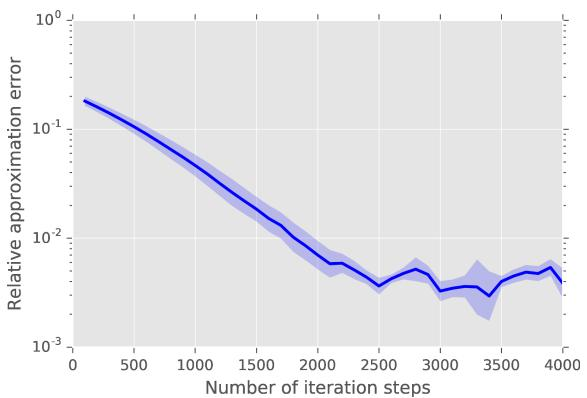

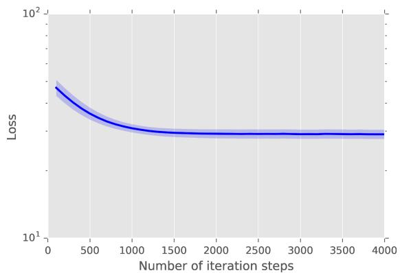

Figure 4: Relative $L ^ { 1 } .$ -approximation error of $\mathcal { U } ^ { \Theta _ { m } }$ and mean of the loss function against $m \in \{ 1 , 2 , 3 , . . . , 4 0 0 0 \}$ in the case of the PDE (56). The deep BSDE approximation $\mathcal { U } ^ { \Theta _ { 4 0 0 0 } } \approx u ( 0 , \xi )$ achieves a relative $L ^ { 1 } { \mathrm { - a p p r o x i m a t i o n } }$ error of size 0.0039 in a runtime of 566 seconds.

## 4.5 Multidimensional Burgers-type PDEs with explicit solutions

In this subsection we consider a high-dimensional version of the example analyzed numerically in Chassagneux [6, Example 4.6 in Subsection 4.2].

More specifically, assume the setting in Subsection 4.1, and assume for all $s , t \in [ 0 , T ]$ $x = ( x _ { 1 } , \ldots , x _ { d } ) , w = ( w _ { 1 } , \ldots , w _ { d } ) \in \mathbb { R } ^ { d } , y \in \mathbb { R } , z = ( z _ { i } ) _ { i \in \{ 1 , 2 , \ldots , d \} } \in \mathbb { R } ^ { 1 \times d }$ that $\mu ( t , x ) = 0$ $\begin{array} { r } { \sigma ( t , x ) w = \frac { d } { \sqrt { 2 } } w , \xi = ( 0 , 0 , \dots , 0 ) \in \mathbb { R } ^ { d } , \Upsilon ( s , t , x , w ) = x + \frac { d } { \sqrt { 2 } } w , } \end{array}$ and

$$
g ( x ) = { \frac { \exp ( T + { \frac { 1 } { d } } \sum _ { i = 1 } ^ { d } x _ { i } ) } { \left( 1 + \exp ( T + { \frac { 1 } { d } } \sum _ { i = 1 } ^ { d } x _ { i } ) \right) } } , \qquad f ( t , x , y , z ) = \left( y - { \frac { 2 + d } { 2 d } } \right) \left( \sum _ { i = 1 } ^ { d } z _ { i } \right) .\tag{57}
$$

Note that the solution u of the PDE (30) then satisfies for all $t \in [ 0 , T ) , x = ( x _ { 1 } , x _ { 2 } , \ldots , x _ { d } ) \in$ $\mathbb { R } ^ { d }$ that $u ( T , x ) = g ( x )$ and

$$
\frac { \partial u } { \partial t } ( t , x ) + \frac { d ^ { 2 } } { 2 } ( \Delta _ { x } u ) ( t , x ) + \left( u ( t , x ) - \frac { 2 + d } { 2 d } \right) \left( d \sum _ { i = 1 } ^ { d } \frac { \partial u } { \partial x _ { i } } ( t , x ) \right) = 0\tag{58}
$$

(cf. Lemma 4.3 below [with $\alpha = d ^ { 2 } , \kappa = 1 / d$ in the notation of Lemma 4.3 below]). On the left hand side of Figure 5 we present approximatively the relative $L ^ { 1 } .$ -approximatin error associated to $\mathcal { U } ^ { \Theta _ { m } }$ against $m \in \{ 1 , 2 , 3 , \ldots , 6 0 0 0 0 \}$ based on 5 independent realizations (5 independent runs) in the case

$$
T = 1 , \qquad d = 2 0 , \qquad N = 8 0 , \qquad \forall m \in \mathbb { N } \colon \gamma _ { m } = 1 0 ^ { ( \mathbb { 1 } _ { [ 1 , 3 0 0 0 0 ] } ( m ) + \mathbb { 1 } _ { [ 1 , 5 0 0 0 0 ] } ( m ) - 4 ) } .\tag{59}
$$

<!-- page: 21 -->

On the right hand side of Figure 5 we present approximatively the mean of the loss function associated to $\Theta _ { m }$ against $m \in \{ 1 , 2 , 3 , \ldots , 6 0 0 0 0 \}$ based on 256 Monte Carlo samples and 5 independent realizations (5 independent runs) in the case (59). On the left hand side of Figure 6 we present approximatively the relative $L ^ { 1 } .$ -approximatin error associated to $\mathcal { U } ^ { \Theta _ { m } }$ against $m \in \{ 1 , 2 , 3 , \ldots , 3 0 0 0 0 \}$ based on 5 independent realizations (5 independent runs) in the case

$$
T = { \frac { 2 } { 1 0 } } , \qquad d = 5 0 , \qquad N = 3 0 , \qquad \forall m \in \mathbb { N } \colon \gamma _ { m } = 1 0 ^ { ( 1 _ { [ 1 , 1 5 0 0 0 ] } ( m ) + 1 _ { [ 1 , 2 5 0 0 0 ] } ( m ) - 4 ) } .\tag{60}
$$

On the right hand side of Figure 6 we present approximatively the mean of the loss function associated to $\Theta _ { m }$ against $m \in \{ 1 , 2 , 3 , \ldots , 3 0 0 0 0 \}$ based on 256 Monte Carlo samples and 5 independent realizations (5 independent runs) in the case (60).

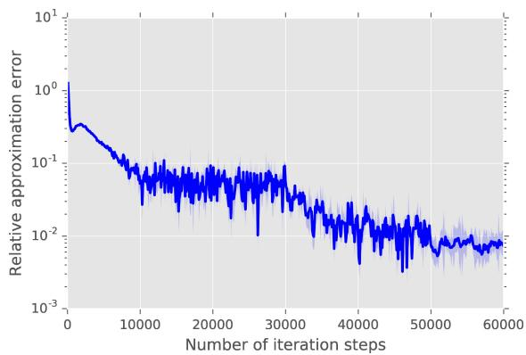

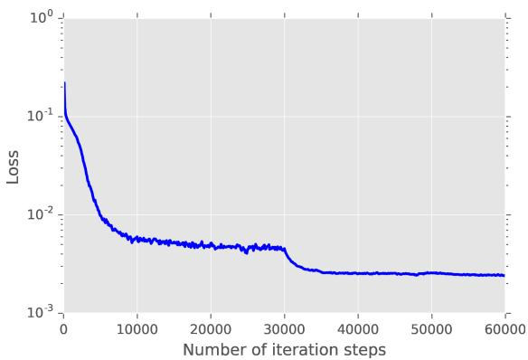

Figure 5: Relative L<sup>1</sup>-approximation error of $\mathcal { U } ^ { \Theta _ { m } }$ and mean of the loss function against $m \in \{ 1 , 2 , 3 , \ldots , 6 0 0 0 0 \}$ in the case of the PDE (58) with (59). The deep BSDE approximation $\mathcal { U } ^ { \Theta _ { 6 0 0 0 0 0 } } \approx u ( 0 , \xi )$ achieves a relative L<sup>1</sup>-approximation error of size 0.0073 in a runtime of 20 389 seconds.

Lemma 4.3 (Cf. Example 4.6 in Subsection 4.2 in [6]). Let $\alpha , \kappa , T \in ( 0 , \infty ) , d \in \mathbb { N }$ , let $u \colon [ 0 , T ] \times \mathbb { R } ^ { d } $ R be the function which satisfies for all $t \in [ 0 , T ] , x = ( x _ { 1 } , \ldots , x _ { d } ) \in \mathbb { R } ^ { d }$ that

$$
u ( t , x ) = 1 - \frac { 1 } { ( 1 + \exp ( t + \kappa \sum _ { i = 1 } ^ { d } x _ { i } ) ) } = \frac { \exp ( t + \kappa \sum _ { i = 1 } ^ { d } x _ { i } ) } { ( 1 + \exp ( t + \kappa \sum _ { i = 1 } ^ { d } x _ { i } ) ) } ,\tag{61}
$$

and let $f \colon [ 0 , T ] \times { \mathbb { R } } ^ { d } \times { \mathbb { R } } ^ { 1 + d } \to { \mathbb { R } }$ be the function which satisfies for all $t \in [ 0 , T ] , x \in \mathbb { R } ^ { d }$ 2 $y \in \mathbb { R } , z = ( z _ { 1 } , \ldots , z _ { d } ) \in \mathbb { R } ^ { d }$ that

$$
f ( t , x , y , z ) = \left( \alpha \kappa y - \frac { 1 } { d \kappa } - \frac { \alpha \kappa } { 2 } \right) \left( \sum _ { i = 1 } ^ { d } z _ { i } \right) .\tag{62}
$$

<!-- page: 22 -->

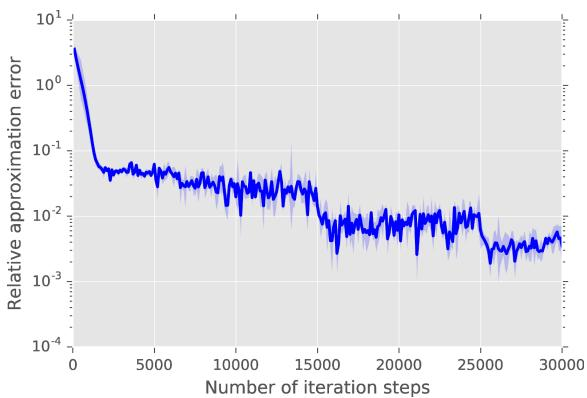

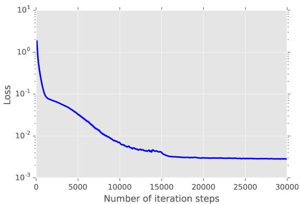

Figure 6: Relative $L ^ { 1 } .$ -approximation error of $\mathcal { U } ^ { \Theta _ { m } }$ and mean of the loss function against $m \in \{ 1 , 2 , 3 , \ldots , 3 0 0 0 0 \}$ in the case of the PDE (58) with (60). The deep BSDE approximation $\mathcal { U } ^ { \ominus _ { 3 0 0 0 0 } } \approx u ( 0 , \xi )$ achieves a relative L<sup>1</sup>-approximation error of size 0.0035 in a runtime of 4281 seconds.

Then it holds for all $t \in [ 0 , T ] , x \in \mathbb { R } ^ { d }$ that

$$
\frac { \partial u } { \partial t } ( t , x ) + \frac { \alpha } { 2 } ( \Delta _ { x } u ) ( t , x ) + f \big ( t , x , u ( t , x ) , ( \nabla _ { x } u ) ( t , x ) \big ) = 0 .\tag{63}
$$

Proof of Lemma $4 . 3 .$ Throughout this proof let $\beta , \gamma \in ( 0 , \infty )$ be the real numbers given by

$$
\beta = \alpha \kappa \qquad \mathrm { a n d } \qquad \gamma = \frac { 1 } { d \kappa } + \frac { \alpha \kappa } { 2 }\tag{64}
$$

and let $w \colon [ 0 , T ] \times \mathbb { R } ^ { d } \to ( 0 , \infty )$ be the function which satisfies for all $t \in [ 0 , T ]$ ， $x =$ $( x _ { 1 } , \ldots , x _ { d } ) \in \mathbb { R } ^ { d }$ that

$$
w ( t , x ) = \exp \left( t + \kappa \sum _ { i = 1 } ^ { d } x _ { i } \right) .\tag{65}
$$

Observe that for all $t \in [ 0 , T ] , x = ( x _ { 1 } , \ldots , x _ { d } ) \in \mathbb { R } ^ { d } , i \in \{ 1 , 2 , \ldots , d \}$ it holds that

$$
u ( t , x ) = 1 - \left[ 1 + w ( t , x ) \right] ^ { - 1 } = { \frac { \left[ 1 + w ( t , x ) \right] } { \left[ 1 + w ( t , x ) \right] } } - { \frac { 1 } { \left[ 1 + w ( t , x ) \right] } } = { \frac { w ( t , x ) } { 1 + w ( t , x ) } } ,\tag{66}
$$

$$
\frac { \partial u } { \partial t } ( t , x ) = \left[ 1 + w ( t , x ) \right] ^ { - 2 } \cdot \frac { \partial w } { \partial t } ( t , x ) = \frac { w ( t , x ) } { \left[ 1 + w ( t , x ) \right] ^ { 2 } } ,\tag{67}
$$

and

$$
\frac { \partial u } { \partial x _ { i } } ( t , x ) = \left[ 1 + w ( t , x ) \right] ^ { - 2 } \cdot \frac { \partial w } { \partial x _ { i } } ( t , x ) = \kappa w ( t , x ) \left[ 1 + w ( t , x ) \right] ^ { - 2 } .\tag{68}
$$

<!-- page: 23 -->

Note that (66), (67), and (68) ensure that for all $t \in [ 0 , T ] , x \in \mathbb { R } ^ { d }$ it holds that

$$
\begin{array} { r l } & { \displaystyle \frac { \partial u } { \partial t } ( t , x ) + \frac { \alpha } { 2 } ( \Delta _ { x } u ) ( t , x ) + f \big ( t , x , u ( t , x ) , ( \nabla _ { x } u ) ( t , x ) \big ) } \\ & { \displaystyle = \frac { \partial u } { \partial t } ( t , x ) + \frac { \alpha } { 2 } ( \Delta _ { x } u ) ( t , x ) + \big ( \beta u ( t , x ) - \gamma \big ) \left( \frac { d } { i = 1 } \frac { \partial u } { \partial x _ { i } } ( t , x ) \right) } \\ & { \displaystyle = \frac { \partial u } { \partial t } ( t , x ) + \frac { \alpha } { 2 } ( \Delta _ { x } u ) ( t , x ) + d \frac { \partial u } { \partial x _ { 1 } } ( t , x ) \big ( \beta u ( t , x ) - \gamma \big ) } \\ & { \displaystyle = \frac { w ( t , x ) } { \big [ 1 + w ( t , x ) \big ] ^ { 2 } } + \frac { \alpha } { 2 } ( \Delta _ { x } u ) ( t , x ) + \frac { d \kappa w ( t , x ) } { \big [ 1 + w ( t , x ) \big ] ^ { 2 } } \left( \frac { \beta w ( t , x ) } { \big [ 1 + w ( t , x ) \big ] } - \gamma \right) . } \end{array}\tag{69}
$$

Moreover, observe that (68) demonstrates that for all $t \in [ 0 , T ] , x \in \mathbb { R } ^ { d }$ it holds that

$$
\begin{array} { l } { \displaystyle \frac { \partial ^ { 2 } u } { \partial x _ { i } ^ { 2 } } ( t , x ) = \kappa \frac { \partial w } { \partial x _ { i } } ( t , x ) \left[ 1 + w ( t , x ) \right] ^ { - 2 } - 2 \kappa w ( t , x ) \left[ 1 + w ( t , x ) \right] ^ { - 3 } \frac { \partial w } { \partial x _ { i } } ( t , x ) } \\ { \displaystyle \qquad = \frac { \kappa ^ { 2 } w ( t , x ) } { \left[ 1 + w ( t , x ) \right] ^ { 2 } } - \frac { 2 \kappa ^ { 2 } | w ( t , x ) | ^ { 2 } } { \left[ 1 + w ( t , x ) \right] ^ { 3 } } = \frac { \kappa ^ { 2 } w ( t , x ) } { \left[ 1 + w ( t , x ) \right] ^ { 2 } } \left[ 1 - \frac { 2 w ( t , x ) } { \left[ 1 + w ( t , x ) \right] } \right] . } \end{array}\tag{70}
$$

Hence, we obtain that for all $t \in [ 0 , T ] , x \in \mathbb { R } ^ { d }$ it holds that

$$
\frac { \alpha } { 2 } ( \Delta _ { x } u ) ( t , x ) = \frac { d \alpha } { 2 } \frac { \partial ^ { 2 } u } { \partial x _ { 1 } ^ { 2 } } ( t , x ) = \frac { d \alpha \kappa ^ { 2 } w ( t , x ) } { 2 \left[ 1 + w ( t , x ) \right] ^ { 2 } } \left[ 1 - \frac { 2 w ( t , x ) } { \left[ 1 + w ( t , x ) \right] } \right] .\tag{71}
$$

Combining this with (69) implies that for all $t \in [ 0 , T ] , x \in \mathbb { R } ^ { d }$ it holds that

$$
\begin{array} { l } { \displaystyle \frac { \partial u } { \partial t } ( t , x ) + \frac { \alpha } { 2 } ( \Delta _ { x } u ) ( t , x ) + f \big ( t , x , u ( t , x ) , ( \nabla _ { x } u ) ( t , x ) \big ) } \\ { \displaystyle = \frac { w ( t , x ) \bigm [ 1 - d \kappa \gamma \big ] } { \bigm [ 1 + w ( t , x ) \bigm ] ^ { 2 } } + \frac { \alpha } { 2 } ( \Delta _ { x } u ) ( t , x ) + \frac { d \beta \kappa | w ( t , x ) | ^ { 2 } } { \bigm [ 1 + w ( t , x ) \bigm ] ^ { 3 } } } \\ { \displaystyle = \frac { w ( t , x ) \bigm [ 1 - d \kappa \gamma \big ] } { \bigm [ 1 + w ( t , x ) \bigm ] ^ { 2 } } + \frac { d \alpha \kappa ^ { 2 } w ( t , x ) } { 2 \bigm [ 1 + w ( t , x ) \bigm ] ^ { 2 } } \Big [ 1 - \frac { 2 w ( t , x ) } { \bigm [ 1 + w ( t , x ) \bigm ] } \Big ] + \frac { d \beta \kappa | w ( t , x ) | ^ { 2 } } { \bigm [ 1 + w ( t , x ) \bigm ] ^ { 3 } } } \\ { \displaystyle = \frac { w ( t , x ) \bigm [ 1 - d \kappa \gamma + \frac { d \alpha \kappa ^ { 2 } } { 2 } \bigm ] } { \bigm [ 1 + w ( t , x ) \bigm ] ^ { 2 } } - \frac { d \alpha \kappa ^ { 2 } | w ( t , x ) | ^ { 2 } } { \bigm [ 1 + w ( t , x ) \bigm ] ^ { 3 } } + \frac { d \beta \kappa | w ( t , x ) | ^ { 2 } } { \bigm [ 1 + w ( t , x ) \bigm ] ^ { 3 } } . } \end{array}\tag{72}
$$

The fact that $\alpha \kappa ^ { 2 } = \beta \kappa$ hence demonstrates that for all $t \in [ 0 , T ] , x \in \mathbb { R } ^ { d }$ it holds that

$$
\begin{array} { l } { \displaystyle \frac { \partial u } { \partial t } ( t , x ) + \frac { \alpha } { 2 } ( \Delta _ { x } u ) ( t , x ) + f \big ( t , x , u ( t , x ) , ( \nabla _ { x } u ) ( t , x ) \big ) } \\ { = \frac { w ( t , x ) \left[ 1 - d \kappa \gamma + \frac { d \alpha \kappa ^ { 2 } } { 2 } \right] } { \left[ 1 + w ( t , x ) \right] ^ { 2 } } . } \end{array}\tag{73}
$$

<!-- page: 24 -->

This and the fact that $\begin{array} { r } { 1 + \frac { d \alpha \kappa ^ { 2 } } { 2 } = d \kappa \gamma } \end{array}$ show that for all $t \in [ 0 , T ] , x \in \mathbb { R } ^ { d }$ it holds that

$$
\frac { \partial u } { \partial t } ( t , x ) + \frac { \alpha } { 2 } ( \Delta _ { x } u ) ( t , x ) + f \big ( t , x , u ( t , x ) , ( \nabla _ { x } u ) ( t , x ) \big ) = 0 .\tag{74}
$$

The proof of Lemma 4.3 is thus completed.

## 4.6 An example PDE with quadratically growing derivatives and an explicit solution

In this subsection we consider a high-dimensional version of the example analyzed numerically in Gobet & Turkedjiev [13, Section 5]. More specifically, Gobet & Turkedjiev [13, Section 5] employ the PDE in (76) below as a numerical test example but with the time horizont $T = \mathrm { { } ^ { 2 } / 1 0 }$ instead of $T = 1$ in this article and with the dimension $d \in \{ 3 , 5 , 7 \}$ instead of $d = 1 0 0$ in this article.

Assume the setting in Subsection 4.1, let $\alpha = \mathrm { { } ^ { 4 } / 1 0 }$ , let $\psi \colon [ 0 , T ] \times \mathbb { R } ^ { d } $ R be the function which satisfies for all $( t , x ) \in [ 0 , T ] \times \mathbb { R } ^ { d }$ that $\psi ( t , x ) = \sin \big ( [ T - t + \| x \| _ { \mathbb { R } ^ { d } } ^ { 2 } ] ^ { \alpha } \big )$ , and assume for all $s \in [ 0 , T ] , \ t \in [ 0 , T ) , \ x , w \in \mathbb { R } ^ { d } , \ y \in \mathbb { R } , \ z \in \mathbb { R } ^ { 1 \times d } , \ m \in \mathbb { N }$ that $\dot { T } = 1 , d = 1 0 0$ 2 $\begin{array} { r } { N = 3 0 , \gamma _ { m } = 5 \cdot 1 0 ^ { - 3 } = \frac { 5 } { 1 0 0 0 } = 0 . 0 0 5 , \mu ( t , x ) = 0 , \sigma ( t , x ) w = w , \xi = ( 0 , 0 , \dots , 0 ) \in \mathbb { R } ^ { d } } \end{array}$ $\Upsilon ( t , s , x , w ) = x + w , g ( x ) \overset { } { = } \sin ( \| x \| _ { \mathbb { R } ^ { d } } ^ { 2 \alpha } )$ , and

$$
f ( t , x , y , z ) = \| z \| _ { \mathbb { R } ^ { 1 \times d } } ^ { 2 } - \| ( \nabla _ { x } \psi ) ( t , x ) \| _ { \mathbb { R } ^ { d } } ^ { 2 } - \frac { \partial \psi } { \partial t } ( t , x ) - \frac { 1 } { 2 } ( \Delta _ { x } \psi ) ( t , x ) .\tag{75}
$$

Note that the solution u of the PDE (30) then satisfies for all $t \in [ 0 , T ) , x = ( x _ { 1 } , x _ { 2 } , \ldots , x _ { d } ) \in$ $\mathbb { R } ^ { d }$ that $u ( T , x ) = g ( x )$ and

$$
\frac { \partial u } { \partial t } ( t , x ) + \| ( \nabla _ { x } u ) ( t , x ) \| _ { \mathbb { R } ^ { d } } ^ { 2 } + \frac { 1 } { 2 } \left( \Delta _ { x } u \right) ( t , x ) = \frac { \partial \psi } { \partial t } ( t , x ) + \| ( \nabla _ { x } \psi ) ( t , x ) \| _ { \mathbb { R } ^ { d } } ^ { 2 } + \frac { 1 } { 2 } \left( \Delta _ { x } \psi \right) ( t , x ) .\tag{76}
$$

On the left hand side of Figure 7 we present approximatively the relative L<sup>1</sup>-approximatin error associated to $\mathcal { U } ^ { \Theta _ { m } }$ against $m \in \{ 1 , 2 , 3 , \ldots , 4 0 0 0 \}$ based on 5 independent realizations (5 independent runs). On the right hand side of Figure 7 we present approximatively the mean of the loss function associated to $\Theta _ { m }$ against $m \in \{ 1 , 2 , 3 , . . . , 4 0 0 0 \}$ based on 256 Monte Carlo samples and 5 independent realizations (5 independent runs).

## 4.7 Time-dependent reaction-difusion-type example PDEs with oscillating explicit solutions

In this subsection we consider a high-dimensional version of the example PDE analyzed numerically in Gobet & Turkedjiev [14, Subsection 6.1]. More specifically, Gobet & Turkedjiev [14, Subsection 6.1] employ the PDE in (78) below as a numerical test example but in two space-dimensions $( d = 2 )$ instead of in hundred space-dimensions $( d = 1 0 0 )$ as in this article.

<!-- page: 25 -->

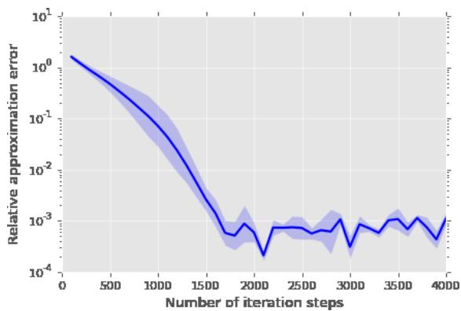


Assume the setting in Subsection 4.1, let $\kappa = { } ^ { 6 } / { 1 0 } , \lambda = { } ^ { 1 } / { \sqrt { d } }$ , assume for all $s , t \in [ 0 , T ]$ $x = ( x _ { 1 } , \ldots , x _ { d } ) , w = ( w _ { 1 } , \ldots , w _ { d } ) \in \mathbb { R } ^ { d } , y \in \mathbb { R } , z \in \mathbb { R } ^ { 1 \times d } , m \in \mathbb { N }$ that $\begin{array} { r } { \gamma _ { m } = \frac { 1 } { 1 0 0 } = 0 . 0 1 } \end{array}$ $T = 1 , d = 1 0 0 , N = 3 0 , \mu ( t , x ) = 0 , \sigma ( t , x ) w = w , \xi = ( 0 , 0 , \dots , 0 ) \in \mathbb { R } ^ { d } , \mathfrak { T } ( s , t , x , w ) = w , w ( t , x ) w = w .$ $x + w , g ( x ) = 1 + \kappa + \sin ( \lambda \textstyle \sum _ { i = 1 } ^ { d } x _ { i } )$ , and

$$
\begin{array} { r } { f ( t , x , y , z ) = \operatorname* { m i n } \Bigl \{ 1 , \big [ y - \kappa - 1 - \sin \bigl ( \lambda \sum _ { i = 1 } ^ { d } x _ { i } \bigr ) \exp \bigl ( \frac { \lambda ^ { 2 } d ( t - T ) } { 2 } \bigr ) \big ] ^ { 2 } \Bigr \} . } \end{array}\tag{77}
$$

Note that the solution u of the PDE (30) then satisfies for all $t \in [ 0 , T ) , x = ( x _ { 1 } , x _ { 2 } , \ldots , x _ { d } ) \in$ $\mathbb { R } ^ { d }$ that $u ( T , x ) = g ( x )$ and

$$
\begin{array} { r } { \frac { \partial u } { \partial t } ( t , x ) + \operatorname* { m i n } \biggr \{ 1 , \left[ u ( t , x ) - \kappa - 1 - \sin \bigr ( \lambda \sum _ { i = 1 } ^ { d } x _ { i } \bigr ) \exp \bigr ( \frac { \lambda ^ { 2 } d ( t - T ) } { 2 } \bigr ) \right] ^ { 2 } \biggr \} + \frac { 1 } { 2 } \left( \Delta _ { x } u \right) ( t , x ) = 0 } \end{array}\tag{78}
$$

(cf. Lemma 4.4 below). On the left hand side of Figure 7 we present approximatively the relative $L ^ { 1 } { \mathrm { - a p p r o x i m a t i n } }$ error associated to $\mathcal { U } ^ { \Theta _ { m } }$ against $m \in \{ 1 , 2 , 3 , \ldots , 2 4 0 0 0 \}$ based on 5 independent realizations (5 independent runs). On the right hand side of Figure 7 we present approximatively the mean of the loss function associated to $\Theta _ { m }$ against $m \in$ $\{ 1 , 2 , 3 , \ldots , 2 4 0 0 0 \}$ based on 256 Monte Carlo samples and 5 independent realizations (5 independent runs).

Lemma 4.4 (Cf. Subsection 6.1 in [14]). Let $T , \kappa , \lambda \in ( 0 , \infty ) , d \in \mathbb { N }$ and let $u \colon [ 0 , T ] \times$ $\mathbb { R } ^ { d } \to \mathbb { R }$ be the function which satisfies for all $t \in [ 0 , T ] , x = ( x _ { 1 } , \ldots , x _ { d } ) \in \mathbb { R } ^ { d }$ that

$$
\begin{array} { r } { u ( t , x ) = 1 + \kappa + \sin \bigl ( \lambda \sum _ { i = 1 } ^ { d } x _ { i } \bigr ) \exp \bigl ( \frac { \lambda ^ { 2 } d ( t - T ) } { 2 } \bigr ) . } \end{array}\tag{79}
$$

<!-- page: 26 -->

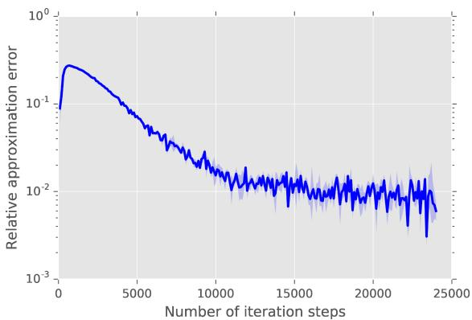

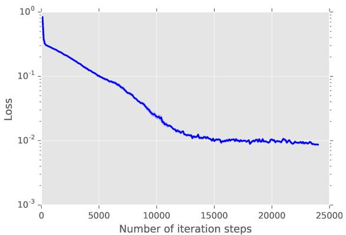

Figure 8: Relative $L ^ { 1 } .$ -approximation error of $\mathcal { U } ^ { \Theta _ { m } }$ and mean of the loss function against $m \in \{ 1 , 2 , 3 , . . . , 2 4 0 0 0 \}$ in the case of the PDE (78). The deep BSDE approximation $\mathcal { U } ^ { \Theta _ { 2 4 0 0 0 } } \approx u ( 0 , \xi )$ achieves a relative L<sup>1</sup>-approximation error of size 0.0060 in a runtime of 4872 seconds.

Then it holds for all $t \in [ 0 , T ] , \ x \ = \ ( x _ { 1 } , \ldots , x _ { d } ) \ \in \ \mathbb { R } ^ { d }$ that $u \in C ^ { 1 , 2 } ( [ 0 , T ] \times \mathbb { R } ^ { d } , \mathbb { R } )$ ， $\begin{array} { r } { u ( T , x ) = 1 + \kappa + \sin ( \lambda \sum _ { i = 1 } ^ { d } x _ { i } ) } \end{array}$ , and

$$
\begin{array} { r } { \frac { \partial u } { \partial t } ( t , x ) + \operatorname* { m i n } \Bigl \{ 1 , \left[ u ( t , x ) - \kappa - 1 - \sin \bigl ( \lambda \sum _ { i = 1 } ^ { d } x _ { i } \bigr ) \exp \bigl ( \frac { \lambda ^ { 2 } d ( t - T ) } { 2 } \bigr ) \right] ^ { 2 } \Bigr \} + \frac { 1 } { 2 } \left( \Delta _ { x } u \right) ( t , x ) = 0 . } \end{array}\tag{80}
$$

Proof of Lemma $4 . 4 \cdot$ Note that for all $t \in [ 0 , T ] , x = ( x _ { 1 } , \ldots , x _ { d } ) \in \mathbb { R } ^ { d }$ it holds that

$$
\frac { \partial u } { \partial t } ( t , x ) = \frac { \lambda ^ { 2 } d } { 2 } \sin \bigl ( \lambda \sum _ { i = 1 } ^ { d } x _ { i } \bigr ) \exp \bigl ( \frac { \lambda ^ { 2 } d ( t - T ) } { 2 } \bigr ) .\tag{81}
$$

In addition, observe that for all $t \in [ 0 , T ] , x = ( x _ { 1 } , \ldots , x _ { d } ) \in \mathbb { R } ^ { d } , k \in \{ 1 , 2 , \ldots , d \}$ it holds that

$$
\frac { \partial u } { \partial x _ { k } } ( t , x ) = \lambda \cos \bigl ( \lambda \sum _ { i = 1 } ^ { d } x _ { i } \bigr ) \exp \bigl ( \frac { \lambda ^ { 2 } d ( t - T ) } { 2 } \bigr ) .\tag{82}
$$

Hence, we obtain that for all $t \in [ 0 , T ] , x = ( x _ { 1 } , \ldots , x _ { d } ) \in \mathbb { R } ^ { d } , k \in \{ 1 , \ldots , d \}$ it holds that

$$
\frac { \partial ^ { 2 } u } { \partial x _ { k } ^ { 2 } } ( t , x ) = - \lambda ^ { 2 } \sin \bigl ( \lambda \sum _ { i = 1 } ^ { d } x _ { i } \bigr ) \exp \bigl ( \frac { \lambda ^ { 2 } d ( t - T ) } { 2 } \bigr ) .\tag{83}
$$

This ensures that for all $t \in [ 0 , T ] , x = ( x _ { 1 } , \ldots , x _ { d } ) \in \mathbb { R } ^ { d }$ it holds that

$$
\begin{array} { r } { ( \Delta _ { x } u ) ( t , x ) = - d \lambda ^ { 2 } \sin \bigl ( \lambda \sum _ { i = 1 } ^ { d } x _ { i } \bigr ) \exp \bigl ( \frac { \lambda ^ { 2 } d ( t - T ) } { 2 } \bigr ) . } \end{array}\tag{84}
$$

<!-- page: 27 -->

Combining this with (81) proves that for all $t \in [ 0 , T ] , x = ( x _ { 1 } , \ldots , x _ { d } ) \in \mathbb { R } ^ { d }$ it holds that

$$
\frac { \partial u } { \partial t } ( t , x ) + \frac { 1 } { 2 } \left( \Delta _ { x } u \right) ( t , x ) = 0 .\tag{85}
$$

This demonstrates that for all $t \in [ 0 , T ] , x = ( x _ { 1 } , \ldots , x _ { d } ) \in \mathbb { R } ^ { d }$ it holds that

$$
\begin{array} { r l } & { \displaystyle \frac { \partial v } { \partial t } ( t , x ) + \operatorname* { m i n } \bigg \{ 1 , \big [ v ( t , x ) - \kappa - 1 - \sin \big ( \lambda \sum _ { i = 1 } ^ { d } x _ { i } \big ) \exp \big ( \frac { \lambda ^ { 2 } d ( t - T ) } 2 \big ) \big ] ^ { 2 } \bigg \} + \frac { 1 } { 2 } \big ( \Delta _ { x } v \big ) ( t , x ) } \\ & { \displaystyle = \frac { \partial v } { \partial t } ( t , x ) + \frac { 1 } { 2 } \big ( \Delta _ { x } v \big ) ( t , x ) = 0 . } \end{array}\tag{86}
$$

The proof of Lemma 4.4 is thus completed.

## 5 Appendix A: Special cases of the proposed algorithm

In this subsection we illustrate the general algorithm in Subsection 3.2 in several special cases. More specifically, in Subsections 5.1 and 5.2 we provide special choices for the functions $\psi _ { m } , m \in \mathbb { N }$ , and $\Psi _ { m } , m \in \mathbb { N }$ , employed in (29) and in Subsections 5.3 and 5.4 we provide special choices for the function Υ in (24).

## 5.1 Stochastic gradient descent (SGD)

Example 5.1. Assume the setting in Subsection 3.2, let $( \gamma _ { m } ) _ { m \in \mathbb { N } } \subseteq ( 0 , \infty )$ , and assume for all $m \in \mathbb { N } , x \in \mathbb { R } ^ { \varrho } , ( \varphi _ { j } ) _ { j \in \mathbb { N } } \in ( \mathbb { R } ^ { \rho } ) ^ { \mathbb { N } }$ that

$$
\varrho = \rho , \qquad \Psi _ { m } ( x , ( \varphi _ { j } ) _ { j \in \mathbb { N } } ) = \varphi _ { 1 } , \qquad a n d \qquad \psi _ { m } ( x ) = \gamma _ { m } x .\tag{87}
$$

Then it holds for all $m \in \mathbb { N }$ that

$$
\Theta _ { m } = \Theta _ { m - 1 } - \gamma _ { m } \Phi _ { m - 1 , 1 } \mathopen { } \mathclose \bgroup \left( \Theta _ { m - 1 } \aftergroup \egroup \right) .\tag{88}
$$

## 5.2 Adaptive Moment Estimation (Adam) with mini-batches

In this subsection we illustrate how the so-called Adam optimizer (see [22]) can be employed in conjunction with the deep BSDE solver in Subsection 3.2 (cf. also Subsection 4.1 above).

Example 5.2. Assume the setting in Subsection 3.2, assume that $\varrho = 2 \rho$ , let $\mathrm { P o w } _ { r } \colon { \mathbb { R } } ^ { \rho } \to$ $\mathbb { R } ^ { \rho } , r \in ( 0 , \infty )$ , be the functions which satisfy for all $r \in ( 0 , \infty ) , x = ( x _ { 1 } , \ldots , x _ { \rho } ) \in \mathbb { R } ^ { \rho }$ that

$$
\operatorname { P o w } _ { r } ( x ) = ( | x _ { 1 } | ^ { r } , \ldots , | x _ { \rho } | ^ { r } ) ,\tag{89}
$$

<!-- page: 28 -->

l $e t \varepsilon \in ( 0 , \infty ) , ( \gamma _ { m } ) _ { m \in \mathbb { N } } \subseteq ( 0 , \infty ) , ( J _ { m } ) _ { m \in \mathbb { N } _ { 0 } } \subseteq \mathbb { N } , \mathbb { X } , \mathbb { Y } \in ( 0 , 1 )$ , let m, M : $ { \mathbb { N } } _ { 0 } \times \Omega \to { \mathbb { R } } ^ { \rho }$ be the stochastic processes which satisfy for all $m \in { \mathbb { N } } _ { 0 }$ that $\Xi _ { m } = ( { \mathbf { m } } _ { m } , { \mathbb { M } } _ { m } )$ , and assume for all m $\in \mathbb { N } , \ x , y \in \mathbb { R } ^ { \rho } , \ ( \varphi _ { j } ) _ { j \in \mathbb { N } } \in ( \mathbb { R } ^ { \rho } ) ^ { \mathbb { N } }$ that

$$
\begin{array} { r } { \Psi _ { m } ( x , y , ( \varphi _ { j } ) _ { j \in \mathbb { N } } ) = \left( \mathbb { X } x + ( 1 - \mathbb { X } ) \big ( \frac { 1 } { J _ { m } } \sum _ { j = 1 } ^ { J _ { m } } \varphi _ { j } \big ) , \mathbb { Y } y + ( 1 - \mathbb { Y } ) \operatorname { P o w } _ { 2 } \left( \frac { 1 } { J _ { m } } \sum _ { j = 1 } ^ { J _ { m } } \varphi _ { j } \right) \right) } \end{array}\tag{90}
$$

and

$$
\psi _ { m } ( x , y ) = \left[ \varepsilon + \mathrm { P o w } _ { 1 / 2 } \left( \frac { y } { ( 1 - \mathbb { Y } ^ { m } ) } \right) \right] ^ { - 1 } \frac { \gamma _ { m } x } { ( 1 - \mathbb { X } ^ { m } ) } .\tag{91}
$$

Then it holds for all $m \in \mathbb { N }$ that

$$
\Theta _ { m } = \Theta _ { m - 1 } - \left[ \varepsilon + \mathrm { P o w } _ { 1 / 2 } \biggl ( \frac { \mathbb { M } _ { m } } { \bigl ( 1 - \mathbb { Y } ^ { m } \bigr ) } \biggr ) \right] ^ { - 1 } \frac { \gamma _ { m } \mathbf { m } _ { m } } { \bigl ( 1 - \mathbb { X } ^ { m } \bigr ) } ,
$$

$$
\mathbf { m } _ { m } = \mathbb { X } \mathbf { m } _ { m - 1 } + \frac { ( 1 - \mathbb { X } ) } { J _ { m } } \left( \sum _ { j = 1 } ^ { J _ { m } } \Phi _ { \mathbb { S } _ { m } } ^ { m - 1 , j } ( \Theta _ { m - 1 } ) \right) ,\tag{92}
$$

$$
\mathbb { M } _ { m } = \mathbb { Y } \mathbb { M } _ { m - 1 } + ( 1 - \mathbb { Y } ) \operatorname { P o w } _ { 2 } \Biggl ( \frac { 1 } { J _ { m } } \sum _ { j = 1 } ^ { J _ { m } } \Phi _ { \mathbb { S } _ { m } } ^ { m - 1 , j } ( \Theta _ { m - 1 } ) \Biggr ) ~ .
$$

## 5.3 Geometric Brownian motion

Example 5.3. Assume the setting in Section 3.2, let $\bar { \mu } , \bar { \sigma } \in \mathbb { R }$ , and assume for all $s , t \in$ $[ 0 , T ] , x = ( x _ { 1 } , \ldots , x _ { d } ) , w = ( w _ { 1 } , \ldots , w _ { d } ) \in \mathbb { R } ^ { d }$ that

$$
\Upsilon ( s , t , x , w ) = \exp \Biggl ( \Biggl ( \bar { \mu } - \frac { \bar { \sigma } ^ { 2 } } { 2 } \Biggr ) ( t - s ) \Biggr ) \exp \bigl ( \bar { \sigma } \mathrm { d i a g } _ { \mathbb { R } ^ { d \times d } } \bigl ( w _ { 1 } , \dots , w _ { d } \bigr ) \bigr ) x .\tag{93}
$$

Then it holds for all $m , j \in \mathbb { N } _ { 0 } , n \in \{ 0 , 1 , . . . , N \}$ that

$$
\mathcal { X } _ { n } ^ { \theta , m , j } = \mathrm { e x p } \left( \left( \bar { \mu } - \frac { \bar { \sigma } ^ { 2 } } { 2 } \right) t _ { n } \mathrm { I d } _ { \mathbb { R } ^ { d } } + \bar { \sigma } \mathrm { d i a g } _ { \mathbb { R } ^ { d \times d } } ( W _ { t _ { n } } ^ { m , j } ) \right) \boldsymbol { \xi } .\tag{94}
$$

In the setting of Example 5.3 we consider under suitable further hypotheses (cf. Subsection 4.4 above) for every suficiently large $m \in \mathbb { N } _ { 0 }$ the random variable $\mathcal { U } ^ { \Theta _ { m } }$ as an approximation of $u ( 0 , \xi )$ where $u \colon [ 0 , T ] \times \mathbb { R } ^ { d } \to \mathbb { R } ^ { k }$ is a suitable solution of the PDE

$$
\begin{array} { l } { \displaystyle \frac { \partial u } { \partial t } ( t , x ) + \frac { \bar { \sigma } ^ { 2 } } { 2 } \sum _ { i = 1 } ^ { d } | x _ { i } | ^ { 2 } \left( \frac { \partial ^ { 2 } u } { \partial x _ { i } ^ { 2 } } \right) ( t , x ) + \bar { \mu } \sum _ { i = 1 } ^ { d } x _ { i } \left( \frac { \partial u } { \partial x _ { i } } \right) ( t , x ) } \\ { \displaystyle \qquad + f \big ( t , x , u ( t , x ) , \bar { \sigma } \left( \frac { \partial u } { \partial x } \right) ( t , x ) \mathrm { d i a g } _ { \mathbb H ^ { d \times d } } \big ( x _ { 1 } , \dots , x _ { d } \big ) \big ) = 0 } \end{array}\tag{95}
$$

with $u ( T , x ) = g ( x ) { \mathrm { ~ f o r ~ } } t \in [ 0 , T ] , x = ( x _ { 1 } , \ldots , x _ { d } ) \in \mathbb { R } ^ { d } .$

<!-- page: 29 -->

## 5.4 Euler-Maruyama scheme

Example 5.4. Assume the setting in Section 3.2, let $\mu \colon [ 0 , T ] \times \mathbb { R } ^ { d } \to \mathbb { R } ^ { d }$ and $\sigma \colon [ 0 , T ] \times$ $\mathbb { R } ^ { d } \to \mathbb { R } ^ { d }$ be functions, and assume for all $s , t \in [ 0 , T ] , x , w \in \mathbb { R } ^ { d }$ that

$$
\Upsilon ( s , t , x , w ) = x + \mu ( s , x ) ( t - s ) + \sigma ( s , x ) w .\tag{96}
$$

Then it holds for all m, $, j \in \mathbb { N } _ { 0 } , n \in \{ 0 , 1 , . . . , N - 1 \}$ that

$$
\mathscr X _ { n } ^ { m , j } = \mathscr X _ { n } ^ { m , j } + \mu ( t _ { n } , \mathscr X _ { n } ^ { m , j } ) ( t _ { n + 1 } - t _ { n } ) + \sigma ( t _ { n } , \mathscr X _ { n } ^ { m , j } ) ( W _ { t _ { n + 1 } } - W _ { t _ { n } } ) .\tag{97}
$$

In the setting of Example 5.4 we consider under suitable further hypotheses for every suficiently large $m \in { \mathbb { N } } _ { 0 }$ the random variable $\mathcal { U } ^ { \Theta _ { m } }$ as an approximation of $u ( 0 , \xi )$ where u : $[ 0 , T ] \times \mathbb { R } ^ { d } \mathbb { R } ^ { k }$ is a suitable solution of the PDE

$$
\begin{array} { r l } & { \frac { \partial u } { \partial t } ( t , x ) + \frac { 1 } { 2 } \underset { j = 1 } { \overset { d } { \sum } } ( \frac { \partial ^ { 2 } u } { \partial x ^ { 2 } } ) ( t , x ) \big ( \sigma ( t , x ) e _ { j } ^ { ( d ) } , \sigma ( t , x ) e _ { j } ^ { ( d ) } \big ) + ( \frac { \partial u } { \partial x } ) ( t , x ) \mu ( t , x ) } \\ & { \qquad + f \big ( t , x , u ( t , x ) , ( \frac { \partial u } { \partial x } ) ( t , x ) \sigma ( t , x ) \big ) = 0 } \end{array}\tag{98}
$$

with $u ( T , x ) \ = \ g ( x ) , \ e _ { 1 } ^ { ( d ) } \ = \ ( 1 , 0 , \ldots , 0 ) , \ \ldots , \ e _ { d } ^ { ( d ) } \ = \ ( 0 , \ldots , 0 , 1 ) \ \in \ \mathbb { R } ^ { d }$ for $t \in [ 0 , T ]$ 2 $x = ( x _ { 1 } , \ldots , x _ { d } ) \in \mathbb { R } ^ { d }$ (cf. (PDE) in Section 2 above).

## 6 Appendix B: Python and Matlab source codes

## 6.1 Python source code for an implementation of the deep BSDE solver in the case of the Allen-Cahn PDE (35) in Subsection 4.2

```python 1 import time 2 import math 3 import tensorflow as tf 4 import numpy as np 5 from tensorflow . python . training . moving_averages \ 6 import assign_moving_average 7 from scipy . stats import multivariate_normal as normal 8 from tensorflow . python . ops import control_flow_ops 9 from tensorflow import random_normal_initializer as norm_init 10 from tensorflow import random_uniform_initializer as unif_init 11 from tensorflow import constant_initializer as const_init 12 13 class SolveAllenCahn ( object ): 14 """ The fully - connected neural network model .""" 15 def __init__ (self , sess ): ```

<!-- page: 30 -->

```python 16 self . sess = sess 17 # parameters for the PDE 18 self .d = 100 19 self .T = 0.3 20 # parameters for the algorithm 21 self . n_time = 20 22 self . n_layer = 4 23 self . n_neuron = [ self .d, self .d+10 , self .d+10 , self .d] 24 self . batch_size = 64 25 self . valid_size = 256 26 self . n_maxstep = 4000 27 self . n_displaystep = 100 28 self . learning_rate = 5e -4 29 self . Yini = [0.3 , 0.6] 30 # some basic constants and variables 31 self .h = ( self .T +0.0)/ self . n_time 32 self . sqrth = math . sqrt ( self .h) 33 self . t_stamp = np. arange (0, self . n_time )* self .h 34 self . _extra_train_ops = [] 35 36 def train ( self ): 37 start_time = time . time () 38 # train operations 39 self . global_step = \ 40 tf . get_variable ( ’ global_step ’ , [] , 41 initializer =tf. constant_initializer (1) , 42 trainable =False , dtype =tf. int32 ) 43 trainable_vars = tf. trainable_variables () 44 grads = tf . gradients ( self . loss , trainable_vars ) 45 optimizer = tf. train . AdamOptimizer ( self . learning_rate ) 46 apply_op = \ 47 optimizer . apply_gradients (zip(grads , trainable_vars ), 48 global_step = self . global_step ) 49 train_ops = [ apply_op ] + self . _extra_train_ops 50 self . train_op = tf. group (* train_ops ) 51 self . loss_history = [] 52 self . init_history = [] 53 # for validation 54 dW_valid , X_valid = self . sample_path ( self . valid_size ) 55 feed_dict_valid = { self .dW: dW_valid , 56 self .X: X_valid , 57 self . is_training : False } 58 # initialization 59 step = 1 60 self . sess .run (tf. global_variables_initializer ()) 61 temp_loss = self . sess . run ( self . loss , 62 feed_dict = feed_dict_valid ) 63 temp_init = self . Y0 . eval ()[0] 64 self . loss_history . append ( temp_loss ) ```

<!-- page: 31 -->

self . init\_history . append ( temp\_init ) print " step : % 5u , loss : %.4 e , " % \ (0, temp\_loss ) + \ " Y0 : % .4 e , runtime : %4 u " % \ ( temp\_init , time . time () - start\_time + self . t\_bd ) # begin sgd iteration for \_ in range ( self . n\_maxstep +1): step = self . sess .run ( self . global\_step ) dW\_train , X\_train = self . sample\_path ( self . batch\_size ) self . sess . run ( self . train\_op , feed\_dict ={ self .dW: dW\_train , self .X: X\_train , self . is\_training : True }) if step % self. n\_displaystep == 0: temp\_loss = self . sess . run ( self . loss , feed\_dict = feed\_dict\_valid ) temp\_init = self .Y0. eval ()[0] self . loss\_history . append ( temp\_loss ) self . init\_history . append ( temp\_init ) print " step : % 5u , loss : %.4 e , " % \ (step , temp\_loss ) + \ "Y0: %.4e, runtime : %4u" % \ ( temp\_init , time . time () - start\_time + self . t\_bd ) step += 1 end\_time = time . time () print " running time : %.3f s" % \ ( end\_time - start\_time + self . t\_bd ) def build ( self ): start\_time = time . time () # build the whole network by stacking subnetworks self .dW = tf. placeholder (tf. float64 , [None , self .d, self . n\_time ], name =’dW ’) self .X = tf. placeholder (tf. float64 , [None , self .d, self . n\_time +1] , name =’X’) self . is\_training = tf. placeholder (tf. bool ) self .Y0 = tf. Variable (tf. random\_uniform ([1] , minval = self . Yini [0] , maxval = self . Yini [1] , dtype = tf . float64 )); self .Z0 = tf. Variable (tf. random\_uniform ([1 , self .d], minval =-.1, maxval =.1 , dtype = tf . float64 )) self . allones = \ tf. ones ( shape =tf. pack ([ tf. shape ( self .dW )[0] , 1]) , dtype = tf . float64 )

65 66 67 68 69 70 71 72 73 74 75 76 77 78 79 80 81 82 83 84 85 86 87 88 89 90 91 92 93 94 95 96 97 98 99 100 101 102 103 104 105 106 107 108 109 110 111 112 113

<!-- page: 32 -->

```python Y = self . allones * self .Y0 Z = tf. matmul ( self . allones , self .Z0) with tf. variable_scope (’forward ’): for t in xrange (0, self .n_time -1): Y = Y - self . f_tf ( self . t_stamp [ t ] , self .X[:, :, t], Y, Z)* self .h Y = Y + tf . reduce_sum ( Z * self . dW [: , : , t ] , 1 , keep_dims = True ) Z = self . _one_time_net ( self .X[:, :, t+1] , str (t +1))/ self .d # terminal time Y = Y - self . f_tf ( self . t_stamp [ self .n_time -1] , self .X[:, :, self .n_time -1] , Y, Z)* self .h Y = Y + tf . reduce_sum ( Z * self . dW [: , : , self . n_time -1] , 1 , keep_dims = True ) term_delta = Y - self . g_tf ( self .T, self . X [: , : , self . n_time ]) self . clipped_delta = \ tf. clip_by_value ( term_delta , -50.0 , 50.0) self . loss = tf. reduce_mean ( self . clipped_delta **2) self . t_bd = time . time ()- start_time def sample_path (self , n_sample ): dW_sample = np . zeros ([ n_sample , self .d , self . n_time ]) X_sample = np. zeros ([ n_sample , self .d, self . n_time +1]) for i in xrange ( self . n_time ): dW_sample [:, :, i] = \ np. reshape ( normal .rvs ( mean =np. zeros ( self .d), cov =1 , size = n_sample )* self .sqrth , ( n_sample , self .d)) X_sample [: , : , i +1] = X_sample [: , : , i ] + \ np. sqrt (2) * dW_sample [:, :, i] return dW_sample , X_sample def f_tf (self , t, X, Y, Z): # nonlinear term return Y-tf. pow (Y, 3) def g_tf (self , t, X): # terminal conditions return 0.5/(1 + 0.2* tf . reduce_sum ( X **2 , 1 , keep_dims = True )) def _one_time_net (self , x, name ): with tf . variable_scope ( name ): x_norm = self . _batch_norm (x, name =’ layer0_normal ’) layer1 = self . _one_layer (x_norm , self . n_neuron [1] , name =’layer1 ’) ```

114 115 116 117 118 119 120 121 122 123 124 125 126 127 128 129 130 131 132 133 134 135 136 137 138 139 140 141 142 143 144 145 146 147 148 149 150 151 152 153 154 155 156 157 158 159 160 161 162

<!-- page: 33 -->

```python layer2 = self . _one_layer (layer1 , self . n_neuron [2] , name =’layer2 ’) z = self . _one_layer (layer2 , self . n_neuron [3] , activation_fn =None , name =’final ’) return z def _one_layer ( self , input_ , out_sz , activation_fn =tf.nn.relu , std =5.0 , name =’linear ’): with tf . variable_scope ( name ): shape = input_ . get_shape (). as_list () w = tf. get_variable (’Matrix ’, [ shape [1] , out_sz ], tf. float64 , norm_init ( stddev = \ std/np. sqrt ( shape [1]+ out_sz ))) hidden = tf. matmul ( input_ , w) hidden_bn = self . _batch_norm (hidden , name =’normal ’) if activation_fn != None : return activation_fn ( hidden_bn ) else : return hidden_bn def _batch_norm ( self , x , name ): """ Batch normalization """ with tf. variable_scope ( name ): params_shape = [ x . get_shape ()[ -1]] beta = tf . get_variable ( ’ beta ’ , params_shape , tf. float64 , norm_init (0.0 , stddev =0.1 , dtype =tf. float64 )) gamma = tf . get_variable ( ’ gamma ’ , params_shape , tf. float64 , unif_init (0.1 , 0.5 , dtype =tf. float64 )) mv_mean = tf. get_variable (’moving_mean ’, params_shape , tf. float64 , const_init (0.0 , tf . float64 ) , trainable = False ) mv_var = tf . get_variable ( ’ moving_variance ’ , params_shape , tf . float64 , const_init (1.0 , tf . float64 ) , trainable = False ) # These ops will only be preformed when training mean , variance = tf . nn . moments (x , [0] , name = ’ moments ’) self . _extra_train_ops . append (\ assign_moving_average ( mv_mean , mean , 0.99)) self . _extra_train_ops . append (\ ```

163 164 165 166 167 168 169 170 171 172 173 174 175 176 177 178 179 180 181 182 183 184 185 186 187 188 189 190 191 192 193 194 195 196 197 198 199 200 201 202 203 204 205 206 207 208 209 210 211

<!-- page: 34 -->

```python 212 assign_moving_average (mv_var , variance , 0.99)) 213 mean , variance = \ 214 control_flow_ops . cond ( self . is_training , 215 lambda : (mean , variance ), 216 lambda : (mv_mean , mv_var )) 217 y = tf.nn. batch_normalization (x, mean , variance , 218 beta , gamma , 1e -6) 219 y . set_shape ( x . get_shape ()) 220 return y 221 222 def main (): 223 tf. reset_default_graph () 224 with tf. Session () as sess : 225 tf. set_random_seed (1) 226 print " Begin to solve Allen - Cahn equation " 227 model = SolveAllenCahn ( sess ) 228 model . build () 229 model . train () 230 output = np . zeros (( len ( model . init_history ) , 3)) 231 output [: , 0] = np . arange ( len ( model . init_history )) \ 232 * model . n_displaystep 233 output [:, 1] = model . loss_history 234 output [: , 2] = model . init_history 235 np. savetxt ("./ AllenCahn_d100 .csv ", 236 output , 237 fmt =[ ’%d’, ’%.5 e’, ’%.5e’], 238 delimiter =",", 239 header =" step , loss function , " + \ 240 " target value , runtime " , 241 comments =’’) 242 243 if __name__ == ’ __main__ ’: 244 np. random . seed (1) 245 main () ```

Matlab code 1: A Python code for the deep BSDE solver in Subsection 3.2 in the case of the PDE (35).

## 6.2 Matlab source code for the Branching difusion method used in Subsection 4.2

```matlab 1 function Branching_Matlab () 2 % Parameters for the model 3 T = 0.3; t0 = 0; x0 = 0; d = 100; m = d; 4 mu = zeros (d ,1); sigma = eye ( d )* sqrt (2); 5 a = [0 2 0 -1] ’; ```

<!-- page: 35 -->

```matlab 6 g = @(x) 1./(1+0.2* norm (x )^2)*1/2; 7 8 % Parameters for the algorithm 9 rng (’default ’); M = 10^7; beta = 1; p = [0 0.5 0 0.5] ’; 10 11 % Branching method 12 tic ; 13 [ mn , sd ] = MC_BM ( mu , sigma , beta , p , a , t0 , x0 , T , g , M ); 14 runtime = toc ; 15 16 % Output 17 disp ([ ’Terminal condition : u(T,x0) = ’ num2str (g(x0 )) ’;’]); 18 disp ([ ’ Branching method : u (0 , x0 ) ~ ’ num2str ( mn ) ’; ’ ]); 19 disp ([ ’Estimated standard deviation : ’ num2str (sd) ’;’]); 20 disp ([ ’Estimated L2 - appr . error = ’ num2str (sd/ sqrt (M)) ’;’]); 21 disp ([ ’Elapsed runtime = ’ num2str ( runtime ) ’;’]); 22 end 23 24 function [mn ,sd] = MC_BM (mu , sigma , beta , p, a, t0 , x0 , T, g, M) 25 mn = 0; sd = 0; 26 for m=1:M 27 result = BM_Eval (mu , sigma , beta , p, a, t0 , x0 , T, g); 28 mn = mn + result ; 29 sd = sd + result ^2; 30 end 31 mn = mn/M; sd = sqrt ( (sd - mn ^2/ M)/M ); 32 end 33 34 function result = BM_Eval ( mu , sigma , beta , p , a , t0 , x0 , T , g ) 35 bp = BP ( mu , sigma , beta , p , t0 , x0 , T ); 36 result = 1; 37 for k=1: size (bp {1} ,2) 38 result = result * g( bp {1}(: , k) ); 39 end 40 if norm (a - p ) > 0 41 for k=1: length (a) 42 if p(k) > 0 43 result = result * ( a ( k )/ p ( k ) )^( bp {2}( k ) ); 44 elseif a(k) ~= 0 45 error (’a(k) zero but p(k) non - zero ’); 46 end 47 end 48 end 49 end 50 51 function bp = BP(mu , sigma , beta , p, t0 , x0 , T) 52 bp = cell (2 ,1); 53 bp {2} = p *0; 54 tau = exprnd (1/ beta ); ```

<!-- page: 36 -->

```matlab 55 new_t0 = min ( tau + t0 , T ); 56 delta_t = new_t0 - t0 ; 57 m = size (sigma ,2); 58 new_x0 = x0 + mu * delta_t + sigma * sqrt ( delta_t )* randn (m ,1); 59 if tau >= T - t0 60 bp {1} = new_x0 ; 61 else 62 [tmp , nonlinearity ] = max( mnrnd (1,p)); 63 bp {2}( nonlinearity ) = bp {2}( nonlinearity ) + 1; 64 for k =1: nonlinearity -1 65 tmp = BP ( mu , sigma , beta , p , new_t0 , new_x0 , T ); 66 bp {1} = [ bp {1} tmp {1} ]; 67 bp {2} = bp {2} + tmp {2}; 68 end 69 end 70 end ```

Matlab code 2: A Matlab code for the Branching difusion method in the case of the PDE (35) based on M = 10<sup>7</sup> independent realizations.

## 6.3 Matlab source code for the classical Monte Carlo method used in Subsection 4.3

```matlab 1 function MonteCarlo_Matlab () 2 rng (’default ’); 3 4 % Parameters for the model 5 d = 100; 6 g = @ ( x ) log ( (1+ norm ( x )^2)/2 ); 7 T = 1; 8 M = 10^7; 9 t = 0; 10 11 % Classical Monte Carlo 12 tic ; 13 MC = 0; 14 for m=1:M 15 dW = randn (1,d)* sqrt (T-t); 16 MC = MC + exp( - g( dW * sqrt (2) ) ); 17 end 18 MC = - log ( MC / M ); 19 runtime = toc ; 20 21 % Output 22 disp ([ ’ Solution : u (T ,0) = ’ num2str ( g (0)) ’; ’ ]); 23 disp ([ ’ Solution : u (0 ,0) = ’ num2str ( MC ) ’; ’ ]); ```

<!-- page: 37 -->

24 disp ([ ’ Time = ’ num2str ( runtime ) ’; ’ ]); 25 end

Matlab code 3: A Matlab code for a Monte Carlo method related to the PDE (36) based on $M = 1 0 ^ { 7 }$ independent realizations.

## Acknowledgements

Christian Beck and Sebastian Becker are gratefully acknowledged for useful suggestions regarding the implementation of the deep BSDE solver. This project has been partially supported through the Major Program of NNSFC under grant 91130005, the research grant ONR N00014-13-1-0338, and the research grant DOE DE-SC0009248.

## References

[1] Bellman, R. Dynamic programming. Princeton Landmarks in Mathematics. Princeton University Press, Princeton, NJ, 2010. Reprint of the 1957 edition, With a new introduction by Stuart Dreyfus. [2] Bender, C., and Denk, R. A forward scheme for backward SDEs. Stochastic Processes and their Applications 117, 12 (2007), 1793–1812. [3] Bender, C., Schweizer, N., and Zhuo, J. A primal-dual algorithm for BSDEs. arXiv:1310.3694 (2014), 36 pages. [4] Bergman, Y. Z. Option pricing with diferential interest rates. Review of Financial Studies 8, 2 (1995), 475–500. [5] Briand, P., and Labart, C. Simulation of BSDEs by Wiener chaos expansion. Ann. Appl. Probab. 24, 3 (06 2014), 1129–1171. [6] Chassagneux, J.-F. Linear multistep schemes for BSDEs. SIAM J. Numer. Anal. 52, 6 (2014), 2815–2836. [7] Chassagneux, J.-F., and Richou, A. Numerical simulation of quadratic BSDEs. Ann. Appl. Probab. 26, 1 (2016), 262–304. [8] Crisan, D., and Manolarakis, K. Solving backward stochastic diferential equations using the cubature method: Application to nonlinear pricing. SIAM Journal on Financial Mathematics 3, 1 (2012), 534–571.

<!-- page: 38 -->

[9] Darbon, J., and Osher, S. Algorithms for overcoming the curse of dimensionality for certain Hamilton-Jacobi equations arising in control theory and elsewhere. Res. Math. Sci. 3 (2016), Paper No. 19, 26. [10] Debnath, L. Nonlinear partial diferential equations for scientists and engineers, third ed. Birkh¨auser/Springer, New York, 2012. [11] E, W., Hutzenthaler, M., Jentzen, A., and Kruse, T. On full history recursive multilevel Picard approximations and numerical approximations for highdimensional nonlinear parabolic partial diferential equations and high-dimensional nonlinear backward stochastic diferential equations. arXiv:1607.03295 (2017), 46 pages. [12] Gobet, E., Lemor, J.-P., and Warin, X. A regression-based Monte Carlo method to solve backward stochastic diferential equations. Ann. Appl. Probab. 15, 3 (2005), 2172–2202. [13] Gobet, E., and Turkedjiev, P. Linear regression MDP scheme for discrete backward stochastic diferential equations under general conditions. Math. Comp. 85, 299 (2016), 1359–1391. [14] Gobet, E., and Turkedjiev, P. Adaptive importance sampling in least-squares Monte Carlo algorithms for backward stochastic diferential equations. Stochastic Process. Appl. 127, 4 (2017), 1171–1203. [15] Goodfellow, I., Bengio, Y., and Courville, A. Deep Learning. MIT Press, 2016. http://www.deeplearningbook.org. [16] Han, J., and E, W. Deep Learning Approximation for Stochastic Control Problems. arXiv:1611.07422 (2016), 9 pages. [17] Henry-Labordere, P. <sup>\`</sup> Counterparty risk valuation: a marked branching difusion approach. arXiv:1203.2369 (2012), 17 pages. [18] Henry-Labordere, P., Oudjane, N., Tan, X., Touzi, N., and Warin, X.<sup>\`</sup> Branching difusion representation of semilinear PDEs and Monte Carlo approximation. arXiv:1603.01727 (2016), 30 pages. [19] Henry-Labordere, P., Tan, X., and Touzi, N.<sup>\`</sup> A numerical algorithm for a class of BSDEs via the branching process. Stochastic Process. Appl. 124, 2 (2014), 1112–1140. [20] Hinton, G. E., Deng, L., Yu, D., Dahl, G., Mohamed, A., Jaitly, N., Senior<sub>,</sub> A.<sub>,</sub> Vanhoucke<sub>,</sub> V.<sub>,</sub> Nguyen<sub>,</sub> P.<sub>,</sub> Sainath<sub>,</sub> T.<sub>,</sub> and Kingsbury<sub>,</sub> B.

<!-- page: 39 -->

Deep neural networks for acoustic modeling in speech recognition. Signal Processing Magazine 29 (2012), 82–97. [21] Ioffe, S., and Szegedy, C. Batch normalization: accelerating deep network training by reducing internal covariate shift. Proceedings of The 32nd International Conference on Machine Learning (ICML), June 2015. [22] Kingma, D., and Ba, J. Adam: a method for stochastic optimization. Proceedings of the International Conference on Learning Representations (ICLR), May 2015. [23] Krizhevsky, A., Sutskever, I., and Hinton, G. E. Imagenet classification with deep convolutional neural networks. Advances in Neural Information Processing Systems 25 (2012), 1097–1105. [24] LeCun, Y., Bengio, Y., and Hinton, G. Deep learning. Nature 521 (2015), 436–444. [25] Pardoux, E., and Peng, S. <sup>´</sup> Backward stochastic diferential equations and quasilinear parabolic partial diferential equations. In Stochastic partial diferential equations and their applications (Charlotte, NC, 1991), vol. 176 of Lecture Notes in Control and Inform. Sci. Springer, Berlin, 1992, pp. 200–217. [26] Pardoux, E., and Peng, S. G. <sup>´</sup> Adapted solution of a backward stochastic diferential equation. Systems Control Lett. 14, 1 (1990), 55–61. [27] Pardoux, E., and Tang, S. Forward-backward stochastic diferential equations and quasilinear parabolic PDEs. Probab. Theory Related Fields 114, 2 (1999), 123–150. [28] Peng, S. G. Probabilistic interpretation for systems of quasilinear parabolic partial diferential equations. Stochastics Stochastics Rep. 37, 1-2 (1991), 61–74.
