<!-- page: 1 -->

# Volatility is rough 

Jim Gatheral Baruch College, City University of New York jim.gatheral@baruch.cuny.edu 

Thibault Jaisson_∗_ CMAP, Ecole´ Polytechnique Paris thibault.jaisson@polytechnique.edu 

Mathieu Rosenbaum LPMA, Universit´e Pierre et Marie Curie (Paris 6) mathieu.rosenbaum@upmc.fr 

October 14, 2014 

##### **Abstract** 

Estimating volatility from recent high frequency data, we revisit the question of the smoothness of the volatility process. Our main result is that log-volatility behaves essentially as a fractional Brownian motion with Hurst exponent _H_ of order 0 _._ 1, at any reasonable time scale. This leads us to adopt the fractional stochastic volatility (FSV) model of Comte and Renault [16]. We call our model Rough FSV (RFSV) to underline that, in contrast to FSV, _H <_ 1 _/_ 2. We demonstrate that our RFSV model is remarkably consistent with financial time series data; one application is that it enables us to obtain improved forecasts of realized volatility. Furthermore, we find that although volatility is not long memory in the RFSV model, classical statistical procedures aiming at detecting volatility persistence tend to conclude the presence of long memory in data generated from it. This sheds light on why long memory of volatility has been widely accepted as a stylized fact. Finally, we provide a quantitative market microstructurebased foundation for our findings, relating the roughness of volatility to high frequency trading and order splitting. 

**Keywords:** High frequency data, volatility smoothness, fractional Brownian motion, fractional Ornstein-Uhlenbeck, long memory, volatility persistence, volatility forecasting, option pricing, volatility surface, Hawkes processes, high frequency trading, order splitting. 

> _∗_ Thibault Jaisson gratefully acknowledges financial support from the chair “Risques Financiers” of the Risk Foundation and the chair “March´es en Mutation” of the French Banking Federation.

<!-- page: 2 -->

## **1 Introduction** 

### **1.1 Volatility modeling** 

In the derivatives world, log-prices are often modeled as continuous semimartingales. For a given asset with log-price _Yt_ , such a process takes the form 

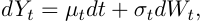

where _µt_ is a drift term and _Wt_ is a one-dimensional Brownian motion. The term _σt_ denotes the volatility process and is the most important ingredient of the model. In the Black-Scholes framework, the volatility function is either constant or a deterministic function of time. In Dupire’s local volatility model, see [22], the local volatility _σ_ ( _Yt, t_ ) is a deterministic function of the underlying price and time, chosen to match observed European option prices exactly. Such a model is by definition time-inhomogeneous; its dynamics are highly unrealistic, typically generating future volatility surfaces (see Section 1.3 below) completely unlike those we observe. A corollary of this is that prices of exotic options under local volatility can be substantially off-market. On the other hand, in so-called stochastic volatility models, the volatility _σt_ is modeled as a continuous Brownian semi-martingale. Notable amongst such stochastic volatility models are the Hull and White model [32], the Heston model [31], and the SABR model [29]. Whilst stochastic volatility dynamics are more realistic than local volatility dynamics, generated option prices are not consistent with observed European option prices. We refer to [26] and [39] for more detailed reviews of the different approaches to volatility modeling. More recent market practice is to use local-stochastic-volatility (LSV) models which both fit the market exactly and generate reasonable dynamics. 

### **1.2 Fractional volatility** 

In terms of the smoothness of the volatility process, the preceding models offer two possibilities: very regular sample paths in the case of Black-Scholes, and volatility trajectories with regularity close to that of Brownian motion for the local and stochastic volatility models. Starting from the stylized fact that volatility is a long memory process, various authors have proposed models that allow for a wider range of regularity for the volatility. In a pioneering paper, Comte and Renault [16] proposed to model log-volatility using fractional Brownian motion (fBM for short), ensuring long memory by choosing the Hurst parameter _H >_ 1 _/_ 2. A large literature has subsequently developed around such fractional volatility models, for example [12, 15, 44].

<!-- page: 3 -->

The fBM ( _Wt__H_)_t∈_Rwith Hurst parameter_H∈_(0_,_1),introduced in [36],is a centered self-similar Gaussian process with stationary increments satisfying for any _t ∈_ R, ∆ _≥_ 0, _q >_ 0: 

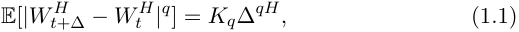

with _Kq_ the moment of order _q_ of the absolute value of a standard Gaussian variable. For _H_ = 1 _/_ 2, we retrieve the classical Brownian motion. The sample paths of _W__H_ are H¨older-continuous with exponent _r_ , for any _r < H_1 . Finally, when _H >_ 1 _/_ 2, the increments of the fBM are positively correlated and exhibit long memory in the sense that 

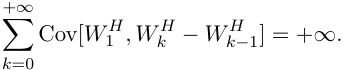

Indeed, Cov[ _W_ 1_H, W_ _k__H−W H_ _k−_ 1]isoforder_k_2_H−_2as_k→∞_.Notethatin the case of the fBM, there is a one to one correspondence between regularity and long memory through the Hurst parameter _H_ . 

As mentioned earlier, the long memory property of the volatility process has been widely accepted as a stylized fact since the seminal analyses of Ding, Granger and Engle [20], Andersen and Bollerslev [1] and Andersen et al. [3]. Initially, it appears that the term _long memory_ referred to the slow decay of the autocorrelation function (of absolute returns for example), anything slower than exponential. Over time however, it seems that this term has acquired the more precise meaning that the autocorrelation function is not integrable, see [8], and even more precisely that it decays as a power-law with exponent less than 1. Much of the more recent literature, for example [7, 11, 13], assumes long memory in volatility in this more technical sense. Indeed, meaningful results can probably only be obtained under such a specification, since it is not possible to estimate the asymptotic behavior of the covariance function without assuming a specific form. Nevertheless, analyses such as that of Andersen et al. [3] use data that predate the advent of high-frequency electronic trading, and the evidence for long memory has never been sufficient to satisfy remaining doubters such as Mikosch and St˘aric˘a in [38]. To quote Rama Cont in [17]: 

... the econometric debate on the short range or long range nature of dependence in volatility still goes on (and may probably never be resolved)... 

One of our contributions in this paper is (we believe) to finally resolve this question, showing that the autocorrelation function of volatility does not behave as a power law, at least at usual time scales of observation. This implies 

> 1Actually _H_ corresponds to the regularity of the process in a more accurate way: in terms of Besov smoothness spaces, see Section 2.1.

<!-- page: 4 -->

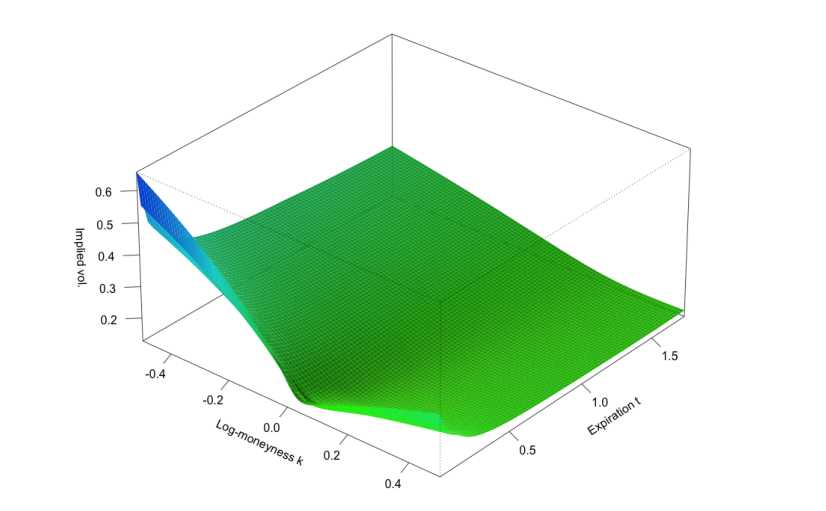

<!-- Start of picture text -->
0.6 — 05 3 Zz g 04 <eg “0.3 0.2 1.5 -0.4 -0.2 1.0 “ fog, 0.0 osao Ong Wess 1 02 0.5 0.4 <!-- End of picture text -->

<!-- page: 5 -->

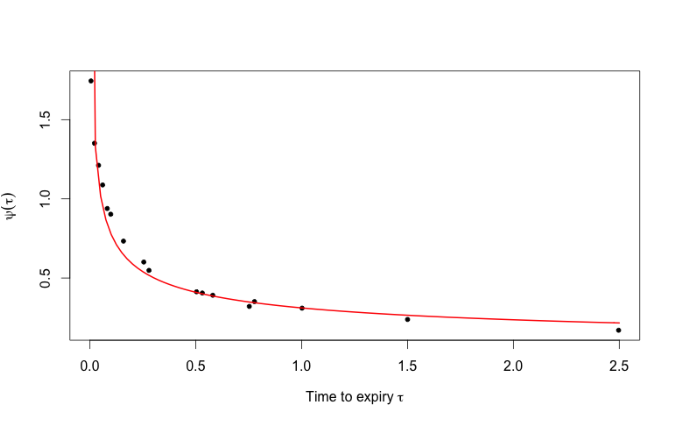

<!-- Start of picture text -->
a on wo ro) 0.0 0.5 1.0 1.5 2.0 2.5 Time to expiry t <!-- End of picture text -->

<!-- page: 6 -->

to have a value of _H_ close to zero. As we will see in Section 2, our empirical estimates of _H_ from time series data are in fact very small. 

The volatility model that we will specify in Section 3.1, driven by fBM with _H <_ 1 _/_ 2, therefore has the potential to be not only consistent with the empirically observed properties of the volatility time series but also consistent with the shape of the volatility surface. In this paper, we focus on the modeling of the volatility time series. A more detailed analysis of the consistency of our model with option prices is left for a future article. 

### **1.4 Main results and organization of the paper** 

In Section 2, we report our estimates of the smoothness of the log-volatility for selected assets. This smoothness parameter lies systematically between 0 _._ 08 and 0 _._ 2 (in the sense of H¨older regularity for example). Furthermore, we find that increments of the log-volatility are approximately normally distributed and that their moments enjoy a remarkable monofractal scaling property. This leads us to model the log of volatility using a fBM with Hurst parameter _H <_ 1 _/_ 2 in Section 3. Specifically we adopt the fractional stochastic volatility (FSV) model of Comte and Renault [16]. We call our model Rough FSV (RSFV) to underline that, in contrast to FSV, we take _H <_ 1 _/_ 2. We also show in the same section that the RFSV model is remarkably consistent with volatility time series data. The issue of volatility persistence is considered through the lens of the RFSV model in Section 4. Our main finding is that although the RFSV model does not have any long memory property, classical statistical procedures aiming at detecting volatility persistence tend to conclude the presence of long memory in data generated from it. This sheds new light on the supposed long memory in the volatility of financial data. In Section 5, we apply our model to forecasting volatility. In particular, we show that RFSV volatility forecasts outperform conventional AR and HAR volatility forecasts. Finally, in Section 6, we present a market microstructure explanation for the regularities we observe in the volatility process at the macroscopic scale. We show that the empirical behavior of volatility may be explained in terms of order splitting and the high degree of endogeneity of the market ascribed to algorithmic trading. Some proofs are relegated to the appendix. 

## **2 Smoothness of the volatility: empirical results** 

In this section we report estimates of the smoothness of the volatility process for four assets: The DAX and Bund futures contracts, for which we estimate integrated variance directly from high frequency data using an estimator based on the model with uncertainty zones, [42, 43], and the S&P and

<!-- page: 7 -->

NASDAQ indices, for which we use precomputed realized variance estimates from the Oxford-Man Institute of Quantitative Finance Realized Library3 . 

### **2.1 Estimating the smoothness of the volatility process** 

Let us first pretend that we have access to discrete observations of the volatility process, on a time grid with mesh ∆on [0 _, T_ ]: _σ_ 0 _, σ_ ∆ _, . . . , σk_ ∆ _, . . . , k ∈{_ 0 _, ⌊T/_ ∆ _⌋}_ . Set _N_ = _⌊T/_ ∆ _⌋_ , then for _q ≥_ 0, we define 

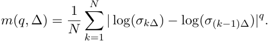

In the spirit of [46], our main assumption is that for some _sq >_ 0 and _bq >_ 0, as ∆tends to zero, 

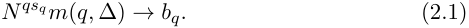

Under additional technical conditions, Equation (2.1) essentially says that the volatility process belongs to the Besov smoothness space _Bq,__sq_ _∞_anddoes _s__′_ not belong to _Bq,q∞_,for_s′_ _q__>sq_,see[45].Hence_sq_canreallybeviewed as the regularity of the volatility when measured in _lq_ norm. In particular, functions in _Bq,__s_ _∞_forevery_q>_0enjoytheH¨olderpropertywithparameter _h_ for any _h < s_ . For example, if log( _σt_ ) is a fBM with Hurst parameter _H_ , then for any _q ≥_ 0, Equation (2.1) holds in probability with _sq_ = _H_ and it can be shown that the sample paths of the process indeed belong to _Bq,__H_ _∞_almostsurely.Assumingtheincrementsofthelog-volatilityprocess are stationary and that a law of large number can be applied, _m_ ( _q,_ ∆) can also be seen as the empirical counterpart of 

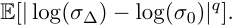

Of course, the volatility process is not directly observable, and an exact computation of _m_ ( _q,_ ∆) is not possible in practice. We must therefore proxy spot volatility values by appropriate estimated values. Since the minimal ∆ will be equal to one day in the sequel, we proxy the (true) spot volatility daily at a fixed given time of the day (11 am for example). Two daily spot volatility proxies will be considered: 

- For our ultra high frequency intraday data (DAX future contracts and Bund future contracts4 , 1248 days from 13/05/2010 to 01/08/20145 ), 

> 3 `http://realized.oxford-man.ox.ac.uk/data/download` . The Oxford-Man Institute’s Realized Library contains a selection of daily non-parametric estimates of volatility of financial assets, including realized variance (rv) and realized kernel (rk) estimates. A selection of such estimators is described and their performances compared in, for example, [28] . 

> 4For every day, we only consider the future contract corresponding to the most liquid maturity. 

> 5Data kindly provided by QuantHouse EUROPE/ASIA, http://www.quanthouse.com.

<!-- page: 8 -->

we use the estimator of the integrated variance from 10 am to 11 am London time obtained from the model with uncertainty zones, see [42, 43]. After renormalization, the resulting estimates of integrated variance over very short time intervals can be considered as good proxies for the unobservable spot variance. In particular, the one hour long window on which they are computed is small compared to the extra day time scales that will be of interest here. 

- For the S&P and NASDAQ indices6 , we proxy daily spot variances by daily realized variance estimates from the Oxford-Man Institute of Quantitative Finance Realized Library (3,540 trading days from January 3, 2000 to March 31, 2014). Since these estimates of integrated variance are for the whole trading day, we expect estimates of the smoothness of the volatility process to be biased upwards, integration being a regularizing operation. We compute the extent of this bias by simulation in Section 3.4. 

In the following, we retain the notation _m_ ( _q,_ ∆) with the understanding that we are only proxying the (true) spot volatility as explained above. We now proceed to estimate the smoothness parameter _sq_ for each _q_ by computing the _m_ ( _q,_ ∆) for different values of ∆and regressing log _m_ ( _q,_ ∆) against log ∆. Note that for a given ∆, several _m_ ( _q,_ ∆) can be computed depending on the starting point. Our final measure of _m_ ( _q,_ ∆) is the average of these values. 

### **2.2 DAX and Bund futures contracts** 

DAX and Bund futures are amongst the most liquid assets in the world and moreover, the model with uncertainty zones used to estimate volatility is known to apply well to them, see [19]. So we can be confident in the reliability of our volatility proxy. Nevertheless, as an extra check, we will confirm the quality of our volatility proxy by Monte Carlo simulation in Section 3.4. 

Plots of log _m_ ( _q,_ ∆) vs log ∆for different values of _q_ , are displayed for the DAX in Figure 2.1, and for the Bund in Figure 2.2. 

> 6And also the CAC40, Nikkei and FTSE indices in some specific parts of the paper.

<!-- page: 9 -->

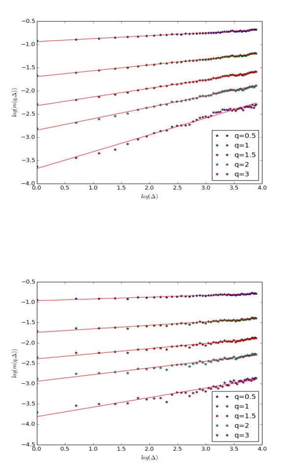

<!-- Start of picture text -->
—0.5 -1.0 -1.5 => -2.0 . = 2 -2.5 ” . —3.0 * * q=0.5 t * ~ + q=1= —3.5 - ~*~ * q =1.5 * * q=2 + q=3 —4.0 0.0 0.5 1.0 1.5 2.0 2.5 3.0 3.5 4.0 log(A) —0.5 -1.0 -1.5 , a~ 72-0 **. * * ™ =-2.5 atelia wellle = + + * -3.0 el z wr a Te q=0.5 3.5 * * * * * * q=1 * * g=1.5 —4.0 + + q=2 + q=3 —4.5 0.0 0.5 1.0 1.5 2.0 2.5 3.0 3.5 4.0 log(A) <!-- End of picture text -->

<!-- page: 10 -->

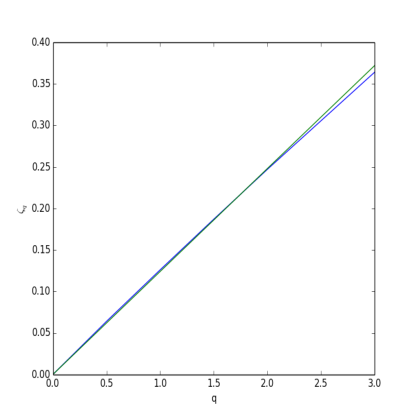

<!-- Start of picture text -->
0.40 0.35 0.30 0.25 J 0.20 0.15 0.10 0.05 0.00 0.0 05 10 15 2.0 25 3.0 q <!-- End of picture text -->

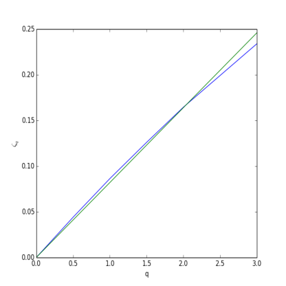

<!-- Start of picture text -->
0.25 0.20 015 SF 0.10 0.05 0.00 0.0 05 10 15 2.0 25 3.0 q <!-- End of picture text -->

<!-- page: 11 -->

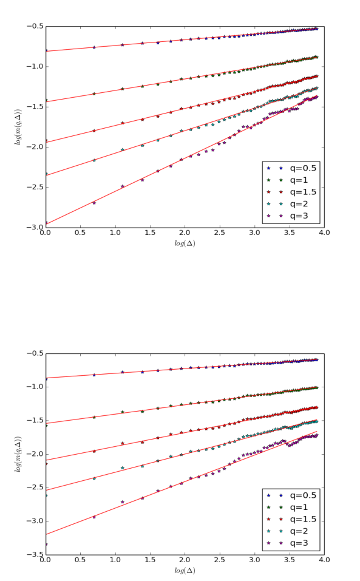

<!-- Start of picture text -->
ae -1.0 J _ 15 ne : « * * q=0.5 —2.5 ~ + q =] * * g=1.5 * * q=2 + q=3 —3.0 0.0 0.5 1.0 1.5 2.0 2.5 3.0 3.5 4.0 log(A) —0.5 -1.0 -1.5 - 2 on ae = -2.0 wee S * Ss s * <i* —2.5 *, * * q=0.5 ~ + q=1 —3.0 * * g=1.5 * * q=2 + q=3 —3.5 0.0 0.5 1.0 1.5 2.0 2.5 3.0 3.5 4.0 log(A) <!-- End of picture text -->

<!-- page: 12 -->

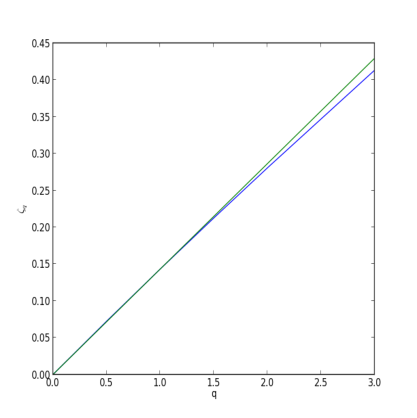

<!-- Start of picture text -->
0.45 0.400.35 0.30 0.25 0.20 0.15 0.10 0.05 0.08, 9 0.5 10 15 2.0 25 3.0 q <!-- End of picture text -->

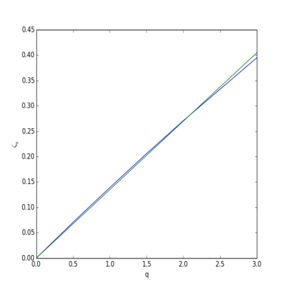

<!-- Start of picture text -->
0.45 0.400.35 J4 0.30 0.25 0.20 0.15 0.10 y 0.05 0.000.0 0.5 1.0 15 2.0 25 3.0 q <!-- End of picture text -->

<!-- page: 13 -->

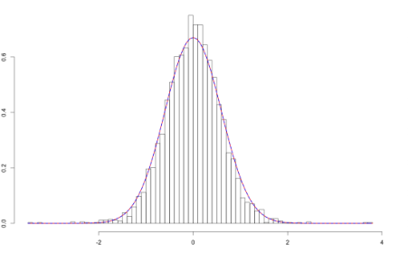

<!-- Start of picture text -->
g In | \ z A/ \| 3 f \ 3 _ _All(liliie - <!-- End of picture text -->

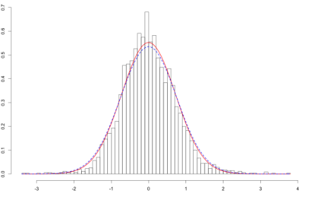

<!-- Start of picture text -->
| ; / it .| ‘lhi iy \ ° i ; |__AAllhsog) te _Al Drm a <!-- End of picture text -->

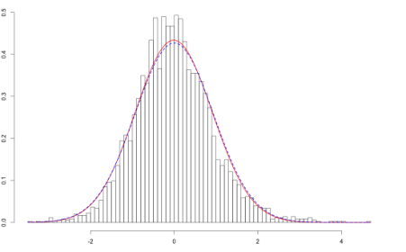

<!-- Start of picture text -->
hi N J 8 — _AllAliii _— - <!-- End of picture text -->

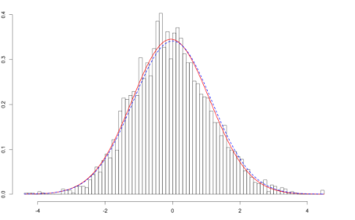

<!-- Start of picture text -->
3 lf | nt 8 ano _ eat(iIIie. Qo <!-- End of picture text -->

<!-- page: 14 -->

the crisis. 

## **3 A simple model compatible with the empirical smoothness of the volatility** 

In this section, we specify the Rough FSV model and demonstrate that it reproduces the empirical facts presented in Section 2. 

### **3.1 Specification of the RFSV model** 

In the previous section, we showed that, empirically, the increments of the log-volatility of various assets enjoy a scaling property with constant smoothness parameter and that their distribution is close to Gaussian. This naturally suggests the simple model: 

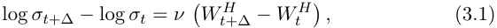

where _W__H_ is a fractional Brownian motion with Hurst parameter equal to the measured smoothness of the volatility and _ν_ is a positive constant. We may of course write (3.1) under the form 

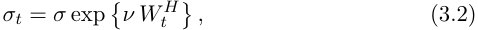

where _σ_ is another positive constant. 

However this model is not stationary, stationarity being desirable both for mathematical tractability and also to ensure reasonableness of the model at very large times. This leads us to impose stationarity by modeling the log-volatility as a fractional Ornstein-Uhlenbeck process (fOU process for short) with a very long reversion time scale. 

A stationary fOU process ( _Xt_ ) is defined as the stationary solution of the stochastic differential equation 

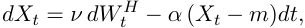

where _m ∈_ R and _ν_ and _α_ are positive parameters, see [12]. As for usual Ornstein-Uhlenbeck processes, there is an explicit form for the solution which is given by 

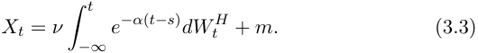

Here the stochastic integral with respect to fBM is simply a pathwise RiemannStieltjes integral, see again [12].

<!-- page: 15 -->

We thus arrive at the final specification of our Rough Fractional Stochastic Volatility (RFSV) model for the volatility on the time interval of interest [0 _, T_ ]: 

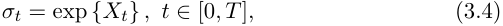

where ( _Xt_ ) satisfies Equation (3.3) for some _ν >_ 0 _, α >_ 0, _m ∈_ R and _H <_ 1 _/_ 2 the measured smoothness of the volatility. Such a model is indeed stationary. However, if _α ≪_ 1 _/T_ , the log-volatility behaves locally (at time scales smaller than _T_ ) as a fBM. This observation is formalized in Proposition 3.1 below. 

**Proposition 3.1.** _Let W__H_ _be a fBM and X__α_ _defined by_ (3.3) _for a given α >_ 0 _. As α tends to zero,_ 

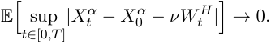

The proof is given in Appendix A.1. 

Proposition 3.1 implies that in the RFSV model, if _α ≪_ 1 _/T_ , and we confine ourselves to the interval [0 _, T_ ] of interest, we can proceed as if the the log-volatility process were a fBM. Indeed, simply setting _α_ = 0 in (3.3) gives (at least formally) _Xt − Xs_ = _ν_ ( _Wt__H_ _− Ws__H_)andweimmediatelyrecover our simple non-stationary fBM model (3.1). 

The following corollary implies that the (exact) scaling property of the fBM is approximately reproduced by the fOU process when _α_ is small. 

**Corollary 3.1.** _Let q >_ 0 _, t >_ 0 _,_ ∆ _>_ 0 _. As α tends to zero, we have_ 

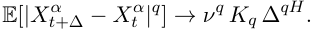

The proof is given in Appendix A.2. 

#### **RFSV versus FSV** 

We recognize our RFSV model (3.4) as a particular case of the classical FSV model of Comte and Renault [16]. The key difference is that here we take _H <_ 1 _/_ 2 and _α ≪_ 1 _/T_ , whereas to accommodate the assumption of long memory, Comte and Renault have to choose _H >_ 1 _/_ 2. The analysis of Fukasawa referred to earlier in Section 1.3 implies in particular that if _H >_ 1 _/_ 2, the volatility skew function _ψ_ ( _τ_ ) is _increasing_ in time to expiration _τ_ (at least for small _τ_ ), which is obviously completely inconsistent with the approximately 1 _/__√_ _<u>τ</u>_ skew term structure that is observed. To generate a decreasing term structure of volatility skew for longer expirations, Comte and Renault are then forced to choose _α ≫_ 1 _/T_ . Consequently, for very short expirations ( _τ ≪_ 1 _/α_ ), models of the Comte and Renault type with

<!-- page: 16 -->

_H >_ 1 _/_ 2 still generate a term structure of volatility skew that is inconsistent with the observed one, as explained for example in Section 4 of [15]. 

In contrast, the choice _H <_ 1 _/_ 2 enables us to reproduce both the observed smoothness of the volatility process and generate a term structure of volatility skew in agreement with the observed one. The choice _H <_ 1 _/_ 2 is also consistent with what is improperly called mean reversion by practitioners, which is the fact that if volatility is unusually high, it tends to decline and if it is unusually low, it tends to increase. Finally, taking _α_ very small implies that the dynamics of our process is close to that of a fBM, see Proposition 3.1. This last point is particularly important. Indeed, recall that at the time scales we are interested in, the important feature we have in mind is really this fBM like-behavior of the log-volatility. 

We could no doubt have considered other stationary models satisfying Proposition 3.1 and Corollary 3.1, where log-volatility behaves as a fBM at reasonable time scales; the choice of the fOU process is probably the simplest way to accommodate this local behavior together with the stationarity property. 

### **3.2 RFSV model autocovariance functions** 

From Proposition 3.1 and Corollary 3.1, we easily deduce the following corollary, where _o_ (1) tends to zero as _α_ tends to zero. 

**Corollary 3.2.** _Let q >_ 0 _, t >_ 0 _,_ ∆ _>_ 0 _. As α tends to zero,_ 

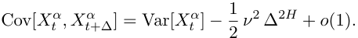

Consequently, in the RFSV model, for fixed _t_ , the covariance between _Xt_ and _Xt_ +∆ is linear with respect to ∆2_H_ . This result is very well satisfied empirically. For example, in Figure 3.1, we see that for the S&P, the empirical autocovariance function of the log-volatility is indeed linear with respect to ∆2_H_ . Note in passing that at the time scales we consider, the term Var[ _Xt__α_] is higher than 2<u>1</u>_ν_2 ∆2_H_intheexpressionforCov[_X_ _t__α, X_ _t__α_ +∆].

<!-- page: 17 -->

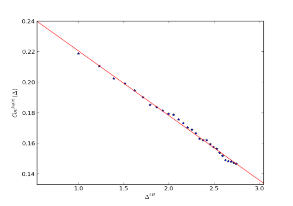

<!-- Start of picture text -->
0.24 0.22 0.20 a € 018 0.16 0.14 1.0 15 2.0 2.5 3.0 Ae <!-- End of picture text -->

<!-- page: 18 -->

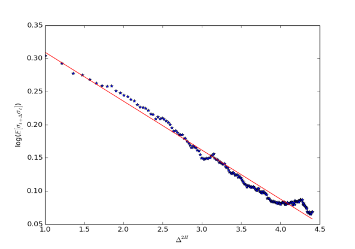

<!-- Start of picture text -->
0.35 0.30 * 0.2 5 Sad*.tHe i—S *,he & 0.20 i, yy <9 roy 2 ~ 0.15 % 0.10 0.05 1.0 15 2.0 2.5 3.0 3.5 4.0 4.5 Alt <!-- End of picture text -->

<!-- page: 19 -->

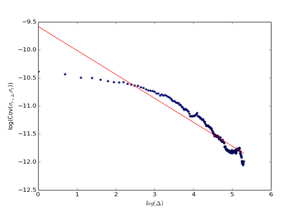

<!-- Start of picture text -->
-9.5 —10.0 = 10.5. we ** * a> = & -11.0 > fo} Q oa 2 -11.5 -12.0 ¢ -12.50) 1 2 3 4 5 6 log(A) <!-- End of picture text -->

<!-- page: 20 -->

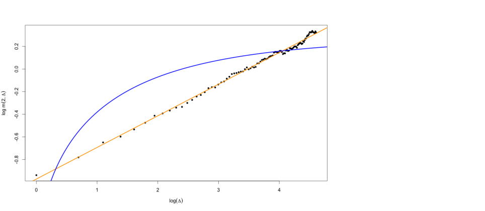

<!-- Start of picture text -->
3s S N a ¢? a E p> st 2g 2 9 2 9 0 1 2 3 4 log(A) <!-- End of picture text -->

<!-- page: 21 -->

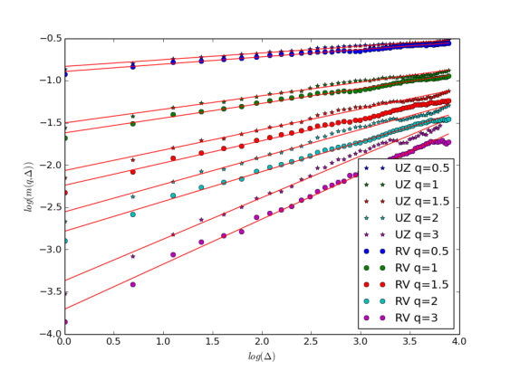

<!-- Start of picture text -->
-1.0 | = _ * * UZq=0.5 : * * UZ q=1 = * * UZQG=15 * * UZ q=2 * * UZq=3 - e © RV g=0.5 ee RVg=1 ~ ee RVG=1.5 © @ RV q=2 e e RVqg=3 485 0.5 1.0 15 2.0 2.5 3.0 3.5 4.0 log(A) <!-- End of picture text -->

<!-- page: 22 -->

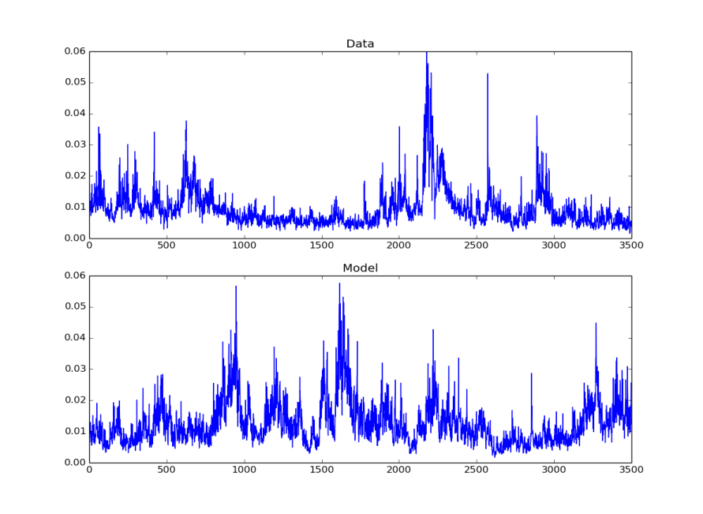

<!-- Start of picture text -->
0.06 Data 0.05 0.04 0.03 0.02 0.01 { | 0.005 500 1000 1500 2000 2500 3000 3500 0.06 Model 0.05 0.04 0.03 0.02 0.01 ! | 0.005 500 1000 1500 2000 2500 3000 3500 <!-- End of picture text -->

<!-- page: 23 -->

At the visual level, we observe that this fractal-type behavior is also reproduced in our model, as we now explain. Denote by _L__x,H_ the law of the geometric fractional Brownian motion with Hurst exponent _H_ and volatility _x_ on [0 _,_ 1], that is ( _e__xW H_ _t_ ) _t∈_ [0 _,_ 1]. Then, when _α_ is very small, the rescaled volatility process on [0 _,_ ∆]: ( _σt_ ∆ _/σ_ 0) _t∈_ [0 _,_ 1], has approximately the law _L__ν_∆_H,H_ . Now remark that for _H_ small, the function _u__H_ increases very slowly. Thus, over a large range of observation scales ∆, the rescaled volatility processes on [0 _,_ ∆] have approximately the same law. For example, between an observation scale of one day and five years (1250 open days), the coefficient _x_ characterizing the law of the volatility process is “only” multiplied by 12500_._14 = 2 _._ 7. It follows that in the RFSV model, the volatility process over one day resembles the volatility process over a decade. 

## **4 Spurious long memory of volatility?** 

We revisit in this section the issue of long memory of volatility through the lens of our model. As mentioned earlier in the introduction, the long memory of volatility is widely accepted as a stylized fact. Specifically, this means that the autocovariance function Cov[log( _σt_ ) _,_ log( _σt_ +∆)] (or sometimes Cov[ _σt, σt_ +∆]) goes slowly to zero as ∆ _→∞_ and often even more precisely, that it behaves as ∆_−γ_ , with _γ <_ 1 as ∆ _→∞_ . 

In previous sections, we showed that both in the data and in our model, 

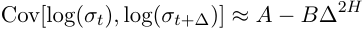

and 

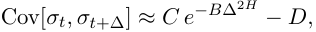

for some constants _A_ , _B_ , _C_ and _D_ . Thus, neither in the model nor in the data does the autocovariance function decay as a power law. And neither the data nor the model exhibits long memory10 , see again Figure 3.3. 

We now revisit some standard statistical procedures aimed at identifying long memory that have been used in the financial econometrics literature. In the sequel, we apply these both to the data and to sample paths of the RFSV model. Such procedures are of course designed to identify long memory under rather strict modeling assumptions; spurious results may obviously then be obtained if the model underlying the estimation procedure 

> 10In fact the notion of empirical long memory does not make much sense outside the power law case. Indeed the empirical values of covariances at very large time scales are never measurable and thus one cannot conclude if the series of covariances converges in general. All that we say here is that the autocovariance of the (log-)volatility does not behave as a power law.

<!-- page: 24 -->

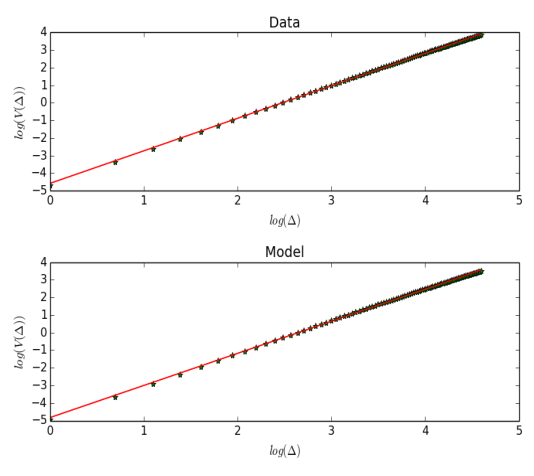

<!-- Start of picture text -->
4 Data 3 2 ~ 1 40 25 -1-2 -3 -4 -5 0 1 2 3 4 5 log(A) 4 Model 3 2 ~4 0 1 2S -1-2 -3 -4 -5 ) 1 2 3 4 5 log(A) <!-- End of picture text -->

<!-- page: 25 -->

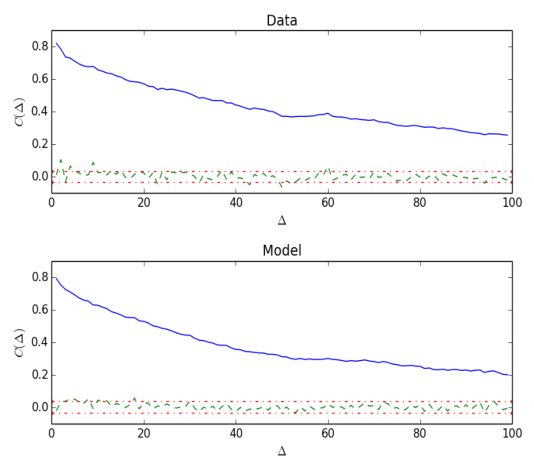

<!-- Start of picture text -->
Data 0.8 0.6 0.4 sy 0.2 o.of" "= Pee NAIA AINA ee AINA TETER LENE SSSR EIS 0 20 40 60 80 100 A Model 0.8 0.6 404 sy 0.2 O.0f/ 7 VN AAS EAE LEAT SEE ENR US ES SAE IN SSA SA PAINE ) 20 40 60 80 100 A <!-- End of picture text -->

<!-- page: 26 -->

## **5 Forecasting using the RFSV model** 

In this section, we present an application of our model: forecasting the log-volatility and the variance. 

### **5.1 Forecasting log-volatility** 

The key formula on which our prediction method is based is the following one: 

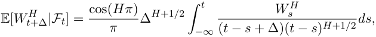

where _W__H_ is a fBM with _H <_ 1 _/_ 2 and _Ft_ the filtration it generates, see Theorem 4.2 of [41]. By construction, over any reasonable time scale of interest, as formalized in Corollary 3.1, we may approximate the fOU volatility process in the RFSV model as log _σt_2_≈_2_ν W H_ _t_ + _C_ for some constants _ν_ and _C_ . Our prediction formula for log-variance then follows:11 

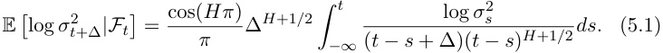

This formula, or rather its approximation through a Riemann sum (we assume in this section that the volatilities are perfectly observed, although they are in fact estimated), is used to forecast the log-volatility 1, 5 and 20 days ahead (∆= 1 _,_ 5 _,_ 20). 

We now compare the predictive power of formula (5.1) with that of AR and HAR forecasts, in the spirit of [18]12 . Recall that for a given integer _p >_ 0, the AR(p) and HAR predictors take the following form (where the index _i_ runs over the series of daily volatility estimates): 

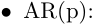

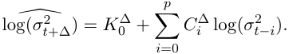

_•_ HAR : 

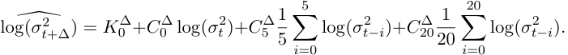

> 11The constants 2 _ν_ and _C_ cancel when deriving the expression. 

> 12 Note that we do not consider GARCH models here since we have access to high frequency volatility estimates and not only to daily returns. Indeed, it is shown in [4] that forecasts based on the time series of realized variance outperform GARCH forecasts based on daily returns.

<!-- page: 27 -->

We estimate AR coefficients using the R `stats` library13 on a rolling time window of 500 days. In the HAR case, we use standard linear regression to estimate the coefficients as explained in [18]. In the sequel, we consider _p_ = 5 and _p_ = 10 in the AR formula. Indeed, these parameters essentially give the best results for the horizons at which we wish to forecast the volatility (1, 5 and 20 days). For each day, we forecast volatility for five different indices14 . 

We then assess the quality of the various forecasts by computing the ratio _P_ between the mean squared error of our predictor and the (approximate) variance of the log-variance: 

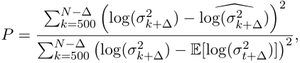

where E[log( _σt_2 +∆)]denotestheempiricalmeanofthelog-varianceoverthe whole time period. 

||AR(5)|AR(10)|HAR(3)|RFSV|
|---|---|---|---|---|
|SPX2.rv ∆= 1|0.317|0.318|0.314|**0.313**|
|SPX2.rv ∆= 5|0.459|0.449|0.437|**0.426**|
|SPX2.rv ∆= 20|0.764|0.694|0.656|**0.606**|
|FTSE2.rv ∆= 1|0.230|0.229|0.225|**0.223**|
|FTSE2.rv ∆= 5|0.357|0.344|0.337|**0.320**|
|FTSE2.rv ∆= 20|0.651|0.571|0.541|**0.472**|
|N2252.rv ∆= 1|0.357|0.358|0.351|**0.345**|
|N2252.rv ∆= 5|0.553|0.533|0.513|**0.504**|
|N2252.rv ∆= 20|0.875|0.795|0.746|**0.714**|
|GDAXI2.rv ∆= 1|0.237|0.238|0.234|**0.231**|
|GDAXI2.rv ∆= 5|0.372|0.362|0.350|**0.339**|
|GDAXI2.rv ∆= 20|0.661|0.590|0.550|**0.498**|
|FCHI2.rv ∆= 1|0.244|0.244|0.241|**0.238**|
|FCHI2.rv ∆= 5|0.378|0.373|0.366|**0.350**|
|FCHI2.rv ∆= 20|0.669|0.613|0.598|**0.522**|

Table 5.1: Ratio _P_ for the AR, HAR and RFSV predictors. 

We note from Table 5.1 that the RFSV forecast consistently outperforms the AR and HAR forecasts, especially at longer horizons. Moreover, our forecasting method is more parsimonious since it only requires the parameter 

> 13More precisely, we use the default Yule-Walker method. 

> 14In addition to S&P and NASDAQ, we also investigate CAC40, FTSE and Nikkei, over the same time period as S&P and NASDAQ. For simplicity, the parameter _H_ used in our predictor is computed only once for each asset, using the whole time period. This yields similar results to using a moving time window adapted in time.

<!-- page: 28 -->

_H_ to forecast the log-variance. Compare this with the AR and HAR methods, for which coefficients depend on the forecast time horizon and must be recomputed if this horizon changes. 

Remark that our predictor can be linked to that of [21], where the issue of the prediction of the log-volatility in the multifractal random walk model of [5] is tackled. In this model, 

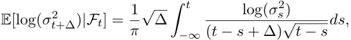

which is the limit of our predictor when _H_ tends to zero. 

Note also that our prediction formula may be rewritten as 

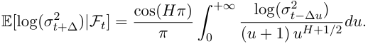

For a given small _ε >_ 0, let _r_ be the smallest real number such that 

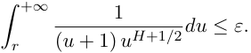

Then we have, with an error of order _ε_ , 

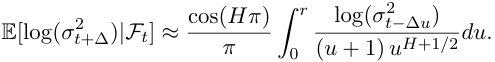

Consequently, the volatility process needs to be considered (roughly) down to time _t −_ ∆ _r_ if one wants to forecast up to time ∆in the future. The relevant regression window is thus linear in the forecasting horizon. For example, for _r_ = 1, _ε_ = 0 _._ 35 which is not so unreasonable. In this case, as is well-known to practitioners, to predict volatility one week ahead, one should essentially look at the volatility over the last week. If trying to predict the volatility one month ahead, one should look at the volatility over the last month. 

### **5.2 Variance prediction** 

Recall that log _σt_2_≈_2_ν W H_ _t_ + _C_ for some constant _C_ . In [41], it is shown that _W__H_conditionallyGaussianwithconditionalvariance _t_ +∆is 

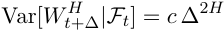

with 

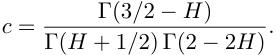

<!-- page: 29 -->

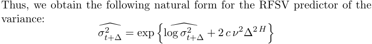

� where log( _σt_2 +∆)istheestimatorfromSection5.1and_ν_2isestimatedas the exponential of the intercept in the linear regression of log( _m_ (2 _,_ ∆)) on log(∆). 

As in the previous paragraph, we compare in Table 5.2 the performance of the RFSV forecast with those of AR and HAR forecasts (constructed on variance rather than log-variance this time). 

||AR(5)|AR(10)|HAR(3)|RFSV|
|---|---|---|---|---|
|SPX2.rv ∆= 1|0.520|0.566|0.489|**0.475**|
|SPX2.rv ∆= 5|0.750|0.745|0.723|**0.672**|
|SPX2.rv ∆= 20|1.070|1.010|1.036|**0.903**|
|FTSE2.rv ∆= 1|0.612|0.621|0.582|**0.567**|
|FTSE2.rv ∆= 5|0.797|0.770|0.756|**0.707**|
|FTSE2.rv ∆= 20|1.046|0.984|0.935|**0.874**|
|N2252.rv ∆= 1|0.554|0.579|**0.504**|0.505|
|N2252.rv ∆= 5|0.857|0.807|0.761|**0.729**|
|N2252.rv ∆= 20|1.097|1.046|1.011|**0.964**|
|GDAXI2.rv ∆= 1|0.439|0.448|0.399|**0.386**|
|GDAXI2.rv ∆= 5|0.675|0.650|0.616|**0.566**|
|GDAXI2.rv ∆= 20|0.931|0.850|0.816|**0.746**|
|FCHI2.rv ∆= 1|0.533|0.542|0.470|**0.465**|
|FCHI2.rv ∆= 5|0.705|0.707|0.691|**0.631**|
|FCHI2.rv ∆= 20|0.982|0.952|0.912|**0.828**|

Table 5.2: Ratio _P_ for the AR, HAR and RFSV predictors. 

We find again that the RFSV forecast typically outperforms HAR and AR, although it is worth noting that the HAR forecast is already visibly superior to the AR forecast. 

## **6 The microstructural foundations of the irregularity of the volatility** 

We gather in this section some ideas which may help to understand why the observed volatility appears so irregular. The starting point is the analysis of the order flow through Hawkes processes. These processes are extensions of Poisson processes where the intensity at a given time depends on the

<!-- page: 30 -->

location of the past jumps. More precisely, let us consider a time period starting at 0 and denote by _Nt_ the number of transactions between 0 and _t_ . Assuming the point process _Nt_ follows a Hawkes process means its intensity at time _t_ , _λt_ , takes the form: 

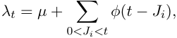

where the _Ji_ are the past jump times, _µ_ is a positive constant and _φ_ is a non negative deterministic function called kernel. 

When trying to calibrate such models on high frequency data, two main phenomena almost systematically occur: 

- The _L_1 norm of _φ_ is close to one, see [23, 24, 30, 35]. 

- The function _φ_ has a power law tail, see [6, 30]. 

The first of these two facts means the degree of endogeneity of the market is very high, that is one given order endogenously generates many other orders, see [23, 24, 30]. This recent feature of financial markets is obviously related to electronic high frequency trading, where market participants automatically react to other participants orders through their algorithms. The second observation tells us that generally, a given order influences other orders over a long time period. This is likely due to the splitting of large orders. Indeed, many orders are actually part of a metaorder whose full execution can take a large amount of time. 

We believe these two phenomena together lead to a superposition effect inducing this irregular volatility. Indeed, it is explained in [33, 34] that the macroscopic scaling limit of Hawkes processes with power law tail and kernel with _L_1 norm close to one can be seen as an integrated fractional process, with Hurst parameter _H_ smaller than 1 _/_ 2. This signifies that at large sampling scales, the dynamics of the cumulated order flow is well approximated by an integrated fractional process, with _H <_ 1 _/_ 2. Then, it is clearly established that there is a linear relation between cumulated order flow and integrated variance. Thus we retrieve here that because of this superposition effect, the volatility should behave as a fractional process with _H <_ 1 _/_ 2. 

## **7 Conclusion** 

Using daily realized variance estimates as proxies for daily spot (squared) volatilities, we uncovered two startlingly simple regularities in the resulting

<!-- page: 31 -->

time series. First we found that the distributions of increments of logvolatility are approximately Gaussian, consistent with many prior studies. Secondly, we established the monofractal scaling relationship 

where _H_ can be seen as a measure of smoothness characteristic of the underlying volatility process; typically, 0 _._ 06 _< H <_ 0 _._ 2. The simple scaling relationship (7.1) naturally suggests that log-volatility may be modeled using fractional Brownian motion. 

The resulting Rough Fractional Stochastic Volatility (RFSV) model turns out to be formally almost identical to the FSV model of Comte and Renault [16], with one major difference: In the FSV model, _H >_ 1 _/_ 2 to ensure long memory whereas in the RFSV model _H <_ 1 _/_ 2, typically, _H ≈_ 0 _._ 1. Moreover, in the FSV model, the mean reversion coefficient _α_ has to be large compared to 1 _/T_ to ensure a decaying volatility skew; in the RFSV model, the volatility skew decays naturally just like the observed volatility skew, _α ≪_ 1 _/T_ and indeed for time scales of practical interest, we may proceed as if _α_ were exactly zero. 

We further showed that applying standard statistical estimators to volatility time series simulated with the RFSV model would lead us to erroneously deduce the presence of long memory, with parameters similar to those found in prior studies. Despite that volatility in the RFSV model (or in the data) is not long memory, we can therefore explain why long memory of volatility is widely accepted as a stylized fact. 

As an application of the RFSV model, we showed how to forecast volatility at various times cales, at least as well as Fulvio Corsi’s impressive HAR estimator, but with only one parameter – _H_ ! 

Finally, we explained how the RFSV model could emerge as the scaling limit of a Hawkes process description of order flow. 

In future work, we will explore the implications of the RFSV model (written under the physical measure P), for option pricing (under the pricing measure Q). In particular, following Mandelbrot and Van Ness, the fBM that appears in the definition (3.4) of the RFSV model may be represented as a fractional integral of a standard Brownian motion as follows [36]: 

with _γ_ = 2<u>1</u>_−H_.Theobservedanticorrelationbetweenpricemovesand volatility moves may then be modeled naturally by anticorrelating the Brow-

<!-- page: 32 -->

nian motion _W_ that drives the volatility process with the Brownian motion driving the price process. As already shown by Fukasawa [25], such a model with a small _H_ reproduces the observed decay of at-the-money volatility skew with respect to time to expiry, asymptotically for short times. We will show that an appropriate extension of Fukasawa’s model, consistent with the RFSV model, fits the entire implied volatility surface remarkably well, not just for short expirations. Moreover, despite that it would seem from (7.2) that knowledge of the entire path _{Ws_ : _s < t}_ of the Brownian motion would be required, it turns out that the statistics of this path necessary for option pricing are traded and thus easily observed. 

## **A Proofs** 

### **A.1 Proof of Proposition 3.1** 

Starting from Equation (3.3) and applying integration by parts, we get 

Therefore, 

Consequently, 

where _W_ˆ _t__H_ = sup _s∈_ [0 _,t_ ] _|Ws__H|_.Usingthemaximuminequalityof[40],weget 

with _c_ some constant. The term on the right hand side is easily seen to go to zero as _α_ tends to zero. 

### **A.2 Proof of Corollary 3.1** 

We first recall Equation (2.2) in [12] which writes: 

<!-- page: 33 -->

with _K_ = _ν_2 Γ(2 _H_ + 1)sin( _πH_ ) _/_ (2 _π_ )15 . Now remark that 

Therefore, 

This implies that for fixed ∆, E[ _|Xt__α_ +∆_−X_ _t__α|_2]isuniformlyboundedby 

Moreover, _Xt__α_ +∆_−X_ _t__α_isaGaussianrandomvariableandthusforevery _q_ , its ( _q_ + 1)_th_ moment is uniformly bounded (in _α_ ) so that the family _|Xt__α_ +∆_−X_ _t__α|q_isuniformlyintegrable.Therefore,sincebyProposition3.1, 

we get the convergence of the sequence of expectations. 

> 15This covariance is real because it is the Fourier transform of an even function.

<!-- page: 34 -->

## **B Estimations of** _H_ 

### **B.1 On indices** 

|Index|_ζ_0_._5_/_0_._5|_ζ_1|_ζ_1_._5_/_1_._5|_ζ_2_/_2|_ζ_3_/_3|
|---|---|---|---|---|---|
|SPX2.rv|0.128|0.126|0.125|0.124|0.124|
|FTSE2.rv|0.132|0.132|0.132|0.131|0.127|
|N2252.rv|0.131|0.131|0.132|0.132|0.133|
|GDAXI2.rv|0.141|0.139|0.138|0.136|0.132|
|RUT2.rv|0.117|0.115|0.113|0.111|0.108|
|AORD2.rv|0.072|0.073|0.074|0.075|0.077|
|DJI2.rv|0.117|0.116|0.115|0.114|0.113|
|IXIC2.rv|0.131|0.133|0.134|0.135|0.137|
|FCHI2.rv|0.143|0.143|0.142|0.141|0.138|
|HSI2.rv|0.079|0.079|0.079|0.080|0.082|
|KS11.rv|0.133|0.133|0.134|0.134|0.132|
|AEX.rv|0.145|0.147|0.149|0.149|0.149|
|SSMI.rv|0.149|0.153|0.156|0.158|0.158|
|IBEX2.rv|0.138|0.138|0.137|0.136|0.133|
|NSEI.rv|0.119|0.117|0.114|0.111|0.102|
|MXX.rv|0.077|0.077|0.076|0.075|0.071|
|BVSP.rv|0.118|0.118|0.119|0.120|0.120|
|GSPTSE.rv|0.106|0.104|0.103|0.102|0.101|
|STOXX50E.rv|0.139|0.135|0.130|0.123|0.101|
|FTSTI.rv|0.111|0.112|0.113|0.113|0.112|
|FTSEMIB.rv|0.130|0.132|0.133|0.134|0.134|

Table B.1: Estimates of _ζq_ for all indices in the Oxford-Man dataset.

<!-- page: 35 -->

### **B.2 On time intervals**16 

|Index|H (frst half)|H (second half)|
|---|---|---|
|SPX2.rk|0.115|0.158|
|FTSE2.rk|0.140|0.156|
|N2252.rk|0.083|0.134|
|GDAXI2.rk|0.154|0.168|
|RUT2.rk|0.098|0.149|
|AORD2.rk|0.059|0.114|
|DJI2.rk|0.123|0.151|
|IXIC2.rk|0.094|0.156|
|FCHI2.rk|0.140|0.146|
|HSI2.rk|0.072|0.129|
|KS11.rk|0.109|0.147|
|AEX.rk|0.168|0.151|
|SSMI.rk|0.206|0.183|
|IBEX2.rk|0.122|0.149|
|NSEI.rk|0.112|0.124|
|MXX.rk|0.068|0.118|
|BVSP.rk|0.074|0.134|
|GSPTSE.rk|0.075|0.147|
|STOXX50E.rk|0.138|0.132|
|FTSTI.rk|0.080|0.171|
|FTSEMIB.rk|0.133|0.140|

Table B.2: Estimates of _H_ over two different time intervals for all indices in the Oxford-Man dataset 

## **C The effect of smoothing** 

Although we are really interested in the model 

consider the more tractable (fractional Stein and Stein or fSS) model: 

where _vt_ = _σ_2 . We cannot observe _vt_ but suppose we can proxy it by the average 

> 16Note that we used realized kernel rather than realized variance estimates to generate Table B.2. Results obtained using different variance estimators are almost indistinguishable.

<!-- page: 36 -->

| | ~~a~~ ) ff | [fi 

<!-- Start of picture text -->
| <!-- End of picture text -->

| 

| 

fd] = ~~f~~ 

/ | ~~—_—_{~~ 

/ | ~~— ——-{~~

<!-- page: 37 -->

<!-- Start of picture text -->
a a oO o oO MH o = © oO Te) oO = oO o oO 0.0 0.2 0.4 0.6 0.8 1.0 6 <!-- End of picture text -->

<!-- page: 38 -->

<!-- Start of picture text -->
a vs v7 <I1 o aePoaaewat” Eas o= a—a- ** tad “7 a ae = os Pail fy] < at ~ ce t - ae 2 I . 0 1 2 3 4 logA <!-- End of picture text -->

<!-- page: 39 -->

- [6] E. Bacry and J.-F. Muzy. Hawkes model for price and trades highfrequency dynamics. _Quantitative Finance_ , 14(7):1147–1166, 2014. 

- [7] S. R. Bentes and M. M. Cruz. Is stock market volatility persistent? A fractionally integrated approach. 2011. 

- [8] J. Beran. _Statistics for long-memory processes_ , volume 61. CRC Press, 1994. 

- [9] J.-P. Bouchaud and M. Potters. _Theory of financial risk and derivative pricing: From statistical physics to risk management_ . Cambridge University Press, 2003. 

- [10] P. Carr and L. Wu. What type of process underlies options? A simple robust test. _Journal of Finance_ , 58(6):2581–2610, 2003. 

- [11] Z. Chen, R. T. Daigler, and A. M. Parhizgari. Persistence of volatility in futures markets. _Journal of Futures Markets_ , 26(6):571–594, 2006. 

- [12] P. Cheridito, H. Kawaguchi, and M. Maejima. Fractional OrnsteinUhlenbeck processes. _Electron. J. Probab_ , 8(3):14, 2003. 

- [13] A. Chronopoulou. Parameter estimation and calibration for longmemory stochastic volatility models. In F. G. Viens, M. C. Mariani, and I. Florescu, editors, _Handbook of Modeling High-Frequency Data in Finance_ , pages 219–231. John Wiley & Sons, 2011. 

- [14] A. Chronopoulou and F. G. Viens. Estimation and pricing under longmemory stochastic volatility. _Annals of Finance_ , 8(2-3):379–403, 2012. 

- [15] F. Comte, L. Coutin, and E. Renault. Affine fractional stochastic volatility models. _Annals of Finance_ , 8(2-3):337–378, 2012. 

- [16] F. Comte and E. Renault. Long memory in continuous-time stochastic volatility models. _Mathematical Finance_ , 8(4):291–323, 1998. 

- [17] R. Cont. Volatility clustering in financial markets: Empirical facts and agent-based models. In G. Teyssi`ere and A. P. Kirman, editors, _Long Memory in Economics_ , pages 289–309. Springer Berlin Heidelberg, 2007. 

- [18] F. Corsi. A simple approximate long-memory model of realized volatility. _Journal of Financial Econometrics_ , 7(2):174–196, 2009. 

- [19] K. Dayri and M. Rosenbaum. Large tick assets: Implicit spread and optimal tick size. _Working paper_ , 2013. 

- [20] Z. Ding, C. W. Granger, and R. F. Engle. A long memory property of stock market returns and a new model. _Journal of Empirical Finance_ , 1(1):83–106, 1993.

<!-- page: 40 -->

- [21] J. Duchon, R. Robert, and V. Vargas. Forecasting volatility with the multifractal random walk model. _Mathematical Finance_ , 22(1):83–108, 2012. 

- [22] B. Dupire. Pricing with a smile. _Risk Magazine_ , 7(1):18–20, 1994. 

- [23] V. Filimonov and D. Sornette. Quantifying reflexivity in financial markets: Toward a prediction of flash crashes. _Physical Review E_ , 85(5):056108, 2012. 

- [24] V. Filimonov and D. Sornette. Apparent criticality and calibration issues in the Hawkes self-excited point process model: Application to high-frequency financial data. _arXiv preprint arXiv:1308.6756_ , 2013. 

- [25] M. Fukasawa. Asymptotic analysis for stochastic volatility: Martingale expansion. _Finance and Stochastics_ , 15(4):635–654, 2011. 

- [26] J. Gatheral. _The volatility surface: A practitioner’s guide_ , volume 357. John Wiley & Sons, 2006. 

- [27] J. Gatheral and A. Jacquier. Arbitrage-free SVI volatility surfaces. _Quantitative Finance_ , 14(1):59–71, 2014. 

- [28] J. Gatheral and R. C. Oomen. Zero-intelligence realized variance estimation. _Finance and Stochastics_ , 14(2):249–283, 2010. 

- [29] P. S. Hagan, D. Kumar, A. S. Lesniewski, and D. E. Woodward. Managing smile risk. _Wilmott Magazine_ , pages 84–108, 2002. 

- [30] S. J. Hardiman, N. Bercot, and J.-P. Bouchaud. Critical reflexivity in financial markets: A Hawkes process analysis. _arXiv preprint arXiv:1302.1405_ , 2013. 

- [31] S. L. Heston. A closed-form solution for options with stochastic volatility with applications to bond and currency options. _Review of Financial Studies_ , 6(2):327–343, 1993. 

- [32] J. Hull and A. White. One-factor interest-rate models and the valuation of interest-rate derivative securities. _Journal of Financial and Quantitative Analysis_ , 28(02):235–254, 1993. 

- [33] T. Jaisson and M. Rosenbaum. Limit theorems for nearly unstable Hawkes processes. _The Annals of Applied Probability, to appear_ , 2013. 

- [34] T. Jaisson and M. Rosenbaum. Fractional diffusions as scaling limits of nearly unstable heavy-tailed Hawkes processes. _Working paper_ , 2014. 

- [35] M. Lallouache and D. Challet. Statistically significant fits of Hawkes processes to financial data. _Available at SSRN 2450101_ , 2014.

<!-- page: 41 -->

- [36] B. B. Mandelbrot and J. W. Van Ness. Fractional Brownian motions, fractional noises and applications. _SIAM review_ , 10(4):422–437, 1968. 

- [37] R. N. Mantegna and H. E. Stanley. _Introduction to econophysics: Correlations and complexity in finance_ . Cambridge University Press, 2000. 

- [38] T. Mikosch and C. St˘aric˘a. Is it really long memory we see in financial returns. In P. Embrechts, editor, _Extremes and integrated risk management_ , pages 149–168. Risk Books, 2000. 

- [39] M. Musiela and M. Rutkowski. _Martingale methods in financial modelling_ , volume 36. Springer, 2006. 

- [40] A. Novikov and E. Valkeila. On some maximal inequalities for fractional Brownian motions. _Statistics & Probability Letters_ , 44(1):47–54, 1999. 

- [41] C. J. Nuzman and V. H. Poor. Linear estimation of self-similar processes via Lamperti’s transformation. _Journal of Applied Probability_ , 37(2):429–452, 2000. 

- [42] C. Y. Robert and M. Rosenbaum. A new approach for the dynamics of ultra-high-frequency data: The model with uncertainty zones. _Journal of Financial Econometrics_ , 9(2):344–366, 2011. 

- [43] C. Y. Robert and M. Rosenbaum. Volatility and covariation estimation when microstructure noise and trading times are endogenous. _Mathematical Finance_ , 22(1):133–164, 2012. 

- [44] M. Rosenbaum. Estimation of the volatility persistence in a discretely observed diffusion model. _Stochastic Processes and their Applications_ , 118(8):1434–1462, 2008. 

- [45] M. Rosenbaum. First order p-variations and Besov spaces. _Statistics & Probability Letters_ , 79(1):55–62, 2009. 

- [46] M. Rosenbaum. A new microstructure noise index. _Quantitative Finance_ , 11(6):883–899, 2011.
