<!-- page: 1 -->

# On deep calibration of (rough) stochastic volatility models 

Christian Bayer TU Berlin and WIAS 

christian.bayer@wias-berlin.de 

Blanka Horvath 

Department of Mathematics, King’s College London 

blanka.horvath@kcl.ac.uk, b.horvath@imperial.ac.uk 

Aitor Muguruza 

Department of Mathematics, Imperial College London & NATIXIS 

aitor.muguruza-gonzalez15@imperial.ac.uk 

Benjamin Stemper TU Berlin and WIAS 

benjamin.stemper@wias-berlin.de 

Mehdi Tomas CMAP & LadHyx, Ecole´ Polytechnique mehdi.tomas@polytechnique.edu 

August 26, 2019 

##### **Abstract** 

Techniques from deep learning play a more and more important role for the important task of calibration of financial models. The pioneering paper by Hernandez [Risk, 2017] was a catalyst for resurfacing interest in research in this area. In this paper we advocate an alternative (two-step) approach using deep learning techniques solely to learn the pricing map – from model parameters to prices or implied volatilities – rather than directly the calibrated model parameters as a function of observed market data. Having a fast and accurate neural-networkbased approximating pricing map (first step), we can then (second step) use traditional model calibration algorithms. In this work we showcase a direct comparison of different potential approaches to the learning stage and present algorithms that provide a sufficient accuracy for practical use. We provide a first neural network-based calibration method for rough volatility 

The authors are grateful to Ben Wood, Jim Gatheral and Ryan McCrickerd for stimulating discussions. MT acknowledges financial support from the Econophysique et Systmes Complexes chair under the aegis of the Fondation du Risque, a joint initiative by the Fondation de lEcole´ Polytechnique, lEcole´ Polytechnique and Capital Fund Management. CB and BS are grateful for financial support by the DFG through research grants BA5484/1 and FR2943/2. The present paper combines and consolidates findings of its two predecessor papers, [7] and [35].

<!-- page: 2 -->

models for which calibration can be done on the fly. We demonstrate the method via a hands-on calibration engine on the rough Bergomi model, for which classical calibration techniques are difficult to apply due to the high cost of all known numerical pricing methods. Furthermore, we display and compare different types of sampling and training methods and elaborate on their advantages under different objectives. As a further application we use the fast pricing method for a Bayesian analysis of the calibrated model. 

#### **2010** _Mathematics Subject Classification_ : 60G15, 60G22, 91G20, 91G60, 91B25 

**Keywords:** Rough volatility, volatility modelling, Volterra process, machine learning, accurate price approximation, calibration, model assessment, Monte Carlo 

## **Contents** 

|**1**|**Intr**|**oduction** **3**|
|---|---|---|
|**2**|**Mo**|**del calibration** **7**|
|**3**|**Dee**|**p calibration** **9**|
||3.1|One-step approach: Deep calibration by the inverse map . . . . . . . . . . . . . . . . 10|
||3.2|Two-step approach: Learning the implied volatility map of models . . . . . . . . . . 11|
|||3.2.1 The two step approach: Pointwise training and implicit and grid-based training 12|
|||3.2.2 The role of the objective function: Pointwise training versus implicit and grid-based training . . . . . . . . . . . . . . . . . . . . . . . . . . . . . . . . . 14|
|**4**|**Pra**|**ctical implementation** **16**|
||4.1|Network architecture and training . . . . . . . . . . . . . . . . . . . . . . . . . . . . 16|
||4.2|The calibration step . . . . . . . . . . . . . . . . . . . . . . . . . . . . . . . . . . . . 17|
|||4.2.1 Bayesian Analysis of the Calibration . . . . . . . . . . . . . . . . . . . . . . . 17|
|**5**|**Nu**|**merical experiments** **18**|
||5.1|Speed and accuracy of the price approximation networks . . . . . . . . . . . . . . . . 18|
||5.2|Calibration speed and accuracy . . . . . . . . . . . . . . . . . . . . . . . . . . . . . . 19|
||5.3|A Bayes calibration experiment . . . . . . . . . . . . . . . . . . . . . . . . . . . . . . 22|
|**A **|**A n**|**umerical experiment with the inverse map** **25**|
|**B **|**Illu**|**sration of model parameters & the pricing engine in the rBergomi model** **28**|

<!-- page: 3 -->

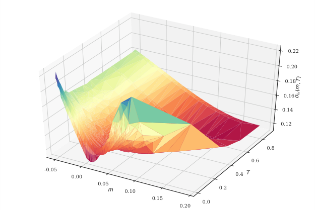

<!-- Start of picture text -->
0.22 0.20 0.18 0.16 0.14 0.12 0.8 0.6 -0.05 0.00 0.4 T 0.05 m 0.10 0.2 0.15 0.0 0.20 ( T)miv, <!-- End of picture text -->

Figure 1: **SPX Market Implied Volatility surface on 15th February 2018.** IVs have been inverted from SPX Weekly European plain vanilla call mid prices and the interpolation is a (nonarbitrage-free) Delaunay triangulation. Axes denote log-moneyness _m_ = log( _K/S_ 0) for strike _K_ and spot _S_ 0, time to maturity _T_ in years and market implied volatility _σ_ iv( _m, T_ ). 

## **1 Introduction** 

Almost half a century after its publication, the option pricing model by Black, Scholes and Merton remains one of the most popular analytical frameworks for pricing and hedging European options in financial markets. A part of its success stems from the availability of explicit and hence instantaneously computable closed formulas for both theoretical option prices and option price sensitivities to input parameters ( _Greeks_ ), albeit at the expense of assuming that _volatility_ – the standard deviation of log returns of the underlying asset price – is deterministic and constant. Still, in financial practice, the Black-Scholes model is often considered a sophisticated transform between option prices and Black-Scholes (BS) _implied volatility (IV) σ_ iv where the latter is defined as the constant volatility input needed in the BS formula to match a given (market) price. It is a well-known fact that in empirical IV surfaces obtained by transforming market prices of European options to IVs, it can be observed that IVs vary across moneyness and maturities, exhibiting well-known smiles and at-the-money (ATM) skews and thereby contradicting the flat surface predicted by Black-Scholes (Figure 1). In particular, Bayer, Friz, and Gatheral [5] report empirical at-the-money volatility skews of the form 

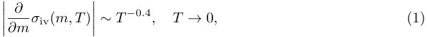

for log moneyness _m_ and time to maturity _T_ . 

While plain vanilla European call and put options often show enough liquidity to be markedto-market, pricing and hedging path-dependent options (so-called _exotics_ ) necessitates an option

<!-- page: 4 -->

pricing model that prices European options _consistently_ with respect to observed market IVs across moneyness and maturities. In other words, it should parsimoniously capture stylized facts of empirical IV surfaces. To address the shortcomings of Black-Scholes and incorporate the stochastic nature of volatility itself, popular bivariate diffusion models such as SABR [27] or Heston [29] have been developed to capture _some_ important stylized facts. However, according to Gatheral [23], diffusive stochastic volatility models in general fail to recover the exploding power-law nature (1) of the volatility skew as time to maturity goes to 0 and instead predict a constant behaviour. 

Sparked by the seminal work of [1, 22, 24], we have since seen a shift from classical diffusive modeling towards so-called rough stochastic volatility models. They may be defined as a class of _continuous-path_ stochastic volatility models where the instantaneous volatility is driven by a stochastic process with H¨older regularity smaller than Brownian Motion, typically modeled by a fractional Brownian Motion with Hurst parameter _H <_<u>1</u> 2.Theevidenceforthisparadigmshift is by now overwhelming, both under the physical measure where time series analysis suggests that log realized volatility has H¨older regularity in the order of _≈_ 0 _._ 1 [8, 24] and also under the pricing measure where the empirically observed power-law behaviour of the volatility skew near zero may be reproduced in the model [1, 5, 6, 22]. Serious computational and mathematical challenges arise from the non-Markovianity of fractional Brownian motion, effectively forcing researchers to resort to asymptotic expansions [6, 17] in limiting regimes or (variance-reduced) Monte Carlo schemes [4, 5, 34, 47] to compute fair option prices. This poses considerable bottlenecks for calibration of rough volatility models for practical purposes. One contribution of this work is to provide and explore different neural network based solutions to the task of fast calibration of rough volatility models. 

The solution we provide here is demonstrated on the rough Bergomi model but due to the nature of neural network approximations (as opposed to static polynomial approximations) it is fundamentally model agnostic and it consistently1 carries over to other rough volatility models (of the same complexity) and to classical stochastic volatility models, which are by nature simpler to approximate. 

The “need for speed” is by no means limited to rough volatility models, although our initial motivation was indeed the rough Bergomi model. Parallel to this work, Ferguson and Green address in [19, Section 1.1] the ongoing struggle for faster pricing algorithms for more and more complex products and propose a deep learning approach to pricing basket options in a lognormal setting to achieve considerable speed-ups over Monte Carlo pricers. High dimensional problems as in [19] are one useful applications of the speedup resuliting from this methodology. But it can also enable us to speed up more involved numerical methods for benchmark stochastic volatility models: multiple integrals [2], Monte Carlo-type methods [48] or Finite Element Methods [36] for the SABR model can thus compete in speed with the original SABR expansion formula [27], by pre-learning them through the DNN. In related contexts deep BSDE solvers have been used to replace Monte Carlo methods for solving Backward Stochastic Differential Equations in high dimension [28, 33, 49] which can arise from pricing problem. Other authors used computational speedups provided by neural networks in the context of computationally expensive valuation adjustments [26, 33]. 

> 1By consistency we mean here that the proposed network (with the same architecture) can be trained on different models consistently without further modifications and yield satisfactory results irrespective of the chosen model for training. Our numerical experiments show that for the calibration of classical stochastic volatility models (SABR, Heston) a simpler network architecture is sufficient, while rough volatility models require a more nuanced network design.

<!-- page: 5 -->

The work we present here is very much in the spirit of the pioneering work of Avellaneda, Carelli and Stella [3]. Our focus in this work is on model calibration of stochastic volatiliy models and we propose computationally efficient and ready-to-use algorithms that can be applied to a variety of settings. Bearing in mind that deep neural network solutions are often challenged by concerns of generalisation and “black-box-solutions”, our goal is to limit the application of neural networks to parts of the calibration process that we can control and validate. As a first step, we identify the parts of the calibration process that are mainly responsible for the prevailing calibration bottlenecks, which we will replace by a deep neural network. To motivate our approach, recall that model calibration is the optimization procedure of finding model parameters such that the IV surface induced by the model best approximates a given market IV surface in an appropriate metric. In the absence of an analytical solution, it is standard practice to solve the arising weighted nonlinear least squares problem using iterative optimizers such as Levenberg-Marquardt (LM) [43, 44]. However, these optimizers rely on the repetitive evaluation of the function _ϕ_ from the space of model & option parameters (and external market information) to model BS implied volatility. If each such evaluation involves a time– and/or memory–intensive operation such as a Monte Carlo simulation in the case of _rough Bergomi_ [5] or other (rough) stochastic volatility models, this makes efficient calibration prohibitively expensive. 

To bridge this computational gap and motivated by their prowess in approximating smooth functions [32], neural networks have been used to build fast solutions to the calibration problem. Unsurprisingly, the tremendous rise in popularity of _Deep learning_ among academics and practitioners in recent years is closely tied to the widespread availability of cheap, high performance computing hardware as well as to theoretical advancements. Fundamentally, most of the solutions in a calibration context build on the capability of multi-layered artificial neural networks to closely approximate functions _f_ only implicitly available through _labeled datasets_ of input-output pairs _{_ ( _xi, f_ ( _xi_ )) _}__N_ _i_ =1. 

In this context, we distinguish two kinds of approaches. The first, pioneered by Hernandez [30], seeks to learn the mapping from implied volatility surfaces to model parameters (inverse problem) directly. In [30], Hernandez proposes to use a neural network to learn the complete calibration routine taking market data as inputs and returning calibrated model parameters, and calibrates the popular short rate model of Hull and White [37] to market data in numerical experiments. In Section 3.1 we describe this approach in more detail and perform a similar calibration experiment with the Heston Model. In the rest of this paper, we will refer to it as the _one-step_ approach. In a second strand of research neural networks have been applied not directly to calibration problems, but simply to the obtain an approximative representation of derivative valuations, i.e. of option pricing maps: For example Hutchinson, Lo and Poggio [38] such as Culkin and Das [12] applied neural networks to learn the Black-Scholes formula and McGhee demonstrates in [46] a neural networks representation of the lognormal SABR model. In this paper we explore the advantages of shaping this second strand of research into a building block of a single _two-step approach_ . 

The _two-step_ approach, which we highlight in this paper, first approximates the pricing map, (denoted, by _ϕ_ from model parameters to option prices) by a neural network (Step **(i)** ) before calibrating the model, (via traditional calibration algorithms applied to the approximate pricing map _ϕ_ NN) to market data (Step **(ii)** ). Thereby we optimally leverage the capability of neural networks to approximate functions which are only implicitly available through input-output pairs

<!-- page: 6 -->

_{_ ( _xi, φ_ ( _xi_ )) _}__N_ _i_ =1,bytrainingafully-connectedneuralnetworkonspecificallytailored,synthetically generated training data to learn an approximative representation _ϕ_ NN of the pricing functional _ϕ_ . Details of this approach and its benefits are further explained in Section 3. 

There are different ways of approximating the pricing map (Step **(i)** ): One could consider a _pointwise_ approach where strikes and maturities are input parameters of the pricing map along model parameters. Alternatively to this we also explore the advantages of proceeding here instead with a _gridwise_ approach, by first setting strikes and maturities before learning the map from model parameters to the implied volatility surface (with corresponding strikes and maturities). In this work we showcase a direct comparison these approaches to the learning stage (Step **(i)** ) and present algorithms that provide a sufficient accuracy for practical use, but are computationally efficient enough for daily practice on a large scale: 

In particular, in Section 3.2 we compare different network architectures and sampling methods according to different modelling objectives. Among these, the grid-based approach is particularly designed for applicability and efficiency in every day calibration practice. The novelty of our gridbased approach will allow us to tackle the calibration problem with a remarkably small neural network (3 layers 30 neurons), which to the best of our knowledge is the smallest network in the literature to successfully solve the calibration/pricing task. As opposed to the aforementioned works in the literature, we do not resort to GPU’s or heavy computational resources, since the architecture of the problem easily permits to run the code on a standard CPU. This in turn, opens the door to its practical implementation in the financial industry without the need to update current hardware systems. 

The overall benefits of the _two-step approach_ are plentiful: 

- First, evaluations of _ϕ_ NN amount to cheap and almost instantaneous forward runs of a pretrained network. Second, automatic differentiation of _ϕ_ NN with respect to the model parameters returns fast and accurate approximations of the Jacobians needed for the LM calibration routine. Used together, they allow for the efficient calibration of _any_ (rough) stochastic volatility model including _rough Bergomi_ . 

- The _two-step_ approach also has overwhelming risk management benefits. Firstly, we can understand and interpret the output of our neural network and therefore test the output as a function of model parameters against traditional numerical methods. (Indeed, the output values correspond to option prices in the model under consideration.) The second overwhelming advantage is that existing risk management libraries of models remain valid with minimal modification. The neural network is only used as a computational enhancement of models, and therefore, the knowledge and intuition gathered in many years of experience with traditional models remains useful. 

- The training becomes more robust (with respect to generalisation errors on unseen data). Additionally, the trained network is independent from market data, and, in particular, from changing market environments. 

- We can train the network to synthetic data – model prices or implied volatilities computed by any adequate numerical method. In particular, we can easily provide as large training sets as desired.

<!-- page: 7 -->

Both generating the synthetic data set as well as the actual neural network training are expensive in time and computing resource requirements, yet they only have to be performed a single time. Trained networks may then be quickly and efficiently saved, moved and deployed. We demonstrate this first advantage in a further application: a Bayesian calibration experiment, which is facilitated by our ability to nearly instantaneously call functional evaluations of option prices in a given model. To quantify the uncertainty about model parameter estimates obtained by calibrating with _ϕ_ NN, we infer model parameters in a Bayesian spirit from (i) a synthetically generated IV surface and (ii) SPX market IV data. In both experiments, a simple (weighted) Bayesian nonlinear regression returns a (joint) posterior distribution over model parameters that (1) correctly identifies sensible model parameter regions and (2) places its peak at or close to the true (in the case of the synthetic IV) or previously reported [5] (in the case of the SPX surface) model parameter values. Both experiments thus confirm the idea that _ϕ_ NN is sufficiently accurate for calibration. 

The paper is organised as follows: In Section 2 we present an abstract point of view on model calibration in finance. In Section 3 we give an overview of applications of techniques from deep learning to model calibration. We also introduce our own framework and discuss possible advantages and disadvantages as compared to other approaches. In Section 4 we focus on the concrete implementation of our methods, both for the learning and for the actual calibration stage. Numerical experiments are then presented in Section 5. In addition, we also apply the network in a Bayesian approach. The Appendix A contains a numerical comparison with an alternative deep learning approach to calibration. 

## **2 Model calibration** 

_Calibration_ describes the procedure of tuning model parameters to fit a model surface to an empirical implied volatility surface obtained by transforming liquid European option market prices to BlackScholes implied volatilities. A mathematically convenient approach consists of minimizing the weighted squared differences between market and model implied volatlities of _N ∈_ N plain vanilla European options. 

Suppose that a model is parametrized by a set of parameters Θ, i.e., by _θ ∈_ Θ. We refer to Example 1 for a concrete example. Furthermore, we consider options parametrized by a parameter _ζ ∈ Z_ . E.g., for put and call options we generally have _ζ_ = ( _T, k_ ), the option’s maturity and log-moneyness. There might be further parameters which are needed to compute prices but can be observed on the market and, hence, do not need to be calibrated. For instance, the spot price of the underlying, the interest rate, or the forward variance curve in Bergomi-type models (see [9]) falls under this type. For this quick overview, we ignore this category. We introduce the _pricing map_ 

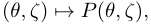

the price of an option with parameters _ζ_ in the model with parameters _θ_ . We are also given market prices _P_ ( _ζ_ ) for options parametrized by _ζ_ for a (finite) subset _ζ ∈ Z__′_ _⊂ Z_ of all possible option parameters. _Calibration_ now identifies a model parameter _θ_ which minimizes a chosen distance _δ_ between model prices ( _P_ ( _θ, ζ_ )) _ζ∈Z′_ and market prices ( _P_ ( _ζ_ )) _ζ∈Z′_ , i.e., 

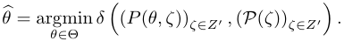

<!-- page: 8 -->

_Remark_ 1 _._ Financial practice often prefers to work with implied volatilities rather than option prices, and we will also do so in the numerical parts of this paper. For the purpose of this introduction, any mentioning of a _price_ may be, mutatis mutandis, replaced by the corresponding implied volatility. 

In fact, the most usual way to choice of a distance function _δ_ is a suitably weighted least squares function, i.e., 

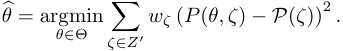

Here, the weights _wζ_ can be chosen in order to reflect importance of an option at _ζ_ and the reliability of the market observation _P_ ( _ζ_ ). For instance, a reasonable choice might be the inverse of the bid-ask spread (see [11] for a motivation), which puts low weight on prices of illiquid options. 

As long as the number of model parameters is smaller than the number _|Z__′_ _|_ of calibration instruments, the calibration problem is an example of an overdetermined non-linear least squares problem, usually solved numerically using iterative solvers such as the de-facto standard LevenbergMarquardt (LM) algorithm [43, 44]. Let **_J_** = **_J_** ( _θ_ ) denote the Jacobian of the map _θ �→_ ( _P_ ( _θ, ζ_ ) _ζ∈Z′_ and let 

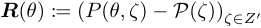

denote the residual, then the Levenberg-Marquart algorithm iteratively computes increments ∆ _θk_ := _θk_ +1 _− θk_ by solving 

� **_J_** ( _µk_ )_T_ **_W J_** ( _µk_ ) + _λ_ **_I_** � ∆ _θk_ = **_J_** ( _µk_ )_T_ **_W R_** ( _µk_ ) (2) 

where **_I_** denotes the identity matrix, **_W_** = diag ( _wζ_ ), and _λ ∈_ R. 

**Algorithm 1:** Levenberg-Marquart calibration 

**Input:** Implied vol map **_P_**� and its Jacobian **_J_**� , market quotes **_P_ Parameters:** Lagrange multiplier _λ_ 0 _>_ 0, maximum number of iterations _n_ max, minimum tolerance of step norm _ε_ min, bounds 0 _< β_ 0 _< β_ 1 _<_ 1 

**Result:** Calibrated model parameters _θ__⋆_ 

**1** initialize model parameters _θ_ = _θ_ 0 and step counter _n_ = 0; 

**2** compute **_R_**� ( _θ_ ) = **_P_**� ( _θ_ ) _−_ **_P_** and **_J_**� ( _θ_ ) and solve normal equations (2) for ∆ _θ_ ; **3 while** _n < nmax and ∥_ ∆ _θ∥_ 2 _> ε_ **do** 

**4** compute relative improvement _cθ_ = _∥_ **_R_**� _<u>∥</u>_ ( **_R_** _θ_� )( _∥θ_ 2) _<u>∥−</u>_ <u>2</u> _∥−_ **_R_**� _<u>∥</u>_ ( **_R_** _θ_� )+( _θ_ +∆ **_J_**� ( _µθ_ )∆) _<u>∥θ</u>_ <u>2</u> _∥_ 2 with respect to predicted 

improvement under linear model; **5 if** _cθ ≤ β_ 0 **then** reject ∆ _θ_ , set _λ_ = 2 _λ_ ; **6 if** _cθ ≥ β_ 1 **then** accept ∆ _θ_ , set _θ_ = _θ_ + ∆ _θ_ and _λ_ =<u>1</u> 2_λ_; **7** compute **_R_**� ( _θ_ ) and **_J_**� ( _θ_ ) and solve normal equations (2) for ∆ _θ_ ; **8** set _n_ = _n_ + 1; **9 end** 

It is hence necessary that the _normal equations_ (2) be quickly and accurately solved for the iterative step ∆ _θk_ . In a general (rough) stochastic volatility setting this is problematic: The true implied volatility map as well as its Jacobian **_J_** are unknown in analytical form. In the absence of an analytical expression for ∆ _θk_ , an immediate remedy is:

<!-- page: 9 -->

- (I) Replace the (theoretical) true pricing (or implied volatility) map _P_ by an efficient numerical approximation _P_˜ such as Monte Carlo, Fourier pricing. 

- (II) Apply finite-difference methods to _P_˜ to compute an approximate Jacobian **_J_**˜ . 

In particular, in many (rough) stochastic volatility models such as the _rough Bergomi model_ (see Example 1), expensive Monte Carlo simulations have to be used to approximate the pricing map. In a common calibration scenario where the normal equations (2) have to be solved frequently, the approach outlined above thus renders calibration prohibitively expensive. 

_Remark_ 2 _._ We note that many modern tensor-based machine learning frameworks are ideally suited for calibration tasks because the directly provide gradients of the output variable by use of automatic 

We would like to emphasize that our methodology can in principle be applied to any model with finitely many parameters, from the classical Black Scholes or Heston models to the rough Bergomi model of [5], also to large class of rough volatility models (see Horvath, Jacquier and Muguruza [34] for a general setup). In fact the methodology is not limited to stochastic models, also parametric models of implied volatility could be used for generating training samples of abstract models, but we have not pursued this direction further. For the sake of concreteness, we give an example of one rough volatility model, since computational costs of available numerical methods are especially limiting for this model class. 

_Example_ 1 _._ In the abstract model framework, the rough Bergomi model [5] is represented by _M_rBergomi (ΘrBergomi ), with parameters _θ_ = ( _ξ_ 0 _, η, ρ, H_ ) _∈_ ΘrBergomi . For instance, we may choose 

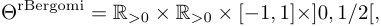

to stay in a truly rough setting. The model corresponds to the following system for the log price _X_ and the instantaneous variance _V_ : 

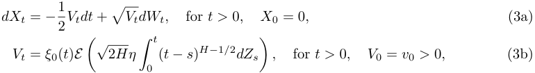

where _H_ denotes the Hurst parameter, _η >_ 0 , _E_ ( _·_ ) the Wick exponential, and _ξ_ 0( _·_ ) _>_ 0 denotes the initial forward variance curve (see [9, Section 6]), and _W_ and _Z_ are correlated standard Brownian motions with correlation parameter _ρ ∈_ [ _−_ 1 _,_ 1]. 

## **3 Deep calibration** 

In the following sections we elaborate on the objectives and advantages of this two step calibration approach and present examples of neural network architectures, precise numerical recipes and training procedures to apply the two step calibration approach to a family of stochastic volatility models. We also present some numerical experiments and report the learning errors compared to chosen parameters of the synthetic data.

<!-- page: 10 -->

There are several advantages of separating the tasks of pricing and calibration. Above all, the most appealing reason is that it allows us to build upon the knowledge we have gained about the models in the past decades, which is of crucial importance from a risk management perspective. By its very design, **(i)** deep learning the _price approximation_ combined with **(ii)** deterministic calibration does not cause more headache to risk managers and regulators than the corresponding stochastic models do. Designing the training as described above demonstrates how deep learning techniques can successfully extend the toolbox of financial engineering, without imposing the need for substantial changes in our risk management libraries. 

### **3.1 One-step approach: Deep calibration by the inverse map** 

A more and more popular approach in quantitative finance (and many other fields of engineering) is to develop purely data-driven frameworks, without relying on formal models. This approach leaves the meaning of calibrated network parameters unexplained, not to mention the ambiguity about the choice of the number of network parameters and network design. This can cause major challenges towards today’s regulatory requirements. In addition, issues of generalizability – how can one price exotic options in a network trained with vanilla option data, to give a simple example – are difficult to analyse, and traditional paradigms of finance – such as no arbitrage – are hard to guarantee in the absence of a model. 

A second, more model based approach was proposed in the pioneering work of Hernandez [30], followed by several other authors such as Stone [53], Dimitroff, R¨oder and Fries [14] and many others. A main characteristic of the neural network proposed by [30] is that option price approximation and parameter calibration are done in one step within the same network. Indeed, the idea is to directly learn the whole calibration problem, i.e., to learn the model parameters as a function of the market prices (typically parametrized as implied volatilities). In the formulation of Section 2, this means that we learn the mapping 

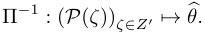

More precisely, [30] trains a deep neural network based on labelled data ( _xi, yi_ ), _i_ = 1 _, . . . , N_ , with 

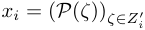

for day _ti_ (in the past) and the corresponding labels 

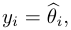

obtained from calibrating the model to the market data _yi_ using traditional calibration routines. The number of labelled data points _N_ is, of course, limited to the amount of (reliable) historical market price data available. 

In spite of the promising results by Hernandez [30] the main drawback of this approach, as Hernandez observes, is the lack of control on the function Π_−_1 . Furthermore, from a risk management perspective one has no guarantee how well the learned mapping of Π_−_1 will solve the calibration problem when exposed to unseen data. In fact, this is the behaviour observed in Hernandez [30], since the out of sample performance tends to differ from the in sample one, suggesting a not fully satisfactory generalisation of the learned map. We recover the same behaviour of the inverse map in our own experiments, which we included in Appendix A.

<!-- page: 11 -->

### **3.2 Two-step approach: Learning the implied volatility map of models** 

The two step approach is somewhere mid-way between a sole reliance on traditional pricing methods (Monte Carlo, finite elements, finite differences, Fourier methods, asymptotic methods etc.) and the direct approach described above that calibrate directly to the price data. Here, one separates the calibration procedure as described in Section 2 **(i)** We first learn (approximate) the pricing map by a neural network that maps parameters of a stochastic model to prices or implied volatilities. In other words, we set up and train (off-line) a neural network to learn the pricing map _P_ . In a second step **(ii)** we calibrate (on-line) the model – as approximated by the neural network trained in step **(i)** – to market data using a standard calibration routine. To formalise the two step approach, for an option parametrized by _ζ_ and a model _M_ with parameters _θ ∈_ Θ we write _P_� ( _θ, ζ_ ) _≈ P_ ( _θ, ζ_ ) for the approximation _P_� of the true pricing map _P_ based on a neural network. Then, in the second step, for a properly chosen distance function _δ_ (and a properly chosen optimization algorithm) we calibrate the model by computing 

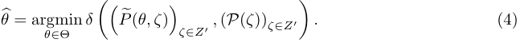

In principle, this method is not unlike traditional calibration routines, as the true option price has to be numerically approximated for all but the most simple models. This particular approximation method tends to be orders of magnitudes faster compared to other numerical approximation methods for all tested models. In particular, note that the (slow) training stage of the neural network itself only has to be done once. We will come back to comparisons of actual computational times in the numerical section of this paper. 

At this stage, we note that the deep calibration routine is not yet specified in any details: apart from purely numerical details such as the choice of the architecture of the neural networks, the loss functions and optimization algorithms of both the training of the neural networks in stage **(i)** and the actual calibration in stage **(ii)** , one particularly important choice is whether the neural network learns implied volatilities of individual options or rather a full implied volatility surface. Before discussing these details, let us already highlight some of the differences to the one-step approach of [30]. While the one-step approach is probably marginally faster, we see the main benefit of the two-step approach in the increased stability, which is influenced by two key differences: 

- As the neural network is only responsible for option pricing in the model, synthetic data can (and should) be used for training. Hence, we can easily increase the number of training data, and the training data are completely unpolluted from market imperfections. 

- The two-step approach induces a natural decomposition of the overall calibration error into a pricing error (from the neural network) and a model misfit to the market data. Hence, the performance of the neural network itself is generally independent of changing market regimes – which might, of course, change the suitability of the model under consideration. 

These points, in particular, imply that frequent re-training of the neural network is not needed in the two-step approach.

<!-- page: 12 -->

#### **3.2.1 The two step approach: Pointwise training and implicit and grid-based training** 

The underlying principle of the two-step approach appears in one way or another in a number of related contributions De Spiegeleer, Madan, Reyners and Schoutens [13] and McGhee [46]. In fact, the early works of Hutchinson, Lo and Poggio [38] and the more recent work of Culkin and Das [12]–where Deep Neural Networks are applied neural to learn the Black-Scholes formula–can be recognised as Step **(i)** of the two-step approach in a Black-Scholes context. Also Ferguson and Green [19] examine Step **(i)** of the two-step approach in [19] for basket options in a lognormal context and observe that the network even has a smoothing effect and increased accuracy in comparison to the underlying Monte Carlo prices. In this section, we examine its advantages and present an analysis of the objective function with the goal to enhance learning performance. Within this framework, the pointwise approach has the ability to asses the quality of _P_� using Monte Carlo or PDE methods, and indeed it is superior training in terms of robustness. 

#### **Pointwise learning** 

Step (i): Learn the map _P_� ( _θ, T, k_ ) = _σ_ �_M_(_θ_) ( _T, k_ ) – that is in equation (4) above we have _ζ_ = ( _T, k_ ). In the case of vanilla options ( _ζ_ = ( _T, k_ )) one can rephrase this learning objective as an implied volatility problem: In the implied volatility problem the more informative implied volatility map _σ_ �_M_(_θ_) ( _T, k_ ) is learned, rather than call- or put option prices _P_� ( _θ, T, k_ ). We denote the artificial neural network by _F_ ( _w_ ; _θ, ζ_ ) as a function of the weights _w_ of the neural network, the model parameters _θ_ and the option parameters _ζ_ . The optimisation problem to solve is the following: 

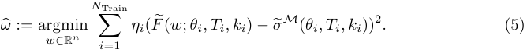

where _ηi ∈_ R _>_ 0 is a weight vector. 

Step (ii): Solve the classical model calibration problem 

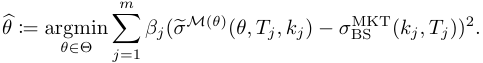

for some user specified weights _βj ∈_ R _>_ 0, where now the (numerical approximation of the) option _F_ �( _ω_ �; _θ, T, k_ price _P_ )� (obtained _θ, T, k_ ) resp.in Stepimplied **(i)** . volatility _σ_ �_M_(_θ_) ( _T, k_ ) is replaced by the DNN approximation 

The critical part is, of course, the first step, as the second one merely corresponds to classical calibration against liquid options. For the first step, key issues are the choice of training data and the architecture of the neural network. Regarding the training data, the general idea is as follows: 

1. Choose realistic _“prior”_ distributions for both model parameters _θ_ and option parameters _ζ_ (= ( _T, k_ ) in the above notation). The point is that many theoretically possible parameters are very unlikely to ever occur in real markets, for both model and option parameters. Hence, it is wasteful to spend resources to learn the pricing map for, say, maturities in the range of hundreds of years. The simplest choice is to simply impose uniform distributions on truncated

<!-- page: 13 -->

parameter ranges, but nothing prevents more “informed” possibilities, for instance taking into account historical distributions of estimated model parameter values or observed option parameter values. 

2. Simulate model and option parameters according to the distribution chosen before and compute the corresponding option price or implied volatility, which serves as label for the respective parameter vector. The computation can be done for any available numerical method, for instance Monte Carlo simulation. As an aside, this mechanism can, of course, be used to produce training, testing and validation data in the sense of the machine learning literature. 

_Remark_ 3 _._ Note that the above mentioned “informed” parameter distributions could also be encoded as weights into the loss function for the training of the neural network. 

_Remark_ 4 _._ Instead of simulation of parameter values, we could also consider deterministic grids in the parameter space. In very high dimensional parameter spaces this probably becomes unfeasible due to the curse of dimensionality, but in the current context this approach may very well improve training of the neural network. We leave a comparison to future work. 

#### **Implicit & grid-based learning** 

We take this idea further and design an implicit form of the pricing map that is based on storing the implied volatility surface as an image given by a grid of “pixels”. This image-based representation has a formative contribution in the performance of the network we present in Section 5. Let us denote by ∆:= _{ki, Tj}__n,_ _i_ =1 _, mj_ =1a fixed grid of strikes and maturities,then we propose the following two step approach: 

- _m_ 

- Step (i): Learn the map _F_� ( _θ_ ) = _{σBS__M_(_θ_) ( _Ti, kj_ ) _}__n,_ _i_ =1 _, j_ =1vianeuralnetworkwheretheinputisapa- rameter combination _θ ∈_ Θ of the stochastic model _M_ ( _θ_ ) and the output is a _n × m_ grid on the implied volatility surface _{σ_ BS_M_(_θ_) ( _Ti, kj_ ) _}__n,_ _i_ =1 _, mj_ =1where_n, m ∈_N are chosen appropriately (see Section 4.1) on a predefined fixed grid of maturities and strikes. _F_� takes values in R_L_ where _L_ = strikes _×_ maturities = _nm_ . The optimisation problem in the image-based implicit learning approach is: 

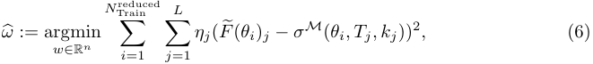

where _N_ Train = _N_ Trainreduced _× L_ and _ηi ∈_ R _>_ 0 is a weight vector. Step (ii): Solve the minimisation problem 

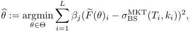

for some user specified weights _βj ∈_ R _>_ 0 

The data generation stage for the image-based approach works as in the point-wise approach, except that the option parameters _ζ_ = ( _T, k_ ) are, fixed and are no longer part of the learning algorithms – except implicitly in the output/labels of the neural network. This is why they appear in the general objective function of pointwise learning (5) but no longer appear in the objective function (6) of

<!-- page: 14 -->

the grid-based learning above. In practice, we choose a grid ∆of size 8 _×_ 11. By evaluating the implied volatility surface along 8 _×_ 11 gridpoints with 40 _._ 000 different parameter combinations in Θ we effectively evaluate the “fit” of the surface as a whole. In our experiments we chose a 8 _×_ 11 grid for practical reasons, but we are by no means limited to this number. For example, to obtain even higher accuracy, one could also choose a coarser grid, which would require longer learning time, but recall that learning only has to be done once. One advantage of a grid-based sampling is that one can re-use the same set of generated Monte Carlo paths along grid points. Once a grid is fixed one can also easily refine the grid by adding further refined points to it using the same set of Monte Carlo paths (evaluated at more time points). 

Clearly, the neural network does depend on the grid ∆of option parameters _ζ_ . Hence, we need to interpolate between gridpoints in order to be able to calibrate (in the calibration Step **(ii)** ) also to such options, whose maturity and strike do not exactly lie on the grid ∆. While in the pointwise training the **interpolation between sampling points** is done by the network _F_� ( _θ_ ) automatically (both in the model parameter space Θ and along the implied volatility surface in K _×_ T), in the grid-based implicit learning the network is only used for interpolation in the parameter space Θ, and it is implicit in the space dimension, that is, –based on smoothness assumptions of the implied volatility surface– we interpolate between gridpoints of the implied-volatility surface manually, using appropriate splines. This indirect dependence of the trained network on ∆is alluded to by the name “implicit learning”. 

#### **Implicit smile-based learning:** 

#### **–And outlook towards an implicit learning with more elaborate grids and tessalations of the IV surface–** 

We note that McGhee [46] follows an _implicit_ approach for the lognormal SABR model, which lies somewhere between the pointwise and the image-based approaches of Step **(i)** : There, the inputs are ( _θ_SABR _, T, k_ 1 _, . . . , k_ 10), and there are ten volatility outputs _σ_ 1 _, . . . , σ_ 10 per maturity _T_ . Since between the reference points of the smile McGhee [46] also interpolates (by splines) based on a smoothness assumption of implied volatilities, we also refer to this approach as _implicit_ training. The reference points _k_ 1 _, . . . , k_ 10 on the volatility surface are determined as a direct functional of the model parameters _θ_SABR and of the maturity _T_ , that is the learning is done slice-by slice. This sampling technique showcases an excellent working example of a _representative functional sampling_ on the surface, where more samples are taken in certain regions of the surface, to ensure a good accuracy of the training in those regions (e.g. regions with higher liquidity). Though the sampling of the strikes in [46] is bespoke to the SABR model, it motivates the idea of _representative sampling grid (or tessalation net)_ , which would be desirable to achieve also in a model agnostic context. We note that the introduction of the weight vectors _ηi ∈_ R _>_ 0 in the objective function (6) of the grid-wise approach has a similar effect as a higher sampling frequency of a neighbourhood/point. 

#### **3.2.2 The role of the objective function: Pointwise training versus implicit and gridbased training** 

Comparing the pointwise approach (characterised by the general objective function (5)) and the image-based approach (characterised by the objective function (6)), we find that both of them can be advantageous in certain situations. We highlight the connection between the two below, and elaborate on some of the respective advantages of each approach.

<!-- page: 15 -->

Equation (6) can be brought to the form of (5) equation by inserting (into (5)) the specification values _θ_ = _θ__′_ , with 

_θ_ 1_′_=_θ_1_, . . . , θ_ _L__′_=_θ_1_, θ_ _L__′_ +1=_θ_2_, . . . ,_ 

and recalling that _L_ = strikes _×_ maturities and _N_ Train = _N_ Trainreduced _× L_ . Hence, the pointwise approach is more general than the image-based one. 

With this in mind we make the general note, many of the various advantages and disadvantages of both approaches can, in principle, be mitigated by careful choice of the data generation mechanism (of the training and validation datasets) and the loss function in the training. 

- The biggest difference, between pointwise and image based implicit learning procedures is that image based implicit learning requires an outside (implicit) interpolation between the learned implied volatilities in order to compute the implied volatility of an option with an arbitrary strike or maturity, not aligned with the grid. At face value, this is of course an advantage of the pointwise (explicit) approach, where the interpolation is rather performed by the deep neural network. On the other hand, we note that the function ( _T, k_ ) _�→ σ__M_ ( _θ_ ; _T, k_ ) (for fixed model parameters _θ_ ) is usually a very well understood smooth function. (At least for useful models, as the market implied vol surface arguably is nice and smooth.) This is not necessarily true for _θ �→ σ__M_ ( _θ_ ; _T, k_ ), which is not nearly as well understood for more modern sophisticated models such as rough Bergomi. Hence, we have much more confidence in applying standard interpolation in ( _T, k_ ) rather than in _θ_ , which also lives in a higher dimensional space. Hence, the outside interpolation may, in practice, not cause any difficulties. 

- Indeed, this very same structure induces a reduction of variance in the training data for the image-based approach as compared to the pointwise approach. Formally speaking, in the image based approach only the model parameters are sampled, while the strike and maturities of the underlying instruments are deterministic. As a side note, keep in mind that we should always compare the two approaches based on a fixed number _N_ Train of total training data. 

- It is also easier to take into account the structure of real financial data into the data generation for the pointwise approach by adjusting the (random) sampling distribution on the surface accordingly. Clearly, not all options are equally _important_ for the purpose of calibration, but we would like to concentrate on liquid options. It is easy to adjust the sampling distribution for strikes and maturities in the pointwise approach to take into account historical numbers of liquidity. In the grid-based approach, this can to some extent be taken into account by the choice of the weight vector _ηi ∈_ R _>_ 0 in (6), or more accurately taken into account by using non-uniform, non-tensorized, or bespoke quasirandom sampling grids, with higher density of points in regions with higher liquidity. 

- The image-based approach may be seen as an efficient dimension-reduction technique as compared to the pointwise one. Indeed, as dimensions are shifted from the input of the neural network to the output, the learning task becomes easier since lower-dimensional. Of course, the price we pay is that we only learn the values of the implied volatilities on a fix grid ∆of option parameters. In this example, this price is, however, worth paying since the regularity of the volatility surface is well understood. This implies that we know very well the number and location of grid points required to get good fits globally in terms of the chosen interpolation.

<!-- page: 16 -->

In the particular calibration example presented in Section 5 below, the image-based approach performed somewhat better than the pointwise approach, which indicates that the variance and dimension reduction features may be more important than the other aspects in the above comparison. 

_Remark_ 5 _._ In principle, the two-step approach is also amenable to other numerical interpolation methods. For instance, we could also use Chebyshev interpolation to approximate model implied volatilities such as [25]. 

_Remark_ 6 _._ In line with Remark 5, we note that the image-based approach (in conjunction with the outside interpolation) is a hybrid between a pure DNN approximation such as the point-wise approach and a standard polynomial interpolation method, such as Chebyshev approximation, see [25] for example. Of course, other, more specialized interpolation methods on the implied volatility surface are also possible, for instance using the SVI volatility parameterization, see for example [39]. 

## **4 Practical implementation** 

We start by describing the approximation network (Step **(i)** of Section 3 with objective functions (5) and (6)) and leave the discussion of calibration (Step **(ii)** ) for Section 4.2 below. While several realted works [38, 12, 46] have demonstrated that learning the pricing map (Step **(i)** ) in the BlackScholes model and in certain clasical stochastic volatility models (such as the lognormal SABR model in [46]) can be done to a satisfactory accuracy with a single hidden layer, the situation is–as often–more delicate in the case of rough volatility models. Since these models are highly nonlinear nature, they also require deeper networks for an accurate approximation of their pricing functional. 

### **4.1 Network architecture and training** 

We present the architecture used for the grid-based approach in some detail, as this approach was used for most of the numerical examples below. 

1. A fully connected feed forward neural network with 3 hidden layers and 30 nodes on each layers; 

2. Input dimension = _n_ , number of model parameters 

3. Output dimension = 11 strikes _×_ 8 maturities for this experiment, but this choice of grid can be enriched or 

4. The three inner layers have 30 nodes each, which adding the corresponding biases results on a number 

   - ( _n_ + 1) _×_ 30 + 3 _×_ (1 + 30) _×_ 30 + (30 + 1) _×_ 88 = 30 _n_ + 5548 

of network parameters to calibrate. 

5. We choose the Elu _σ_ Elu = _α_ ( _e__x_ _−_ 1) activation function for the network. 

We train the neural network using gradient descent, the so-called ‘Adam’ minibatch training scheme due to Kingman and Ba [41], which is a version of the Stochastic Gradient Descent algorithm. In the

<!-- page: 17 -->

following, _w_ denotes the set of parameters – weights and biases – of a neural network _F_ = _F_ ( _w, x_ ). Given parameters 0 _≤ β_ 1 _, β_ 2 _<_ 1 _, ϵ_ , _α_ , initial iterates _u_ 0 := 0 _, v_ 0 := 0 _, w_ 0 _∈_ Ω, the Adam scheme has the following iterates: 

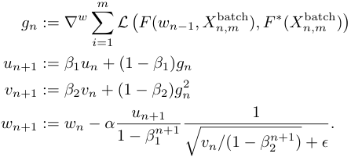

### **4.2 The calibration step** 

Once the pricing map approximator _F_� for the implied volatility is found, only the calibration step is left to solve. We use the Levenberg-Marquart algorithm as presented in Section 2. 

#### **4.2.1 Bayesian Analysis of the Calibration** 

Intuitively, we are interested in _quantifying the uncertainty_ about model parameter estimates obtained by calibrating with the approximative implied volatility map map _F_� . To this end, we switch to a Bayesian viewpoint and treat model parameters _θ_ as random variables. The fundamental idea behind Bayesian parameter inference is to update prior beliefs _p_ ( _θ_ ) with the likelihood _p_ ( **_y_** _| θ_ ) of observing a given point cloud **_y_** _∈_ R_N_ of implied volatility data to deduce a posterior (joint) distribution _p_ ( _θ |_ **_y_** ) over model parameters _θ_ . 

Formally, for pairs ( _Ti, ki_ ) of time to maturity and log-moneyness, let an implied volatility point cloud to calibrate against be given by 

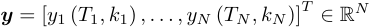

and analogously, collect model implied volatilities for model parameters _θ_ 

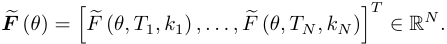

We perform a liquidity-weighted nonlinear Bayes regression. Mathematically, for heteroskedastic sample errors _σi >_ 0 _, i_ = 1 _, . . . , N_ , we postulate 

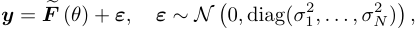

so that for some diagonal weight matrix **_W_** = diag( _w_ 1 _, . . . , wN_ ) _∈_ R_N×N_ , the liquidity-weighted residuals are distributed as follows 

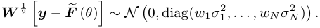

<!-- page: 18 -->

In other words, we assume that the joint likelihood _p_ ( **_y_** _| θ_ ) of observing data **_y_** is given by a multivariate normal. In absence of an analytical expression for the posterior (joint) probability _p_ ( _θ|_ **_y_** ) _∝ p_ ( **_y_** _|θ_ ) _p_ ( _θ_ ), we approximate it numerically using MCMC techniques [20] and plot the oneand two-dimensional projections of the four-dimensional posterior by means of an MCMC plotting library [21]. 

_Remark_ 7 _._ Of course, from a statistical point of view, loss functions of sum of squares form corresponds to a normality assumption on the error distribution when interpreted as an MLE, for instance. The normality assumption above, hence, merely mirrors the common choice of sum-ofsquares as loss function for calibration in finance. 

## **5 Numerical experiments** 

### **5.1 Speed and accuracy of the price approximation networks** 

As mentioned in Section 3.2 one crucial improvement win in comparison with direct neural network approaches, as pioneered by Hernandez [30], is the separation of (i) the implied volatility approximation function, mapping from parameters of the stochastic volatility model to the implied volatility surface–thereby bypassing the need for expensive Monte-Carlo simulations—and (ii) the calibration procedure, which (after this separation) becomes a simple deterministic optimisation problem. 

Table 1 shows the CPU computation time for functional evaluation of a full surface under the rough Bergomi model of Example 1. Here, we take the forward variance _ξ_ 0 as constant. In a future work we take a similar approach to constract a network that can consistently approximate a variaty of models including the the rough Bergomi model with a forward variance curve that is approximated (more generally) by piecewise constant function. 

|MC Pricing|NN Pricing|NN Gradient|Speed up|
|---|---|---|---|
|Full Surface|Full Surface|Full Surface|NN vs. MC|
|500_._000_µ_s|14_,_3_µ_s|47_µ_s|21_._000_−_35_._000|

Table 1: Computational time of pricing map (entire implied volatility surface) and gradients via Neural Network approximation and Monte Carlo (MC) for the image-based approach 

Table 1 provides the speed of evaluating the trained neural network for the image-based approach, the numbers for the pointwise approach are very similar. We used 

- Total number of parameteres: 5 _._ 668 

- Training set of size 34 _._ 000 and testing set of size 6 _._ 000 

- Rough Bergomi sample: ( _ξ_ 0 _, ν, ρ, H_ ) _∈U_ [0 _._ 01 _,_ 0 _._ 16] _×U_ [0 _._ 5 _,_ 4 _._ 0] _×U_ [ _−_ 0 _._ 95 _, −_ 0 _._ 1] _×U_ [0 _._ 025 _,_ 0 _._ 5] 

- Strikes: _{_ 0 _._ 5 _,_ 0 _._ 6 _,_ 0 _._ 7 _,_ 0 _._ 8 _,_ 0 _._ 9 _,_ 1 _,_ 1 _._ 1 _,_ 1 _._ 2 _,_ 1 _._ 3 _,_ 1 _._ 4 _,_ 1 _._ 5 _}_ 

- Maturities: _{_ 0 _._ 1 _,_ 0 _._ 3 _,_ 0 _._ 6 _,_ 0 _._ 9 _,_ 1 _._ 2 _,_ 1 _._ 5 _,_ 1 _._ 8 _,_ 2 _._ 0 _}_

<!-- page: 19 -->

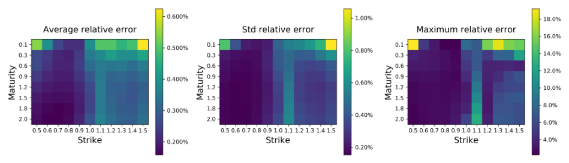

<!-- Start of picture text -->
0.600% 1.00% 18.0% Average relative error Std relative error Maximum relative error 16.0% 0.1 0.500%, 0.1 0.80% 0.1 0.3 0.3 0.3 14.0% Pay=5 0.60.9 0.400% ray<=5 0.60.9 oso% ray=5)0.60.9 12.0%, 0 1.2 oO 1.2 © 1. 10.0% 215 215 215 18 0.300% 18 18 8.0% 2.0 2.0 0.40% 2.0 6.0% 0.5 0.6 0.7 0.8 0.91.0 1.11.2 1.31.41.5 0.5 0.6 0.7 0.8 0.9 1.01.1 1.21.31.41.5 0.5 0.6 0.7 0.8 0.9 1.01.11.21.31.41.5 Strike 0.200% Strike Strike 4.0% 0.20% <!-- End of picture text -->

A 

A ~~=~~ 

A

<!-- page: 20 -->

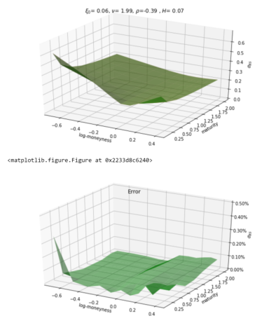

<!-- Start of picture text -->
& = 0.06, v= 1.99, p=-0.39 , H= 0.07 06 os 0.“éry 03 02 o1 00 178 |00 1237 06 44 100 log.ing:2moneynes?® 04 02505d” <matplotlib.figure.Figure at @x2233d8c6240> Error 0.50% 0.40% 030% 020% é 0.10% 0.00% 178° 128) 06 a m2‘moneynes?® 02 04 025oso”100. oo <!-- End of picture text -->

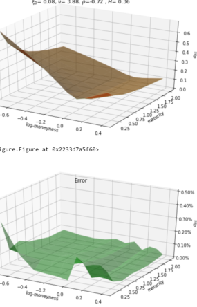

<!-- Start of picture text -->
§o= 0.08, v= 3.88, p=-0.72 ,H= 0.36 06 os 04 g» 03 02 o1 00 173° 123 06 og 2.00 log.me?,sMoneyneso® 92 04 025asd at @x2233d7a5f60> Error 050% 0.40% 030% 0.20% é 0.10% 00% 178° 12, 50 -06 a m2‘moneynese® 02 04 025oso100. on <!-- End of picture text -->

<matplotlib.figure.Figure at @x2233d7a5f60> 

- ~~(ES~~

<!-- page: 21 -->

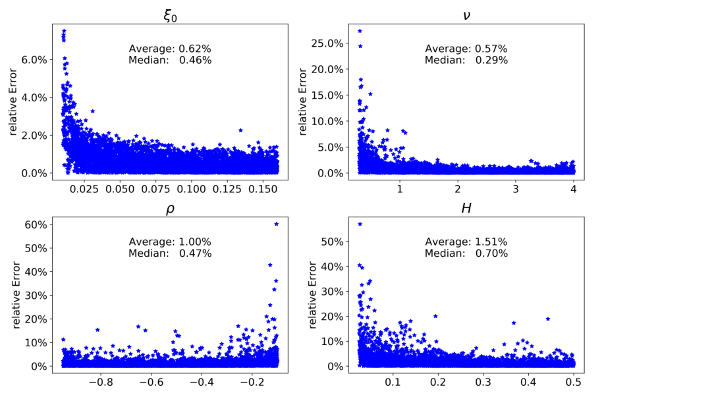

<!-- Start of picture text -->
Eo v i * Average: 0.62% 25.0%) » Average: 0.57% 6.0%] *% Median: 0.46% Median: 0.29% 5—a 5a20.0% * a* io * g 4.0% 3 v 15.0% ' * 6 ee an] ll i i. © 10.0%) # = 2.0% 4 Oe 4, * * o . the ot vey 7 ae , os % fy +e ak. 5.0% Se ape *, 0.0% hesieiseietened 0.0% 0.025 0.050 0.075 0.100 0.125 0.150 1 2 3 4 fe) H 60% * * 50% Average: 1.00% 50% Average: 1.51% ° Median: 0.47% Median: 0.70% S 40% . S 40%) * wi : oo ee Y 30% y 30%) ¥, é * é qe, B 20% tw | $20%) a. -, * oe ad * * *% 4, Aree ad x tpt, 10%} * *' ad 0% satetmte an ha tte? ia, 2 10%0% nae te watt, -0.8 —0.6 —0.4 —0.2 0.1 0.2 0.3 0.4 0.5 <!-- End of picture text -->

<!-- page: 22 -->

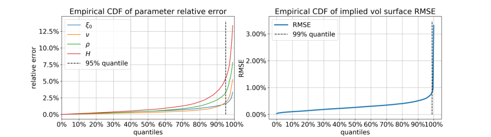

<!-- Start of picture text -->
Empirical CDF of parameter relative error Empirical CDF of implied vol surface RMSE — & — RMSE 12.5%); sy, H 3.00%} ----- 99% quantile ' 5 | — p e 10.0% —H 1\ \ ° 7.5% +4 ----- 95% quantile ' an 2.00% \ 2 H Ss f ie= 5.0% | © 5 | 1.00% 2.5% 0.0% ~ ' 0.00% ' 0% 10% 20% 30% 40% 50% 60% 70% 80% 90% 100% 0% 10% 20% 30% 40% 50% 60% 70% 80% 90%100% quantiles quantiles <!-- End of picture text -->

<!-- page: 23 -->

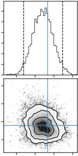

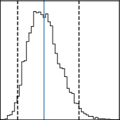

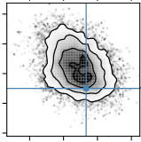

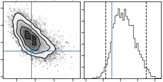

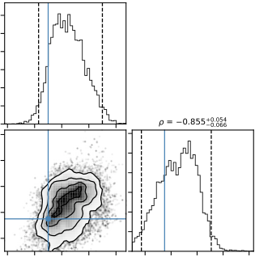

<!-- Start of picture text -->
 =  0.855 +0.054 0.066 <!-- End of picture text -->

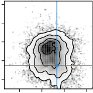

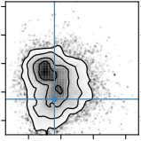

Figure 6: Bayes calibration against synthetic implied volatility surface computed for model parameters _θ__†_ . Solid vertical blue lines indicate true parameter values.

<!-- page: 24 -->

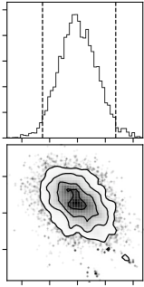

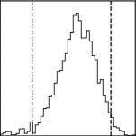

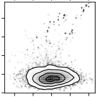

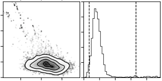

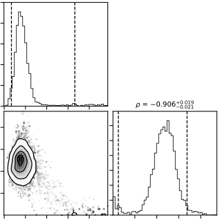

<!-- Start of picture text -->
 =  0.906 +0.019 0.021 <!-- End of picture text -->

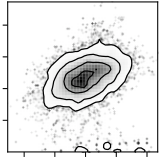

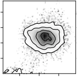

Figure 7: Liquidity-weighted Bayes calibration against SPX market implied volatility surface from 19th May 2017. Liquidity proxies given by inverse bid-ask-spreads.

<!-- page: 25 -->

section: Since increases or decreases in one of _η, H_ or _ρ_ can be offset by adequate changes in the others with no impact on the calculated IV, the Bayes posterior cannot discriminate between such parameter configurations and places equal probability on both combinations. This can be seen by the diagonal elliptic probability level sets. 

In a second experiment, we want to check whether the inaccuracy of _F_� allows for a successful calibration against market data. To this end, we perform a liquidity-weighted Bayesian regression against SPX implied volatilities from 19th May 2017. For bid and ask IVs _ai >_ 0 and _bi >_ 0 respectively, we proxy the IV of the mid price by _mi_ :=_<u>ai</u>_<u>+</u> 2_<u>bi</u>_ . With spread defined by _si_ = _ai −bi ≥_ 0, all options with _si/mi ≥_ 5% are removed because of too little liquidity. Weights are chosen to be _wi_ = _aim−mi i__≥_0,effectivelytakinginversebid-askspreadsasaproxyforliquidity.Finally, _σi_ are proxied by a fractional of the spread _si_ . The numerical results in Figure 7 further confirm the accuracy of _F_� : (1) As can be seen on the univariate histograms on the diagonal, the Bayes calibration has again identified sensible model parameter regions in line with what is to expected. (2) Said histograms are again unimodal with peaks at or close to values previously reported in the literature. (3) Quite strikingly, at a first glance, the effect of the diagonal probability level sets in the off-diagonal plots as documented in Figure 6 cannot be confirmed here. However, the scatter plots in the diagrams do reveal some remnants of that phenomenon. 

## **A A numerical experiment with the inverse map** 

To motivate the main drawbacks of the inverse map approach of Section 3.1, we calibrate rough Bergomi model with it, i.e., we consider the simple map 

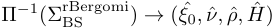

where ΣrBergomi BS _∈_ R_n×m_ is a rBergomi implied volatility surface and ( _ξ_ˆ 0 _,_ ˆ _ν,_ ˆ _ρ, H_ˆ ) the optimal solution to the corresponding calibration problem. 

_Remark_ 8 _._ For simplicity we consider the strikes and maturities to be fixed for all implied volatility surfaces. 

#### **Inverse Map Architecture** 

- 1 convolutional layer with 16 filters and 3 _×_ 3 sliding window 

- MaxPooling layer with 2 _×_ 2 sliding window 

- 50 Neuron Feedforward Layer with _Elu_ activation function 

- Output layer with _linear_ activation function 

- Total number of parameters: 10 _._ 014 

- Train Set: 34 _._ 000 and Test Set: 6 _._ 000 

- ( _ξ_ 0 _, ν, ρ, H_ ) _∈U_ [0 _._ 01 _,_ 0 _._ 16] _× U_ [0 _._ 3 _,_ 4 _._ 0] _× U_ [ _−_ 0 _._ 95 _, −_ 0 _._ 1] _× U_ [0 _._ 025 _,_ 0 _._ 5] 

- strikes= _{_ 0 _._ 5 _,_ 0 _._ 6 _,_ 0 _._ 7 _,_ 0 _._ 8 _,_ 0 _._ 9 _,_ 1 _,_ 1 _._ 1 _,_ 1 _._ 2 _,_ 1 _._ 3 _,_ 1 _._ 4 _,_ 1 _._ 5 _}_ 

- maturities= _{_ 0 _._ 1 _,_ 0 _._ 3 _,_ 0 _._ 6 _,_ 0 _._ 9 _,_ 1 _._ 2 _,_ 1 _._ 5 _,_ 1 _._ 8 _,_ 2 _._ 0 _}_

<!-- page: 26 -->

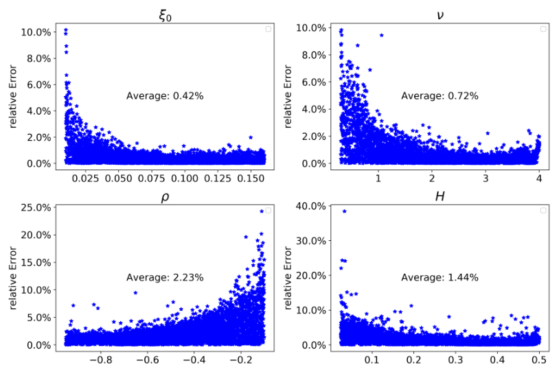

<!-- Start of picture text -->
&o v 10.0% 4 * 10.0%0, t . * * + 8.0%} S * 8.0%) &4 wu * 8 fie * =g 6.0%] ¢¥ Average: 0.42% iv 6.0% | waeat +, + Average: 0.72% & 4.0% * s% 4.0%)° geeMie £ ax + 2 ca a i We 2.0% em * 2.0% | WM +. | * +. x * ak * % +e 27 Paint* 3 » 42 at t : 0.0% 0.0% 0.025 0.050 0.075 0.100 0.125 0.150 1 2 3 4 p H 25.0% : 40.0% 1 9 . E 20.0% * e 30.0% ArT} 15.0% 7 | § * yg -0% “s wi * ro)%2 10.0% Average:* *2.23% fuk cfeae | oOv 20.0% ‘te Average: 1.44% 5.0%“~ * * “a ue? po ~ a £ 10.0% * * ax . ge 0.0% é tty * + awe, _ i : . 0.0% i. ° Ne ia ii —0.8 —0.6 -0.4 —0.2 0.1 0.2 0.3 0.4 0.5 <!-- End of picture text -->

<!-- page: 27 -->

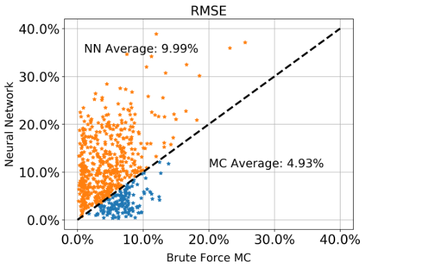

<!-- Start of picture text -->
RMSE 40.0% . 7 NN Average:*9.99%* * © 7ao “ 30.0% * ** a 7 $ te .. “* oe @ t. “ a%s hay * * o = 20.0%} giwdwie o + “9 5 eis ae ase gee oO ety EY. ea so” = 10.0% even Halo * MC Average: 4.93% oe 3 0.0%} 7-27 0.0% 10.0% 20.0% 30.0% 40.0% Brute Force MC <!-- End of picture text -->

<!-- page: 28 -->

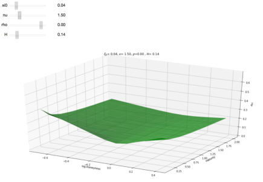

<!-- Start of picture text -->
xi0 0.04 thoru | 0.001.50 H 014 §= 004, v= 150, p=0.00, H= 0.14 os os os ‘ry a2 a oo 17s 200 06 “04 6592trineymess 00 2 os 025 050 os 100,58112s 10 <!-- End of picture text -->

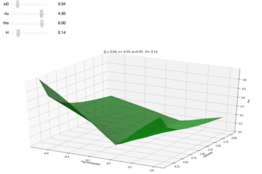

<!-- Start of picture text -->
0.04 rhonu W 4.500.00 H 0.14 $= 004, v= 450, p=0.00, H= 0.14 os as 03 a a 200 00 6 4 tog82,Poneymess 00 a as 025 ase os 1008on125 150 1s <!-- End of picture text -->

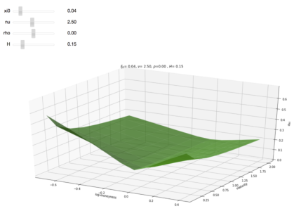

<!-- Start of picture text -->
xio 0.04 nu 2.50 tho 0.00 H 0.15 f= 004, v= 250, p=0.00. H= 0.15 os os ooé 03 200 00 150 1s 6 a ‘5~ reyey, 00 0 oe 025 aso os <!-- End of picture text -->

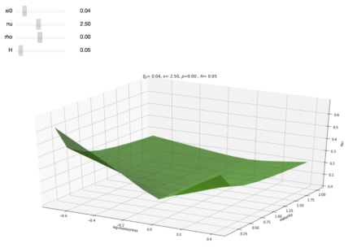

<!-- Start of picture text -->
xi0 0.04 nu 2.50 rho 0.00 H 0.05 f= 0.04, v= 250, p=0.00, H= 005 os os os é ry aat S00 co so Ts “06 8 6592, ress ao 0 025 050 os 1005 <!-- End of picture text -->

<!-- page: 29 -->

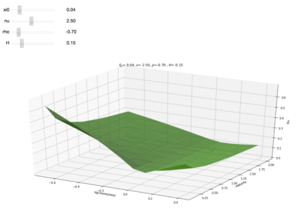

<!-- Start of picture text -->
xi0 0.04 nu 2.50 tho 0.70 H 0.15 f= 004,v= 250, 92-070 ,H= 015 os os Peos 3 oo 00 ae we "i~~ Rbremens 00 a Py oas 050 <, 100teatas ais <!-- End of picture text -->

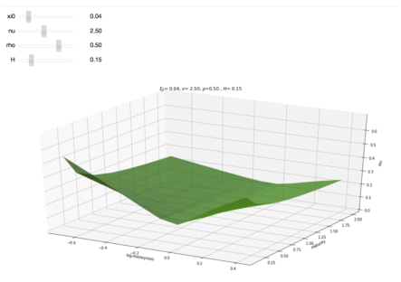

<!-- Start of picture text -->
xi0: 0.04 nu 2.50 rho. 0.50 H 0.15 fo= 004,v= 250, 92050, H= 015 Pm os os ; o j aa 00 is 06 “oa Ss 100,eeis 0 "Rovera2 00 o a 2s 050 <!-- End of picture text -->

<!-- page: 30 -->

- [13] J. De Spiegeleer, D. Madan, S. Reyners and W. Schoutens. Machine learning for quantitative finance: Fast derivative pricing, hedging and fitting. SSRN:3191050, 2018. 

- [14] G. Dimitroff, D. R¨oder and C. P. Fries. Volatility model calibration with convolutional neural networks. _Preprint_ , SSRN:3252432, 2018. 

- [15] R. Eldan and O. Shamir. The power of depth for feedforward neural neworks. _JMLR: Workshop and Conference Proceedings_ `Vol 49:1-34` , 2016. 

- [16] O. El Euch and M. Rosenbaum. Perfect hedging in rough Heston models, to appear in _The Annals of Applied Probability_ , 2018. 

- [17] M. Forde, H. Zhang. Asymptotics for Rough Stochastic Volatility 

- [18] J. Friedman, R. Tibshiran and T. Hastie. The Elements of Statistical Learning. _Springer New York Inc_ , 2001. 

- [19] R. Ferguson and A. D. Green. Deeply learning derivatives. Preprint arXiv:1809.02233, 2018. 

- [20] D. Foreman-Mackey, D. W. Hogg, D. Lang, J. Goodman. emcee: the MCMC hammer, _Publications of the Astronomical Society of the Pacific_ , 125(925), 306, 2013. 

- [21] D. Foreman-Mackey, corner.py: Scatterplot matrices in Python, _The Journal of Open Source Software_ 24, `http://dx.doi.org/10.5281/zenodo.45906` , 2016. 

- [22] M. Fukasawa. Asymptotic analysis for stochastic volatility: martingale expansion. _Finance and Stochastics_ , `15` : 635-654, 2011. 

- [23] J. Gatheral. The volatility surface: a practitioner’s guide, _Wiley_ , 2011. 

- [24] J. Gatheral, T. Jaisson and M. Rosenbaum. Volatility is rough. _Quantitative Finance_ , `18` (6): 933-949, 2018. 

- [25] K. Glau, D. Kressner, and F. Statti. Low-rank tensor approximation for Chebyshev interpolation in parametric option pricing. arXiv:1902.04367, 2019. 

- [26] A. Green. XVA: Credit, Funding and Capital Valuation Adjustments. _Wiley_ , 2015. 

- [27] P. Hagan, D. Kumar, A. Lesniewski, and D. Woodward. Managing smile risk. _Wilmott Magazine_ , `September issue: 84-108` , 2002. 

- [28] J. Han, A. Jentzen, E. Weinan. Overcoming the curse of dimensionality: Solving highdimensional partial differential equations using deep learning. _PNAS_ . `115` (34) 8505-8510, August 2018. 

- [29] S.L. Heston. A closed-form solution for options with stochastic volatility with applications to bond and currency options, _The Review of Financial Studies_ 6(2):327–343, 1993. 

- [30] A. Hernandez. Model calibration with neural networks. _Risk_ , 2017. 

- [31] K. Hornik, M. Stinchcombe, and H. White. Multilayer feedforward networks are universal approximators. _Neural Networks_ , `2` (5):359-366, 1989. 

- [32] K. Hornik. M. Stinchcombe and H. White. Universal approximation of an unknown mapping and its derivatives using multilayer feedforward networks. _Neural Networks_ . Vol. 3:11, 1990.

<!-- page: 31 -->

- [33] P. Henry-Labord`ere. Deep primal-dual algorithm for BSDEs: applications of machine learning to CVA and IM. SSRN:3071506 

- [34] B. Horvath, A. Jacquier and A. Muguruza. Functional central limit theorems for rough volatility. arXiv:1711.03078, 2017. 

- [35] B. Horvath, A. Muguruza and T. Mehdi. Deep learning volatility. Available at SSRN 3322085, 2019. 

- [36] B. Horvath, O. Reichmann. Dirichlet Forms and Finite Element Methods for the SABR Model. _SIAM Journal on Financial Mathematics_ , `p. 716-754` (2), May 2018. 

- [37] J. Hull and A. White. Pricing interest rate derivatives securities. _The Review of Financial Studies_ ) `(3)` : 573-592, 1990 

- [38] J. M. Hutchinson, A. W. Lo and T. Poggio. A Nonparametric Approach to Pricing and Hedging Derivative Securities Via Learning Networks. _The Journal of Finance_ , `49` (3) 851-889. _Papers and Proceedings Fifty-Fourth Annual Meeting of the American Finance Association, Boston, Massachusetts_ , 1994. 

- [39] A. Itkin. To sigmoid-based functional description of the volatility smile. _Preprint_ , arXiv:1407.0256, 2014. 

- [40] S. Ioffe and C. Szegedy. Batch normalisation: Accelerating deep network training by reducing internal covariate shift. _Preprint_ , arXiv:1502.03167, 2015. 

- [41] D.P. Kingman and J. Ba, Adam: A Method for Stochastic Optimization. _Conference paper_ , 3rd International Conference for Learning Representations, 2015. 

- [42] A. Leitao Rodriguez, L.A. Grzelak and C.W. Oosterlee. On an efficient multiple time step Monte Carlo simulation of the SABR model. _Quantitative Finance_ , `17` (10), pp.1549-1565, 2017. 

- [43] K. Levenberg. A Method for the Solution of Certain Non-Linear Problems in Least Squares. _Quarterly of Applied Mathematics_ . 2: pp. 164-168, 1944. 

- [44] D. Marquardt. An Algorithm for Least-Squares Estimation of Nonlinear Parameters. _SIAM Journal on Applied Mathematics_ . 11 (2): pp. 431-441,1963.‘ 

- [45] S. Liu, A. Borovykh, L. A. Grzelak, C. W. Oosterlee. A neural network-based framework for financial model calibration. Preprint, arXiv:1904.10523, 2019. 

- [46] W. A. McGhee. An artificial neural network representation of the SABR stochastic volatility model. _Preprint_ , SSRN:3288882, 2018. 

- [47] R. McCrickerd, M. Pakkanen, Turbocharging Monte Carlo pricing for the rough Bergomi model, _Quantitative Finance_ 18(11):1877-1886, 2018. 

- [48] A. Leitao Rodriguez, A. Grzelak Lech, Cornelis W. Oosterlee. On a one time-step Monte Carlo simulation approach of the SABR model : Application to European options. _Applied Mathematics and Computation_ , `293` p. 461-479, 2017, 

- [49] M. Sabate Vidales, D. Siska, L. Szpruch Unbiased deep solvers for parametric PDEs arXiv:1810.05094, 2018.

<!-- page: 32 -->

- [50] J. Sirignano and K. Spiliopoulos. DGM: A deep learning algorithm for solving partial differential equations. _Journal of Computational Physics_ `375` (15) 1339-1364, December 2018 

- [51] L. Setayeshgar, and H. Wang. Large deviations for a feed-forward network, _Advances in Applied Probability_ , 43: 2, pp. 545-571, 2011. 

- [52] U. Shaham, A. Cloninger, and R. R. Coifman. Provable approximation properties for deep neural networks. _Appl. Comput. Harmon. Anal._ , `44` (3): 537-557, 2018. 

- [53] H. Stone. Calibrating rough volatility models: a convolutional neural network approach. _Preprint_ , arXiv:1812.05315, 2018.
