<!-- page: 1 -->

# **DEEP HEDGING** 

## HANS BUEHLER, LUKAS GONON, JOSEF TEICHMANN, AND BEN WOOD 

Abstract. We present a framework for hedging a portfolio of derivatives in the presence of market frictions such as transaction costs, market impact, liquidity constraints or risk limits using modern deep reinforcement machine learning methods. 

We discuss how standard reinforcement learning methods can be applied to non-linear reward structures, i.e. in our case convex risk measures. As a general contribution to the use of deep learning for stochastic processes, we also show in section 4 that the set of constrained trading strategies used by our algorithm is large enough to _ϵ_ -approximate any optimal solution. 

Our algorithm can be implemented efficiently even in high-dimensional situations using modern machine learning tools. Its structure does not depend on specific market dynamics, and generalizes across hedging instruments including the use of liquid derivatives. Its computational performance is largely invariant in the size of the portfolio as it depends mainly on the number of hedging instruments available. 

We illustrate our approach by showing the effect on hedging under transaction costs in a synthetic market driven by the Heston model, where we outperform the standard “complete market” solution. 

**Key words and phrases:** reinforcement learning, approximate dynamic programming, machine learning, market frictions, transaction costs, hedging, risk management, portfolio optimization. **MSC 2010 Classification: 91G60, 65K99** 

# 1. Introduction 

The problem of pricing and hedging portfolios of derivatives is crucial for pricing risk-management in the financial securities industry. In idealized frictionless and “complete market” models, mathematical finance provides, with risk neutral pricing and hedging, a tractable solution to this problem. Most commonly, in such models only the primary asset such as the equity and few additional factors are modeled. Arguably, the most successful such model for equity models is Dupire’s Local Volatility [Dup94]. For risk management, we will then compute “greeks” with respect not only to spot, but also to calibration input parameters such as forward rates and implied volatilities - even if such quantities are not actually state variables in the underlying model. Essentially, the models are used as a form of low dimensional interpolation of the 

> 1Opinions expressed in this paper are those of the authors, and do not necessarily reflect the view of JP Morgan. _Date_ : February 12, 2018.

<!-- page: 2 -->

hedging instruments. Under complete market assumptions, pricing and risk of a portfolio of derivatives is linear. 

In real markets, though, trading in any instrument is subject to transaction costs, permanent market impact and liquidity constraints. Furthermore, any trading desk is typically also limited by its capacity for risk and stress, or more generally capital. This requires traders to overlay the trading strategy implied by the greeks computed from the complete-market model with their own adjustments. It also means that pricing and risk are not linear, but dependent on the overall book: a new trade which reduces the risk in a particular direction can be priced more favourably. This is called having an “axe”. 

The prevalent use of the “complete market” models is due to a lack of efficient alternatives; even with the impressive progress made in the last years for example around super-hedging, there are still few solutions which will scale well over a large portfolio of instruments, and which do not depend on the underlying market dynamics. 

Our _deep hedging_ approach addresses this deficiency. Essentially, we model the trading decisions in our hedging strategies as neural networks; their _feature sets_ consist not only of prices of our hedging instruments, but may also contain additional information such as trading signals, news analytics, or past hedging decisions – quantitative information a human trader might use, in true machine learning fashion. 

Such deep hedging strategies can be described and trained (optimized in classical language) in a very efficient way, while the respective algorithms are entirely model-free and do not depend on the on the chosen market dynamics. That means we can include market frictions such as transaction costs, liquidity constraints, bid/ask spreads, market impact etc, all potentially dependent on the features of the scenario. 

The modeling task now amounts to specifying a market scenario generator, a loss function, market frictions and trading instruments. This approach lends itself well to statistically driven market dynamics. That also means that we do not need to be able to compute greeks of individual derivatives with a classic derivative pricing model. In fact, we will need no such “equivalent martingale model”. _Our approach is greek-free_ . Instead, we can focus our modeling effort on realistic market dynamics and the actual out-of-sample performance of our hedging signal. 

High level optimizers then find reasonably good strategies to achieve good out-of-sample hedging performance under the stated objective. In our examples, we are using gradient descent “Adam” [KB15] mini-batch training for a semi-recurrent reinforcement learning problem. 

To illustrate our approach, we will build on ideas from [IAR09] and [FL00] and optimize hedging of a portfolio of derivatives under _convex risk measures_ . To be able to compare our results with classic complete market results, we chose in this article to drive the market with a Heston model. We re-iterate that our algorithm is not dependent on the choice of the model. 

To illustrate our algorithm, we investigate the following questions:

<!-- page: 3 -->

- Section 5.2: How does neural network hedging (for different risk-preferences) compare to the benchmark in a Heston model without transaction costs? 

- Section 5.3: What is the effect of proportional transaction costs on the exponential utility indifference price? 

- Section 5.4: Is the numerical method scalable to higher dimensions? 

Our analysis is based on out-of-sample performance. 

To calculate our hedging strategies numerically, we approximate them by deep neural networks. State-of-the-art machine learning optimization techniques (see [IGC16]) are then used to train these networks, yielding a closeto-optimal _deep hedge_ . This is implemented in Python using TensorFlow. Under our Heston model, trading is allowed in both stock and a variance swap. Even experiments with proportional transaction costs show promising results and the approach is also feasible in a high-dimensional setting. 

1.1. **Related literature.** There is a vast literature on hedging in market models with frictions. We only highlight a few to demonstrate the complex character of the problem. For example, [RS10] study a market in which trading a security has a (temporary) impact on its price. The price process is modelled by a one-dimensional Black-Scholes model. The optimal trading strategy can be obtained by solving a system of three coupled (non-linear) PDEs. In [PBV17] a more general tracking problem (covering the temporary price impact hedging problem) is carried out for a Bachelier model and a closed form solution (involving conditional expectations of a time integral over the optimal frictionless hedging strategy) is obtained for the strategy. [HMSC95] prove that in a Black-Scholes market with proportional transaction costs, the cheapest superhedging price for a European call option is the spot price of the underlying. Thus, the concept of super-replication is of little interest to practitioners in the one dimensional case. In higher dimensional cases it suffers from numerical intractability. 

It is well known that deep feed forward networks satisfy universal approximation properties, see, e.g., [Hor91]. To understand better why they are so efficient at approximating hedging strategies, we rely on the very recent and fascinating results of [HBP17], which can be stated as follows: they quantify the minimum network connectivity needed to allow approximation of _all_ elements in pre-specified classes of functions to within a prescribed error, which establishes a universal link between the connectivity of the approximating network and the complexity of the function class that is approximated. An abstract framework for transferring optimal _M_ -term approximation results with respect to a _representation system_ to optimal _M_ -edge approximation results for neural networks is established. These transfer results hold for dictionaries that are _representable by neural networks_ and it is also shown in [HBP17] that a wide class of representation systems, coined _affine systems_ , and including as special cases wavelets, ridgelets, curvelets, shearlets, _α_ -shearlets, and more generally, _α_ -molecules, as well as tensor-products thereof, are re-presentable by neural networks. These results suggest an explanation for the “unreasonable effectiveness” of neural networks: they effectively combine the optimal

<!-- page: 4 -->

approximation properties of all affine systems taken together. In our application of deep hedging strategies this means: understanding the relevant input factors for which the optimal hedging strategy can be written efficiently. 

There are several related applications of reinforcement learning in finance which have similar challenges, of which we want to highlight two related streams: the first is the application to classic portfolio optimization, i.e. without options and under the assumption that market prices are available for all hedging instruments. As in our setup, this problem requires the use of non-linear objective functions, c.f. for example [MW97] or [ZJL17]. The second promising application of reinforcement learning is in algorithmic trading, where several authors have shown promising results, e.g. [DZL09] and [Lu17] to give but two examples. 

The novelty in this article is that we cover derivatives in the first place, and in particular over-the-counter derivatives which do not have an observable market price. For example, [Hal17] covers hedging using Q-learning with only the stock price under Black&Scholes assumptions and without transaction cost. 

This puts our article firmly in the realm of pricing and risk managing a contingent claims in incomplete markets with friction cost. A general introduction into quantitative finance with a focus on such markets is [FS16]. 

1.2. **Outline.** The rest of the article is structured as follows. In Sections 2 and 3 we provide the theoretical framework for pricing and hedging using convex risk measures in discrete-time markets with frictions. Section 4 outlines the parametrization of appropriate hedging strategies by neural nets and provides theoretical arguments why it works. In Section 5 several numerical experiments are performed demonstrating the surprising feasibility and accuracy of the method. 

# 2. Setting: Discrete time-market with Frictions 

Consider a discrete-time financial market with finite time horizon _T_ and trading dates 0 = _t_ 0 _< t_ 1 _< . . . < tn_ = _T_ . Fix a finite1 probability space Ω= _{ω_ 1 _, . . . , ωN }_ and a probability measure P such that P[ _{ωi}_ ] _>_ 0 for all _i_ . We define the set of all real-valued random variables over Ωas _X_ := _{X_ : Ω _→_ R _}_ . 

We denote by _Ik_ with values in R_r_ any new market information available at time _tk_ , including market costs and mid-prices of liquid instruments – typically quoted in auxiliary terms such as implied volatilities –, news, balance sheet information, any trading signals, risk limits etc. The process _I_ = ( _Ik_ ) _k_ =0 _,...,n_ generates the filtration F = ( _Fk_ ) _k_ =0 _,...,n_ , i.e. _Fk_ represents all information available up to _tk_ . Note that each _Fk_ -measurable random variable can be written as a function of _I_ 0 _, . . . , Ik_ ; this is therefore the richest available feature set for any decision taken at _tk_ . 

1The assumption that Ωis finite is only essential for the numerical solution of the optimal hedging problem (from Section 4.3 onwards). Alternatively, we could start with arbitrary Ω and discretize it for the numerical solution. If we imposed appropriate integrability conditions on all assets and contingent claims, then the results prior to section 4.3 would remain valid for general Ω.

<!-- page: 5 -->

The market contains _d_ hedging instruments with mid-prices given by an R_d_ -valued F-adapted stochastic process _S_ = ( _Sk_ ) _k_ =0 _,...,n_ . We do _not_ require that there is an equivalent martingale measure under which _S_ is a martingale. We stress that our hedging instruments are not simply primary assets such as equities, but also secondary assets such as liquid options on the former. Some of those hedging instruments are therefore not tradable before a future point in time (e.g. an option only listed in 3M with then time-to-maturity of 6M). Such liquidity restrictions are modeled alongside trading cost below. 

Our portfolio of derivatives which represents our liabilities is an _FT_ measurable random variable _Z_ . In keeping with the classic literature we may refer to this as the _contingent claim_ , but we stress that it is meant to represent a portfolio which is a mix of liquid and OTC derivatives. The maturity _T_ is the maximum maturity of all instruments, at which point all payments are known. _No classic derivative pricing model will be needed to valuate Z or compute Greeks at any point._ 

_Simplifications._ For notational simplicity, we assume that all intermediate payments are accrued using a (locally) risk-free overnight rate. This essentially means we may assume that rates are zero and that all payments occur at _T_ . We also exclude for the purpose of this article instruments with true optionality such as American options. Finally, we also assume that all currency spot exchange happens at zero cost, and that we therefore may assume that all instruments settle in our reference currency.2 

_Trading Strategies._ In order to hedge a liability _Z_ at _T_ , we may trade in _S_ using an R_d_ -valued F-adapted stochastic process _δ_ = ( _δk_ ) _k_ =0 _,...,n−_ 1 with _δk_ = ( _δk_1_, . . . , δ_ _k__d_).Here,_δ_ _k__i_denotestheagent’sholdingsofthe_i_thassetattime_tk_. We may also define _δ−_ 1 = _δn_ := 0 for notational convenience. We denote by _H__u_ the unconstrained set of such trading strategies. However, each _δk_ is subject to additional trading constraints. Such restrictions arise due to liquidity, asset availability or trading restrictions. They are also used to restrict trading in a particular option prior to its availability. In the example above of an option which is listed in 3M, the respective trading constraints would be _{_ 0 _}_ until the 3M point. To incorporate these effects, we assume that _δk_ is restricted to a set _Hk_ which is given as the image of a continuous, _Fk_ -measurable map _Hk_ : R_d_(_k_+1) _→_ R_d_ , i.e. _Hk_ := _Hk_ (R_d_(_k_+1) ). We stipulate that _Hk_ (0) = 0. 

Moreover, for an unconstrained strategy _δ__u_ _∈H__u_ , we (successively) define with ( _H ◦δ__u_ ) _k_ := _Hk_ (( _H ◦δ__u_ )0 _, . . . ,_ ( _H ◦δ__u_ ) _k−_ 1 _, δk__u_) its constrained “projection” into _Hk_ . We denote by _H_ := ( _H ◦H__u_ ) _⊂H__u_ the corresponding non-empty set of restricted trading strategies. 

**Example 2.1.** Assume that _S_ are a range of options and that _Vk__i_(_S_ _k__i_)com- putes the Black & Scholes Vega of each option using the various market parameters available at time _tk_ . The overall Vega traded with _δk_ is then _Vk_ ( _δk − δk−_ 1) := _|_�_d_ _i_ =1_V_ _k__i_(_S_ _k__i_)(_δ_ _k__i−δ_ _k__i_ _−_ 1)_|_.Aliquiditylimitofamaximumtradable 

> 2See [BR06] for some background on multi-currency risk measures.

<!-- page: 6 -->

Vega of _V_ max could then be implemented by the map: 

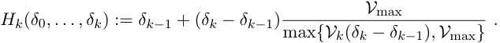

_Hedging._ All trading is self-financed, so we may also need to inject additional cash _p_ 0 into our portfolio. A negative cash injection implies we may extract cash. In a market without transaction costs the agent’s wealth at time _T_ is thus given by _−Z_ + _p_ 0 + ( _δ · S_ ) _T_ , where 

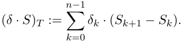

However, we are interested in situations where trading cost cannot be neglected. We assume that any trading activity causes costs as follows: if the agent decides to buy a position n _∈_ R_d_ in _S_ at time _tk_ , then this will incur cost _ck_ (n). The total cost of trading a strategy _δ_ up to maturity is therefore 

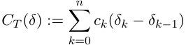

(recall _δ−_ 1 = _δn_ := 0, the latter of which implies full liquidation in _T_ ). The agent’s terminal portfolio value at _T_ is therefore 

(2.1) PL _T_ ( _Z, p_ 0 _, δ_ ) := _−Z_ + _p_ 0 + ( _δ · S_ ) _T − CT_ ( _δ_ ) _._ 

Throughout, we assume that the non-negative adapted cost functions are normalized to _ck_ (0) = 0 and that they are upper semi-continuous.3 In our numerical examples we have assumed zero transaction costs at maturity. Our setup includes the following effects: 

- Proportional transaction cost: for for _c__i_ _k__>_0 define_ck_(n) := � _i__d_ =1_ci_ _k__S_ _k__i|_n_i|_. 

- _•_ Fixed transaction costs: for _c__i_ _k__>_0 and_ε >_0 set_ck_(n) := � _i__d_ =1_ci_ _k_1_|_n_i|≥ε_. 

- Complex cross-asset cost, such as cost of volatility when trading options across the surface: assume _S_1 is spot and that the rest of the hedging instruments are options on the same asset. Denote by ∆_i_ _k_ Delta and by _Vk__i_Vegaofeachinstrument,forexampleunderasimple Black & Scholes model. 

We may then define a simple cross-surface proportional cost model in Delta and Vega for _ck >_ 0 and _vk >_ 0 as 

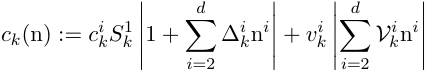

_Remark_ 2.2 _._ Our general setup also allows modeling true market impact: in this case, the asset distribution is affected by our trading decisions. 

As an example for permanent market impact, assume for simplicity that _I_ = _S_ and that we have a statistical model of our market in the form of a conditional distribution _P_ ( _Sk_ +1 _|Sk_ ). For a proportional impact parameter _ι >_ 0 

> 3This property is needed in the proof of proposition 4.9.

<!-- page: 7 -->

we may now define the dynamics of _S_ under exponentially decaying, proportional market impact as _P_ � _Sk_ +1 �� _Sk_ (1 + _ι_ ( _δk − δk−_ 1)) �. The cost function is accordingly _ck_ (n) := _Skι|_ n _|_ . 

In a similar vein, dynamic market impact with decay such as described in [GS13] can be implemented. 

The real challenge with modeling impact is the effect of trading in one hedging instrument on other hedging instruments, for example when trading options. 

# 3. Pricing and hedging using convex risk measures 

In an idealized complete market with continuous-time trading, no transaction costs, and unconstrained hedging, for any liabilities _Z_ there exists a unique replication strategy _δ_ and a fair price _p_ 0 _∈_ R such that _−Z_ + _p_ 0 + ( _δ · S_ ) _T − CT_ ( _δ_ ) = 0 holds P-a.s. This is not true in our current setting. 

In an incomplete market with frictions, an agent has to specify an optimality criterion which defines an acceptable “minimal price” for any position. Such a minimal price is the going to be the minimal amount of cash we need to add to our position in order to implement the optimal hedge and such that the overall position becomes acceptable in light of the various costs and constraints. 

We focus here on optimality under _convex risk measures_ as studied e.g. in [Xu06] and [IAR09]. See also [KS07] and further references therein for a dynamic setting. Convex risk measures are discussed in great detail in [FS16]. 

**Definition 3.1.** Assume that _X, X_ 1 _, X_ 2 _∈X_ represent asset positions (i.e., _−X_ is a liability). 

We call _ρ_ : _X →_ R a _convex risk measure_ if it is: 

- (1) Monotone decreasing: if _X_ 1 _≥ X_ 2 then _ρ_ ( _X_ 1) _≤ ρ_ ( _X_ 2). _A more favorable position requires less cash injection_ . 

- (2) Convex: _ρ_ ( _αX_ 1 + (1 _− α_ ) _X_ 2) _≤ αρ_ ( _X_ 1) + (1 _− α_ ) _ρ_ ( _X_ 2) for _α ∈_ [0 _,_ 1]. _Diversification works_ . 

- (3) Cash-Invariant: _ρ_ ( _X_ + _c_ ) = _ρ_ ( _X_ ) _− c_ for _c ∈_ R. 

   - _Adding cash to a position reduces the need for more by as much. In particular, this means that ρ_ ( _X_ + _ρ_ ( _X_ )) = 0 _, i.e. ρ_ ( _X_ ) _is the least amount c that needs to be added to the position X in order to make it acceptable in the sense that ρ_ ( _X_ + _c_ ) _≤_ 0 _._ 

We call _ρ normalized_ if _ρ_ (0) = 0. 

Let _ρ_ : _X →_ R be such a convex risk measure and for _X ∈X_ consider the optimization problem 

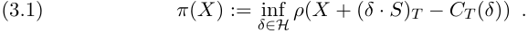

**Proposition 3.2.** _π is monotone decreasing and cash-invariant._ 

_If moreover CT_ ( _·_ ) _and H are convex, then the functional π is a convex risk measure._ 

_Proof._ For convexity, let _α ∈_ [0 _,_ 1], set _α__′_ := 1 _− α_ and assume _X_ 1 _, X_ 2 _∈X_ . Then using the definition of _π_ in the first step, convexity of _H_ in the second

<!-- page: 8 -->

step, convexity of _CT_ ( _·_ ) combined with monotonicity of _ρ_ in the third step and convexity of _ρ_ in the fourth step, we obtain 

_π_ ( _αX_ 1 + _α__′_ _X_ 2) 

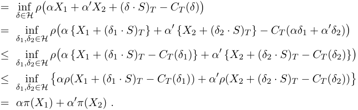

Cash-invariance and monotonicity follow directly from the respective properties of _ρ_ . □ 

We define an optimal hedging strategy as a minimizer _δ ∈H_ of (3.1). Recalling the interpretation of _ρ_ ( _−Z_ ) as the minimal amount of capital that has to be added to the risky position _−Z_ to make it acceptable for the risk measure _ρ_ , this means that _π_ ( _−Z_ ) is simply the minimal amount that the agent needs to charge in order to make her terminal position acceptable, if she hedges optimally. 

If we defined this as the minimal price, then we would exclude the possibility that having no liabilities may actually have positive value. This might be the case in the presence of statistically positive expectation of returns under P for some of our hedging instruments. As mentioned before, our framework lends itself to the integration of signals and other trading information. We therefore define the _indifference price p_ ( _Z_ ) as the amount of cash that she needs to charge in order to be indifferent between the position _−Z_ and not doing so, i.e. as the solution _p_ 0 to _π_ ( _−Z_ + _p_ 0) = _π_ (0). By cash-invariance this is equivalent to taking _p_ 0 := _p_ ( _Z_ ), where 

(3.2) _p_ ( _Z_ ) := _π_ ( _−Z_ ) _− π_ (0) _._ 

It is easily seen that without trading restrictions and transaction costs, this price coincides with the price of a replicating portfolio (if it exists): 

**Lemma 3.3.** _Suppose CT ≡_ 0 _and H_ = _H__u_ _. If Z is attainable, i.e. there exists δ__∗_ _∈H and p_ 0 _∈_ R _such that Z_ = _p_ 0 + ( _δ__∗_ _· S_ ) _T , then p_ ( _Z_ ) = _p_ 0 _._ 

_Proof._ For any _δ ∈H_ , the assumptions and cash-invariance of _ρ_ imply 

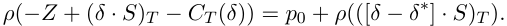

Taking the infimum over _δ ∈H_ on both sides and using _H − δ__∗_ = _H_ one obtains 

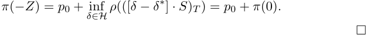

_Remark_ 3.4 _._ The methodology developed in this article can also be applied to approximate optimal hedging strategies in a setting where the price _p_ 0 is given exogenously: fix a loss function _ℓ_ : R _→_ [0 _, ∞_ ). Suppose _p_ 0 _>_ 0 is given, for

<!-- page: 9 -->

example being the result of trading derivatives in the market at competitive prices, without taking into account risk-management. The agent then wishes to minimize her loss at maturity, i.e. she defines an optimal hedging strategy as a minimizer to 

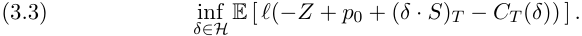

This problem, i.e. optimal hedging under a capital constraint, is closely related to taking for _ρ_ a shortfall risk measure, see e.g. [FL00]. 

_Arbitrage._ We mentioned in the introduction that we do not require per se that the market is free of arbitrage. To recap, we call _δ_[_X_] _∈H_ an arbitrage opportunity given _X_ is an opportunity to make money without risk of a loss, i.e. 0 _≤ X_ + ( _δ_[_X_] _S_ ) _T − CT_ ( _δ_[_X_] ) =: ( _∗_ ) while P[( _∗_ ) _>_ 0] _>_ 0. 

In case such an opportunity exists, we obviously have _ρ_ ( _X_ ) _<_ 0. Depending on the cost function and our constraints _H_ , we may be able to invest an unlimited amount into this strategy. In this case, we get _π_ ( _X_ ) = _−∞_ . If this applies to _X_ = 0, we call such a market _irrelevant_ . This is justified by the following observation: 

**Corollary 3.5.** _Assume that π_ (0) _> −∞. Then π_ ( _X_ ) _> −∞ for all X._ 

_Proof._ Since Ωis finite we have sup _X < ∞_ and therefore, using monotonicity, _π_ ( _X_ ) _≥ π_ (sup _X_ ) _≥ π_ (0) _−_ sup _X > −∞_ . □ 

We note, however, that irrelevance is not necessarily a consequence of outright arbitrage; such _statistical arbitrage_ may also occur in markets without arbitrage. Consider to this end the convex risk measure _ρ_ ( _X_ ) := _−_ E[ _X_ ], and assume that the market without interest rates is driven by a standard Black & Scholes model with positive drift _µ_ between two time points _t_ 0 and _t_ 1, i.e. 

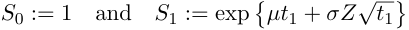

for _Z_ normal and a volatility _σ >_ 0. Assume the proportional cost of trading _S_ in _t_ 0 is 0 _._ 5 _e__µt_1 . In this case _ρ_ ( _δ_ 0 _S_ 1 _− C_ 0( _δ_ )) = _−_ 0 _._ 5 _δ_ 0 _e__µt_1 for any _δ_ 0 _∈_ R which implies _π_ (0) = _−∞_ . Hence, the market is irrelevant, too, even if it does not exhibit classic arbitrage. We also note that this is expected in practise: as an example, consider a strategy which writes options on an underlying. In most market scenarios such a strategy will on average make money, even if it is subject to potentially drastic short-term losses. 

In closing we note that even if the market dynamics exhibit classic arbitrage, and even in the absence of cost or liquidity constraints, we may not be able to exploit it. Let us assume that for every arbitrage opportunity _δ_[0] there is a non-zero probability of not making money, i.e. P[( _δ_[0] _S_ ) _T_ + _CT_ ( _δ_[0] ) = 0] _>_ 0. Under the extreme risk measure _ρ_ ( _X_ ) := _−_ inf _X_ this market remains relevant with _π_ (0) = 0. 

3.1. **Exponential Utility Indifference Pricing.** The following lemma shows that the present framework includes exponential utility indifference pricing as studied for example in [HN89], [MHADZ93],[WW97] and [KMK15]. Recall that for the exponential utility function _U_ ( _x_ ) := _−_ exp( _−λx_ ) _, x ∈_ R with

<!-- page: 10 -->

risk-aversion parameter _λ >_ 0 the indifference price _q_ ( _Z_ ) _∈_ R of _Z_ is defined by 

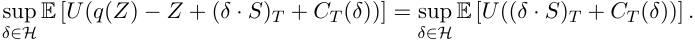

In other words, if the seller charges a cash amount of _q_ ( _Z_ ), sells _Z_ and trades in the market, she obtains the same expected utility as by not not selling _Z_ at all. 

**Lemma 3.6.** _Define q_ ( _Z_ ) _as above. Choose ρ as the entropic risk measure_ 

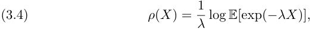

_and define p_ ( _Z_ ) _by_ (3.2) _. Then q_ ( _Z_ ) = _p_ ( _Z_ ) _._ 

_Proof._ Using the special form of _U_ , one may write the indifference price as 

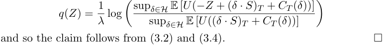

3.2. **Optimized certainty equivalents.** Assume that _ℓ_ : R _→_ R is a _loss function_ , i.e. continuous, non-decreasing and convex. We may define a convex risk measure _ρ_ by setting 

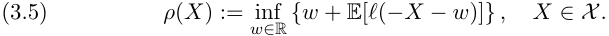

**Lemma 3.7.** (3.5) _defines a convex risk measure._ 

_Proof._ Let _X, Y ∈X_ be assets. 

(i) Monotonicity: suppose _X ≤ Y_ . Since _ℓ_ is non-decreasing, for any _w ∈_ R one has E[ _ℓ_ ( _−X − w_ )] _≥_ E[ _ℓ_ ( _−Y − w_ )] and thus _ρ_ ( _X_ ) _≥ ρ_ ( _Y_ ). 

(ii) Cash invariance: for any _m ∈_ R, (3.5) gives 

_ρ_ ( _X_ + _m_ ) = inf_−_(_w_+_m_))]_}_=_−m_+_ρ_(_X_)_._ _w∈_ R_{_(_w_+_m_)_−m_+ E[_ℓ_(_−X_ 

(iii) Convexity: let _λ ∈_ [0 _,_ 1]. Then convexity of _ℓ_ implies _ρ_ ( _λX_ +(1 _− λ_ ) _Y_ ) 

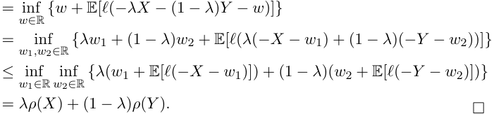

Taking _ℓ_ ( _x_ ) := _−u_ ( _−x_ ) ( _x ∈_ R) for a utility function _u_ : R _→_ R, (3.5) coincides with the optimized certainty equivalent as defined (and studied in a lot more detail than here) in [BTT07]. 

**Example 3.8.** Fix _λ >_ 0 and set _ℓ_ ( _x_ ) := exp( _λx_ ) _−_1+lo _λ_<u>g(</u>_λ_<u>)</u> , _x ∈_ R. Then the optimization problem in (3.5) can be solved explicitly and the minimizer _w__∗_ satisfies _e__λw∗_ = _λ_ E[exp( _−λX_ )]. Inserting this into (3.5), one obtains the _entropic risk measure_ defined in (3.4) above.

<!-- page: 11 -->

<u>1</u> **Example 3.9.** Let _α ∈_ (0 _,_ 1) and set _ℓ_ ( _x_ ) := 1 _−α_max(_x,_0).Theassociated risk measure (3.5) is called _average value at risk at level_ 1 _− α_ (see [FS16, Definition 4.48, Proposition 4.51] with _λ_ := 1 _− α_ ) or also _conditional value at risk_ or _expected shortfall_ . 

**Proposition 3.10.** _Suppose S is a_ P _-martingale, ρ is defined as in_ (3.5) _and π, p as in_ (3.1) _,_ (3.2) _. Then_ 

(i) _π_ (0) = _ρ_ (0) _,_ 

(ii) _p_ ( _Z_ ) _≥_ E[ _Z_ ] _for any Z ∈X ._ 

_Proof._ Since 0 _∈H_ and _CT_ (0) = 0, one has _π_ (0) _≤ ρ_ (0) for any choice of risk measure _ρ_ in (3.1). Under the present assumptions the converse inequality is also true: Since _S_ is a martingale, it holds that 

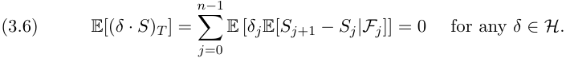

By first applying Jensen’s inequality (recall that _ℓ_ is convex) and then using (3.6), that _CT_ ( _δ_ ) _≥_ 0 for any _δ ∈H_ and that _ℓ_ is non-decreasing, one obtains 

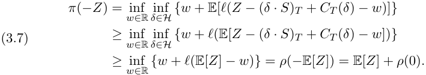

Inserting _Z_ = 0 yields the converse inequality _π_ (0) _≥ ρ_ (0) and thus (i). Combining (i), (3.2) and (3.7) then directly gives (ii). □ 

# 4. Approximating hedging strategies by deep neural networks 

The key idea that we pursue in this article is to approximate hedging strategies by neural networks. Before describing this approach in more detail we recall the definition and approximation properties of neural networks and prove some basic results on hedging strategies built from them. While these results show that the approach is theoretically well-founded, they are only one reason why we have used neural networks (and not some other parametric family of functions) to approximate hedging strategies. The other reason is that optimal hedging strategies built from neural networks can numerically be calculated very efficiently. This is explained first for the case of OCE risk measures and for entropic risk. Finally, an extension to general risk measures is presented. 

4.1. **Universal approximation by neural networks.** Let us first recall the definition of a (feed forward) neural network: 

**Definition 4.1.** Let _L, N_ 0 _, N_ 1 _, . . . , NL ∈_ N, _σ_ : R _→_ R and for any _ℓ_ = 1 _, . . . , L_ , let _Wℓ_ : R_Nℓ−_1 _→_ R_Nℓ_ an affine function. A function _F_ : R_N_0 _→_ R_NL_ as 

_F_ ( _x_ ) = _WL ◦ FL−_ 1 _◦· · · ◦ F_ 1 with _Fℓ_ = _σ ◦ Wℓ_ for _ℓ_ = 1 _, . . . , L −_ 1 

is called a (feed forward) neural network. Here the _activation function σ_ is applied componentwise. _L_ denotes the number of layers, _N_ 1 _, . . . , NL−_ 1 denote the dimensions of the hidden layers and _N_ 0, _NL_ of the input and output layers,

<!-- page: 12 -->

respectively. For any _ℓ_ = 1 _, . . . , L_ the affine function _Wℓ_ is given as _Wℓ_ ( _x_ ) = _A__ℓ_ _x_ + _b__ℓ_ for some _A__ℓ_ _∈_ R_Nℓ×Nℓ−_1 and _b__ℓ_ _∈_ R_Nℓ_ . For any _i_ = 1 _, . . . Nℓ, j_ = 1 _, . . . , Nℓ−_ 1 the number _A__ℓ_ _ij_is interpreted as the weight of the edge connecting the node _i_ of layer _ℓ −_ 1 to node _j_ of layer _ℓ_ . The number of non-zero weights of a network is the sum of the number of non-zero entries of the matrices _A__ℓ_ , _ℓ_ = 1 _, . . . , L_ and vectors _b__ℓ_ , _ℓ_ = 1 _, . . . , L_ . 

Denote by _NN__σ_ _∞,d_ 0 _,d_ 1thesetofneuralnetworksmappingfromR_d_0_→_R_d_1 and with activation function _σ_ . The next result ([Hor91, Theorems 1 and 2]) illustrates that neural networks approximate multivariate functions arbitrarily well. 

**Theorem 4.2** (Universal approximation, [Hor91]) **.** _Suppose σ is bounded and non-constant. The following statements hold:_ 

- _For any finite measure µ on_ (R_d_0 _, B_ (R_d_0 )) _and_ 1 _≤ p < ∞, the set NN__σ_ _∞,d_ 0 _,_ 1_isdenseinLp_(R_d_0_, µ_)_._ 

- _If in addition σ ∈ C_ (R) _, then NN__σ_ _∞,d_ 0 _,_ 1_isdenseinC_(R_d_0)_forthe_ _topology of uniform convergence on compact sets._ 

Since each component of an R_d_1 -valued neural network is an R-valued neural network, this result easily generalizes to _NN__σ_ _∞,d_ 0 _,d_ 1with_d_1_>_1,seealso [Hor91]. A variety of other results with different assumptions on _σ_ or emphasis on approximation rates are available, see e.g. [HBP17] for further references. In what follows, we fix an activation function _σ_ and omit it in the notation, i.e. we write _NN ∞,d_ 0 _,d_ 1 := _NN__σ_ _∞,d_ 0 _,d_ 1.Furthermore,wedenoteby _{NN M,d_ 0 _,d_ 1 _}M ∈_ N a sequence of subsets of _NN ∞,d_ 0 _,d_ 1 with the following properties: 

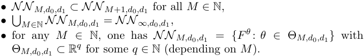

_Remark_ 4.3 _._ We have two classes of examples in mind: the first one is to take for _NN M,d_ 0 _,d_ 1 the set of all neural networks in _NN ∞,d_ 0 _,d_ 1 with an arbitrary number of layers and nodes, but at most _M_ non-zero weights. The second one is to take for _NN M,d_ 0 _,d_ 1 the set of all neural networks in _NN ∞,d_ 0 _,d_ 1 with a _fixed architecture_ , i.e. a fixed number of layers _L_(_M_) and fixed input and output dimensions for each layer. These are specified by _d_ 0, _d_ 1 and some non-decreasing sequences _{L_(_M_) _}M ∈_ N and _{N_ 1(_M_) _}M ∈_ N, _. . ._ , _{NL_(_M_(_M_)) _−_ 1_}M∈_N. In both cases the set _NN M,d_ 0 _,d_ 1 is parametrized by matrices _A__ℓ_ and vectors _b__ℓ_ . 

4.2. **Optimal hedging using deep neural networks.** Motivated by the universal approximation results stated above, we now consider neural network hedging strategies. Let our activation function therefore be bounded and nonconstant. 

In order to apply our theorem 4.2, we represent the optimization over constrained trading strategies _δ ∈H_ as an optimization over _δ ∈H__u_ with a following modified objective.

<!-- page: 13 -->

**Lemma 4.4.** _We may write the constrained problem 3.1 as the modified unconstrained problem as_ 

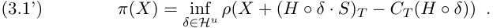

_Proof._ Note that _H ◦δ_ = _δ_ for all _δ ∈H_ , and _H ◦δ__u_ _∈H_ for all _δ__u_ _∈H__u_ . □ 

Recall that the information available in our market at _tk_ is described by the observed maximal feature set _I_ 0 _, . . . , Ik_ . Our trading strategies should therefore depend on this information and on our previous position in our tradable assets. This gives rise to the following semi-recurrent deep neural network structure for our unconstrained trading strategies: 

(4.1) _HM_ = _{_ ( _δk_ ) _k_ =0 _,...,n−_ 1 _∈H__u_ : _δk_ = _Fk_ ( _I_ 0 _, . . . , Ik, δk−_ 1) _, Fk ∈NN M,r_ ( _k_ +1)+ _d,d}_ = _{_ ( _δk__θ_)_k_=0_,...,n−_1_∈Hu_:_δ_ _k__θ_=_F θk_(_I_0_, . . . , Ik, δk−_1)_, θk∈_Θ _M,r_ ( _k_ +1)+ _d,d__}_ We now replace the set _H__u_ in (3.1’) by _HM ⊂H__u_ . We aim at calculating (4.2) _π__M_ ( _X_ ) := inf+ (_H◦δ · S_)_T−CT_(_H◦δ_)) _δ∈HM__ρ_(_X_ = inf+ (_H◦δθ · S_)_T−CT_(_H◦δθ_))_,_ _θ∈_ Θ _M__ρ_(_X_ 

where Θ _M_ =�_n_ _k_ =0_−_1Θ_M,r_(_k_+1)+_d,d_.Thus,theinfinite-dimensionalproblemof finding an optimal hedging strategy is reduced to the finite-dimensional constraint problem of finding optimal parameters for our neural network. _Remark_ 4.5 _._ Our setup becomes truly “recurrent” if we enforce _θ__k_ = _θ_0 for all _k_ and add “ _k_ ” as a parameter into the network. Below proof applies with few 

_Remark_ 4.6 _._ If _S_ is an (F _,_ P)-Markov process and _Z_ = _g_ ( _ST_ ) for _g_ : R_d_ _→_ R and with simplistic market frictions we may know that the optimal strategy in (3.1) is of the simpler form _δk_ = _fk_ ( _Ik, δk−_ 1) for some _fk_ : R_r_+_d_ _→_ R_d_ . 

_Remark_ 4.7 _._ We would similarly transform (3.3) into a modified unconstrained problem, optimized over _HM_ . 

_Remark_ 4.8 _._ For practical implementations, handling trading constraints with 4.2 is not particularly efficient since the gradient of Θ _M_ of our objective outside _H_ vanishes. In the case where _H ◦ δ_ = _δ_ for _δ ∈H_ , this can be addressed by variants of 

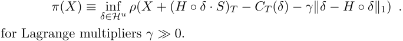

The next proposition shows that thanks to the universal approximation theorem, strategies in _H_ are approximated arbitrarily well by strategies in _HM_ . Consequently, the neural network price _π__M_ ( _−Z_ ) _− π__M_ (0) converges to the exact price _p_ ( _Z_ ). 

**Proposition 4.9.** _Define HM as in_ (4.1) _and π__M_ _as in_ (4.2) _. Then for any X ∈X ,_ 

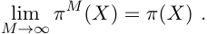

<!-- page: 14 -->

_Proof._ We first note that the argument _δk−_ 1 in 4.2 is redundant, since iteratively _δk−_ 1 is itself a function of _I_ 0 _, . . . , Ik−_ 1. We may therefore write for the purpose of this proof 

(4.1’) 

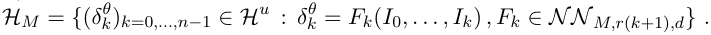

Since _HM ⊂HM_ +1 _⊂H__u_ for all _M ∈_ N it follows that _π__M_ ( _X_ ) _≥ π__M_+1 ( _X_ ) _≥ π_ ( _X_ ). Thus it suffices to show that for any _ε >_ 0 there exists _M ∈_ N such that _π__M_ ( _X_ ) _≤ π_ ( _X_ ) + _ε_ . 

By definition, there exists _δ ∈H__u_ such that 

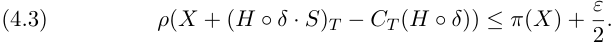

Since _δk_ is _Fk_ -measurable, there exists _fk_ : R_r_(_k_+1) _→_ R_d_ measurable such that _δk_ = _fk_ ( _I_ 0 _, . . . , Ik_ ) for each _k_ = 0 _, . . . , n−_ 1. Since Ωis finite, _δk_ is bounded and so _fk__i∈L_1(R_r_(_k_+1)_, µ_) for any_i_= 1_, . . . d_, where_µ_is the law of (_I_0_, . . . , Ik_) under P. Thus one may use theorem 4.2 to find _Fk,n__i∈NN ∞,r_(_k_+1)_,_1such that _Fk,n__i_(_I_0_, . . . , Ik_)convergesto_f_ _k__i_(_I_0_, . . . , Ik_)in_L_1(P)as_n →∞_. 

By passing now to a suitable subsequence, convergence holds P-a.s. simultaneously for all _i, k_ . Writing _δk__n_:=_Fk,n_(_I_0_, . . . , Ik_)andusingP[_{ω}_]_>_0for all _ω ∈_ Ω, this implies 

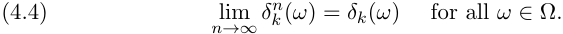

Continuity of _Hk_ ( _·_ )( _ω_ ) for a fixed _ω_ implies moreover that also lim _n→∞ Hk_ ( _ω_ ) _◦ δk__n_(_ω_) =_Hk_(_ω_)_◦δk_(_ω_). 

Since Ωis finite, _ρ_ can be viewed as a convex function _ρ_ : R_N_ _→_ R. In particular, _ρ_ is continuous. Using continuity of _ρ_ in the first step and upper semi-continuity of _ck_ ( _·_ )( _ω_ ) for each _ω ∈_ Ωcombined with monotonicity of _ρ_ in the second step, one obtains 

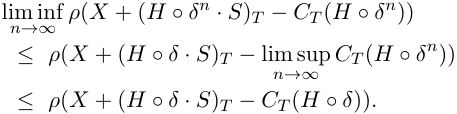

Combining this with (4.3), there exists _n ∈_ N (large enough) such that 

(4.5) _ρ_ ( _X_ + ( _H ◦ δ__n_ _· S_ ) _T − CT_ ( _H ◦ δ__n_ )) _≤ π_ ( _X_ ) + _ε._ 

Since _δ__n_ _∈HM_ for all _M_ large enough, one obtains _π__M_ ( _X_ ) _≤ π_ ( _X_ ) + _ε_ by (4.2) and (4.5), as desired. □ 

4.3. **Numerical solution for OCE-risk measures.** While Theorem 4.2 and Proposition 4.9 give a theoretical justification for using hedging strategies built from neural networks, we now turn to computational considerations: how can we calculate a (close-to) optimal parameter _θ ∈_ Θ _M_ for (4.2)? 

To explain the key ideas we focus on the case when _ρ_ is an OCE risk measure (see (3.5)) and no trading constraints are present, the case of general risk measures is treated below.

<!-- page: 15 -->

Inserting the definition of _ρ_ , see (3.5), into (4.2), the optimization problem can be rewritten as 

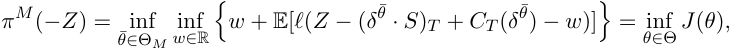

where Θ = R _×_ Θ _M_ and for _θ_ = ( _w, θ_¯ ) _∈_ Θ, 

(4.6) _J_ ( _θ_ ) := _w_ + E[ _ℓ_ ( _Z −_ ( _δθ_ ¯ _· S_ ) _T_ + _CT_ ( _δθ_ ¯) _− w_ )] _._ 

Generally, to find a local minimum of a differentiable function _J_ , one may use a _gradient descent_ algorithm: Starting with an initial guess _θ_(0) , one iteratively 

(4.7) _θ_(_j_+1) = _θ_(_j_) _− ηj∇Jj_ ( _θ_(_j_) ) _,_ 

for some (small) _ηj >_ 0, _j ∈_ N and with _Jj_ = _J_ . Under suitable assumptions on _J_ and the sequence _{ηj}j∈_ N, _θ_(_j_) converges to a local minimum of _J_ as _j →∞_ . Of course, the success and feasibility of this algorithm crucially depends on two points: Firstly, can one avoid finding a local minimum instead of a global one? Secondly, can _∇J_ be calculated efficiently? 

One of the key insights of deep learning is that for cost functions _J_ built based on neural networks both of these problems can be dealt with simultaneously by using a variant of _stochastic gradient descent_ and the _(error) backpropagation_ algorithm. What this means in our context is that in each step _j_ the expectation in (4.6) (which is in fact a weighted sum over all elements of the finite, but potentially very large sample space Ω) is replaced by an expectation over a randomly (uniformly) chosen subset of Ωof size _N_ batch _≪ N_ , so that _Jj_ used in the update (4.7) is now given as 

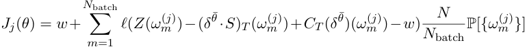

for some _ω_(_j_)Thisisthesimplestformofthe(minibatch) 1_, . . . , ω_ _N_(_j_ batch)_∈_Ω. stochastic gradient algorithm. Not only does it make the gradient computation a lot more efficient (or possible at all, if _N_ is large), but it also avoids getting stuck in local minima: even if _θ_(_j_) arrives at a local minimum at some _j_ , it moves on afterwards (due to the randomness in the gradient). In order to calculate the gradient of _Jj_ for each of the terms in the sum, one may now rely on the compositional structure of neural networks. If _ℓ_ , _c_ and _σ_ are sufficiently differentiable and the derivatives are available in closed form, then one may use the chain rule to calculate the gradient of _F__θ_¯_k_ with respect to _θ_ analytically and the same holds for the gradient of _Jj_ . Furthermore, these analytical expressions can be evaluated very efficiently using the so called backpropagation algorithm (see subsequent section). 

While this certainly answers the second question posed above (efficiency), the first one (local minima) is only partially resolved, as there is no general result guaranteeing convergence to the global minimum in a reasonable amount of time. However, it is common belief that for sufficiently large neural networks, it is possible to arrive at a sufficiently low value of the cost function in a reasonable amount of time, see [IGC16, Chapter 8].

<!-- page: 16 -->

Finally, note that for the experiments in Section 5 below we have used Adam, a more refined version of the stochastic gradient algorithm, as introduced in [KB15] and also discussed in [IGC16, Chapter 8.5.3]. 

_Remark_ 4.10 _._ In the experiments in Section 5 below, the functions _ℓ_ , _c_ and _σ_ are continuous, but have only piecewise continuous derivatives. Nevertheless, similar techniques can be applied. 

_Remark_ 4.11 _._ Numerically, trading constraints can be handled by introducing Lagrange-multipliers or by imposing infinite trading cost outside the allowed trading range. Certain types of constraints can also be dealt with by the choice of activation function: for example, no short-selling constraints can be enforced by choosing a non-negative activation function _σ_ . A systematic numerical treatment will be left for future research. 

4.4. **Certainty Equivalent of Exponential Utility.** The entropic risk measure (3.4) is a special case of an OCE risk measure, as explained in example 3.8. However, when applying the methodology explained in Section 4.3, there is no need to minimize over _w_ : we may directly insert (3.4) into (4.2) to write 

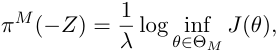

where 

(4.8) _J_ ( _θ_ ) := E[ exp( _−λ_ [ _−Z_ + ( _δ__θ_ _· S_ ) _T − CT_ ( _δ__θ_ )]) ] _._ 

A close-to-optimal _θ ∈_ Θ _M_ can then be found numerically as above. 

4.5. **Extension to general risk measures.** As explained in Section 4.3, for OCE risk measures the optimal hedging problem (4.2) is amenable to deep learning optimization techniques (i.e. variants of stochastic gradient descent) via (4.6). The key ingredient for this is that the objective _J_ satisfies 

- (ML1) the gradient of _J_ decomposes into a sum over the samples, i.e. _∇θJ_ ( _θ_ ) = � _Nm_ =1_∇θJ_(_θ, ωm_)and 

- (ML2) _∇θJ_ ( _θ, ωm_ ) can be calculated efficiently for each _m_ , i.e. using backpropagation. 

The goal of the present section is to show that for a general class of convex risk measures (including all coherent ones) one can approximate (3.1) by a minimax problem over neural networks and that the objective functional of this approximate problem also has these two key properties, making it amenable to deep learning optimization techniques. 

Denote by _P_ the set of probability measures on (Ω _, F_ ). The following result serves as a starting point: 

**Theorem 4.12** (Robust representation of convex risk measures) **.** _Suppose_ 

_ρ_ : _X →_ R _is a convex risk measure. Then ρ can be written as_ 

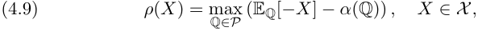

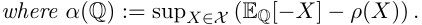

<!-- page: 17 -->

_Proof._ Since for Ωfinite the set of probability measures _P_ coincides with the set of finitely additive, normalized set functions (appearing in [FS16, Theorem 4.16]), the present statement follows directly from the cited theorem and [FS16, Remark 4.17]. □ 

The function _α_ : _P →_ R is called the (minimal) penalty function of the risk measure _ρ_ . 

Since Ωis finite, _P_ can be identified with the standard _N −_ 1 simplex in R_N_ and so (4.9) is an optimization over R_N_ . However, _N_ is very large in our context and so the representation (4.9) is of little use for numerical calculations. The next result shows that _ρ_ ( _X_ ) can be approximated by an optimization problem over a lower-dimensional space. To state it, let us define the set _L ⊂X_ of log-likelihoods by 

_L_ := _{f ∈X_ : E[exp( _f_ )] = 1 _},_ 

define _α_ ¯ : _L →_ R by _α_ ¯( _f_ ) = _α_ (exp( _f_ )dP) for any _f ∈L_ and write _Peq_ for the set of probability measures on (Ω _, F_ ), which are equivalent to P. Furthermore, one may view _I_¯ = ( _I_ 0 _, . . . , In_ ) as a map Ω _→_ R_r_(_n_+1) . 

**Theorem 4.13.** _Suppose_ 

(i) _α_ (Q) _< ∞ for some_ Q _∈Peq,_ 

(ii) _α_ ¯ _is continuous,_ (iii) _F_ = _FT . Then for any X ∈X , ρ_ ( _X_ ) = lim _M →∞ ρ__M_ ( _X_ ) _, where_ 

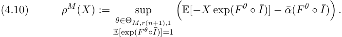

_Proof._ We proceed in two steps. In a first step we show that for any _X ∈X_ one may write 

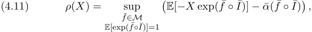

where _M_ denotes the set of measurable functions mapping from R_r_(_n_+1) _→_ R. In the second step we rely on (4.11) to prove the statement. 

_Step 1:_ Since P[ _{ωi}_ ] _>_ 0 for all _i_ , _X_ coincides with _L__∞_ (Ω _, F,_ P) and _ρ_ is law-invariant. Thus by (i) and [FS16, Theorem 4.43] one may write 

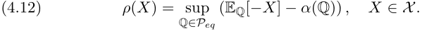

Note that _Peq_ may be written in terms of _L_ as 

(4.13) _Peq_ = _{_ exp( _f_ )dP : _f ∈L} ._ 

Furthermore, using (iii) one obtains 

(4.14) _X_ = _{f_¯ _◦ I_¯ : _f_¯ _∈M}._ 

Combining (4.12), (4.13) and the definition of _α_ ¯ one obtains 

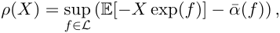

which can be rewritten as (4.11) by using (4.14).

<!-- page: 18 -->

_Step 2:_ Note that one may also write (4.10) as 

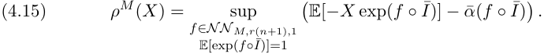

Combining (4.15) with (4.11) and using _NN M,r_ ( _n_ +1) _,_ 1 _⊂NN M_ +1 _,r_ ( _n_ +1) _,_ 1 _⊂ M_ , one obtains that _ρ__M_ ( _X_ ) _≤ ρ__M_+1 ( _X_ ) _≤ ρ_ ( _X_ ) for all _M ∈_ N. Thus it suffices to show that for any _ε >_ 0 there exists _M ∈_ N such that _ρ__M_ ( _X_ ) _≥ ρ_ ( _X_ ) _− ε_ . By (4.11), for any _ε >_ 0 one finds _f_¯ _∈M_ such that 

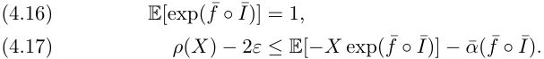

Precisely as in the proof of Proposition 4.9, one may use Theorem 4.2 to find _f_(_n_) _∈NN ∞,r_ ( _n_ +1) _,_ 1 such that P-a.s., _f_(_n_) _◦ I_¯ converges to _f_¯ _◦ I_¯ as _n →∞_ . Combining this with (4.16), one obtains that for all _n_ large enough, _cn_ := log(¯ E¯ [exp( _f_(_n_) _◦ I_¯ )]) is well-defined¯ and that _f_¯(_n_) _◦ I_¯ also converges P-a.s. to _f ◦ I_ , as _n →∞_ , where _f_(_n_) := _f_(_n_) _− cn_ . Using this, (4.17) and assumption (ii), for some (in fact all) _n ∈_ N large enough one obtains 

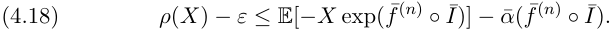

From _NN ∞,r_ ( _n_ +1) _,_ 1 _−cn_ = _NN ∞,r_ ( _n_ +1) _,_ 1 and from the choice of _NN M,r_ ( _n_ +1) _,_ 1, one has _f_¯(_n_) _∈NN M,r_ ( _n_ +1) _,_ 1 for _M_ large enough. By combining this with (4.18) and the choice of _cn_ one obtains 

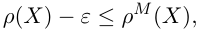

as desired. 

Combining (4.2) and (4.10), one thus approximates (3.1) for _X_ = _−Z_ by solving 

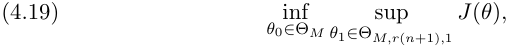

where _θ_ = ( _θ_ 0 _, θ_ 1), 

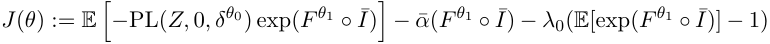

and _λ_ 0 is a Lagrange multiplier. 

We conclude this section by arguing that the objective _J_ in (4.19) indeed satisfies (ML1) and (ML2). This is standard (c.f. Section 4.3) for all terms in the sum except for _α_ ¯( _F__θ_1 _◦ I_¯ ) and so we only consider this term. 

Recall that Ωis finite and consists of _N_ elements, thus _X_ = _{X_ : Ω _→_ R _}_ can be identified with R_N_ . As for standard backpropagation the compositional structure can be used for efficient computation: 

**Proposition 4.14.** _Suppose α_ ¯ _can be extended to α_ ¯ : _X →_ R _continuously differentiable, σ is continuously differentiable and NN M,r_ ( _n_ +1) _,_ 1 _is the set of neural networks with a fixed architecture (see Remark 4.3). Then J_ ( _θ_ 1) := _α_ ¯( _F__θ_1 _◦ I_¯ ) _, θ_ 1 _∈_ Θ _M,r_ ( _n_ +1) _,_ 1 _is continuously differentiable and satisfies (ML1)._

<!-- page: 19 -->

_Proof._ Note that _F_ = _F__θ_1 is parametrized by the matrices _A__ℓ_ and vectors _b__ℓ_ , _ℓ_ = 1 _, . . . , L_ , and that one may consider all partial derivatives separately. Given _α_ ¯ : _X →_ R and _∇α_ ¯ : _X →X_ , one thus aims at calculating _∂Aℓi,j__α_¯(_F◦I_¯) and _∂bℓi__α_¯(_F◦I_¯)for_ℓ_=1_, . . . , L, i_=1_, . . . , Nℓ, j_=1_, . . . , Nℓ−_1.Thiscanbe done by the chain rule: For _θ ∈{A__ℓ_ _i,j__, b_ _i__ℓ}_,onehas 

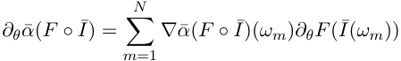

and in particular (ML1) holds. □ 

Furthermore, in the notation of the proof, for any _m_ = 1 _, . . . N_ the derivative _∂θF_ ( _I_¯ ( _ωm_ )) can be calculated using standard backpropagation algorithm (preceded by a forward iteration) and so (ML2) holds as well. For the reader’s convenience we state it here: One sets _x_0 = _I_¯ ( _ωm_ ), iteratively calculates _x__ℓ_ := _Fℓ_ ( _x__ℓ−_1 ) for _ℓ_ = 1 _, . . . , L−_ 1 and _x__L_ := _WL_ ( _x__L−_1 ). Then (this is the backward pass) one sets _J__L_ := _A__L_ and calculates iteratively _J__ℓ_ = _J__ℓ_+1 _dFℓ_ ( _x__ℓ−_1 ) for _ℓ_ = _L −_ 1 _, . . . ,_ 1, where 

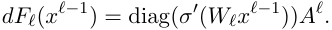

From this one may use again the chain rule to obtain for any _ℓ_ = 1 _, . . . L, i_ = 1 _, . . . , Nℓ, j_ = 1 _, . . . , Nℓ−_ 1 the derivatives of _F_ with respect to the parameters as 

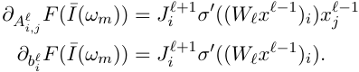

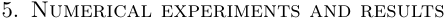

After having introduced the optimal hedging problem (3.1) in Section 3 and described in Section 4 how one may numerically approximate the solution by (4.2) using neural networks, we now turn to numerical experiments to illustrate the feasibility of the approach. We start by explaining in Section 5.1 the modeling choices in detail. The remainder of this section will then be devoted to examining the following three questions: 

- Section 5.2: How does neural network hedging (for different risk-preferences) compare to the benchmark in a Heston model without transaction costs? 

- Section 5.3: What is the effect of proportional transaction costs on the exponential utility indifference price? 

- Section 5.4: Is the numerical method scalable to higher dimensions? 

5.1. **Setting and Implementation.** For the results presented here we have chosen a time horizon of 30 trading days with daily rebalancing. Thus, _T_ = 30 _/_ 365, _n_ = 30 and the trading dates are _ti_ = _i/_ 365, _i_ = 0 _, . . . , n_ . As explained in Section 4 and Remark 4.6, the number of units _δti ∈_ R_d_ that the agent decides to hold in each of the instruments at _ti_ is parametrized by a semi-recurrent neural network: we set _δk__θ_=_F θk_(_Ik, δ_ _k__θ_ _−_ 1)where_F θk_isafeed forward neural network with two hidden layers and _Ik_ = Φ( _S_ 0 _, . . . , Sk_ ) for

<!-- page: 20 -->

some Φ: R(_k_+1)_d_ _→_ R_d_ specified below. More precisely, in the notation of Definition 4.1, _F__θk_ is a neural network with _L_ = 3, _N_ 0 = 2 _d_ , _N_ 1 = _N_ 2 = _d_ + 15, _N_ 3 = _d_ and the activation function is always chosen as _σ_ ( _x_ ) = max( _x,_ 0). The weight matrices and biases are the parameters to be optimized in (4.2). Note that these are for each _k_ . 

Having made these choices, the algorithm outlined in Section 4 can now be used for approximate hedging _in any market situation_ : given sample trajectories of the hedging instruments _S_ ( _ωm_ ), samples of the payoff _Z_ ( _ωm_ ) and associated weights P[ _{ωm}_ ] for _m_ = 1 _, . . . , N_ (on a finite probability space Ω= _{ω_ 1 _, . . . , ωN }_ ), for any choice of transaction cost structure _c_ and any risk measure _ρ_ one may now use the algorithm outlined in Section 4 to calculate close-to optimal hedging strategies and approximate minimal prices. Of course, for a path-dependent derivative with payoff _Z_ = _G_ ( _S_ 0 _, . . . , ST_ ) with _G_ : (R_d_ )_n_+1 _→_ R one obtains samples of the payoff by simply evaluating _G_ on the sample trajectories of _S_ . 

Different risk measures _ρ_ , transaction cost functions _c_ and payoffs _Z_ will be used in the examples and so these are described separately in each of the subsequent sections. To illustrate the feasibility of the algorithm and have a benchmark at hand for comparison (at least in the absence of transaction costs), we have chosen to generate the sample paths of _S_ from a standard stochastic volatility model under a risk-neutral measure P. Thus in most of the examples below, the process _S_ follows (a discretization of) a Heston model, see the beginning of Section 5.2 below. But we stress again that, as explained above, the algorithm is _model independent_ in the sense that no information about the Heston model is used except for the (weighted) samples of the price and variance process. 

The algorithm has been implemented in Python, using Tensorflow to build and train the neural networks. To allow for a larger learning rate, the technique of batch normalization (see [IS15] and [IGC16, Chapter 8.7.1]) is used in each layer of each network right before applying the activation function. The network parameters are initialized randomly (drawn from uniform and normal distribution). For network training the Adam algorithm (see [KB15], [IGC16, Chapter 8.5.3]) with a learning rate of 0 _._ 005 and a batch size of 256 has been used. Finally, the model hedge for the benchmark in Section 5.2 has been calculated using Quantlib. 

_Remark_ 5.1 _._ For the numerical experiments in this article the optimality criteria in (4.6) and (4.8) are specified under a risk-neutral measure. Thus, an optimal hedging strategy is based on market anticipations of future prices. Alternatively, one could use a statistical measure. The algorithm presented here can be applied also in this case. 

5.2. **Benchmark: No transaction costs.** As a first example, we consider hedging without transaction costs in a Heston model. In this example the risk measure _ρ_ is chosen as the average value at risk (also called conditional value at risk or expected shortfall), defined for any random variable _X_ by 

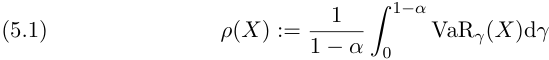

<!-- page: 21 -->

for some _α ∈_ [0 _,_ 1), where VaR _γ_ ( _X_ ) := inf _{m ∈_ R : P( _X < −m_ ) _≤ γ}_ . An alternative representation of _ρ_ of type (3.5) is discussed in Example 3.9. We refer to [FS16, Section 4.4] for further details. Note that different levels of _α_ correspond to different levels of risk-aversion, ranging from risk-neutral for _α_ close to 0 to very risk-averse for _α_ close to 1. The limiting cases are _ρ_ ( _X_ ) = _−_ E[ _X_ ] for _α_ = 0 and lim _α↑_ 1 _ρ_ ( _X_ ) = _−_ essinf( _X_ ), see [FS16, p.234 and Remark 4.50]. 

_A brief reminder on the Heston model._ Recall that a Heston model is specified by the stochastic differential equations 

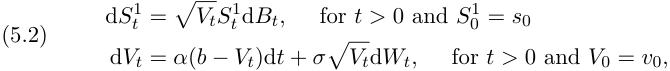

where _B_ and _W_ are one-dimensional Brownian motions (under a probability measure Q) with correlation _ρ ∈_ [ _−_ 1 _,_ 1] and _α_ , _b_ , _σ_ , _v_ 0 and _s_ 0 are positive constants. Below we have chosen _α_ = 1, _b_ = 0 _._ 04, _ρ_ = _−_ 0 _._ 7, _σ_ = 2, _v_ 0 = 0 _._ 04 and _s_ 0 = 100, reflecting a typical situation in an equity market. 

Here _S_1 is the price of a liquidly tradeable asset and _V_ is the (stochastic) variance process of _S_1 , modeled by a Cox-Ingersoll-Ross (CIR) process. _V_ itself is not tradable directly, but only through options on variance. In our framework this is modeled by an idealized variance swap with maturity _T_ , i.e. we set _Ft__H_ := _σ_ (( _Ss_1_, Vs_):_s ∈_[0_, t_])and 

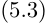

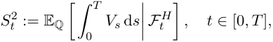

and consider ( _S_1 _, S_2 ) as the prices of liquidly tradeable assets. A standard calculation4 shows that (5.3) is given as 

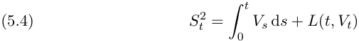

where 

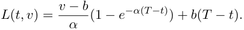

Consider now a European option with payoff _g_ ( _ST_1) at_T_for some_g_:R_→_R. Its price (under Q) at _t ∈_ [0 _, T_ ] is given as _Ht_ := EQ[ _g_ ( _ST_1)_|F_ _t__H_]. By the Markov property of ( _S_1 _, V_ ), one may write the option price at _t_ as _Ht_ = _u_ ( _t, St_1_, Vt_) for some _u_ : [0 _, T_ ] _×_ [0 _, ∞_ )2 _→_ R. Assuming that _u_ is sufficiently smooth, one may apply Itˆo’s formula to _H_ and use (5.4) to obtain 

> 4For example, one may use that (log( _S_ 1) _, V_ ) is an affine process to see that the conditional expectation in (5.3) can be taken only with respect to _σ_ ( _Vt, s ∈_ [0 _, t_ ]). This conditional expectation can then be calculated by using the SDE for _V_ or by directly inserting the expression from e.g. [Duf01, Section 3].

<!-- page: 22 -->

Thus, if continuous-time trading was possible, (5.5) shows that the option payoff can be replicated perfectly by trading in ( _S_1 _, S_2 ) according to the strategy (5.6). 

_Remark_ 5.2 _._ The strategy (5.6) depends on _Vt_ . Although not observable di- _t_ rectly, an estimate can be obtained by estimating �0_Vs_d_s_andsolving(5.4) for _Vt_ . 

_Setting: Discretized Heston model._ In addition to the setting explained in detail in Section 5.1, here we set _d_ = 2, consider no transaction costs (i.e. _CT ≡_ 0) and generate sample trajectories of the price process of the hedging instruments from a discretely sampled Heston model. Thus, _S_ = ( _S_ 0 _, . . . , Sn_ ) and for any _k_ = 0 _, . . . , n_ , _Sk_ = ( _Sk_1_, S_ _k_2)isgivenby(5.2)and(5.4)underQ.Thesam- ple paths of _S_ are generated by (exact) sampling from the transition density of the CIR process (see [Gla04, Section 3.4]) and then using the (simplified) Brodie-Kaya scheme (see [LBAK10] and [BK06]).5 Generating independent samples of _S_ according to this scheme can now be viewed as sampling from a uniform distribution on a (huge) finite probability space Ω.6 Thus, in the notation of Section 5.1 one has P[ _{ωm}_ ] = 1 _/N_ for all _m_ = 1 _, . . . , N_ with each _S_ ( _ωm_ ) corresponding to a sample of the Heston model generated as explained above. 

If continuous-time trading was possible, any European option could be replicated perfectly by following the strategy (5.6). However, in the present setup the hedging portfolio can only be adjusted at discrete time-points. Nevertheless one may choose _δk__H_:= (_δ_ _k_1_, δ_ _k_2) for_k_= 0_. . . n−_1 with_δ_1_, δ_2 defined by (5.6) and charge the risk-neutral price _q_ . This will be referred to as the model-delta hedging strategy (or simply model hedge) and serves as a benchmark. Finally, in order to compare the neural network strategies to this benchmark, the network input is chosen as _Ik_ = (log( _Sk_1)_, Vk_).Onecouldalsore- place _Vk_ by _Sk_2instead.Thenetworkstructureattime-step_tk_isillustratedin Figure 1. 

_Results._ We now compare the model hedge _δ__H_ to the deep hedging strategies _δ__θ_ corresponding to different risk-preferences, captured by different levels of _α_ in the average value at risk (5.1). 

As a first example, consider a European call option, i.e. _Z_ = ( _ST_1_−K_)+ with _K_ = _s_ 0. Following the methodology outlined in Section 5.1, we calculate a (close-to) optimal parameter _θ_ for (4.2) with _X_ = _−Z_ and denote by _δ__θ_ and _p__θ_ 0the(close-to)optimalhedgingstrategyandvalueof(4.2),respec- tively. By definition of the indifference price (3.2), the approximation property Proposition 4.9, Proposition 3.10 and _ρ_ (0) = 0, _p__θ_ 0isanapproximationtothe indifference price _p_ ( _Z_ ). As an out-of-sample test, one can then simulate another set of sample trajectories (here 106 ) and evaluate the terminal hedging errors _q − Z_ +( _δ__H_ _· S_ ) _T_ (model hedge) and _p__θ_ 0_−Z_+(_δθ ·S_)_T_(CVar) on each of them. In fact, since the risk-adjusted price _p__θ_ 0ishigherthantherisk-neutral 

> 5This corresponds to replacing _V_ in the SDE for _S_ 1 in (5.2) by a piecewise constant process and the integral in (5.4) by a sum. 

> 6To be more precise, one replaces the normal distributions appearing in the simulation scheme for _S_ by (arbitrarily fine) discrete distributions.

<!-- page: 23 -->

<!-- Start of picture text -->
DEEP HEDGING 23 Input Hidden Hidden Output layer layer layer layer at ti I at ti II at ti at ti log( sti ) vti δt ( i s ) Input layer at ti +1 δt ( i s ) Input layer at ti +1 Output layer at ti− 1 δt ( i s − ) 1 Output layer at ti− 1 δt ( i v − ) 1 <!-- End of picture text -->

Figure 1. Recurrent network structure 

price _q_ = 1 _._ 69 (as shown in Proposition 3.10(ii)), for (CVar) we have evaluated _q − Z_ + ( _δ__θ_ _· S_ ) _T_ , i.e. the hedging error from using the optimal strategy associated to _ρ_ , but only charging the risk-neutral price _q_ . This is shown in a histogram in Figure 2 for _α_ = 0 _._ 5, yielding a risk-adjusted price _p__θ_ 0= 1_._94.As one can see, the hedging performance of _δ__H_ and _δ__θ_ is very similar. In particular 

- for this choice of risk-preferences ( _ρ_ as in (5.1) with _α_ = 0 _._ 5) the optimal strategy in (3.1) is close to the model hedge _δ__H_ , 

- the neural network strategy _δ__θ_ is able to approximate well the optimal strategy in (3.1). 

This is also illustrated by Figure 3, where the strategies _δt__θ_and_δ_ _t__H_ at a fixed time-point _t_ are plotted conditional on ( _St_1_, Vt_)=(_s, v_)onagridofvalues for ( _s, v_ ). To make this last comparison fully sensible instead of the recurrent network structure _δk__θ_=_F θk_(_Ik, δ_ _k__θ_ _−_ 1)hereasimplerstructure_δ_ _k__θ_=_F θk_(_Ik_) is used. The hedging performance for this simpler structure is, however, very similar, see Figure 4. Of course, this is also expected from (5.6).7 

A more extreme case is shown in Figure 6, where instead of the model hedge the 99%-CVar criterion is used, i.e. _α_ = 0 _._ 99. This results in a significantly higher risk-adjusted price _p__θ_ 0=3_._49.Ifboththe50%and99%-CVaroptimal strategies are used, but only the risk-neutral price is charged (see Figure 7) one can clearly see the risk preferences: the 50%-CVar strategy is more centered at 0 and also has a smaller mean hedging error, but the 99%-expected shortfall 

> 7For non-zero transaction costs this is not true anymore, i.e. the recurrent network structure is needed. For example, Figure 5 is generated for precisely the same parameters as Figure 4, except that _α_ = 0 _._ 99 and proportional transaction costs are incurred, i.e. (5.7) with _ε_ = 0 _._ 01.

<!-- page: 24 -->

### BUEHLER, GONON, TEICHMANN, AND WOOD 

<!-- Start of picture text -->
35000 0.5-CVar 30000 Model hedge 25000 20000 15000 10000 5000 0 3 2 1 0 1 2 3 <!-- End of picture text -->

Figure 2. Comparison of model hedge and deep hedge associated to 50%-expected shortfall criterion. 

<!-- Start of picture text -->
Network Delta Model Delta 0.8 0.8 0.7 0.6 0.6 0.5 0.4 0.4 0.3 0.2 0.2 0.1 0.100.120.14 0.100.120.14 96 98 100 102 0.040.060.08 96 98 100 102 0.040.060.08 Difference 0.04 0.02 0.00 0.02 0.04 0.06 0.08 0.10 0.100.120.14 96 98 100 102 0.040.060.08 <!-- End of picture text -->

Figure 3. _δt__H,_(1) and neural network approximation as a function of ( _st, vt_ ) for _t_ = 15 days 

strategy yields smaller extreme losses (c.f. also the realized 99%-CVar _loss_ value realized on the test sample, shown in the table below Figure 7). 

To further illustrate the implications of risk-preferences on hedging, as a last example we consider selling a call-spread, i.e. _Z_ = [( _ST_1_−K_1)+_−_(_S_ _T_1_−_ _K_ 2)+ ] _/_ ( _K_ 2 _− K_ 1) for _K_ 1 _< K_ 2. Here we have chosen _K_ 1 = _s_ 0, _K_ 2 = 101. Proceeding as above, we compare the model hedge to the more risk-averse hedging strategies associated to _α_ = 0 _._ 95 and _α_ = 0 _._ 99. The strategies (on a grid of values for spot and variance) are shown in Figures 8 and 9. The model hedge would again correspond to _α_ = 0 _._ 5. As one can see for higher levels of risk-aversion, the strategy flattens. From a practical perspective, this precisely corresponds to a barrier shift, i.e. a more risk-averse hedge for a call spread

<!-- page: 25 -->

<!-- Start of picture text -->
30000 recurrent simpler 25000 20000 15000 10000 5000 0 3 2 1 0 1 2 3 <!-- End of picture text -->

Figure 4. Comparison of recurrent and simpler network structure (no transaction costs). 

<!-- Start of picture text -->
16000 recurrent 14000 simpler 12000 10000 8000 6000 4000 2000 0 1 0 1 2 3 4 5 6 Mean Loss Price Realized CVar recurrent 0.0018 5.5137 -0.0022 simpler 0.0022 6.7446 -0.0 <!-- End of picture text -->

Figure 5. Network architecture matters: Comparison of recurrent and simpler network structure (with transaction costs and 99%-CVar criterion).

<!-- page: 26 -->

BUEHLER, GONON, TEICHMANN, AND WOOD 

<!-- Start of picture text -->
30000 0.99-CVar 0.5-CVar 25000 20000 15000 10000 5000 0 3 2 1 0 1 2 3 <!-- End of picture text -->

Figure 6. Comparison of 99%-CVar and 50%-CVar optimiality criterion. 

<!-- Start of picture text -->
0.99-CVar 25000 0.5-CVar 20000 15000 10000 5000 0 3 2 1 0 1 2 Mean Loss Realized 0.5-CVar Realized 0.99-CVar 0.99-CVar 0.2635 0.527 1.8034 0.5-CVar 0.1514 0.2531 2.3631 <!-- End of picture text -->

Figure 7. Comparison of 99%-CVar and 50%-CVar optimiality criterion, normalized to risk-neutral price. 

with strikes _K_ 1 and _K_ 2 actually aims at hedging a spread with strikes _K_˜ 1 and _K_ 2 for _K_˜ 1 _< K_ 1. 

5.3. **Price asymptotics under proportional transaction costs.** In Section 5.2 we have seen that in a market without transaction costs, deep hedging is able to recover the model hedge and can be used to calculate risk-adjusted optimal hedging strategies.

<!-- page: 27 -->

<!-- Start of picture text -->
Spread Delta Model Delta 0.160.18 0.25 0.14 0.20 0.100.12 0.15 0.08 0.10 0.040.06 0.05 0.100.120.14 0.100.120.14 96 98 100 102 0.040.060.08 96 98 100 102 0.040.060.08 Difference 0.04 0.02 0.00 0.02 0.04 0.06 0.08 0.100.120.14 96 98 100 102 0.040.060.08 <!-- End of picture text -->

Figure 8. Call spread _δt__H,_(1) and neural network approximation as a function of ( _st, vt_ ) for _t_ = 15 days 

<!-- Start of picture text -->
Spread Delta Model Delta 0.14 0.25 0.100.12 0.20 0.08 0.15 0.06 0.10 0.04 0.05 0.02 0.100.120.14 0.100.120.14 96 98 100 102 0.040.060.08 96 98 100 102 0.040.060.08 Difference 0.050 0.025 0.000 0.025 0.050 0.075 0.100 0.125 0.100.120.14 96 98 100 102 0.040.060.08 <!-- End of picture text -->

Figure 9. Call spread _δt__H,_(1) and neural network approximation as a function of ( _st, vt_ ) for _t_ = 15 days 

The goal of this section is to illustrate the power of the methodology by numerically calculating the indifference price (3.2) in a multi-asset market with transaction costs. 

So far, this has been regarded a highly challenging problem, see e.g. the introduction of [KMK15]. For example, calculating the exponential utility indifference price for a call option in a Black-Scholes model involves solving a multidimensional nonlinear free boundary problem, see e.g. [HN89], [MHADZ93]. Motivated by this [WW97] have studied asymptotically optimal strategies and price asymptotics for small proportional transaction costs, i.e. for 

and as _ε ↓_ 0. One of the results in the asymptotic analysis is that 

(5.8) _pε − p_ 0 = _O_ ( _ε_2_/_3 ) _,_ as _ε ↓_ 0 _,_

<!-- page: 28 -->

where _pε_ = _pε_ ( _Z_ ) is the utility indifference price of _Z_ associated to transaction costs of size _ε_ . In fact (5.8) is true in more general one-dimensional models, see [KMK15], and the rate 2 _/_ 3 also emerges in a variety of related problems with proportional transaction costs, see e.g. [Rog04], [JMKS17] and the references therein. 

Here we numerically verify (5.8) using the deep hedging algorithm, first for a Black-Scholes model (for which (5.8) is known to hold) and then for a Heston model (with _d_ = 2 hedging instruments). For this latter case (or any other model with _d >_ 1) there have been neither numerical nor theoretical results on (5.8) previously in the literature. 

_Black-Scholes model._ Consider first _d_ = 1 and _St_ = _s_ 0 exp( _−tσ_2 _/_ 2 + _σWt_ ), where _σ >_ 0 and _W_ is a one-dimensional Brownian motion. We choose _σ_ = 0 _._ 2, _s_ 0 = 100 and use the explicit form of _S_ to generate sample trajectories. Setting _Ik_ = log( _Sk_ ) and proceeding precisely as in the Heston case (see Sections 5.1 and 5.2), we may use the deep hedging algorithm to calculate the exponential utility indifference price _pε_ for different values of _ε_ . Recall that we choose proportional transaction costs (5.7) and _ρ_ is the entropic risk measure (3.4) (see Lemma 3.6). For the numerical example we take _λ_ = 1 and _Z_ = ( _ST −K_ )+ with _K_ = _s_ 0 and we calculate _pεi_ for _εi_ = 2_−i_+5 , _i_ = 1 _, . . . ,_ 5. 

Figure 10 shows the pairs (log( _εi_ ) _,_ log( _pεi − p_ 0)) (in red) and the closest (in squared distance) straight line with slope 2 _/_ 3 (in blue). Thus, in this range of _ε_ the relation log( _pε − p_ 0) = 2 _/_ 3 log( _ε_ ) + _C_ for some _C ∈_ R indeed holds true and hence also (5.8). 

Note that trading is only possible at discrete time-points and so the indifference price and the risk-neutral price do not coincide. Since (5.8) is a result for continuous-time trading (where _q_ = _p_ 0), we have compared to the risk-neutral price _q_ here (thus neglecting the discrete-time friction in _pε_ for _ε >_ 0). 

_Heston model._ We now consider a Heston model with two hedging instruments, i.e. _d_ = 2 and the setting is precisely as in Section 5.2, except that here _ρ_ is chosen as (3.4) and proportional transaction costs (5.7) are incurred. Choosing _λ_ = 1, _Z_ = ( _ST_1_−K_)+and_εi_as in the Black-Scholes case above, one can again calculate the exponential utility indifference prices and show the difference to _p_ 0 in a log-log plot (see above) in a graph. These are shown as red dots in Figure 11. Here the blue line in Figure 11 is the regression line, i.e. the least squares fit of the red dots. The rate is very close to 2 _/_ 3 and so it appears that the relation (5.8) also holds in this case. 

5.4. **High-dimensional example.** As a last example consider a model built from 5 separate Heston models, i.e. _d_ = 10 and ( _S__h_ _, S__h_+1 ) is the price process of spot and variance swap in a Heston model (specified by (5.2) and (5.4)) for _h_ = 1 _, . . . ,_ 5. To have a benchmark at hand the 5 models are assumed independent and each of them has parameters as specified in Section 5.2. This choice is of course no restriction for the algorithm and is only made for convenience. The payoff is a sum of call options on each of the underlyings, i.e. _Z_ =�5 _h_ =1_Zh_with_Zh_= (_S_ _T_2_h−_1 _− K_ )+ and _K_ = _s_ 0 = 100. In a market with continuous-time trading and no transaction costs, _Z_ can be replicated perfectly by trading according to strategy (5.6) in each of the models. In particular, this

<!-- page: 29 -->

<!-- Start of picture text -->
Rate of convergence is 0.67 0.50 0.25 0.00 0.25 0.50 0.75 1.00 1.25 7.0 6.5 6.0 5.5 5.0 4.5 log( ) ) 0 p p log( <!-- End of picture text -->

Figure 10. Black-Scholes model price asymptotics. 

<!-- Start of picture text -->
Rate of convergence is 0.71 0.50 0.25 0.00 0.25 0.50 0.75 1.00 1.25 1.50 7.0 6.5 6.0 5.5 5.0 4.5 log( ) ) 0 p p log( <!-- End of picture text -->

Figure 11. Heston model price asymptotics 

strategy is decoupled, i.e. the optimal holdings in ( _S__h_ _, S__h_+1 ) only depend on ( _S_(_h_) _, S_(_h_+1) ). While in the present setup trading is only possible at discrete time steps and so the strategy optimizing (3.1), where _X_ = _−Z_ , leads to a nondeterministic terminal hedging error (2.1), by independence one still expects that the optimal strategy is decoupled as above, at least for certain classes of risk measures. To see this most prominently, here we consider _variance_

<!-- page: 30 -->

_optimal hedging_ : the objective is chosen as (3.3) for _ℓ_ ( _x_ ) = _x_2 and _p_ 0 = 5 _q_ , where _q_ = E[ _Z_ 1]. 

Let _δ ∈H_ and write _δ_(2_h−_1:2_h_) := ( _δ_2_h−_1 _, δ_2_h_ ) for _h_ = 1 _, . . . ,_ 5 (and analogously for _S_ ). If _δ_ is decoupled, i.e. such that _δ_(2_h−_1:2_h_) is independent of _S_(2_j−_1:2_j_) for _j_ = _h_ , then by independence and since _S_ is a martingale one has 

By building _δ_ from the (discrete-time) variance optimal strategies for each of the 5 models, one sees from (5.9) that the minimal value of (3.3) over _all δ ∈H_ is at most 5 times the minimal value of (3.3) associated to a single Heston model. This consideration serves as a guideline for assessing the approximation quality of the neural network strategy. 

To assess the scalability of the algorithm, we now calculate the close-tooptimal neural network hedging strategy associated to (3.3) in both instances (i.e. for _nH_ = 5 models and for a single one, _nH_ = 1) and compare the results. Unless specified otherwise, the parameters are as in Section 5.1. Since for _nH_ = 5 we are actually solving 5 problems at once, we allow for a network with more hidden nodes by taking _N_ 1 = _N_ 2 = 12 _nH_ . We then train both networks for a fixed number of time-steps (here 2 _×_ 105 ) and measure the performance in terms of both training time and realized loss (evaluated on a test set of _nH ×_ 105 sample paths): the training times on a standard Lenovo X1 Carbon laptop are 5 _._ 75 and 2 _._ 1 hours for _nH_ = 5 and _nH_ = 1, respectively and the realized losses are 1 _._ 13 and 0 _._ 20. In view of the considerations above, this indicates that the approximation quality is roughly the same for both instances (and close-to-optimal). 

While far from a systematic study, this last example nevertheless demonstrates the potential of the algorithm for high-dimensional hedging problems. 

# 6. Disclaimer 

Opinions and estimates constitute our judgement as of the date of this Material, are for informational purposes only and are subject to change without notice. This Material is not the product of J.P. Morgans Research Department and therefore, has not been prepared in accordance with legal requirements to promote the independence of research, including but not limited to, the prohibition on the dealing ahead of the dissemination of investment research. This Material is not intended as research, a recommendation, advice, offer or solicitation for the purchase or sale of any financial product or service, or to be used in any way for evaluating the merits of participating in any transaction. It is not a research report and is not intended as such. Past performance is not indicative of future results. Please consult your own advisors regarding legal, tax, accounting or any other aspects including suitability implications for your particular circumstances. J.P. Morgan disclaims any responsibility or liability whatsoever for the quality, accuracy or completeness of the information herein, and for any reliance on, or use of this material in any way. Important disclosures at: www.jpmorgan.com/disclosures 

# References 

> [BK06] M. Broadie and O.¨ Kaya, _Exact simulation of stochastic volatility and other affine jump diffusion processes_ , Operations Research **54** (2006), no. 2, 217– 231.

<!-- page: 31 -->

- [BR06] C. Burgert and L. R¨uschendorf, _Consistent risk measures for portfolio vectors_ , Insurance: Mathematics and Economics (2006), 289–297. 

- [BTT07] A. Ben-Tal and M. Teboulle, _An old-new concept of convex risk measures: the optimized certainty equivalent_ , Mathematical Finance **17** (2007), no. 3, 449– 476. 

- [Duf01] D. Dufresne, _The integrated square-root process_ , Centre for Actuarial Studies, University of Melbourne, 2001, Research Paper no. 90. 

- [Dup94] B. Dupire, _Pricing with a smile_ , Risk **7** (1994), 18–20. 

- [DZL09] X. Du, J. Zhai, and K. Lv, _Algorithm trading using q-learning and recurrent reinforcement learning_ , arxiv (2009), https://arxiv.org/pdf/1707.07338.pdf. 

- [FL00] H. F¨ollmer and P. Leukert, _Efficient hedging: Cost versus shortfall risk_ , Finance and Stochastics **4** (2000), 117–146. 

- [FS16] H. F¨ollmer and A. Schied, _Stochastic finance: An introduction in discrete time_ , De Gruyter, 2016. 

- [Gla04] P. Glasserman, _Monte carlo methods in financial engineering_ , Applications of mathematics : stochastic modelling and applied probability, Springer, 2004. 

- [GS13] J. Gatheral and A. Schied, _Dynamical models of market impact and algorithms for order execution_ , Handbook on Systemic Risk (2013), 579–599. 

- [Hal17] I. Halperin, _Qlbs: Q-learner in the black-scholes (-merton) worlds_ , arxiv (2017), https://arxiv.org/abs/1712.04609. 

- [HBP17] G. Kutyniok, H. B¨olcskei, P. Grohs and P. Petersen, _Optimal approximation with sparsely connected deep neural networks_ , Preprint arXiv:1705.01714 (2017). 

- [HMSC95] S. E. Shreve, H. M. Soner and J. Cvitani´c, _There is no nontrivial hedging portfolio for option pricing with transaction costs_ , The Annals of Applied Probability **5** (1995), no. 2, 327–355. 

- [HN89] S. Hodges and A. Neuberger, _Optimal replication of contingent claims under transaction costs_ , The Review of Futures Markets **8** (1989), no. 2, 222–239. 

- [Hor91] K. Hornik, _Approximation capabilities of multilayer feedforward networks_ , Neural Networks **4** (1991), no. 2, 251–257. 

- [IAR09] M. Jonsson, A. Ilhan˙ and R. Sircar, _Optimal static-dynamic hedges for exotic options under convex risk measures_ , Stochastic Processes and their Applications **119** (2009), no. 10, 3608 – 3632. 

- [IGC16] Y. Bengio, I. Goodfellow and A. Courville, _Deep learning_ , MIT Press, 2016, http://www.deeplearningbook.org. 

- [IS15] S. Ioffe and C. Szegedy, _Batch normalization: Accelerating deep network training by reducing internal covariate shift_ , Proceedings of the 32nd International Conference on Machine Learning, 2015, pp. 448–456. 

- [JMKS17] M. Reppen, J. Muhle-Karbe and H. M. Soner, _A primer on portfolio choice with small transaction costs_ , Annual Review of Financial Economics **9** (2017), no. 1, 301–331. 

- [KB15] D. P. Kingma and J. Ba, _Adam: a method for stochastic optimization_ , Proceedings of the International Conference on Learning Representations (ICLR) (2015). 

- [KMK15] J. Kallsen and J. Muhle-Karbe, _Option pricing and hedging with small transaction costs_ , Mathematical Finance **25** (2015), no. 4, 702–723. 

- [KS07] S. Kl¨oppel and M. Schweizer, _Dynamic indifference valuation via convex risk measures_ , Mathematical Finance **17** (2007), no. 4, 599–627. 

- [LBAK10] P. J¨ackel, L. B. G. Andersen and C. Kahl, _Simulation of square-root processes_ , Encyclopedia of Quantitative Finance, John Wiley & Sons, Ltd, 2010. 

- [Lu17] D. Lu, _Agent inspired trading using recurrent reinforcement learning and lstm neural networks_ , arxiv (2017), https://arxiv.org/pdf/1707.07338.pdf. 

- [MHADZ93] V. G. Panas, M. H. A. Davis and T. Zariphopoulou, _European option pricing with transaction costs_ , SIAM Journal on Control and Optimization **31** (1993), no. 2, 470–493.

<!-- page: 32 -->

- [MW97] J. Moody and L. Wu, _Optimization of trading systems and portfolios_ , Proceedings of the IEEE/IAFE 1997 Computational Intelligence for Financial Engineering (CIFEr) (1997), 300–307. 

- [PBV17] H. M. Soner, P. Bank and M. Voß, _Hedging with temporary price impact_ , Mathematics and Financial Economics **11** (2017), no. 2, 215–239. 

- [Rog04] L. C. G. Rogers, _Why is the effect of proportional transaction costs O_ ( _δ_2_/_3 ), Mathematics of Finance (G. Yin and Q. Zhang, eds.), American Mathematical Society, Providence, RI, 2004, pp. 303–308. 

- [RS10] L. C. G. Rogers and S. Singh, _The cost of illiquidity and its effects on hedging_ , Mathematical Finance **20** (2010), no. 4, 597–615. 

- [WW97] A. E. Whalley and P. Wilmott, _An asymptotic analysis of an optimal hedging model for option pricing with transaction costs_ , Mathematical Finance **7** (1997), no. 3, 307–324. 

- [Xu06] M. Xu, _Risk measure pricing and hedging in incomplete markets_ , Annals of Finance **2** (2006), no. 1, 51–71. 

- [ZJL17] D. Xu, Z. Jiang and J. Liang, _A deep reinforcement learning framework for the financial portfolio management problem_ , arxiv (2017), https://arxiv.org/abs/1706.10059. 

Hans B¨uhler, J.P. Morgan, London _E-mail address_ : `hans.buehler@jpmorgan.com` 

Lukas Gonon, Eidgen¨ossische Technische Hochschule Z¨urich, Switzerland _E-mail address_ : `lukas.gonon@math.ethz.ch` 

Josef Teichmann, Eidgen¨ossische Technische Hochschule Z¨urich, Switzerland _E-mail address_ : `josef.teichmann@math.ethz.ch` 

Ben Wood, J.P. Morgan, London _E-mail address_ : `ben.wood@jpmorgan.com`
