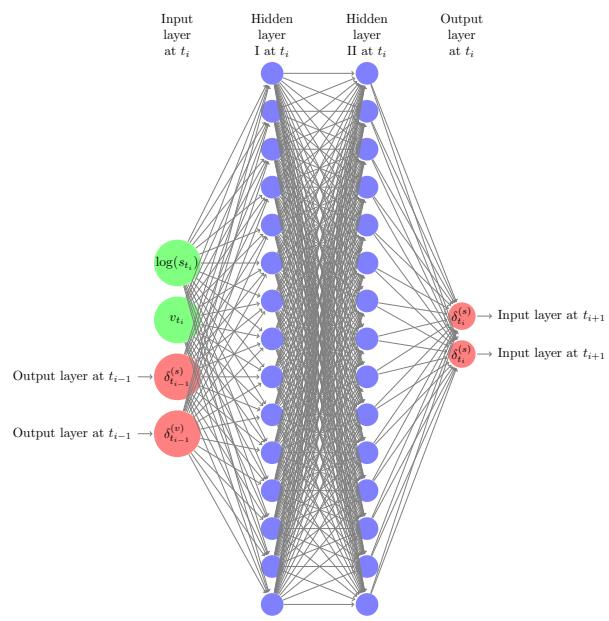
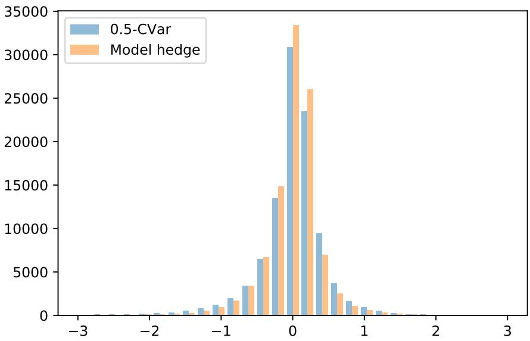
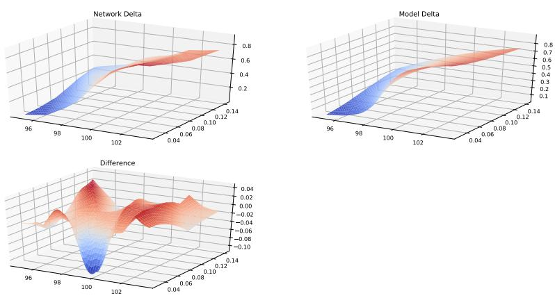
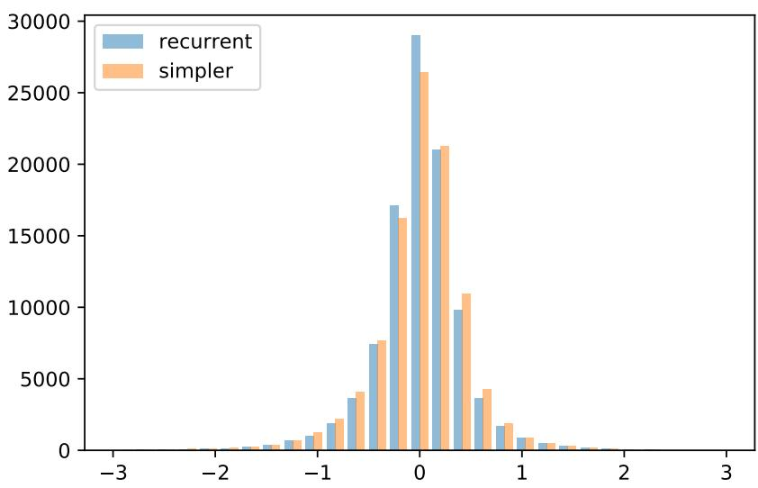
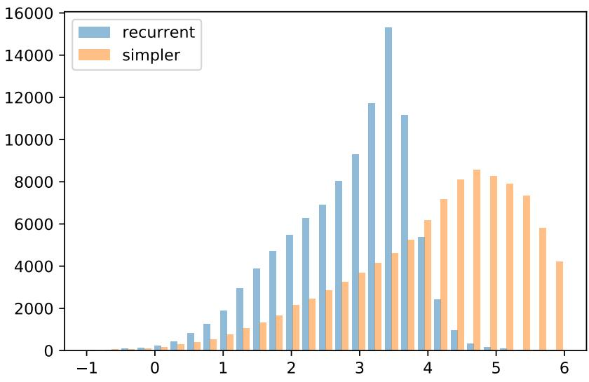
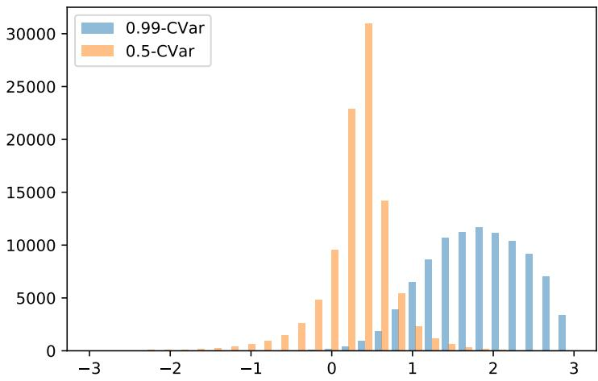
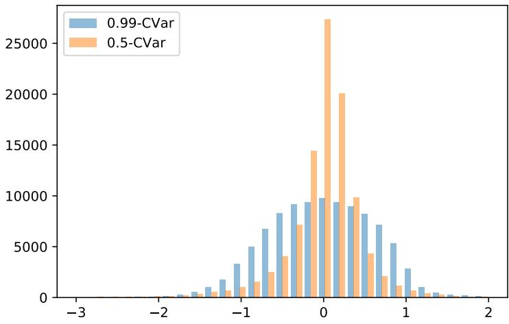
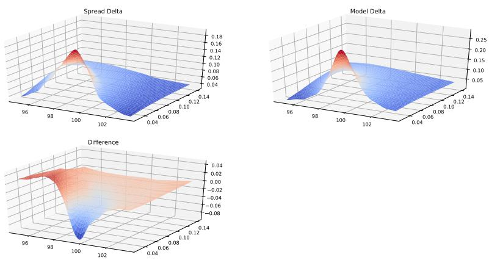
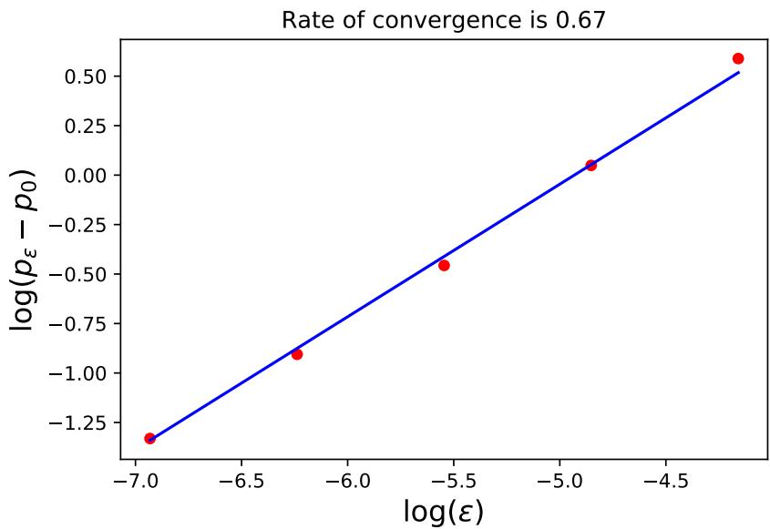
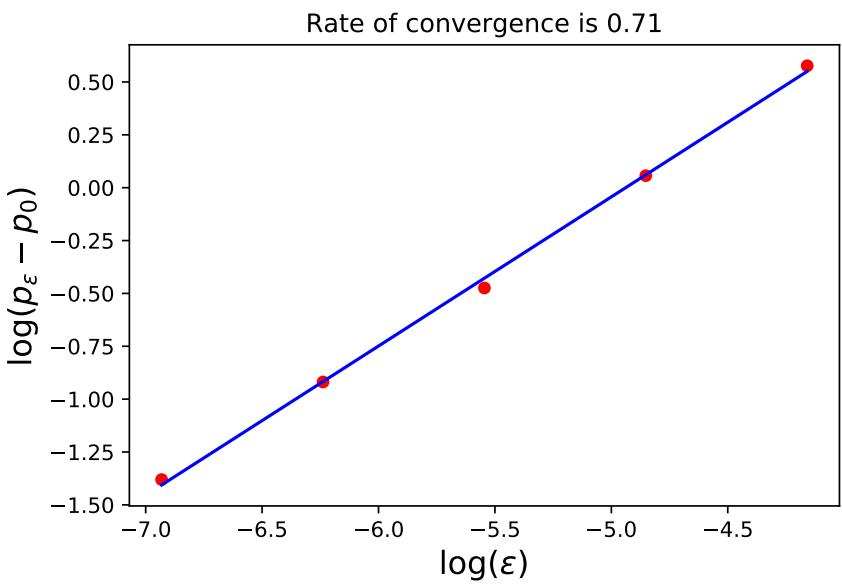

# 2019-buehler-et-al-deep-hedging

<!-- page: 1 -->

## DEEP HEDGING

HANS BUEHLER, LUKAS GONON, JOSEF TEICHMANN, AND BEN WOOD

Abstract. We present a framework for hedging a portfolio of derivatives in the presence of market frictions such as transaction costs, market impact, liquidity constraints or risk limits using modern deep reinforcement machine learning methods.

We discuss how standard reinforcement learning methods can be applied to non-linear reward structures, i.e. in our case convex risk measures. As a general contribution to the use of deep learning for stochastic processes, we also show in section 4 that the set of constrained trading strategies used by our algorithm is large enough to -approximate any optimal solution.

Our algorithm can be implemented eficiently even in high-dimensional situations using modern machine learning tools. Its structure does not depend on specific market dynamics, and generalizes across hedging instruments including the use of liquid derivatives. Its computational performance is largely invariant in the size of the portfolio as it depends mainly on the number of hedging instruments available.

We illustrate our approach by showing the efect on hedging under transaction costs in a synthetic market driven by the Heston model, where we outperform the standard “complete market” solution.

Key words and phrases: reinforcement learning, approximate dynamic programming, machine learning, market frictions, transaction costs, hedging, risk management, portfolio optimization. MSC 2010 Classification: 91G60. 65K99

MSC 2010 Classification: 91G60, 65K99

## 1. Introduction

The problem of pricing and hedging portfolios of derivatives is crucial for pricing risk-management in the financial securities industry. In idealized frictionless and “complete market” models, mathematical finance provides, with risk neutral pricing and hedging, a tractable solution to this problem. Most commonly, in such models only the primary asset such as the equity and few additional factors are modeled. Arguably, the most successful such model for equity models is Dupire’s Local Volatility [Dup94]. For risk management, we will then compute “greeks” with respect not only to spot, but also to calibration input parameters such as forward rates and implied volatilities - even if such quantities are not actually state variables in the underlying model. Essentially, the models are used as a form of low dimensional interpolation of the hedging instruments. Under complete market assumptions, pricing and risk of a portfolio of derivatives is linear.

arXiv:1802.03042v1 [q-fin.CP] 8 Feb 2018

1Opinions expressed in this paper are those of the authors, and do not necessarily reflect the view of JP Morgan.

Date: February 12, 2018.

<!-- page: 2 -->

In real markets, though, trading in any instrument is subject to transaction costs, permanent market impact and liquidity constraints. Furthermore, any trading desk is typically also limited by its capacity for risk and stress, or more generally capital. This requires traders to overlay the trading strategy implied by the greeks computed from the complete-market model with their own adjustments. It also means that pricing and risk are not linear, but dependent on the overall book: a new trade which reduces the risk in a particular direction can be priced more favourably. This is called having an “axe”.

The prevalent use of the “complete market” models is due to a lack of eficient alternatives; even with the impressive progress made in the last years for example around super-hedging, there are still few solutions which will scale well over a large portfolio of instruments, and which do not depend on the underlying market dynamics.

Our deep hedging approach addresses this deficiency. Essentially, we model the trading decisions in our hedging strategies as neural networks; their feature sets consist not only of prices of our hedging instruments, but may also contain additional information such as trading signals, news analytics, or past hedging decisions – quantitative information a human trader might use, in true machine learning fashion.

Such deep hedging strategies can be described and trained (optimized in classical language) in a very eficient way, while the respective algorithms are entirely model-free and do not depend on the on the chosen market dynamics. That means we can include market frictions such as transaction costs, liquidity constraints, bid/ask spreads, market impact etc, all potentially dependent on the features of the scenario.

The modeling task now amounts to specifying a market scenario generator, a loss function, market frictions and trading instruments. This approach lends itself well to statistically driven market dynamics. That also means that we do not need to be able to compute greeks of individual derivatives with a classic derivative pricing model. In fact, we will need no such “equivalent martingale model”. Our approach is greek-free. Instead, we can focus our modeling efort on realistic market dynamics and the actual out-of-sample performance of our hedging signal.

High level optimizers then find reasonably good strategies to achieve good out-of-sample hedging performance under the stated objective. In our examples, we are using gradient descent “Adam” [KB15] mini-batch training for a semi-recurrent reinforcement learning problem.

To illustrate our approach, we will build on ideas from [IAR09] and [FL00] and optimize hedging of a portfolio of derivatives under convex risk measures. To be able to compare our results with classic complete market results, we chose in this article to drive the market with a Heston model. We re-iterate that our algorithm is not dependent on the choice of the model.

To illustrate our algorithm, we investigate the following questions:

<!-- page: 3 -->

• Section 5.2: How does neural network hedging (for diferent risk-preferences) compare to the benchmark in a Heston model without transaction costs?

• Section 5.3: What is the efect of proportional transaction costs on the exponential utility indiference price?

• Section 5.4: Is the numerical method scalable to higher dimensions?

Our analysis is based on out-of-sample performance.

To calculate our hedging strategies numerically, we approximate them by deep neural networks. State-of-the-art machine learning optimization techniques (see [IGC16]) are then used to train these networks, yielding a closeto-optimal deep hedge. This is implemented in Python using TensorFlow. Under our Heston model, trading is allowed in both stock and a variance swap. Even experiments with proportional transaction costs show promising results and the approach is also feasible in a high-dimensional setting.

1.1. Related literature. There is a vast literature on hedging in market models with frictions. We only highlight a few to demonstrate the complex character of the problem. For example, [RS10] study a market in which trading a security has a (temporary) impact on its price. The price process is modelled by a one-dimensional Black-Scholes model. The optimal trading strategy can be obtained by solving a system of three coupled (non-linear) PDEs. In [PBV17] a more general tracking problem (covering the temporary price impact hedging problem) is carried out for a Bachelier model and a closed form solution (involving conditional expectations of a time integral over the optimal frictionless hedging strategy) is obtained for the strategy. [HMSC95] prove that in a Black-Scholes market with proportional transaction costs, the cheapest superhedging price for a European call option is the spot price of the underlying. Thus, the concept of super-replication is of little interest to practitioners in the one dimensional case. In higher dimensional cases it sufers from numerical intractability.

It is well known that deep feed forward networks satisfy universal approximation properties, see, e.g., [Hor91]. To understand better why they are so eficient at approximating hedging strategies, we rely on the very recent and fascinating results of [HBP17], which can be stated as follows: they quantify the minimum network connectivity needed to allow approximation of all ele ments in pre-specified classes of functions to within a prescribed error, which establishes a universal link between the connectivity of the approximating network and the complexity of the function class that is approximated. An abstract framework for transferring optimal M-term approximation results with respect to a representation system to optimal M-edge approximation results for neural networks is established. These transfer results hold for dictionaries that are representable by neural networks and it is also shown in [HBP17] that a wide class of representation systems, coined afine systems, and including as special cases wavelets, ridgelets, curvelets, shearlets, α-shearlets, and more generally, α-molecules, as well as tensor-products thereof, are re-presentable by neural networks. These results suggest an explanation for the “unreasonable efectiveness” of neural networks: they efectively combine the optimal approximation properties of all afine systems taken together. In our application of deep hedging strategies this means: understanding the relevant input factors for which the optimal hedging strategy can be written eficiently.

<!-- page: 4 -->

There are several related applications of reinforcement learning in finance which have similar challenges, of which we want to highlight two related streams: the first is the application to classic portfolio optimization, i.e. without options and under the assumption that market prices are available for all hedging instruments. As in our setup, this problem requires the use of non-linear objective functions, c.f. for example [MW97] or [ZJL17]. The second promising application of reinforcement learning is in algorithmic trading, where several authors have shown promising results, e.g. [DZL09] and [Lu17] to give but two examples.

The novelty in this article is that we cover derivatives in the first place, and in particular over-the-counter derivatives which do not have an observable market price. For example, [Hal17] covers hedging using Q-learning with only the stock price under Black&Scholes assumptions and without transaction cost.

This puts our article firmly in the realm of pricing and risk managing a contingent claims in incomplete markets with friction cost. $\mathrm { A }$ general introduction into quantitative finance with a focus on such markets is [FS16].

1.2. Outline. The rest of the article is structured as follows. In Sections 2 and 3 we provide the theoretical framework for pricing and hedging using convex risk measures in discrete-time markets with frictions. Section 4 outlines the parametrization of appropriate hedging strategies by neural nets and provides theoretical arguments why it works. In Section 5 several numerical experiments are performed demonstrating the surprising feasibility and accuracy of the method.

## 2. Setting: Discrete time-market with Frictions

Consider a discrete-time financial market with finite time horizon T and trading dates $0 = t _ { 0 } < t _ { 1 } < . . . < t _ { n } = T$ . Fix a finite1 probability space $\Omega =$ $\{ \omega _ { 1 } , \ldots , \omega _ { N } \}$ and a probability measure $\mathbb { P }$ such that $\mathbb { P } [ \{ \omega _ { i } \} ] > 0$ for all i. We define the set of all real-valued random variables over Ω as $\mathcal { X } : = \{ X : \Omega \mathbb { R } \}$

We denote by $I _ { k }$ with values in $\mathbb { R } ^ { r }$ any new market information available at time $t _ { k }$ , including market costs and mid-prices of liquid instruments – typically quoted in auxiliary terms such as implied volatilities $^ - \cdot$ news, balance sheet information, any trading signals, risk limits etc. The process $I = ( I _ { k } ) _ { k = 0 , \dots , n }$ generates the filtration $\mathbb { F } = ( \mathcal { F } _ { k } ) _ { k = 0 , \dots , n } .$ i.e. $\mathcal { F } _ { k }$ represents all information available up to $t _ { k }$ . Note that each Fk-measurable random variable can be written as a function of $I _ { 0 } , \ldots , I _ { k }$ ; this is therefore the richest available feature set for any decision taken at $t _ { k }$

1The assumption that Ω is finite is only essential for the numerical solution of the optimal hedging problem (from Section 4.3 onwards). Alternatively, we could start with arbitrary Ω and discretize it for the numerical solution. If we imposed appropriate integrability conditions on all assets and contingent claims, then the results prior to section 4.3 would remain valid for general Ω.

<!-- page: 5 -->

The market contains d hedging instruments with mid-prices given by an Rd-valued F-adapted stochastic process ${ \cal S } = ( S _ { k } ) _ { k = 0 , \dots , n }$ . We do not require that there is an equivalent martingale measure under which S is a martingale. We stress that our hedging instruments are not simply primary assets such as equities, but also secondary assets such as liquid options on the former. Some of those hedging instruments are therefore not tradable before a future point in time (e.g. an option only listed in 3M with then time-to-maturity of 6M). Such liquidity restrictions are modeled alongside trading cost below.

Our portfolio of derivatives which represents our liabilities is an ${ \mathcal { F } } _ { T }$ measurable random variable $Z .$ In keeping with the classic literature we may refer to this as the contingent claim, but we stress that it is meant to represent a portfolio which is a mix of liquid and OTC derivatives. The maturity $T$ is the maximum maturity of all instruments, at which point all payments are known. No classic derivative pricing model will be needed to valuate Z or compute Greeks at any point.

Simplifications. For notational simplicity, we assume that all intermediate payments are accrued using a (locally) risk-free overnight rate. This essentially means we may assume that rates are zero and that all payments occur at $T$ . We also exclude for the purpose of this article instruments with true optionality such as American options. Finally, we also assume that all currency spot exchange happens at zero cost, and that we therefore may assume that all instruments settle in our reference currency.2

Trading Strategies. In order to hedge a liability Z at $T _ { i }$ we may trade in S using an Rd-valued F-adapted stochastic process $\delta = ( \delta _ { k } ) _ { k = 0 , \dots , n - 1 }$ with $\delta _ { k } =$ $( \delta _ { k } ^ { 1 } , \dots , \delta _ { k } ^ { d } )$ . Here, $\delta _ { k } ^ { i }$ denotes the agent’s holdings of the ith asset at time $t _ { k }$ We may also define $\delta _ { - 1 } = \delta _ { n } : = 0$ for notational convenience.

We denote by $\mathcal { H } ^ { u }$ the unconstrained set of such trading strategies. However, each $\delta _ { k }$ is subject to additional trading constraints. Such restrictions arise due to liquidity, asset availability or trading restrictions. They are also used to restrict trading in a particular option prior to its availability. In the example above of an option which is listed in 3M, the respective trading constraints would be {0} until the 3M point. To incorporate these efects, we assume that $\delta _ { k }$ is restricted to a set $\mathcal { H } _ { k }$ which is given as the image of a continuous, Fk-measurable map $H _ { k } : \mathbb { R } ^ { d ( k + 1 ) } \mathbb { R } ^ { d } , { \mathrm { i . e . ~ } } \\mathcal { H } _ { k } : = H _ { k } ( \mathbb { R } ^ { d ( \breve { k } + 1 ) } )$ . We stipulate that $H _ { k } ( 0 ) = 0$

Moreover, for an unconstrained strategy $\delta ^ { u } \in \mathcal { H } ^ { u }$ , we (successively) define with $( H \circ \delta ^ { u } ) _ { k } : = H _ { k } ( ( H \circ \delta ^ { u } ) _ { 0 } , \dots , ( H \circ \delta ^ { u } ) _ { k - 1 } , \delta _ { k } ^ { u } )$ its constrained “projection” into $\mathcal { H } _ { k }$ . We denote by $\mathcal { H } : = ( H \circ \mathcal { H } ^ { u } ) \subset \mathcal { H } ^ { u }$ the corresponding non-empty set of restricted trading strategies.

Example 2.1. Assume that S are a range of options and that $\mathcal { V } _ { k } ^ { i } ( S _ { k } ^ { i } )$ computes the Black & Scholes Vega of each option using the various market parameters available at time $t _ { k }$ . The overall Vega traded with $\delta _ { k }$ is then $\mathcal { V } _ { k } \big ( \delta _ { k } -$ $\begin{array} { r } { \delta _ { k - 1 } ) : = | \sum _ { i = 1 } ^ { d } \mathcal { V } _ { k } ^ { i } ( S _ { k } ^ { i } ) ( \delta _ { k } ^ { i } - \delta _ { k - 1 } ^ { i } ) | } \end{array}$ . A liquidity limit of a maximum tradable

2See [BR06] for some background on multi-currency risk measures.

<!-- page: 6 -->

Vega of $\mathcal { V } _ { \mathrm { m a x } }$ could then be implemented by the map:

$$
H _ { k } ( \delta _ { 0 } , \dots , \delta _ { k } ) : = \delta _ { k - 1 } + ( \delta _ { k } - \delta _ { k - 1 } ) \frac { \mathcal { V } _ { \operatorname* { m a x } } } { \operatorname* { m a x } \{ \mathcal { V } _ { k } ( \delta _ { k } - \delta _ { k - 1 } ) , \mathcal { V } _ { \operatorname* { m a x } } \} } \ .
$$

Hedging. All trading is self-financed, so we may also need to inject additional cash $p _ { 0 }$ into our portfolio. A negative cash injection implies we may extract cash. In a market without transaction costs the agent’s wealth at time $T$ is thus given by $- Z + p _ { 0 } + ( \delta \cdot S ) _ { T }$ , where

$$
( \delta \cdot S ) _ { T } : = \sum _ { k = 0 } ^ { n - 1 } \delta _ { k } \cdot ( S _ { k + 1 } - S _ { k } ) .
$$

However, we are interested in situations where trading cost cannot be neglected. We assume that any trading activity causes costs as follows: if the agent decides to buy a position $\mathbf { n } \in \mathbb { R } ^ { d }$ in $S$ at time $t _ { k }$ , then this will incur cost $c _ { k } ( \mathrm { n } )$ . The total cost of trading a strategy $\delta$ up to maturity is therefore

$$
C _ { T } ( \delta ) : = \sum _ { k = 0 } ^ { n } c _ { k } ( \delta _ { k } - \delta _ { k - 1 } )
$$

(recall $\delta _ { - 1 } = \delta _ { n } : = 0$ , the latter of which implies full liquidation in $T )$ . The agent’s terminal portfolio value at $T$ is therefore

$$
\operatorname { P L } _ { T } ( Z , p _ { 0 } , \delta ) : = - Z + p _ { 0 } + ( \delta \cdot S ) _ { T } - C _ { T } ( \delta ) .\tag{2.1}
$$

Throughout, we assume that the non-negative adapted cost functions are normalized to $c _ { k } ( 0 ) = 0$ and that they are upper semi-continuous.3 In our numerical examples we have assumed zero transaction costs at maturity.

Our setup includes the following efects:

• Proportional transaction cost: for for $c _ { k } ^ { i } > 0$ define $\begin{array} { r } { c _ { k } ( \mathrm { n } ) : = \sum _ { i = 1 } ^ { d } c _ { k } ^ { i } S _ { k } ^ { i } | \mathrm { n } ^ { i } | } \end{array}$

• Fixed transaction costs: for $c _ { k } ^ { i } > 0$ and $\varepsilon > 0$ set $\begin{array} { r } { c _ { k } ( \mathrm { n } ) : = \sum _ { i = 1 } ^ { d } c _ { k } ^ { i } 1 _ { | \mathrm { n } ^ { i } | \geq \varepsilon } . } \end{array}$

• Complex cross-asset cost, such as cost of volatility when trading options across the surface: assume $S ^ { 1 }$ is spot and that the rest of the hedging instruments are options on the same asset. Denote by $\Delta _ { k } ^ { i }$ Delta and by $\mathcal { V } _ { k } ^ { i }$ Vega of each instrument, for example under a simple Black & Scholes model.

We may then define a simple cross-surface proportional cost model in Delta and Vega for $c _ { k } > 0$ and $v _ { k } > 0$ as

$$
c _ { k } ( \mathrm { n } ) : = c _ { k } ^ { i } S _ { k } ^ { 1 } \left| 1 + \sum _ { i = 2 } ^ { d } \Delta _ { k } ^ { i } \mathrm { n } ^ { i } \right| + v _ { k } ^ { i } \left| \sum _ { i = 2 } ^ { d } \mathcal { V } _ { k } ^ { i } \mathrm { n } ^ { i } \right|
$$

Remark 2.2. Our general setup also allows modeling true market impact: in this case, the asset distribution is afected by our trading decisions.

As an example for permanent market impact, assume for simplicity that $I =$ $S$ and that we have a statistical model of our market in the form of a conditional distribution $P ( S _ { k + 1 } | S _ { k } )$ . For a proportional impact parameter $\iota > 0$

3This property is needed in the proof of proposition 4.9.

<!-- page: 7 -->

we may now define the dynamics of $S$ under exponentially decaying, proportional market impact as $P \left( \begin{array} { l } { S _ { k + 1 } } \end{array} | \begin{array} { l } { S _ { k } \left( 1 + \iota ( \delta _ { k } - \delta _ { k - 1 } ) \right) } \end{array} \right)$ . The cost function is accordingly $c _ { k } ( \mathbf { n } ) : = S _ { k } \iota | \dot { \mathbf { n } } |$

In a similar vein, dynamic market impact with decay such as described in [GS13] can be implemented.

The real challenge with modeling impact is the efect of trading in one hedging instrument on other hedging instruments, for example when trading options.

## 3. Pricing and hedging using convex risk measures

In an idealized complete market with continuous-time trading, no transaction costs, and unconstrained hedging, for any liabilities Z there exists a unique replication strategy δ and a fair price $p _ { 0 } \in \mathbb { R }$ such that $- Z + p _ { 0 } + ( \delta$ $S ) _ { T } - C _ { T } ( \delta ) = 0$ holds P-a.s. This is not true in our current setting.

In an incomplete market with frictions, an agent has to specify an optimality criterion which defines an acceptable “minimal price” for any position. Such a minimal price is the going to be the minimal amount of cash we need to add to our position in order to implement the optimal hedge and such that the overall position becomes acceptable in light of the various costs and constraints.

We focus here on optimality under convex risk measures as studied e.g. in [Xu06] and [IAR09]. See also [KS07] and further references therein for a dynamic setting. Convex risk measures are discussed in great detail in [FS16].

Definition 3.1. Assume that $X , X _ { 1 } , X _ { 2 } \in \mathcal { X }$ represent asset positions $( \mathrm { i . e . , } - X$ is a liability).

We call $\rho : \mathcal { X } \mathbb { R }$ a convex risk measure if it is:

(1) Monotone decreasing: if $X _ { 1 } \geq X _ { 2 }$ then $\rho ( X _ { 1 } ) \leq \rho ( X _ { 2 } )$

A more favorable position requires less cash injection.

(2) Convex: $\rho ( \alpha X _ { 1 } + ( 1 - \alpha ) X _ { 2 } ) \leq \alpha \rho ( X _ { 1 } ) + ( 1 - \alpha ) \rho ( X _ { 2 } ) { \mathrm { ~ f o r ~ } } \alpha \in [ 0 , 1 ]$ Diversification works.

(3) Cash-Invariant: $\rho ( X + c ) = \rho ( X ) - c$ for $c \in \mathbb { R }$

Adding cash to a position reduces the need for more by as much. In particular, this means that $\rho ( X + \rho ( X ) ) = 0 , \ i . e . \ \rho ( X )$ is the least amount c that needs to be added to the position X in order to make it acceptable in the sense that $\rho ( X + c ) \leq 0$

We call ρ normalized if $\rho ( 0 ) = 0$

Let $\rho \colon \mathcal { X } \mathbb { R }$ be such a convex risk measure and for $X \in { \mathcal { X } }$ consider the optimization problem

$$
\pi ( X ) : = \operatorname* { i n f } _ { \delta \in { \mathcal { H } } } \rho ( X + ( \delta \cdot S ) _ { T } - C _ { T } ( \delta ) ) ~ .\tag{3.1}
$$

Proposition 3.2. π is monotone decreasing and cash-invariant.

If moreover $C _ { T } ( \cdot )$ and H are convex, then the functional π is a convex risk measure.

Proof. For convexity, let $\alpha \in [ 0 , 1 ]$ , set $\alpha ^ { \prime } : = 1 - \alpha$ and assume $X _ { 1 } , X _ { 2 } \in { \mathcal { X } }$ Then using the definition of π in the first step, convexity of H in the second

<!-- page: 8 -->

step, convexity of $C _ { T } ( \cdot )$ combined with monotonicity of $\rho$ in the third step and convexity of $\rho$ in the fourth step, we obtain

$$
\begin{array} { r l } & { \pi ( \alpha X _ { 1 } + \alpha ^ { \prime } X _ { 2 } ) } \\ & { = \underset { \delta \in \mathcal { H } } { \operatorname* { i n f } } \rho ( \alpha X _ { 1 } + \alpha ^ { \prime } X _ { 2 } + ( \delta \cdot S ) _ { T } - C _ { T } ( \delta ) ) } \\ & { = \underset { \delta _ { 1 } , \delta _ { 2 } \in \mathcal { H } } { \operatorname* { i n f } } \rho ( \alpha \left\{ X _ { 1 } + ( \delta _ { 1 } \cdot S ) _ { T } \right\} + \alpha ^ { \prime } \left\{ X _ { 2 } + ( \delta _ { 2 } \cdot S ) _ { T } \right\} - C _ { T } ( \alpha \delta _ { 1 } + \alpha ^ { \prime } \delta _ { 2 } ) ) } \\ & { \leq \underset { \delta _ { 1 } , \delta _ { 2 } \in \mathcal { H } } { \operatorname* { i n f } } \rho ( \alpha \left\{ X _ { 1 } + ( \delta _ { 1 } \cdot S ) _ { T } - C _ { T } ( \delta _ { 1 } ) \right\} + \alpha ^ { \prime } \left\{ X _ { 2 } + ( \delta _ { 2 } \cdot S ) _ { T } - C _ { T } ( \delta _ { 2 } ) \right\} ) } \\ & { \leq \underset { \delta _ { 1 } , \delta _ { 2 } \in \mathcal { H } } { \operatorname* { i n f } } \left\{ \alpha \rho ( X _ { 1 } + ( \delta _ { 1 } \cdot S ) _ { T } - C _ { T } ( \delta _ { 1 } ) ) + \alpha ^ { \prime } \rho ( X _ { 2 } + ( \delta _ { 2 } \cdot S ) _ { T } - C _ { T } ( \delta _ { 2 } ) ) \right\} } \\ & { = \alpha \pi ( X _ { 1 } ) + \alpha ^ { \prime } \pi ( X _ { 2 } ) \mathrm { . } } \end{array}
$$

Cash-invariance and monotonicity follow directly from the respective properties of $\rho .$ 

We define an optimal hedging strategy as a minimizer $\delta \ \in \ { \mathcal { H } }$ of $\left( 3 . 1 \right)$ Recalling the interpretation of $\rho ( - Z )$ as the minimal amount of capital that has to be added to the risky position $- Z$ to make it acceptable for the risk measure $\rho ,$ this means that $\pi ( - Z )$ is simply the minimal amount that the agent needs to charge in order to make her terminal position acceptable, if she hedges optimally.

If we defined this as the minimal price, then we would exclude the possibility that having no liabilities may actually have positive value. This might be the case in the presence of statistically positive expectation of returns under $\mathbb { P }$ for some of our hedging instruments. As mentioned before, our framework lends itself to the integration of signals and other trading information. We therefore define the indiference price $p ( Z )$ as the amount of cash that she needs to charge in order to be indiferent between the position $- Z$ and not doing so, i.e. as the solution p0 to $\pi ( - Z + p _ { 0 } ) = \pi ( 0 )$ . By cash-invariance this is equivalent to taking $p _ { 0 } : = p ( Z )$ , where

$$
p ( Z ) : = \pi ( - Z ) - \pi ( 0 ) \ .\tag{3.2}
$$

It is easily seen that without trading restrictions and transaction costs, this price coincides with the price of a replicating portfolio (if it exists):

Lemma 3.3. Suppose $C _ { T } \equiv 0$ and $\mathcal { H } = \mathcal { H } ^ { u }$ . If Z is attainable, i.e. there exists $\delta ^ { * } \in { \mathcal { H } }$ and $p _ { 0 } \in \mathbb { R }$ such that $Z = p _ { 0 } + ( \delta ^ { * } \cdot S ) _ { T }$ , then $p ( Z ) = p _ { 0 }$

Proof. For any $\delta \in \mathcal H$ , the assumptions and cash-invariance of $\rho$ imply

$$
\rho ( - Z + ( \delta \cdot S ) _ { T } - C _ { T } ( \delta ) ) = p _ { 0 } + \rho ( ( [ \delta - \delta ^ { * } ] \cdot S ) _ { T } ) .
$$

Taking the infimum over $\delta \in \mathcal H$ on both sides and using $\mathcal { H } - \delta ^ { * } = \mathcal { H }$ one obtains

$$
\pi ( - Z ) = p _ { 0 } + \operatorname* { i n f } _ { \delta \in \mathcal { H } } \rho ( ( [ \delta - \delta ^ { * } ] \cdot S ) _ { T } ) = p _ { 0 } + \pi ( 0 ) .
$$

Remark 3.4. The methodology developed in this article can also be applied to approximate optimal hedging strategies in a setting where the price $p _ { 0 }$ is given exogenously: fix a loss function $\ell \colon \mathbb { R } [ 0 , \infty )$ . Suppose $p _ { 0 } > 0$ is given, for example being the result of trading derivatives in the market at competitive prices, without taking into account risk-management. The agent then wishes to minimize her loss at maturity, i.e. she defines an optimal hedging strategy as a minimizer to

<!-- page: 9 -->

$$
\operatorname* { i n f } _ { \delta \in \mathcal { H } } \mathbb { E } \left[ \ell ( - Z + p _ { 0 } + ( \delta \cdot S ) _ { T } - C _ { T } ( \delta ) ) \right] .\tag{3.3}
$$

This problem, i.e. optimal hedging under a capital constraint, is closely related to taking for $\rho$ a shortfall risk measure, see e.g. [FL00].

Arbitrage. We mentioned in the introduction that we do not require per se that the market is free of arbitrage. To recap, we call $\delta ^ { [ X ] } \in { \mathcal { H } }$ an arbitrage opportunity given X is an opportunity to make money without risk of a loss, $\mathrm { i . e . ~ } 0 \leq X + \bar { ( } \delta ^ { [ X ] } S ) _ { T } - C _ { T } ( \bar { \delta } ^ { [ X ] } ) = : ( * )$ while $\mathbb { P } [ ( * ) > 0 ] > 0$

In case such an opportunity exists, we obviously have $\rho ( X ) < 0$ . Depending on the cost function and our constraints ${ \mathcal { H } } ,$ we may be able to invest an unlimited amount into this strategy. In this case, we get $\pi ( X ) = - \infty$ . If this applies to $X = 0$ , we call such a market irrelevant. This is justified by the following observation:

Corollary 3.5. Assume that $\pi ( 0 ) > - \infty$ . Then $\pi ( X ) > - \infty$ for all $X$ .

Proof. Since Ω is finite we have sup $X < \infty$ and therefore, using monotonicity, $\pi ( X ) \geq \pi ( \operatorname* { s u p } X ) \geq \pi ( 0 ) - \operatorname* { s u p } X > - \infty$ 

We note, however, that irrelevance is not necessarily a consequence of outright arbitrage; such statistical arbitrage may also occur in markets without arbitrage. Consider to this end the convex risk measure $\rho ( X ) : = - \mathbb { E } [ X ]$ , and assume that the market without interest rates is driven by a standard Black & Scholes model with positive drift $\mu$ between two time points $t _ { 0 }$ and $t _ { \mathrm { 1 } } , \mathrm { i . e }$

$$
S _ { 0 } : = 1 \quad \mathrm { a n d } \quad S _ { 1 } : = \exp \left\{ \mu t _ { 1 } + \sigma Z \sqrt { t _ { 1 } } \right\}
$$

for $Z$ normal and a volatility $\sigma > 0 . \mathrm { ~ A ~ }$ ssume the proportional cost of trading S in $t _ { 0 }$ is $0 . 5 e ^ { \mu t _ { 1 } }$ . In this case $\rho ( \delta _ { 0 } S _ { 1 } - C _ { 0 } ( \delta ) ) = - 0 . 5 \delta _ { 0 } e ^ { \mu t _ { 1 } }$ for any $\delta _ { 0 } \in \mathbb { R }$ which implies $\pi ( 0 ) = - \infty$ . Hence, the market is irrelevant, too, even if it does not exhibit classic arbitrage. We also note that this is expected in practise: as an example, consider a strategy which writes options on an underlying. In most market scenarios such a strategy will on average make money, even if it is subject to potentially drastic short-term losses.

In closing we note that even if the market dynamics exhibit classic arbitrage, and even in the absence of cost or liquidity constraints, we may not be able to exploit it. Let us assume that for every arbitrage opportunity $\overline { { \delta ^ { [ 0 ] } } }$ there is a non-zero probability of not making money, i.e. $\mathbb { P } [ ( \delta ^ { [ 0 ] } \tilde { S } ) _ { T } + C _ { T } ( \delta ^ { [ 0 ] } ) = 0 ] > 0$ Under the extreme risk measure $\rho ( X ) : = -$ inf $X$ this market remains relevant with $\pi ( 0 ) = 0$

3.1. Exponential Utility Indiference Pricing. The following lemma shows that the present framework includes exponential utility indiference pricing as studied for example in [HN89], [MHADZ93],[WW97] and [KMK15]. Recall that for the exponential utility function $U ( x ) : = - \exp ( - \lambda x ) , x \in \mathbb { R }$ with risk-aversion parameter $\lambda > 0$ the indiference price $q ( Z ) \in \mathbb { R }$ of $Z$ is defined by

<!-- page: 10 -->

$$
\operatorname* { s u p } _ { \delta \in \mathcal { H } } \mathbb { E } \left[ U ( q ( Z ) - Z + ( \delta \cdot S ) _ { T } + C _ { T } ( \delta ) ) \right] = \operatorname* { s u p } _ { \delta \in \mathcal { H } } \mathbb { E } \left[ U ( ( \delta \cdot S ) _ { T } + C _ { T } ( \delta ) ) \right] .
$$

In other words, if the seller charges a cash amount of $q ( Z )$ , sells $Z$ and trades in the market, she obtains the same expected utility as by not not selling Z at all.

Lemma 3.6. Define $q ( Z )$ as above. Choose $\rho$ as the entropic risk measure

$$
\rho ( X ) = { \frac { 1 } { \lambda } } \log \mathbb { E } [ \exp ( - \lambda X ) ] ,\tag{3.4}
$$

and define $p ( Z )$ by (3.2). Then $q ( Z ) = p ( Z )$

Proof. Using the special form of $U _ { : }$ , one may write the indiference price as

$$
q ( Z ) = \frac { 1 } { \lambda } \log \left( \frac { \operatorname* { s u p } _ { \delta \in \mathcal { H } } \mathbb { E } \left[ U ( - Z + ( \delta \cdot S ) _ { T } + C _ { T } ( \delta ) ) \right] } { \operatorname* { s u p } _ { \delta \in \mathcal { H } } \mathbb { E } \left[ U ( ( \delta \cdot S ) _ { T } + C _ { T } ( \delta ) ) \right] } \right)
$$

and so the claim follows from (3.2) and (3.4).

3.2. Optimized certainty equivalents. Assume that $\ell \colon { \mathbb { R } } \to { \mathbb { R } }$ is a loss function, i.e. continuous, non-decreasing and convex. We may define a convex risk measure $\rho$ by setting

$$
\rho ( X ) : = \operatorname* { i n f } _ { w \in \mathbb { R } } \left\{ w + \mathbb { E } [ \ell ( - X - w ) ] \right\} , \quad X \in \mathcal { X } .\tag{3.5}
$$

Lemma 3.7. (3.5) defines a convex risk measure.

Proof. Let $X , Y \in { \mathcal { X } }$ be assets.

(i) Monotonicity: suppose $X \leq Y$ . Since \` is non-decreasing, for any $w \in \mathbb { R }$ one has $\mathbb { E } [ \ell ( - X - w ) ] \ge \mathbb { E } [ \ell ( - Y - w ) ]$ and thus $\rho ( X ) \geq \rho ( Y )$

(ii) Cash invariance: for any $m \in \mathbb { R } , ( 3 . 5 )$ gives

$$
\rho ( X + m ) = \operatorname* { i n f } _ { w \in \mathbb { R } } \left\{ ( w + m ) - m + \mathbb { E } [ \ell ( - X - ( w + m ) ) ] \right\} = - m + \rho ( X ) .
$$

(iii) Convexity: let $\lambda \in [ 0 , 1 ]$ . Then convexity of \` implies

$$
\begin{array} { r l r } {  { \rho ( \lambda X + ( 1 - \lambda ) Y ) } } \\ & { = \operatorname* { i n f } _ { w \in \mathbb { R } } \{ w + \mathbb { E } [ \ell ( - \lambda X - ( 1 - \lambda ) Y - w ) ] \} } \\ & { = } & { \operatorname* { i n f } _ { w _ { 1 } , w _ { 2 } \in \mathbb { R } } \{ \lambda w _ { 1 } + ( 1 - \lambda ) w _ { 2 } + \mathbb { E } [ \ell ( \lambda ( - X - w _ { 1 } ) + ( 1 - \lambda ) ( - Y - w _ { 2 } ) ) ] \} } \\ & { \leq } & { \operatorname* { i n f } _ { w _ { 1 } \in \mathbb { R } } \operatorname* { i n f } _ { \pmb { \mathscr { E } } } \big \{ \lambda ( w _ { 1 } + \mathbb { E } [ \ell ( - X - w _ { 1 } ) ] ) + ( 1 - \lambda ) ( w _ { 2 } + \mathbb { E } [ \ell ( - Y - w _ { 2 } ) ] ) \big \} } \\ & { = } & { \lambda \rho ( X ) + ( 1 - \lambda ) \rho ( Y ) . } \end{array}
$$

Taking $\ell ( x ) : = - u ( - x ) \ ( x \in \mathbb { R } )$ for a utility function $u \colon \mathbb { R } \mathbb { R }$ , (3.5) coincides with the optimized certainty equivalent as defined (and studied in a lot more detail than here) in [BTT07].

Example 3.8. Fix $\lambda > 0$ and set $\begin{array} { r } { \ell ( x ) : = \exp ( \lambda x ) - \frac { 1 + \log ( \lambda ) } { \lambda } , ~ x \in \mathbb { R } } \end{array}$ . Then the optimization problem in (3.5) can be solved explicitly and the minimizer $w ^ { * }$ satisfies $e ^ { \lambda w ^ { * } } = \lambda \mathbb { E } [ \exp ( - \lambda X ) ]$ . Inserting this into (3.5), one obtains the entropic risk measure defined in (3.4) above.

<!-- page: 11 -->

Example 3.9. Let $\alpha \in ( 0 , 1 )$ and set $\ell ( x ) : = \frac { 1 } { 1 - \alpha } \operatorname* { m a x } ( x , 0 )$ . The associated risk measure (3.5) is called average value at risk at level $1 - \alpha$ (see [FS16, Definition 4.48, Proposition 4.51] with $\lambda : = 1 - \alpha )$ or also conditional value at risk or expected shortfall.

Proposition 3.10. Suppose $S$ is a P-martingale, $\rho$ is defined as in (3.5) and $\pi , p$ as in (3.1), (3.2). Then

(i) $\pi ( 0 ) = \rho ( 0 )$

(ii) $p ( Z ) \geq \mathbb { E } [ Z ]$ for any $Z \in { \mathcal { X } }$

Proof. Since $0 \in \mathcal H$ and $C _ { T } ( 0 ) = 0$ , one has $\pi ( 0 ) \leq \rho ( 0 )$ for any choice of risk measure $\rho$ in (3.1). Under the present assumptions the converse inequality is also true: Since S is a martingale, it holds that

$$
\mathbb { E } [ ( \delta \cdot S ) _ { T } ] = \sum _ { j = 0 } ^ { n - 1 } \mathbb { E } [ \delta _ { j } \mathbb { E } [ S _ { j + 1 } - S _ { j } | \mathcal { F } _ { j } ] ] = 0 \quad \mathrm { ~ f o r ~ a n y ~ } \delta \in \mathcal { H } .\tag{3.6}
$$

By first applying Jensen’s inequality (recall that \` is convex) and then using (3.6), that $C _ { T } ( \delta ) \geq 0$ for any $\delta \in \mathcal H$ and that \` is non-decreasing, one obtains

$$
\begin{array} { r l } & { \pi ( - Z ) = \underset { w \in \mathbb { R } } { \mathrm { i n f ~ } } \underset { \delta \in \mathcal { H } } { \mathrm { i n f ~ } } \big \lbrace w + \mathbb { E } [ \ell ( Z - ( \delta \cdot S ) _ { T } + C _ { T } ( \delta ) - w ) ] \big \rbrace } \\ & { \qquad \quad \geq \underset { w \in \mathbb { R } } { \mathrm { i n f ~ } } \underset { \delta \in \mathcal { H } } { \mathrm { i n f ~ } } \big \lbrace w + \ell ( \mathbb { E } [ Z - ( \delta \cdot S ) _ { T } + C _ { T } ( \delta ) - w ] ) \big \rbrace } \\ & { \qquad \quad \geq \underset { w \in \mathbb { R } } { \mathrm { i n f ~ } } \big \lbrace w + \ell ( \mathbb { E } [ Z ] - w ) \big \rbrace = \rho ( - \mathbb { E } [ Z ] ) = \mathbb { E } [ Z ] + \rho ( 0 ) . } \end{array}\tag{3.7}
$$

Inserting $Z = 0$ yields the converse inequality $\pi ( 0 ) \geq \rho ( 0 )$ and thus (i). Combining (i), (3.2) and (3.7) then directly gives (ii). 

## 4. Approximating hedging strategies by deep neural networks

The key idea that we pursue in this article is to approximate hedging strategies by neural networks. Before describing this approach in more detail we recall the definition and approximation properties of neural networks and prove some basic results on hedging strategies built from them. While these results show that the approach is theoretically well-founded, they are only one reason why we have used neural networks (and not some other parametric family of functions) to approximate hedging strategies. The other reason is that optimal hedging strategies built from neural networks can numerically be calculated very eficiently. This is explained first for the case of OCE risk measures and for entropic risk. Finally, an extension to general risk measures is presented.

## 4.1. Universal approximation by neural networks. Let us first recall the definition of a (feed forward) neural network:

Definition 4.1. Let $L , N _ { 0 } , N _ { 1 } , \dots , N _ { L } \ \in \ \mathbb { N } , \ \sigma \colon \mathbb { R } \ \to \ \mathbb { R }$ and for any $\ell =$ $1 , \ldots , L .$ , let $W _ { \ell } \colon \mathbb { R } ^ { N _ { \ell - 1 } } \to \mathbb { R } ^ { N _ { \ell } }$ an afine function. A function $F \colon \mathbb { R } ^ { N _ { 0 } } \dot { } \mathbb { R } ^ { N _ { L } }$ defined as

$$
F ( x ) = W _ { L } \circ F _ { L - 1 } \circ \cdot \cdot \cdot \circ F _ { 1 } { \mathrm { ~ w i t h ~ } } F _ { \ell } = \sigma \circ W _ { \ell } { \mathrm { ~ f o r ~ } } \ell = 1 , \dots , L - 1
$$

is called a (feed forward) neural network. Here the activation function $\sigma$ is applied componentwise. L denotes the number of layers, $N _ { 1 } , \ldots , N _ { L - 1 }$ denote the dimensions of the hidden layers and $N _ { 0 } , N _ { L }$ of the input and output layers, respectively. For any $\ell = 1 , \ldots , L$ the afine function $W _ { \ell }$ is given as $W _ { \ell } ( x ) =$ $A ^ { \ell } x + b ^ { \ell }$ for some $\mathbf { \bar { \mathbf { A } } } ^ { \ell } \in \mathbb { R } ^ { N _ { \ell } \times N _ { \ell - 1 } }$ and $b ^ { \ell } \in \mathbb { R } ^ { N _ { \ell } }$ . For any $i = 1 , \dots N _ { \ell } , j$ $1 , \ldots , N _ { \ell - 1 }$ the number $A _ { i j } ^ { \ell }$ is interpreted as the weight of the edge connecting the node i of layer $\ell - 1$ to node $j$ of layer \`. The number of non-zero weights of a network is the sum of the number of non-zero entries of the matrices $A ^ { \ell }$ $\ell = 1 , \ldots , L$ and vectors $b ^ { \ell } , \ell = 1 , \dots , L$

<!-- page: 12 -->

Denote by $\mathcal { N N } _ { \infty , d _ { 0 } , d _ { 1 } } ^ { \sigma }$ the set of neural networks mapping from $\mathbb { R } ^ { d _ { 0 } } \mathbb { R } ^ { d _ { 1 } }$ and with activation function $\sigma .$ . The next result ([Hor91, Theorems 1 and 2]) illustrates that neural networks approximate multivariate functions arbitrarily well.

Theorem 4.2 (Universal approximation, $\left[ \mathrm { H o r 9 1 } \right] )$ . Suppose $\sigma$ is bounded and non-constant. The following statements hold:

• For any finite measure µ on $( \mathbb { R } ^ { d _ { 0 } } , \boldsymbol { B } ( \mathbb { R } ^ { d _ { 0 } } ) )$ and $1 \leq p < \infty$ , the set $\mathcal { N N } _ { \infty , d _ { 0 } , 1 } ^ { \sigma }$ is dense in $L ^ { p } ( \mathbb { R } ^ { d _ { 0 } } , \mu )$

• If in addition $\sigma \in C ( \mathbb { R } )$ , then $\mathcal { N N } _ { \infty , d _ { 0 } , 1 } ^ { \sigma }$ is dense in $C ( \mathbb { R } ^ { d _ { 0 } } )$ for the topology of uniform convergence on compact sets.

Since each component of an $\mathbb { R } ^ { d _ { 1 } }$ -valued neural network is an R-valued neural network, this result easily generalizes to $\mathcal { N N } _ { \infty , d _ { 0 } , d _ { 1 } } ^ { \sigma }$ with $d _ { 1 } > 1$ , see also [Hor91]. A variety of other results with diferent assumptions on σ or emphasis on approximation rates are available, see e.g. [HBP17] for further references.

In what follows, we fix an activation function $\sigma$ and omit it in the notation, i.e. we write $\mathcal { N N } _ { \infty , d _ { 0 } , d _ { 1 } } : = \mathcal { N N } _ { \infty , d _ { 0 } , d _ { 1 } } ^ { \sigma }$ . Furthermore, we denote by $\{ \mathcal { N N } _ { M , d _ { 0 } , d _ { 1 } } \}$ M∈N a sequence of subsets of $\mathcal { N N } _ { \infty , d _ { 0 } , d _ { 1 } }$ with the following properties:

$\mathcal { N N } _ { M , d _ { 0 } , d _ { 1 } } \subset \mathcal { N N } _ { M + 1 , d _ { 0 } , d _ { 1 } }$ for all $M \in \mathbb { N }$

$\bigcup _ { M \in \mathbb { N } } \mathcal { N } \mathcal { N } _ { M , d _ { 0 } , d _ { 1 } } = \mathcal { N } \mathcal { N } _ { \infty , d _ { 0 } , d _ { 1 } } ,$

• for any $M \in \mathbb { N }$ , one has $\mathcal { N N } _ { M , d _ { 0 } , d _ { 1 } } ~ = ~ \{ F ^ { \theta } \colon \theta ~ \in ~ \Theta _ { M , d _ { 0 } , d _ { 1 } } \}$ with $\Theta _ { M , d _ { 0 } , d _ { 1 } } \subset \mathbb { R } ^ { q }$ for some $q \in \mathbb { N }$ (depending on M).

Remark 4.3. We have two classes of examples in mind: the first one is to take for $\mathcal { N N } _ { M , d _ { 0 } , d _ { 1 } }$ the set of all neural networks in $\mathcal { N N } _ { \infty , d _ { 0 } , d _ { 1 } }$ with an arbitrary number of layers and nodes, but at most M non-zero weights. The second one is to take for $\mathcal { N N } _ { M , d _ { 0 } , d _ { 1 } }$ the set of all neural networks in $\mathcal { N N } _ { \infty , d _ { 0 } , d _ { 1 } }$ with a fixed architecture, i.e. a fixed number of layers $L ^ { ( M ) }$ and fixed input and output dimensions for each layer. These are specified by $d _ { 0 } , d _ { 1 }$ and some non-decreasing sequences $\{ L ^ { ( M ) } \} _ { M \in \mathbb { N } }$ and $\{ N _ { 1 } ^ { ( M ) } \} _ { M \in \mathbb { N } } , . . . , \{ N _ { L ^ { ( M ) } - 1 } ^ { ( M ) } \} _ { M \in \mathbb { N } }$ . In both cases the set $\mathcal { N N } _ { M , d _ { 0 } , d _ { 1 } }$ is parametrized by matrices $A ^ { \ell }$ and vectors $b ^ { \ell }$

## 4.2. Optimal hedging using deep neural networks. Motivated by the universal approximation results stated above, we now consider neural network hedging strategies. Let our activation function therefore be bounded and nonconstant.

In order to apply our theorem 4.2, we represent the optimization over constrained trading strategies $\delta \ \in \ { \mathcal { H } }$ as an optimization over $\delta \in \mathcal { H } ^ { u }$ with a following modified objective.

<!-- page: 13 -->

Lemma 4.4. We may write the constrained problem $3 . 1$ as the modified unconstrained problem as

$$
\pi ( X ) = \operatorname* { i n f } _ { \delta \in \mathcal { H } ^ { u } } \rho ( X + ( H \circ \delta \cdot S ) _ { T } - C _ { T } ( H \circ \delta ) ) .\tag{3.1’}
$$

Proof. Note that $H \circ \delta = \delta$ for all $\delta \in { \mathcal { H } } .$ , and $H \circ \delta ^ { u } \in \mathcal { H }$ for all $\delta ^ { u } \in \mathcal { H } ^ { u }$ 

Recall that the information available in our market at $t _ { k }$ is described by the observed maximal feature set $I _ { 0 } , \ldots , I _ { k }$ . Our trading strategies should therefore depend on this information and on our previous position in our tradable assets. This gives rise to the following semi-recurrent deep neural network structure for our unconstrained trading strategies:

$$
\begin{array} { r l } & { \mathcal { H } _ { M } = \{ ( \delta _ { k } ) _ { k = 0 , \dots , n - 1 } \in \mathcal { H } ^ { u } : \delta _ { k } = F _ { k } ( I _ { 0 } , \dots , I _ { k } , \delta _ { k - 1 } ) , F _ { k } \in \mathcal { N } \mathcal { N } _ { M , r ( k + 1 ) + d , d } \} } \\ & { \qquad = \{ ( \delta _ { k } ^ { \theta } ) _ { k = 0 , \dots , n - 1 } \in \mathcal { H } ^ { u } : \delta _ { k } ^ { \theta } = F ^ { \theta _ { k } } ( I _ { 0 } , \dots , I _ { k } , \delta _ { k - 1 } ) , \theta _ { k } \in \Theta _ { M , r ( k + 1 ) + d , d } \} } \end{array}\tag{4.1}
$$

We now replace the set $\mathcal { H } ^ { u }$ in (3.1’) by $\mathcal { H } _ { M } \subset \mathcal { H } ^ { u }$ . We aim at calculating

$$
\begin{array} { r c l } { \pi ^ { M } ( X ) } & { : = } & { \underset { \delta \in \mathcal { H } _ { M } } { \operatorname* { i n f } } \rho ( X + ( H \circ \delta \cdot S ) _ { T } - C _ { T } ( H \circ \delta ) ) } \\ & { = } & { \underset { \theta \in \Theta _ { M } } { \operatorname* { i n f } } \rho ( X + ( H \circ \delta ^ { \theta } \cdot S ) _ { T } - C _ { T } ( H \circ \delta ^ { \theta } ) ) , } \end{array}\tag{4.2}
$$

where $\begin{array} { r } { \Theta _ { M } = \prod _ { k = 0 } ^ { n - 1 } \Theta _ { M , r ( k + 1 ) + d , d } } \end{array}$ . Thus, the infinite-dimensional problem of finding an optimal hedging strategy is reduced to the finite-dimensional constraint problem of finding optimal parameters for our neural network.

Remark 4.5. Our setup becomes truly “recurrent” if we enforce $\theta ^ { k } = \theta ^ { 0 }$ for all k and add $^ { 6 6 } k ^ { \prime }$ as a parameter into the network. Below proof applies with few modifications.

Remark 4.6. If S is an $( \mathbb { F } , \mathbb { P } )$ -Markov process and $Z = g ( S _ { T } )$ for $g \colon { \mathbb { R } ^ { d } } \to$ R and with simplistic market frictions we may know that the optimal strategy in (3.1) is of the simpler form $\delta _ { k } = f _ { k } ( I _ { k } , \delta _ { k - 1 } )$ for some $f _ { k } \colon { \mathbb { R } ^ { r + d } } \to { \mathbb { R } ^ { d } }$

Remark 4.7. We would similarly transform (3.3) into a modified unconstrained problem, optimized over $\mathcal { H } _ { M }$

Remark 4.8. For practical implementations, handling trading constraints with 4.2 is not particularly eficient since the gradient of $\Theta _ { M }$ of our objective outside H vanishes. In the case where $H \circ \delta = \delta$ for $\delta \in { \mathcal { H } } .$ , this can be addressed by variants of

$$
\pi ( X ) \equiv \operatorname* { i n f } _ { \delta \in \mathcal { H } ^ { u } } \rho ( X + ( H \circ \delta \cdot S ) _ { T } - C _ { T } ( \delta ) - \gamma \| \delta - H \circ \delta \| _ { 1 } ) .
$$

for Lagrange multipliers $\gamma \gg 0$

The next proposition shows that thanks to the universal approximation theorem, strategies in H are approximated arbitrarily well by strategies in $\mathcal { H } _ { M }$ . Consequently, the neural network price $\pi ^ { M } ( - Z ) - \pi ^ { M } ( 0 )$ converges to the exact price $p ( Z )$

Proposition 4.9. Define $\mathcal { H } _ { M }$ as in (4.1) and $\pi ^ { M }$ as in (4.2). Then for any $X \in { \mathcal { X } } _ { : }$

$$
\operatorname * { l i m } _ { M  \infty } \pi ^ { M } ( X ) = \pi ( X ) \ .
$$

<!-- page: 14 -->

Proof. We first note that the argument $\delta _ { k - 1 }$ in 4.2 is redundant, since iteratively $\delta _ { k - 1 }$ is itself a function of $I _ { 0 } , \ldots , I _ { k - 1 }$ . We may therefore write for the purpose of this proof

$$
{ \mathcal H } _ { \boldsymbol M } = \{ ( \delta _ { k } ^ { \boldsymbol \theta } ) _ { k = 0 , \dots , n - 1 } \in { \mathcal H } ^ { \boldsymbol u } : \delta _ { k } ^ { \boldsymbol \theta } = F _ { k } ( I _ { 0 } , \dots , I _ { k } ) , F _ { k } \in \mathcal N \mathcal N _ { \boldsymbol M , \boldsymbol r ( k + 1 ) , d } \} \ .\tag{4.1’}
$$

Since $\mathcal { H } _ { M } \subset \mathcal { H } _ { M + 1 } \subset \mathcal { H } ^ { u }$ for all $M \in \mathbb { N }$ it follows that $\pi ^ { M } ( X ) \geq \pi ^ { M + 1 } ( X ) \geq$ $\pi ( X )$ . Thus it sufices to show that for any $\varepsilon > 0$ there exists $M \in \mathbb { N }$ such that $\pi ^ { M } ( X ) \leq \pi ( X ) + \varepsilon$

By definition, there exists $\delta \in \mathcal { H } ^ { u }$ such that

$$
\rho ( X + ( H \circ \delta \cdot S ) _ { T } - C _ { T } ( H \circ \delta ) ) \leq \pi ( X ) + \frac { \varepsilon } { 2 } .\tag{4.3}
$$

Since $\delta _ { k }$ is $\mathcal { F } _ { k }$ -measurable, there exists $f _ { k } \colon { \mathbb { R } } ^ { r ( k + 1 ) } \to { \mathbb { R } } ^ { d }$ measurable such that $\delta _ { k } = f _ { k } ( I _ { 0 } , \ldots , I _ { k } )$ for each $k = 0 , \ldots , n { - } 1$ . Since Ω is finite, $\delta _ { k }$ is bounded and so $f _ { k } ^ { i } \in L ^ { 1 } ( \mathbb { R } ^ { r ( k + 1 ) } , \mu )$ for any $i = 1 , \ldots d ,$ where $\mu$ is the law of $( I _ { 0 } , \ldots , I _ { k } )$ under P. Thus one may use theorem 4.2 to find $F _ { k , n } ^ { i } \in \mathcal { N N } _ { \infty , r ( k + 1 ) , 1 }$ 1 such that $F _ { k , n } ^ { i } ( I _ { 0 } , \ldots , I _ { k } )$ converges to $f _ { k } ^ { i } ( I _ { 0 } , \ldots , I _ { k } )$ in $L ^ { 1 } ( \mathbb { P } )$ as $n \to \infty$

$\mathrm { B y }$ passing now to a suitable subsequence, convergence holds $\mathbb { P } { \mathrm { - a . s } }$ . simultaneously for all $i , k$ . Writing $\delta _ { k } ^ { n } : = F _ { k , n } ( I _ { 0 } , \ldots , I _ { k } )$ and using $\mathbb { P } [ \{ \omega \} ] > 0$ for all $\omega \in \Omega$ , this implies

$$
\operatorname* { l i m } _ { n \to \infty } \delta _ { k } ^ { n } ( \omega ) = \delta _ { k } ( \omega ) \quad \mathrm { ~ f o r ~ a l l ~ } \omega \in \Omega .\tag{4.4}
$$

Continuity of $H _ { k } ( \cdot ) ( \omega )$ for a fixed ω implies moreover that also lim $_ { \cdot n \infty } H _ { k } ( \omega ) \circ$ $\delta _ { k } ^ { n } ( \omega ) = H _ { k } ( \omega ) \circ \delta _ { k } ( \omega )$

Since Ω is finite, $\rho$ can be viewed as a convex function $\rho \colon \mathbb { R } ^ { N } \mathbb { R }$ . In particular, $\rho$ is continuous. Using continuity of $\rho$ in the first step and upper semi-continuity of $c _ { k } ( \cdot ) ( \omega )$ for each $\omega \in \Omega$ combined with monotonicity of $\rho$ in the second step, one obtains

$$
\begin{array} { r l } { } & { \underset { n  \infty } { \operatorname* { l i m } \operatorname* { i n f } } \rho ( X + ( H \circ \delta ^ { n } \cdot S ) _ { T } - C _ { T } ( H \circ \delta ^ { n } ) ) } \\ & { \leq \rho ( X + ( H \circ \delta \cdot S ) _ { T } - \underset { n  \infty } { \operatorname* { l i m } \operatorname* { s u p } } C _ { T } ( H \circ \delta ^ { n } ) ) } \\ & { \leq \rho ( X + ( H \circ \delta \cdot S ) _ { T } - C _ { T } ( H \circ \delta ) ) . } \end{array}
$$

Combining this with (4.3), there exists $n \in \mathbb { N }$ (large enough) such that

$$
\rho ( X + ( H \circ \delta ^ { n } \cdot S ) _ { T } - C _ { T } ( H \circ \delta ^ { n } ) ) \leq \pi ( X ) + \varepsilon .\tag{4.5}
$$

Since $\delta ^ { n } \in \mathcal { H } _ { M }$ for all M large enough, one obtains $\pi ^ { M } ( X ) \leq \pi ( X ) + \varepsilon$ by (4.2) and (4.5), as desired. 

## 4.3. Numerical solution for OCE-risk measures. While Theorem 4.2 and Proposition 4.9 give a theoretical justification for using hedging strategies built from neural networks, we now turn to computational considerations: how can we calculate a (close-to) optimal parameter $\theta \in \Theta _ { M }$ for (4.2)?

To explain the key ideas we focus on the case when $\rho$ is an OCE risk measure (see (3.5)) and no trading constraints are present, the case of general risk measures is treated below.

<!-- page: 15 -->

Inserting the definition of $\rho ,$ see (3.5), into (4.2), the optimization problem can be rewritten as

$$
\pi ^ { M } ( - Z ) = \operatorname* { i n f } _ { \bar { \theta } \in \Theta _ { M } } \operatorname* { i n f } _ { w \in \mathbb { R } } \left\{ w + \mathbb { E } [ \ell ( Z - ( \delta ^ { \bar { \theta } } \cdot S ) _ { T } + C _ { T } ( \delta ^ { \bar { \theta } } ) - w ) ] \right\} = \operatorname* { i n f } _ { \theta \in \Theta } J ( \theta ) ,
$$

where $\Theta = \mathbb { R } \times \Theta _ { M }$ and for $\theta = ( w , \bar { \theta } ) \in \Theta$

$$
J ( \theta ) : = w + \mathbb { E } [ \ell ( Z - ( \delta ^ { \bar { \theta } } \cdot S ) _ { T } + C _ { T } ( \delta ^ { \bar { \theta } } ) - w ) ] .\tag{4.6}
$$

Generally, to find a local minimum of a diferentiable function $^ { J , }$ one may use a gradient descent algorithm: Starting with an initial guess $\theta ^ { ( 0 ) }$ , one iteratively defines

$$
\boldsymbol { \theta } ^ { ( j + 1 ) } = \boldsymbol { \theta } ^ { ( j ) } - \eta _ { j } \nabla J _ { j } ( \boldsymbol { \theta } ^ { ( j ) } ) ,\tag{4.7}
$$

for some (small) $\eta _ { j } > 0 , j \in$ N and with $J _ { j } = J$ . Under suitable assumptions on $J$ and the sequence $\{ \eta _ { j } \} _ { j \in \mathbb { N } } , \theta ^ { ( j ) }$ converges to a local minimum of J as $j \to \infty$ Of course, the success and feasibility of this algorithm crucially depends on two points: Firstly, can one avoid finding a local minimum instead of a global one? Secondly, can ∇J be calculated eficiently?

One of the key insights of deep learning is that for cost functions J built based on neural networks both of these problems can be dealt with simultaneously by using a variant of stochastic gradient descent and the (error) backpropagation algorithm. What this means in our context is that in each step $j$ the expectation in (4.6) (which is in fact a weighted sum over all elements of the finite, but potentially very large sample space Ω) is replaced by an expectation over a randomly (uniformly) chosen subset of Ω of size $N _ { \mathrm { b a t c h } } \ll N$ , so that $J _ { j }$ used in the update (4.7) is now given as

$$
J _ { j } ( \theta ) = w + \sum _ { m = 1 } ^ { N _ { \mathrm { b a t c h } } } \ell ( Z ( \omega _ { m } ^ { ( j ) } ) - ( \delta ^ { \bar { \theta } } \cdot S ) _ { T } ( \omega _ { m } ^ { ( j ) } ) + C _ { T } ( \delta ^ { \bar { \theta } } ) ( \omega _ { m } ^ { ( j ) } ) - w ) \frac { N } { N _ { \mathrm { b a t c h } } } \mathbb { P } [ \{ \omega _ { m } ^ { ( j ) } \} ]
$$

for some $\omega _ { 1 } ^ { ( j ) } , \ldots , \omega _ { N _ { \mathrm { b a t c h } } } ^ { ( j ) } \in \Omega$ . This is the simplest form of the (minibatch) stochastic gradient algorithm. Not only does it make the gradient computation a lot more eficient (or possible at all, if N is large), but it also avoids getting stuck in local minima: even if $\theta ^ { ( j ) }$ arrives at a local minimum at some $j ,$ it moves on afterwards (due to the randomness in the gradient). In order to calculate the gradient of $J _ { j }$ for each of the terms in the sum, one may now rely on the compositional structure of neural networks. If $\ell ,$ c and σ are suficiently diferentiable and the derivatives are available in closed form, then one may use the chain rule to calculate the gradient of $F ^ { { \bar { \theta } } _ { k } }$ with respect to θ analytically and the same holds for the gradient of $J _ { j }$ . Furthermore, these analytical expressions can be evaluated very eficiently using the so called backpropagation algorithm (see subsequent section).

While this certainly answers the second question posed above (eficiency), the first one (local minima) is only partially resolved, as there is no general result guaranteeing convergence to the global minimum in a reasonable amount of time. However, it is common belief that for suficiently large neural networks, it is possible to arrive at a suficiently low value of the cost function in a reasonable amount of time, see [IGC16, Chapter 8].

<!-- page: 16 -->

Finally, note that for the experiments in Section 5 below we have used Adam, a more refined version of the stochastic gradient algorithm, as introduced in [KB15] and also discussed in [IGC16, Chapter 8.5.3].

Remark 4.10. In the experiments in Section 5 below, the functions $\ell , c$ and $\sigma$ are continuous, but have only piecewise continuous derivatives. Nevertheless, similar techniques can be applied.

Remark 4.11. Numerically, trading constraints can be handled by introducing Lagrange-multipliers or by imposing infinite trading cost outside the allowed trading range. Certain types of constraints can also be dealt with by the choice of activation function: for example, no short-selling constraints can be enforced by choosing a non-negative activation function σ. A systematic numerical treatment will be left for future research.

4.4. Certainty Equivalent of Exponential Utility. The entropic risk measure (3.4) is a special case of an OCE risk measure, as explained in example 3.8. However, when applying the methodology explained in Section 4.3, there is no need to minimize over w: we may directly insert (3.4) into (4.2) to write

$$
\pi ^ { M } ( - Z ) = \frac { 1 } { \lambda } \log \operatorname* { i n f } _ { \theta \in \Theta _ { M } } J ( \theta ) ,
$$

where

$$
J ( \theta ) : = \mathbb { E } [ \exp ( - \lambda [ - Z + ( \delta ^ { \theta } \cdot S ) _ { T } - C _ { T } ( \delta ^ { \theta } ) ] ) ~ ] .\tag{4.8}
$$

A close-to-optimal $\theta \in \Theta _ { M }$ can then be found numerically as above.

4.5. Extension to general risk measures. As explained in Section 4.3, for OCE risk measures the optimal hedging problem (4.2) is amenable to deep learning optimization techniques (i.e. variants of stochastic gradient descent) via (4.6). The key ingredient for this is that the objective J satisfies

(ML1) the gradient of J decomposes into a sum over the samples, i.e. $\nabla _ { \theta } J ( \theta ) =$ $\begin{array} { r l } { { \sum _ { m = 1 } ^ { N } \nabla _ { \theta } J ( \theta , \omega _ { m } ) } } & { { } } \end{array}$ and

(ML2) $\nabla _ { \boldsymbol { \theta } } J ( \boldsymbol { \theta } , \omega _ { m } )$ can be calculated eficiently for each $m ,$ i.e. using backpropagation.

The goal of the present section is to show that for a general class of convex risk measures (including all coherent ones) one can approximate (3.1) by a minimax problem over neural networks and that the objective functional of this approximate problem also has these two key properties, making it amenable to deep learning optimization techniques.

Denote by P the set of probability measures on $( \Omega , { \mathcal { F } } )$ . The following result serves as a starting point:

Theorem 4.12 (Robust representation of convex risk measures). Suppose $\rho \colon \mathcal { X } \mathbb { R }$ is a convex risk measure. Then $\rho$ can be written as

$$
\rho ( X ) = \operatorname* { m a x } _ { \mathbb { Q } \in \mathcal { P } } \left( \mathbb { E } _ { \mathbb { Q } } [ - X ] - \alpha ( \mathbb { Q } ) \right) , \quad X \in \mathcal { X } ,\tag{4.9}
$$

where $\begin{array} { r } { \alpha ( \mathbb { Q } ) : = \operatorname* { s u p } _ { X \in \mathcal { X } } \left( \mathbb { E } _ { \mathbb { Q } } [ - X ] - \rho ( X ) \right) } \end{array}$

<!-- page: 17 -->

Proof. Since for Ω finite the set of probability measures $\mathcal { P }$ coincides with the set of finitely additive, normalized set functions (appearing in [FS16, Theorem 4.16]), the present statement follows directly from the cited theorem and [FS16, Remark 4.17]. 

The function $\alpha \colon \mathcal { P } \mathbb { R }$ is called the (minimal) penalty function of the risk measure $\rho .$

Since Ω is finite, $\mathcal { P }$ can be identified with the standard $N - 1$ simplex in $\mathbb { R } ^ { N }$ and so (4.9) is an optimization over $\mathbb { R } ^ { N }$ . However, N is very large in our context and so the representation (4.9) is of little use for numerical calculations. The next result shows that $\rho ( X )$ can be approximated by an optimization problem over a lower-dimensional space. To state it, let us define the set $\mathcal { L } \subset \mathcal { X }$ of log-likelihoods by

$$
{ \mathcal { L } } : = \{ f \in { \mathcal { X } } ~ : ~ \mathbb { E } [ \exp ( f ) ] = 1 \} ,
$$

define $\bar { \alpha } : \mathcal { L } \mathbb { R }$ by $\bar { \alpha } ( f ) = \alpha ( \exp ( f ) \mathrm { d } \mathbb { P } )$ for any $f \in { \mathcal { L } }$ and write $\mathcal { P } _ { e q }$ for the set of probability measures on $( \Omega , { \mathcal { F } } )$ , which are equivalent to $\mathbb { P } .$ . Furthermore, one may view $\bar { I } = ( I _ { 0 } , \ldots , I _ { n } )$ as a map $\Omega \mathbb { R } ^ { r ( n + 1 ) }$

Theorem 4.13. Suppose

(i) $\alpha ( \mathbb { Q } ) < \infty$ for some $\mathbb { Q } \in \mathcal { P } _ { e q }$

(ii) ¯α is continuous,

(iii) $\mathcal { F } = \mathcal { F } _ { T }$

Then for any $X \in { \mathcal { X } } , \rho ( X ) = \operatorname* { l i m } _ { M \to \infty } \rho ^ { M } ( X )$ , where

$$
\rho ^ { M } ( X ) : = \operatorname* { s u p } _ { \stackrel { \theta \in \Theta _ { M , r ( n + 1 ) , 1 } } { \mathbb { E } [ \exp ( F ^ { \theta } \circ \bar { I } ) ] = 1 } } \left( \mathbb { E } [ - X \exp ( F ^ { \theta } \circ \bar { I } ) ] - \bar { \alpha } ( F ^ { \theta } \circ \bar { I } ) \right) .\tag{4.10}
$$

Proof. We proceed in two steps. In a first step we show that for any $X \in { \mathcal { X } }$ one may write

$$
\rho ( X ) = \operatorname* { s u p } _ { \bar { f } \in \mathcal { M } \atop \mathbb { E } [ \exp ( \bar { f } \circ \bar { I } ) ] = 1 } \left( \mathbb { E } [ - X \exp ( \bar { f } \circ \bar { I } ) ] - \bar { \alpha } ( \bar { f } \circ \bar { I } ) \right) ,\tag{4.11}
$$

where M denotes the set of measurable functions mapping from $\mathbb { R } ^ { r ( n + 1 ) } $ R. In the second step we rely on (4.11) to prove the statement.

Step 1: Since $\mathbb { P } [ \{ \omega _ { i } \} ] > 0$ for all i, X coincides with $L ^ { \infty } ( \Omega , \mathcal { F } , \mathbb { P } )$ and $\rho$ is law-invariant. Thus by (i) and [FS16, Theorem 4.43] one may write

$$
\rho ( X ) = \operatorname* { s u p } _ { \mathbb { Q } \in \mathcal { P } _ { e q } } \left( \mathbb { E } _ { \mathbb { Q } } [ - X ] - \alpha ( \mathbb { Q } ) \right) , \quad X \in \mathcal { X } .\tag{4.12}
$$

Note that $\mathcal { P } _ { e q }$ may be written in terms of $\mathcal { L }$ as

$$
\mathcal { P } _ { e q } = \{ \exp ( f ) \mathrm { d } \mathbb { P } \ : \ f \in \mathcal { L } \} .\tag{4.13}
$$

Furthermore, using (iii) one obtains

$$
{ \mathcal { X } } = \{ { \bar { f } } \circ { \bar { I } } ~ : ~ { \bar { f } } \in { \mathcal { M } } \} .\tag{4.14}
$$

Combining (4.12), (4.13) and the definition of ¯α one obtains

$$
\rho ( X ) = \operatorname* { s u p } _ { f \in \mathcal { L } } \left( \mathbb { E } [ - X \exp ( f ) ] - \bar { \alpha } ( f ) \right) ,
$$

which can be rewritten as (4.11) by using (4.14).

<!-- page: 18 -->

Step 2: Note that one may also write (4.10) as

$$
\rho ^ { M } ( X ) = \operatorname* { s u p } _ { \stackrel { f \in \mathcal { N N } _ { M , r ( n + 1 ) , 1 } } { \mathbb { E } [ \exp ( f \circ \bar { I } ) ] = 1 } } \left( \mathbb { E } [ - X \exp ( f \circ \bar { I } ) ] - \bar { \alpha } ( f \circ \bar { I } ) \right) .\tag{4.15}
$$

Combining (4.15) with (4.11) and using $\mathcal { N N } _ { M , r ( n + 1 ) , 1 } \subset \mathcal { N N } _ { M + 1 , r ( n + 1 ) , 1 } \subset$ ${ \mathcal { M } } ,$ one obtains that $\rho ^ { M } ( X ) \leq \rho ^ { M + 1 } ( X ) \leq \rho ( X )$ for all $M \in \mathbb { N }$ . Thus it sufices to show that for any $\varepsilon > 0$ there exists $M \in \mathbb { N }$ such that $\rho ^ { M } ( X ) \geq \rho ( X ) - \varepsilon$ By (4.11), for any $\varepsilon > 0$ one finds $\bar { f } \in \mathcal { M }$ such that

(4.16)

$$
\mathbb { E } [ \exp ( \bar { f } \circ \bar { I } ) ] = 1 ,\tag{4.17}
$$

$$
\rho ( X ) - 2 \varepsilon \leq \mathbb { E } [ - X \exp ( \bar { f } \circ \bar { I } ) ] - \bar { \alpha } ( \bar { f } \circ \bar { I } ) .
$$

Precisely as in the proof of Proposition 4.9, one may use Theorem 4.2 to find $f ^ { ( n ) } \in \mathcal { N N } _ { \infty , r ( n + 1 ) , 1 }$ such that $\mathbb { P } \mathrm { - a . s . , ~ } f ^ { ( n ) } \circ \bar { I }$ converges to $\bar { f } \circ \bar { I }$ as $n \infty$ Combining this with (4.16), one obtains that for all n large enough, $c _ { n } : =$ log $( \mathbb { E } [ \exp ( f ^ { ( n ) } \circ { \bar { I } } ) ] )$ is well-defined and that $\bar { f } ^ { ( n ) } \circ \bar { I }$ also converges $\mathbb { P } \mathrm { - a . s }$ . to ${ \bar { f } } \circ { \bar { I } } $ , as $n \to \infty$ , where $\bar { f } ^ { ( n ) } : = f ^ { ( n ) } - c _ { n }$ . Using this, (4.17) and assumption (ii), for some (in fact all) $n \in \mathbb { N }$ large enough one obtains

$$
\rho ( X ) - \varepsilon \leq \mathbb { E } [ - X \exp ( \bar { f } ^ { ( n ) } \circ \bar { I } ) ] - \bar { \alpha } ( \bar { f } ^ { ( n ) } \circ \bar { I } ) .\tag{4.18}
$$

From $\mathscr { N } \mathscr { N } _ { \infty , r ( n + 1 ) , 1 } - c _ { n } = \mathscr { N } \mathscr { N } _ { \infty , r ( n + 1 ) , 1 }$ and from the choice of $\mathcal { N N } _ { M , r ( n + 1 ) , 1 } .$ one has $\bar { f } ^ { ( n ) } \in \mathcal { N N } _ { M , r ( n + 1 ) , 1 }$ for M large enough. By combining this with (4.18) and the choice of $c _ { n }$ one obtains

$$
\rho ( X ) - \varepsilon \leq \rho ^ { M } ( X ) ,
$$

as desired.

Combining (4.2) and (4.10), one thus approximates (3.1) for $X = - Z$ by solving

$$
\operatorname* { i n f } _ { \theta _ { 0 } \in \Theta _ { M } } \operatorname* { s u p } _ { \theta _ { 1 } \in \Theta _ { M , r ( n + 1 ) , 1 } } J ( \theta ) ,\tag{4.19}
$$

where $\theta = \left( \theta _ { 0 } , \theta _ { 1 } \right)$

$$
J ( \theta ) : = \mathbb { E } \left[ - \mathrm { P L } ( Z , 0 , \delta ^ { \theta _ { 0 } } ) \exp ( F ^ { \theta _ { 1 } } \circ \bar { I } ) \right] - \bar { \alpha } ( F ^ { \theta _ { 1 } } \circ \bar { I } ) - \lambda _ { 0 } ( \mathbb { E } [ \exp ( F ^ { \theta _ { 1 } } \circ \bar { I } ) ] - 1 )
$$

and $\lambda _ { 0 }$ is a Lagrange multiplier.

We conclude this section by arguing that the objective J in (4.19) indeed satisfies (ML1) and (ML2). This is standard (c.f. Section 4.3) for all terms in the sum except for $\bar { \alpha } ( F ^ { \theta _ { 1 } } \circ \bar { I } )$ and so we only consider this term.

Recall that Ω is finite and consists of N elements, thus $\mathcal { X } = \{ X : \Omega \mathbb { R } \}$ can be identified with $\mathbb { R } ^ { N }$ . As for standard backpropagation the compositional structure can be used for eficient computation:

Proposition 4.14. Suppose α¯ can be extended to $\bar { \alpha } \colon \mathcal { X } \mathbb { R }$ continuously diferentiable, σ is continuously diferentiable and $\mathcal { N N } _ { M , r ( n + 1 ) , 1 }$ is the set of neural networks with a fixed architecture (see Remark $4 . 3 )$ . Then $J ( \theta _ { 1 } ) : =$ $\bar { \alpha } ( F ^ { \theta _ { 1 } } \circ \bar { I } ) , \theta _ { 1 } \in \Theta _ { M , r ( n + 1 ) , 1 }$ is continuously diferentiable and satisfies (ML1).

<!-- page: 19 -->

Proof. Note that $F = F ^ { \theta _ { 1 } }$ is parametrized by the matrices $A ^ { \ell }$ and vectors $b ^ { \ell } , \ell = 1 , \dots , L$ , and that one may consider all partial derivatives separately. Given $\bar { \alpha } : \mathcal { X } $ R and $\nabla \bar { \alpha } \colon \mathcal { X } \mathcal { X } .$ , one thus aims at calculating $\partial _ { A _ { i , j } ^ { \ell } } \bar { \alpha } ( F \circ \bar { I } )$ and $\partial _ { b _ { i } ^ { \ell } } \bar { \alpha } ( F \circ \bar { I } )$ for $\ell = 1 , \dots , L , i = 1 , \dots , N _ { \ell } , j = 1 , \dots , N _ { \ell - 1 }$ . This can be done by the chain rule: For $\theta \in \{ A _ { i , j } ^ { \ell } , b _ { i } ^ { \ell } \}$ , one has

$$
\partial _ { \theta } \bar { \alpha } ( F \circ \bar { I } ) = \sum _ { m = 1 } ^ { N } \nabla \bar { \alpha } ( F \circ \bar { I } ) ( \omega _ { m } ) \partial _ { \theta } F ( \bar { I } ( \omega _ { m } ) )
$$

and in particular (ML1) holds.

Furthermore, in the notation of the proof, for any $m = 1 , \ldots N$ the derivative $\partial _ { \theta } F ( \bar { I } ( \omega _ { m } ) )$ can be calculated using standard backpropagation algorithm (preceded by a forward iteration) and so (ML2) holds as well. For the reader’s convenience we state it here: One sets $x ^ { 0 } ~ { = } ~ \hat { I } ( \omega _ { m } )$ , iteratively calculates $x ^ { \ell } : = F _ { \ell } ( x ^ { \ell - 1 } )$ for $\ell = 1 , \ldots , L - 1$ and $x ^ { L } : = W _ { L } ( x ^ { \dot { L } - 1 } )$ . Then (this is the backward pass) one sets $J ^ { L } : = A ^ { L }$ and calculates iteratively $J ^ { \ell } \stackrel { \cdot } { = } J ^ { \ell + 1 } d F _ { \ell } ( x ^ { \ell - 1 } )$ for $\ell = L - 1 , \ldots , 1$ , where

$$
d F _ { \ell } ( x ^ { \ell - 1 } ) = \mathrm { d i a g } ( \sigma ^ { \prime } ( W _ { \ell } x ^ { \ell - 1 } ) ) A ^ { \ell } .
$$

From this one may use again the chain rule to obtain for any $\ell = 1 , \dots L , i =$ $1 , \dots , N _ { \ell } , j = 1 , \dots , N _ { \ell - 1 }$ the derivatives of $F$ with respect to the parameters as

$$
\begin{array} { r l } & { \partial _ { A _ { i , j } ^ { \ell } } F ( \bar { I } ( \omega _ { m } ) ) = J _ { i } ^ { \ell + 1 } \sigma ^ { \prime } ( ( W _ { \ell } x ^ { \ell - 1 } ) _ { i } ) x _ { j } ^ { \ell - 1 } } \\ & { \quad \partial _ { b _ { i } ^ { \ell } } F ( \bar { I } ( \omega _ { m } ) ) = J _ { i } ^ { \ell + 1 } \sigma ^ { \prime } ( ( W _ { \ell } x ^ { \ell - 1 } ) _ { i } ) . } \end{array}
$$

## 5. Numerical experiments and results

After having introduced the optimal hedging problem (3.1) in Section 3 and described in Section 4 how one may numerically approximate the solution by (4.2) using neural networks, we now turn to numerical experiments to illustrate the feasibility of the approach. We start by explaining in Section 5.1 the modeling choices in detail. The remainder of this section will then be devoted to examining the following three questions:

• Section 5.2: How does neural network hedging (for diferent risk-preferences) compare to the benchmark in a Heston model without transaction costs?

• Section 5.3: What is the efect of proportional transaction costs on the exponential utility indiference price?

• Section 5.4: Is the numerical method scalable to higher dimensions?

5.1. Setting and Implementation. For the results presented here we have chosen a time horizon of 30 trading days with daily rebalancing. Thus, $T =$ $3 0 / 3 6 5 , n = 3 0$ and the trading dates are $t _ { i } = i / 3 6 5 , i = 0 , . . . , n$ . As explained in Section 4 and Remark 4.6, the number of units $\delta _ { t _ { i } } \in \mathbb { R } ^ { d }$ that the agent decides to hold in each of the instruments at $t _ { i }$ is parametrized by a semi-recurrent neural network: we set $\delta _ { k } ^ { \theta } = F ^ { \theta _ { k } } ( I _ { k } , \delta _ { k - 1 } ^ { \theta } )$ where $F ^ { \theta _ { k } }$ is a feed forward neural network with two hidden layers and $I _ { k } = \Phi ( S _ { 0 } , \ldots , S _ { k } )$ for some Φ: $\mathbb { R } ^ { ( k + 1 ) d } \to \mathbb { R } ^ { d }$ specified below. More precisely, in the notation of Definition 4.1, $F ^ { \theta _ { k } }$ is a neural network with $L = 3 , N _ { 0 } = 2 d , N _ { 1 } = N _ { 2 } = d + 1 5$ 7 $N _ { 3 } = d$ and the activation function is always chosen as $\sigma ( x ) = \operatorname* { m a x } ( x , 0 )$ . The weight matrices and biases are the parameters to be optimized in (4.2). Note that these are diferent for each $k .$

<!-- page: 20 -->

Having made these choices, the algorithm outlined in Section 4 can now be used for approximate hedging in any market situation: given sample trajectories of the hedging instruments $S ( \omega _ { m } )$ , samples of the payof $Z ( \omega _ { m } )$ and associated weights $\mathbb { P } [ \{ \omega _ { m } \} ]$ for $m = 1 , \ldots , N$ (on a finite probability space $\Omega = \{ \omega _ { 1 } , \ldots , \omega _ { N } \} )$ , for any choice of transaction cost structure c and any risk measure ρ one may now use the algorithm outlined in Section 4 to calculate close-to optimal hedging strategies and approximate minimal prices. Of course, for a path-dependent derivative with payof $Z = G ( S _ { 0 } , \ldots , S _ { T } )$ with $G \colon ( \mathbb { R } ^ { d } ) ^ { n + 1 } $ R one obtains samples of the payof by simply evaluating $G$ on the sample trajectories of S.

Diferent risk measures $\rho ,$ transaction cost functions c and payofs Z will be used in the examples and so these are described separately in each of the subsequent sections. To illustrate the feasibility of the algorithm and have a benchmark at hand for comparison (at least in the absence of transaction costs), we have chosen to generate the sample paths of S from a standard stochastic volatility model under a risk-neutral measure P. Thus in most of the examples below, the process S follows (a discretization of) a Heston model, see the beginning of Section 5.2 below. But we stress again that, as explained above, the algorithm is model independent in the sense that no information about the Heston model is used except for the (weighted) samples of the price and variance process.

The algorithm has been implemented in Python, using Tensorflow to build and train the neural networks. To allow for a larger learning rate, the technique of batch normalization (see [IS15] and [IGC16, Chapter 8.7.1]) is used in each layer of each network right before applying the activation function. The network parameters are initialized randomly (drawn from uniform and normal distribution). For network training the Adam algorithm (see [KB15], [IGC16, Chapter 8.5.3]) with a learning rate of 0.005 and a batch size of 256 has been used. Finally, the model hedge for the benchmark in Section 5.2 has been calculated using Quantlib.

Remark 5.1. For the numerical experiments in this article the optimality criteria in (4.6) and (4.8) are specified under a risk-neutral measure. Thus, an optimal hedging strategy is based on market anticipations of future prices. Alternatively, one could use a statistical measure. The algorithm presented here can be applied also in this case.

5.2. Benchmark: No transaction costs. As a first example, we consider hedging without transaction costs in a Heston model. In this example the risk measure $\rho$ is chosen as the average value at risk (also called conditional value at risk or expected shortfall), defined for any random variable X by

$$
\rho ( X ) : = \frac { 1 } { 1 - \alpha } \int _ { 0 } ^ { 1 - \alpha } \mathrm { V a R } _ { \gamma } ( X ) \mathrm { d } \gamma\tag{5.1}
$$

<!-- page: 21 -->

for some $\alpha \in [ 0 , 1 )$ , where $\operatorname { V a R } _ { \gamma } ( X ) : = \operatorname* { i n f } \{ m \ \in \mathbb { R } \ : \mathbb { P } ( X \ < \ - m ) \ \leq \ \gamma \}$ An alternative representation of $\rho$ of type (3.5) is discussed in Example 3.9. We refer to [FS16, Section 4.4] for further details. Note that diferent levels of α correspond to diferent levels of risk-aversion, ranging from risk-neutral for α close to 0 to very risk-averse for α close to 1. The limiting cases are $\rho ( X ) = - \mathbb { E } [ X ]$ for $\alpha = 0$ and $\begin{array} { r } { \operatorname* { l i m } _ { \alpha \uparrow 1 } \rho ( X ) = - \mathrm { e s s i n f } ( X ) } \end{array}$ , see [FS16, p.234 and Remark 4.50].

A brief reminder on the Heston model. Recall that a Heston model is specified by the stochastic diferential equations

$$
\begin{array} { r l } & { \mathrm { d } S _ { t } ^ { 1 } = \sqrt { V _ { t } } S _ { t } ^ { 1 } \mathrm { d } B _ { t } , \quad \mathrm { ~ f o r ~ } t > 0 \mathrm { ~ a n d ~ } S _ { 0 } ^ { 1 } = s _ { 0 } } \\ & { \mathrm { d } V _ { t } = \alpha ( b - V _ { t } ) \mathrm { d } t + \sigma \sqrt { V _ { t } } \mathrm { d } W _ { t } , \quad \mathrm { ~ f o r ~ } t > 0 \mathrm { ~ a n d ~ } V _ { 0 } = v _ { 0 } , } \end{array}\tag{5.2}
$$

where B and W are one-dimensional Brownian motions (under a probability measure Q) with correlation $\rho \in [ - 1 , 1 ]$ and $\alpha , b , \sigma ,$ , v0 and s0 are positive constants. Below we have chosen $\alpha = 1 , b = 0 . 0 4 , \rho = - 0 . 7 , \sigma = 2 , v _ { 0 } = 0 . 0 4$ and $s _ { 0 } = 1 0 0$ , reflecting a typical situation in an equity market.

Here $S ^ { 1 }$ is the price of a liquidly tradeable asset and V is the (stochastic) variance process of $S ^ { 1 }$ , modeled by a Cox-Ingersoll-Ross (CIR) process. V itself is not tradable directly, but only through options on variance. In our framework this is modeled by an idealized variance swap with maturity T, i.e. we set $\mathcal { F } _ { t } ^ { H } : = \sigma ( ( S _ { s } ^ { 1 } , V _ { s } ) : s \in [ 0 , t ] )$ and

$$
S _ { t } ^ { 2 } : = \mathbb { E } _ { \mathbb { Q } } \left[ \int _ { 0 } ^ { T } V _ { s } \mathrm { d } s \bigg | \mathcal { F } _ { t } ^ { H } \right] , \quad t \in [ 0 , T ] ,\tag{5.3}
$$

and consider $( S ^ { 1 } , S ^ { 2 } )$ as the prices of liquidly tradeable assets. A standard calculation4 shows that (5.3) is given as

$$
S _ { t } ^ { 2 } = \int _ { 0 } ^ { t } V _ { s } \mathrm { d } s + L ( t , V _ { t } )\tag{5.4}
$$

where

$$
L ( t , v ) = \frac { v - b } { \alpha } ( 1 - e ^ { - \alpha ( T - t ) } ) + b ( T - t ) .
$$

Consider now a European option with payof $g ( S _ { T } ^ { 1 } )$ at T for some $g \colon { \mathbb { R } } { \mathbb { R } }$ Its price (under Q) at $t \in [ 0 , T ]$ is given as $H _ { t } : = \mathbb { E } _ { \mathbb { Q } } [ g ( S _ { T } ^ { 1 } ) | \mathcal { F } _ { t } ^ { H } ]$ . By the Markov property of $( S ^ { 1 } , V )$ , one may write the option price at t as $H _ { t } = u ( t , S _ { t } ^ { 1 } , V _ { t } )$ for some $u \colon [ 0 , T ] \times [ 0 , \infty ) ^ { 2 } \mathbb { R }$ . Assuming that u is suficiently smooth, one may apply Itˆo’s formula to H and use (5.4) to obtain

$$
g ( S _ { T } ^ { 1 } ) = q + \int _ { 0 } ^ { T } \delta _ { t } ^ { 1 } \mathrm { d } S _ { t } ^ { 1 } + \int _ { 0 } ^ { T } \delta _ { t } ^ { 2 } \mathrm { d } S _ { t } ^ { 2 }\tag{5.5}
$$

where $q = \mathbb { E } _ { \mathbb { Q } } [ g ( S _ { T } ^ { 1 } ) ]$ and

$$
\delta _ { t } ^ { 1 } : = \partial _ { s } u ( t , S _ { t } ^ { 1 } , V _ { t } ) \mathrm { ~ a n d ~ } \delta _ { t } ^ { 2 } : = \frac { \partial _ { v } u ( t , S _ { t } ^ { 1 } , V _ { t } ) } { \partial _ { v } L ( t , V _ { t } ) } .\tag{5.6}
$$

4For example, one may use that (log(S1), V ) is an afine process to see that the conditional expectation in (5.3) can be taken only with respect to σ(Vt, s ∈ [0, t]). This conditional expectation can then be calculated by using the SDE for V or by directly inserting the expression from e.g. [Duf01, Section 3].

<!-- page: 22 -->

Thus, if continuous-time trading was possible, (5.5) shows that the option payof can be replicated perfectly by trading in $( S ^ { \dot { 1 } } , S ^ { 2 } )$ according to the strategy (5.6).

Remark 5.2. The strategy (5.6) depends on $V _ { t }$ . Although not observable directly, an estimate can be obtained by estimating $\textstyle \int _ { 0 } ^ { t } V _ { s }$ ds and solving (5.4) for $V _ { t }$

Setting: Discretized Heston model. In addition to the setting explained in detail in Section 5.1, here we set $d = 2 .$ consider no transaction costs $( \mathrm { i . e . } C _ { T } \equiv 0 )$ and generate sample trajectories of the price process of the hedging instruments from a discretely sampled Heston model. Thus, $S = ( S _ { 0 } , \ldots , S _ { n } )$ and for any $k = 0 , \ldots , n , S _ { k } = ( S _ { k } ^ { 1 } , S _ { k } ^ { 2 } )$ is given by (5.2) and $( 5 . 4 )$ under Q. The sample paths of $S$ are generated by (exact) sampling from the transition density of the CIR process (see [Gla04, Section 3.4]) and then using the (simplified) Brodie-Kaya scheme (see [LBAK10] and $[ \mathrm { B K 0 6 } ] ) . ^ { 5 }$ Generating independent samples of $S$ according to this scheme can now be viewed as sampling from a uniform distribution on a (huge) finite probability space $\Omega . ^ { 6 }$ Thus, in the notation of Section 5.1 one has $\mathbb { P } [ \{ \omega _ { m } \} ] = 1 / N$ for all $m = 1 , \ldots , N$ with each $S ( \omega _ { m } )$ corresponding to a sample of the Heston model generated as explained above.

If continuous-time trading was possible, any European option could be replicated perfectly by following the strategy (5.6). However, in the present setup the hedging portfolio can only be adjusted at discrete time-points. Nevertheless one may choose $\delta _ { k } ^ { H } : = ( \delta _ { k } ^ { 1 } , \delta _ { k } ^ { 2 } )$ for $k = 0 \ldots n { - } 1$ with $\delta ^ { 1 } , \hat { \delta ^ { 2 } }$ defined by (5.6) and charge the risk-neutral price $q .$ . This will be referred to as the model-delta hedging strategy (or simply model hedge) and serves as a benchmark.

Finally, in order to compare the neural network strategies to this benchmark, the network input is chosen as $I _ { k } = ( \log ( S _ { k } ^ { 1 } ) , V _ { k } )$ . One could also replace $V _ { k }$ by $S _ { k } ^ { 2 }$ instead. The network structure at time-step $t _ { k }$ is illustrated in Figure 1.

Results. We now compare the model hedge $\delta ^ { H }$ to the deep hedging strategies $\delta ^ { \theta }$ corresponding to diferent risk-preferences, captured by diferent levels of α in the average value at risk (5.1).

As a first example, consider a European call option, i.e. $Z = ( S _ { T } ^ { 1 } - K ) ^ { + }$ with $K = s _ { 0 }$ . Following the methodology outlined in Section 5.1, we calculate a (close-to) optimal parameter θ for (4.2) with $X = - Z$ and denote by $\delta ^ { \theta }$ and $p _ { 0 } ^ { \theta }$ the (close-to) optimal hedging strategy and value of (4.2), respectively. By definition of the indiference price (3.2), the approximation property Proposition 4.9, Proposition 3.10 and $\rho ( 0 ) = 0 , p _ { 0 } ^ { \theta }$ is an approximation to the indiference price $p ( Z )$ . As an out-of-sample test, one can then simulate another set of sample trajectories (here $1 0 ^ { 6 } )$ and evaluate the terminal hedging errors $q - Z + ( \delta ^ { H } \cdot S ) _ { T }$ (model hedge) and $p _ { 0 } ^ { \theta } - Z + ( \delta ^ { \theta } \cdot S ) _ { T } \ \mathrm { ( C V a r ) }$ on each of them. In fact, since the risk-adjusted price $p _ { 0 } ^ { \theta }$ is higher than the risk-neutral price $q = 1 . 6 9$ (as shown in Proposition 3.10(ii)), for (CVar) we have evaluated $q - Z + ( \delta ^ { \theta } \cdot S ) _ { T }$ , i.e. the hedging error from using the optimal strategy associated to $\rho ,$ but only charging the risk-neutral price q. This is shown in a histogram in Figure 2 for $\alpha = 0 . 5$ , yielding a risk-adjusted price $p _ { 0 } ^ { \theta } = 1 . 9 4$ . As one can see, the hedging performance of $\delta ^ { \stackrel { \triangledown } { H } }$ and $\delta ^ { \theta }$ is very similar. In particular

5This corresponds to replacing V in the SDE for S1 in (5.2) by a piecewise constant process and the integral in (5.4) by a sum.

6To be more precise, one replaces the normal distributions appearing in the simulation scheme for S by (arbitrarily fine) discrete distributions.

<!-- page: 23 -->

• for this choice of risk-preferences $( \rho$ as in (5.1) with $\alpha \ : = \ : 0 . 5 )$ the optimal strategy in (3.1) is close to the model hedge $\delta ^ { H }$

• the neural network strategy $\delta ^ { \theta }$ is able to approximate well the optimal strategy in (3.1).

This is also illustrated by Figure 3, where the strategies $\delta _ { t } ^ { \theta }$ and $\delta _ { t } ^ { H }$ at a fixed time-point t are plotted conditional on $( S _ { t } ^ { 1 } , V _ { t } ) = ( s , v )$ on a grid of values for $( s , v )$ . To make this last comparison fully sensible instead of the recurrent network structure $\delta _ { k } ^ { \theta } = F ^ { \theta _ { k } } ( I _ { k } , \mathbf { \bar { \delta } } _ { k - 1 } ^ { \theta } )$ here a simpler structure $\delta _ { k } ^ { \theta } = F ^ { \theta _ { k } } ( I _ { k } )$ is used. The hedging performance for this simpler structure is, however, very similar, see Figure 4. Of course, this is also expected from $\left( 5 . 6 \right)$ 7

A more extreme case is shown in Figure 6, where instead of the model hedge the 99%-CVar criterion is used, i.e. $\alpha = 0 . 9 9$ . This results in a significantly higher risk-adjusted price $p _ { 0 } ^ { \theta } = 3 . 4 9$ . If both the 50% and 99%-CVar optimal strategies are used, but only the risk-neutral price is charged (see Figure 7) one can clearly see the risk preferences: the 50%-CVar strategy is more centered at 0 and also has a smaller mean hedging error, but the 99%-expected shortfall strategy yields smaller extreme losses (c.f. also the realized 99%-CVar loss value realized on the test sample, shown in the table below Figure 7).

7For non-zero transaction costs this is not true anymore, i.e. the recurrent network structure is needed. For example, Figure 5 is generated for precisely the same parameters as Figure 4, except that α = 0.99 and proportional transaction costs are incurred, i.e. (5.7) with ε = 0.01.

<!-- page: 24 -->

To further illustrate the implications of risk-preferences on hedging, as a last example we consider selling a call-spread, i.e. $Z = [ ( S _ { T } ^ { 1 } - K _ { 1 } ) ^ { \bar { + } } - ( S _ { T } ^ { 1 } -$ $K _ { 2 } ) ^ { + } ] / ( K _ { 2 } - K _ { 1 } )$ for $K _ { 1 } < K _ { 2 }$ . Here we have chosen $K _ { 1 } = s _ { 0 } , K _ { 2 } = 1 0 1$ Proceeding as above, we compare the model hedge to the more risk-averse hedging strategies associated to $\alpha = 0 . 9 5$ and $\alpha = 0 . 9 9$ . The strategies (on a grid of values for spot and variance) are shown in Figures 8 and 9. The model hedge would again correspond to $\alpha = 0 . 5$ . As one can see for higher levels of risk-aversion, the strategy flattens. From a practical perspective, this precisely corresponds to a barrier shift, i.e. a more risk-averse hedge for a call spread with strikes $K _ { 1 }$ and $K _ { 2 }$ actually aims at hedging a spread with strikes $\tilde { K } _ { 1 }$ and $K _ { 2 }$ for $\tilde { K } _ { 1 } < K _ { 1 }$

<!-- page: 25 -->

[Table source crop](assets/tables/2019-buehler-et-al-deep-hedging-p0025-block-0003-d81a10693ac683d4.jpg)
Figure 5. Network architecture matters: Comparison of recurrent and simpler network structure (with transaction costs and 99%-CVar criterion).

<!-- page: 26 -->

[Table source crop](assets/tables/2019-buehler-et-al-deep-hedging-p0026-block-0003-3df5d91c3294841d.jpg)
Figure 7. Comparison of 99%-CVar and 50%-CVar optimiality criterion, normalized to risk-neutral price.

5.3. Price asymptotics under proportional transaction costs. In Section 5.2 we have seen that in a market without transaction costs, deep hedging is able to recover the model hedge and can be used to calculate risk-adjusted optimal hedging strategies.

<!-- page: 27 -->

The goal of this section is to illustrate the power of the methodology by numerically calculating the indiference price (3.2) in a multi-asset market with transaction costs.

So far, this has been regarded a highly challenging problem, see e.g. the introduction of [KMK15]. For example, calculating the exponential utility indifference price for a call option in a Black-Scholes model involves solving a multidimensional nonlinear free boundary problem, see e.g. [HN89], [MHADZ93]. Motivated by this [WW97] have studied asymptotically optimal strategies and price asymptotics for small proportional transaction costs, i.e. for

$$
c _ { k } ( \mathrm { n } ) = \sum _ { i = 1 } ^ { d } \varepsilon | \mathrm { n } ^ { i } | S _ { k } ^ { i }\tag{5.7}
$$

and as $\varepsilon \downarrow 0$ . One of the results in the asymptotic analysis is that

$$
p _ { \varepsilon } - p _ { 0 } = O ( \varepsilon ^ { 2 / 3 } ) , \quad \mathrm { ~ a s ~ } \varepsilon \downarrow 0 ,\tag{5.8}
$$

<!-- page: 28 -->

where $p _ { \varepsilon } = p _ { \varepsilon } ( Z )$ is the utility indiference price of Z associated to transaction costs of size ε. In fact (5.8) is true in more general one-dimensional models, see [KMK15], and the rate $2 / 3$ also emerges in a variety of related problems with proportional transaction costs, see e.g. [Rog04], [JMKS17] and the references therein.

Here we numerically verify (5.8) using the deep hedging algorithm, first for a Black-Scholes model (for which (5.8) is known to hold) and then for a Heston model (with $d = 2$ hedging instruments). For this latter case (or any other model with $d > 1 )$ there have been neither numerical nor theoretical results on (5.8) previously in the literature.

Black-Scholes model. Consider first $d = 1$ and $S _ { t } = s _ { 0 } \exp ( - t \sigma ^ { 2 } / 2 + \sigma W _ { t } )$ where $\sigma > 0$ and W is a one-dimensional Brownian motion. We choose $\sigma = 0 . 2$ $s _ { 0 } = 1 0 0$ and use the explicit form of S to generate sample trajectories. Setting $I _ { k } = \log ( S _ { k } )$ and proceeding precisely as in the Heston case (see Sections 5.1 and 5.2), we may use the deep hedging algorithm to calculate the exponential utility indiference price $p _ { \varepsilon }$ for diferent values of $\varepsilon .$ . Recall that we choose proportional transaction costs (5.7) and $\rho$ is the entropic risk measure $\left( 3 . 4 \right)$ (see Lemma 3.6). For the numerical example we take $\lambda = 1$ and $Z = ( S _ { T } - K ) ^ { + }$ with $K = s _ { 0 }$ and we calculate $p _ { \varepsilon }$ for $\varepsilon _ { i } = 2 ^ { - i + 5 } , i = 1 , \dots , 5$

Figure 10 shows the pairs $( \log ( \varepsilon _ { i } ) , \log ( p _ { \varepsilon _ { i } } - p _ { 0 } ) )$ (in red) and the closest (in squared distance) straight line with slope $2 / 3$ (in blue). Thus, in this range of $\varepsilon$ the relation log $( p _ { \varepsilon } - p _ { 0 } ) = 2 / 3 \log ( \varepsilon ) + C$ for some $C \in \mathbb { R }$ indeed holds true and hence also (5.8).

Note that trading is only possible at discrete time-points and so the indiference price and the risk-neutral price do not coincide. Since (5.8) is a result for continuous-time trading (where $q = p _ { 0 } )$ , we have compared to the risk-neutral price q here (thus neglecting the discrete-time friction in $p _ { \varepsilon } \mathrm { f o r } \varepsilon > 0 )$ .

Heston model. We now consider a Heston model with two hedging instruments, $\mathrm { i . e . ~ } d = 2$ and the setting is precisely as in Section 5.2, except that here $\rho$ is chosen as (3.4) and proportional transaction costs (5.7) are incurred. Choosing $\lambda = 1 , Z = ( \dot { S } _ { T } ^ { 1 } - K ) ^ { + }$ and $\varepsilon _ { i }$ as in the Black-Scholes case above, one can again calculate the exponential utility indiference prices and show the diference to p0 in a log-log plot (see above) in a graph. These are shown as red dots in Figure 11. Here the blue line in Figure 11 is the regression line, i.e. the least squares fit of the red dots. The rate is very close to $2 / 3$ and so it appears that the relation (5.8) also holds in this case.

5.4. High-dimensional example. As a last example consider a model built from 5 separate Heston models, i.e. $d = 1 0$ and $( S ^ { h } , { \bar { S } } ^ { h + 1 } )$ is the price process of spot and variance swap in a Heston model (specified by (5.2) and (5.4)) for $h = 1 , \ldots , 5$ . To have a benchmark at hand the 5 models are assumed independent and each of them has parameters as specified in Section 5.2. This choice is of course no restriction for the algorithm and is only made for convenience. The payof is a sum of call options on each of the underlyings, i.e. $\begin{array} { r } { Z = \sum _ { h = 1 } ^ { 5 } Z _ { h } } \end{array}$ with $Z _ { h } = ( S _ { T } ^ { 2 h - 1 } - K ) ^ { + }$ and $K = s _ { 0 } = 1 0 0$ . In a market with continuous-time trading and no transaction costs, $Z$ can be replicated perfectly by trading according to strategy (5.6) in each of the models. In particular, this strategy is decoupled, i.e. the optimal holdings in $( S ^ { h } , S ^ { h + 1 } )$ only depend on $( S ^ { ( h ) } , \bar { S } ^ { ( h + 1 ) } )$ . While in the present setup trading is only possible at discrete time steps and so the strategy optimizing (3.1), where $X = - Z$ , leads to a nondeterministic terminal hedging error (2.1), by independence one still expects that the optimal strategy is decoupled as above, at least for certain classes of risk measures. To see this most prominently, here we consider variance optimal hedging: the objective is chosen as (3.3) for $\ell ( x ) = x ^ { 2 }$ and $p _ { 0 } = 5 q$ where $q = \mathbb { E } [ Z _ { 1 } ]$

<!-- page: 29 -->

<!-- page: 30 -->

Let $\delta \in \mathcal { H }$ and write $\delta ^ { ( 2 h - 1 : 2 h ) } : = ( \delta ^ { 2 h - 1 } , \delta ^ { 2 h } )$ for $h = 1 , \ldots , 5$ (and analogously for S). If δ is decoupled, i.e. such that $\delta ^ { ( 2 h - 1 : 2 h ) }$ is independent of $S ^ { ( 2 j - 1 : 2 j ) }$ for $j \neq h ,$ , then by independence and since $S$ is a martingale one has

$$
\mathbb { E } \left[ ( - Z + p _ { 0 } + ( \delta \cdot S ) _ { T } ) ^ { 2 } \right] = \sum _ { h = 1 } ^ { 5 } \mathrm { V a r } \left( - Z _ { i } + ( \delta ^ { ( 2 h - 1 : 2 h ) } \cdot S ^ { ( 2 h - 1 : 2 h ) } ) _ { T } \right) .\tag{5.9}
$$

By building δ from the (discrete-time) variance optimal strategies for each of the 5 models, one sees from (5.9) that the minimal value of (3.3) over all $\delta \in \mathcal H$ is at most 5 times the minimal value of (3.3) associated to a single Heston model. This consideration serves as a guideline for assessing the approximation quality of the neural network strategy.

To assess the scalability of the algorithm, we now calculate the close-tooptimal neural network hedging strategy associated to (3.3) in both instances (i.e. for $n _ { H } = 5$ models and for a single one, $n _ { H } = 1 )$ and compare the results. Unless specified otherwise, the parameters are as in Section 5.1. Since for $n _ { H } = 5$ we are actually solving 5 problems at once, we allow for a network with more hidden nodes by taking $N _ { 1 } = N _ { 2 } = 1 2 n _ { H }$ . We then train both networks for a fixed number of time-steps (here $2 \times 1 0 ^ { 5 } )$ and measure the performance in terms of both training time and realized loss (evaluated on a test set of $n _ { H } \times 1 0 ^ { 5 }$ sample paths): the training times on a standard Lenovo X1 Carbon laptop are 5.75 and 2.1 hours for $n _ { H } = 5$ and $n _ { H } = 1$ , respectively and the realized losses are 1.13 and 0.20. In view of the considerations above, this indicates that the approximation quality is roughly the same for both instances (and close-to-optimal).

While far from a systematic study, this last example nevertheless demonstrates the potential of the algorithm for high-dimensional hedging problems.

## 6. Disclaimer

Opinions and estimates constitute our judgement as of the date of this Material, are for informational purposes only and are subject to change without notice. This Material is not the product of J.P. Morgans Research Department and therefore, has not been prepared in accordance with legal requirements to promote the independence of research, including but not limited to, the prohibition on the dealing ahead of the dissemination of investment research. This Material is not intended as research, a recommendation, advice, ofer or solicitation for the purchase or sale of any financial product or service, or to be used in any way for evaluating the merits of participating in any transaction. It is not a research report and is not intended as such. Past performance is not indicative of future results. Please consult your own advisors regarding legal, tax, accounting or any other aspects including suitability implications for your particular circumstances. J.P. Morgan disclaims any responsibility or liability whatsoever for the quality, accuracy or completeness of the information herein, and for any reliance on, or use of this material in any way. Important disclosures at: www.jpmorgan.com/disclosures

## References

[BK06] M. Broadie and O. Kaya, ¨ Exact simulation of stochastic volatility and other afine jump difusion processes, Operations Research 54 (2006), no. 2, 217– 231.

<!-- page: 31 -->

[BR06] C. Burgert and L. R¨uschendorf, Consistent risk measures for portfolio vectors, Insurance: Mathematics and Economics (2006), 289–297. [BTT07] A. Ben-Tal and M. Teboulle, An old-new concept of convex risk measures: the optimized certainty equivalent, Mathematical Finance 17 (2007), no. 3, 449– 476. [Duf01] D. Dufresne, The integrated square-root process, Centre for Actuarial Studies, University of Melbourne, 2001, Research Paper no. 90. [Dup94] B. Dupire, Pricing with a smile, Risk 7 (1994), 18–20. [DZL09] X. Du, J. Zhai, and K. Lv, Algorithm trading using q-learning and recurrent reinforcement learning, arxiv (2009), https://arxiv.org/pdf/1707.07338.pdf. [FL00] H. F¨ollmer and P. Leukert, Eficient hedging: Cost versus shortfall risk, Finance and Stochastics 4 (2000), 117–146. [FS16] H. F¨ollmer and A. Schied, Stochastic finance: An introduction in discrete time, De Gruyter, 2016. [Gla04] P. Glasserman, Monte carlo methods in financial engineering, Applications of mathematics : stochastic modelling and applied probability, Springer, 2004. [GS13] J. Gatheral and A. Schied, Dynamical models of market impact and algorithms for order execution, Handbook on Systemic Risk (2013), 579–599. [Hal17] I. Halperin, Qlbs: Q-learner in the black-scholes (-merton) worlds, arxiv (2017), https://arxiv.org/abs/1712.04609. [HBP17] G. Kutyniok, H. B¨olcskei, P. Grohs and P. Petersen, Optimal approximation with sparsely connected deep neural networks, Preprint arXiv:1705.01714 (2017). [HMSC95] S. E. Shreve, H. M. Soner and J. Cvitani´c, There is no nontrivial hedging portfolio for option pricing with transaction costs, The Annals of Applied Probability 5 (1995), no. 2, 327–355. [HN89] S. Hodges and A. Neuberger, Optimal replication of contingent claims under transaction costs, The Review of Futures Markets 8 (1989), no. 2, 222–239. [Hor91] K. Hornik, Approximation capabilities of multilayer feedforward networks, Neural Networks 4 (1991), no. 2, 251–257. [IAR09] M. Jonsson, A. ˙Ilhan and R. Sircar, Optimal static-dynamic hedges for exotic options under convex risk measures, Stochastic Processes and their Applications 119 (2009), no. 10, 3608 – 3632. [IGC16] Y. Bengio, I. Goodfellow and A. Courville, Deep learning, MIT Press, 2016, http://www.deeplearningbook.org. [IS15] S. Iofe and C. Szegedy, Batch normalization: Accelerating deep network training by reducing internal covariate shift, Proceedings of the 32nd International Conference on Machine Learning, 2015, pp. 448–456. [JMKS17] M. Reppen, J. Muhle-Karbe and H. M. Soner, A primer on portfolio choice with small transaction costs, Annual Review of Financial Economics 9 (2017), no. 1, 301–331. [KB15] D. P. Kingma and J. Ba, Adam: a method for stochastic optimization, Proceedings of the International Conference on Learning Representations (ICLR) (2015). [KMK15] J. Kallsen and J. Muhle-Karbe, Option pricing and hedging with small transaction costs, Mathematical Finance 25 (2015), no. 4, 702–723. [KS07] S. Kl¨oppel and M. Schweizer, Dynamic indiference valuation via convex risk measures, Mathematical Finance 17 (2007), no. 4, 599–627. [LBAK10] P. J¨ackel, L. B. G. Andersen and C. Kahl, Simulation of square-root processes, Encyclopedia of Quantitative Finance, John Wiley & Sons, Ltd, 2010. [Lu17] D. Lu, Agent inspired trading using recurrent reinforcement learning and lstm neural networks, arxiv (2017), https://arxiv.org/pdf/1707.07338.pdf. [MHADZ93] V. G. Panas, M. H. A. Davis and T. Zariphopoulou, European option pricing with transaction costs, SIAM Journal on Control and Optimization 31 (1993), no. 2, 470–493.

<!-- page: 32 -->

[MW97] J. Moody and L. Wu, Optimization of trading systems and portfolios, Proceedings of the IEEE/IAFE 1997 Computational Intelligence for Financial Engineering (CIFEr) (1997), 300–307. [PBV17] H. M. Soner, P. Bank and M. Voß, Hedging with temporary price impact, Mathematics and Financial Economics 11 (2017), no. 2, 215–239. [Rog04] L. C. G. Rogers, Why is the efect of proportional transaction costs O(δ2/3), Mathematics of Finance (G. Yin and Q. Zhang, eds.), American Mathematical Society, Providence, RI, 2004, pp. 303–308. [RS10] L. C. G. Rogers and S. Singh, The cost of illiquidity and its efects on hedging, Mathematical Finance 20 (2010), no. 4, 597–615. [WW97] A. E. Whalley and P. Wilmott, An asymptotic analysis of an optimal hedging model for option pricing with transaction costs, Mathematical Finance 7 (1997), no. 3, 307–324. [Xu06] M. Xu, Risk measure pricing and hedging in incomplete markets, Annals of Finance 2 (2006), no. 1, 51–71. [ZJL17] D. Xu, Z. Jiang and J. Liang, A deep reinforcement learning framework for the financial portfolio management problem, arxiv (2017), https://arxiv.org/abs/1706.10059.

Hans Buhler, J.P. Morgan, London¨ E-mail address: hans.buehler@jpmorgan.com

Lukas Gonon, Eidgenossische Technische Hochschule Z ¨ urich, Switzerland¨ E-mail address: lukas.gonon@math.ethz.ch

Josef Teichmann, Eidgenossische Technische Hochschule Z ¨ urich, Switzerland¨ E-mail address: josef.teichmann@math.ethz.ch

Ben Wood, J.P. Morgan, London E-mail address: ben.wood@jpmorgan.com
