<!-- page: 1 -->

# The characteristic function of rough Heston models 

Omar El Euch CMAP, Ecole´ Polytechnique Paris omar.el-euch@polytechnique.edu 

Mathieu Rosenbaum CMAP, Ecole´ Polytechnique Paris mathieu.rosenbaum@polytechnique.edu 

September 8, 2016 

#### **Abstract** 

It has been recently shown that rough volatility models, where the volatility is driven by a fractional Brownian motion with small Hurst parameter, provide very relevant dynamics in order to reproduce the behavior of both historical and implied volatilities. However, due to the non-Markovian nature of the fractional Brownian motion, they raise new issues when it comes to derivatives pricing. Using an original link between nearly unstable Hawkes processes and fractional volatility models, we compute the characteristic function of the log-price in rough Heston models. In the classical Heston model, the characteristic function is expressed in terms of the solution of a Riccati equation. Here we show that rough Heston models exhibit quite a similar structure, the Riccati equation being replaced by a fractional Riccati equation. 

**Keywords:** Rough volatility models, rough Heston models, Hawkes processes, fractional Brownian motion, fractional Riccati equation, limit theorems. 

## **1 Introduction** 

The celebrated Heston model is a one-dimensional stochastic volatility model where the asset price _S_ follows the following dynamic: 

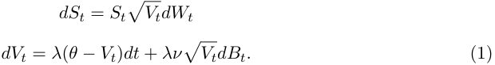

Here the parameters _λ_ , _θ_ , _V_ 0 and _ν_ are positive, and _W_ and _B_ are two Brownian motions with correlation coefficient _ρ_ , that is _⟨dWt, dBt⟩_ = _ρdt_ . 

The popularity of this model is probably due to three main reasons: 

- It reproduces well several important stylized facts of low frequency price data, namely leverage effect, time-varying volatility and fat tails, see [7, 9, 13, 35].

<!-- page: 2 -->

- It generates very reasonable shapes and dynamics for the implied volatility surface. Indeed, the “volatility of volatility” parameter _ν_ enables us to control the smile, the correlation parameter _ρ_ to deal with the skew, and the initial volatility _V_ 0 to fix the at-the-money volatility level, see [15, 17, 30, 38]. Furthermore, as observed in markets and in contrast to local volatility models, in Heston model, the volatility smile moves in the same direction as the underlying and the forward smile does not flatten with time, see [17, 26, 27, 37]. 

- There is an explicit formula for the characteristic function of the asset log-price, see [23]. From this formula, efficient numerical methods have been developed, allowing for instantaneous model calibration and pricing of derivatives, see [1, 8, 31, 32]. 

In the classical Heston model, the volatility follows a Brownian semi-martingale. However, it is shown in [18] that for a very wide range of assets, historical volatility time-series exhibit a behavior which is much rougher than that of a Brownian motion. More precisely, dynamics of log-volatility are very well modeled by a fractional Brownian motion with Hurst parameter of order 0 _._ 1. Furthermore, using a fractional Brownian motion with small Hurst index also enables us to reproduce very accurately the features of the volatility surface, see [5, 18]. Finally, convincing microstructural foundations for rough volatility models are provided in [14, 28], see also Section 2. 

Hence, in this paper, we are interested in the fractional versions of Heston model. Our main goal is to design an efficient pricing methodology for such models, in the spirit of the one introduced by Heston in the classical case. This is particularly important in fractional volatility models where the use of Monte-Carlo methods can be quite intricate due to the non-Markovian nature of the fractional Brownian motion, see [6]. 

We now define our so-called rough Heston model. Let us recall that a fractional Brownian motion _W__H_ with Hurst parameter _H ∈_ (0 _,_ 1) can be built through the Mandelbrot-van Ness representation: 

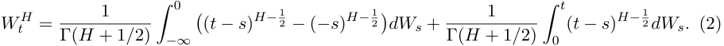

The kernel ( _t − s_ )_H−_ 2<u>1</u> in (2) plays a central role in the rough dynamic of the fractional Brownian motion for _H <_ 1 _/_ 2. In particular, one can show that the process 

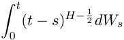

has H¨older regularity _H − ε_ for any _ε >_ 0. In order to allow for a rough behavior of the volatility in a Heston-type model, we naturally introduce the kernel ( _t − s_ )_α−_1 in a Hestonlike stochastic volatility process as follows: 

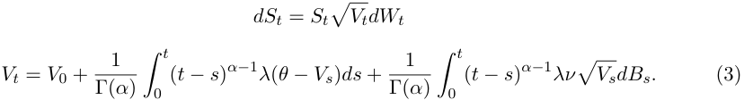

<!-- page: 3 -->

The parameters _λ_ , _θ_ , _V_ 0 and _ν_ in (3) are positive and play the same role as in (1), and here also _W_ and _B_ are two Brownian motions with correlation _ρ_ . The additional parameter _α_ belongs to (1 _/_ 2 _,_ 1) and governs the smoothness of the volatility sample paths. More precisely, we show in this paper that the model is well-defined and that the volatility trajectories have almost surely H¨older regularity _α −_ 1 _/_ 2 _− ε_ , for any _ε >_ 0. When _α_ = 1, Models (3) and (1) coincide, and we retrieve the classical Heston model. Therefore it is natural to view (3) as a rough version of Heston model and to call it rough Heston model. Nevertheless, note that other definitions of rough Heston models can make sense, see [19] for an alternative definition and some asymptotic results. 

Our aim in this work is to derive a Heston-type formula for the characteristic function of the log-price in Model (3). In the classical case ( _α_ = 1, Model (1)), this formula is proved in [23]. It is obtained using the fact that Model (1) is Markovian and time-homogeneous, and applying Itˆo’s formula to the function 

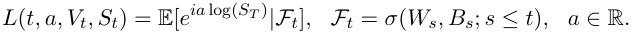

The process _L_ being a martingale, the following Feynman-Kac partial differential equation for _L_ is easily obtained: 

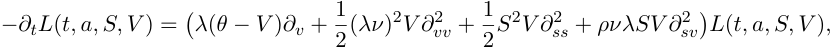

with boundary condition _L_ ( _T, a, S, V_ ) = _e__ia_log(_S_) . From this PDE, it can be checked that the characteristic function of the log-price _Xt_ = log( _St/S_ 0) satisfies 

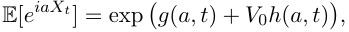

where _h_ is solution of the following Riccati equation: 

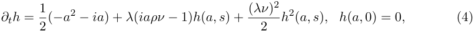

and 

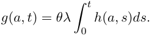

Solving this Riccati equation leads to the closed-form formula for the characteristic function of the log-price given in [23]. 

In the case _α <_ 1, the rough Heston model (3) is neither Markovian nor a semi-martingale. Hence the strategy initially used by Heston presented above seems very hard to adapt to our setting. Here we resort to a completely different and original approach based on point processes. Indeed, our methodology finds its root in the works [14, 28] which provide microstructural foundations to rough volatility models. In these papers, it is shown that some well-designed microstructure models, reproducing the stylized facts of modern financial markets at high frequency, give rise in the long run to rough volatility models. These microstructure models that we describe in more details in Section 2 are based on so-called nearly unstable Hawkes processes. In this paper, inspired by these results and using again Hawkes processes, we design a suitable sequence of point processes which converges to Model (3). Exploiting the

<!-- page: 4 -->

specific structure of our point processes, we derive their characteristic function, which leads us in the limit to that of the log-price in the rough Heston model (3). 

Our main result is that, quite surprisingly, the characteristic function of the log-price in rough Heston models exhibits the same structure as the one obtained in the classical Heston model. The difference is that the Riccati equation (4) is replaced by a fractional Riccati equation, where a fractional derivative appears instead of a classical derivative. More precisely, we obtain 

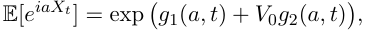

where 

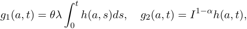

and _h_ is a solution of the following fractional Riccati equation: 

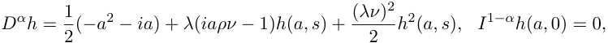

with _D__α_ and _I_1_−α_ the fractional derivative and integral operators defined in (21) and (22). Remark that when _α_ = 1, this result indeed coincides with the classical Heston’s result. However, note that for _α <_ 1, the solutions of such Riccati equations are no longer explicit. Nevertheless, they are easily solved numerically, see Section 5. 

The paper is organized as follows. In Section 2, we build a sequence of Hawkes-type processes which converges to the rough Heston model (3). Then we study in Section 3 the characteristic function of these processes and show in Section 4 that it enables us to derive the characteristic function of the log-price in Model (3). One numerical illustration is given in Section 5 and some proofs are relegated to Section 6. Finally, some useful technical results are given in an appendix. 

## **2 From Hawkes processes to rough Heston models** 

We build in this section a sequence of Hawkes-type processes which converges to the rough Heston model (3). This construction is inspired by the paper [14]. In this work, microstructural foundations for rough Heston models are provided. This is done designing suitable sequences of ultra high frequency price models which reproduce the stylized facts of modern markets microstructure and converge in the long run to rough Heston models. These microscopic price models are based on Hawkes processes. So that the reader can well understand the genesis of our original methodology to compute the characteristic function in rough Heston models, we recall here the main ideas and results in [14]. 

### **2.1 Microstructural foundations for rough Heston models** 

In [14], we consider a sequence of bi-dimensional Hawkes processes ( _N__T,_+ _, N__T,−_ ) indexed by _T >_ 0 going to infinity1 and with intensity 

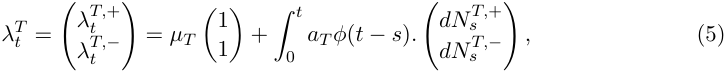

> 1Of course by _T_ we implicitly mean _Tn_ with _n ∈_ N tending to infinity.

<!-- page: 5 -->

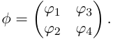

Here the _ϕi_ are measurable non-negative deterministic functions and _µT_ and 0 _< aT <_ 1 are some deterministic sequences of positive real numbers, see [3] and the references therein for more details about the definition of Hawkes processes. Then in [14], inspired by [2, 3, 29], we consider the following ultra high frequency tick-by-tick model for the transaction price _Pt__T_: 

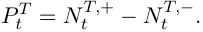

Hence _Nt__T,_+ represents the number of upward jumps of one tick of the transaction price over the period [0 _, t_ ] and _Nt__T,−_ the number of downward jumps. The relevance of this Hawkesbased modeling is that it enables us to encode very easily the most important stylized facts of high frequency markets in term of the parameters of the Hawkes process. We now give these stylized facts and their translation in term of the model parameters, referring to [14] for more details. 

- Markets are highly endogenous: In the high frequency trading context, most orders have no real economic motivation. They are rather sent by algorithms as reaction to other orders. In the Hawkes framework, this amounts to work with so-called _nearly unstable Hawkes processes_ . This means that the stability condition 

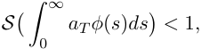

where _S_ denotes the spectral radius operator, should almost be saturated and that the intensity of exogenous orders, namely _µT_ , should be small, see [14, 20, 28, 29]. In term of model parameters, suitable constraints are therefore 

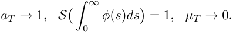

- It is not an easy task to make money with high frequency strategies on highly liquid electronic markets. Hence some “no statistical arbitrage” mechanisms should be in force. We translate this assuming that in the long run, there are on average as many upward than downward jumps. This corresponds to the assumption 

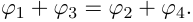

- Buying is not the same action as selling. This means that buy market orders and sell limit orders are not symmetric orders. To see this, consider for example a market maker, with an inventory which is typically positive. He is likely to raise the price by less following a buy order than to lower the price following the same size sell order. Indeed, its inventory becomes smaller after a buy order, which is a good thing for him, whereas it increases after a sell order. This creates a liquidity asymmetry on the bid and ask sides of the order book. This can be modeled in the Hawkes framework assuming that

<!-- page: 6 -->

for some _β >_ 1. Hence, the matrix _φ_ finally takes the form 

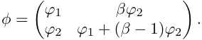

- A significant amount of transactions is part of metaorders, which are large orders whose execution is split in time by trading algorithms. This is translated into a heavy tail assumption on the functions _ϕ_ 1 and _ϕ_ 2, namely that there exists 1 _/_ 2 _< α <_ 1 (typically around 0.6 in practice, see [4, 20]) and _C >_ 0 such that 

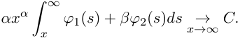

Furthermore, it is shown in [28] that for a given _α_ , there is only one way to make _µT_ tends to zero and _aT_ tends to one so that the limit of the price is not degenerate. More precisely, 

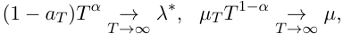

for some positive _λ__∗_ and _µ_ . 

Under the above assumptions, it is proved in [14] that the properly rescaled microscopic price process 

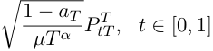

converges in law as _T_ tends to infinity to the following macroscopic price dynamic _Pt_ : 

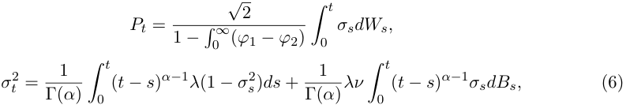

where ( _W, B_ ) is a bi-dimensional correlated Brownian motion with correlation 

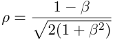

and 

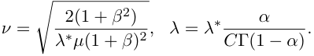

Hence this result shows that the main stylized facts of modern electronic markets naturally give rise to a very rough behavior of the volatility. Indeed, recall that the Hurst parameter corresponds to _α −_ 1 _/_ 2. 

Inspired by this result, our idea is to study the characteristic function of some kind of microscopic price processes in order to deduce that of our rough Heston macroscopic price of interest (3). However, the developments presented above cannot be directly applied and need to be adapted. Indeed, remark that in (6), _σ_ 0 = 0. This does not correspond to the case of (3), where having a non-zero initial volatility is of course crucial for the model to be relevant in practice. Thus we need to modify the sequence of Hawkes-type processes to obtain a non-degenerate initial volatility in the limit. This is actually a non-trivial issue. However, this can be achieved replacing _µT_ in (5) by an inhomogeneous Poisson intensity _µ_ ˆ _T_ ( _t_ ). We explain how such _µ_ ˆ _T_ ( _t_ ) can be found in the next section.

<!-- page: 7 -->

### **2.2 Finding the right Poisson rate** 

We work on a sequence of probability spaces (Ω_T_ _, F__T_ _,_ P_T_ ), indexed by _T >_ 1, on which _N__T_ = ( _N__T,_+ _, N__T,−_ ) is a bi-dimensional Hawkes process with intensity: 

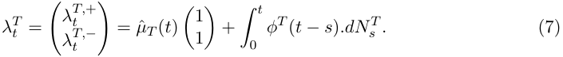

For a given _T_ , the probability space is equipped with the filtration ( _Ft__T_)_t≥_0,where_F_ _t__T_isthe _σ_ -algebra generated by ( _Ns__T_)_s≤t_.Sinceourgoalistodesignasequenceofprocessesleading in the limit to a rough Heston dynamic, we consider the same kind of assumptions on the matrix _φ__T_ as those described in the previous section. However, here we can be very specific since we just need to find one convenient sequence of processes. That is why we make a particular choice for the heavy-tailed functions defining _φ__T_ , using Mittag-Leffler functions, see Section A.1 in Appendix for definition and some properties. Indeed, these functions are very convenient in order to carry out computations. More precisely, our assumptions on _φ__T_ are as follows. 

**Assumption 2.1.** _There exist β ≥_ 0 _,_ 1 _/_ 2 _< α <_ 1 _and λ >_ 0 _such that_ 

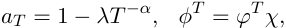

_where_ 

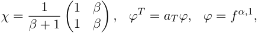

_with f__α,_1 _the Mittag-Leffler density function defined in Appendix._ 

**Remark 2.1.** _As in the previous section, we are working in the nearly unstable heavy tail case since_ 

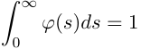

_and_ 

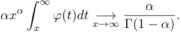

We now give intuitions on how to find a suitable Poisson intensity _µ_ ˆ _T_ ( _t_ ). The developments here are not very rigorous. They just aim at helping the reader to understand how our point processes sequence is designed. First, note that under Assumption 2.1, 

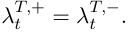

The asymptotic behavior of the renormalized intensity processes _λ__T,_ _t_+ and _λ__T,_ _t__−_ will give us that of the volatility in our limiting macroscopic price model. Thus, we need to understand the long term limit of _λ__T,_ _t_+ . Let us write 

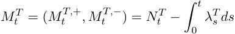

for the martingale associated to the point process _Nt__T_.Weeasilyobtain 

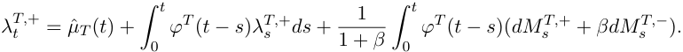

<!-- page: 8 -->

<!-- Start of picture text -->
» i / —/ | e e Se i— — — i! vo / / <!-- End of picture text -->

<!-- page: 9 -->

~~—/~~ | ~~—~~ i ~~—/ —~~ i () / /( ) | ( )v ~~—~~ | ~~—!~~ / ~~— / /~~ // / [| /[ / / ~~—~~ i | ~~—/~~ [| / [ )

<!-- page: 10 -->

<!-- Start of picture text -->
| — | / —( | ) | (i— | J) (— | J) — -f = ( ) , QO I v ) —| /——— | a <!-- End of picture text -->

<!-- page: 11 -->

_where_ 

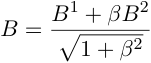

_and_ ( _B_1 _, B_2 ) _is a bi-dimensional Brownian motion. Furthermore, for any ε >_ 0 _, Y has H¨older regularity α −_ 1 _/_ 2 _− ε._ 

Hence Theorem 2.1 shows that designing our sequence of bi-dimensional Hawkes processes in a suitable way, its limit is differentiable and its derivative exhibits a rough Cox-IngersollRoss like behavior, with non-zero initial value. This is exactly what we need for the limiting volatility of our microscopic price processes. Indeed, thanks to Theorem 2.1, we are now able to build such microscopic processes converging to the log-price in (3). More precisely, for _θ >_ 0, let us define 

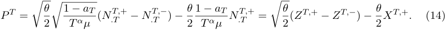

We have the following corollary of Theorem 2.1. 

**Corollary 2.1.** _As T →∞, under Assumptions 2.1 and 2.2, the sequence of processes_ ( _Pt__T_) _t∈_ [0 _,_ 1]_convergesinlawfortheSkorokhodtopologyto_ 

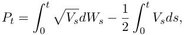

_where V is the unique solution of the rough stochastic differential equation_ 

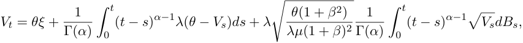

_with_ ( _W, B_ ) _a correlated bi-dimensional Brownian motion whose bracket satisfies_ 

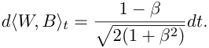

Thus, we have succeeded in building a sequence of microscopic processes _P__T_ , defined by (14), which converges to (the logarithm of) our rough Heston process of interest (3). Now our goal is to use the result of Corollary 2.1 to compute the characteristic function of the log-price in the rough Heston model (3). This is done in the next two sections. 

## **3 The characteristic function of multivariate Hawkes processes** 

We have seen in the previous section that our sequence of Hawkes-based microscopic price processes converges to the log-price in the rough Heston model (3). Therefore, if we are able to compute the characteristic function for the microscopic price, its limit will give us that of the log-price in a rough Heston model. We actually provide a more general result here, deriving the characteristic function of a multivariate Hawkes process (recall that a bidimensional Hawkes process is the building block for our microscopic price process (14)). Hence we extend here some results already proved in [22] in the one-dimensional case.

<!-- page: 12 -->

### **3.1 Cluster-based representation** 

To derive our characteristic function, the representation of Hawkes processes in term of clusters, see [22], is very useful. We recall it now. Let us consider a _d_ -dimensional Hawkes process _N_ = ( _N_1 _, ..., N__d_ ) with intensity 

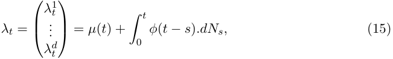

where _µ_ : R+ _→_ R_d_ +islocallyintegrableand_φ_:R+_→M_**d**(R+)hasintegrablecomponents such that 

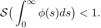

The law of such process can be described through a population approach. Consider that there are _d_ types of individuals and for a given type, an individual can be either a migrant or the descendant of a migrant. Then the dynamic goes as follows from time _t_ = 0: 

- Migrants of type _k ∈{_ 1 _, .., d}_ arrive as a non-homogenous Poisson process with rate _µk_ ( _t_ ). 

- Each migrant of type _k ∈{_ 1 _, .., d}_ gives birth to children of type _j ∈{_ 1 _, .., d}_ following a non-homogenous Poisson process with rate _φj,k_ ( _t_ ). 

- Each child of type _k ∈{_ 1 _, .., d}_ also gives birth to other children of type _j ∈{_ 1 _, .., d}_ following a non-homogenous Poisson process with rate _φj,k_ ( _t_ ). 

Then, for _k ∈{_ 1 _, .., d}_ , _Nt__k_canbetakenasthenumberuptotime_t_ofmigrantsandchildren born with type _k_ . Indeed, the population approach above and the theoretical characterization (15) define the same point process law. 

### **3.2 The result** 

Let _L_ ( _a, t_ ) be the characteristic function of the Hawkes process _N_ : 

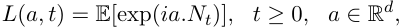

where _a.Nt_ stands for the scalar product of _a_ and _Nt_ . The cluster-based representation of multivariate Hawkes processes enables us to show the following result, proved in Section 3.3, for their characteristic function. 

**Theorem 3.1.** _We have_ 

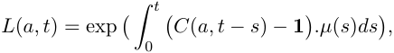

_where C_ : R_d_ _×_ R+ _→_ C_d_ _is solution of the following integral equation:_ 

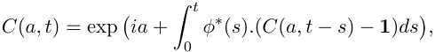

_with φ__∗_ ( _s_ ) _the transpose of φ_ ( _s_ ) _._ 

From Theorem 3.1, we are able to derive in Section 4 the characteristic function of rough Heston models.

<!-- page: 13 -->

### **3.3 Proof of Theorem 3.1** 

We now give the proof of Theorem 3.1, exploiting the population construction presented in Section 3.1. We start by defining _d_ auxiliary independent _d_ -dimensional point processes ( _N_˜_k,j_ )1 _≤j≤d_ , _k ∈{_ 1 _, ..., d}_ , defined as follows for each given _k ∈{_ 1 _, .., d}_ : 

- Migrants of type _j ∈{_ 1 _, ..., d}_ arrive as a non-homogenous Poisson process with rate _φj,k_ ( _t_ ). 

- Each migrant of type _j ∈{_ 1 _, .., d}_ gives birth to children of type _l ∈{_ 1 _, .., d}_ following a non-homogenous Poisson process with rate _φl,j_ ( _t_ ). 

- Each child of type _j ∈{_ 1 _, .., d}_ also gives birth to other children of type _l ∈{_ 1 _, .., d}_ following a non-homogenous Poisson process with rate _φl,j_ ( _t_ ). 

For a given _k ∈{_ 1 _, .., d}_ , _N_˜ _t__k,j_ corresponds to the number, up to time _t_ , of migrants and children with type _j_ . A simple but crucial remark is that ( _N_˜_k,j_ )1 _≤j≤d_ is actually also a multivariate Hawkes process with migrant rate ( _φj,k_ )1 _≤j≤d_ and kernel matrix _φ_ . We write _Lk_ ( _a, t_ ) for its characteristic function 

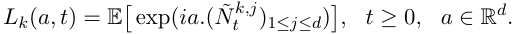

Now let us come back to the initial Hawkes process of interest _N_ defined by (15). For each _k ∈{_ 1 _, ..., d}_ and _t ≥_ 0, let _Nt_0_,k_ be the number of its migrants of type _k_ arrived up to time _t_ . Recall that the _N_0_,k_ , 1 _≤ k ≤ d_ , are independent Poisson processes with rates _µk_ ( _t_ ). We also define _T_ 1_k<...<T_ _N__k_ _t_0_,k_ _∈_ [0 _, t_ ] the arrival times of migrants of type _k_ of the Hawkes process _N_ , up to time _t_ . Using the population approach presented in Section 3.1, it is clear that at time _t_ , the number of descendants of different types of a migrant of type _k_ arrived at time _Tu__k_hasthesamelawas( ˜_N_ _t__k,j_ _−Tu__k_)1_≤j≤d_,where_N_˜istakenindependentfrom_N_.Consequently, 

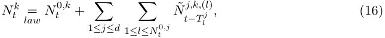

where the ( _N_˜_j,k,_(_l_) )1 _≤k≤d_ , 1 _≤ j ≤ d_ , _l ∈_ N are independent copies of ( _N_˜_j,k_ )1 _≤k≤d_ , 1 _≤ j ≤ d_ , also independent of _N_0 = ( _N_0_,k_ )1 _≤k≤d_ . 

From (16), we derive that conditional on _N_0 , 

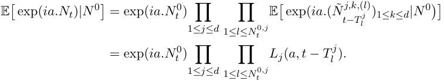

Now, for a given _k ∈{_ 1 _, ..., d}_ , conditional on _Nt_0_,k_ , it is well-known that ( _T_ 1_k, ..., T_ _N__k_ _t_0_,k_ ) has the same law as ( _X_ (1) _, ..., X_ ( _Nt_ 0 _,k_ ))theorderstatisticsbuiltfromiidvariables(_X_1_, .., X_ _Nt_0_,k_ ) with density <u>�</u>_<u>µ</u>_ 0 _t__kµ_<u>(</u>_sk_<u>)(1</u>_ss_)_<u>≤dst</u>_ . Thus we get 

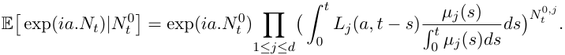

<!-- page: 14 -->

I ¢/ ~~ee~~ 

(> / 

(> | 

ae ) 

) 

( ) 

(| 

) ) 

(| ~~— =~~ ~~<u>\-</u> _~~

<!-- page: 15 -->

» (J ¢ 

) ) 

( ) Cy iz )) ) ) ( Jt ) ) (| ( \ ) ) ~~(—~~ | Joo) ~~C~~ f ( ~~——~~ ) Jt )( )

<!-- page: 16 -->

( ) ~~(~~ ) ~~<u>\-</u> —~~ J ) ~~-~~ ( ) > ( ) » » ee ~~—~~ ( ) ~~<u>\-</u> — —f~~ ( ) ~~<u>\-</u> —_ |~~ ) ~~<u>j-</u> — —/~~ | (| ~~—-——|~~ ) 

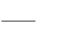

<!-- Start of picture text -->
—/ <!-- End of picture text -->

<!-- page: 17 -->

whenever the integral exists, and the fractional derivative of order _r ∈_ [0 _,_ 1) as 

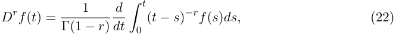

whenever it exists. The following theorem, proved in Section 6, is the main result of the paper. 

**Theorem 4.1.** _Consider the rough Heston model_ (3) _with a correlation between the two Brownian motions ρ satisfying ρ ∈_ ( _−_ 1 _/√_ 2 _,_ 1 _/√_ 2] _. For all t ≥_ 0 _, we have_ 

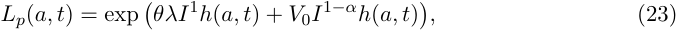

_where h is solution of the fractional Riccati equation_ 

_which admits a unique continuous solution._ 

Thus we have been able to obtain a semi-closed formula for the characteristic function in rough Heston models. This means that pricing of European options becomes an easy task in this model, see Section 5. For _α_ = 1, we retrieve the classical Heston formula. For _α <_ 1, the formula is almost the same. The difference is essentially only in that in the Riccati equation, the classical derivative is replaced by a fractional derivative. The drawback is that such fractional Riccati equations do not have explicit solutions. However, they can be solved numerically almost instantaneously, see Section 5. Finally, note that this strong link between Hawkes processes and (rough) Heston models is probably natural since both of them exhibit some kind of affine structure (although infinite-dimensional). 

## **5 Numerical application** 

### **5.1 Numerical scheme** 

We explain in this section how to compute numerically the characteristic function of the log-price in a rough Heston model. By Theorem 4.1, _Lp_ ( _a, t_ ) is entirely defined through the fractional Riccati equation (24) 

where 

Several schemes for solving numerically (24) can be found in the literature. Most of them are based on the idea that (24) implies the following Volterra equation: 

<!-- page: 18 -->

Then one develops numerical schemes for (25). Here we choose the well-known fractional Adams method investigated in [10, 11, 12]. The idea goes as follows. Let us write _g_ ( _a, t_ ) = _F_ � _a, h_ ( _a, t_ )�. Over a regular discrete time-grid ( _tk_ ) _k∈_ N with mesh ∆( _tk_ = _k_ ∆), we estimate 

by 

where 

This corresponds to a trapezoidal discretization of the fractional integral and leads to the following scheme: 

with 

and 

However, _h_ˆ ( _a, tk_ +1) being on both sides of (26), this scheme is implicit. Thus, in a first step, we compute a pre-estimation of _h_ˆ ( _a, tk_ +1) based on a Riemann sum that we then plug into _h_ ˆ_P_ ( _a, t_ the _k_ +1trapezoidal) is definedquadrature.by This pre-estimation, called predictor and that we denote by 

with 

Therefore, 

where 

Thus, the final explicit numerical scheme is given by 

<!-- page: 19 -->

<!-- Start of picture text -->
06 ——a=06 ——————nv = 1 as $o3= | am|| | az \\ ‘ ‘ ‘y * a. “RE —— See a g a2 a4 06 os 1 12 14 16 15 Fs Maturity <!-- End of picture text -->

<!-- page: 20 -->

| 

~~—/~~ 

| 

fo] (if oi f / / > / > fo ocf ~~oo~~ -| 

(fo)

<!-- page: 21 -->

Moreover, from the definition of _µ_ ˆ and Remark 2.1, we have 

for each component. Each component of _X__T_ and Λ_T_ being increasing, we deduce the tightness of each component of ( _X__T_ _,_ Λ_T_ ). Furthermore, the maximum jump size of _X__T_ and Λ_T_ being 1 _−aT_goestozero,theC-tightnessof(_XT ,_Λ_T_)isobtainedfromProp.VI-3.26in[25]. _T__<u>α</u>_ _µ_which 

**C-tightness of** _Z__T_ It is easy to check that 

which is C-tight. From Theorem VI-4.13 in [25], this gives the tightness of _Z__T_ . The maximum jump size of _Z__T_ vanishing as _T_ goes to infinity, we obtain that _Z__T_ is C-tight. 

**Convergence of** _X__T_ _−_ Λ_T_ We have 

From Doob’s inequality, we get that for each component 

Since [ _M__T_ _, M__T_ ] = _N__T_ , we deduce 

This gives the uniform convergence to zero in probability of _X__T_ _−_ Λ_T_ . 

**Limit of** _Z__T_ Let ( _X, Z_ ) be a limit point of ( _X__T_ _, Z__T_ ). We know that ( _X, Z_ ) is continuous and from Corollary IX-1.19 in [25], _Z_ is a local martingale. Moreover, since 

using Theorem VI-6.26 in [25], we get that [ _Z, Z_ ] is the limit of [ _Z__T_ _, Z__T_ ] and [ _Z, Z_ ] = _diag_ ( _X_ ). By Fatou’s lemma, the expectation of [ _Z, Z_ ] is finite and therefore _Z_ is a martingale.

<!-- page: 22 -->

| f ~~v~~ f ~~v~~ ( ~~J—f~~ <u>ov</u> ~~—~~ | ~~—f |~~ fof | | ~~(—~~ | ) ~~—/~~

<!-- page: 23 -->

<!-- Start of picture text -->
Poy Cf C9) Yt ne / (| ) re! / cf 1 —/| / O e fC) [vo f e To ee ne <!-- End of picture text -->

<!-- page: 24 -->

<!-- Start of picture text -->
Cy [o o po e sre fe | — an vo <!-- End of picture text -->

<!-- page: 25 -->

<!-- Start of picture text -->
) F- F () — | / | fo o—/ —f 0) f o — i! (ff | — <!-- End of picture text -->

)

<!-- page: 26 -->

<!-- Start of picture text -->
([ 1) |l ) (Cf ) ) (fo —  _(¢ ) — [f )] ( tft ) 1) (fo (ft) ) ( fe )tf 1) ( ft )) <!-- End of picture text -->

<!-- page: 27 -->

ee ee ee ee ee 

~~O~~ 

( 

) ~~- —— ——~~ | ( ~~- —— ——~~ | ( 

) ) 

() ~~-(~~ ) 

|) J | (( J ) ))

<!-- page: 28 -->

<!-- Start of picture text -->
ji ) -( ) : /¢ ) d( ) — - ( ) : —— | ( ) — | - ( ) / : ) J - — [i ) ()() () : — —f ) <!-- End of picture text -->

<!-- page: 29 -->

**Convergence of** _θ__T_ For fixed _a_ , we now show that _t → θ__T_ ( _a, t_ ) is a Cauchy sequence in the space of continuous functions _C_ ([0 _,_ 1] _,_ R2 ) equipped with the sup-norm. Let _δ >_ 0 and _T_ 0 _>_ 1 such that for _T > T_ 0 , _∥r__T_ ( _a, t_ ) _∥∞ ≤_ 2_<u>δ</u>_forany_t∈_[0_,_1].Thenfor_T>T_0,_T ′>T_0 and _t ∈_ [0 _,_ 1], 

Since _θ__T_ is uniformly bounded in _t_ and _T_ , we get 

Using Lemma A.3 in Appendix, this enables us to show that _θ__T_ is a Cauchy sequence. Consequently, _θ__T_ ( _a, t_ ) converges uniformly in _t_ to � _c_ ( _a, t_ ) _, d_ ( _a, t_ )�, where ( _c, d_ ) is solution to the following equation: 

**6.2.3 End of the proof of Theorem 4.1 Deriving the characteristic function** Let _a ∈_ R. Recall that from Section 4.1, we have _t L__T_ ( _a_+ _T__, a−_ _T__, tT_) = exp � _T__α_ ( _Y__T,_+ ( _a, t − s_ ) _−_ 1) + _T__α_ ( _Y__T,−_ ( _a, t − s_ ) _−_ 1)�� _T_1_−α_ _µ_ ˆ( _sT_ )� _ds_ �� 0 � 

and furthermore, from Proposition 6.5, 

converges uniformly in _t_ to _c_ ( _a, t_ ) + _d_ ( _a, t_ ). Also, using Remark 2.2, we have 

and therefore _T_1_−α_ _µ_ ˆ( _tT_ ) converges towards 

In addition, using Proposition 6.4, we get that for given _t ∈_ [0 _,_ 1] and for any _s ∈_ [0 _, t_ ] 

�� _T α_ ( _Y T,_ +( _a, t − s_ ) _−_ 1) + _T α_ ( _Y T,−_ ( _a, t − s_ ) _−_ 1)��� _T_1_−α_ _µ_ ˆ( _sT_ )� _≤ c_ ( _a_ )(1 + _s__−α_ ) _._ 

The right hand side of the last inequality is integrable over [0 _, t_ ]. Therefore, using the convergence of _L__T_ ( _a_+ _T__, a−_ _T__, tT_)towards_Lp_(_a, t_)andapplyingthedominatedconvergencetheorem, we obtain 

<!-- page: 30 -->

<!-- Start of picture text -->
) (| — ) — —/ ( TT - 7) _ ——f i ) _ | —— | ; / - fC) (f ( ——) ) J ( - ~( )) (Jf ( —)) [ ¢ —(  ) )- - —( ) <!-- End of picture text -->

<!-- page: 31 -->

**6.2.4 Uniqueness of the solution of** (24) For a given _a ∈_ R, consider two continuous solutions _h_ 1( _a, ._ ) and _h_ 2( _a, ._ ) of (24) or equivalently of (31). We have that _|h_ 1( _a, t_ ) _− h_ 2( _a, t_ ) _|_ is smaller than 

Using the continuity of _h_ 1( _a, ._ ) and _h_ 2( _a, ._ ), this is also smaller than 

Thanks to Lemma A.3, this gives _h_ 1( _a, ._ ) = _h_ 2( _a, ._ ). 

## **Acknowledgments** 

We thank Masaaki Fukasawa, Jim Gatheral and Antoine Jacquier for many interesting discussions and Christa Cuchiero and Josef Teichmann for very relevant comments about the affine nature of the processes considered in this work. 

## **A Appendix** 

We gather in this section some useful technical results. 

### **A.1 Mittag-Leffler functions** 

Let ( _α, β_ ) _∈_ (R_∗_ +)2.TheMittag-Lefflerfunction_Eα,β_isdefinedfor_z∈_Cby 

For ( _α, λ_ ) _∈_ (0 _,_ 1) _×_ R+, we also define 

The function _f__α,λ_ is a density function on R+ called Mittag-Leffler density function. The following properties of _f__α,λ_ and _F__α,λ_ can be found in [21, 34, 36]. We have 

and 

Finally, for _α ∈_ (1 _/_ 2 _,_ 1), _f__α,λ_ is square-integrable and its Laplace transform is given for _z ≥_ 0 by 

<!-- page: 32 -->

### **A.2 Wiener-Hopf equations** 

The following result is used extensively in this work to solve Wiener-Hopf type equations, see for example [3]. 

**Lemma A.1.** _Let g be a measurable locally bounded function from_ R _to_ R_d_ _and φ_ : R+ _→ M_**_d_** (R) _be a matrix-valued function with integrable components such that S_ (�0 _∞__φ_(_s_)_ds_)_<_1_._ _Then there exists a unique locally bounded function f from_ R _to_ R_d_ _solution of_ 

_given by_ 

### **A.3 Fractional differential equations** 

We end this appendix with some useful results about fractional differential equations. The next lemma can be found in [40]. 

**Lemma A.2.** _Let h be a continuous function from_ [0 _,_ 1] _to_ R _, α ∈_ (0 _,_ 1] _and λ ∈_ R _. There is a unique continuous solution to the equation_ 

_given by_ 

We also have the following useful result. 

**Lemma A.3.** _Let h be a non-negative continuous function from_ [0 _,_ 1] _to_ R _such that for any t ∈_ [0 _,_ 1] _,_ 

_for some ε ≥_ 0 _and C ≥_ 0 _. Then for any t ∈_ [0 _,_ 1] _,_ 

_with_ 

_In particular, if ε_ = 0 _then h_ = 0 _._

<!-- page: 33 -->

Proof: 

Let 

and _g_ = _h − f_ . The function _g_ is solution of 

Thus, from Lemma A.2, _g_ is the unique solution of 

Hence using again Lemma A.2, we deduce that 

Therefore, 

Using that _h_ = _f_ + _g_ together with the fact that _Eα,α_ is non-negative, we get the result. 

## **References** 

- [1] H. Albrecher, P. Mayer, W. Schoutens, and J. Tistaert. The little Heston trap. _Wilmott Magazine_ , pages 83–92, January 2007. 

- [2] E. Bacry, S. Delattre, M. Hoffmann, and J.-F. Muzy. Modelling microstructure noise with mutually exciting point processes. _Quantitative Finance_ , 13(1):65–77, 2013. 

- [3] E. Bacry, S. Delattre, M. Hoffmann, and J.-F. Muzy. Some limit theorems for Hawkes processes and application to financial statistics. _Stochastic Processes and their Applications_ , 123(7):2475–2499, 2013. 

- [4] E. Bacry, T. Jaisson, and J.-F. Muzy. Estimation of slowly decreasing Hawkes kernels: Application to high frequency order book modelling. _Quantitative Finance_ , 16(8):1179– 1201, 2016. 

- [5] C. Bayer, P. Friz, and J. Gatheral. Pricing under rough volatility. _Quantitative Finance_ , 16(6):887–904, 2016. 

- [6] M. Bennedsen, A. Lunde, and M. S. Pakkanen. Hybrid scheme for Brownian semistationary processes. _arXiv preprint arXiv:1507.03004_ , 2015. 

- [7] J.-P. Bouchaud and M. Potters. _Theory of financial risk and derivative pricing: from statistical physics to risk management_ . Cambridge university press, 2003. 

- [8] P. Carr and D. Madan. Option valuation using the fast Fourier transform. _Journal of Computational Finance_ , 2(4):61–73, 1999.

<!-- page: 34 -->

- [9] A. A. Christie. The stochastic behavior of common stock variances: Value, leverage and interest rate effects. _Journal of Financial Economics_ , 10(4):407–432, 1982. 

- [10] K. Diethelm, N. J. Ford, and A. D. Freed. A predictor-corrector approach for the numerical solution of fractional differential equations. _Nonlinear Dynamics_ , 29(1-4):3–22, 2002. 

- [11] K. Diethelm, N. J. Ford, and A. D. Freed. Detailed error analysis for a fractional Adams method. _Numerical algorithms_ , 36(1):31–52, 2004. 

- [12] K. Diethelm and A. D. Freed. The fracpece subroutine for the numerical solution of differential equations of fractional order. In _Forschung und Wissenschaftliches Rechnen 1998_ , pages 57–71. Gesellschaft f¨ur Wisseschaftliche Datenverarbeitung Gottingen, Germany, 1999. 

- [13] A. A. Dragulescu and V. M. Yakovenko. Probability distribution of returns in the Heston model with stochastic volatility. _Quantitative finance_ , 2(6):443–453, 2002. 

- [14] O. El Euch, M. Fukasawa, and M. Rosenbaum. The microstructural foundations of leverage effect and rough volatility. _Working paper_ , 2016. 

- [15] M. Forde, A. Jacquier, and R. Lee. The small-time smile and term structure of implied volatility under the Heston model. _SIAM Journal on Financial Mathematics_ , 3(1):690– 708, 2012. 

- [16] M. Fukasawa. Asymptotic analysis for stochastic volatility: Martingale expansion. _Finance and Stochastics_ , 15(4):635–654, 2011. 

- [17] J. Gatheral. _The volatility surface: a practitioner’s guide_ , volume 357. John Wiley & Sons, 2011. 

- [18] J. Gatheral, T. Jaisson, and M. Rosenbaum. Volatility is rough. _Available at SSRN 2509457_ , 2014. 

- [19] H. Guennoun, A. Jacquier, and P. Roome. Asymptotic behaviour of the fractional Heston model. _Available at SSRN 2531468_ , 2014. 

- [20] S. J. Hardiman, N. Bercot, and J.-P. Bouchaud. Critical reflexivity in financial markets: a Hawkes process analysis. _The European Physical Journal B_ , 86(10):1–9, 2013. 

- [21] H. J. Haubold, A. M. Mathai, and R. K. Saxena. Mittag-leffler functions and their applications. _Journal of Applied Mathematics_ , 2011. 

- [22] A. G. Hawkes and D. Oakes. A cluster process representation of a self-exciting process. _Journal of Applied Probability_ , pages 493–503, 1974. 

- [23] S. L. Heston. A closed-form solution for options with stochastic volatility with applications to bond and currency options. _Review of Financial Studies_ , 6(2):327–343, 1993. 

- [24] A. Itkin. Pricing options with VG model using FFT. _arXiv preprint physics/0503137_ , 2005.

<!-- page: 35 -->

- [25] J. Jacod and A. Shiryaev. _Limit theorems for stochastic processes_ , volume 288. Springer Science & Business Media, 2013. 

- [26] A. Jacquier and P. Roome. The small-maturity Heston forward smile. _SIAM Journal on Financial Mathematics_ , 4(1):831–856, 2013. 

- [27] A. Jacquier and P. Roome. Large-maturity regimes of the Heston forward smile. _Stochastic Processes and their Applications_ , 126(4):1087–1123, 2016. 

- [28] T. Jaisson and M. Rosenbaum. Rough fractional diffusions as scaling limits of nearly unstable heavy tailed Hawkes processes. _The Annals of Applied Probability_ , to appear, 2016. 

- [29] T. Jaisson, M. Rosenbaum, et al. Limit theorems for nearly unstable Hawkes processes. _The Annals of Applied Probability_ , 25(2):600–631, 2015. 

- [30] A. Janek, T. Kluge, R. Weron, and U. Wystup. FX smile in the Heston model. In _Statistical Tools for Finance and Insurance_ , pages 133–162. Springer, 2011. 

- [31] C. Kahl and P. J¨ackel. Not-so-complex logarithms in the Heston model. _Wilmott magazine_ , pages 94–103, September 2005. 

- [32] A. L. Lewis. A simple option formula for general jump-diffusion and other exponential l´evy processes. _Available at SSRN 282110_ , 2001. 

- [33] C. Li and C. Tao. On the fractional Adams method. _Computers & Mathematics with Applications_ , 58(8):1573–1588, 2009. 

- [34] F. Mainardi. On some properties of the Mittag-Leffler function. _arXiv preprint arXiv:1305.0161_ . 

- [35] B. B. Mandelbrot. The variation of certain speculative prices. In _Fractals and Scaling in Finance_ , pages 371–418. Springer, 1997. 

- [36] A. M. Mathai and H. J. Haubold. _Special functions for applied scientists_ . Springer, 2008. 

- [37] A. Mazzon and A. Pascucci. The forward smile in local-stochastic volatility models. _Available at SSRN 2560300_ , 2015. 

- [38] S.-H. Poon. The Heston option pricing model. _Unpublished Draft_ , 2009. 

- [39] D. Revuz and M. Yor. _Continuous martingales and Brownian motion_ , volume 293. Springer Science & Business Media, 1999. 

- [40] S. G. Samko, A. A. Kilbas, and O. I. Marichev. _Fractional integrals and derivatives_ , volume 1993. Theory and Applications, Gordon and Breach, Yverdon, 1993. 

- [41] M. Schmelzle. Option pricing formulae using Fourier transform: Theory and application. _Preprint, http://pfadintegral. com_ , 2010.
